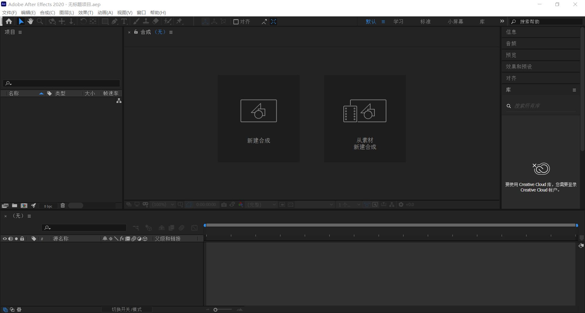

# After Effects

[TOC]

# 一、术语讲解与界面认识

- 术语讲解
- 界面认识

## 1.1、术语讲解

- 学AE前必须要知道的相关术语
- 常见视频格式

### 1.1.1、学AE前必须要知道的相关术语

1. 帧

帧——就是影像动画中**最小单位的单幅影像画面**，相当于电影胶片上的每一格镜头。 一帧就是一幅静止的画面，连续的帧就形成了动画，如电视图象等。 我们通常说[帧数](https://baike.baidu.com/item/帧数/8019296)，简单地说，<u>就是在1秒钟时间里传输的图片的帧数，也可以理解为[图形处理器](https://baike.baidu.com/item/图形处理器/8694767)每秒钟能够刷新几次，通常用[fps](https://baike.baidu.com/item/fps/3227416)（Frames Per Second）表示。每一帧都是静止的图象</u>，快速连续地显示帧便形成了运动的假象。高的帧率可以得到更流畅、更逼真的动画。每秒钟帧数 (fps) 愈多，所显示的动作就会愈流畅。

2. 关键帧

关键帧——相当于二维动画中的原画。指角色或者物体运动变化中关键动作所处的那一帧。关键帧与关键帧之间的动画可以由软件创建添加，叫做[过渡帧](https://baike.baidu.com/item/过渡帧/7382013)或者中间帧。 帧——即动画中最小单位的单幅影像画面，相当于电影胶片上的每一格镜头，在动画软件的时间轴上，帧表现为一格或者一个标记。

3. FPS(Frame Per Second: 帧数率)

`FPS`是图像领域中的定义，是指画面每秒传输帧率。通俗来讲就是指动画或视频的画面数量。FPS是测量用于保存、显示动态视频的信息数量。每秒钟帧数越多，所显示的动作就会越流畅、通常，要避免动作不流畅的FPS最低要求是30。某些计算机视频格式，每秒只能提供15帧

1分钟 = 60秒

1秒 = 15帧 / 23.97帧 / 24帧 / 25帧 / 29.97帧 / 30帧

4. 视频格式

视频格式是视频播放软件为了能够播放视频文件而赋予视频文件的一种识别符号。

视频格式可以分为适合本地播放的本地影像视频和适合在网络中播放的网络流媒体影像视频两大类。尽管后者在播放的稳定性和播放画面质量上可能没有前者优秀，但网络流媒体影像视频的广泛传播使之正被广泛应用于==视频点播==、==网络演示==、==远程教育==、==网络视频广告==等等互联网信息服务领域

流媒体简单来说就是可以在网页向观看者**直接将视频进行播放**的一种媒体格式 

5. 比特率（码率）

比特率是指每秒传送的比特（bit）数，单位为 bps（Bit Per Second）。比特率越高，传送速率越快。声音中的比特率是指将模拟声音转换为数字信号后，单位时间内的二进制数据量，是间接衡量音频质量的一个指标。视频中的比特率（码率）原理与声音中的相同，都是指由模拟信号转换为数字信号后，单位时间内的二进制数据量

6. 格式转换

视频格式转换是指通过一些软件，将视频的格式互联转化，使其达到用户的需求。常用的视频格式有（Video）、流媒体格式（Stream Video）。每一种格式的文件需要有对应的播放器。MOV格式文件用QuickTime播放，RM格式的文件用RealPlayer播放。若只出现装有RealPlayer播放器，所有的却是一个MOV格式文件，为了播放，需要对文件进行格式转换

### 1.1.2、常见视频格式

**MP4（MPEG / MPG / DAT）**

MP4是一套用于音频、视频信息的压缩编码标准，由国际标准化组织（ISO）和国际电工委员会（IEC）下属的 “动态图像专家组”（`Moving Picture Experts Group`，即MPEG）制定，第一版在1998年10月通过，第二版在1999年12月通过。MPEG-4的格式主要用途在于网上流、光盘、语音发送（视频电话），以及电视广播。

**AVI**

AVI是音频视频交错（`Audio Video Interleaved`）的英文缩写。AVI这个格式是由微软公司发表的视频格式，在视频领域可以说是最悠久的格式之一。AVI格式调用方便，图像质量好，压缩标准可任意选择，是应用最广泛，也是应用时间最长的格式之一。

**MOV**（和AE很搭配）

使用过Mac机的朋友应该多少都接触过QuickTime。QuickTime原本是Apple公司用于Mac计算机上的一种图像视频处理软件。QuickTime提供了两种标准图像和数字视频格式，即可以支持静态的.PIC和.JPG图像格式，也可以动态地基于Indeo压缩法的.MOV和MPEG压缩法的.MPG视频格式

**WMV**

一种独立于编码方式的在Internet上实施传播多媒体的技术标准，Microsoft公司用其取代QuickTime之类的技术标准以及WMV、AVI之类的文件扩展名。WMV的主要优势在于：可扩充的媒体类型、本地或网络回放、可伸缩的媒体类型、流的优先级化、多语言支持和扩展性等

**MKV**

一种名为MKV的视频文件频频出现在网络上，它可以在一个文件中集成多条不同类型的音轨和字幕轨，而且其视频编码的自由度也很大，可以是常见的DivX、XviD、3IVX，甚至可以是RealVideo、QuickTime、WMV这类流式视频

**FIV**（网络直播一般是FIV格式）

FIV是FLASH VIDEO的简称，FIV流媒体格式是一种新的视频格式。由于它形成的文件极小，加载速度极快，使得网络观看视频文件成为可能，它的出现有效地解决了视频文件导入Flash后，使导出的SWF文件体积过于庞大，不能在网络上很好的使用等缺点

**F4V**

作为一种更小更清晰、更利于在网络传播时代的格式，F4V已经逐渐取代了传统的FIV，也已经被绝大多数主流播放器兼容，而不需要通过转换等复杂的操作。F4V是Adobe公司迎接高清时代而继FIV格式后推出的支持H.264的F4V流媒体格式

**RMVB**

RMVB的前身为RM格式，它们是Real Networks公司所制定的音频视频压缩规范，根据不同的网络传输数率，而制定出不同的压缩比率，从而实现在低速率的网络上进行影像数据实时传送和播放，具有体积小、画质也还不错的优点

> Notes
>
> 常用格式转换软件：==格式工厂==、魔影工厂、会声会影等

## 1.2、界面认识

- 软件界面
- 菜单栏

### 1.2.1、软件界面

> After Effects的界面

AE软件有很多窗口，这些窗口大部分是为了方便我们而设计的

> Notes
>
> Ctrl + I：打开文件夹面板，导入素材文件
>
> Ctrl + K：打开合成设置面板，修改合成素材信息

# 二、AE项目工作流程讲解及项目与合成设置

- AE项目工具流讲解
- 项目与合成设置

