# Java语言入门

> Java基础的天花板教程

[TOC]


# 一、走进计算机的世界

- Java入门
- 命令行CMD


## 1.1、Java入门

- Java是什么
- JDK的安装和配置
- Hello,world
- 编辑器的使用
- Java版本
- JAVA语言能做什么


### 1.1.1、Java是什么

**Java是一门[面向对象](https://baike.baidu.com/item/面向对象)的编程语言，不仅吸收了[C++](https://baike.baidu.com/item/C%2B%2B)语言的各种优点，还摒弃了C++里难以理解的多继承、[指针](https://baike.baidu.com/item/指针/2878304)等概念，因此Java语言具有功能强大和简单易用两个特征。**Java语言作为静态面向对象编程语言的代表，极好地实现了面向对象理论，允许程序员以优雅的思维方式进行复杂的编程。

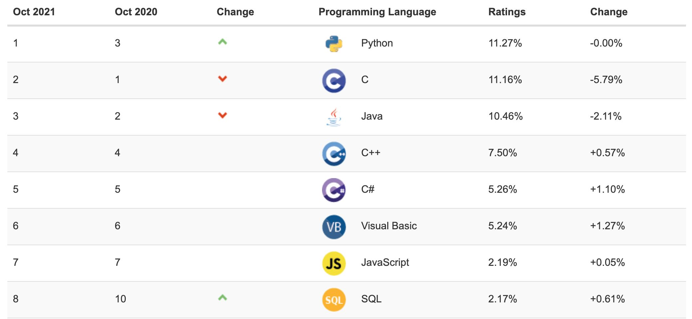


Java具有简单性、面向对象、[分布式](https://baike.baidu.com/item/分布式/19276232)、[健壮性](https://baike.baidu.com/item/健壮性/4430133)、[安全性](https://baike.baidu.com/item/安全性/7664678)、平台独立与可移植性、[多线程](https://baike.baidu.com/item/多线程/1190404)、动态性等特点 。Java可以编写[桌面应用程序](https://baike.baidu.com/item/桌面应用程序/2331979)、Web应用程序、[分布式系统](https://baike.baidu.com/item/分布式系统/4905336)和[嵌入式系统](https://baike.baidu.com/item/嵌入式系统/186978)应用程序等。


### 1.1.2、JDK的安装和配置

> 前言

在入门Java前我们需要先下载JDK，这是一整套用于Java开发的官方工具包，我们可以用它来开发Java语言。如果没有JDK，我们无法运行和开发Java。


JDK官网：http://www.oracle.com

下载和自己系统配置相对应的对应的Java版本，最好不要下载最新版本的JDK，下载完成后直接傻瓜式安装即可，注意，安装路径不要有中文或者空格


> Java的安装目录

- bin：该路径下存放了各种工具命令，其中最重要的有`javac`和`java`命令
- conf：该路径下存放了Java相关的配置文件
- include：该路径下存放了一些特定平台的头文件
- jmods：该路径下存放了各种模块


> 环境变量配置

开发Java程序，需要使用JDK提供的开发工具（比如javac.exe、java.exe等命令），而这些工具在JDK的安装目录的bin目录下，如果不配置环境变量，那么这些命令只可以在bin目录下使用，而我们如果想要在任意目录下都能使用，那就需要配置环境变量。

注意：现在最新从官网上下载的JDK安装时会自动配置javac、java命令的路径到Path环境变量中去 ，所以javac、java可以直接使用。


以前下载的老版本的JDK是没有自动配置的，而且自动配置的也只包含了4个工具而已，所以我们需要删掉已经配置完毕的，再次重新配置Path环境变量。

新建（如果没有的话）


> 环境配置

①**JAVA_HOME**：新增系统变量（或者用户变量也可）配置JDK的安装地址，其他开发软件可能也会用到这个环境变量

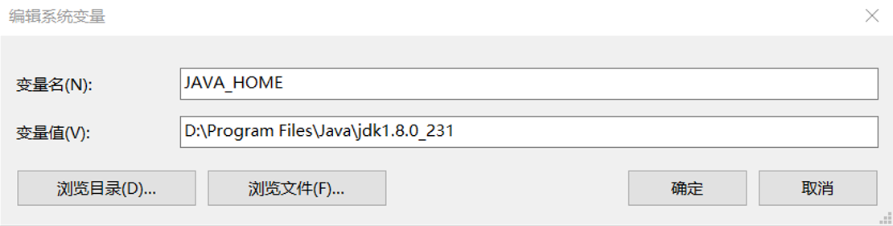


②**CLASSPATH**：外部类文件路径（可以不配），多个值以分号分割

`.;%JAVA_HOME%\lib\dt.jar;%JAVA_HOME%\lib\tools.jar`

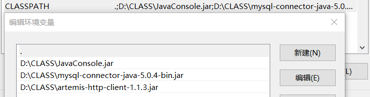


③**Path**：将JDK的bin目录放置到path（没有则新建）环境变量下，多个值以分号分割

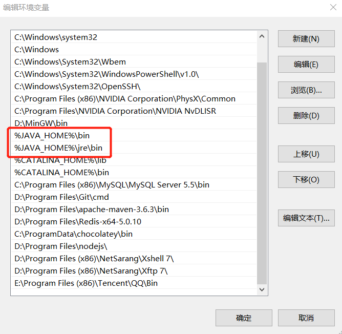


### 1.1.3、Hello,world

>我的第一个Java程序

````java
public class Hello {
	public static void main(String[] args) {
		// 我的第一个程序hello,world!
		System.out.println("Hello,world!");
	}
}
// javac Hello.java 编译Hello.java文件
// java Hello 运行Hello
````

<u>javac是JDK提供的编译工具，通过这个工具我们可以把.java文件编译为.class字节码文件。而java命令则是用于运行.class文件的工具，在运行时不用加后缀名</u>


> 常见问题
>
> 1、非法字符问题：Java中的符号都是英文格式的。
>
> 2、大小写问题：Java语言对大小写敏感（区分大小写）。
>
> 3、后缀名问题：在系统中显示文件的扩展名，避免出现类似于HelloWorld.java.txt的文件。
>
> 4、编译问题：编译命令后的java文件名需要带.java的文件后缀名
>
> 5、编译问题：运行命令后的class文件名（类名）不带.class文件的后缀名


### 1.1.4、编辑器的使用

> 前言

很多时候我们写代码其实在记事本上面是不太方便的，如果有错误不能快速定位行号，而且针对关键字没有特定颜色显示，整体的可阅读性很差，其次也可能会提高出错的概率，所以使用编辑器就有显而易见的好处了，便于显示、快速定位错误，以及其他优秀特性等等。


关于编辑器我推荐EditPlus、NotePad++、Sublime

>EditPlus

官网：https://www.editplus.com/ ，下载最新版，然后直接安装即可

这款软件本身是收费的，但是可以通过百度搜索获取激活码，然后激活使用

EditPlus不能直接运行Java或者其他编程语言的代码，但是可以通过User tools来配置调用相关的编译和运行命令，来间接运行代码


### 1.1.5、Java版本

Java语言主要包含Java SE、Java ME、Java EE（早先是J2SE、J2ME、J2EE）这三个版本


> Java SE

Java语言的标准版，用于**桌面应用**（注：用户只要打开程序，程序的界面会让用户在最短的时间内找到他们需要的功能，同时主动带领用户完成他们的工作并得到最好的体验）的开发，是其他两个版本的基础。学习JavaSE可以为JavaEE打下良好的基础

> Java ME

Java语言的袖珍版，用于嵌入式电子设备或者小型移动设备，诺基亚等手机上原来支持的Java游戏，就是使用JavaME开发的

> Java EE

Java语言的企业版本，用于Web方向的==网站==开发，在这个领域，是当之无愧的==NO.1==

浏览器 + 服务器


### 1.1.6、Java语言能做什么

> 应用

- 桌面软件开发：各种税务管理软件、IDEA、Clion、Pycharm
- 企业级应用开发：微服务、Spring Cloud
- 科学计算：MATLAB（用于数学建模）
- 大数据开发：Hadoop
- 游戏开发：我的世界、Minecraft


> 特性

1. 面向对象
2. 跨平台
3. 开源
4. 简单易用
5. 多线程
6. 安全性高


Java语言跨平台的原理

- 操作系统本身其实是不认识Java语言的。
- 但是针对于不同的操作系统，Java提供了不同的虚拟机。.

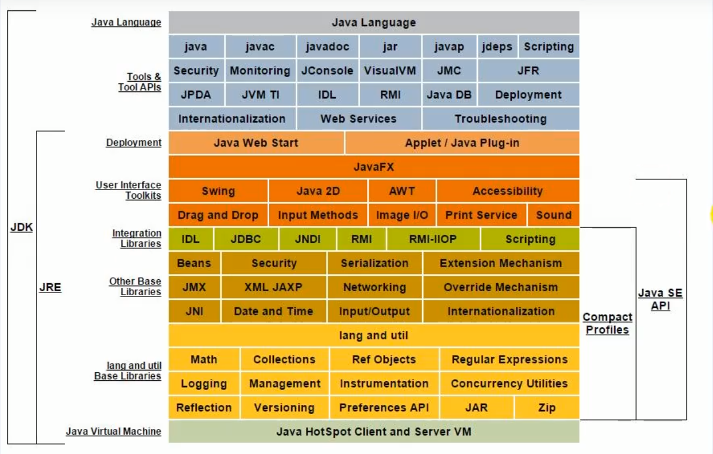

JVM（Java Virtual Machine）Java虚拟机，每一次运行Java程序就启动了一个JVM的实例

JRE（Java Runtime Environment）Java运行环境，包含了JVM和Java的核心类库（Java API），如果只是简单运行Java则只需要JRE即可，但是如果需要开发Javaweb，那就一定要安装JDK了，因为Servlet需要编译

JDK（Java Development Kit）称为Java开发工具，包含了JRE和开发工具


> 总结：
>
> - 我们只需安装JDK即可，它包含了Java的运行环境和虚拟机。


## 1.2、命令行CMD（补充）

- 打开CMD
- 常见命令


### 1.2.1、打开CMD

> 在Windows操作系统下

1. 可以按Win + R 打开运行窗口输入“cmd”来打开命令行窗口，默认位置是用户目录

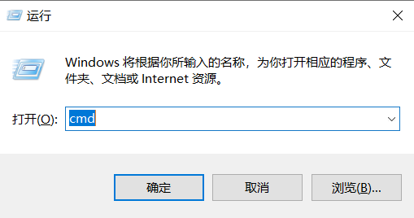

2. 打开此电脑，在任一文件夹路径框中输入cmd也可以直接打开命令行窗口，并且位置会在当前文件夹目录下

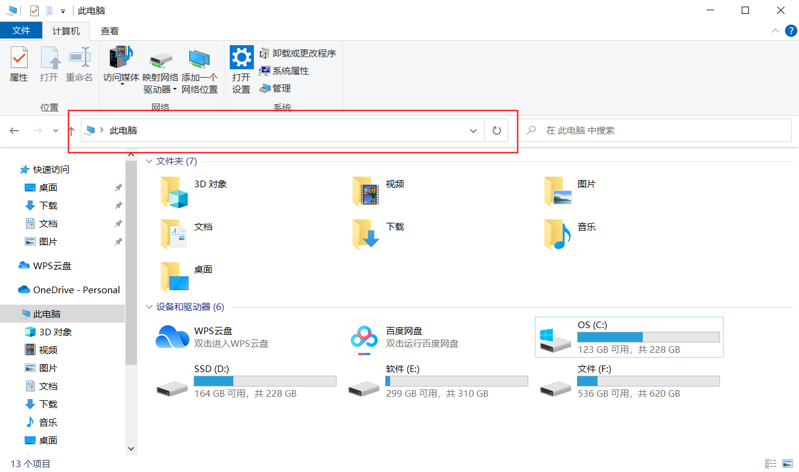


### 1.2.2、常见命令

- ==盘符名称 + 冒号== ：可以切换盘符 例：命令书行输入E: 并回车会切换到E盘

- ==dir== ：查看当前路径下的内容

- ==cd 目录 / .. / 反斜杠== ：进入目录 / 回退上一级目录 / 退回到盘符目录
- ==cls== ：清屏
- ==exit== ：退出命令行窗口


> 配置环境变量

可以把一些程序启动文件路径配置在path环境变量中，方便命令行启动

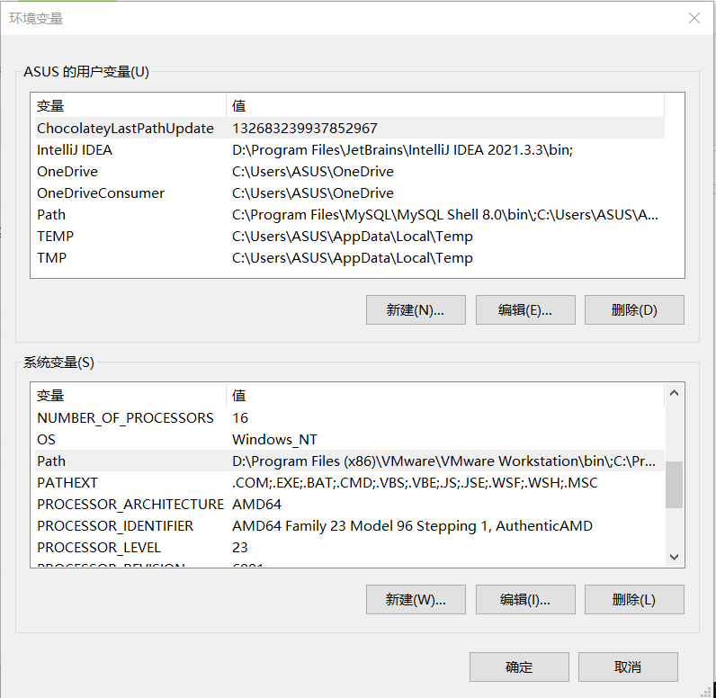


# 二、程序基础概念

- 代码注释
- Java关键字
- 字面量
- 变量
- 计算机的存储规则
- 数据类型


## 2.1、代码的注释

> 定义

在程序指定位置添加的文字或说明性信息就称为代码的注释。代码的注释是对代码逻辑的简要说明，方便程序员修改和维护，高质量的代码一定会有注释，注释提高了代码的可阅读性。代码不能没有注释，就像西方不能失去耶路撒冷一样。


> 注释的类型

| 注释类型 |         示例         |                         作用                         |
| :------: | :------------------: | :--------------------------------------------------: |
| 单行注释 |   // 这是单行注释    |                对某行代码进行解释说明                |
| 多行注释 |  /* 这是多行注释 */  |                对某段代码进行解释说明                |
| 文档注释 | /**  这是文档注释 */ | 主要用于方法或类上面，对方法和类的作用进行详情的说明 |


代码实例：

```java
import java.util.Random;
import java.util.Scanner;
import java.math.BigDecimal;
import java.math.BigInteger;
import static javaconsole.JavaConsole.*;
import java.util.Scanner;
/**
 * 我是文档注释
 * 求N个元素的所有子集。算法：每个子集对应一个N位的二级制整数[0,2 ^ (n - 1)]
 * @author 兰柯万
 */
public class SubSet {

	public static void main(String[] args) {
		// T0D0 Auto-generated method stub
		Scanner in = new Scanner(System.in);
		System.out.print("请输入集合中元素的个数：");
		int n = in.nextInt();	// n = 3 {A,B,C};
        /*
        	我是多行注释
        */
		System.out.print("原来的集合为{");
		for (int i = 0; i < n; i++) {
			System.out.print((char)(i + 'A') + ",");
		}
		if (n != 0) {
			System.out.print("\b");
		}
		System.out.println("}");

		System.out.println("它的所有子集为：");
		for (int i = 0; i < (1 << n); i++) {
			int t = i;
			// 我是单行注释
            // 根据i的每一位如果是1输出该位对应的元素，否则输出空白
			System.out.print("{");
			for (int j = 1; j <= n; j++) {
				if ((t & 1) != 0) {
					System.out.print((char)(j - 1 + 'A') + ", ");
				}
				t >>>= 1;
			}
			
			if (i != 0) {
				System.out.println("\b\b}");
			} else {
				System.out.println("}");
			}
		
		}
		in.close();
	}
}
```


>Notes
>
>- 注释内容不会参与编译和运行，仅仅只是一段对代码的解释说明文字
>- 不管是单行注释还是多行注释，在使用时，都不要嵌套，不然可能会造成编译报错
>- 无代码，不注释


## 2.2、Java的关键字

> 定义

被Java编程语言赋予了特定意义的英文单词就是Java的关键字


> 关键字类型

1. 基本数据类型

byte（输入输出流常用）、short（用不到）、int、long、float（很少用到）、double、char、boolean

2. 访问权限

public、protected、private、static、final

3. 异常体系

try、catch、finally、throw、throws

4. 多线程

synchronized、volatile

5. 循环相关

for、if、else、break、continue、do、while

6. 开关结构

switch、case、default

7. 包

import、package

8. 类相关

class、new、enum、interface、this、super、implements、extends、native、abstract

9. 其他关键字

true、false、null、return、void、instanceof、transient、strictfp、assert

10. 保留关键字（Java为新特性保留的关键字，可能会在未来的Java版本中出现）

goto、const


> Notes
>
> - IDE或者编辑器中针对关键字都会有特殊的颜色标记，非常直观。
>
> - 日常书写代码中不能使用关键字作为变量的名称，如果强行使用会报错


## 2.3、字面量

> 定义

由程序员在代码中直接定义的数字、字符或者字符串就被称为字面量（`literal`）也被称为==直接量==


> 常见的字面量类型

| 字面量类型 |               说明               |            举例             |
| :--------: | :------------------------------: | :-------------------------: |
|  整数类型  |         不带小数点的数字         |          666, -88           |
|  小数类型  |          带小数点的数字          |        13.14, -5.21         |
| 字符串类型 |       用双引号括起来的内容       | “Hello,world”, “你好，世界” |
|  字符类型  | 用单引号括起来的，内容只能有一个 |        ‘A’,‘0’,‘我’         |
|  布尔类型  |  布尔值，只有真(true)假(false)   |  只有两个值：true或者false  |
|   空类型   |              特殊值              |            null             |


> 特殊字符

- \t：制表符。在打印的时候，把前面的字符串的长度补齐到8，或者8的整数倍，最少补一个空格，最多补8个空格
- \n：换行
- \r： 回车


代码实例：

```java
public class SpecialCharater {
	public static void main(String[] args) {
		// 制表符用于对齐
		System.out.println("name" + '\t' + "age");
		System.out.println("tom" + '\t' + "23");
	}
}
```

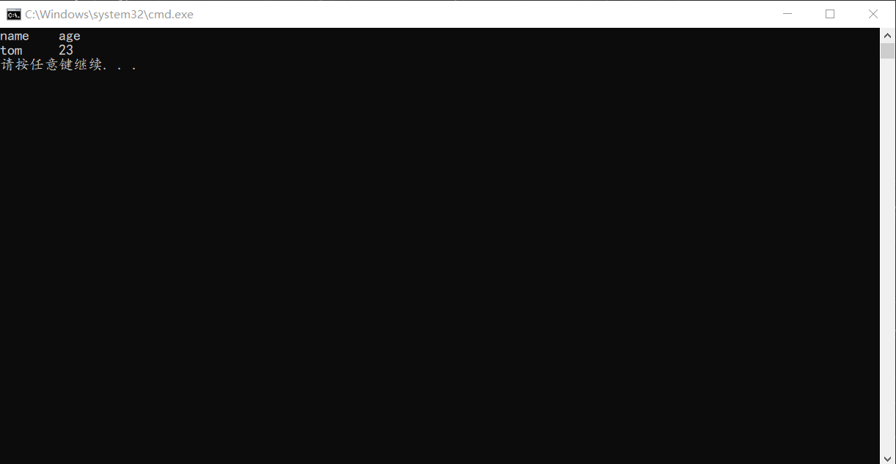


## 2.4、变量

- 什么是变量
- 变量的身份-数据类型

- 变量的姓名-标识符
- 如何从键盘录入值


### 2.4.1、什么是变量

> 定义

**变量在数学中的概念是指值会有变化的量。在Java语言中，解释略有不同，可以存储值（数字、字符、字符串）并且值可以被改变的量（也可理解为存放东西的仓库）就叫变量。**Java中可以通过变量名称修改变量存储的值。


在定义变量前，我们需要定义变量的类型。**众所周知，Java是一种强类型的计算机编程语言，使用变量前必须先定义其对应的数据类型**，定义一个变量一般是这样的：`数据类型 变量名 = 数据值;`

数据类型可以限定其存储的数据是什么样的，如果类型是整数，那么只能存整数的数据。


代码实例：

```java
public class Variable {
	public static void main(String[] args) {
		// 定义变量a，赋值为10并且输出
		int a = 10;
		System.out.println(a);
	}
}
```


> 变量的特性

1. 同一个方法变量的名称不能重复，否则编译时就会报错

```java
public class Variable {
	public static void main(String[] args) {
		// 我的第一个程序hello,world!
		// 定义变量并输出
		int a = 10;
		System.out.println(a);
		int a = 30;
		int c = 20;
		System.out.println(a + b);
	}
}
```

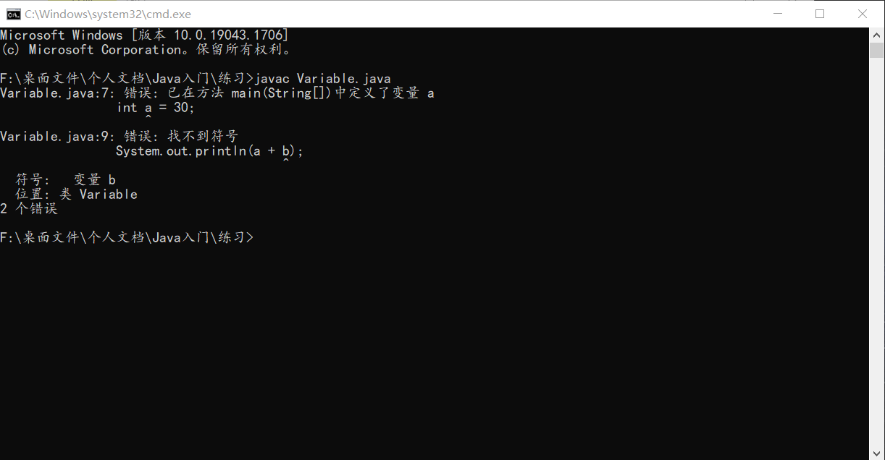

2. 可以在同一条语句中定义多个类型相同的变量

```java
public class Variable {
	public static void main(String[] args) {
		int a = 10, b = 20, c = 30;
		System.out.println("a = " + a);
		System.out.println("b = " + b);
		System.out.println("c = " + c);
	}
}
```


3. 变量在使用前必须要赋值（给变量一个值）

```java
public class Variable {
	public static void main(String[] args) {
		int a;
        // 这样写代码的话，编译时会报“可能尚未初始化变量a”的错误
		System.out.println("a = " + a);
	}
}
```


> Notes：
>
> - JDK10推出了可变数据类型var ，不限定存储的数据是什么样的，但是会降低程序的可读性，而且使用起来也有很多限制，不推荐使用
> - JDK后面也有支持使用中文作为变量名称，但是可能会导致Java程序出现异常，所以不推荐使用
> - 整数字面量过长时中间可以加上下划线，但是下划线不能出现在整数的开头或者结尾
>
> ```java
> int a = 100_200;
> ```


### 2.4.2、变量的身份-数据类型

> 前言

说到数据类型，就不得不提到Java中的基本数据类型，主要有浮点数（float和double）、整数（byte、short、int、long）、字符（char）和布尔类型（boolean）


下面这张表列举了Java的几种基本数据类型和它们的取值范围

| 基本数据类型 |         关键字         |                           取值范围                           | 占用空间（字节） |
| :----------: | :--------------------: | :----------------------------------------------------------: | :--------------: |
|     整数     | byte、short、int、long | -128 ~ 127 / -32768 ~ 32767 /  (-2)^31 ~ 2^31 - 1 / (-2)^64  ~ 2^64 - 1 |  1 / 2 / 4 / 8   |
|    浮点数    |     float、double      | -3.401298E-38 ~ 3.402823E+38 / -4.9000000E-324 ~ 1.797693E+308 |      4 / 8       |
|     字符     |          char          |                          0 ~ 65535                           |        2         |
|   布尔类型   |        boolean         |                        true或者false                         |        1         |


代码实例：

```java
public class DataType {
	public static void main(String[] args) {
		byte b = 10;
		System.out.println("b = " + b);
		short s = 20;
		System.out.println("s = " + s);
		int i = 30;
		System.out.println("i = " + i);
		long l = 40L;
		System.out.println("l = " + l);
		char c = '中';
		System.out.println("c = " + c);
		boolean bool = true;
		System.out.println("bool = " + bool);
	}
}
```

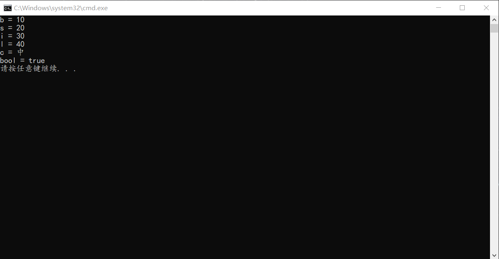


> 练习

1.输出电影信息

需求：将（电影名称，主演，年份，评分）四个信息选择不同类型的变量，随后打印在控制台


```java
public class MovieInformation {
	public static void main(String[] args) {
    	// 定义变量记录电影的名称
        String name = "落叶归根";
        // 定义变量记录主演的姓名
        String toStar = "赵本山、郭德纲、洪启文、宋丹丹、胡军、廖凡、牛马、郭涛、夏雨、孙海英、刘金山";
        // 定义变量记录上映年份
        int year = 2007;
        // 记录变量记录电影的评分
        double grade = 8.3;
		System.out.println("name = " + name);
		System.out.println("toStar = " + toStar);
		System.out.println("year = " + year);
		System.out.println("grade = " + grade);
    }
}
```


2.输出商品信息

需求：选择其中一部手机，将（手机价格，手机品牌）两个信息选择不同类型的变量，随后打印出来


```java
public class PhoneInformation {
	public static void main(String[] args) {
    	// 定义变量记录手机的价格
		double price = 3699.00;
		// 定义变量记录手机的品牌
		String brand = "OPPO";
		// 输出结果
		System.out.println("price = " + price);
		System.out.println("brand = " + brand);
    }
}
```


> Notes：
>
> - long类型的变量在定义时，赋值必须加上l/L(推荐大写)后缀，因为Java语言默认整数字面量为int类型
> - float类型的变量在定义时，赋值必须加上f/F(推荐大写)后缀，因为Java语言默认浮点数字面量为double类型
> - 浮点数的字面量也可以加d/D的后缀，表示字面量的类型是double类型的
> - 代码中的小数的有可能没法精确计算，1.1 + 0.9 ≠ 2.0


### 2.4.3、变量的姓名-标识符

Java的语法规定变量的标识符由英文字母、数字、下划线 、$ 符号组成，但是数字不能在开头，也不能全是数字，标识符区分大小写。


> 阿里巴巴Java开发规范

1. 代码中的命名均不能以下划线或美元符号开始，也不能以下划线或美元符号开始，也不能以下划线或美元符号结束

2. 代码中的命名严禁使用拼音与英文混合的方式，更不允许直接使用中文的方式。正确的英文拼写和语法可以让阅读者易于理解，避免歧义。注意即使纯拼音命名方式也要避免采用

3. 类名使用`UpperCameCase`风格，必须遵从驼峰形式，但以下情形可以例外：DO	/	BO	/	BTO	/	VO	/	AO

4. 方法名称、参数名称、成员变量、局部变量都统一采用`lowerCameCase`风格，必须遵守驼峰形式

5. 常量名称全部大写，单词之间使用下划线隔开，力求语义表达完整清楚，不要嫌名字长

6. 抽象类命名使用Abstract或Base开头，异常类使用Exception结尾，测试类以它要测试的类的名称开始，以Test结尾

7. 中括号是数组类型的一部分

8. POJO类中的布尔类型的变量，都不要加is开头，否则部分框架会引起序列化错误

9. 包名统一使用小写，点分隔符之间有且仅有一个自然语义的英文单词。包名统一使用单数形式，但是类名如果有复数含义，可以使用复数形式


> Notes
>
> 养成良好的编码习惯有助于减少bug的产生


### 2.4.4、如何从键盘录入值

> 简介

之前的练习的代码，所有的变量的值都是固定在代码里面的，那么有没有一种方法可以使我们通过键盘或者其他方式输入，并且输出我们刚才输入的值呢？答案是有的，Java早就在底层帮我们想好了一切。Java里面有一个类叫Scanner（输入扫描仪），这个类就可以接受从键盘或者其他地方输入的值


**如何使用这个类呢？**

这个类不在java.lang包下面，在java.util包下面，所以需要手动导包

```java
import java.util.Scanner;

public class Variable {
	public static void main(String[] args) {
		 // 创建输入扫描仪，System.in表示接受系统输入的值
		 Scanner in = new Scanner(System.in);
		 // 接受数据
		 System.out.println("请输入一个整数：");
		 int i = in.nextInt();
		 // 输出变量的值
		 System.out.println("你输入的整数为 " + i);
	}
}
```


> Notes：
>
> - 这个人太懒了，什么都没有写


## 2.5、集成开发工具-IDEA

- IDEA概述


### 2.5.1、IDEA概述

> 定义

IDEA，全称 IntelliJ IDEA，是 Java 语言的集成开发环境，IDEA 在业界被公认为是最好的 java 开发工具之一，尤其在智能代码助手、代码自动提示、重构、J2EE 支持、Ant、JUnit、CVS 整合、代码审查、创新的 GUI 设计等方面的功能可以说是超常的。


IntelliJ IDEA 在 2015 年的官网上这样介绍自己：

Excel at enterprise, mobile and web development with Java, Scala and Groovy, with all the latest modern technologies and frameworks available out of the box.

简明翻译：IntelliJ IDEA 主要用于支持 Java、Scala、Groovy 等语言的开发工具，同时具备支持目前主流的技术和框架，擅长于企业应用、移动应用和 Web 应用的开发。


IDEA(https://[www.jetbrains.com/idea/)是 ](http://www.jetbrains.com/idea/)是)JetBrains 公司的产品，公司旗下还有其它产品，比如：

- WebStorm：用于开发 JavaScript、HTML5、CSS3 等前端技术；

- PyCharm：用于开发 python

- PhpStorm：用于开发 PHP

- RubyMine：用于开发 Ruby/Rails

- AppCode：用于开发 Objective - C/Swift

- CLion：用于开发 C/C++

- DataGrip：用于开发数据库和 SQL

- Rider：用于开发.NET

- GoLand：用于开发 Go


IDEA也不负众望，到今天市场占有率IDEA已经有70%往上了


### 2.5.2、IDEA安装

官网下载地址：<https://www.jetbrains.com/idea/download/>

IDEA 分为两个版本：旗舰版(Ultimate)和社区版(Community)。

旗舰版收费(限 30 天免费试用)，社区版免费，这和 Eclipse 有很大区别。

|                             强项                             | Ultimate | Community |
| :----------------------------------------------------------: | :------: | :-------: |
|     Java, Kotlin, Groovy, Scala（支持的计算机编程语言）      |   支持   |   支持    |
|            Maven, Gradle, sbt（项目依赖管理工具）            |   支持   |   支持    |
|  Git, GitHub, SVN, Mercurial, Perforce（代码版本控制工具）   |   支持   |   支持    |
|                    Debugger（代码调试器）                    |   支持   |   支持    |
|                 Docker（开源的应用部署容器）                 |   支持   |   支持    |
| [Profiling tools](https://lp.jetbrains.com/intellij-idea-profiler/)（IntelliJ IDEA integrates Async Profiler, Java Flight Recorder, and HPROF memory viewer：IDEA集成了异步性能分析器，Java飞行记录器和HPROF内存监控调优工具） |   支持   |  不支持   |
| [Spring](https://www.jetbrains.com/lp/intellij-frameworks/), Jakarta EE, Java EE, Micronaut, Quarkus, Helidon, and more（开发框架） |   支持   |  不支持   |
|                  HTTP Client（HTTP客户端）                   |   支持   |  不支持   |
| JavaScript, TypeScript, HTML, CSS, Node.js, Angular, React, Vue.js（前端技术） |   支持   |  不支持   |
|              Database Tools, SQL（数据库工具）               |   支持   |  不支持   |
|            Remote Development (Beta)（远程开发）             |   支持   |  不支持   |
|            Collaborative development（协同开发）             |   支持   |  不支持   |


下载完成之后，直接傻瓜式安装即可，不过软件开发工具建议都装在一个盘下或者一个目录下，方便快速定位和查找


> Notes：
>
> - IDEA的项目结构从大到小依次为：project(项目) > module(模块) > package(包裹) > class(类)


### 2.5.3、IDEA配置

> 扩展设置

首先打开IDEA，右上角菜单栏点击File，之后出现的下拉框里点中Settings，然后就会出现设置界面

 

- 修改IDEA的主题，亮眼的主题，可以使人眼前一亮

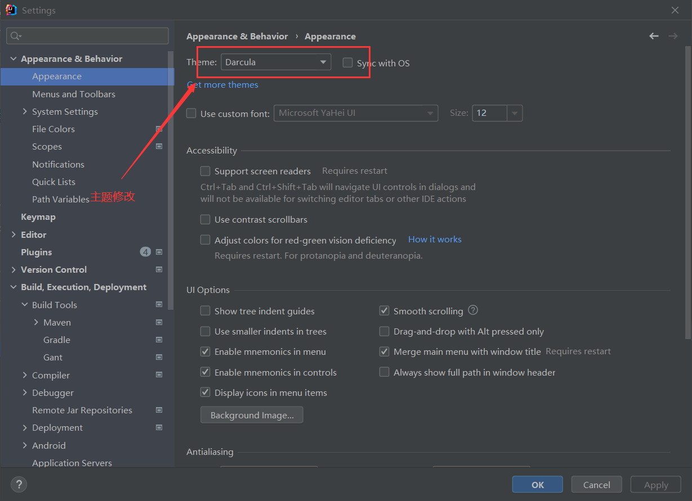

- 修改字体，舒服的字体可以使人心情愉悦

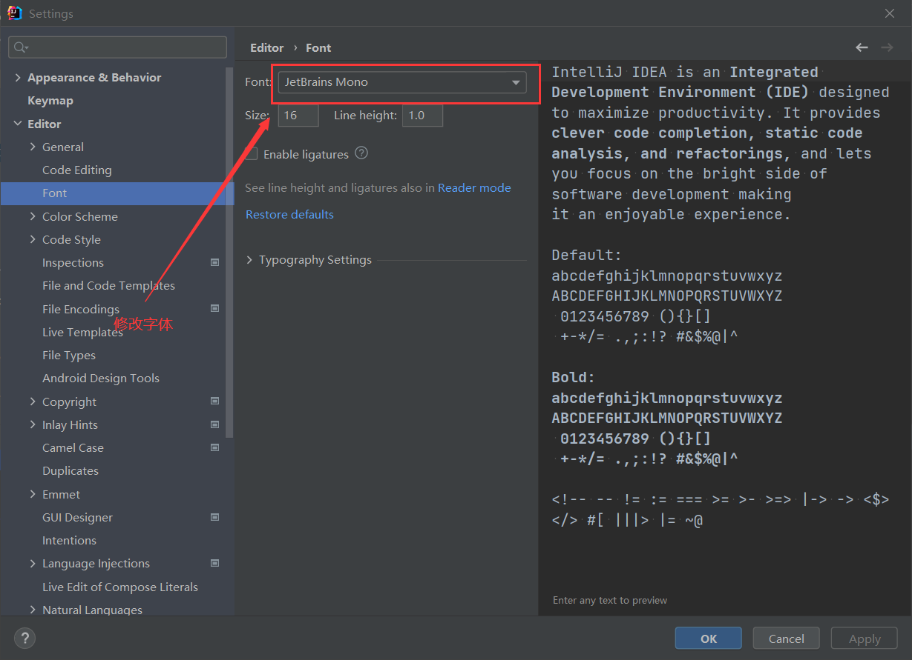

- 修改注释的样式，IDEA默认的单行注释是斜体的，有些人看着可能会不舒服

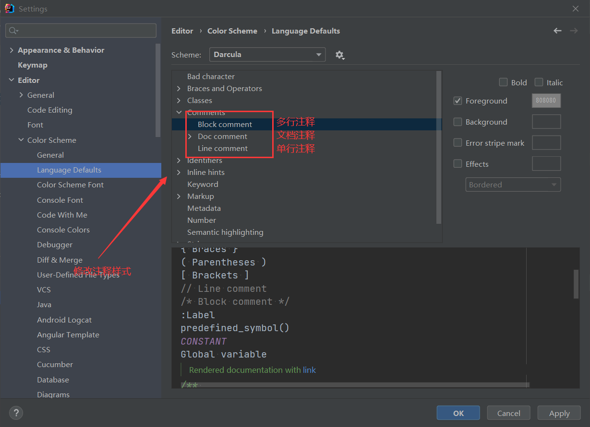

- 开启自动导包，方便撰写代码


- IDEA有自动的代码提示，但是会区分大小写，把这个按钮不勾选上就可以不区分大小写提示了

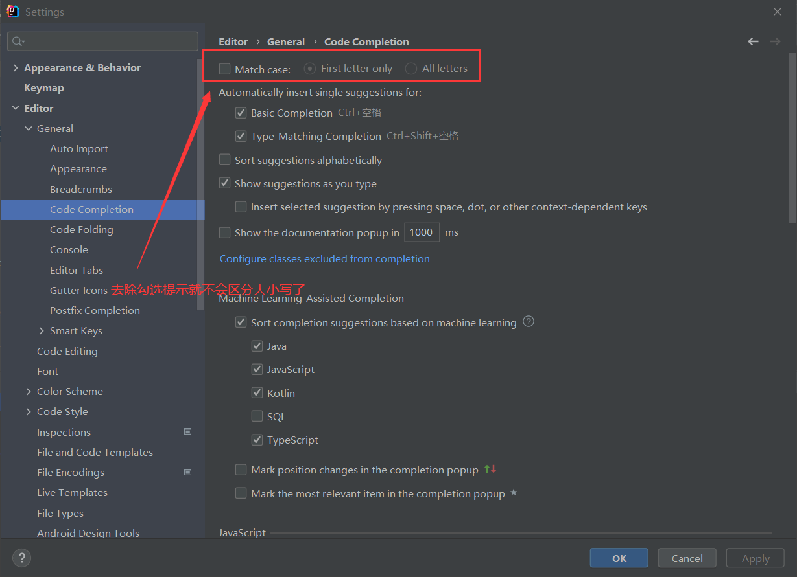

- 设置图片为IDEA的背景

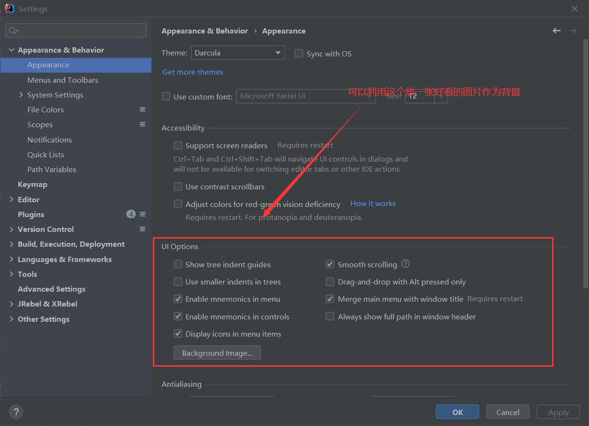


## 2.6、计算机的存储规则（补充）

- 进制
- 任意进制转十进制
- 十进制转任意进制
- ASCII码
- 图片
- 声音


### 2.6.1、进制

在计算机中存储的数据只有三类，Text(文本)、Image(图片)、Sound(声音)，而计算机底层的任意数据则都是以二进制的形式来存储的。说到计算机中的进制，就不得不提到十进制、二进制，八进制和十六进制了，这几种进制是目前计算机行业运用最多、也是流传最广的几种进制


1. 十进制 

0、1、2、3、4、5、6、7、8、9

口诀：==逢十进一，借一当十==

例如： 1 + 1 = 2

2. 二进制

0、1	

口诀：==逢二进一，借一当二==

| 二进制 | 十进制 |
| :----: | :----: |
|  0000  |   0    |
|  0001  |   1    |
|  0010  |   2    |
|  0011  |   3    |
|  0100  |   4    |
|  0101  |   5    |
|  0110  |   6    |
|  0111  |   7    |
|  1000  |   8    |
|  1001  |   9    |
|  1010  |   10   |
|  1011  |   11   |
|  1100  |   12   |
|  1101  |   13   |
|  1110  |   14   |
|  1111  |   15   |

3. 八进制

0、1、2、3、4、5、6、7

口诀：==逢八进一，借一当八==

| 二进制 | 八进制 |
| :----: | :----: |
|  000   |   0    |
|  001   |   1    |
|  010   |   2    |
|  011   |   3    |
|  100   |   4    |
|  101   |   5    |
|  110   |   6    |
|  111   |   7    |

4. 十六进制

0、1、2、3、4、5、6、7、8、9、A、B、C、D、E、F

口诀：==逢十六进一，借一当十六==

| 二进制 | 十六进制 |
| :----: | :------: |
|  0000  |    0     |
|  0001  |    1     |
|  0010  |    2     |
|  0011  |    3     |
|  0100  |    4     |
|  0101  |    5     |
|  0110  |    6     |
|  0111  |    7     |
|  1000  |    8     |
|  1001  |    9     |
|  1010  |    A     |
|  1011  |    B     |
|  1100  |    C     |
|  1101  |    D     |
|  1110  |    E     |
|  1111  |    F     |


在Java中的数字，如果是二进制则以0B / 0b开头，十进制不需要任何前缀（默认），八进制则以0为开头，十六进制则以0X / 0x开头


计算机底层为什么要使用二进制呢？

在电路板中大于3.3V的定为1，小于3.3V定为0


### 2.6.2、任意进制转十进制

> 定义

公式：**系数 * 基数的权次幂 相加**

系数：就是每一位上的数

基数：当前进制数

权：从右往左，依次为0 1 2 3 4 5 …


- 二进制转十进制

101(B) = 1 * 2^2 + 0 * 2^1 + 1 * 2^0 = 4 + 0 + 1 = 5(D)

- 八进制转十进制

101(O) = 1 * 8^2 + 0 * 8^1 + 1 * 8^0 = 64 + 0 + 1 = 65(D)

- 十六进制转十进制

ABC(H) = 10 * 16^2 + 11* 16^1 + 12 * 16^0 = 2560 + 176 +12 = 2748


> 8421快速转换法

|  1   |  1   |  1   |  1   |  1   |  1   |  1   |  1   |
| :--: | :--: | :--: | :--: | :--: | :--: | :--: | :--: |
| 128  |  64  |  32  |  16  |  8   |  4   |  2   |  1   |


例如：二进制1101 = 8 + 4 + 1 = 13


### 2.6.3、十进制转任意进制

除基取余法：不断地除以基数（几机制，基数就是几）得到余数，直到商为0，再将余数倒着拼起来即可

11(D)=?(B)

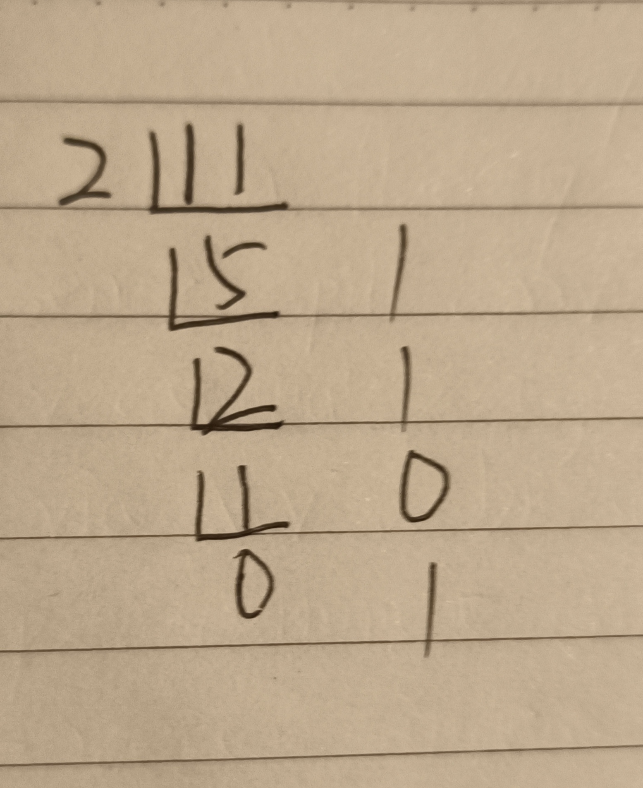

11(D)=?(O)

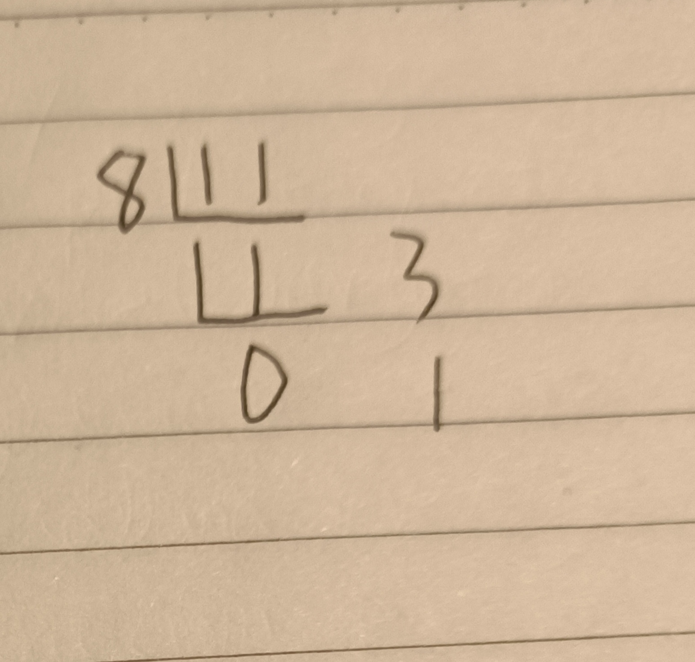

11(D)=?(H)

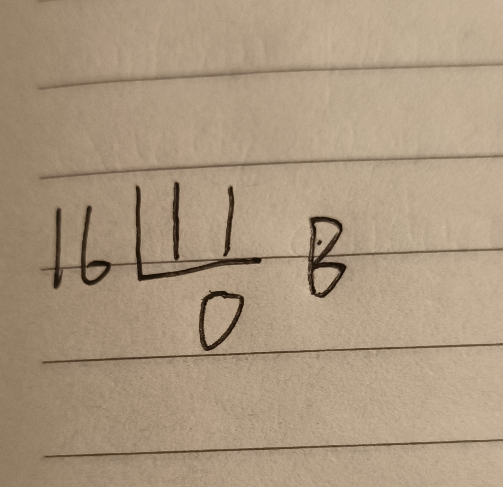


### 2.6.4、ASCII码

计算机存储数据时就是通过ASCII码进行存储的，找到对应数据后转化为二进制存储到计算机中。ASCII码的全称是美国信息交换标准码表（American Standard Code for Information Interchange）

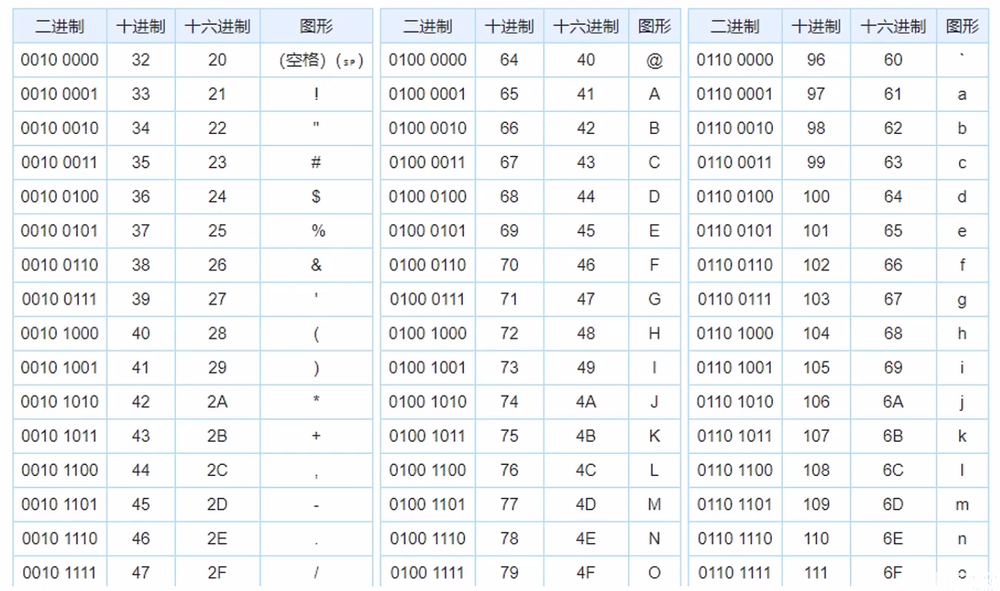


汉字在ASCII码表中并不存在映射，所以我们国家在上个世纪80年代的时候就制定了一个GB2312编码

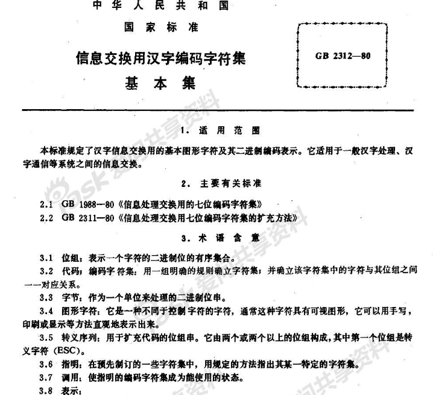

这个编码标准是从1981年5月1日开始发布的简体中文汉字编码国家标准，一共收录了7445个图形字符，包含6763个汉字。

> 其他编码

- BIG5编码：台湾地区繁体中文标准字符集，共收录13053个中文字，1984年实施
- GBK编码：2000年3月17日发布，收录了21003个汉字，包含国家标准GB13000-1中的全部中日韩汉字和BIG5编码中的所有汉字
- Unicode字符集 ：国际标准字符集，它将世界各种语言的每个字符定义一个唯一的编码，每个字符固定两个或三个字节编码，可以很大程度地满足跨平台、跨语言的文本信息转换需求
- UTF-8编码：（8位元，Universal Character  Set/Unicode Transformation  Format）是针对Unicode的一种可变长度字符编码。它可以用来表示Unicode标准中的任何字符，而且其编码中的第一个字节仍与ASCII相容，使得原来处理ASCII字符的软件无须或只进行少部份修改后，便可继续使用。因此，它逐渐成为电子邮件、网页及其他存储或传送文字的应用中，优先采用的编码。


### 2.6.5、图片

说到图片，在计算机中主要有三种类型的图片，黑白图（只有黑白两种颜色的图片）、灰度图（灰度图：Gray Scale Image 或是Grey Scale Image，又称**灰阶图**。

把白色与黑色之间按对数关系分为[若干](https://baike.baidu.com/item/若干/8015015)等级，称为灰度。灰度分为256阶。用灰度表示的图像称作灰度图。除了常见的卫星图像、航空照片外，许多地球物理[观测](https://baike.baidu.com/item/观测/8962478)数据也以灰度表示。）和最常见的彩色图。图片的的存储离不开显示器中的这三个知识点：分辨率，像素、三原色


> 分辨率

通常情况下，图像的[分辨率](https://baike.baidu.com/item/分辨率)越高，所包含的像素就越多，图像就越清晰，印刷的质量也就越好。同时，它也会增加文件占用的[存储空间](https://baike.baidu.com/item/存储空间)。正常来说，一个显示器的分辨率就是像素的数量，比如1920*1080


> 三原色

在彩色图中，其实每个像素点记录了不同的颜色，说到颜色，就不得不提到三原色了，这三种颜色就是红色、黄色、蓝色组成的，一个像素点会由三原色组成，每种颜色比例不同就成了不同的颜色的像素点

|  颜色  |      值（范围0~255）      |
| :----: | :-----------------------: |
|  蓝色  | 红色43，绿色123，蓝色194  |
|  红色  |  红色198，绿色62，蓝色85  |
|  黄色  | 红色294，绿色230，蓝色135 |
| 粉红色 | 红色255，绿色219，蓝色207 |


> Notes：
>
> - 计算机中的颜色采用光学三原色
> - 分别为，红、绿、蓝。也称为RGB
>
> - 值可以为十进制形式（0 ~ 255）或者十六进制形式（0 ~ FF）


### 2.6.6、声音

计算机通过对声音的波形图进行采样来存储声音，在波形图中的每个点都会有对应的数字。对每个声波进行采样，每个采样点都会有数据，通常来说，采样点越多数据也会越多，相对而言该音频文件的音质也会更好。


# 三、程序逻辑控制

- 运算符和表达式


## 3.1、运算符和表达式

- 运算符
- 表达式


### 3.1.1、运算符

> 定义

对字面量或者变量进行操作的符号就是运算符。运算符用于执行程序代码运算，会针对一个以上操作数项目来进行[运算](https://baike.baidu.com/item/运算/5866856)。例如：2+3，其[操作数](https://baike.baidu.com/item/操作数/7658270)是2和3，而运算符则是“+”。

在VB2005中运算符大致可以分为5种类型：[算术运算符](https://baike.baidu.com/item/算术运算符/9324947)、连接运算符、[关系运算符](https://baike.baidu.com/item/关系运算符/352774)、[赋值运算符](https://baike.baidu.com/item/赋值运算符/2482721)和[逻辑运算符](https://baike.baidu.com/item/逻辑运算符/4123505)。


Java的运算符主要有以下几种

|                            运算符                            |      解释      |
| :----------------------------------------------------------: | :------------: |
|   +（加）、-（减）、 *（乘）、 /（除）、 %（求模，取余数）   |   算术运算符   |
|        --variable、variable--、++variable、variable++        | 自增自减运算符 |
|   =、+=、-=、*=、/=、 %=、&=、\|=、^=、~=、<<=、>>=、>>>=    |   赋值运算符   |
| ! expression、expression && expression、expression \|\| expression、variable == variable |   关系运算符   |
|                  expression ? true : false                   |   三元运算符   |
| 位与(&)、按位或(\|）、按位异或(^）、取反(~)、左移(<<)、带符号右移(>>)和无符号右移(>>>) |    位运算符    |


Java加减乘除算术运算和数学上是一样的，不过在浮点数方面会有精度限制（可以使用BigDecimal类来进行精确计算），而且不同数据类型的数据在运算的过程中会发生**类型转换**。


> 类型转换

当运算的时候变量的数据类型不一致，程序就会发生类型转换。

- 隐式类型转换

一般来说，程序自己发起的类型转换称之为**隐式类型转换**（也称为自动类型转换）。这种类型转换都是从小的数据类型转换到大的数据类型，类似byte、short、char这三种数据类型的数据在运算的时候，都会先直接提升为int，然后再进行计算。

- 强制类型转换

还有一种类型转换叫**强制类型转换**，一般是由我们程序员控制运算的数据类型，有时是强制从大的数据类型转成小的数据类型。强制类型转换有可能出现精度损失的风险，换言之，强制类型转换有可能会导致数据会有部分丢失的情况发生


> 字符串的 “+” 操作

说完了计算机中的数字，你可能会想问，Java里面还有字符串和字符，我们程序员能不能对他们进行加减操作，答案是可以的，但是有限制，字符串只能执行 “+” 操作，不能对其进行其他计算，而且这种操作其实本质是将两个字符串拼接在一起形成一个新的字符串。


`“123” + 123`会输出“123123”，而并不是把前后两个数字进行相加。这是因为字符串执行相加操作是将前后两个字符串拼接并产生一个新的字符串。

表达式一般从左至右进行计算，如果表达式里面在字符串有数字相加减并且数字在前面的话，会先对数字进行加减乘除运算然后再进行字符串拼接，如果数字在最后面则不会，但是加上括号也可以让数字执行加减乘除的运算，而不是直接拿数字进行拼接操作

`1 + 99 + “年喜欢你”`会输出“100年喜欢你”


字符的话，可以进行加减乘除，因为在Java底层char类型的变量存储的就是数字，既然是数字那当然可以进行加减乘除。当字符+字符或者是字符+数字时，会把字符通过ASCII码表查询到对应的数字再进行计算 


> 其他运算符

- 自增自减运算符

自增运算符和自减运算符可以放在变量的左边或者右边，如果放在前面就是先加减后赋值，后面就是先赋值再加减，单行自增或自减运算符放在变量前后得到的结果是一致的，没有区别

```java
/**
 * 自增自减运算符练习
 *
 * @author wl
 * @date 2022/7/13 20:42
 */
public class NumberIncreaseAndSubtract {

    public static void main(String[] args) {
        int x = 10;
        // 后++；先用后加
        int y = x++;
        // 先++；先加后用
        int z = ++x;
        System.out.println("x = " + x);
        System.out.println("y = " + y);
        System.out.println("z = " + z);
    }
}
```

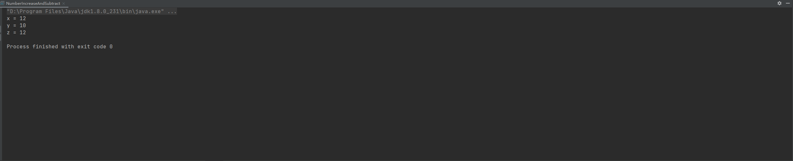


- 赋值运算符

等号是最常见的赋值运算符，等号右边的值会给等号右边的变量。在《C Prime Plus》中它也被称为“现在等于”运算符（你说a现在等于多少，我说a现在等于10）

```java
int a = 10;
```

算术运算符 + 等号也等于一种特殊的赋值运算符，只不过先进行算术运算，再赋值给原变量。相等于

```java
int s = 0;
s += 1; // 等于 s = s + 1
s /= 1; // 等于 s = s / 1;
s *= 1; // 等于 s = s * 1;
s -= 1; // 等于 s = s - 1;
s %= 1; // 等于 s = s % 1;
```

如果运算对象是short、byte、char的话，也不会报错，因为内部会有一个强制类型转换


- 关系运算符

关系运算符的运算和数学上的逻辑运算一致，不过关系运算符的结果都是布尔类型的，只有true或false两种结果，不要把“==”错误地写成“=”。

关系运算符的比较适用于基本数据类型，如果是包装类或者是其他类最好重写并使用对应类的equals()方法。如果将关系运算符应用在非基本数据类型上，可能是在比较两个类的地址。比如比较String


- 三元运算符

格式：关系表达式？表达式1 : 表达式2；

```java
int max = a > b ? a : b;
```

主要是为了简化类似于下面这样的if判断表达式。在这种情况下使用三元表达式可以简化代码并且代码逻辑也会清晰很多

```java
if(a > b) {
	max = a;
} else {
    max = b;
}    
```

三元表达式可以嵌套，但是一般不建议这样做。因为三元表达式本来的目的就是为了简化代码，这样写反而逻辑会混乱，而且也变得不简洁了

```java
int max = a > b ? (a > c ? a : c) : (b > c ? b : c);
```


> Notes：
>
> - 取值范围：byte < short < int < long < float < double
> - 整数操作只能得到小数，要想得到小数，必须有浮点数参与运算


### 3.1.2、表达式

> 定义

在数学概念上，表达式是由数字、算符、数字分组符号（括号）、自由变量和约束变量等以能求得数值的有意义排列方法所得的组合。[约束变量](https://baike.baidu.com/item/约束变量/2841226)在表达式中已被指定数值，而自由变量则可以在表达式之外另行指定数值。

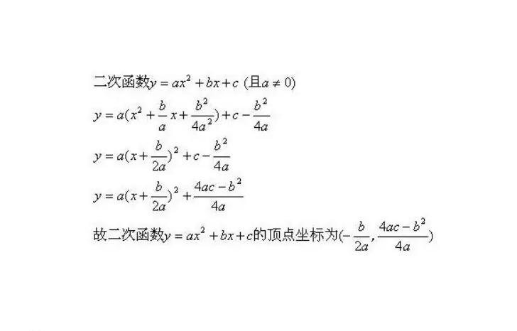


但是在Java中，用运算符把字面量或者变量连接起来，符合Java语法的式子都可以称之为表达式，不同运算符连接的表达式体现的是不同类型的表达式。


**练习：数值拆分**

- 需求

  键盘录入一个三位数，将其拆分为个位、十位、百位后，打印在控制台

```java
import java.util.Scanner;

/**
 * 键盘录入一个三位数，获取其中的个位、十位、百位
 *
 * @author wl
 * @date 2022/7/13 20:42
 */
public class NumberSplit {

    public static void main(String[] args) {
        // 1.键盘录入
        Scanner in = new Scanner(System.in);
        System.out.println("请输入一个三位数");
        int number = in.nextInt();

        // 2.获取个位、十位、百位
        /*
            公式
            个位：数字 % 10
            十位：数字 / 10 % 10
            百位 数字 / 10 /10 % 10
         */
        int ge = number % 10;
        int shi = number / 10 % 10;
        int bai = number / 10 / 10 % 10;
        System.out.println("个位是：" + ge);
        System.out.println("十位是：" + shi);
        System.out.println("百位是：" + bai);
    }
}

```

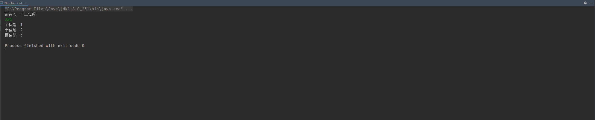


练习：数字6

- 需求

  数字6是一个真正伟大的数字，键盘录入两个整数。如果其中一个为6，最终结果输出true。如果它们的和为6的倍数，最终结果输出true。其他情况都是false

```java
/**
 * 数字6是一个真正伟大的数字，键盘录入两个整数。
 * 如果其中一个为6，最终结果输出true。
 * 如果它们的和为6的倍数，最终结果输出true。
 * 其他情况都是false
 *
 * @author wl
 * @date 2022/7/13 20:42
 */
public class NumberSix {

    public static void main(String[] args) {
        Scanner in = new Scanner(System.in);
        System.out.println("请输入两个整数：");
        int a = in.nextInt();
        int b = in.nextInt();
        System.out.println(a == 6 || b == 6 || (a + b) % 6 == 0);
    }
}

```


## 3.2、原码、反码和补码

- 基础概念
- 理论学习


### 3.2.1、基础概念

> 简介

**一个数在计算机中的表示形式是二进制，这个数其实就叫机器数。**机器数是带符号的，在计算机用一个数的最高位存放符号，正数为0，  负数为1。比如，十进制中的数 +7 ，计算机字长为8位，转换成二进制就是00000111。如果是 -7 ，就是 10000111  。一个存储的二进制码分原码、反码、补码，下面我们就来介绍一下什么是原码、反码、补码。计算机都是用补码存储，在计算的时候，如果是减法，可以把减法看成加法。


**原码：**十进制数据的二进制表现形式，最左边是符号位，0为正，1为负

**反码：**正数的补码反码是其本身，负数的反码是符号位保持不变，其余位取反

==**补码：**正数的补码是其本身，负数的补码等于其反码+1==


> Notes
>
> 一个字节的取值范围是-128~+127


### 3.2.2、理论学习

> 原码

例如：**56 -> 0 0  1 1 1 0 0 0**

左边第一位为符号位，其他位为数据位。

一个byte有8bit，最大值是 **0 1 1 1 1 1 1 1** (+127)，最小值是 **1 1 1 1 1 1 1 1** (-127)

使用原码对正数进行计算不会有任何问题的，但是如果是负数的话，那计算的结果就会大相径庭了

为了解决原码不能计算负数的问题就出现了反码，计算规则是正数的反码不变，负数的反码在原码的基础上，符号位不变，其他位取反。


> 反码

反码的存在是为了正确计算负数，因为源码不能计算负数

| 十进制数字 |   原码    |   反码    |
| :--------: | :-------: | :-------: |
|     +0     | 0000 0000 | 0000 0000 |
|     -0     | 1000 0000 | 1111 1111 |
|     -1     | 1000 0001 | 1111 1110 |
|     -2     | 1000 0010 | 1111 1101 |
|     -3     | 1000 0011 | 1111 1100 |
|     -4     | 1000 0100 | 1111 1011 |
|     -5     | 1000 0101 | 1111 1010 |
|     -6     | 1000 0110 | 1111 1001 |
|     -7     | 1000 0111 | 1000 1000 |

例如：**-56的原码是1011 1000**，如果转成反码（符号位不变，其他位取反），name它的反码就是**1100 0111**，

∵ -56 + 1 = -55

∴ **二进制数+1 之后 -56的源码为 1 1 0 0 1 0 0 0**

解答：55的源码是0011 0111，转换为负数后是1011 0111，再转为反码就是1100 1000

恰好等于刚才计算-56 + 1的反码加1操作


> 补码

但是反码不能解决负数跨零（类似于-6 + 7）的问题，所以出现了补码。

| 十进制数字 |   原码    |   反码    |   补码    |
| :--------: | :-------: | :-------: | :-------: |
|     +0     | 0000 0000 | 0000 0000 | 0000 0000 |
|     -0     | 1000 0000 | 1111 1111 | 0000 0000 |
|     -1     | 1000 0001 | 1111 1110 | 1111 1111 |
|     -2     | 1000 0010 | 1111 1101 | 1111 1110 |
|     -3     | 1000 0011 | 1111 1100 | 1111 1101 |
|     -4     | 1000 0100 | 1111 1011 | 1111 1100 |
|     -5     | 1000 0101 | 1111 1010 | 1111 1011 |
|     -6     | 1000 0110 | 1111 1001 | 1000 0010 |
|     -7     | 1000 0111 | 1000 1000 | 1000 0001 |
|    ...     |    ...    |    ...    |    ...    |
|    -127    | 1111 1111 | 1000 0000 | 1000 0001 |
|    -128    |    无     |    无     | 1000 0000 |

**在计算机当中都是使用补码来进行计算和存储的**。补码很好的解决了反码负数不能跨零计算的弊端，并且补码还可以记录一个特殊的值-128，这个数据在1个字节下是没有原码和反码


学习了原码、反码和补码的知识之后，我们就可以了解到，Java当中所有的基本数据类型。比如整数类型的数据类型，存储的数都是同样的，区别是在于什么地方，假设存储的值都是10

| 基本数据类型 |  值  | 字节数 |                      内存中实际存储的值                      |
| :----------: | :--: | :----: | :----------------------------------------------------------: |
|     byte     |  10  |   1    |                          0000 1010                           |
|    short     |  10  |   2    |                     0000 0000 0000 1010                      |
|     int      |  10  |   4    |           0000 0000 0000 0000 0000 0000 0000 1010            |
|     long     |  10  |   8    | 0000 0000 0000 0000 0000 0000 0000 0000 0000 0000 0000 0000 0000 0000 0000 1010 |

从上表中我们可以得出一个结论，为了凑齐字节数，所占的字节越大，则前面补的零越多。


> 类型转换原理

- 隐式类型转换

```java
public class Test {
	public static void main(String[] args) {
    	// 小的数据类型往大的数据类型进行转换底层就是通过左补零完成的
        byte a = 10; // 0000 1010
        int b = a;	 // 0000 0000 0000 0000 0000 0000 0000 1010
        System.out.println(b);
    }
}
```

- 强制类型转换

```java
public class Test {
	public static void main(String[] args) {
    	int a = 300;	   		// 0000 0000 0000 0000 0000 0001 0010 1100
        byte b = (byte) a; 		// 0010 1100
        System.out.println(b);	// 打印出44
        /*
        	int a = 200;	  		// 0000 0000 0000 0000 0000 0000 1100 1000
        	byte b = (byte)a; 		// 1100 1000
        	System.out.println(b);	// 打印出-56
        */
    }
}
```


补码的运算也适用于逻辑运算符

| 运算符 |    含义    |                           运算规则                           |
| :----: | :--------: | :----------------------------------------------------------: |
|   &    |   逻辑与   |             0为false，1为true，当都为1时才为true             |
|   \|   |   逻辑或   | 0为false，1为true，当有至少一个为1时为true，如果都没有则为false |
|   <<   |    左移    |                      向左移动，低位补零                      |
|   >>   |    右移    |      向右移动，高位补零，符号位按照原来数字的符号位不变      |
|  >>>   | 无符号右移 |                      向右移动，高位补零                      |


## 3.3、流程控制语句

- 顺序结构
- 分支结构
- 循环结构


### 3.3.1、顺序结构

顺序结构就是从上往下依次执行代码，比如，下面这段代码

```java
public class Test {
	public static void main(String[] args) {
    	System.out.println("努力做主人喜欢的事");
        System.out.println("大小姐驾到！通通闪开！");
        System.out.println("Giao桑，故乡的樱花开了哟");
        System.out.println("粗缯大布裹生涯，腹有诗书气自华");
    }
}
```

顺序结构语句是Java程序默认的执行流程，按照代码的先后顺序，从上到下依次执行


### 3.3.2、分支结构

> 前言

分支结构有两种语句，一种是if语句，表示判断，另一种是switch语句，表示选择。


1. if语句

if语句有三种格式，单if语句的，if-else语句的，if-elseif语句的，这三种是if语句的主要使用形式

`if(expression) {...}`

执行流程

- 首先计算关系表达式的值

- 如果关系表达式的值为true就执行大括号内的语句，false则跳过大括号内的语句
- 然后继续执行后面的其他语句

`if(expression) {...} else {...}`

执行流程

- 首先计算关系表达式的值
- 如果关系表达式的值为true就执行语句体1
- 如果关系表达式的值为false就执行语句体2
- 然后继续执行后面的其他语句

`if(expression) {...} else if (expression) {...}`

可以用于多条件判断


注意：

- 大括号的开头可以另起一行书写，但是建议写在第一行末尾
- 在if语句体中，如果执行的语句只有一条，大括号可以省略不写，但是并不建议这么做
- 如果对一个布尔类型的变量进行判断，不需要使用“==”号


2. switch语句

帅不能当饭吃，但是兰州拉面、武汉热干面、北京炸酱面和陕西油泼面可以。


> 格式

```java
switch(expression) {
    case 值1:
        语句体1;
        break;
    case 值2:
        语句体2;
        break;
    case 值3:
        语句体3;
        break;
    case 值4:
        语句体4;
        break;
    ...
    default:
        语句体n+1;
        break;
}
```


注意：

- expression：（$\textcolor{red}{将要匹配的值}$）取值可以是byte、short、int、char这些基本数据类型，boolean、long、float和double则不行，JDK1.5之后增加对枚举的支持，JDK1.7的版本还可以是字符串，底层是通过字符串的hashcode实现的
- case：后面跟的是要和表达式比较的值（$\textcolor{red}{被匹配的值}$）
- break：表示中断，结束的意思，用来结束switch语句执行
- default：表示所有情况都不匹配的时候，就执行该处的内容，和if语句的else相似
- case后面的值只能是字面量，不能是变量
- case给出的值不允许重复


> Notes
>
> - if语句适用于对范围的判断，switch语句适合有限个数据的情况


### 3.3.3、循环结构

Java的循环结构一种有三种：

**for、while、do-while**


> for循环

- 格式

`for(初始化语句; 条件判断语句; 条件控制语句) { 循环体语句;}`

- 示例

```java
// 打印十次Hello,world!
for(int i = 1; i <= 10; i++) {
	System.out.println("Hello,world!");
}
```

- 执行流程

  1. 执行初始化语句

  2. 执行条件判断语句，看其结果是true还是false

     - 如果是false，循环结束

     - 如果是true，执行循环体语句

  3. 执行条件控制语句


注意：

- 初始化语句只执行一次。

- 判断语句为true时则循环继续，反之则循环结束


> 练习

1. 打印1-5和打印5-1

```java
public class PrintingOne2Five {

    public static void main(String[] args) {
        // 打印1-5
        System.out.println("输出1-5");
        for(int i = 1; i <= 5; ++i) {
            System.out.println(i);
        }
        // 打印5-1
        System.out.println("输出5-1");
        for (int i = 5; i >= 1; i--) {
            System.out.println(i);
        }
    }
}
```

2. 在实际开发中，需要重复执行的代码，会选择使用循环实现。

​		比如：玩游戏的时候，如果网不好就会经常断线重连，那么断线重连这个业务逻辑就需要重复执行，假设现在公司要求，断线重连的业务逻辑最多只执行5次，请用代码实现

备注：断线重连的业务逻辑可以用输出语句代替

```java
public class WorkLogic {

    public static void main(String[] args) {
        for (int i = 1; i <= 5; i++) {
            System.out.println("第" + i + "次执行断线重连的业务逻辑");
        }
    }
}
```

3. 求1-5之间的和

```java
public class NumberIncrease {

    public static void main(String[] args) {
        // 求1-5之间的和
        int sum = 0;
        for (int i = 1; i <= 5; i++) {
            sum += i;
        }
        System.out.println("sum = " + sum);
    }
}
```


for循环和while循环的对比

相同点：

- 运行规则都是一样的

不同点

- for循环中，控制循环的变量，因为归属for循环的语句结构中，在for循环结束后，就不能再次访问到了
- while循环中，控制循环的变量，对于while循环来说不归属其语法结构，在while循环结束后，该变量还可以继续使用
- for循环中，知道循环次数或者循环的范围
- while循环中不知道具体的循环次数和范围，只知道循环的结束条件
