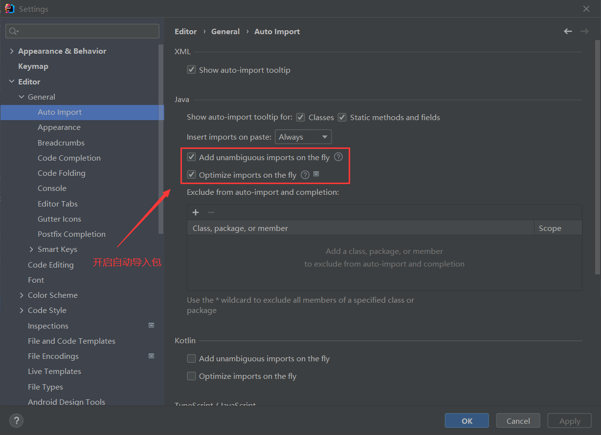
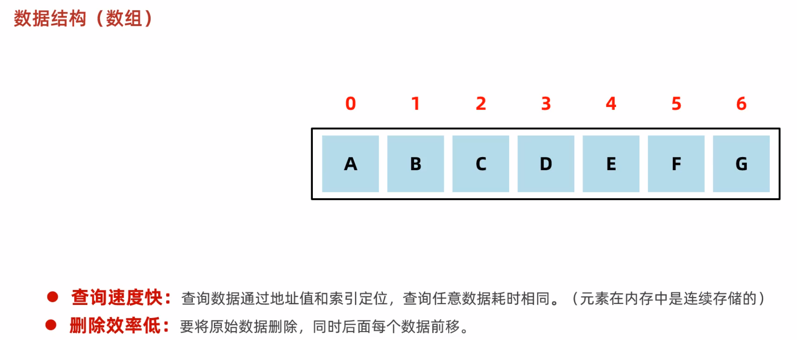
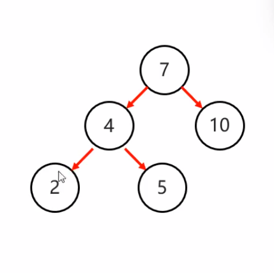
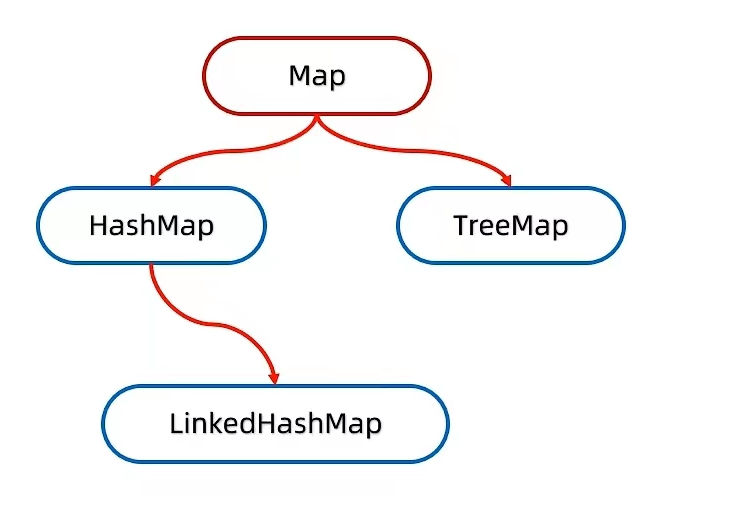

# Java语言入门

> 前言

Java基础的天花板教程

[TOC]


# 一、走进计算机的世界

- Java入门
- 命令行CMD


## 1.1、Java入门

- Java是什么
- JDK的安装和配置
- Hello,world
- 编辑器的使用
- Java版本
- JAVA语言能做什么


### 1.1.1、Java是什么

&emsp;&emsp;Java是一门 <font color="lightGreen">**面向对象**</font> 的计算机编程语言，它不仅吸收了 <font color="lightGreen">**C++**</font> 语言的各种优点，还摒弃了 C++ 里难以理解的多继承、<font color="lightGreen">**指针**</font>等概念，因此 Java 语言具有<font color="red">功能强大</font>和<font color=red>简单易用</font>两个最具特色的特征。此外，Java 语言作为静态面向对象编程语言的代表，以极其优雅地方式实现了面向对象的理论，允许程序员用优雅的思维方式进行灵活且复杂的编程。


&nbsp;

&emsp;&emsp;Java 语言不但具有简单性、面向对象、分布式、鲁棒性、安全性、平台独立与可移植性、多线程、动态性等特点 ，而且用它可以编写桌面应用程序、Web应用程序、分布式系统和嵌入式系统应用程序。


### 1.1.2、JDK的安装和配置

> 前言

&emsp;&emsp;在入门Java这一门语言之前我们需要先下载JDK，什么是JDK呢？JDK就是一整套用于Java开发的官方工具包，我们可以用它来开发Java语言。如果没有JDK的话，我们是无法使用Java语言开发计算机程序的 (JRE可以运行Java程序)。

&nbsp;

> JDK官网：http://www.oracle.com

&emsp;&emsp;下载的安装文件一定要和自己的系统配置相对应的，如果你是32位电脑就不要下64位的，此外，JDK的版本最好不要下载最新的，因为最新版本一般会有各种各样的兼容性问题，推荐下载JDK8、JDK11、JDK17这几个版本，都是长期支持版本，下载完成后直接傻瓜式安装即可。注意，JDK的安装路径不能带有中文或者空格，如果你不知道该安装到哪个目录下，可以使用默认的，具体的安装教程可以参考我的这一篇教程：[JDK的安装和配置](http://t.csdn.cn/iXsNR)

&nbsp;

> Java的安装目录

- bin：该路径下存放了各种工具命令，其中最重要的有 `javac` 和 `java` 命令
- conf：该路径下存放了Java相关的配置文件
- include：该路径下存放了一些特定平台的头文件
- jmods：该路径下存放了各种模块


> 环境变量配置

&emsp;&emsp;开发Java程序，需要使用JDK提供的开发工具（比如javac.exe、java.exe等命令），而这些工具在JDK的安装目录的bin目录下，如果不配置环境变量，那么这些命令只可以在bin目录下使用，而我们如果想要在任意目录下都能使用，那就需要配置环境变量。

&emsp;&emsp;注意：现在最新从官网上下载的JDK安装时会自动配置 javac、java 命令的路径到 Path 环境变量中去 ，所以javac、java可以直接使用。


&emsp;&emsp;以前下载的老版本的JDK是没有自动配置的，而且自动配置的也只包含了4个工具而已，所以我们需要删掉已经配置完毕的，再次重新配置 Path 环境变量。

新建（如果没有的话）


> 环境配置

①**JAVA_HOME**：新增系统变量（或者用户变量也可）配置JDK的安装地址，其他开发软件可能也会用到这个环境变量


②**CLASSPATH**：外部类文件路径（可以不配），多个值以分号分割

`.;%JAVA_HOME%\lib\dt.jar;%JAVA_HOME%\lib\tools.jar`


③**Path**：将JDK的bin目录放置到path（没有则新建）环境变量下，多个值以分号分割


### 1.1.3、Hello,world

>我的第一个Java程序

````java
public class Hello {
	public static void main(String[] args) {
		// 我的第一个程序hello,world!
		System.out.println("Hello,world!");
	}
}
// javac Hello.java 命令编译Hello.java文件
// java Hello 命令运行Hello
````

&emsp;&emsp;<u>**javac**是JDK提供的编译工具，通过这个工具我们可以把 .java 文件编译为 .class 字节码文件。而java命令则是用于运行 .class 文件的工具，在运行时不用加 .class 后缀名</u>


> 常见问题
>
> 1、非法字符问题：Java中的符号都是英文格式的。
>
> 2、大小写问题：Java语言对大小写敏感（区分大小写）。
>
> 3、后缀名问题：在系统中显示文件的扩展名，避免出现类似于HelloWorld.java.txt的文件。
>
> 4、编译问题：编译命令后的java文件名需要带.java的文件后缀名
>
> 5、编译问题：运行命令后的class文件名（类名）不带.class文件的后缀名
>
> 6、文件名问题：Java的类名一定要与文件名一致，反之编译就会报错

&nbsp;

### 1.1.4、编辑器的使用

> 前言

&emsp;&emsp;很多时候写代码其实在记事本上面是不太方便的，如果有错误不能快速定位行号，而且针对关键字没有特定颜色显示，整体的可阅读性很差，其次也可能会提高出错的概率，所以使用编辑器就有显而易见的好处了，便于显示、快速定位错误，以及其他优秀特性等等。当然，如果你用的是IDE当我没说。

&emsp;&emsp;关于编辑器我推荐EditPlus、Sublime等

>EditPlus

官网是 https://www.editplus.com/ ，下载最新版本然后直接傻瓜式安装即可。EditPlus不能直接运行Java或者其他编程语言的代码，但是可以通过 User tools 配置调用相关的编译和运行命令来达到间接运行代码。此外，这款软件本身是收费的，但是可以通过百度搜索获取激活码，然后激活使用

&nbsp;

### 1.1.5、Java分支

> 介绍

Java语言主要包含Java SE、Java ME、Java EE（早先是J2SE、J2ME、J2EE，后面改名了）这三个分支


1. Java SE (Java标准版本)

   Java语言的标准版，用于**桌面应用**（注：用户只要打开程序，程序的界面会让用户在最短的时间内找到他们需要的功能，同时主动带领用户完成他们的工作并得到最好的体验）的开发，是其他两个版本的基础。学习 JavaSE 可以为 JavaEE 打下良好的基础

&nbsp;

2. Java ME (Java移动版本)

   Java 语言的袖珍版，用于嵌入式电子设备或者小型移动设备，例如诺基亚、摩托罗拉等手机上支持的Java游戏，就是使用 JavaME 开发的小型游戏。

&nbsp;

3. Java EE (Java企业版本)

   Java语言的企业版本，用于Web方向的==网站==开发，在这个领域，是当之无愧的==NO.1==

&nbsp;

### 1.1.6、Java语言能做什么

> 应用

- 桌面软件开发：各种税务管理软件、IDEA、Clion、Pycharm
- 企业级应用开发：微服务、Spring Cloud
- 科学计算：MATLAB（用于数学建模）
- 大数据开发：Hadoop
- 游戏开发：我的世界、Minecraft


> 特性

1. 面向对象
2. 跨平台
3. 开源
4. 简单易用
5. 多线程
6. 安全性高


Java语言跨平台的原理

- 操作系统本身其实是不认识Java语言的。
- 但是针对于不同的操作系统，Java提供了不同的虚拟机。.


JVM（Java Virtual Machine）Java虚拟机，每一次运行Java程序就启动了一个JVM的实例

JRE（Java Runtime Environment）Java运行环境，包含了JVM和Java的核心类库（Java API），如果只是简单运行Java则只需要JRE即可，但是如果需要开发Javaweb，那就一定要安装JDK了，因为Servlet需要编译

JDK（Java Development Kit）称为Java开发工具，包含了JRE和开发工具


> 总结：
>
> - 我们只需安装JDK即可，它包含了Java的运行环境和虚拟机。


## 1.2、命令行CMD

- 打开CMD
- 常见命令


### 1.2.1、打开CMD

> 在Windows操作系统下

1. 可以按Win + R 打开运行窗口输入“cmd”来打开命令行窗口，默认位置是用户目录


2. 打开此电脑，在任一文件夹路径框中输入cmd也可以直接打开命令行窗口，并且位置会在当前文件夹目录下


### 1.2.2、常见命令

- ==盘符名称 + 冒号== ：可以切换盘符 例：命令书行输入E: 并回车会切换到E盘

- ==dir== ：查看当前路径下的内容

- ==cd 目录 / .. / 反斜杠== ：进入目录 / 回退上一级目录 / 退回到盘符目录
- ==cls== ：清屏
- ==exit== ：退出命令行窗口


> 配置环境变量

可以把一些程序启动文件路径配置在path环境变量中，方便命令行启动


# 二、程序基础概念

- 代码注释
- Java关键字
- 字面量
- 变量
- 集成开发工具-IDEA
- 计算机的存储规则（补充）


## 2.1、代码的注释

> 定义

在程序指定位置添加的文字或说明性信息就称为代码的注释。代码的注释是对代码逻辑的简要说明，方便程序员修改和维护，高质量的代码一定会有注释，注释提高了代码的可阅读性。代码不能没有注释，就像西方不能失去耶路撒冷一样。


> 注释的类型

| 注释类型 |         示例         |                         作用                         |
| :------: | :------------------: | :--------------------------------------------------: |
| 单行注释 |   // 这是单行注释    |                对某行代码进行解释说明                |
| 多行注释 |  /* 这是多行注释 */  |                对某段代码进行解释说明                |
| 文档注释 | /**  这是文档注释 */ | 主要用于方法或类上面，对方法和类的作用进行详情的说明 |


代码实例：

```java
import java.util.Random;
import java.util.Scanner;
import java.math.BigDecimal;
import java.math.BigInteger;
import static javaconsole.JavaConsole.*;
import java.util.Scanner;

/**
 * 我是文档注释
 * 求N个元素的所有子集。算法：每个子集对应一个N位的二级制整数[0,2 ^ (n - 1)]
 * @author 兰柯万
 */
public class SubSet {

	public static void main(String[] args) {
		// T0D0 Auto-generated method stub
		Scanner in = new Scanner(System.in);
		System.out.print("请输入集合中元素的个数：");
		int n = in.nextInt();	// n = 3 {A,B,C};
        /*
        	我是多行注释
        */
		System.out.print("原来的集合为{");
		for (int i = 0; i < n; i++) {
			System.out.print((char)(i + 'A') + ",");
		}
		if (n != 0) {
			System.out.print("\b");
		}
		System.out.println("}");

		System.out.println("它的所有子集为：");
		for (int i = 0; i < (1 << n); i++) {
			int t = i;
			// 我是单行注释
            // 根据i的每一位如果是1输出该位对应的元素，否则输出空白
			System.out.print("{");
			for (int j = 1; j <= n; j++) {
				if ((t & 1) != 0) {
					System.out.print((char)(j - 1 + 'A') + ", ");
				}
				t >>>= 1;
			}
			
			if (i != 0) {
				System.out.println("\b\b}");
			} else {
				System.out.println("}");
			}
		
		}
		in.close();
	}
}
```


>Notes
>
>- 注释内容不会参与编译和运行，仅仅只是一段对代码的解释说明文字
>- 不管是单行注释还是多行注释，在使用时，都不要嵌套，不然可能会造成编译报错
>- 无代码，不注释


## 2.2、Java的关键字

> 定义

被Java编程语言赋予了特定意义的英文单词就是Java的关键字


> 关键字类型

1. 基本数据类型

byte（输入输出流常用）、short（用不到）、int、long、float（很少用到）、double、char、boolean

2. 访问权限

public、protected、private、static、final

3. 异常体系

try、catch、finally、throw、throws

4. 多线程

synchronized、volatile

5. 循环相关

for、if、else、break、continue、do、while

6. 开关结构

switch、case、default

7. 包

import、package

8. 类相关

class、new、enum、interface、this、super、implements、extends、native、abstract

9. 其他关键字

true、false、null、return、void、instanceof、transient、strictfp、assert

10. 保留关键字（Java为新特性保留的关键字，可能会在未来的Java版本中出现）

goto、const


> Notes
>
> - IDE或者编辑器中针对关键字都会有特殊的颜色标记，非常直观。
>
> - 日常书写代码中不能使用关键字作为变量的名称，如果强行使用会报错


## 2.3、字面量

> 定义

由程序员在代码中直接定义的数字、字符或者字符串就被称为字面量（`literal`）也被称为==直接量==


> 常见的字面量类型

| 字面量类型 |               说明               |            举例             |
| :--------: | :------------------------------: | :-------------------------: |
|  整数类型  |         不带小数点的数字         |          666, -88           |
|  小数类型  |          带小数点的数字          |        13.14, -5.21         |
| 字符串类型 |       用双引号括起来的内容       | “Hello,world”, “你好，世界” |
|  字符类型  | 用单引号括起来的，内容只能有一个 |        ‘A’,‘0’,‘我’         |
|  布尔类型  |  布尔值，只有真(true)假(false)   |  只有两个值：true或者false  |
|   空类型   |              特殊值              |            null             |


> 特殊字符

- \t：制表符。在打印的时候，把前面的字符串的长度补齐到8，或者8的整数倍，最少补一个空格，最多补8个空格
- \n：换行
- \r： 回车


代码实例：

```java
public class SpecialCharater {
	public static void main(String[] args) {
		// 制表符用于对齐
		System.out.println("name" + '\t' + "age");
		System.out.println("tom" + '\t' + "23");
	}
}
```


## 2.4、变量

- 什么是变量
- 变量的身份-数据类型

- 变量的姓名-标识符
- 如何从键盘录入值


### 2.4.1、什么是变量

> 定义

**变量在数学中的概念是指值会有变化的量。在Java语言中，解释略有不同，可以存储值（数字、字符、字符串）并且值可以被改变的量（也可理解为存放东西的仓库）就叫变量。**Java中可以通过变量名称修改变量存储的值。


在定义变量前，我们需要定义变量的类型。**众所周知，Java是一种强类型的计算机编程语言，使用变量前必须先定义其对应的数据类型**，定义一个变量一般是这样的：`数据类型 变量名 = 数据值;`

数据类型可以限定其存储的数据是什么样的，如果类型是整数，那么只能存整数的数据。


代码实例：

```java
public class Variable {
	public static void main(String[] args) {
		// 定义变量a，赋值为10并且输出
		int a = 10;
		System.out.println(a);
	}
}
```


> 变量的特性

1. 同一个方法变量的名称不能重复，否则编译时就会报错

```java
public class Variable {
	public static void main(String[] args) {
		// 我的第一个程序hello,world!
		// 定义变量并输出
		int a = 10;
		System.out.println(a);
		int a = 30;
		int c = 20;
		System.out.println(a + b);
	}
}
```


2. 可以在同一条语句中定义多个类型相同的变量

```java
public class Variable {
	public static void main(String[] args) {
		int a = 10, b = 20, c = 30;
		System.out.println("a = " + a);
		System.out.println("b = " + b);
		System.out.println("c = " + c);
	}
}
```


3. 变量在使用前必须要赋值（给变量一个值）

```java
public class Variable {
	public static void main(String[] args) {
		int a;
        // 这样写代码的话，编译时会报“可能尚未初始化变量a”的错误
		System.out.println("a = " + a);
	}
}
```


> Notes：
>
> - JDK10推出了可变数据类型var ，不限定存储的数据是什么样的，但是会降低程序的可读性，而且使用起来也有很多限制，不推荐使用
> - JDK后面也有支持使用中文作为变量名称，但是可能会导致Java程序出现异常，所以不推荐使用
> - 整数字面量过长时中间可以加上下划线，但是下划线不能出现在整数的开头或者结尾
>
> ```java
> int a = 100_200;
> ```


### 2.4.2、变量的身份-数据类型

> 前言

说到数据类型，就不得不提到Java中的基本数据类型，主要有浮点数（float和double）、整数（byte、short、int、long）、字符（char）和布尔类型（boolean）


下面这张表列举了Java的几种基本数据类型和它们的取值范围

| 基本数据类型 |         关键字         |                           取值范围                           | 占用空间（字节） |
| :----------: | :--------------------: | :----------------------------------------------------------: | :--------------: |
|     整数     | byte、short、int、long | -128 ~ 127 / -32768 ~ 32767 /  (-2)^31 ~ 2^31 - 1 / (-2)^64  ~ 2^64 - 1 |  1 / 2 / 4 / 8   |
|    浮点数    |     float、double      | -3.401298E-38 ~ 3.402823E+38 / -4.9000000E-324 ~ 1.797693E+308 |      4 / 8       |
|     字符     |          char          |                          0 ~ 65535                           |        2         |
|   布尔类型   |        boolean         |                        true或者false                         |        1         |


代码实例：

```java
public class DataType {
	public static void main(String[] args) {
		byte b = 10;
		System.out.println("b = " + b);
		short s = 20;
		System.out.println("s = " + s);
		int i = 30;
		System.out.println("i = " + i);
		long l = 40L;
		System.out.println("l = " + l);
		char c = '中';
		System.out.println("c = " + c);
		boolean bool = true;
		System.out.println("bool = " + bool);
	}
}
```


> 练习

1.输出电影信息

需求：将（电影名称，主演，年份，评分）四个信息选择不同类型的变量，随后打印在控制台


```java
public class MovieInformation {
	public static void main(String[] args) {
    	// 定义变量记录电影的名称
        String name = "落叶归根";
        // 定义变量记录主演的姓名
        String toStar = "赵本山、郭德纲、洪启文、宋丹丹、胡军、廖凡、牛马、郭涛、夏雨、孙海英、刘金山";
        // 定义变量记录上映年份
        int year = 2007;
        // 记录变量记录电影的评分
        double grade = 8.3;
		System.out.println("name = " + name);
		System.out.println("toStar = " + toStar);
		System.out.println("year = " + year);
		System.out.println("grade = " + grade);
    }
}
```


2.输出商品信息

需求：选择其中一部手机，将（手机价格，手机品牌）两个信息选择不同类型的变量，随后打印出来


```java
public class PhoneInformation {
	public static void main(String[] args) {
    	// 定义变量记录手机的价格
		double price = 3699.00;
		// 定义变量记录手机的品牌
		String brand = "OPPO";
		// 输出结果
		System.out.println("price = " + price);
		System.out.println("brand = " + brand);
    }
}
```


> Notes：
>
> - long类型的变量在定义时，赋值必须加上l/L(推荐大写)后缀，因为Java语言默认整数字面量为int类型
> - float类型的变量在定义时，赋值必须加上f/F(推荐大写)后缀，因为Java语言默认浮点数字面量为double类型
> - 浮点数的字面量也可以加d/D的后缀，表示字面量的类型是double类型的
> - 代码中的小数的有可能没法精确计算，1.1 + 0.9 ≠ 2.0


### 2.4.3、变量的姓名-标识符

Java的语法规定变量的标识符由英文字母、数字、下划线 、$ 符号组成，但是数字不能在开头，也不能全是数字，标识符区分大小写。


> 阿里巴巴Java开发规范

1. 代码中的命名均不能以下划线或美元符号开始，也不能以下划线或美元符号开始，也不能以下划线或美元符号结束

2. 代码中的命名严禁使用拼音与英文混合的方式，更不允许直接使用中文的方式。正确的英文拼写和语法可以让阅读者易于理解，避免歧义。注意即使纯拼音命名方式也要避免采用

3. 类名使用`UpperCameCase`风格，必须遵从驼峰形式，但以下情形可以例外：DO	/	BO	/	BTO	/	VO	/	AO

4. 方法名称、参数名称、成员变量、局部变量都统一采用`lowerCameCase`风格，必须遵守驼峰形式

5. 常量名称全部大写，单词之间使用下划线隔开，力求语义表达完整清楚，不要嫌名字长

6. 抽象类命名使用Abstract或Base开头，异常类使用Exception结尾，测试类以它要测试的类的名称开始，以Test结尾

7. 中括号是数组类型的一部分

8. POJO类中的布尔类型的变量，都不要加is开头，否则部分框架会引起序列化错误

9. 包名统一使用小写，点分隔符之间有且仅有一个自然语义的英文单词。包名统一使用单数形式，但是类名如果有复数含义，可以使用复数形式


> Notes
>
> 养成良好的编码习惯有助于减少bug的产生


### 2.4.4、如何从键盘录入值

> 简介

之前的练习的代码，所有的变量的值都是固定在代码里面的，那么有没有一种方法可以使我们通过键盘或者其他方式输入，并且输出我们刚才输入的值呢？答案是有的，Java早就在底层帮我们想好了一切。Java里面有一个类叫Scanner（输入扫描仪），这个类就可以接受从键盘或者其他地方输入的值


**如何使用这个类呢？**

这个类不在java.lang包下面，在java.util包下面，所以需要手动导包

```java
import java.util.Scanner;

public class Variable {
	public static void main(String[] args) {
		 // 创建输入扫描仪，System.in表示接受系统输入的值
		 Scanner in = new Scanner(System.in);
		 // 接受数据
		 System.out.println("请输入一个整数：");
		 int i = in.nextInt();
		 // 输出变量的值
		 System.out.println("你输入的整数为 " + i);
	}
}
```


> Notes：
>
> - 这个人太懒了，什么都没有写


## 2.5、集成开发工具-IDEA

- IDEA概述
- IDEA安装
- IDEA配置


&nbsp;

### 2.5.1、IDEA概述

> 定义

IDEA，全称 IntelliJ IDEA，是 Java 语言的集成开发环境，IDEA 在业界被公认为是最好的 java 开发工具之一，尤其在智能代码助手、代码自动提示、重构、J2EE 支持、Ant、JUnit、CVS 整合、代码审查、创新的 GUI 设计等方面的功能可以说是超常的。


IntelliJ IDEA 在 2015 年的官网上这样介绍自己：

Excel at enterprise, mobile and web development with Java, Scala and Groovy, with all the latest modern technologies and frameworks available out of the box.

简明翻译：IntelliJ IDEA 主要用于支持 Java、Scala、Groovy 等语言的开发工具，同时具备支持目前主流的技术和框架，擅长于企业应用、移动应用和 Web 应用的开发。


IDEA(https://[www.jetbrains.com/idea/)是 ](http://www.jetbrains.com/idea/)是)JetBrains 公司的产品，公司旗下还有其它产品，比如：

- WebStorm：用于开发 JavaScript、HTML5、CSS3 等前端技术；

- PyCharm：用于开发 python

- PhpStorm：用于开发 PHP

- RubyMine：用于开发 Ruby/Rails

- AppCode：用于开发 Objective - C/Swift

- CLion：用于开发 C/C++

- DataGrip：用于开发数据库和 SQL

- Rider：用于开发.NET

- GoLand：用于开发 Go


IDEA也不负众望，到今天市场占有率IDEA已经有70%往上了


### 2.5.2、IDEA安装

官网下载地址：<https://www.jetbrains.com/idea/download/>

IDEA 分为两个版本：旗舰版(Ultimate)和社区版(Community)。

旗舰版收费(限 30 天免费试用)，社区版免费，这和 Eclipse 有很大区别。

|                             强项                             | Ultimate | Community |
| :----------------------------------------------------------: | :------: | :-------: |
|     Java, Kotlin, Groovy, Scala（支持的计算机编程语言）      |   支持   |   支持    |
|            Maven, Gradle, sbt（项目依赖管理工具）            |   支持   |   支持    |
|  Git, GitHub, SVN, Mercurial, Perforce（代码版本控制工具）   |   支持   |   支持    |
|                    Debugger（代码调试器）                    |   支持   |   支持    |
|                 Docker（开源的应用部署容器）                 |   支持   |   支持    |
| [Profiling tools](https://lp.jetbrains.com/intellij-idea-profiler/)（IntelliJ IDEA integrates Async Profiler, Java Flight Recorder, and HPROF memory viewer：IDEA集成了异步性能分析器，Java飞行记录器和HPROF内存监控调优工具） |   支持   |  不支持   |
| [Spring](https://www.jetbrains.com/lp/intellij-frameworks/), Jakarta EE, Java EE, Micronaut, Quarkus, Helidon, and more（开发框架） |   支持   |  不支持   |
|                  HTTP Client（HTTP客户端）                   |   支持   |  不支持   |
| JavaScript, TypeScript, HTML, CSS, Node.js, Angular, React, Vue.js（前端技术） |   支持   |  不支持   |
|              Database Tools, SQL（数据库工具）               |   支持   |  不支持   |
|            Remote Development (Beta)（远程开发）             |   支持   |  不支持   |
|            Collaborative development（协同开发）             |   支持   |  不支持   |


下载完成之后，直接傻瓜式安装即可，不过软件开发工具建议都装在一个盘下或者一个目录下，方便快速定位和查找


> Notes：
>
> - IDEA的项目结构从大到小依次为：project(项目) > module(模块) > package(包裹) > class(类)


### 2.5.3、IDEA配置

> 扩展设置

首先打开IDEA，右上角菜单栏点击File，之后出现的下拉框里点中Settings，然后就会出现设置界面

 

- 修改IDEA的主题，亮眼的主题，可以使人眼前一亮


- 修改字体，舒服的字体可以使人心情愉悦


- 修改注释的样式，IDEA默认的单行注释是斜体的，有些人看着可能会不舒服


- 开启自动导包，方便撰写代码



- IDEA有自动的代码提示，但是会区分大小写，把这个按钮不勾选上就可以不区分大小写提示了


- 设置图片为IDEA的背景


## 2.6、计算机的存储规则（补充）

- 进制
- 任意进制转十进制
- 十进制转任意进制
- ASCII码
- 图片
- 声音


### 2.6.1、进制

在计算机中存储的数据只有三类，Text(文本)、Image(图片)、Sound(声音)，而计算机底层的任意数据则都是以二进制的形式来存储的。说到计算机中的进制，就不得不提到十进制、二进制，八进制和十六进制了，这几种进制是目前计算机行业运用最多、也是流传最广的几种进制


1. 十进制 

0、1、2、3、4、5、6、7、8、9

口诀：==逢十进一，借一当十==

例如： 1 + 1 = 2

2. 二进制

0、1	

口诀：==逢二进一，借一当二==

| 二进制 | 十进制 |
| :----: | :----: |
|  0000  |   0    |
|  0001  |   1    |
|  0010  |   2    |
|  0011  |   3    |
|  0100  |   4    |
|  0101  |   5    |
|  0110  |   6    |
|  0111  |   7    |
|  1000  |   8    |
|  1001  |   9    |
|  1010  |   10   |
|  1011  |   11   |
|  1100  |   12   |
|  1101  |   13   |
|  1110  |   14   |
|  1111  |   15   |

3. 八进制

0、1、2、3、4、5、6、7

口诀：==逢八进一，借一当八==

| 二进制 | 八进制 |
| :----: | :----: |
|  000   |   0    |
|  001   |   1    |
|  010   |   2    |
|  011   |   3    |
|  100   |   4    |
|  101   |   5    |
|  110   |   6    |
|  111   |   7    |

4. 十六进制

0、1、2、3、4、5、6、7、8、9、A、B、C、D、E、F

口诀：==逢十六进一，借一当十六==

| 二进制 | 十六进制 |
| :----: | :------: |
|  0000  |    0     |
|  0001  |    1     |
|  0010  |    2     |
|  0011  |    3     |
|  0100  |    4     |
|  0101  |    5     |
|  0110  |    6     |
|  0111  |    7     |
|  1000  |    8     |
|  1001  |    9     |
|  1010  |    A     |
|  1011  |    B     |
|  1100  |    C     |
|  1101  |    D     |
|  1110  |    E     |
|  1111  |    F     |


在Java中的数字，如果是二进制则以0B / 0b开头，十进制不需要任何前缀（默认），八进制则以0为开头，十六进制则以0X / 0x开头


计算机底层为什么要使用二进制呢？

在电路板中大于3.3V的定为1，小于3.3V定为0


### 2.6.2、任意进制转十进制

> 定义

公式：**系数 * 基数的权次幂 相加**

系数：就是每一位上的数

基数：当前进制数

权：从右往左，依次为0 1 2 3 4 5 …


- 二进制转十进制

101(B) = 1 * 2^2 + 0 * 2^1 + 1 * 2^0 = 4 + 0 + 1 = 5(D)

- 八进制转十进制

101(O) = 1 * 8^2 + 0 * 8^1 + 1 * 8^0 = 64 + 0 + 1 = 65(D)

- 十六进制转十进制

ABC(H) = 10 * 16^2 + 11* 16^1 + 12 * 16^0 = 2560 + 176 +12 = 2748


> 8421快速转换法

|  1   |  1   |  1   |  1   |  1   |  1   |  1   |  1   |
| :--: | :--: | :--: | :--: | :--: | :--: | :--: | :--: |
| 128  |  64  |  32  |  16  |  8   |  4   |  2   |  1   |


例如：二进制1101 = 8 + 4 + 1 = 13


### 2.6.3、十进制转任意进制

除基取余法：不断地除以基数（几机制，基数就是几）得到余数，直到商为0，再将余数倒着拼起来即可

11(D)=?(B)


11(D)=?(O)


11(D)=?(H)


### 2.6.4、ASCII码

计算机存储数据时就是通过ASCII码进行存储的，找到对应数据后转化为二进制存储到计算机中。ASCII码的全称是美国信息交换标准码表（American Standard Code for Information Interchange）


汉字在ASCII码表中并不存在映射，所以我们国家在上个世纪80年代的时候就制定了一个GB2312编码


这个编码标准是从1981年5月1日开始发布的简体中文汉字编码国家标准，一共收录了7445个图形字符，包含6763个汉字。

> 其他编码

- BIG5编码：台湾地区繁体中文标准字符集，共收录13053个中文字，1984年实施
- GBK编码：2000年3月17日发布，收录了21003个汉字，包含国家标准GB13000-1中的全部中日韩汉字和BIG5编码中的所有汉字
- Unicode字符集 ：国际标准字符集，它将世界各种语言的每个字符定义一个唯一的编码，每个字符固定两个或三个字节编码，可以很大程度地满足跨平台、跨语言的文本信息转换需求
- UTF-8编码：（8位元，Universal Character  Set/Unicode Transformation  Format）是针对Unicode的一种可变长度字符编码。它可以用来表示Unicode标准中的任何字符，而且其编码中的第一个字节仍与ASCII相容，使得原来处理ASCII字符的软件无须或只进行少部份修改后，便可继续使用。因此，它逐渐成为电子邮件、网页及其他存储或传送文字的应用中，优先采用的编码。


### 2.6.5、图片

说到图片，在计算机中主要有三种类型的图片，黑白图（只有黑白两种颜色的图片）、灰度图（灰度图：Gray Scale Image 或是Grey Scale Image，又称**灰阶图**。

把白色与黑色之间按对数关系分为[若干](https://baike.baidu.com/item/若干/8015015)等级，称为灰度。灰度分为256阶。用灰度表示的图像称作灰度图。除了常见的卫星图像、航空照片外，许多地球物理[观测](https://baike.baidu.com/item/观测/8962478)数据也以灰度表示。）和最常见的彩色图。图片的的存储离不开显示器中的这三个知识点：分辨率，像素、三原色


> 分辨率

通常情况下，图像的[分辨率](https://baike.baidu.com/item/分辨率)越高，所包含的像素就越多，图像就越清晰，印刷的质量也就越好。同时，它也会增加文件占用的[存储空间](https://baike.baidu.com/item/存储空间)。正常来说，一个显示器的分辨率就是像素的数量，比如1920*1080


> 三原色

在彩色图中，其实每个像素点记录了不同的颜色，说到颜色，就不得不提到三原色了，这三种颜色就是红色、黄色、蓝色组成的，一个像素点会由三原色组成，每种颜色比例不同就成了不同的颜色的像素点

|  颜色  |      值（范围0~255）      |
| :----: | :-----------------------: |
|  蓝色  | 红色43，绿色123，蓝色194  |
|  红色  |  红色198，绿色62，蓝色85  |
|  黄色  | 红色294，绿色230，蓝色135 |
| 粉红色 | 红色255，绿色219，蓝色207 |


> Notes：
>
> - 计算机中的颜色采用光学三原色
> - 分别为，红、绿、蓝。也称为RGB
>
> - 值可以为十进制形式（0 ~ 255）或者十六进制形式（0 ~ FF）


### 2.6.6、声音

计算机通过对声音的波形图进行采样来存储声音，在波形图中的每个点都会有对应的数字。对每个声波进行采样，每个采样点都会有数据，通常来说，采样点越多数据也会越多，相对而言该音频文件的音质也会更好。


# 三、程序逻辑控制

- 运算符和表达式
- 原码、反码和补码
- 流程控制语句
- 数组
- 方法
- 综合练习题


## 3.1、运算符和表达式

- 运算符
- 表达式


### 3.1.1、运算符

> 定义

对字面量或者变量进行操作的符号就是运算符。运算符用于执行程序代码运算，会针对一个以上操作数项目来进行[运算](https://baike.baidu.com/item/运算/5866856)。例如：2+3，其[操作数](https://baike.baidu.com/item/操作数/7658270)是2和3，而运算符则是“+”。

在VB2005中运算符大致可以分为5种类型：[算术运算符](https://baike.baidu.com/item/算术运算符/9324947)、连接运算符、[关系运算符](https://baike.baidu.com/item/关系运算符/352774)、[赋值运算符](https://baike.baidu.com/item/赋值运算符/2482721)和[逻辑运算符](https://baike.baidu.com/item/逻辑运算符/4123505)。


Java的运算符主要有以下几种

|                            运算符                            |      解释      |
| :----------------------------------------------------------: | :------------: |
|   +（加）、-（减）、 *（乘）、 /（除）、 %（求模，取余数）   |   算术运算符   |
|        --variable、variable--、++variable、variable++        | 自增自减运算符 |
|   =、+=、-=、*=、/=、 %=、&=、\|=、^=、~=、<<=、>>=、>>>=    |   赋值运算符   |
| ! expression、expression && expression、expression \|\| expression、variable == variable |   关系运算符   |
|                  expression ? true : false                   |   三元运算符   |
| 位与(&)、按位或(\|）、按位异或(^）、取反(~)、左移(<<)、带符号右移(>>)和无符号右移(>>>) |    位运算符    |


Java加减乘除算术运算和数学上是一样的，不过在浮点数方面会有精度限制（可以使用BigDecimal类来进行精确计算），而且不同数据类型的数据在运算的过程中会发生**类型转换**。


> 类型转换

当运算的时候变量的数据类型不一致，程序就会发生类型转换。

- 隐式类型转换

一般来说，程序自己发起的类型转换称之为**隐式类型转换**（也称为自动类型转换）。这种类型转换都是从小的数据类型转换到大的数据类型，类似byte、short、char这三种数据类型的数据在运算的时候，都会先直接提升为int，然后再进行计算。

- 强制类型转换

还有一种类型转换叫**强制类型转换**，一般是由我们程序员控制运算的数据类型，有时是强制从大的数据类型转成小的数据类型。强制类型转换有可能出现精度损失的风险，换言之，强制类型转换有可能会导致数据会有部分丢失的情况发生


> 字符串的 “+” 操作

说完了计算机中的数字，你可能会想问，Java里面还有字符串和字符，我们程序员能不能对他们进行加减操作，答案是可以的，但是有限制，字符串只能执行 “+” 操作，不能对其进行其他计算，而且这种操作其实本质是将两个字符串拼接在一起形成一个新的字符串。


`“123” + 123`会输出“123123”，而并不是把前后两个数字进行相加。这是因为字符串执行相加操作是将前后两个字符串拼接并产生一个新的字符串。

表达式一般从左至右进行计算，如果表达式里面在字符串有数字相加减并且数字在前面的话，会先对数字进行加减乘除运算然后再进行字符串拼接，如果数字在最后面则不会，但是加上括号也可以让数字执行加减乘除的运算，而不是直接拿数字进行拼接操作

`1 + 99 + “年喜欢你”`会输出“100年喜欢你”


字符的话，可以进行加减乘除，因为在Java底层char类型的变量存储的就是数字，既然是数字那当然可以进行加减乘除。当字符+字符或者是字符+数字时，会把字符通过ASCII码表查询到对应的数字再进行计算 


> 其他运算符

- 自增自减运算符

自增运算符和自减运算符可以放在变量的左边或者右边，如果放在前面就是先加减后赋值，后面就是先赋值再加减，单行自增或自减运算符放在变量前后得到的结果是一致的，没有区别

```java
/**
 * 自增自减运算符练习
 *
 * @author wl
 * @date 2022/7/13 20:42
 */
public class NumberIncreaseAndSubtract {

    public static void main(String[] args) {
        int x = 10;
        // 后++；先用后加
        int y = x++;
        // 先++；先加后用
        int z = ++x;
        System.out.println("x = " + x);
        System.out.println("y = " + y);
        System.out.println("z = " + z);
    }
}
```


- 赋值运算符

等号是最常见的赋值运算符，等号右边的值会给等号右边的变量。在《C Prime Plus》中它也被称为“现在等于”运算符（你说a现在等于多少，我说a现在等于10）

```java
int a = 10;
```

算术运算符 + 等号也等于一种特殊的赋值运算符，只不过先进行算术运算，再赋值给原变量。相等于

```java
int s = 0;
s += 1; // 等于 s = s + 1
s /= 1; // 等于 s = s / 1;
s *= 1; // 等于 s = s * 1;
s -= 1; // 等于 s = s - 1;
s %= 1; // 等于 s = s % 1;
```

如果运算对象是short、byte、char的话，也不会报错，因为内部会有一个强制类型转换


- 关系运算符

关系运算符的运算和数学上的逻辑运算一致，不过关系运算符的结果都是布尔类型的，只有true或false两种结果，不要把“==”错误地写成“=”。

关系运算符的比较适用于基本数据类型，如果是包装类或者是其他类最好重写并使用对应类的equals()方法。如果将关系运算符应用在非基本数据类型上，可能是在比较两个类的地址。比如比较String


- 三元运算符

格式：关系表达式？表达式1 : 表达式2；

```java
int max = a > b ? a : b;
```

主要是为了简化类似于下面这样的if判断表达式。在这种情况下使用三元表达式可以简化代码并且代码逻辑也会清晰很多

```java
if(a > b) {
	max = a;
} else {
    max = b;
}    
```

三元表达式可以嵌套，但是一般不建议这样做。因为三元表达式本来的目的就是为了简化代码，这样写反而逻辑会混乱，而且也变得不简洁了

```java
int max = a > b ? (a > c ? a : c) : (b > c ? b : c);
```


> Notes：
>
> - 取值范围：byte < short < int < long < float < double
> - 整数操作只能得到小数，要想得到小数，必须有浮点数参与运算


### 3.1.2、表达式

> 定义

在数学概念上，表达式是由数字、算符、数字分组符号（括号）、自由变量和约束变量等以能求得数值的有意义排列方法所得的组合。[约束变量](https://baike.baidu.com/item/约束变量/2841226)在表达式中已被指定数值，而自由变量则可以在表达式之外另行指定数值。


但是在Java中，用运算符把字面量或者变量连接起来，符合Java语法的式子都可以称之为表达式，不同运算符连接的表达式体现的是不同类型的表达式。


**练习：数值拆分**

- 需求

  键盘录入一个三位数，将其拆分为个位、十位、百位后，打印在控制台

```java
import java.util.Scanner;

/**
 * 键盘录入一个三位数，获取其中的个位、十位、百位
 *
 * @author wl
 * @date 2022/7/13 20:42
 */
public class NumberSplit {

    public static void main(String[] args) {
        // 1.键盘录入
        Scanner in = new Scanner(System.in);
        System.out.println("请输入一个三位数");
        int number = in.nextInt();

        // 2.获取个位、十位、百位
        /*
            公式
            个位：数字 % 10
            十位：数字 / 10 % 10
            百位 数字 / 10 /10 % 10
         */
        int ge = number % 10;
        int shi = number / 10 % 10;
        int bai = number / 10 / 10 % 10;
        System.out.println("个位是：" + ge);
        System.out.println("十位是：" + shi);
        System.out.println("百位是：" + bai);
    }
}

```


练习：数字6

- 需求

  数字6是一个真正伟大的数字，键盘录入两个整数。如果其中一个为6，最终结果输出true。如果它们的和为6的倍数，最终结果输出true。其他情况都是false

```java
/**
 * 数字6是一个真正伟大的数字，键盘录入两个整数。
 * 如果其中一个为6，最终结果输出true。
 * 如果它们的和为6的倍数，最终结果输出true。
 * 其他情况都是false
 *
 * @author wl
 * @date 2022/7/13 20:42
 */
public class NumberSix {

    public static void main(String[] args) {
        Scanner in = new Scanner(System.in);
        System.out.println("请输入两个整数：");
        int a = in.nextInt();
        int b = in.nextInt();
        System.out.println(a == 6 || b == 6 || (a + b) % 6 == 0);
    }
}

```


## 3.2、原码、反码和补码

- 机器数
- 原码
- 反码
- 补码


### 3.2.1、机器数

> 前言

**一个数在计算机中的表示形式是二进制的话，这个数其实就叫机器数。**


&nbsp;

&emsp;&emsp;**机器数通常是带有符号的（指有正数和负数之分），计算机用最高位存放符号，这个 bit 一般叫做符号位。** 正数的符号位为 0，  负数的符号位为 1。比如，十进制中的数 +7 ，计算机字长为8位，转换成二进制就是 ==0 0 0 0 0 1 1 1==（**一个 byte 有 8bit，有效的取值范围是 -128 ~ +127**）。

&emsp;&emsp;如果是 -7 ，就是 ==1 0 0 0 0 1 1 1== 。一个存储的二进制码分原码、反码、补码，下面我们就来介绍一下什么是原码、反码、补码

&nbsp;

> 冷知识
>
> &emsp;&emsp;计算机底层使用二进制形式的补码来计算和存储数据

&nbsp;

### 3.2.2、原码

> 定义

十进制数据的二进制表现形式就是原码，原码最左边的一个数字就是符号位，0为正，1为负。

&nbsp;

例如：**56 -> 0 0 1 1 1 0 0 0**

左边第一位为符号位，其他位为数据位。

一个 byte 有 8bit，最大值是 ==0 1 1 1 1 1 1 1== (+127)，最小值是 ==1 1 1 1 1 1 1 1== (-127)

&nbsp;

&emsp;&emsp;在计算机中之所以使用二进制来表示原码是因为逻辑简单，对于电路来说只有开或者关两种状态，用二进制是在方便不过的了。如果使用的进制是十进制、八进制或者十六进制的话，电路没有办法表示那么多的状态


- 正数计算

&emsp;&emsp;使用原码对正数进行计算不会有任何问题的，例如：5 + 2

````shell
 0 0 0 0 0 1 0 1
+        0 0 1 0
-----------------
 0 0 0 0 0 1 1 1
````

&emsp;&emsp;把这个结果转成十进制刚好就等于 7，完全正确无误


- 负数计算

&emsp;&emsp;但是如果是负数的话，那计算的结果就会大相径庭了。我们拿 -56 这个数字来举例，它的原码是 ==1 0 1 1 1 0 0 0== ，减一之后，就会变成 ==1 0 1 1 0 1 1 1== ，这个数转成十进制就是 -55。计算前是 -56，减一之后正确的结果应该是 -57（==1 0 1 1 1 0 0 1==）才对，居然还越减越大了

```shell
 1 0 1 1 1 0 0 0
-              1
-----------------
 1 0 1 1 0 1 1 1
```


&emsp;&emsp;为了解决原码不能用于计算负数的这种问题，这时候，反码它出现了，作为负数的“计算的救星”。计算规则是正数的反码不变和原码一致，负数的反码会在原码的基础上，**高位的符号位不变，其他位取反**（ 1 变成 0 ， 0 变为 1 ）。

&nbsp;

### 3.2.3、反码

> 定义

**正数的反码是其本身（等于原码），负数的反码是符号位保持不变，其余位取反。** 反码的存在是为了正确计算负数，因为原码不能用于计算负数

| 十进制数字 |   原码    |   反码    |
| :--------: | :-------: | :-------: |
|     +0     | 0000 0000 | 0000 0000 |
|     -0     | 1000 0000 | 1111 1111 |
|     -1     | 1000 0001 | 1111 1110 |
|     -2     | 1000 0010 | 1111 1101 |
|     -3     | 1000 0011 | 1111 1100 |
|     -4     | 1000 0100 | 1111 1011 |
|     -5     | 1000 0101 | 1111 1010 |
|     -6     | 1000 0110 | 1111 1001 |
|     -7     | 1000 0111 | 1111 1000 |

&nbsp;

- 负数计算

这时候，我们再来使用反码计算一下 -56 - 1 的结果

**-56** 的原码是 ==1 0 1 1 1 0 0 0== ，如果转成反码（符号位不变，其他位取反），

那么它的反码就是 ==1 1 0 0 0 1 1 1==

```shell
  1 1 0 0 0 1 1 1
 -          1
-------------------
  1 1 0 0 0 1 1 0
```


-56 -1 = -57，-57 的原码是 ==1 0 1 1 1 0 0 1==，转成反码刚好是 ==1 1 0 0 0 1 1 0==，刚好等于刚才我们算出的值

&nbsp;

- 跨零计算

&emsp;&emsp;不过反码也有它的 “ 软肋 ”，如果是负数跨零进行计算的话，计算得出的结果不对。我们拿 -3 + 5 来举例：-3 的原码是 ==1 0 0 0 0 0 1 1==，转成反码的话就是 ==1 1 1 1 1 1 0 0==

```shell
 1 1 1 1 1 1 0 0
+        0 1 0 1  
-----------------
 0 0 0 0 0 0 0 1 
```


&emsp;&emsp;把计算结果转成十进制就是 1，这结果显然不对。那么我们该怎么计算呢，这时候，作为反码的补充编码 —— 补码就出现了。


### 3.2.4、补码

> 定义

&emsp;&emsp;正数的补码是其本身，负数的补码等于其反码 +1。因为反码不能解决负数跨零（类似于 -6 + 7）的问题，所以补码出现了。

| 十进制数字 |   原码    |   反码    |   补码    |
| :--------: | :-------: | :-------: | :-------: |
|     +0     | 0000 0000 | 0000 0000 | 0000 0000 |
|     -0     | 1000 0000 | 1111 1111 | 0000 0000 |
|     -1     | 1000 0001 | 1111 1110 | 1111 1111 |
|     -2     | 1000 0010 | 1111 1101 | 1111 1110 |
|     -3     | 1000 0011 | 1111 1100 | 1111 1101 |
|     -4     | 1000 0100 | 1111 1011 | 1111 1100 |
|     -5     | 1000 0101 | 1111 1010 | 1111 1011 |
|     -6     | 1000 0110 | 1111 1001 | 1111 1010 |
|     -7     | 1000 0111 | 1111 1000 | 1111 1001 |
|    ...     |    ...    |    ...    |    ...    |
|    -127    | 1111 1111 | 1000 0000 | 1000 0001 |
|    -128    |    无     |    无     | 1000 0000 |


- 跨零计算

&emsp;&emsp;这时候，我们再来使用反码计算一下 -3 + 5 的结果，-3 的原码是 ==1 0 0 0 0 0 1 1==，转成反码的话就是 ==1 1 1 1 1 1 0 0==，再转成补码就是 ==1 1 1 1 1 1 0 1==

```shell
 1 1 1 1 1 1 0 1
+        0 1 0 1
----------------- 
 0 0 0 0 0 0 1 0
```

&emsp;&emsp;把这个数转成十进制刚好等于2，结果正确


### 3.2.5、总结

> 前言

&emsp;&emsp;**在计算机当中都是使用补码来进行计算和存储的**。补码很好的解决了反码负数不能跨零计算的弊端，并且补码还可以记录一个特殊的值 -128，这个数据在 1 个字节下是没有原码和反码

&nbsp;

&emsp;&emsp;学习了原码、反码和补码的知识之后，我们就可以了解到，Java 当中所有的基本数据类型。比如整数类型的数据类型，存储的数都是同样的，区别是在于什么地方，假设存储的值都是 10

| 基本数据类型 |  值  | 字节数 |                      内存中实际存储的值                      |
| :----------: | :--: | :----: | :----------------------------------------------------------: |
|     byte     |  10  |   1    |                          0000 1010                           |
|    short     |  10  |   2    |                     0000 0000 0000 1010                      |
|     int      |  10  |   4    |           0000 0000 0000 0000 0000 0000 0000 1010            |
|     long     |  10  |   8    | 0000 0000 0000 0000 0000 0000 0000 0000 0000 0000 0000 0000 0000 0000 0000 1010 |

&emsp;&emsp;从上表中我们可以得出一个结论，为了凑齐字节数，所占的字节越大，则前面补的零越多。

> 类型转换原理

- 隐式类型转换

```java
public class Test {
	public static void main(String[] args) {
    	// 小的数据类型往大的数据类型进行转换底层就是通过左补零完成的
        byte a = 10; // 0000 1010
        int b = a;	 // 0000 0000 0000 0000 0000 0000 0000 1010
        System.out.println(b);
    }
}
```

- 强制类型转换

```java
public class Test {
	public static void main(String[] args) {
    	int a = 300;	   		// 0000 0000 0000 0000 0000 0001 0010 1100
        byte b = (byte) a; 		// 0010 1100
        System.out.println(b);	// 打印出44
        /*
        	int a = 200;	  		// 0000 0000 0000 0000 0000 0000 1100 1000
        	byte b = (byte)a; 		// 1100 1000
        	System.out.println(b);	// 打印出-56
        */
    }
}
```

&emsp;&emsp;补码的运算也适用于逻辑运算符

| 运算符 |    含义    |                           运算规则                           |
| :----: | :--------: | :----------------------------------------------------------: |
|   &    |   逻辑与   |             0为false，1为true，当都为1时才为true             |
|   \|   |   逻辑或   | 0为false，1为true，当有至少一个为1时为true，如果都没有则为false |
|   <<   |    左移    |                      向左移动，低位补零                      |
|   >>   |    右移    |      向右移动，高位补零，符号位按照原来数字的符号位不变      |
|  >>>   | 无符号右移 |                      向右移动，高位补零                      |


## 3.3、流程控制语句

- 顺序结构
- 分支结构
- 循环结构


### 3.3.1、顺序结构

顺序结构就是从上往下依次执行代码，比如，下面这段代码

```java
public class Test {
	public static void main(String[] args) {
    	System.out.println("努力做主人喜欢的事");
        System.out.println("大小姐驾到！通通闪开！");
        System.out.println("Giao桑，故乡的樱花开了哟");
        System.out.println("粗缯大布裹生涯，腹有诗书气自华");
    }
}
```

顺序结构语句是Java程序中默认的执行流程，按照代码的先后顺序，从上到下依次执行

&nbsp;


### 3.3.2、分支结构

> 前言

分支结构有两种语句，一种是if语句，表示判断，另一种是switch语句，表示选择。

&nbsp;


#### 3.3.2.1、if语句

> 前言

if语句有三种格式，单 if 语句的，if-else 语句的，if-elseif 语句的，这三种是 if 语句的主要使用形式。


1. 单 if 语句

   写法：`if(expression) {...}`

   执行流程

   - 首先计算关系表达式的值


   - 如果关系表达式的值为true就执行大括号内的语句，false则跳过大括号内的语句

   - 然后继续执行后面的其他语句


2. if-else 语句

   写法：`if(expression) {...} else {...}`

   执行流程

   - 首先计算关系表达式的值

   - 如果关系表达式的值为true就执行语句体1

   - 如果关系表达式的值为false就执行语句体2

   - 然后继续执行后面的其他语句


3. if-else if 语句

   写法：`if(expression) {...} else if (expression) {...}`

   作用：可以用于多条件判断

&nbsp;

注意：

- 大括号的开头可以另起一行书写，但是建议写在第一行末尾
- 在if语句体中，如果执行的语句只有一条，大括号可以省略不写，但是并不建议这么做
- 如果对一个布尔类型的变量进行判断，不需要使用“==”号


#### 3.3.2.2、switch语句

> 前言

帅不能当饭吃，但是兰州拉面、武汉热干面、北京炸酱面和陕西油泼面可以。

&nbsp;

> 经典格式

```java
switch(expression) {
    case 值1:
        语句体1;
        break;
    case 值2:
        语句体2;
        break;
    case 值3:
        语句体3;
        break;
    case 值4:
        语句体4;
        break;
    ...
    default:
        语句体n+1;
        break;
}
```

&nbsp;

注意：

- expression：（$\textcolor{red}{将要匹配的值}$）取值可以是byte、short、int、char这些基本数据类型，boolean、long、float和double则不行，JDK1.5之后增加对枚举的支持，JDK1.7的版本还可以是字符串，底层是通过字符串的hashcode实现的
- case：后面跟的是要和表达式比较的值（$\textcolor{red}{被匹配的值}$）
- break：表示中断，结束的意思，用来结束switch语句执行
- default：表示所有情况都不匹配的时候，就执行该处的内容，和if语句的else相似
- case后面的值只能是字面量，不能是变量
- case给出的值不允许重复


> 冷知识
>
> &emsp;&emsp;if 语句适用于对范围的判断，switch 语句适合有限数据的情况


### 3.3.3、循环结构

Java的循环语句一种有三种：**for、while、do-while**


#### 3.3.3.1、for循环

强化版的 while 循环，带有初始化语句和条件控制语句，是Java语言最好用的循环语句，没有之一。

&nbsp;

- 格式

`for(初始化语句; 条件判断语句; 条件控制语句) { 循环体语句;}`

- 示例

```java
// 打印十次Hello,world!
for(int i = 1; i <= 10; i++) {
	System.out.println("Hello,world!");
}
```

- 执行流程

  1. 执行初始化语句

  2. 执行条件判断语句，看其结果是true还是false

     - 如果是false，循环结束

     - 如果是true，执行循环体语句

  3. 执行条件控制语句

&nbsp;

注意：

- 初始化语句只执行一次。

- 判断语句为true时则循环继续，反之则循环结束


> 练习

1. 打印1-5和打印5-1

```java
public class PrintingOne2Five {

    public static void main(String[] args) {
        // 打印1-5
        System.out.println("输出1-5");
        for(int i = 1; i <= 5; ++i) {
            System.out.println(i);
        }
        // 打印5-1
        System.out.println("输出5-1");
        for (int i = 5; i >= 1; i--) {
            System.out.println(i);
        }
    }
}
```

2. 在实际开发中，需要重复执行的代码，会选择使用循环实现。

​		比如：玩游戏的时候，如果网不好就会经常断线重连，那么断线重连这个业务逻辑就需要重复执行，假设现在公司要求，断线重连的业务逻辑最多只执行5次，请用代码实现

备注：断线重连的业务逻辑可以用输出语句代替

```java
public class WorkLogic {

    public static void main(String[] args) {
        for (int i = 1; i <= 5; i++) {
            System.out.println("第" + i + "次执行断线重连的业务逻辑");
        }
    }
}
```

3. 求1-5之间的和

```java
public class NumberIncrease {

    public static void main(String[] args) {
        // 求1-5之间的和
        int sum = 0;
        for (int i = 1; i <= 5; i++) {
            sum += i;
        }
        System.out.println("sum = " + sum);
    }
}
```


#### 3.3.3.2、for循环和while循环的对比

相同点：

- 运行规则都是一样的

不同点

- for循环中，控制循环的变量，因为归属for循环的语句结构中，在for循环结束后，就不能再次访问到了
- while循环中，控制循环的变量，对于while循环来说不归属其语法结构，在while循环结束后，该变量还可以继续使用
- for循环中，知道循环次数或者循环的范围
- while循环中不知道具体的循环次数和范围，只知道循环的结束条件


练习

1. 回文数：给你一个整数x。如果x是一个回文整数，打印true，否则，返回false

   解释：回文数是指正序（从左向右）和倒序（从右向左）读都是一样的整数

   例如，121是回文数，但123不是

```java
/**
 * 实现简单的回文数
 * @author wl
 * @date 2022/7/13 20:42
 */
public class PalindromeNumber {

    public static void main(String[] args) {
        // 1.定义数字
        int x = 12345;
        // 定义一个临时变量用于临时存储x的值
        int temp = x;
        int num = 0;
        // 2.利用循环开始
        while (x != 0) {
            int r = x % 10;
            x = x / 10;
            num = num * 10 + r;
//            System.out.println("x = " + x);
        }
        // 3.打印num
        System.out.println("num = " + num);
        System.out.println(num == temp);
    }
}
```

2. 求商和余数：给定两个整数，被除数和除数（都是正数，且不超过int的范围）。

   将两数相除，要求不使用乘法、除法和 % 运算符。得到商和余数

```java
public class NumberCount {

    public static void main(String[] args) {
        // 定义变量记录除数和被除数
        int dividend = 10;
        int divisor = 3;
        // 定义count统计相减的次数
        int count = 0;
        // 循环中，不断地将被除数 - 除数
        while (dividend >= divisor) {
            dividend = dividend - divisor;
            // 只要减一次，那么统计变量就自增一次
            count++;
        }
        System.out.println("余数 = " + dividend);
        System.out.println("商 = " + count);
    }
}
```


#### 3.3.3.3、do-while循环

&emsp;&emsp;while 循环的变体，和 while 循环的区别是即使一开始就不满足条件也会执行至少一次循环体内的语句，实际工作中用不到，只在某些源码中出现

- 格式

```java
初始化语句
do {
    // write your code here
} while(expression)
```


#### 3.3.3.4、无限循环

> 简介

表示循环一直停不下来

一共有`for(;;){};`、`while(true){};`和`do{}while(true);`三种无限循环结构。一般没有规定次数的无限循环会使用while循环结构。无限循环的代码下面不能再写其他代码，因为循环理论上永远停不下来


一般业务代码几乎不会用到无限循环，只有Java的源码里面会有一些类使用到无限循环，但是也会有让循环结束的语句，不会真的一直循环下去


> 跳转控制语句

**continue**：结束本次循环，continue后面的语句不会被执行。从循环开头再继续循

**break**：直接结束所在循环体的执行，继续执行循环体之后的语句


练习

1. 朋友聚会的时候可能会玩一个游戏：逢七过

游戏规则：从任意一个数字开始报数，当你要报的数字是包含7或者是7的倍数的时候都要说：过

需求：在使用程序在控制台打印出1-100之间的满足逢七必过规则的数据

```java
/**
 * 逢七过
 *
 * @author wl
 * @date 2022/7/13 20:42
 */
public class SeventPass {

    public static void main(String[] args) {

        for (int i = 1; i <= 100; i++) {
            if(i % 7 == 0) {
                System.out.println(i + " = 过");
            } else {
                int r = i;
                while(r > 0) {
                    int d = r % 10;
                    if(d == 7) {
                        System.out.println( i + " = 过");
                        break;
                    }
                    r /= 10;
                }
            }
        }
    }
}
```

2. 猜数字小游戏

   程序自动生成一个1-100之间的随机数字，使用程序实现猜出这个数字是多少？

Java中有两个方法可以生成随机数，一个是Math类的random()方法，返回的随机数是0-1之间的浮点数，另外一个是Random类，可以生成各种形式的随机数

```java
/**
 * 猜数游戏
 *
 * @author wl
 * @date 2022/7/13 20:42
 */
public class GuessGame {

    public static void main(String[] args) {

        Random random = new Random();

        for (int i = 0; i < 100; i++) {
//            int num = random.nextInt(10);
            int num = (int)(Math.random() * 10);
            System.out.println("num = " + num);
        }
    }
}

```

生成随机数的秘诀：

比如生成 7 ~ 15 之间的数，

1. 先把这个范围头尾都减去一个值，让这个范围从0开始。 -7 0 ~ 8

2. 尾巴 + 1                                                                                   8 + 1 = 9

3. 最终的结果，再加上第一步减去的值

```java
Random random = new Random();
int number = r.nextInt(9) + 7;
System.out.println(number);
```


## 3.4、数组

- 数组的定义
- 数组的初始化
- 数组练习
- Java内存区域


### 3.4.1、数组的定义

> 定义

数组指的是一种容器，可以用于存储同种数据类型的多个值。


**数组**（Array）是有序的元素序列。若将有限个类型相同的变量的[集合](https://baike.baidu.com/item/集合/2908117)命名，那么这个名称为数组名。组成数组的各个变量称为数组的分量，也称为数组的元素，有时也称为[下标变量](https://baike.baidu.com/item/下标变量/12713827)。用于区分数组的各个元素的数字编号称为下标。数组是在[程序设计](https://baike.baidu.com/item/程序设计/223952)中，为了处理方便， 把具有相同类型的若干元素按有序的形式组织起来的一种形式。 这些有序排列的同类数据元素的集合称为数组。

数组是用于储存多个相同类型数据的集合。


那么我们应该如何使用数组呢，有两种格式可以参考

1. `int [] arrayName`：数据类型 [] 数组名

2. `int arrayName[]`：数据类型 数组名[]


### 3.4.2、数组的初始化

> 初始化

要使用数组需要要先对数组进行初始化，数组的初始化就是在内存中，为数组容器开辟空间，并将数据存入数组容器中的过程。数组的初始化有两种方式，一种是静态初始化，一种是动态初始化


1. 静态初始化：在定义时就直接指定好了数组的数据和其长度

   `数据类型[] 数组名 = new 数据类型[]{元素1，元素2，元素3...}`

   `数据类型[] 数组名 = {元素1，元素2，元素3...}`

   后一种初始化格式相比于前一种格式更简洁也更常用，如果需要用到数组的静态初始化，那么只需要使用到后一种即可

2. 动态初始化：初始化时手动指定数组的长度，由系统为数组分配默认初始值

   `数据类型[] 数组名 = new 数据类型[数组的长度]`


注意：如果我们直接使用System.out.println()方法打印数组，这时候会打印出一串奇怪的字符串，其实这就是数组的地址，每个符号都有其特定的含义

`[I@1b6d3586`

> 地址值的含义

[：表示当前是一个数组

I：表示当前数组里面的元素都是Integer类型的

@：固定间隔符号，没有特殊含义


### 3.4.3、数组练习

1. 遍历数组

```java
/**
 * 遍历数组
 * @author wl
 * @date 2022/8/7 11:51
 */
public class ArrayTraversal {

    public static void main(String[] args) {
        // 定义int整型数组并初始化
        int []arr = {1,2,3,4,5,};
		// for循环遍历数组中的每一个元素并输出
        for (int i = 0; i < arr.length; i++) {
            System.out.println("arr[" + i + "] = " + arr[i]);
        }
    }
}
```

2. 统计个数

   定义一个数组，存储1-10，共计10个元素，遍历数组得到每一个元素，

   统计数组里面一共有多少个能被3整除的数字？

```java
/**
 * 统计数组里面一共有多少个
 * 能被3整除的数字
 * @author wl
 * @date 2022/8/7 11:51
 */
public class DivideThree {

    public static void main(String[] args) {
        // 定义一个int整型数组并初始化
        int []arr = {1,2,3,4,5,6,7,8,9,10,};
        /*
            for循环遍历并判断当前数组下标元素是否为
            可以被3整除的数字，如果是那么输出这个元素，
            反之循环继续
         */
        int count = 0;
        for (int i = 0; i < arr.length; i++) {
            if(arr[i] % 3 == 0) {
                count++;
                System.out.println("数组的第" + i + "个元素是" + arr[i] + "，这个数可以被3整除");
            }
        }
        System.out.println("数组中一共有" + count + "个元素可以被3整除");
    }
}

```

3. 生成10个1~100之间的数字存入数组
   - 求出所有数据的总和
   - 求所有数据的平均数
   - 统计有多少数据比平均值小

```java
/**
 * 生成10个1~100之间的数字存入数组
 *
 * - 求出所有数据的总和
 * - 求所有数据的平均数
 * - 统计有多少数据比平均值小
 * @author wl
 * @date 2022/8/7 11:51
 */
public class CountNumber {

    public static void main(String[] args) {
        // 1.定义数组
        int[] arr = new int[10];
        // 2.把随机数存入到数组中
        Random r = new Random();
        for (int i = 0; i < arr.length; i++) {
            // 每循环一次，就会生成一个新的随机数
            int number = r.nextInt(100) + 1;
            /*
                把生成的随机数添加到数组当中
                数组名[索引]=数据
             */
            arr[i] = number;
        }
        System.out.println("Arrays.toString(arr) = " + Arrays.toString(arr));
        // 1）求所有数据的总和
        int sum = 0;
        for (int i = 0; i < arr.length; i++) {
            sum += arr[i];
        }
        System.out.println("数组中所有数据的和为" + sum);
        // 2）求所有数据的平均数
        int ave = sum / arr.length;
        System.out.println("数组中的平均数是" + ave);
        // 3）统计有多少个数据比平均数小
        int count = 0;
        for (int i = 0; i < arr.length; i++) {
            if(arr[i] < ave) {
                count++;
            }
        }
        System.out.println("在数组中，一共有" + count + "个数据，比平均数小");
    }
}
```

4. 交换变量的值

```java
/**
 * 数据交换
 * @author wl
 * @date 2022/8/7 11:51
 */
public class DataSwap {

    public static void main(String[] args) {
        // 定义并初始化数组
        int[] arr = {1,2,3,4,5,};
        // 交换变量的值
        for (int i = 0, j = arr.length-1; i < j; i++, j--) {
            int temp = arr[i];
            arr[i] = arr[j];
            arr[j] = temp;
        }
    }
}
```


> Notes
>
> - 在创建数组时，如果我们没有指定其元素的值，那么一般都会指定一个**默认的值**，基本数据类型就用基本数据类型的默认值，比如 int 是 0，double是 0.0 等等，而非基本数据类型一律初始化为 null，表示这个元素为空
> - 数组的下标范围为 0 到数组长度 -1，如果访问的下标不在这个范围之内，就会抛出**ArrayIndexOutOfBoundsException**异常，表示数组下标越界，如果使用的是C语言，那么会报segmentation fault（段内存访问错误）


### 3.4.4、Java内存区域

> Java中的JVM主要有以下几块区域

- Stack：方法运行时使用的内存，比如 main 方法运行，进入方法栈中执行
- Heap：存储对象或数组，通过 new 关键字来创建的，一般都存储在堆内存中
- Method Area：存储可以运行的 class 文件
- Native Method Stack：JVM在使用 C/C++ 编程语言的库的时候会调用
- Register：供CPU使用


## 3.5、方法

- 什么是方法
- 方法的格式
- 方法的重载
- 方法的内存


### 3.5.1、什么是方法

&emsp;&emsp;方法（Method）是程序中最小的执行单元。比如类里面的 main 方法，重复的代码或具有独立功能的代码可以抽象到方法中，这样做可以提高代码的复用性和可维护性。


### 3.5.2、方法的格式

> 前言

把一些代码打包在一起，该过程称为**方法定义**。

方法定义后并不是直接运行的，需要手动调用才能执行，该过程称为**方法调用**


- 格式：

```java
public (权限修饰符：public、private、protected、default) static（静态修饰符） 返回值类型 方法名 (方法的参数) {
	方法体;	// 就是打包起来的代码
    return 返回值;
}
```

看到方法进入方法，执行完毕后返回调用处

```java
/**
 * 方法学习
 * @author wl
 * @date 2022/8/7 11:51
 */
public class MethodStudy {

    public static void main(String[] args) {
        // 学习目标：在方法里面定义两个变量并且打印
        getSum();
    }
    
    public static void getSum(){
        int num1 = 10;
        int num2 = 20;
        int result = num1 + num2;
        System.out.println(result);
    }
}
```


形参：全称形式参数，是指方法定义中的参数

实参：全称实际参数，方法调用中的参数


注意：

- 在调用处要根据方法的结果，去编写另外一段代码
- 有返回值的方法调用格式有直接调用、赋值调用和输出调用


### 3.5.3、方法的重载

在同一个类中，定义了多个**同名的方法**，这些同名的方法具有同样的功能。每个方法具有不同的**参数类型**或**参数个数**。这些同名的方法就构成了重载关系

<u>在同一个类中，方法名相同，参数不同的方法，与返回值无关的就是重载的方法</u>


```java
/**
 * 方法重载
 * @author wl
 * @date 2022/8/7 11:51
 */
public class MethodOverload {

    public static void main(String[] args) {

        System.out.println("compare((byte)10,(byte) 20) = " + compare((byte) 10, (byte) 20));
        System.out.println("compare(10,20) = " + compare(10, 20));
    }

    public static boolean compare(byte b1, byte b2) {
        return b1 == b2;
    }

    public static boolean compare(short s1, short s2) {
        return s1 == s2;
    }

    public static boolean compare(int i1, int i2) {
        return i1 == i2;
    }

    public static boolean compare(long l1, long l2) {
        return l1 == l2;
    }
}
```


> 练习1

```java
import java.util.Arrays;

/**
 * 一行打印数组
 * @author wl
 * @date 2022/8/7 11:51
 */
public class OneLinePrintArray {

    public static void main(String[] args) {
        int[] arr = {1,2,3,4,5,6};
        System.out.println(Arrays.toString(arr));
    }

}

```


> 练习2

````java
/**
 * 需求：定义一个方法复制数组
 *
 * @author wl
 * @date 2022/8/20 12:51
 */
public class CopyArray {

    public static void main(String[] args) {
        Double[] doubles = {1.2d, 2.4d, 3.1d, -4.0d, 258.0d};
        System.out.println(Arrays.toString(copyOfRange(doubles, 0, doubles.length-1)));
    }

    /**
     * 将数组 arr 中固定索引范围的
     * 数据赋值到新数组中并返回
     *
     * @param arr 原数组
     * @param from 赋值索引起点
     * @param to 赋值索引终点
     * @author wl
     * @date 2022/8/20 12:52
     */
    @SuppressWarnings("unchecked")
    public static <T> T[] copyOfRange(T[] arr, int from, int to) {

        T[] newArr = (T[]) new Object[to-from];

        for (int i = from, j = 0; i < to; i++, j++) {
            newArr[j] = arr[i];
        }
        return newArr;
    }
}

````


### 3.5.4、方法的内存

- 方法调用的基本内存原理
- 方法传递基本数据类型的内存原理
- 方法传递引用数据类型的内存原理


> 从内存的角度去解释

**基本数据类型**：

- 数据值存储在自己的空间中。
- 赋值给其他变量，也是赋的真实的值
- 在方法中传递基本数据类型时，传递的是真实的数据，形参的改变，不影响实际参数的值

**引用数据类型**：

- 数据值存储在其他空间中，自己空间中存储的是地址值。
- 赋值给其他变量，赋的是地址值


### 3.5.5、可变参数

> 案例

可变参数练习：

假如需要定义一个方法求和，该方法可以灵活的完成如下需求：完成 2、3、4、n 个数据的求和

```java
/**
 * 可变参数：
 * 计算n个数据的求和
 *
 * @author wl
 * @date 2023/5/30 23:09
 */
public class VariableArgument {


    public static void main(String[] args) {
        int sum = getSum(1, 2, 3, 4, 5, 6);
        System.out.println("sum = " + sum);
    }

    /**
     * 统计n个整数的求和
     *
     * @param nums 需要求和的整数
     * @author 万龙
     * @date 2023/5/30 23:13
     * @return int
     */
    public static int getSum(int ... nums) {
        // 通过stream流的规约操作统计
        return IntStream.of(nums).reduce(0, Integer::sum);
    }

}
```

> 总结

1. 可变参数本质上就是一个数组

2. <font color="red">作用：</font>在形参中接收多个数据

3. <font color="red">格式：</font>数据类型 ... 参数名称

   <font color="red">举例：</font>`int ... a`

4. <font color="red">注意事项：</font>

   - 形参列表中可变参数必须只能有一个
   - 可变参数必须放在所有参数的最后面


## 3.6、综合练习题

- 卖飞机票

- 找质数

- 开发验证码

- 评委打分

- 数字加密

- 数字解密

- 抢红包

- 双色球系统

  


### 3.6.1、卖飞机票

> 需求

机票按照淡季、旺季、头等舱和经济舱收费，输入机票原价、月份和头等舱或经济舱

按照如下规则计算机票价格：

- 旺季（5-10月）头等舱9折，经济舱8.5折，
- 淡季（11月到来年4月）头等舱7折，经济舱6.5折

1. 我的实现

```java
/**
 * 卖飞机票
 * 需求：
 * - 机票按照淡季、旺季、头等舱和经济舱收费，输入机票原价、月份和头等舱或经济舱
 * - 按照如下规则计算机票价格：旺季（5-10月）头等舱9折，经济舱8.5折，淡季（11月到来年4月）头等舱7折，经济舱6.5折
 * @author wl
 * @date 2022/8/20 12:51
 */
public class AirCraftTicket {

    
    public static void main(String[] args) {
        Scanner scanner = new Scanner(System.in);
        System.out.println("请输入原票价 月份，机舱类型");
        double resTicketPrice = scanner.nextDouble();
        int month = scanner.nextInt();
        int cabinType = scanner.nextInt();
        System.out.println("原票价为 " + resTicketPrice + "，打完折后的票价为" + String.format("%.2f", getPrice(resTicketPrice, month, cabinType)));
    }

    /**
     * 根据指定的规则算出
     * 打折后的机票价格
     *
     * @param resTicketPrice 原票价
     * @param month          预订月份
     * @param cabinType      机舱类型 0 头等舱 1经济舱
     * @return double
     * @author wl
     * @date 2022/8/22 19:50
     */
    public static double getPrice(double resTicketPrice, int month, int cabinType) {
        double res = 0.0d;

        switch (month) {
            case 5:
            case 6:
            case 7:
            case 8:
            case 9:
            case 10:
                res = cabinType == 0 ? resTicketPrice * 0.9 : resTicketPrice * 0.85;
                break;
            case 11:
            case 12:
            case 1:
            case 2:
            case 3:
            case 4:
                res = cabinType == 0 ? resTicketPrice * 0.7 : resTicketPrice * 0.65;
                break;
            default:
                break;
        }
        return res;
    }

}
```

2. 示例代码

```java
/**
 * 卖飞机票
 * 需求：
 * - 机票按照淡季、旺季、头等舱和经济舱收费，输入机票原价、月份和头等舱或经济舱
 * - 按照如下规则计算机票价格：旺季（5-10月）头等舱9折，经济舱8.5折，淡季（11月到来年4月）头等舱7折，经济舱6.5折
 * @author wl
 * @date 2022/8/20 12:51
 */
public class AirCraftTicket {

    public static void main(String[] args) {
        Scanner in = new Scanner(System.in);
        System.out.println("请输入机票的原价");
        int ticket = in.nextInt();
        System.out.println("请输入当前月份");
        int month = in.nextInt();
        System.out.println("请输入当前购买的舱位 0 头等舱 1 经济舱");
        int seat = in.nextInt();
        if(month >= 5 && month <= 10) {
            ticket = getPrice(ticket, seat, 0.9d, 0.85d);
        } else if((month >= 1 && month <= 4) || (month >= 11 && month <= 12)) {
            ticket = getPrice(ticket, seat, 0.7d, 0.65d);
        } else {
            System.out.println("键盘录入的月份不合理");
        }
        System.out.println(ticket);
    }

    public static int getPrice(int ticket, int seat, double v0 ,double v1){
        if(seat == 0) {
            ticket = (int)(ticket * v0);
        } else if(seat == 1) {
            ticket = (int)(ticket * v1);
        } else {
            System.out.println("没有这个舱位");
        }
        return ticket;
    }
}

```

&nbsp;

### 3.6.2、找质数

> 需求

判断101 ~ 200 之间有多少个质数，并求出所有的素数

**示例代码**

```java
/**
 * 判断101 ~ 200 之间有多少个质数，并求出所有的素数
 * @author wl
 * @date 2022/8/20 12:51
 */
public class SearchPrimeNumber {

    public static void main(String[] args) {
        // 判断101 ~ 200 之间有多少个质数，并求出所有的素数
        int count = 0;
        for (int i = 101; i < 200; i++) {
            // 判断当前数字是否为质数
             boolean flag = true;
            for (int j = 3; j < Math.sqrt(i); j+=2) {
                if(i % j == 0) {
                    flag = false;
                    break;
                }
            }
            // flag为true时，说明就是质数
            if(flag) {
                count++;
                System.out.println("当前数字" + i + "是质数");
            }
        }
        System.out.println("一共有" + count + "个质数");
    }
}
```


### 3.6.3、开发验证码

> 需求

&emsp;&emsp;定义方法实现随机产生一个5位的验证码，验证码的格式为：长度为5，前四位为大写字母或小写字母，最后一位为数字

**代码示例**

```java
/**
 * 生成一个五位的随机验证码
 * @author wl
 * @date 2022/8/20 12:51
 */
public class arbitrateNumberVerifyCode {

  public static void main(String[] args) {
        char[] chs = new char[52];
        for (int i = 0; i < chs.length; i++) {
            chs[i] = i < 26 ? (char) (97 + i) : (char) (65 + i - 26);
        }
//        System.out.println(Arrays.toString(chs));
        StringBuilder sb = new StringBuilder();
        int letterCount = 0, digitCount = 0;
        while (letterCount + digitCount < 5) {
            Random random = new Random();
            int num = random.nextInt(500);
            if (num % 2 == 0) {
                if (digitCount < 1) {
                    sb.append(random.nextInt(10));
                    digitCount++;
                }
            } else {
                if (letterCount < 4) {
                    int idx = random.nextInt(chs.length);
                    sb.append(chs[idx]);
                    letterCount++;
                }
            }
        }
        System.out.println("您生成的随机验证码为" + sb);
    }
    
}
```


### 3.6.4、评委打分

> 需求

&emsp;&emsp;在歌唱比赛中，有 6 名评委给选手打分，分数范围是 [0-100] 之间的整数。选手最后的得分为：去掉一个最低分和一个最高分之后 4 个评委的平均分，请完成上述过程并计算出选手的实际得分

**代码示例**

```java
/**
 * 在歌唱比赛中，有6名评委给选手打分，分数范围是[0-100]之间的整数。
 * 选手最后的得分为：去掉一个最低分和一个最高分之后4个评委的平均分，
 * 请完成上述过程并计算出选手的实际得分
 *
 * @author wl
 * @date 2022/8/20 12:51
 */
public class JudgesScored {

    public static void main(String[] args) {
        final Scanner in = new Scanner(System.in);
        System.out.println("请输入评委的数量");
        int num = in.nextInt();
        int sum = 0, i = 0;
        int[] arr = new int[num];
        System.out.println("请输入分数");
        while (i < arr.length) {
            int score = in.nextInt();
            if (score >= 0 && score <= 100) {
                arr[i] = score;
                sum += arr[i];
                i++;
            } else {
                System.out.println("您输入的数字超出范围，请重新输入");
            }
        }
        int min, max;
        min = max = arr[0];
        for (int n : arr) {
            if (n > max) {
                max = n;
            } else if (n < min) {
                min = n;
            }
        }
        System.out.println("最大值为" + max + ", 最小值为" + min);
        System.out.printf("选手最终的得分为%.2f\n", (sum - min - max + 0.0D) / (arr.length - 2.0D));
    }
}
```

&nbsp;

### 3.6.5、数字加密

> 需求

&emsp;&emsp;某系统的数字密码（大于0），比如1983，采用加密方式进行传输。规则是先得到每位数，然后每位数都加上5，再对10进行求余，最后将所有数字反转，得到一串新数

&nbsp;

1. 我的实现

```java
/**
 * 数字加密
 *
 * @author wl
 * @date 2022/8/20 12:51
 */
public class DigitalEncryption {

    public static void main(String[] args) {
        /*
          - 某系统的数字密码（大于0），比如1983，采用加密方式进行传输
          - 规则是先得到每位数，然后每位数都加上5，再对10进行求余，最后将所有数字反转，得到一串新数
        */
        Scanner in = new Scanner(System.in);
        System.out.println("请输入您要加密的密码: ");
        String cypher = in.nextLine();
        if (cypher != null && cypher.length() > 0) {
            String trim = cypher.trim();
            if (trim.length() > 0) {
                for (int i = 0; i < trim.length(); i++) {
                    char ch = trim.charAt(i);
                    if (!Character.isDigit(ch)) {
                        System.out.println("输入的数字密码含非法字符");
                        System.exit(1);
                    }
                }
                StringBuilder sb = new StringBuilder();
//            String cypher = "0983";
                // 5 14 13 8
                // 5 4 3 8
                for (int i = trim.length() - 1; i >= 0; i--) {
                    char ch = trim.charAt(i);
                    int num = (ch - '0' + 5) % 10;
                    sb.append(num);
                }
                System.out.println("加密后的数字密码为" + sb);
            } else {
                System.out.println("输入的数字密码不能为空");
                System.exit(1);
            }
        } else {
            System.out.println("输入的数字密码不能为空");
            System.exit(1);
        }

    }
}
```

2. 示例代码

```java
/**
 * 数字加密
 *
 * @author wl
 * @date 2022/8/20 12:51
 */
public class DigitalEncryption {

    public static void main(String[] args) {
          /*
          - 某系统的数字密码（大于0），比如1983，采用加密方式进行传输
          - 规则是先得到每位数，然后每位数都加上5，再对10进行求余，最后将所有数字反转，得到一串新数
       */
        int number = 12345;
        int count = 0;
        int temp = number;
        
        System.out.println("获取数字密码长度：");
        while (number != 0) {
            number /= 10;
            count++;
        }
        System.out.println("获取每位数字：");

        int[] arr = new int[count];
        int index = arr.length - 1;
        while (temp != 0) {
            int ge = temp % 10;
            temp /= 10;
            arr[index--] = ge;
        }

        System.out.println(Arrays.toString(arr));
        // 每位数字 + 5
        for (int i = 0; i < arr.length; i++) {
            arr[i] += 5;
        }
        System.out.println(Arrays.toString(arr));
        // 对10取余数
        for (int i = 0; i < arr.length; i++) {
            arr[i] %= 10;
        }
        System.out.println(Arrays.toString(arr));
        // 反转数字
        for (int i = 0, j = arr.length - 1; i < j; i++, j--) {
            int t = arr[i];
            arr[i] = arr[j];
            arr[j] = t;
        }
        System.out.println(Arrays.toString(arr));
        // 组合数字
        int sum = 0;
        for (int i = 0; i < arr.length; i++) {
            sum = sum * 10 + arr[i];
        }
        System.out.println(sum);

    }


}
```

&nbsp;

### 3.6.6、数字解密

> 需求

将加密后的数据解密出来

示例代码

```java
public class DigitalEncryption2 {

    public static void main(String[] args) {
       /*
          - 某系统的数字密码（大于0），比如1983，采用加密方式进行传输
          - 规则是先得到每位数，然后每位数都加上5，再对10进行求余，最后将所有数字反转，得到一串新数
          - 按照以上规则加密之后进行解密
          - 比如1983加密之后变成8346，解密变回1983
       */
        int[] arr = {8, 3, 4, 6,};
        System.out.println("反转");
        for (int i = 0, j = arr.length - 1; i < j; i++, j--) {
            int temp = arr[i];
            arr[i] = arr[j];
            arr[j] = temp;
        }
        System.out.println(Arrays.toString(arr));
        System.out.println("进行取余数");
        for (int i = 0; i < arr.length; i++) {
            int temp = arr[i];
            if(temp >= 0 && temp <= 4) {
                arr[i] += 10;
            }
        }
        System.out.println(Arrays.toString(arr));
        System.out.println("-5");
        for (int i = 0; i < arr.length; i++) {
            arr[i] -= 5;
        }
        System.out.println(Arrays.toString(arr));
        int number = 0;
        for (int j : arr) {
            number = number * 10 + j;
        }
        System.out.println(number);
    }


}

```

&nbsp;

### 3.6.7、抢红包

> 需求

&emsp;&emsp;一个大 V 直播抽奖，奖品是现金红包，分别有 {2, 588, 888, 1000, 10000}五个级别奖金。请使用代码模拟抽奖，打印出每个奖项，奖项出现的顺序随机且不重复，打印效果如下：（随机顺序，不一定是下面的顺序）

```shell
$ 888的奖金被抽出
$ 588的奖金被抽出
$ 10000的奖金被抽出
$ 2的奖金被抽出
$ 1000的奖金被抽出
```

示例代码

```java
/**
 * 抢红包
 *
 * @author wl
 * @date 2022/8/20 12:51
 */
public class EarnMoney {

    public static void main(String[] args) {
        // 分析
        // 1.定义数组表示奖池
        int[] arr = {2, 588, 888, 1000, 10000};
        // 2.定义新数组用于存储抽奖的结果
        int[] stored = new int[arr.length];
        // 3.抽奖
        Random r = new Random();
        // 因为有 5 个 奖项，所以这里要循环 5 次
        for (int i = 0; i < 5;) {
            // 获取随机索引
            int rand = r.nextInt(arr.length);
            // 获取奖项
            int price = arr[rand];
            // 判断当前的奖项是否存在，如果存在则重新抽取，如果不存在，就表示是有效奖项
            boolean flag = contains(stored, price);
            if(!flag) {
                // 把当前抽取到的奖项添加到stored中
                stored[i++] = price;
            }
        }
        // 4.遍历stored
        for (int i = 0; i < stored.length; i++) {
            System.out.println(stored[i]);
        }

    }

    //
    public static boolean contains(int[] arr, int price) {
        if (arr == null || arr.length == 0) {
            return false;
        }
        boolean flag = false;
        for (int i = 0; i < arr.length; i++) {
            int temp = arr[i];
            if (temp == price) {
                flag = true;
                break;
            }
        }
        return flag;
    }


}
```

还可以通过打乱数组的方式来实现，速度更快

&nbsp;

### 3.6.8、双色球系统

> 需求

&emsp;&emsp;投注号码由 6 个红色球号码和 1 个蓝色球号码组成。红色球号码从 1-33 中选择；蓝色球号码从 1-16 中选择

**双色球中奖条件和奖金表**

|  奖项  |                红球                 |     蓝球     |            中奖说明            | 单注奖金分配 |
| :----: | :---------------------------------: | :----------: | :----------------------------: | :----------: |
| 一等奖 |       红、红、红、红、红、红        |      蓝      |            中 6 + 1            | 最高 1000 万 |
| 二等奖 |       红、红、红、红、红、红        |      无      |            中 6 + 0            | 最高 500 万  |
| 三等奖 |         红、红、红、红、红          |      蓝      |            中 5 + 1            |   3000 元    |
| 四等奖 | 红、红、红、红、红 / 红、红、红、红 |   无 / 蓝    |      中 5 + 0 / 中 4 + 1       |    200 元    |
| 五等奖 |     红、红、红、红 / 红、红、红     |   无 / 蓝    |      中 4 + 0 / 中 3 + 1       |    10 元     |
| 六等奖 |          红、红 / 红 / 无           | 蓝 / 蓝 / 蓝 | 中 2 + 1 / 中 1 + 1 / 中 0 + 1 |     5 元     |

&nbsp;

示例代码

```java
/**
 * 双色球系统
 *
 * @author wl
 * @date 2022/8/20 12:51
 */
public class TwoColorBall {

    public static void main(String[] args) {
//        System.out.println(Arrays.toString(createNumber()));
        // 生成中奖号码
        int[] number = createNumber(); // 123456 7
        System.out.println("==============================");
        System.out.println(Arrays.toString(number));
        System.out.println("==============================");
        // 用户输入彩票号码（红球 + 蓝球）
        int[] userInputArr = userInputNumber(); // 654321
        System.out.println(Arrays.toString(userInputArr));
        // 判断中奖的情况
        int redCount = 0;
        int blueCount = 0;
        // 判断红球
        for (int i = 0; i < userInputArr.length - 1; i++) {
            int redNumber = userInputArr[i];
            boolean contains = contains(number, redNumber);
            if(contains) {
                redCount ++;
            }
        }
        // 判断蓝球
        int blueNumber = userInputArr[userInputArr.length - 1];
        if(blueNumber == number[number.length - 1]) {
            blueCount ++;
        }
        // 获奖数量
//        System.out.println("redCount = " + redCount);
//        System.out.println("blueCount = " + blueCount);

        // 根据红球的个数以及蓝球的个数来判断中奖的情况
        if(redCount == 6 && blueCount == 1) {
            System.out.println("恭喜您，中奖1000万");
        } else if(redCount == 6) {
            System.out.println("恭喜您，中奖500万");
        }else if(redCount == 5 && blueCount == 1) {
            System.out.println("恭喜您，中奖3000块");
        } else if(redCount == 5 || (redCount == 4 && blueCount == 1)) {
            System.out.println("恭喜您，中奖200块");
        } else if(redCount == 4 || (redCount == 3 && blueCount == 1)) {
            System.out.println("恭喜您，中奖10块");
        } else if((redCount == 2 && blueCount == 1) || (redCount == 1 && blueCount 				== 1) || (redCount == 0 && blueCount == 1)) {
            System.out.println("恭喜您，中奖5块");
        }

    }
    public static int[] userInputNumber() {
        // 创建数组用于添加用户购买的彩票号码
        int[] arr = new int[7];
        Scanner in = new Scanner(System.in);
        for (int i = 0; i < 6; ) {
            // 利用键盘录入让用户输入
            System.out.println("请输入第" + (i + 1) + "个红球号码");
            int redNumber = in.nextInt();
            // 在 1-33 中且不重复
            if(redNumber >= 1 && redNumber <= 33) {
                boolean contains = contains(arr, redNumber);
                if(!contains) {
                    // 不存在说明是有效数字
                    arr[i++] = redNumber;
                } else {
                    System.out.println("当前红球号码已存在，请重新输入");
                }
            } else {
                System.out.println("当前红球号码超出范围");
            }
        }

        // 让用户输入蓝色球号码
        System.out.println("请输入蓝球号码");
        // 1-16之间
        while (true) {
            int blueNumber = in.nextInt();
            if(blueNumber >= 1 && blueNumber <= 16) {
                arr[arr.length - 1] = blueNumber;
                break;
            } else {
                System.out.println("当前蓝球号码超出范围");
            }
        }
        return arr;
    }

    // 获取中奖号码
    public static int[] createNumber() {
        // 创建数组用于添加中奖号码
        // 6个红球 1个蓝球 数组长度：7
        int[] arr = new int[7];
        // 红球：不能重复 1,2,3,4,5,6
        // 蓝球：可以和红球重复

        // 生成红球号码
        Random random = new Random();
        for (int i = 0; i < 6;) {
            int redNumber = random.nextInt(33) + 1;
            boolean flag = contains(arr, redNumber);
            if(!flag) {
                arr[i] = redNumber;
                i++;
            }
        }
        int blueNumber = random.nextInt(16) + 1;
        arr[arr.length - 1] = blueNumber;
        return arr;
    }

    public static boolean contains(int[] arr, int number) {
        for (int temp : arr) {
            if (temp == number) {
                return true;
            }
        }
        return false;
    }

}
```

&nbsp;

# 四、面向对象

- 类和对象
- 综合训练
- String
- 面向对象进阶
- 拼图小游戏

&nbsp;

## 4.1、类和对象

- 基本概念
- 封装
- 构造方法
- 标准的Javabean
- API和API帮助文档


### 4.1.1、基本概念

> 前言

- 类（设计图）：是对象共同特征的描述
- 对象：是真实存在的具体事物
- 定义类：用来描述一类事物的类，专业叫做：Javabean 类，在 Javabean 类中是不写 main 方法的
- 测试类：编写 main 方法的类，叫做测试类。我们可以在测试类中创建 Javabean 类的对象并进行赋值调用

&nbsp;

在 Java 中必须先设计类，才能获得对象

```java
public class Phone {
	// 1. 成员变量（代表属性，一般是名词）
    String brand;
    
    double price;
    // 2. 成员方法（代表行为，一般是动词）
    public void call() {
    }
    
    public void playGame() {
    }    
    // 3. 构造器
    // 4. 代码块
    // 5. 内部类
}
```


### 4.1.2、封装

> 介绍

对象代表什么，就得封装对应的数据，并提供数据对应的行为


**private** 修改的方法或字段，只能在当前类中进行访问

getter 方法：对外提供成员变量的值

setter 方法：给成员变量赋值


### 4.1.3、构造方法

创造对象的时候，虚拟机会自动调用，给成员变量进行初始化


> 定义

- 如果没有定义构造方法，系统将给出一个默认的无参构造方法

- 如果定义了构造方法，系统将不再提供默认的构造方法

构造方法的重载

- 带参构造方法、无参构造方法

推荐使用方式

- 无论是否使用，都手动书写无参构造方法，和带全部参数的构造方法


### 4.1.4、标准的Javabean

需要做到：

- 类名见名知意
- 成员变量使用 `private` 修饰
- 提供至少两个构造方法 -> 无参构造和全参构造
- 提供所有成员的 getter 和 setter 方法以及 toString() 方法


> Tips
>
> - 类名首字母建议大写，需要见名知意，使用大驼峰法
> - 一个 Java 文件中可以定义多个 class 类，但是有且只有一个 public 修饰的类，并且必须成为代码文件名。**不过实际开发还是建议一个文件一个类**
> - 成员变量的完整定义格式：**修饰符 数据类型 变量名称 = 初始化值;**  一般无需指定初始化值，存在默认值
> - 两个引用指向同一个对象时，一个对象的数据改动，会影响到另外一个对象的数据
> - 基本数据类型的数据存储在自己的空间中，赋值给其他变量的是真实的值；引用数据类型的数据存储在其他空间中，自己空间存储的是地址值。


### 4.1.5、API和API帮助文档

API全称 Application Programming Interface，意为应用程序编程接口。


## 4.2、综合训练

- 文字版格斗游戏


### 4.2.1、文字版格斗游戏

格斗游戏，每个游戏角色的姓名，血量，都不相同，在选定人物的时候（new 对象的时候），这些信息就应该被确定下来

| 姓名   | 血量 | 性别 | 长相     |
| ------ | ---- | ---- | -------- |
| 乔峰   | 100  | 男   | 器宇轩昂 |
| 鸠摩智 | 100  | 男   | 成熟稳重 |

过程：

乔峰举起拳头打了鸠摩智一下，造成了 XX 点伤害，鸠摩智还剩下 XXX 点血

鸠摩智举起拳头打了乔峰一下，造成了 XX 点伤害，乔峰还剩下 XXX 点血

乔峰举起拳头打了鸠摩智一下，造成了 XX 点伤害，鸠摩智还剩下 XXX 点血

鸠摩智举起拳头打了乔峰一下，造成了 XX 点伤害，乔峰还剩下 XXX 点血

乔峰 K.O. 了鸠摩智

过程2：

乔峰使出了一招【背心钉】，转到对方的身后，一章向鸠摩智背心的灵台穴拍去。结果给鸠摩智造成一处瘀伤。

鸠摩智使出了一招【游空探爪】，飞起身形自半空变掌为抓锁向乔峰。结果乔峰退了半步，毫发无伤。

示例代码

如下：

*测试类*

```java
/**
 * @author wl
 * @date 2022/9/15 19:29
 */
public class GameTest {

    public static void main(String[] args) {
        Role r1 = new Role("哥斯拉", 100, "男");
        Role r2 = new Role("迪迦奥特曼", 100, "女");
        r1.show();
        r2.show();
        // 开始
        while (true) {
            r1.attack(r2);
            if(r2.getBlood() == 0) {
                System.out.println(r1.getName() + " K.O.了 " + r2.getName());
                break;
            }
            r2.attack(r1);
            if(r1.getBlood() == 0) {
                System.out.println(r2.getName() + "K.O.了" + r1.getName());
                break;
            }
        }
    }
}

```

*人物类*

```java
/**
 * 人物类
 *
 * @author wl
 * @date 2022/9/15 19:18
 */
public class Role {

    /** 姓名 */
    private String name;

    /** 血量 */
    private int blood;

    /** 性别 */
    private String gender;

    /** 外貌 */
    private String appearance;

    /** 外貌数组 */
    private final static String[] BOY_FACES = {"风流倜傥", "器宇轩昂", "相貌英俊", "五官端正", "其貌不扬", "平平无奇", "一塌糊涂", "面目狰狞", };
    private final static String[] GIRL_FACES = {"美轮美奂", "沉鱼落雁", "羞花闭月", "亭亭玉立", "大家闺秀", "身材姣好", "其貌不扬", "相貌丑陋", "惨不忍睹", };

    /** 攻击招式数组 */
    private final static String[] ATTACK_MOVEMENT = {
        "%s使出了一招【移花接木】，转到对方的身后，一章向%s背心的灵台穴拍去", "%s使出了一招【九阴白骨爪】，飞起身子自半空中变掌为抓锁向%s",
        "%s大喝一声，身形下伏，一招【天马流星拳】，锤向%s双腿", "%s运气于掌，一瞬间掌心变得通红，一式【乾坤大挪移】，推向%s",
        "%s运气于手，一招【如来神掌】，结结实实地打向%s", "%s上步抢身，招中套招，一招【咏春拳】使出，连连攻向%s", };

    /** 受伤描述数组 */
    private final static String[] INJURED_DESC = {
        "结果%s退了半步，毫发无损", "结果给%s造成了一处瘀伤", "结果一击命中，%s痛得弯下腰",
        "结果%s痛苦地闷哼了一声，显然受到了不轻的内伤", "结果%s摇摇晃晃，一跤摔在地上",
        "结果%s脸色一下子变得惨白，连退了好几步", "结果 [轰] 的一声，%s口中鲜血狂喷而出",
        "结果%s一声惨叫，像滩软泥一样倒了下去",
    };

    public Role() {
    }

    public Role(String name, int blood) {
        this.name = name;
        this.blood = blood;
    }

    public Role(String name, int blood, String gender) {
        this.name = name;
        this.blood = blood;
        this.gender = gender;
        setAppearance(gender);
    }


    public String getName() {
        return name;
    }

    public void setName(String name) {
        this.name = name;
    }

    public int getBlood() {
        return blood;
    }

    public void setBlood(int blood) {
        this.blood = blood;
    }

    public String getGender() {
        return gender;
    }

    public void setGender(String gender) {
        this.gender = gender;
    }

    public String getAppearance() {
        return appearance;
    }

    public void setAppearance(String gender) {
        Random r = new Random();
        int index;
        // 长相随机
        if("男".equals(gender)) {
           // 从 BOY_FACES 里面挑选长相
            index = r.nextInt(BOY_FACES.length);
            this.appearance = BOY_FACES[index];
        } else if("女".equals(gender)) {
           // 从 GIRL_FACES 里面挑选长相
            index = r.nextInt(GIRL_FACES.length);
            this.appearance = GIRL_FACES[index];
        } else {
            this.appearance = "无脸人";
        }
    }

    // 定义一个方法用于攻击别人
    public void attack(Role role) {
        // 计算造成的伤害 1 ~ 20
        Random r = new Random();
        int index = r.nextInt(ATTACK_MOVEMENT.length);
        String kungFu = ATTACK_MOVEMENT[index];
        // 输出攻击
        System.out.printf(kungFu, this.getName(), role.getName());
        System.out.println();

        // 计算造成的伤害 1 ~ 20
        int hurt = r.nextInt(20) + 1;
        // 剩余血量
        int remainBlood = role.getBlood() - hurt;
        // 对剩余血量做一个校验，如果为负数，就修改为 0
        remainBlood = Math.max(remainBlood, 0);
        // 修改挨揍的人血量
        role.setBlood(remainBlood);
        // 受伤描述，依据血量
        if(remainBlood > 90) {
            System.out.printf(INJURED_DESC[0]+ "\n", role.getName());
        } else if(remainBlood > 80) {
            System.out.printf(INJURED_DESC[1], role.getName());
        } else if(remainBlood > 70) {
            System.out.printf(INJURED_DESC[2], role.getName());
        } else if(remainBlood > 60) {
            System.out.printf(INJURED_DESC[3], role.getName());
        } else if(remainBlood > 50) {
            System.out.printf(INJURED_DESC[4], role.getName());
        } else if(remainBlood > 40) {
            System.out.printf(INJURED_DESC[5], role.getName());
        } else if(remainBlood > 30) {
            System.out.printf(INJURED_DESC[6], role.getName());
        } else {
            System.out.printf(INJURED_DESC[7], role.getName());
        }
        System.out.println();
    }

    // 展示角色信息
    public void show() {
        System.out.println("姓名为：" + getName());
        System.out.println("血量为：" + getBlood());
        System.out.println("性别为：" + getGender());
        System.out.println("长相为：" + getAppearance());
    }

    @Override
    public String toString() {
        return new StringJoiner(", ", Role.class.getSimpleName() + "[", "]")
                .add("name='" + name + "'")
                .add("blood=" + blood)
                .add("gender='" + gender + "'")
                .add("appearance='" + appearance + "'")
                .toString();
    }
}

```


### 4.2.2、对象数组练习

定义数组存储 3 个商品对象

商品的属性：商品的id，名称，价格和库存

创建三个商品对象，并把商品对象存入到数组中

示例代码如下：

*测试类*

```java
/**
 * @author wl
 * @date 2022/9/20 20:24
 */
public class GoodsTest {

    public static void main(String[] args) {
        // 动态初始化
        Goods[] goods = new Goods[3];

        // 创建三个商品对象
        Goods g1 = new Goods(1L, "华为手机P40", 5999.00, 156);
        Goods g2 = new Goods(2L, "时尚保温杯", 289.15, 52);
        Goods g3 = new Goods(3L, "奥特曼公仔玩具", 794.15, 2000);
        // 把商品记录到数组中
        goods[0] = g1;
        goods[1] = g2;
        goods[2] = g3;
        // 遍历
        for (Goods good : goods) {
            System.out.println("good = " + good);
        }

    }
}

```


*商品类*

```java
/**
 * 商品类
 *
 * @author wl
 * @date 2022/9/20 20:20
 */
public class Goods {

    /** 商品id */
    private Long id;

    /** 商品名称 */
    private String productName;

    /** 商品价格 */
    private Double productPrice;

    /** 商品库存 */
    private Integer productStorage;

    public Goods() {
    }

    public Goods(Long id, String productName, Double productPrice, Integer productStorage) {
        this.id = id;
        this.productName = productName;
        this.productPrice = productPrice;
        this.productStorage = productStorage;
    }

    public Long getId() {
        return id;
    }

    public void setId(Long id) {
        this.id = id;
    }

    public String getProductName() {
        return productName;
    }

    public void setProductName(String productName) {
        this.productName = productName;
    }

    public Double getProductPrice() {
        return productPrice;
    }

    public void setProductPrice(Double productPrice) {
        this.productPrice = productPrice;
    }

    public Integer getProductStorage() {
        return productStorage;
    }

    public void setProductStorage(Integer productStorage) {
        this.productStorage = productStorage;
    }

    @Override
    public String toString() {
        return new StringJoiner(", ", Goods.class.getSimpleName() + "[", "]")
                .add("id=" + id)
                .add("productName='" + productName + "'")
                .add("productPrice=" + productPrice)
                .add("productStorage=" + productStorage)
                .toString();
    }
}
```


## 4.4、String

- 字符串概述
- 字符串
- 字符串练习
- 字符串拼接
- 字符串原理
- 习题


### 4.4.1、字符串概述

&emsp;&emsp;`java.lang.String` 类代表字符串，Java 中所有的字符串都为此类的对象，此外，字符串的内容是不会发生改变的，它的对象在创建后不能被更改。


### 4.4.2、字符串

> 创建字符串对象的几种方式

1. 使用直接赋值的方式获取一个字符串对象

```java
String str = "Hello,world!"
```

2. 使用 new 关键字的方式创建一个空白的字符串对象

```java
String str = new String();
```

3. 传递一个字符串，根据传递的字符串内容再创建一个新的字符串对象

```java
String str = new String("Hello,world");
```

4. 传递一个字符数组，根据字符数组的内容再创建一个新的字符串对象

````java
char[] chs = {'H', 'e', 'l', 'l', 'o', ',', 'w', 'o', 'r', 'l', 'd'};
String str = new String("chs");
````

5. 传递一个字节数组，根据字节数组的内容再创建一个新的字符串内容

```java
byte[] bytes = {97, 08, 99, 100};
String str = new String(bytes);
```

以后在网络当中传输的其实都是字节信息，一般需要对字节信息进行转换，转成字符串


> 字符串的比较

- == 号比较：

基本数据类型比较的是数据值，而引用数据类型比较的是地址值


- equals() 方法：

主要用于对象内容的比较

&nbsp;

### 4.4.3、字符串练习

> 模拟用户登录

已知正确的用户名和密码，请用程序实现模拟用户登录。

总共三次机会，登录之后，给出对应提示

```java
public class StringTest {

    public static void main(String[] args) {
        // 读题拆解法

        // 1.定义两个变量记录正确的用户名和密码
        String rightUsername = "zhangsan";
        String rightPassword = "123456";

        // 2.键盘录入用户名和密码
        for (int i = 0; i < 3; i++) {
            Scanner in = new Scanner(System.in);
            System.out.println("请输入用户名");
            String username = in.next();
            System.out.println("请输入密码");
            String password = in.next();
            // 3.字符串比较
            if(rightUsername.equals(username) && rightPassword.equals(password)) {
                System.out.println("用户登陆成功");
                break;
            } else {
                if(i == 2) {
                    System.out.println("失败尝试次数已达最大次数，您的账户已被锁定，请30分钟后再尝试登陆");
                } else {
                    System.out.println("用户登录失败，用户名或密码错误，你还剩下" + (3 - (i + 1)) + "次机会");
                }

            }
        }
    }
}
```


> 拼接字符串

定义一个方法，把 int 数组中的数据按照指定的格式拼接成一个字符串返回，调用该方法，并在控制台输出结果。

例如：

数组为 `int[] arr = {1, 2, 3};`

执行方法后的输出结果为：`[1,2,3]`

代码示例如下：

```java
public class ArrayToString {

    public static void main(String[] args) {
        // write your code here
        int[] arr = {1,2,3};
        System.out.println("arrToString(arr) = " + arrToString(arr));
    }

    // 将数组转为字符串
    public static String arrToString(int[] arr) {
        if (arr == null) {
            return "";
        }
        if (arr.length == 0) {
            return "[]";
        }
        // 拼接字符串
        StringBuilder sb = new StringBuilder("[");
        for (int i = 0; i < arr.length; i++) {
            sb.append(arr[i]);
            if (i < arr.length - 1) {
                sb.append(',');
            }
        }
        sb.append(']');
        return sb.toString();
    }

}
```


> 反转字符串

定义一个方法，实现字符串反转。键盘录入一个字符串，调用该方法后，在控制台输出结果。

例如，键盘录入 abc，输出结果 cba


示例代码如下：

```java
/**
 * @author wl
 * @version V1.0
 * @Description: 反转字符串
 */
public class StringReverse {

    public static void main(String[] args) {
        // write your code here
        Scanner in = new Scanner(System.in);
        System.out.println("请输入要反转的字符串：");
        String next = in.next();
        System.out.println("stringReverse(str) = " + stringReverse(next));
    }

    /**
     * 反转字符串
     *
     * @param str 待反转的字符串
     * @author wl
     * @date 2022/10/4 0:09
     * @return java.lang.String
     */
    public static String stringReverse(String str) {
        // 前置校验
        if (str == null) {
            return "";
        }
        int length = str.length();
        if (length == 0) {
            return "";
        }
        // 反转字符串
        StringBuilder sb = new StringBuilder(length);
        for (int i = length - 1; i >= 0; i--) {
            sb.append(str.charAt(i));
        }
        return sb.toString();
    }

}
```


> 金额转换

控制台读取整数，将整数转换为大写数字


示例代码如下：

```java
/**
 * @author wl
 * @version V1.0
 * @Description: String练习
 * @date 2021/6/5 - 6:39
 */
public class MoneyConvert {

    public static final String[] MONEY_UNIT = {"佰","拾","万","仟","佰","拾","元",};

    public static void main(String[] args) {
        // 1.读取并处理
        Scanner in = new Scanner(System.in);
        System.out.println("请录入一个金额");
        int money;
        while (true) {
            money = in.nextInt();
            if (money >= 0 && money <= 9999_9999) {
                break;
            } else {
                System.out.println("您输入的金额无效");
                System.exit(1);
            }
        }
        System.out.println(money);
        StringBuilder sb = new StringBuilder(10);
        while (money > 0) {
            int ge = money % 10;
            String capitalNumber = getCapitalNumber(ge);
            sb.append(capitalNumber);
            money /= 10;
        }
        sb = sb.reverse();
        System.out.println("sb = " + sb);
        // 2.前补零
        int count = 7 - sb.length();
        StringBuilder prefix = new StringBuilder(sb.length());
        for (int i = 0; i < count; i++) {
            prefix.append("零");
        }
        sb = prefix.append(sb);
        System.out.println("补零后：sb = " + sb);
        // 3.插入单位
        String moneyStr = sb.toString();
        StringBuilder stringBuilder = new StringBuilder(sb.length());
        for (int i = 0; i < moneyStr.length(); i++) {
            char ch = moneyStr.charAt(i);
            stringBuilder.append(ch).append(MONEY_UNIT[i]);
        }
        System.out.println(stringBuilder);
    }

    public static String getCapitalNumber(int number) {
        String[] arr = {"零","壹","贰","弎","肆","伍","陆","柒","捌","玖",};
        return arr[number];
    }

}
```


> 转换罗马数字

键盘录入一个字符串，要求长度小于等于 9 且只能是数字

Ⅰ、Ⅱ、Ⅲ、Ⅳ、Ⅴ、Ⅵ、Ⅶ、Ⅷ、Ⅸ

==Ⅰ- 1、Ⅱ - 2、 Ⅲ - 3、Ⅳ- 4、 Ⅴ- 5、 Ⅵ- 6、 Ⅶ- 7、Ⅷ- 8、Ⅸ - 9==

注意点：罗马数字中没有 0 的，如果键盘录入的数字包含 0，可以变成空串


示例代码如下：

```java
/**
 * @author wl
 * @version V1.0
 * @Description: 转换罗马数字
 * @date 2021/6/5 - 6:39
 */
public class ExchanageRomanNumber {

    public static final String[] ROMAN_NUMERALS = {"", "Ⅰ", "Ⅱ", "Ⅲ", "Ⅳ",  "Ⅴ", "Ⅵ",  "Ⅶ", "Ⅷ", "Ⅸ"};

    public static void main(String[] args) {
        String str;
        Scanner in = new Scanner(System.in);
        do {
            System.out.println("请输入一个字符串");
            str = in.next();
            boolean flag = checkStr(str);
            if(flag) {
                break;
            } else {
                System.out.println("当前输入的字符串不符合规则，请重新输入");
            }
        } while (true);
        // 转换罗马数字
        for (int i = 0; i < str.length(); i++) {
            char ch = str.charAt(i);
            String romanNumeral = changeRomanNumeral(ch - '0');
            System.out.print(romanNumeral);
        }
    }

    /**
     * 转换罗马数字
     */
    public static String changeRomanNumeral(int number) {
        return ROMAN_NUMERALS[number];
    }

    /**
     * 检验字符串是否符合输入规则
     */
    public static boolean checkStr(String str) {
        // 前置校验
        if(str == null) {
            return false;
        }
        int length = str.length();
        if(length > 9 || length == 0) {
            return false;
        }
        // 查看是否全部为数字
        for (int i = 0; i < length; i++) {
            char ch = str.charAt(i);
            if(!Character.isDigit(ch)) {
                return false;
            }
        }
        return true;
    }

}
```


### 4.4.4、字符串拼接


- StringBuilder 类

  可以把此类看成是一个容器，创建之后里面的内容是可变的，可以提高字符串的操作效率


- StringJoiner 类

  用分隔符、开始符号和结束符号链接字符串


### 4.4.5、字符串原理

> 字符串存储的原理

- 直接赋值会复用字符串常量池中的
- `new` 关键字创建出来的不会复用，而是开辟新的空间


> “ == ” 号比较的到底是什么？

- 基本数据类型比较==数据值==
- 引用数据类型比较==地址值==


> 字符串拼接的底层原理

第一种情况：字符串常量的拼接

```java
String str = "a" + "b" + "c"; // 在编译时结果就已经是 "abc" 了
```

在拼接时没有变量参与，都是字符串的话就会**触发字符串的优化机制**，复用字符串常量池中的已存在的数据，在**编译阶段就会生成最终的结果**。

第二种情况：字符串变量的拼接 (都会在内存中创建新的字符串，浪费内存)

```java
String s1 = "a";
String s2 = s1 + "b";
String s3 = s2 + "c";
```

JDK8以前，在创建 `s2` 的时候，JVM 会先创建一个 `StringBuilder` 对象，再调用其 `append()` 方法添加 `s1` 和  `“b”` 完成拼接 ，接着变回字符串，赋值给 `s2`，`s3` 同理。

JDK 8后 对字符串拼接的优化：

```java
String s1 = "a";
String s2 = "b";
String s3 = "c";
String s4 = s1 + s2 + s3;
```

JVM 会预估字符串拼接之后的总长，然后借此创建定长的字符数组，把要拼接的内容都放在数组中，此时会产生一个新的字符串对象。

总结：如果对字符串有拼接操作，不要使用 + 号，这会浪费时间和性能，最好选用 `StringBuilder`、`StringJoiner` 和 `StringBuffer` 类


> StringBuilder 提高效率的原理

StringBuider 是一个内容可变的容器，所有要拼接的内容都会往 StringBuilder 中放置，不会创建很多无用的空间，节约内存。


`StringBuilder` 底层有一个 `字符/字节` 数组，默认容量为 16。

添加内容如果小于 16，直接存储

如果大于 16 则会扩容，扩容后的容量 = 原容量 * 2 + 2

如果扩容之后还不够，则以实际长度为准


### 4.4.6、习题


1. 字符串调整

   给定两个字符串 A 和 B。

   A 的旋转操作就是将 A 最左边的字符移动到最右边。例如，若 A = 'abcde'，在移动一次之后结果就是 'bcdea'。如果在若干次调整操作之后，A 能变成 B，那么返回 true，反之返回 false。

   代码示例如下：
   
   ```java
   /**
    * @author wl
    * @version V1.0
    * @Description:
    * 给定两个字符串 A 和 B。
    *  A 的旋转操作就是将 A 最左边的字符移动到最右边。例如，若 A = 'abcde'，
    *  在移动一次之后结果就是 'bcdea'。如果在若干次调整操作之后，A 能变成 B，
    *  那么返回 true，反之返回 false。
    * @date 2021/6/5 - 6:39
    */
   public class StringAdjustment {
   
       public static void main(String[] args) {
           String s1 = "abcde";
           String s2 = "cdeab";
   //        String s2 = "ABC";
   
           System.out.println(check(s1,s2));
       }
   
       /**
        * 检查字符串 A 经过旋转后
        * 能否形成字符串 B
        *
        * @param strA 字符串A
        * @param strB 字符串B
        * @author wl
        * @date 2022/10/9 20:35
        * @return boolean
        */
       public static boolean check(String strA, String strB) {
           for (int i = 0; i < strA.length(); i++) {
               if(strA.equals(strB)) {
                   return true;
               }
               strA = rotate(strA);
           }
           return false;
       }
   
       /**
        * 旋转字符串，把左侧的字符移动到右侧
        *
        *  如果我们看到要修改字符串的内容，
        *  可以有两个办法：
        *  1. 用subString() 方法截取，把左边的字符截取拼接到右侧
        *  2. 可以把字符串先变成字符数组，然后再调整字符数组
        *
        * @param str 待旋转的字符串
        * @author wl
        * @date 2022/10/9 20:27
        * @return java.lang.String
        */
       public static String rotate(String str) {
           // 第一种方案：字符串截取
           /*char first = str.charAt(0);
           String end = str.substring(1);
           return end + first;*/
           // 第二种方案：字符数组调整
           /*
               "ABC" ['A', 'B', 'C'] ['B', 'C', 'A']
               new String(字符数组)
            */
           char[] chars = str.toCharArray();
           char first = chars[0];
           for (int i = 1; i < chars.length; i++) {
               chars[i-1] = chars[i];
           }
           chars[chars.length - 1] = first;
           return new String(chars);
       }
   
   }
   ```
   
   

2. 键盘输入任意字符串，打乱里面的内容

   代码示例如下：

   ```java
   
   /**
    * 键盘输入任意字符
    * ，打乱里面的内容
    *
    * @author wl
    * @date 2022/10/9 21:32
    */
   public class StringSuffle {
   
       public static void main(String[] args) {
           String str = "abcde";
           System.out.println(dislocate(str));
       }
   
       /**
        * 打乱字符串的内容
        *
        * @param str 要打乱的字符串
        * @author wl
        * @date 2022/10/9 21:45
        * @return java.lang.String
        */
       public static String dislocate(String str) {
           char[] chars = str.toCharArray();
           int length = chars.length;
           Random r = new Random();
           for (int i = 0; i < length; i++) {
               int randomIdx = r.nextInt(length);
               char tempChar = chars[randomIdx];
               chars[randomIdx] = chars[i];
               chars[i] = tempChar;
           }
           return new String(chars);
       }
   }
   ```

   

## 4.5、面向对象进阶

- 静态关键字
- 继承的概述
- 什么是多态
- package 和 final
- 抽象类和抽象方法
- 接口的概念
- 适配器模式 (扩展)
- 内部类


### 4.5.1、静态关键字

&emsp;&emsp;`static` 表示静态的，是 Java 中的一个修饰符。可用于修饰方法或者变量，被 `static` 修饰的方法叫静态方法，被 `static` 修改的变量叫静态变量，静态变量会随着类的加载而加载，同一个类的所有类实例会共享同一份静态变量。

```java
/**
 * @author wl
 * @date 2022/10/24 21:47
 */
public class StaticVariable {

    public static final Integer VARIABLE = 2;

    public static void main(String[] args) {
        System.out.println(VARIABLE);
    }
}
```


> 特点

- 被该类的所有对象共享
- 不属于对象，只属于类，随着类的加载而加载，优先于对象存在


静态方法中没有 this 关键字，静态方法中只能访问静态的成员变量，非静态方法可以访问静态或非静态的成员变量


> 重新认识 main 方法

```java
public class HelloWorld {
	public static void main(String[] args) {
    	System.out.println("Hello,world!");
    }
}
```


- public：被 JVM 调用，访问权限足够大
- static：被 JVM 调用，不用创建对象，直接通过类名访问，因为 main 方法是静态的，所以测试类中的其他方法也是静态的
- void：被 JVM 调用，不需要返回值
- main：一个通用的名称，不是关键字，但是会被 JVM 识别
- String[] args：以前用于接受键盘录入数据的，现在没有太大的用处


### 4.5.2、继承的概述

&emsp;&emsp;当类与类之间，存在相同（共性）的内容，并满足子类是父类中的一种，就可以考虑使用继承，来优化代码

&emsp;&emsp;继承是面向对象语言中的三大特性之一，可以类与类之间产生父子的关系，把多个子类中重复的代码抽取到父类，所有的子类都可以直接使用，即减少了代码的冗余，又提高了代码的复用性

格式：

```java
public class SubClass extends SuperClass {
}
```


> 特点

1. <font face="consolas">Java</font> 只支持单继承，不支持<font color="red">多继承</font>，但支持<font color="red">多层继承</font>或<font color="red">多接口继承</font>。
2. <font face="consolas">Java</font> 中所有的类都直接或者间接继承于 `Object` 类
3. 子类只能访问父类中非私有的成员

&nbsp;


> 继承的练习

现在有四种动物：布偶猫、中国狸花猫、哈士奇和泰迪

暂时不考虑属性，只考虑行为。

请按照继承的思想特点进行继承体系的设计


四种动物分别有以下的行为：

- 布偶猫：吃饭、喝水、抓老鼠
- 中国狸花猫：吃饭、喝水、抓老鼠
- 哈士奇：吃饭、喝水、看家、拆家
- 泰迪：吃饭、喝水、看家、蹭一蹭

&nbsp;

使用图形法进行继承体系的设计：


&nbsp;

子类到底能继承父类的哪些东西

|  修饰符   | 构造方法 | 成员变量 | 成员方法 |
| :-------: | :------: | :------: | :------: |
| `private` |   不能   |    能    |   不能   |
| `public`  |   不能   |    能    |    能    |


> 成员变量的访问特点

- 就近原则，谁离得近就用谁

- 先在局部位置找，本类成员位置找，父类成员位置找，逐级往上


<font face="黑体" color="red">方法的重写：</font>

&emsp;&emsp;当父类中的方法不能满足子类现在的需求时，需要对方法进行重写

<font face="黑体" color="red">书写格式：</font>

&emsp;&emsp;在继承体系中，子类出现了和父类中一模一样的方法声明，我们就称子类这个方法是重写的方法，所有重写父类的方法上必须加上 `@Override` 注解。

&emsp;&emsp;重写时父类的方法时，要注意重写方法的名称、形参列表必须与父类中的一致，访问权限必须大于等于父类且返回值类型的子类必须小于等于父类。此外，要注意的是，只有被添加到虚方法表中的方法才能被子类重写。


> this、super关键字总结

- this：理解为一个变量，表示当前方法调用者的地址值
- super：代表父类的存储空间

&nbsp;

| 关键字  |               访问成员变量               |                 访问成员方法                  |          访问构造方法           |
| :-----: | :--------------------------------------: | :-------------------------------------------: | :-----------------------------: |
| `this`  |    this.成员变量名 = 访问本类成员变量    |    this.成员方法名(...) = 访问本类成员方法    |   this(...) 访问本类构造方法    |
| `super` | super.成员变量名 = 访问超类/父类成员变量 | super.成员方法名(...) = 访问超类/父类成员方法 | this(...) 访问超类/父类构造方法 |

&nbsp;

> 带有继承结构的标准的 <font face="consolas">**Javabean**</font>

1. 经理

成员变量：工号、姓名、工资、管理奖金

成员方法：工作（管理他人）、吃饭（吃米饭）

```java
import java.util.StringJoiner;

/**
 * 经理类
 *
 * @author wl
 * @date 2022/10/26 22:13
 */
public class Manager extends Employee {

    /** 奖金 */
    private Double bonus;

    public Manager() {
        super();
    }

    public Manager(String workNumber, String trueName, Double salary, Double bonus) {
        super(workNumber, trueName, salary);
        this.bonus = bonus;
    }

    public Double getBonus() {
        return bonus;
    }

    public void setBonus(Double bonus) {
        this.bonus = bonus;
    }

    @Override
    public void work() {
        System.out.println("管理其他人");
    }

    @Override
    public String toString() {
        return new StringJoiner(", ", Manager.class.getSimpleName() + "[", "]")
                .add("trueName=" + getTrueName())
                .add("workNumber=" + getWorkNumber())
                .add("salary=" + getSalary())
                .add("bonus=" + bonus)
                .toString();
    }
}
```

&nbsp;

2. 厨师

成员变量：工号、姓名、工资

成员方法：工作（炒菜）、吃饭（吃米饭）

```java
/**
 * 厨师类
 *
 * @author wl
 * @date 2022/10/27 19:52
 */
public class Cook extends Employee {

    public Cook() {
    }

    public Cook(String workNumber, String trueName, Double salary) {
        super(workNumber, trueName, salary);
    }

    @Override
    public void work() {
        System.out.println("厨师正在炒菜");
    }
}
```

雇员类

```java
/*
    一个标准的 Javabean 要做到：
        1. 类名见名知意
        2. 所有的成员变量都需要私有
        3. 提供必要的构造方法（无参构造、全参构造）
        4. getter、setter 方法
        5. 一些其他行为
*/


/**
 * 雇员类
 *
 * @author wl
 * @date 2022/10/26 22:08
 */
public class Employee {

    /** 工号 */
    private String workNumber;

    /** 真实姓名 */
    private String trueName;

    /** 工资 */
    private Double salary;

    public Employee() {
    }

    public Employee(String workNumber, String trueName, Double salary) {
        this.workNumber = workNumber;
        this.trueName = trueName;
        this.salary = salary;
    }

    public String getWorkNumber() {
        return workNumber;
    }

    public void setWorkNumber(String workNumber) {
        this.workNumber = workNumber;
    }

    public String getTrueName() {
        return trueName;
    }

    public void setTrueName(String trueName) {
        this.trueName = trueName;
    }

    public Double getSalary() {
        return salary;
    }

    public void setSalary(Double salary) {
        this.salary = salary;
    }

    // 工作方法
    public void work() {
        System.out.println("员工在工作");
    }

    // 吃饭
    public void eat() {
        System.out.println("吃米饭");
    }


    @Override
    public String toString() {
        return new StringJoiner(", ", Employee.class.getSimpleName() + "[", "]")
                .add("workNumber='" + workNumber + "'")
                .add("trueName='" + trueName + "'")
                .add("salary=" + salary)
                .toString();
    }
}

```


### 4.5.3、什么是多态

> 定义

&emsp;&emsp;多态意指 Java 中对象的多种形态，多态的前提是有继承或实现关系，有父类引用指向子类对象，且有方法的重写。多态的好处是可以使用父类作为参数，接受所有子类的对象，这体现了多态的扩展性与便利


> 特点

- 变量调用：编译看左边，运行也看左边
- 方法调用：编译看左边，运行看右边


> 多态的优势

- 在多态的形式下，右边的对象可以实现解耦合，便于扩展和维护

  ```java
  Person p = new Student();
  p.work(); // 业务代码发生改变时，无需修改后续代码
  ```

- 定义方法的时候，使用父类作为参数，可以接收所有的子类对象，体现了多态的便利


&nbsp;

> 多态的综合练习

根据需求完成代码：

|          定义          |    属性    |                             行为                             |
| :--------------------: | :--------: | :----------------------------------------------------------: |
|          狗类          | 年龄、颜色 | `eat(String something)` (something 表示吃的食物)  <br />`lookHome()` (看家) |
|          猫类          | 年龄、颜色 | `eat(String something)` (something 表示吃的食物) <br />`catchMouse()` (逮老鼠) |
| Person类 <br /> 饲养员 | 姓名、年龄 | `keepPet(Dog dog, String something)` (功能：喂养宠物，something表示喂养的食物) <br/> `keepPet(Cat cat, String something)` 表示喂养的食物，并且生成空参、全参构造和 setter、getter 方法 |
|         测试类         |     -      | 完成以下打印效果：<br/>keepPet(Dog dog, somethind) 方法打印内容如下 <br />-> 年龄为 30 岁的老王养了一只2岁大的黑色狗、keepPet(Cat cat, String somethind) 方法打印内容如下 <br/>-> 年龄为 25 岁的老李养了一只3岁的灰颜色猫，3岁的灰颜色的猫眯着颜色侧着头吃鱼 |

- [x] 思考：


1. Dog 和 Cat 都是 Animal 的子类，以上案例中针对不同的动物，定义了不同的 `keepPet` 方法，过于繁琐，能否简化、并体会简化后的好处？
2. Dog 和 Cat 虽然都是 Animal 的子类，但是都有其特有方法，能否想办法在 `keepPet` 中调用其特有方法


> 代码实现

Dog

```java
/**
 * @author wl
 * @date 2022/10/31 20:40
 */
public class Dog extends Animal {

    public Dog() {
    }

    public Dog(Integer age, String color) {
        super(age, color);
    }

    /**
     * 吃东西
     *
     * @param something 吃的东西
     */
    @Override
    public void eat(String something) {
        System.out.println(getAge() + "岁的" + getColor() + "颜色的狗两只前腿死死地抱住" + something + "猛吃");
    }

    /**
     * 看家
     */
    public void lookHome() {
        System.out.println("狗在看家");
    }
}
```

Cat

```java
/**
 * @author wl
 * @date 2022/10/31 20:48
 */
public class Cat extends Animal {

    public Cat() {
    }

    public Cat(Integer age, String color) {
        super(age, color);
    }

    /**
     * 吃的方法
     *
     * @param something 吃的东西
     */
    @Override
    public void eat(String something) {
        System.out.println( getAge() + "岁的" + getColor() +"颜色的猫眯着颜色侧着头吃" + something);
    }

    /**
     * 抓老鼠
     */
    public void catchMouse() {
        System.out.println("猫抓老鼠");
    }
}

```

Animal

```java
import java.util.StringJoiner;

/**
 * 动物类-父类
 *
 * @author wl
 * @date 2022/10/31 20:38
 */
public class Animal {

    private Integer age;

    private String color;


    public Animal() {
    }

    public Animal(Integer age, String color) {
        this.age = age;
        this.color = color;
    }

    public Integer getAge() {
        return age;
    }

    public void setAge(Integer age) {
        this.age = age;
    }

    public String getColor() {
        return color;
    }

    public void setColor(String color) {
        this.color = color;
    }

    /**
     * 吃的方法
     *
     * @param something 吃的东西
     */
    public void eat(String something) {
        System.out.println("动物在吃" + something);
    }

    @Override
    public String toString() {
        return new StringJoiner(", ", Animal.class.getSimpleName() + "[", "]")
                .add("age=" + age)
                .add("color='" + color + "'")
                .toString();
    }
}

```

Person

```java
/**
 * 饲养员类
 *
 * @author wl
 * @date 2022/10/31 20:51
 */
public class Person {

    private String name;

    private Integer age;

    public Person() {
    }

    public Person(String name, Integer age) {
        this.name = name;
        this.age = age;
    }

    // 饲养动物
    public void keepPet(Animal animal, String something) {
        if (animal instanceof Dog) {
            System.out.println("年龄为" + age + "岁的" + name + "养了一只" + animal.getColor() + "颜色的" + animal.getAge() + "岁的狗");
        } else if (animal instanceof Cat) {
            System.out.println("年龄为" + age + "岁的" + name + "养了一只" + animal.getColor() + "颜色的" + animal.getAge() + "岁的猫");
        }
        animal.eat(something);
    }
}
```


### 4.5.4、package 和 final

> 什么是包？

&emsp;&emsp;Java 中的包就是文件夹。它主要的目的是用于管理各种不同功能的 Java 类，方便后期代码维护。包名的规则是**公司域名反写** +  **包的作用**，且必须为全英文小写字母（见名知意），例如，`com.itheima.domain` 就是一个合格的包名。

<font color="red">使用其他类的规则</font>

- 使用同一个或 `java.lang` 包中的类时不需要导包，其他情况下都需要
- 如果代码中使用到了同名的类，必须用全限定名来区分它们


> final 关键字

final 关键字的作用相等于 C语言中 const 关键字的作用：

- 被 final 修饰的方法不能被重写
- 被 final 修饰的类不能被继承
- 被 final 修饰的变量称为常量，只能赋值最多一次，之后不可修改其值


> 常量

实际开发中，常量一般作为系统的配置信息，方便维护，提高可读性

常量的命名规范：单词全部大写，多个单词之间用下划线隔开


> 权限修饰符

Java中的权限修饰符一共有 `public`、`default`、`protected`、`private` 这几个，主要是用于控制成员变量或者成员函数、类能够被访问的范围的，它可以用于修饰内部类、变量、方法、构造器方法。

|  修饰符   | 同一个类中 | 同一个包中 | 不同包下的子类 | 不同包下的其他类 |
| :-------: | :--------: | :--------: | :------------: | :--------------: |
|  private  |     √      |            |                |                  |
|  default  |     √      |     √      |                |                  |
| protected |     √      |     √      |       √        |                  |
|  public   |     √      |     √      |       √        |        √         |

使用规则：

实际开发中，一般只用 private 和 public

- 成员变量私有
- 方法一般都公开，如果此方法中代码是抽取其他方法中共性的代码，一般设为私有


> 代码块

- 局部代码块：主要用于节省内存，在局部代码块中定义的变量，出了作用域就不存在了，项目中用不到。

- 构造代码块：一般写在成员变量的位置，会在每次创建对象的时候被执行一次，不够灵活，项目中基本用不到

- 静态代码块：使用 static 关键字修饰，随着类的加载而加载，并且自动触发，不论创建多少对象都只会执行一次


### 4.5.5、抽象类和抽象方法

> 前言

抽取共性时，无法确定方法体，就把方法和类定义为抽象的


> 注意事项

- 抽象类不能实例化
- 抽象类可以没有抽象方法
- 可以有构造方法
- 抽象类的子类如果不是抽象类，那么必须重写抽象类的所有抽象方法，


### 4.5.6、接口的概念

接口是 Java 中一种特殊的类，接口中所有的方法都可以没有方法体


> 抽象类和接口的异同

- 抽象类和接口的方法可以不写方法体

- 抽象类关注类的共性，接口关注类的行为
- 抽象类是对类的纵向延伸，而接口是对类的横向扩展
- 编译看左边，运行看右边


> 编写带有接口和抽象类的标准 Javabean 类

我们现在有兵乓球运动员和篮球运动员，兵乓球教练和篮球教练

为了出国交流，跟乒乓球相关的人员都需要学习英语

请用之前学过的知识分析，在这个案例中，哪些是具体类，哪些是抽象类，哪些是接口

&nbsp;

兵乓球运动员：姓名、年龄、学打兵乓球，说英语

篮球运动员：姓名，年龄，学打篮球

兵乓球教练：姓名、年龄、教打兵乓球，说英语

篮球教练：姓名、年龄、教打篮球

<font color="red">分类方式</font>

第一种：


第二种：


显然第二种方式更加简洁易懂，我们就以第二种方式为准，示例代码如下：

<font face="宋体" color="rosyBrown">Person 抽象类</font>

```java
import java.util.StringJoiner;

/**
 * 人类
 *
 * 因为现在创建人的对象是没有意义的，所以我们
 * 就把其设置为了抽象类
 *
 *
 * @author wl
 * @date 2022/11/2 23:04
 */
public abstract class Person {

    /**
     * 姓名
     */
    private String name;

    /**
     * 年龄
     */
    private int age;

    public Person() {
    }

    public Person(String name, int age) {
        this.name = name;
        this.age = age;
    }

    public String getName() {
        return name;
    }

    public void setName(String name) {
        this.name = name;
    }

    public int getAge() {
        return age;
    }

    public void setAge(int age) {
        this.age = age;
    }

    @Override
    public String toString() {
        return new StringJoiner(", ", Person.class.getSimpleName() + "[", "]")
                .add("name='" + name + "'")
                .add("age=" + age)
                .toString();
    }
}

```

<font face="宋体" color="rosyBrown">Athlete 抽象类</font>

```java
/**
 * 抽象的运动员类
 *
 * @author wl
 * @date 2022/11/2 23:10
 */
public abstract class Athlete extends Person {

    public Athlete() {
    }

    public Athlete(String name, int age) {
        super(name, age);
    }

    /**
     * 学习
     */
    public abstract void study();
}
```

<font face="宋体" color="rosyBrown">Trainer 抽象类</font>

```java
/**
 * 抽象的教练类
 *
 * @author wl
 * @date 2022/11/2 23:15
 */
public abstract class Trainer extends Person {

    public Trainer() {
    }

    public Trainer(String name, int age) {
        super(name, age);
    }

    /**
     * 训练
     */
    public abstract void train();
}
```

<font face="黑体" color="paleVioletRed">English 接口</font>

```java
/**
 * 说英语接口
 *
 * @author wl
 * @date 2022/11/2 23:24
 */
public interface English {

    /**
     * 说英语
     */
    public abstract void speak();
}
```

<font face="STCAIYUN" color="DarkSeaGreen">BasketballAthlete 类</font>

```java
/**
 * 篮球运动员类
 *
 * @author wl
 * @date 2022/11/2 23:29
 */
public class BasketballAthlete extends Athlete {

    public BasketballAthlete() {
    }

    public BasketballAthlete(String name, int age) {
        super(name, age);
    }

    /**
     * 学习
     */
    @Override
    public void study() {
        System.out.println("篮球运动员在学习如何打篮球");
    }
}

```

<font face="STCAIYUN" color="DarkSeaGreen">BasketballTrainer 类</font>

```java
/**
 * 篮球教练
 *
 * @author wl
 * @date 2022/11/2 23:33
 */
public class BasketballTrainer extends Trainer {

    public BasketballTrainer() {
    }

    public BasketballTrainer(String name, int age) {
        super(name, age);
    }

    /**
     * 训练
     */
    @Override
    public void train() {
        System.out.println("篮球教练正在教学如何打篮球");
    }
}
```

<font face="微软雅黑" color="plum">PingPongAthlete 类</font>

```java
/**
 * 乒乓球运动员类
 *
 * @author wl
 * @date 2022/11/2 23:26
 */
public class PingPongAthlete extends Athlete implements English {

    public PingPongAthlete() {
    }

    public PingPongAthlete(String name, int age) {
        super(name, age);
    }

    /**
     * 学习
     */
    @Override
    public void study() {
        System.out.println("乒乓球运动员在学习 如何打乒乓球");
    }

    /**
     * 说英语
     */
    @Override
    public void speak() {
        System.out.println("乒乓球运动员在说英语");
    }
}
```

<font face="微软雅黑" color="plum">PingPongTrainer 类</font>

```java
/**
 * 乒乓球教练
 *
 * @author wl
 * @date 2022/11/2 23:31
 */
public class PingPongTrainer extends Trainer implements English {

    public PingPongTrainer() {
    }

    public PingPongTrainer(String name, int age) {
        super(name, age);
    }

    /**
     * 说英语
     */
    @Override
    public void speak() {
        System.out.println("乒乓球教练在学习如何说英语");
    }

    /**
     * 训练
     */
    @Override
    public void train() {
        System.out.println("乒乓球教练正在教如何打乒乓球");
    }
}
```


接口功能的变更：

- JDK7以前接口中只能定义抽象的方法
- JDK8以后接口可以定义有方法体的静态方法或者用 default 关键字修饰的默认方法，子类不会被要求强制重写，但是如果有父接口的方法重名则必须重写，且重写时要去掉 default 关键字。
- JDK9之后可以定义 private 修饰的方法，可以将接口中重复调用的方法作为私有方法


### 4.5.7、适配器模式 (扩展)

> 概念

&emsp;&emsp;设计模式 (Design Pattern) 是一套被反复使用、多数人知晓的、经过分类编目的、代码设计经验的总结。使用设计模式是为可重用代码、让代码更容易被他人理解、保证代码的可靠性、程序的重用性。总的来说，适配器模式就是用于解决接口与接口实现类之间的矛盾问题的。

&nbsp;

> 代码实现

接口类

```java
/**
 * 接口
 *
 * @author wl
 * @date 2022/11/8 19:35
 */
public interface Inter {

    /** 不想实现的方法 */
    public abstract void method1();

    /** 想要实现的方法 */
    public abstract void method2();
}
```

接口适配器类

```java
/**
 * 接口适配器：
 * 空实现所有方法
 *
 * @author wl
 * @date 2022/11/8 19:37
 */
public abstract class InterAdapter implements Inter {

    @Override
    public void method1() {
        // 空实现方法
    }

    @Override
    public void method2() {

    }
}
```

接口实现类

```java
/**
 * 接口实现：可以自由选择自己想实现的方法
 *
 * @author wl
 * @date 2022/11/8 19:39
 */
public class InterImpl extends InterAdapter {
    // 我需要用到哪个方法，就重写哪个方法

    @Override
    public void method2() {
        System.out.println("我只要用第 2 个方法");
    }
}
```

当一个接口中抽象方法过多，但是我们只要使用到其中一部分的时候，就可以撰写适配器模式对接口进行适配

&nbsp;

书写步骤：

1. 编写抽象中间类 `XXAdapter`，实现对应的接口
2. 对接口中的方法进行空实现
3. 然后由真正的实现类继承中间类，并重写需要的方法

&nbsp;

### 4.5.8、内部类

> 概念

&emsp;&emsp;内部类是类的五大成员之一（其他四大成员分别是属性、方法、构造器方法和代码块），可以直接访问外部类的所有成员，包括私有的，但是换过来，外部类如果要访问内部类的成员，则必须要创建对象才行

&nbsp;

> 内部类的分类

1. 普通内部类

又称成员内部类，属于外部类的成员，写在成员位置，可以使用所有的权限修饰符 (不包括static)

获取成员内部类的方式：

- 当成员内部类被 private 修饰时，在外部类中编写方法，对外提供内部类的对象
- 如果不是私有的，那么可以直接创建：`外部类名.内部类名 对象名 = new 外部类对象.new 内部类对象;` 
- 当外部类成员变量和内部类成员变量重名时，在内部类如何访问：`System.out.println(外部类名称.this.变量名)`

<font face="黑体" color="red">代码示例</font>

```java
/**
 * 内部类学习
 *
 * @author wl
 * @date 2022/11/8 21:19
 */
public class Outer {

    private int a = 10;

    class Inner extends Outer {
        private int a = 20;

        public void show() {
            int a = 30;
            // 10
            System.out.println(Outer.this.a); 	
            // 20
            System.out.println(this.a); 	
            // 30
            System.out.println(a); 				
        }
    }
}
```

&nbsp;

2. 静态内部类

静态内部类是成员内部类的一种特殊形式，使用 static 修饰，且只能访问外部类中静态变量和静态方法，如果想要访问非静态的需要创建对象

注意事项：这个人太懒了，什么都没有写

```java
public class Car {// 外部类
    String carName;
    int carAge;
    int carColor;
    static class Engine {// 静态内部类
        String engineName;
        int engineAge;
    }
}
```

创建静态内部类对象的格式：`外部类名.内部类名 对象名 = new 外部类对象.new 内部类对象;` 

&nbsp;

3. 局部内部类

&emsp;&emsp;定义在方法内部的类就称为**局部内部类**，类似于方法里面的局部变量，外界无法使用，需要在其方法内部创建对象才可。此外，局部内部类只能使用 `default` 或 `private` 修饰。

```java
/**
 * 内部类学习
 *
 * @author wl
 * @date 2022/11/8 21:19
 */
public class Outer {

    class Inner extends Outer { // 成员内部类

        public void show() {

            final class Partition { // 局部内部类
                private void main(String[] args) {
                    System.out.println("你好");
                }
            }
            Partition partition = new Partition();
            partition.main(null);
        }
    }
}
```

&emsp;&emsp;局部内部类可以直接访问外部类的成员，也可以访问方法内的局部变量

&nbsp;

4. 匿名内部类

&emsp;&emsp;匿名内部类本质是上就是隐藏了名称的内部类，大大简化了开发过程以及提升了开发效率，其格式如下：

```java
new 类名或接口名 {
};
```

&emsp;&emsp;其内部包含了继承/实现、方法重写和创建对象

需实现的接口

```java
/**
 * 学习匿名内部类
 *
 * @author wl
 * @date 2022/11/8 21:19
 */
public interface Swim {

    public abstract void swim();
}
```

测试类

```java
/**
 * 测试类
 *
 * @author wl
 * @date 2022/10/27 19:55
 */
public class Test {

    public static void main(String[] args) {
        Swim swim = new Swim() {
            @Override
            public void swim() {
                System.out.println("重写了游泳的方法");
            }
        };
        swim.swim();
        Swim swim1 = () -> System.out.println("我又重写了游泳的方法");
        swim1.swim();
    }
}
```

&nbsp;


> 冷知识
>
> &emsp;&emsp;匿名内部类可以作为成员变量或者作为局部内部类的一种，如果实现类是一次性的，就可以使用匿名内部类简化代码。此外，JDK8 的 Lambda 表达式就是基于匿名内部类实现的。

&nbsp;

## 4.6、拼图小游戏 

[拼图小游戏.md](小游戏/拼图小游戏/拼图小游戏.md) 

&nbsp;

>小提示：
>
>&emsp;&emsp;如果英语不好的话，阅读源码时可以安装 Translation 插件


# 五、集合

- 集合的基本使用
- 学生管理系统
- 集合进阶操作


## 5.1、集合的基本使用

- 什么是集合
- 集合的基本使用


### 5.1.1、什么是集合

&emsp;&emsp;**集合是一种存储对象的容器**，和数组一样，能够存储多条数据，但是比数组更强大，可自动扩展空间，存储多种类型数据，有很多对应的工具方法，使用起来十分便捷。


> 案例

1.定义一个Map集合，key存储province(省份)，值存储该province(省份)下对应的city(城市)，一个province(省份)对应多个city(城市)，遍历结果格式如下：

```text
江苏省 = 南京市，扬州市，苏州市，无锡市，常州市
湖北省 = 武汉市，孝感市，十堰市，宜昌市，鄂州市
河北省 = 石家庄市，唐山市，邢台市，保定市，张家口市
```

代码实现

```java
/**
 * Hashmap练习：
 * HashMap的键如果存储的是自定义对象，需要重写
 * 其hashCode()和equals()方法
 *
 * @author wl
 * @date 2023/5/4 0:01
 */
public class HashMapDemo {

    public static void main(String[] args) {
        // 定义Map集合并按指定的格式遍历输出
        peek();
    }

    /**
     * 定义一个Map集合，key存储province(省份)，值存储该province(省份)
     * <p>
     * 下对应的city(城市)，一个province(省份)对应多个city(城市)，遍历结
     * <p>
     * 果格式如下：
     * <blockquote><pre>
     * 江苏省 = 南京市，扬州市，苏州市，无锡市，常州市
     * 湖北省 = 武汉市，孝感市，十堰市，宜昌市，鄂州市
     * 河北省 = 石家庄市，唐山市，邢台市，保定市，张家口市
     * </pre></blockquote>
     * 
     * @author wl
     * @date 2023/7/11 20:46
     */
    public static void peek() {
        // 1.创建Map集合
        Map<String, List<String>> map = Maps.newHashMapWithExpectedSize(4);
        // 2.创建单列集合存储城市
        List<String> jiangsuProvinceCityList = Lists.newArrayList("南京市", "扬州市", "苏州市", "无锡市", "常州市");
        List<String> hubeiProvinceCityList = Lists.newArrayList("武汉市", "孝感市", "十堰市", "宜昌市", "鄂州市");
        List<String> henanProvinceCityList = Lists.newArrayList("石家庄市", "唐山市", "邢台市", "保定市", "张家口市");
        // 3.将省份添加到Map集合中并和城市关联起来
        map.put("江苏省", jiangsuProvinceCityList);
        map.put("湖北省", hubeiProvinceCityList);
        map.put("河南省", henanProvinceCityList);
        // 4.遍历Map集合
        Set<Map.Entry<String, List<String>>> entrySet = map.entrySet();
        for (Map.Entry<String, List<String>> entry : entrySet) {
            String key = entry.getKey();
            List<String> cities = entry.getValue();
            StringJoiner sj = new StringJoiner(", ", "", "");
            for (String city : cities) {
                sj.add(city);
            }
            System.out.println(key + " = " + sj);
        }

    }
}
```


&nbsp;

### 5.1.2、ArrayList类常用方法

> 构造方法

| 方法名             | 说明                 |
| ------------------ | -------------------- |
| public ArrayList() | 创建一个空的集合对象 |

> 成员方法

| 方法名                                | 说明                                   |
| ------------------------------------- | -------------------------------------- |
| public boolean add(要添加的元素)      | 将指定的元素追加到此集合的末尾         |
| public boolean remove(要删除的元素)   | 删除指定元素,返回值表示是否删除成功    |
| public E  remove(int   index)         | 删除指定索引处的元素，返回被删除的元素 |
| public E   set(int index,E   element) | 修改指定索引处的元素，返回被修改的元素 |
| public E   get(int   index)           | 返回指定索引处的元素                   |
| public int   size()                   | 返回集合中的元素的个数                 |

> 示例代码

```java
public class ArrayListDemo02 {
    public static void main(String[] args) {
        //创建集合
        ArrayList<String> array = new ArrayList<String>();

        //添加元素
        array.add("hello");
        array.add("world");
        array.add("java");

        //public boolean remove(Object o)：删除指定的元素，返回删除是否成功
        //        System.out.println(array.remove("world"));
        //        System.out.println(array.remove("javaee"));

        //public E remove(int index)：删除指定索引处的元素，返回被删除的元素
        //        System.out.println(array.remove(1));

        //IndexOutOfBoundsException
        //        System.out.println(array.remove(3));

        //public E set(int index,E element)：修改指定索引处的元素，返回被修改的元素
        //        System.out.println(array.set(1,"javaee"));

        //IndexOutOfBoundsException
        //        System.out.println(array.set(3,"javaee"));

        //public E get(int index)：返回指定索引处的元素
        //        System.out.println(array.get(0));
        //        System.out.println(array.get(1));
        //        System.out.println(array.get(2));
        //System.out.println(array.get(3)); //？？？？？？ 自己测试

        //public int size()：返回集合中的元素的个数
        System.out.println(array.size());

        //输出集合
        System.out.println("array:" + array);
    }
}
```

&nbsp;

### 5.1.3、ArrayList存储字符串并遍历

> 案例需求

​	创建一个存储字符串的集合，存储3个字符串元素，使用程序实现在控制台遍历该集合

&nbsp;

> 代码实现

```java
public class ArrayListDemo3 {
    public static void main(String[] args) {
        //1.创建集合对象
        ArrayList<String> list = new ArrayList<>();

        //2.添加元素
        list.add("aaa");
        list.add("bbb");
        list.add("ccc");
        list.add("ddd");

        //3.遍历
        //快捷键: list.fori 正向遍历
        //list.forr 倒着遍历
        System.out.print("[");
        for (int i = 0; i < list.size(); i++) {
            //i 依次表示集合里面的每一个索引

            if(i == list.size() - 1){
                //最大索引
                System.out.print(list.get(i));
            }else{
                //非最大索引
                System.out.print(list.get(i) + ", ");
            }
        }
        System.out.print("]");
    }
}

```

### 5.1.4、ArrayList存储学生对象并遍历

> 案例需求

​	创建一个存储学生对象的集合，存储3个学生对象，使用程序实现在控制台遍历该集合

> 代码实现

```java
public class ArrayListDemo4 {
    public static void main(String[] args) {
        //1.创建集合对象，用来存储数据
        ArrayList<Student> list = new ArrayList<>();

        //2.创建学生对象
        Student s1 = new Student("zhangsan",16);
        Student s2 = new Student("lisi",15);
        Student s3 = new Student("wangwu",18);

        //3.把学生对象添加到集合中
        list.add(s1);
        list.add(s2);
        list.add(s3);

        //4.遍历
        for (int i = 0; i < list.size(); i++) {
            //i 依次表示集合中的每一个索引
            Student stu = list.get(i);
            System.out.println(stu.getName() + ", " + stu.getAge());
        }


    }
}

```

> 查找用户的索引

需求： 

1，main方法中定义一个集合，存入三个用户对象。 

   用户属性为：id，username，password    

2，要求：定义一个方法，根据id查找对应的学生信息。

   如果存在，返回索引

   如果不存在，返回-1

代码示例：

```java
public class ArrayListDemo6 {
    public static void main(String[] args) {
        /*需求：
        1，main方法中定义一个集合，存入三个用户对象。
        用户属性为：id，username，password
        2，要求：定义一个方法，根据id查找对应的学生信息。
        如果存在，返回索引
        如果不存在，返回-1*/


        //1.创建集合对象
        ArrayList<User> list = new ArrayList<>();

        //2.创建用户对象
        User u1 = new User("heima001", "zhangsan", "123456");
        User u2 = new User("heima002", "lisi", "1234");
        User u3 = new User("heima003", "wangwu", "1234qwer");

        //3.把用户对象添加到集合当中
        list.add(u1);
        list.add(u2);
        list.add(u3);

        //4.调用方法，通过id获取对应的索引
        int index = getIndex(list, "heima001");

        System.out.println(index);

    }


    //1.我要干嘛？  根据id查找对应的学生信息
    //2.我干这件事情需要什么才能完成？   集合 id
    //3.方法的调用处是否需要继续使用方法的结果？
    //要用必须返回，不要用可以返回也可以不返回
    //明确说明需要有返回值 int
    public static int getIndex(ArrayList<User> list, String id) {
        //遍历集合得到每一个元素
        for (int i = 0; i < list.size(); i++) {
            User u = list.get(i);
            String uid = u.getId();
            if(uid.equals(id)){
                return i;
            }
        }
        //因为只有当集合里面所有的元素都比较完了，才能断定id是不存在的。
        return -1;
    }
}

```

> 判断用户的是否存在

```java
public class ArrayListDemo5 {
    public static void main(String[] args) {
       /* 需求：
        1，main方法中定义一个集合，存入三个用户对象。
        用户属性为：id，username，password
        2，要求：定义一个方法，根据id查找对应的学生信息。
        如果存在，返回true
        如果不存在，返回false*/

        //1.定义集合
        ArrayList<User> list = new ArrayList<>();

        //2.创建对象
        User u1 = new User("heima001","zhangsan","123456");
        User u2 = new User("heima002","lisi","12345678");
        User u3 = new User("heima003","wangwu","1234qwer");

        //3.把用户对象添加到集合当中
        list.add(u1);
        list.add(u2);
        list.add(u3);

        //4.调用方法，查询id是否存在
        boolean result = contains(list, "heima001");
        System.out.println(result);

    }

    //定义在测试类中的方法需要加static
    //1.我要干嘛？ 我要根据id查询学生是否存在
    //2.我干这件事情，需要什么才能完成？ 集合 id
    //3.方法的调用处是否需要使用方法的结果？
    //如果要用，必须返回，如果不用，可以返回也可以不返回
    //但是本题明确说明需要返回
    public static boolean contains(ArrayList<User> list, String id){
        //循环遍历集合，得到集合里面的每一个元素
        //再进行判断

        for (int i = 0; i < list.size(); i++) {
            //i 索引  list.get(i); 元素
            User u = list.get(i);
            //判断id是否存在，我是拿着谁跟谁比较
            //需要把用户对象里面的id拿出来再进行比较。
            String uid = u.getId();
            if(id.equals(uid)){
                return true;//return 关键字：作用就是结束方法。
            }
        }
        //只有当集合里面所有的元素全部比较完毕才能认为是不存在的。
        return false;
    }

}

```

&nbsp;

### 5.1.5、集合工具类-Collections

> 前言

`Collections` 类在 `java.util` 包下，是集合的工具类，有很多常见的工具方法，不是集合本身。

&nbsp;

> 常见的API

| 方法名称                                                     | 说明                              |
| ------------------------------------------------------------ | --------------------------------- |
| public static < T > boolean allAll(Collection< T > c, T ... elements) | 批量添加元素                      |
| public static void shuffle(List<?> list)                     | 打乱 List 集合元素的顺序          |
| public static < T > void sort(List< T > list)                | 排序                              |
| public static < T > void sort(List < T > list, Comaparator< T > c) | 使用指定的比较器排序列表          |
| public static < T > int binarySearch(List < T > list, T key) | 使用二分查找法查找指定元素        |
| public static < T > void copy(List < T > dest, List< T > src) | 拷贝指定集合中的元素              |
| public static < T > void fill(List < T > list, T obj)        | 使用指定的元素填充集合            |
| public static <T> T max/min(Collection< T > coll)            | 根据默认的自然顺序获取最大/最小值 |
| public static < T > void swap(List <?> list, int i, int j)   | 交换集合中指定位置的元素          |

&nbsp;

> 示例代码

```java
/**
 * 集合工具类
 *
 * @author wl
 * @date 2023/6/2 1:22
 */
public class CollectionsDemo {

    public static void main(String[] args) {
        List<String> list = Lists.newArrayList();

        // 批量添加元素
        Collections.addAll(list, "abc", "bcd", "qwer", "df", "asdf", "zxcv", "1234", "qwer");

        // 打乱集合
        Collections.shuffle(list, new Random(list.size()));

        // 打印集合
        System.out.println(list);
    }

}
```


&nbsp;

## 5.2、学生管理系统

- 需求和业务分析
- 搭建主菜单
- 查询和添加
- 删除和修改
- 系统升级
- 伪代码分析
- 升级版系统实现


### 5.2.1、需求和业务分析

1. 需求

   采用控制台的方式书写学生管理系统

2. 分析：

   **初始菜单**

   ```shell
   linux> "----------------------- 欢迎来到兰柯学生管理系统 -----------------------"
   linux> "1:添加学生"
   linux> "2:删除学生"
   linux> "3:修改学生"
   linux> "4:查询学生"
   linux> "5:退出系统"
   linux> "请输入您的选择："
   ```

   **学生类**

   属性：*id、姓名、年龄、家庭住址*

   **添加功能**

   键盘录入每一个学生的信息并添加，需要满足以下要求

   - id 唯一

   **删除功能**

   键盘录入要删除的学生id，需要满足以下要求：

   - id 存在删除
   - id 不存在，需要提示不存在，并回到初始菜单

   **修改功能**

   键盘录入要修改的学生id，需要满足以下要求：

   - id 存在，继续录入其他信息
   - id 不存在，需要提示不存在，并回到初始菜单

   **查询功能**

   打印所有的学生信息，需要满足以下使用条件：

   - 如果没有学生信息，提示当前无学生信息，请添加后再进行查询
   - 有学生信息，则按以下格式打印输出

   测试学生信息：

   | id    | 姓名 | 年龄 | 家庭住址           |
   | ----- | ---- | ---- | ------------------ |
   | wl001 | 张三 | 23   | 南京市和平路       |
   | wl002 | 李四 | 19   | 北京市溪湖区青山路 |
   | wl003 | 王五 | 31   | 广州市白玉兰路     |
   | wl004 | 赵六 | 26   | 深圳市西湖区       |


### 5.2.2、搭建主菜单

代码如下：

```java
/**
 * 学生管理系统
 *
 * @author wl
 * @date 2022/10/10 19:28
 */
public class StudentSystem {

    public static final Scanner IN = new Scanner(System.in);

    public static final List<Student> STUDENT_LIST = new ArrayList<>(20);

    static {
        Student student1 = new Student("heima001", "张三", 26, "北京市");
        Student student2 = new Student("heima002", "李四", 37, "南京市");
        Student student3 = new Student("heima003", "王五", 28, "天津市");
        STUDENT_LIST.add(student1);
        STUDENT_LIST.add(student2);
        STUDENT_LIST.add(student3);
    }

    public static void main(String[] args) {

        Scanner in = new Scanner(System.in);
        int choose;

//        loop:
        do {
            show();
             choose = in.nextInt();
            switch (choose) {
                case 1:
                    // 添加学生
                    addStudent();
                    break;
                case 2:
                    // 删除学生
                    deleteStudent();
                    break;
                case 3:
                    // 修改学生
                    updateStudent();
                    break;
                case 4:
                    // 查询学生
                    queryStudent();
                    break;
                case 5:
                    // 退出系统
                    break ;
//                    break loop;
                default:
                    System.out.println("没有这个选项");
                    System.exit(1);
                    break;
            }
        } while (choose != 5);


        System.out.println("欢迎下次使用本系统");
    }

    /**
     * 提示性语句
     *
     * @author wl
     * @date 2022/10/11 21:30
     */
    public static void show() {
        System.out.println("----------------------- 欢迎来到兰柯学生管理系统 -----------------------");
        System.out.println("1:添加学生");
        System.out.println("2:删除学生");
        System.out.println("3:修改学生");
        System.out.println("4:查询学生");
        System.out.println("5:退出系统");
        System.out.println("请输入您的选择：");
    }

    /**
     * 添加学生
     *
     * @author wl
     * @date 2022/10/11 21:46
     */
    public static void addStudent() {
        System.out.println("请输入学生的学号");
        String id;
        while (true) {
            id = IN.next();
            boolean contains = contains(id);
            if(contains) {
                System.out.println("id已存在，请重新录入");
            } else {
                break;
            }
        }
        System.out.println("请输入学生的姓名");
        String name = IN.next();
        System.out.println("请输入学生的年龄");
        int age = IN.nextInt();
        System.out.println("请输入学生的家庭住址");
        String address = IN.next();
        Student student = new Student(id, name, age, address);
        STUDENT_LIST.add(student);
        // 提示一下用户
        System.out.println("学生信息添加成功");
    }


    /**
     * 删除学生
     *
     * @author wl
     * @date 2022/10/11 21:46
     */
    public static void deleteStudent() {
        System.out.println("请输入要删除的id");
        String id = IN.next();
        int index = getIndex(id);
        if(index >= 0) {
            STUDENT_LIST.remove(index);
            System.out.println("id为 " + id + " 学生的信息删除成功");
        } else {
            System.out.println("该id不存在，删除失败");
        }
    }

    /**
     * 修改学生
     *
     * @author wl
     * @date 2022/10/11 21:46
     */
    public static void updateStudent() {
        System.out.println("请输入要修改的id");
        String id = IN.next();
        int index = getIndex(id);
        if(index == -1) {
            System.out.println("该id不存在，修改失败");
            return;
        }
        Student student = STUDENT_LIST.get(index);
        System.out.println("请输入新的学生姓名：");
        String newName = IN.next();
        System.out.println("请输入新的学生年龄");
        int newAge = IN.nextInt();
        System.out.println("请输入要修改的学生家庭住址");
        String newAddress = IN.next();
        student.setName(newName);
        student.setAge(newAge);
        student.setAddress(newAddress);
        System.out.println("id为 " + id + " 学生的信息修改成功");
    }

    /**
     * 查询学生
     *
     * @author wl
     * @date 2022/10/11 21:46
     */
    public static void queryStudent() {
        if (STUDENT_LIST.size() == 0) {
            System.out.println("当前无学生信息，请添加后再进行查询");
            return;
        }
        // 打印学生信息
        System.out.println("id\t\t姓名\t\t年龄\t\t家庭住址");
        STUDENT_LIST.forEach(student -> System.out.println(student.getId() + "\t" + student.getName() + "\t" + student.getAge() + "\t" + student.getAddress()));
    }

    /**
     * 判断 id 在集合中是否存在
     *
     * @param id 要判断的id
     * @author wl
     * @date 2022/10/12 19:41
     * @return boolean
     */
    private static boolean contains(String id) {
       return getIndex(id) >= 0;
    }

    /**
     * 通过 id 获取索引
     *
     * @param id 要判断的id
     * @author wl
     * @date 2022/10/12 19:49
     * @return int
     */
    private static int getIndex(String id) {
        for (int i = 0; i < STUDENT_LIST.size(); i++) {
            Student student = STUDENT_LIST.get(i);
            String studentId = student.getId();
            if(studentId.equals(id)) {
                return i;
            }

        }
        return -1;
    }

}
```


### 5.2.3、查询和添加

代码如下：

```java
 /**
     * 添加学生
     *
     * @author wl
     * @date 2022/10/11 21:46
     */
    public static void addStudent() {
        System.out.println("请输入学生的学号");
        String id;
        while (true) {
            id = IN.next();
            boolean contains = contains(id);
            if(contains) {
                System.out.println("id已存在，请重新录入");
            } else {
                break;
            }
        }
        System.out.println("请输入学生的姓名");
        String name = IN.next();
        System.out.println("请输入学生的年龄");
        int age = IN.nextInt();
        System.out.println("请输入学生的家庭住址");
        String address = IN.next();
        Student student = new Student(id, name, age, address);
        STUDENT_LIST.add(student);
        // 提示一下用户
        System.out.println("学生信息添加成功");
    }


	/**
     * 查询学生
     *
     * @author wl
     * @date 2022/10/11 21:46
     */
    public static void queryStudent() {
        if (STUDENT_LIST.size() == 0) {
            System.out.println("当前无学生信息，请添加后再进行查询");
            return;
        }
        // 打印学生信息
        System.out.println("id\t\t姓名\t\t年龄\t\t家庭住址");
        STUDENT_LIST.forEach(student -> System.out.println(student.getId() + "\t" + student.getName() + "\t" + student.getAge() + "\t" + student.getAddress()));
    }

	/**
     * 判断 id 在集合中是否存在
     *
     * @param id 要判断的id
     * @author wl
     * @date 2022/10/12 19:41
     * @return boolean
     */
    public static boolean contains(String id) {
        for (Student student : STUDENT_LIST) {
            String studentId = student.getId();
            if(studentId.equals(id)) {
                return true;
            }
        }
        return false;
    }
```


### 5.2.4、删除和修改

代码如下：

```java
 /**
     * 删除学生
     *
     * @author wl
     * @date 2022/10/11 21:46
     */
    public static void deleteStudent() {
        System.out.println("请输入要删除的id");
        String id = IN.next();
        int index = getIndex(id);
        if(index >= 0) {
            STUDENT_LIST.remove(index);
            System.out.println("id为 " + id + " 学生的信息删除成功");
        } else {
            System.out.println("该id不存在，删除失败");
        }
    }

    /**
     * 修改学生
     *
     * @author wl
     * @date 2022/10/11 21:46
     */
    public static void updateStudent() {
        System.out.println("请输入要修改的id");
        String id = IN.next();
        int index = getIndex(id);
        if(index == -1) {
            System.out.println("该id不存在，修改失败");
            return;
        }
        Student student = STUDENT_LIST.get(index);
        System.out.println("请输入新的学生姓名：");
        String newName = IN.next();
        System.out.println("请输入新的学生年龄");
        int newAge = IN.nextInt();
        System.out.println("请输入要修改的学生家庭住址");
        String newAddress = IN.next();
        student.setName(newName);
        student.setAge(newAge);
        student.setAddress(newAddress);
        System.out.println("id为 " + id + " 学生的信息修改成功");
    }

 /**
     * 判断 id 在集合中是否存在
     *
     * @param id 要判断的id
     * @author wl
     * @date 2022/10/12 19:41
     * @return boolean
     */
    private static boolean contains(String id) {
       return getIndex(id) >= 0;
    }

    /**
     * 通过 id 获取索引
     *
     * @param id 要判断的id
     * @author wl
     * @date 2022/10/12 19:49
     * @return int
     */
    private static int getIndex(String id) {
        for (int i = 0; i < STUDENT_LIST.size(); i++) {
            Student student = STUDENT_LIST.get(i);
            String studentId = student.getId();
            if(studentId.equals(id)) {
                return i;
            }

        }
        return -1;
    }
```


### 5.2.5、系统升级

> **需求：**

为学生管理系统书写一个登录、注册、忘记密码的功能

只有用户登陆成功，才能进入到学生管理系统中进行增删查改操作


> **分析：**

登录界面

```shell
System.out.println("欢迎来到学生管理系统");
System.out.println("请选择操作 1登录 2注册 3忘记密码");
```


> 用户类：

属性：用户名、密码、身份证号码、手机号码


> 注册功能

1.用户名需要满足以下要求：

用户名唯一、长度必须在 3-15位之间，只能是字母 + 数字的组合，不允许纯数字的用户名

2.密码键盘输入两次，两次一致才可以进行注册

3.身份证号需要验证：

长度为 18 位、不能以 0 开头，前17位必须为数字，最后一位可以是数字，也可以是X，大小写均可

4.手机号码，长度为11位，不能以0开头，必须都是数字


> 登录功能

1. 键盘输入用户名

2. 键盘录入密码

3. 键盘录入验证码


**验证要求：**

用户名如果未注册，直接结束方法，并提示，用户名未注册，请先注册

判断验证码是否正确，如不正确，重新输入，

再判断用户名和密码是否正确，有 3 次机会


> 忘记密码

1. 键盘录入用户名，判断当前用户名是否存在，如不存在，直接结束方法

   并提示：此用户名未注册

2. 键盘录入身份证号码和手机号码

3. 判断当前用户的身份证号码和手机号是否一致

   如果一致，则提示输入密码，进行修改

   如果不一致，则提示：账号信息不匹配，修改失败


验证码规则

长度为5

由4位大写或者小写字母组成，同一个字母可重复，数字可以出现在任意位置

比如：aQa1k


### 5.2.6、伪代码分析


> 第一段：验证用户名是否符合要求


Scanner 键盘录入用户名 `username`

1. 先到 list 集合中判断是否存在 `contains` / `getIndex` 方法

2. 长度必须在 3 ~ 15 之间，可以用字符串的 `length()` 方法

3. 先循环获取 `username` 里面的每一个字符

   如果有一个字符不是 a-z、A-Z 或 0-9，那么当前用户名不符合条件

   统计一下当前用户名 `username` 有多少个英文字母，不区分大小写

   判断一下个数，只有 ==个数 ≥ 0== 才是符合要求和用户名


> 第二段：注册用户时，验证密码是否符合要求


利用 Scanner 第一次输入代码

利用 Scanner 第二次输入代码

只有两次输入的一致才是符合要求的，反之则不行


> 第三段：验证身份证号码是否符合规则


1. 调用字符串的 length() 方法获取其长度，==长度 ＞18== 才满足

2. 调用 charAt(0) 获取第一个字符，跟字符 0 进行比较

3. 遍历前面17位，如果有一个不是数字，则就是不合法的

4. 获取最后一个字符，如果这个字符是数字或者是字母 X (不区分大小写) 才符合要求


> 第四段：验证手机号码


键盘录入手机号码

1. 调用字符串的 length() 方法获取其长度
2. 调用 charAt(0)，跟字符 0 进行比较
3. 遍历手机号码的字符串，如果有一个字符不是数字，那么就不符合规则


> 登录功能

1. 键盘录入用户名

2. 键盘录入密码
3. 获取一个验证码
4. 键盘录入验证码


验证：

- 先判断用户名是否存在，如果不存在，直接提示未注册

- 如果用户存在，那么就判断密码和验证码是否正确

  如果正确，登陆成功

  如果错误，会有三次错误尝试的机会


> 忘记密码功能

1. 键盘录入用户名，判断是否存在，不存在直接提示未注册

2. 当代码执行到第二步，就表示用户名是存在的

   此时才键盘录入身份证号码和手机号码

3. 判断身份证号码和手机号码是否正确

   如果错误，则修改失败

   如果正确，才让用户继续键盘输入密码，并提示修改成功


### 5.2.7、升级版系统实现

主程序

````java
import com.bbc.exercise.list.StudentSystem;
import com.bbc.exercise.studentsystem.constant.InfoType;
import com.bbc.exercise.studentsystem.domain.User;
import com.bbc.exercise.studentsystem.strategy.UserVerifier;

import java.util.*;


/**
 * 实现升级版的学生管理系统
 *
 * @author wl
 * @date 2022/10/16 16:58
 */
public class App {

    public static void main(String[] args) {
        ManagementPlatform managementPlatform = new ManagementPlatform();
        // 启动升级版的学生管理系统
        managementPlatform.start();
    }

    /**
     * 升级版的学生管理系统
     */
    static class ManagementPlatform {

        /**
         * 字母列表，用于验证码生成
         */
        public final static List<Character> LETTER_LIST = new ArrayList<>(52);

        /**
         * 初始化用户列表长度
         */
        private final static Integer USER_LIST_LENGTH = 20;

        /**
         * 用户列表：模拟数据库
         */
        private final static List<User> USER_LIST = new ArrayList<>(USER_LIST_LENGTH);

        /**
         * 输入扫描仪，方便读取数据
         */
        private static final Scanner IN = new Scanner(System.in);

        /**
         * 当前登录用户
         */
        private User curLoginUser;

        /**
         * 学生管理系统
         */
        private final StudentSystem studentSystem = new StudentSystem();

        /*
            初始化
         */
        static {
            // 初始化用户列表
            User u1 = new User("admin", "超级管理员", "admin123", "321128202001011234", "14785694472");
            User u2 = new User("ry", "若依", "ry123", "110101200002022123", "14785694472");
            User u3 = new User("zhangsan", "张三", "zhangsan123", "145689202002022123", "17758426969");
            USER_LIST.add(u1);
            USER_LIST.add(u2);
            USER_LIST.add(u3);
            // 初始化字母列表
            for (int i = 0; i < 26; i++) {
                // 添加小写字母
                LETTER_LIST.add((char) ('a' + i));
                // 添加大写字母
                LETTER_LIST.add((char) ('A' + i));
            }
        }

        /**
         * 生成登录验证码
         *
         * @return java.lang.String
         * @author wl
         * @date 2022/10/23 17:47
         */
        private static String generateVerifyCode() {
            // 2. 从中随机抽取 4 个英文字母
            StringBuilder sb = new StringBuilder(4);
            Random random = new Random();
            for (int i = 0; i < 4; i++) {
                int index = random.nextInt(LETTER_LIST.size());
                char ch = LETTER_LIST.get(index);
                sb.append(ch);
            }
            // 添加一个数字
            int nextInt = random.nextInt(10);
            sb.append(nextInt);
            // 再随机数字的位置
            char[] chars = sb.toString().toCharArray();
            int randomIndex = random.nextInt(chars.length);
            char temp = chars[randomIndex];
            chars[randomIndex] = chars[chars.length - 1];
            chars[chars.length - 1] = temp;
            // 返回生成的验证码
            return new String(chars);
        }

        /**
         * 启动页面
         *
         * @author wl
         * @date 2022/10/23 21:46
         */
        public void start() {

            while (true) {
                showLoginPage();
                String choose = IN.next();
                switch (choose) {
                    case "1":
                        login();
                        break;
                    case "2":
                        logout();
                        break;
                    case "3":
                        enroll();
                        break;
                    case "4":
                        updateNickname();
                        break;
                    case "5":
                        forgetPassword();
                        break;
                    case "6":
                        printList();
                        break;
                    case "7":
                        enterSystem();
                        break;
                    case "8":
                        System.out.println("感谢您的使用，欢迎下次使用本系统，再见");
                        System.exit(0);
                        break;
                    default:
                        break;
                }
            }

        }

        /**
         * 展示学生管理平台
         *
         * @author wl
         * @date 2022/10/23 20:55
         */
        private void showLoginPage() {
            System.out.println();
            System.out.println("************** 欢迎使用学生管理平台 **************");
            System.out.println("--                                      \t--");
            System.out.println("--                1. 用户登录            \t--");
            System.out.println("--                                      \t--");
            System.out.println("--                2. 退出登录            \t--");
            System.out.println("--                                      \t--");
            System.out.println("--                3. 用户注册            \t--");
            System.out.println("--                                      \t--");
            System.out.println("--                4. 修改昵称            \t--");
            System.out.println("--                                      \t--");
            System.out.println("--                5. 忘记密码            \t--");
            System.out.println("--                                      \t--");
            System.out.println("--                6. 用户列表            \t--");
            System.out.println("--                                      \t--");
            System.out.println("--                7. 进入系统            \t--");
            System.out.println("--                                      \t--");
            System.out.println("--                8. 退出系统            \t--");
            System.out.println("--                                      \t--");
            System.out.println("**********************************************");
            if (Objects.nonNull(curLoginUser)) {
                System.out.println("欢迎您，" + curLoginUser.getNickname());
            } else {
                System.out.println();
            }
            System.out.print("请输入您的选择：");
        }

        /**
         * 登录操作
         *
         * @operation 1. 键盘输入用户名
         * 2. 键盘录入密码
         * 3. 键盘录入验证码
         */
        private void login() {
            // 前置校验
            if(Objects.nonNull(curLoginUser)) {
                System.out.println("您已登录，如果要登录其他账号请先退出登录");
                return;
            }
            /*
                1. 键盘输入用户名
                2. 键盘录入密码
                3. 键盘录入验证码

                验证要求：

                用户名如果未注册，直接结束方法，并提示，用户名未注册，请先注册

                判断验证码是否正确，如不正确，重新输入，

                再判断用户名和密码是否正确，有 3 次机会
             */
            for (int i = 0; ; i++) {
                System.out.print("请输入用户名：");
                String username = IN.next();
                if (!contains(username)) {
                    System.out.println("当前用户名未注册，请先注册再登录");
                    return;
                }
                System.out.print("请输入密码：");
                String password = IN.next();
                // 输入验证码
                while (true) {
                    String generateVerifyCode = generateVerifyCode();
                    System.out.println("验证码：" + generateVerifyCode);
                    System.out.print("请输入验证码（不区分大小写）：");
                    String verifyCode = IN.next();
                    if (verifyCode.equalsIgnoreCase(generateVerifyCode)) {
                        System.out.println("验证码正确");
                        break;
                    } else {
                        System.out.println("验证码错误");
                    }
                }
                // 验证用户名和密码是否正确
                User user = new User(username, password, null, null);
                boolean flag = checkUserInfo(user);
                if (flag) {
                    System.out.print("登录成功，请选择是否进入学生管理系统（y/n）：");
                    String answer = IN.next();
                    if(answer.equalsIgnoreCase("y")) {
                        studentSystem.start();
                    }
                    curLoginUser = USER_LIST.get(findIndex(username));
                    break;
                } else {
                    System.out.println("登录失败，用户名或密码错误，您还有 " + (2 - i) + " 次尝试机会");
                    if (i == 2) {
                        System.out.println("当前账号" + username + "被锁定，请联系系统管理员");
                        return;
                    }
                }
            }


        }

        /**
         * 退出登录
         *
         * @author wl
         * @date 2022/10/23 21:54
         */
        private void logout() {
            curLoginUser = null;
            System.out.println("退出登录成功");
        }

        /**
         * 注册用户操作
         *
         * @operation 1.用户名需要满足以下要求：
         * <p>
         * 用户名唯一、长度必须在 3-15位之间，只能是字母 + 数字的组合，不允许纯数字的用户名
         * <p>
         * 2.密码键盘输入两次，两次一致才可以进行注册
         * <p>
         * 3.身份证号需要验证：
         * <p>
         * 长度为 18 位、不能以 0 开头，前17位必须为数字，最后一位可以是数字，也可以是X，大小写均可
         * <p>
         * 4.手机号码，长度为11位，不能以0开头，必须都是数字
         */
        private void enroll() {
            User user = new User();
            UserVerifier userVerifier;
            for (int i = 0; i < 4; i++) {
                // 把用户名、密码、身份证号和手机号码放到用户信息中
                switch (i) {
                    case InfoType.USERNAME:
                        // 1. 校验用户名
                        while (true) {
                            System.out.print("请输入用户名：");
                            String username = IN.next();
                            // 先验证格式是否正确，然后再验证是否唯一
                            userVerifier = new UserVerifier(new UserVerifier.UsernameVerifyPolicy());
                            if (!userVerifier.verify(username)) {
                                continue;
                            }
                            boolean contains = contains(username);
                            if (contains) {
                                System.out.println("当前用户名：" + username + "已存在，请重新输入");
                            } else {
                                System.out.print("当前用户名：" + username + " 可用，请继续输入密码：");
                                // 设置新注册的用户名
                                user.setUsername(username);
                                break;
                            }
                        }
                        break;
                    case InfoType.PASSWORD:
                        while (true) {
                            // 键盘录入密码
                            String password = IN.next();
                            System.out.print("请再次输入密码：");
                            String againPassword = IN.next();
                            if (!password.equals(againPassword)) {
                                System.out.println("两次输入密码不一致，请重新输入");
                            } else {
                                System.out.print("两次密码一致，请继续输入身份证号码：");
                                // 设置新注册的密码
                                user.setPassword(password);
                                break;
                            }
                            System.out.print("请输入密码：");
                        }
                        break;
                    case InfoType.ID_CARD:
                        while (true) {
                            String idCard = IN.next();
                            userVerifier = new UserVerifier(new UserVerifier.IdCardVerifyPolicy());
                            boolean flag = userVerifier.verify(idCard);
                            if (flag) {
                                System.out.print("身份证号码满足要求，请继续输入手机号：");
                                // 设置新注册的身份证号
                                user.setIdCard(idCard);
                                break;
                            } else {
                                System.out.println("身份证号码格式有误，请重新输入");
                            }
                            System.out.print("请输入身份证号码：");
                        }
                        break;
                    case InfoType.PHONE_NUMBER:
                        while (true) {
                            String phoneNumber = IN.next();
                            userVerifier = new UserVerifier(new UserVerifier.PhoneNumberVerifyPolicy());
                            if (userVerifier.verify(phoneNumber)) {
                                System.out.print("手机号码格式正确，");
                                // 设置新注册的手机号码
                                user.setPhoneNumber(phoneNumber);
                                break;
                            } else {
                                System.out.println("手机号码格式有误，请重新输入");
                            }
                            System.out.print("请输入手机号码：");
                        }
                        break;
                    default:
                        break;
                }
            }
            USER_LIST.add(user);
            System.out.println("注册成功");
        }

        /**
         * 修改昵称
         *
         * @author wl
         * @date 2022/10/23 22:13
         */
        private void updateNickname() {
            // 查看用户是否登录，未登录不能查看用户列表
            if(Objects.isNull(curLoginUser)) {
                System.out.println("未登录用户不能修改昵称");
                return;
            }
            System.out.print("请输入您的新昵称：");
            String newNickname = IN.next();
            curLoginUser.setNickname(newNickname);
            System.out.println("昵称修改成功");
        }

        /**
         * 忘记密码操作
         *
         * @operation 1. 键盘录入用户名，判断当前用户名是否存在，如不存在，直接结束方法
         * 并提示：此用户名未注册
         * 2. 键盘录入身份证号码和手机号码
         * 3. 判断当前用户的身份证号码和手机号是否一致
         * 如果一致，则提示输入密码，进行修改
         * 如果不一致，则提示：账号信息不匹配，修改失败
         */
        private void forgetPassword() {
            System.out.println("忘记密码");
            System.out.println("请输入用户名");
            String username = IN.next();
            // 1. 查看用户是否注册
            if (!contains(username)) {
                System.out.println("当前用户未注册");
                return;
            }
            // 2. 校验身份证号码和手机号码
            System.out.println("请输入身份证号");
            String idCard = IN.next();
            System.out.println("请输入手机号码");
            String phoneNumber = IN.next();

            int index = findIndex(username);
            User user = USER_LIST.get(index);
            if (!(user.getIdCard().equalsIgnoreCase(idCard)
                    && user.getPhoneNumber().equals(phoneNumber))) {
                System.out.println("身份证号码或手机号输入有误，修改密码失败");
                return;
            }
            // 3. 校验新密码
            while (true) {
                System.out.println("请输入新密码");
                String newPassword = IN.next();
                System.out.println("请再次输入新密码");
                String newPassword2 = IN.next();
                if (!newPassword.equals(newPassword2)) {
                    System.out.println("两次输入的密码不一致，请重新输入");
                } else {
                    user.setPassword(newPassword);
                    System.out.println("两次输入的密码一致，密码修改成功");
                    break;
                }
            }
        }

        /**
         * 打印用户列表
         *
         * @author wl
         * @date 2022/10/23 17:08
         */
        private void printList() {
            // 查看用户是否登录，未登录不能查看用户列表
            if(Objects.isNull(curLoginUser)) {
                System.out.println("未登录用户不能查看用户列表");
                return ;
            }
            for (User user : USER_LIST) {
                System.out.println(user);
            }
        }

        /**
         * 进入学生管理系统
         *
         * @author wl
         * @date 2022/10/23 23:06
         */
        private void enterSystem() {
            // 查看用户是否登录，未登录不能查看用户列表
            if(Objects.isNull(curLoginUser)) {
                System.out.println("未登录用户不能进入学生管理系统");
                return ;
            }
            studentSystem.start();
        }

        /**
         * 查询指定的用户名是否
         * 存在于用户列表
         *
         * @param username 指定的用户名
         * @return boolean
         * @author wl
         * @date 2022/10/23 16:33
         */
        private boolean contains(String username) {
            return findIndex(username) >= 0;
        }

        /**
         * 查询用户列表中指定的用户名
         * 的索引，如果不存在返回 -1
         *
         * @param username 指定的用户名
         * @return int
         * @author wl
         * @date 2022/10/23 20:41
         */
        private int findIndex(String username) {
            for (int i = 0; i < USER_LIST.size(); i++) {
                User user = USER_LIST.get(i);
                if (user.getUsername().equals(username)) {
                    return i;
                }
            }
            return -1;
        }

        /**
         * 查询用户信息
         * 如果存在返回 true，反之返回 false
         *
         * @param user 要查询的用户
         * @return boolean
         * @author wl
         * @date 2022/10/23 19:44
         */
        private boolean checkUserInfo(User user) {
            // 遍历集合，如果用户存在则登录成功，反之登录失败
            for (User userDb : USER_LIST) {
                if (userDb.getUsername().equals(user.getUsername())
                        && userDb.getPassword().equals(user.getPassword())) {
                    return true;
                }
            }
            return false;
        }
    }

}
````

常量

```java
/**
 * 信息类型
 *
 * @author wl
 * @date 2022/10/23 19:30
 */
public class InfoType {

    /** 用户名 */
    public static final int USERNAME = 0;

    /** 密码 */
    public static final int PASSWORD = 1;

    /** 身份证号 */
    public static final int ID_CARD = 2;

    /** 手机号码 */
    public static final int PHONE_NUMBER = 3;
}
```

实体类

```java
import java.util.StringJoiner;

/**
 * 登录用户类
 *
 * @author wl
 * @date 2022/9/8 20:57
 */
public class User {

    /** 用户名 */
    private String username;

    /** 昵称 */
    private String nickname;

    /** 密码 */
    private String password;

    /** 身份证号 */
    private String idCard;

    /** 手机号码 */
    private String phoneNumber;

	// 省略 setter、getter 和 toString 方法
}
```

验证策略

```java
/**
 * 验证策略
 *
 * @author wl
 * @date 2022/10/23 18:26
 */
public interface VerifyDataStrategy {

    /**
     * 验证数据是否符合指定的规则
     *
     * @param data 需要验证的数据
     * @author wl
     * @date 2022/10/23 18:45
     * @return boolean
     */
    public boolean verify(String data);
}
```

用户验证器

```java
import java.util.Objects;

/**
 * 用户校验器
 *
 * @author wl
 * @date 2022/10/23 18:36
 */
public class UserVerifier {

    /** 验证策略 */
    private final VerifyDataStrategy verifyDataStrategy;

    public UserVerifier(VerifyDataStrategy verifyDataStrategy) {
        this.verifyDataStrategy = verifyDataStrategy;
    }

    /**
     * 校验数据
     *
     * @param data 待校验的数据
     * @author wl
     * @date 2022/10/23 19:23
     * @return boolean
     */
    public boolean verify(String data) {
        return verifyDataStrategy.verify(data);
    }

    /**
     * 手机号码验证
     */
    public static class PhoneNumberVerifyPolicy implements VerifyDataStrategy {

        /**
         * 校验手机号码
         *
         * @rule 长度 11 位，不能以 0 开头，必须都是数字
         * @param data 手机号码
         * @author wl
         * @date 2022/10/23 19:16
         * @return boolean
         */
        @Override
        public boolean verify(String data) {
            Objects.requireNonNull(data);

            // 1. 长度 11 位，不能以 0 开头
            int length = data.length();
            if (length != 11 || data.startsWith("0")) {
                return false;
            }

            // 2. 必须都为数字
            for (int i = 0; i < length; i++) {
                char ch = data.charAt(i);
                if(!Character.isDigit(ch)) {
                    return false;
                }
            }
            return true;
        }


    }

    /**
     * 身份证号验证
     */
    public static class IdCardVerifyPolicy implements VerifyDataStrategy {

        /**
         * 校验身份证号
         *
         * @rule 长度为 18 位、不能以 0 开头，前17位必须为数字，
         * 最后一位可以是数字，也可以是不区分大小写的字母 x
         * @param data 身份证号
         * @author wl
         * @date 2022/10/23 19:06
         * @return boolean
         */
        @Override
        public boolean verify(String data) {
            Objects.requireNonNull(data);

            // 1. 长度为 18 位
            int length = data.length();
            if (length != 18 || data.startsWith("0")) {
                return false;
            }
            // 2. 前 17 位必须为数字
            for (int i = 0; i < 17; i++) {
                char ch = data.charAt(i);
                if(!Character.isDigit(ch)) {
                    return false;
                }
            }
            // 3. 最后一位可以是数字，也可以是不区分大小写的字母 x
            char endChar = data.charAt(length - 1);
            return Character.isDigit(endChar) || endChar == 'X' || endChar == 'x';
        }

    }

    /**
     * 用户名验证
     */
    public static class UsernameVerifyPolicy implements VerifyDataStrategy {

        /**
         * 校验用户名
         * @rule 唯一、 3~15位、字母+数字 或 纯字母
         *
         * @param data 用户名
         * @author wl
         * @date 2022/10/23 18:51
         * @return boolean
         */
        @Override
        public boolean verify(String data) {
            Objects.requireNonNull(data);

            // 1. 校验用户名长度
            int length = data.length();
            if(length < 3 || length > 15) {
                System.out.println("用户名的长度不合法，必须在 3-15 字符之内");
                return false;
            }

            // 2.校验是否包含非法字符，是否有字母
            boolean hasLetter = false;
            for (int i = 0; i < length; i++) {
                char ch = data.charAt(i);
                if(!Character.isLetterOrDigit(ch)) {
                    System.out.println("用户名包含非法字符");
                    return false;
                } else if(Character.isLetter(ch)) {
                    hasLetter = true;
                }
            }
            if(!hasLetter) {
                System.out.println("用户名必须包含字母");
            }
            return hasLetter;
        }

    }
}
```

&nbsp;

## 5.3、集合进阶操作


### 5.3.1、集合体系结构

> 介绍


Java中的集合一共有两种，一种是 Colllection，这是单列集合，一种是 Map，是双列集合，先说 Collection，Collection 下有两个分支，一个是 List，另一个是 Set。

&nbsp;

#### 5.3.1.1、Collection体系结构


List系列集合：添加的元素是有序、可重复、有索引的

Set系列集合：添加的元素是无序、唯一、无索引的

&nbsp;

> Collection 接口是单例集合的祖宗接口，所有的单例集合都可以继承使用并使用它的功能。

| 方法名称                                                     | 说明                             |
| ------------------------------------------------------------ | -------------------------------- |
| public boolean <font face="consolas" color ="red">add</font>(E e) | 添加指定的元素到集合中           |
| public void <font face="consolas" color ="red">clear</font>() | 清空集合中所有的元素             |
| public boolean <font face="consolas" color ="red">remove</font>(E e) | 删除集合中指定的元素             |
| public boolean <font face="consolas" color ="red">contains</font>(Object obj) | 判断当前集合中是否包含给定的对象 |
| public boolean <font face="consolas" color ="red">isEmpty</font>() | 判断当前集合是否为空             |
| public int <font face="consolas" color ="red">size</font>()  | 返回集合中的元素个数             |

&nbsp;

> 代码示例

```java
/**
 * 集合测试
 *
 * @author wl
 * @date 2023/3/14 19:40
 */
public class CollectionTest {


    public static void main(String[] args) {
        Collection<String> coll = new ArrayList<>();

        // 1.添加元素
        coll.add("aaa");
        coll.add("ccc");
        coll.add("ddd");

        System.out.println(coll);

        coll.remove("aaa");

        // coll.clear();
        
        System.out.println(coll);
    }

}
```


#### 5.3.1.2、Collection的遍历方式

> 遍历方式

- 迭代器遍历
- 增强for循环
- Lambda表达式遍历

&nbsp;

1. 迭代器遍历

   在 Java 中的 `Iterator` 类就是迭代器，专门用于遍历集合的元素，也可用于移除。

   **Collection 集合获取迭代器**

   | 方法名称                                                     | 说明                                    |
   | ------------------------------------------------------------ | --------------------------------------- |
   | Iterator<E> <font face="consolas" color ="red">iterator</font>() | 返回迭代器对象，默认指向当前集合的0索引 |

   **Iterator中的常用方法**

   | 方法名称                                                    | 说明                                                      |
   | ----------------------------------------------------------- | --------------------------------------------------------- |
   | boolean <font face="consolas" color ="red">hasNext</font>() | 判断当前位置是否有元素，有元素返回true，没有元素返回false |
   | E <font face="consolas" color ="red">next</font>()          | 获取当前元素，并将迭代器对象移至下一个位置                |

   

   ==代码示例==

   ```java
   /**
    * 迭代器用法
    *
    * @author wl
    * @date 2023/3/14 19:40
    */
   public class IteratorUsage {
   
       public static void main(String[] args) {
           Collection<String> coll = Lists.newArrayList("aaa", "bbb", "ccc");
           Iterator<String> it = coll.iterator();
           // 使用迭代器遍历集合
           while (it.hasNext()) {
               String next = it.next();
               System.out.println("next = " + next);
           }
       }
   
   }
   ```

   细节注意点

   (1). NosuchElementException 异常报错

   (2). 迭代器遍历完毕时，其 next 指针不会复位，因此无法重复调用

   (3). 循环中只能用一次 next 方法，所以迭代不适用于多重循环

   (4). 迭代器遍历时，不能使用集合自带的方法对元素进行增删

   &nbsp;

2. 增强for循环

   ==定义==

   - 增强 for 循环的底层就是迭代器，为了简化迭代器的代码书写的
   - 它是 JDK5 之后出现的，其内部原理就是一个 Iterator 迭代器
   - 所有的单列集合和数组才能用增强 for 循环进行遍历

   **代码示例**

   ```java
   /**
    * 增强for循环
    *
    * @author wl
    * @date 2023/3/14 20:00
    */
   public class StrongerLoop {
   
       public static void main(String[] args) {
           int[] arr = IntStream.of(34, 58, 234, 25).toArray();
           for (int i : arr) {
               System.out.println("i = " + i);
           }
       }
   
   }
   ```

   &nbsp;

3. Lambda表达式遍历

   使用声明的函数式接口接收元素，并执行给定的操作。注意，这种遍历方式只适用于JDK8及以上。

   ==代码示例==

   ```java
   /**
    * Lambda表达式遍历
    *
    * @author wl
    * @date 2023/3/14 20:10
    */
   public class LambdaExpression {
   
       public static void main(String[] args) {
           ArrayList<Object> arrayList = IntStream.of(34, 58, 234, 25)
                   .collect(ArrayList::new, ArrayList::add, ArrayList::addAll);
           // 使用 lambda 表达式遍历集合
           arrayList.forEach(i -> System.out.println("i = " + i));
   
       }
   
   }
   ```

&nbsp;

#### 5.3.1.3、List中常用的方法及五种遍历方式

> List的特点

- 有序：存储和获取元素的顺序一致，放进去什么顺序，拿出来什么顺序
- 有索引：可通过索引操作元素
- 可重复：存储的元素可以重复

&nbsp;

> List集合的特有方法

| 方法名称                                                     | 说明                               |
| ------------------------------------------------------------ | ---------------------------------- |
| void <font face="consolas" color ="red">add</font>(int index, E element) | 在此集合中的指定位置插入指定的元素 |
| E <font face="consolas" color ="red">remove</font>(int index) | 删除指定索引处的元素，并返回其值   |
| E <font face="consolas" color ="red">set</font>(int index E element) | 修改指定索引处的元素，并返回其值   |
| E <font face="consolas" color ="red">get</font>(int index)   | 返回指定索引处的元素               |

&nbsp;

**代码示例**

```java
/**
 * List集合
 *
 * @author wl
 * @date 2023/3/8 21:38
 */
public class ListArray {

    public static void main(String[] args) {
        // 创建一个集合
        ArrayList<String> list = new ArrayList<>(50);
        // 添加元素
        list.add(0, "aaa");
        list.add(1, "bbb");
        list.add(2, "ccc");
        list.add(1, "zzz");

        list.add("aaa");
        list.add("bbb");
        list.add("ccc");
        addMethod(list);
        delMethod(list);
        setMethod(list);
        getMethod(list);

    }

    /**
     * E get(int index) 返回指定索引处的元素
     *
     * @param list 指定的集合
     * @author wl
     * @date 2023/3/15 22:00
     */
    private static void getMethod(List<String> list) {
        String target = list.get(0);
        System.out.println("target = " + target);
    }

    /**
     * E set(int index,E element) 修改指定索引处的元素，返回被修改的元素
     *
     * @param list 指定的集合
     * @author wl
     * @date 2023/3/15 22:01
     */
    private static void setMethod(List<String> list) {
        // 被替换的那个元素,在集合中就不存在了.
        String result = list.set(0, "qqq");
        System.out.println("result = " + result);
        System.out.println(list);
    }

    /**
     * 删除指定索引处的元素，返回被删除的元素
     *
     * @param list 指定的集合
     * @author wl
     * @date 2023/3/15 22:02
     */
    private static void delMethod(List<String> list) {         
        /*
            E remove(int index)
            在List集合中有两个删除的方法
            第一个 删除指定的元素,返回值表示当前元素是否删除成功
            第二个 删除指定索引的元素,返回值表示实际删除的元素
         */
        String s = list.remove(0);
        System.out.println(s);
        System.out.println(list);
    }

    /**
     * void add(int index,E element)	在此集合中的指定位置插入指定的元素
     *
     * @param list 指定的集合
     * @author wl
     * @date 2023/3/15 22:04
     */
    private static void addMethod(List<String> list) {
        // 原来位置上的元素往后挪一个索引.
        list.add(0, "qqq");
        System.out.println(list);
    }
}
```

&nbsp;

> 五种遍历方式

1. 迭代器：在遍历的过程中需要删除元素，请使用迭代器
2. 列表迭代器：如果还需要在遍历的过程中添加元素，请使用列表迭代器
3. 增强for循环：如果只想遍历元素，可以使用此方式
4. Lambda表达式：如果只想遍历元素，可以使用此方式
5. 普通for循环：如果遍历的时候，还有一些自定义操作，可以使用此方式


#### 5.3.1.4、HashSet、LinkedHashSet详解

<font color="red">**Set接口中的方法基本上与Collection的API一致**</font>

> Set系列集合

- 无序：存取顺序不一致
- 唯一：可以为数据去重
- 无索引：没有带索引，所以不能通过普通for循环遍历，也不能通过索引获取元素

&nbsp;

> Set集合的实现类

- HashSet(底层基于HashMap实现)：无序、唯一、无索引
- LinkedHashSet：**有序**、不重复、无索引
- TreeSet：**可排序**、不重复、无索引

<font color="red">**Set接口中的方法基本上与Collection接口提供的API是一致的**，这里不再赘述</font>

&nbsp;

**练习**

利用Set系列的集合，添加字符串，并使用多种方式遍历

① 迭代器

② 增强for循环

③ Lambda 表达式

```java
/**
 * set练习
 *
 * @author wl
 * @date 2023/3/23 22:33
 */
public class SetDemo {

    public static void main(String[] args) {
        Set<String> set = new HashSet<>();
        // 1.添加元素
        boolean r1 = set.add("张三");
        boolean r2 = set.add("张三"); // 相同的元素会添加失败
        set.add("王五");
        set.add("李四");
        System.out.println("r1 + r2 = " + r1 + ":" + r2);
        // 2.打印集合
        System.out.println("无序打印 = " + set);
        System.out.println("for-each(增强for循环)表达式：");
        for (String str : set) {
            System.out.println("str = " + str);
        }
        System.out.println("lambda表达式：");
        set.forEach(System.out::println);
    }
}
```

&nbsp;

##### 5.3.1.4.1、HashSet

> HashSet底层原理

- HashSet集合底层采用**哈希表**存储数据
- 哈希表是一种对于增删改查数据性能都较好的结构

&nbsp;

① 创建一个默认长度为 16，默认加载因子是 0.75，数组名为 `table` 的数组，

② 根据元素的哈希值跟数组的长度计算出应存入的位置：

```java
 int index = (数组长度 - 1) & 哈希值;
```

③ 判断当前元素是否为 `null`，如果是 `null` 直接存入

④ 如果位置不为 `null`，表示有元素，则调用 `equals` 方法比较属性值

⑤ - 一样：不存，- 不一样：存入数组

&emsp;&emsp;JDK8以前：新元素存入数组，老元素挂在新元素下面

&emsp;&emsp;JDK8以后：新元素直接挂在老元素下面

JDK8以后，当链表长度超过8，而且数组长度大于等于64时，自动转换为红黑树

如果集合中存储的是自定义对象，必须要重写hashCode和equals方法

&nbsp;

**哈希表组成**

- JDK8之前：<font color="red">数组 + 链表</font>
- JDK8之后：<font color="red">数组 + 链表 + 红黑树</font>

&nbsp;

**哈希值：对象的整数表示形式**

1. 根据hashCode方法算出来的int类型的整数
2. 该方法定义在Object类中，所有方法都可以调用，默认使用地址值进行计算
3. 一般情况下，会重写hashCode方法，利用对象内部的属性值计算哈希值

&nbsp;

**对象的哈希值特点**

- 如果没有重写hashCode方法，不同对象计算出的哈希值是不同的
- 如果已经重写hashCode方法，不同的对象只要属性值相同，计算出的哈希值就是一样的
- 在小概率情况下，不同的属性值或者不同的地址值计算出来的哈希值也有可能一样，这就叫哈希碰撞，也叫哈希冲突。

&nbsp;

```java

/**
 * 学习HashSet
 *
 * @author wl
 * @date 2023/4/17 22:36
 */
public class HashSetDemo {

    public static void main(String[] args) {
        /*
            哈希值：
            对象的整数表示形式
                1. 根据hashCode方法算出来的int类型的整数
                2. 该方法定义在Object类中，所有方法都可以调用，默认使用地址值进行计算
                3. 一般情况下，会重写hashCode方法，利用对象内部的属性值计算哈希值
         */
        //1.创建对象
        Student s1 = new Student("zhangsan", 23);
        Student s2 = new Student("zhangsan", 23);

        //2.如果没有重写hashCode方法，不同对象计算出的hash值是不一样的
        System.out.println(s1.hashCode());
        System.out.println(s2.hashCode());


        System.out.println("abc".hashCode());
        System.out.println("acD".hashCode());

    }
}
```

&nbsp;

> HashSet的三个问题

问题1：HashSet为什么存取的顺序不一致？

问题2：HashSet为什么没有索引？

问题3：HashSet是利用什么机制保证数据去重的？

&nbsp;

练习

利用HashSet集合去除重复元素

需求：创建一个存储学生对象的集合，存储多个学生对象

使用程序实现在控制台遍历该集合

要求：学生对象的成员值相同，我们就认为是同一个对象

```java
/**
 * 利用HashSet集合去除重复元素
 * <p>
 * 需求：创建一个存储学生对象的集合，存储多个学生对象
 * <p>
 * 使用程序实现在控制台遍历该集合
 * <p>
 * 要求：学生对象的成员值相同，我们就认为是同一个对象
 * <p>
 *
 * @author wl
 * @date 2023/4/17 23:43
 */
public class StudentDemo {

    public static void main(String[] args) {
        //1.创建若干个学生对象
        Student s1 = new Student("zhangsan", 23);
        Student s2 = new Student("lisi", 24);
        Student s3 = new Student("wangwu", 25);
        Student s4 = new Student("zhangsan", 23);

        //2.创建集合用来添加元素
        HashSet<Student> set = new HashSet<>();
        System.out.println(set.add(s1));
        System.out.println(set.add(s2));
        System.out.println(set.add(s3));
        System.out.println(set.add(s4));

        //3.打印集合
        System.out.println(set);
    }
}
```

&nbsp;

##### 5.3.1.4.2、LinkedHashSet

> LinkedHashSet底层原理

- **有序**、不重复、无索引
- 这里的有序指的是保证存储和取出的元素顺序一致
- 原理：底层数据结构依然是哈希表，只是每个元素额外地多了一个双链表的机制记录存储的顺序

&nbsp;

```java
/**
 * 利用HashSet集合去除重复元素
 * <p>
 * 需求：创建一个存储学生对象的集合，存储多个学生对象
 * <p>
 * 使用程序实现在控制台遍历该集合
 * <p>
 * 要求：学生对象的成员值相同，我们就认为是同一个对象
 * <p>
 *
 * @author wl
 * @date 2023/4/17 23:43
 */
public class LinkedHashSetDemo {

    public static void main(String[] args) {
        //1.创建若干个学生对象
        Student s1 = new Student("zhangsan", 23);
        Student s2 = new Student("lisi", 24);
        Student s3 = new Student("wangwu", 25);
        Student s4 = new Student("zhangsan", 23);

        //2.创建集合用来添加元素
        LinkedHashSet<Student> set = new LinkedHashSet<>();
        System.out.println(set.add(s1));
        System.out.println(set.add(s2));
        System.out.println(set.add(s3));
        System.out.println(set.add(s4));

        //3.打印集合、集合顺序将会有序
        System.out.println(set);
    }
}
```

在以后如何要数据去重，我们使用哪个？

1.默认使用HashSet

2.如果要求去重且有序，才使用LinkedHashSet

&nbsp;

##### 5.3.1.4.3、TreeSet

> 特点

- 不重复、无索引、**可排序**
- 可排序：按照元素的默认规则（由小到大）排序
- TreeSet集合底层基于<font color="red">红黑树</font>实现排序的，增删改查的性能都较好

&nbsp;

**练习**

需求：存储整数并进行排序

```java
/**
 * 需求：存储整数并进行排序
 *
 * @author wl
 * @date 2023/4/18 23:08
 */
public class TreeSetDemo {

    public static void main(String[] args) {
        // 1.创建TreeSet集合对象
        TreeSet<Integer> ts = new TreeSet<>();

        // 2.添加元素
        for (int i = 0; i < 5; i++) {
            int num = (int)(Math.random() * 10 + 1 - 5);
            ts.add(num);
            System.out.print(num + ",");
        }

        // 3.打印集合
        System.out.println("\nts = " + ts);

        // 4.使用Lambda表达式遍历集合
        ts.forEach(System.out::println);

        // 5.反序
        System.out.println(ts.descendingSet());
    }
}
```

&nbsp;

**TreeSet默认的规则**

1. 对于数值类型，Integer、Double，默认按照从小到大的顺序进行排序
2. 对于字符、字符串类型：按照字符在**ASCII码表中的数字**升序进行排序 (字符和字符串默认的排序是~~按照字典的顺序~~进行排列的)


**练习**


```java
/**
 * 需求：创建TreeSet集合，并添加3个学生对象
 *
 * @author wl
 * @date 2023/4/18 23:08
 */
public class TreeSetDemo {

    public static void main(String[] args) {
        // 1.创建三个学生对象
        Student s1 = new Student("zhangsan", 23);
        Student s2 = new Student("lisi", 24);
        Student s3 = new Student("wangwu", 25);

        // 2.创建集合对象
        TreeSet<Student> ts = new TreeSet<>();

        // 3.添加元素
        ts.add(s1);
        ts.add(s2);
        ts.add(s3);

        // 4.打印集合
        System.out.println(ts);
    }
}
```


> TreeSet的两种比较方式

使用原则：默认使用第一种，如果第一种无法满足需求，就使用第二种

**方式一**

<font color="red">自然排序/默认排序</font>：JavaBean类实现 `Comparable` 接口指定比较规则

**方式二**

<font color="red">比较器排序</font>：创建TreeSet对象的时候，传递比较器Comparator对象指定规则

&nbsp;

**练习1**


```java
/**
 * 需求：存入四个字符串： “c”、“ab”、“df”、“qwer”，按照长度排序，如果一样则按照首字母排序
 * 提示：请自行选择比较器排序和自然排序两种方式
 *
 * @author wl
 * @date 2023/4/18 23:08
 */
public class TreeSetDemo {

    public static void main(String[] args) {
        /*TreeSet<String> ts = new TreeSet<>((o1, o2) -> {

                指定比较规则：
                ①. o1表示当前要添加的元素，
                ②. o2表示在红黑树中已经存在的元素

            // 先按长度进行排序，长度一样再按照首字母排序
            int length = o1.length() - o2.length();
            return length == 0 ? o1.compareTo(o2) : length;
        });*/
        // 1.创建集合
        /*
            指定比较规则：
            ①. o1表示当前要添加的元素，
            ②. o2表示在红黑树中已经存在的元素
        */
        // 先按长度进行排序，长度一样再按照首字母排序
        TreeSet<String> ts = new TreeSet<>(Comparator.comparingInt(String::length).thenComparing(o -> o));

        // 2.添加元素
        ts.add("c");
        ts.add("ab");
        ts.add("df");
        ts.add("qwer");

        // 3.打印集合
        System.out.println(ts);

    }
}
```

**练习2**


```java
/**
 * 需求：创建5个学生对象
 * 属性：姓名、年龄、语文成绩、数学成绩、英语成绩
 * 按照总分从高到低输出到控制台
 * 如果总分一致，按照语文成绩排序
 * 如果语文一致，按照数学成绩排序
 * 如果数学一致，按照英语成绩排序
 * 如果英语一致，按照年龄排序
 * 如果年龄一致，按照姓名的字母顺序进行排列
 * 如果都一样，则认为是同一个学生，不存数据
 *
 * @author wl
 * @date 2023/4/18 23:08
 */
public class TreeSetDemo {

    public static void main(String[] args) {
        // 1.创建学生对象
        StudyScore s1 = new StudyScore("zhangsan", 23, 90,99,50);
        StudyScore s2 = new StudyScore("lisi", 24, 90,98,50);
        StudyScore s3 = new StudyScore("wangwu", 25, 95,100,30);
        StudyScore s4 = new StudyScore("zhaoliu", 26, 60,99,70);
        StudyScore s5 = new StudyScore("qianqi", 26, 70,80,70);

        // 2.创建集合对象 -> 默认使用ArrayList，如果需要数据唯一，则使用Set
        TreeSet<StudyScore> ts = new TreeSet<>();

        // 3.添加元素
        ts.add(s1);
        ts.add(s2);
        ts.add(s3);
        ts.add(s4);
        ts.add(s5);

        // 4.打印集合
        //System.out.println(ts);
        for (StudyScore student : ts) {
            System.out.println(student);
        }

    }
}

```

学习分数类

```java
/**
 * 学习分数
 *
 * @author wl
 * @date 2023/4/20 23:36
 */
@Data
@NoArgsConstructor
@AllArgsConstructor
public class StudyScore implements Comparable<StudyScore> {

    /** 学生姓名 */
    private String name;

    /** 学生年龄 */
    private Integer age;

    /** 语文成绩 */
    private Integer chinese;

    /** 数学成绩 */
    private Integer math;

    /** 英语成绩 */
    private Integer english;


    /**
     * 按照总分从高到低输出到控制台
     * 如果总分一致，按照语文成绩排序
     * 如果语文一致，按照数学成绩排序
     * 如果数学一致，按照英语成绩排序
     * 如果英语一致，按照年龄排序
     * 如果年龄一致，按照姓名的字母顺序进行排列
     * 如果都一样，则认为是同一个学生，不存数据
     *
     * @param s 要比较的学生对象
     *
     */
    @Override
    public int compareTo(@Nonnull StudyScore s) {
        int sum1 = this.getChinese() + this.getMath() + this.getEnglish();
        int sum2 = s.getChinese() + s.getMath() + s.getEnglish();
        // 比较两者的总分
        int i = sum2 - sum1;
        // 如果总分一致，就按照语文成绩排序
        i = i == 0? this.getChinese() - s.getChinese() : i;
        // 如果总分一致，就按照数学成绩排序
        i = i == 0? this.getMath() - s.getMath() : i;
        //i = i == 0? this.getEnglish() - s.getEnglish() : i; // 总分一样，无需比较英语
        // 如果数学成绩一致，就按照年龄排序
        i = i == 0 ? this.getAge() -s.getAge() : i;
        // 如果年龄成绩一致，就按照姓名首字母进行排序
        return	i == 0 ? this.getName().compareTo(s.getName()) : i;
    }
}
```

&nbsp;

#### 5.3.1.5、使用场景

> 总结

1.如果想要集合中的元素可重复

- 用ArrayList，基于数组的。（**用的最多**）

2.如果想对集合中的元素进行去重

- 用HashSet，基于哈希表的。（**用的最多**）

3.如果集合中的元素可重复，且修改删除操作多于查阅

- 用LinkedList集合，基于链表的。（**用的最多**）

4.如果想对集合中的元素去重，而且保证<font color="red">存取顺序</font>

- 用LinkedHashSet集合，基于哈希表和双链表，但是效率低于HashSet

5.如果想对集合中的数据进行<font color="red">排序</font>

- 用TreeSet集合，基于红黑树，后续也可以用List集合实现排序

&nbsp;

### 5.3.2、集合的数据结构

- 栈和队列
- 数组和链表

&nbsp;

#### 5.3.2.1、栈和队列

1. 栈结构

   **后进先出，先进后出**

   

   &nbsp;

2. 队列结构

   **先进先出，后进后出**

   

   

&nbsp;

#### 5.3.2.2、数组和链表

1. 数组结构

   查询快、增删慢

   

2. 链表结构

   查询慢、增删快

   

   链表中的节点是独立的对象，在内存中是不连续的，每个节点包含数据值和下一个节点的地址。此外，链表查询慢，无论查询哪个数据都要从头开始找。

&nbsp;

### 5.3.3、泛型

> 泛型深入

泛型是JDK5时就引入的特性，可以在编译阶段约束操作的数据类型，并进行检查，泛型的格式通常为：`<数据类型>`，此外，由于JDK官方早期的短视，导致泛型只支持**引用**数据类型，不支持**基本**数据类型。

&nbsp;

> 泛型的好处

- 统一的数据类型
- 把运行期间的问题提前到了编译期间，避免了强制类型转换可能出现的异常。

&nbsp;

#### 5.3.3.1、扩展知识点

1. <font color="red">类型擦除</font> -> Java中的泛型是伪泛型，只在编译期间有效，运行期间所有的泛型均会被转为 Object
2. <font color="red">不支持基本数据类型</font>：泛型的底层基于Object是对象，所以不支持基本数据类型
3. <font color="red">可用于子类及实现类</font>：指定好了泛型的类型后，可以传入该类型及其子类或实现类
4. <font color="red">默认类型为Object</font>：如果在代码中不指定泛型的具体类型，Java编译器默认是 `Object` 类型

&nbsp;

#### 5.3.3.2、泛型的定义

- 泛型定义在方法上，该方法就是泛型方法；

- 泛型定义在类上，该类就是泛型类；

- 泛型写在接口上，该接口就是泛型接口。

&nbsp;

1.泛型类


2.泛型方法

当方法中形参类型不确定时

方案①：使用类名后面定义的泛型

方案②：在方法上申明自己的泛型

**格式**

```java
修饰符 <类型> 返回值类型 方法名(类型 变量名){
}
```

**举例**

```java
public <T> void show(T t) {
} 
```

此处T可以理解为变量，但是不是用来记录数据的，而是记录类型的

**练习**

定义一个工具类：ListUtil，类中定义一个静态方法，用于添加多个集合的元素

```java
/**
 * 集合工具类
 *
 * 类中定义一个静态方法addAll，用来添加多个集合的元素
 *
 * @author wl
 * @date 2023/3/20 20:14
 */
public class ListUtil {

    private ListUtil(){
    }


    /**
     * 用于添加多个元素的集合
     *
     * @param list 指定的集合
     * @param es 元素数组
     * @author 万龙
     * @date 2023/3/20 20:30
     * @return boolean
     */
    @SafeVarargs
    public static<E> boolean allAll(List<E> list, E... es) {
        return list.addAll(Arrays.asList(es));
    }

    public static void main(String[] args) {
        List<String> arrayList = new ArrayList<>(10);
        boolean allAll = allAll(arrayList, "123", "456");
        System.out.println("arrayList = " + arrayList);
    }

}
```

3.泛型接口

**格式**

```java
修饰符 interface 接口名<类型> {
}
```

**举例**

```java
public interface List<E> {
}
```

重点：如何使用一个带泛型的接口

① 实现类给出具体的类型

② 实现类延续泛型，创建对象时再确定具体的参数类型

练习

```java
package com.teak.core;

import java.util.Collection;
import java.util.Iterator;
import java.util.List;
import java.util.ListIterator;
import java.util.Arrays;

/**
 * @author wl
 * @date 2023/3/20 20:38
 */
public class MyList implements List<String> {

    @Override
    public int size() {
        return 0;
    }
    
    @Override
    public boolean isEmpty() {
        return false;
    }
    
    @Override
    public boolean contains(Object o) {
        return false;
    }

    @Override
    public Iterator<String> iterator() {
        return null;
    }

    @Override
    public Object[] toArray() {
        return new Object[0];
    }
    
    @Override
    public <T> T[] toArray(T[] a) {
        return null;
    }

    @Override
    public boolean add(String s) {
        return false;
    }

    @Override
    public boolean remove(Object o) {
        return false;
    }

  
    @Override
    public boolean containsAll(Collection<?> c) {
        return false;
    }

    @Override
    public boolean addAll(Collection<? extends String> c) {
        return false;
    }

    @Override
    public boolean addAll(int index, Collection<? extends String> c) {
        return false;
    }

    @Override
    public boolean removeAll(Collection<?> c) {
        return false;
    }

    @Override
    public boolean retainAll(Collection<?> c) {
        return false;
    }

    @Override
    public void clear() {

    }
    
    @Override
    public String get(int index) {
        return null;
    }

    @Override
    public String set(int index, String element) {
        return null;
    }

    @Override
    public void add(int index, String element) {

    }

    @Override
    public String remove(int index) {
        return null;
    }

    @Override
    public int indexOf(Object o) {
        return 0;
    }

    @Override
    public int lastIndexOf(Object o) {
        return 0;
    }

    @Override
    public ListIterator<String> listIterator() {
        return null;
    }

    @Override
    public ListIterator<String> listIterator(int index) {
        return null;
    }

    @Override
    public List<String> subList(int fromIndex, int toIndex) {
        return null;
    }
}
```

&nbsp;

> 泛型的继承和通配性

泛型不具备继承性，但是数据具备继承性

&nbsp;

### 5.3.4、综合练习

&nbsp;

#### 5.3.4.1、随机点名器的两种实现方式

> 案例：自动点名器

班级里有 N 个学生，实现随机点名器，要求无。

**示例代码**

```java
/**
 * 案例：
 * 随机点名器
 *
 * @author wl
 * @date 2023/6/13 0:05
 */
public class RandomCallMachine {

    public static void main(String[] args) {
        // 第一种随机方式
        RandomCallMachine.randomCallMachine01();
    }

    /**
     * <note>
     * 案例1
     * 班级里有 N 个学生，实现随机点名器，要求无。
     *
     * @author 万龙
     * @date 2023/6/13 0:07
     */
    public static void randomCallMachine01() {
        // 1.定义集合并添加数据
        List<String> studentList = Lists.newArrayList("范闲", "范建", "范统", "杜子腾", "杜琦燕", "宋合泛", "侯笼藤",
                "朱益群", "朱穆朗玛峰", "袁明媛");
        // 2.随机点名
        int randIdx;
        // 2.1 使用Random类获取随机下标，实现随机点名
        /*Random r = new Random();
        randIdx = r.nextInt(studentList.size());*/

        // 2.2 使用Collections.shuffle()方法打乱集合，实现随机点名
        Collections.shuffle(studentList);
        randIdx = 0;

        String studentName = studentList.get(randIdx);
        System.out.println("studentName = " + studentName);

    }

}
```

&nbsp;

> 案例：Map集合-省和市

需求：定义一个Map集合，键用省份名称表示(province)，值用市表示(city)，但是市有多个，添加完毕后，遍历结果格式如下：

```text
江苏省=南京市，扬州市，苏州市，无锡市，常州市
湖北省=武汉市，孝感市，十堰市，宜昌市，鄂州市
河北省=石家庄市，唐山市，邢台市，保定市，张家口市
```


&nbsp;

#### 5.3.4.2、带有概率的随机点名

> 案例2：自动点名器2

班级里有 N 个学生，实现一个随机点名器，要求：70%概率随机到男生，30%概率随机到女生

代码示例

```java
/**
 * 带有概率的随机点名
 * 班级里有 N 个学生，实现一个随机点名器，
 * 要求：70%概率随机到男生，30%概率随机到女生
 *
 * @author wl
 * @date 2023/6/25 21:34
 */
public class AutoCallMachine {

    public static void main(String[] args) {
        /*
            1111111000：抽0或者1
            1.定义集合并添加数据
         */
        List<Integer> numList = Lists.newArrayList(1, 1, 1, 1, 1, 1, 1, 0, 0, 0);
        // 2.打乱集合
        Collections.shuffle(numList);
        System.out.println(numList);
        // 3.从集合中随机抽取0或1
        ThreadLocalRandom random = RandomUtil.getRandom();
        int randIdx = random.nextInt(numList.size());
        Integer number = numList.get(randIdx);
        System.out.println("number = " + number);
        // 创建集合分别存储男女生的姓名
        List<String> males = Lists.newArrayList("范闲", "范建", "范统", "杜子腾", "杜琦燕");
        List<String> females = Lists.newArrayList("宋合泛", "侯笼藤", "朱益群", "朱穆朗玛峰", "袁明媛");
        if(ObjectUtil.equal(number, 1)) {
            // 男生
            int idx = random.nextInt(males.size());
            System.out.println("选中的男生：" + males.get(idx));
        } else {
            // 女生
            int idx = random.nextInt(females.size());
            System.out.println("选中的女生：" + females.get(idx));
        }
    }

}

```


&nbsp;

#### 5.3.4.3、不重复的随机点名

> 案例3：自动点名器3

班级里有N个学生，实现一个随机点名器，要求：被点到的学生不会在点到，但是如果班级里所有的学生到点完了话，需要重新开启第二轮点名。

代码示例：

```java
/**
 * 不重复的随机点名
 * 班级里有N个学生，实现一个随机点名器，要求：
 * 被点到地学生不会在点到，但是如果班级里所有
 * 的学生到点完了话，需要重新开启第二轮点名。
 *
 * @author wl
 * @date 2023/6/25 21:34
 */
public class AutoCallMachine {

    public static void main(String[] args) {
        // 1.定义集合并添加数据
        List<String> students = Lists.newArrayList("范闲", "范建", "范统", "杜子腾", "杜琦燕", "宋合泛", "侯笼藤", "朱益群", "朱穆朗玛峰", "袁明媛");
        // 创建临时集合，存储被点到的学生的姓名
        List<String> tempList = Lists.newArrayList();
        // 2.随机点名
        for (int i = 0; i < 10; i++) {
            System.out.println("第" + (i + 1) + "轮点名开始了");
            Random r = new Random();
            int count = students.size();
            for (int j = 0; j < count; j++) {
                int index = r.nextInt(students.size());
                String name = students.remove(index);
                System.out.print(name);
                if(j < count - 1) {
                    System.out.print(",");
                }
                tempList.add(name);
            }
            // 此时第一轮结束
            students.addAll(tempList);
            tempList.clear();
            System.out.println();
        }


    }

}
```


&nbsp;

#### 5.3.4.4、带权重的随机点名器

> 案例4：自动点名器4


&nbsp;

#### 5.3.4.5、图形化的随机点名器

> 案例5：自动点名器5


## 5.4、源码分析

- ArrayList源码分析
- LinkedList源码分析

&nbsp;

### 5.4.1、ArrayList源码分析

> 底层原理

① `ArrayList` 底层实现是一个 Object 类型的数组，如果使用空参构造创建 ArrayList 会创建一个空数组，添加第一个元素时默认扩容到10。

② 当此数组的容量到达上限后，再添加元素就会自动进行扩容，新数组的大小约是源数组的 **1.5** 倍左右，如果一次添加多个元素，1.5倍也不够用的话新创建的数组长度会以实际的长度为准。


&nbsp;

> 源码分析

- 添加元素

```java
/**
 * 添加指定元素到此列表尾部
 *
 * @param 一个将要添加到此列表的元素
 * @return 由集合的add方法指定为true
 */
public boolean add(E e) {
    ensureCapacityInternal(size + 1);  // modCount 自增
    elementData[size++] = e;
    return true;
}
/**
 * 在此列表的指定位置插入指定的元素，同时移动当前位置以及(所有
 * )之后的元素的位置到右边 (添加一个元素到他们的索引中)
 *
 * @param index 将要插入的元素的指定索引
 * @param element 将要插入的元素
 * @throws IndexOutOfBoundsException 如果下标越界，则抛出此异常
 */
public void add(int index, E element) {
    rangeCheckForAdd(index);

    ensureCapacityInternal(size + 1);  // Increments modCount!!
    System.arraycopy(elementData, index, elementData, index + 1,
                     size - index);
    elementData[index] = element;
    size++;
}

/**
 *  此方法按照指定集合的迭代器的返回顺序，将所有元素依次插入到此列表的尾部，
 * 如果添加时集合被修改这种行为是未定义的。（这意味着如果指定的集合是此列表
 * ，并且此列表不空，那么这次调用方法的结果是未知的）
 *
 * @param c 包含要添加到此列表的元素的集合
 * @return true 如果此列表因调用而更改
 * @throws NullPointerException 如果指定集合为空则抛出此异常
 */
public boolean addAll(Collection<? extends E> c) {
    // 将集合转为对象数组
    Object[] a = c.toArray();
    int numNew = a.length;
    // 确保内部容量充足
    ensureCapacityInternal(size + numNew);  // modCount自增
    // 复制数组
    System.arraycopy(a, 0, elementData, size, numNew);
    // 自增大小
    size += numNew;
    return numNew != 0;
}

/**
 * 从指定的位置开始将所有元素依次插入到此列表，同时移动当前位置以及(所有
 * )之后的元素的位置到右边(以便自增他们的索引)。新元素将出现按照它们由指
 * 定集合的迭代器的顺序出现在列表中。
 *
 * @param index 插入指定集合中的第一个元素的索引
 * @param c 包含要添加到此列表的元素的集合
 * @return  true 如果此列表因调用而更改
 * @throws IndexOutOfBoundsException 如果下标越界，则抛出此异常
 * @throws NullPointerException 如果指定集合为空则抛出此异常
 */
public boolean addAll(int index, Collection<? extends E> c) {
    // 检查下标是否越界
    rangeCheckForAdd(index);
 	 // 将集合转为对象数组
    Object[] a = c.toArray();
    int numNew = a.length;
    // 确保内部容量充足
    ensureCapacityInternal(size + numNew);  // modCount自增

    int numMoved = size - index;
    // 从集合的指定位置开始移动并添加新的元素
    if (numMoved > 0)
        System.arraycopy(elementData, index, elementData, index + numNew,
                         numMoved);

    System.arraycopy(a, 0, elementData, index, numNew);
    size += numNew;
    return numNew != 0;
}
```

- 范围检查

```java
/**
 * add 和 addAll 使用的一个范围检查
 * 方法，检查索引是否越界
 * 
 * @param index  添加元素所需的索引
 */
private void rangeCheckForAdd(int index) {
    if (index > size || index < 0)
        throw new IndexOutOfBoundsException(outOfBoundsMsg(index));
}

/**
 * 方法作用恰如其名，确保列表内部容量充足
 *
 * @param minCapacity 添加元素所需的最小容量值 
 */
private void ensureCapacityInternal(int minCapacity) {
    ensureExplicitCapacity(calculateCapacity(elementData, minCapacity));
}

/**
 * 计算可容纳当前元素的最小容量，如果是空数组首次添加，则会先扩充容量到默认值
 * 
 * @param elementData 原始数据数组 
 * @param minCapacity 添加元素所需的最小容量值 
 */
 private static int calculateCapacity(Object[] elementData, int minCapacity) {
     if (elementData == DEFAULTCAPACITY_EMPTY_ELEMENTDATA) {
         return Math.max(DEFAULT_CAPACITY, minCapacity);
     }
     return minCapacity;
 }

/**
 * 查看数组当前长度是否足够，如果不够则进行扩容
 *  
 * @param minCapacity 添加元素所需的最小容量值 
 */
private void ensureExplicitCapacity(int minCapacity) {
     modCount++;

     // 溢出容量代码
     if (minCapacity - elementData.length > 0)
         grow(minCapacity);
 }
```

- 扩充容量

```java
/**
 * 自增其容量以确保列表至少能够容纳
 * 最小容量参数的指定元素
 *
 * @param minCapacity 添加元素所需的最小容量值 
 */
private void grow(int minCapacity) {
    // 溢出容量代码
    int oldCapacity = elementData.length;
    /*
    	新容量一般为旧容量的1.5倍
    	int newCapacity = oldCapacity + (oldCapacity / 2) 
       int newCapacity = oldCapacity * 1.5
    */
    int newCapacity = oldCapacity + (oldCapacity >> 1);
    if (newCapacity - minCapacity < 0)
        newCapacity = minCapacity;
    if (newCapacity - MAX_ARRAY_SIZE > 0)
        newCapacity = hugeCapacity(minCapacity);
    // minCapacity 通常接近理想大小，所以这是一场必赢的赌局
    elementData = Arrays.copyOf(elementData, newCapacity);
}

/**
 * 判断一下新的容量范围是否合法，小于零则抛异常，大于
 * 设定的最大值则限制在int最大值
 * 
 * @param minCapacity 添加元素所需的最小容量值 
 */
private static int hugeCapacity(int minCapacity) {
    if (minCapacity < 0) // overflow
        throw new OutOfMemoryError();
    return (minCapacity > MAX_ARRAY_SIZE) ?
        Integer.MAX_VALUE :
    MAX_ARRAY_SIZE;
}
```

&nbsp;

### 5.4.2、LinkedList源码分析

> 底层原理

- LinkedList 底层结构是通过双向链表实现的，查询慢，增删块，不过如果操作的是首尾元素，速度就会很快
- LinkedList本身内置了很多直接操作首尾元素的特有API


&nbsp;

| 特有方法                                                     | 说明                           |
| ------------------------------------------------------------ | ------------------------------ |
| public void <font face="consolas" color ="red">addFirst</font>(E e) | 在该列表开头插入指定的元素     |
| public void <font face="consolas" color ="red">addLast</font>(E e) | 将指定的元素追加到此列表的末尾 |
| public E <font face="consolas" color ="red">getFirst</font>() | 返回此列表中的第一个元素       |
| public  E <font face="consolas" color ="red">getLast</font>() | 返回此列表中的最后一个元素     |
| public E <font face="consolas" color ="red">removeFirst</font>() | 删除此列表的第一个元素并返回   |
| public E <font face="consolas" color ="red">removeLast</font>() | 删除此列表的最后一个元素并返回 |


> 源码分析


- 添加元素

```java

/**
 * 将指定的元素添加到此列表的尾部 
 *
 * <p> 此方法等同于 {@link #addLast}
 *
 * @param e 添加到此列表的元素
 * @return {@code true} Collection 接口的add方法指定的
 */
public boolean add(E e) {
    linkLast(e);
    return true;
}

/**
 * 将 e 作为尾元素链接
 */
void linkLast(E e) {
    // 保存原尾节点的数据
    final Node<E> l = last;
    // 根据原尾节点和节点数据创建新节点，新节点的last节点指向原尾节点
    final Node<E> newNode = new Node<>(l, e, null);
    // 将新插入的节点作为尾节点
    last = newNode;
    /*
    	如果尾节点为空，则将头结点指向新插入的节点
    	反之原尾节点的next指针指向新插入的节点
    */
    if (l == null)
        first = newNode;
    else
        l.next = newNode;
    // 自增大小
    size++;
    modCount++;
}

// 节点类
private static class Node<E> {
    E item;
    Node<E> next;
    Node<E> prev;

    Node(Node<E> prev, E element, Node<E> next) {
        this.item = element;
        this.next = next;
        this.prev = prev;
    }
}
```

&nbsp;

### 5.4.3、迭代器的源码分析

> 常用方法

| 方法名                                                       | 作用                                       |
| ------------------------------------------------------------ | ------------------------------------------ |
| public Iterator <E> <font face="consolas" color ="red">iterator</font>() | 生成一个迭代器对象，默认指向集合的零索引处 |
| public boolean <font face="consolas" color ="red">hasNext</font>() | 判断当前指向的位置是否含有元素             |
| public E <font face="consolas" color ="red">next</font>()    | 获取当前元素，并移动指针指向下一个         |

&nbsp;

> 示例代码

```java
/**
 * An optimized version of AbstractList.Itr
 */
private class Itr implements Iterator<E> {
    int cursor;				// 下一个节点返回的索引
    int lastRet = -1; 		 // 上一个元素返回索引; 如果没有就是-1
    int expectedModCount = modCount; 	// 用于检查是否有其他线程修改了源数组数据

    Itr() {}
		
    // 如果索引不等于数组长度，说明还有元素
    public boolean hasNext() {
        return cursor != size;
    }

    @SuppressWarnings("unchecked")
    public E next() {
        // 检查是否有其他线程修改了源数组数据
        checkForComodification();
        int i = cursor;
        // 如果大于等于size说明没有元素
        if (i >= size)
            throw new NoSuchElementException();
        Object[] elementData = ArrayList.this.elementData;
        // 如果中间有改动，说明有其他的线程修改了源数组数据
        if (i >= elementData.length)
            throw new ConcurrentModificationException();
        // 游标指向下一个下标
        cursor = i + 1;
        // 返回当前下标元素
        return (E) elementData[lastRet = i];
    }
    /**
     * 检查修改数组的次数，如果不等于期待值，
     * 说明数组数据发生了变化，可能有其他线程在操作
     */
    final void checkForComodification() {
        if (modCount != expectedModCount)
            throw new ConcurrentModificationException();
    }
}
```

&nbsp;

> 结论
>
> - 如何避免并发修改异常？在以后使用迭代器或是增强for循环遍历集合的过程中，不要使用集合本身的方法修改集合(添加/删除元素)即可


### 5.4.4、HashMap源码解析

- 源码
- 分析

&nbsp;

#### 5.4.4.1、源码

```java
/*
 * Copyright (c) 1997 - 2017, Oracle 及其子公司版权所有。
 * 该源码属于 ORACLE 专属机密，使用时需遵守许可条款。
 *
 *
 *
 *
 *
 *
 *
 *
 *
 *
 *
 *
 *
 *
 *
 *
 *
 *
 *
 *
 */

package java.util;

import java.io.IOException;
import java.io.InvalidObjectException;
import java.io.Serializable;
import java.lang.reflect.ParameterizedType;
import java.lang.reflect.Type;
import java.util.function.BiConsumer;
import java.util.function.BiFunction;
import java.util.function.Consumer;
import java.util.function.Function;
import sun.misc.SharedSecrets;

/**
 * （此类）基于哈希表的<tt> Map </tt>接口实现，提供所有可选的 Map 操作，并且允许  
 * null 值和 null 键。除了同步操作和允许出现空值之外，<tt> HashMap </tt>类差不多
 * 等于<tt> Hashtable </tt>。（而且）此类无法保证 Map 的顺序，特别是不能保证顺序
 * 会不会随着时间的变化而变化。
 * 
 * <p> 此实现为基本的操作提供了稳定的时间性能 (<tt> get </tt>和<tt> put </tt>方法),
 * 假定哈希函数将所有的元素都均匀地分散在桶中。集合视图的迭代需要的时间和<tt> HashMap </tt>
 * 实例的“容量”（桶的数量）及其大小（键值对映射的数量）是成正比，因此，如果迭代操作很
 * 非常重要，那么不设置过高的初始化容量（或过低的加载因子）是十分有必要的。
 *
 * <p> <tt> HashMap </tt>的实例有两个影响执行效率的参数：<i> 初始化容量 </i>和<i> 加
 * 载因子 </i>。<i> 容量 </i>是哈希表中桶的数量，并且初始化容量仅是创建哈希表时的容量。
 * <i> 加载因子 </i>用于在哈希表自动扩充容量前衡量桶本身有多满。当哈希表的条目数量超过
 * 了加载因子和当前容量的乘积，那么此哈希表会被<i> 重新哈希 </i>（也就是说，将会重构内
 * 部的数据构造），从而使得哈希表有大约两倍的桶容量。
 *
 * <p> 通常来说，默认的加载因子(0.75)在时间和空间花销的取舍上提供了一
 * 个良好的方案，虽然更高的值可以降低空间的虚耗，但是同时也会提升查询
 * 的开销（反映了大多数的<tt> HashMap </tt>类操作，包括<tt> get </tt>
 * 和<tt> put </tt>方法）。当设置初始化容量应当考虑理想的 Map 条目数
 * 以及加载因子，便于减少重新哈希的操作。如果初始化容量大于最大条目
 * 数除以加载因子，则不会进行重新哈希的操作。
 * 
 * <p> 如果有很多的映射...
 * <p>If many mappings are to be stored in a <tt>HashMap</tt>
 * instance, creating it with a sufficiently large capacity will allow
 * the mappings to be stored more efficiently than letting it perform
 * automatic rehashing as needed to grow the table.  Note that using
 * many keys with the same {@code hashCode()} is a sure way to slow
 * down performance of any hash table. To ameliorate impact, when keys
 * are {@link Comparable}, this class may use comparison order among
 * keys to help break ties.
 *
 * <p><strong>Note that this implementation is not synchronized.</strong>
 * If multiple threads access a hash map concurrently, and at least one of
 * the threads modifies the map structurally, it <i>must</i> be
 * synchronized externally.  (A structural modification is any operation
 * that adds or deletes one or more mappings; merely changing the value
 * associated with a key that an instance already contains is not a
 * structural modification.)  This is typically accomplished by
 * synchronizing on some object that naturally encapsulates the map.
 *
 * If no such object exists, the map should be "wrapped" using the
 * {@link Collections#synchronizedMap Collections.synchronizedMap}
 * method.  This is best done at creation time, to prevent accidental
 * unsynchronized access to the map:<pre>
 *   Map m = Collections.synchronizedMap(new HashMap(...));</pre>
 *
 * <p>The iterators returned by all of this class's "collection view methods"
 * are <i>fail-fast</i>: if the map is structurally modified at any time after
 * the iterator is created, in any way except through the iterator's own
 * <tt>remove</tt> method, the iterator will throw a
 * {@link ConcurrentModificationException}.  Thus, in the face of concurrent
 * modification, the iterator fails quickly and cleanly, rather than risking
 * arbitrary, non-deterministic behavior at an undetermined time in the
 * future.
 *
 * <p>Note that the fail-fast behavior of an iterator cannot be guaranteed
 * as it is, generally speaking, impossible to make any hard guarantees in the
 * presence of unsynchronized concurrent modification.  Fail-fast iterators
 * throw <tt>ConcurrentModificationException</tt> on a best-effort basis.
 * Therefore, it would be wrong to write a program that depended on this
 * exception for its correctness: <i>the fail-fast behavior of iterators
 * should be used only to detect bugs.</i>
 *
 * <p>This class is a member of the
 * <a href="{@docRoot}/../technotes/guides/collections/index.html">
 * Java Collections Framework</a>.
 *
 * @param <K> the type of keys maintained by this map
 * @param <V> the type of mapped values
 *
 * @author  Doug Lea
 * @author  Josh Bloch
 * @author  Arthur van Hoff
 * @author  Neal Gafter
 * @see     Object#hashCode()
 * @see     Collection
 * @see     Map
 * @see     TreeMap
 * @see     Hashtable
 * @since   1.2
 */
public class HashMap<K,V> extends AbstractMap<K,V>
    implements Map<K,V>, Cloneable, Serializable {

    private static final long serialVersionUID = 362498820763181265L;

    /*
     * Implementation notes.
     *
     * This map usually acts as a binned (bucketed) hash table, but
     * when bins get too large, they are transformed into bins of
     * TreeNodes, each structured similarly to those in
     * java.util.TreeMap. Most methods try to use normal bins, but
     * relay to TreeNode methods when applicable (simply by checking
     * instanceof a node).  Bins of TreeNodes may be traversed and
     * used like any others, but additionally support faster lookup
     * when overpopulated. However, since the vast majority of bins in
     * normal use are not overpopulated, checking for existence of
     * tree bins may be delayed in the course of table methods.
     *
     * Tree bins (i.e., bins whose elements are all TreeNodes) are
     * ordered primarily by hashCode, but in the case of ties, if two
     * elements are of the same "class C implements Comparable<C>",
     * type then their compareTo method is used for ordering. (We
     * conservatively check generic types via reflection to validate
     * this -- see method comparableClassFor).  The added complexity
     * of tree bins is worthwhile in providing worst-case O(log n)
     * operations when keys either have distinct hashes or are
     * orderable, Thus, performance degrades gracefully under
     * accidental or malicious usages in which hashCode() methods
     * return values that are poorly distributed, as well as those in
     * which many keys share a hashCode, so long as they are also
     * Comparable. (If neither of these apply, we may waste about a
     * factor of two in time and space compared to taking no
     * precautions. But the only known cases stem from poor user
     * programming practices that are already so slow that this makes
     * little difference.)
     *
     * Because TreeNodes are about twice the size of regular nodes, we
     * use them only when bins contain enough nodes to warrant use
     * (see TREEIFY_THRESHOLD). And when they become too small (due to
     * removal or resizing) they are converted back to plain bins.  In
     * usages with well-distributed user hashCodes, tree bins are
     * rarely used.  Ideally, under random hashCodes, the frequency of
     * nodes in bins follows a Poisson distribution
     * (http://en.wikipedia.org/wiki/Poisson_distribution) with a
     * parameter of about 0.5 on average for the default resizing
     * threshold of 0.75, although with a large variance because of
     * resizing granularity. Ignoring variance, the expected
     * occurrences of list size k are (exp(-0.5) * pow(0.5, k) /
     * factorial(k)). The first values are:
     *
     * 0:    0.60653066
     * 1:    0.30326533
     * 2:    0.07581633
     * 3:    0.01263606
     * 4:    0.00157952
     * 5:    0.00015795
     * 6:    0.00001316
     * 7:    0.00000094
     * 8:    0.00000006
     * more: less than 1 in ten million
     *
     * The root of a tree bin is normally its first node.  However,
     * sometimes (currently only upon Iterator.remove), the root might
     * be elsewhere, but can be recovered following parent links
     * (method TreeNode.root()).
     *
     * All applicable internal methods accept a hash code as an
     * argument (as normally supplied from a public method), allowing
     * them to call each other without recomputing user hashCodes.
     * Most internal methods also accept a "tab" argument, that is
     * normally the current table, but may be a new or old one when
     * resizing or converting.
     *
     * When bin lists are treeified, split, or untreeified, we keep
     * them in the same relative access/traversal order (i.e., field
     * Node.next) to better preserve locality, and to slightly
     * simplify handling of splits and traversals that invoke
     * iterator.remove. When using comparators on insertion, to keep a
     * total ordering (or as close as is required here) across
     * rebalancings, we compare classes and identityHashCodes as
     * tie-breakers.
     *
     * The use and transitions among plain vs tree modes is
     * complicated by the existence of subclass LinkedHashMap. See
     * below for hook methods defined to be invoked upon insertion,
     * removal and access that allow LinkedHashMap internals to
     * otherwise remain independent of these mechanics. (This also
     * requires that a map instance be passed to some utility methods
     * that may create new nodes.)
     *
     * The concurrent-programming-like SSA-based coding style helps
     * avoid aliasing errors amid all of the twisty pointer operations.
     */

    /**
     * The default initial capacity - MUST be a power of two.
     */
    static final int DEFAULT_INITIAL_CAPACITY = 1 << 4; // aka 16

    /**
     * The maximum capacity, used if a higher value is implicitly specified
     * by either of the constructors with arguments.
     * MUST be a power of two <= 1<<30.
     */
    static final int MAXIMUM_CAPACITY = 1 << 30;

    /**
     * The load factor used when none specified in constructor.
     */
    static final float DEFAULT_LOAD_FACTOR = 0.75f;

    /**
     * The bin count threshold for using a tree rather than list for a
     * bin.  Bins are converted to trees when adding an element to a
     * bin with at least this many nodes. The value must be greater
     * than 2 and should be at least 8 to mesh with assumptions in
     * tree removal about conversion back to plain bins upon
     * shrinkage.
     */
    static final int TREEIFY_THRESHOLD = 8;

    /**
     * The bin count threshold for untreeifying a (split) bin during a
     * resize operation. Should be less than TREEIFY_THRESHOLD, and at
     * most 6 to mesh with shrinkage detection under removal.
     */
    static final int UNTREEIFY_THRESHOLD = 6;

    /**
     * The smallest table capacity for which bins may be treeified.
     * (Otherwise the table is resized if too many nodes in a bin.)
     * Should be at least 4 * TREEIFY_THRESHOLD to avoid conflicts
     * between resizing and treeification thresholds.
     */
    static final int MIN_TREEIFY_CAPACITY = 64;

    /**
     * Basic hash bin node, used for most entries.  (See below for
     * TreeNode subclass, and in LinkedHashMap for its Entry subclass.)
     */
    static class Node<K,V> implements Map.Entry<K,V> {
        final int hash;
        final K key;
        V value;
        Node<K,V> next;

        Node(int hash, K key, V value, Node<K,V> next) {
            this.hash = hash;
            this.key = key;
            this.value = value;
            this.next = next;
        }

        public final K getKey()        { return key; }
        public final V getValue()      { return value; }
        public final String toString() { return key + "=" + value; }

        public final int hashCode() {
            return Objects.hashCode(key) ^ Objects.hashCode(value);
        }

        public final V setValue(V newValue) {
            V oldValue = value;
            value = newValue;
            return oldValue;
        }

        public final boolean equals(Object o) {
            if (o == this)
                return true;
            if (o instanceof Map.Entry) {
                Map.Entry<?,?> e = (Map.Entry<?,?>)o;
                if (Objects.equals(key, e.getKey()) &&
                    Objects.equals(value, e.getValue()))
                    return true;
            }
            return false;
        }
    }

    /* ---------------- Static utilities -------------- */

    /**
     * Computes key.hashCode() and spreads (XORs) higher bits of hash
     * to lower.  Because the table uses power-of-two masking, sets of
     * hashes that vary only in bits above the current mask will
     * always collide. (Among known examples are sets of Float keys
     * holding consecutive whole numbers in small tables.)  So we
     * apply a transform that spreads the impact of higher bits
     * downward. There is a tradeoff between speed, utility, and
     * quality of bit-spreading. Because many common sets of hashes
     * are already reasonably distributed (so don't benefit from
     * spreading), and because we use trees to handle large sets of
     * collisions in bins, we just XOR some shifted bits in the
     * cheapest possible way to reduce systematic lossage, as well as
     * to incorporate impact of the highest bits that would otherwise
     * never be used in index calculations because of table bounds.
     */
    static final int hash(Object key) {
        int h;
        return (key == null) ? 0 : (h = key.hashCode()) ^ (h >>> 16);
    }

    /**
     * Returns x's Class if it is of the form "class C implements
     * Comparable<C>", else null.
     */
    static Class<?> comparableClassFor(Object x) {
        if (x instanceof Comparable) {
            Class<?> c; Type[] ts, as; Type t; ParameterizedType p;
            if ((c = x.getClass()) == String.class) // bypass checks
                return c;
            if ((ts = c.getGenericInterfaces()) != null) {
                for (int i = 0; i < ts.length; ++i) {
                    if (((t = ts[i]) instanceof ParameterizedType) &&
                        ((p = (ParameterizedType)t).getRawType() ==
                         Comparable.class) &&
                        (as = p.getActualTypeArguments()) != null &&
                        as.length == 1 && as[0] == c) // type arg is c
                        return c;
                }
            }
        }
        return null;
    }

    /**
     * Returns k.compareTo(x) if x matches kc (k's screened comparable
     * class), else 0.
     */
    @SuppressWarnings({"rawtypes","unchecked"}) // for cast to Comparable
    static int compareComparables(Class<?> kc, Object k, Object x) {
        return (x == null || x.getClass() != kc ? 0 :
                ((Comparable)k).compareTo(x));
    }

    /**
     * Returns a power of two size for the given target capacity.
     */
    static final int tableSizeFor(int cap) {
        int n = cap - 1;
        n |= n >>> 1;
        n |= n >>> 2;
        n |= n >>> 4;
        n |= n >>> 8;
        n |= n >>> 16;
        return (n < 0) ? 1 : (n >= MAXIMUM_CAPACITY) ? MAXIMUM_CAPACITY : n + 1;
    }

    /* ---------------- Fields -------------- */

    /**
     * The table, initialized on first use, and resized as
     * necessary. When allocated, length is always a power of two.
     * (We also tolerate length zero in some operations to allow
     * bootstrapping mechanics that are currently not needed.)
     */
    transient Node<K,V>[] table;

    /**
     * Holds cached entrySet(). Note that AbstractMap fields are used
     * for keySet() and values().
     */
    transient Set<Map.Entry<K,V>> entrySet;

    /**
     * The number of key-value mappings contained in this map.
     */
    transient int size;

    /**
     * The number of times this HashMap has been structurally modified
     * Structural modifications are those that change the number of mappings in
     * the HashMap or otherwise modify its internal structure (e.g.,
     * rehash).  This field is used to make iterators on Collection-views of
     * the HashMap fail-fast.  (See ConcurrentModificationException).
     */
    transient int modCount;

    /**
     * The next size value at which to resize (capacity * load factor).
     *
     * @serial
     */
    // (The javadoc description is true upon serialization.
    // Additionally, if the table array has not been allocated, this
    // field holds the initial array capacity, or zero signifying
    // DEFAULT_INITIAL_CAPACITY.)
    int threshold;

    /**
     * The load factor for the hash table.
     *
     * @serial
     */
    final float loadFactor;

    /* ---------------- Public operations -------------- */

    /**
     * Constructs an empty <tt>HashMap</tt> with the specified initial
     * capacity and load factor.
     *
     * @param  initialCapacity the initial capacity
     * @param  loadFactor      the load factor
     * @throws IllegalArgumentException if the initial capacity is negative
     *         or the load factor is nonpositive
     */
    public HashMap(int initialCapacity, float loadFactor) {
        if (initialCapacity < 0)
            throw new IllegalArgumentException("Illegal initial capacity: " +
                                               initialCapacity);
        if (initialCapacity > MAXIMUM_CAPACITY)
            initialCapacity = MAXIMUM_CAPACITY;
        if (loadFactor <= 0 || Float.isNaN(loadFactor))
            throw new IllegalArgumentException("Illegal load factor: " +
                                               loadFactor);
        this.loadFactor = loadFactor;
        this.threshold = tableSizeFor(initialCapacity);
    }

    /**
     * Constructs an empty <tt>HashMap</tt> with the specified initial
     * capacity and the default load factor (0.75).
     *
     * @param  initialCapacity the initial capacity.
     * @throws IllegalArgumentException if the initial capacity is negative.
     */
    public HashMap(int initialCapacity) {
        this(initialCapacity, DEFAULT_LOAD_FACTOR);
    }

    /**
     * Constructs an empty <tt>HashMap</tt> with the default initial capacity
     * (16) and the default load factor (0.75).
     */
    public HashMap() {
        this.loadFactor = DEFAULT_LOAD_FACTOR; // all other fields defaulted
    }

    /**
     * Constructs a new <tt>HashMap</tt> with the same mappings as the
     * specified <tt>Map</tt>.  The <tt>HashMap</tt> is created with
     * default load factor (0.75) and an initial capacity sufficient to
     * hold the mappings in the specified <tt>Map</tt>.
     *
     * @param   m the map whose mappings are to be placed in this map
     * @throws  NullPointerException if the specified map is null
     */
    public HashMap(Map<? extends K, ? extends V> m) {
        this.loadFactor = DEFAULT_LOAD_FACTOR;
        putMapEntries(m, false);
    }

    /**
     * Implements Map.putAll and Map constructor.
     *
     * @param m the map
     * @param evict false when initially constructing this map, else
     * true (relayed to method afterNodeInsertion).
     */
    final void putMapEntries(Map<? extends K, ? extends V> m, boolean evict) {
        int s = m.size();
        if (s > 0) {
            if (table == null) { // pre-size
                float ft = ((float)s / loadFactor) + 1.0F;
                int t = ((ft < (float)MAXIMUM_CAPACITY) ?
                         (int)ft : MAXIMUM_CAPACITY);
                if (t > threshold)
                    threshold = tableSizeFor(t);
            }
            else if (s > threshold)
                resize();
            for (Map.Entry<? extends K, ? extends V> e : m.entrySet()) {
                K key = e.getKey();
                V value = e.getValue();
                putVal(hash(key), key, value, false, evict);
            }
        }
    }

    /**
     * Returns the number of key-value mappings in this map.
     *
     * @return the number of key-value mappings in this map
     */
    public int size() {
        return size;
    }

    /**
     * Returns <tt>true</tt> if this map contains no key-value mappings.
     *
     * @return <tt>true</tt> if this map contains no key-value mappings
     */
    public boolean isEmpty() {
        return size == 0;
    }

    /**
     * Returns the value to which the specified key is mapped,
     * or {@code null} if this map contains no mapping for the key.
     *
     * <p>More formally, if this map contains a mapping from a key
     * {@code k} to a value {@code v} such that {@code (key==null ? k==null :
     * key.equals(k))}, then this method returns {@code v}; otherwise
     * it returns {@code null}.  (There can be at most one such mapping.)
     *
     * <p>A return value of {@code null} does not <i>necessarily</i>
     * indicate that the map contains no mapping for the key; it's also
     * possible that the map explicitly maps the key to {@code null}.
     * The {@link #containsKey containsKey} operation may be used to
     * distinguish these two cases.
     *
     * @see #put(Object, Object)
     */
    public V get(Object key) {
        Node<K,V> e;
        return (e = getNode(hash(key), key)) == null ? null : e.value;
    }

    /**
     * Implements Map.get and related methods.
     *
     * @param hash hash for key
     * @param key the key
     * @return the node, or null if none
     */
    final Node<K,V> getNode(int hash, Object key) {
        Node<K,V>[] tab; Node<K,V> first, e; int n; K k;
        if ((tab = table) != null && (n = tab.length) > 0 &&
            (first = tab[(n - 1) & hash]) != null) {
            if (first.hash == hash && // always check first node
                ((k = first.key) == key || (key != null && key.equals(k))))
                return first;
            if ((e = first.next) != null) {
                if (first instanceof TreeNode)
                    return ((TreeNode<K,V>)first).getTreeNode(hash, key);
                do {
                    if (e.hash == hash &&
                        ((k = e.key) == key || (key != null && key.equals(k))))
                        return e;
                } while ((e = e.next) != null);
            }
        }
        return null;
    }

    /**
     * Returns <tt>true</tt> if this map contains a mapping for the
     * specified key.
     *
     * @param   key   The key whose presence in this map is to be tested
     * @return <tt>true</tt> if this map contains a mapping for the specified
     * key.
     */
    public boolean containsKey(Object key) {
        return getNode(hash(key), key) != null;
    }

    /**
     * Associates the specified value with the specified key in this map.
     * If the map previously contained a mapping for the key, the old
     * value is replaced.
     *
     * @param key key with which the specified value is to be associated
     * @param value value to be associated with the specified key
     * @return the previous value associated with <tt>key</tt>, or
     *         <tt>null</tt> if there was no mapping for <tt>key</tt>.
     *         (A <tt>null</tt> return can also indicate that the map
     *         previously associated <tt>null</tt> with <tt>key</tt>.)
     */
    public V put(K key, V value) {
        return putVal(hash(key), key, value, false, true);
    }

    /**
     * 实现 Map.put 及其关联的方法
     *
     * @param hash 指定的键的哈希值
     * @param key 指定的键
     * @param value 要放置的值
     * @param onlyIfAbsent 如果值为真，则不会覆盖现有的值（默认为假）
     * @param evict 如果值为假，则表处于创建模式（默认为真）
     * @return 返回以前的值，如果没有则为空
     */
    final V putVal(int hash, K key, V value, boolean onlyIfAbsent,
                   boolean evict) {
        // 用于存储当前下标所在的节点
        Node<K,V> p;
        // 定义并初始化局部变量tab 把哈希表中桶的地址值，赋值给它
        Node<K,V>[] tab = table;
        int i; // 用于保存索引
        int n = tab.length; // 用于保存桶的长度
        // 第一种情况：桶未初始化，先初始化桶
        if (tab == null || n == 0) {
            /*
            	1.如果当前是第一次添加数据，底层会创建一个默认长度为16，加载因子为0.75的数组
            	2.如果不是第一次添加数据，会查看数组中的元素是否达到了扩容的条件：
            		- 如果没有达到条件，则底层不做任何操作；
            		- 如果达到了扩容条件，底层会把桶扩容为原来的两倍，并把数据全部转移到新的哈希					  表中
            */
            tab = resize();
            // 把当前桶的长度赋值给n
            n = tab.length;
        }
        /*
        	将桶的长度和键的哈希值进行与运算，散列其下标值，
        	得到的值作为键在桶中的位置，也即索引
        */
        i = (n - 1) & hash;
        // 获取指定下标位置的桶元素
        p = tab[i];
        // 如果当前位置不存在任何元素，则直接插入一个新节点
        if (p == null) {
            // 见名知意，newNode()方法底层通过指定的键值创建一个新的节点（非树节点）
            Node<K,V> newNode = newNode(hash, key, value, null);
            // 将新创建的节点插入到指定下标位置的桶中
        	tab[i] = newNode;
        } else {
            /*
            	如果 p 位置存在元素，那么：
            */
            
            // 用于临时存储 p 的数据
            Node<K,V> e; 
            // 存储当前下标所在节点的键
            K k = p.key;
            /**
            	判断当前节点是否等同于新插入的数据如果
            	哈希值相同且键地址相等或其内容相等，那
            	么说明是同一个元素，最后替换旧值。
            */
            if (p.hash == hash &&
                (k == key || (key != null && key.equals(k)))) {
                e = p;
            } else if (p instanceof TreeNode) {
                // 如果是树节点，则会使用putTreeVal()方法将新节点添加到红黑树中
            	e = ((TreeNode<K,V>)p).putTreeVal(this, tab, hash, key, value);
            } else {
                // 如果不是树节点，则会当成链表，用尾插法，插入到链表尾部，JDK7及以前是尾插法
                for (int binCount = 0; ; ++binCount) {
                    // e指向p的next节点
                    e = p.next;
                    
                    /*
                    	两种情况，
                    	一种找到了最后一个节点，直接插入链表尾部
                    	另一种是找到相同的键，那么就直接覆盖其值
                    */
                    if (e == null) {
                        /*
                        	如果next节点为空，那就创建一个新的节点，作为p的next节点
                        	插入链表尾部
                        */
                        p.next = newNode(hash, key, value, null);
                        /*
                        	如果节点数量超过指定的树化阈值，则会将此链表转为红黑树
                        	HashMap默认的树化阈值是8
                        */
                        if (binCount >= TREEIFY_THRESHOLD - 1) {
                        	// -1 for 1st
                            treeifyBin(tab, hash);
                        }  
                        // 处理完数据，退出循环
                        break;
                    }
                    
                    // 如果和当前位置的键相等，说明找到了，那么也退出循环
                    k = e.key;
                    if (e.hash == hash &&
                        (k == key || (key != null && key.equals(k)))) {
                    	   break;
                    }
                    
                    // 将e赋值给p，继续寻找e的next节点 
                    p = e; 
                }
            }
            
            
            if (e != null) { // 映射现有的键
                V oldValue = e.value;
                /*
                	如果onlyIfAbsent为false或者旧值为
                	空，那么就会覆盖原先的值
               	*/
                if (!onlyIfAbsent || oldValue == null) {
                	e.value = value;
                }
                // 访问节点后操作    
                afterNodeAccess(e);
                // 返回旧值
                return oldValue;
            }
        }
        
        /*
        	和多线程相关的一个类字段，用于检测类数据是否被其他线程
        	篡改，如果有会抛出ConconcurrentModifyException
        */
        ++modCount;
        
        /*
        	判断数组长度是否超过阈值，如果超过阈值，则需要重新哈希
        	扩充桶的实际大小，便于更少的哈希冲突
        */
        ++size;
        if (size > threshold) {
        	 resize();
        }
           
        // 节点插入后操作，和LinkedHashMap相关
        afterNodeInsertion(evict);
        
        /*
        	如果插入的位置原先不存在任何键，默认返回null
        	，表示当前位置没有旧元素
        */
        return null;
    }

    /**
     * Initializes or doubles table size.  If null, allocates in
     * accord with initial capacity target held in field threshold.
     * Otherwise, because we are using power-of-two expansion, the
     * elements from each bin must either stay at same index, or move
     * with a power of two offset in the new table.
     *
     * @return the table
     */
    final Node<K,V>[] resize() {
        Node<K,V>[] oldTab = table;
        int oldCap = (oldTab == null) ? 0 : oldTab.length;
        int oldThr = threshold;
        int newCap, newThr = 0;
        if (oldCap > 0) {
            if (oldCap >= MAXIMUM_CAPACITY) {
                threshold = Integer.MAX_VALUE;
                return oldTab;
            }
            else if ((newCap = oldCap << 1) < MAXIMUM_CAPACITY &&
                     oldCap >= DEFAULT_INITIAL_CAPACITY)
                newThr = oldThr << 1; // double threshold
        }
        else if (oldThr > 0) // initial capacity was placed in threshold
            newCap = oldThr;
        else {               // zero initial threshold signifies using defaults
            newCap = DEFAULT_INITIAL_CAPACITY;
            newThr = (int)(DEFAULT_LOAD_FACTOR * DEFAULT_INITIAL_CAPACITY);
        }
        if (newThr == 0) {
            float ft = (float)newCap * loadFactor;
            newThr = (newCap < MAXIMUM_CAPACITY && ft < (float)MAXIMUM_CAPACITY ?
                      (int)ft : Integer.MAX_VALUE);
        }
        threshold = newThr;
        @SuppressWarnings({"rawtypes","unchecked"})
        Node<K,V>[] newTab = (Node<K,V>[])new Node[newCap];
        table = newTab;
        if (oldTab != null) {
            for (int j = 0; j < oldCap; ++j) {
                Node<K,V> e;
                if ((e = oldTab[j]) != null) {
                    oldTab[j] = null;
                    if (e.next == null)
                        newTab[e.hash & (newCap - 1)] = e;
                    else if (e instanceof TreeNode)
                        ((TreeNode<K,V>)e).split(this, newTab, j, oldCap);
                    else { // preserve order
                        Node<K,V> loHead = null, loTail = null;
                        Node<K,V> hiHead = null, hiTail = null;
                        Node<K,V> next;
                        do {
                            next = e.next;
                            if ((e.hash & oldCap) == 0) {
                                if (loTail == null)
                                    loHead = e;
                                else
                                    loTail.next = e;
                                loTail = e;
                            }
                            else {
                                if (hiTail == null)
                                    hiHead = e;
                                else
                                    hiTail.next = e;
                                hiTail = e;
                            }
                        } while ((e = next) != null);
                        if (loTail != null) {
                            loTail.next = null;
                            newTab[j] = loHead;
                        }
                        if (hiTail != null) {
                            hiTail.next = null;
                            newTab[j + oldCap] = hiHead;
                        }
                    }
                }
            }
        }
        return newTab;
    }

    /**
     * Replaces all linked nodes in bin at index for given hash unless
     * table is too small, in which case resizes instead.
     */
    final void treeifyBin(Node<K,V>[] tab, int hash) {
        int n, index; Node<K,V> e;
        if (tab == null || (n = tab.length) < MIN_TREEIFY_CAPACITY)
            resize();
        else if ((e = tab[index = (n - 1) & hash]) != null) {
            TreeNode<K,V> hd = null, tl = null;
            do {
                TreeNode<K,V> p = replacementTreeNode(e, null);
                if (tl == null)
                    hd = p;
                else {
                    p.prev = tl;
                    tl.next = p;
                }
                tl = p;
            } while ((e = e.next) != null);
            if ((tab[index] = hd) != null)
                hd.treeify(tab);
        }
    }

    /**
     * Copies all of the mappings from the specified map to this map.
     * These mappings will replace any mappings that this map had for
     * any of the keys currently in the specified map.
     *
     * @param m mappings to be stored in this map
     * @throws NullPointerException if the specified map is null
     */
    public void putAll(Map<? extends K, ? extends V> m) {
        putMapEntries(m, true);
    }

    /**
     * Removes the mapping for the specified key from this map if present.
     *
     * @param  key key whose mapping is to be removed from the map
     * @return the previous value associated with <tt>key</tt>, or
     *         <tt>null</tt> if there was no mapping for <tt>key</tt>.
     *         (A <tt>null</tt> return can also indicate that the map
     *         previously associated <tt>null</tt> with <tt>key</tt>.)
     */
    public V remove(Object key) {
        Node<K,V> e;
        return (e = removeNode(hash(key), key, null, false, true)) == null ?
            null : e.value;
    }

    /**
     * Implements Map.remove and related methods.
     *
     * @param hash hash for key
     * @param key the key
     * @param value the value to match if matchValue, else ignored
     * @param matchValue if true only remove if value is equal
     * @param movable if false do not move other nodes while removing
     * @return the node, or null if none
     */
    final Node<K,V> removeNode(int hash, Object key, Object value,
                               boolean matchValue, boolean movable) {
        Node<K,V>[] tab; Node<K,V> p; int n, index;
        if ((tab = table) != null && (n = tab.length) > 0 &&
            (p = tab[index = (n - 1) & hash]) != null) {
            Node<K,V> node = null, e; K k; V v;
            if (p.hash == hash &&
                ((k = p.key) == key || (key != null && key.equals(k))))
                node = p;
            else if ((e = p.next) != null) {
                if (p instanceof TreeNode)
                    node = ((TreeNode<K,V>)p).getTreeNode(hash, key);
                else {
                    do {
                        if (e.hash == hash &&
                            ((k = e.key) == key ||
                             (key != null && key.equals(k)))) {
                            node = e;
                            break;
                        }
                        p = e;
                    } while ((e = e.next) != null);
                }
            }
            if (node != null && (!matchValue || (v = node.value) == value ||
                                 (value != null && value.equals(v)))) {
                if (node instanceof TreeNode)
                    ((TreeNode<K,V>)node).removeTreeNode(this, tab, movable);
                else if (node == p)
                    tab[index] = node.next;
                else
                    p.next = node.next;
                ++modCount;
                --size;
                afterNodeRemoval(node);
                return node;
            }
        }
        return null;
    }

    /**
     * Removes all of the mappings from this map.
     * The map will be empty after this call returns.
     */
    public void clear() {
        Node<K,V>[] tab;
        modCount++;
        if ((tab = table) != null && size > 0) {
            size = 0;
            for (int i = 0; i < tab.length; ++i)
                tab[i] = null;
        }
    }

    /**
     * Returns <tt>true</tt> if this map maps one or more keys to the
     * specified value.
     *
     * @param value value whose presence in this map is to be tested
     * @return <tt>true</tt> if this map maps one or more keys to the
     *         specified value
     */
    public boolean containsValue(Object value) {
        Node<K,V>[] tab; V v;
        if ((tab = table) != null && size > 0) {
            for (int i = 0; i < tab.length; ++i) {
                for (Node<K,V> e = tab[i]; e != null; e = e.next) {
                    if ((v = e.value) == value ||
                        (value != null && value.equals(v)))
                        return true;
                }
            }
        }
        return false;
    }

    /**
     * Returns a {@link Set} view of the keys contained in this map.
     * The set is backed by the map, so changes to the map are
     * reflected in the set, and vice-versa.  If the map is modified
     * while an iteration over the set is in progress (except through
     * the iterator's own <tt>remove</tt> operation), the results of
     * the iteration are undefined.  The set supports element removal,
     * which removes the corresponding mapping from the map, via the
     * <tt>Iterator.remove</tt>, <tt>Set.remove</tt>,
     * <tt>removeAll</tt>, <tt>retainAll</tt>, and <tt>clear</tt>
     * operations.  It does not support the <tt>add</tt> or <tt>addAll</tt>
     * operations.
     *
     * @return a set view of the keys contained in this map
     */
    public Set<K> keySet() {
        Set<K> ks = keySet;
        if (ks == null) {
            ks = new KeySet();
            keySet = ks;
        }
        return ks;
    }

    final class KeySet extends AbstractSet<K> {
        public final int size()                 { return size; }
        public final void clear()               { HashMap.this.clear(); }
        public final Iterator<K> iterator()     { return new KeyIterator(); }
        public final boolean contains(Object o) { return containsKey(o); }
        public final boolean remove(Object key) {
            return removeNode(hash(key), key, null, false, true) != null;
        }
        public final Spliterator<K> spliterator() {
            return new KeySpliterator<>(HashMap.this, 0, -1, 0, 0);
        }
        public final void forEach(Consumer<? super K> action) {
            Node<K,V>[] tab;
            if (action == null)
                throw new NullPointerException();
            if (size > 0 && (tab = table) != null) {
                int mc = modCount;
                for (int i = 0; i < tab.length; ++i) {
                    for (Node<K,V> e = tab[i]; e != null; e = e.next)
                        action.accept(e.key);
                }
                if (modCount != mc)
                    throw new ConcurrentModificationException();
            }
        }
    }

    /**
     * Returns a {@link Collection} view of the values contained in this map.
     * The collection is backed by the map, so changes to the map are
     * reflected in the collection, and vice-versa.  If the map is
     * modified while an iteration over the collection is in progress
     * (except through the iterator's own <tt>remove</tt> operation),
     * the results of the iteration are undefined.  The collection
     * supports element removal, which removes the corresponding
     * mapping from the map, via the <tt>Iterator.remove</tt>,
     * <tt>Collection.remove</tt>, <tt>removeAll</tt>,
     * <tt>retainAll</tt> and <tt>clear</tt> operations.  It does not
     * support the <tt>add</tt> or <tt>addAll</tt> operations.
     *
     * @return a view of the values contained in this map
     */
    public Collection<V> values() {
        Collection<V> vs = values;
        if (vs == null) {
            vs = new Values();
            values = vs;
        }
        return vs;
    }

    final class Values extends AbstractCollection<V> {
        public final int size()                 { return size; }
        public final void clear()               { HashMap.this.clear(); }
        public final Iterator<V> iterator()     { return new ValueIterator(); }
        public final boolean contains(Object o) { return containsValue(o); }
        public final Spliterator<V> spliterator() {
            return new ValueSpliterator<>(HashMap.this, 0, -1, 0, 0);
        }
        public final void forEach(Consumer<? super V> action) {
            Node<K,V>[] tab;
            if (action == null)
                throw new NullPointerException();
            if (size > 0 && (tab = table) != null) {
                int mc = modCount;
                for (int i = 0; i < tab.length; ++i) {
                    for (Node<K,V> e = tab[i]; e != null; e = e.next)
                        action.accept(e.value);
                }
                if (modCount != mc)
                    throw new ConcurrentModificationException();
            }
        }
    }

    /**
     * Returns a {@link Set} view of the mappings contained in this map.
     * The set is backed by the map, so changes to the map are
     * reflected in the set, and vice-versa.  If the map is modified
     * while an iteration over the set is in progress (except through
     * the iterator's own <tt>remove</tt> operation, or through the
     * <tt>setValue</tt> operation on a map entry returned by the
     * iterator) the results of the iteration are undefined.  The set
     * supports element removal, which removes the corresponding
     * mapping from the map, via the <tt>Iterator.remove</tt>,
     * <tt>Set.remove</tt>, <tt>removeAll</tt>, <tt>retainAll</tt> and
     * <tt>clear</tt> operations.  It does not support the
     * <tt>add</tt> or <tt>addAll</tt> operations.
     *
     * @return a set view of the mappings contained in this map
     */
    public Set<Map.Entry<K,V>> entrySet() {
        Set<Map.Entry<K,V>> es;
        return (es = entrySet) == null ? (entrySet = new EntrySet()) : es;
    }

    final class EntrySet extends AbstractSet<Map.Entry<K,V>> {
        public final int size()                 { return size; }
        public final void clear()               { HashMap.this.clear(); }
        public final Iterator<Map.Entry<K,V>> iterator() {
            return new EntryIterator();
        }
        public final boolean contains(Object o) {
            if (!(o instanceof Map.Entry))
                return false;
            Map.Entry<?,?> e = (Map.Entry<?,?>) o;
            Object key = e.getKey();
            Node<K,V> candidate = getNode(hash(key), key);
            return candidate != null && candidate.equals(e);
        }
        public final boolean remove(Object o) {
            if (o instanceof Map.Entry) {
                Map.Entry<?,?> e = (Map.Entry<?,?>) o;
                Object key = e.getKey();
                Object value = e.getValue();
                return removeNode(hash(key), key, value, true, true) != null;
            }
            return false;
        }
        public final Spliterator<Map.Entry<K,V>> spliterator() {
            return new EntrySpliterator<>(HashMap.this, 0, -1, 0, 0);
        }
        public final void forEach(Consumer<? super Map.Entry<K,V>> action) {
            Node<K,V>[] tab;
            if (action == null)
                throw new NullPointerException();
            if (size > 0 && (tab = table) != null) {
                int mc = modCount;
                for (int i = 0; i < tab.length; ++i) {
                    for (Node<K,V> e = tab[i]; e != null; e = e.next)
                        action.accept(e);
                }
                if (modCount != mc)
                    throw new ConcurrentModificationException();
            }
        }
    }

    // Overrides of JDK8 Map extension methods

    @Override
    public V getOrDefault(Object key, V defaultValue) {
        Node<K,V> e;
        return (e = getNode(hash(key), key)) == null ? defaultValue : e.value;
    }

    @Override
    public V putIfAbsent(K key, V value) {
        return putVal(hash(key), key, value, true, true);
    }

    @Override
    public boolean remove(Object key, Object value) {
        return removeNode(hash(key), key, value, true, true) != null;
    }

    @Override
    public boolean replace(K key, V oldValue, V newValue) {
        Node<K,V> e; V v;
        if ((e = getNode(hash(key), key)) != null &&
            ((v = e.value) == oldValue || (v != null && v.equals(oldValue)))) {
            e.value = newValue;
            afterNodeAccess(e);
            return true;
        }
        return false;
    }

    @Override
    public V replace(K key, V value) {
        Node<K,V> e;
        if ((e = getNode(hash(key), key)) != null) {
            V oldValue = e.value;
            e.value = value;
            afterNodeAccess(e);
            return oldValue;
        }
        return null;
    }

    @Override
    public V computeIfAbsent(K key,
                             Function<? super K, ? extends V> mappingFunction) {
        if (mappingFunction == null)
            throw new NullPointerException();
        int hash = hash(key);
        Node<K,V>[] tab; Node<K,V> first; int n, i;
        int binCount = 0;
        TreeNode<K,V> t = null;
        Node<K,V> old = null;
        if (size > threshold || (tab = table) == null ||
            (n = tab.length) == 0)
            n = (tab = resize()).length;
        if ((first = tab[i = (n - 1) & hash]) != null) {
            if (first instanceof TreeNode)
                old = (t = (TreeNode<K,V>)first).getTreeNode(hash, key);
            else {
                Node<K,V> e = first; K k;
                do {
                    if (e.hash == hash &&
                        ((k = e.key) == key || (key != null && key.equals(k)))) {
                        old = e;
                        break;
                    }
                    ++binCount;
                } while ((e = e.next) != null);
            }
            V oldValue;
            if (old != null && (oldValue = old.value) != null) {
                afterNodeAccess(old);
                return oldValue;
            }
        }
        V v = mappingFunction.apply(key);
        if (v == null) {
            return null;
        } else if (old != null) {
            old.value = v;
            afterNodeAccess(old);
            return v;
        }
        else if (t != null)
            t.putTreeVal(this, tab, hash, key, v);
        else {
            tab[i] = newNode(hash, key, v, first);
            if (binCount >= TREEIFY_THRESHOLD - 1)
                treeifyBin(tab, hash);
        }
        ++modCount;
        ++size;
        afterNodeInsertion(true);
        return v;
    }

    public V computeIfPresent(K key,
                              BiFunction<? super K, ? super V, ? extends V> remappingFunction) {
        if (remappingFunction == null)
            throw new NullPointerException();
        Node<K,V> e; V oldValue;
        int hash = hash(key);
        if ((e = getNode(hash, key)) != null &&
            (oldValue = e.value) != null) {
            V v = remappingFunction.apply(key, oldValue);
            if (v != null) {
                e.value = v;
                afterNodeAccess(e);
                return v;
            }
            else
                removeNode(hash, key, null, false, true);
        }
        return null;
    }

    @Override
    public V compute(K key,
                     BiFunction<? super K, ? super V, ? extends V> remappingFunction) {
        if (remappingFunction == null)
            throw new NullPointerException();
        int hash = hash(key);
        Node<K,V>[] tab; Node<K,V> first; int n, i;
        int binCount = 0;
        TreeNode<K,V> t = null;
        Node<K,V> old = null;
        if (size > threshold || (tab = table) == null ||
            (n = tab.length) == 0)
            n = (tab = resize()).length;
        if ((first = tab[i = (n - 1) & hash]) != null) {
            if (first instanceof TreeNode)
                old = (t = (TreeNode<K,V>)first).getTreeNode(hash, key);
            else {
                Node<K,V> e = first; K k;
                do {
                    if (e.hash == hash &&
                        ((k = e.key) == key || (key != null && key.equals(k)))) {
                        old = e;
                        break;
                    }
                    ++binCount;
                } while ((e = e.next) != null);
            }
        }
        V oldValue = (old == null) ? null : old.value;
        V v = remappingFunction.apply(key, oldValue);
        if (old != null) {
            if (v != null) {
                old.value = v;
                afterNodeAccess(old);
            }
            else
                removeNode(hash, key, null, false, true);
        }
        else if (v != null) {
            if (t != null)
                t.putTreeVal(this, tab, hash, key, v);
            else {
                tab[i] = newNode(hash, key, v, first);
                if (binCount >= TREEIFY_THRESHOLD - 1)
                    treeifyBin(tab, hash);
            }
            ++modCount;
            ++size;
            afterNodeInsertion(true);
        }
        return v;
    }

    @Override
    public V merge(K key, V value,
                   BiFunction<? super V, ? super V, ? extends V> remappingFunction) {
        if (value == null)
            throw new NullPointerException();
        if (remappingFunction == null)
            throw new NullPointerException();
        int hash = hash(key);
        Node<K,V>[] tab; Node<K,V> first; int n, i;
        int binCount = 0;
        TreeNode<K,V> t = null;
        Node<K,V> old = null;
        if (size > threshold || (tab = table) == null ||
            (n = tab.length) == 0)
            n = (tab = resize()).length;
        if ((first = tab[i = (n - 1) & hash]) != null) {
            if (first instanceof TreeNode)
                old = (t = (TreeNode<K,V>)first).getTreeNode(hash, key);
            else {
                Node<K,V> e = first; K k;
                do {
                    if (e.hash == hash &&
                        ((k = e.key) == key || (key != null && key.equals(k)))) {
                        old = e;
                        break;
                    }
                    ++binCount;
                } while ((e = e.next) != null);
            }
        }
        if (old != null) {
            V v;
            if (old.value != null)
                v = remappingFunction.apply(old.value, value);
            else
                v = value;
            if (v != null) {
                old.value = v;
                afterNodeAccess(old);
            }
            else
                removeNode(hash, key, null, false, true);
            return v;
        }
        if (value != null) {
            if (t != null)
                t.putTreeVal(this, tab, hash, key, value);
            else {
                tab[i] = newNode(hash, key, value, first);
                if (binCount >= TREEIFY_THRESHOLD - 1)
                    treeifyBin(tab, hash);
            }
            ++modCount;
            ++size;
            afterNodeInsertion(true);
        }
        return value;
    }

    @Override
    public void forEach(BiConsumer<? super K, ? super V> action) {
        Node<K,V>[] tab;
        if (action == null)
            throw new NullPointerException();
        if (size > 0 && (tab = table) != null) {
            int mc = modCount;
            for (int i = 0; i < tab.length; ++i) {
                for (Node<K,V> e = tab[i]; e != null; e = e.next)
                    action.accept(e.key, e.value);
            }
            if (modCount != mc)
                throw new ConcurrentModificationException();
        }
    }

    @Override
    public void replaceAll(BiFunction<? super K, ? super V, ? extends V> function) {
        Node<K,V>[] tab;
        if (function == null)
            throw new NullPointerException();
        if (size > 0 && (tab = table) != null) {
            int mc = modCount;
            for (int i = 0; i < tab.length; ++i) {
                for (Node<K,V> e = tab[i]; e != null; e = e.next) {
                    e.value = function.apply(e.key, e.value);
                }
            }
            if (modCount != mc)
                throw new ConcurrentModificationException();
        }
    }

    /* ------------------------------------------------------------ */
    // Cloning and serialization

    /**
     * Returns a shallow copy of this <tt>HashMap</tt> instance: the keys and
     * values themselves are not cloned.
     *
     * @return a shallow copy of this map
     */
    @SuppressWarnings("unchecked")
    @Override
    public Object clone() {
        HashMap<K,V> result;
        try {
            result = (HashMap<K,V>)super.clone();
        } catch (CloneNotSupportedException e) {
            // this shouldn't happen, since we are Cloneable
            throw new InternalError(e);
        }
        result.reinitialize();
        result.putMapEntries(this, false);
        return result;
    }

    // These methods are also used when serializing HashSets
    final float loadFactor() { return loadFactor; }
    final int capacity() {
        return (table != null) ? table.length :
            (threshold > 0) ? threshold :
            DEFAULT_INITIAL_CAPACITY;
    }

    /**
     * Save the state of the <tt>HashMap</tt> instance to a stream (i.e.,
     * serialize it).
     *
     * @serialData The <i>capacity</i> of the HashMap (the length of the
     *             bucket array) is emitted (int), followed by the
     *             <i>size</i> (an int, the number of key-value
     *             mappings), followed by the key (Object) and value (Object)
     *             for each key-value mapping.  The key-value mappings are
     *             emitted in no particular order.
     */
    private void writeObject(java.io.ObjectOutputStream s)
        throws IOException {
        int buckets = capacity();
        // Write out the threshold, loadfactor, and any hidden stuff
        s.defaultWriteObject();
        s.writeInt(buckets);
        s.writeInt(size);
        internalWriteEntries(s);
    }

    /**
     * Reconstitutes this map from a stream (that is, deserializes it).
     * @param s the stream
     * @throws ClassNotFoundException if the class of a serialized object
     *         could not be found
     * @throws IOException if an I/O error occurs
     */
    private void readObject(java.io.ObjectInputStream s)
        throws IOException, ClassNotFoundException {
        // Read in the threshold (ignored), loadfactor, and any hidden stuff
        s.defaultReadObject();
        reinitialize();
        if (loadFactor <= 0 || Float.isNaN(loadFactor))
            throw new InvalidObjectException("Illegal load factor: " +
                                             loadFactor);
        s.readInt();                // Read and ignore number of buckets
        int mappings = s.readInt(); // Read number of mappings (size)
        if (mappings < 0)
            throw new InvalidObjectException("Illegal mappings count: " +
                                             mappings);
        else if (mappings > 0) { // (if zero, use defaults)
            // Size the table using given load factor only if within
            // range of 0.25...4.0
            float lf = Math.min(Math.max(0.25f, loadFactor), 4.0f);
            float fc = (float)mappings / lf + 1.0f;
            int cap = ((fc < DEFAULT_INITIAL_CAPACITY) ?
                       DEFAULT_INITIAL_CAPACITY :
                       (fc >= MAXIMUM_CAPACITY) ?
                       MAXIMUM_CAPACITY :
                       tableSizeFor((int)fc));
            float ft = (float)cap * lf;
            threshold = ((cap < MAXIMUM_CAPACITY && ft < MAXIMUM_CAPACITY) ?
                         (int)ft : Integer.MAX_VALUE);

            // Check Map.Entry[].class since it's the nearest public type to
            // what we're actually creating.
            SharedSecrets.getJavaOISAccess().checkArray(s, Map.Entry[].class, cap);
            @SuppressWarnings({"rawtypes","unchecked"})
            Node<K,V>[] tab = (Node<K,V>[])new Node[cap];
            table = tab;

            // Read the keys and values, and put the mappings in the HashMap
            for (int i = 0; i < mappings; i++) {
                @SuppressWarnings("unchecked")
                    K key = (K) s.readObject();
                @SuppressWarnings("unchecked")
                    V value = (V) s.readObject();
                putVal(hash(key), key, value, false, false);
            }
        }
    }

    /* ------------------------------------------------------------ */
    // iterators

    abstract class HashIterator {
        Node<K,V> next;        // next entry to return
        Node<K,V> current;     // current entry
        int expectedModCount;  // for fast-fail
        int index;             // current slot

        HashIterator() {
            expectedModCount = modCount;
            Node<K,V>[] t = table;
            current = next = null;
            index = 0;
            if (t != null && size > 0) { // advance to first entry
                do {} while (index < t.length && (next = t[index++]) == null);
            }
        }

        public final boolean hasNext() {
            return next != null;
        }

        final Node<K,V> nextNode() {
            Node<K,V>[] t;
            Node<K,V> e = next;
            if (modCount != expectedModCount)
                throw new ConcurrentModificationException();
            if (e == null)
                throw new NoSuchElementException();
            if ((next = (current = e).next) == null && (t = table) != null) {
                do {} while (index < t.length && (next = t[index++]) == null);
            }
            return e;
        }

        public final void remove() {
            Node<K,V> p = current;
            if (p == null)
                throw new IllegalStateException();
            if (modCount != expectedModCount)
                throw new ConcurrentModificationException();
            current = null;
            K key = p.key;
            removeNode(hash(key), key, null, false, false);
            expectedModCount = modCount;
        }
    }

    final class KeyIterator extends HashIterator
        implements Iterator<K> {
        public final K next() { return nextNode().key; }
    }

    final class ValueIterator extends HashIterator
        implements Iterator<V> {
        public final V next() { return nextNode().value; }
    }

    final class EntryIterator extends HashIterator
        implements Iterator<Map.Entry<K,V>> {
        public final Map.Entry<K,V> next() { return nextNode(); }
    }

    /* ------------------------------------------------------------ */
    // spliterators

    static class HashMapSpliterator<K,V> {
        final HashMap<K,V> map;
        Node<K,V> current;          // current node
        int index;                  // current index, modified on advance/split
        int fence;                  // one past last index
        int est;                    // size estimate
        int expectedModCount;       // for comodification checks

        HashMapSpliterator(HashMap<K,V> m, int origin,
                           int fence, int est,
                           int expectedModCount) {
            this.map = m;
            this.index = origin;
            this.fence = fence;
            this.est = est;
            this.expectedModCount = expectedModCount;
        }

        final int getFence() { // initialize fence and size on first use
            int hi;
            if ((hi = fence) < 0) {
                HashMap<K,V> m = map;
                est = m.size;
                expectedModCount = m.modCount;
                Node<K,V>[] tab = m.table;
                hi = fence = (tab == null) ? 0 : tab.length;
            }
            return hi;
        }

        public final long estimateSize() {
            getFence(); // force init
            return (long) est;
        }
    }

    static final class KeySpliterator<K,V>
        extends HashMapSpliterator<K,V>
        implements Spliterator<K> {
        KeySpliterator(HashMap<K,V> m, int origin, int fence, int est,
                       int expectedModCount) {
            super(m, origin, fence, est, expectedModCount);
        }

        public KeySpliterator<K,V> trySplit() {
            int hi = getFence(), lo = index, mid = (lo + hi) >>> 1;
            return (lo >= mid || current != null) ? null :
                new KeySpliterator<>(map, lo, index = mid, est >>>= 1,
                                        expectedModCount);
        }

        public void forEachRemaining(Consumer<? super K> action) {
            int i, hi, mc;
            if (action == null)
                throw new NullPointerException();
            HashMap<K,V> m = map;
            Node<K,V>[] tab = m.table;
            if ((hi = fence) < 0) {
                mc = expectedModCount = m.modCount;
                hi = fence = (tab == null) ? 0 : tab.length;
            }
            else
                mc = expectedModCount;
            if (tab != null && tab.length >= hi &&
                (i = index) >= 0 && (i < (index = hi) || current != null)) {
                Node<K,V> p = current;
                current = null;
                do {
                    if (p == null)
                        p = tab[i++];
                    else {
                        action.accept(p.key);
                        p = p.next;
                    }
                } while (p != null || i < hi);
                if (m.modCount != mc)
                    throw new ConcurrentModificationException();
            }
        }

        public boolean tryAdvance(Consumer<? super K> action) {
            int hi;
            if (action == null)
                throw new NullPointerException();
            Node<K,V>[] tab = map.table;
            if (tab != null && tab.length >= (hi = getFence()) && index >= 0) {
                while (current != null || index < hi) {
                    if (current == null)
                        current = tab[index++];
                    else {
                        K k = current.key;
                        current = current.next;
                        action.accept(k);
                        if (map.modCount != expectedModCount)
                            throw new ConcurrentModificationException();
                        return true;
                    }
                }
            }
            return false;
        }

        public int characteristics() {
            return (fence < 0 || est == map.size ? Spliterator.SIZED : 0) |
                Spliterator.DISTINCT;
        }
    }

    static final class ValueSpliterator<K,V>
        extends HashMapSpliterator<K,V>
        implements Spliterator<V> {
        ValueSpliterator(HashMap<K,V> m, int origin, int fence, int est,
                         int expectedModCount) {
            super(m, origin, fence, est, expectedModCount);
        }

        public ValueSpliterator<K,V> trySplit() {
            int hi = getFence(), lo = index, mid = (lo + hi) >>> 1;
            return (lo >= mid || current != null) ? null :
                new ValueSpliterator<>(map, lo, index = mid, est >>>= 1,
                                          expectedModCount);
        }

        public void forEachRemaining(Consumer<? super V> action) {
            int i, hi, mc;
            if (action == null)
                throw new NullPointerException();
            HashMap<K,V> m = map;
            Node<K,V>[] tab = m.table;
            if ((hi = fence) < 0) {
                mc = expectedModCount = m.modCount;
                hi = fence = (tab == null) ? 0 : tab.length;
            }
            else
                mc = expectedModCount;
            if (tab != null && tab.length >= hi &&
                (i = index) >= 0 && (i < (index = hi) || current != null)) {
                Node<K,V> p = current;
                current = null;
                do {
                    if (p == null)
                        p = tab[i++];
                    else {
                        action.accept(p.value);
                        p = p.next;
                    }
                } while (p != null || i < hi);
                if (m.modCount != mc)
                    throw new ConcurrentModificationException();
            }
        }

        public boolean tryAdvance(Consumer<? super V> action) {
            int hi;
            if (action == null)
                throw new NullPointerException();
            Node<K,V>[] tab = map.table;
            if (tab != null && tab.length >= (hi = getFence()) && index >= 0) {
                while (current != null || index < hi) {
                    if (current == null)
                        current = tab[index++];
                    else {
                        V v = current.value;
                        current = current.next;
                        action.accept(v);
                        if (map.modCount != expectedModCount)
                            throw new ConcurrentModificationException();
                        return true;
                    }
                }
            }
            return false;
        }

        public int characteristics() {
            return (fence < 0 || est == map.size ? Spliterator.SIZED : 0);
        }
    }

    static final class EntrySpliterator<K,V>
        extends HashMapSpliterator<K,V>
        implements Spliterator<Map.Entry<K,V>> {
        EntrySpliterator(HashMap<K,V> m, int origin, int fence, int est,
                         int expectedModCount) {
            super(m, origin, fence, est, expectedModCount);
        }

        public EntrySpliterator<K,V> trySplit() {
            int hi = getFence(), lo = index, mid = (lo + hi) >>> 1;
            return (lo >= mid || current != null) ? null :
                new EntrySpliterator<>(map, lo, index = mid, est >>>= 1,
                                          expectedModCount);
        }

        public void forEachRemaining(Consumer<? super Map.Entry<K,V>> action) {
            int i, hi, mc;
            if (action == null)
                throw new NullPointerException();
            HashMap<K,V> m = map;
            Node<K,V>[] tab = m.table;
            if ((hi = fence) < 0) {
                mc = expectedModCount = m.modCount;
                hi = fence = (tab == null) ? 0 : tab.length;
            }
            else
                mc = expectedModCount;
            if (tab != null && tab.length >= hi &&
                (i = index) >= 0 && (i < (index = hi) || current != null)) {
                Node<K,V> p = current;
                current = null;
                do {
                    if (p == null)
                        p = tab[i++];
                    else {
                        action.accept(p);
                        p = p.next;
                    }
                } while (p != null || i < hi);
                if (m.modCount != mc)
                    throw new ConcurrentModificationException();
            }
        }

        public boolean tryAdvance(Consumer<? super Map.Entry<K,V>> action) {
            int hi;
            if (action == null)
                throw new NullPointerException();
            Node<K,V>[] tab = map.table;
            if (tab != null && tab.length >= (hi = getFence()) && index >= 0) {
                while (current != null || index < hi) {
                    if (current == null)
                        current = tab[index++];
                    else {
                        Node<K,V> e = current;
                        current = current.next;
                        action.accept(e);
                        if (map.modCount != expectedModCount)
                            throw new ConcurrentModificationException();
                        return true;
                    }
                }
            }
            return false;
        }

        public int characteristics() {
            return (fence < 0 || est == map.size ? Spliterator.SIZED : 0) |
                Spliterator.DISTINCT;
        }
    }

    /* ------------------------------------------------------------ */
    // LinkedHashMap support


    /*
     * The following package-protected methods are designed to be
     * overridden by LinkedHashMap, but not by any other subclass.
     * Nearly all other internal methods are also package-protected
     * but are declared final, so can be used by LinkedHashMap, view
     * classes, and HashSet.
     */

    // 创建一个常规节点（非红黑树）
    // Create a regular (non-tree) node
    Node<K,V> newNode(int hash, K key, V value, Node<K,V> next) {
        return new Node<>(hash, key, value, next);
    }

    // For conversion from TreeNodes to plain nodes
    Node<K,V> replacementNode(Node<K,V> p, Node<K,V> next) {
        return new Node<>(p.hash, p.key, p.value, next);
    }

    // Create a tree bin node
    TreeNode<K,V> newTreeNode(int hash, K key, V value, Node<K,V> next) {
        return new TreeNode<>(hash, key, value, next);
    }

    // For treeifyBin
    TreeNode<K,V> replacementTreeNode(Node<K,V> p, Node<K,V> next) {
        return new TreeNode<>(p.hash, p.key, p.value, next);
    }

    /**
     * Reset to initial default state.  Called by clone and readObject.
     */
    void reinitialize() {
        table = null;
        entrySet = null;
        keySet = null;
        values = null;
        modCount = 0;
        threshold = 0;
        size = 0;
    }

    // Callbacks to allow LinkedHashMap post-actions
    void afterNodeAccess(Node<K,V> p) { }
    void afterNodeInsertion(boolean evict) { }
    void afterNodeRemoval(Node<K,V> p) { }

    // Called only from writeObject, to ensure compatible ordering.
    void internalWriteEntries(java.io.ObjectOutputStream s) throws IOException {
        Node<K,V>[] tab;
        if (size > 0 && (tab = table) != null) {
            for (int i = 0; i < tab.length; ++i) {
                for (Node<K,V> e = tab[i]; e != null; e = e.next) {
                    s.writeObject(e.key);
                    s.writeObject(e.value);
                }
            }
        }
    }

    /* ------------------------------------------------------------ */
    // Tree bins

    /**
     * Entry for Tree bins. Extends LinkedHashMap.Entry (which in turn
     * extends Node) so can be used as extension of either regular or
     * linked node.
     */
    static final class TreeNode<K,V> extends LinkedHashMap.Entry<K,V> {
        TreeNode<K,V> parent;  // red-black tree links
        TreeNode<K,V> left;
        TreeNode<K,V> right;
        TreeNode<K,V> prev;    // needed to unlink next upon deletion
        boolean red;
        TreeNode(int hash, K key, V val, Node<K,V> next) {
            super(hash, key, val, next);
        }

        /**
         * Returns root of tree containing this node.
         */
        final TreeNode<K,V> root() {
            for (TreeNode<K,V> r = this, p;;) {
                if ((p = r.parent) == null)
                    return r;
                r = p;
            }
        }

        /**
         * Ensures that the given root is the first node of its bin.
         */
        static <K,V> void moveRootToFront(Node<K,V>[] tab, TreeNode<K,V> root) {
            int n;
            if (root != null && tab != null && (n = tab.length) > 0) {
                int index = (n - 1) & root.hash;
                TreeNode<K,V> first = (TreeNode<K,V>)tab[index];
                if (root != first) {
                    Node<K,V> rn;
                    tab[index] = root;
                    TreeNode<K,V> rp = root.prev;
                    if ((rn = root.next) != null)
                        ((TreeNode<K,V>)rn).prev = rp;
                    if (rp != null)
                        rp.next = rn;
                    if (first != null)
                        first.prev = root;
                    root.next = first;
                    root.prev = null;
                }
                assert checkInvariants(root);
            }
        }

        /**
         * Finds the node starting at root p with the given hash and key.
         * The kc argument caches comparableClassFor(key) upon first use
         * comparing keys.
         */
        final TreeNode<K,V> find(int h, Object k, Class<?> kc) {
            TreeNode<K,V> p = this;
            do {
                int ph, dir; K pk;
                TreeNode<K,V> pl = p.left, pr = p.right, q;
                if ((ph = p.hash) > h)
                    p = pl;
                else if (ph < h)
                    p = pr;
                else if ((pk = p.key) == k || (k != null && k.equals(pk)))
                    return p;
                else if (pl == null)
                    p = pr;
                else if (pr == null)
                    p = pl;
                else if ((kc != null ||
                          (kc = comparableClassFor(k)) != null) &&
                         (dir = compareComparables(kc, k, pk)) != 0)
                    p = (dir < 0) ? pl : pr;
                else if ((q = pr.find(h, k, kc)) != null)
                    return q;
                else
                    p = pl;
            } while (p != null);
            return null;
        }

        /**
         * Calls find for root node.
         */
        final TreeNode<K,V> getTreeNode(int h, Object k) {
            return ((parent != null) ? root() : this).find(h, k, null);
        }

        /**
         * Tie-breaking utility for ordering insertions when equal
         * hashCodes and non-comparable. We don't require a total
         * order, just a consistent insertion rule to maintain
         * equivalence across rebalancings. Tie-breaking further than
         * necessary simplifies testing a bit.
         */
        static int tieBreakOrder(Object a, Object b) {
            int d;
            if (a == null || b == null ||
                (d = a.getClass().getName().
                 compareTo(b.getClass().getName())) == 0)
                d = (System.identityHashCode(a) <= System.identityHashCode(b) ?
                     -1 : 1);
            return d;
        }

        /**
         * Forms tree of the nodes linked from this node.
         */
        final void treeify(Node<K,V>[] tab) {
            TreeNode<K,V> root = null;
            for (TreeNode<K,V> x = this, next; x != null; x = next) {
                next = (TreeNode<K,V>)x.next;
                x.left = x.right = null;
                if (root == null) {
                    x.parent = null;
                    x.red = false;
                    root = x;
                }
                else {
                    K k = x.key;
                    int h = x.hash;
                    Class<?> kc = null;
                    for (TreeNode<K,V> p = root;;) {
                        int dir, ph;
                        K pk = p.key;
                        if ((ph = p.hash) > h)
                            dir = -1;
                        else if (ph < h)
                            dir = 1;
                        else if ((kc == null &&
                                  (kc = comparableClassFor(k)) == null) ||
                                 (dir = compareComparables(kc, k, pk)) == 0)
                            dir = tieBreakOrder(k, pk);

                        TreeNode<K,V> xp = p;
                        if ((p = (dir <= 0) ? p.left : p.right) == null) {
                            x.parent = xp;
                            if (dir <= 0)
                                xp.left = x;
                            else
                                xp.right = x;
                            root = balanceInsertion(root, x);
                            break;
                        }
                    }
                }
            }
            moveRootToFront(tab, root);
        }

        /**
         * Returns a list of non-TreeNodes replacing those linked from
         * this node.
         */
        final Node<K,V> untreeify(HashMap<K,V> map) {
            Node<K,V> hd = null, tl = null;
            for (Node<K,V> q = this; q != null; q = q.next) {
                Node<K,V> p = map.replacementNode(q, null);
                if (tl == null)
                    hd = p;
                else
                    tl.next = p;
                tl = p;
            }
            return hd;
        }

        /**
         * Tree version of putVal.
         */
        final TreeNode<K,V> putTreeVal(HashMap<K,V> map, Node<K,V>[] tab,
                                       int h, K k, V v) {
            Class<?> kc = null;
            boolean searched = false;
            TreeNode<K,V> root = (parent != null) ? root() : this;
            for (TreeNode<K,V> p = root;;) {
                int dir, ph; K pk;
                if ((ph = p.hash) > h)
                    dir = -1;
                else if (ph < h)
                    dir = 1;
                else if ((pk = p.key) == k || (k != null && k.equals(pk)))
                    return p;
                else if ((kc == null &&
                          (kc = comparableClassFor(k)) == null) ||
                         (dir = compareComparables(kc, k, pk)) == 0) {
                    if (!searched) {
                        TreeNode<K,V> q, ch;
                        searched = true;
                        if (((ch = p.left) != null &&
                             (q = ch.find(h, k, kc)) != null) ||
                            ((ch = p.right) != null &&
                             (q = ch.find(h, k, kc)) != null))
                            return q;
                    }
                    dir = tieBreakOrder(k, pk);
                }

                TreeNode<K,V> xp = p;
                if ((p = (dir <= 0) ? p.left : p.right) == null) {
                    Node<K,V> xpn = xp.next;
                    TreeNode<K,V> x = map.newTreeNode(h, k, v, xpn);
                    if (dir <= 0)
                        xp.left = x;
                    else
                        xp.right = x;
                    xp.next = x;
                    x.parent = x.prev = xp;
                    if (xpn != null)
                        ((TreeNode<K,V>)xpn).prev = x;
                    moveRootToFront(tab, balanceInsertion(root, x));
                    return null;
                }
            }
        }

        /**
         * Removes the given node, that must be present before this call.
         * This is messier than typical red-black deletion code because we
         * cannot swap the contents of an interior node with a leaf
         * successor that is pinned by "next" pointers that are accessible
         * independently during traversal. So instead we swap the tree
         * linkages. If the current tree appears to have too few nodes,
         * the bin is converted back to a plain bin. (The test triggers
         * somewhere between 2 and 6 nodes, depending on tree structure).
         */
        final void removeTreeNode(HashMap<K,V> map, Node<K,V>[] tab,
                                  boolean movable) {
            int n;
            if (tab == null || (n = tab.length) == 0)
                return;
            int index = (n - 1) & hash;
            TreeNode<K,V> first = (TreeNode<K,V>)tab[index], root = first, rl;
            TreeNode<K,V> succ = (TreeNode<K,V>)next, pred = prev;
            if (pred == null)
                tab[index] = first = succ;
            else
                pred.next = succ;
            if (succ != null)
                succ.prev = pred;
            if (first == null)
                return;
            if (root.parent != null)
                root = root.root();
            if (root == null
                || (movable
                    && (root.right == null
                        || (rl = root.left) == null
                        || rl.left == null))) {
                tab[index] = first.untreeify(map);  // too small
                return;
            }
            TreeNode<K,V> p = this, pl = left, pr = right, replacement;
            if (pl != null && pr != null) {
                TreeNode<K,V> s = pr, sl;
                while ((sl = s.left) != null) // find successor
                    s = sl;
                boolean c = s.red; s.red = p.red; p.red = c; // swap colors
                TreeNode<K,V> sr = s.right;
                TreeNode<K,V> pp = p.parent;
                if (s == pr) { // p was s's direct parent
                    p.parent = s;
                    s.right = p;
                }
                else {
                    TreeNode<K,V> sp = s.parent;
                    if ((p.parent = sp) != null) {
                        if (s == sp.left)
                            sp.left = p;
                        else
                            sp.right = p;
                    }
                    if ((s.right = pr) != null)
                        pr.parent = s;
                }
                p.left = null;
                if ((p.right = sr) != null)
                    sr.parent = p;
                if ((s.left = pl) != null)
                    pl.parent = s;
                if ((s.parent = pp) == null)
                    root = s;
                else if (p == pp.left)
                    pp.left = s;
                else
                    pp.right = s;
                if (sr != null)
                    replacement = sr;
                else
                    replacement = p;
            }
            else if (pl != null)
                replacement = pl;
            else if (pr != null)
                replacement = pr;
            else
                replacement = p;
            if (replacement != p) {
                TreeNode<K,V> pp = replacement.parent = p.parent;
                if (pp == null)
                    root = replacement;
                else if (p == pp.left)
                    pp.left = replacement;
                else
                    pp.right = replacement;
                p.left = p.right = p.parent = null;
            }

            TreeNode<K,V> r = p.red ? root : balanceDeletion(root, replacement);

            if (replacement == p) {  // detach
                TreeNode<K,V> pp = p.parent;
                p.parent = null;
                if (pp != null) {
                    if (p == pp.left)
                        pp.left = null;
                    else if (p == pp.right)
                        pp.right = null;
                }
            }
            if (movable)
                moveRootToFront(tab, r);
        }

        /**
         * Splits nodes in a tree bin into lower and upper tree bins,
         * or untreeifies if now too small. Called only from resize;
         * see above discussion about split bits and indices.
         *
         * @param map the map
         * @param tab the table for recording bin heads
         * @param index the index of the table being split
         * @param bit the bit of hash to split on
         */
        final void split(HashMap<K,V> map, Node<K,V>[] tab, int index, int bit) {
            TreeNode<K,V> b = this;
            // Relink into lo and hi lists, preserving order
            TreeNode<K,V> loHead = null, loTail = null;
            TreeNode<K,V> hiHead = null, hiTail = null;
            int lc = 0, hc = 0;
            for (TreeNode<K,V> e = b, next; e != null; e = next) {
                next = (TreeNode<K,V>)e.next;
                e.next = null;
                if ((e.hash & bit) == 0) {
                    if ((e.prev = loTail) == null)
                        loHead = e;
                    else
                        loTail.next = e;
                    loTail = e;
                    ++lc;
                }
                else {
                    if ((e.prev = hiTail) == null)
                        hiHead = e;
                    else
                        hiTail.next = e;
                    hiTail = e;
                    ++hc;
                }
            }

            if (loHead != null) {
                if (lc <= UNTREEIFY_THRESHOLD)
                    tab[index] = loHead.untreeify(map);
                else {
                    tab[index] = loHead;
                    if (hiHead != null) // (else is already treeified)
                        loHead.treeify(tab);
                }
            }
            if (hiHead != null) {
                if (hc <= UNTREEIFY_THRESHOLD)
                    tab[index + bit] = hiHead.untreeify(map);
                else {
                    tab[index + bit] = hiHead;
                    if (loHead != null)
                        hiHead.treeify(tab);
                }
            }
        }

        /* ------------------------------------------------------------ */
        // Red-black tree methods, all adapted from CLR

        static <K,V> TreeNode<K,V> rotateLeft(TreeNode<K,V> root,
                                              TreeNode<K,V> p) {
            TreeNode<K,V> r, pp, rl;
            if (p != null && (r = p.right) != null) {
                if ((rl = p.right = r.left) != null)
                    rl.parent = p;
                if ((pp = r.parent = p.parent) == null)
                    (root = r).red = false;
                else if (pp.left == p)
                    pp.left = r;
                else
                    pp.right = r;
                r.left = p;
                p.parent = r;
            }
            return root;
        }

        static <K,V> TreeNode<K,V> rotateRight(TreeNode<K,V> root,
                                               TreeNode<K,V> p) {
            TreeNode<K,V> l, pp, lr;
            if (p != null && (l = p.left) != null) {
                if ((lr = p.left = l.right) != null)
                    lr.parent = p;
                if ((pp = l.parent = p.parent) == null)
                    (root = l).red = false;
                else if (pp.right == p)
                    pp.right = l;
                else
                    pp.left = l;
                l.right = p;
                p.parent = l;
            }
            return root;
        }

        static <K,V> TreeNode<K,V> balanceInsertion(TreeNode<K,V> root,
                                                    TreeNode<K,V> x) {
            x.red = true;
            for (TreeNode<K,V> xp, xpp, xppl, xppr;;) {
                if ((xp = x.parent) == null) {
                    x.red = false;
                    return x;
                }
                else if (!xp.red || (xpp = xp.parent) == null)
                    return root;
                if (xp == (xppl = xpp.left)) {
                    if ((xppr = xpp.right) != null && xppr.red) {
                        xppr.red = false;
                        xp.red = false;
                        xpp.red = true;
                        x = xpp;
                    }
                    else {
                        if (x == xp.right) {
                            root = rotateLeft(root, x = xp);
                            xpp = (xp = x.parent) == null ? null : xp.parent;
                        }
                        if (xp != null) {
                            xp.red = false;
                            if (xpp != null) {
                                xpp.red = true;
                                root = rotateRight(root, xpp);
                            }
                        }
                    }
                }
                else {
                    if (xppl != null && xppl.red) {
                        xppl.red = false;
                        xp.red = false;
                        xpp.red = true;
                        x = xpp;
                    }
                    else {
                        if (x == xp.left) {
                            root = rotateRight(root, x = xp);
                            xpp = (xp = x.parent) == null ? null : xp.parent;
                        }
                        if (xp != null) {
                            xp.red = false;
                            if (xpp != null) {
                                xpp.red = true;
                                root = rotateLeft(root, xpp);
                            }
                        }
                    }
                }
            }
        }

        static <K,V> TreeNode<K,V> balanceDeletion(TreeNode<K,V> root,
                                                   TreeNode<K,V> x) {
            for (TreeNode<K,V> xp, xpl, xpr;;) {
                if (x == null || x == root)
                    return root;
                else if ((xp = x.parent) == null) {
                    x.red = false;
                    return x;
                }
                else if (x.red) {
                    x.red = false;
                    return root;
                }
                else if ((xpl = xp.left) == x) {
                    if ((xpr = xp.right) != null && xpr.red) {
                        xpr.red = false;
                        xp.red = true;
                        root = rotateLeft(root, xp);
                        xpr = (xp = x.parent) == null ? null : xp.right;
                    }
                    if (xpr == null)
                        x = xp;
                    else {
                        TreeNode<K,V> sl = xpr.left, sr = xpr.right;
                        if ((sr == null || !sr.red) &&
                            (sl == null || !sl.red)) {
                            xpr.red = true;
                            x = xp;
                        }
                        else {
                            if (sr == null || !sr.red) {
                                if (sl != null)
                                    sl.red = false;
                                xpr.red = true;
                                root = rotateRight(root, xpr);
                                xpr = (xp = x.parent) == null ?
                                    null : xp.right;
                            }
                            if (xpr != null) {
                                xpr.red = (xp == null) ? false : xp.red;
                                if ((sr = xpr.right) != null)
                                    sr.red = false;
                            }
                            if (xp != null) {
                                xp.red = false;
                                root = rotateLeft(root, xp);
                            }
                            x = root;
                        }
                    }
                }
                else { // symmetric
                    if (xpl != null && xpl.red) {
                        xpl.red = false;
                        xp.red = true;
                        root = rotateRight(root, xp);
                        xpl = (xp = x.parent) == null ? null : xp.left;
                    }
                    if (xpl == null)
                        x = xp;
                    else {
                        TreeNode<K,V> sl = xpl.left, sr = xpl.right;
                        if ((sl == null || !sl.red) &&
                            (sr == null || !sr.red)) {
                            xpl.red = true;
                            x = xp;
                        }
                        else {
                            if (sl == null || !sl.red) {
                                if (sr != null)
                                    sr.red = false;
                                xpl.red = true;
                                root = rotateLeft(root, xpl);
                                xpl = (xp = x.parent) == null ?
                                    null : xp.left;
                            }
                            if (xpl != null) {
                                xpl.red = (xp == null) ? false : xp.red;
                                if ((sl = xpl.left) != null)
                                    sl.red = false;
                            }
                            if (xp != null) {
                                xp.red = false;
                                root = rotateRight(root, xp);
                            }
                            x = root;
                        }
                    }
                }
            }
        }

        /**
         * Recursive invariant check
         */
        static <K,V> boolean checkInvariants(TreeNode<K,V> t) {
            TreeNode<K,V> tp = t.parent, tl = t.left, tr = t.right,
                tb = t.prev, tn = (TreeNode<K,V>)t.next;
            if (tb != null && tb.next != t)
                return false;
            if (tn != null && tn.prev != t)
                return false;
            if (tp != null && t != tp.left && t != tp.right)
                return false;
            if (tl != null && (tl.parent != t || tl.hash > t.hash))
                return false;
            if (tr != null && (tr.parent != t || tr.hash < t.hash))
                return false;
            if (t.red && tl != null && tl.red && tr != null && tr.red)
                return false;
            if (tl != null && !checkInvariants(tl))
                return false;
            if (tr != null && !checkInvariants(tr))
                return false;
            return true;
        }
    }

}

```


#### 5.4.4.2、分析

- 创建 HashMap 对象时，底层做了什么？

  1.空参构造时，使用默认的加载因子作为 `HashMap` 的加载因子，并不会初始化桶

  2.假如传递已有的Map对象或指定其初始化大小才会初始化桶

- 添加元素时做了什么？

  1.桶为空时

  2.桶不空时，键重复，则覆盖元素

  3.桶不空时，键不重复时，就挂在下面形成链表或者红黑树


### 5.4.5、TreeMap源码超详细解析

- 源码
- 分析

&nbsp;

#### 5.4.5.1、源码

```java
/*
 * Copyright (c) 1997, 2014, Oracle and/or its affiliates. All rights reserved.
 * ORACLE PROPRIETARY/CONFIDENTIAL. Use is subject to license terms.
 *
 *
 *
 *
 *
 *
 *
 *
 *
 *
 *
 *
 *
 *
 *
 *
 *
 *
 *
 *
 */

package java.util;

import java.io.Serializable;
import java.util.function.BiConsumer;
import java.util.function.BiFunction;
import java.util.function.Consumer;

/**
 * A Red-Black tree based {@link NavigableMap} implementation.
 * The map is sorted according to the {@linkplain Comparable natural
 * ordering} of its keys, or by a {@link Comparator} provided at map
 * creation time, depending on which constructor is used.
 *
 * <p>This implementation provides guaranteed log(n) time cost for the
 * {@code containsKey}, {@code get}, {@code put} and {@code remove}
 * operations.  Algorithms are adaptations of those in Cormen, Leiserson, and
 * Rivest's <em>Introduction to Algorithms</em>.
 *
 * <p>Note that the ordering maintained by a tree map, like any sorted map, and
 * whether or not an explicit comparator is provided, must be <em>consistent
 * with {@code equals}</em> if this sorted map is to correctly implement the
 * {@code Map} interface.  (See {@code Comparable} or {@code Comparator} for a
 * precise definition of <em>consistent with equals</em>.)  This is so because
 * the {@code Map} interface is defined in terms of the {@code equals}
 * operation, but a sorted map performs all key comparisons using its {@code
 * compareTo} (or {@code compare}) method, so two keys that are deemed equal by
 * this method are, from the standpoint of the sorted map, equal.  The behavior
 * of a sorted map <em>is</em> well-defined even if its ordering is
 * inconsistent with {@code equals}; it just fails to obey the general contract
 * of the {@code Map} interface.
 *
 * <p><strong>Note that this implementation is not synchronized.</strong>
 * If multiple threads access a map concurrently, and at least one of the
 * threads modifies the map structurally, it <em>must</em> be synchronized
 * externally.  (A structural modification is any operation that adds or
 * deletes one or more mappings; merely changing the value associated
 * with an existing key is not a structural modification.)  This is
 * typically accomplished by synchronizing on some object that naturally
 * encapsulates the map.
 * If no such object exists, the map should be "wrapped" using the
 * {@link Collections#synchronizedSortedMap Collections.synchronizedSortedMap}
 * method.  This is best done at creation time, to prevent accidental
 * unsynchronized access to the map: <pre>
 *   SortedMap m = Collections.synchronizedSortedMap(new TreeMap(...));</pre>
 *
 * <p>The iterators returned by the {@code iterator} method of the collections
 * returned by all of this class's "collection view methods" are
 * <em>fail-fast</em>: if the map is structurally modified at any time after
 * the iterator is created, in any way except through the iterator's own
 * {@code remove} method, the iterator will throw a {@link
 * ConcurrentModificationException}.  Thus, in the face of concurrent
 * modification, the iterator fails quickly and cleanly, rather than risking
 * arbitrary, non-deterministic behavior at an undetermined time in the future.
 *
 * <p>Note that the fail-fast behavior of an iterator cannot be guaranteed
 * as it is, generally speaking, impossible to make any hard guarantees in the
 * presence of unsynchronized concurrent modification.  Fail-fast iterators
 * throw {@code ConcurrentModificationException} on a best-effort basis.
 * Therefore, it would be wrong to write a program that depended on this
 * exception for its correctness:   <em>the fail-fast behavior of iterators
 * should be used only to detect bugs.</em>
 *
 * <p>All {@code Map.Entry} pairs returned by methods in this class
 * and its views represent snapshots of mappings at the time they were
 * produced. They do <strong>not</strong> support the {@code Entry.setValue}
 * method. (Note however that it is possible to change mappings in the
 * associated map using {@code put}.)
 *
 * <p>This class is a member of the
 * <a href="{@docRoot}/../technotes/guides/collections/index.html">
 * Java Collections Framework</a>.
 *
 * @param <K> the type of keys maintained by this map
 * @param <V> the type of mapped values
 *
 * @author  Josh Bloch and Doug Lea
 * @see Map
 * @see HashMap
 * @see Hashtable
 * @see Comparable
 * @see Comparator
 * @see Collection
 * @since 1.2
 */

public class TreeMap<K,V>
    extends AbstractMap<K,V>
    implements NavigableMap<K,V>, Cloneable, java.io.Serializable
{
    /**
     * 比较器用于维护 treeMap 的元素顺序，假如使用键的自然顺序
     * 值就是null
     *
     * @serial
     */
    private final Comparator<? super K> comparator;

    // 红黑树的根节点
    private transient Entry<K,V> root;

    /**
     * 红黑树长度，也表示其节点数
     */
    private transient int size = 0;

    /**
     * 修改 Map 数据的次数
     */
    private transient int modCount = 0;

    /**
     * 构造一个全新的、空的 TreeMap，默认使用对象(键)的自然顺序。所有插入的对象(键)必须实现    
     * {@link Comparable} 接口，此外，这样的对象(键)必须进行<em>手动比较</em>: 即需要调用
     * {@code k1.compareTo(k2)} 方法进行比较，(且在比较时) 任何 {@code k1} 以及在 Map 中
     * 的 {@code k2} 都不能抛出 {@code ClassCastException} 异常。如果用户尝试 put 键到违反了      
     * 此约束的 Map 中（例如，用户尝试 put 字符串类型的键到键都是整数类型的 Map 中）， 调用 
     * {@code put(Object key, Object value)} 将会抛出 {@code ClassCastException} 异常
     *
     */
    public TreeMap() {
        comparator = null;
    }

    /**
     * 构造一个全新的、空的 TreeMap，顺序依据给定的比较器进行指定。所有插入的对象(键)必须实现    
     * {@link Comparable} 接口，此外，这样的对象(键)必须进行<em>手动比较</em>: 即需要调用
     * {@code k1.compareTo(k2)} 方法进行比较，(且在比较时) 任何 {@code k1} 以及在 Map 中
     * 的 {@code k2} 都不能抛出 {@code ClassCastException} 异常。如果用户尝试 put 键到违反了      
     * 此约束的 Map 中（例如，用户尝试 put 字符串类型的键到键都是整数类型的 Map 中）， 调用 
     * {@code put(Object key, Object value)} 将会抛出 {@code ClassCastException} 异常
     * 
     * @param comparator 比较器常常用于排序 Map，如果 {@code null}，将使用对象(键)的 
     * 					 {@linkplain 自然顺序}
     */
    public TreeMap(Comparator<? super K> comparator) {
        this.comparator = comparator;
    }

    /**
     * Constructs a new tree map containing the same mappings as the given
     * map, ordered according to the <em>natural ordering</em> of its keys.
     * All keys inserted into the new map must implement the {@link
     * Comparable} interface.  Furthermore, all such keys must be
     * <em>mutually comparable</em>: {@code k1.compareTo(k2)} must not throw
     * a {@code ClassCastException} for any keys {@code k1} and
     * {@code k2} in the map.  This method runs in n*log(n) time.
     *
     * @param  m the map whose mappings are to be placed in this map
     * @throws ClassCastException if the keys in m are not {@link Comparable},
     *         or are not mutually comparable
     * @throws NullPointerException if the specified map is null
     */
    public TreeMap(Map<? extends K, ? extends V> m) {
        comparator = null;
        putAll(m);
    }

    /**
     * Constructs a new tree map containing the same mappings and
     * using the same ordering as the specified sorted map.  This
     * method runs in linear time.
     *
     * @param  m the sorted map whose mappings are to be placed in this map,
     *         and whose comparator is to be used to sort this map
     * @throws NullPointerException if the specified map is null
     */
    public TreeMap(SortedMap<K, ? extends V> m) {
        comparator = m.comparator();
        try {
            buildFromSorted(m.size(), m.entrySet().iterator(), null, null);
        } catch (java.io.IOException cannotHappen) {
        } catch (ClassNotFoundException cannotHappen) {
        }
    }


    // Query Operations

    /**
     * Returns the number of key-value mappings in this map.
     *
     * @return the number of key-value mappings in this map
     */
    public int size() {
        return size;
    }

    /**
     * Returns {@code true} if this map contains a mapping for the specified
     * key.
     *
     * @param key key whose presence in this map is to be tested
     * @return {@code true} if this map contains a mapping for the
     *         specified key
     * @throws ClassCastException if the specified key cannot be compared
     *         with the keys currently in the map
     * @throws NullPointerException if the specified key is null
     *         and this map uses natural ordering, or its comparator
     *         does not permit null keys
     */
    public boolean containsKey(Object key) {
        return getEntry(key) != null;
    }

    /**
     * Returns {@code true} if this map maps one or more keys to the
     * specified value.  More formally, returns {@code true} if and only if
     * this map contains at least one mapping to a value {@code v} such
     * that {@code (value==null ? v==null : value.equals(v))}.  This
     * operation will probably require time linear in the map size for
     * most implementations.
     *
     * @param value value whose presence in this map is to be tested
     * @return {@code true} if a mapping to {@code value} exists;
     *         {@code false} otherwise
     * @since 1.2
     */
    public boolean containsValue(Object value) {
        for (Entry<K,V> e = getFirstEntry(); e != null; e = successor(e))
            if (valEquals(value, e.value))
                return true;
        return false;
    }

    /**
     * Returns the value to which the specified key is mapped,
     * or {@code null} if this map contains no mapping for the key.
     *
     * <p>More formally, if this map contains a mapping from a key
     * {@code k} to a value {@code v} such that {@code key} compares
     * equal to {@code k} according to the map's ordering, then this
     * method returns {@code v}; otherwise it returns {@code null}.
     * (There can be at most one such mapping.)
     *
     * <p>A return value of {@code null} does not <em>necessarily</em>
     * indicate that the map contains no mapping for the key; it's also
     * possible that the map explicitly maps the key to {@code null}.
     * The {@link #containsKey containsKey} operation may be used to
     * distinguish these two cases.
     *
     * @throws ClassCastException if the specified key cannot be compared
     *         with the keys currently in the map
     * @throws NullPointerException if the specified key is null
     *         and this map uses natural ordering, or its comparator
     *         does not permit null keys
     */
    public V get(Object key) {
        Entry<K,V> p = getEntry(key);
        return (p==null ? null : p.value);
    }

    public Comparator<? super K> comparator() {
        return comparator;
    }

    /**
     * @throws NoSuchElementException {@inheritDoc}
     */
    public K firstKey() {
        return key(getFirstEntry());
    }

    /**
     * @throws NoSuchElementException {@inheritDoc}
     */
    public K lastKey() {
        return key(getLastEntry());
    }

    /**
     * Copies all of the mappings from the specified map to this map.
     * These mappings replace any mappings that this map had for any
     * of the keys currently in the specified map.
     *
     * @param  map mappings to be stored in this map
     * @throws ClassCastException if the class of a key or value in
     *         the specified map prevents it from being stored in this map
     * @throws NullPointerException if the specified map is null or
     *         the specified map contains a null key and this map does not
     *         permit null keys
     */
    public void putAll(Map<? extends K, ? extends V> map) {
        int mapSize = map.size();
        if (size==0 && mapSize!=0 && map instanceof SortedMap) {
            Comparator<?> c = ((SortedMap<?,?>)map).comparator();
            if (c == comparator || (c != null && c.equals(comparator))) {
                ++modCount;
                try {
                    buildFromSorted(mapSize, map.entrySet().iterator(),
                                    null, null);
                } catch (java.io.IOException cannotHappen) {
                } catch (ClassNotFoundException cannotHappen) {
                }
                return;
            }
        }
        super.putAll(map);
    }

    /**
     * Returns this map's entry for the given key, or {@code null} if the map
     * does not contain an entry for the key.
     *
     * @return this map's entry for the given key, or {@code null} if the map
     *         does not contain an entry for the key
     * @throws ClassCastException if the specified key cannot be compared
     *         with the keys currently in the map
     * @throws NullPointerException if the specified key is null
     *         and this map uses natural ordering, or its comparator
     *         does not permit null keys
     */
    final Entry<K,V> getEntry(Object key) {
        // Offload comparator-based version for sake of performance
        if (comparator != null)
            return getEntryUsingComparator(key);
        if (key == null)
            throw new NullPointerException();
        @SuppressWarnings("unchecked")
            Comparable<? super K> k = (Comparable<? super K>) key;
        Entry<K,V> p = root;
        while (p != null) {
            int cmp = k.compareTo(p.key);
            if (cmp < 0)
                p = p.left;
            else if (cmp > 0)
                p = p.right;
            else
                return p;
        }
        return null;
    }

    /**
     * Version of getEntry using comparator. Split off from getEntry
     * for performance. (This is not worth doing for most methods,
     * that are less dependent on comparator performance, but is
     * worthwhile here.)
     */
    final Entry<K,V> getEntryUsingComparator(Object key) {
        @SuppressWarnings("unchecked")
            K k = (K) key;
        Comparator<? super K> cpr = comparator;
        if (cpr != null) {
            Entry<K,V> p = root;
            while (p != null) {
                int cmp = cpr.compare(k, p.key);
                if (cmp < 0)
                    p = p.left;
                else if (cmp > 0)
                    p = p.right;
                else
                    return p;
            }
        }
        return null;
    }

    /**
     * Gets the entry corresponding to the specified key; if no such entry
     * exists, returns the entry for the least key greater than the specified
     * key; if no such entry exists (i.e., the greatest key in the Tree is less
     * than the specified key), returns {@code null}.
     */
    final Entry<K,V> getCeilingEntry(K key) {
        Entry<K,V> p = root;
        while (p != null) {
            int cmp = compare(key, p.key);
            if (cmp < 0) {
                if (p.left != null)
                    p = p.left;
                else
                    return p;
            } else if (cmp > 0) {
                if (p.right != null) {
                    p = p.right;
                } else {
                    Entry<K,V> parent = p.parent;
                    Entry<K,V> ch = p;
                    while (parent != null && ch == parent.right) {
                        ch = parent;
                        parent = parent.parent;
                    }
                    return parent;
                }
            } else
                return p;
        }
        return null;
    }

    /**
     * Gets the entry corresponding to the specified key; if no such entry
     * exists, returns the entry for the greatest key less than the specified
     * key; if no such entry exists, returns {@code null}.
     */
    final Entry<K,V> getFloorEntry(K key) {
        Entry<K,V> p = root;
        while (p != null) {
            int cmp = compare(key, p.key);
            if (cmp > 0) {
                if (p.right != null)
                    p = p.right;
                else
                    return p;
            } else if (cmp < 0) {
                if (p.left != null) {
                    p = p.left;
                } else {
                    Entry<K,V> parent = p.parent;
                    Entry<K,V> ch = p;
                    while (parent != null && ch == parent.left) {
                        ch = parent;
                        parent = parent.parent;
                    }
                    return parent;
                }
            } else
                return p;

        }
        return null;
    }

    /**
     * Gets the entry for the least key greater than the specified
     * key; if no such entry exists, returns the entry for the least
     * key greater than the specified key; if no such entry exists
     * returns {@code null}.
     */
    final Entry<K,V> getHigherEntry(K key) {
        Entry<K,V> p = root;
        while (p != null) {
            int cmp = compare(key, p.key);
            if (cmp < 0) {
                if (p.left != null)
                    p = p.left;
                else
                    return p;
            } else {
                if (p.right != null) {
                    p = p.right;
                } else {
                    Entry<K,V> parent = p.parent;
                    Entry<K,V> ch = p;
                    while (parent != null && ch == parent.right) {
                        ch = parent;
                        parent = parent.parent;
                    }
                    return parent;
                }
            }
        }
        return null;
    }

    /**
     * Returns the entry for the greatest key less than the specified key; if
     * no such entry exists (i.e., the least key in the Tree is greater than
     * the specified key), returns {@code null}.
     */
    final Entry<K,V> getLowerEntry(K key) {
        Entry<K,V> p = root;
        while (p != null) {
            int cmp = compare(key, p.key);
            if (cmp > 0) {
                if (p.right != null)
                    p = p.right;
                else
                    return p;
            } else {
                if (p.left != null) {
                    p = p.left;
                } else {
                    Entry<K,V> parent = p.parent;
                    Entry<K,V> ch = p;
                    while (parent != null && ch == parent.left) {
                        ch = parent;
                        parent = parent.parent;
                    }
                    return parent;
                }
            }
        }
        return null;
    }

    /**
     * Associates the specified value with the specified key in this map.
     * If the map previously contained a mapping for the key, the old
     * value is replaced.
     *
     * @param key 指定值关联的对象(键)
     * @param value 指定对象(键)关联的值
     *
     * @return the previous value associated with {@code key}, or
     *         {@code null} if there was no mapping for {@code key}.
     *         (A {@code null} return can also indicate that the map
     *         previously associated {@code null} with {@code key}.)
     * @throws ClassCastException if the specified key cannot be compared
     *         with the keys currently in the map
     * @throws NullPointerException if the specified key is null
     *         and this map uses natural ordering, or its comparator
     *         does not permit null keys
     */
    public V put(K key, V value) {
        // 获取根节点的地址，赋值给局部变量
        Entry<K,V> t = root;
        // 如果根节点为空，则使用当前的键值对作为根节点
        if (t == null) {
            // 前置校验，如果类型为空会抛异常
            compare(key, key); // 类型(可能为空)检查 
			// 将此键作为Map的根节点，Map的键值对数量+1
            root = new Entry<>(key, value, null);
            size = 1;
            modCount++; //操作次数+1
            return null;
        }
        int cmp; // 存储两个对象(键)比较的结果
        Entry<K,V> parent; // 存储父节点
        // 分开判断比较器和可比较路径
        /*
        	获取TreeMap的比较器
        */
        Comparator<? super K> cpr = comparator;
        // 如果指定的比较器不为空，则使用指定的比较器比较元素
        if (cpr != null) {
            do {
                parent = t;
                cmp = cpr.compare(key, t.key);
               /*
               		如果比当前节点小
               */
                if (cmp < 0)
                    t = t.left;
                else if (cmp > 0)
                    t = t.right;
                else
                    return t.setValue(value);
            } while (t != null);
        }
        else {
            // 对象(键)为空会报错
            if (key == null)
                throw new NullPointerException();
            /*
            	这里会将对象(键)转为Comparable接口，如果指定的对象(键)
            	没有实现Comparable接口就会抛出ClassCastException异常
            */
            @SuppressWarnings("unchecked")
                Comparable<? super K> k = (Comparable<? super K>) key;
            do {
                // 将根节点的值作为父节点的值
                parent = t;
                // 调用键的compareTo方法进行比较
                cmp = k.compareTo(t.key);
                /*
                	1.如果比较的结果是负数，那么继续往父节点的左节点找
                	2.如果比较的结果是整数，那么继续往父节点的右节点找
                	3.如果比较的结果为0，则说明两个键相等，那么用新的值
                	替换旧值并返回即可
                */
                if (cmp < 0)
                    t = t.left;
                else if (cmp > 0)
                    t = t.right;
                else
                    return t.setValue(value);
            } while (t != null);
            走出循环，说明刚好当前节点t为null
        }
        // 最后判断一下，该放在左节点还是右节点
        Entry<K,V> e = new Entry<>(key, value, parent);
        if (cmp < 0)
            parent.left = e;
        else
            parent.right = e;
        // 添加后适配操作，主要是调整红黑树的节点，保证红黑树的红黑平衡
        fixAfterInsertion(e);
        // Map的键值对数量+1
        size++;
        modCount++;
        // 默认返回null
        return null;
    }

    /**
     * Removes the mapping for this key from this TreeMap if present.
     *
     * @param  key key for which mapping should be removed
     * @return the previous value associated with {@code key}, or
     *         {@code null} if there was no mapping for {@code key}.
     *         (A {@code null} return can also indicate that the map
     *         previously associated {@code null} with {@code key}.)
     * @throws ClassCastException if the specified key cannot be compared
     *         with the keys currently in the map
     * @throws NullPointerException if the specified key is null
     *         and this map uses natural ordering, or its comparator
     *         does not permit null keys
     */
    public V remove(Object key) {
        Entry<K,V> p = getEntry(key);
        if (p == null)
            return null;

        V oldValue = p.value;
        deleteEntry(p);
        return oldValue;
    }

    /**
     * Removes all of the mappings from this map.
     * The map will be empty after this call returns.
     */
    public void clear() {
        modCount++;
        size = 0;
        root = null;
    }

    /**
     * Returns a shallow copy of this {@code TreeMap} instance. (The keys and
     * values themselves are not cloned.)
     *
     * @return a shallow copy of this map
     */
    public Object clone() {
        TreeMap<?,?> clone;
        try {
            clone = (TreeMap<?,?>) super.clone();
        } catch (CloneNotSupportedException e) {
            throw new InternalError(e);
        }

        // Put clone into "virgin" state (except for comparator)
        clone.root = null;
        clone.size = 0;
        clone.modCount = 0;
        clone.entrySet = null;
        clone.navigableKeySet = null;
        clone.descendingMap = null;

        // Initialize clone with our mappings
        try {
            clone.buildFromSorted(size, entrySet().iterator(), null, null);
        } catch (java.io.IOException cannotHappen) {
        } catch (ClassNotFoundException cannotHappen) {
        }

        return clone;
    }

    // NavigableMap API methods

    /**
     * @since 1.6
     */
    public Map.Entry<K,V> firstEntry() {
        return exportEntry(getFirstEntry());
    }

    /**
     * @since 1.6
     */
    public Map.Entry<K,V> lastEntry() {
        return exportEntry(getLastEntry());
    }

    /**
     * @since 1.6
     */
    public Map.Entry<K,V> pollFirstEntry() {
        Entry<K,V> p = getFirstEntry();
        Map.Entry<K,V> result = exportEntry(p);
        if (p != null)
            deleteEntry(p);
        return result;
    }

    /**
     * @since 1.6
     */
    public Map.Entry<K,V> pollLastEntry() {
        Entry<K,V> p = getLastEntry();
        Map.Entry<K,V> result = exportEntry(p);
        if (p != null)
            deleteEntry(p);
        return result;
    }

    /**
     * @throws ClassCastException {@inheritDoc}
     * @throws NullPointerException if the specified key is null
     *         and this map uses natural ordering, or its comparator
     *         does not permit null keys
     * @since 1.6
     */
    public Map.Entry<K,V> lowerEntry(K key) {
        return exportEntry(getLowerEntry(key));
    }

    /**
     * @throws ClassCastException {@inheritDoc}
     * @throws NullPointerException if the specified key is null
     *         and this map uses natural ordering, or its comparator
     *         does not permit null keys
     * @since 1.6
     */
    public K lowerKey(K key) {
        return keyOrNull(getLowerEntry(key));
    }

    /**
     * @throws ClassCastException {@inheritDoc}
     * @throws NullPointerException if the specified key is null
     *         and this map uses natural ordering, or its comparator
     *         does not permit null keys
     * @since 1.6
     */
    public Map.Entry<K,V> floorEntry(K key) {
        return exportEntry(getFloorEntry(key));
    }

    /**
     * @throws ClassCastException {@inheritDoc}
     * @throws NullPointerException if the specified key is null
     *         and this map uses natural ordering, or its comparator
     *         does not permit null keys
     * @since 1.6
     */
    public K floorKey(K key) {
        return keyOrNull(getFloorEntry(key));
    }

    /**
     * @throws ClassCastException {@inheritDoc}
     * @throws NullPointerException if the specified key is null
     *         and this map uses natural ordering, or its comparator
     *         does not permit null keys
     * @since 1.6
     */
    public Map.Entry<K,V> ceilingEntry(K key) {
        return exportEntry(getCeilingEntry(key));
    }

    /**
     * @throws ClassCastException {@inheritDoc}
     * @throws NullPointerException if the specified key is null
     *         and this map uses natural ordering, or its comparator
     *         does not permit null keys
     * @since 1.6
     */
    public K ceilingKey(K key) {
        return keyOrNull(getCeilingEntry(key));
    }

    /**
     * @throws ClassCastException {@inheritDoc}
     * @throws NullPointerException if the specified key is null
     *         and this map uses natural ordering, or its comparator
     *         does not permit null keys
     * @since 1.6
     */
    public Map.Entry<K,V> higherEntry(K key) {
        return exportEntry(getHigherEntry(key));
    }

    /**
     * @throws ClassCastException {@inheritDoc}
     * @throws NullPointerException if the specified key is null
     *         and this map uses natural ordering, or its comparator
     *         does not permit null keys
     * @since 1.6
     */
    public K higherKey(K key) {
        return keyOrNull(getHigherEntry(key));
    }

    // Views

    /**
     * Fields initialized to contain an instance of the entry set view
     * the first time this view is requested.  Views are stateless, so
     * there's no reason to create more than one.
     */
    private transient EntrySet entrySet;
    private transient KeySet<K> navigableKeySet;
    private transient NavigableMap<K,V> descendingMap;

    /**
     * Returns a {@link Set} view of the keys contained in this map.
     *
     * <p>The set's iterator returns the keys in ascending order.
     * The set's spliterator is
     * <em><a href="Spliterator.html#binding">late-binding</a></em>,
     * <em>fail-fast</em>, and additionally reports {@link Spliterator#SORTED}
     * and {@link Spliterator#ORDERED} with an encounter order that is ascending
     * key order.  The spliterator's comparator (see
     * {@link java.util.Spliterator#getComparator()}) is {@code null} if
     * the tree map's comparator (see {@link #comparator()}) is {@code null}.
     * Otherwise, the spliterator's comparator is the same as or imposes the
     * same total ordering as the tree map's comparator.
     *
     * <p>The set is backed by the map, so changes to the map are
     * reflected in the set, and vice-versa.  If the map is modified
     * while an iteration over the set is in progress (except through
     * the iterator's own {@code remove} operation), the results of
     * the iteration are undefined.  The set supports element removal,
     * which removes the corresponding mapping from the map, via the
     * {@code Iterator.remove}, {@code Set.remove},
     * {@code removeAll}, {@code retainAll}, and {@code clear}
     * operations.  It does not support the {@code add} or {@code addAll}
     * operations.
     */
    public Set<K> keySet() {
        return navigableKeySet();
    }

    /**
     * @since 1.6
     */
    public NavigableSet<K> navigableKeySet() {
        KeySet<K> nks = navigableKeySet;
        return (nks != null) ? nks : (navigableKeySet = new KeySet<>(this));
    }

    /**
     * @since 1.6
     */
    public NavigableSet<K> descendingKeySet() {
        return descendingMap().navigableKeySet();
    }

    /**
     * Returns a {@link Collection} view of the values contained in this map.
     *
     * <p>The collection's iterator returns the values in ascending order
     * of the corresponding keys. The collection's spliterator is
     * <em><a href="Spliterator.html#binding">late-binding</a></em>,
     * <em>fail-fast</em>, and additionally reports {@link Spliterator#ORDERED}
     * with an encounter order that is ascending order of the corresponding
     * keys.
     *
     * <p>The collection is backed by the map, so changes to the map are
     * reflected in the collection, and vice-versa.  If the map is
     * modified while an iteration over the collection is in progress
     * (except through the iterator's own {@code remove} operation),
     * the results of the iteration are undefined.  The collection
     * supports element removal, which removes the corresponding
     * mapping from the map, via the {@code Iterator.remove},
     * {@code Collection.remove}, {@code removeAll},
     * {@code retainAll} and {@code clear} operations.  It does not
     * support the {@code add} or {@code addAll} operations.
     */
    public Collection<V> values() {
        Collection<V> vs = values;
        if (vs == null) {
            vs = new Values();
            values = vs;
        }
        return vs;
    }

    /**
     * Returns a {@link Set} view of the mappings contained in this map.
     *
     * <p>The set's iterator returns the entries in ascending key order. The
     * sets's spliterator is
     * <em><a href="Spliterator.html#binding">late-binding</a></em>,
     * <em>fail-fast</em>, and additionally reports {@link Spliterator#SORTED} and
     * {@link Spliterator#ORDERED} with an encounter order that is ascending key
     * order.
     *
     * <p>The set is backed by the map, so changes to the map are
     * reflected in the set, and vice-versa.  If the map is modified
     * while an iteration over the set is in progress (except through
     * the iterator's own {@code remove} operation, or through the
     * {@code setValue} operation on a map entry returned by the
     * iterator) the results of the iteration are undefined.  The set
     * supports element removal, which removes the corresponding
     * mapping from the map, via the {@code Iterator.remove},
     * {@code Set.remove}, {@code removeAll}, {@code retainAll} and
     * {@code clear} operations.  It does not support the
     * {@code add} or {@code addAll} operations.
     */
    public Set<Map.Entry<K,V>> entrySet() {
        EntrySet es = entrySet;
        return (es != null) ? es : (entrySet = new EntrySet());
    }

    /**
     * @since 1.6
     */
    public NavigableMap<K, V> descendingMap() {
        NavigableMap<K, V> km = descendingMap;
        return (km != null) ? km :
            (descendingMap = new DescendingSubMap<>(this,
                                                    true, null, true,
                                                    true, null, true));
    }

    /**
     * @throws ClassCastException       {@inheritDoc}
     * @throws NullPointerException if {@code fromKey} or {@code toKey} is
     *         null and this map uses natural ordering, or its comparator
     *         does not permit null keys
     * @throws IllegalArgumentException {@inheritDoc}
     * @since 1.6
     */
    public NavigableMap<K,V> subMap(K fromKey, boolean fromInclusive,
                                    K toKey,   boolean toInclusive) {
        return new AscendingSubMap<>(this,
                                     false, fromKey, fromInclusive,
                                     false, toKey,   toInclusive);
    }

    /**
     * @throws ClassCastException       {@inheritDoc}
     * @throws NullPointerException if {@code toKey} is null
     *         and this map uses natural ordering, or its comparator
     *         does not permit null keys
     * @throws IllegalArgumentException {@inheritDoc}
     * @since 1.6
     */
    public NavigableMap<K,V> headMap(K toKey, boolean inclusive) {
        return new AscendingSubMap<>(this,
                                     true,  null,  true,
                                     false, toKey, inclusive);
    }

    /**
     * @throws ClassCastException       {@inheritDoc}
     * @throws NullPointerException if {@code fromKey} is null
     *         and this map uses natural ordering, or its comparator
     *         does not permit null keys
     * @throws IllegalArgumentException {@inheritDoc}
     * @since 1.6
     */
    public NavigableMap<K,V> tailMap(K fromKey, boolean inclusive) {
        return new AscendingSubMap<>(this,
                                     false, fromKey, inclusive,
                                     true,  null,    true);
    }

    /**
     * @throws ClassCastException       {@inheritDoc}
     * @throws NullPointerException if {@code fromKey} or {@code toKey} is
     *         null and this map uses natural ordering, or its comparator
     *         does not permit null keys
     * @throws IllegalArgumentException {@inheritDoc}
     */
    public SortedMap<K,V> subMap(K fromKey, K toKey) {
        return subMap(fromKey, true, toKey, false);
    }

    /**
     * @throws ClassCastException       {@inheritDoc}
     * @throws NullPointerException if {@code toKey} is null
     *         and this map uses natural ordering, or its comparator
     *         does not permit null keys
     * @throws IllegalArgumentException {@inheritDoc}
     */
    public SortedMap<K,V> headMap(K toKey) {
        return headMap(toKey, false);
    }

    /**
     * @throws ClassCastException       {@inheritDoc}
     * @throws NullPointerException if {@code fromKey} is null
     *         and this map uses natural ordering, or its comparator
     *         does not permit null keys
     * @throws IllegalArgumentException {@inheritDoc}
     */
    public SortedMap<K,V> tailMap(K fromKey) {
        return tailMap(fromKey, true);
    }

    @Override
    public boolean replace(K key, V oldValue, V newValue) {
        Entry<K,V> p = getEntry(key);
        if (p!=null && Objects.equals(oldValue, p.value)) {
            p.value = newValue;
            return true;
        }
        return false;
    }

    @Override
    public V replace(K key, V value) {
        Entry<K,V> p = getEntry(key);
        if (p!=null) {
            V oldValue = p.value;
            p.value = value;
            return oldValue;
        }
        return null;
    }

    @Override
    public void forEach(BiConsumer<? super K, ? super V> action) {
        Objects.requireNonNull(action);
        int expectedModCount = modCount;
        for (Entry<K, V> e = getFirstEntry(); e != null; e = successor(e)) {
            action.accept(e.key, e.value);

            if (expectedModCount != modCount) {
                throw new ConcurrentModificationException();
            }
        }
    }

    @Override
    public void replaceAll(BiFunction<? super K, ? super V, ? extends V> function) {
        Objects.requireNonNull(function);
        int expectedModCount = modCount;

        for (Entry<K, V> e = getFirstEntry(); e != null; e = successor(e)) {
            e.value = function.apply(e.key, e.value);

            if (expectedModCount != modCount) {
                throw new ConcurrentModificationException();
            }
        }
    }

    // View class support

    class Values extends AbstractCollection<V> {
        public Iterator<V> iterator() {
            return new ValueIterator(getFirstEntry());
        }

        public int size() {
            return TreeMap.this.size();
        }

        public boolean contains(Object o) {
            return TreeMap.this.containsValue(o);
        }

        public boolean remove(Object o) {
            for (Entry<K,V> e = getFirstEntry(); e != null; e = successor(e)) {
                if (valEquals(e.getValue(), o)) {
                    deleteEntry(e);
                    return true;
                }
            }
            return false;
        }

        public void clear() {
            TreeMap.this.clear();
        }

        public Spliterator<V> spliterator() {
            return new ValueSpliterator<K,V>(TreeMap.this, null, null, 0, -1, 0);
        }
    }

    class EntrySet extends AbstractSet<Map.Entry<K,V>> {
        public Iterator<Map.Entry<K,V>> iterator() {
            return new EntryIterator(getFirstEntry());
        }

        public boolean contains(Object o) {
            if (!(o instanceof Map.Entry))
                return false;
            Map.Entry<?,?> entry = (Map.Entry<?,?>) o;
            Object value = entry.getValue();
            Entry<K,V> p = getEntry(entry.getKey());
            return p != null && valEquals(p.getValue(), value);
        }

        public boolean remove(Object o) {
            if (!(o instanceof Map.Entry))
                return false;
            Map.Entry<?,?> entry = (Map.Entry<?,?>) o;
            Object value = entry.getValue();
            Entry<K,V> p = getEntry(entry.getKey());
            if (p != null && valEquals(p.getValue(), value)) {
                deleteEntry(p);
                return true;
            }
            return false;
        }

        public int size() {
            return TreeMap.this.size();
        }

        public void clear() {
            TreeMap.this.clear();
        }

        public Spliterator<Map.Entry<K,V>> spliterator() {
            return new EntrySpliterator<K,V>(TreeMap.this, null, null, 0, -1, 0);
        }
    }

    /*
     * Unlike Values and EntrySet, the KeySet class is static,
     * delegating to a NavigableMap to allow use by SubMaps, which
     * outweighs the ugliness of needing type-tests for the following
     * Iterator methods that are defined appropriately in main versus
     * submap classes.
     */

    Iterator<K> keyIterator() {
        return new KeyIterator(getFirstEntry());
    }

    Iterator<K> descendingKeyIterator() {
        return new DescendingKeyIterator(getLastEntry());
    }

    static final class KeySet<E> extends AbstractSet<E> implements NavigableSet<E> {
        private final NavigableMap<E, ?> m;
        KeySet(NavigableMap<E,?> map) { m = map; }

        public Iterator<E> iterator() {
            if (m instanceof TreeMap)
                return ((TreeMap<E,?>)m).keyIterator();
            else
                return ((TreeMap.NavigableSubMap<E,?>)m).keyIterator();
        }

        public Iterator<E> descendingIterator() {
            if (m instanceof TreeMap)
                return ((TreeMap<E,?>)m).descendingKeyIterator();
            else
                return ((TreeMap.NavigableSubMap<E,?>)m).descendingKeyIterator();
        }

        public int size() { return m.size(); }
        public boolean isEmpty() { return m.isEmpty(); }
        public boolean contains(Object o) { return m.containsKey(o); }
        public void clear() { m.clear(); }
        public E lower(E e) { return m.lowerKey(e); }
        public E floor(E e) { return m.floorKey(e); }
        public E ceiling(E e) { return m.ceilingKey(e); }
        public E higher(E e) { return m.higherKey(e); }
        public E first() { return m.firstKey(); }
        public E last() { return m.lastKey(); }
        public Comparator<? super E> comparator() { return m.comparator(); }
        public E pollFirst() {
            Map.Entry<E,?> e = m.pollFirstEntry();
            return (e == null) ? null : e.getKey();
        }
        public E pollLast() {
            Map.Entry<E,?> e = m.pollLastEntry();
            return (e == null) ? null : e.getKey();
        }
        public boolean remove(Object o) {
            int oldSize = size();
            m.remove(o);
            return size() != oldSize;
        }
        public NavigableSet<E> subSet(E fromElement, boolean fromInclusive,
                                      E toElement,   boolean toInclusive) {
            return new KeySet<>(m.subMap(fromElement, fromInclusive,
                                          toElement,   toInclusive));
        }
        public NavigableSet<E> headSet(E toElement, boolean inclusive) {
            return new KeySet<>(m.headMap(toElement, inclusive));
        }
        public NavigableSet<E> tailSet(E fromElement, boolean inclusive) {
            return new KeySet<>(m.tailMap(fromElement, inclusive));
        }
        public SortedSet<E> subSet(E fromElement, E toElement) {
            return subSet(fromElement, true, toElement, false);
        }
        public SortedSet<E> headSet(E toElement) {
            return headSet(toElement, false);
        }
        public SortedSet<E> tailSet(E fromElement) {
            return tailSet(fromElement, true);
        }
        public NavigableSet<E> descendingSet() {
            return new KeySet<>(m.descendingMap());
        }

        public Spliterator<E> spliterator() {
            return keySpliteratorFor(m);
        }
    }

    /**
     * Base class for TreeMap Iterators
     */
    abstract class PrivateEntryIterator<T> implements Iterator<T> {
        Entry<K,V> next;
        Entry<K,V> lastReturned;
        int expectedModCount;

        PrivateEntryIterator(Entry<K,V> first) {
            expectedModCount = modCount;
            lastReturned = null;
            next = first;
        }

        public final boolean hasNext() {
            return next != null;
        }

        final Entry<K,V> nextEntry() {
            Entry<K,V> e = next;
            if (e == null)
                throw new NoSuchElementException();
            if (modCount != expectedModCount)
                throw new ConcurrentModificationException();
            next = successor(e);
            lastReturned = e;
            return e;
        }

        final Entry<K,V> prevEntry() {
            Entry<K,V> e = next;
            if (e == null)
                throw new NoSuchElementException();
            if (modCount != expectedModCount)
                throw new ConcurrentModificationException();
            next = predecessor(e);
            lastReturned = e;
            return e;
        }

        public void remove() {
            if (lastReturned == null)
                throw new IllegalStateException();
            if (modCount != expectedModCount)
                throw new ConcurrentModificationException();
            // deleted entries are replaced by their successors
            if (lastReturned.left != null && lastReturned.right != null)
                next = lastReturned;
            deleteEntry(lastReturned);
            expectedModCount = modCount;
            lastReturned = null;
        }
    }

    final class EntryIterator extends PrivateEntryIterator<Map.Entry<K,V>> {
        EntryIterator(Entry<K,V> first) {
            super(first);
        }
        public Map.Entry<K,V> next() {
            return nextEntry();
        }
    }

    final class ValueIterator extends PrivateEntryIterator<V> {
        ValueIterator(Entry<K,V> first) {
            super(first);
        }
        public V next() {
            return nextEntry().value;
        }
    }

    final class KeyIterator extends PrivateEntryIterator<K> {
        KeyIterator(Entry<K,V> first) {
            super(first);
        }
        public K next() {
            return nextEntry().key;
        }
    }

    final class DescendingKeyIterator extends PrivateEntryIterator<K> {
        DescendingKeyIterator(Entry<K,V> first) {
            super(first);
        }
        public K next() {
            return prevEntry().key;
        }
        public void remove() {
            if (lastReturned == null)
                throw new IllegalStateException();
            if (modCount != expectedModCount)
                throw new ConcurrentModificationException();
            deleteEntry(lastReturned);
            lastReturned = null;
            expectedModCount = modCount;
        }
    }

    // 小工具

    /**
     * 使用正确的比较方法比较此Map的两个键
     */
    @SuppressWarnings("unchecked") // 忽视类型检查警告
    final int compare(Object k1, Object k2) {
        // 如果指定的比较器为空，则使用k1的自然排序，反之则使用指定的比较器进行比较
        return comparator==null ? ((Comparable<? super K>)k1).compareTo((K)k2)
            : comparator.compare((K)k1, (K)k2);
    }

    /**
     * Test two values for equality.  Differs from o1.equals(o2) only in
     * that it copes with {@code null} o1 properly.
     */
    static final boolean valEquals(Object o1, Object o2) {
        return (o1==null ? o2==null : o1.equals(o2));
    }

    /**
     * Return SimpleImmutableEntry for entry, or null if null
     */
    static <K,V> Map.Entry<K,V> exportEntry(TreeMap.Entry<K,V> e) {
        return (e == null) ? null :
            new AbstractMap.SimpleImmutableEntry<>(e);
    }

    /**
     * Return key for entry, or null if null
     */
    static <K,V> K keyOrNull(TreeMap.Entry<K,V> e) {
        return (e == null) ? null : e.key;
    }

    /**
     * Returns the key corresponding to the specified Entry.
     * @throws NoSuchElementException if the Entry is null
     */
    static <K> K key(Entry<K,?> e) {
        if (e==null)
            throw new NoSuchElementException();
        return e.key;
    }


    // SubMaps

    /**
     * Dummy value serving as unmatchable fence key for unbounded
     * SubMapIterators
     */
    private static final Object UNBOUNDED = new Object();

    /**
     * @serial include
     */
    abstract static class NavigableSubMap<K,V> extends AbstractMap<K,V>
        implements NavigableMap<K,V>, java.io.Serializable {
        private static final long serialVersionUID = -2102997345730753016L;
        /**
         * The backing map.
         */
        final TreeMap<K,V> m;

        /**
         * Endpoints are represented as triples (fromStart, lo,
         * loInclusive) and (toEnd, hi, hiInclusive). If fromStart is
         * true, then the low (absolute) bound is the start of the
         * backing map, and the other values are ignored. Otherwise,
         * if loInclusive is true, lo is the inclusive bound, else lo
         * is the exclusive bound. Similarly for the upper bound.
         */
        final K lo, hi;
        final boolean fromStart, toEnd;
        final boolean loInclusive, hiInclusive;

        NavigableSubMap(TreeMap<K,V> m,
                        boolean fromStart, K lo, boolean loInclusive,
                        boolean toEnd,     K hi, boolean hiInclusive) {
            if (!fromStart && !toEnd) {
                if (m.compare(lo, hi) > 0)
                    throw new IllegalArgumentException("fromKey > toKey");
            } else {
                if (!fromStart) // type check
                    m.compare(lo, lo);
                if (!toEnd)
                    m.compare(hi, hi);
            }

            this.m = m;
            this.fromStart = fromStart;
            this.lo = lo;
            this.loInclusive = loInclusive;
            this.toEnd = toEnd;
            this.hi = hi;
            this.hiInclusive = hiInclusive;
        }

        // internal utilities

        final boolean tooLow(Object key) {
            if (!fromStart) {
                int c = m.compare(key, lo);
                if (c < 0 || (c == 0 && !loInclusive))
                    return true;
            }
            return false;
        }

        final boolean tooHigh(Object key) {
            if (!toEnd) {
                int c = m.compare(key, hi);
                if (c > 0 || (c == 0 && !hiInclusive))
                    return true;
            }
            return false;
        }

        final boolean inRange(Object key) {
            return !tooLow(key) && !tooHigh(key);
        }

        final boolean inClosedRange(Object key) {
            return (fromStart || m.compare(key, lo) >= 0)
                && (toEnd || m.compare(hi, key) >= 0);
        }

        final boolean inRange(Object key, boolean inclusive) {
            return inclusive ? inRange(key) : inClosedRange(key);
        }

        /*
         * Absolute versions of relation operations.
         * Subclasses map to these using like-named "sub"
         * versions that invert senses for descending maps
         */

        final TreeMap.Entry<K,V> absLowest() {
            TreeMap.Entry<K,V> e =
                (fromStart ?  m.getFirstEntry() :
                 (loInclusive ? m.getCeilingEntry(lo) :
                                m.getHigherEntry(lo)));
            return (e == null || tooHigh(e.key)) ? null : e;
        }

        final TreeMap.Entry<K,V> absHighest() {
            TreeMap.Entry<K,V> e =
                (toEnd ?  m.getLastEntry() :
                 (hiInclusive ?  m.getFloorEntry(hi) :
                                 m.getLowerEntry(hi)));
            return (e == null || tooLow(e.key)) ? null : e;
        }

        final TreeMap.Entry<K,V> absCeiling(K key) {
            if (tooLow(key))
                return absLowest();
            TreeMap.Entry<K,V> e = m.getCeilingEntry(key);
            return (e == null || tooHigh(e.key)) ? null : e;
        }

        final TreeMap.Entry<K,V> absHigher(K key) {
            if (tooLow(key))
                return absLowest();
            TreeMap.Entry<K,V> e = m.getHigherEntry(key);
            return (e == null || tooHigh(e.key)) ? null : e;
        }

        final TreeMap.Entry<K,V> absFloor(K key) {
            if (tooHigh(key))
                return absHighest();
            TreeMap.Entry<K,V> e = m.getFloorEntry(key);
            return (e == null || tooLow(e.key)) ? null : e;
        }

        final TreeMap.Entry<K,V> absLower(K key) {
            if (tooHigh(key))
                return absHighest();
            TreeMap.Entry<K,V> e = m.getLowerEntry(key);
            return (e == null || tooLow(e.key)) ? null : e;
        }

        /** Returns the absolute high fence for ascending traversal */
        final TreeMap.Entry<K,V> absHighFence() {
            return (toEnd ? null : (hiInclusive ?
                                    m.getHigherEntry(hi) :
                                    m.getCeilingEntry(hi)));
        }

        /** Return the absolute low fence for descending traversal  */
        final TreeMap.Entry<K,V> absLowFence() {
            return (fromStart ? null : (loInclusive ?
                                        m.getLowerEntry(lo) :
                                        m.getFloorEntry(lo)));
        }

        // Abstract methods defined in ascending vs descending classes
        // These relay to the appropriate absolute versions

        abstract TreeMap.Entry<K,V> subLowest();
        abstract TreeMap.Entry<K,V> subHighest();
        abstract TreeMap.Entry<K,V> subCeiling(K key);
        abstract TreeMap.Entry<K,V> subHigher(K key);
        abstract TreeMap.Entry<K,V> subFloor(K key);
        abstract TreeMap.Entry<K,V> subLower(K key);

        /** Returns ascending iterator from the perspective of this submap */
        abstract Iterator<K> keyIterator();

        abstract Spliterator<K> keySpliterator();

        /** Returns descending iterator from the perspective of this submap */
        abstract Iterator<K> descendingKeyIterator();

        // public methods

        public boolean isEmpty() {
            return (fromStart && toEnd) ? m.isEmpty() : entrySet().isEmpty();
        }

        public int size() {
            return (fromStart && toEnd) ? m.size() : entrySet().size();
        }

        public final boolean containsKey(Object key) {
            return inRange(key) && m.containsKey(key);
        }

        public final V put(K key, V value) {
            if (!inRange(key))
                throw new IllegalArgumentException("key out of range");
            return m.put(key, value);
        }

        public final V get(Object key) {
            return !inRange(key) ? null :  m.get(key);
        }

        public final V remove(Object key) {
            return !inRange(key) ? null : m.remove(key);
        }

        public final Map.Entry<K,V> ceilingEntry(K key) {
            return exportEntry(subCeiling(key));
        }

        public final K ceilingKey(K key) {
            return keyOrNull(subCeiling(key));
        }

        public final Map.Entry<K,V> higherEntry(K key) {
            return exportEntry(subHigher(key));
        }

        public final K higherKey(K key) {
            return keyOrNull(subHigher(key));
        }

        public final Map.Entry<K,V> floorEntry(K key) {
            return exportEntry(subFloor(key));
        }

        public final K floorKey(K key) {
            return keyOrNull(subFloor(key));
        }

        public final Map.Entry<K,V> lowerEntry(K key) {
            return exportEntry(subLower(key));
        }

        public final K lowerKey(K key) {
            return keyOrNull(subLower(key));
        }

        public final K firstKey() {
            return key(subLowest());
        }

        public final K lastKey() {
            return key(subHighest());
        }

        public final Map.Entry<K,V> firstEntry() {
            return exportEntry(subLowest());
        }

        public final Map.Entry<K,V> lastEntry() {
            return exportEntry(subHighest());
        }

        public final Map.Entry<K,V> pollFirstEntry() {
            TreeMap.Entry<K,V> e = subLowest();
            Map.Entry<K,V> result = exportEntry(e);
            if (e != null)
                m.deleteEntry(e);
            return result;
        }

        public final Map.Entry<K,V> pollLastEntry() {
            TreeMap.Entry<K,V> e = subHighest();
            Map.Entry<K,V> result = exportEntry(e);
            if (e != null)
                m.deleteEntry(e);
            return result;
        }

        // Views
        transient NavigableMap<K,V> descendingMapView;
        transient EntrySetView entrySetView;
        transient KeySet<K> navigableKeySetView;

        public final NavigableSet<K> navigableKeySet() {
            KeySet<K> nksv = navigableKeySetView;
            return (nksv != null) ? nksv :
                (navigableKeySetView = new TreeMap.KeySet<>(this));
        }

        public final Set<K> keySet() {
            return navigableKeySet();
        }

        public NavigableSet<K> descendingKeySet() {
            return descendingMap().navigableKeySet();
        }

        public final SortedMap<K,V> subMap(K fromKey, K toKey) {
            return subMap(fromKey, true, toKey, false);
        }

        public final SortedMap<K,V> headMap(K toKey) {
            return headMap(toKey, false);
        }

        public final SortedMap<K,V> tailMap(K fromKey) {
            return tailMap(fromKey, true);
        }

        // View classes

        abstract class EntrySetView extends AbstractSet<Map.Entry<K,V>> {
            private transient int size = -1, sizeModCount;

            public int size() {
                if (fromStart && toEnd)
                    return m.size();
                if (size == -1 || sizeModCount != m.modCount) {
                    sizeModCount = m.modCount;
                    size = 0;
                    Iterator<?> i = iterator();
                    while (i.hasNext()) {
                        size++;
                        i.next();
                    }
                }
                return size;
            }

            public boolean isEmpty() {
                TreeMap.Entry<K,V> n = absLowest();
                return n == null || tooHigh(n.key);
            }

            public boolean contains(Object o) {
                if (!(o instanceof Map.Entry))
                    return false;
                Map.Entry<?,?> entry = (Map.Entry<?,?>) o;
                Object key = entry.getKey();
                if (!inRange(key))
                    return false;
                TreeMap.Entry<?,?> node = m.getEntry(key);
                return node != null &&
                    valEquals(node.getValue(), entry.getValue());
            }

            public boolean remove(Object o) {
                if (!(o instanceof Map.Entry))
                    return false;
                Map.Entry<?,?> entry = (Map.Entry<?,?>) o;
                Object key = entry.getKey();
                if (!inRange(key))
                    return false;
                TreeMap.Entry<K,V> node = m.getEntry(key);
                if (node!=null && valEquals(node.getValue(),
                                            entry.getValue())) {
                    m.deleteEntry(node);
                    return true;
                }
                return false;
            }
        }

        /**
         * Iterators for SubMaps
         */
        abstract class SubMapIterator<T> implements Iterator<T> {
            TreeMap.Entry<K,V> lastReturned;
            TreeMap.Entry<K,V> next;
            final Object fenceKey;
            int expectedModCount;

            SubMapIterator(TreeMap.Entry<K,V> first,
                           TreeMap.Entry<K,V> fence) {
                expectedModCount = m.modCount;
                lastReturned = null;
                next = first;
                fenceKey = fence == null ? UNBOUNDED : fence.key;
            }

            public final boolean hasNext() {
                return next != null && next.key != fenceKey;
            }

            final TreeMap.Entry<K,V> nextEntry() {
                TreeMap.Entry<K,V> e = next;
                if (e == null || e.key == fenceKey)
                    throw new NoSuchElementException();
                if (m.modCount != expectedModCount)
                    throw new ConcurrentModificationException();
                next = successor(e);
                lastReturned = e;
                return e;
            }

            final TreeMap.Entry<K,V> prevEntry() {
                TreeMap.Entry<K,V> e = next;
                if (e == null || e.key == fenceKey)
                    throw new NoSuchElementException();
                if (m.modCount != expectedModCount)
                    throw new ConcurrentModificationException();
                next = predecessor(e);
                lastReturned = e;
                return e;
            }

            final void removeAscending() {
                if (lastReturned == null)
                    throw new IllegalStateException();
                if (m.modCount != expectedModCount)
                    throw new ConcurrentModificationException();
                // deleted entries are replaced by their successors
                if (lastReturned.left != null && lastReturned.right != null)
                    next = lastReturned;
                m.deleteEntry(lastReturned);
                lastReturned = null;
                expectedModCount = m.modCount;
            }

            final void removeDescending() {
                if (lastReturned == null)
                    throw new IllegalStateException();
                if (m.modCount != expectedModCount)
                    throw new ConcurrentModificationException();
                m.deleteEntry(lastReturned);
                lastReturned = null;
                expectedModCount = m.modCount;
            }

        }

        final class SubMapEntryIterator extends SubMapIterator<Map.Entry<K,V>> {
            SubMapEntryIterator(TreeMap.Entry<K,V> first,
                                TreeMap.Entry<K,V> fence) {
                super(first, fence);
            }
            public Map.Entry<K,V> next() {
                return nextEntry();
            }
            public void remove() {
                removeAscending();
            }
        }

        final class DescendingSubMapEntryIterator extends SubMapIterator<Map.Entry<K,V>> {
            DescendingSubMapEntryIterator(TreeMap.Entry<K,V> last,
                                          TreeMap.Entry<K,V> fence) {
                super(last, fence);
            }

            public Map.Entry<K,V> next() {
                return prevEntry();
            }
            public void remove() {
                removeDescending();
            }
        }

        // Implement minimal Spliterator as KeySpliterator backup
        final class SubMapKeyIterator extends SubMapIterator<K>
            implements Spliterator<K> {
            SubMapKeyIterator(TreeMap.Entry<K,V> first,
                              TreeMap.Entry<K,V> fence) {
                super(first, fence);
            }
            public K next() {
                return nextEntry().key;
            }
            public void remove() {
                removeAscending();
            }
            public Spliterator<K> trySplit() {
                return null;
            }
            public void forEachRemaining(Consumer<? super K> action) {
                while (hasNext())
                    action.accept(next());
            }
            public boolean tryAdvance(Consumer<? super K> action) {
                if (hasNext()) {
                    action.accept(next());
                    return true;
                }
                return false;
            }
            public long estimateSize() {
                return Long.MAX_VALUE;
            }
            public int characteristics() {
                return Spliterator.DISTINCT | Spliterator.ORDERED |
                    Spliterator.SORTED;
            }
            public final Comparator<? super K>  getComparator() {
                return NavigableSubMap.this.comparator();
            }
        }

        final class DescendingSubMapKeyIterator extends SubMapIterator<K>
            implements Spliterator<K> {
            DescendingSubMapKeyIterator(TreeMap.Entry<K,V> last,
                                        TreeMap.Entry<K,V> fence) {
                super(last, fence);
            }
            public K next() {
                return prevEntry().key;
            }
            public void remove() {
                removeDescending();
            }
            public Spliterator<K> trySplit() {
                return null;
            }
            public void forEachRemaining(Consumer<? super K> action) {
                while (hasNext())
                    action.accept(next());
            }
            public boolean tryAdvance(Consumer<? super K> action) {
                if (hasNext()) {
                    action.accept(next());
                    return true;
                }
                return false;
            }
            public long estimateSize() {
                return Long.MAX_VALUE;
            }
            public int characteristics() {
                return Spliterator.DISTINCT | Spliterator.ORDERED;
            }
        }
    }

    /**
     * @serial include
     */
    static final class AscendingSubMap<K,V> extends NavigableSubMap<K,V> {
        private static final long serialVersionUID = 912986545866124060L;

        AscendingSubMap(TreeMap<K,V> m,
                        boolean fromStart, K lo, boolean loInclusive,
                        boolean toEnd,     K hi, boolean hiInclusive) {
            super(m, fromStart, lo, loInclusive, toEnd, hi, hiInclusive);
        }

        public Comparator<? super K> comparator() {
            return m.comparator();
        }

        public NavigableMap<K,V> subMap(K fromKey, boolean fromInclusive,
                                        K toKey,   boolean toInclusive) {
            if (!inRange(fromKey, fromInclusive))
                throw new IllegalArgumentException("fromKey out of range");
            if (!inRange(toKey, toInclusive))
                throw new IllegalArgumentException("toKey out of range");
            return new AscendingSubMap<>(m,
                                         false, fromKey, fromInclusive,
                                         false, toKey,   toInclusive);
        }

        public NavigableMap<K,V> headMap(K toKey, boolean inclusive) {
            if (!inRange(toKey, inclusive))
                throw new IllegalArgumentException("toKey out of range");
            return new AscendingSubMap<>(m,
                                         fromStart, lo,    loInclusive,
                                         false,     toKey, inclusive);
        }

        public NavigableMap<K,V> tailMap(K fromKey, boolean inclusive) {
            if (!inRange(fromKey, inclusive))
                throw new IllegalArgumentException("fromKey out of range");
            return new AscendingSubMap<>(m,
                                         false, fromKey, inclusive,
                                         toEnd, hi,      hiInclusive);
        }

        public NavigableMap<K,V> descendingMap() {
            NavigableMap<K,V> mv = descendingMapView;
            return (mv != null) ? mv :
                (descendingMapView =
                 new DescendingSubMap<>(m,
                                        fromStart, lo, loInclusive,
                                        toEnd,     hi, hiInclusive));
        }

        Iterator<K> keyIterator() {
            return new SubMapKeyIterator(absLowest(), absHighFence());
        }

        Spliterator<K> keySpliterator() {
            return new SubMapKeyIterator(absLowest(), absHighFence());
        }

        Iterator<K> descendingKeyIterator() {
            return new DescendingSubMapKeyIterator(absHighest(), absLowFence());
        }

        final class AscendingEntrySetView extends EntrySetView {
            public Iterator<Map.Entry<K,V>> iterator() {
                return new SubMapEntryIterator(absLowest(), absHighFence());
            }
        }

        public Set<Map.Entry<K,V>> entrySet() {
            EntrySetView es = entrySetView;
            return (es != null) ? es : (entrySetView = new AscendingEntrySetView());
        }

        TreeMap.Entry<K,V> subLowest()       { return absLowest(); }
        TreeMap.Entry<K,V> subHighest()      { return absHighest(); }
        TreeMap.Entry<K,V> subCeiling(K key) { return absCeiling(key); }
        TreeMap.Entry<K,V> subHigher(K key)  { return absHigher(key); }
        TreeMap.Entry<K,V> subFloor(K key)   { return absFloor(key); }
        TreeMap.Entry<K,V> subLower(K key)   { return absLower(key); }
    }

    /**
     * @serial include
     */
    static final class DescendingSubMap<K,V>  extends NavigableSubMap<K,V> {
        private static final long serialVersionUID = 912986545866120460L;
        DescendingSubMap(TreeMap<K,V> m,
                        boolean fromStart, K lo, boolean loInclusive,
                        boolean toEnd,     K hi, boolean hiInclusive) {
            super(m, fromStart, lo, loInclusive, toEnd, hi, hiInclusive);
        }

        private final Comparator<? super K> reverseComparator =
            Collections.reverseOrder(m.comparator);

        public Comparator<? super K> comparator() {
            return reverseComparator;
        }

        public NavigableMap<K,V> subMap(K fromKey, boolean fromInclusive,
                                        K toKey,   boolean toInclusive) {
            if (!inRange(fromKey, fromInclusive))
                throw new IllegalArgumentException("fromKey out of range");
            if (!inRange(toKey, toInclusive))
                throw new IllegalArgumentException("toKey out of range");
            return new DescendingSubMap<>(m,
                                          false, toKey,   toInclusive,
                                          false, fromKey, fromInclusive);
        }

        public NavigableMap<K,V> headMap(K toKey, boolean inclusive) {
            if (!inRange(toKey, inclusive))
                throw new IllegalArgumentException("toKey out of range");
            return new DescendingSubMap<>(m,
                                          false, toKey, inclusive,
                                          toEnd, hi,    hiInclusive);
        }

        public NavigableMap<K,V> tailMap(K fromKey, boolean inclusive) {
            if (!inRange(fromKey, inclusive))
                throw new IllegalArgumentException("fromKey out of range");
            return new DescendingSubMap<>(m,
                                          fromStart, lo, loInclusive,
                                          false, fromKey, inclusive);
        }

        public NavigableMap<K,V> descendingMap() {
            NavigableMap<K,V> mv = descendingMapView;
            return (mv != null) ? mv :
                (descendingMapView =
                 new AscendingSubMap<>(m,
                                       fromStart, lo, loInclusive,
                                       toEnd,     hi, hiInclusive));
        }

        Iterator<K> keyIterator() {
            return new DescendingSubMapKeyIterator(absHighest(), absLowFence());
        }

        Spliterator<K> keySpliterator() {
            return new DescendingSubMapKeyIterator(absHighest(), absLowFence());
        }

        Iterator<K> descendingKeyIterator() {
            return new SubMapKeyIterator(absLowest(), absHighFence());
        }

        final class DescendingEntrySetView extends EntrySetView {
            public Iterator<Map.Entry<K,V>> iterator() {
                return new DescendingSubMapEntryIterator(absHighest(), absLowFence());
            }
        }

        public Set<Map.Entry<K,V>> entrySet() {
            EntrySetView es = entrySetView;
            return (es != null) ? es : (entrySetView = new DescendingEntrySetView());
        }

        TreeMap.Entry<K,V> subLowest()       { return absHighest(); }
        TreeMap.Entry<K,V> subHighest()      { return absLowest(); }
        TreeMap.Entry<K,V> subCeiling(K key) { return absFloor(key); }
        TreeMap.Entry<K,V> subHigher(K key)  { return absLower(key); }
        TreeMap.Entry<K,V> subFloor(K key)   { return absCeiling(key); }
        TreeMap.Entry<K,V> subLower(K key)   { return absHigher(key); }
    }

    /**
     * This class exists solely for the sake of serialization
     * compatibility with previous releases of TreeMap that did not
     * support NavigableMap.  It translates an old-version SubMap into
     * a new-version AscendingSubMap. This class is never otherwise
     * used.
     *
     * @serial include
     */
    private class SubMap extends AbstractMap<K,V>
        implements SortedMap<K,V>, java.io.Serializable {
        private static final long serialVersionUID = -6520786458950516097L;
        private boolean fromStart = false, toEnd = false;
        private K fromKey, toKey;
        private Object readResolve() {
            return new AscendingSubMap<>(TreeMap.this,
                                         fromStart, fromKey, true,
                                         toEnd, toKey, false);
        }
        public Set<Map.Entry<K,V>> entrySet() { throw new InternalError(); }
        public K lastKey() { throw new InternalError(); }
        public K firstKey() { throw new InternalError(); }
        public SortedMap<K,V> subMap(K fromKey, K toKey) { throw new InternalError(); }
        public SortedMap<K,V> headMap(K toKey) { throw new InternalError(); }
        public SortedMap<K,V> tailMap(K fromKey) { throw new InternalError(); }
        public Comparator<? super K> comparator() { throw new InternalError(); }
    }


    // 红黑机制

    private static final boolean RED   = false;
    private static final boolean BLACK = true;

    /**
     * 红黑树节点，作为将键值对传递给用户的对象（参见 Map.Entry）。
     */
    static final class Entry<K,V> implements Map.Entry<K,V> {
        K key;
        V value;
        Entry<K,V> left;
        Entry<K,V> right;
        Entry<K,V> parent;
        // 在JDK源码中新增节点的初始颜色为黑色
        boolean color = BLACK;

        /**
         * 使用指定的对象(键)、值以及父节点创造新的红黑树节点，并且使用 {@code null} 子链接以  		   * 及 BLACK 颜色。
         */
        Entry(K key, V value, Entry<K,V> parent) {
            this.key = key;
            this.value = value;
            this.parent = parent;
        }

        /**
         * Returns the key.
         *
         * @return the key
         */
        public K getKey() {
            return key;
        }

        /**
         * Returns the value associated with the key.
         *
         * @return the value associated with the key
         */
        public V getValue() {
            return value;
        }

        /**
         * Replaces the value currently associated with the key with the given
         * value.
         *
         * @return the value associated with the key before this method was
         *         called
         */
        public V setValue(V value) {
            V oldValue = this.value;
            this.value = value;
            return oldValue;
        }

        public boolean equals(Object o) {
            if (!(o instanceof Map.Entry))
                return false;
            Map.Entry<?,?> e = (Map.Entry<?,?>)o;

            return valEquals(key,e.getKey()) && valEquals(value,e.getValue());
        }

        public int hashCode() {
            int keyHash = (key==null ? 0 : key.hashCode());
            int valueHash = (value==null ? 0 : value.hashCode());
            return keyHash ^ valueHash;
        }

        public String toString() {
            return key + "=" + value;
        }
    }

    /**
     * Returns the first Entry in the TreeMap (according to the TreeMap's
     * key-sort function).  Returns null if the TreeMap is empty.
     */
    final Entry<K,V> getFirstEntry() {
        Entry<K,V> p = root;
        if (p != null)
            while (p.left != null)
                p = p.left;
        return p;
    }

    /**
     * Returns the last Entry in the TreeMap (according to the TreeMap's
     * key-sort function).  Returns null if the TreeMap is empty.
     */
    final Entry<K,V> getLastEntry() {
        Entry<K,V> p = root;
        if (p != null)
            while (p.right != null)
                p = p.right;
        return p;
    }

    /**
     * Returns the successor of the specified Entry, or null if no such.
     */
    static <K,V> TreeMap.Entry<K,V> successor(Entry<K,V> t) {
        if (t == null)
            return null;
        else if (t.right != null) {
            Entry<K,V> p = t.right;
            while (p.left != null)
                p = p.left;
            return p;
        } else {
            Entry<K,V> p = t.parent;
            Entry<K,V> ch = t;
            while (p != null && ch == p.right) {
                ch = p;
                p = p.parent;
            }
            return p;
        }
    }

    /**
     * Returns the predecessor of the specified Entry, or null if no such.
     */
    static <K,V> Entry<K,V> predecessor(Entry<K,V> t) {
        if (t == null)
            return null;
        else if (t.left != null) {
            Entry<K,V> p = t.left;
            while (p.right != null)
                p = p.right;
            return p;
        } else {
            Entry<K,V> p = t.parent;
            Entry<K,V> ch = t;
            while (p != null && ch == p.left) {
                ch = p;
                p = p.parent;
            }
            return p;
        }
    }

    /**
     * 平衡操作
     *
     * Implementations of rebalancings during insertion and deletion are
     * slightly different than the CLR version.  Rather than using dummy
     * nilnodes, we use a set of accessors that deal properly with null.  They
     * are used to avoid messiness surrounding nullness checks in the main
     * algorithms.
     */

    private static <K,V> boolean colorOf(Entry<K,V> p) {
        return (p == null ? BLACK : p.color);
    }

    private static <K,V> Entry<K,V> parentOf(Entry<K,V> p) {
        return (p == null ? null: p.parent);
    }

    private static <K,V> void setColor(Entry<K,V> p, boolean c) {
        if (p != null)
            p.color = c;
    }

    private static <K,V> Entry<K,V> leftOf(Entry<K,V> p) {
        return (p == null) ? null: p.left;
    }

    private static <K,V> Entry<K,V> rightOf(Entry<K,V> p) {
        return (p == null) ? null: p.right;
    }

     /** 
      * 来自 CLR(Common Language Runtime, CLR 是一套完整的、高级的虚拟机，
      * 它被设计为用来支持不同的编程语言，并支持它们之间的互操作。) 
      */
    private void rotateLeft(Entry<K,V> p) {
        if (p != null) {
            Entry<K,V> r = p.right;
            p.right = r.left;
            if (r.left != null)
                r.left.parent = p;
            r.parent = p.parent;
            if (p.parent == null)
                root = r;
            else if (p.parent.left == p)
                p.parent.left = r;
            else
                p.parent.right = r;
            r.left = p;
            p.parent = r;
        }
    }

     /** 
      * 来自 CLR(Common Language Runtime, CLR 是一套完整的、高级的虚拟机，
      * 它被设计为用来支持不同的编程语言，并支持它们之间的互操作。) 
      */
    private void rotateRight(Entry<K,V> p) {
        if (p != null) {
            Entry<K,V> l = p.left;
            p.left = l.right;
            if (l.right != null) l.right.parent = p;
            l.parent = p.parent;
            if (p.parent == null)
                root = l;
            else if (p.parent.right == p)
                p.parent.right = l;
            else p.parent.left = l;
            l.right = p;
            p.parent = l;
        }
    }

     /** 
      * 来自 CLR(Common Language Runtime, CLR 是一套完整的、高级的虚拟机，
      * 它被设计为用来支持不同的编程语言，并支持它们之间的互操作。) 
      */
    private void fixAfterInsertion(Entry<K,V> x) {
        // 新增的红黑树节点默认红色
        x.color = RED;

        // 按照红黑规则调整红黑树的结构
        /*
        	如果新增的节点不空且不等于根节点，而且父节点也是红色才进行调整
        */
        while (x != null && x != root && x.parent.color == RED) {
            /*
            	获取当前节点的父节点和爷爷节点，
            	注意：需要在下面的代码中重复获取，重新引用可能地址会有变化
            	为了简化代码，特地在此声明，方便阅读，实际使用不可如此撰写代码
            */
            Entry<K,V> father = parentOf(x);
            Entry<K,V> grandfather = parentOf(father);
            /*
            	1. ==判断父节点的位置==
            	
            	这里主要是判断父节点是否等于爷爷节点的左子节点，
            	目的是为了获取当前节点的叔叔节点
            	
            */
            if (father == leftOf(grandfather)) {
                /*
                	1.1 ==父节点为爷爷节点的左子节点==
                	如果父节点是爷爷节点的左子节点，
                	那么再获取爷爷节点的右子节点，即叔叔节点
                */
                Entry<K,V> oncle = rightOf(grandfather);
                
                // 判断爷爷的右子节点的颜色是否为红色
                if (colorOf(oncle) == RED) {
                    /*
                    	// 1.1.1 ==叔叔节点红色==
                    	如果叔叔节点是红色，那么将父节点和叔叔节点
                    	的颜色设置为黑色，爷爷节点的颜色设置为红色
                    	，并且赋值给当前节点
                    */
                    setColor(father, BLACK);
                    setColor(oncle, BLACK);
                    setColor(grandfather, RED);
                    x = grandfather;
                } else {
                    /*
                    	1.1.2 ==叔叔节点黑色==
                    	当叔叔节点为黑色时，我们要判断父节点
                    	的右子节点是否等于当前节点
                    */
                    if (x == rightOf(father)) {
                        /*
                        	如果当前节点是父节点的右子节点
                        	那么将父节点赋值给当前节点
                        	并且左旋，再进行判断
                        */
                        x = father;
                        rotateLeft(x);
                    }
                    // 最后
                    // 把父节点设置为黑色
                    setColor(father, BLACK);
                    // 爷爷节点设置为红色
                    setColor(grandfather, RED);
                    // 以爷爷节点作为支点进行右旋
                    rotateRight(grandfather);
                }
            } else {
                /*
                    1.2 ==父节点为爷爷节点的右子节点==
                    
                    如果爷爷节点的左子节点不等于父节点
                    那么获取爷爷节点的左子节点，并判断是否等于红色
                    
                */
                Entry<K,V> oncle = leftOf(grandfather);
                if (colorOf(oncle) == RED) {
                    /*
                    	1.2.1 ==叔叔节点红色==
                    	
                    	如果叔叔节点是红色，那么将父节点和叔叔节点
                    	的颜色设置为黑色，爷爷节点的颜色设置为红色
                    	，并且赋值给当前节点
                    	
                    */
                    setColor(father, BLACK);
                    setColor(oncle, BLACK);
                    setColor(grandfather, RED);
                    x = grandfather;
                } else {
                     /*
                    	1.2 ==叔叔节点黑色==
                    	当叔叔节点为黑色时，我们要判断父节点
                    	的右子节点是否等于当前节点
                    */
                    if (x == leftOf(father)) {
                         /*
                        	如果当前节点是父节点的左子节点
                        	那么将父节点赋值给当前节点
                        	并且右旋，再进行判断
                        */
                        x = father;
                        rotateRight(x);
                    }
                    // 最后
                    // 把父节点设置为黑色
                    setColor(father, BLACK);
                    // 爷爷节点设置为红色
                    setColor(grandfather, RED);
                    // 以爷爷节点作为支点进行左旋
                    rotateLeft(grandfather);
                }
            }
        }
        // 最后将根节点设置为黑色
        root.color = BLACK;
    }

    /**
     * Delete node p, and then rebalance the tree.
     */
    private void deleteEntry(Entry<K,V> p) {
        modCount++;
        size--;

        // If strictly internal, copy successor's element to p and then make p
        // point to successor.
        if (p.left != null && p.right != null) {
            Entry<K,V> s = successor(p);
            p.key = s.key;
            p.value = s.value;
            p = s;
        } // p has 2 children

        // Start fixup at replacement node, if it exists.
        Entry<K,V> replacement = (p.left != null ? p.left : p.right);

        if (replacement != null) {
            // Link replacement to parent
            replacement.parent = p.parent;
            if (p.parent == null)
                root = replacement;
            else if (p == p.parent.left)
                p.parent.left  = replacement;
            else
                p.parent.right = replacement;

            // Null out links so they are OK to use by fixAfterDeletion.
            p.left = p.right = p.parent = null;

            // Fix replacement
            if (p.color == BLACK)
                fixAfterDeletion(replacement);
        } else if (p.parent == null) { // return if we are the only node.
            root = null;
        } else { //  No children. Use self as phantom replacement and unlink.
            if (p.color == BLACK)
                fixAfterDeletion(p);

            if (p.parent != null) {
                if (p == p.parent.left)
                    p.parent.left = null;
                else if (p == p.parent.right)
                    p.parent.right = null;
                p.parent = null;
            }
        }
    }

    /** From CLR */
    private void fixAfterDeletion(Entry<K,V> x) {
        while (x != root && colorOf(x) == BLACK) {
            if (x == leftOf(parentOf(x))) {
                Entry<K,V> sib = rightOf(parentOf(x));

                if (colorOf(sib) == RED) {
                    setColor(sib, BLACK);
                    setColor(parentOf(x), RED);
                    rotateLeft(parentOf(x));
                    sib = rightOf(parentOf(x));
                }

                if (colorOf(leftOf(sib))  == BLACK &&
                    colorOf(rightOf(sib)) == BLACK) {
                    setColor(sib, RED);
                    x = parentOf(x);
                } else {
                    if (colorOf(rightOf(sib)) == BLACK) {
                        setColor(leftOf(sib), BLACK);
                        setColor(sib, RED);
                        rotateRight(sib);
                        sib = rightOf(parentOf(x));
                    }
                    setColor(sib, colorOf(parentOf(x)));
                    setColor(parentOf(x), BLACK);
                    setColor(rightOf(sib), BLACK);
                    rotateLeft(parentOf(x));
                    x = root;
                }
            } else { // symmetric
                Entry<K,V> sib = leftOf(parentOf(x));

                if (colorOf(sib) == RED) {
                    setColor(sib, BLACK);
                    setColor(parentOf(x), RED);
                    rotateRight(parentOf(x));
                    sib = leftOf(parentOf(x));
                }

                if (colorOf(rightOf(sib)) == BLACK &&
                    colorOf(leftOf(sib)) == BLACK) {
                    setColor(sib, RED);
                    x = parentOf(x);
                } else {
                    if (colorOf(leftOf(sib)) == BLACK) {
                        setColor(rightOf(sib), BLACK);
                        setColor(sib, RED);
                        rotateLeft(sib);
                        sib = leftOf(parentOf(x));
                    }
                    setColor(sib, colorOf(parentOf(x)));
                    setColor(parentOf(x), BLACK);
                    setColor(leftOf(sib), BLACK);
                    rotateRight(parentOf(x));
                    x = root;
                }
            }
        }

        setColor(x, BLACK);
    }

    private static final long serialVersionUID = 919286545866124006L;

    /**
     * Save the state of the {@code TreeMap} instance to a stream (i.e.,
     * serialize it).
     *
     * @serialData The <em>size</em> of the TreeMap (the number of key-value
     *             mappings) is emitted (int), followed by the key (Object)
     *             and value (Object) for each key-value mapping represented
     *             by the TreeMap. The key-value mappings are emitted in
     *             key-order (as determined by the TreeMap's Comparator,
     *             or by the keys' natural ordering if the TreeMap has no
     *             Comparator).
     */
    private void writeObject(java.io.ObjectOutputStream s)
        throws java.io.IOException {
        // Write out the Comparator and any hidden stuff
        s.defaultWriteObject();

        // Write out size (number of Mappings)
        s.writeInt(size);

        // Write out keys and values (alternating)
        for (Iterator<Map.Entry<K,V>> i = entrySet().iterator(); i.hasNext(); ) {
            Map.Entry<K,V> e = i.next();
            s.writeObject(e.getKey());
            s.writeObject(e.getValue());
        }
    }

    /**
     * Reconstitute the {@code TreeMap} instance from a stream (i.e.,
     * deserialize it).
     */
    private void readObject(final java.io.ObjectInputStream s)
        throws java.io.IOException, ClassNotFoundException {
        // Read in the Comparator and any hidden stuff
        s.defaultReadObject();

        // Read in size
        int size = s.readInt();

        buildFromSorted(size, null, s, null);
    }

    /** Intended to be called only from TreeSet.readObject */
    void readTreeSet(int size, java.io.ObjectInputStream s, V defaultVal)
        throws java.io.IOException, ClassNotFoundException {
        buildFromSorted(size, null, s, defaultVal);
    }

    /** Intended to be called only from TreeSet.addAll */
    void addAllForTreeSet(SortedSet<? extends K> set, V defaultVal) {
        try {
            buildFromSorted(set.size(), set.iterator(), null, defaultVal);
        } catch (java.io.IOException cannotHappen) {
        } catch (ClassNotFoundException cannotHappen) {
        }
    }


    /**
     * Linear time tree building algorithm from sorted data.  Can accept keys
     * and/or values from iterator or stream. This leads to too many
     * parameters, but seems better than alternatives.  The four formats
     * that this method accepts are:
     *
     *    1) An iterator of Map.Entries.  (it != null, defaultVal == null).
     *    2) An iterator of keys.         (it != null, defaultVal != null).
     *    3) A stream of alternating serialized keys and values.
     *                                   (it == null, defaultVal == null).
     *    4) A stream of serialized keys. (it == null, defaultVal != null).
     *
     * It is assumed that the comparator of the TreeMap is already set prior
     * to calling this method.
     *
     * @param size the number of keys (or key-value pairs) to be read from
     *        the iterator or stream
     * @param it If non-null, new entries are created from entries
     *        or keys read from this iterator.
     * @param str If non-null, new entries are created from keys and
     *        possibly values read from this stream in serialized form.
     *        Exactly one of it and str should be non-null.
     * @param defaultVal if non-null, this default value is used for
     *        each value in the map.  If null, each value is read from
     *        iterator or stream, as described above.
     * @throws java.io.IOException propagated from stream reads. This cannot
     *         occur if str is null.
     * @throws ClassNotFoundException propagated from readObject.
     *         This cannot occur if str is null.
     */
    private void buildFromSorted(int size, Iterator<?> it,
                                 java.io.ObjectInputStream str,
                                 V defaultVal)
        throws  java.io.IOException, ClassNotFoundException {
        this.size = size;
        root = buildFromSorted(0, 0, size-1, computeRedLevel(size),
                               it, str, defaultVal);
    }

    /**
     * Recursive "helper method" that does the real work of the
     * previous method.  Identically named parameters have
     * identical definitions.  Additional parameters are documented below.
     * It is assumed that the comparator and size fields of the TreeMap are
     * already set prior to calling this method.  (It ignores both fields.)
     *
     * @param level the current level of tree. Initial call should be 0.
     * @param lo the first element index of this subtree. Initial should be 0.
     * @param hi the last element index of this subtree.  Initial should be
     *        size-1.
     * @param redLevel the level at which nodes should be red.
     *        Must be equal to computeRedLevel for tree of this size.
     */
    @SuppressWarnings("unchecked")
    private final Entry<K,V> buildFromSorted(int level, int lo, int hi,
                                             int redLevel,
                                             Iterator<?> it,
                                             java.io.ObjectInputStream str,
                                             V defaultVal)
        throws  java.io.IOException, ClassNotFoundException {
        /*
         * Strategy: The root is the middlemost element. To get to it, we
         * have to first recursively construct the entire left subtree,
         * so as to grab all of its elements. We can then proceed with right
         * subtree.
         *
         * The lo and hi arguments are the minimum and maximum
         * indices to pull out of the iterator or stream for current subtree.
         * They are not actually indexed, we just proceed sequentially,
         * ensuring that items are extracted in corresponding order.
         */

        if (hi < lo) return null;

        int mid = (lo + hi) >>> 1;

        Entry<K,V> left  = null;
        if (lo < mid)
            left = buildFromSorted(level+1, lo, mid - 1, redLevel,
                                   it, str, defaultVal);

        // extract key and/or value from iterator or stream
        K key;
        V value;
        if (it != null) {
            if (defaultVal==null) {
                Map.Entry<?,?> entry = (Map.Entry<?,?>)it.next();
                key = (K)entry.getKey();
                value = (V)entry.getValue();
            } else {
                key = (K)it.next();
                value = defaultVal;
            }
        } else { // use stream
            key = (K) str.readObject();
            value = (defaultVal != null ? defaultVal : (V) str.readObject());
        }

        Entry<K,V> middle =  new Entry<>(key, value, null);

        // color nodes in non-full bottommost level red
        if (level == redLevel)
            middle.color = RED;

        if (left != null) {
            middle.left = left;
            left.parent = middle;
        }

        if (mid < hi) {
            Entry<K,V> right = buildFromSorted(level+1, mid+1, hi, redLevel,
                                               it, str, defaultVal);
            middle.right = right;
            right.parent = middle;
        }

        return middle;
    }

    /**
     * Find the level down to which to assign all nodes BLACK.  This is the
     * last `full' level of the complete binary tree produced by
     * buildTree. The remaining nodes are colored RED. (This makes a `nice'
     * set of color assignments wrt future insertions.) This level number is
     * computed by finding the number of splits needed to reach the zeroeth
     * node.  (The answer is ~lg(N), but in any case must be computed by same
     * quick O(lg(N)) loop.)
     */
    private static int computeRedLevel(int sz) {
        int level = 0;
        for (int m = sz - 1; m >= 0; m = m / 2 - 1)
            level++;
        return level;
    }

    /**
     * Currently, we support Spliterator-based versions only for the
     * full map, in either plain of descending form, otherwise relying
     * on defaults because size estimation for submaps would dominate
     * costs. The type tests needed to check these for key views are
     * not very nice but avoid disrupting existing class
     * structures. Callers must use plain default spliterators if this
     * returns null.
     */
    static <K> Spliterator<K> keySpliteratorFor(NavigableMap<K,?> m) {
        if (m instanceof TreeMap) {
            @SuppressWarnings("unchecked") TreeMap<K,Object> t =
                (TreeMap<K,Object>) m;
            return t.keySpliterator();
        }
        if (m instanceof DescendingSubMap) {
            @SuppressWarnings("unchecked") DescendingSubMap<K,?> dm =
                (DescendingSubMap<K,?>) m;
            TreeMap<K,?> tm = dm.m;
            if (dm == tm.descendingMap) {
                @SuppressWarnings("unchecked") TreeMap<K,Object> t =
                    (TreeMap<K,Object>) tm;
                return t.descendingKeySpliterator();
            }
        }
        @SuppressWarnings("unchecked") NavigableSubMap<K,?> sm =
            (NavigableSubMap<K,?>) m;
        return sm.keySpliterator();
    }

    final Spliterator<K> keySpliterator() {
        return new KeySpliterator<K,V>(this, null, null, 0, -1, 0);
    }

    final Spliterator<K> descendingKeySpliterator() {
        return new DescendingKeySpliterator<K,V>(this, null, null, 0, -2, 0);
    }

    /**
     * Base class for spliterators.  Iteration starts at a given
     * origin and continues up to but not including a given fence (or
     * null for end).  At top-level, for ascending cases, the first
     * split uses the root as left-fence/right-origin. From there,
     * right-hand splits replace the current fence with its left
     * child, also serving as origin for the split-off spliterator.
     * Left-hands are symmetric. Descending versions place the origin
     * at the end and invert ascending split rules.  This base class
     * is non-commital about directionality, or whether the top-level
     * spliterator covers the whole tree. This means that the actual
     * split mechanics are located in subclasses. Some of the subclass
     * trySplit methods are identical (except for return types), but
     * not nicely factorable.
     *
     * Currently, subclass versions exist only for the full map
     * (including descending keys via its descendingMap).  Others are
     * possible but currently not worthwhile because submaps require
     * O(n) computations to determine size, which substantially limits
     * potential speed-ups of using custom Spliterators versus default
     * mechanics.
     *
     * To boostrap initialization, external constructors use
     * negative size estimates: -1 for ascend, -2 for descend.
     */
    static class TreeMapSpliterator<K,V> {
        final TreeMap<K,V> tree;
        TreeMap.Entry<K,V> current; // traverser; initially first node in range
        TreeMap.Entry<K,V> fence;   // one past last, or null
        int side;                   // 0: top, -1: is a left split, +1: right
        int est;                    // size estimate (exact only for top-level)
        int expectedModCount;       // for CME checks

        TreeMapSpliterator(TreeMap<K,V> tree,
                           TreeMap.Entry<K,V> origin, TreeMap.Entry<K,V> fence,
                           int side, int est, int expectedModCount) {
            this.tree = tree;
            this.current = origin;
            this.fence = fence;
            this.side = side;
            this.est = est;
            this.expectedModCount = expectedModCount;
        }

        final int getEstimate() { // force initialization
            int s; TreeMap<K,V> t;
            if ((s = est) < 0) {
                if ((t = tree) != null) {
                    current = (s == -1) ? t.getFirstEntry() : t.getLastEntry();
                    s = est = t.size;
                    expectedModCount = t.modCount;
                }
                else
                    s = est = 0;
            }
            return s;
        }

        public final long estimateSize() {
            return (long)getEstimate();
        }
    }

    static final class KeySpliterator<K,V>
        extends TreeMapSpliterator<K,V>
        implements Spliterator<K> {
        KeySpliterator(TreeMap<K,V> tree,
                       TreeMap.Entry<K,V> origin, TreeMap.Entry<K,V> fence,
                       int side, int est, int expectedModCount) {
            super(tree, origin, fence, side, est, expectedModCount);
        }

        public KeySpliterator<K,V> trySplit() {
            if (est < 0)
                getEstimate(); // force initialization
            int d = side;
            TreeMap.Entry<K,V> e = current, f = fence,
                s = ((e == null || e == f) ? null :      // empty
                     (d == 0)              ? tree.root : // was top
                     (d >  0)              ? e.right :   // was right
                     (d <  0 && f != null) ? f.left :    // was left
                     null);
            if (s != null && s != e && s != f &&
                tree.compare(e.key, s.key) < 0) {        // e not already past s
                side = 1;
                return new KeySpliterator<>
                    (tree, e, current = s, -1, est >>>= 1, expectedModCount);
            }
            return null;
        }

        public void forEachRemaining(Consumer<? super K> action) {
            if (action == null)
                throw new NullPointerException();
            if (est < 0)
                getEstimate(); // force initialization
            TreeMap.Entry<K,V> f = fence, e, p, pl;
            if ((e = current) != null && e != f) {
                current = f; // exhaust
                do {
                    action.accept(e.key);
                    if ((p = e.right) != null) {
                        while ((pl = p.left) != null)
                            p = pl;
                    }
                    else {
                        while ((p = e.parent) != null && e == p.right)
                            e = p;
                    }
                } while ((e = p) != null && e != f);
                if (tree.modCount != expectedModCount)
                    throw new ConcurrentModificationException();
            }
        }

        public boolean tryAdvance(Consumer<? super K> action) {
            TreeMap.Entry<K,V> e;
            if (action == null)
                throw new NullPointerException();
            if (est < 0)
                getEstimate(); // force initialization
            if ((e = current) == null || e == fence)
                return false;
            current = successor(e);
            action.accept(e.key);
            if (tree.modCount != expectedModCount)
                throw new ConcurrentModificationException();
            return true;
        }

        public int characteristics() {
            return (side == 0 ? Spliterator.SIZED : 0) |
                Spliterator.DISTINCT | Spliterator.SORTED | Spliterator.ORDERED;
        }

        public final Comparator<? super K>  getComparator() {
            return tree.comparator;
        }

    }

    static final class DescendingKeySpliterator<K,V>
        extends TreeMapSpliterator<K,V>
        implements Spliterator<K> {
        DescendingKeySpliterator(TreeMap<K,V> tree,
                                 TreeMap.Entry<K,V> origin, TreeMap.Entry<K,V> fence,
                                 int side, int est, int expectedModCount) {
            super(tree, origin, fence, side, est, expectedModCount);
        }

        public DescendingKeySpliterator<K,V> trySplit() {
            if (est < 0)
                getEstimate(); // force initialization
            int d = side;
            TreeMap.Entry<K,V> e = current, f = fence,
                    s = ((e == null || e == f) ? null :      // empty
                         (d == 0)              ? tree.root : // was top
                         (d <  0)              ? e.left :    // was left
                         (d >  0 && f != null) ? f.right :   // was right
                         null);
            if (s != null && s != e && s != f &&
                tree.compare(e.key, s.key) > 0) {       // e not already past s
                side = 1;
                return new DescendingKeySpliterator<>
                        (tree, e, current = s, -1, est >>>= 1, expectedModCount);
            }
            return null;
        }

        public void forEachRemaining(Consumer<? super K> action) {
            if (action == null)
                throw new NullPointerException();
            if (est < 0)
                getEstimate(); // force initialization
            TreeMap.Entry<K,V> f = fence, e, p, pr;
            if ((e = current) != null && e != f) {
                current = f; // exhaust
                do {
                    action.accept(e.key);
                    if ((p = e.left) != null) {
                        while ((pr = p.right) != null)
                            p = pr;
                    }
                    else {
                        while ((p = e.parent) != null && e == p.left)
                            e = p;
                    }
                } while ((e = p) != null && e != f);
                if (tree.modCount != expectedModCount)
                    throw new ConcurrentModificationException();
            }
        }

        public boolean tryAdvance(Consumer<? super K> action) {
            TreeMap.Entry<K,V> e;
            if (action == null)
                throw new NullPointerException();
            if (est < 0)
                getEstimate(); // force initialization
            if ((e = current) == null || e == fence)
                return false;
            current = predecessor(e);
            action.accept(e.key);
            if (tree.modCount != expectedModCount)
                throw new ConcurrentModificationException();
            return true;
        }

        public int characteristics() {
            return (side == 0 ? Spliterator.SIZED : 0) |
                Spliterator.DISTINCT | Spliterator.ORDERED;
        }
    }

    static final class ValueSpliterator<K,V>
            extends TreeMapSpliterator<K,V>
            implements Spliterator<V> {
        ValueSpliterator(TreeMap<K,V> tree,
                         TreeMap.Entry<K,V> origin, TreeMap.Entry<K,V> fence,
                         int side, int est, int expectedModCount) {
            super(tree, origin, fence, side, est, expectedModCount);
        }

        public ValueSpliterator<K,V> trySplit() {
            if (est < 0)
                getEstimate(); // force initialization
            int d = side;
            TreeMap.Entry<K,V> e = current, f = fence,
                    s = ((e == null || e == f) ? null :      // empty
                         (d == 0)              ? tree.root : // was top
                         (d >  0)              ? e.right :   // was right
                         (d <  0 && f != null) ? f.left :    // was left
                         null);
            if (s != null && s != e && s != f &&
                tree.compare(e.key, s.key) < 0) {        // e not already past s
                side = 1;
                return new ValueSpliterator<>
                        (tree, e, current = s, -1, est >>>= 1, expectedModCount);
            }
            return null;
        }

        public void forEachRemaining(Consumer<? super V> action) {
            if (action == null)
                throw new NullPointerException();
            if (est < 0)
                getEstimate(); // force initialization
            TreeMap.Entry<K,V> f = fence, e, p, pl;
            if ((e = current) != null && e != f) {
                current = f; // exhaust
                do {
                    action.accept(e.value);
                    if ((p = e.right) != null) {
                        while ((pl = p.left) != null)
                            p = pl;
                    }
                    else {
                        while ((p = e.parent) != null && e == p.right)
                            e = p;
                    }
                } while ((e = p) != null && e != f);
                if (tree.modCount != expectedModCount)
                    throw new ConcurrentModificationException();
            }
        }

        public boolean tryAdvance(Consumer<? super V> action) {
            TreeMap.Entry<K,V> e;
            if (action == null)
                throw new NullPointerException();
            if (est < 0)
                getEstimate(); // force initialization
            if ((e = current) == null || e == fence)
                return false;
            current = successor(e);
            action.accept(e.value);
            if (tree.modCount != expectedModCount)
                throw new ConcurrentModificationException();
            return true;
        }

        public int characteristics() {
            return (side == 0 ? Spliterator.SIZED : 0) | Spliterator.ORDERED;
        }
    }

    static final class EntrySpliterator<K,V>
        extends TreeMapSpliterator<K,V>
        implements Spliterator<Map.Entry<K,V>> {
        EntrySpliterator(TreeMap<K,V> tree,
                         TreeMap.Entry<K,V> origin, TreeMap.Entry<K,V> fence,
                         int side, int est, int expectedModCount) {
            super(tree, origin, fence, side, est, expectedModCount);
        }

        public EntrySpliterator<K,V> trySplit() {
            if (est < 0)
                getEstimate(); // force initialization
            int d = side;
            TreeMap.Entry<K,V> e = current, f = fence,
                    s = ((e == null || e == f) ? null :      // empty
                         (d == 0)              ? tree.root : // was top
                         (d >  0)              ? e.right :   // was right
                         (d <  0 && f != null) ? f.left :    // was left
                         null);
            if (s != null && s != e && s != f &&
                tree.compare(e.key, s.key) < 0) {        // e not already past s
                side = 1;
                return new EntrySpliterator<>
                        (tree, e, current = s, -1, est >>>= 1, expectedModCount);
            }
            return null;
        }

        public void forEachRemaining(Consumer<? super Map.Entry<K, V>> action) {
            if (action == null)
                throw new NullPointerException();
            if (est < 0)
                getEstimate(); // force initialization
            TreeMap.Entry<K,V> f = fence, e, p, pl;
            if ((e = current) != null && e != f) {
                current = f; // exhaust
                do {
                    action.accept(e);
                    if ((p = e.right) != null) {
                        while ((pl = p.left) != null)
                            p = pl;
                    }
                    else {
                        while ((p = e.parent) != null && e == p.right)
                            e = p;
                    }
                } while ((e = p) != null && e != f);
                if (tree.modCount != expectedModCount)
                    throw new ConcurrentModificationException();
            }
        }

        public boolean tryAdvance(Consumer<? super Map.Entry<K,V>> action) {
            TreeMap.Entry<K,V> e;
            if (action == null)
                throw new NullPointerException();
            if (est < 0)
                getEstimate(); // force initialization
            if ((e = current) == null || e == fence)
                return false;
            current = successor(e);
            action.accept(e);
            if (tree.modCount != expectedModCount)
                throw new ConcurrentModificationException();
            return true;
        }

        public int characteristics() {
            return (side == 0 ? Spliterator.SIZED : 0) |
                    Spliterator.DISTINCT | Spliterator.SORTED | Spliterator.ORDERED;
        }

        @Override
        public Comparator<Map.Entry<K, V>> getComparator() {
            // Adapt or create a key-based comparator
            if (tree.comparator != null) {
                return Map.Entry.comparingByKey(tree.comparator);
            }
            else {
                return (Comparator<Map.Entry<K, V>> & Serializable) (e1, e2) -> {
                    @SuppressWarnings("unchecked")
                    Comparable<? super K> k1 = (Comparable<? super K>) e1.getKey();
                    return k1.compareTo(e2.getKey());
                };
            }
        }
    }
}
```


&nbsp;

&nbsp;

#### 5.4.5.2、课堂问题

> 介绍

1. **TreeMap 添加元素的时候，键是否需要重写 hashCode 和 equals 方法？**

   不需要，因为 TreeMap 底层是依靠 `Comparable` 接口或 `Comparator` 比较器来比较元素的，没有用到上面这两个方法，所以无需重写。

   &nbsp;

2. **已知 HashMap 就是一个哈希表，JDK8 及以上底层数据结构由数组+链表+红黑树构成的，那么：**

   1. 既然有红黑树，HashMap 中是否需要利用 Comparable 指定排序规则？
   2. 是否需要传递比较器 Comparator 指定比较规则？

   不需要。因为在 HashMap 的底层，默认是利用哈希值的大小关系来创建红黑树的

   &nbsp;

3. **TreeMap 和 HashMap 谁的效率更高？**

   在最坏情况下，即 HashMap 出现哈希冲突，某个节点添加了 8 个元素形成了单链表，那么此时 TreeMap 的查找效率要更高，但是这种情况比较少见，大部分情况下 HashMap 的查找效率最高。

   &nbsp;

4. **你觉得在 Map 集合中，Java 会提供一个如果键重复了，不会覆盖的 put 方法吗？**

   此时 putIfAbsent 的方法并不重要。不过我们要学会一个思想：代码中的逻辑都有两面性，如果我们只知道其中的某一面，那是远远不够的，要学会分析和思考代码，这样才有可能发现其中的逻辑，发现两种甚至两种以上的情况。

   习惯：

   boolean 类型的变量控制，一般只有 AB 两面，因为 boolean 本身只有两个值；int 类型的变量控制，最少有三个面，因为 int 是可以取多个值的。

   &nbsp;

5. **三种双列集合，我们该如何选用？**

   如果需要效率优先，那么就选用 HashMap

   如果需要保证元素的插入顺序，那么就选用 LinkedHashMap

   如果对象需要排序，那么就选用 TreeMap


## 5.5、数据结构

> 前言


### 5.5.1、树

> 前言


&nbsp;

#### 5.5.1.1、二叉查找树

> 介绍

二叉查找树又称<font face="宋体" color="red">二叉排序树</font>或<font face="宋体" color="red">二叉搜索树</font>，其特点是每一个节点上==最多==有两个子节点、任意节点左子树的值都**小于**当前节点、任意节点右子树的值都**大于**当前节点。

&nbsp;

- 添加节点

  

  &nbsp;

- 查找节点

  
  
  &nbsp;
  
- 遍历节点(二叉树)

  - 前序遍历

    从根节点开始，然后按照<font color="red">**当前**</font>节点，<font color="red">**左**</font>子节点，<font color="red">**右**</font>子节点的顺序遍历

    

    &nbsp;

  - 中序遍历

    从最左边的子节点开始，然后按照<font color="red">**左**</font>子节点，<font color="red">**当前**</font>节点，<font color="red">**右**</font>子节点的顺序遍历

    

    &nbsp;

  - 后序遍历

    从最左边的子节点开始，然后按照<font color="red">**左**</font>子节点，<font color="red">**右**</font>子节点，<font color="red">**当前**</font>节点的顺序遍历

    

    &nbsp;

  - 层序遍历

    从根节点开始，一层一层地往下遍历

    
    
    &nbsp;

> 二叉查找树的弊端


这样查找的效率会非常低，完全和链表一样了

&nbsp;

#### 5.5.1.2、平衡二叉树

> 规则

任意节点左右子树高度差不超过1


**二叉树的演变**

&nbsp;

> 平衡二叉树的旋转机制

平衡二叉树之所以可以保持平衡，主要是通过旋转机制来保持平衡的，其旋转机制主要有**左旋**和**右旋**两种。此外，这种机制是有特定的触发机制，只有当<font color="red">添加节点</font>之后该树<font color="red">不再是</font>一颗平衡二叉树才会触发。

1. 左旋

   **确定支点**：从添加的节点开始，不断地往父节点找不平衡的节点

   

   步骤：

   - ==以不平衡的点作为支点==
   - ==把支点左旋降级，变成左子节点==
   - ==晋升原来的右子节点==

2. 右旋

   **确定支点**：从添加的节点开始，不断的往父节点找不平衡的节点

   

   步骤：

   - ==以不平衡的点作为支点==
   - ==把支点右旋降级，变成右子节点==
   - ==晋升原来的左子节点==

&nbsp;

**需要旋转的四种情况**

①左左：<font face="宋体">当根节点左子树有节点插入，导出二叉树不平</font> (一次右旋)


②左右：<font face="宋体">当根节点的左子树的右子树有节点插入，导致二叉树不平衡</font> (先局部左旋，再整体右旋)


③右右：<font face="宋体">当根节点的右子树的右子树有节点插入，导致二叉树不平衡</font> (一次左旋)


④右左：<font face="宋体">当根节点右子树的左子树有节点插入，导致二叉树不平衡</font> (先局部右旋，再整体左旋)


> 小结

首先是二叉树，一棵普通的二叉树的数据是<font face="宋体">没有规律</font>的，所以查询数据的效率会很低。为了解决这个问题，所以就有了二叉树搜索树 (也叫二叉查找树) 的存在，这种二叉树在添加节点的时候，会遵循小的存左边，大的放右边，一样的就不存的规则，所以它的数据是<font face="宋体">有律可循</font>的，查询的时候也有迹可循，效率比纯二叉树高。但是，二叉搜索树有一个弊端，容易在多次添加数据的时候出现一直添加左子树(或右子树)的情况，导致根节点两边的左右子树高度完全不统一，在特别极端的情况下，甚至可能出现整个树就像一个单链表的这种情况，导致查询效率非常不稳定。由此，便有了平衡二叉树，平衡二叉树是基于二叉搜索树的机制出现的，比二叉搜索树多了一个<font face="宋体">平衡规则</font>：任意节点左右子树高度差不超过1，所以平衡二叉树的查询效率不仅高且稳定。

&nbsp;

#### 5.5.1.3、红黑树

> 介绍

- 红黑树是一种自平衡的二叉查找树，是计算机科学中用到的一种数据结构。
- 1972年出现，当时被称之为平衡二叉B树。后来，1978年被修改为如今的“红黑树”。
- 它是一种特殊的二叉查找树，红黑树的每一个节点上都有存储位表示节点的颜色
- <font color="red">**每一个节点可以是红或者黑**</font>，红黑树<font color="red">**不是高度平衡的**</font>，它的平衡是通过“<font color="red">**红黑规则**</font>”实现的。


> 平衡二叉树和红黑树的对比

**平衡二叉树**

1. 高度平衡

2. 当左右子树高度差超过1时，通过旋转保持平衡

**红黑树**

1. 是一棵二叉树
2. 但不是高度平衡的
3. <font color="red">**特有的红黑规则**</font>

&nbsp;

> 红黑树的红黑规则

① 每一个节点要么是红色的，要么是黑色的

② 根节点必须是黑色的

③ 如果一个节点没有子节点或者父节点，则该节点相应的指针属性为Nil，这些Nil视为叶节点，每个叶节点 (Nil) 是黑色的

④ 如果某一个节点是红色的，那么它的子节点必须是黑色的 (不能出现两个红色节点相连的情况)

⑤ 对每一个节点而言，从该节点到其所有后代叶节点的简单路径上，均包含数目相同的黑色节点。


**添加节点**

添加的节点默认是<font color="red">红色</font>，因为<font color="red">红色</font>的效率高


> 例题


<font color="red">**顺便一提，红黑树增删改查的性能都很好**</font>


## 5.6、双列集合

> 介绍


**双列集合**，顾名思义有两个列的字段，两个列一一对应，<font color="red">左为键，右为值，其中，键必须唯一，值可以重复。</font>

> 特点

- 双列集合一次需要存一对数据，分别为键和值
- 键不能重复，值可以重复
- 键和值是一一对应的，每一个键只能找到自己对应的那个值
- 键 + 值这个整体我们称之为“键值对”或者“**键值对**对象”，在Java中叫做“Entry对象”



### 5.6.1、常见API

> Map的常见API

Map是双列集合的顶层接口，它的功能是全部双列集合都可以继承使用的

| 方法名称                                                     | 说明                               |
| ------------------------------------------------------------ | ---------------------------------- |
| V  <font face="consolas" color ="red">put</font>(K key, V value) | 添加元素                           |
| V  <font face="consolas" color ="red">remove</font>(Object key) | 根据键值删除键值对元素             |
| void  <font face="consolas" color ="red">clear</font>()      | 移除所有的键值对元素               |
| boolean  <font face="consolas" color ="red">containsKey</font>(Object key) | 判断集合是否包含指定的键           |
| boolean  <font face="consolas" color ="red">containsValue</font>(Object value) | 判断集合是否包含指定的值           |
| boolean  <font face="consolas" color ="red">isEmpty</font>() | 判断集合是否为空                   |
| int  <font face="consolas" color ="red">size</font>()        | 返回集合的长度，也就是键值对的个数 |

**代码示例**

```java
/**
 * 练习双列集合
 * 
 * @anthor wl
 * @date 2023/4/23 23:04
 */
public class MapDemo {
	
	public static void main(String[] args) {
		/*
			V  put(K key, V value)              	添加元素             
			V  remove(Object key)               	根据键值删除键值对元素      
			void  clear()                       	移除所有的键值对元素       
			boolean  containsKey(Object key)    	判断集合是否包含指定的键     
			boolean  containsValue(Object value)	判断集合是否包含指定的值     
			boolean  isEmpty()                  	判断集合是否为空         
			int  size()                         	返回集合的长度，也就是键值对的个数
		*/

		// 1.创建Map集合对象
		Map<String, String> map = new HashMap<>();

		// 2.添加元素
		map.put("郭靖", "黄蓉");
		map.put("韦小宝", "沐剑屏");
		String addValue = map.put("尹志平", "小龙女");
		System.out.println("addValue = " + addValue);
		/*
			- 在添加数据时，如果键是不存在的，那么直接把键值对对象添加到Map集合中
			- 在添加数据时，如果键是存在的，那么会把原有的键值对对象覆盖，会把被覆盖的值返回
		*/

		String value = map.put("韦小宝", "双儿");
		System.out.println("被替换下来的值 = " + value);

		// 删除元素
		String result = map.remove("郭靖");
		System.out.println("result = " + result);

		// 清空集合
		map.clear();

		// 3.打印集合
		System.out.println(map);

	}
}
```

&nbsp;

### 5.6.2、遍历方式

> 介绍

1. 键找值

   **示例图**

   

   **代码实现**

   ```java
   /**
    * Map集合Demo
    * 研究Map集合的遍历方式
    *
    * @author wl
    * @date 2023/5/2 8:02
    */
   public class MapDemo {
   
       public static void main(String[] args) {
           // 1.创建Map集合的对象
           Map<String, String> map = Maps.newHashMap();
   
           // 2.添加元素
           map.put("尹志平", "小龙女");
           map.put("郭靖", "穆念慈");
           map.put("欧阳克", "黄蓉");
   
           // 3.遍历Map集合
           MapDemo.oneForEach(map); // 第一种遍历方式：键找值
   
       }
   
       /**
        * Map集合的第一种遍历方式：
        * 通过键找值
        *
        * @param tarMap 要遍历的Map集合
        * @author wl
        * @date 2023/5/2 8:03
        */
       public static void oneForEach(Map<String, String> tarMap) {
           System.out.println("第一种遍历Map的方式：通过键找值");
           // 1.获取所有的键，把这些键放到一个单列集合中
           Set<String> keySet = tarMap.keySet();
           // 2.遍历单列集合，得到每一个键
           for (String key : keySet) {
               // 3.利用Map集合中的键获取对应的值
               System.out.println(key + "\t:\t" + tarMap.get(key));
           }
       }
   
   }
   ```

   &nbsp;

2. 键值对

   **示例图**

   

   代码实现

   ```java
   /**
    * Map集合Demo
    * 研究Map集合的遍历方式
    *
    * @author wl
    * @date 2023/5/2 8:02
    */
   public class MapDemo {
   
       public static void main(String[] args) {
           // 1.创建Map集合的对象
           Map<String, String> map = Maps.newHashMap();
   
           // 2.添加元素
           map.put("尹志平", "小龙女");
           map.put("郭靖", "穆念慈");
           map.put("欧阳克", "黄蓉");
   
           // 3.遍历Map集合
           MapDemo.oneForEach(map); // 第一种遍历方式：键找值
           MapDemo.twoForEach(map); // 第二种遍历方式：键值对
   
       }
   
       /**
        * Map集合的第一种遍历方式：
        * 通过键找值
        *
        * @param tarMap 要遍历的Map集合
        * @author wl
        * @date 2023/5/2 8:03
        */
       public static void oneForEach(Map<String, String> tarMap) {
           System.out.println("第一种遍历Map的方式：通过键找值");
           // 1.获取所有的键，把这些键放到一个单列集合中
           Set<String> keySet = tarMap.keySet();
           // 2.遍历单列集合，得到每一个键
           for (String key : keySet) {
               // 3.利用Map集合中的键获取对应的值
               System.out.println(key + "\t:\t" + tarMap.get(key));
           }
       }
   
       /**
        * Map集合的第二种遍历方式：
        * 键值对对象
        *
        * @param tarMap 要遍历的Map集合
        * @author wl
        * @date 2023/5/2 8:03
        */
       public static void twoForEach(Map<String, String> tarMap) {
           System.out.println("第二种遍历Map的方式：通过键找值");
           // 1.通过entrySet()方法获取集合中所有的键值对对象
           Set<Map.Entry<String, String>> entrySet = tarMap.entrySet();
           // 2.遍历获取的entry集合
           for (Map.Entry<String, String> entry : entrySet) {
               System.out.println(entry.getKey() + "\t:\t" + entry.getValue());
           }
       }
   
   }
   ```

   

3. Lambda表达式

   **使用方法**

   | 方法名称                                                     | 说明                        |
   | ------------------------------------------------------------ | --------------------------- |
   | default void forEach(BiConsumer<? Super K, ? super V> action) | 结合lambda表达式遍历Map集合 |

   **代码实现**

   ```java
   /**
    * Map集合Demo
    * 研究Map集合的遍历方式
    *
    * @author wl
    * @date 2023/5/2 8:02
    */
   public class MapDemo {
   
       public static void main(String[] args) {
           // 1.创建Map集合的对象
           Map<String, String> map = Maps.newHashMap();
   
           // 2.添加元素
           map.put("尹志平", "小龙女");
           map.put("郭靖", "穆念慈");
           map.put("欧阳克", "黄蓉");
   
           // 3.遍历Map集合
           MapDemo.oneForEach(map); // 第一种遍历方式：键找值
           MapDemo.twoForEach(map); // 第二种遍历方式：键值对
           MapDemo.threeForEach(map); // 第二种遍历方式：Lambda表达式
   
       }
   
       /**
        * Map集合的第一种遍历方式：
        * 通过键找值
        *
        * @param tarMap 要遍历的Map集合
        * @author wl
        * @date 2023/5/2 8:03
        */
       public static void oneForEach(Map<String, String> tarMap) {
           System.out.println("第一种遍历Map的方式：通过键找值");
           // 1.获取所有的键，把这些键放到一个单列集合中
           Set<String> keySet = tarMap.keySet();
           // 2.遍历单列集合，得到每一个键
           for (String key : keySet) {
               // 3.利用Map集合中的键获取对应的值
               System.out.println(key + "\t:\t" + tarMap.get(key));
           }
       }
   
       /**
        * Map集合的第二种遍历方式：
        * 键值对对象
        *
        * @param tarMap 要遍历的Map集合
        * @author wl
        * @date 2023/5/2 8:03
        */
       public static void twoForEach(Map<String, String> tarMap) {
           System.out.println("第二种遍历Map的方式：键值对对象");
           // 1.通过entrySet()方法获取集合中所有的键值对对象
           Set<Map.Entry<String, String>> entrySet = tarMap.entrySet();
           // 2.遍历获取的entry集合
           for (Map.Entry<String, String> entry : entrySet) {
               System.out.println(entry.getKey() + "\t:\t" + entry.getValue());
           }
       }
   
       /**
        * Map集合的第三种遍历方式：
        * Lambda表达式
        *
        * @param tarMap 要遍历的Map集合
        * @author wl
        * @date 2023/5/2 8:03
        */
       public static void threeForEach(Map<String, String> tarMap) {
           System.out.println("第三种遍历Map的方式：Lambda表达式");
           // 使用forEach方法遍历Map集合，底层是第二种方法遍历的方法
           tarMap.forEach((k, v) -> System.out.println(k + "\t:\t" + v));
       }
   
   }
   ```

   

&nbsp;

### 5.6.3、实现类

> Map体系


#### 5.6.3.1、HashMap

> 特点

1. HashMap是Map的**实现类**之一

2. 没有额外需要学习的方法，直接使用Map里面提供的方法即可
3. 特点都是由键直接决定的：**无序、不重复、无索引**
4. HashMap同HashSet一样，都是哈希表结构

&nbsp;

**底层原理**

- 利用键计算出哈希值，跟值无关
- `长度 ＞ 8 && map.size() ≥ 64` 就自动转为红黑树 
- 依赖 `hashCode` 和 `equals` 方法保证<font color="red">键的唯一</font>

&nbsp;

> 练习

**案例1、存储学生对象并遍历**

需求：(1) 创建一个HashMap集合，键是学生对象 (Student)，值是籍贯 (String)。(2) 存储三个键值对元素并遍历 (3) 同姓名，且同年龄则认为是同一个人

```java
/**
 * Hashmap练习：
 * HashMap的键如果存储的是自定义对象，需要重写
 * 其hashCode()和equals()方法
 *
 * @author wl
 * @date 2023/5/4 0:01
 */
public class HashMapDemo {
    
    public static void main(String[] args) {
        // 案例1、存储学生对象并遍历
        HashMapDemo.oneExercise();
    }
    
    /**
     * 案例1、存储学生对象并遍历
     * <p>
     * 需求：(1) 创建一个HashMap集合，键是学生对象 (Student)，值是籍贯 (String)。
     * (2) 存储三个键值对元素并遍历 (3) 同姓名，且同年龄则认为是同一个人
     *
     * @author 万龙
     * @date 2023/5/4 0:18
     */
    public static void oneExercise() {
        // 1.创建HashMap的对象
        HashMap<Student, String> hm = new HashMap<>();

        // 2.创建三个学生对象
        Student s1 = new Student("zhangsan", 23);
        Student s2 = new Student("lisi", 24);
        Student s3 = new Student("wangwu", 25);
        Student s4 = new Student("wangwu", 25);

        // 3.添加元素
        hm.put(s1, "江苏");
        hm.put(s2, "浙江");
        hm.put(s3, "福建");
        hm.put(s4, "山东");

        // 4.遍历集合
        Set<Student> keys = hm.keySet();
        for (Student key : keys) {
            String value = hm.get(key);
            System.out.println(key + "=" + value);
        }
        System.out.println("---------------------------------");
        Set<Map.Entry<Student, String>> entrySet = hm.entrySet();
        for (Map.Entry<Student, String> entry : entrySet) {
            Student key = entry.getKey();
            String value = entry.getValue();
            System.out.println(key + "=" + value);
        }
        System.out.println("---------------------------------");
        hm.forEach((k, v) -> System.out.println(k + "=" + v));
    }

}
```

&nbsp;

**案例2、统计投票人数**

需求：(1) 某个班级 80 名学生，现在需要组成秋游活动，班长提供四个景点（A、B、C、D），每个学生只能选择一个景点，请统计出最终哪个景点想去的人数最多。

```java
/**
 * Hashmap练习：
 * HashMap的键如果存储的是自定义对象，需要重写
 * 其hashCode()和equals()方法
 *
 * @author wl
 * @date 2023/5/4 0:01
 */
public class HashMapDemo {

    public static void main(String[] args) {
        // 案例1、存储学生对象并遍历
        //HashMapDemo.oneExercise();
        // 案例2、统计投票人数
        HashMapDemo.twoExercise();
    }

    /**
     * 案例1、存储学生对象并遍历
     * <p>
     * 需求：(1) 创建一个HashMap集合，键是学生对象 (Student)，值是籍贯 (String)。
     * (2) 存储三个键值对元素并遍历 (3) 同姓名，且同年龄则认为是同一个人
     *
     * @author 万龙
     * @date 2023/5/4 0:18
     */
    public static void oneExercise() {
        // 1.创建HashMap的对象
        HashMap<Student, String> hm = new HashMap<>();

        // 2.创建三个学生对象
        Student s1 = new Student("zhangsan", 23);
        Student s2 = new Student("lisi", 24);
        Student s3 = new Student("wangwu", 25);
        Student s4 = new Student("wangwu", 25);

        // 3.添加元素
        hm.put(s1, "江苏");
        hm.put(s2, "浙江");
        hm.put(s3, "福建");
        hm.put(s4, "山东");

        // 4.遍历集合
        Set<Student> keys = hm.keySet();
        for (Student key : keys) {
            String value = hm.get(key);
            System.out.println(key + "=" + value);
        }
        System.out.println("---------------------------------");
        Set<Map.Entry<Student, String>> entrySet = hm.entrySet();
        for (Map.Entry<Student, String> entry : entrySet) {
            Student key = entry.getKey();
            String value = entry.getValue();
            System.out.println(key + "=" + value);
        }
        System.out.println("---------------------------------");
        hm.forEach((k, v) -> System.out.println(k + "=" + v));
    }

    /*
        案例2、统计投票人数

        需求：(1) 某个班级 80 名学生，现在需要组成秋游活动，班长提供四个景点（A、B、C、D），
        每个学生只能选择一个景点，请统计出最终哪个景点想去的人数最多。
     */
    public static void twoExercise() {
        /*
            1.首先让同学们投票
            为此，需要先定义一个数组，用于存储四个景点
         */
        String[] arr = {"人民公园", "游乐场", "奥体中心", "西湖",};
        // 利用随机数模拟80个同学的投票
        int size = 80;
        ArrayList<String> list = new ArrayList<>(size);
        Random r = new Random();
        for (int i = 0; i < size; i++) {
            int randomIndex = r.nextInt(arr.length);
            String scene = arr[randomIndex];
            //System.out.println(scene);
            list.add(scene);
        }

        /*
            2.如果要统计的东西比较多，不方便使用计数器的话
            我们可以定义Map集合，利用集合进行统计
         */
        HashMap<String, Integer> hm = new HashMap<>(arr.length);
        for (String scene : list) {
            hm.put(scene, getValue(hm, scene));
        }

        System.out.println(hm);

        // 3.求最大值
        int max = 0;
        Set<Map.Entry<String, Integer>> entrySet = hm.entrySet();
        for (Map.Entry<String, Integer> entry : entrySet) {
            max = Integer.max(entry.getValue(), max);
        }
        System.out.println("投票次数最多为：" + max + "次");

        // 4.判断哪个景点的次数跟最大值一样，如果一样，打印出来
        for (Map.Entry<String, Integer> entry : entrySet) {
            if(ObjectUtil.equal(entry.getValue(), max)) {
                System.out.println("投票最多的景点为：" + entry.getKey());
                //break; // 考虑到有票数相同的的可能性
            }
        }

    }


    /**
     * 获取HashMap中指定景点的值，如果没有默认为零
     *
     * @param hm 指定的HashMap
     * @param scene 指定景点
     * @author 万龙
     * @date 2023/5/4 0:45
     * @return java.lang.Integer
     */
    private static Integer getValue(HashMap<String, Integer> hm, String scene) {
        return hm.containsKey(scene) ? hm.get(scene) + 1 : 0;
    }

}
```

&nbsp;

#### 5.6.3.2、LinkedHashMap

> 特点

- 由键决定：<font color="red">**有序**</font>、不重复、无索引
- 这里的有序指的是存储和获取的元素顺序是一致的
- 原理：底层数据结构依然是哈希表，只是每个键值对元素多了一个额外的双链表的机制记录存储的顺序

&nbsp;

**代码实现**

```java
/**
 * 学习LinkedHashMap
 *
 * @author wl
 * @date 2023/5/5 0:24
 */
public class LinkedHashMapDemo {

    /*
        1.由键决定：有序、不重复、无索引
        2.这里的有序指的是存储和获取的元素顺序是一致的
        3.原理：底层数据结构依然是哈希表，只是每个键值对元素多了一个额外的双链表的机制记录存储的顺序
     */
    public static void main(String[] args) {
        // 1.创建集合
        LinkedHashMap<String, Integer> lhm = new LinkedHashMap<>();

        // 2.添加元素
        lhm.put("a", 123);
        lhm.put("a", 456);
        lhm.put("c", 789);
        lhm.put("d", 101112);

        // 3.打印集合
        System.out.println(lhm);

    }

}
```

&nbsp;

#### 5.6.3.3、TreeMap

> 特点

- TreeMap和TreeSet底层实现一样，都是红黑树结构
- 由键决定特性：**不重复、无索引、可排序** (对键进行排序)
- 排序方式默认从小到大，不过也可以自定义排序规则

&nbsp;

> 指定排序规则的两种方式

注意：如果两种方式都实现，默认是以第二种的规则为准。

1. 实现 `Comparable` 接口，重写 `compareTo(T o)` 方法

   ```java
   public interface Comparable<T> {
   
       /**
        * 重写此方法比较元素大小
        */
       public int compareTo(T o);
       
   }
   ```

   &nbsp;

2. 创建集合对象时传递 `Comparator` 比较器对象，重写 `compare(T o1, T o2)` 方法

   ```java
   @FunctionalInterface
   public interface Comparator<T> {
     
       /**
        * 重写此方法用于比较两个元素大小
        *  
        * @param o1 要比较的第一个元素
        * @param o2 要比较的第二个元素 
        */
       int compare(T o1, T o2);
       
       // ** 省略其他不重要的方法 **
   }
   ```

   &nbsp;

> TreeMap基本应用

需求1：键 -> 整数表示ID、值 -> 字符串表示商品名称、要求 -> 按照ID升序/降序排序

```java

/**
 * 学习TreeMap
 *
 * @author wl
 * @date 2023/5/8 23:56
 */
public class TreeMapDemo {

    public static void main(String[] args) {
        // 第一个需求
        TreeMapDemo.requestOne();
    }

    /**
     * 需求1：
     * 键 -> 整数表示ID
     * 值 -> 字符串表示商品名称
     * 要求 -> 按照ID升序/降序排序
     *
     * @author 万龙
     * @date 2023/5/9 0:00
     */
    public static void requestOne() {
        // 1.创建集合对象、降序排列
        TreeMap<Integer, String> tm = Maps.newTreeMap((o1, o2) -> o2 - o1);

        // 2.添加元素
        tm.put(1, "粤利粤");
        tm.put(3, "九个核桃");
        tm.put(2, "康帅傅");
        tm.put(5, "可嘴可乐");
        tm.put(4, "傻碧");

        // 3.打印集合
        System.out.println(tm);

    }

}
```

&nbsp;

需求2：键 -> 学生对象、值 -> 籍贯、要求 -> 按照学生年龄升序排列，年龄一样则按照字母排序，相同姓名和年龄的学生对象则视为同一个人。

```java
/**
 * 学习TreeMap
 *
 * @author wl
 * @date 2023/5/8 23:56
 */
public class TreeMapDemo {

    public static void main(String[] args) {
        // 第一个需求
        //TreeMapDemo.requestOne();
        // 第二个需求
        TreeMapDemo.requestTwo();
    }

    /**
     * 需求1：
     * 键 -> 整数表示ID
     * 值 -> 字符串表示商品名称
     * 要求 -> 按照ID升序/降序排序
     *
     * @author 万龙
     * @date 2023/5/9 0:00
     */
    public static void requestOne() {
        // 1.创建集合对象、降序排列
        TreeMap<Integer, String> tm = Maps.newTreeMap((o1, o2) -> o2 - o1);

        // 2.添加元素
        tm.put(1, "粤利粤");
        tm.put(3, "九个核桃");
        tm.put(2, "康帅傅");
        tm.put(5, "可嘴可乐");
        tm.put(4, "傻碧");

        // 3.打印集合
        System.out.println(tm);

    }

    /**
     * 需求2：
     * 键 -> 学生对象
     * 值 -> 籍贯
     * 要求 -> 按照学生年龄升序排列，年龄一样则按照字母排序，相同姓名和年龄的学生对象则视为同一个人。
     *
     * @author 万龙
     * @date 2023/5/9 0:08
     */
    public static void requestTwo() {
        // 1.创建集合
        TreeMap<Student, String> tm = Maps.newTreeMap(Comparator
                .comparingInt(Student::getAge)
                .thenComparing(Student::getName));
        // 2.创建三个学生对象
        Student s1 = Student.of("zhangsan", 23);
        Student s2 = Student.of("lisi", 24);
        Student s3 = Student.of("wangwu", 25);

        // 3.添加元素
        tm.put(s1, "江苏");
        tm.put(s2, "天津");
        tm.put(s3, "北京");

        // 4.打印集合
        System.out.println(tm);
        
    }

}
```

&nbsp;

需求3：统计个数

字符串“aababcabcdabcde”，请统计每一个字符出现的次数，并按照以下格式输出：

a（5）b（4）c（3）d（2）e（1）

```java
/**
 * 学习TreeMap
 *
 * @author wl
 * @date 2023/5/8 23:56
 */
public class TreeMapDemo {

    public static void main(String[] args) {
        // 第一个需求
        //TreeMapDemo.requestOne();
        // 第二个需求
        //TreeMapDemo.requestTwo();
        // 第三个需求
        TreeMapDemo.requestThree();
    }

    /**
     * 需求1：
     * 键 -> 整数表示ID
     * 值 -> 字符串表示商品名称
     * 要求 -> 按照ID升序/降序排序
     *
     * @author 万龙
     * @date 2023/5/9 0:00
     */
    public static void requestOne() {
        // 1.创建集合对象、降序排列
        TreeMap<Integer, String> tm = Maps.newTreeMap((o1, o2) -> o2 - o1);

        // 2.添加元素
        tm.put(1, "粤利粤");
        tm.put(3, "九个核桃");
        tm.put(2, "康帅傅");
        tm.put(5, "可嘴可乐");
        tm.put(4, "傻碧");

        // 3.打印集合
        System.out.println(tm);

    }

    /**
     * 需求2：
     * 键 -> 学生对象
     * 值 -> 籍贯
     * 要求 -> 按照学生年龄升序排列，年龄一样则按照字母排序，相同姓名和年龄的学生对象则视为同一个人。
     *
     * @author 万龙
     * @date 2023/5/9 0:08
     */
    public static void requestTwo() {
        // 1.创建集合
        TreeMap<Student, String> tm = Maps.newTreeMap(Comparator
                .comparingInt(Student::getAge)
                .thenComparing(Student::getName));
        // 2.创建三个学生对象
        Student s1 = Student.of("zhangsan", 23);
        Student s2 = Student.of("lisi", 24);
        Student s3 = Student.of("wangwu", 25);

        // 3.添加元素
        tm.put(s1, "江苏");
        tm.put(s2, "天津");
        tm.put(s3, "北京");

        // 4.打印集合
        System.out.println(tm);

    }

    /**
     * 需求3：统计个数
     * <p>
     * 字符串“aababcabcdabcde”，请统计每一个字符出现的次数，并按照以下格式输出：
     * <p>
     * a（5）b（4）c（3）d（2）e（1）
     *
     * @author wl
     * @date 2023/5/10 21:40
     */
    public static void requestThree() {
        // 1.定义字符串
        String str = "aababcabcdabcde";

        // 2.创建集合
        TreeMap<Character, Integer> tm = Maps.newTreeMap();

        // 3.遍历字符串得到里面的每一个字符
        for (int i = 0; i < str.length(); i++) {
            char c = str.charAt(i);
            int count = 1;
            if(tm.containsKey(c)) {
                count = tm.get(c) + 1;
            }
            tm.put(c, count);
        }

        // 4.遍历集合，并按照指定的格式进行拼接
        StringBuilder sb = new StringBuilder();
        tm.forEach((k, v) -> sb.append(k).append("（").append(v).append("）"));

        // 5.输出拼接好的字符串
        System.out.println(sb);

    }

}
```


5.7、小游戏

>

&nbsp;


## 5.7、斗地主小游戏


# 六、常用API

- BigInteger 基本使用和原理解析
- BigDecimal 基本使用和原理解析
- 日期时间API
- 包装类
- 综合练习
- Arrays工具类
- Lambda表达式


## 6.1、BigInteger 基本使用和原理解析

在 Java 中，整数类型有四种：byte、short、int、long

在底层占用字节数：byte 1个字节、short 2个字节、 int 4个字节、long 8个字节

BigInteger 不能存储小数，但是数据范围近乎无限大

> 构造方法

|                           获取对象                           |                             说明                             |
| :----------------------------------------------------------: | :----------------------------------------------------------: |
| public <font color="red">BigInteger</font>(int num, Random rnd) |       获取指定随机范围的大整数，范围：[ 0 ~ 2^num-1^ ]       |
|    public <font color="red">BigInteger</font>(String val)    |  获取指定的大整数，val 必须为整数，浮点数或不是数字都会报错  |
| public <font color="red">BigInteger</font>(String val, int radix) | 获取指定进制的大整数，val 必须为整数，浮点数或不是都会报错。此外，val 必须和 radix 进制吻合。 |
| public static BigInteger <font color="red">valueOf</font>(long val) | 是一个静态方法，可以获取BigInteger的对象，内部代码有优化，± 16 数据内的对象有缓存，重复获取会获取同一个对象。缺点是表示的数据范围有限，以 long 类型的数据范围为准 |

> 常用方法

|                           常用方法                           |                            说明                            |
| :----------------------------------------------------------: | :--------------------------------------------------------: |
| public BigInteger <font color="red">add</font>(BigInteger val) |                            加法                            |
| public BigInteger <font color="red">subtract</font>(BigInteger val) |                            减法                            |
| public BigInteger <font color="red">mutiply</font>(BigInteger val) |                            乘法                            |
| public BigInteger <font color="red">divide</font>(BigInteger val) |                         除法、取商                         |
| public BigInteger[] <font color="red">divideAndReminder</font>(BigInteger val) |                     除法、获取商和余数                     |
|   public boolean <font color="red">equals</font>(Object x)   |                   比较是否相等（属性值）                   |
| public BigInteger <font color="red">pow</font>(int exponent) |                            次幂                            |
| public BigInteger <font color="red">max/min</font>(BigInteger val) |                     返回最大值/最小值                      |
| public int <font color="red">intValue</font>(BigInteger val) | 将数据转为 int 类型，但是如果数据超出 int 的范围的会有问题 |

**底层存储方式**

1、对于计算机而言，其实没有数据类型这一概念，底层都是由一串0和1组成的编码。

2、数据类型是编程语言规定的

&nbsp;

## 6.2、BigDecimal 基本使用和原理解析

此类主要用于小数的精确计算，同 `BigInteger` 一样可以表示很大的数且不可变。

> 构造方法

| 获取对象                                                     | 说明                                                         |
| ------------------------------------------------------------ | ------------------------------------------------------------ |
| public <font color="red">BigDecimal</font>(double val)       | 通过传递 double 类型的小数来创建对象，不精确，不建议使用     |
| public <font color="red">BigDecimal</font>(String val)       | 通过传递字符串表示的小数来创建对象                           |
| public static BigDecimal <font color="red">valueOf</font>(double val) | 通过传递 double 类型的小数来创建对象（静态方法），val的值不能超出 double 数据类型的取值范围 |
| public static BigDecimal <font color="red">valueOf</font>(long val) | 通过传递 long 类型的小数来创建对象（静态方法），val的值不能超出 long 数据类型的取值范围 |

> 常用方法

|                           常用方法                           | 说明 |
| :----------------------------------------------------------: | :--: |
| public BigDecimal <font color="red">add</font>(BigDecimal val) | 加法 |
| public BigDecimal <font color="red">subtract</font>(BigDecimal val) | 减法 |
| public BigDecimal <font color="red">mutiply</font>(BigDecimal val) | 乘法 |
| public BigDecimal <font color="red">divide</font>(BigDecimal val) | 除法 |
| public BigDecimal <font color="red">divide</font>(BigDecimal val, 精确几位, 舍入模式) | 除法 |

**舍入模式**

1、<font color="red" face="consolas">ROUND_UP</font>


舍入远离零的舍入模式。在丢弃非零部分之前始终增加数字。注意，此舍入模式始终不会减少计算值的大小。 

&nbsp;

2、<font color="red" face="consolas">ROUND_DOWN</font>


接近零的舍入模式。在丢弃某部分之前始终不增加数字（即截短）。注意，此舍入模式始终不会增加计算值的大小。 

&nbsp;

3、<font color="red" face="consolas">ROUND_CEILING</font>


接近正无穷大的舍入模式。如果 BigDecimal 为正，则舍入行为与 ROUND_UP 相同；如果为负，则舍入行为与 ROUND_DOWN 相同。注意，此舍入模式始终不会减少计算值。 


&nbsp;

4、<font color="red" face="consolas">ROUND_FLOOR</font>


接近负无穷大的舍入模式。如果 BigDecimal 为正，则舍入行为与 ROUND_DOWN 相同；如果为负，则舍入行为与 ROUND_UP 相同。注意，此舍入模式始终不会增加计算值。 

&nbsp;

5、<font color="red" face="consolas">ROUND_HALF_UP（四舍五入）</font>

向“最接近的”数字舍入，如果与两个相邻数字的距离相等，则为向上舍入的舍入模式。如果舍弃部分 >= 0.5，则舍入行为与 ROUND_UP 相同；否则舍入行为与 ROUND_DOWN 相同。注意，这是我们大多数人在小学时就学过的舍入模式。 

&nbsp;

6、<font color="red" face="consolas">ROUND_HALF_DOWN</font>

向“最接近的”数字舍入，如果与两个相邻数字的距离相等，则为上舍入的舍入模式。如果舍弃部分 > 0.5，则舍入行为与 ROUND_UP 相同；否则舍入行为与 ROUND_DOWN 相同。 

&nbsp;

7、<font color="red" face="consolas">ROUND_HALF_EVEN</font>

向“最接近的”数字舍入，如果与两个相邻数字的距离相等，则向相邻的偶数舍入。如果舍弃部分左边的数字为奇数，则舍入行为与 ROUND_HALF_UP 相同；如果为偶数，则舍入行为与 ROUND_HALF_DOWN 相同。注意，在重复进行一系列计算时，此舍入模式可以将累加错误减到最小。 

&nbsp;

## 6.2、日期时间API

- JDK7以前时间相关类
- JDK8新增时间相关类
- 包装类
- 综合练习

&nbsp;

### 6.2.1、JDK7以前时间相关类

> 相关类

| 类的全限定名               | 描述       |
| -------------------------- | ---------- |
| java.util.Date             | 时间       |
| java.text.SimpleDateFormat | 格式化时间 |
| java.util.Calendar         | 日历       |

在正式学习之前，让我们先来了解一些时间的相关知识点：


全世界的时间有一个统一的计算标准，称为**格林尼治时间** (或格林威治时间)，简称**GMT** (Greenwich Mean Time) ，其计算核心为：地球自转一天是24小时，太阳直射时为正午十二点，但是有不小的误差，而且最大可达16分钟，所以现在格林威治时间，所以现在已经不再使用了。现在的标准时间由**原子钟**提供，其原理是利用铯原子震动的频率来计算时间，作为标准时间，也即UTC。铯原子每震动 9, 192, 631, 770 次等于 1秒，其计算精度很高，号称每两千万年才会有1秒钟的误差。

> 换算关系

中国标准时间 = 世界标准时间 + 8小时

1 秒 = 1000 毫秒

1 毫秒 = 1000 微秒

1 微秒 = 1000 纳秒

&nbsp;

1. Date 类

   此类是JDK7内置的 Javabean 类，专门用于描述时间，精确到毫秒级。当使用空参构造对象时，表示当前系统时间。

   > 练习

   - 需求1：打印时间原点开始一年之后的时间

     ```java
     Date originTime = new Date(0L);
     // 原点时间 + 1年的时间
     originTime.setTime(originTime.getTime() + (1000L *60 * 60 * 24 *365));
     System.out.println("originTime = " + originTime);
     ```

   - 需求2：定义任意两个Date对象，比较一下哪个时间在前，哪个在后

     ```java
     // 设置随机值， 比较两个Date对象大小
     Random random = new Random();
     Date d1 = new Date(Math.abs(random.nextInt()));
     Date d2 = new Date(Math.abs(random.nextInt()));
     System.out.println("d1 = " + d1);
     System.out.println("d2 = " + d2);
     // 通过时间戳进行比较
     if(d1.getTime() > d2.getTime()) {
         System.out.println("第一个时间在后面，第二个时间在前面");
     } else if(d1.getTime() < d2.getTime()) {
         System.out.println("第二个时间在后面，第一个时间在前面");
     } else {
         System.out.println("两个时间相等");
     }
     ```

2. SimpleDateFormat 类

   主要用于格式化时间，也可以将字符串表示的时间变成一个 `Date` 对象。

   - 构造方法

   | 构造器方法                                                   | 说明                                     |
   | ------------------------------------------------------------ | ---------------------------------------- |
   | public <font face="consolas" color ="red">SimpleDateFormat</font>() | 构造一个SimpleDateFormat，使用默认格式   |
   | public <font face="consolas" color ="red">SimpleDateFormat</font>(String pattern) | 构造一个SimpleDateFormat，使用指定的格式 |

   - 常用方法

   | 常用方法                                                     | 说明                                     |
   | ------------------------------------------------------------ | ---------------------------------------- |
   | public final String <font face="consolas" color ="red">format</font>(Date date) | 格式化日期，返回指定格式的指定日期字符串 |
   | public Date <font face="consolas" color ="red">parse</font>(String source) | 将字符串解析为Date对象并返回             |

   格式化日期的时间格式常用的模式对应关系如下：

   | 字母 | 对应关系      |
   | ---- | ------------- |
   | y    | 年 (year)     |
   | M    | 月 (month)    |
   | d    | 日 (day)      |
   | H    | 小时 (hour)   |
   | m    | 分钟 (minute) |
   | s    | 秒钟 (second) |
   | E    | 星期几        |
   | a    | AM / PM 标记  |

   因此 要想把时间格式化为 `2023-11-11 13:27:06`，可使用 `yyyy-MM-dd HH:mm:ss` 这种格式化模式。

   ```java
   // SimpleDateFormat sdf = new SimpleDateFormat(DatePattern.NORM_DATETIME_PATTERN);
   // 创建指定格式的 SimpleDateFormat 对象
   SimpleDateFormat sdf = new SimpleDateFormat("yyyy年MM月dd日 HH:mm:ss E");
   // 使用 format() 方法格式化指定的时间
   String format = sdf.format(new Date(0L));
   // 打印 yyyy年MM月dd日 时:分:秒 星期 格式的时间
   System.out.println("format = " + format);
   ```

3. Calendar 类

   Calendar 代表了系统当前时间的日历对象，获取时间中的年、月、日都可以手动修改，此外它也是一个抽象类。不能通过 `new` 关键字创建其对象，但是可以通过内置的 `getInstance()` 方法获取实例对象。

   > 常用方法

   | 常用方法                                                     | 说明                                    |
   | ------------------------------------------------------------ | --------------------------------------- |
   | public final Date <font face="consolas" color ="red">getTime</font>() | 通过毫秒数获取Date对象                  |
   | public final <font face="consolas" color ="red">setTime</font>(Date date) | 设置日历的日期对象                      |
   | public long <font face="consolas" color ="red">getTimeInMillis</font>() | 获取从时间原点开始的毫秒数              |
   | public void <font face="consolas" color ="red">setTimeInMillis</font>(long millis) | 设置从时间原点开始的毫秒数              |
   | public int <font face="consolas" color ="red">get</font>(int field) | 获取日历中的某个字段信息 (如年、月、日) |
   | public void <font face="consolas" color ="red">set</font>(int field, int value) | 设置日历中的某个字段信息                |
   | public void <font face="consolas" color ="red">add</font>(int field, int amount) | 增加/减少某个字段的指定值               |

   ```java
   /*
   	 注意：
   	
       getInstance()方法会根据系统的时区不同，获取对应时区的日历对象。
       此外，日历把时间中的纪元、年、月、日、时、分、秒、星期等信息放
       到一个特殊的数组中。
   
       [0]：纪元
       [1]：年
       [2]：月
       [3]：一年中的第几周
       [4]：一个月中的第几周
       [5]：一个月中的第几天(日期)
       ... ...
   
       月份范围：0-11
       星期范围：在老外的眼里，星期日是一周中的第一天
       1(星期日)、2(星期一)、3(星期二)、4(星期三)、5(星期四)、6(星期五)、7(星期六)
   */
   
   // 通过 getInstance() 方法获取日历对象
   Calendar instance = Calendar.getInstance();
   
   // setTime() 方法设置时间
   instance.setTime(new Date(0L));
   
   System.out.println("toString方法：" + instance);
   System.out.println(instance.get(Calendar.YEAR) + "年" + (instance.get(Calendar.MONTH) + 1) + "月" + instance.get(Calendar.DATE) + "日 星期" + (instance.get(Calendar.DAY_OF_WEEK) - 1));
   
   // set() 方法修改某个时间字段
   instance.set(Calendar.YEAR, 2022);
   
   System.out.println(instance.get(Calendar.YEAR) + "年" + (instance.get(Calendar.MONTH) + 1) + "月" + instance.get(Calendar.DATE) + "日 星期" + (instance.get(Calendar.DAY_OF_WEEK) - 1));
   ```

&nbsp;

### 6.2.2、JDK8新增时间相关类

> 前言


| 类的全限定名                       | 描述                   | 功能                           |
| ---------------------------------- | ---------------------- | ------------------------------ |
| java.time.ZoneId                   | 时区                   | Date类                         |
| java.time.Instant                  | 时间戳                 | Date类                         |
| java.time.ZonedDateTime            | 带时区的时间           | Date类                         |
| java.time.format.DateTimeFormatter | 用于时间的格式化和解析 | 日期格式化类：SimpleDateFormat |
| java.time.LocalDate                | 年、月、日             | 日历类                         |
| java.time.LocalTime                | 时、分、秒             | 日历类                         |
| java.time.LocalDateTime            | 年、月、日、时、分、秒 | 日历类                         |
| java.time.Duration                 | 时间间隔（秒、纳秒）   | 时间工具类                     |
| java.time.Period                   | 时间间隔（年、月、日） | 时间工具类                     |
| java.time.temporal.ChronoUnit      | 时间间隔（所有单位）   | 时间工具类                     |

&nbsp;

#### 6.2.2.1、JDK8时间

> 对应JDK7以前的Date类

1. ZoneId时区

   | 时区                                                         | 说明                     |
   | ------------------------------------------------------------ | ------------------------ |
   | static Set < String > <font face="consolas" color ="red">getAvailableZoneIds</font>() | 获取Java中支持的所有时区 |
   | static ZoneId <font face="consolas" color ="red">systemDefault</font>() | 获取当前系统默认时区     |
   | static ZoneId <font face="consolas" color ="red">of</font>(String zoneId) | 获取指定时区             |

   ```java
   Set<String> zoneIds = ZoneId.getAvailableZoneIds();
   // 获取所有支持的时区、大概有六百个
   System.out.println("zoneIds.size() = " + zoneIds.size());
   System.out.println("zoneIds = " + zoneIds);
   // 获取当前系统的默认时区：Asia/Shanghai
   ZoneId zoneId = ZoneId.systemDefault();
   System.out.println("zoneId = " + zoneId);
   // 获取指定时区
   ZoneId of = ZoneId.of("America/Caracas");
   System.out.println("of = " + of);
   ```

2. Instant时间戳

   | 方法I                                                        | 说明                                   |
   | ------------------------------------------------------------ | -------------------------------------- |
   | static Instant <font color="red">now</font>()                | 获取当前时间的 Instant 对象 (标准时间) |
   | static Instant <font color="red">ofXxx</font>(long epochMillis) | 根据(秒/毫秒/纳秒)获取Instant对象      |
   | ZonedDateTime <font color="red">atZone</font>(ZoneId zone)   | 指定时区                               |
   | boolean <font color="red">isBefore/isAfter</font>(Instant otherInstant) | 判断时间是否在某某时间之前/之后的方法  |
   | Instant <font color="red">minusXxx</font>(long millisToSubtract) | 减少时间系列的方法                     |
   | Instant <font color="red">plusXxx</font>(long millisToSubtract) | 增加时间系列的方法                     |

   ```java
   // 获取当前时间
   Instant nowTime = Instant.now();
   System.out.println(nowTime);
   
   /*
   	根据秒/毫秒/纳秒获取相对时间原点的Instant对象
   */
   // 根据毫秒数获取相对时间原点的Instant对象
   Instant milliInstant = Instant.ofEpochMilli(0L);
   System.out.println("milliInstant = " + milliInstant);
   // 根据秒数获取相对时间原点的Instant对象
   Instant secondInstant = Instant.ofEpochSecond(1L);
   System.out.println("secondInstant = " + secondInstant);
   // 根据秒数以及毫秒数获取相对时间原点的Instant对象
   Instant secondAndNanoInstant = Instant.ofEpochSecond(1L, 1000000000);
   System.out.println("secondAndNanoInstant = " + secondAndNanoInstant);
   
   // 指定Instant的时区
   System.out.println(ZoneId.systemDefault());
   ZonedDateTime zonedDateTime = Instant.now().atZone(ZoneId.of("Asia/Shanghai"));
   System.out.println("zonedDateTime = " + zonedDateTime);
   
   /*
   	判断时间的系列方法
   	before：当前时间在 指定时间 之前
   	after：当前时间在 指定时间 之后
   */
   // 根据毫秒数获取相对时间原点的Instant对象
   Instant zeroInstant = Instant.ofEpochMilli(0L);
   // 根据秒数获取相对时间原点的Instant对象
   Instant thousandInstant = Instant.ofEpochSecond(1000L);
   // 判断当前时间是否在指定时间之前
   boolean before = zeroInstant.isBefore(thousandInstant);
   // 判断当前时间是否在指定时间之后
   boolean after = zeroInstant.isAfter(thousandInstant);
   System.out.println("before = " + before);
   System.out.println("after = " + after);
   
   /*
   	增加或减少时间
    */
   // --减少时间--
   Instant subInstant = Instant.ofEpochSecond(10);
   // 减少1毫秒的时间
   Instant subOneMillTime = subInstant.minusMillis(1L);
   System.out.println("减少1毫秒的时间：" + subOneMillTime);
   // 减少2秒的时间
   Instant subTwoSecondTime = subInstant.minusSeconds(2L);
   System.out.println("减少2秒的时间：" + subTwoSecondTime);
   // 减少1000000000纳秒的时间（等于1秒）
   Instant subNanoTime = subInstant.minusNanos(1000000000L);
   System.out.println("减少1000000000纳秒的时间：" + subNanoTime);
   // 减少1秒+1000000000纳秒的时间
   Instant subMoreTime = subInstant.minus(Duration.ofSeconds(1, 1000000000L));
   System.out.println("减少1秒+1000000000纳秒的时间：" + subMoreTime);
   // 减少10秒的时间
   Instant subTenSecondTime = subInstant.minus(10, ChronoUnit.SECONDS);
   System.out.println("减少10秒的时间：" + subTenSecondTime);
   // --增加时间--
   Instant addInstant = Instant.ofEpochSecond(0L);
   // 增加10秒的时间
   Instant addTenSecondTime = addInstant.plusSeconds(10L);
   System.out.println("增加十秒的时间：" + addTenSecondTime);
   // 增加7000000000纳秒的时间（等于7秒）
   Instant addNanoTime = addInstant.plusNanos(7000000000L);
   System.out.println("增加7000000000纳秒的时间：" + addNanoTime);
   // 增加70秒的时间
   Instant addSeventySecondTime = addInstant.plusSeconds(70L);
   System.out.println("增加70秒的时间：" + addSeventySecondTime);
   // 增加1000毫秒的时间
   Instant addThousandMillTime = addInstant.plusMillis(1000L);
   System.out.println("增加1000毫秒的时间：" + addThousandMillTime);
   // 增加七分钟的时间
   Instant addSevenMinutesTime = addInstant.plus(Duration.ofMinutes(7));
   System.out.println("增加七分钟的时间：" + addSevenMinutesTime);
   // 增加10个小时的时间
   Instant addHTenHourTime = addInstant.plus(10, ChronoUnit.HOURS);
   System.out.println("增加10个小时的时间：" + addHTenHourTime);
   ```

3. ZonedDateTime带时区的时间

   | 方法名                           | 说明                              |
   | -------------------------------- | --------------------------------- |
   | static ZonedDateTime now()       | 获取当前时间的 ZonedDateTime 对象 |
   | static ZonedDateTime ofXxxx(...) | 获取指定时间的 ZonedDateTime 对象 |
   | ZonedDateTime withXxx(时间)      | 修改时间系列的方法                |
   | ZonedDateTime minusXxx(时间)     | 减少时间系列的方法                |
   | ZonedDateTime plusXxxx(时间)     | 增加时间系列的方法                |

   ```java
   // 获取当前时间
   ZonedDateTime now = ZonedDateTime.now();
   System.out.println("now = " + now);
   // 获取指定的时间对象（带时区）
   ZonedDateTime time = ZonedDateTime.of(2023, 10, 1, 11, 12, 12, 0, ZoneId.of("Asia/Shanghai"));
   System.out.println("time = " + time);
   // 设置指定的时间
   ZonedDateTime zonedDateTime = ZonedDateTime.ofInstant(Instant.now(), ZoneId.of("Asia/Shanghai"));
   System.out.println("zonedDateTime = " + zonedDateTime);
   // ... ...
   ```

&nbsp;

#### 6.2.2.2、JDK8日期格式化

> DateTimeFormatter：用于时间的格式化和解析

| 方法名                                                       | 说明               |
| ------------------------------------------------------------ | ------------------ |
| static DateTimeFormatter <font color="red">ofPattern</font>(格式) | 获取格式对象       |
| String <font color="red">format</font>(时间对象)             | 按照指定方式格式化 |

```java
// 获取时间对象
ZonedDateTime zonedDateTime = Instant.now().atZone(ZoneId.of("Asia/Shanghai"));
// 使用指定的格式创建 DateTimeFormatter 对象
DateTimeFormatter dateTimeFormatter = DateTimeFormatter.ofPattern("yyyy-MM-dd HH:mm:ss EE a");
System.out.println("dateTimeFormatter.format(zonedDateTime) = " + dateTimeFormatter.format(zonedDateTime));
```

&nbsp;

#### 6.2.2.3、JDK8日历

> 对应JDK7的Calendar类

**LocalDate、LocalTime、LocalDateTime**

| 方法名                                                       | 说明                                   |
| ------------------------------------------------------------ | -------------------------------------- |
| static LocalDate/LocalTime/LocalDateTime <font color="red">now</font>() | 获取当前时间的对象                     |
| static LocalDate/LocalTime/LocalDateTime <font color="red">of</font>() | 获取指定时间的对象                     |
| <font color="red">getXxx</font> ()                           | 获取日历中的年、月、日时、分、秒等信息 |
| boolean  <font color="red">isBefore/isAfter</font>(时间)     | 比较两个时间                           |
| LocalDate/LocalTime/LocalDateTime <font color="red">withXxx</font>() | 修改时间系列的方法                     |
| LocalDate/LocalTime/LocalDateTime <font color="red">minusXxx</font>() | 减少时间系列的方法                     |
| LocalDate/LocalTime/LocalDateTime <font color="red">plusXxx</font>() | 增加时间系列的方法                     |


```java
// 获取时间对象
LocalDateTime now = LocalDateTime.now();
System.out.println("now = " + now.format(DateTimeFormatter.ISO_LOCAL_DATE_TIME));
// 获取指定的时间对象
LocalDate localDate = LocalDate.of(2022, Month.APRIL, 11);
System.out.println("localDate = " + localDate);
// 获取日历中的属性值
int hour = LocalTime.now().getHour();
System.out.println("hour = " + hour);
// 月日对象
MonthDay monthDay = MonthDay.now();
System.out.println("monthDay = " + monthDay.toString());
```

&nbsp;

#### 6.2.2.4、JDK8时间工具类

`Duration` (秒、纳秒)、`Period` (年月日)、`ChronoUnit` (所有单位)

```java
// 本地日期时间对象
LocalDateTime today = LocalDateTime.now();
System.out.println("now = " + today);
// 出生的日期时间对象
LocalDateTime birthDay = LocalDateTime.of(2000, 4, 16, 0, 0, 0);

// 1.Period计算时间间隔：年、月、日
Period period = Period.between(LocalDate.now(), LocalDate.of(2000, 4, 16));
System.out.println("period = " + period);
System.out.println("年份差值 = " + period.getYears());
System.out.println("月份差值 = " + period.getMonths());
System.out.println("日份差值 = " + period.getDays());

// 2.Duration 计算时间的间隔，日、时、分、秒、毫秒、纳秒
Duration between = Duration.between(birthDay, today);
System.out.println("between = " + between.toString());
System.out.println("相差天数 = " + between.toDays());
System.out.println("相差秒数 = " + between.toMillis());
System.out.println("相差小时数 = " + between.toHours());

// 3.ChronoUnit 计算时间间隔(最常用)
System.out.println("相差的年数 = " + ChronoUnit.YEARS.between(birthDay, today));
System.out.println("相差的月数 = " + ChronoUnit.MONTHS.between(birthDay, today));
System.out.println("相差的日数 = " + ChronoUnit.DAYS.between(birthDay, today));
```

&nbsp;

## 6.3、包装类

在Java中，基本数据类型对应的引用数据类型就叫包装类，所有的基本数据类型都有对应的包装类。

| 基本数据类型 | 包装类    |
| ------------ | --------- |
| byte         | Byte      |
| short        | Short     |
| char         | Character |
| int          | Integer   |
| long         | Long      |
| float        | Float     |
| double       | Double    |

以 Integer 为例，获取对象的方式

| 方法                                                         | 说明                                      |
| ------------------------------------------------------------ | ----------------------------------------- |
| public <font face="consolas" color="red">Integer</font>(int value) | 根据传统的整数创建一个Integer对象         |
| public <font face="consolas" color="red">Integer</font>(String s) | 根据传递的字符串创建一个Integer对象       |
| public static Integer <font face="consolas" color="red">valueOf</font>(int i) | 根据传统的整数创建一个Integer对象         |
| public static Integer <font face="consolas" color="red">valueOf</font>(String s) | 根据传统的字符串创建一个Integer对象       |
| public static Integer <font face="consolas" color="red">valueOf</font>(String s, int radix) | 根据传递的字符串和进制创建一个Integer对象 |

1. 构造方法获取Integer对象

   ```java
   // 使用构造器获取Integer对象（JDK5以前的方式）
   Integer i1 = new Interger(1);
   Integer i2 = new Integer("1");
   ```

2. 静态方法获取Integer对象

   ```java
   // 使用静态方法获取Integer对象（JDK5以前的方式）
   Integer i3 = Integer.valueOf(123);
   Integer i4 = Integer.valueOf("123");
   Integer i5 = Integer.valueOf("123", 8);
   ```

JDK5出现了自动装箱、自动拆箱的机制，使得基本数据类型和对应包装类可以自动进行转换，无需撰写多余的代码。

> 常用方法

| 常用方法                                                     | 说明             |
| ------------------------------------------------------------ | ---------------- |
| public static String <font face="consolas" color="red">toBinaryString</font>(int i) | 转为二进制       |
| public static String <font face="consolas" color="red">toOctalString</font>(int i) | 转为八进制       |
| public static String <font face="consolas" color="red">toHexString</font>(int i) | 转为十六进制     |
| public static int <font face="consolas" color="red">parseInt</font>(String s) | 将字符串转为数字 |


## 6.4、综合练习

> 练习题

1. 键盘录入一些1 ~ 100的数字，并添加到集合中，直到集合中所有数据的和超过两百为止。

   ```java
   /*
   	键盘录入一些1 ~ 100的数字，并添加到集合中，直到集合中所有数据的和超过两百为止。
   */
   int sum = 0;
   List<Integer> list = new ArrayList<>(100);
   Scanner in = new Scanner(System.in);
   while (sum <= 200) {
       System.out.println("请输入一个整数");
       int num = in.nextInt();
       if(num >= 1 && num <= 100) {
           sum += num;
           list.add(num);
       } else {
           System.out.println("当前数字不在1~100之间，请重新输入");
           continue;
       }
   }
   System.out.println("集合中所有的数据和已经满足要求");
   ```

2. 自己实现一个 parseInt 方法，将字符串形式的数据转为整数。

   > 要求

   - 字符串中没有其他字符
   - 最少一位，最多十位
   - 不能以0开头

   ```java
   // 1.定义一个字符串
   System.out.println("请输入一个数字：");
   Scanner in = new Scanner(System.in);
   //String str = "-23124124";
   String str = in.next();
   // 2.校验字符串
   boolean match = ReUtil.isMatch("[[-+]1-9]\\d{0,9}", str);
   if(!match) {
       System.out.println("数据格式有误");
   } else {
       System.out.println("数据格式正确");
       // 定义一个变量表示最终的结果
       int num = 0;
       boolean negative = false;
       for (int i = 0; i < str.length(); i++) {
           char c = str.charAt(i);
           if(c == '-') {
               negative = true;
           } else if(c != '+') {
               num = (num * 10) + (c - '0');
           }
       }
       if(negative) {
           num = ~ num + 1;
       }
   
       System.out.println("最终的结果为：" + num);
   }
   ```

3. 定义一个方法自己实现toBinaryString方法，将一个十进制整数转为字符串表示的二进制整数

   除基取余法：不断地除以基数（N进制的基数为N）得到余数，直到商为零，再将余数倒起来拼

   ```java
   public static void main(String[] args) {
      	/*
          定义一个方法自己实现toBinaryString方法，将一个十进制整数转为字符串表示的二进制整数
          除基取余法：不断地除以基数（N进制的基数为N）得到余数，直到商为零，再将余数倒起来拼
       */
       int num = 123;
       System.out.println("自己写的实现 = " + toBinaryString(num));
       System.out.println("Integer的方法：" + Integer.toBinaryString(num));
   }
   
   /**	
    * 将十进制整数转为二进制字符串
    *
    * @param number 要转换的十进制数字
    * @author wl
    * @date 2023/2/19 22:09
    * @return java.lang.String
    */
   public static String toBinaryString(int number) {
       /*
           核心逻辑：不断地除以2，得到余数，一直到商为0，
       	最后将余数倒着拼起来即可
       */
       StringBuilder sb = new StringBuilder(50);
   
       while (number != 0) {
   
           // 获取余数 %
           int remainder = number % 2;
           System.out.println("remainder = " + remainder);
   
           // 倒着拼
           sb.append(remainder);
           //sb.insert(0, remainder);
   
           // 除以 2
           number /= 2;
   
       }
       return sb.reverse().toString();
   }
   ```

4. 请使用代码实现计算你活了多少天，使用JDK7和JDK8两种方式完成

   ```java
   /*
   	JDK7
   	规则：只要对时间进行计算或者判断，都需要获取当前时间的毫秒值
   */
   try {
       String birthday = "1998年4月5日";
       SimpleDateFormat sdf = new SimpleDateFormat("yyyy年MM月dd日");
       Date date = sdf.parse(birthday);
       long birthTime = date.getTime();
       long todayTime = System.currentTimeMillis();
       long time = todayTime - birthTime;
       long day = time / 1000 / 60 / 60 / 24;
       System.out.println("JDK7 day = " + day);
   } catch (ParseException e) {
       e.printStackTrace();
   }
   /*
   	JDK8
       Period
       Duration
       ChronoUnit
   */
   LocalDate birthDate = LocalDate.of(1998, 4, 5);
   LocalDate nowDate = LocalDate.now();
   long days = ChronoUnit.DAYS.between(birthDate, nowDate);
   System.out.println("JDK8 days = " + days);
   ```

5. 判断任意的一个年份是闰年还是平年，要求使用JDK7和JDK8两种方式判断

   ```java
   /*
   	JDK7
   	规则：只要对时间进行计算或者判断，都需要获取当前时间的毫秒值
   */
   Calendar instance = Calendar.getInstance();
   instance.set(2000, Calendar.MARCH, 1);
   // 往前推一个月
   instance.add(Calendar.DAY_OF_MONTH, -1);
   int day = instance.get(Calendar.DAY_OF_MONTH);
   System.out.println("day = " + day);
   
   /*
   	JDK8
       Period
       Duration
       ChronoUnit
   */
   // 设定时间为2000年的3月1号
   LocalDate ld1 = LocalDate.of(2000, 3, 1);
   LocalDate ld2 = ld1.minusDays(1);
   System.out.println("ld2 = " + ld2);
   int dayOfMonth = ld2.getDayOfMonth();
   System.out.println("dayOfMonth = " + dayOfMonth);
   System.out.println("ld1.isLeapYear() = " + ld1.isLeapYear());
   ```


&nbsp;

## 6.5、Arrays 工具类

> 常用方法

| 方法名                                                       | 描述                                       |
| ------------------------------------------------------------ | ------------------------------------------ |
| public static String <font face="consolas" color="red">toString</font>(数组) | 将数组拼接为字符串并返回，通常用于打印数组 |
| public static int <font face="consolas" color="red">binarySearch</font>(数组，要查找的元素) | 使用二分法在数组中查找指定的元素           |
| public static int[] <font face="consolas" color="red">copyOf</font>(源数组，新数组长度) | 拷贝指定长度的数组数据                     |
| public static int[] <font face="consolas" color="red">copyOfRange</font>(源数组，起始索引，结束索引) | 拷贝指定范围内的数组数据                   |
| public static void <font face="consolas" color="red">fill</font>(数组，元素) | 将指定元素填充到数组中                     |
| public static void <font face="consolas" color="red">sort</font>(数组，排序规则) | 按照指定的规则排序数组                     |

&nbsp;

> 代码示例

```java
/**
 * Arrays工具类
 *
 * @author wl
 * @date 2023/3/8 21:38
 */
public class ArraysExercise {

    public static void main(String[] args) {
        int[] arr = {3, 44, 38, 5, 47, 15, 36, 26, 27, 2, 46, 4, 19, 50, 48};
        // 打印数组
        System.out.println("排序前：" + Arrays.toString(arr));
        Arrays.sort(arr);
        System.out.println("排序后：" + Arrays.toString(arr));
        // 排序数组
        Integer[] sortArr = Stream.generate(()-> (int) (Math.random() * 100 + 1)).limit(30).toArray(Integer[]::new);
        Arrays.sort(sortArr, (a, b)->{
            if(a < b) {
                return 1;
            } else if(a.equals(b)) {
                return 0;
            } else {
                return -1;
            }
        });
        System.out.println("排序后：" + Arrays.toString(sortArr));


    }
}
```


## 6.6、Lambda表达式

> 概念

Lambda表达式是 Java 8 中引入的一种新特性，它提供了一种简洁明了的方式来表示只有一个方法的接口（即函数式接口）。Lambda表达式可以用来简化集合库中的迭代、过滤和提取数据等操作。Lambda表达式可以存储在变量中，如果变量的类型是只有一个方法的接口。Lambda表达式应该具有与该方法相同数量的参数和相同的返回类型。Java内置了许多这类接口，例如Consumer接口（位于java.util包中），它被列表使用。

&emsp;

> 示例代码

```java
// 使用Lambda表达式遍历列表
List<String> list = Arrays.asList("a", "b", "c");
list.forEach(e -> System.out.println(e));
// 使用Lambda表达式实现Runnable接口
Runnable r = () -> System.out.println("Hello World");
new Thread(r).start();
// 使用Lambda表达式实现Comparator接口
Comparator<String> c = (a, b) -> a.compareTo(b);
Arrays.sort(new String[]{"c", "b", "a"}, c);
```


**JDK8内置四大核心函数式接口**


|   函数式接口   |  接口类型  |     抽象方法      | 参数类型 | 返回值  |                             说明                             |
| :------------: | :--------: | :---------------: | :------: | :-----: | :----------------------------------------------------------: |
| `Consummer<T>` | 消费型接口 | void accept(T t)  |    T     |  void   |          接受类型为T的对象并执行指定的操作（消费）           |
| `Supplier<T>`  | 生产型接口 |      T get()      |    -     |    T    |                  返回（生产）类型为T的对象                   |
| `Function<T>`  | 函数型接口 |   R apply(T t)    |    T     |    R    | 接受类型为T的对象执行指定的操作并且返回类型为R的结果，相当于前面两个函数式接口的组合 |
| `Predicate<T>` | 断言型接口 | boolean test(T t) |    T     | boolean |    判断类型为T的对象是否符合约束，结果返回boolean类型的值    |

**其他的函数式接口**

|      函数式接口       |           抽象方法            | 参数类型 | 返回值 |                             说明                             |
| :-------------------: | :---------------------------: | :------: | :----: | :----------------------------------------------------------: |
| `BiFunction<T, U, R>` |       R apply(T t, U u)       |   T, U   |   R    |         接收类型为 T, U 的参数，返回类型为 R 的结果          |
|  `BinaryOperator<T>`  |      T apply(T t1, T t2)      |   T, T   |   T    | 接收两个类型为T的参数，对它们作二元运算并且返回类型为T的结果 |
|  `UnaryOperator<T>`   |         T apply(T t)          |    T     |   T    |     对类型为 T 的对象进行一元运算，并返回类型为 T 的结果     |
|  `BiConsumer<T, U>`   |     void accept(T t, U u)     |   T, U   |   -    |             接收类型为 T, U 的参数，不返回任何值             |
|  `ToIntFunction<T>`   |    int applyAsInt(T value)    |    T     |  int   |            接收类型为 T 的参数，返回int类型的结果            |
|  `ToLongFunction<T>`  |   long applyAsLong(T value)   |    T     |  long  |           接收类型为 T 的参数，返回long类型的结果            |
| `ToDoubleFunction<T>` | double applyAsDouble(T value) |    T     | double |          接收类型为 T 的参数，返回double类型的结果           |
|   `IntFunction<R>`    |      R apply(int value)       |   int    |   R    |            接收 int 类型的数据，返回 R 类型的结果            |
|   `LongFunction<R>`   |      R apply(Long value)      |   Long   |   R    |           接收 Long 类型的数据，返回 R 类型的结果            |
|  `DoubleFunction<R>`  |     R apply(Double value)     |  Double  |   R    |          接收 Double 类型的数据，返回 R 类型的结果           |

&nbsp;

> 总结

- 参数类型可忽略不写
- 如果只有一个参数，方法的括号也可忽略
- 如果方法体只有一行，类似于方法引用的形式，那么大括号、分号和return都可以省略

&nbsp;

# 七、正则表达式

- 初体验和基本规则
- 基本练习
- 爬虫
- String 中正则表达式的应用
- 捕获分组和非捕获分组


&nbsp;

## 7.1、初体验和基本规则

> 基本概念

正则表达式可以校验字符串是否**满足一定的规则**，并用来校验**数据格式的合法性**

需求：假如现在要求校验一个QQ号码是否正确

规则：6位及20位之内，0不能在开头，必须全为数字


**作用**

- 校验字符串是否满足规则
- 在一段文本中查找满足要求的内容

&nbsp;

**匹配类型**

1. 字符类（只匹配一个字符）

|    匹配模式    |                 说明                  |
| :------------: | :-----------------------------------: |
|     [abc]      |           只能是 a, b 或 c            |
|     [^abc]     |         除a, b, c 以外的字符          |
|    [a-zA-Z]    |       a到z、A到Z，包括（范围）        |
|   [a-d[m-p]]   |             a到d，或m到p              |
|  [a-z&&[def]]  |      a-z和def的交集。为：d, e, f      |
| [a-z&& [ ^bc]] |    a-z和非bc的交集（等同于[ad-z]）    |
| [a-z&&[ ^m-p]] | a-z和除了m到p的交集（等同于[a-lq-z]） |

2. 预定义字符（只匹配一个字符）

| 匹配模式 |              说明              |
| :------: | :----------------------------: |
|    .     |      任意字符（除了回车）      |
|    \d    |        一个数字：[0-9]         |
|    \D    |        非数字：[ ^0-9]         |
|    \s    |  一个空白字符：[\t\n\xOB\f\r]  |
|    \S    |       非空白字符：[ ^\s]       |
|    \w    | [a-zA-z_0-9]英文、数字、下划线 |
|    \W    |      [^ \w]一个非单词字符      |
|    []    |      里面的内容只匹配一次      |
|    ()    |              分组              |
|    ^     |              取反              |
|    &&    |              交集              |
|    \|    |              并集              |
|    \     |            转义字符            |

```java
/**
 * @author wl
 * @date 2023/1/30 18:48
 */
public class Main {

    public static void main(String[] args) {
        boolean match = ReUtil.isMatch("[abc]", "a");
        // match = false
        System.out.println("match = " + match);
    }
}
```

注意：单个 “&” 表示自身，两个 “&” 表示交集

3. 数量词

| 匹配模式 |        说明         |
| :------: | :-----------------: |
|    X?    |    X, 一次或0次     |
|    X*    |    X, 零次或多次    |
|    X+    |    X, 一次或多次    |
|   X{n}   |     X, 正好n次      |
|  X{n, }  |     X, 至少n次      |
|  X{n,m}  | X, 至少n但不超过m次 |
| (?i)abc  |   忽略字母大小写    |

&nbsp;

## 7.2、基本练习

> 请使用正则表达式完成如下需求

1. 请编写正则表达式验证用户输入的手机号是否满足要求

   ```java
   /*
   	1、请编写正则表达式验证用户输入的手机号是否满足要求
   	13764825563
   */
   // 第一部分：1表示手机号码只能以1作为开头
   // 第二部分：[3-9] 表示手机号码第二位只能是3-9之间的
   // 第三部分：\\d{9} 表示任意数字可以出现9次，也只能出现9次
   String regex = "1[3579]\\d{9}";
   System.out.println(ReUtil.isMatch(regex, "17307091260"));
   System.out.println(ReUtil.isMatch(regex, "14566837792"));
   ```

   &nbsp;

2. 请编写正则表达式验证用户输入的电话号码是否满足要求

   ```java
   /*
   	2、请编写正则表达式验证用户输入的电话号码是否满足要求
   */
   // 020-2324242 02122442 0721-1235342
   // 第一部分：区号 0\d{2,3}
   // 第二部分：横杠 -? 零次或多次
   // 第三部分：号码 号码的第一位不能以零开始，长度5-10位
   String regex = "0\\d{2,3}-?[1-9]\\d{4,9}";
   System.out.println(ReUtil.isMatch(regex, "020-232424"));
   System.out.println(ReUtil.isMatch(regex, "02122442"));
   System.out.println(ReUtil.isMatch(regex, "0721-1235342"));
   ```

   &nbsp;

3. 请编写正则表达式验证用户输入的邮箱是否满足要求

   ```java
   /*
   	3、请编写正则表达式验证用户输入的邮箱号码是否满足要求
   */
   // 32323232@qq.com      zhangsan@itcase.com     dlei009@163.com      dlei0009@pci.com.cn
   // 第一部分：\\w@号左边 至少出现1次
   // 第二部分：@号 只能出现一次
   // 第三部分：
   //      3.1、 .的左边 [\\w&&[^_]]{2,6}
   //      3.2、 .号     \\.
   //      3.3、 .的右边 [a-zA-Z]{2,3}
   String regex = "\\w+@[\\w&&[^_]]{2,6}(\\.[a-zA-Z]{2,3}){1,2}";
   System.out.println(ReUtil.isMatch(regex, "32323232@qq.com"));
   System.out.println(ReUtil.isMatch(regex, "zhangsan@itcase.com"));
   System.out.println(ReUtil.isMatch(regex, "dlei009@163.com"));
   System.out.println(ReUtil.isMatch(regex, "dlei0009@pci.com.cn"));
   ```

   &nbsp;

4. 请编写正则表达式验证用户名是否满足要求（大小写字母、数字、下划线一共4-16）

   ```java
   /*
   	4、请编写正则表达式验证用户名是否满足要求（大小写字母、数字、下划线一共4-16）
   */
   String regex = "\\w{4,16}";
   System.out.println(ReUtil.isMatch(regex, "zhangsan"));
   System.out.println(ReUtil.isMatch(regex, "list"));
   System.out.println(ReUtil.isMatch(regex, "$123"));
   ```

   &nbsp;

5.请编写正则表达式验证身份证号码是否满足要求

- 18位，前17任意数字，最后一位可以是数字也可以是大小写的x

  ```java
  /*
  5、请编写正则表达式验证身份证号码是否满足要求
  18位，前17任意数字，最后一位可以是数字也可以是大小写的x
  */
  String regex = "\\d{16}(\\dXx)";
  String regex2 = "[1-9]\d{16}(\d|(?i)x)";
  System.out.println(ReUtil.isMatch(regex, "36012221566131356"));
  System.out.println(ReUtil.isMatch(regex, "41034602165613135"));
  System.out.println(ReUtil.isMatch(regex, "37931601564613135"));
  ```

  &nbsp;

- 按照身份证号码的格式严格要求

  ```java
  /*
      5、请编写正则表达式验证身份证号码是否满足要求
      按照身份证号码的格式严格要求
      前面6位：省份、市区、派出所等信息，第一位不能是0，后面五位是任意数字
      [1-9]\\d{5}
      年的前半段：18、19、20 + 年的后半段：任意数字出现2次
      (18|19|20)\\d{2}
      月份 01~09 10 11 12
      (0[1-9]|1[0-2])
      日期 01-31 -> 01-09、10-19、20-29、30、31
      0[1-9][12]\\d)|3[01]
      后面四位：任意数字出现3次，最后一位可以是数字也可以是大小写的x
      \\d{3}[\\d|(i?)x]
   */
  String regex = "[1-9]\\d{5}(18|19|20)\\d{2}(0[1-9]|1[0-2])(0[1-9][12]\\d)|3[01])\\d{3}[\\d|(i?)x]";
  System.out.println(ReUtil.isMatch(regex, "41001564613135X"));
  System.out.println(ReUtil.isMatch(regex, "41001564613135X"));
  System.out.println(ReUtil.isMatch(regex, "41001564613135X"));
  ```

&nbsp;

## 7.3、爬虫

- 本地爬虫和网络爬虫


### 7.3.1、本地爬虫和网络爬虫

> 本地爬虫

例题1：

```text
Java自从95问世以来，经历了很多版本，目前企业中用的最多的是 Java8 和 Java11，因为这两个是长期支持版本，下一个长期支持是Java17，相信在未来不久Java17也会逐渐登上历史舞台
```

要求：找出以上这段文本中所有的 “ JavaXX ”。

```java
/*
	Java自从95问世以来，经历了很多版本，目前企业中用的最多的是 Java8 和 Java11，
	因为这两个是长期支持版本，下一个长期支持是Java17，相信在未来不久Java17也会逐渐
	登上历史舞台
	要求：找出里面所有的 JavaXX
*/
Pattern p = Pattern.compile("Java\\d{0,2}");
Matcher matcher = p.matcher("Java自从95问世以来，经历了很多版本，目前企业中用的最多的是 Java8 和 Java11，" + "因为这两个是长期支持版本，下一个长期支持是Java17，相信在未来不久Java17也会逐渐" +
"登上历史舞台");
// 匹配子串
while (matcher.find()) {
    System.out.println("group = " + matcher.group());
}
```

例题2：

需求：把下面文本中的电话，邮箱，手机号，热线都爬取出来

```text
来黑马程序员学习Java，

电话：18512516758, 18512508907

或者联系邮箱：boniu@itcast.cn,

座机电话：01036517895, 010-98951256

邮箱：bozai@itcast.cn,

热线电话：400-618-9090, 400-618-4000, 4006184000, 4006189090
```

|   数据   |                正则表达式                 |
| :------: | :---------------------------------------: |
|  手机号  |                1[3-9]\d{9}                |
|   邮箱   | \w+@[\w&&[^_]]{2,6}(\.[a-zA-Z]{2,3}){1,2} |
| 座机电话 |          0\d{2,3}-?[1-9]\d{4,9}           |
| 热线电话 |        400-?[1-9]\d{2}-?[1-9]\d{3}        |

```java
String str = "来黑马程序员学习Java，" +
    "电话：18512516758, 18512508907" +
    "或者联系邮箱：boniu@itcast.cn，" +
    "座机电话：01036517895, 010-98951256" +
    "邮箱：bozai@itcast.cn，" +
    "热线电话：400-618-9090, 400-618-4000, 4006184000, 4006189090";

System.out.println(ReUtil.isMatch("400-?[1-9]\\d{2}-?[1-9]\\d{3}", "4006189090"));
System.out.println(ReUtil.isMatch("400-?[1-9]\\d{2}-?[1-9]\\d{3}", "400-618-4000"));
System.out.println(ReUtil.isMatch("400-?[1-9]\\d{2}-?[1-9]\\d{3}", "4006184000"));
System.out.println(ReUtil.isMatch("400-?[1-9]\\d{2}-?[1-9]\\d{3}", "400-618-9090"));

String regex = "(1[3-9]\\d{9})|(\\w+@[\\w&&[^_]]{2,6}(\\.[a-zA-Z]{2,3}){1,2})|(0\\d{2,3}-?[1-9]\\d{4,9})|(400-?[1-9]\\d{2}-?[1-9]\\d{3})";
Pattern pattern = Pattern.compile(regex);
Matcher matcher = pattern.matcher(str);
while (matcher.find()) {
    String group = matcher.group();
    System.out.println("group = " + group);
}
```

&nbsp;

> 网络爬虫

扩展需求：
地址：http://www.8half.com.cn/18yearsid.html
要求：读取所有的身份证号

```java
/*
	扩展需求：
    地址：http://www.8half.com.cn/18yearsid.html
    要求：读取所有的身份证号
*/
String site = "http://www.8half.com.cn/18yearsid.html";
URL url = new URL(site);
URLConnection urlConnection = url.openConnection();
BufferedReader bf = new BufferedReader(new InputStreamReader(urlConnection.getInputStream()));
String line;
String regex = "[^\\w>]{2,3}\\s([男女]\\s)?[1-9]\\d{17}";
Pattern pattern = Pattern.compile(regex);
while((line = bf.readLine()) != null) {
    Matcher matcher = pattern.matcher(line);
    while (matcher.find()) {
        System.out.println("group = " + matcher.group());
    }
}
```

&nbsp;

### 7.3.2、带条件的爬取数据

有如下文本，请按照要求爬取数据

```text
Java 语言自从 1995 年问世以来，经历了很多版本，目前企业中用的最多的是 Java8 和 Java11，因为这两个是长期支持版本，下一个长期支持是 Java17，相信在未来不久 Java17 也会逐渐登上历史舞台。
```

需求1：爬取版本号为 8,11,17 的 Java 文本，但是只要 Java，不显示版本号

```java
/*
   需求1：爬取版本号为 8,11,17 的 Java 文本，但是只要 Java，不显示版本号
*/
String str = "Java语言自从1995年问世以来，经历了很多版本，目前企业中用的最多的是Java8和Java11，因为这两个是长期支持版本，下一个长期支持是Java17，相信在未来不久Java17也会逐渐登上历史舞台。";
Pattern pattern = Pattern.compile("Java(?=8|11|17)");
Matcher matcher = pattern.matcher(str);
while (matcher.find()) {
    String group = matcher.group();
    System.out.println("group = " + group);
}
/*
 String str = "java语言自从1995年问世以来，经历了很多版本，目前企业中用的最多的是JAva8和Java11，因为这两个是长期支持版本，下一个长期支持是JAvA17，相信在未来不久JAVA17也会逐渐登上历史舞台。";
        Pattern pattern = Pattern.compile("(?i)Java(?=8|11|17)");
        Matcher matcher = pattern.matcher(str);
        while (matcher.find()) {
            String group = matcher.group();
            System.out.println("group = " + group);
        }
*/
```

需求2：爬取版本号为 8,11,17 的 Java 文本，正确爬取结果为：Java8 Java 11 Java17 Java17

```java
/*
  需求2：爬取版本号为 8,11,17 的 Java 文本，正确爬取结果为：Java8 Java 11 Java17 Java17
*/
String str = "java语言自从1995年问世以来，经历了很多版本，目前企业中用的最多的是JAva8和Java11，因为这两个是长期支持版本，下一个长期支持是JAvA17，相信在未来不久JAVA17也会逐渐登上历史舞台。";
Pattern pattern = Pattern.compile("(?i)Java(8|11|17)");
Matcher matcher = pattern.matcher(str);
while (matcher.find()) {
    String group = matcher.group();
    System.out.println("group = " + group);
}
/*
	 String str = "java语言自从1995年问世以来，经历了很多版本，目前企业中用的最多的是JAva8和Java11，因为这两个是长期支持版本，下一个长期支持是JAvA17，相信在未来不久JAVA17也会逐渐登上历史舞台。";
	 	// 冒号匹配时获取所有，等于号则不获取
        Pattern pattern = Pattern.compile("(?i)Java(?:8|11|17)");
        Matcher matcher = pattern.matcher(str);
        while (matcher.find()) {
            String group = matcher.group();
            System.out.println("group = " + group);
        }
*/
```

需求3：爬取除版本号为 8,11,17 的 Java 文本

```java
/*
	需求3：爬取除版本号为 8,11,17 的 Java 文本
*/
String str = "java语言自从1995年问世以来，经历了很多版本，目前企业中用的最多的是JAva8和Java11，因为这两个是长期支持版本，下一个长期支持是JAvA17，相信在未来不久JAVA17也会逐渐登上历史舞台。";
Pattern pattern = Pattern.compile("(?i)Java(?!8|11|17)");
Matcher matcher = pattern.matcher(str);
while (matcher.find()) {
    String group = matcher.group();
    System.out.println("group = " + group);
}
```

&nbsp;

### 7.3.3、贪婪爬取和非贪婪爬取

有如下文本，请按照要求爬取数据

```text
Java自从95年问世以来，abbbbbbbbbbbbbbbbbbbaaaaaaaaaaaaaaaaaaaaaaa
经历了很多版本，目前企业中用的最多的是Java8和Java11，因为这两个是长期支持版本，下一个长期支持版本是Java17，相信在未来不久Java17也会逐渐登上历史舞台
```

需求1：按照ab+的方式爬取ab，b尽可能多获取

```java
/*
	需求1：按照ab+的方式爬取ab，b尽可能多获取
*/
String str = "Java自从95年问世以来，abbbbbbbbbbbbbbbbbbbaaaaaaaaaaaaaaaaaaaaaaa" +
    "经历了很多版本，目前企业中用的最多的是Java8和Java11，因为这两个是长期支持版本，下一个长期支持版本是Java17，相信在未来不久Java17也会逐渐登上历史舞台";
String regex = "ab+";
Pattern compile = Pattern.compile(regex);
Matcher matcher = compile.matcher(str);
// 正则表达式默认贪婪爬取
while (matcher.find()) {
    String group = matcher.group();
    System.out.println("group = " + group);
}
```

需求2：按照ab+的方式爬取ab，b尽可能少获取

```java
/*
	需求2：按照ab+的方式爬取ab，b尽可能少获取
*/
String str = "Java自从95年问世以来，abbbbbbbbbbbbbbbbbbbaaaaaaaaaaaaaaaaaaaaaaa" +
    "经历了很多版本，目前企业中用的最多的是Java8和Java11，因为这两个是长期支持版本，下一个长期支持版本是Java17，相信在未来不久Java17也会逐渐登上历史舞台";
String regex = "ab+?";
Pattern compile = Pattern.compile(regex);
Matcher matcher = compile.matcher(str);

while (matcher.find()) {
    String group = matcher.group();
    System.out.println("group = " + group);
}
```

&nbsp;

## 7.4、String 中正则表达式的应用

> 方法

|                            方法名                            |                说明                |
| :----------------------------------------------------------: | :--------------------------------: |
| public String [] <font color="red">matches</font>(String regex) | 判断字符串是否满足正则表达式的规则 |
| public String <font color="red">replaceAll</font>(String regex, String newStr) |    按照正则表达式的规则进行替换    |
| public String[] <font color="red">split</font>(String regex) |   按照正则表达式的规则切割字符串   |

练习1：

```java
/*
    有一段字符串：小诗诗dqwefqwfqfwq12312小丹丹dqwefqwfqfwq12312小慧慧
	要求2：把字符串中三个姓名切割出来
*/
String str = "小诗诗dqwefqwfqfwq12312小丹丹dqwefqwfqfwq12312小慧慧";
String replaceAll = str.replaceAll("[\\w&&[^_]]+", "vs");
System.out.println("replaceAll = " + replaceAll);
```

练习2：

```java
/*
	有一段字符串：小诗诗dqwefqwfqfwq12312小丹丹dqwefqwfqfwq12312小慧慧
	要求2：把字符串中三个姓名切割出来
*/
String str = "小诗诗dqwefqwfqfwq12312小丹丹dqwefqwfqfwq12312小慧慧";

String[] split = str.split("[\\w&&[^_]]+");

System.out.println("split = " + Arrays.toString(split));
```

&nbsp;

## 7.5、捕获分组和非捕获分组

> 分组


&nbsp;

1. <font color="red">**捕获分组**</font>

捕获分组就是把这一组的数据捕获出来，再用一次

&nbsp;

需求1：判断一个字符串的开始字符和结束字符是否一致？只考虑一个字符

举例：<font color="red">a</font>123<font color="red">a</font>、<font color="red">b</font>456<font color="red">b</font>、<font color="red">1</font>789<font color="red">1</font>、<font color="red">&</font>abc<font color="red">&</font>

```java
/*
    需求1：判断一个字符串的开始字符和结束字符是否一致？只考虑一个字符
    举例：a123a、b456b、17891、&abc&
    a 123 b
*/
// “\\”表示组号，“\\X”则代表把第X组的内容拿出来再用一次
String regex = "(.).+\\1";
System.out.println(ReUtil.isMatch(regex, "a123a"));
System.out.println(ReUtil.isMatch(regex, "b456b"));
System.out.println(ReUtil.isMatch(regex, "17891"));
System.out.println(ReUtil.isMatch(regex, "&abc&"));
System.out.println(ReUtil.isMatch(regex, "&abc1"));
// 打印
/*
    true
    true
    true
    true
    false
*/
```

&nbsp;

需求2：判断一个字符串的开始部分和结束部分是否一致？可以有多个字符

举例：<font color="red">abc</font>123<font color="red">abc</font>、<font color="red">b</font>456<font color="red">b</font>、<font color="red">123</font>789<font color="red">123</font>、<font color="red">&!@</font>abc<font color="red">&!@</font>

```java
/*
    需求2：判断一个字符串的开始部分和结束部分是否一致？可以有多个字符

    举例：abc123abc、b456b、123789123、&!@abc&!@

    a 123 b
*/
// “\\”表示组号，“\\X”则代表把第X组的内容拿出来再用一次
String regex = "(.+).+\\1";
System.out.println(ReUtil.isMatch(regex, "abc123abc"));
System.out.println(ReUtil.isMatch(regex, "b456b"));
System.out.println(ReUtil.isMatch(regex, "123789123"));
System.out.println(ReUtil.isMatch(regex, "&!@abc&!@"));
System.out.println(ReUtil.isMatch(regex, "&abc1"));
// 打印
/*
    true
    true
    true
    true
    false
*/
```

&nbsp;

需求3、判断一个字符串的开始部分和结束部分是否一致？开始部分内部每个字符也需要一致

举例：<font color="red">aaa</font>123<font color="red">aaa</font>、<font color="red">bbb</font>456<font color="red">bbb</font>、<font color="red">111</font>789<font color="red">111</font>、<font color="red">&&</font>abc<font color="red">&&</font>

```java
/*
	需求3、判断一个字符串的开始部分和结束部分是否一致？开始部分内部每个字符也需要一致

	举例：aaa123aaa、bbb456bbb、111789111、&&abc&&

*/
// “\\”表示组号，“\\X”则代表把第X组的内容拿出来再用一次
// (.)：把首字母看作一组
// \\1：把首字母拿出来再次使用
// *: 作用于\\1，表示后面重复的内容出现零次或多次
String regex = "((.)\\2*).+\\1";
System.out.println(ReUtil.isMatch(regex, "aaa123aaa"));
System.out.println(ReUtil.isMatch(regex, "bbb456bbb"));
System.out.println(ReUtil.isMatch(regex, "&&abc&&"));
System.out.println(ReUtil.isMatch(regex, "aaa123aab"));
```

> 如后续还要继续使用本组的数据，可以使用这种方式：

<font face="黑体" color="powderBlue">正则内部使用“\\\组号”</font>

<font face="黑体" color="powderBlue">正则外部使用“$组号”</font>

练习：口吃替换

需求：将字符串“我要学学编编编编编编编程程程程程程程”，替换为“我要学编程”

```java
/*
	练习：口吃替换

	需求：将字符串“我要学学编编编编编编编程程程程程程程”，替换为“我要学编程”

*/
String str = "我要学学编编编编编编编程程程程程程程";
// 学学         替换为 学
// 编编编编编编编 替换为 编
// 程程程程程程程 替换为 程
// (.)表示把重复内容的第一个字符看作一组
// \\1表示引用第一组字符
// +   表示出现至少一次
// $1  表示拿出正则表达式中的第一组的内容
String replaceAll = str.replaceAll("(.)\\1+", "$1");
System.out.println(replaceAll);
```

&nbsp;

2. <font color="red">**非捕获分组**</font>

分组之后不需要再次使用本组数据，仅仅只是把数据括起来

|    符号    |      含义      |        举例         |
| :--------: | :------------: | :-----------------: |
| (? : 正则) |    获取所有    | Java(? : 8\|11\|17) |
| (? = 正则) |  获取前半部分  | Java(? = 8\|11\|17) |
| (? ! 正则) | 获取非前半部分 | Java(? ! 8\|11\|17) |

```java
/*
    非捕获分组：分组之后不需要再次使用本组数据，仅仅只是把数据括起来

    5、请编写正则表达式验证身份证号码是否满足要求
    18位，前17任意数字，最后一位可以是数字也可以是大小写的x
*/
// (?:)、(?=)、(?!) 都是非捕获分组
// 但是常用的只有第一个 (?:)
String regex = "[1-9]\\d{16}(?=\\d|X|x)\\1";// 这样会报错
String regex2 = "[1-9]\\d{16}(?=\\d|X|x)";  // 这样才行
System.out.println("36012221566131356".matches(regex));
System.out.println("41034602165613135".matches(regex));
System.out.println("37931601564613135".matches(regex));
```

&nbsp;

> 总结

- 正则表达式中分组有两种：捕获分组、非捕获分组
- 捕获分组（默认）：可以获取内容反复使用
- 组号特点：从1开始，连续不间断；以左括号为基准，最左边的为第一组
- 非捕获分组：分组之后不需要再使用本组数据，仅仅只把数据括起来，不占用组号；(?:)、(?=)、(?!) 都是非捕获分组


# 八、常见算法

- 查找算法

- 元素排序

  


&nbsp;


## 8.1、查找算法

- 基本查找
- 二分查找
- 插值查找
- 斐波那契查找
- 分块查找
- 哈希查找
- 树表查找

&nbsp;

### 8.1.1、基本查找

> 介绍

<font face="华文行楷" color="red">基本查找也叫做顺序查找，适合于数组或者链表这种顺序的存储结构。</font>

**基本思想**：顺序查找也称为线形查找，属于一种无序的查找算法。从数据结构线的一端开始，顺序扫描，依次将遍历到的结点与要查找的值相比较，若相等则表示查找成功；若遍历结束仍没有找到相同的，表示查找失败。

&nbsp;

> 示例代码

```java
/**
 * 顺序查找
 *
 * 也称为基本查找，适合于逻辑存储结构为数组或者链表的数据。
 *
 * @author wl
 * @date 2023/2/21 21:30
 */
public class OrderSearch {

    public static void main(String[] args) {
        int[] arr = {131, 127, 147, 81, 103, 23, 7, 79};
        int number = 81;
        boolean search = OrderSearch.search(arr, number);
        if(search) {
            System.out.println(number + "存在");
        } else {
            System.out.println(number + "不存在");
        }
    }

    /**
     * 从前往后查找指定的数据
     *
     * @param arr 要查找的数组
     * @param number 要查找的数据
     * @author wl
     * @date 2023/2/21 21:31
     * @return boolean
     */
    public static boolean search(int[] arr, int number){
        //利用基本查找来查找number在数组中是否存在
        for (int val : arr) {
            if (val == number) {
                return true;
            }
        }
        return false;
    }
}

```

&nbsp;

### 8.1.2、二分查找

> 介绍

<font face="华文行楷" color="red">二分查找也叫做折半搜索（或折半查找），其容器元素必须是有序的，从小到大，或者从大到小都是可以的。</font>

如果是无序的，也可以先进行排序。但是排序之后，会改变原有数据的顺序，查找出来元素位置跟原来的元素可能是不一样的，所以排序之后再查找只能判断当前数据是否在容器当中，返回的索引无实际意义。

**基本思想**：二分查找属于一种有序的查找算法，通过给定值先与中间结点比较，比较完之后有三种情况：

1. 相等

   说明找到了

2. 要查找的数据比中间节点小

   说明要查找的数字在中间节点左边

3. 要查找的数据比中间节点大

   说明要查找的数字在中间节点右边

&nbsp;

> 示例代码

```java
/**
 * 二分查找/折半查找
 * <p>
 * 元素必须是有序的，从小到大，或者从大到小都是可以的，且必须唯一。
 *
 * @author wl
 * @date 2023/2/21 21:31
 */
public class BinarySearch {

    public static void main(String[] args) {

        int[] arr = IntStream.rangeClosed(1, 10).toArray();
        int number = 7;
        int index = BinarySearch.search(arr, number);

        if (index != -1) {
            System.out.println("查找到该数据的下标为" + index);
        } else {
            System.out.println("查无此项");
        }

    }

    /**
     * 在数组中查找指定的数据，返回其在数组中的下标
     * ，如果查找不到返回 -1
     *
     * @param arr    指定的数组
     * @param target 要查找的数据
     * @return int
     * @author wl
     * @date 2023/2/21 21:31
     */
    public static int search(int[] arr, int target) {
        //1.定义两个变量记录要查找的范围
        int left = 0;
        int right = arr.length - 1;

        // 默认返回-1;
        int ret = -1;
        while (left <= right) {
            // 中间索引
            int mid = (left + right) >> 1;
            // 中间值
            int midVal = arr[mid];

            if (target > midVal) {
                // 如果查找到的值比当前值大，则向数组的右边靠拢
                left = mid + 1;
            } else if (target < midVal) {
                // 如果查找到的值比当前值小，则向数组的左边靠拢
                right = mid - 1;
            } else {
                ret = mid;
                break;
            }
        }
        return ret;
    }
}
```

&nbsp;

### 8.1.3、插值查找

> 前言

在介绍插值查找之前，先考虑一个问题：

​	为什么二分查找算法一定要是折半，而不是折四分之一或者折更多呢？

其实就是因为方便，简单，但是如果我能在二分查找的基础上，让中间的mid点，尽可能靠近想要查找的元素，那不就能提高查找的效率了吗？

二分查找中查找点计算如下：

　　mid = (low + high) / 2, 即 mid = low + 1 / 2 * (high - low);

我们可以将查找的点改进为如下：

　　mid = low + (key - a[low]) / (a[high] - a[low]) * (high - low)，

这样，让mid值的变化更靠近关键字key，这样也就间接地减少了比较次数。

> 介绍

　　基本思想：基于二分查找算法，将查找点的选择改进为自适应选择，可以提高查找效率。当然，插值查找也属于有序查找。

**细节：**对于表长较大，而关键字分布又比较均匀的查找表来说，插值查找算法的平均性能比折半查找要好的多。反之，数组中如果分布非常不均匀，那么插值查找未必是很合适的选择。

代码跟二分查找类似，只要修改一下mid的计算方式即可。

&nbsp;

> 示例代码

```java
/**
 * 插值查找
 * <p>
 * 在介绍插值查找之前，先考虑一个问题：
 * 为什么二分查找算法一定要是折半，而不是折四分之一或者折更多呢？
 * 其实就是因为方便，简单，但是如果我能在二分查找的基础上，让中间的mid点，尽可能靠近想要查找的元素，那不就能提高查找的效率了吗？
 * 基本思想：基于二分查找算法，将查找点的选择改进为自适应选择，可以提高查找效率。当然，差值查找也属于有序查找。
 * <p>
 * 细节：对于表长较大，而关键字分布又比较均匀的查找表来说，插值查找算法的平均性能比折半查找要好的多。反之，数组中如果分布非常不均匀，那么插值查找未必是很合适的选择。
 * <p>
 * 代码跟二分查找类似，只要修改一下mid的计算方式即可。
 *
 * @author wl
 * @date 2023/2/21 21:31
 */
public class InterpolationSearch {

    public static void main(String[] args) {

        int[] arr = IntStream.rangeClosed(1, 200).toArray();
        int number = 47;
        int index = InterpolationSearch.search(arr, number);

        if (index != -1) {
            System.out.println("查找到该数据的下标为" + index);
        } else {
            System.out.println("查无此项");
        }

    }

    /**
     * 插值查找
     * 根据要查找的关键字key与查找表中最大最小记录的关键字比较后的查找方法，
     * 其核心就在于插值的计算公式：
     * key-a[low] / a[high]-a[low];
     * 插值查找适合表长较长，而关键字分布又比较均匀的查找表，如果数组中分布
     * 的数据都是极端不均匀的数据，用插值查找未必是很好的选择
     *
     * @param arr    指定的数组
     * @param target 要查找的数据
     * @return int
     * @author wl
     * @date 2023/2/21 21:31
     */
    public static int search(int[] arr, int target) {
        int low, high, mid;
        low = 0;                        /* 定义最低下标为记录首位 */
        high = arr.length - 1;          /* 定义最高下标为记录末位 */

        while (low <= high) {
            // mid=low+(key-a[low])/(a[high]-a[low])*(high-low)，
            mid = low + (high - low) * (target - arr[low]) / (arr[high] - arr[low]);    /* 插值 */
            if (target < arr[mid])      /* 若查找值比中值小 */
                high = mid - 1;         /* 最高下标调整到中位下标小一位 */
            else if (target > arr[mid]) /* 若查找值比中值大 */
                low = mid + 1;          /* 最低下标调整到中位下标大一位 */
            else
                return mid;             /* 若相等则说明mid即为查找到的位置 */
        }
        // 查找不到直接返回-1
        return -1;
    }
}
```

&nbsp;

### 8.1.4、斐波那契查找

> 介绍

在介绍斐波那契查找算法之前，我们先介绍一下很它紧密相连并且大家都熟知的一个概念——黄金分割。

　　黄金比例又称黄金分割，是指事物各部分间一定的数学比例关系，即将整体一分为二，较大部分与较小部分之比等于整体与较大部分之比，其比值约为1:0.618或1.618:1。

　　0.618被公认为最具有审美意义的比例数字，这个数值的作用不仅仅体现在诸如绘画、雕塑、音乐、建筑等艺术领域，而且在管理、工程设计等方面也有着不可忽视的作用。因此被称为黄金分割。

　　在数学中有一个非常有名的数学规律：斐波那契数列：1, 1, 2, 3, 5, 8, 13, 21, 34, 55, 89…….

（从第三个数开始，后边每一个数都是前两个数的和）。

然后我们会发现，随着斐波那契数列的递增，前后两个数的比值会越来越接近0.618，利用这个特性，我们就可以将黄金比例运用到查找技术中。


&nbsp;

> 示例代码

```java
/**
 * 斐波那契查找
 * <p>
 * 　　在介绍斐波那契查找算法之前，我们先介绍一下很它紧密相连并且大家都熟知的一个概念——黄金分割。
 * <p>
 * 　　黄金比例又称黄金分割，是指事物各部分间一定的数学比例关系，即将整体一分为二，较大部分与较小部分之比等于整体与较大部分之比，其比值约为1:0.618或1.618:1。
 * <p>
 * 　　0.618被公认为最具有审美意义的比例数字，这个数值的作用不仅仅体现在诸如绘画、雕塑、音乐、建筑等艺术领域，而且在管理、工程设计等方面也有着不可忽视的作用。因此被称为黄金分割。
 * <p>
 * 　　在数学中有一个非常有名的数学规律：斐波那契数列：1, 1, 2, 3, 5, 8, 13, 21, 34, 55, 89…….（从第三个数开始，后边每一个数都是前两个数的和）。
 * <p>
 * 　　然后我们会发现，随着斐波那契数列的递增，前后两个数的比值会越来越接近0.618，利用这个特性，我们就可以将黄金比例运用到查找技术中。
 *
 * @author wl
 * @date 2023/2/21 21:31
 */
public class FibonacciSearch {

    public static final int MAX_SIZE = 20;
    public static final int[] FIB = new int[MAX_SIZE];

    static {
        FIB[0] = 1;
        FIB[1] = 1;
        for (int i = 2; i < MAX_SIZE; i++) {
            FIB[i] = FIB[i - 1] + FIB[i - 2];
        }
    }

    public static void main(String[] args) {

        int[] arr = IntStream.of(1, 8, 10, 89, 1000, 1234).toArray();
        int number = 10;
        int index = FibonacciSearch.search(arr, number);

        if (index != -1) {
            System.out.println("查找到该数据的下标为" + index);
        } else {
            System.out.println("查无此项");
        }

    }

    /**
     * 斐波那契查找，利用黄金分割原理实现的
     *
     * @param arr 指定的数组
     * @param key 要查找的数据
     * @return int
     * @author wl
     * @date 2023/2/21 23:04
     */
    public static int search(int[] arr, int key) {
        int low = 0;
        int high = arr.length - 1;
        // 表示斐波那契数分割数的下标值
        int index = 0;
        int mid = 0;
        // 调用斐波那契数列
        // 获取斐波那契分割数值的下标
        while (high > (FIB[index] - 1)) {
            index++;
        }
        // 因为f[k]值可能大于a的长度，因此需要使用Arrays工具类，构造一个新法数组，并指向temp[],不足的部分会使用0补齐
        int[] temp = Arrays.copyOf(arr, FIB[index]);
        // 实际需要使用arr数组的最后一个数来填充不足的部分
        for (int i = high + 1; i < temp.length; i++) {
            temp[i] = arr[high];
        }
        // 使用while循环处理，找到key值
        while (low <= high) {
            mid = low + FIB[index - 1] - 1;
            if (key < temp[mid]) {// 向数组的前面部分进行查找
                high = mid - 1;
                /*
                      对k--进行理解
                      1.全部元素=前面的元素+后面的元素
                      2.f[k]=k[k-1]+f[k-2]
                      因为前面有k-1个元素没所以可以继续分为f[k-1]=f[k-2]+f[k-3]
                      即在f[k-1]的前面继续查找k--
                      即下次循环,mid=f[k-1-1]-1
                 */
                index--;
            } else if (key > temp[mid]) {// 向数组的后面的部分进行查找
                low = mid + 1;
                index -= 2;
            } else {//  找到了
                //  需要确定返回的是哪个下标
                return Math.min(mid, high);
            }
        }
        return -1;
    }

}
```

&nbsp;

### 8.1.5、分块查找

> 介绍

当数据表中的数据元素很多时，可以采用分块查找。

汲取了顺序查找和折半查找各自的优点，既有动态结构，又适于快速查找

分块查找适用于数据较多，但是数据不会发生变化的情况，如果需要一边添加一边查找，建议使用哈希查找

&nbsp;

> 分块查找的过程：

1. 需要把数据分成 N 多小块，块与块之间不能有数据重复的交集。
2. 给每一块创建对象单独存储到数组当中
3. 查找数据的时候，先在数组查，当前数据属于哪一块
4. 再到这一块中顺序查找


&nbsp;

> 示例代码

```java
/**
 * 分块查找
 *
 * @author wl
 * @date 2023/2/27 21:19
 */
public class BlockSearch {

    public static void main(String[] args) {
        /*
            分块查找：块内无序，块间有序
            实现：
            1. 创建数组blockArr，存放每一个块对象的信息
            2. 先查找blockArr，确定要查找的数据属于哪一块的
            3. 再单独遍历这一块数据即可
         */
        int[] arr = {16, 5, 9, 12, 21, 18,
                32, 23, 37, 26, 45, 34,
                50, 48, 61, 52, 73, 66};

        // 创建三个块的对象
        Block b1 = new Block(21, 0, 5);
        Block b2 = new Block(45, 6, 11);
        Block b3 = new Block(73, 12, 17);

        // 定义数组用来管理三个块的对象（索引表）
        Block[] blocks = {b1, b2, b3};

        // 定义一个变量用来记录要查找的元素
        int number = 37;

        //调用方法，传递索引表，数组，要查找的元素
        int index = getIndex(blocks, arr, number);

        //打印一下
        System.out.println(index);


    }


    /**
     * 利用分块查找的原理，查询number的索引
     *
     * @param blocks 块数组
     * @param arr    元数据
     * @param number 要查找的数据
     * @return int
     * @author wl
     * @date 2023/2/27 21:47
     */
    public static int getIndex(Block[] blocks, int[] arr, int number) {
        //1.确定number是在那一块当中
        int indexBlock = findIndexBlock(blocks, number);

        if (indexBlock == -1) {
            //表示number不在数组当中
            return -1;
        }

        //2.获取这一块的起始索引和结束索引   --- 30
        // Block b1 = new Block(21,0,5);   ----  0
        // Block b2 = new Block(45,6,11);  ----  1
        // Block b3 = new Block(73,12,17); ----  2
        int startIndex = blocks[indexBlock].getStartIndex();
        int endIndex = blocks[indexBlock].getEndIndex();

        //3.遍历
        for (int i = startIndex; i <= endIndex; i++) {
            if (arr[i] == number) {
                return i;
            }
        }
        return -1;
    }

    /**
     * 查找指定数据的块索引
     *
     * @param blocks 块数组
     * @param number 要查找的数据
     * @return int
     * @author wl
     * @date 2023/2/27 21:45
     */
    private static int findIndexBlock(Block[] blocks, int number) { //100
        /*
            从0索引开始遍历blockArr，如果number小于max
            ，那么就表示number是在这一块当中的
         */
        for (int i = 0; i < blocks.length; i++) {
            if (number <= blocks[i].getMax()) {
                return i;
            }
        }
        return -1;
    }

}

@Data
@NoArgsConstructor
@AllArgsConstructor
class Block {

    /**
     * 最大值
     */
    private int max;

    /**
     * 起始索引
     */
    private int startIndex;

    /**
     * 结束索引
     */
    private int endIndex;

}
```

&nbsp;

### 8.1.6、哈希查找

> 介绍

哈希查找是分块查找的进阶版，适用于数据一边添加一边查找的情况。

一般是数组 + 链表的结合体或者是数组+链表 + 红黑树的结合体

在课程中，为了让大家方便理解，所以规定：

- 数组的0索引处存储1~100
- 数组的1索引处存储101~200
- 数组的2索引处存储201~300
- 以此类推

但是实际上，我们一般不会采取这种方式，因为这种方式容易导致一块区域添加的元素过多，导致效率偏低。

更多的是先计算出当前数据的哈希值，用哈希值跟数组的长度进行计算，计算出应存入的位置，再挂在数组的后面形成链表，如果挂的元素太多而且数组长度过长，我们也会把链表转化为红黑树，进一步提高效率。


&nbsp;

### 8.1.7、树表查找

本知识点涉及到数据结构：树。

建议先看一下后面阿玮讲解的数据结构，再回头理解。

基本思想：二叉查找树是先对待查找的数据进行生成树，确保树的左分支的值小于右分支的值，然后在就行和每个节点的父节点比较大小，查找最适合的范围。 这个算法的查找效率很高，但是如果使用这种查找方法要首先创建树。 

　　二叉查找树（BinarySearch Tree，也叫二叉搜索树，或称二叉排序树Binary Sort Tree），具有下列性质的二叉树：

　　1）若任意节点左子树上所有的数据，均小于本身；

　　2）若任意节点右子树上所有的数据，均大于本身；

　　二叉查找树性质：对二叉查找树进行中序遍历，即可得到有序的数列。

​        不同形态的二叉查找树如下图所示：


## 8.2、元素排序

- 冒泡排序
- 选择排序
- 插入排序
- 快速排序


### 8.2.1、冒泡排序

> 前言

冒泡排序（Bubble Sort）也是一种简单直观的排序算法。

它重复的遍历过要排序的数列，一次比较相邻的两个元素，如果他们的顺序错误就把他们交换过来。

这个算法的名字由来是因为越大的元素会经由交换慢慢 “ 浮 ” 到最后面。

当然，大家可以按照从大到小的方式进行排列。

&nbsp;

> 算法步骤

1. 相邻的元素两两比较，大的放右边，小的放左边
2. 第一轮比较完毕之后，最大值就已经确定，第二轮可以少循环一次，后面以此类推
3. 如果数组中有 $n$ 个数据，总共我们只要执行 $n - 1$ 轮的代码就可以

&nbsp;

> 动画图解


&nbsp;

> 代码示例

```java
/**
 * 冒泡排序
 * <description>
 * 冒泡排序（Bubble Sort）也是一种简单直观的排序算法。
 * </description>
 *
 * @author wl
 * @date 2023/2/27 21:19
 */
public class BubbleSort {

    public static void main(String[] args) {
        // 1.定义数组
        int[] arr = {2, 4, 5, 3, 1};
        // 2.进行排序
        BubbleSort.sort(arr);
        // 3.打印数组
        System.out.println("Arrays.toString(arr) = " + Arrays.toString(arr));

    }

    /**
     * 排序方法
     *
     * 核心思想：
     * 1，相邻的元素两两比较，大的放右边，小的放左边。
     * 2，第一轮比较完毕之后，最大值就已经确定，第二轮可以少循环一次，后面以此类推。
     * 3，如果数组中有n个数据，总共我们只要执行n-1轮的代码就可以。
     *
     * @param arr 待排序的数组
     * @author wl
     * @date 2023/3/6 21:41
     */
    public static void sort(int[] arr) {
        // 2.利用冒泡排序将数组中的数据变成 1 2 3 4 5

        //外循环：表示我要执行多少轮。 如果有n个数据，那么执行n - 1 轮
        for (int i = 0; i < arr.length - 1; i++) {
            // 内循环：每一轮中我如何比较数据并找到当前的最大值
            // -1：为了防止索引越界
            // -i：提高效率，每一轮执行的次数应该比上一轮少一次。
            for (int j = 0; j < arr.length - 1 - i; j++) {
                // i 依次表示数组中的每一个索引：0 1 2 3 4
                if (arr[j] > arr[j + 1]) {
                    int temp = arr[j];
                    arr[j] = arr[j + 1];
                    arr[j + 1] = temp;
                }
            }
        }
    }

}
```

&nbsp;

> 总结

<font face="宋体" color="red">相邻的元素两两比较，小的放前面，大的放后面</font>

&nbsp;

### 8.2.2、选择排序

> 介绍

选择排序（Select Sort）就是通过 $n - i$ 次关键字间的比较，从 $n - i + 1$ 个记录中选出关键字最小的记录，并和第 $i（1 \leq i \leq n)$ 个记录交换。

&nbsp;

> 算法步骤

1. 从0索引开始，跟后面的元素一一比较
2. 小的放前面，大的放后面
3. 第一次循环结束后，最小的数据已经确定
4. 第二次循环从1索引开始以此类推
5. 第三轮循环从2索引开始以此类推
6. 第四轮循环从3索引开始以此类推。 

&nbsp;

> 动画图解


&nbsp;

> 代码示例

```java
/**
 * 选择排序
 * <description>
 * 通过 n−i 次关键字间的比较，从 n − i + 1 个记录中选出关键字最小的记录，并和第 i（1 ≤ i ≤ n) 个记录交换。
 * </description>
 *
 * @author wl
 * @date 2023/2/27 21:19
 */
public class SelectSort {

    public static void main(String[] args) {
        // 1.定义数组
        int[] arr = {2, 4, 5, 3, 1};
        // 2.进行排序
        SelectSort.sort(arr);
        // 3.打印数组
        System.out.println("Arrays.toString(arr) = " + Arrays.toString(arr));

    }

    /**
     * 排序方法
     *
     * @param arr 待排序的数组
     * @author wl
     * @date 2023/3/6 21:41
     */
    public static void sort(int[] arr) {
        // 最终代码：
        // 外循环：几轮
        // i:表示这一轮中，我拿着哪个索引上的数据跟后面的数据进行比较并交换
        for (int i = 0; i < arr.length - 1; i++) {
            int min = i;
            // 内循环：每一轮我要干什么事情？
            // 拿着i跟i后面的数据进行比较交换
            for (int j = i + 1; j < arr.length; j++) {
                // 循环拿到最小的数字并交换
                if(arr[min] > arr[j]){
                    min = j;
                }
            }
            if(min != i) {
                int temp = arr[i];
                arr[i] = arr[min];
                arr[min] = temp;
            }
        }
    }

}
```

&nbsp;

> 总结

<font face="宋体" color="red">从 0 索引开始，拿着每一个索引上的元素跟后面的元素依次比较；小的放前面，大的放后面，以此类推</font>

&nbsp;

### 8.2.3、插入排序

> 介绍

插入排序的代码实现虽然没有冒泡排序和选择排序那么简单粗暴，但它的原理应该是最容易理解的了，因为只要打过扑克牌的人都应该能够秒懂。插入排序是一种最简单直观的排序算法，它的工作原理是通过创建有序序列和无序序列，然后再遍历无序序列得到里面每一个数字，把每一个数字插入到有序序列中正确的位置。

插入排序在插入的时候，有优化算法，在遍历有序序列找正确位置时，可以采取二分查找

&nbsp;

> 算法步骤

将 0 索引的元素到 N 索引的元素看做是有序的，把 N+1 索引的元素到最后一个当成是无序的。

遍历无序的数据，将遍历到的元素插入有序序列中适当的位置，如遇到相同数据，插在后面。

N的范围：0 ~ 最大索引


> 动画图解


&nbsp;

> 代码示例

```java
/**
 * 插入排序
 * <description>
 *   插入排序的代码实现虽然没有冒泡排序和选择排序那么简单粗暴，但它的原理应该是最容易理解的了，
 * 因为只要打过扑克牌的人都应该能够秒懂。插入排序是一种最简单直观的排序算法，它的工作原理是通过
 * 创建有序序列和无序序列，然后再遍历无序序列得到里面每一个数字，把每一个数字插入到有序序列中正
 * 确的位置。插入排序在插入的时候，有优化算法，在遍历有序序列找正确位置时，可以采取二分查找
 * </description>
 *
 * @author wl
 * @date 2023/2/27 21:19
 */
public class InsertSort {

    public static void main(String[] args) {
        // 1.定义数组
        int[] arr = {3, 44, 38, 5, 47, 15, 36, 26, 27, 2, 46, 4, 19, 50, 48};
        // 2.进行排序
        InsertSort.sort(arr);
        // 3.打印数组
        System.out.println("Arrays.toString(arr) = " + Arrays.toString(arr));

    }

    /**
     * 排序方法
     *
     * @param arr 待排序的数组
     * @author wl
     * @date 2023/3/6 21:41
     */
    public static void sort(int[] arr) {
        // 1.找到无序的哪一组数组是从哪个索引开始的。  2
        int startIndex = -1;
        for (int i = 0; i < arr.length; i++) {
            if(arr[i] > arr[i + 1]){
                startIndex = i + 1;
                break;
            }
        }
        System.out.println("startIndex = " + startIndex);
        // 2.遍历从startIndex开始到最后一个元素，依次得到无序的哪一组数据中的每一个元素
        for (int i = startIndex; i < arr.length; i++) {
            // 问题：如何把遍历到的数据，插入到前面有序的这一组当中

            // 记录当前要插入数据的索引
            int idx = i;

            while(idx > 0 && arr[idx] < arr[idx - 1]){
                //交换位置
                int temp = arr[idx];
                arr[idx] = arr[idx - 1];
                arr[idx - 1] = temp;
                idx--;
            }

        }
    }

}
```

&nbsp;

> 总结

将数组分为有序和无序两组，遍历无序数据，将元素插入有序序列中即可

&nbsp;

### 8.2.4、快速排序

> 介绍

快速排序是由东尼·霍尔所发展的一种排序算法，且是一种分而治之思想在排序算法上的典型应用。

它的名字起的是简单粗暴，因为一听到这个名字你就知道它存在的意义，就是快，而且效率高！

此外，它是处理大数据最快的排序算法之一了。

&nbsp;

> 算法步骤

1. 从数列中挑出一个元素，一般都是左边第一个数字，称为 "基准数";
2. 创建两个指针，一个从前往后走，一个从后往前走。
3. 先执行后面的指针，找出第一个比基准数小的数字
4. 再执行前面的指针，找出第一个比基准数大的数字
5. 交换两个指针指向的数字
6. 直到两个指针相遇
7. 将基准数跟指针指向位置的数字交换位置，称之为：基准数归位。
8. 第一轮结束之后，基准数左边的数字都是比基准数小的，基准数右边的数字都是比基准数大的。
9. 把基准数左边看做一个序列，把基准数右边看做一个序列，按照刚刚的规则递归排序

&nbsp;

> 动画图解


&nbsp;

> 代码示例

```java
/**
 * 快速排序
 * <description>
 *   快速排序是由东尼·霍尔所发展的一种排序算法，且是一种分而治之思想在排序算法上的典型应用。
 * 它的名字起的是简单粗暴，因为一听到这个名字你就知道它存在的意义，就是快，而且效率高！此外，
 * 它是处理大数据最快的排序算法之一了。
 * </description>
 *
 * @author wl
 * @date 2023/2/27 21:19
 */
public class QuickSort {

    public static void main(String[] args) {
        // 1.定义数组
        int[] arr = {3, 44, 38, 5, 47, 15, 36, 26, 27, 2, 46, 4, 19, 50, 48};
        // 2.进行排序
        QuickSort.sort(arr,0, arr.length-1);
        // 3.打印数组
        System.out.println("Arrays.toString(arr) = " + Arrays.toString(arr));

    }

    /**
     * 排序方法
     *
     * @param arr 待排序的数组
     * @author wl
     * @date 2023/3/6 21:41
     */
    public static void sort(int[] arr, int left, int right) {
        //定义两个变量记录要查找的范围
        int start = left;
        int end = right;

        if(start > end){
            //递归的出口
            return;
        }


        //记录基准数
        int baseNumber = arr[left];
        // 利用循环找到要交换的数字
        while(start != end){
            // 利用end，从后往前开始找，找比基准数小的数字
            // int[] arr = {1, 6, 2, 7, 9, 3, 4, 5, 10, 8};
            while (end > start && arr[end] >= baseNumber) {
                end--;
            }
            //System.out.println(end);
            // 利用start，从前往后找，找比基准数大的数字
            while (end > start && arr[start] <= baseNumber) {
                start++;
            }

            // 把end和start指向的元素进行交换
            int temp = arr[start];
            arr[start] = arr[end];
            arr[end] = temp;
        }

        /*
            当start和end指向了同一个元素的时候，那么上面的循环就会结束
            表示已经找到了基准数在数组中应存入的位置
            基准数归位
            就是拿着这个范围中的第一个数字，跟start指向的元素进行交换
         */
        int temp = arr[left];
        arr[left] = arr[start];
        arr[start] = temp;

        // 确定6左边的范围，重复刚刚所做的事情
        sort(arr,left,start - 1);
        // 确定6右边的范围，重复刚刚所做的事情
        sort(arr,start + 1,right);
    }

}

```

&nbsp;

> 总结

- 将排序范围中的第一个数字作为基准数，再定义两个变量 start，end
- start从前往后找比基准数大的，end 从后往前找比基准数小的。
- 找到之后交换start和end指向的元素，并循环这一过程，直到start和end处于同一位置，该位置是基准数在数组中应存入的位置，再让基准数归位。


&nbsp;

> Tips
>
> - 递归指的是方法中调用方法本身的现象。
> - 递归一定要有出口，否则就会出现栈溢出或者递归层次太深的错误
