# 拼图小游戏

[TOC]

&nbsp;

# 一、项目介绍和搭建

- 项目搭建
- 菜单制作
- 添加图片

&nbsp;

## 1.1、项目搭建

- 什么是图形化用户界面
- 初始化游戏主界面

### 1.1.1、什么是图形化用户界面

&emsp;&emsp;GUI (Graphical User Interface：图形用户界面) 是指采用图形化的方式显示的用户操作界面 ，AWT 和 Swing 就是 Java
中两个非常重要的图形化界面的包。此外，图形化界面有三个非常重要的组件：

- JFrame：最外层的窗体
- JMenuBar：最上层的菜单
- JLabel：管理文字和图片的容器

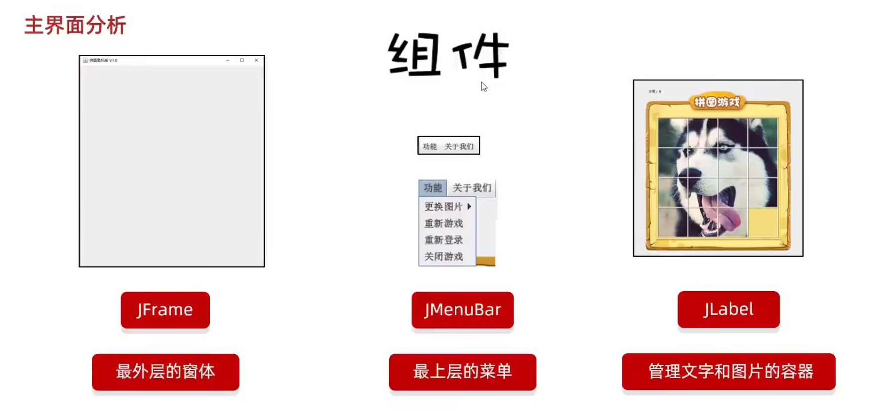

&nbsp;

### 1.1.2、初始化游戏主界面

> 创建主界面

- 在 IDEA 中创建一个宽 603 像素，高 680 像素的游戏主界面

- 在 IDEA 中创建一个宽 488 像素，高 430 像素的登录界面

- 在 IDEA 中创建一个宽 488 像素，高 500 像素的注册界面

```java
/**
 * 创建游戏的界面
 * 1.主界面
 * 2.登录界面
 * 3.注册界面
 *
 * @date 2022/11/10 21:32
 */
public class Main {

    public static void main(String[] args) {
        // write your code here
        /*
             1. 创建一个游戏的主界面
             属性：宽、高
             行为：上下左右移动、统计步数、一键通关、查看最终效果，恶搞好基友
             400 多行代码
         */
        JFrame gameJFrame = new JFrame();
        gameJFrame.setSize(603, 680);
        gameJFrame.setVisible(true);

        /*
            2. 创建一个登录的界面
            获取用户输入的用户名以及密码
            生成一个验证码，获取用户，比较用户名、密码和验证码
            300 多行代码
         */
        JFrame loginJFrame = new JFrame();
        loginJFrame.setSize(488, 430);
        loginJFrame.setVisible(true);

        /* 
        	3. 创建一个注册界面
            获取用户输入的用户名以及密码
            比较用户输入的两次密码是否一致
            判断当前用户是否已经注册
            300 多行代码
         */
        JFrame registerJFrame = new JFrame();
        registerJFrame.setSize(488, 500);
        registerJFrame.setVisible(true);

    }
}
```

使用继承改写上述主界面，并思考使用继承改写的好处

<table><tr><td bgcolor=DarkSeaGreen><center>注册界面</center></td></td></tr></table>

```java
import javax.swing.*;

/**
 * 注册界面：
 * 跟注册相关的逻辑，都写在此类中
 *
 * @author wl
 * @date 2022/11/10 22:26
 */
public class EnrollJFrame extends JFrame {

    /*
        无参构造
     */
    public EnrollJFrame() {
        this.setSize(488, 500);
        // 设置界面的标题
        this.setTitle("拼图 | 注册");
        // 设置界面置顶
        this.setAlwaysOnTop(true);
        // 设置界面居中
        this.setLocationRelativeTo(null);
        // 设置游戏的关闭模式
        this.setDefaultCloseOperation(WindowConstants.EXIT_ON_CLOSE);

        this.setVisible(true);
    }
}
```

<table><tr><td bgcolor=Beige><center>游戏主界面</center></td></td></tr></table>

```java
package com.bbc.ui.jrame;

import javax.swing.*;

/**
 * 游戏主界面：
 * JFrame -> 界面 / 窗体
 * 规定：GameFrame 这个界面表示的就是游戏的主界面
 * 以后和游戏主界面相关的所有逻辑都写在这个类中
 *
 * @author wl
 * @date 2022/11/10 21:38
 */
public class GameJFrame extends JFrame {

   /*
       无参构造
    */
   public GameJFrame() {
      // 设置界面的宽高
      this.setSize(603, 680);
      // 设置界面的标题
      this.setTitle("拼图单机版V1.0");
      // 设置界面置顶
      this.setAlwaysOnTop(true);
      // 设置界面居中
      this.setLocationRelativeTo(null);
      // 设置游戏的关闭模式
      this.setDefaultCloseOperation(WindowConstants.EXIT_ON_CLOSE);

      // 让窗口界面显示出来，建议放在最后
      this.setVisible(true);
   }
}
```

<table><tr><td bgcolor=MistyRose><center>登录界面</center></td></td></tr></table>

```java
package com.bbc.ui.jrame;

import javax.swing.*;

/**
 * 登录界面：
 * 以后所有跟登录相关的逻辑，都写在此类中
 *
 * @author wl
 * @date 2022/11/10 21:43
 */
public class LoginJFrame extends JFrame {

    /*
        无参构造
     */
    public LoginJFrame() {
        /*
            这里可以设置一些信息，比如宽、高
            在创建登录界面的时候，方便展示出来
         */
        this.setSize(488, 430);
        // 设置界面的标题
        this.setTitle("拼图 | 登录");
        // 设置界面置顶
        this.setAlwaysOnTop(true);
        // 设置界面居中
        this.setLocationRelativeTo(null);
        // 设置游戏的关闭模式
        this.setDefaultCloseOperation(WindowConstants.EXIT_ON_CLOSE);
        this.setVisible(true);
    }
}
```

**应用界面**

```java
package com.bbc.ui;

import com.bbc.ui.jrame.GameJFrame;
import com.bbc.ui.jrame.LoginJFrame;
import com.bbc.ui.jrame.EnrollJFrame;

/**
 * 创建游戏的界面
 * 1.主界面
 * 2.登录界面
 * 3.注册界面
 *
 * @date 2022/11/10 21:32
 */
public class App {

   public static void main(String[] args) {
      // write your code here
        /*
             1. 创建一个游戏的主界面
             属性：宽、高
             行为：上下左右移动、统计步数、一键通关、查看最终效果，恶搞好基友
             400 多行代码
         */
      new GameJFrame();

        /*
            2. 创建一个登录的界面
            获取用户输入的用户名以及密码
            生成一个验证码，获取用户，比较用户名、密码和验证码
            300 多行代码
         */
      new LoginJFrame();

        /*
            3. 创建一个注册界面
            获取用户输入的用户名以及密码
            比较用户输入的两次密码是否一致
            判断当前用户是否已经注册
            300 多行代码
         */
      new EnrollJFrame();


   }
}
```

&nbsp;

> 小提示：
>
> &emsp;&emsp;如果同学的英文水平有限，使用 IDEA 阅读源码时可以安装 Translation 插件

&nbsp;

## 1.2、菜单制作

> JMenuBar 、JMenu 和 JMenuItem 之间的关系（神奇而又微妙，像极了爱情）

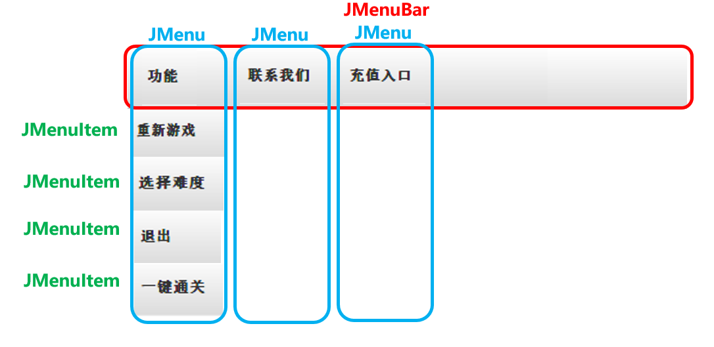

具体步骤：

1. 先创建 JMenuBar 的对象

2. 再创建 JMenu 的功能
3. 接着创建 JMenuItem 项
4. 然后将 JMenuItem 放到 JMenu 里面
5. 把 JMenu 放到 JMenuBar 对象中
6. 最后将 JMenuBar 添加到整个 JFrame 界面中

&nbsp;

> 修改GameJFrame，制作菜单：

```java
package com.bbc.ui.jrame;

import javax.swing.*;

/**
 * 游戏主界面：
 * JFrame -> 界面 / 窗体
 * 规定：GameFrame 这个界面表示的就是游戏的主界面
 * 以后和游戏主界面相关的所有逻辑都写在这个类中
 *
 * @author wl
 * @date 2022/11/10 21:38
 */
public class GameJFrame extends JFrame {

    /*
        无参构造
     */
    public GameJFrame() {
        // 初始化界面
        initFrame();
        // 初始化菜单
        initMenu();
        // 让窗口界面显示出来，建议放在最后
        this.setVisible(true);
    }

    /**
     * 初始化界面
     */
    private void initFrame() {
        // 设置界面的宽高
        this.setSize(603, 680);
        // 设置界面的标题
        this.setTitle("拼图单机版V1.0");
        // 设置界面置顶
        this.setAlwaysOnTop(true);
        // 设置界面居中
        this.setLocationRelativeTo(null);
        // 设置游戏的关闭模式
        this.setDefaultCloseOperation(WindowConstants.EXIT_ON_CLOSE);
    }

    /**
     * 初始化菜单
     */
    private void initMenu() {
          /*
            1.初始化菜单：创建整个的菜单栏对象
         */
        JMenuBar myBar = new JMenuBar();

        // 2.创建菜单栏上面的两个菜单对象
        JMenu functionMenu = new JMenu("功能");
        JMenu aboutUsMenu = new JMenu("关于我们");

        // 3.创建菜单功能项的对象
        JMenuItem replayItem = new JMenuItem("再玩一次");
        JMenuItem loginAgainItem = new JMenuItem("重新登录");
        JMenuItem exitTheGameItem = new JMenuItem("退出游戏");

        JMenuItem officialAccount = new JMenuItem("个人公众号");

        // 4.组合菜单功能项到菜单中
        functionMenu.add(replayItem);
        functionMenu.add(loginAgainItem);
        functionMenu.add(exitTheGameItem);
        aboutUsMenu.add(officialAccount);

       // 5.将两个菜单添加到菜单栏中
       myBar.add(functionMenu);
       myBar.add(aboutUsMenu);

       // 6.在游戏界面中设置菜单栏
       this.setJMenuBar(myBar);
    }
}
```

&nbsp;

## 1.3、添加图片

1. 使用 JLabel 管理界面的区域，增加图片或文字：

```java
package com.bbc.ui.jrame;

import javax.swing.*;

/**
 * 游戏主界面：
 * JFrame -> 界面 / 窗体
 * 规定：GameFrame 这个界面表示的就是游戏的主界面
 * 以后和游戏主界面相关的所有逻辑都写在这个类中
 *
 * @author wl
 * @date 2022/11/10 21:38
 */
public class GameJFrame extends JFrame {

   /*
       无参构造
    */
   public GameJFrame() {
      // 初始化界面
      initFrame();
      // 初始化菜单
      initMenu();
      // 初始化图片
      initImage();
      // 让窗口界面显示出来，建议放在最后
      this.setVisible(true);
   }

   /**
    * 初始化图片
    */
   private void initImage() {
      // 创建一个 ImageIcon 的对象
      ImageIcon icon = new ImageIcon("文件的具体位置", "个人公众号");
      // 创建一个JLabel 对象
      JLabel jLabel = new JLabel(icon);
      // 把管理容器添加到界面中
      this.add(jLabel);
   }

   /**
    * 初始化界面
    */
   private void initFrame() {
      // 设置界面的宽高
      this.setSize(603, 680);
      // 设置界面的标题
      this.setTitle("拼图单机版V1.0");
      // 设置界面置顶
      this.setAlwaysOnTop(true);
      // 设置界面居中
      this.setLocationRelativeTo(null);
      // 设置游戏的关闭模式
      this.setDefaultCloseOperation(WindowConstants.EXIT_ON_CLOSE);
   }

   /**
    * 初始化菜单
    */
   private void initMenu() {
          /*
            1.初始化菜单：创建整个的菜单栏对象
         */
      JMenuBar myBar = new JMenuBar();

      // 2.创建菜单栏上面的两个菜单对象
      JMenu functionMenu = new JMenu("功能");
      JMenu aboutUsMenu = new JMenu("关于我们");

      // 3.创建菜单功能项的对象
      JMenuItem replayItem = new JMenuItem("再玩一次");
      JMenuItem loginAgainItem = new JMenuItem("重新登录");
      JMenuItem exitTheGameItem = new JMenuItem("退出游戏");

      JMenuItem officialAccount = new JMenuItem("个人公众号");

      // 4.组合菜单功能项到菜单中
      functionMenu.add(replayItem);
      functionMenu.add(loginAgainItem);
      functionMenu.add(exitTheGameItem);
      aboutUsMenu.add(officialAccount);

      // 5.将两个菜单添加到菜单栏中
      myBar.add(functionMenu);
      myBar.add(aboutUsMenu);

      // 6.在游戏界面中设置菜单栏
      this.setJMenuBar(myBar);
   }
}

```

2. 使用 getContentPane() 方法获取隐藏容器，确定图片的下标，移动图片的位置

```java
package com.bbc.ui.jrame;

import javax.swing.*;
import java.awt.*;

/**
 * 游戏主界面：
 * JFrame -> 界面 / 窗体
 * 规定：GameFrame 这个界面表示的就是游戏的主界面
 * 以后和游戏主界面相关的所有逻辑都写在这个类中
 *
 * @author wl
 * @date 2022/11/10 21:38
 */
public class GameJFrame extends JFrame {

    /*
        无参构造
     */
    public GameJFrame() {
        super();
        // 初始化界面
        initFrame();
        // 初始化菜单
        initMenu();
        // 初始化图片
        initImage();
        // 让窗口界面显示出来，建议放在最后
        this.setVisible(true);
    }

    /**
     * 初始化图片
     */
    private void initImage() {
        // 创建一个 ImageIcon 的对象
        ImageIcon icon = new ImageIcon("material/animal/animal1/1.jpg");
        // 创建一个JLabel 对象
        JLabel jLabel = new JLabel(icon);
        // 指定图片位置
        jLabel.setBounds(0, 0, 105, 105);
        // 设置布局为空
        Container contentPane = getContentPane();
        contentPane.add(jLabel);
    }

    /**
     * 初始化界面
     */
    private void initFrame() {
        // 设置界面的宽高
        this.setSize(603, 680);
        // 设置界面的标题
        this.setTitle("拼图单机版V1.0");
        // 设置界面置顶
        this.setAlwaysOnTop(true);
        // 设置界面居中
        this.setLocationRelativeTo(null);
        // 设置游戏的关闭模式
        this.setDefaultCloseOperation(WindowConstants.EXIT_ON_CLOSE);
        // 取消默认的居中放置模式，只有取消了才能按照XY轴的形式添加组件
        this.setLayout(null);
    }

    /**
     * 初始化菜单
     */
    private void initMenu() {
          /*
            1.初始化菜单：创建整个的菜单栏对象
         */
        JMenuBar myBar = new JMenuBar();

        // 2.创建菜单栏上面的两个菜单对象
        JMenu functionMenu = new JMenu("功能");
        JMenu aboutUsMenu = new JMenu("关于我们");

        // 3.创建菜单功能项的对象
        JMenuItem replayItem = new JMenuItem("再玩一次");
        JMenuItem loginAgainItem = new JMenuItem("重新登录");
        JMenuItem exitTheGameItem = new JMenuItem("退出游戏");

        JMenuItem officialAccount = new JMenuItem("个人公众号");

        // 4.组合菜单功能项到菜单中
        functionMenu.add(replayItem);
        functionMenu.add(loginAgainItem);
        functionMenu.add(exitTheGameItem);
        aboutUsMenu.add(officialAccount);

        // 5.将两个菜单添加到菜单栏中
        myBar.add(functionMenu);
        myBar.add(aboutUsMenu);

        // 6.在游戏界面中设置菜单栏
        this.setJMenuBar(myBar);
    }
}
```

3. 通过循环移动位置进而加载所有的图片

```java
package com.bbc.ui.jrame;

import javax.swing.*;
import java.awt.*;

/**
 * 游戏主界面：
 * JFrame -> 界面 / 窗体
 * 规定：GameFrame 这个界面表示的就是游戏的主界面
 * 以后和游戏主界面相关的所有逻辑都写在这个类中
 *
 * @author wl
 * @date 2022/11/10 21:38
 */
public class GameJFrame extends JFrame {

    /*
        无参构造
     */
    public GameJFrame() {
        super();
        // 初始化界面
        initFrame();
        // 初始化菜单
        initMenu();
        // 初始化图片
        initImage();
        // 让窗口界面显示出来，建议放在最后
        this.setVisible(true);
    }

    /**
     * 初始化图片
     */
    private void initImage() {
        // 设置布局为空
        Container contentPane = getContentPane();
        int number = 1;
        for (int y = 0; y < 4; y++) {
            for (int x = 0; x < 4; x++) {
                // 创建一个JLabel 对象
                JLabel jLabel = new JLabel(new ImageIcon("material/animal/animal1/" + number +".jpg"));
                // 指定图片位置
                jLabel.setBounds(105 * x, 105 * y, 105, 105);
                contentPane.add(jLabel);
                number ++;
            }
        }

    }

    /**
     * 初始化界面
     */
    private void initFrame() {
        // 设置界面的宽高
        this.setSize(603, 680);
        // 设置界面的标题
        this.setTitle("拼图单机版V1.0");
        // 设置界面置顶
        this.setAlwaysOnTop(true);
        // 设置界面居中
        this.setLocationRelativeTo(null);
        // 设置游戏的关闭模式
        this.setDefaultCloseOperation(WindowConstants.EXIT_ON_CLOSE);
        // 取消默认的居中放置模式，只有取消了才能按照XY轴的形式添加组件
        this.setLayout(null);
    }

    /**
     * 初始化菜单
     */
    private void initMenu() {
          /*
            1.初始化菜单：创建整个的菜单栏对象
         */
        JMenuBar myBar = new JMenuBar();

        // 2.创建菜单栏上面的两个菜单对象
        JMenu functionMenu = new JMenu("功能");
        JMenu aboutUsMenu = new JMenu("关于我们");

        // 3.创建菜单功能项的对象
        JMenuItem replayItem = new JMenuItem("再玩一次");
        JMenuItem loginAgainItem = new JMenuItem("重新登录");
        JMenuItem exitTheGameItem = new JMenuItem("退出游戏");

        JMenuItem officialAccount = new JMenuItem("个人公众号");

        // 4.组合菜单功能项到菜单中
        functionMenu.add(replayItem);
        functionMenu.add(loginAgainItem);
        functionMenu.add(exitTheGameItem);
        aboutUsMenu.add(officialAccount);

        // 5.将两个菜单添加到菜单栏中
        myBar.add(functionMenu);
        myBar.add(aboutUsMenu);

        // 6.在游戏界面中设置菜单栏
        this.setJMenuBar(myBar);
    }
}
```

4. 打乱图片顺序

   > 练习

   打乱一维数组中的数据

   `int[] tempArr = {0, 1, 2, 3, 4, 5, 6, 7, 8, 9, 10, 11, 12, 13, 14, 15}; `

   要求：打乱一维数组中的数据，并按照 4 个一组方式将其添加到二维数组中：

   ```java
   package com.bbc.ui.test;
   
   import java.util.Arrays;
   import java.util.Random;
   
   /**
    * 打乱数据测试
    *
    * @author wl
    * @date 2022/11/15 19:30
    */
   public class ShuffleDataTest {
   
       public static void main(String[] args) {
           int[] tempArr = {0, 1, 2, 3, 4, 5, 6, 7, 8, 9, 10, 11, 12, 13, 14, 15};
           /*
               需求：打乱一维数组中的数据，并按照 4 个一组方式将其添加到二维数组中
            */
           // 1. 打乱一维数组中的数据
           Random random = new Random();
           for (int i = 0; i < tempArr.length; i++) {
               int index = random.nextInt(tempArr.length);
               int temp = tempArr[i];
               tempArr[i] = tempArr[index];
               tempArr[index] = temp;
           }
           System.out.println("Arrays.toString(tempArr) = " + Arrays.toString(tempArr));
           // 2.将打乱后的数据添加二维数组
           // 这是第一种解法
           int[][] data = new int[4][4];
   //        for (int i = 0; i < tempArr.length; i++) {
   //            data[i/4][i%4] = tempArr[i];
   //        }
           // 这是第二种解法
           int index = 0;
           for (int i = 0; i < data.length; i++) {
               for (int j = 0; j < data[i].length; j++) {
                   data[i][j] = tempArr[index++];
               }
           }
   
           for (int i = 0; i < data.length; i++) {
               for (int j = 0; j < data[i].length; j++) {
                   System.out.print(data[i][j] + "\t");
               }
               System.out.println();
           }
       }
   }
   
   ```

   接着打乱图片的顺序：

   ```java
   package com.bbc.ui.jrame;
   
   import javax.swing.*;
   import java.awt.*;
   import java.util.Arrays;
   import java.util.Random;
   
   /**
    * 游戏主界面：
    * JFrame -> 界面 / 窗体
    * 规定：GameFrame 这个界面表示的就是游戏的主界面
    * 以后和游戏主界面相关的所有逻辑都写在这个类中
    *
    * @author wl
    * @date 2022/11/10 21:38
    */
   public class GameJFrame extends JFrame {
   
       int[][] data = new int[4][4];
   
       /*
           无参构造
        */
       public GameJFrame() {
           super();
           // 初始化界面
           initFrame();
           // 初始化菜单
           initMenu();
           // 初始化数据（打乱）
           initData();
           // 初始化图片
           initImage();
           // 让窗口界面显示出来，建议放在最后
           this.setVisible(true);
       }
   
       /**
        * 初始化数据（打乱）
        */
       private void initData() {
           int[] tempArr = {0, 1, 2, 3, 4, 5, 6, 7, 8, 9, 10, 11, 12, 13, 14, 15};
           /*
               需求：打乱一维数组中的数据，并按照 4 个一组方式将其添加到二维数组中
            */
           // 1. 打乱一维数组中的数据
           Random random = new Random();
           for (int i = 0; i < tempArr.length; i++) {
               int index = random.nextInt(tempArr.length);
               int temp = tempArr[i];
               tempArr[i] = tempArr[index];
               tempArr[index] = temp;
           }
           // 2.将打乱后的数据添加二维数组
           // 这是第一种解法
           for (int i = 0; i < tempArr.length; i++) {
               data[i/4][i%4] = tempArr[i];
           }
       }
   
       /**
        * 初始化图片
        */
       private void initImage() {
           // 设置布局为空
           Container contentPane = getContentPane();;
           for (int y = 0; y < 4; y++) {
               for (int x = 0; x < 4; x++) {
                   // 获取序号
                   int num = data[x][y];
                   // 创建一个JLabel 对象
                   JLabel jLabel = new JLabel(new ImageIcon("material/animal/animal1/" + num + ".jpg"));
                   // 指定图片位置
                   jLabel.setBounds(105 * x, 105 * y, 105, 105);
                   contentPane.add(jLabel);
               }
           }
   
       }
   
       /**
        * 初始化界面
        */
       private void initFrame() {
           // 设置界面的宽高
           this.setSize(603, 680);
           // 设置界面的标题
           this.setTitle("拼图单机版V1.0");
           // 设置界面置顶
           this.setAlwaysOnTop(true);
           // 设置界面居中
           this.setLocationRelativeTo(null);
           // 设置游戏的关闭模式
           this.setDefaultCloseOperation(WindowConstants.EXIT_ON_CLOSE);
           // 取消默认的居中放置模式，只有取消了才能按照XY轴的形式添加组件
           this.setLayout(null);
       }
   
       /**
        * 初始化菜单
        */
       private void initMenu() {
             /*
               1.初始化菜单：创建整个的菜单栏对象
            */
           JMenuBar myBar = new JMenuBar();
   
           // 2.创建菜单栏上面的两个菜单对象
           JMenu functionMenu = new JMenu("功能");
           JMenu aboutUsMenu = new JMenu("关于我们");
   
           // 3.创建菜单功能项的对象
           JMenuItem replayItem = new JMenuItem("再玩一次");
           JMenuItem loginAgainItem = new JMenuItem("重新登录");
           JMenuItem exitTheGameItem = new JMenuItem("退出游戏");
   
           JMenuItem officialAccount = new JMenuItem("个人公众号");
   
           // 4.组合菜单功能项到菜单中
           functionMenu.add(replayItem);
           functionMenu.add(loginAgainItem);
           functionMenu.add(exitTheGameItem);
           aboutUsMenu.add(officialAccount);
   
           // 5.将两个菜单添加到菜单栏中
           myBar.add(functionMenu);
           myBar.add(aboutUsMenu);
   
           // 6.在游戏界面中设置菜单栏
           this.setJMenuBar(myBar);
       }
   }
   ```

&nbsp;

> 小结
>
> 这个人太懒了，什么都没有写

&nbsp;

# 二、事件操作和界面美化

- 三种类型的动作事件
- 游戏界面的美化

## 2.1、三种类型的动作事件

&emsp;&emsp;在图形用户界面中，可以被组件识别的行为就叫**事件** (当你对组件干了某些事情之后，就会执行相应的业务逻辑)。而事件源可以是<font face="宋体" color="red">按钮、图片或窗体</font>
，例如当登录按钮被点击之后，就会校验用户名和密码，这就叫做事件的操作。

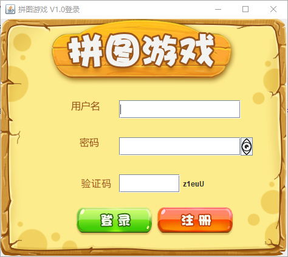

> 事件

1. 事件源：按钮、图片或窗口

2. 事件：某些操作，如鼠标单击或划入

3. 绑定监听：当事件源上发生了某个事件，则执行某段代码，一共有 KeyListener (键盘监听)、MouseListener (鼠标监听) 和 ActionListener (动作监听) 三种监听器

&nbsp;

### 2.1.1、动作监听

**动作监听机制-ActionListener**

&emsp;&emsp;主要用于监听鼠标和键盘的动作，是鼠标监听器和键盘监听器的阉割版。所以能监听的动作很有限，键盘只能监听空格操作，而鼠标的话也只能监听单击动作。

> 实现方式

1. 匿名类

```java
import javax.swing.*;

/**
 * @author wl
 * @date 2022/11/21 20:17
 */
public class JFrameTest {

    public static void main(String[] args) {
        JFrame jFrame = new JFrame();
        // 设置界面的宽高
        jFrame.setSize(603, 680);
        // 设置界面的标题
        jFrame.setTitle("事件演示");
        // 设置界面置顶
        jFrame.setAlwaysOnTop(true);
        // 设置界面居中
        jFrame.setLocationRelativeTo(null);
        // 设置关闭模式
        jFrame.setDefaultCloseOperation(WindowConstants.EXIT_ON_CLOSE);
        // 取消默认的居中放置
        jFrame.setLayout(null);

        // 创建一个按钮对象
        JButton jButton = new JButton("点我啊");
        // 设置按钮的位置和宽高
        jButton.setBounds(0,0, 100, 50);
        // 设置动作监听：表示我要给组件添加哪个事件监听
        jButton.addActionListener((event) ->
           // 事件会被触发后执行的代码：监听空格与点击操作
            System.out.println("我草拟大爷")
        );

        jFrame.getContentPane().add(jButton);

        // 显示界面
        jFrame.setVisible(true);
    }
}
```

2. 自身实现

```java
import javax.swing.*;
import java.awt.event.ActionEvent;
import java.awt.event.ActionListener;

/**
 * @author wl
 * @date 2022/11/21 20:33
 */
public class MyJFrame extends JFrame implements ActionListener {

    JButton jButton1 = new JButton("点我啊");

    JButton jButton2 = new JButton("再点我啊");

    public MyJFrame() {
        // 设置界面的宽高
        this.setSize(603, 680);
        // 设置界面的标题
        this.setTitle("事件演示");
        // 设置界面置顶
        this.setAlwaysOnTop(true);
        // 设置界面居中
        this.setLocationRelativeTo(null);
        // 设置关闭模式
        this.setDefaultCloseOperation(WindowConstants.EXIT_ON_CLOSE);
        // 取消默认的居中放置
        this.setLayout(null);

        // 创建一个按钮对象

        // 设置按钮1的位置和宽高
        jButton1.setBounds(0,0, 100, 50);
        // 设置动作监听：表示我要给组件添加哪个事件监听
        jButton1.addActionListener(this);

        // 设置按钮2的位置和宽高
        jButton2.setBounds(100,0, 100, 50);
        // 设置动作监听：表示我要给组件添加哪个事件监听
        jButton2.addActionListener(this);

        this.getContentPane().add(jButton1);
        this.getContentPane().add(jButton2);

        // 显示界面
        this.setVisible(true);
    }

    /**
     * Invoked when an action occurs.
     *
     * @param e 动作事件
     */
    @Override
    public void actionPerformed(ActionEvent e) {
        // 获取被操作的按钮对象
        Object source = e.getSource();

        if(source == jButton1) {
            // 重新设置按钮1的大小
            jButton1.setSize(200, 200);
        } else if(source == jButton2) {
            // 重新设置按钮2的位置
            jButton2.setLocation((int)(Math.random() * 500), (int)(Math.random() * 500));
        }
    }

    public static void main(String[] args) {
        MyJFrame myJFrame = new MyJFrame();
    }
}
```

### 2.1.2、鼠标监听

> 鼠标监听机制-MouseListener

主要监听鼠标的操作，其监听机制一共有三种动作：

1. 划入动作 -> 光标移动到按钮上

2. 按下动作 -> 光标点击一次且不松开

3. 松开动作 -> 光标点击一次按钮然后松开

4. 划出动作 -> 光标离开按钮

按下动作和松开动作都属于单击操作，如果想监听某个按钮的单击事件，可以使用<font color="red">动作监听</font>、<font color="red">鼠标监听中的单击操作</font>。

```java
import javax.swing.*;
import java.awt.event.MouseEvent;
import java.awt.event.MouseListener;

/**
 * MouseListener
 *
 * @author wl
 * @date 2022/11/21 21:10
 */
public class MouseActionJFrame extends JFrame implements MouseListener {

   JButton jButton1 = new JButton("点我啊");

   public MouseActionJFrame() {
      // 设置界面的宽高
      this.setSize(603, 680);
      // 设置界面的标题
      this.setTitle("事件演示");
      // 设置界面置顶
      this.setAlwaysOnTop(true);
      // 设置界面居中
      this.setLocationRelativeTo(null);
      // 设置关闭模式
      this.setDefaultCloseOperation(WindowConstants.EXIT_ON_CLOSE);
      // 取消默认的居中放置
      this.setLayout(null);

      // 设置按钮1的位置和宽高
      jButton1.setBounds(0, 0, 100, 50);
      // 设置动作监听：表示我要给组件添加哪个事件监听
      jButton1.addMouseListener(this);

      // 设置动作监听：表示我要给组件添加哪个事件监听

      this.getContentPane().add(jButton1);

      // 显示界面
      this.setVisible(true);
   }

   /**
    * 在组件上单击（按下并释放）鼠标按键时调用
    *
    * @param e 鼠标事件
    */
   @Override
   public void mouseClicked(MouseEvent e) {
      System.out.println("单击");
   }

   /**
    * 在组件上按住鼠标按钮不放时调用
    *
    * @param e 鼠标事件
    */
   @Override
   public void mousePressed(MouseEvent e) {
      System.out.println("按下不松");
   }

   /**
    * 在组件上松开鼠标按钮时调用
    *
    * @param e 鼠标事件
    */
   @Override
   public void mouseReleased(MouseEvent e) {
      System.out.println("松开");
   }

   /**
    * 当鼠标进入组件时调用
    *
    * @param e 鼠标事件
    */
   @Override
   public void mouseEntered(MouseEvent e) {
      System.out.println("划入");
   }

   /**
    * 当鼠标退出组件时调用
    *
    * @param e 鼠标事件
    */
   @Override
   public void mouseExited(MouseEvent e) {
      System.out.println("划出");
   }

   // 测试方法
   public static void main(String[] args) {
      MouseActionJFrame mouseActionJFrame = new MouseActionJFrame();
   }

```

### 2.1.3、键盘监听

> 键盘监听机制-KeyListener

主要监听键盘的操作，且此类中一共有三个方法：

```java
public interface KeyListener extends EventListener {
   /**
    * 按下按键时调用
    */
   public void keyPressed(KeyEvent e);

   /**
    *  松开按键时被调用
    */
   public void keyReleased(KeyEvent e);

   /**
    * 输入按键时调用
    */
   public void keyTyped(KeyEvent e);
}
```

测试代码

```java
import javax.swing.*;
import java.awt.event.KeyEvent;
import java.awt.event.KeyListener;

/**
 * KeyListener
 *
 * @author wl
 * @date 2022/11/21 21:37
 */
public class KeyExtendJFrame extends JFrame implements KeyListener {


    public KeyExtendJFrame() {
        // 设置界面的宽高
        this.setSize(603, 680);
        // 设置界面的标题
        this.setTitle("事件演示");
        // 设置界面置顶
        this.setAlwaysOnTop(true);
        // 设置界面居中
        this.setLocationRelativeTo(null);
        // 设置关闭模式
        this.setDefaultCloseOperation(WindowConstants.EXIT_ON_CLOSE);
        // 取消默认的居中放置
        this.setLayout(null);
        // 表示给整个界面添加监听事件
        this.addKeyListener(this);

        // 显示界面
        this.setVisible(true);
    }
    /**
     * 按下按键时调用
     */
    public void keyPressed(KeyEvent e) {
        System.out.println("按住不松");
    }

    /**
     *  松开按键时被调用
     */
    public void keyReleased(KeyEvent e) {
        System.out.println("松开按键");
        int keyCode = e.getKeyCode();
        System.out.printf("你按下的是%c\n", keyCode);
    }

    /**
     * 输入按键时调用
     */
    public void keyTyped(KeyEvent e) {
        System.out.println("输入按键");
    }

    public static void main(String[] args) {
        KeyExtendJFrame keyExtendJFrame = new KeyExtendJFrame();
    }
}
```

&nbsp;

## 2.2、游戏界面的美化

> 具体步骤

1. 将共计 15 张小图片移动到游戏界面的中央偏下方的区域，并且给其添加一个图片边框

2. 给游戏界面添加一张契合小图片的背景图片，并且优化图片的路径，从绝对路径改为相对路径引入

```java
import javax.swing.*;
import javax.swing.border.BevelBorder;
import java.awt.*;
import java.util.Random;

/**
 * 游戏主界面：
 * JFrame -> 界面 / 窗体
 * 规定：GameFrame 这个界面表示的就是游戏的主界面
 * 以后和游戏主界面相关的所有逻辑都写在这个类中
 *
 * @author wl
 * @date 2022/11/10 21:38
 */
public class GameJFrame extends JFrame {

    /**
     * 用于打乱图片
     */
    static final int[][] DATA = new int[4][4];

    /**
     * 图片数组数据
     */
    static final int[] TEMP_ARR;

    static {
        // 初始化图片数据
        TEMP_ARR = new int[]{
                0, 1, 2, 3, 4, 5,
                6, 7, 8, 9, 10,
                11, 12, 13, 14, 15,
        };
    }

    /*
        无参构造
     */
    public GameJFrame() {
        super();
        // 初始化界面
        initFrame();
        // 初始化菜单
        initMenu();
        // 初始化数据（打乱）
        initData();
        // 初始化图片
        initImage();
        // 让窗口界面显示出来，建议放在最后
        this.setVisible(true);
    }

    /**
     * 初始化数据（打乱）
     */
    private void initData() {
        /*
            需求：打乱一维数组中的数据，并按照 4 个一组方式将其添加到二维数组中
         */
        // 1. 打乱一维数组中的数据
        Random random = new Random();
        for (int i = 0; i < TEMP_ARR.length; i++) {
            int index = random.nextInt(TEMP_ARR.length);
            int temp = TEMP_ARR[i];
            TEMP_ARR[i] = TEMP_ARR[index];
            TEMP_ARR[index] = temp;
        }
        // 2.将打乱后的数据添加二维数组
        // 这是第一种解法
        for (int i = 0; i < TEMP_ARR.length; i++) {
            DATA[i / 4][i % 4] = TEMP_ARR[i];
        }
    }

    /**
     * 初始化图片
     */
    private void initImage() {
        // 设置布局为空
        Container contentPane = getContentPane();
        /*
            细节：先加载的图片在上方，后加载的图片在下方
         */

        for (int y = 0; y < 4; y++) {
            for (int x = 0; x < 4; x++) {
                // 获取序号
                int num = DATA[x][y];
                // 创建一个JLabel 对象
                JLabel jLabel = new JLabel(new ImageIcon("material/animal/animal1/" + num + ".jpg"));
                // 指定图片位置
                jLabel.setBounds(105 * x + 83, 105 * y + 134, 105, 105);
                // 为图片添加边框 0图片突出 1图片凹陷
                jLabel.setBorder(new BevelBorder(BevelBorder.LOWERED));
                contentPane.add(jLabel);
            }
        }

        // 添加背景图片
        JLabel background = new JLabel(new ImageIcon("material/background.png"));
        background.setBounds(40, 40, 508, 560);
        // 把背景图片添加到界面中
        contentPane.add(background);

    }

    /**
     * 初始化界面
     */
    private void initFrame() {
        // 设置界面的宽高
        this.setSize(603, 680);
        // 设置界面的标题
        this.setTitle("拼图单机版V1.0");
        // 设置界面置顶
        this.setAlwaysOnTop(true);
        // 设置界面居中
        this.setLocationRelativeTo(null);
        // 设置游戏的关闭模式
        this.setDefaultCloseOperation(WindowConstants.EXIT_ON_CLOSE);
        // 取消默认的居中放置模式，只有取消了才能按照XY轴的形式添加组件
        this.setLayout(null);
    }

    /**
     * 初始化菜单
     */
    private void initMenu() {
          /*
            1.初始化菜单：创建整个的菜单栏对象
         */
        JMenuBar myBar = new JMenuBar();

        // 2.创建菜单栏上面的两个菜单对象
        JMenu functionMenu = new JMenu("功能");
        JMenu aboutUsMenu = new JMenu("关于我们");

        // 3.创建菜单功能项的对象
        JMenuItem replayItem = new JMenuItem("再玩一次");
        JMenuItem loginAgainItem = new JMenuItem("重新登录");
        JMenuItem exitTheGameItem = new JMenuItem("退出游戏");

        JMenuItem officialAccount = new JMenuItem("个人公众号");

        // 4.组合菜单功能项到菜单中
        functionMenu.add(replayItem);
        functionMenu.add(loginAgainItem);
        functionMenu.add(exitTheGameItem);
        aboutUsMenu.add(officialAccount);

        // 5.将两个菜单添加到菜单栏中
        myBar.add(functionMenu);
        myBar.add(aboutUsMenu);

        // 6.在游戏界面中设置菜单栏
        this.setJMenuBar(myBar);
    }
}

```

# 三、游戏功能实现

- 图片移动
- 查看完整图片
- 作弊码 —— 金手指
- 游戏胜利的判断

&nbsp;

&nbsp;

## 3.3、图片移动

> 上下左右移动

1. 上移动：实际上就是把空白方块下方的图片向下移动一个格子

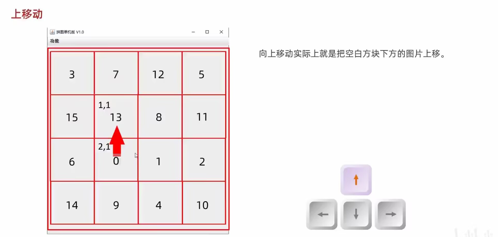

2. 下移动：实际上就是把空白方块下方的图片向上移动一个格子
3. 左移动：实际上就是把空白方块左边的图片向右移动一个格子
4. 右移动：实际上就是把空白方块右边的图片向左移动一个格子

> 代码实现

- 本类实现 KeyListener 接口，并重写其抽象方法
- 给整个界面添加键盘监听事件
- 统计空方块对应的数字 0 在二维数组中的位置
- 在 keyReleased 方法中实现移动的逻辑
- 当空白方块处于图片的边界时，要注意不要超过图片的边界 (下标)

```java
package com.bbc.ui.jrame;

import com.bbc.ui.constant.KeyboardOrientation;

import javax.swing.*;
import javax.swing.border.BevelBorder;
import java.awt.*;
import java.awt.event.KeyEvent;
import java.awt.event.KeyListener;
import java.util.Random;

/**
 * 游戏主界面：
 * JFrame -> 界面 / 窗体
 * 规定：GameFrame 这个界面表示的就是游戏的主界面
 * 以后和游戏主界面相关的所有逻辑都写在这个类中
 *
 * @author wl
 * @date 2022/11/10 21:38
 */
public class GameJFrame extends JFrame implements KeyListener {

    /**
     * 用于打乱图片
     */
    static final int[][] DATA = new int[4][4];

    /**
     * 图片数组数据
     */
    static final int[] TEMP_ARR;

    static {
        // 初始化图片数据
        TEMP_ARR = new int[]{
                0, 1, 2, 3, 4, 5,
                6, 7, 8, 9, 10,
                11, 12, 13, 14, 15,
        };
    }

    /**
     * 空白方块下标位置
     */
    private int x = 0;
    private int y = 0;

    /*
        无参构造
     */
    public GameJFrame() {
        super();
        // 初始化界面
        initFrame();
        // 初始化菜单
        initMenu();
        // 初始化数据（打乱）
        initData();
        // 初始化图片
        initImage();
        // 让窗口界面显示出来，建议放在最后
        this.setVisible(true);
    }

    /**
     * 初始化数据（打乱）
     */
    private void initData() {
        /*
            需求：打乱一维数组中的数据，并按照 4 个一组方式将其添加到二维数组中
         */
        // 1. 打乱一维数组中的数据
        Random random = new Random();
        for (int i = 0; i < TEMP_ARR.length; i++) {
            int index = random.nextInt(TEMP_ARR.length);
            int temp = TEMP_ARR[i];
            TEMP_ARR[i] = TEMP_ARR[index];
            TEMP_ARR[index] = temp;
        }
        // 2.将打乱后的数据添加二维数组
        // 这是第一种解法
        for (int i = 0; i < TEMP_ARR.length; i++) {
            // 记录零的位置
            if (TEMP_ARR[i] == 0) {
                x = i / 4;// x
                y = i % 4;// y
            } else {
                DATA[i / 4][i % 4] = TEMP_ARR[i];
            }
        }
    }

    /**
     * 初始化图片
     */
    private void initImage() {
        // 清空原来的图片再加载新的图片
        Container contentPane = getContentPane();
        contentPane.removeAll();
        // 设置布局为空
        /*
            细节：先加载的图片在上方，后加载的图片在下方
         */

        for (int y = 0; y < 4; y++) {
            for (int x = 0; x < 4; x++) {
                // 获取序号
                int num = DATA[x][y];
                // 创建一个JLabel 对象
                JLabel jLabel = new JLabel(new ImageIcon("material/animal/animal1/" + num + ".jpg"));
                // 指定图片位置
                jLabel.setBounds(105 * x + 83, 105 * y + 134, 105, 105);
                // 为图片添加边框 0图片突出 1图片凹陷
                jLabel.setBorder(new BevelBorder(BevelBorder.LOWERED));
                contentPane.add(jLabel);
            }
        }

        // 添加背景图片
        JLabel background = new JLabel(new ImageIcon("material/background.png"));
        background.setBounds(40, 40, 508, 560);
        // 把背景图片添加到界面中
        contentPane.add(background);
        // 重新加载界面
        contentPane.repaint();
    }

    /**
     * 初始化界面
     */
    private void initFrame() {
        // 设置界面的宽高
        this.setSize(603, 680);
        // 设置界面的标题
        this.setTitle("拼图单机版V1.0");
        // 设置界面置顶
        this.setAlwaysOnTop(true);
        // 设置界面居中
        this.setLocationRelativeTo(null);
        // 设置游戏的关闭模式
        this.setDefaultCloseOperation(WindowConstants.EXIT_ON_CLOSE);
        // 取消默认的居中放置模式，只有取消了才能按照XY轴的形式添加组件
        this.setLayout(null);
        // 给整个界面添加键盘监听事件
        this.addKeyListener(this);
    }

    /**
     * 初始化菜单
     */
    private void initMenu() {
          /*
            1.初始化菜单：创建整个的菜单栏对象
         */
        JMenuBar myBar = new JMenuBar();

        // 2.创建菜单栏上面的两个菜单对象
        JMenu functionMenu = new JMenu("功能");
        JMenu aboutUsMenu = new JMenu("关于我们");

        // 3.创建菜单功能项的对象
        JMenuItem replayItem = new JMenuItem("再玩一次");
        JMenuItem loginAgainItem = new JMenuItem("重新登录");
        JMenuItem exitTheGameItem = new JMenuItem("退出游戏");

        JMenuItem officialAccount = new JMenuItem("个人公众号");

        // 4.组合菜单功能项到菜单中
        functionMenu.add(replayItem);
        functionMenu.add(loginAgainItem);
        functionMenu.add(exitTheGameItem);
        aboutUsMenu.add(officialAccount);

        // 5.将两个菜单添加到菜单栏中
        myBar.add(functionMenu);
        myBar.add(aboutUsMenu);

        // 6.在游戏界面中设置菜单栏
        this.setJMenuBar(myBar);
    }

    /**
     * Invoked when a key has been typed.
     * See the class description for {@link KeyEvent} for a definition of
     * a key typed event.
     *
     * @param e 键盘事件
     */
    @Override
    public void keyTyped(KeyEvent e) {

    }

    /**
     * Invoked when a key has been pressed.
     * See the class description for {@link KeyEvent} for a definition of
     * a key pressed event.
     *
     * @param e 键盘事件
     */
    @Override
    public void keyPressed(KeyEvent e) {

    }

    /**
     * Invoked when a key has been released.
     * See the class description for {@link KeyEvent} for a definition of
     * a key released event.
     *
     * @param e 键盘事件
     */
    @Override
    public void keyReleased(KeyEvent e) {
        // 对上下左右进行判断
        int keyCode = e.getKeyCode();
        /*
            左 37 上 38
            右 39 下 40
            二维数组和一维数组下标相反
         */
        switch (keyCode) {
            case KeyboardOrientation.LEFT_KEY:
            case KeyboardOrientation.LEFT_A:
                // 越界判定
                if(x == 0) {
                    return;
                }
                System.out.println("向左移动");
                /*
                    逻辑：
                    把空白方块左方的数字赋值给空白方块
                 */
                DATA[x][y] = DATA[x - 1][y];
                DATA[x - 1][y] = 0;
                x--;
                break;
            // 实现向上移动
            case KeyboardOrientation.UPPER_KEY:
            case KeyboardOrientation.UPPER_W:
                // 越界判定
                if(y == 0) {
                    return;
                }
                System.out.println("向上移动");
                /*
                    逻辑：
                    把空白方块上方的数字赋值给空白方块
                 */
                DATA[x][y] = DATA[x][y - 1];
                DATA[x][y - 1] = 0;
                y--;
                break;
            case KeyboardOrientation.RIGHT_KEY:
            case KeyboardOrientation.RIGHT_D:
                // 越界判定
                if(x == 3) {
                    return;
                }
                System.out.println("向右移动");
                 /*
                    逻辑：
                    把空白方块右方的数字赋值给空白方块
                 */
                DATA[x][y] = DATA[x + 1][y];
                DATA[x + 1][y] = 0;
                x++;
                break;
            case KeyboardOrientation.LOWER_KEY:
            case KeyboardOrientation.LOWER_S:
                // 越界判定
                if(y == 3) {
                    return;
                }
                System.out.println("向下移动");
                /*
                    逻辑：
                    把空白方块下方的数字赋值给空白方块
                 */
                DATA[x][y] = DATA[x][y + 1];
                DATA[x][y + 1] = 0;
                y++;
                break;
            default:
                break;
        }
        // 刷新图片
        initImage();
    }
}
```

&nbsp;

## 3.4、查看完整图片

按住某个快捷键显示完整的图片，比如按住 P 键

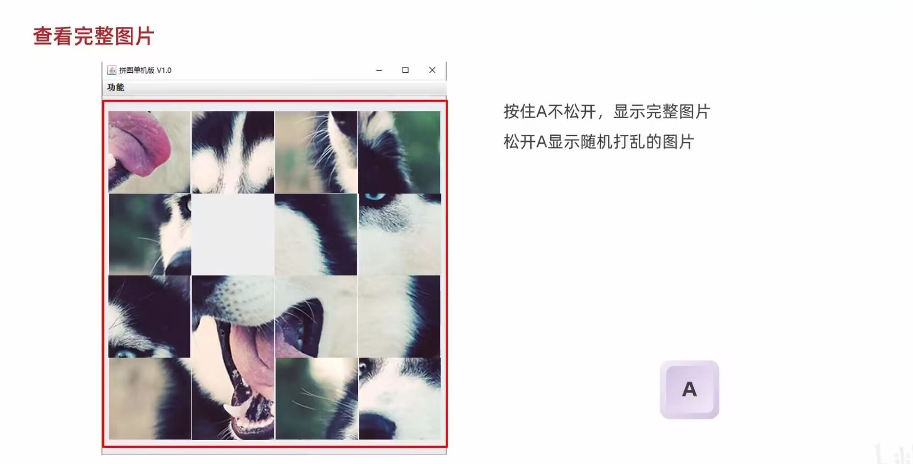

给键盘加一个监听事件

```java
package com.bbc.ui.jrame;

import com.bbc.ui.constant.KeyboardOrientation;

import javax.swing.*;
import javax.swing.border.BevelBorder;
import java.awt.*;
import java.awt.event.KeyEvent;
import java.awt.event.KeyListener;
import java.util.Random;

/**
 * 游戏主界面：
 * JFrame -> 界面 / 窗体
 * 规定：GameFrame 这个界面表示的就是游戏的主界面
 * 以后和游戏主界面相关的所有逻辑都写在这个类中
 *
 * @author wl
 * @date 2022/11/10 21:38
 */
public class GameJFrame extends JFrame implements KeyListener {

    /**
     * 用于打乱图片
     */
    static final int[][] DATA = new int[4][4];

    /**
     * 图片数组数据
     */
    static final int[] TEMP_ARR;

    static {
        // 初始化图片数据
        TEMP_ARR = new int[]{
                0, 1, 2, 3, 4, 5,
                6, 7, 8, 9, 10,
                11, 12, 13, 14, 15,
        };
    }

    /**
     * 空白方块下标位置
     */
    private int x = 0;
    private int y = 0;

    /**
     * 用于存储当前图片的路径
     */
    private final String photoPath = "material/girl/girl3/";

    /*
        无参构造
     */
    public GameJFrame() {
        super();
        // 初始化界面
        initFrame();
        // 初始化菜单
        initMenu();
        // 初始化数据（打乱）
        initData();
        // 初始化图片
        initImage();
        // 让窗口界面显示出来，建议放在最后
        this.setVisible(true);
    }

    /**
     * 初始化数据（打乱）
     */
    private void initData() {
        /*
            需求：打乱一维数组中的数据，并按照 4 个一组方式将其添加到二维数组中
         */
        // 1. 打乱一维数组中的数据
        Random random = new Random();
        for (int i = 0; i < TEMP_ARR.length; i++) {
            int index = random.nextInt(TEMP_ARR.length);
            int temp = TEMP_ARR[i];
            TEMP_ARR[i] = TEMP_ARR[index];
            TEMP_ARR[index] = temp;
        }
        // 2.将打乱后的数据添加二维数组
        // 这是第一种解法
        for (int i = 0; i < TEMP_ARR.length; i++) {
            // 记录零的位置
            if (TEMP_ARR[i] == 0) {
                x = i / 4;// x
                y = i % 4;// y
            } else {
                DATA[i / 4][i % 4] = TEMP_ARR[i];
            }
        }
    }

    /**
     * 初始化图片
     */
    private void initImage() {
        // 清空原来的图片再加载新的图片
        Container contentPane = getContentPane();
        contentPane.removeAll();
        // 设置布局为空
        /*
            细节：先加载的图片在上方，后加载的图片在下方
         */

        for (int y = 0; y < 4; y++) {
            for (int x = 0; x < 4; x++) {
                // 获取序号
                int num = DATA[x][y];
                // 创建一个JLabel 对象
                JLabel jLabel = new JLabel(new ImageIcon( photoPath + num + ".jpg"));
                // 指定图片位置
                jLabel.setBounds(105 * x + 83, 105 * y + 134, 105, 105);
                // 为图片添加边框 0是图片突出 1是图片凹陷
                jLabel.setBorder(new BevelBorder(BevelBorder.LOWERED));
                contentPane.add(jLabel);
            }
        }

        // 把背景图片添加到界面中
        contentPane.add(getBackGround());
        // 重新加载界面
        contentPane.repaint();
    }

    /**
     * 获取背景图片
     * @return 背景图片
     */
    private JLabel getBackGround() {
        JLabel background = new JLabel(new ImageIcon("material/background.png"));
        background.setBounds(40, 40, 508, 560);
        return background;
    }

    /**
     * 初始化界面
     */
    private void initFrame() {
        // 设置界面的宽高
        this.setSize(603, 680);
        // 设置界面的标题
        this.setTitle("拼图单机版V1.0");
        // 设置界面置顶
        this.setAlwaysOnTop(true);
        // 设置界面居中
        this.setLocationRelativeTo(null);
        // 设置游戏的关闭模式
        this.setDefaultCloseOperation(WindowConstants.EXIT_ON_CLOSE);
        // 取消默认的居中放置模式，只有取消了才能按照XY轴的形式添加组件
        this.setLayout(null);
        // 给整个界面添加键盘监听事件
        this.addKeyListener(this);
    }

    /**
     * 初始化菜单
     */
    private void initMenu() {
          /*
            1.初始化菜单：创建整个的菜单栏对象
         */
        JMenuBar myBar = new JMenuBar();

        // 2.创建菜单栏上面的两个菜单对象
        JMenu functionMenu = new JMenu("功能");
        JMenu aboutUsMenu = new JMenu("关于我们");

        // 3.创建菜单功能项的对象
        JMenuItem replayItem = new JMenuItem("再玩一次");
        JMenuItem loginAgainItem = new JMenuItem("重新登录");
        JMenuItem exitTheGameItem = new JMenuItem("退出游戏");

        JMenuItem officialAccount = new JMenuItem("个人公众号");

        // 4.组合菜单功能项到菜单中
        functionMenu.add(replayItem);
        functionMenu.add(loginAgainItem);
        functionMenu.add(exitTheGameItem);
        aboutUsMenu.add(officialAccount);

        // 5.将两个菜单添加到菜单栏中
        myBar.add(functionMenu);
        myBar.add(aboutUsMenu);

        // 6.在游戏界面中设置菜单栏
        this.setJMenuBar(myBar);
    }

    /**
     * Invoked when a key has been typed.
     * See the class description for {@link KeyEvent} for a definition of
     * a key typed event.
     *
     * @param e 键盘事件
     */
    @Override
    public void keyTyped(KeyEvent e) {

    }

    /**
     * 当键被按下不松时调用
     *
     * @param e 键盘事件
     */
    @Override
    public void keyPressed(KeyEvent e) {
        int keyCode = e.getKeyCode();
        if(keyCode == KeyboardOrientation.SHOW_TIME) {
            // 把界面中所有的图片都删除掉
            Container contentPane = getContentPane();
            contentPane.removeAll();
            // 加载第一张完整图片和背景图
            JLabel all = new JLabel(new ImageIcon(photoPath + "all.jpg"));
            all.setBounds(83,134, 420, 430);
            contentPane.add(all);
            contentPane.add(getBackGround());
            // 刷新页面
            contentPane.repaint();
        }
    }

    /**
     * 当松开按键时调用
     *
     * @param e 键盘事件
     */
    @Override
    public void keyReleased(KeyEvent e) {
        // 对上下左右进行判断
        int keyCode = e.getKeyCode();
        System.out.println("keyCode = " + keyCode);
        /*
            左 37 上 38
            右 39 下 40
            二维数组和一维数组下标相反
         */
        switch (keyCode) {
            case KeyboardOrientation.LEFT_KEY:
            case KeyboardOrientation.LEFT_A:
                // 越界判定
                if (x == 0) {
                    return;
                }
                System.out.println("向左移动");
                /*
                    逻辑：
                    把空白方块左方的数字赋值给空白方块
                 */
                DATA[x][y] = DATA[x - 1][y];
                DATA[x - 1][y] = 0;
                x--;
                break;
            // 实现向上移动
            case KeyboardOrientation.UPPER_KEY:
            case KeyboardOrientation.UPPER_W:
                // 越界判定
                if (y == 0) {
                    return;
                }
                System.out.println("向上移动");
                /*
                    逻辑：
                    把空白方块上方的数字赋值给空白方块
                 */
                DATA[x][y] = DATA[x][y - 1];
                DATA[x][y - 1] = 0;
                y--;
                break;
            case KeyboardOrientation.RIGHT_KEY:
            case KeyboardOrientation.RIGHT_D:
                // 越界判定
                if (x == 3) {
                    return;
                }
                System.out.println("向右移动");
                 /*
                    逻辑：
                    把空白方块右方的数字赋值给空白方块
                 */
                DATA[x][y] = DATA[x + 1][y];
                DATA[x + 1][y] = 0;
                x++;
                break;
            case KeyboardOrientation.LOWER_KEY:
            case KeyboardOrientation.LOWER_S:
                // 越界判定
                if (y == 3) {
                    return;
                }
                System.out.println("向下移动");
                /*
                    逻辑：
                    把空白方块下方的数字赋值给空白方块
                 */
                DATA[x][y] = DATA[x][y + 1];
                DATA[x][y + 1] = 0;
                y++;
                break;
            default:
                break;
        }
        // 刷新图片
        initImage();
    }
}
```

&nbsp;

## 3.5、作弊码 —— 金手指

> 按一下 k 直接胜利

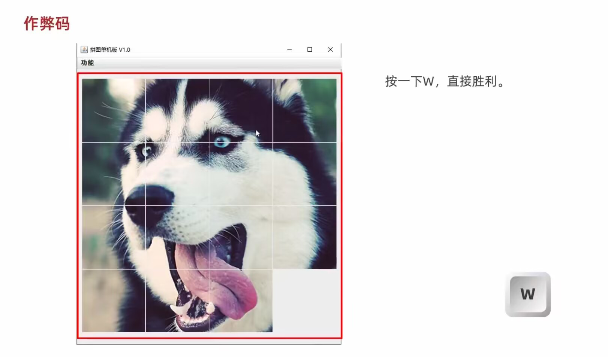

给键盘增加一个监听事件

代码实现

```java
import javax.swing.*;
import javax.swing.border.BevelBorder;
import java.awt.*;
import java.awt.event.KeyEvent;
import java.awt.event.KeyListener;
import java.util.Random;

/**
 * 游戏主界面：
 * JFrame -> 界面 / 窗体
 * 规定：GameFrame 这个界面表示的就是游戏的主界面
 * 以后和游戏主界面相关的所有逻辑都写在这个类中
 *
 * @author wl
 * @date 2022/11/10 21:38
 */
public class GameJFrame extends JFrame implements KeyListener {

    /**
     * 空白方块下标位置
     */
    private int pointX;
    private int pointY;

    /**
     * 用于打乱图片（用于展示）
     */
    private int[][] photoData = new int[4][4];

    /**
     * 图片数组数据
     */
    static final int[] TEMP_ARR;

    /**
     * 用于存储当前图片的路径
     */
    private final String photoPath = "material/animal/animal1/";

    /**
     * 背景图片
     */
    private static final JLabel BACKGROUND_PHOTO;

    static {
        // 初始化图片数据
        /*TEMP_ARR = new int[]{
                1, 2, 3, 4, 5,
                6, 7, 8, 9, 10,
                11, 12, 13, 14, 15, 0,
        };*/
        TEMP_ARR = new int[]{
                1, 5, 9, 13,
                2, 6, 10, 14,
                3, 7, 11, 15,
                4, 8, 12, 0,
        };
        // 初始化背景图片
        BACKGROUND_PHOTO = new JLabel(new ImageIcon("material/background.png"));
        BACKGROUND_PHOTO.setBounds(40, 40, 508, 560);
    }


    /*
        无参构造
     */
    public GameJFrame() {
        super();
        // 初始化界面
        initJFrame();
        // 初始化菜单
        initMenu();
        // 初始化数据（打乱）
        initData();
        // 初始化图片
        initImage();
        // 让窗口界面显示出来，建议放在最后
        this.setVisible(true);
    }

    /**
     * 初始化数据（打乱）
     */
    private void initData() {
        /*
            需求：打乱一维数组中的数据，并按照 4 个一组方式将其添加到二维数组中
         */
        // 1. 打乱一维数组中的数据
        Random random = new Random();
        for (int i = 0; i < TEMP_ARR.length; i++) {
            int index = random.nextInt(TEMP_ARR.length);
            int temp = TEMP_ARR[i];
            TEMP_ARR[i] = TEMP_ARR[index];
            TEMP_ARR[index] = temp;
        }
        // 2.将打乱后的数据添加二维数组
        // 这是第一种解法
        for (int i = 0; i < TEMP_ARR.length; i++) {
            // 记录零的位置
            if (TEMP_ARR[i] == 0) {
                pointX = i / 4;// x
                pointY = i % 4;// y
            } else {
                photoData[i / 4][i % 4] = TEMP_ARR[i];
            }
            photoData[i / 4][i % 4] = TEMP_ARR[i];
        }
    }

    /**
     * 初始化图片
     */
    private void initImage() {
        // 清空原来的图片再加载新的图片
        Container contentPane = getContentPane();
        contentPane.removeAll();
        // 设置布局为空
        /*
            细节：先加载的图片在上方，后加载的图片在下方
         */

        for (int x = 0; x < 4; x++) {
            for (int y = 0; y < 4; y++) {
                // 获取序号
                int num = photoData[x][y];
                // 创建一个JLabel 对象
                JLabel jLabel = new JLabel(new ImageIcon(photoPath + num + ".jpg"));
                // 指定图片位置
                jLabel.setBounds(105 * x + 83, 105 * y + 134, 105, 105);
                // 为图片添加边框 0是图片突出 1是图片凹陷
                jLabel.setBorder(new BevelBorder(BevelBorder.LOWERED));
                contentPane.add(jLabel);
            }
        }

        // 把背景图片添加到界面中
        contentPane.add(BACKGROUND_PHOTO);
        // 重新加载界面
        contentPane.repaint();
    }

    /**
     * 初始化界面
     */
    private void initJFrame() {
        // 设置界面的宽高
        this.setSize(603, 680);
        // 设置界面的标题
        this.setTitle("拼图单机版V1.0");
        // 设置界面置顶
        this.setAlwaysOnTop(true);
        // 设置界面居中
        this.setLocationRelativeTo(null);
        // 设置游戏的关闭模式
        this.setDefaultCloseOperation(WindowConstants.EXIT_ON_CLOSE);
        // 取消默认的居中放置模式，只有取消了才能按照XY轴的形式添加组件
        this.setLayout(null);
        // 给整个界面添加键盘监听事件
        this.addKeyListener(this);
    }

    /**
     * 初始化菜单
     */
    private void initMenu() {
          /*
            1.初始化菜单：创建整个的菜单栏对象
         */
        JMenuBar myBar = new JMenuBar();

        // 2.创建菜单栏上面的两个菜单对象
        JMenu functionMenu = new JMenu("功能");
        JMenu aboutUsMenu = new JMenu("关于我们");

        // 3.创建菜单功能项的对象
        JMenuItem replayItem = new JMenuItem("再玩一次");
        JMenuItem loginAgainItem = new JMenuItem("重新登录");
        JMenuItem exitTheGameItem = new JMenuItem("退出游戏");

        JMenuItem officialAccount = new JMenuItem("个人公众号");

        // 4.组合菜单功能项到菜单中
        functionMenu.add(replayItem);
        functionMenu.add(loginAgainItem);
        functionMenu.add(exitTheGameItem);
        aboutUsMenu.add(officialAccount);

        // 5.将两个菜单添加到菜单栏中
        myBar.add(functionMenu);
        myBar.add(aboutUsMenu);

        // 6.在游戏界面中设置菜单栏
        this.setJMenuBar(myBar);
    }

    /**
     * Invoked when a key has been typed.
     * See the class description for {@link KeyEvent} for a definition of
     * a key typed event.
     *
     * @param e 键盘事件
     */
    @Override
    public void keyTyped(KeyEvent e) {

    }

    /**
     * 当键被按下不松时调用
     *
     * @param e 键盘事件
     */
    @Override
    public void keyPressed(KeyEvent e) {
        int keyCode = e.getKeyCode();
        if (keyCode == KeyboardOrientation.SHOW_TIME) {
            // 把界面中所有的图片都删除掉
            Container contentPane = getContentPane();
            contentPane.removeAll();
            // 加载第一张完整图片和背景图
            JLabel all = new JLabel(new ImageIcon(photoPath + "all.jpg"));
            all.setBounds(83, 134, 420, 430);
            contentPane.add(all);
            contentPane.add(BACKGROUND_PHOTO);
            // 刷新页面
            contentPane.repaint();
        }
    }

    /**
     * 当松开按键时调用
     *
     * @param e 键盘事件
     */
    @Override
    public void keyReleased(KeyEvent e) {
        // 对上下左右进行判断
        int keyCode = e.getKeyCode();
        System.out.println("keyCode = " + keyCode);

        /*
            左 37 上 38
            右 39 下 40
            二维数组和一维数组下标相反
         */
        switch (keyCode) {
            case KeyboardOrientation.LEFT_KEY:
            case KeyboardOrientation.LEFT_A:
                // 越界判定
                if (pointX == 0) {
                    return;
                }
                System.out.println("向左移动");
                /*
                    逻辑：
                    把空白方块左方的数字赋值给空白方块
                 */
                photoData[pointX][pointY] = photoData[pointX - 1][pointY];
                photoData[pointX - 1][pointY] = 0;
                pointX--;
                break;
            // 实现向上移动
            case KeyboardOrientation.UPPER_KEY:
            case KeyboardOrientation.UPPER_W:
                // 越界判定
                if (pointY == 0) {
                    return;
                }
                System.out.println("向上移动");
                /*
                    逻辑：
                    把空白方块上方的数字赋值给空白方块
                 */
                photoData[pointX][pointY] = photoData[pointX][pointY - 1];
                photoData[pointX][pointY - 1] = 0;
                pointY--;
                break;
            case KeyboardOrientation.RIGHT_KEY:
            case KeyboardOrientation.RIGHT_D:
                // 越界判定
                if (pointX == 3) {
                    return;
                }
                System.out.println("向右移动");
                 /*
                    逻辑：
                    把空白方块右方的数字赋值给空白方块
                 */
                photoData[pointX][pointY] = photoData[pointX + 1][pointY];
                photoData[pointX + 1][pointY] = 0;
                pointX++;
                break;
            case KeyboardOrientation.LOWER_KEY:
            case KeyboardOrientation.LOWER_S:
                // 越界判定
                if (pointY == 3) {
                    return;
                }
                System.out.println("向下移动");
                /*
                    逻辑：
                    把空白方块下方的数字赋值给空白方块
                 */
                photoData[pointX][pointY] = photoData[pointX][pointY + 1];
                photoData[pointX][pointY + 1] = 0;
                pointY++;
                break;
            case KeyboardOrientation.CHEAT_CODES:
                photoData = new int[][] {
                        {1, 5, 9, 13,},
                        {2, 6, 10, 14,},
                        {3, 7, 11, 15,},
                        {4, 8, 12, 0,}
                };
                // 重置空白图片的位置
                pointX = 3;
                pointY = 3;
               break;
           default:
              break;
        }
       // 刷新图片
       initImage();
    }
}
```

&nbsp;

## 3.6、游戏胜利的判断

> 判断胜利


其实就是判断二维数组中的数字是否按照正确的顺序进行排列

实现步骤：

1.定义一个正确的二维数组win

2.在加载图片之前，先判断二维数组中的数字是否相同

> 代码实现

```java
package com.bbc.ui.jrame;

import com.bbc.ui.constant.KeyboardOrientation;

import javax.swing.*;
import javax.swing.border.BevelBorder;
import java.awt.*;
import java.awt.event.KeyEvent;
import java.awt.event.KeyListener;
import java.util.Arrays;
import java.util.Random;

/**
 * 游戏主界面：
 * JFrame -> 界面 / 窗体
 * 规定：GameFrame 这个界面表示的就是游戏的主界面
 * 以后和游戏主界面相关的所有逻辑都写在这个类中
 *
 * @author wl
 * @date 2022/11/10 21:38
 */
public class GameJFrame extends JFrame implements KeyListener {

    /**
     * 背景图片
     */
    private static final JLabel BACKGROUND_PHOTO;
    /**
     * 图片数组数据
     */
    private static final int[][] ORIGIN_ARR;

    /**
     * 数组的长度
     */
    private static final int ARR_LENGTH = 16;

    static {
        // 初始化图片数据
        /*TEMP_ARR = new int[]{
                1, 2, 3, 4, 5,
                6, 7, 8, 9, 10,
                11, 12, 13, 14, 15, 0,
        };*/
        ORIGIN_ARR = new int[][]{
                {1, 5, 9, 13,},
                {2, 6, 10, 14,},
                {3, 7, 11, 15,},
                {4, 8, 12, 0,}
        };
        // 初始化背景图片
        BACKGROUND_PHOTO = new JLabel(new ImageIcon("material/background.png"));
        BACKGROUND_PHOTO.setBounds(40, 40, 508, 560);
    }

    /**
     * 用于存储当前图片的路径
     */
    private final String photoPath = "material/animal/animal1/";

    /**
     * 用于打乱图片（用于展示）
     */
    private final int[][] photoData = new int[4][4];

    /**
     * 空白方块下标位置
     */
    private int pointX;
    private int pointY;

    /**
     * 游戏结果
     */
    private boolean gameResult;


    /*
        无参构造
     */
    public GameJFrame() {
        super();
        // 初始化界面
        initJFrame();
        // 初始化菜单
        initMenu();
        // 初始化数据（打乱）
        initData();
        // 初始化图片
        initImage();
        // 让窗口界面显示出来，建议放在最后
        this.setVisible(true);
    }

    /**
     * 数组复制
     *
     * @param des 目标数组
     * @author wl
     * @date 2022/11/28 20:18
     */
    private static void arrayCopy(int[] des) {
        for (int i = 0; i < des.length; i++) {
            des[i] = GameJFrame.ORIGIN_ARR[i / 4][i % 4];
        }
    }

    /**
     * 数组复制
     *
     * @param des 目标数组
     * @author wl
     * @date 2022/11/28 20:18
     */
    private static void arrayCopy(int[][] des) {
        for (int i = 0; i < GameJFrame.ORIGIN_ARR.length; i++) {
            System.arraycopy(GameJFrame.ORIGIN_ARR[i], 0, des[i], 0, GameJFrame.ORIGIN_ARR[i].length);
        }
    }

    /**
     * 初始化数据（打乱）
     */
    private void initData() {
        /*
            需求：打乱一维数组中的数据，并按照 4 个一组方式将其添加到二维数组中
         */
        // 1. 打乱一维数组中的数据
        Random random = new Random();
        int[] tempArray = new int[ARR_LENGTH];
        arrayCopy(tempArray);
        for (int i = 0; i < tempArray.length; i++) {
            int index = random.nextInt(tempArray.length);
            int temp = tempArray[i];
            tempArray[i] = tempArray[index];
            tempArray[index] = temp;
        }
        // 2.将打乱后的数据添加二维数组
        // 这是第一种解法
        for (int i = 0; i < tempArray.length; i++) {
            // 记录零的位置
            if (tempArray[i] == 0) {
                pointX = i / 4;// x
                pointY = i % 4;// y
            } else {
                photoData[i / 4][i % 4] = tempArray[i];
            }
        }
    }

    /**
     * 初始化图片
     */
    private void initImage() {
        // 清空原来的图片再加载新的图片
        Container contentPane = getContentPane();
        contentPane.removeAll();
        gameResult = isWin();
        if (gameResult) {
            System.out.println("你赢了");
            JLabel winJLabel = new JLabel(new ImageIcon("material/win.png"));
            winJLabel.setBounds(203, 283, 197, 73);
            contentPane.add(winJLabel);
        }

        // 设置布局为空
        /*
            细节：先加载的图片在上方，后加载的图片在下方
         */

        for (int x = 0; x < 4; x++) {
            for (int y = 0; y < 4; y++) {
                // 获取序号
                int num = photoData[x][y];
                // 创建一个JLabel 对象
                JLabel jLabel = new JLabel(new ImageIcon(photoPath + num + ".jpg"));
                // 指定图片位置
                jLabel.setBounds(105 * x + 83, 105 * y + 134, 105, 105);
                // 为图片添加边框 0是图片突出 1是图片凹陷
                jLabel.setBorder(new BevelBorder(BevelBorder.LOWERED));
                contentPane.add(jLabel);
            }
        }

        // 把背景图片添加到界面中
        contentPane.add(BACKGROUND_PHOTO);
        // 重新加载界面
        contentPane.repaint();
    }

    /**
     * 初始化界面
     */
    private void initJFrame() {
        // 设置界面的宽高
        this.setSize(603, 680);
        // 设置界面的标题
        this.setTitle("拼图单机版V1.0");
        // 设置界面置顶
        this.setAlwaysOnTop(true);
        // 设置界面居中
        this.setLocationRelativeTo(null);
        // 设置游戏的关闭模式
        this.setDefaultCloseOperation(WindowConstants.EXIT_ON_CLOSE);
        // 取消默认的居中放置模式，只有取消了才能按照XY轴的形式添加组件
        this.setLayout(null);
        // 给整个界面添加键盘监听事件
        this.addKeyListener(this);
    }

    /**
     * 初始化菜单
     */
    private void initMenu() {
          /*
            1.初始化菜单：创建整个的菜单栏对象
         */
        JMenuBar myBar = new JMenuBar();

        // 2.创建菜单栏上面的两个菜单对象
        JMenu functionMenu = new JMenu("功能");
        JMenu aboutUsMenu = new JMenu("关于我们");

        // 3.创建菜单功能项的对象
        JMenuItem replayItem = new JMenuItem("再玩一次");
        JMenuItem loginAgainItem = new JMenuItem("重新登录");
        JMenuItem exitTheGameItem = new JMenuItem("退出游戏");

        JMenuItem officialAccount = new JMenuItem("个人公众号");

        // 4.组合菜单功能项到菜单中
        functionMenu.add(replayItem);
        functionMenu.add(loginAgainItem);
        functionMenu.add(exitTheGameItem);
        aboutUsMenu.add(officialAccount);

        // 5.将两个菜单添加到菜单栏中
        myBar.add(functionMenu);
        myBar.add(aboutUsMenu);

        // 6.在游戏界面中设置菜单栏
        this.setJMenuBar(myBar);
    }

    /**
     * Invoked when a key has been typed.
     * See the class description for {@link KeyEvent} for a definition of
     * a key typed event.
     *
     * @param e 键盘事件
     */
    @Override
    public void keyTyped(KeyEvent e) {

    }

    /**
     * 当键被按下不松时调用
     *
     * @param e 键盘事件
     */
    @Override
    public void keyPressed(KeyEvent e) {
         /*
            判断游戏是否胜利，如果胜利，此方法需要直接结束
            不能再执行下面的金手指代码。
         */
        if (gameResult) {
            return;
        }
        int keyCode = e.getKeyCode();
        if (keyCode == KeyboardOrientation.SHOW_TIME) {
            // 把界面中所有的图片都删除掉
            Container contentPane = getContentPane();
            contentPane.removeAll();
            // 加载第一张完整图片和背景图
            JLabel all = new JLabel(new ImageIcon(photoPath + "all.jpg"));
            all.setBounds(83, 134, 420, 430);
            contentPane.add(all);
            contentPane.add(BACKGROUND_PHOTO);
            // 刷新页面
            contentPane.repaint();
        }
    }

    /**
     * 当松开按键时调用
     *
     * @param e 键盘事件
     */
    @Override
    public void keyReleased(KeyEvent e) {
        /*
            判断游戏是否胜利，如果胜利，此方法需要直接结束
            不能再执行下面的移动代码。
         */
        if (gameResult) {
            return;
        }
        // 对上下左右进行判断
        int keyCode = e.getKeyCode();
//        System.out.println("keyCode = " + keyCode);


        /*
            左 37 上 38
            右 39 下 40
            二维数组和一维数组下标相反
         */
        switch (keyCode) {
            case KeyboardOrientation.LEFT_KEY:
            case KeyboardOrientation.LEFT_A:
                // 越界判定
                if (pointX == 0) {
                    return;
                }
                System.out.println("向左移动");
                /*
                    逻辑：
                    把空白方块左方的数字赋值给空白方块
                 */
                photoData[pointX][pointY] = photoData[pointX - 1][pointY];
                photoData[pointX - 1][pointY] = 0;
                pointX--;
                break;
            // 实现向上移动
            case KeyboardOrientation.UPPER_KEY:
            case KeyboardOrientation.UPPER_W:
                // 越界判定
                if (pointY == 0) {
                    return;
                }
                System.out.println("向上移动");
                /*
                    逻辑：
                    把空白方块上方的数字赋值给空白方块
                 */
                photoData[pointX][pointY] = photoData[pointX][pointY - 1];
                photoData[pointX][pointY - 1] = 0;
                pointY--;
                break;
            case KeyboardOrientation.RIGHT_KEY:
            case KeyboardOrientation.RIGHT_D:
                // 越界判定
                if (pointX == 3) {
                    return;
                }
                System.out.println("向右移动");
                 /*
                    逻辑：
                    把空白方块右方的数字赋值给空白方块
                 */
                photoData[pointX][pointY] = photoData[pointX + 1][pointY];
                photoData[pointX + 1][pointY] = 0;
                pointX++;
                break;
            case KeyboardOrientation.LOWER_KEY:
            case KeyboardOrientation.LOWER_S:
                // 越界判定
                if (pointY == 3) {
                    return;
                }
                System.out.println("向下移动");
                /*
                    逻辑：
                    把空白方块下方的数字赋值给空白方块
                 */
                photoData[pointX][pointY] = photoData[pointX][pointY + 1];
                photoData[pointX][pointY + 1] = 0;
                pointY++;
                break;
            case KeyboardOrientation.CHEAT_CODES:
                /*photoData = new int[ARR_LENGTH >> 2][ARR_LENGTH >> 2];*/
                arrayCopy(photoData);
                // 重置空白图片的位置
                pointX = 3;
                pointY = 3;
                break;
            default:
                break;
        }
        // 刷新图片
        initImage();
    }

    /**
     * 判断 ORIGIN_ARR 中的数据是否
     * photoData 中的完全相同，
     * 如果相同则说明游戏胜利
     *
     * @return boolean
     * @author wl
     * @date 2022/11/28 20:31
     */
    public boolean isWin() {
        return Arrays.deepEquals(ORIGIN_ARR, photoData);
    }
}
```

&nbsp;

# 三、菜单业务实现

- 计步功能的实现
- 重新开始、关闭游戏和关于我们

&nbsp;

## 3.1、计步功能的实现

> 计步功能

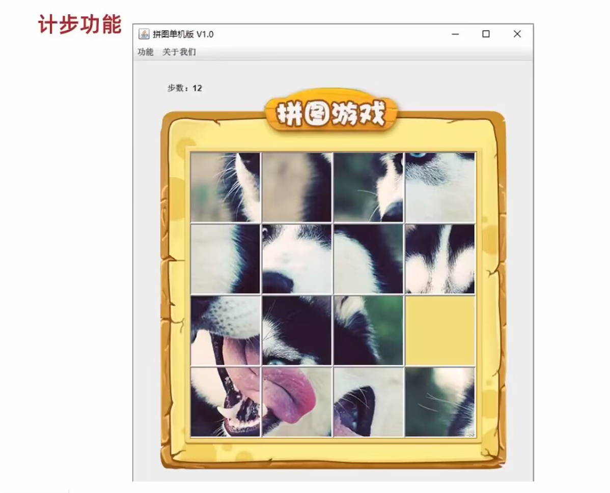

1. 定义一个变量用于统计玩了多少步
2. 每次按上下左右的时候计步器自增一次即可

**代码实现**

```java
package com.bbc.ui.jrame;

import com.bbc.ui.constant.KeyboardOrientation;

import javax.swing.*;
import javax.swing.border.BevelBorder;
import java.awt.*;
import java.awt.event.KeyEvent;
import java.awt.event.KeyListener;
import java.util.Arrays;
import java.util.Random;

/**
 * 游戏主界面：
 * JFrame -> 界面 / 窗体
 * 规定：GameFrame 这个界面表示的就是游戏的主界面
 * 以后和游戏主界面相关的所有逻辑都写在这个类中
 *
 * @author wl
 * @date 2022/11/10 21:38
 */
public class GameJFrame extends JFrame implements KeyListener {

    /**
     * 背景图片
     */
    private static final JLabel BACKGROUND_PHOTO;
    /**
     * 图片数组数据
     */
    private static final int[][] ORIGIN_ARR;

    /**
     * 数组的长度
     */
    private static final int ARR_LENGTH = 16;

    static {
        // 初始化图片数据
        /*TEMP_ARR = new int[]{
                1, 2, 3, 4, 5,
                6, 7, 8, 9, 10,
                11, 12, 13, 14, 15, 0,
        };*/
        ORIGIN_ARR = new int[][]{
                {1, 5, 9, 13,},
                {2, 6, 10, 14,},
                {3, 7, 11, 15,},
                {4, 8, 12, 0,}
        };
        // 初始化背景图片
        BACKGROUND_PHOTO = new JLabel(new ImageIcon("material/background.png"));
        BACKGROUND_PHOTO.setBounds(40, 40, 508, 560);
    }

    /**
     * 用于存储当前图片的路径
     */
    private final String photoPath = "material/animal/animal1/";

    /**
     * 用于打乱图片（用于展示）
     */
    private final int[][] photoData = new int[4][4];

    /**
     * 空白方块下标位置
     */
    private int pointX;
    private int pointY;

    /**
     * 统计步数
     */
    private int stepCount;

    /**
     * 游戏结果
     */
    private boolean gameResult;


    /*
        无参构造
     */
    public GameJFrame() {
        super();
        // 初始化界面
        initJFrame();
        // 初始化菜单
        initMenu();
        // 初始化数据（打乱）
        initData();
        // 初始化图片
        initImage();
        // 让窗口界面显示出来，建议放在最后
        this.setVisible(true);
    }

    /**
     * 数组复制
     *
     * @param des 目标数组
     * @author wl
     * @date 2022/11/28 20:18
     */
    private static void arrayCopy(int[] des) {
        for (int i = 0; i < des.length; i++) {
            des[i] = GameJFrame.ORIGIN_ARR[i / 4][i % 4];
        }
    }

    /**
     * 数组复制
     *
     * @param des 目标数组
     * @author wl
     * @date 2022/11/28 20:18
     */
    private static void arrayCopy(int[][] des) {
        for (int i = 0; i < GameJFrame.ORIGIN_ARR.length; i++) {
            System.arraycopy(GameJFrame.ORIGIN_ARR[i], 0, des[i], 0, GameJFrame.ORIGIN_ARR[i].length);
        }
    }

    /**
     * 初始化数据（打乱）
     */
    private void initData() {
        /*
            需求：打乱一维数组中的数据，并按照 4 个一组方式将其添加到二维数组中
         */
        // 1. 打乱一维数组中的数据
        Random random = new Random();
        int[] tempArray = new int[ARR_LENGTH];
        arrayCopy(tempArray);
        for (int i = 0; i < tempArray.length; i++) {
            int index = random.nextInt(tempArray.length);
            int temp = tempArray[i];
            tempArray[i] = tempArray[index];
            tempArray[index] = temp;
        }
        // 2.将打乱后的数据添加二维数组
        // 这是第一种解法
        for (int i = 0; i < tempArray.length; i++) {
            // 记录零的位置
            if (tempArray[i] == 0) {
                pointX = i / 4;// x
                pointY = i % 4;// y
            } else {
                photoData[i / 4][i % 4] = tempArray[i];
            }
        }
    }

    /**
     * 初始化图片
     */
    private void initImage() {
        // 清空原来的图片再加载新的图片
        Container contentPane = getContentPane();
        contentPane.removeAll();
        gameResult = isWin();
        if (gameResult) {
            System.out.println("你赢了");
            JLabel winJLabel = new JLabel(new ImageIcon("material/win.png"));
            winJLabel.setBounds(203, 283, 197, 73);
            contentPane.add(winJLabel);
        }

        // 添加计步的文字
        JLabel stepJLabel = new JLabel("步数：" + stepCount);
        stepJLabel.setBounds(50,30,100,20);
        contentPane.add(stepJLabel);

        // 设置布局为空
        /*
            细节：先加载的图片在上方，后加载的图片在下方
         */
        for (int x = 0; x < 4; x++) {
            for (int y = 0; y < 4; y++) {
                // 获取序号
                int num = photoData[x][y];
                // 创建一个JLabel 对象
                JLabel jLabel = new JLabel(new ImageIcon(photoPath + num + ".jpg"));
                // 指定图片位置
                jLabel.setBounds(105 * x + 83, 105 * y + 134, 105, 105);
                // 为图片添加边框 0是图片突出 1是图片凹陷
                jLabel.setBorder(new BevelBorder(BevelBorder.LOWERED));
                contentPane.add(jLabel);
            }
        }

        // 把背景图片添加到界面中
        contentPane.add(BACKGROUND_PHOTO);
        // 重新加载界面
        contentPane.repaint();
    }

    /**
     * 初始化界面
     */
    private void initJFrame() {
        // 设置界面的宽高
        this.setSize(603, 680);
        // 设置界面的标题
        this.setTitle("拼图单机版V1.0");
        // 设置界面置顶
        this.setAlwaysOnTop(true);
        // 设置界面居中
        this.setLocationRelativeTo(null);
        // 设置游戏的关闭模式
        this.setDefaultCloseOperation(WindowConstants.EXIT_ON_CLOSE);
        // 取消默认的居中放置模式，只有取消了才能按照XY轴的形式添加组件
        this.setLayout(null);
        // 给整个界面添加键盘监听事件
        this.addKeyListener(this);
    }

    /**
     * 初始化菜单
     */
    private void initMenu() {
          /*
            1.初始化菜单：创建整个的菜单栏对象
         */
        JMenuBar myBar = new JMenuBar();

        // 2.创建菜单栏上面的两个菜单对象
        JMenu functionMenu = new JMenu("功能");
        JMenu aboutUsMenu = new JMenu("关于我们");

        // 3.创建菜单功能项的对象
        JMenuItem replayItem = new JMenuItem("再玩一次");
        JMenuItem loginAgainItem = new JMenuItem("重新登录");
        JMenuItem exitTheGameItem = new JMenuItem("退出游戏");

        JMenuItem officialAccount = new JMenuItem("个人公众号");

        // 4.组合菜单功能项到菜单中
        functionMenu.add(replayItem);
        functionMenu.add(loginAgainItem);
        functionMenu.add(exitTheGameItem);
        aboutUsMenu.add(officialAccount);

        // 5.将两个菜单添加到菜单栏中
        myBar.add(functionMenu);
        myBar.add(aboutUsMenu);

        // 6.在游戏界面中设置菜单栏
        this.setJMenuBar(myBar);
    }

    /**
     * Invoked when a key has been typed.
     * See the class description for {@link KeyEvent} for a definition of
     * a key typed event.
     *
     * @param e 键盘事件
     */
    @Override
    public void keyTyped(KeyEvent e) {

    }

    /**
     * 当键被按下不松时调用
     *
     * @param e 键盘事件
     */
    @Override
    public void keyPressed(KeyEvent e) {
         /*
            判断游戏是否胜利，如果胜利，此方法需要直接结束
            不能再执行下面的金手指代码。
         */
        if (gameResult) {
            return;
        }
        int keyCode = e.getKeyCode();
        if (keyCode == KeyboardOrientation.SHOW_TIME) {
            // 把界面中所有的图片都删除掉
            Container contentPane = getContentPane();
            contentPane.removeAll();
            // 加载第一张完整图片和背景图
            JLabel all = new JLabel(new ImageIcon(photoPath + "all.jpg"));
            all.setBounds(83, 134, 420, 430);
            contentPane.add(all);
            contentPane.add(BACKGROUND_PHOTO);
            // 刷新页面
            contentPane.repaint();
        }
    }

    /**
     * 当松开按键时调用
     *
     * @param e 键盘事件
     */
    @Override
    public void keyReleased(KeyEvent e) {
        /*
            判断游戏是否胜利，如果胜利，此方法需要直接结束
            不能再执行下面的移动代码。
         */
        if (gameResult) {
            return;
        }
        // 对上下左右进行判断
        int keyCode = e.getKeyCode();
//        System.out.println("keyCode = " + keyCode);


        /*
            左 37 上 38
            右 39 下 40
            二维数组和一维数组下标相反
         */
        switch (keyCode) {
            case KeyboardOrientation.LEFT_KEY:
            case KeyboardOrientation.LEFT_A:
                // 越界判定
                if (pointX == 0) {
                    return;
                }
                System.out.println("向左移动");
                /*
                    逻辑：
                    把空白方块左方的数字赋值给空白方块
                 */
                photoData[pointX][pointY] = photoData[pointX - 1][pointY];
                photoData[pointX - 1][pointY] = 0;
                pointX--;
                // 每移动一次计数器就 + 1
                stepCount++;
                break;
            // 实现向上移动
            case KeyboardOrientation.UPPER_KEY:
            case KeyboardOrientation.UPPER_W:
                // 越界判定
                if (pointY == 0) {
                    return;
                }
                System.out.println("向上移动");
                /*
                    逻辑：
                    把空白方块上方的数字赋值给空白方块
                 */
                photoData[pointX][pointY] = photoData[pointX][pointY - 1];
                photoData[pointX][pointY - 1] = 0;
                pointY--;
                // 每移动一次计数器就 + 1
                stepCount++;
                break;
            case KeyboardOrientation.RIGHT_KEY:
            case KeyboardOrientation.RIGHT_D:
                // 越界判定
                if (pointX == 3) {
                    return;
                }
                System.out.println("向右移动");
                 /*
                    逻辑：
                    把空白方块右方的数字赋值给空白方块
                 */
                photoData[pointX][pointY] = photoData[pointX + 1][pointY];
                photoData[pointX + 1][pointY] = 0;
                pointX++;
                // 每移动一次计数器就 + 1
                stepCount++;
                break;
            case KeyboardOrientation.LOWER_KEY:
            case KeyboardOrientation.LOWER_S:
                // 越界判定
                if (pointY == 3) {
                    return;
                }
                System.out.println("向下移动");
                /*
                    逻辑：
                    把空白方块下方的数字赋值给空白方块
                 */
                photoData[pointX][pointY] = photoData[pointX][pointY + 1];
                photoData[pointX][pointY + 1] = 0;
                pointY++;
                // 每移动一次计数器就 + 1
                stepCount++;
                break;
            case KeyboardOrientation.CHEAT_CODES:
                /*photoData = new int[ARR_LENGTH >> 2][ARR_LENGTH >> 2];*/
                arrayCopy(photoData);
                // 重置空白图片的位置
                pointX = 3;
                pointY = 3;
                break;
            default:
                break;
        }
        // 刷新图片
        initImage();
    }

    /**
     * 判断 ORIGIN_ARR 中的数据是否
     * photoData 中的完全相同，
     * 如果相同则说明游戏胜利
     *
     * @return boolean
     * @author wl
     * @date 2022/11/28 20:31
     */
    public boolean isWin() {
        return Arrays.deepEquals(ORIGIN_ARR, photoData);
    }
}
```

&nbsp;

## 3.2、重新开始、关闭游戏和关于我们

> 重新游戏

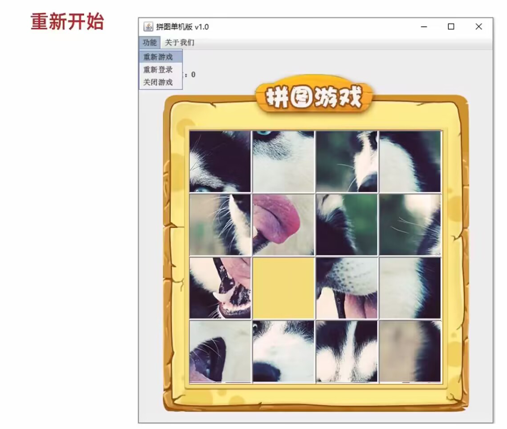

1. 给重新游戏绑定点击事件：`MouseLisener` 或 `ActionLisener`
2. 重新打乱二维数组中的数据
3. 加载图片
4. 计数器清零

&nbsp;

> 关闭游戏

1.给关闭游戏绑定事件

2.结束虚拟机，关闭所有的 UI 界面

&nbsp;

> 关于我们


ImageIcon 和 JDialog

**以上功能的代码实现**

```java
package com.bbc.ui.jrame;

import com.bbc.ui.constant.KeyboardOrientation;

import javax.swing.*;
import javax.swing.border.BevelBorder;
import java.awt.*;
import java.awt.event.ActionEvent;
import java.awt.event.ActionListener;
import java.awt.event.KeyEvent;
import java.awt.event.KeyListener;
import java.util.Arrays;
import java.util.Random;

/**
 * 游戏主界面：
 * JFrame -> 界面 / 窗体
 * 规定：GameFrame 这个界面表示的就是游戏的主界面
 * 以后和游戏主界面相关的所有逻辑都写在这个类中
 *
 * @author wl
 * @date 2022/11/10 21:38
 */
public class GameJFrame extends JFrame implements KeyListener, ActionListener {

    /**
     * 背景图片
     */
    private static final JLabel BACKGROUND_PHOTO;
    /**
     * 图片数组数据
     */
    private static final int[][] ORIGIN_ARR;

    /**
     * 数组的长度
     */
    private static final int ARR_LENGTH = 16;

    static {
        // 初始化图片数据
        /*ORIGIN_ARR = new int[]{
                1, 2, 3, 4, 5,
                6, 7, 8, 9, 10,
                11, 12, 13, 14, 15, 0,
        };*/
        ORIGIN_ARR = new int[][]{
                {1, 5, 9, 13,},
                {2, 6, 10, 14,},
                {3, 7, 11, 15,},
                {4, 8, 12, 0,}
        };
        // 初始化背景图片
        BACKGROUND_PHOTO = new JLabel(new ImageIcon("material/background.png"));
        BACKGROUND_PHOTO.setBounds(40, 40, 508, 560);
    }

    /**
     * 用于存储当前图片的路径
     */
    private final String photoPath = "material/animal/animal1/";

    /**
     * 用于打乱图片（用于展示）
     */
    private final int[][] photoData = new int[4][4];

    /**
     * 空白方块下标位置
     */
    private int pointX;
    private int pointY;

    /**
     * 统计步数
     */
    private int stepCount;

    /**
     * 游戏结果
     */
    private boolean gameResult;

    // 3.创建菜单功能项的对象并且绑定事件
    private final JMenuItem replayItem = new JMenuItem("再玩一次");
    private final JMenuItem loginAgainItem = new JMenuItem("重新登录");
    private final JMenuItem exitTheGameItem = new JMenuItem("退出游戏");
    private final JMenuItem officialAccount = new JMenuItem("个人公众号");


    /**
     *  无参构造
     */
    public GameJFrame() {
        super();
        // 初始化界面
        initJFrame();
        // 初始化菜单
        initMenu();
        // 初始化数据（打乱）
        initData();
        // 初始化图片
        initImage();
        // 让窗口界面显示出来，建议放在最后
        this.setVisible(true);
    }

    /**
     * 数组复制
     *
     * @param des 目标数组
     * @author wl
     * @date 2022/11/28 20:18
     */
    private static void arrayCopy(int[] des) {
        for (int i = 0; i < des.length; i++) {
            des[i] = GameJFrame.ORIGIN_ARR[i / 4][i % 4];
        }
    }

    /**
     * 数组复制
     *
     * @param des 目标数组
     * @author wl
     * @date 2022/11/28 20:18
     */
    private static void arrayCopy(int[][] des) {
        for (int i = 0; i < GameJFrame.ORIGIN_ARR.length; i++) {
            System.arraycopy(GameJFrame.ORIGIN_ARR[i], 0, des[i], 0, GameJFrame.ORIGIN_ARR[i].length);
        }
    }

    /**
     * 初始化数据（打乱）
     */
    private void initData() {
        /*
            需求：打乱一维数组中的数据，并按照 4 个一组方式将其添加到二维数组中
         */
        // 1. 打乱一维数组中的数据
        Random random = new Random();
        int[] tempArray = new int[ARR_LENGTH];
        arrayCopy(tempArray);
        for (int i = 0; i < tempArray.length; i++) {
            int index = random.nextInt(tempArray.length);
            int temp = tempArray[i];
            tempArray[i] = tempArray[index];
            tempArray[index] = temp;
        }
        // 2.将打乱后的数据添加二维数组
        // 这是第一种解法
        for (int i = 0; i < tempArray.length; i++) {
            // 记录零的位置
            if (tempArray[i] == 0) {
                pointX = i / 4;// x
                pointY = i % 4;// y
            }
            photoData[i / 4][i % 4] = tempArray[i];
        }
    }

    /**
     * 初始化图片
     */
    private void initImage() {
        // 清空原来的图片再加载新的图片
        Container contentPane = getContentPane();
        contentPane.removeAll();
        gameResult = isWin();
        if (gameResult) {
            System.out.println("你赢了");
            JLabel winJLabel = new JLabel(new ImageIcon("material/win.png"));
            winJLabel.setBounds(203, 283, 197, 73);
            contentPane.add(winJLabel);
        }

        // 添加计步的文字
        JLabel stepJLabel = new JLabel("步数：" + stepCount);
        stepJLabel.setBounds(50, 30, 100, 20);
        contentPane.add(stepJLabel);

        // 设置布局为空
        /*
            细节：先加载的图片在上方，后加载的图片在下方
         */
        for (int x = 0; x < 4; x++) {
            for (int y = 0; y < 4; y++) {
                // 获取序号
                int num = photoData[x][y];
                // 创建一个JLabel 对象
                JLabel jLabel = new JLabel(new ImageIcon(photoPath + num + ".jpg"));
                // 指定图片位置
                jLabel.setBounds(105 * x + 83, 105 * y + 134, 105, 105);
                // 为图片添加边框 0是图片突出 1是图片凹陷
                jLabel.setBorder(new BevelBorder(BevelBorder.LOWERED));
                contentPane.add(jLabel);
            }
        }

        // 把背景图片添加到界面中
        contentPane.add(BACKGROUND_PHOTO);
        // 重新加载界面
        contentPane.repaint();
    }

    /**
     * 初始化界面
     */
    private void initJFrame() {
        // 设置界面的宽高
        this.setSize(603, 680);
        // 设置界面的标题
        this.setTitle("拼图单机版V1.0");
        // 设置界面置顶
        this.setAlwaysOnTop(true);
        // 设置界面居中
        this.setLocationRelativeTo(null);
        // 设置游戏的关闭模式
        this.setDefaultCloseOperation(WindowConstants.EXIT_ON_CLOSE);
        // 取消默认的居中放置模式，只有取消了才能按照XY轴的形式添加组件
        this.setLayout(null);
        // 给整个界面添加键盘监听事件
        this.addKeyListener(this);
    }

    /**
     * 初始化菜单
     */
    private void initMenu() {
          /*
            1.初始化菜单：创建整个的菜单栏对象
         */
        JMenuBar myBar = new JMenuBar();

        // 2.创建菜单栏上面的两个菜单对象
        JMenu functionMenu = new JMenu("功能");
        JMenu aboutUsMenu = new JMenu("关于我们");

        // 3.组合菜单功能项到菜单中
        functionMenu.add(replayItem);
        functionMenu.add(loginAgainItem);
        functionMenu.add(exitTheGameItem);
        aboutUsMenu.add(officialAccount);

        // 4.给条目绑定事件
        replayItem.addActionListener(this);
        loginAgainItem.addActionListener(this);
        exitTheGameItem.addActionListener(this);
        officialAccount.addActionListener(this);

        // 5.将两个菜单添加到菜单栏中
        myBar.add(functionMenu);
        myBar.add(aboutUsMenu);

        // 6.在游戏界面中设置菜单栏
        this.setJMenuBar(myBar);
    }

    /**
     * Invoked when a key has been typed.
     * See the class description for {@link KeyEvent} for a definition of
     * a key typed event.
     *
     * @param e 键盘事件
     */
    @Override
    public void keyTyped(KeyEvent e) {

    }

    /**
     * 当键被按下不松时调用
     *
     * @param e 键盘事件
     */
    @Override
    public void keyPressed(KeyEvent e) {
         /*
            判断游戏是否胜利，如果胜利，此方法需要直接结束
            不能再执行下面的金手指代码。
         */
        if (gameResult) {
            return;
        }
        int keyCode = e.getKeyCode();
        if (keyCode == KeyboardOrientation.SHOW_TIME) {
            // 把界面中所有的图片都删除掉
            Container contentPane = getContentPane();
            contentPane.removeAll();
            // 加载第一张完整图片和背景图
            JLabel all = new JLabel(new ImageIcon(photoPath + "all.jpg"));
            all.setBounds(83, 134, 420, 430);
            contentPane.add(all);
            contentPane.add(BACKGROUND_PHOTO);
            // 刷新页面
            contentPane.repaint();
        }
    }

    /**
     * 当松开按键时调用
     *
     * @param e 键盘事件
     */
    @Override
    public void keyReleased(KeyEvent e) {
        /*
            判断游戏是否胜利，如果胜利，此方法需要直接结束
            不能再执行下面的移动代码。
         */
        if (gameResult) {
            return;
        }
        // 对上下左右进行判断
        int keyCode = e.getKeyCode();
//        System.out.println("keyCode = " + keyCode);


        /*
            左 37 上 38
            右 39 下 40
            二维数组和一维数组下标相反
         */
        switch (keyCode) {
            case KeyboardOrientation.LEFT_KEY:
            case KeyboardOrientation.LEFT_A:
                // 越界判定
                if (pointX == 0) {
                    return;
                }
                System.out.println("向左移动");
                /*
                    逻辑：
                    把空白方块左方的数字赋值给空白方块
                 */
                photoData[pointX][pointY] = photoData[pointX - 1][pointY];
                photoData[pointX - 1][pointY] = 0;
                pointX--;
                // 每移动一次计数器就 + 1
                stepCount++;
                break;
            // 实现向上移动
            case KeyboardOrientation.UPPER_KEY:
            case KeyboardOrientation.UPPER_W:
                // 越界判定
                if (pointY == 0) {
                    return;
                }
                System.out.println("向上移动");
                /*
                    逻辑：
                    把空白方块上方的数字赋值给空白方块
                 */
                photoData[pointX][pointY] = photoData[pointX][pointY - 1];
                photoData[pointX][pointY - 1] = 0;
                pointY--;
                // 每移动一次计数器就 + 1
                stepCount++;
                break;
            case KeyboardOrientation.RIGHT_KEY:
            case KeyboardOrientation.RIGHT_D:
                // 越界判定
                if (pointX == 3) {
                    return;
                }
                System.out.println("向右移动");
                 /*
                    逻辑：
                    把空白方块右方的数字赋值给空白方块
                 */
                photoData[pointX][pointY] = photoData[pointX + 1][pointY];
                photoData[pointX + 1][pointY] = 0;
                pointX++;
                // 每移动一次计数器就 + 1
                stepCount++;
                break;
            case KeyboardOrientation.LOWER_KEY:
            case KeyboardOrientation.LOWER_S:
                // 越界判定
                if (pointY == 3) {
                    return;
                }
                System.out.println("向下移动");
                /*
                    逻辑：
                    把空白方块下方的数字赋值给空白方块
                 */
                photoData[pointX][pointY] = photoData[pointX][pointY + 1];
                photoData[pointX][pointY + 1] = 0;
                pointY++;
                // 每移动一次计数器就 + 1
                stepCount++;
                break;
            case KeyboardOrientation.CHEAT_CODES:
                /*photoData = new int[ARR_LENGTH >> 2][ARR_LENGTH >> 2];*/
                arrayCopy(photoData);
                // 重置空白图片的位置
                pointX = 3;
                pointY = 3;
                break;
            default:
                break;
        }
        // 刷新图片
        initImage();
    }

    /**
     * 点击鼠标时调用
     *
     * @param e 动作事件
     */
    @Override
    public void actionPerformed(ActionEvent e) {
        Object source = e.getSource();
        if(source == replayItem) {
            // System.out.println("再玩一次");
            // 1.计数器清零
            stepCount = 0;
            // 2.打乱图片数据
            initData();
            // 3.重新加载图片
            initImage();
        } else if(source == loginAgainItem) {
            // System.out.println("重新登录");
            /*
                返回登录界面：关闭当前界面，打开登录界面
             */
            this.setVisible(false);
            new LoginJFrame();
        } else if(source == exitTheGameItem) {
            //System.out.println("退出游戏");
            // 关闭游戏：直接关闭虚拟机即可
            System.exit(0);
        } else if(source == officialAccount) {
            //System.out.println("个人公众号");
            // 创建一个弹框对象
            JDialog jDialog = new JDialog();
            // 创建一个管理图片的容器对象
            JLabel jLabel = new JLabel(new ImageIcon("material/about.jpg"));
            jLabel.setBounds(0, 0, 258, 258);
            jDialog.setTitle("个人公众号");
            // 把图片添加到弹框中
            jDialog.getContentPane().add(jLabel);
            // 给弹框设置大小且让其置顶居中
            jDialog.setSize(344, 344);
            jDialog.setAlwaysOnTop(true);
            jDialog.setLocationRelativeTo(null);
            // 弹框不操作则无法操作下面的界面
            jDialog.setModal(true);
            // 让弹框显示
            jDialog.setVisible(true);
        }
    }

    /**
     * 判断 ORIGIN_ARR 中的数据是否
     * photoData 中的完全相同，
     * 如果相同则说明游戏胜利
     *
     * @return boolean
     * @author wl
     * @date 2022/11/28 20:31
     */
    private boolean isWin() {
        return Arrays.deepEquals(ORIGIN_ARR, photoData);
    }
}
```

## 3.3、更换图片

如果在菜单中还需要嵌套二级的菜单，JMenu 中可以再次添加其他的 JMenu

> 需求详解：

1，在功能选项中添加更换图片，在更换图片里面再添加美女，动物，运动。

代码中功能是JMenu，更换图片也是JMenu，美女，动物，运动是三个JMenuItem

代码如下：

```java
//创建菜单并添加到界面当中
//1.创建菜单JMenuBar的对象
JMenuBar jMenuBar = new JMenuBar();
//2.创建菜单上面的两个选项JMenu
JMenu functionJMenu = new JMenu("功能");
JMenu aboutJMenu = new JMenu("关于我们");

//创建更换图片
JMenu changeImage = new JMenu("更换图片");

//3.创建JMenuItem的对象
JMenuItem girl = new JMenuItem("美女");
JMenuItem animal = new JMenuItem("动物");
JMenuItem sport = new JMenuItem("运动");
JMenuItem repalyItem = new JMenuItem("重新游戏");
JMenuItem reLoginItem = new JMenuItem("重新登录");
JMenuItem closeItem = new JMenuItem("关闭游戏");
JMenuItem accountItem = new JMenuItem("公众号");


//4.把美女，动物，运动添加到更换图片当中
changeImage.add(girl);
changeImage.add(animal);
changeImage.add(sport);

//5.把更换图片，重新游戏，重新登录，关闭游戏添加到功能当中
functionJMenu.add(changeImage);
functionJMenu.add(repalyItem);
functionJMenu.add(reLoginItem);
functionJMenu.add(closeItem);
//6.把公众号添加到关于我们当中
aboutJMenu.add(accountItem);

//5.把功能，关于我们添加到JMenuBar当中
jMenuBar.add(functionJMenu);
jMenuBar.add(aboutJMenu);

//6.把整个菜单JMenuBar添加到整个界面当中
this.setJMenuBar(jMenuBar);
```

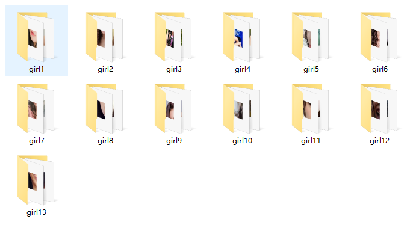

2，当我们点击了美女之后，就会从13组美女图片中随机选择一组。

3，当我们点击了动物之后，就会从8组动物图片中随机选择一组。

4，当我们点击了运动之后，就会从10组运动图片中随机选择一组。

5，细节1：选择完毕之后，游戏界面中需要加载所有的小图片并且打乱顺序

6，细节2：按A的时候显示的是选择之后的图片

实现代码如下：

```java
package com.bbc.ui.jrame;

import com.bbc.ui.constant.KeyboardOrientation;

import javax.swing.*;
import javax.swing.border.BevelBorder;
import java.awt.*;
import java.awt.event.ActionEvent;
import java.awt.event.ActionListener;
import java.awt.event.KeyEvent;
import java.awt.event.KeyListener;
import java.util.Arrays;
import java.util.Random;

/**
 * 游戏主界面：
 * JFrame -> 界面 / 窗体
 * 规定：GameFrame 这个界面表示的就是游戏的主界面
 * 以后和游戏主界面相关的所有逻辑都写在这个类中
 *
 * @author wl
 * @date 2022/11/10 21:38
 */
public class GameJFrame extends JFrame implements KeyListener, ActionListener {

    /**
     * 背景图片
     */
    private static final JLabel BACKGROUND_PHOTO;
    /**
     * 图片数组数据
     */
    private static final int[][] ORIGIN_ARR;

    /**
     * 数组的长度
     */
    private static final int ARR_LENGTH = 16;

    static {
        // 初始化图片数据
        /*ORIGIN_ARR = new int[]{
                1, 2, 3, 4, 5,
                6, 7, 8, 9, 10,
                11, 12, 13, 14, 15, 0,
        };*/
        ORIGIN_ARR = new int[][]{
                {1, 5, 9, 13,},
                {2, 6, 10, 14,},
                {3, 7, 11, 15,},
                {4, 8, 12, 0,}
        };
        // 初始化背景图片
        BACKGROUND_PHOTO = new JLabel(new ImageIcon("material/background.png"));
        BACKGROUND_PHOTO.setBounds(40, 40, 508, 560);
    }

    /**
     * 用于打乱图片（用于展示）
     */
    private final int[][] photoData = new int[4][4];
    // 3.创建菜单功能项的对象并且绑定事件
    private final JMenuItem replayItem = new JMenuItem("再玩一次");
    private final JMenuItem loginAgainItem = new JMenuItem("重新登录");
    private final JMenuItem exitTheGameItem = new JMenuItem("退出游戏");
    private final JMenuItem officialAccount = new JMenuItem("个人公众号");
    private final JMenuItem girl = new JMenuItem("美女");
    private final JMenuItem animal = new JMenuItem("动物");
    private final JMenuItem sport = new JMenuItem("运动");
    /**
     * 用于存储当前图片的路径
     */
    private String photoPath = "material/animal/animal1/";
    /**
     * 空白方块下标位置
     */
    private int pointX;
    private int pointY;
    /**
     * 统计步数
     */
    private int stepCount;
    /**
     * 游戏结果
     */
    private boolean gameResult;


    /**
     * 无参构造
     */
    public GameJFrame() {
        super();
        // 初始化界面
        initJFrame();
        // 初始化菜单
        initMenu();
        // 初始化数据（打乱）
        initData();
        // 初始化图片
        initImage();
        // 让窗口界面显示出来，建议放在最后
        this.setVisible(true);
    }

    /**
     * 数组复制
     *
     * @param des 目标数组
     * @author wl
     * @date 2022/11/28 20:18
     */
    private static void arrayCopy(int[] des) {
        for (int i = 0; i < des.length; i++) {
            des[i] = GameJFrame.ORIGIN_ARR[i / 4][i % 4];
        }
    }

    /**
     * 数组复制
     *
     * @param des 目标数组
     * @author wl
     * @date 2022/11/28 20:18
     */
    private static void arrayCopy(int[][] des) {
        for (int i = 0; i < GameJFrame.ORIGIN_ARR.length; i++) {
            System.arraycopy(GameJFrame.ORIGIN_ARR[i], 0, des[i], 0, GameJFrame.ORIGIN_ARR[i].length);
        }
    }

    /**
     * 初始化数据（打乱）
     */
    private void initData() {
        /*
            需求：打乱一维数组中的数据，并按照 4 个一组方式将其添加到二维数组中
         */
        // 1. 打乱一维数组中的数据
        Random random = new Random();
        int[] tempArray = new int[ARR_LENGTH];
        arrayCopy(tempArray);
        for (int i = 0; i < tempArray.length; i++) {
            int index = random.nextInt(tempArray.length);
            int temp = tempArray[i];
            tempArray[i] = tempArray[index];
            tempArray[index] = temp;
        }
        // 2.将打乱后的数据添加二维数组
        // 这是第一种解法
        for (int i = 0; i < tempArray.length; i++) {
            // 记录零的位置
            if (tempArray[i] == 0) {
                pointX = i / 4;// x
                pointY = i % 4;// y
            }
            photoData[i / 4][i % 4] = tempArray[i];
        }
    }

    /**
     * 初始化图片
     */
    private void initImage() {
        // 清空原来的图片再加载新的图片
        Container contentPane = getContentPane();
        contentPane.removeAll();
        gameResult = isWin();
        if (gameResult) {
            System.out.println("你赢了");
            JLabel winJLabel = new JLabel(new ImageIcon("material/win.png"));
            winJLabel.setBounds(203, 283, 197, 73);
            contentPane.add(winJLabel);
        }

        // 添加计步的文字
        JLabel stepJLabel = new JLabel("步数：" + stepCount);
        stepJLabel.setBounds(50, 30, 100, 20);
        contentPane.add(stepJLabel);

        // 设置布局为空
        /*
            细节：先加载的图片在上方，后加载的图片在下方
         */
        for (int x = 0; x < 4; x++) {
            for (int y = 0; y < 4; y++) {
                // 获取序号
                int num = photoData[x][y];
                // 创建一个JLabel 对象
                JLabel jLabel = new JLabel(new ImageIcon(photoPath + num + ".jpg"));
                // 指定图片位置
                jLabel.setBounds(105 * x + 83, 105 * y + 134, 105, 105);
                // 为图片添加边框 0是图片突出 1是图片凹陷
                jLabel.setBorder(new BevelBorder(BevelBorder.LOWERED));
                contentPane.add(jLabel);
            }
        }

        // 把背景图片添加到界面中
        contentPane.add(BACKGROUND_PHOTO);
        // 重新加载界面
        contentPane.repaint();
    }

    /**
     * 初始化界面
     */
    private void initJFrame() {
        // 设置界面的宽高
        this.setSize(603, 680);
        // 设置界面的标题
        this.setTitle("拼图单机版V1.0");
        // 设置界面置顶
        this.setAlwaysOnTop(true);
        // 设置界面居中
        this.setLocationRelativeTo(null);
        // 设置游戏的关闭模式
        this.setDefaultCloseOperation(WindowConstants.EXIT_ON_CLOSE);
        // 取消默认的居中放置模式，只有取消了才能按照XY轴的形式添加组件
        this.setLayout(null);
        // 给整个界面添加键盘监听事件
        this.addKeyListener(this);
    }

    /**
     * 初始化菜单
     */
    private void initMenu() {
          /*
            1.初始化菜单：创建整个的菜单栏对象
         */
        JMenuBar myBar = new JMenuBar();

        // 2.创建菜单栏上面的两个菜单对象
        JMenu functionMenu = new JMenu("功能");
        JMenu aboutUsMenu = new JMenu("关于我们");
        JMenu changeImage = new JMenu("更换图片");

        // 3.组合菜单功能项到菜单中
        // 将更换图片放到功能中
        functionMenu.add(changeImage);
        functionMenu.add(replayItem);
        functionMenu.add(loginAgainItem);
        functionMenu.add(exitTheGameItem);
        aboutUsMenu.add(officialAccount);

        // 把美女，动物，运动添加到更换图片当中
        changeImage.add(girl);
        changeImage.add(animal);
        changeImage.add(sport);

        // 4.给条目绑定事件
        replayItem.addActionListener(this);
        loginAgainItem.addActionListener(this);
        exitTheGameItem.addActionListener(this);
        officialAccount.addActionListener(this);
        girl.addActionListener(this);
        animal.addActionListener(this);
        sport.addActionListener(this);

        // 5.将两个菜单添加到菜单栏中
        myBar.add(functionMenu);
        myBar.add(aboutUsMenu);

        // 6.在游戏界面中设置菜单栏
        this.setJMenuBar(myBar);
    }

    /**
     * Invoked when a key has been typed.
     * See the class description for {@link KeyEvent} for a definition of
     * a key typed event.
     *
     * @param e 键盘事件
     */
    @Override
    public void keyTyped(KeyEvent e) {

    }

    /**
     * 当键被按下不松时调用
     *
     * @param e 键盘事件
     */
    @Override
    public void keyPressed(KeyEvent e) {
         /*
            判断游戏是否胜利，如果胜利，此方法需要直接结束
            不能再执行下面的金手指代码。
         */
        if (gameResult) {
            return;
        }
        int keyCode = e.getKeyCode();
        if (keyCode == KeyboardOrientation.SHOW_TIME) {
            // 把界面中所有的图片都删除掉
            Container contentPane = getContentPane();
            contentPane.removeAll();
            // 加载第一张完整图片和背景图
            JLabel all = new JLabel(new ImageIcon(photoPath + "all.jpg"));
            all.setBounds(83, 134, 420, 430);
            contentPane.add(all);
            contentPane.add(BACKGROUND_PHOTO);
            // 刷新页面
            contentPane.repaint();
        }
    }

    /**
     * 当松开按键时调用
     *
     * @param e 键盘事件
     */
    @Override
    public void keyReleased(KeyEvent e) {
        /*
            判断游戏是否胜利，如果胜利，此方法需要直接结束
            不能再执行下面的移动代码。
         */
        if (gameResult) {
            return;
        }
        // 对上下左右进行判断
        int keyCode = e.getKeyCode();
//        System.out.println("keyCode = " + keyCode);


        /*
            左 37 上 38
            右 39 下 40
            二维数组和一维数组下标相反
         */
        switch (keyCode) {
            case KeyboardOrientation.LEFT_KEY:
            case KeyboardOrientation.LEFT_A:
                // 越界判定
                if (pointX == 0) {
                    return;
                }
                System.out.println("向左移动");
                /*
                    逻辑：
                    把空白方块左方的数字赋值给空白方块
                 */
                photoData[pointX][pointY] = photoData[pointX - 1][pointY];
                photoData[pointX - 1][pointY] = 0;
                pointX--;
                // 每移动一次计数器就 + 1
                stepCount++;
                break;
            // 实现向上移动
            case KeyboardOrientation.UPPER_KEY:
            case KeyboardOrientation.UPPER_W:
                // 越界判定
                if (pointY == 0) {
                    return;
                }
                System.out.println("向上移动");
                /*
                    逻辑：
                    把空白方块上方的数字赋值给空白方块
                 */
                photoData[pointX][pointY] = photoData[pointX][pointY - 1];
                photoData[pointX][pointY - 1] = 0;
                pointY--;
                // 每移动一次计数器就 + 1
                stepCount++;
                break;
            case KeyboardOrientation.RIGHT_KEY:
            case KeyboardOrientation.RIGHT_D:
                // 越界判定
                if (pointX == 3) {
                    return;
                }
                System.out.println("向右移动");
                 /*
                    逻辑：
                    把空白方块右方的数字赋值给空白方块
                 */
                photoData[pointX][pointY] = photoData[pointX + 1][pointY];
                photoData[pointX + 1][pointY] = 0;
                pointX++;
                // 每移动一次计数器就 + 1
                stepCount++;
                break;
            case KeyboardOrientation.LOWER_KEY:
            case KeyboardOrientation.LOWER_S:
                // 越界判定
                if (pointY == 3) {
                    return;
                }
                System.out.println("向下移动");
                /*
                    逻辑：
                    把空白方块下方的数字赋值给空白方块
                 */
                photoData[pointX][pointY] = photoData[pointX][pointY + 1];
                photoData[pointX][pointY + 1] = 0;
                pointY++;
                // 每移动一次计数器就 + 1
                stepCount++;
                break;
            case KeyboardOrientation.CHEAT_CODES:
                /*photoData = new int[ARR_LENGTH >> 2][ARR_LENGTH >> 2];*/
                arrayCopy(photoData);
                // 重置空白图片的位置
                pointX = 3;
                pointY = 3;
                break;
            default:
                break;
        }
        // 刷新图片
        initImage();
    }

    /**
     * 点击鼠标时调用
     *
     * @param e 动作事件
     */
    @Override
    public void actionPerformed(ActionEvent e) {
        Object source = e.getSource();
        if (source == replayItem) {
            // System.out.println("再玩一次");
            // 1.计数器清零
            stepCount = 0;
            // 2.打乱图片数据
            initData();
            // 3.重新加载图片
            initImage();
        } else if (source == loginAgainItem) {
            // System.out.println("重新登录");
            /*
                返回登录界面：关闭当前界面，打开登录界面
             */
            this.setVisible(false);
            new LoginJFrame();
        } else if (source == exitTheGameItem) {
            //System.out.println("退出游戏");
            // 关闭游戏：直接关闭虚拟机即可
            System.exit(0);
        } else if (source == officialAccount) {
            //System.out.println("个人公众号");
            // 创建一个弹框对象
            JDialog jDialog = new JDialog();
            // 创建一个管理图片的容器对象
            JLabel jLabel = new JLabel(new ImageIcon("material/about.jpg"));
            jLabel.setBounds(0, 0, 258, 258);
            jDialog.setTitle("个人公众号");
            // 把图片添加到弹框中
            jDialog.getContentPane().add(jLabel);
            // 给弹框设置大小且让其置顶居中
            jDialog.setSize(344, 344);
            jDialog.setAlwaysOnTop(true);
            jDialog.setLocationRelativeTo(null);
            // 弹框不操作则无法操作下面的界面
            jDialog.setModal(true);
            // 让弹框显示
            jDialog.setVisible(true);
        } else if (source == girl || source == animal || source == sport) {
            Random random = new Random();
            // 更换图片的路径
            if (source == girl) {
                photoPath = "material/girl/girl" + (random.nextInt(13) + 1) + "/";
            } else if (source == animal) {
                photoPath = "material/animal/animal" + (random.nextInt(8) + 1) + "/";
            } else {
                photoPath = "material/sport/sport" + (random.nextInt(10) + 1) + "/";
            }
            // 2.打乱图片数据
            initData();
            // 3.重新加载图片
            initImage();
        }
    }

    /**
     * 判断 ORIGIN_ARR 中的数据是否
     * photoData 中的完全相同，
     * 如果相同则说明游戏胜利
     *
     * @return boolean
     * @author wl
     * @date 2022/11/28 20:31
     */
    private boolean isWin() {
        return Arrays.deepEquals(ORIGIN_ARR, photoData);
    }
}
```

# 四、登录页面的实现

- 所需要的技术点

## 4.1、所需要的技术点

第一排：用户名文字其实是一张图片，还是用JLabel去管理ImageIcon

 输入框：JTextField（明文显示的输入框）

第二排：密码文字其实是一张图片，还是用JLabel去管理ImageIcon

输入框：JPasswordField（密文显示的输入框）

第三排：验证码文字其实是一张图片，还是用JLabel去管理ImageIcon

输入框：JTextField（明文显示的输入框）

验证码wyS7i：用JLabel去管理文字，需要自己写一个生成验证码的工具类。

第四排：两个都是按钮，绿色跟红色是按钮的背景图

当点击按钮不松的时候，按钮变灰，其实就是换一个深色的背景图。

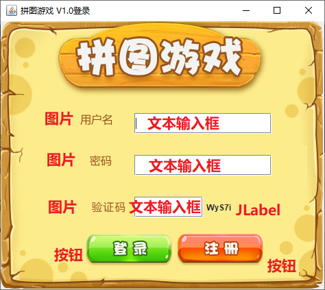

## 4.2、项目实现步骤

* 对主界面进行设置
* 添加组件
* 绑定事件

### 4.2.1、对主界面进行设置

> 主要设置界面的大小、居中、置顶、关闭模式、取消内部布局的参数以及让界面可见

```java
 	private void initJFrame() {
        /*
            这里可以设置界面的基本参数，比如宽高等信息
            在创建登录界面的时候，方便一起展示出来：
            窗口布局：宽488 高430
            标题：拼图游戏 V1.0登录
            关闭模式：WindowConstants.EXIT_ON_CLOSE
            。。。
         */
        this.setSize(488, 430);
        // 设置界面的标题
        this.setTitle("拼图游戏 V1.0登录");
        // 设置游戏的关闭模式
        this.setDefaultCloseOperation(WindowConstants.EXIT_ON_CLOSE);
        // 设置界面居中
        this.setLocationRelativeTo(null);
        // 设置界面置顶
        this.setAlwaysOnTop(true);
        // 取消内部的默认布局
        this.setLayout(null);
    }
```

### 4.2.2、添加组件

> 在主界面添加用户名和密码以及登录，注册按钮

```java
	/**
     * 初始化菜单
     */
    private void initMenu() {

        // ****************************** 用户名 ******************************

        /*
            - 创建JLabel添加“ 用户名 ”文字
            并且对用户名文字设置位置以及宽高：116, 135, 47, 17
         */
        JLabel usernameLabel = new JLabel(new ImageIcon("material/login/用户名.png"));
        usernameLabel.setBounds(116, 135, 47, 17);
        /*
            - 创建用户名的文本输入框：JTextField
            对用户名的文本输入框设置位置及其宽高：195, 134, 200, 30
         */
        JTextField usernameField = new JTextField();
        usernameField.setBounds(195, 134, 200, 30);

        // ****************************** 密码 ******************************

        /*
            - 创建JLabel添加密码文字
            对密码文字设置位置和宽高：130, 195, 32, 16
         */
        JLabel passwordLabel = new JLabel(new ImageIcon("material/login/密码.png"));
        passwordLabel.setBounds(130, 195, 32, 16);
        /*
            - 创建密码的文本输入框：JTextField
            对密码的文本输入框设置位置和宽高：195, 195, 200, 30
         */
        JTextField passwordField = new JTextField();
        passwordField.setBounds(195, 195, 200, 30);

        // ****************************** 验证码 ******************************

        /*
            - 验证码提示
            给验证码设置位置宽高：133, 256, 50, 30
         */
        JLabel verifyCodeLabel = new JLabel(new ImageIcon("material/login/验证码.png"));
        verifyCodeLabel.setBounds(133, 256, 50, 30);
        /*
            - 验证码的输入框
            给验证码的输入框设置位置宽高：195, 256, 100,30
         */
        JTextField verifyCodeField = new JTextField();
        verifyCodeField.setBounds(195, 256, 100,30);
        /*
            10.设置生成的验证码内容
            给验证码内容设置位置宽高：300, 256, 50, 30
         */
        generateCodeJLabel.setText(CodeUtils.generatorCode());
        generateCodeJLabel.setBounds(300, 256, 50, 30);

        // ****************************** 登录及注册按钮 ******************************

         /*
            5.创建登录的按钮：JButton
            利用setIcon方法给登录按钮设置背景色
            对登录的按钮设置位置和宽高：123, 310, 128, 47
         */
        loginButton.setBounds(123, 310, 128, 47);
        // 去除按钮的默认边框
        loginButton.setBorderPainted(false);
        // 去除按钮的默认背景
        loginButton.setContentAreaFilled(false);
        /*
            6.创建注册的按钮：JButton
            利用setIcon方法给注册按钮设置背景色
            对登录的按钮设置位置和宽高：256, 310, 128, 47
         */
        enrollButton.setBounds(256, 310, 128, 47);
        // 去除按钮的默认边框
        enrollButton.setBorderPainted(false);
        // 去除按钮的默认背景
        enrollButton.setContentAreaFilled(false);

        // ****************************** 背景图片 ******************************
          /*
            7.创建背景色：JLabel
            给背景色设置位置和宽高：0, 0, 470, 390
         */
        JLabel backgroundLabel = new JLabel(new ImageIcon("material/login/background.png"));
        backgroundLabel.setBounds(0, 0, 470, 390);

        // 将所有的组件添加到界面的内容面板中：注意，顺序要固定
        Container contentPane = this.getContentPane();
        contentPane.add(usernameLabel);
        contentPane.add(usernameField);
        contentPane.add(passwordLabel);
        contentPane.add(passwordField);
        contentPane.add(verifyCodeLabel);
        contentPane.add(verifyCodeField);
        contentPane.add(generateCodeJLabel);
        contentPane.add(loginButton);
        contentPane.add(enrollButton);
        contentPane.add(backgroundLabel);
    }
```

### 4.2.3、绑定事件

> 对登录按钮绑定鼠标事件

```java
给登录按钮绑定鼠标事件
当按下不松的时候：利用setIcon方法，修改登录按钮的背景色为蓝色
当松开的时候：利用setIcon方法，将按钮的背景色修改为红色
当点击的时候：校验用户输入的用户名和密码是否正确。
```

mouseClicked方法详解：

```java
先判断当前按下的是否为登录按钮。
如果是登录按钮，获取输入框中的用户名和密码
判断1：是否为空，如果为空，提示：用户名和密码为空
判断2：判断用户名和密码是否为zhangsan，123456，如果正确隐藏登录界面，进入游戏界面。
判断3：判断用户吗和密码，如果错误，就展示弹框，提示：用户名和密码错误
```

展示弹框步骤：

```java
成员位置创建JDialog对象

利用isVisible方法判断弹框是否存在，如果不存在则进行下面操作：
设置弹框的宽和高:100,100
设置弹框居中    
设置弹框置顶
移除弹框中所有文本
创建一个JLabel去编写文本内容
把文本JLabel添加到弹框当中
把弹框展示出来
```

&nbsp;

## 4.6、代码实现

> 完成登录页面逻辑

```java
/**
 * 登录界面：
 * 以后所有跟登录相关的逻辑，都写在此类中
 *
 * @author wl
 * @date 2022/11/10 21:43
 */
public class LoginJFrame extends JFrame implements MouseListener {

    // 创建一个集合存储正确的用户名和密码
    public static final ArrayList<User> USER_LIST = new ArrayList<>(20);

    static {
        USER_LIST.add(new User("zhangsan", "123"));
        USER_LIST.add(new User("lisi", "1234"));
    }

    /**
     * 用户名输入框
     */
    private final JTextField usernameField = new JTextField();

    /**
     * 密码输入框
     */
    private final JPasswordField passwordField = new JPasswordField();

    /**
     * 验证码输入框
     */
    private final JTextField verifyCodeField = new JTextField();

    /**
     * 登录按钮
     */
    private final JButton loginButton = new JButton(new ImageIcon("material/login/登录按钮.png"));

    /**
     * 注册按钮
     */
    private final JButton enrollButton = new JButton(new ImageIcon("material/login/注册按钮.png"));

    /**
     * 生成的验证码文字
     */
    private final JLabel generateCodeJLabel = new JLabel();


    /*
        无参构造
     */
    public LoginJFrame() {
        // 初始化界面
        initJFrame();

        // 初始化菜单
        initMenu();

        // 显示这个界面
        this.setVisible(true);
    }


    private void initJFrame() {
        /*
            这里可以设置界面的基本参数，比如宽高等信息
            在创建登录界面的时候，方便一起展示出来：
            窗口布局：宽488 高430
            标题：拼图游戏 V1.0登录
            关闭模式：WindowConstants.EXIT_ON_CLOSE
            。。。
         */
        this.setSize(488, 430);
        // 设置界面的标题
        this.setTitle("拼图游戏 V1.0登录");
        // 设置游戏的关闭模式
        this.setDefaultCloseOperation(WindowConstants.EXIT_ON_CLOSE);
        // 设置界面居中
        this.setLocationRelativeTo(null);
        // 设置界面置顶
        this.setAlwaysOnTop(true);
        // 取消内部的默认布局
        this.setLayout(null);
    }

    /**
     * 初始化菜单
     */
    private void initMenu() {

        // ****************************** 用户名 ******************************

        /*
            - 创建JLabel添加“ 用户名 ”文字
            并且对用户名文字设置位置以及宽高：116, 135, 47, 17
         */
        JLabel usernameLabel = new JLabel(new ImageIcon("material/login/用户名.png"));
        usernameLabel.setBounds(116, 135, 47, 17);
        /*
            - 创建用户名的文本输入框：JTextField
            对用户名的文本输入框设置位置及其宽高：195, 134, 200, 30
         */
        usernameField.setBounds(195, 134, 200, 30);
        usernameField.setFont(new Font("Consolas", Font.PLAIN, 16));
        usernameField.setBackground(new Color(210, 180, 140));
        usernameField.setPreferredSize(new Dimension(150, 28));
        usernameField.setBorder(new MatteBorder(0, 0, 2, 0, new Color(192, 192,
                192)));
        // ****************************** 密码 ******************************

        /*
            - 创建JLabel添加密码文字
            对密码文字设置位置和宽高：130, 195, 32, 16
         */
        JLabel passwordLabel = new JLabel(new ImageIcon("material/login/密码.png"));
        passwordLabel.setBounds(130, 195, 32, 16);
        /*
            - 创建密码的文本输入框：JTextField
            对密码的文本输入框设置位置和宽高：195, 195, 200, 30
         */
        passwordField.setBounds(195, 195, 200, 30);
        // 将内容替换为 * 号
        passwordField.setEchoChar('*');
        passwordField.setFont(new Font("Consolas", Font.PLAIN, 15));
        passwordField.setBackground(new Color(210, 180, 140));
        passwordField.setPreferredSize(new Dimension(150, 28));
        passwordField.setBorder(new MatteBorder(0, 0, 2, 0, new Color(192, 192,
                192)));
        // ****************************** 验证码 ******************************

        /*
            - 验证码提示
            给验证码设置位置宽高：115, 256, 50, 30
         */
        JLabel verifyCodeLabel = new JLabel(new ImageIcon("material/login/验证码.png"));
        verifyCodeLabel.setBounds(115, 256, 50, 30);
        /*
            - 验证码的输入框
            给验证码的输入框设置位置宽高：195, 256, 100,30
         */
        verifyCodeField.setBounds(195, 256, 100, 30);
        verifyCodeField.setFont(new Font("Consolas", Font.PLAIN, 14));
        verifyCodeField.setBackground(new Color(210, 180, 140));
        verifyCodeField.setPreferredSize(new Dimension(150, 28));
        verifyCodeField.setBorder(new MatteBorder(0, 0, 2, 0, new Color(192, 192,
                192)));
        /*
            10.设置生成的验证码内容
            给验证码内容设置位置宽高：300, 256, 50, 30
         */
        generateCodeJLabel.setText(CodeUtils.generatorCode());
        generateCodeJLabel.setBounds(310, 256, 50, 30);
        generateCodeJLabel.setFont(new Font("TimesRoman", Font.ITALIC, 15));
        // ****************************** 登录及注册按钮 ******************************

         /*
            5.创建登录的按钮：JButton
            利用setIcon方法给登录按钮设置背景色
            对登录的按钮设置位置和宽高：123, 310, 128, 47
         */
        loginButton.setBounds(123, 310, 128, 47);
        // 去除按钮的默认边框
        loginButton.setBorderPainted(false);
        // 去除按钮的默认背景
        loginButton.setContentAreaFilled(false);
        /*
            6.创建注册的按钮：JButton
            利用setIcon方法给注册按钮设置背景色
            对登录的按钮设置位置和宽高：256, 310, 128, 47
         */
        enrollButton.setBounds(256, 310, 128, 47);
        // 去除按钮的默认边框
        enrollButton.setBorderPainted(false);
        // 去除按钮的默认背景
        enrollButton.setContentAreaFilled(false);

        // ****************************** 背景图片 ******************************
          /*
            7.创建背景色：JLabel
            给背景色设置位置和宽高：0, 0, 470, 390
         */
        JLabel backgroundLabel = new JLabel(new ImageIcon("material/login/background.png"));
        backgroundLabel.setBounds(0, 0, 470, 390);

        // 将所有的组件添加到界面的内容面板中：注意，顺序要固定
        Container contentPane = this.getContentPane();
        contentPane.add(usernameLabel);
        contentPane.add(usernameField);
        contentPane.add(passwordLabel);
        contentPane.add(passwordField);
        contentPane.add(verifyCodeLabel);
        contentPane.add(verifyCodeField);
        contentPane.add(generateCodeJLabel);
        contentPane.add(loginButton);
        contentPane.add(enrollButton);
        contentPane.add(backgroundLabel);

        // 给按钮绑定鼠标事件
        generateCodeJLabel.addMouseListener(this);
        loginButton.addMouseListener(this);
        enrollButton.addMouseListener(this);
    }

    //要展示用户名或密码错误
    private void showJDialog(String content) {
        //创建一个弹框对象
        JDialog jDialog = new JDialog();
        jDialog.setTitle("提示");
        //给弹框设置大小
        jDialog.setSize(200, 150);
        //让弹框置顶
        jDialog.setAlwaysOnTop(true);
        //让弹框居中
        jDialog.setLocationRelativeTo(null);
        //弹框不关闭永远无法操作下面的界面
        jDialog.setModal(true);
        //创建Jlabel对象管理文字并添加到弹框当中
        JLabel warning = new JLabel(content, JLabel.CENTER);
        // 设置字体和样式 MS Song
        warning.setFont(new Font("华文行楷", Font.PLAIN, 17));
        warning.setForeground(Color.red);
        warning.setLayout(null);
        warning.setBounds(0, 0, 200, 150);
        jDialog.getContentPane().add(warning);
        //让弹框展示出来
        jDialog.setVisible(true);
        jDialog.getContentPane().repaint();
    }


    /**
     * 点击鼠标时调用
     *
     * @param e 鼠标动作
     */
    @Override
    public void mouseClicked(MouseEvent e) {

    }

    /**
     * 登录验证
     *
     * @param username 用户名
     * @param password 密码
     * @return boolean
     * @author 万龙
     * @date 2022/12/18 17:40
     */
    private boolean loginAuth(String username, String password) {
        if (username == null || username.equals("")) {
            showJDialog("<html><body>用户名不能为空<br/>，请重新输入</body></html>");
            return false;
        }
        if (password == null || password.equals("")) {
            showJDialog("<html><body>密码不能为空<br/>，请重新输入</body></html>");
            return false;
        }
        System.out.println("username = " + username);
        System.out.println("password = " + password);
        for (User user : USER_LIST) {
            if (user.getUsername().equals(username)) {
                if (user.getPassword().equals(password)) {
                    if (generateCodeJLabel.getText().equals(verifyCodeField.getText())) {
                        return true;
                    } else {
                        showJDialog("<html><body>您输入的验证码不正确<br/>，请重新输入</body></html>");
                        return false;
                    }
                } else {
                    showJDialog("<html><body>您输入的密码不正确<br/>，请重新输入</body></html>");
                    return false;
                }
            }
        }
        showJDialog("<html><body>您输入的用户名不正确<br/>，请重新输入</body></html>");
        return false;
    }

    /**
     * 按下鼠标时调用
     *
     * @param e 鼠标事件
     */
    @Override
    public void mousePressed(MouseEvent e) {
        System.out.println("鼠标被按下不松");
        Object source = e.getSource();
        if (source == loginButton) {
            loginButton.setBackground(Color.blue);
            loginButton.setIcon(new ImageIcon("material/login/登录按下.png"));
        } else if (source == enrollButton) {
            enrollButton.setBackground(Color.gray);
            enrollButton.setIcon(new ImageIcon("material/login/注册按下2.png"));
        }
        this.getContentPane().repaint();
    }

    /**
     * 放开时鼠标调用
     *
     * @param e 鼠标事件
     */
    @Override
    public void mouseReleased(MouseEvent e) {
        System.out.println("鼠标被点击");
        Object source = e.getSource();
        // 点击重新生成一个新的验证码
        if (source == generateCodeJLabel) {
            generateCodeJLabel.setText(CodeUtils.generatorCode());
        } else if (source == loginButton) {
            loginButton.setBackground(Color.red);
            loginButton.setIcon(new ImageIcon("material/login/登录按钮.png"));
            boolean flag = loginAuth(usernameField.getText(), String.valueOf(passwordField.getPassword()));
            if (flag) {
                new GameJFrame();
                System.out.println("登录成功");
            } else {
                // 登录失败，则刷新验证码
                generateCodeJLabel.setText(CodeUtils.generatorCode());
            }
        } else if (source == enrollButton) {
            enrollButton.setIcon(new ImageIcon("material/login/注册按下.png"));
        }
    }

    /**
     * Invoked when the mouse enters a component.
     *
     * @param e
     */
    @Override
    public void mouseEntered(MouseEvent e) {

    }

    /**
     * Invoked when the mouse exits a component.
     *
     * @param e
     */
    @Override
    public void mouseExited(MouseEvent e) {

    }
}
```

## 4.7、界面优化

```java
/**
 * 登录界面：
 * 以后所有跟登录相关的逻辑，都写在此类中
 *
 * @author wl
 * @date 2022/11/10 21:43
 */
public class LoginJFrame extends JFrame implements MouseListener {

    // 创建一个集合存储正确的用户名和密码
    public static final ArrayList<User> USER_LIST = new ArrayList<>(20);

    static {
        USER_LIST.add(new User("zhangsan", "123"));
        USER_LIST.add(new User("lisi", "1234"));
    }

    /**
     * 用户名输入框
     */
    private final JTextField usernameField = new JTextField();

    /**
     * 密码输入框
     */
    private final JPasswordField passwordField = new JPasswordField();

    /**
     * 验证码输入框
     */
    private final JTextField verifyCodeField = new JTextField();

    /**
     * 登录按钮
     */
    private final JButton loginButton = new JButton(new ImageIcon("material/login/登录按钮.png"));

    /**
     * 注册按钮
     */
    private final JButton enrollButton = new JButton(new ImageIcon("material/login/注册按钮.png"));

    /**
     * 生成的验证码文字
     */
    private final JLabel generateCodeJLabel = new JLabel();

    /*
        无参构造
     */
    public LoginJFrame() {
        // 初始化界面
        initJFrame();

        // 初始化菜单
        initMenu();

        // 显示这个界面
        this.setVisible(true);
    }

    private void initJFrame() {
        /*
            这里可以设置界面的基本参数，比如宽高等信息
            在创建登录界面的时候，方便一起展示出来：
            窗口布局：宽488 高430
            标题：拼图游戏 V1.0登录
            关闭模式：WindowConstants.EXIT_ON_CLOSE
            。。。
         */
        this.setSize(488, 430);
        // 设置界面的标题
        this.setTitle("拼图游戏 V1.0登录");
        // 设置游戏的关闭模式
        this.setDefaultCloseOperation(WindowConstants.EXIT_ON_CLOSE);
        // 设置界面居中
        this.setLocationRelativeTo(null);
        // 设置界面置顶
        this.setAlwaysOnTop(true);
        // 取消内部的默认布局
        this.setLayout(null);
    }

    /**
     * 初始化菜单
     */
    private void initMenu() {

        // ****************************** 用户名 ******************************

        /*
            - 创建JLabel添加“ 用户名 ”文字
            并且对用户名文字设置位置以及宽高：116, 135, 47, 17
         */
        JLabel usernameLabel = new JLabel(new ImageIcon("material/login/用户名.png"));
        usernameLabel.setBounds(116, 135, 47, 17);
        /*
            - 创建用户名的文本输入框：JTextField
            对用户名的文本输入框设置位置及其宽高：200, 132, 180, 30
         */
        usernameField.setBounds(200, 132, 180, 30);
        usernameField.setFont(new Font("MS Song", Font.PLAIN, 16));
        usernameField.setBackground(new Color(210, 180, 140));
        usernameField.setPreferredSize(new Dimension(150, 28));
        usernameField.setBorder(new MatteBorder(0, 0, 2, 0, new Color(192, 192,
                192)));
        usernameField.setOpaque(false);
        usernameField.setBorder(new EmptyBorder(0, 0, 0, 0));
        JLabel usernameIcon = new JLabel(new ImageIcon("material/login/对话框.png"));
        usernameIcon.setBounds(190, 130, 200, 30);
        // ****************************** 密码 ******************************

        /*
            - 创建JLabel添加密码文字
            对密码文字设置位置和宽高：130, 195, 32, 16
         */
        JLabel passwordLabel = new JLabel(new ImageIcon("material/login/密码.png"));
        passwordLabel.setBounds(130, 195, 32, 16);
        /*
            - 创建密码的文本输入框：JTextField
            对密码的文本输入框设置位置和宽高：195, 195, 200, 30
         */
        passwordField.setBounds(200, 190, 180, 30);
        // 将内容替换为 * 号
        passwordField.setEchoChar('*');
        passwordField.setFont(new Font("MS Song", Font.PLAIN, 15));
        passwordField.setBackground(new Color(210, 180, 140));
        passwordField.setPreferredSize(new Dimension(150, 28));
        passwordField.setBorder(new MatteBorder(0, 0, 2, 0, new Color(192, 192,
                192)));
        passwordField.setOpaque(false);
        passwordField.setBorder(new EmptyBorder(0, 0, 0, 0));
        JLabel passwordIcon = new JLabel(new ImageIcon("material/login/对话框.png"));
        passwordIcon.setBounds(190, 190, 200, 30);

        // ****************************** 验证码 ******************************

        /*
            - 验证码提示
            给验证码设置位置宽高：115, 256, 50, 30
         */
        JLabel verifyCodeLabel = new JLabel(new ImageIcon("material/login/验证码.png"));
        verifyCodeLabel.setBounds(115, 256, 50, 30);
        /*
            - 验证码的输入框
            给验证码的输入框设置位置宽高：195, 256, 100,30
         */
        verifyCodeField.setBounds(198, 256, 92, 30);
        verifyCodeField.setFont(new Font("MS Song", Font.PLAIN, 14));
        verifyCodeField.setBackground(new Color(210, 180, 140));
        verifyCodeField.setPreferredSize(new Dimension(150, 28));
        verifyCodeField.setBorder(new MatteBorder(0, 0, 2, 0, new Color(192, 192,
                192)));
        verifyCodeField.setOpaque(false);
        verifyCodeField.setBorder(new EmptyBorder(0, 0, 0, 0));
        JLabel verifyCodeIcon = new JLabel(new ImageIcon("material/login/对话框.png"));
        verifyCodeIcon.setBounds(195, 256, 100, 30);
        /*
            10.设置生成的验证码内容
            给验证码内容设置位置宽高：300, 256, 50, 30
         */
        generateCodeJLabel.setText(CodeUtils.generatorCode());
        generateCodeJLabel.setBounds(310, 256, 50, 30);
        generateCodeJLabel.setFont(new Font("TimesRoman", Font.ITALIC, 15));
        // ****************************** 登录及注册按钮 ******************************

         /*
            5.创建登录的按钮：JButton
            利用setIcon方法给登录按钮设置背景色
            对登录的按钮设置位置和宽高：123, 310, 128, 47
         */
        loginButton.setBounds(123, 310, 128, 47);
        // 去除按钮的默认边框
        loginButton.setBorderPainted(false);
        // 去除按钮的默认背景
        loginButton.setContentAreaFilled(false);
        /*
            6.创建注册的按钮：JButton
            利用setIcon方法给注册按钮设置背景色
            对登录的按钮设置位置和宽高：256, 310, 128, 47
         */
        enrollButton.setBounds(256, 310, 128, 47);
        // 去除按钮的默认边框
        enrollButton.setBorderPainted(false);
        // 去除按钮的默认背景
        enrollButton.setContentAreaFilled(false);

        // ****************************** 背景图片 ******************************
          /*
            7.创建背景色：JLabel
            给背景色设置位置和宽高：0, 0, 470, 390
         */
        JLabel backgroundLabel = new JLabel(new ImageIcon("material/login/background.png"));
        backgroundLabel.setBounds(0, 0, 470, 390);

        // 将所有的组件添加到界面的内容面板中：注意，顺序要固定
        Container contentPane = this.getContentPane();
        contentPane.add(usernameLabel);
        contentPane.add(usernameField);
        contentPane.add(usernameIcon);
        contentPane.add(passwordLabel);
        contentPane.add(passwordField);
        contentPane.add(passwordIcon);
        contentPane.add(verifyCodeLabel);
        contentPane.add(verifyCodeField);
        contentPane.add(verifyCodeIcon);
        contentPane.add(generateCodeJLabel);
        contentPane.add(loginButton);
        contentPane.add(enrollButton);
        contentPane.add(backgroundLabel);

        // 给按钮绑定鼠标事件
        generateCodeJLabel.addMouseListener(this);
        loginButton.addMouseListener(this);
        enrollButton.addMouseListener(this);
    }

    //要展示用户名或密码错误
    private void showJDialog(String content) {
        //创建一个弹框对象
        JDialog jDialog = new JDialog();
        jDialog.setTitle("提示");
        //给弹框设置大小
        jDialog.setSize(200, 150);
        //让弹框置顶
        jDialog.setAlwaysOnTop(true);
        //让弹框居中
        jDialog.setLocationRelativeTo(null);
        //弹框不关闭永远无法操作下面的界面
        jDialog.setModal(true);
        //创建Jlabel对象管理文字并添加到弹框当中
        JLabel warning = new JLabel(content, JLabel.CENTER);
        // 设置字体和样式 MS Song
        warning.setFont(new Font("华文行楷", Font.PLAIN, 17));
        warning.setForeground(Color.red);
        warning.setLayout(null);
        warning.setBounds(0, 0, 200, 150);
        jDialog.getContentPane().add(warning);
        //让弹框展示出来
        jDialog.setVisible(true);
        jDialog.getContentPane().repaint();
    }


    /**
     * 点击鼠标时调用
     *
     * @param e 鼠标动作
     */
    @Override
    public void mouseClicked(MouseEvent e) {

    }

    /**
     * 登录验证
     *
     * @param username 用户名
     * @param password 密码
     * @return boolean
     * @author 万龙
     * @date 2022/12/18 17:40
     */
    private boolean loginAuth(String username, String password) {
        if (username == null || username.equals("")) {
            showJDialog("<html><body>用户名不能为空<br/>，请重新输入</body></html>");
            return false;
        }
        if (password == null || password.equals("")) {
            showJDialog("<html><body>密码不能为空<br/>，请重新输入</body></html>");
            return false;
        }
        String codeFieldText = verifyCodeField.getText();
        if (codeFieldText == null || codeFieldText.equals("")) {
            showJDialog("<html><body>验证码不能为空<br/>，请重新输入</body></html>");
            return false;
        }
        System.out.println("username = " + username);
        System.out.println("password = " + password);
        for (User user : USER_LIST) {
            if (user.getUsername().equals(username)) {
                if (user.getPassword().equals(password)) {
                    if (generateCodeJLabel.getText().equals(codeFieldText)) {
                        return true;
                    } else {
                        showJDialog("<html><body>验证码不正确<br/>，请重新输入</body></html>");
                        verifyCodeField.setText(null);
                        return false;
                    }
                } else {
                    showJDialog("<html><body>您输入的密码不正确<br/>，请重新输入</body></html>");
                    passwordField.setText(null);
                    return false;
                }
            }
        }
        // 如果用户名不正确则三个输入的参数都设置为空
        usernameField.setText(null);
        passwordField.setText(null);
        verifyCodeField.setText(null);
        showJDialog("<html><body>不存在该用户<br/>，请重新输入</body></html>");
        return false;
    }

    /**
     * 按下鼠标时调用
     *
     * @param e 鼠标事件
     */
    @Override
    public void mousePressed(MouseEvent e) {
        System.out.println("鼠标被按下不松");
        Object source = e.getSource();
        if (source == loginButton) {
            loginButton.setBackground(Color.blue);
            loginButton.setIcon(new ImageIcon("material/login/登录按下.png"));
        } else if (source == enrollButton) {
            enrollButton.setBackground(Color.gray);
            enrollButton.setIcon(new ImageIcon("material/login/注册按下2.png"));
        }
        this.getContentPane().repaint();
    }

    /**
     * 放开时鼠标调用
     *
     * @param e 鼠标事件
     */
    @Override
    public void mouseReleased(MouseEvent e) {
        System.out.println("鼠标被点击");
        Object source = e.getSource();
        // 点击重新生成一个新的验证码
        if (source == generateCodeJLabel) {
            generateCodeJLabel.setText(CodeUtils.generatorCode());
        } else if (source == loginButton) {
            loginButton.setBackground(Color.red);
            loginButton.setIcon(new ImageIcon("material/login/登录按钮.png"));
            boolean flag = loginAuth(usernameField.getText(), String.valueOf(passwordField.getPassword()));
            if (flag) {
                new GameJFrame();
                System.out.println("登录成功");
            } else {
                // 登录失败，则刷新验证码
                generateCodeJLabel.setText(CodeUtils.generatorCode());
            }
        } else if (source == enrollButton) {
            enrollButton.setIcon(new ImageIcon("material/login/注册按下.png"));
        }
    }

    /**
     * Invoked when the mouse enters a component.
     *
     * @param e
     */
    @Override
    public void mouseEntered(MouseEvent e) {

    }

    /**
     * Invoked when the mouse exits a component.
     *
     * @param e
     */
    @Override
    public void mouseExited(MouseEvent e) {

    }
}

```

# 五、注册页面的逻辑

- 所需技术点
- 项目实现步骤
- 代码实现
- 界面优化


## 5.1、所需技术点

第一排：注册用户名文字其实是一张图片，还是用JLabel去管理ImageIcon

输入框：JTextField（明文显示的输入框）

第二排：注册密码文字其实是一张图片，还是用JLabel去管理ImageIcon

输入框：JPasswordField（密文显示的输入框）

第二排：再次输入密码文字其实是一张图片，还是用JLabel去管理ImageIcon

输入框：JPasswordField（密文显示的输入框）

第三排：验证码文字其实是一张图片，还是用JLabel去管理ImageIcon

输入框：JTextField（明文显示的输入框）

第四排：两个都是按钮，绿色跟蓝色是按钮的背景图

当点击按钮不松的时候，按钮变灰，其实就是换一个深色的背景图。

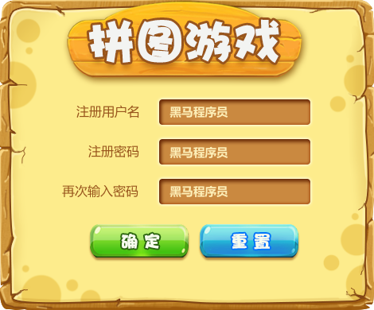

## 5.2、项目实现步骤

* 对主界面进行设置
* 添加组件
* 绑定事件

### 5.2.1、对主界面进行设置

> 主要设置界面的大小、居中、置顶、关闭模式、取消内部布局的参数以及让界面可见

```java
 	// 初始化界面
    private void initJFrame() {
        /*
            这里可以设置界面的基本参数，比如宽高等信息
            在创建登录界面的时候，方便一起展示出来：
            窗口布局：宽488 高430
            标题：拼图游戏 V1.0登录
            关闭模式：WindowConstants.EXIT_ON_CLOSE
            。。。
         */
        this.setSize(488, 430);
        // 设置界面的标题
        this.setTitle("拼图游戏 V1.0注册");
        // 设置游戏的关闭模式
        this.setDefaultCloseOperation(WindowConstants.EXIT_ON_CLOSE);
        // 设置界面居中
        this.setLocationRelativeTo(null);
        // 设置界面置顶
        this.setAlwaysOnTop(true);
        // 取消内部的默认布局
        this.setLayout(null);
    }
```

### 5.2.2、添加组件

> 在主界面添加用户名和密码以及注册，重置按钮

```java
 // 初始化界面
    private void initJFrame() {
        /*
            这里可以设置界面的基本参数，比如宽高等信息
            在创建登录界面的时候，方便一起展示出来：
            窗口布局：宽488 高430
            标题：拼图游戏 V1.0登录
            关闭模式：WindowConstants.EXIT_ON_CLOSE
            。。。
         */
        this.setSize(488, 430);
        // 设置界面的标题
        this.setTitle("拼图游戏 V1.0注册");
        // 设置游戏的关闭模式
        this.setDefaultCloseOperation(WindowConstants.EXIT_ON_CLOSE);
        // 设置界面居中
        this.setLocationRelativeTo(null);
        // 设置界面置顶
        this.setAlwaysOnTop(true);
        // 取消内部的默认布局
        this.setLayout(null);
    }

    /**
     * 初始化菜单
     */
    private void initMenu() {

        // ****************************** 用户名 ******************************

        /*
            - 创建JLabel添加“ 注册用户名 ”文字
            并且对用户名文字设置位置以及宽高：80, 125, 80, 17
         */
        JLabel enrollUsernameLabel = new JLabel(new ImageIcon("material/register/注册用户名.png"));
        enrollUsernameLabel.setBounds(70, 125, 80, 17);
        /*
            - 创建注册用户名的文本输入框：JTextField
            对用户名的文本输入框设置位置及其宽高：180, 120, 200, 30
         */
        JTextField enrollUsernameField = new JTextField();
        enrollUsernameField.setBounds(180, 120, 200, 30);

        // ****************************** 密码 ******************************

        /*
            - 创建JLabel添加注册密码文字
            对密码文字设置位置和宽高：80,180,80,16
         */
        JLabel passwordLabel = new JLabel(new ImageIcon("material/register/注册密码.png"));
        passwordLabel.setBounds(80, 180, 80, 16);
        /*
            - 创建密码的文本输入框：JTextField
            对密码的文本输入框设置位置和宽高：180,175,200,30
         */
        JTextField passwordField = new JTextField();
        passwordField.setBounds(180, 175, 200, 30);

         /*
            - 创建JLabel添加再次输入密码文字
            对密码文字设置位置和宽高：55,230,100,30
         */
        JLabel againPasswordLabel = new JLabel(new ImageIcon("material/register/再次输入密码.png"));
        againPasswordLabel.setBounds(55, 230, 100, 30);
        /*
            - 创建再次输入密码的文本输入框：JTextField
            对再次输入密码的文本输入框设置位置和宽高：180,230,200,30
         */
        JTextField againPasswordField = new JTextField();
        againPasswordField.setBounds(180, 230, 200, 30);


        // ****************************** 登录及注册按钮 ******************************

         /*
            5.创建注册的按钮：JButton
            利用setIcon方法给登录按钮设置背景色
            对登录的按钮设置位置和宽高：123, 310, 128, 47
         */
        enrollButton.setBounds(100, 295, 128, 47);
        // 去除按钮的默认边框
        enrollButton.setBorderPainted(false);
        // 去除按钮的默认背景
        enrollButton.setContentAreaFilled(false);
        /*
            6.创建重置的按钮：JButton
            利用setIcon方法给注册按钮设置背景色
            对登录的按钮设置位置和宽高：240, 295, 128, 47
         */
        resetButton.setBounds(240, 295, 128, 47);
        // 去除按钮的默认边框
        resetButton.setBorderPainted(false);
        // 去除按钮的默认背景
        resetButton.setContentAreaFilled(false);

        // ****************************** 背景图片 ******************************
          /*
            7.创建背景色：JLabel
            给背景色设置位置和宽高：0, 0, 470, 390
         */
        JLabel backgroundLabel = new JLabel(new ImageIcon("material/login/background.png"));
        backgroundLabel.setBounds(0, 0, 470, 390);

        // 将所有的组件添加到界面的内容面板中：注意，顺序要固定
        Container contentPane = this.getContentPane();
        contentPane.add(enrollUsernameLabel);
        contentPane.add(enrollUsernameField);
        contentPane.add(passwordLabel);
        contentPane.add(passwordField);
        contentPane.add(againPasswordLabel);
        contentPane.add(againPasswordField);
        contentPane.add(enrollButton);
        contentPane.add(resetButton);
        contentPane.add(backgroundLabel);
    }
```

### 5.2.3、绑定事件

> 对登录按钮绑定鼠标事件

```java
给注册按钮绑定鼠标事件
当按下不松的时候：利用setIcon方法，修改登录按钮的背景色为蓝色
当松开的时候：利用setIcon方法，将按钮的背景色修改为红色
当点击的时候：校验用户输入的用户名和密码是否为空
```

mouseClicked方法详解：

```java
先判断当前按下的是否为注册按钮。
如果是注册按钮，获取输入框中的用户名和密码
判断1：是否为空，如果为空，提示：用户名和密码为空
如果不空，则提示注册成功并转到登录页面
```

展示弹框步骤：

```java
成员位置创建JDialog对象

利用isVisible方法判断弹框是否存在，如果不存在则进行下面操作：
设置弹框的宽和高:100,100
设置弹框居中    
设置弹框置顶
移除弹框中所有文本
创建一个JLabel去编写文本内容
把文本JLabel添加到弹框当中
把弹框展示出来
```

## 5.3、代码实现

```java
package com.bbc.ui.jrame;

import com.bbc.ui.domain.User;
import com.bbc.ui.utils.FrameUtils;

import javax.swing.*;
import java.awt.*;
import java.awt.event.MouseEvent;
import java.awt.event.MouseListener;

import static com.bbc.ui.App.USER_LIST;

/**
 * 注册界面：
 * 跟注册相关的逻辑，都写在此类中
 *
 * @author wl
 * @date 2022/11/10 22:26
 */
public class EnrollJFrame extends JFrame implements MouseListener {

    /**
     * 注册用户名输入框
     */
    private final JTextField enrollUsernameField = new JTextField();

    /**
     * 注册密码输入框
     */
    private final JPasswordField enrollPasswordField = new JPasswordField();

    /**
     * 再次输入密码输入框
     */
    private final JPasswordField againPasswordField = new JPasswordField();

    /**
     * 注册按钮
     */
    private final JButton enrollButton = new JButton(new ImageIcon("material/register/注册按钮.png"));

    /**
     * 重置按钮
     */
    private final JButton resetButton = new JButton(new ImageIcon("material/register/重置按钮.png"));

    /*
        无参构造
     */
    public EnrollJFrame() {
        // 初始化界面
        initJFrame();
        // 初始化菜单和按钮
        initMenu();

        // 显示这个界面
        this.setVisible(true);
    }

    // 初始化界面
    private void initJFrame() {
        /*
            这里可以设置界面的基本参数，比如宽高等信息
            在创建登录界面的时候，方便一起展示出来：
            窗口布局：宽488 高430
            标题：拼图游戏 V1.0登录
            关闭模式：WindowConstants.EXIT_ON_CLOSE
            。。。
         */
        this.setSize(488, 430);
        // 设置界面的标题
        this.setTitle("拼图游戏 V1.0注册");
        // 设置游戏的关闭模式
        this.setDefaultCloseOperation(WindowConstants.EXIT_ON_CLOSE);
        // 设置界面居中
        this.setLocationRelativeTo(null);
        // 设置界面置顶
        this.setAlwaysOnTop(true);
        // 取消内部的默认布局
        this.setLayout(null);
    }

    /**
     * 初始化菜单
     */
    private void initMenu() {

        // ****************************** 用户名 ******************************

        /*
            - 创建JLabel添加“ 注册用户名 ”文字
            并且对用户名文字设置位置以及宽高：80, 125, 80, 17
         */
        JLabel enrollUsernameLabel = new JLabel(new ImageIcon("material/register/注册用户名.png"));
        enrollUsernameLabel.setBounds(70, 125, 80, 17);
        /*
            - 创建注册用户名的文本输入框：JTextField
            对用户名的文本输入框设置位置及其宽高：180, 120, 200, 30
         */
        enrollUsernameField.setBounds(180, 120, 200, 30);

        // ****************************** 密码 ******************************

        /*
            - 创建JLabel添加注册密码文字
            对密码文字设置位置和宽高：80,180,80,16
         */
        JLabel enrollPasswordLabel = new JLabel(new ImageIcon("material/register/注册密码.png"));
        enrollPasswordLabel.setBounds(80, 180, 80, 16);
        /*
            - 创建密码的文本输入框：JTextField
            对密码的文本输入框设置位置和宽高：180,175,200,30
         */
        enrollPasswordField.setBounds(180, 175, 200, 30);
        // 将内容替换为 * 号
        enrollPasswordField.setEchoChar('*');
         /*
            - 创建JLabel添加再次输入密码文字
            对密码文字设置位置和宽高：55,230,100,30
         */
        JLabel againPasswordLabel = new JLabel(new ImageIcon("material/register/再次输入密码.png"));
        againPasswordLabel.setBounds(55, 230, 100, 30);
        /*
            - 创建再次输入密码的文本输入框：JTextField
            对再次输入密码的文本输入框设置位置和宽高：180,230,200,30
         */
        againPasswordField.setBounds(180, 230, 200, 30);
        // 将内容替换为 * 号
        againPasswordField.setEchoChar('*');


        // ****************************** 注册及重置按钮 ******************************

         /*
            5.创建注册的按钮：JButton
            利用setIcon方法给登录按钮设置背景色
            对登录的按钮设置位置和宽高：123, 310, 128, 47
         */
        enrollButton.setBounds(100, 295, 128, 47);
        // 去除按钮的默认边框
        enrollButton.setBorderPainted(false);
        // 去除按钮的默认背景
        enrollButton.setContentAreaFilled(false);
        /*
            6.创建重置的按钮：JButton
            利用setIcon方法给注册按钮设置背景色
            对登录的按钮设置位置和宽高：240, 295, 128, 47
         */
        resetButton.setBounds(240, 295, 128, 47);
        // 去除按钮的默认边框
        resetButton.setBorderPainted(false);
        // 去除按钮的默认背景
        resetButton.setContentAreaFilled(false);

        // ****************************** 背景图片 ******************************
          /*
            7.创建背景色：JLabel
            给背景色设置位置和宽高：0, 0, 470, 390
         */
        JLabel backgroundLabel = new JLabel(new ImageIcon("material/login/background.png"));
        backgroundLabel.setBounds(0, 0, 470, 390);

        // 将所有的组件添加到界面的内容面板中：注意，顺序要固定
        Container contentPane = this.getContentPane();
        contentPane.add(enrollUsernameLabel);
        contentPane.add(enrollUsernameField);
        contentPane.add(enrollPasswordLabel);
        contentPane.add(enrollPasswordField);
        contentPane.add(againPasswordLabel);
        contentPane.add(againPasswordField);
        contentPane.add(enrollButton);
        contentPane.add(resetButton);
        contentPane.add(backgroundLabel);
        // 给按钮绑定鼠标事件
        enrollButton.addMouseListener(this);
        resetButton.addMouseListener(this);
    }

    /**
     * 点击鼠标时调用
     *
     * @param e 鼠标动作
     */
    @Override
    public void mouseClicked(MouseEvent e) {
        Object source = e.getSource();
        if (source == enrollButton) {
            String username = enrollUsernameField.getText();
            String password = new String(enrollPasswordField.getPassword());
            String againPassword = new String(againPasswordField.getPassword());
            if (preVerify(username, password, againPassword)) {
                System.out.println("注册成功");
                // 添加用户并转到登录页面
                USER_LIST.add(new User(username, password));
                new LoginJFrame();
            }
        } else if (source == resetButton) {
            enrollUsernameField.setText(null);
            enrollPasswordField.setText(null);
            againPasswordField.setText(null);
        }
    }

    /**
     * 注册用户校验
     * 用户名 6-12 位，只能包含数字或者字母，不能纯数字
     * 密码 8-16 位，只能包含数字或者字母，不能纯数字
     *
     * @param enrollUsername 注册用户
     * @param enrollPassword 注册密码
     * @param againPassword  再次输入的密码
     * @return boolean
     * @author 万龙
     * @date 2022/12/21 23:40
     */
    private boolean preVerify(String enrollUsername, String enrollPassword, String againPassword) {
        if (enrollUsername == null || enrollUsername.equals("")) {
            FrameUtils.showJDialog("<html><body>注册的用户名<br/>不能为空</body></html>", this.getContentPane());
            return false;
        }
        if (enrollPassword == null || enrollPassword.equals("")) {
            FrameUtils.showJDialog("<html><body>注册的密码<br/>不能为空</body></html>", this.getContentPane());
            return false;
        }
        if (againPassword == null || againPassword.equals("")) {
            FrameUtils.showJDialog("<html><body>二次输入的密码<br/>不能为空</body></html>", this.getContentPane());
            return false;
        }
        if (!enrollPassword.equals(againPassword)) {
            FrameUtils.showJDialog("<html><body>两次输入的密码不一致<br/>请重新输入</body></html>", this.getContentPane());
            return false;
        }
        if (!(enrollUsername.length() >= 6 && enrollUsername.length() <= 12)) {
            FrameUtils.showJDialog("<html><body>用户名长度<br/>必须在6-12个字符之间</body></html>", this.getContentPane());
            return false;
        }
        if (!(enrollPassword.length() >= 8 && enrollPassword.length() <= 16)) {
            FrameUtils.showJDialog("<html><body>密码长度<br/>必须在8-16之间</body></html>", this.getContentPane());
            return false;
        }
        if (regulationVerify(enrollUsername)) {
            FrameUtils.showJDialog("<html><body>用户名必须<br/>包含字母或数字<br/>且不能全是数字</body></html>", this.getContentPane());
            return false;
        }
        if (regulationVerify(enrollPassword)) {
            FrameUtils.showJDialog("<html><body>密码必须<br/>包含字母或数字<br/>且不能全是数字</body></html>", this.getContentPane());
            return false;
        }
        for (User user : USER_LIST) {
            String username = user.getUsername();
            if(username.equals(enrollUsername)) {
                FrameUtils.showJDialog("<html><body>用户名不能重复</body></html>", this.getContentPane());
                return false;
            }
        }
        return true;
    }

    // 规则校验：只能包含数字或者字母，不能纯数字
    private boolean regulationVerify(String str) {
        for (int i = 0; i < str.length(); i++) {
            char ch = str.charAt(i);
            if (Character.isLetterOrDigit(ch)) {
                if (Character.isLetter(ch)) {
                    return false;
                }
            }
        }
        return true;
    }

    /**
     * 按下鼠标时调用
     *
     * @param e 鼠标事件
     */
    @Override
    public void mousePressed(MouseEvent e) {
        Object source = e.getSource();
        if (source == enrollButton) {
            enrollButton.setIcon(new ImageIcon("material/register/注册按下.png"));
        } else if (source == resetButton) {
            resetButton.setIcon(new ImageIcon("material/register/重置按下2.png"));
        }
        this.getContentPane().repaint();
    }

    /**
     * 放开时鼠标调用
     *
     * @param e 鼠标事件
     */
    @Override
    public void mouseReleased(MouseEvent e) {
        Object source = e.getSource();
        if (source == enrollButton) {
            enrollButton.setIcon(new ImageIcon("material/register/注册按钮.png"));
        } else if (source == resetButton) {
            resetButton.setIcon(new ImageIcon("material/register/重置按下.png"));
        }
    }

    /**
     * Invoked when the mouse enters a component.
     *
     * @param e
     */
    @Override
    public void mouseEntered(MouseEvent e) {

    }

    /**
     * Invoked when the mouse exits a component.
     *
     * @param e
     */
    @Override
    public void mouseExited(MouseEvent e) {

    }

}
```

## 5.4、界面优化

工具类

```java
package com.bbc.ui.utils;

import javax.swing.*;
import java.awt.*;
import java.util.Random;

/**
 * 验证码工具类
 *
 * @author wl
 * @date 2022/12/18 16:14
 */
public class FrameUtils {

    /**
     * 生成5位数的验证码
     * 包含至少1位数字和4个字母(不区分大小写)
     *
     * @return java.lang.String
     * @author 万龙
     * @date 2022/12/18 16:15
     */
    public static String generatorCode() {
        char[] chs = new char[52];
        for (int i = 0; i < chs.length; i++) {
            chs[i] = i < 26 ? (char) (97 + i) : (char) (65 + i - 26);
        }
        Random random = new Random();
        char[] chars = new char[5];
        int length = chars.length;
        for (int i = 0; i < length - 1; i++) {
            // 随机选择4个字母赋值
            chars[i] = chs[random.nextInt(chs.length)];
        }
        // 生成一个数字并随机其位置
        chars[length - 1] = (char) (random.nextInt(10) + '0');
        int randomIdx = random.nextInt(length);
        char tempChar = chars[length - 1];
        chars[length - 1] = chars[randomIdx];
        chars[randomIdx] = tempChar;
        // 返回生成的验证码
        String code = new String(chars);
        System.out.println("您生成的随机验证码为: " + code);
        return code;
    }

    /**
     * 展示用户名或密码错误
     *
     * @param content     内容
     * @param contentPane 容器对象
     * @author 万龙
     * @date 2022/12/21 23:25
     */
    public static void showJDialog(String content, Container contentPane) {
        //创建一个弹框对象
        JDialog jDialog = new JDialog();
        jDialog.setTitle("提示");
        //给弹框设置大小
        jDialog.setSize(200, 150);
        //让弹框置顶
        jDialog.setAlwaysOnTop(true);
        //让弹框居中
        jDialog.setLocationRelativeTo(null);
        //弹框不关闭永远无法操作下面的界面
        jDialog.setModal(true);
        //创建Jlabel对象管理文字并添加到弹框当中
        JLabel warning = new JLabel(content, JLabel.CENTER);
        // 设置字体和样式 MS Song
        warning.setFont(new Font("华文行楷", Font.PLAIN, 17));
        warning.setForeground(Color.red);
        warning.setLayout(null);
        warning.setBounds(0, 0, 200, 150);
        jDialog.getContentPane().add(warning);
        //让弹框展示出来
        jDialog.setVisible(true);
        contentPane.repaint();
    }

}

```

界面优化

```java
package com.bbc.ui.jrame;

import com.bbc.ui.domain.User;
import com.bbc.ui.utils.FrameUtils;

import javax.swing.*;
import javax.swing.border.EmptyBorder;
import javax.swing.border.MatteBorder;
import java.awt.*;
import java.awt.event.MouseEvent;
import java.awt.event.MouseListener;

import static com.bbc.ui.App.USER_LIST;

/**
 * 注册界面：
 * 跟注册相关的逻辑，都写在此类中
 *
 * @author wl
 * @date 2022/11/10 22:26
 */
public class EnrollJFrame extends JFrame implements MouseListener {

    /**
     * 注册用户名输入框
     */
    private final JTextField enrollUsernameField = new JTextField();

    /**
     * 注册密码输入框
     */
    private final JPasswordField enrollPasswordField = new JPasswordField();

    /**
     * 再次输入密码输入框
     */
    private final JPasswordField againPasswordField = new JPasswordField();

    /**
     * 注册按钮
     */
    private final JButton enrollButton = new JButton(new ImageIcon("material/register/注册按钮.png"));

    /**
     * 重置按钮
     */
    private final JButton resetButton = new JButton(new ImageIcon("material/register/重置按钮.png"));

    /*
        无参构造
     */
    public EnrollJFrame() {
        // 初始化界面
        initJFrame();
        // 初始化菜单和按钮
        initMenu();

        // 显示这个界面
        this.setVisible(true);
    }

    // 初始化界面
    private void initJFrame() {
        /*
            这里可以设置界面的基本参数，比如宽高等信息
            在创建登录界面的时候，方便一起展示出来：
            窗口布局：宽488 高430
            标题：拼图游戏 V1.0登录
            关闭模式：WindowConstants.EXIT_ON_CLOSE
            。。。
         */
        this.setSize(488, 430);
        // 设置界面的标题
        this.setTitle("拼图游戏 V1.0注册");
        // 设置游戏的关闭模式
        this.setDefaultCloseOperation(WindowConstants.EXIT_ON_CLOSE);
        // 设置界面居中
        this.setLocationRelativeTo(null);
        // 设置界面置顶
        this.setAlwaysOnTop(true);
        // 取消内部的默认布局
        this.setLayout(null);
    }

    /**
     * 初始化菜单
     */
    private void initMenu() {

        // ****************************** 用户名 ******************************

        /*
            - 创建JLabel添加“ 注册用户名 ”文字
            并且对用户名文字设置位置以及宽高：80, 125, 80, 17
         */
        JLabel enrollUsernameLabel = new JLabel(new ImageIcon("material/register/注册用户名.png"));
        enrollUsernameLabel.setBounds(70, 125, 80, 17);
        /*
            - 创建注册用户名的文本输入框：JTextField
            对用户名的文本输入框设置位置及其宽高：180, 120, 200, 30
         */
        enrollUsernameField.setBounds(180, 120, 180, 30);
        enrollUsernameField.setFont(new Font("MS Song", Font.PLAIN, 16));
        enrollUsernameField.setBackground(new Color(210, 180, 140));
        enrollUsernameField.setPreferredSize(new Dimension(150, 28));
        enrollUsernameField.setBorder(new MatteBorder(0, 0, 2, 0, new Color(192, 192,
                192)));
        enrollUsernameField.setOpaque(false);
        enrollUsernameField.setBorder(new EmptyBorder(0, 0, 0, 0));
        JLabel usernameIcon = new JLabel(new ImageIcon("material/register/对话框.png"));
        usernameIcon.setBounds(168, 120, 200, 30);

        // ****************************** 密码 ******************************

        /*
            - 创建JLabel添加注册密码文字
            对密码文字设置位置和宽高：80,180,80,16
         */
        JLabel enrollPasswordLabel = new JLabel(new ImageIcon("material/register/注册密码.png"));
        enrollPasswordLabel.setBounds(80, 180, 80, 16);
        /*
            - 创建密码的文本输入框：JTextField
            对密码的文本输入框设置位置和宽高：180,175,200,30
         */
        enrollPasswordField.setBounds(180, 175, 180, 30);
        // 将内容替换为 * 号
        enrollPasswordField.setEchoChar('*');
        enrollPasswordField.setFont(new Font("MS Song", Font.PLAIN, 15));
        enrollPasswordField.setBackground(new Color(210, 180, 140));
        enrollPasswordField.setPreferredSize(new Dimension(150, 28));
        enrollPasswordField.setBorder(new MatteBorder(0, 0, 2, 0, new Color(192, 192,
                192)));
        enrollPasswordField.setOpaque(false);
        enrollPasswordField.setBorder(new EmptyBorder(0, 0, 0, 0));
        JLabel passwordIcon = new JLabel(new ImageIcon("material/register/对话框.png"));
        passwordIcon.setBounds(168, 175, 200, 30);


         /*
            - 创建JLabel添加再次输入密码文字
            对密码文字设置位置和宽高：55,230,100,30
         */
        JLabel againPasswordLabel = new JLabel(new ImageIcon("material/register/再次输入密码.png"));
        againPasswordLabel.setBounds(55, 230, 100, 30);
        /*
            - 创建再次输入密码的文本输入框：JTextField
            对再次输入密码的文本输入框设置位置和宽高：180,230,200,30
         */
        againPasswordField.setBounds(180, 230, 180, 30);
        // 将内容替换为 * 号
        againPasswordField.setEchoChar('*');
        againPasswordField.setFont(new Font("MS Song", Font.PLAIN, 15));
        againPasswordField.setBackground(new Color(210, 180, 140));
        againPasswordField.setPreferredSize(new Dimension(150, 28));
        againPasswordField.setBorder(new MatteBorder(0, 0, 2, 0, new Color(192, 192,
                192)));
        againPasswordField.setOpaque(false);
        againPasswordField.setBorder(new EmptyBorder(0, 0, 0, 0));
        JLabel againPasswordIcon = new JLabel(new ImageIcon("material/register/对话框.png"));
        againPasswordIcon.setBounds(168, 230, 200, 30);

        // ****************************** 注册及重置按钮 ******************************

         /*
            5.创建注册的按钮：JButton
            利用setIcon方法给登录按钮设置背景色
            对登录的按钮设置位置和宽高：123, 310, 128, 47
         */
        enrollButton.setBounds(100, 295, 128, 47);
        // 去除按钮的默认边框
        enrollButton.setBorderPainted(false);
        // 去除按钮的默认背景
        enrollButton.setContentAreaFilled(false);
        /*
            6.创建重置的按钮：JButton
            利用setIcon方法给注册按钮设置背景色
            对登录的按钮设置位置和宽高：240, 295, 128, 47
         */
        resetButton.setBounds(240, 295, 128, 47);
        // 去除按钮的默认边框
        resetButton.setBorderPainted(false);
        // 去除按钮的默认背景
        resetButton.setContentAreaFilled(false);

        // ****************************** 背景图片 ******************************
          /*
            7.创建背景色：JLabel
            给背景色设置位置和宽高：0, 0, 470, 390
         */
        JLabel backgroundLabel = new JLabel(new ImageIcon("material/login/background.png"));
        backgroundLabel.setBounds(0, 0, 470, 390);

        // 将所有的组件添加到界面的内容面板中：注意，顺序要固定
        Container contentPane = this.getContentPane();
        contentPane.add(enrollUsernameLabel);
        contentPane.add(enrollUsernameField);
        contentPane.add(usernameIcon);
        contentPane.add(enrollPasswordLabel);
        contentPane.add(enrollPasswordField);
        contentPane.add(passwordIcon);
        contentPane.add(againPasswordLabel);
        contentPane.add(againPasswordField);
        contentPane.add(againPasswordIcon);
        contentPane.add(enrollButton);
        contentPane.add(resetButton);
        contentPane.add(backgroundLabel);
        // 给按钮绑定鼠标事件
        enrollButton.addMouseListener(this);
        resetButton.addMouseListener(this);
    }

    /**
     * 点击鼠标时调用
     *
     * @param e 鼠标动作
     */
    @Override
    public void mouseClicked(MouseEvent e) {
        Object source = e.getSource();
        if (source == enrollButton) {
            String username = enrollUsernameField.getText();
            String password = new String(enrollPasswordField.getPassword());
            String againPassword = new String(againPasswordField.getPassword());
            if (preVerify(username, password, againPassword)) {
                System.out.println("注册成功");
                // 添加用户并转到登录页面
                USER_LIST.add(new User(username, password));
                new LoginJFrame();
            }
        } else if (source == resetButton) {
            enrollUsernameField.setText(null);
            enrollPasswordField.setText(null);
            againPasswordField.setText(null);
        }
    }

    /**
     * 注册用户校验
     * 用户名 6-12 位，只能包含数字或者字母，不能纯数字
     * 密码 8-16 位，只能包含数字或者字母，不能纯数字
     *
     * @param enrollUsername 注册用户
     * @param enrollPassword 注册密码
     * @param againPassword  再次输入的密码
     * @return boolean
     * @author 万龙
     * @date 2022/12/21 23:40
     */
    private boolean preVerify(String enrollUsername, String enrollPassword, String againPassword) {
        if (enrollUsername == null || enrollUsername.equals("")) {
            FrameUtils.showJDialog("<html><body>注册的用户名<br/>不能为空</body></html>", this.getContentPane());
            return false;
        }
        if (enrollPassword == null || enrollPassword.equals("")) {
            FrameUtils.showJDialog("<html><body>注册的密码<br/>不能为空</body></html>", this.getContentPane());
            return false;
        }
        if (againPassword == null || againPassword.equals("")) {
            FrameUtils.showJDialog("<html><body>二次输入的密码<br/>不能为空</body></html>", this.getContentPane());
            return false;
        }
        if (!enrollPassword.equals(againPassword)) {
            FrameUtils.showJDialog("<html><body>两次输入的密码不一致<br/>请重新输入</body></html>", this.getContentPane());
            return false;
        }
        if (!(enrollUsername.length() >= 6 && enrollUsername.length() <= 12)) {
            FrameUtils.showJDialog("<html><body>用户名长度<br/>必须在6-12个字符之间</body></html>", this.getContentPane());
            return false;
        }
        if (!(enrollPassword.length() >= 8 && enrollPassword.length() <= 16)) {
            FrameUtils.showJDialog("<html><body>密码长度<br/>必须在8-16之间</body></html>", this.getContentPane());
            return false;
        }
        if (regulationVerify(enrollUsername)) {
            FrameUtils.showJDialog("<html><body>用户名必须<br/>包含字母或数字<br/>且不能全是数字</body></html>", this.getContentPane());
            return false;
        }
        if (regulationVerify(enrollPassword)) {
            FrameUtils.showJDialog("<html><body>密码必须<br/>包含字母或数字<br/>且不能全是数字</body></html>", this.getContentPane());
            return false;
        }
        for (User user : USER_LIST) {
            String username = user.getUsername();
            if(username.equals(enrollUsername)) {
                FrameUtils.showJDialog("<html><body>用户名不能重复</body></html>", this.getContentPane());
                return false;
            }
        }
        return true;
    }

    // 规则校验：只能包含数字或者字母，不能纯数字
    private boolean regulationVerify(String str) {
        for (int i = 0; i < str.length(); i++) {
            char ch = str.charAt(i);
            if (Character.isLetterOrDigit(ch)) {
                if (Character.isLetter(ch)) {
                    return false;
                }
            }
        }
        return true;
    }

    /**
     * 按下鼠标时调用
     *
     * @param e 鼠标事件
     */
    @Override
    public void mousePressed(MouseEvent e) {
        Object source = e.getSource();
        if (source == enrollButton) {
            enrollButton.setIcon(new ImageIcon("material/register/注册按下.png"));
        } else if (source == resetButton) {
            resetButton.setIcon(new ImageIcon("material/register/重置按下2.png"));
        }
        this.getContentPane().repaint();
    }

    /**
     * 放开时鼠标调用
     *
     * @param e 鼠标事件
     */
    @Override
    public void mouseReleased(MouseEvent e) {
        Object source = e.getSource();
        if (source == enrollButton) {
            enrollButton.setIcon(new ImageIcon("material/register/注册按钮.png"));
        } else if (source == resetButton) {
            resetButton.setIcon(new ImageIcon("material/register/重置按下.png"));
        }
    }

    /**
     * Invoked when the mouse enters a component.
     *
     * @param e
     */
    @Override
    public void mouseEntered(MouseEvent e) {

    }

    /**
     * Invoked when the mouse exits a component.
     *
     * @param e
     */
    @Override
    public void mouseExited(MouseEvent e) {
    }
}
```


# 附录：打包

> 要考虑的因素

1. 一定要包含图形化界面
2. 代码要打包起来
3. 游戏用到的图片也要打包起来
4. JDK也要打包


> 核心步骤

1. 把所有代码打包成一个压缩包，jar 后缀的压缩包
2. 把 jar 包转换成 exe 安装包
3. 把第 2 步的exe与图片、JDK整合在一起，变成最终的 exe 安装包
