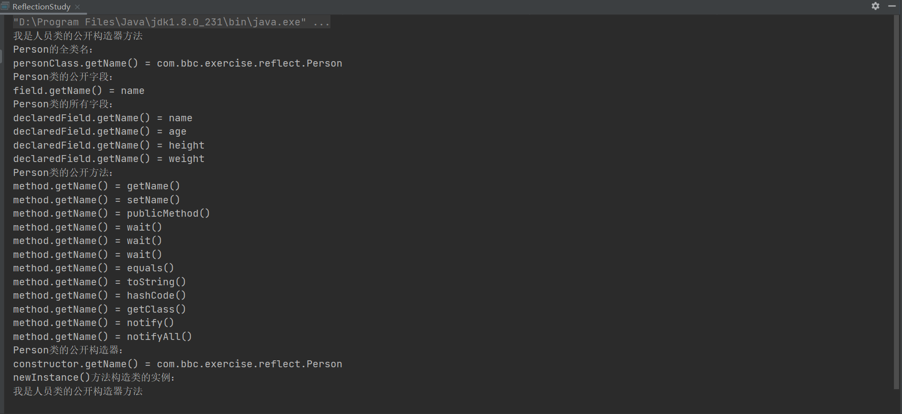
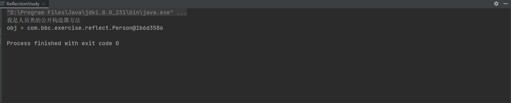
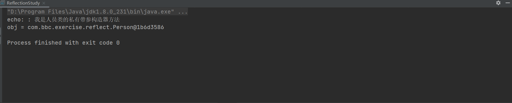
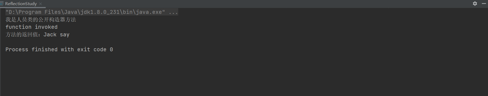
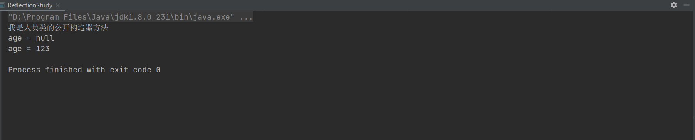

# Java的反射机制——类的镜子

[TOC]


# 一、反射机制的原理

- 什么是反射
- 反射机制的实现
- 获取类的Class对象的途径


## 1.1、什么是反射？

> 定义

在Java运行时环境中，对于任意一个类，能否知道这个类有哪些属性和方法？对于任意一个对象，能否调用它的任意一个方法？答案是肯定的。这种动态获取类的信息以及动态调用对象的方法的功能来自于Java 语言的反射（`Reflection`）机制。**反射（`Reflection`）是Java语言的特性之一，能够让Java程序在运行时动态地执行类的方法、构造方法等。**


可以说有了反射，不管什么类在我们面前都毫无隐私可言，什么`private`、`protected`、`default`修改符都好像失去了作用一样，在反射面前只能俯首称臣，任人宰割。

顺便一提，反射也是Java自省机制的核心。JavaBean具有的自省机制可以在不知道JavaBean都有哪些属性的情况下，设置它们的值，JavaBean的自省机制主要由Introspector实现，该接口中提供了关键的方法


Java的反射机制主要提供了以下功能

- 在运行时判断任意一个对象所属的类

- 在运行时构造任意一个类的对象

- 在运行时判断任意一个类所具有的成员变量和方法

- 在运行时调用任意一个对象的方法


**Reflection 也是Java被视为动态（或准动态）语言的一个关键性质。**<u>这个机制允许程序在运行时透过Reflection APIs取得任何一个已知名称的class的内部信息，包括其modifiers（诸如public, static 等等）、superclass（例如Object）、实现的interfaces（例如Serializable），也包括fields和methods的所有信息，并可于运行时改变fields内容或调用methods</u>


一般而言，开发者社群说到动态语言，大致认同的一个定义是：“程序运行时，允许改变程序结构或变量类型，这种语言称为动态语言”。从这个观点看，==Perl==、==Python==、==Ruby==是动态语言，而==C++==、==Java==、==C#==不是动态语言。这时候可能会有人打我，你上面不是说Java是动态语言（或准动态）吗？怎么这里的动态语言定义排除了，别着急，我话还没说完呢

尽管在这样的定义与分类下Java不算是动态语言，但是它却有着一个非常突出的动态相关机制：`Reflection`。这个单词的意思是“反射、映象或倒影”，用在Java身上指的是我们可以于运行时加载、探知、使用编译期间完全未知的classes。换句话说，Java程序可以加载一个运行时才得知名称的class，获悉其完整构造（但不包括methods定义），并生成其对象实体、或对其fields设值、或唤起其methods。这种“看透class”的能力（==the ability of the program to examine itself==）被称为`introspection`（内省、内观、反省）。


## 1.2、反射机制的实现

> Java Reflection API 简介

在JDK中，主要由以下类来实现Java的反射机制，这些类都位于java.lang.reflect包中

- Class类：代表一个类。

- Field 类：代表类的成员变量（成员变量也称为类的属性）。

- Method类：代表类的方法。

- Constructor 类：代表类的构造方法。

- Array类：提供了动态创建数组，以及访问数组的元素的静态方法


众所周知Java有个Object class，是所有Java classes的继承根源，其内声明了数个应该在所有Java class中被改写的methods：hashCode()、equals()、clone()、toString()、getClass()等。其中getClass()返回一个==Class object==。因此对于任意一个Java对象，都可以通过此方法获得对象的类型。Class类是Reflection API 中的核心类，它有以下方法

- getName()：获得类的完整名字。

- getFields()：获得类的public类型的属性。

- getDeclaredFields()：获得类的所有属性。

- getMethods()：获得类的public类型的方法。

- getDeclaredMethods()：获得类的所有方法。
- getMethod(String name, Class[] parameterTypes)：获得类的特定方法，name参数指定方法的名字，parameterTypes 参数指定方法的参数类型。4
- getConstructors()：获得类的public类型的构造方法。
- getConstructor(Class[] parameterTypes)：获得类的特定构造方法，parameterTypes 参数指定构造方法的参数类型。
- newInstance()：通过类的**不带参数**的构造方法创建这个类的一个对象。

```java
package com.bbc.exercise.reflect;


import java.lang.reflect.Constructor;
import java.lang.reflect.Field;
import java.lang.reflect.Method;

/**
 * @author wl
 * @version V1.0
 * @Description 学习Java中的反射
 * @date 2022/7/17 1:48
 */
public class ReflectionStudy {

    public static void main(String[] args) throws InstantiationException, IllegalAccessException {
        // 通过getClass()方法获取Person的类型
        Person person = new Person();
        Class<?> personClass = person.getClass();
        // 1.输出类名，这个类名一般是类的全路径，也就是包含包名在内的
        System.out.println("Person的全类名：");
        System.out.println("personClass.getName() = " + personClass.getName());
        // 2.获取类的公开字段名称
        System.out.println("Person类的公开字段：");
        Field[] fields = personClass.getFields();
        for (Field field : fields) {
            System.out.println("field.getName() = " + field.getName());
        }
        // 3.获取类的所有属性
        System.out.println("Person类的所有字段：");
        Field[] declaredFields = personClass.getDeclaredFields();
        for (Field declaredField : declaredFields) {
            System.out.println("declaredField.getName() = " + declaredField.getName());
        }
        // 4.获取类的所有公开的方法
        System.out.println("Person类的公开方法：");
        Method[] methods = personClass.getMethods();
        for (Method method : methods) {
            System.out.println("method.getName() = " + method.getName() + "()");
        }
        // 5.获取类的所有公开构造器
        System.out.println("Person类的公开构造器：");
        Constructor<?>[] constructors = personClass.getConstructors();
        for (Constructor<?> constructor : constructors) {
            System.out.println("constructor.getName() = " + constructor.getName());
        }
        // 6.通过newInstance()方法构造类的实例
        System.out.println("newInstance()方法构造类的实例：");
        Object instance = personClass.newInstance();
    }
}

/**
 * 人员类
 */
class Person {

    /**
     * 姓名
     */
    public String name;

    /**
     * 年龄
     */
    private Integer age;

    /**
     * 身高
     */
    private Double height;

    /**
     * 体重
     */
    private Double weight;

    public Person() {
        System.out.println("我是人员类的公开构造器方法");
    }

    private Person(String msg) {
        System.out.println(msg + ": 我是人员类的私有构造器方法");
    }

    public String getName() {
        return name;
    }

    public void setName(String name) {
        this.name = name;
    }

    public void publicMethod() {
        System.out.println("我是人员类的公开方法");
    }

    private void privateMethod() {
        System.out.println("我是人员类的私有方法");
    }
}
```

输出结果如下图




还可以通过默认构造方法创建一个新对象：

```java
Object objectCopy = classType.getConstructor(new Class[]{}).newInstance(new Object[]{});
```

以上代码先调用Class类的getConstructor()方法获得一个Constructor 对象，它代表默认的构造方法，然后调用Constructor对象的newInstance()方法构造一个实例


> Class lass

<u>Class class十分特殊。它和一般classes一样继承自Object，其实体用以表达Java程序运行时的classes和interfaces，也用来表达enum、array、primitive Java types（boolean, byte, char, short, int, long, float, double）以及关键词void。</u>

当一个class被加载，或当类加载器（ClassLoader）的defineClass()方法被JVM调用，JVM 便自动产生一个Class object。如果您想借由“修改Java标准库源码”来观察Class object的实际生成时机（例如在Class的constructor内添加一个println()），**不行**！因为Class并没有public constructor


Class是Reflection起源。针对任何您想探勘的class，唯有先为它产生一个Class object，接下来才能经由后者唤起为数十多个的Reflection APIs


> Notes：
>
> - 反射机制的底层是基于解析类的字节码文件来实现的，可以获取一个类内部的所有信息，包括私有或公开的属性/方法和构造器。
> - 反射机制的效率较低
> - 有人说，反射机制破坏了Java的封装特性，不应该存在，也有人说，很多框架的底层用的就是反射，比如Spring框架，不应该移除，而应当小心使用。我想说的是，工具没有好坏之分，重要的是在于使用的人


## 1.3、获取类的Class对象的途径

> 前言

除了上面提到的通过Object类的getClass()来获取类的Class对象（Class object）之外，Java还允许我们从其他途径为一个class生成对应的Class object


下面的表格展示了几种获取获取Class object的方式

|          Class object 获取方式           |                             示例                             |
| :--------------------------------------: | :----------------------------------------------------------: |
| Object的getClass()方法，每个类都有此方法 |   `String str = "Hello,world"; Class c1 = str.getClass();`   |
|       Class类的getSuperClass()方法       | `Button button = new Button; Class c1 = button.getClass(); Class c2 = getSuperclass();` |
|        Class类的静态方法forName()        |    `Class<?> aClass = Class.forName("java.lang.String");`    |
|              类的.class语法              |                 `String str = String.class;`                 |
|      基本数据类型的包装类的type语法      | `Class<Integer> type = Integer.TYPE; Class<Void> type = Void.TYPE;` |


> Notes：
>
> - 所有的类在类加载的过程中，都会在内存中==生成==一个代表这个类的java.lang.Class对象，作为方法区这个类的各种数据的访问入口。这个生成的Class对象其实就代表了这个类本身


## 1.4、运行时动态调用

- 运行时动态生成instances
- 运行时动态调用methods
- 运行时变更fields内容


### 1.4.1、运行时动态生成instances

前面的篇幅提到了通过反射获取类的Class对象的几个途径，接下就是实战了，我们应该如何通过反射来动态生成某个类的实例呢？


> 动态生成对象实例

如果我们想生成某个对象实体，在Reflection动态机制中有两种作法，一个针对“不带自变量（无参）的Constructor”，一个针对“带参数的Constructor”。

1. 不带自变量（无参）的Constructor

```java
package com.bbc.exercise.reflect;


/**
 * @author wl
 * @version V1.0
 * @Description 学习Java中的反射
 * @date 2022/7/17 1:48
 */
public class ReflectionStudy {

    public static void main(String[] args) throws ClassNotFoundException,
            InstantiationException, IllegalAccessException {
        Class<?> aClass = Class.forName("com.bbc.exercise.reflect.Person");
        // 不带参数
        Object obj = aClass.newInstance();
        System.out.println("obj = " + obj);
    }
}

/**
 * 人员类
 */
class Person {

    /**
     * 姓名
     */
    public String name;

    /**
     * 年龄
     */
    private Integer age;

    /**
     * 身高
     */
    private Double height;

    /**
     * 体重
     */
    private Double weight;

    public Person() {
        System.out.println("我是人员类的公开构造器方法");
    }

    private Person(String msg) {
        System.out.println(msg + ": 我是人员类的私有构造器方法");
    }

    public String getName() {
        return name;
    }

    public void setName(String name) {
        this.name = name;
    }

    public void publicMethod() {
        System.out.println("我是人员类的公开方法");
    }

    private void privateMethod() {
        System.out.println("我是人员类的私有方法");
    }
}
```

输出结果如下图




2. 带参数的Constructor

如果想调用的是“带参数的Constructor“就比较麻烦些，不能调用Class的newInstance()，而是调用Constructor 的newInstance()。首先准备一个Class[]做为ctor的参数类型（本例指定为一个String），然后以此为自变量调用getConstructor()，获得一个专属Constructor。接下来再准备一个Object[] 做为Constructor实参值（本例指定"echo："），调用上述专属Constructor的newInstance()。

```java
package com.bbc.exercise.reflect;


import java.lang.reflect.Constructor;
import java.lang.reflect.InvocationTargetException;

/**
 * @author wl
 * @version V1.0
 * @Description 学习Java中的反射
 * @date 2022/7/17 1:48
 */
public class ReflectionStudy {

    public static void main(String[] args) throws ClassNotFoundException, NoSuchMethodException, InvocationTargetException, InstantiationException, IllegalAccessException {
        Class<?> aClass = Class.forName("com.bbc.exercise.reflect.Person");
        // 带构造器参数
        Class[] classes = {String.class};
        // 指定构造参数List，便可以获取特定的Constructor
        Constructor<?> constructor = aClass.getDeclaredConstructor(classes);
        // 这里不设置true可能会报IllegalAccessException
        constructor.setAccessible(true);
        // 设置构造参数的值
        Object[] params = {"echo："};
        Object obj = constructor.newInstance(params);
        System.out.println("obj = " + obj);
    }
}

/**
 * 人员类
 */
class Person {

    /**
     * 姓名
     */
    public String name;

    /**
     * 年龄
     */
    private Integer age;

    /**
     * 身高
     */
    private Double height;

    /**
     * 体重
     */
    private Double weight;

    public Person() {
        System.out.println("我是人员类的公开构造器方法");
    }

    private Person(String msg) {
        System.out.println(msg + "我是人员类的私有带参构造器方法");
    }

    public String getName() {
        return name;
    }

    public void setName(String name) {
        this.name = name;
    }

    public void publicMethod() {
        System.out.println("我是人员类的公开方法");
    }

    private void privateMethod() {
        System.out.println("我是人员类的私有方法");
    }
}
```

输出结果如下图




### 1.4.2、运行时动态调用methods

> 前言

这个动作和上述调用“带参数的Constructor”相当类似。首先准备一个Class[]做为参数类型（本例指定其中一个是String，另一个是Map），然后以此为自变量调用getMethod()，获得特定的Method object。接下来准备一个Object[]放置自变量，然后调用上述所得之特定Method object的invoke()。为什么获得Method object时不需指定回返类型？


因为method overloading机制要求signature必须唯一，而回返类型并非signature的一个成份。换句话说，只要指定了method名称和参数列，就一定指出了一个独一无二的method。

```java
package com.bbc.exercise.reflect;


import java.lang.reflect.InvocationTargetException;
import java.lang.reflect.Method;
import java.util.HashMap;
import java.util.Map;

/**
 * @author wl
 * @version V1.0
 * @Description 学习Java中的反射
 * @date 2022/7/17 1:48
 */
public class ReflectionStudy {

    public static void main(String[] args) throws ClassNotFoundException, NoSuchMethodException, InvocationTargetException, InstantiationException, IllegalAccessException {
        Class<?> aClass = Class.forName("com.bbc.exercise.reflect.Person");
        // 指定调用的方法参数类型
        Class[] classes = new Class[2];
        classes[0] = Class.forName("java.lang.String");
        classes[1] = Class.forName("java.util.Map");
        Method function = aClass.getMethod("function", classes);
        Person person = new Person();
        // 指定调用方法的参数值
        Object[] params = new Object[2];
        params[0] = "Jack say";
        params[1] = new HashMap<String, Object>(2);
        // 调用方法
        Object invoke = function.invoke(person, params);
        String msg = invoke.toString();
        System.out.println("方法的返回值：" + msg);
    }
}

/**
 * 人员类
 */
class Person {

    /**
     * 姓名
     */
    public String name;

    /**
     * 年龄
     */
    private Integer age;

    /**
     * 身高
     */
    private Double height;

    /**
     * 体重
     */
    private Double weight;

    public Person() {
        System.out.println("我是人员类的公开构造器方法");
    }

    private Person(String msg) {
        System.out.println(msg + "我是人员类的私有带参构造器方法");
    }

    public String getName() {
        return name;
    }

    public void setName(String name) {
        this.name = name;
    }

    public void publicMethod() {
        System.out.println("我是人员类的公开方法");
    }

    private void privateMethod() {
        System.out.println("我是人员类的私有方法");
    }

    public String function(String str, Map<String, Object> map) {
        System.out.println("function invoked");
        return str;
    }
}
```

输出结果如下图




### 1.4.3、运行时变更fields内容

与先前两个动作相比，“变更field内容”轻松多了，因为它不需要参数和自变量。首先调用Class的getField()并指定field名称。获得特定的Field object之后便可直接调用Field的get()和set()

```java
package com.bbc.exercise.reflect;


import java.lang.reflect.Field;
import java.util.Map;

/**
 * @author wl
 * @version V1.0
 * @Description 学习Java中的反射
 * @date 2022/7/17 1:48
 */
public class ReflectionStudy {

    public static void main(String[] args) throws ClassNotFoundException, NoSuchFieldException, IllegalAccessException {
        Class<?> aClass = Class.forName("com.bbc.exercise.reflect.Person");
        // 获取指定的字段
        Field age = aClass.getDeclaredField("age");
        // 不设置可能会报IllegalAccessException
        age.setAccessible(true);
        Person person = new Person();
        System.out.println("age = " + age.get(person));
        age.set(person, 123);
        // 设置person的age字段的值
        System.out.println("age = " + age.get(person));
    }
}

/**
 * 人员类
 */
class Person {

    /**
     * 姓名
     */
    public String name;

    /**
     * 年龄
     */
    private Integer age;

    /**
     * 身高
     */
    private Double height;

    /**
     * 体重
     */
    private Double weight;

    public Person() {
        System.out.println("我是人员类的公开构造器方法");
    }

    private Person(String msg) {
        System.out.println(msg + "我是人员类的私有带参构造器方法");
    }

    public String getName() {
        return name;
    }

    public void setName(String name) {
        this.name = name;
    }

    private void setAge(Integer age) {
        this.age = age;
    }

    private Integer getAge() {
        return age;
    }

    public void publicMethod() {
        System.out.println("我是人员类的公开方法");
    }

    private void privateMethod() {
        System.out.println("我是人员类的私有方法");
    }

    public String function(String str, Map<String, Object> map) {
        System.out.println("function invoked");
        return str;
    }
}
```

输出结果如下图




# 二、反射机制的应用

- Spring的AOP


## 2.1、Spring的AOP

众所周知，AOP的实现有两种方法，一种是静态代理（代码里面写死），另一种是动态代理，后者比前者应用的多，而JDK动态代理其实底层就沿用到了Java的反射机制


> 动态代理

主要有两种：JDK动态代理和CGlib（Code Generation Library：代码生成库），如果目标类为接口，使用JDKProxy来实现，否则使用CGlib。

- JDK动态代理主要通过Java语言内部的反射机制来实现的，它的核心是InvacationHandler接口和Proxy类，在生成类的过程中比较高效

- CGlib主要以继承的方式动态生成目标类的代理，借助ASM实现，生成类之后执行类的过程中比较高效（可以通过将ASM生成的类进行缓存，解决ASM生成类低效的问题）


> Spring里的代理模式实现

在代理模式下， 接口 + 实现类 + 代理类 = AOP，实现类和代理类都需要实现接口，在运行时代理类会替换掉实现类的实现以此达到AOP的实现。

- 真实实现类的逻辑包含在了getBean()方法里

- getBean()返回的实际上是Proxy的实例
- Proxy实例是Spring采用JDK Proxy 或 CGlib动态生成的


> Notes：
>
> - ASM是对Java的字节码进行操纵的一个优秀的框架。它能被用来动态生成类或者增强既有类的功能。ASM 可以直接产生二进制 class 文件，也可以在类被加载入 Java 虚拟机之前动态改变类行为。
> - Java的类信息被存储在严格格式定义的字节码文件中，这些类文件拥有足够的元数据来解析类中的所有元素：类名称、方法、属性以及 Java 字节码（指令）。ASM从类文件中读入信息后，能够改变类行为，分析类信息，甚至能够根据用户要求生成新类。ASM字节码增强技术主要是用来反射的时候提升性能的，如果单纯用JDK的反射调用，性能是非常低下的，而使用字节码增强技术后反射调用的时间已经基本可以与直接调用相当了
