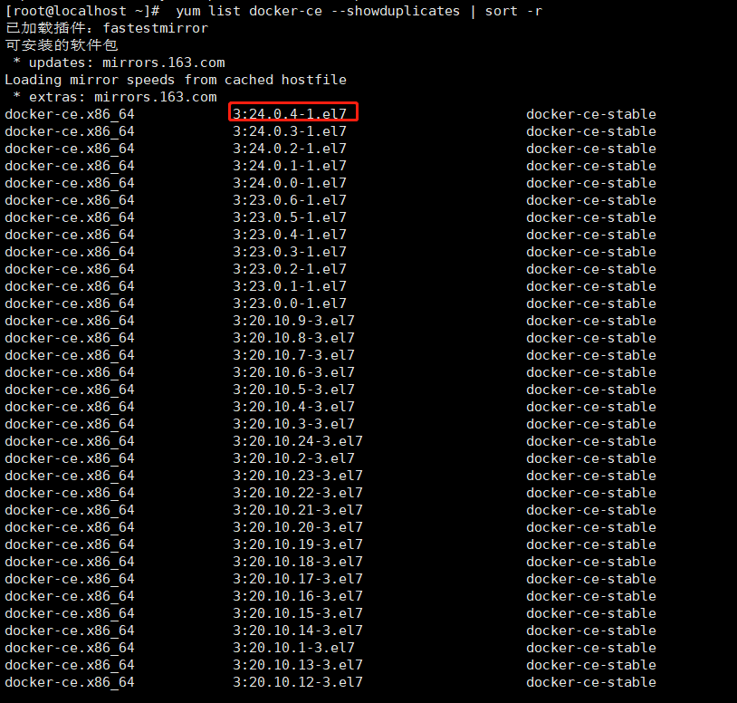

>前言

[Jenkins](https://www.jenkins.io/)，原名 Hudson，2011 年改为现在的名字。它是一个开源的实现持续集成的软件工具。

人生苦短，快用Jenkins！持续集成/持续部署已经成为企业级开发的刚需，使用Jenkins，我们只需每天提交代码到Git服务器，定时任务启动后，即可通过Maven自动构建同时运行测试用例，构建完成后再自动提交到测试服务器自动运行。
&nbsp;


&nbsp;
1. 基础运行环境快速安装部署
2. Jenkins传统/Blue Ocean UI使用
3. 一键Maven拉取Git代码完成构建jar包并提交到测试服务器自动运行
4. IDE提交代码后自动构建并发布任务
5. 定时构建发布任务
6. 邮件通知任务执行结果
7. Jenkins构建项目自动化运行在Docker容器中
8. Jenkins Pipeline脚本与Jenkinsfile使用
9. Jenkins多分支项目

&nbsp;

# 一、安装部署
- Jenkins在开发环境中所属位置
- Jenkins + Maven + Git 持续集成基础使用
- 安装硬件环境和知识储备
- GitLab介绍及安装准备

&nbsp;

## 1.1、Jenkins在开发环境中所属位置
>所属位置


&nbsp;
## 1.2、Jenkins + Maven + Git 持续集成基础使用
>Jenkins服务器

登录Jenkins服务器

&nbsp;

## 1.3、安装硬件环境和知识储备

> 硬件环境

|     服务器     |  开发环境  | 最低内存 |            作用            |
| :------------: | :--------: | :------: | :------------------------: |
| Jenkins-GitLab |    SSH     |    6G    |     代码托管/合并/冲突     |
| Jenkins-Server | Maven、JDK |    1G    | 自动化/拉取/集成/构建/测试 |
|   TestServer   |    JDK     |    1G    |         测试服务器         |

&nbsp;

> 知识储备

需要有一定的基础项目开发经验(有过工作经验)、会写Shell脚本，对Shell命令比较熟练。

&nbsp;

## 1.4、GitLab介绍及安装准备

使用VMware系统虚拟机软件安装**CentOS 7系统**(至少CentOS 7 及以上，6版本太老了)，**内存分配至少5.3G**左右，然后选择**最小安装**即可


克隆当前创建的虚拟机，将其作为Gitlab的服务器，并创建一个新的文件夹专门放置Jenkins的服务器


### 1.4.1、在ssh下安装

官方安装文档：https://gitlab.cn/install/?version=ce

> 安装前准备

1. 使用 `free -m` 查看虚拟机的内存情况，确认虚拟机的空闲内存足够

```shell
[root@localhost ~]# free -m
              total        used        free      shared  buff/cache   available
Mem:           5056         316        4591          11         149        4536
Swap:          2047           0        2047
```

2. 确认虚拟机可以联网，输入 `ping 163.com`，如果网络正常，那么

```shell
PING 163.com (123.58.180.8) 56(84) bytes of data.
64 bytes from 123.58.180.8 (123.58.180.8): icmp_seq=1 ttl=128 time= 1001ms
64 bytes from 123.58.180.8 (123.58.180.8): icmp_seq=1 ttl=128 time= 1001ms
... ...
```

如果不行的话，那就重新安装

&nbsp;

#### 1.4.1.1、安装依赖

> 如果使用root用户登录，那么就不需要加上 sudo 前缀

依次执行以下命令，以安装依赖

```
sudo yum install -y curl policycoreutils-python openssh-server perl	// 安装必要的Python依赖
sudo systemctl enable sshd	// 启用SSHD
sudo systemctl start sshd	// 启动SSHD
```


&nbsp;

#### 1.4.1.2、配置镜像

下载Shell脚本，并执行

```
curl -fsSL https://packages.gitlab.cn/repository/raw/scripts/setup.sh | /bin/bash
```


&nbsp;

#### 1.4.1.3、开始安装

> 设置Gitlab访问地址，以服务器IP为准

```shell
sudo EXTERNAL_URL="http://192.168.37.128" yum install -y gitlab-jh
// 新版本的gitlab命令执行带 -jh 的后缀，表示极狐
```

这个下载可能会比较耗时，请耐心等候


除非您在安装过程中指定了自定义密码，否则将随机生成一个密码并存储在 `/etc/gitlab/initial_root_password` 文件中(出于安全原因，24 小时后，此文件会被第一次 `gitlab-ctl reconfigure` 自动删除，因此若使用随机密码登录，建议安装成功初始登录成功之后，立即修改初始密码）。使用此密码和用户名 `root` 登录。


&nbsp;

> Gitlab常用命令

```shell
gitlab-ctl start                  # 启动所有 gitlab 组件；
gitlab-ctl stop                   # 停止所有 gitlab 组件；
gitlab-ctl restart                # 重启所有 gitlab 组件；
gitlab-ctl status                 # 查看服务状态；
gitlab-ctl reconfigure            # 启动服务；
vi /etc/gitlab/gitlab.rb          # 修改默认的配置文件；
gitlab-ctl tail                   # 查看日志；
```

安装完成后，可以尝试启动一下Gitlab

```shell
[root@localhost ~]# gitlab-ctl start
ok: run: alertmanager: (pid 18016) 231s
ok: run: gitaly: (pid 17942) 235s
ok: run: gitlab-exporter: (pid 17969) 233s
ok: run: gitlab-kas: (pid 17948) 234s
ok: run: gitlab-workhorse: (pid 17955) 234s
ok: run: logrotate: (pid 17048) 520s
ok: run: nginx: (pid 17554) 395s
ok: run: node-exporter: (pid 17965) 234s
ok: run: postgres-exporter: (pid 18023) 230s
ok: run: postgresql: (pid 17212) 496s
ok: run: prometheus: (pid 18002) 232s
ok: run: puma: (pid 17436) 414s
ok: run: redis: (pid 17090) 514s
ok: run: redis-exporter: (pid 17971) 233s
ok: run: sidekiq: (pid 17464) 408s
```

启动之后，浏览器输入 http://192.168.44.103 访问Github：注意，有可能访问会显示502，可能是因为防火墙没关，关了防火墙就行：[在vmware安装gitlab,启动gitlab后，在本地浏览器访问服务器之后显示无法访问此网站_gitlab启动了访问不了](https://blog.csdn.net/qq_40875146/article/details/126939287)


登录之后，记得尽快修改密码，当前密码：A5RAxUwlgQFzGjKHBgGSQ7Ar5sklIOe5v7hCk+lahSg=、sqkj@2022


> 访问

[项目 · 极狐GitLab](http://192.168.37.128/)

&nbsp;

### 1.4.2、在docker下安装

官方安装文档：https://docs.gitlab.cn/jh/install/docker.html

>安装前准备

和在ssh下安装一样，需要保证虚拟机的内存(6208MB)充足，网络正常才可安装

&nbsp;

> 安装所需最小配置

- 内存至少4G
- 系统内核至少在3.10以上 `uname -r` 命令可查看系统内核版本

```shel
[root@localhost ~]# uname -r
3.10.0-1160.el7.x86_64
```

&nbsp;

#### 1.4.2.1、安装docker

1. 更新yum源

   ```shell
   yum update
   ```

   

   这个执行过程耗时略长，期间可以先去做一些其他的事情

   &nbsp;

2. 安装依赖

   ```shell
   yum install -y yum-utils device-mapper-persistent-data lvm2
   ```

   &nbsp;

3. 添加镜像

   ```shell
   //国外镜像源
   yum-config-manager --add-repo https://download.docker.com/linux/centos/docker-ce.repo
   //阿里镜像地址
   https://mirrors.aliyun.com/docker-ce/linux/centos/gpg
   //阿里镜像源
   yum-config-manager --add-repo http://mirrors.aliyun.com/docker-ce/linux/centos/docker-ce.repo
   ```

   如果跳过安装依赖直接添加镜像，可能会提示找不到命令

   &nbsp;

4. 查看源中可使用版本

   ```shell
    yum list docker-ce --showduplicates | sort -r
   ```

   

   如果没有什么问题的话，安装最新版本即可

   ```shell
   yum install docker-ce-24.0.4-1.el7
   ```

   

   有可能检索密钥时会提示，那么就需要换一个yum源了

   ```shell
   来自 https://mirrors.aliyun.com/docker-ce/linux/centos/gpg 的无效 GPG 密钥：No key found in given key data
   ```

   &nbsp;

5. 安装指定版本

   ````shell
   yum install docker
   ````

   &nbsp;

6. 配置开机启动项

   ```shell
   systemctl start docker // 配置开机启动docker
   systemctl enable docker // 启用docker,此时会提示：“Created symlink from /etc/systemd/system/multi-user.target.wants/docker.service to /usr/lib/systemd/system/docker.service.” 这是正常的
   docker version
   ```

   &nbsp;

#### 1.4.2.2、使用容器安装gitlab

1. 添加容器// 更换IP地址

   ```shell
   docker run --detach \
     --hostname 192.168.37.129 \
     --publish 443:443 --publish 80:80 \
     --name gitlab \
     --restart always \
     --volume $GITLAB_HOME/config:/etc/gitlab:Z \
     --volume $GITLAB_HOME/logs:/var/log/gitlab:Z \
     --volume $GITLAB_HOME/data:/var/opt/gitlab:Z \
     --shm-size 256m \
     registry.gitlab.cn/omnibus/gitlab-jh:latest
   ```

   如果docker启动容器报错：docker: invalid reference format.

   **检查一下下面这三点原因：**

   ````text
   1.‘-‘写成’-’ :记住一定时英文短横线
   2：\ 与前面内容缺少空格
   3： \后面多敲了tab建 或者空格
   ````

   也有可能会有端口冲突，提示：

   ```shell
   docker: Error response from daemon: driver failed programming external connectivity on endpoint gitlab (29314587e191c132750f329734b0491673ae65f14893531825dd3ea340dc77f5): Error staring userland proxy: listen tcp 0.0.0.0:80: bind address already in use.
   ```

   此时停止nginx即可：

   ```shell
   systemctl stop nginx
   ```

   &nbsp;

2. 启动容器

   使用 `docker ps -a` 查询容器使用情况，可以看到有一个gitlab在运行中，然后我们再启动起来

   ```shell
   docker start gitlab
   ```

   &nbsp;

3. 查看已存在的容器：`docker ps -a`

   ```shell
   [root@localhost ~]# docker ps -a
   CONTAINER ID   IMAGE                                         COMMAND                   CREATED          STATUS                     PORTS                                                                              NAMES
   540c94726e9c   registry.gitlab.cn/omnibus/gitlab-jh:latest   "/assets/wrapper"         5 minutes ago    Up 5 minutes (unhealthy)   0.0.0.0:80->80/tcp, :::80->80/tcp, 22/tcp, 0.0.0.0:443->443/tcp, :::443->443/tcp   gitlab
   d18509004ec9   centos                                        "--detach --hostname…"   10 minutes ago   Created                                                                                                       eager_galileo
   ```

   &nbsp;

4. 进入容器：`docker exec -it  gitlab /bin/bash`

   ```shell
   [root@localhost ~]# docker exec -it gitlab /bin/bash
   root@192:/# root
   bash: root: command not found
   root@192:/# ls 
   RELEASE  assets  bin  boot  dev  etc  home  lib  lib32  lib64  libx32  linuxrc  media  mnt  opt  proc  root  run  sbin  srv  sys  tmp  usr  var
   ```

   &nbsp;

#### 1.4.2.3、访问

[Sign in · JiHu GitLab](http://192.168.37.129/users/sign_in)

> 当首次运行出现502错误的时候排查两个原因

1. 虚拟机内存至少需要4g
2. 稍微再等等刷新一下可能就好了

> 管理员账号登录

用户名：root

密码存在下面文件夹内，登录后需要改密码不然24小时后会失效，需要登录到容器内部才可查看

```shell
cat /etc/gitlab/initial_root_password
```

密码：K/JtkvjBOklyrklO2QA/sMj/UzqKQV15PDEkdDWJ+RU=、sqkj@2022

&nbsp;

### 1.4.3、创建项目

1. 创建空白项目

   

2. 使用SSH或HTTP克隆**拉取代码**

   

3. 使用IDEA关联远程仓库

   

## 1.6、Jenkins服务器和测试服务器

1. Jenkins安装
2. Maven安装
3. 测试服务器安装

&nbsp;

### 1.6.1、Jenkins安装

官方文档介绍非常详细


https://www.jenkins.io

安装需求

```text
机器要求：

256 MB 内存，建议大于 512 MB

10 GB 的硬盘空间（用于 Jenkins 和 Docker 镜像）

需要安装以下软件：

Java 8 ( JRE 或者 JDK 都可以)

Docker （导航到网站顶部的Get Docker链接以访问适合您平台的Docker下载）
```


下载[官网](https://www.jenkins.io/zh/download/)左边的，选择`.war`。（克隆一台新的服务器用于安装Jenkins）

&nbsp;

> 安装JDK

1 检索可用包

```
yum search java|grep jdk
```


2 安装

```
yum install java-1.8.0-openjdk
```


首次启动war包会在`/root/.jenkins`生成配置文件


待完全启动成功后 访问服务器8080端口完成配置

初始化后的密码：

```
Jenkins initial setup is required. An admin user has been created and a password generated.
Please use the following password to proceed to installation:

4e67bbe261da476abdc63c5b51311646

This may also be found at: /root/.jenkins/secrets/initialAdminPassword


```

密码文件使用后会自动删除
