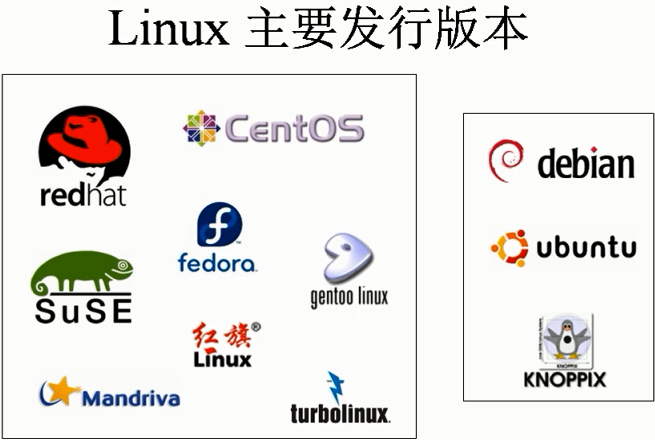
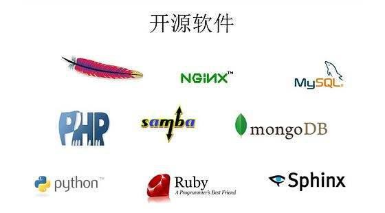

# Linux系统

[TOC]

# 一、Linux简介

- Linux发展史
- Linux版本
- 开源软件简介
- Linux应用领域
- Linux与Windows的不同
- 字符界面的优势

## 1.1、Linux发展史

> 简介

Minix是一种基于[微内核](https://baike.baidu.com/item/微内核/3856137)架构的类[UNIX](https://baike.baidu.com/item/UNIX/219943)计算机操作系统，于1987年由Andrew S. Tanenbaum教授发布，它启发了[Linux](https://baike.baidu.com/item/Linux/27050)。

20世纪80年代，由于AT&T所有的[UNIX](https://baike.baidu.com/item/UNIX/219943)版权的限制，荷兰的Andrew S.  Tanenbaum教授决定写一个不包含任何AT&T源代码的UNIX系统，名为MINIX（即小型的UNIX），并开0放全部源代码给大学教学和研究工作，Minix于2000年重新改为BSD授权，成为自由和开放源码软件，为全球注册商标。

[Linus Torvalds](https://baike.baidu.com/item/Linus Torvalds/9336769)虽然深受Minix的启发写出了第一版本的Linux内核，但这种启发更多的是精神上的，Linux的设计与MInix的微内核设计理念截然相反，采用了与UNIX相似的[宏内核](https://baike.baidu.com/item/宏内核/5508148)[架构](https://baike.baidu.com/item/架构/13004195)。

**林纳斯·本纳第克特·托瓦兹**（Linus Benedict Torvalds，1969年12月28日- ），芬兰赫尔辛基人，著名的电脑程序员，[Linux内核](https://baike.baidu.com/item/Linux内核/10142820)的发明人及该计划的合作者 [1] ，毕业于[赫尔辛基大学](https://baike.baidu.com/item/赫尔辛基大学)计算机系，1997年至2003年在美国加州[硅谷](https://baike.baidu.com/item/硅谷/139194)任职于[全美达](https://baike.baidu.com/item/全美达/3550641)公司（Transmeta Corporation），现受聘于开放源代码开发实验室（OSDL：Open Source Development Labs, Inc），全力开发Linux内核。与妻子托芙（Tove，芬兰前女子[空手道](https://baike.baidu.com/item/空手道)冠军）育有三个女孩。著有自传《[乐者为王](https://baike.baidu.com/item/乐者为王/2567158)》。 

## 1.2、Linux版本

> 简介

Linux系统分为<u>内核版本</u>和<u>发行版本</u>

1. Linux内核版本

- 官网：<www.kernel.org>

- 说明：2.6.18

- 最新版本：3.16

2. Linux发行版

基于内核版本的二次开发版本

主要有以下几种发行版本

1、Red Hat；2、Ubuntu；3、CentOS；4、SuSE；5、Gentoo；6、Debian ；7、Fedora Core；8、Mandriva；9、KNOPPIX；10、Linux Mint等等。

## 1.3、开源软件简介

> 开源软件

Linux系统的开源软件比起Windows系统其实不会差太多（Apache、Nginx、MySQL、PHP、Samba、MongoDB、Python、Ruby、Sphinx等等）。通过**Apache**我们可以将写好的网站发布到互联网上，除此之外，还有**Nginx**，占用服务器资源少，它比起Apache最大的好处是可以支持更高的并发访问文件。MySQL+PHP+Apache+Linux是常见网站开发的架构平台

开源软件的好处是

- 使用的自由：绝大多数开源软件免费
- 研究的自由：可以获得软件源代码
- 散步及改良的自由：可以自由传播、改良甚至销售

## 1.4、Linux应用领域

1.基于Linux的企业服务器

2.嵌入式应用

**Trying to find other sites using similar  technology or running on the same infrastructure? Netcraft has been  surveying the internet since 1995 and probably has the data you're  looking for.**            

https://www.netcraft.com/

> PS: 自己尝试解决、查看帮助文档、查看对应示例

## 1.5、Linux与Windows的不同

- Linux严格区分大小写
- Linux中所有内容以文件形式保存、包括硬件

- Linux不靠扩展名区分文件类型
  - 压缩包：“*.gz”、“*.bz2”、“*.tar.bz2”、“.tgz”等
  - 二进制软件包：“*.rpm”
  - 网页文件：“*.html”、“.php”
  - 脚本文件：“*.sh”
  - 配置文件：“*.conf”

- Windows下的程序不能直接在Linux中安装和运行

## 1.6、字符界面的优势

- 字符界面占用的系统资源更少
- 字符界面减少了出错、被攻击的可能性

# 二、Linux系统安装

- 虚拟机的安装

## 2.1、虚拟机的安装

> 简介

VMware是一个虚拟PC的软件，可以在现有的操作系统上虚拟出一个新的硬件环境，相当于模拟出一台新的PC，以此来实现在一台机器上真正同时运行两个独立的操作系统

VMware官方网站 <http://www.vmware.com/>

特点：

- 不需要分区或重新开机就能在同一台PC上使用两种以上的操作系统
- 本机系统可以与虚拟机系统网络通信
- 可以设定并且随时修改虚拟机操作系统的硬件环境