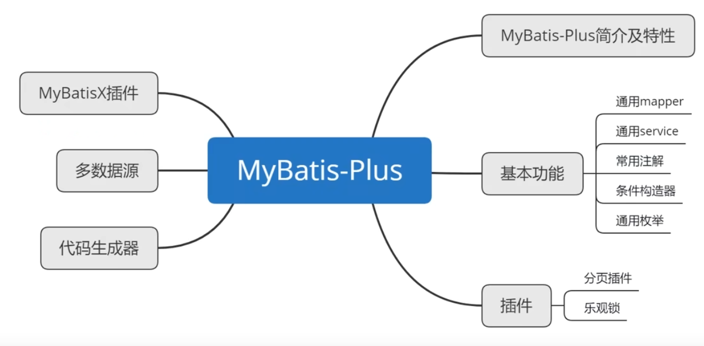
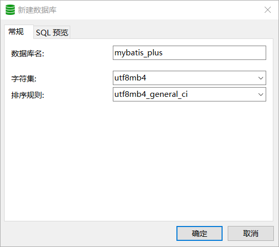
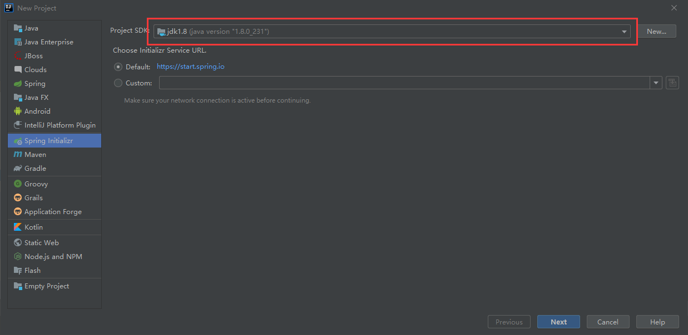
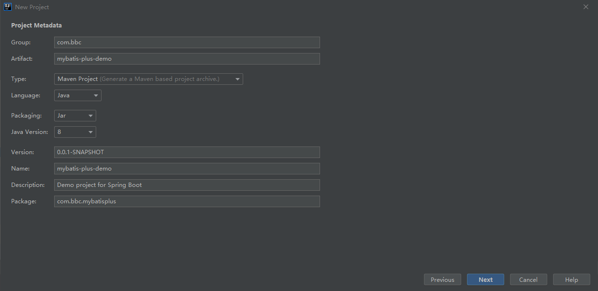
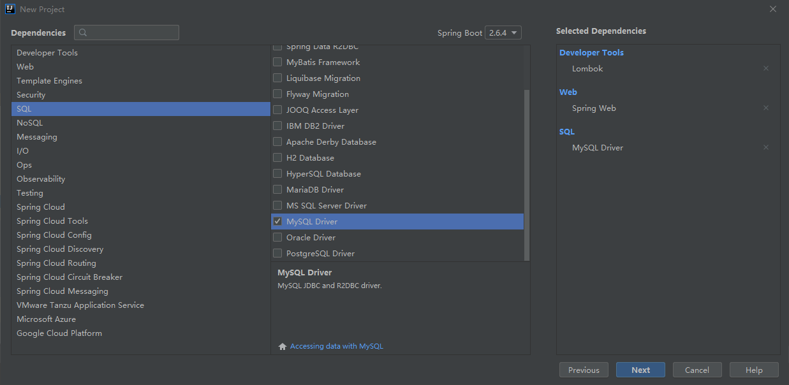
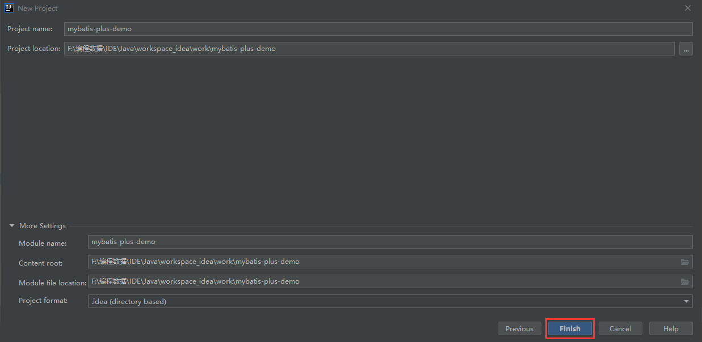
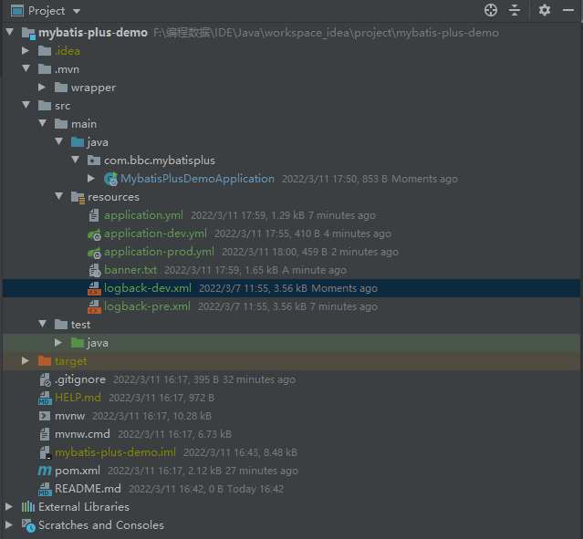

# MyBatis-Plus

> MyBatis-Plus 是一个Mybatis的==增强工具==，在Mybatis的基础上==只做增强不做改变==，为==简化开发、提高效率而生==。MyBatis-Plus提供了通用的mapper和service，可以在不编写任何SQL语句的情况下，快速地实现对单表的CRUD、批量、逻辑删除、分页等操作。本笔记从Mybatis-Plus的特性及使用，到MyBatis-Plus所提供的的优先的插件，以及多数据源的配置都有详细的讲解。并对IDEA中的快速开发插件MybatisX也进行了功能的演示。以MySQL数据库为案例，使用IDEA作为开发环境，Maven作为搭建工具，用SpringBoot为大家展示Mybatis-Plus的各个功能


# 一、MyBatis-Plus入门

- Mybatis-Plus简介及特性
- 代码及文档地址





## 1.1、MyBatis-Plus简介及特性

> 简介

[MyBatis-Plus](https://github.com/baomidou/mybatis-plus)[ ](https://github.com/baomidou/mybatis-plus)[ (opens new window)](https://github.com/baomidou/mybatis-plus)（简称 MP）是一个 [MyBatis](https://www.mybatis.org/mybatis-3/)[ ](https://www.mybatis.org/mybatis-3/)[ (opens new window)](https://www.mybatis.org/mybatis-3/) 的增强工具，在 MyBatis 的基础上只做增强不做改变，为简化开发、提高效率而生。


- 润物无声

只做增强不做改变，引入它不会对现有工程产生任何影响，如丝般润滑。

- 效率至上

只需简单配置，即可快速进行单表CRUD操作，从而节省大量时间

- 丰富功能

代码生成、自动分页、逻辑删除、自动填充等功能一应俱全


> 特性

- **无侵入**：只做增强不做改变，引入它不会对现有工程产生影响，如丝般顺滑
- **损耗小**：启动即会自动注入基本 CURD，性能基本无损耗，直接面向对象操作
- **强大的 CRUD 操作**：内置通用 Mapper、通用 Service，仅仅通过少量配置即可实现单表大部分 CRUD 操作，更有强大的条件构造器，满足各类使用需求
- **支持 Lambda 形式调用**：通过 Lambda 表达式，方便的编写各类查询条件，无需再担心字段写错
- **支持主键自动生成**：支持多达 4 种主键策略（内含分布式唯一 ID 生成器 - Sequence），可自由配置，完美解决主键问题
- **支持 ActiveRecord 模式**：支持 ActiveRecord 形式调用，实体类只需继承 Model 类即可进行强大的 CRUD 操作
- **支持自定义全局通用操作**：支持全局通用方法注入（ Write once, use anywhere ）
- **内置代码生成器**：采用代码或者 Maven 插件可快速生成 Mapper 、 Model 、 Service 、 Controller 层代码，支持模板引擎，更有超多自定义配置等您来使用
- **内置分页插件**：基于 MyBatis 物理分页，开发者无需关心具体操作，配置好插件之后，写分页等同于普通 List 查询
- **分页插件支持多种数据库**：支持 MySQL、MariaDB、Oracle、DB2、H2、HSQL、SQLite、Postgre、SQLServer 等多种数据库
- **内置性能分析插件**：可输出 SQL 语句以及其执行时间，建议开发测试时启用该功能，能快速揪出慢查询
- **内置全局拦截插件**：提供全表 delete 、 update 操作智能分析阻断，也可自定义拦截规则，预防误操作


> 框架结构


## 1.2、官方代码及文档地址

官方地址：<http://mp.baomidou.com>

> 代码发布地址

GitHub：<https://github.com/baomidou/mybatis-plus>

Gitee：<https://gitee.com/baomidou/mybatis-plus>

文档发布地址：<https://baomidou.com/pages/24112f>


# 二、MyBatis-Plus入门实例

- Java开发环境
- MySQL数据库准备
- 搭建SpringBoot项目


## 2.1、Java开发环境准备

|   开发工具   |          当前版本          |
| :----------: | :------------------------: |
|     IDEA     |          2019.3.3          |
|     JDK      |  1.8.0_321（11版本也可）   |
|    Maven     | 3.6.3（不能低于3.5.4版本） |
|    MySQL     |     8.0（5.7版本也可）     |
| Spring Boot  |           2.6.3            |
| MyBatis-Plus |           3.5.1            |


## 2.2、MySQL数据库准备

- 创建MySQL数据库表

- 当前表添加测试数据

  


### 2.2.1、创建MySQL数据库表

> 创建数据库并使用

```mysql
CREATE DATABASE `mybatis_plus` /*!40100 DEFAULT CHARACTER SET utf8mb4 */; 
use `mybatis_plus`;
```




> 创建用户表

```mysql
CREATE TABLE `t_user` ( 
    `id` bigint(20) NOT NULL COMMENT '主键id', 
    `name` varchar(30) DEFAULT NULL COMMENT '姓名', 
    `age` int(11) DEFAULT NULL COMMENT '年龄', 
    `email` varchar(50) DEFAULT NULL COMMENT '邮箱',
    PRIMARY KEY (`id`) 
) ENGINE=InnoDB DEFAULT CHARSET=utf8mb4;
```

[^注]: 设定引擎为InnoDB，默认字符集为utf8mb4，设置id为主键


### 2.2.2、当前表添加测试数据

> 使用命令行或者图形界面添加用户数据即可

```mysql
INSERT INTO t_user (id, name, age, email) VALUES
(1, 'Jone', 18, 'test1@baomidou.com'), 
(2, 'Jack', 20, 'test2@baomidou.com'), 
(3, 'Tom', 28, 'test3@baomidou.com'), 
(4, 'Sandy', 21, 'test4@baomidou.com'), 
(5, 'Billie', 24, 'test5@baomidou.com');
```


## 2.3、搭建SpringBoot项目

- 初始化SpringBoot工程
- 配置数据库等配置信息


### 2.3.1、初始化SpringBoot工程

> 使用 Spring Initializr 快速初始化一个 Spring Boot 工程

1. 确定创建的工程类型：如SpringBoot



2. 编辑项目所需的元数据：如Java版本（JDK8、JDK11）、打包类型（jar、war）、包路径（类路径）、项目类型（Maven、Gradle）等



3. 设置Maven依赖：web环境依赖、MySQL连接器依赖等



4. 最后点击finish就完成了工程的创建



> 需要添加的依赖

```xml
 		  <dependency>
            <groupId>org.springframework.boot</groupId>
            <artifactId>spring-boot-starter-web</artifactId>
        </dependency>
        <!-- 引入mybatis-plus依赖 -->
        <dependency>
            <groupId>com.baomidou</groupId>
            <artifactId>mybatis-plus-boot-starter</artifactId>
            <version>3.5.1</version>
        </dependency>
        <!-- 引入MySQL连接器 -->
        <dependency>
            <groupId>mysql</groupId>
            <artifactId>mysql-connector-java</artifactId>
            <scope>runtime</scope>
        </dependency>
        <!-- 引入Lombok -->
        <dependency>
            <groupId>org.projectlombok</groupId>
            <artifactId>lombok</artifactId>
            <optional>true</optional>
        </dependency>
        <dependency>
            <groupId>org.springframework.boot</groupId>
            <artifactId>spring-boot-starter-test</artifactId>
            <scope>test</scope>
        </dependency>
```


### 2.3.2、配置数据库等配置信息

> 撰写yml配置文件，配置数据原信息和连接数据库信息

```yml
# 项目相关配置
mybatis-plus-demo:
  # 名称
  name: mybatis-plus-demo
  # 版本
  version: 3.8.1
  # 版权年份
  copyrightYear: 2022
  # 实例演示开关
  demoEnabled: true
  # 获取ip地址开关
  addressEnabled: false
  # 验证码类型 math 数组计算 char 字符验证
  captchaType: math

# Spring配置
spring:
  # 资源信息
  messages:
    # 国际化资源文件路径
    basename: i18n/messages
  profiles:
    active: dev
  # 文件上传
  servlet:
    multipart:
      # 单个文件大小
      max-file-size:  10MB
      # 设置总上传的文件大小
      max-request-size:  20MB
  # 服务模块
  devtools:
    restart:
      # 热部署开关
      enabled: false
# 开发环境配置
server:
  # 服务器的HTTP端口，默认为8181
  port: 8181
#  servlet:
#    # 应用的访问路径
#    context-path: /plus-api
  tomcat:
    # tomcat的URI编码
    uri-encoding: UTF-8
    # 连接数满后的排队数，默认为100
    accept-count: 1000
    threads:
      # tomcat最大线程数，默认为200
      max: 800
      # Tomcat启动初始化的线程数，默认值10
      min-spare: 100

# 日志配置
logging:
  level:
    com.sq.mybatisplus: debug
    org.springframework: warn

# mybatis-plus配置
mybatis-plus:
  configuration:
    map-underscore-to-camel-case: true
    auto-mapping-behavior: full
    log-impl: org.apache.ibatis.logging.stdout.StdOutImpl
  mapper-locations: classpath*:mapper/**/*Mapper.xml
  global-config:
    # 逻辑删除配置
    db-config:
      # 删除前
      logic-not-delete-value: 1
      # 删除后
      logic-delete-value: 0
```

> 增加logback配置文件和yml多环境配置



- banner.txt

```txt
Application Version: ${mybatis-plus-demo.version}
Spring Boot Version: ${spring-boot.version}
////////////////////////////////////////////////////////////////////
//                          _ooOoo_                               //
//                         o8888888o                              //
//                         88" . "88                              //
//                         (| ^_^ |)                              //
//                         O\  =  /O                              //
//                      ____/`---'\____                           //
//                    .'  \\|     |//  `.                         //
//                   /  \\|||  :  |||//  \                        //
//                  /  _||||| -:- |||||-  \                       //
//                  |   | \\\  -  /// |   |                       //
//                  | \_|  ''\---/''  |   |                       //
//                  \  .-\__  `-`  ___/-. /                       //
//                ___`. .'  /--.--\  `. . ___                     //
//              ."" '<  `.___\_<|>_/___.'  >'"".                  //
//            | | :  `- \`.;`\ _ /`;.`/ - ` : | |                 //
//            \  \ `-.   \_ __\ /__ _/   .-` /  /                 //
//      ========`-.____`-.___\_____/___.-`____.-'========         //
//                           `=---='                              //
//      ^^^^^^^^^^^^^^^^^^^^^^^^^^^^^^^^^^^^^^^^^^^^^^^^^^        //
//             佛祖保佑       永不宕机      永无BUG                 //
////////////////////////////////////////////////////////////////////
```

- application-dev.yml

```yml
spring:
  # 配置数据源信息
  datasource:
#    # 配置数据源类型
#    type: com.zaxxer.hikari.HikariDataSource
    # 配置连接数据库信息
    driver-class-name: com.mysql.cj.jdbc.Driver
    url: jdbc:mysql://localhost:3306/mybatis_plus?useUnicode=true&characterEncoding=utf8&zeroDateTimeBehavior=convertToNull&useSSL=true&serverTimezone=GMT%2B8
    username: root
    password: root
```

- application-prod.yml

```yml
spring:
  # 配置数据源信息
  datasource:
    #    # 配置数据源类型
    #    type: com.zaxxer.hikari.HikariDataSource
    # 配置连接数据库信息
    driver-class-name: com.mysql.cj.jdbc.Driver
    url: jdbc:mysql://rm-uf6g96fq74wt7j8vj1o.mysql.rds.aliyuncs.com:3306/mybatis_plus?useUnicode=true&characterEncoding=utf8&zeroDateTimeBehavior=convertToNull&useSSL=true&serverTimezone=GMT%2B8
    username: root
    password: ******
```

- logback-dev.xml

```xml
<?xml version="1.0" encoding="UTF-8"?>
<configuration>
    <!-- 日志存放路径 -->
	<property name="log.path" value="logs" />
    <!-- 日志输出格式 -->
	<property name="log.pattern" value="%d{HH:mm:ss.SSS} [%thread] %-5level %logger{20} - [%method,%line] - %msg%n" />

	<!-- 控制台输出 -->
	<appender name="console" class="ch.qos.logback.core.ConsoleAppender">
		<encoder>
			<pattern>${log.pattern}</pattern>
		</encoder>
	</appender>
	
	<!-- 系统日志输出 -->
	<appender name="file_info" class="ch.qos.logback.core.rolling.RollingFileAppender">
	    <file>${log.path}/sys-info.log</file>
        <!-- 循环政策：基于时间创建日志文件 -->
		<rollingPolicy class="ch.qos.logback.core.rolling.TimeBasedRollingPolicy">
            <!-- 日志文件名格式 -->
			<fileNamePattern>${log.path}/sys-info.%d{yyyy-MM-dd}.log</fileNamePattern>
			<!-- 日志最大的历史 60天 -->
			<maxHistory>60</maxHistory>
		</rollingPolicy>
		<encoder>
			<pattern>${log.pattern}</pattern>
		</encoder>
		<filter class="ch.qos.logback.classic.filter.LevelFilter">
            <!-- 过滤的级别 -->
            <level>INFO</level>
            <!-- 匹配时的操作：接收（记录） -->
            <onMatch>ACCEPT</onMatch>
            <!-- 不匹配时的操作：拒绝（不记录） -->
            <onMismatch>DENY</onMismatch>
        </filter>
	</appender>
	
	<appender name="file_error" class="ch.qos.logback.core.rolling.RollingFileAppender">
	    <file>${log.path}/sys-error.log</file>
        <!-- 循环政策：基于时间创建日志文件 -->
        <rollingPolicy class="ch.qos.logback.core.rolling.TimeBasedRollingPolicy">
            <!-- 日志文件名格式 -->
            <fileNamePattern>${log.path}/sys-error.%d{yyyy-MM-dd}.log</fileNamePattern>
			<!-- 日志最大的历史 60天 -->
			<maxHistory>60</maxHistory>
        </rollingPolicy>
        <encoder>
            <pattern>${log.pattern}</pattern>
        </encoder>
        <filter class="ch.qos.logback.classic.filter.LevelFilter">
            <!-- 过滤的级别 -->
            <level>ERROR</level>
			<!-- 匹配时的操作：接收（记录） -->
            <onMatch>ACCEPT</onMatch>
			<!-- 不匹配时的操作：拒绝（不记录） -->
            <onMismatch>DENY</onMismatch>
        </filter>
    </appender>
	
	<!-- 用户访问日志输出  -->
    <appender name="sys-user" class="ch.qos.logback.core.rolling.RollingFileAppender">
		<file>${log.path}/sys-user.log</file>
        <rollingPolicy class="ch.qos.logback.core.rolling.TimeBasedRollingPolicy">
            <!-- 按天回滚 daily -->
            <fileNamePattern>${log.path}/sys-user.%d{yyyy-MM-dd}.log</fileNamePattern>
            <!-- 日志最大的历史 60天 -->
            <maxHistory>60</maxHistory>
        </rollingPolicy>
        <encoder>
            <pattern>${log.pattern}</pattern>
        </encoder>
    </appender>
	
	<!-- 系统模块日志级别控制  -->
	<logger name="com.bbc.mybatisplus" level="info" />
	<!-- Spring日志级别控制  -->
	<logger name="org.springframework" level="warn" />

	<root level="info">
		<appender-ref ref="console" />
	</root>
	
	<!--系统操作日志-->
    <root level="info">
        <appender-ref ref="file_info" />
        <appender-ref ref="file_error" />
    </root>
	
	<!--系统用户操作日志-->
    <logger name="sys-user" level="info">
        <appender-ref ref="sys-user"/>
    </logger>
</configuration> 
```

- logback-pre.xml

```xml
<?xml version="1.0" encoding="UTF-8"?>
<configuration>
    <!-- 日志存放路径 -->
	<property name="log.path" value="logs" />
    <!-- 日志输出格式 -->
	<property name="log.pattern" value="%d{HH:mm:ss.SSS} [%thread] %-5level %logger{20} - [%method,%line] - %msg%n" />

	<!-- 控制台输出 -->
	<appender name="console" class="ch.qos.logback.core.ConsoleAppender">
		<encoder>
			<pattern>${log.pattern}</pattern>
		</encoder>
	</appender>
	
	<!-- 系统日志输出 -->
	<appender name="file_info" class="ch.qos.logback.core.rolling.RollingFileAppender">
	    <file>${log.path}/sys-info.log</file>
        <!-- 循环政策：基于时间创建日志文件 -->
		<rollingPolicy class="ch.qos.logback.core.rolling.TimeBasedRollingPolicy">
            <!-- 日志文件名格式 -->
			<fileNamePattern>${log.path}/sys-info.%d{yyyy-MM-dd}.log</fileNamePattern>
			<!-- 日志最大的历史 60天 -->
			<maxHistory>60</maxHistory>
		</rollingPolicy>
		<encoder>
			<pattern>${log.pattern}</pattern>
		</encoder>
		<filter class="ch.qos.logback.classic.filter.LevelFilter">
            <!-- 过滤的级别 -->
            <level>INFO</level>
            <!-- 匹配时的操作：接收（记录） -->
            <onMatch>ACCEPT</onMatch>
            <!-- 不匹配时的操作：拒绝（不记录） -->
            <onMismatch>DENY</onMismatch>
        </filter>
	</appender>
	
	<appender name="file_error" class="ch.qos.logback.core.rolling.RollingFileAppender">
	    <file>${log.path}/sys-error.log</file>
        <!-- 循环政策：基于时间创建日志文件 -->
        <rollingPolicy class="ch.qos.logback.core.rolling.TimeBasedRollingPolicy">
            <!-- 日志文件名格式 -->
            <fileNamePattern>${log.path}/sys-error.%d{yyyy-MM-dd}.log</fileNamePattern>
			<!-- 日志最大的历史 60天 -->
			<maxHistory>60</maxHistory>
        </rollingPolicy>
        <encoder>
            <pattern>${log.pattern}</pattern>
        </encoder>
        <filter class="ch.qos.logback.classic.filter.LevelFilter">
            <!-- 过滤的级别 -->
            <level>ERROR</level>
			<!-- 匹配时的操作：接收（记录） -->
            <onMatch>ACCEPT</onMatch>
			<!-- 不匹配时的操作：拒绝（不记录） -->
            <onMismatch>DENY</onMismatch>
        </filter>
    </appender>
	
	<!-- 用户访问日志输出  -->
    <appender name="sys-user" class="ch.qos.logback.core.rolling.RollingFileAppender">
		<file>${log.path}/sys-user.log</file>
        <rollingPolicy class="ch.qos.logback.core.rolling.TimeBasedRollingPolicy">
            <!-- 按天回滚 daily -->
            <fileNamePattern>${log.path}/sys-user.%d{yyyy-MM-dd}.log</fileNamePattern>
            <!-- 日志最大的历史 60天 -->
            <maxHistory>60</maxHistory>
        </rollingPolicy>
        <encoder>
            <pattern>${log.pattern}</pattern>
        </encoder>
    </appender>
	
	<!-- 系统模块日志级别控制  -->
	<logger name="com.bbc.mybatisplus" level="info" />
	<!-- Spring日志级别控制  -->
	<logger name="org.springframework" level="warn" />

	<root level="info">
		<appender-ref ref="console" />
	</root>
	
	<!--系统操作日志-->
    <root level="info">
        <appender-ref ref="file_info" />
        <appender-ref ref="file_error" />
    </root>
	
	<!--系统用户操作日志-->
    <logger name="sys-user" level="info">
        <appender-ref ref="sys-user"/>
    </logger>
</configuration> 
```

-application.java

```java
@Slf4j
@SpringBootApplication
@MapperScan("com.bbc.mybatisplus.mapper")
public class MybatisPlusDemoApplication {

    public static void main(String[] args) {
        SpringApplication app = new SpringApplication(MybatisPlusDemoApplication.class);
        ConfigurableEnvironment env = app.run(args).getEnvironment();
        log.info("(♥◠‿◠)ﾉﾞ  mybatis-plus示例项目启动成功");
        /*
             可以使用这个打印自定义配置信息、
             欢迎页、测试地址或者提示性方案等
         */
        log.info("地址：\thttp://127.0.0.1:{}", env.getProperty("server.port"));
    }

}
```


## 2.4、mybatis-plus的使用

- 实体类与Mapper映射
- 数据库查询
- 数据库插入
- 数据库删除
- 数据库修改


### 2.4.1、实体类与Mapper映射

1.添加User实体类放在domain层或dao层下

```java
@Data
@ToString
@TableName("t_user")
public class User implements Serializable {

    private static final long serialVersionUID = 1L;

    /**
     * 主键id
     */
    private Long id;

    /**
     * 姓名
     */
    private String name;

    /**
     * 年龄
     */
    private Long age;

    /**
     * 邮箱
     */
    private String email;
}
```

2.添加mapper映射放在mapper层下

```java
public interface UserMapper extends BaseMapper<User> {
}
```

### 2.4.2、数据库查询

> 添加测试方法

```java
	
	/**
     * TODO
     * 测试查询list列表
     * @author wl
     * @date 2022/3/14 9:49
     * @return void
     */
    @Test
    public void testSelectList(){
        /*
            selectList()方法根据MP内置的条件构造器
            查询一个list集合，null表示没有条件，即
            查询所有
         */
        userMapper.selectList(null).forEach(System.out::println);
    }
```

- 查看测试结果

```shell
Creating a new SqlSession
SqlSession [org.apache.ibatis.session.defaults.DefaultSqlSession@a316f6b] was not registered for synchronization because synchronization is not active
2022-03-14 10:28:13.642  INFO 23896 --- [           main] com.zaxxer.hikari.HikariDataSource       : HikariPool-1 - Starting...
2022-03-14 10:28:14.093  INFO 23896 --- [           main] com.zaxxer.hikari.HikariDataSource       : HikariPool-1 - Start completed.
JDBC Connection [HikariProxyConnection@1185631996 wrapping com.mysql.cj.jdbc.ConnectionImpl@2ff498b0] will not be managed by Spring
==>  Preparing: SELECT id,name,age,email FROM t_user
==> Parameters: 
<==    Columns: id, name, age, email
<==        Row: 1, Jone, 18, test1@baomidou.com
<==        Row: 2, Jack, 20, test2@baomidou.com
<==        Row: 3, Tom, 28, test3@baomidou.com
<==        Row: 4, Sandy, 21, test4@baomidou.com
<==        Row: 5, Billie, 24, test5@baomidou.com
<==        Row: 6, Rose, 19, rose@foxmail.com
<==      Total: 6
Closing non transactional SqlSession [org.apache.ibatis.session.defaults.DefaultSqlSession@a316f6b]
User(id=1, name=Jone, age=18, email=test1@baomidou.com)
User(id=2, name=Jack, age=20, email=test2@baomidou.com)
User(id=3, name=Tom, age=28, email=test3@baomidou.com)
User(id=4, name=Sandy, age=21, email=test4@baomidou.com)
User(id=5, name=Billie, age=24, email=test5@baomidou.com)
User(id=6, name=Rose, age=19, email=rose@foxmail.com)
```

### 2.4.3、数据库插入

> 添加测试方法

```java
	/**
     * TODO
     * 测试插入用户数据
     * @author wl
     * @date 2022/3/14 16:53
     * @return void
     */
    @Test
    public void testInsert(){
        User user = new User(null, "张三", 23L, "zhangsan@foxmail.com");
        int result = userMapper.insert(user);
        System.out.println("受影响行数：" + result);
        // id自动生成 1503624200924049409
        System.out.println("id自动获取：" + user.getId());
    }	
```

查看测试结果

```shell
Creating a new SqlSession
SqlSession [org.apache.ibatis.session.defaults.DefaultSqlSession@5002fde9] was not registered for synchronization because synchronization is not active
2022-03-15 14:48:40.151  INFO 21960 --- [           main] com.zaxxer.hikari.HikariDataSource       : HikariPool-1 - Starting...
2022-03-15 14:48:40.359  INFO 21960 --- [           main] com.zaxxer.hikari.HikariDataSource       : HikariPool-1 - Start completed.
JDBC Connection [HikariProxyConnection@146174144 wrapping com.mysql.cj.jdbc.ConnectionImpl@4c2ab536] will not be managed by Spring
==>  Preparing: INSERT INTO t_user ( id, name, age, email ) VALUES ( ?, ?, ?, ? )
==> Parameters: 1503624200924049409(Long), 张三(String), 23(Long), zhangsan@foxmail.com(String)
<==    Updates: 1
Closing non transactional SqlSession [org.apache.ibatis.session.defaults.DefaultSqlSession@5002fde9]
受影响行数：1
id自动获取：1503624200924049409
```

### 2.4.4、数据库删除

> 添加测试方法

```java
 /**
     * TODO
     * 通过id删除用户信息
     * @author wl
     * @date 2022/3/15 14:59
     * @return void
     */
    @Test
    public void testDeleteById(){
        /*
            通过id删除用户信息
            相当于DELETE FROM `t_user` WHERE id = ?
         */
        int result = userMapper.deleteById(1503624200924049409L);
        System.out.println("受影响行数：" + result);
    }
```


### 2.4.5、数据库修改

> 添加测试方法

```java
	/**
     * TODO
     * 通过id修改记录
     * @author wl
     * @date 2022/3/15 15:14
     * @return void
     */
    @Test
    public void testUpdateById(){
        User user = new User(4L, "admin", 22L, null);
        /*
            通过id修改数据库中的记录，相当于
            UPDATE `t_user` SET name = ?, age = ?, WHERE id = ?
         */
        int result = userMapper.updateById(user);
        System.out.println("受影响行数：" + result);
    }
```


## 2.5、通用Mapper

>MyBatis-Plus中的基本CRUD在内置的BaseMapper中都已得到了实现，我们可以直接使用，接口如下

```java
/**
 * Mapper 继承该接口后，无需编写 mapper.xml 文件，即可获得CRUD功能
 * <p>这个 Mapper 支持 id 泛型</p>
 *
 * @author hubin
 * @since 2016-01-23
 */
public interface BaseMapper<T> extends Mapper<T> {

    /**
     * 插入一条记录
     *
     * @param entity 实体对象
     */
    int insert(T entity);

    /**
     * 根据 ID 删除
     *
     * @param id 主键ID
     */
    int deleteById(Serializable id);

    /**
     * 根据实体(ID)删除
     *
     * @param entity 实体对象
     * @since 3.4.4
     */
    int deleteById(T entity);

    /**
     * 根据 columnMap 条件，删除记录
     *
     * @param columnMap 表字段 map 对象
     */
    int deleteByMap(@Param(Constants.COLUMN_MAP) Map<String, Object> columnMap);

    /**
     * 根据 entity 条件，删除记录
     *
     * @param queryWrapper 实体对象封装操作类（可以为 null,里面的 entity 用于生成 where 语句）
     */
    int delete(@Param(Constants.WRAPPER) Wrapper<T> queryWrapper);

    /**
     * 删除（根据ID或实体 批量删除）
     *
     * @param idList 主键ID列表或实体列表(不能为 null 以及 empty)
     */
    int deleteBatchIds(@Param(Constants.COLLECTION) Collection<?> idList);

    /**
     * 根据 ID 修改
     *
     * @param entity 实体对象
     */
    int updateById(@Param(Constants.ENTITY) T entity);

    /**
     * 根据 whereEntity 条件，更新记录
     *
     * @param entity        实体对象 (set 条件值,可以为 null)
     * @param updateWrapper 实体对象封装操作类（可以为 null,里面的 entity 用于生成 where 语句）
     */
    int update(@Param(Constants.ENTITY) T entity, @Param(Constants.WRAPPER) Wrapper<T> updateWrapper);

    /**
     * 根据 ID 查询
     *
     * @param id 主键ID
     */
    T selectById(Serializable id);

    /**
     * 查询（根据ID 批量查询）
     *
     * @param idList 主键ID列表(不能为 null 以及 empty)
     */
    List<T> selectBatchIds(@Param(Constants.COLLECTION) Collection<? extends Serializable> idList);

    /**
     * 查询（根据 columnMap 条件）
     *
     * @param columnMap 表字段 map 对象
     */
    List<T> selectByMap(@Param(Constants.COLUMN_MAP) Map<String, Object> columnMap);

    /**
     * 根据 entity 条件，查询一条记录
     * <p>查询一条记录，例如 qw.last("limit 1") 限制取一条记录, 注意：多条数据会报异常</p>
     *
     * @param queryWrapper 实体对象封装操作类（可以为 null）
     */
    default T selectOne(@Param(Constants.WRAPPER) Wrapper<T> queryWrapper) {
        List<T> ts = this.selectList(queryWrapper);
        if (CollectionUtils.isNotEmpty(ts)) {
            if (ts.size() != 1) {
                throw ExceptionUtils.mpe("One record is expected, but the query result is multiple records");
            }
            return ts.get(0);
        }
        return null;
    }

    /**
     * 根据 Wrapper 条件，判断是否存在记录
     *
     * @param queryWrapper 实体对象封装操作类
     * @return
     */
    default boolean exists(Wrapper<T> queryWrapper) {
        Long count = this.selectCount(queryWrapper);
        return null != count && count > 0;
    }

    /**
     * 根据 Wrapper 条件，查询总记录数
     *
     * @param queryWrapper 实体对象封装操作类（可以为 null）
     */
    Long selectCount(@Param(Constants.WRAPPER) Wrapper<T> queryWrapper);

    /**
     * 根据 entity 条件，查询全部记录
     *
     * @param queryWrapper 实体对象封装操作类（可以为 null）
     */
    List<T> selectList(@Param(Constants.WRAPPER) Wrapper<T> queryWrapper);

    /**
     * 根据 Wrapper 条件，查询全部记录
     *
     * @param queryWrapper 实体对象封装操作类（可以为 null）
     */
    List<Map<String, Object>> selectMaps(@Param(Constants.WRAPPER) Wrapper<T> queryWrapper);

    /**
     * 根据 Wrapper 条件，查询全部记录
     * <p>注意： 只返回第一个字段的值</p>
     *
     * @param queryWrapper 实体对象封装操作类（可以为 null）
     */
    List<Object> selectObjs(@Param(Constants.WRAPPER) Wrapper<T> queryWrapper);

    /**
     * 根据 entity 条件，查询全部记录（并翻页）
     *
     * @param page         分页查询条件（可以为 RowBounds.DEFAULT）
     * @param queryWrapper 实体对象封装操作类（可以为 null）
     */
    <P extends IPage<T>> P selectPage(P page, @Param(Constants.WRAPPER) Wrapper<T> queryWrapper);

    /**
     * 根据 Wrapper 条件，查询全部记录（并翻页）
     *
     * @param page         分页查询条件
     * @param queryWrapper 实体对象封装操作类
     */
    <P extends IPage<Map<String, Object>>> P selectMapsPage(P page, @Param(Constants.WRAPPER) Wrapper<T> queryWrapper);
}

```


> Tips:
>
> ​	通过观察BaseMapper中的方法，大多方法中都有Wrapper类型的形参，此为条件构造器，可针
>
> 对于SQL语句设置不同的条件，若没有条件，则可以为该形参赋值null，即查询（删除/修改）所
>
> 有数据


## 2.6、通用Service

> 说明

通用 Service CRUD 封装IService接口，进一步封装 CRUD 采用 get 查询单行 remove 删 

除 list 查询集合 page 分页 前缀命名方式区分 Mapper 层避免混淆，泛型 T 为任意实体对象。建议如果存在自定义通用 Service 方法的可能，请创建自己的 IBaseService 继承Mybatis-Plus 提供的基类

官网地址：https://baomidou.com/pages/49cc81/#service-crud-%E6%8E%A5%E5%8F%A3

```java
/**
 * 顶级 Service
 *
 * @author hubin
 * @since 2018-06-23
 */
public interface IService<T> {

    /**
     * 默认批次提交数量
     */
    int DEFAULT_BATCH_SIZE = 1000;

    /**
     * 插入一条记录（选择字段，策略插入）
     *
     * @param entity 实体对象
     */
    default boolean save(T entity) {
        return SqlHelper.retBool(getBaseMapper().insert(entity));
    }

    /**
     * 插入（批量）
     *
     * @param entityList 实体对象集合
     */
    @Transactional(rollbackFor = Exception.class)
    default boolean saveBatch(Collection<T> entityList) {
        return saveBatch(entityList, DEFAULT_BATCH_SIZE);
    }

    /**
     * 插入（批量）
     *
     * @param entityList 实体对象集合
     * @param batchSize  插入批次数量
     */
    boolean saveBatch(Collection<T> entityList, int batchSize);

    /**
     * 批量修改插入
     *
     * @param entityList 实体对象集合
     */
    @Transactional(rollbackFor = Exception.class)
    default boolean saveOrUpdateBatch(Collection<T> entityList) {
        return saveOrUpdateBatch(entityList, DEFAULT_BATCH_SIZE);
    }

    /**
     * 批量修改插入
     *
     * @param entityList 实体对象集合
     * @param batchSize  每次的数量
     */
    boolean saveOrUpdateBatch(Collection<T> entityList, int batchSize);

    /**
     * 根据 ID 删除
     *
     * @param id 主键ID
     */
    default boolean removeById(Serializable id) {
        return SqlHelper.retBool(getBaseMapper().deleteById(id));
    }

    /**
     * 根据 ID 删除
     *
     * @param id      主键(类型必须与实体类型字段保持一致)
     * @param useFill 是否启用填充(为true的情况,会将入参转换实体进行delete删除)
     * @return 删除结果
     * @since 3.5.0
     */
    default boolean removeById(Serializable id, boolean useFill) {
        throw new UnsupportedOperationException("不支持的方法!");
    }

    /**
     * 根据实体(ID)删除
     *
     * @param entity 实体
     * @since 3.4.4
     */
    default boolean removeById(T entity) {
        return SqlHelper.retBool(getBaseMapper().deleteById(entity));
    }

    /**
     * 根据 columnMap 条件，删除记录
     *
     * @param columnMap 表字段 map 对象
     */
    default boolean removeByMap(Map<String, Object> columnMap) {
        Assert.notEmpty(columnMap, "error: columnMap must not be empty");
        return SqlHelper.retBool(getBaseMapper().deleteByMap(columnMap));
    }

    /**
     * 根据 entity 条件，删除记录
     *
     * @param queryWrapper 实体包装类 {@link com.baomidou.mybatisplus.core.conditions.query.QueryWrapper}
     */
    default boolean remove(Wrapper<T> queryWrapper) {
        return SqlHelper.retBool(getBaseMapper().delete(queryWrapper));
    }

    /**
     * 删除（根据ID 批量删除）
     *
     * @param list 主键ID或实体列表
     */
    default boolean removeByIds(Collection<?> list) {
        if (CollectionUtils.isEmpty(list)) {
            return false;
        }
        return SqlHelper.retBool(getBaseMapper().deleteBatchIds(list));
    }

    /**
     * 批量删除
     *
     * @param list    主键ID或实体列表
     * @param useFill 是否填充(为true的情况,会将入参转换实体进行delete删除)
     * @return 删除结果
     * @since 3.5.0
     */
    @Transactional(rollbackFor = Exception.class)
    default boolean removeByIds(Collection<?> list, boolean useFill) {
        if (CollectionUtils.isEmpty(list)) {
            return false;
        }
        if (useFill) {
            return removeBatchByIds(list, true);
        }
        return SqlHelper.retBool(getBaseMapper().deleteBatchIds(list));
    }

    /**
     * 批量删除(jdbc批量提交)
     *
     * @param list 主键ID或实体列表(主键ID类型必须与实体类型字段保持一致)
     * @return 删除结果
     * @since 3.5.0
     */
    @Transactional(rollbackFor = Exception.class)
    default boolean removeBatchByIds(Collection<?> list) {
        return removeBatchByIds(list, DEFAULT_BATCH_SIZE);
    }

    /**
     * 批量删除(jdbc批量提交)
     *
     * @param list    主键ID或实体列表(主键ID类型必须与实体类型字段保持一致)
     * @param useFill 是否启用填充(为true的情况,会将入参转换实体进行delete删除)
     * @return 删除结果
     * @since 3.5.0
     */
    @Transactional(rollbackFor = Exception.class)
    default boolean removeBatchByIds(Collection<?> list, boolean useFill) {
        return removeBatchByIds(list, DEFAULT_BATCH_SIZE, useFill);
    }

    /**
     * 批量删除(jdbc批量提交)
     *
     * @param list      主键ID或实体列表
     * @param batchSize 批次大小
     * @return 删除结果
     * @since 3.5.0
     */
    default boolean removeBatchByIds(Collection<?> list, int batchSize) {
        throw new UnsupportedOperationException("不支持的方法!");
    }

    /**
     * 批量删除(jdbc批量提交)
     *
     * @param list      主键ID或实体列表
     * @param batchSize 批次大小
     * @param useFill   是否启用填充(为true的情况,会将入参转换实体进行delete删除)
     * @return 删除结果
     * @since 3.5.0
     */
    default boolean removeBatchByIds(Collection<?> list, int batchSize, boolean useFill) {
        throw new UnsupportedOperationException("不支持的方法!");
    }

    /**
     * 根据 ID 选择修改
     *
     * @param entity 实体对象
     */
    default boolean updateById(T entity) {
        return SqlHelper.retBool(getBaseMapper().updateById(entity));
    }

    /**
     * 根据 UpdateWrapper 条件，更新记录 需要设置sqlset
     *
     * @param updateWrapper 实体对象封装操作类 {@link com.baomidou.mybatisplus.core.conditions.update.UpdateWrapper}
     */
    default boolean update(Wrapper<T> updateWrapper) {
        return update(null, updateWrapper);
    }

    /**
     * 根据 whereEntity 条件，更新记录
     *
     * @param entity        实体对象
     * @param updateWrapper 实体对象封装操作类 {@link com.baomidou.mybatisplus.core.conditions.update.UpdateWrapper}
     */
    default boolean update(T entity, Wrapper<T> updateWrapper) {
        return SqlHelper.retBool(getBaseMapper().update(entity, updateWrapper));
    }

    /**
     * 根据ID 批量更新
     *
     * @param entityList 实体对象集合
     */
    @Transactional(rollbackFor = Exception.class)
    default boolean updateBatchById(Collection<T> entityList) {
        return updateBatchById(entityList, DEFAULT_BATCH_SIZE);
    }

    /**
     * 根据ID 批量更新
     *
     * @param entityList 实体对象集合
     * @param batchSize  更新批次数量
     */
    boolean updateBatchById(Collection<T> entityList, int batchSize);

    /**
     * TableId 注解存在更新记录，否插入一条记录
     *
     * @param entity 实体对象
     */
    boolean saveOrUpdate(T entity);

    /**
     * 根据 ID 查询
     *
     * @param id 主键ID
     */
    default T getById(Serializable id) {
        return getBaseMapper().selectById(id);
    }

    /**
     * 查询（根据ID 批量查询）
     *
     * @param idList 主键ID列表
     */
    default List<T> listByIds(Collection<? extends Serializable> idList) {
        return getBaseMapper().selectBatchIds(idList);
    }

    /**
     * 查询（根据 columnMap 条件）
     *
     * @param columnMap 表字段 map 对象
     */
    default List<T> listByMap(Map<String, Object> columnMap) {
        return getBaseMapper().selectByMap(columnMap);
    }

    /**
     * 根据 Wrapper，查询一条记录 <br/>
     * <p>结果集，如果是多个会抛出异常，随机取一条加上限制条件 wrapper.last("LIMIT 1")</p>
     *
     * @param queryWrapper 实体对象封装操作类 {@link com.baomidou.mybatisplus.core.conditions.query.QueryWrapper}
     */
    default T getOne(Wrapper<T> queryWrapper) {
        return getOne(queryWrapper, true);
    }

    /**
     * 根据 Wrapper，查询一条记录
     *
     * @param queryWrapper 实体对象封装操作类 {@link com.baomidou.mybatisplus.core.conditions.query.QueryWrapper}
     * @param throwEx      有多个 result 是否抛出异常
     */
    T getOne(Wrapper<T> queryWrapper, boolean throwEx);

    /**
     * 根据 Wrapper，查询一条记录
     *
     * @param queryWrapper 实体对象封装操作类 {@link com.baomidou.mybatisplus.core.conditions.query.QueryWrapper}
     */
    Map<String, Object> getMap(Wrapper<T> queryWrapper);

    /**
     * 根据 Wrapper，查询一条记录
     *
     * @param queryWrapper 实体对象封装操作类 {@link com.baomidou.mybatisplus.core.conditions.query.QueryWrapper}
     * @param mapper       转换函数
     */
    <V> V getObj(Wrapper<T> queryWrapper, Function<? super Object, V> mapper);

    /**
     * 查询总记录数
     *
     * @see Wrappers#emptyWrapper()
     */
    default long count() {
        return count(Wrappers.emptyWrapper());
    }

    /**
     * 根据 Wrapper 条件，查询总记录数
     *
     * @param queryWrapper 实体对象封装操作类 {@link com.baomidou.mybatisplus.core.conditions.query.QueryWrapper}
     */
    default long count(Wrapper<T> queryWrapper) {
        return SqlHelper.retCount(getBaseMapper().selectCount(queryWrapper));
    }

    /**
     * 查询列表
     *
     * @param queryWrapper 实体对象封装操作类 {@link com.baomidou.mybatisplus.core.conditions.query.QueryWrapper}
     */
    default List<T> list(Wrapper<T> queryWrapper) {
        return getBaseMapper().selectList(queryWrapper);
    }

    /**
     * 查询所有
     *
     * @see Wrappers#emptyWrapper()
     */
    default List<T> list() {
        return list(Wrappers.emptyWrapper());
    }

    /**
     * 翻页查询
     *
     * @param page         翻页对象
     * @param queryWrapper 实体对象封装操作类 {@link com.baomidou.mybatisplus.core.conditions.query.QueryWrapper}
     */
    default <E extends IPage<T>> E page(E page, Wrapper<T> queryWrapper) {
        return getBaseMapper().selectPage(page, queryWrapper);
    }

    /**
     * 无条件翻页查询
     *
     * @param page 翻页对象
     * @see Wrappers#emptyWrapper()
     */
    default <E extends IPage<T>> E page(E page) {
        return page(page, Wrappers.emptyWrapper());
    }

    /**
     * 查询列表
     *
     * @param queryWrapper 实体对象封装操作类 {@link com.baomidou.mybatisplus.core.conditions.query.QueryWrapper}
     */
    default List<Map<String, Object>> listMaps(Wrapper<T> queryWrapper) {
        return getBaseMapper().selectMaps(queryWrapper);
    }

    /**
     * 查询所有列表
     *
     * @see Wrappers#emptyWrapper()
     */
    default List<Map<String, Object>> listMaps() {
        return listMaps(Wrappers.emptyWrapper());
    }

    /**
     * 查询全部记录
     */
    default List<Object> listObjs() {
        return listObjs(Function.identity());
    }

    /**
     * 查询全部记录
     *
     * @param mapper 转换函数
     */
    default <V> List<V> listObjs(Function<? super Object, V> mapper) {
        return listObjs(Wrappers.emptyWrapper(), mapper);
    }

    /**
     * 根据 Wrapper 条件，查询全部记录
     *
     * @param queryWrapper 实体对象封装操作类 {@link com.baomidou.mybatisplus.core.conditions.query.QueryWrapper}
     */
    default List<Object> listObjs(Wrapper<T> queryWrapper) {
        return listObjs(queryWrapper, Function.identity());
    }

    /**
     * 根据 Wrapper 条件，查询全部记录
     *
     * @param queryWrapper 实体对象封装操作类 {@link com.baomidou.mybatisplus.core.conditions.query.QueryWrapper}
     * @param mapper       转换函数
     */
    default <V> List<V> listObjs(Wrapper<T> queryWrapper, Function<? super Object, V> mapper) {
        return getBaseMapper().selectObjs(queryWrapper).stream().filter(Objects::nonNull).map(mapper).collect(Collectors.toList());
    }

    /**
     * 翻页查询
     *
     * @param page         翻页对象
     * @param queryWrapper 实体对象封装操作类 {@link com.baomidou.mybatisplus.core.conditions.query.QueryWrapper}
     */
    default <E extends IPage<Map<String, Object>>> E pageMaps(E page, Wrapper<T> queryWrapper) {
        return getBaseMapper().selectMapsPage(page, queryWrapper);
    }

    /**
     * 无条件翻页查询
     *
     * @param page 翻页对象
     * @see Wrappers#emptyWrapper()
     */
    default <E extends IPage<Map<String, Object>>> E pageMaps(E page) {
        return pageMaps(page, Wrappers.emptyWrapper());
    }

    /**
     * 获取对应 entity 的 BaseMapper
     *
     * @return BaseMapper
     */
    BaseMapper<T> getBaseMapper();

    /**
     * 获取 entity 的 class
     *
     * @return {@link Class<T>}
     */
    Class<T> getEntityClass();

    /**
     * 以下的方法使用介绍:
     *
     * 一. 名称介绍
     * 1. 方法名带有 query 的为对数据的查询操作, 方法名带有 update 的为对数据的修改操作
     * 2. 方法名带有 lambda 的为内部方法入参 column 支持函数式的
     * 二. 支持介绍
     *
     * 1. 方法名带有 query 的支持以 {@link ChainQuery} 内部的方法名结尾进行数据查询操作
     * 2. 方法名带有 update 的支持以 {@link ChainUpdate} 内部的方法名为结尾进行数据修改操作
     *
     * 三. 使用示例,只用不带 lambda 的方法各展示一个例子,其他类推
     * 1. 根据条件获取一条数据: `query().eq("column", value).one()`
     * 2. 根据条件删除一条数据: `update().eq("column", value).remove()`
     *
     */

    /**
     * 链式查询 普通
     *
     * @return QueryWrapper 的包装类
     */
    default QueryChainWrapper<T> query() {
        return ChainWrappers.queryChain(getBaseMapper());
    }

    /**
     * 链式查询 lambda 式
     * <p>注意：不支持 Kotlin </p>
     *
     * @return LambdaQueryWrapper 的包装类
     */
    default LambdaQueryChainWrapper<T> lambdaQuery() {
        return ChainWrappers.lambdaQueryChain(getBaseMapper());
    }

    /**
     * 链式查询 lambda 式
     * kotlin 使用
     *
     * @return KtQueryWrapper 的包装类
     */
    default KtQueryChainWrapper<T> ktQuery() {
        return ChainWrappers.ktQueryChain(getBaseMapper(), getEntityClass());
    }

    /**
     * 链式查询 lambda 式
     * kotlin 使用
     *
     * @return KtQueryWrapper 的包装类
     */
    default KtUpdateChainWrapper<T> ktUpdate() {
        return ChainWrappers.ktUpdateChain(getBaseMapper(), getEntityClass());
    }

    /**
     * 链式更改 普通
     *
     * @return UpdateWrapper 的包装类
     */
    default UpdateChainWrapper<T> update() {
        return ChainWrappers.updateChain(getBaseMapper());
    }

    /**
     * 链式更改 lambda 式
     * <p>注意：不支持 Kotlin </p>
     *
     * @return LambdaUpdateWrapper 的包装类
     */
    default LambdaUpdateChainWrapper<T> lambdaUpdate() {
        return ChainWrappers.lambdaUpdateChain(getBaseMapper());
    }

    /**
     * <p>
     * 根据updateWrapper尝试更新，否继续执行saveOrUpdate(T)方法
     * 此次修改主要是减少了此项业务代码的代码量（存在性验证之后的saveOrUpdate操作）
     * </p>
     *
     * @param entity 实体对象
     */
    default boolean saveOrUpdate(T entity, Wrapper<T> updateWrapper) {
        return update(entity, updateWrapper) || saveOrUpdate(entity);
    }
}

```


MyBatis-Plus中有一个接口 IService和其实现类 ServiceImpl，封装了常见的业务层逻辑

- 创建Service接口和实现类

```java
/**
 * TODO
 *  UserService继承IService模板提供的基础功能
 * @author wl
 * @company 浙江数擎科技有限公司
 * @date 2022/3/15 18:33
 */
public interface UserService extends IService<User> {
}

/**
 * TODO
 *  ServiceImpl实现了IService，
 *  提供了IService中基础功能的实现
 * @author wl
 * @company 浙江数擎科技有限公司
 * @date 2022/3/15 18:35
 */
public class UserServiceImpl extends ServiceImpl<UserMapper, User> implements UserService {
}
```

