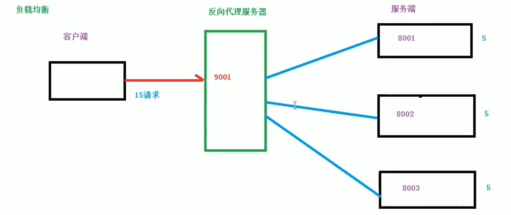
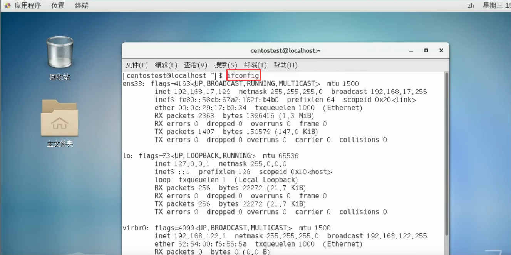
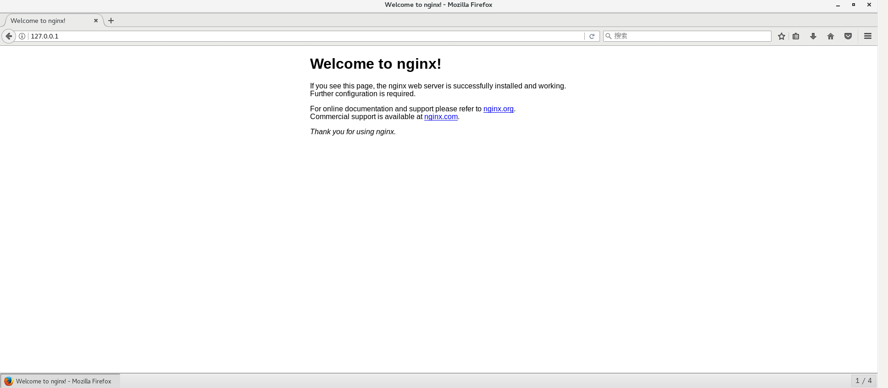
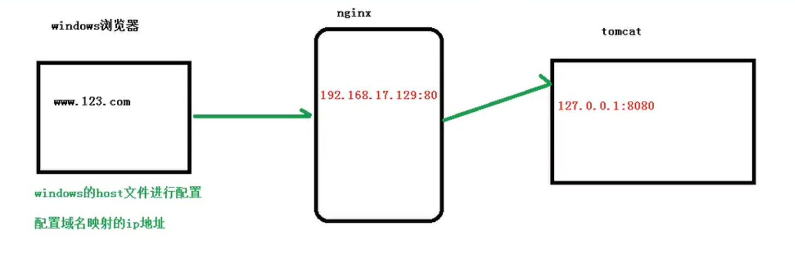
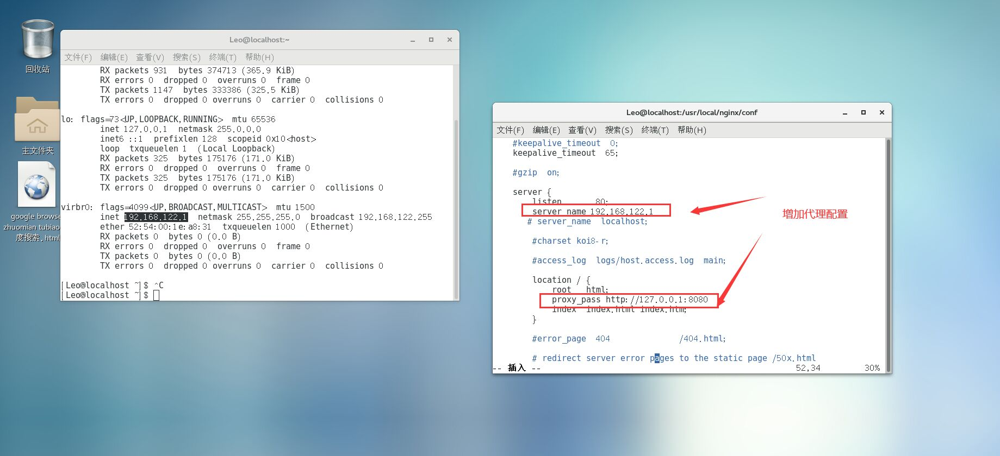
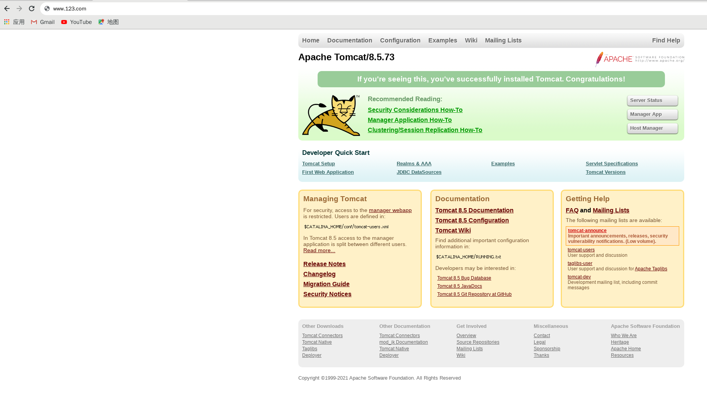

# Nginx 的使用

> 前言

&emsp;&emsp;<font face="consolas" >Nginx (engine x)</font> 是一个高性能的 <font face="consolas" >HTTP</font> 和反向代理 <font face="consolas" >web</font> 服务器，同时也提供了 IMAP/POP3/SMTP 服务。<font face="consolas" >Nginx</font> 是由伊戈尔 $·$ 赛索耶夫为<font color="powderBlue"><u>俄罗斯</u></font>访问量第二的 <font face="consolas" >Rambler.ru</font> 站点（俄文：Рамблер）开发的，第一个公开版本 0.1.0 发布于 2004 年 10 月 4 日。

&nbsp;

[TOC]


# 一、什么是Nginx

- 基本概念
- 正向代理
- 反向代理
- 负载均衡
- 动静分离
- Nginx的优点


## 1.1、基本概念

&emsp;&emsp;<font face="consolas" >Nginx</font> 是一款<font color="powderBlue" ><u>轻量级</u></font>的 <font face="consolas" color="powderBlue" >Web</font> 服务器、<font color="powderBlue" >反向代理</font>服务器及电子邮件（IMAP/POP3）代理服务器，在 BSD-like 协议下发行。其特点是占有内存少，<font color="powderBlue" >并发</font>能力强，事实上 Nginx 的并发能力在同类型的网页服务器中表现较好，中国大陆使用 [Nginx](https://nginx.org/en/) 网站用户有：[百度](https://www.baidu.com)、[京东](https://www.jd.com)、[新浪](https://www.weibo.com)、[网易](https://www.163.com)、[腾讯](https://www.qq.com)、[淘宝](https://www.taobao.com)等。nginx 可以作为静态页面的 Web 服务器，同时还支持 CGI 协议的动态语言。比如 Perl、PHP 等。但是不支持 Java，Java 程序只能通过 Tomcat 配合完成。[Nginx](<https://lnmp.org/nginx.html>) 专为性能优化而开发，性能是其最重要的考量，实现上非常注重效率，能经受高负载的考验，有报告表明能支持高达 50, 000 个并发连接数。


&nbsp;

> nginx是什么，能做什么

- 正向代理
- 反向代理
- 复杂均衡
- 动静分离


## 1.2、正向代理

> 简介

&emsp;&emsp;Nginx 不仅可以做反向代理，实现复杂均衡。还能用作正向代理来进行上网等功能。正向代理：如果把局域网外的Internet 想象成一个巨大的资源库，则局域网中的客户端要访问 Internet 则需要通过代理服务器来访问，这种代理服务就称为**正向代理**。


&emsp;&emsp;正向代理类似一个跳板机，代理访问外部资源

&emsp;&emsp;比如我们国内访问谷歌，直接访问访问不到，我们可以通过一个正向代理服务器，请求发到代理服，代理服务器能够访问谷歌，这样由代理去谷歌取到返回数据，再返回给我们，这样我们就能访问谷歌了

<table><tr><td bgcolor=Beige><center>正向代理的用途</center></td></tr></table>

1. 访问原来无法访问的资源，如：Google
2. 可以做缓存，加速访问资源
3. 对客户端访问授权，上网进行认证
4. 代理可以记录用户访问记录（上网行为管理），对外隐藏用户信息

&nbsp;

## 1.3、反向代理

> 简介

&emsp;&emsp;反向代理 —— 其实客户端对代理是无感知的，因为客户端不需要任何配置就可以访问，我们需要将请求发送到反向代理服务器，由反向代理服务器去选择目标服务器获取数据后，再返回给客户端，此时反向代理服务器和目标服务器对外就是一个服务器，暴露的是代理服务器地址，隐藏了真实服务器的IP地址


&nbsp;

&emsp;&emsp;反向代理（<font face="consolas">Reverse Proxy</font>）实际运行方式是指以代理服务器来接受 Internet 上的连接请求，然后将请求转发给内部网络上的服务器，并将从服务器上得到的结果返回给 Internet 上请求连接的客户端，此时代理服务器对外就表现为一个服务器。

&nbsp;

> 反向代理的作用：

- 保证内网的安全，阻止 Web 攻击，大型网站，通常将反向代理作为公网访问地址，Web 服务器是内网

- 负载均衡，通过反向代理服务器来优化网站的负载

&nbsp;

## 1.4、负载均衡

> 简介

&emsp;&emsp;客户端发送多个请求到服务器，服务器处理请求，有一些可能要与数据库进行交互，服务器处理完毕之后，再将结果返回给客户端。

&emsp;&emsp;这种<font face="宋体">架构模式</font>对于早期的系统相对单一，并发相对较少的情况下是比较适合的，成本也低。但是随着信息数量的的不断增长，访问量和数据量的飞速提升，以及系统业务的复杂度增加，这种架构会造成服务器响应客户端的请求日益缓慢，并发量特别大的时候，还容易造成服务器直接崩溃。很明显这是由于服务器性能的瓶颈造成的问题，那么如何解决这种情况呢？

&nbsp;



&nbsp;

&emsp;我们首先想到的可能是升级服务器的配置，比如<font face="宋体">提高 CPU 执行频率，加大内存</font>等提高机器的物理性能来解决此问题，但是我们知道摩尔定理的日益失效，硬件的性能提升已经不能满足日益提升的需求了。最明显的一个例子，天猫双十一当天，某个热销产品的瞬时访问量是极其庞大的，那么类似于上面的系统架构，将机器都增加到现有的顶级物理配置，都是不能够满足需求的。那么该怎么办？

&emsp;&emsp;上面的分析我们去掉了增加服务器物理配置来解决问题的办法，也就是说纵向解决问题的办法行不通了，那么横向增加服务器的数量呢？这时候集群的概念产生了，单个服务器解决不了，那么我们就增加服务器的数量，然后将请求分发到各个服务器上，**将原先请求集中到单个服务器上的情况改为将请求分发到多个服务器上，将负载分发到不同的服务器上，这也就是我们所说的<font face="黑体" color="red">负载均衡</font>**。

&nbsp;

## 1.5、动静分离

> 前言

&emsp;&emsp;为了加快网站的解析速度，可以把动态页面和静态页面由不同的服务器来解析，加快解析速度，降低原来单个服务器的压力


&nbsp;

## 1.6、nginx的优点

- 处理静态文件，索引文件以及自动索引；打开文件描述符缓冲。
- 无缓存的反向代理加速，简单的负载均衡和容错。
- FastCGI，简单的负载均衡和容错。
- 模块化的结构。包括 Gzipping、Byte Ranges、Chunked Responses 以及 SSI-filter 等 filter。此外，如果由 FastCGI 或其它代理服务器处理单页中存在的多个SSI，则这项处理可以并行运行，而不需要相互等待。
- 支持 SSL 和 TLSSNI。

&nbsp;

# 二、Nginx的使用

- 安装Nginx
- 启动Nginx
- Nginx常用命令
- Nginx配置文件


## 2.1、安装Nginx

> 具体安装步骤如下：

1. 打开 Linux 系统终端，`ifconfig` 命令查看其ip地址



2. 进入[Nginx官网](http://nginx.org)下载 Nginx 软件压缩包


3. 选择最新版本进行安装，(需要先使用远程连接工具连接Linux操作系统)

   不过多数情况下安装预编译的 Unit 二进制包是最佳选择；[官方](https://packages.nginx.org/unit/)二进制包适用于：	

   - Amazon Linux、Amazon Linux 2

   - CentOS 6、7、8

   - Debian 9、10

   - Fedora 29、30、31、32、33

   - RHEL 6、7、8

   - Ubuntu 16.04、18.04、19.10、20.04、20.10、21.04

   安装文档：<https://www.nginx.org.cn/book/_book/>

```sh
# 需要有网络
$ yum install nginx
$ sudo apt install nginx
```

> Supported architecture: x86-64.

- To configure Unit’s repository, create the following file named `/etc/yum.repos.d/unit.repo`:

```ini
[unit]
name=unit repo
baseurl=https://packages.nginx.org/unit/centos/$releasever/$basearch/
gpgcheck=0
enabled=1
```

- Install the core package and other packages you need:

```sh
sudo yum install unit
sudo yum install unit-devel unit-go unit-jsc8 unit-jsc11  \
      unit-perl unit-php unit-python27 unit-python36
sudo systemctl restart unit
```

Runtime details:

| Control [socket](https://unit.nginx.org/howto/security/#security-socket-state) | `/var/run/unit/control.sock` |
| ------------------------------------------------------------ | ---------------------------- |
| Log [file](https://unit.nginx.org/troubleshooting/#troubleshooting-log) | `/var/log/unit/unit.log`     |
| Non-privileged [user and group](https://unit.nginx.org/howto/security/#security-apps) | `unit`                       |

 &nbsp;

4. 手动安装需要先安装一些依赖，以 CentOS7 为例

   <https://www.cnblogs.com/boonya/p/7907999.html>

   &nbsp;

   ① 第一步：安装 pcre

   > * 把安装压缩文件放到Linux系统中，
   >
   > * 解压缩文件 `tar -xvf pcre-8.37.tar.gz`
   >
   > * 进入解压目录，执行`./configure`
   >
   > * 使用 `make && make install`
   > * 安装之后，使用命令，查看版本号 `pcre -config --version`

   ```shell
   wget http://downloads.sourceforge.net/project/pcre/pcre/8.37/pcre-8.37.tar.gz
   
   tar -xvf pcre-8.37.tar.gz
   
   # 解压文件
   ./configure --prefix=指定安装的目录
   # ./configure 完成后，回到pcre目录下执行make
   # 再执行make install
   
   # make 命令执行不了的同学   。/configure后 最后一行会出现
   # configure: error: You need a C++ compiler for C++ support.
   # 安装一下这个即可：
   yum install -y gcc gcc-c++
   # 安装完毕后在执行 ./configure  在执行make 就OK了    我就是这样
   
   pcre -config --version
   8.37
   ```

   ② 第二步：安装 OpenSSL

   ③ 第三步：安装 zlib

   ```shell
   # 安装 OpenSSL 和 zlib
   yum -y install make zlib zlib-devel gcc-c++ libtool openssl openssl-devel
   # 一键安装上面四个依赖
   yum -y install gcc zlib zlib-devel pcre-devel openssl openssl-devel
   ```

   &nbsp;

   ④ 第四步：安装 Nginx

   解压缩 nginx-xx.tar.gz 包并进入解压缩目录，执行 `./configure` 以及 `make&& make install`

&nbsp;

## 2.2、启动Nginx

> 安装成功之后， 会在 usr 目录下多出一个文件夹 <font face="consolas">/local/nginx</font>，这个文件夹下有 <font face="consolas">sbin</font> 目录有启动脚本

```sh
# 切换到启动脚本目录下
cd /
cd /usr/local/nginx/sbin
ls
# 启动nginx
.nginx
# 查看nginx进程
ps -ef | grep nginx
# 查看端口占用情况
netstat -nap | grep 8080
```

效果如下图


&nbsp;

⑥ 第六步：查看 <font face="consolas">nginx/conf</font> 目录的 `nginx.conf` 配置文件

```shell
cd..
cd..
ls
cd nginx/
cd conf
vim nginx.conf
```


通过 IP地址和端口号就可访问nginx，访问成功之后会出现这个界面



```tex
rooter
```

&nbsp;

## 2.3、Nginx常用命令

> 前提条件

使用 nginx 操作命令前提是，必须进入到 nginx 的目录下才行

1. `whereis software`：**查看software安装位置**

   - 具体操作如下

   ```shell
   bash: cd: /nginx: 没有那个文件或目录
   [rooter@localhost ~]$ whereis nginx
   nginx: /usr/local/nginx
   [rooter@localhost ~]$ cd /usr/local/nginx
   [rooter@localhost nginx]$ ls -l
   总用量 4
   drwx------. 2 nobody root    6 10月 25 14:00 client_body_temp
   drwxr-xr-x. 2 root   root 4096 10月 25 13:55 conf
   drwx------. 2 nobody root    6 10月 25 14:00 fastcgi_temp
   drwxr-xr-x. 2 root   root   40 10月 25 13:55 html
   drwxr-xr-x. 2 root   root   58 12月 17 13:47 logs
   drwx------. 2 nobody root    6 10月 25 14:00 proxy_temp
   drwxr-xr-x. 2 root   root   36 10月 25 13:55 sbin
   drwx------. 2 nobody root    6 10月 25 14:00 scgi_temp
   drwx------. 2 nobody root    6 10月 25 14:00 uwsgi_temp
   ooter@localhost nginx]$ cd sbin
   [rooter@localhost sbin]$ 
   ```

   &nbsp;

2. **查看nginx版本号：** `./nginx -v`

```shell
[rooter@localhost sbin]$ ./nginx -v
nginx version: nginx/1.12.0
```

3. 启动nginx：`./nginx`
4. 关闭nginx：`./nginx -s stop`

```shell
# 查看nginx启动状态
root       1329      1  0 13:47 ?        00:00:00 nginx: master process /usr/local/nginx/sbin/nginx
nobody     1330   1329  0 13:47 ?        00:00:00 nginx: worker process
rooter     4472   4210  0 14:13 pts/0    00:00:00 grep --color=auto nginx
2021/12/17 14:17:48 [emerg] 4598#0: open() "/usr/local/nginx/logs/access.log" failed (13: Permission denied)
[rooter@localhost sbin]$ sudo ./nginx -s stop
[sudo] rooter 的密码：
[rooter@localhost sbin]$ ps -ef | grep nginx
rooter     4559   4210  0 14:16 pts/0    00:00:00 grep --color=auto nginx
```

5. 重新加载nginx

```shell
[rooter@localhost sbin]$ sudo ./nginx -s reload
[rooter@localhost sbin]$ 
```

6. 查看nginx进程

   ```shell
   [rooter@localhost ~]$ ps aux| grep nginx
   ```

7. 安全退出

   ```shell
   ./nginx -s quit
   ```

8. 查看配置文件是否正确

 `./nginx -t`

## 2.4、Nginx配置文件

- nginx配置文件的位置
- nginx配置文件实例
- 第一部分、全局块
- 第二部分、events块
- 第三部分、HTTP块

### 2.4.1、nginx配置文件的位置

`/usr/local/nginx/conf/nginx.conf`


&nbsp;

### 2.4.2、nginx配置文件实例

```shell
# 第一部分、全局块
#user  nobody;
worker_processes  1;

#error_log  logs/error.log;
#error_log  logs/error.log  notice;
#error_log  logs/error.log  info;

#pid        logs/nginx.pid;

# 第二部分、events块
events {
    worker_connections  1024;
}

# 第三部分、HTTP块
http {
    include       mime.types;
    default_type  application/octet-stream;

    #log_format  main  '$remote_addr - $remote_user [$time_local] "$request" '
    #                  '$status $body_bytes_sent "$http_referer" '
    #                  '"$http_user_agent" "$http_x_forwarded_for"';

    #access_log  logs/access.log  main;

    sendfile        on;
    #tcp_nopush     on;

    #keepalive_timeout  0;
    keepalive_timeout  65;

    #gzip  on;

    server {
        listen       80;
        server_name  localhost;

        #charset koi8-r;

        #access_log  logs/host.access.log  main;

        location / {
            root   html;
            index  index.html index.htm;
        }

        #error_page  404              /404.html;

        # redirect server error pages to the static page /50x.html
        #
        error_page   500 502 503 504  /50x.html;
        location = /50x.html {
            root   html;
        }

        # proxy the PHP scripts to Apache listening on 127.0.0.1:80
        #
        #location ~ \.php$ {
        #    proxy_pass   http://127.0.0.1;
        #}

        # pass the PHP scripts to FastCGI server listening on 127.0.0.1:9000
        #
        #location ~ \.php$ {
        #    root           html;
        #    fastcgi_pass   127.0.0.1:9000;
        #    fastcgi_index  index.php;
        #    fastcgi_param  SCRIPT_FILENAME  /scripts$fastcgi_script_name;
        #    include        fastcgi_params;
        #}

        # deny access to .htaccess files, if Apache's document root
        # concurs with nginx's one
        #
        #location ~ /\.ht {
        #    deny  all;
        #}
    }


    # another virtual host using mix of IP-, name-, and port-based configuration
    #
    #server {
    #    listen       8000;
    #    listen       somename:8080;
    #    server_name  somename  alias  another.alias;

    #    location / {
    #        root   html;
    #        index  index.html index.htm;
    #    }
    #}


    # HTTPS server
    #
    #server {
    #    listen       443 ssl;
    #    server_name  localhost;

    #    ssl_certificate      cert.pem;
    #    ssl_certificate_key  cert.key;

    #    ssl_session_cache    shared:SSL:1m;
    #    ssl_session_timeout  5m;

    #    ssl_ciphers  HIGH:!aNULL:!MD5;
    #    ssl_prefer_server_ciphers  on;

    #    location / {
    #        root   html;
    #        index  index.html index.htm;
    #    }
    #}

}

```

&nbsp;

### 2.4.3、第一部分、全局块

&emsp;&emsp;从配置文件开始到 events 块之间的内容，主要会设置一些影响 nginx 服务器整体运行指令的配置命令，主要包括配置运行 nginx 服务器的用户（组）、允许生成的 worker process 数，进程 PID 存放路径、日志存放路径和类型已经配置文件的引入等。

&emsp;&emsp;比如上面第一行配置的：`worker_processes 1; `

&emsp;&emsp;这是 nginx 服务器并发处理的关键配置，worker_processes 值越大，可以支持处理的并发处理量也越多，但是会受到硬件、软件等设备的制约，有物理上限。


### 2.4.4、第二部分、events块

比如上面的配置：`worker_connections 1024;`

events 块涉及到的指令主要是影响 nginx 服务器与用户的网络连接，常用的设置包括是否开启多对多、work_process 下的网络连接进行序列化、是否允许同时接受多个网络连接、选取哪种事件驱动模型来处理连接请求、每个 work_process 可以支持的最大连接数

上述例子就表示每个 work_process 支持的最大连接数为 1024

这部分的配置对 nginx 的性能影响较大，在实际应用可以灵活配置

&nbsp;

### 2.4.5、第三部分、HTTP块

```shell
# 第三部分、HTTP块
http {
    include       mime.types;
    default_type  application/octet-stream;

    #log_format  main  '$remote_addr - $remote_user [$time_local] "$request" '
    #                  '$status $body_bytes_sent "$http_referer" '
    #                  '"$http_user_agent" "$http_x_forwarded_for"';

    #access_log  logs/access.log  main;

    sendfile        on;
    #tcp_nopush     on;

    #keepalive_timeout  0;
    keepalive_timeout  65;

    #gzip  on;

    server {
        # 监听端口
        listen       80;
        # 监听的域名
        # server_name  localhost;
        server_name manage.leyou.com

        #charset koi8-r;

        #access_log  logs/host.access.log  main;
		
		
        location / { # 请求映射规则 / 代表映射一切请求路径
            root   html;
            # proxy_pass代理转发,所有监听端口域名访问的请求都会被转发给//127.0.0.1:9001处理
            proxy_pass http://127.0.0.1:9001
            index  index.html index.htm;
        }

        #error_page  404              /404.html;

        # redirect server error pages to the static page /50x.html
        #
        error_page   500 502 503 504  /50x.html;
        location = /50x.html {
            root   html;
        }

        # proxy the PHP scripts to Apache listening on 127.0.0.1:80
        #
        #location ~ \.php$ {
        #    proxy_pass   http://127.0.0.1;
        #}

        # pass the PHP scripts to FastCGI server listening on 127.0.0.1:9000
        #
        #location ~ \.php$ {
        #    root           html;
        #    fastcgi_pass   127.0.0.1:9000;
        #    fastcgi_index  index.php;
        #    fastcgi_param  SCRIPT_FILENAME  /scripts$fastcgi_script_name;
        #    include        fastcgi_params;
        #}

        # deny access to .htaccess files, if Apache's document root
        # concurs with nginx's one
        #
        #location ~ /\.ht {
        #    deny  all;
        #}
    }


    # another virtual host using mix of IP-, name-, and port-based configuration
    #
    #server {
    #    listen       8000;
    #    listen       somename:8080;
    #    server_name  somename  alias  another.alias;

    #    location / {
    #        root   html;
    #        index  index.html index.htm;
    #    }
    #}


    # HTTPS server
    #
    #server {
    #    listen       443 ssl;
    #    server_name  localhost;

    #    ssl_certificate      cert.pem;
    #    ssl_certificate_key  cert.key;

    #    ssl_session_cache    shared:SSL:1m;
    #    ssl_session_timeout  5m;

    #    ssl_ciphers  HIGH:!aNULL:!MD5;
    #    ssl_prefer_server_ciphers  on;

    #    location / {
    #        root   html;
    #        index  index.html index.htm;
    #    }
    #}

}
```

这算是 Nginx 服务器配置中改动最频繁的部分、代理、缓存和日志定义等绝大多数功能和第三方模块的配置都在这里

需要注意的是： HTTP 块也可以包括：HTTP 全局块和server 块

&nbsp;

#### 2.4.5.1、HTTP全局块

HTTP全局块配置的指令包括文件引入、MIME-TYPE 定义、日志自定义、连接超时时间、单链接请求上限等等

&nbsp;

#### 2.4.5.2、server块

&emsp;&emsp;这块和虚拟主机有密切关系，虚拟主机从用户角度看和一台独立的硬件主机是完全一样的，该技术的产生是为了节省互联网服务器硬件成本。

&emsp;&emsp;每个 HTTP 块可以包括多个 server 块，而每个 server 块就相当于一个虚拟主机

&emsp;&emsp;而每个 server 块也分为全局 server 块，以及可以同时包含多个 location 块

- 全局server块：最常见的配置是本虚拟机主机的监听配置和本虚拟主机的名称或 IP 配置
-  location 块：一个server块可以配置多个location块。这块的主要作用就是基于 nginx 服务器接收到的请求字符串（例如 server_name/uri-string），对虚拟主机名称（也可以是IP）之外的字符串（例如：前面的 /uri-string）进行匹配，对特定的请求进行处理。地址定向、数据缓存和应答控制等功能，还有许多第三方模块的配置也在这里进行

&nbsp;

## 2.5、防火墙设置

```sh
# 设置开放的端口号
firewall-cmd --add-service=http -permanent
sudo firewall-cmd --add-port=8080/tcp --permanent
# 移除8080端口
sudo firewall-cmd --remove-port=8080/tcp --permanent
# 查看防火墙开放端口列表
firewall-cmd --list-all
# 重加载防火墙（修改配置后要重启防火墙）
firewall-cmd --reload
# 开启防火墙
service firewall start
# 重启防火墙
service firewall restart
# 参数解释
1. firewall-cmd 是Linux系统提供的操作firewall的一个工具
2. --permanent 表示设置为永久
3. --add-port 标识添加的端口
```

## 2.6、配置文件详解

- 配置文件实例说明
- server_name和location

&nbsp;

### 2.6.1、配置文件实例说明

```txt
######nginx配置文件nginx.conf中文详解#####

#定义nginx运行的用户和用户组
user www www;

#nginx进程数，建议设置为等于CPU总核心数。
worker_processes 8;
 
#全局错误日志定义类型，[ debug | info | notice | warn | error | crit ]
error_log /usr/local/nginx/logs/error.log info;

#进程pid文件
pid /usr/local/nginx/logs/nginx.pid;

#指定进程可以打开的最大描述符：数目
#工作模式与连接数上限
#这个指令是指当一个nginx进程打开的最多文件描述符数目，理论值应该是最多打开文件数（ulimit -n）与nginx进程数相除，但是nginx分配请求并不是那么均匀，所以最好与ulimit -n 的值保持一致。
#现在在linux 2.6内核下开启文件打开数为65535，worker_rlimit_nofile就相应应该填写65535。
#这是因为nginx调度时分配请求到进程并不是那么的均衡，所以假如填写10240，总并发量达到3-4万时就有进程可能超过10240了，这时会返回502错误。
worker_rlimit_nofile 65535;


events
{
    #参考事件模型，use [ kqueue | rtsig | epoll | /dev/poll | select | poll ]; epoll模型
    #是Linux 2.6以上版本内核中的高性能网络I/O模型，linux建议epoll，如果跑在FreeBSD上面，就用kqueue模型。
    #补充说明：
    #与apache相类，nginx针对不同的操作系统，有不同的事件模型
    #A）标准事件模型
    #Select、poll属于标准事件模型，如果当前系统不存在更有效的方法，nginx会选择select或poll
    #B）高效事件模型
    #Kqueue：使用于FreeBSD 4.1+, OpenBSD 2.9+, NetBSD 2.0 和 MacOS X.使用双处理器的MacOS X系统使用kqueue可能会造成内核崩溃。
    #Epoll：使用于Linux内核2.6版本及以后的系统。
    #/dev/poll：使用于Solaris 7 11/99+，HP/UX 11.22+ (eventport)，IRIX 6.5.15+ 和 Tru64 UNIX 5.1A+。
    #Eventport：使用于Solaris 10。 为了防止出现内核崩溃的问题， 有必要安装安全补丁。
    use epoll;

    #单个进程最大连接数（最大连接数=连接数*进程数）
    #根据硬件调整，和前面工作进程配合起来用，尽量大，但是别把cpu跑到100%就行。每个进程允许的最多连接数，理论上每台nginx服务器的最大连接数为。
    worker_connections 65535;

    #keepalive超时时间。
    keepalive_timeout 60;

    #客户端请求头部的缓冲区大小。这个可以根据你的系统分页大小来设置，一般一个请求头的大小不会超过1k，不过由于一般系统分页都要大于1k，所以这里设置为分页大小。
    #分页大小可以用命令getconf PAGESIZE 取得。
    #[root@web001 ~]# getconf PAGESIZE
    #4096
    #但也有client_header_buffer_size超过4k的情况，但是client_header_buffer_size该值必须设置为“系统分页大小”的整倍数。
    client_header_buffer_size 4k;

    #这个将为打开文件指定缓存，默认是没有启用的，max指定缓存数量，建议和打开文件数一致，inactive是指经过多长时间文件没被请求后删除缓存。
    open_file_cache max=65535 inactive=60s;

    #这个是指多长时间检查一次缓存的有效信息。
    #语法:open_file_cache_valid time 默认值:open_file_cache_valid 60 使用字段:http, server, location 这个指令指定了何时需要检查open_file_cache中缓存项目的有效信息.
    open_file_cache_valid 80s;

    #open_file_cache指令中的inactive参数时间内文件的最少使用次数，如果超过这个数字，文件描述符一直是在缓存中打开的，如上例，如果有一个文件在inactive时间内一次没被使用，它将被移除。
    #语法:open_file_cache_min_uses number 默认值:open_file_cache_min_uses 1 使用字段:http, server, location  这个指令指定了在open_file_cache指令无效的参数中一定的时间范围内可以使用的最小文件数,如果使用更大的值,文件描述符在cache中总是打开状态.
    open_file_cache_min_uses 1;
    
    #语法:open_file_cache_errors on | off 默认值:open_file_cache_errors off 使用字段:http, server, location 这个指令指定是否在搜索一个文件是记录cache错误.
    open_file_cache_errors on;
}
 
 
 
#设定http服务器，利用它的反向代理功能提供负载均衡支持
http
{
    #文件扩展名与文件类型映射表
    include mime.types;

    #默认文件类型
    default_type application/octet-stream;

    #默认编码
    #charset utf-8;

    #服务器名字的hash表大小
    #保存服务器名字的hash表是由指令server_names_hash_max_size 和server_names_hash_bucket_size所控制的。参数hash bucket size总是等于hash表的大小，并且是一路处理器缓存大小的倍数。在减少了在内存中的存取次数后，使在处理器中加速查找hash表键值成为可能。如果hash bucket size等于一路处理器缓存的大小，那么在查找键的时候，最坏的情况下在内存中查找的次数为2。第一次是确定存储单元的地址，第二次是在存储单元中查找键 值。因此，如果nginx给出需要增大hash max size 或 hash bucket size的提示，那么首要的是增大前一个参数的大小.
    server_names_hash_bucket_size 128;

    #客户端请求头部的缓冲区大小。这个可以根据你的系统分页大小来设置，一般一个请求的头部大小不会超过1k，不过由于一般系统分页都要大于1k，所以这里设置为分页大小。分页大小可以用命令getconf PAGESIZE取得。
    client_header_buffer_size 32k;

    #客户请求头缓冲大小。nginx默认会用client_header_buffer_size这个buffer来读取header值，如果header过大，它会使用large_client_header_buffers来读取。
    large_client_header_buffers 4 64k;

    #设定通过nginx上传文件的大小
    client_max_body_size 8m;

    #开启高效文件传输模式，sendfile指令指定nginx是否调用sendfile函数来输出文件，对于普通应用设为 on，如果用来进行下载等应用磁盘IO重负载应用，可设置为off，以平衡磁盘与网络I/O处理速度，降低系统的负载。注意：如果图片显示不正常把这个改成off。
    #sendfile指令指定 nginx 是否调用sendfile 函数（zero copy 方式）来输出文件，对于普通应用，必须设为on。如果用来进行下载等应用磁盘IO重负载应用，可设置为off，以平衡磁盘与网络IO处理速度，降低系统uptime。
    sendfile on;

    #开启目录列表访问，合适下载服务器，默认关闭。
    autoindex on;

    #此选项允许或禁止使用socke的TCP_CORK的选项，此选项仅在使用sendfile的时候使用
    tcp_nopush on;
     
    tcp_nodelay on;

    #长连接超时时间，单位是秒
    keepalive_timeout 120;

    #FastCGI相关参数是为了改善网站的性能：减少资源占用，提高访问速度。下面参数看字面意思都能理解。
    fastcgi_connect_timeout 300;
    fastcgi_send_timeout 300;
    fastcgi_read_timeout 300;
    fastcgi_buffer_size 64k;
    fastcgi_buffers 4 64k;
    fastcgi_busy_buffers_size 128k;
    fastcgi_temp_file_write_size 128k;

    #gzip模块设置
    gzip on; #开启gzip压缩输出
    gzip_min_length 1k;    #最小压缩文件大小
    gzip_buffers 4 16k;    #压缩缓冲区
    gzip_http_version 1.0;    #压缩版本（默认1.1，前端如果是squid2.5请使用1.0）
    gzip_comp_level 2;    #压缩等级
    gzip_types text/plain application/x-javascript text/css application/xml;    #压缩类型，默认就已经包含textml，所以下面就不用再写了，写上去也不会有问题，但是会有一个warn。
    gzip_vary on;

    #开启限制IP连接数的时候需要使用
    #limit_zone crawler $binary_remote_addr 10m;


    #负载均衡配置
    upstream jh.w3cschool.cn {
     
        #upstream的负载均衡，weight是权重，可以根据机器配置定义权重。weight参数表示权值，权值越高被分配到的几率越大。
        server 192.168.80.121:80 weight=3;
        server 192.168.80.122:80 weight=2;
        server 192.168.80.123:80 weight=3;

        #nginx的upstream目前支持4种方式的分配
        #1、轮询（默认）
        #每个请求按时间顺序逐一分配到不同的后端服务器，如果后端服务器down掉，能自动剔除。
        #2、weight
        #指定轮询几率，weight和访问比率成正比，用于后端服务器性能不均的情况。
        #例如：
        #upstream bakend {
        #    server 192.168.0.14 weight=10;
        #    server 192.168.0.15 weight=10;
        #}
        #2、ip_hash
        #每个请求按访问ip的hash结果分配，这样每个访客固定访问一个后端服务器，可以解决session的问题。
        #例如：
        #upstream bakend {
        #    ip_hash;
        #    server 192.168.0.14:88;
        #    server 192.168.0.15:80;
        #}
        #3、fair（第三方）
        #按后端服务器的响应时间来分配请求，响应时间短的优先分配。
        #upstream backend {
        #    server server1;
        #    server server2;
        #    fair;
        #}
        #4、url_hash（第三方）
        #按访问url的hash结果来分配请求，使每个url定向到同一个后端服务器，后端服务器为缓存时比较有效。
        #例：在upstream中加入hash语句，server语句中不能写入weight等其他的参数，hash_method是使用的hash算法
        #upstream backend {
        #    server squid1:3128;
        #    server squid2:3128;
        #    hash $request_uri;
        #    hash_method crc32;
        #}

        #tips:
        #upstream bakend{#定义负载均衡设备的Ip及设备状态}{
        #    ip_hash;
        #    server 127.0.0.1:9090 down;
        #    server 127.0.0.1:8080 weight=2;
        #    server 127.0.0.1:6060;
        #    server 127.0.0.1:7070 backup;
        #}
        #在需要使用负载均衡的server中增加 proxy_pass http://bakend/;

        #每个设备的状态设置为:
        #1.down表示单前的server暂时不参与负载
        #2.weight为weight越大，负载的权重就越大。
        #3.max_fails：允许请求失败的次数默认为1.当超过最大次数时，返回proxy_next_upstream模块定义的错误
        #4.fail_timeout:max_fails次失败后，暂停的时间。
        #5.backup： 其它所有的非backup机器down或者忙的时候，请求backup机器。所以这台机器压力会最轻。

        #nginx支持同时设置多组的负载均衡，用来给不用的server来使用。
        #client_body_in_file_only设置为On 可以讲client post过来的数据记录到文件中用来做debug
        #client_body_temp_path设置记录文件的目录 可以设置最多3层目录
        #location对URL进行匹配.可以进行重定向或者进行新的代理 负载均衡
    }
     
     
     
    #虚拟主机的配置
    server
    {
        #监听端口
        listen 80;

        #域名可以有多个，用空格隔开
        server_name www.w3cschool.cn w3cschool.cn;
        index index.html index.htm index.php;
        root /data/www/w3cschool;

        #对******进行负载均衡
        location ~ .*.(php|php5)?$
        {
            fastcgi_pass 127.0.0.1:9000;
            fastcgi_index index.php;
            include fastcgi.conf;
        }
         
        #图片缓存时间设置
        location ~ .*.(gif|jpg|jpeg|png|bmp|swf)$
        {
            expires 10d;
        }
         
        #JS和CSS缓存时间设置
        location ~ .*.(js|css)?$
        {
            expires 1h;
        }
         
        #日志格式设定
        #$remote_addr与$http_x_forwarded_for用以记录客户端的ip地址；
        #$remote_user：用来记录客户端用户名称；
        #$time_local： 用来记录访问时间与时区；
        #$request： 用来记录请求的url与http协议；
        #$status： 用来记录请求状态；成功是200，
        #$body_bytes_sent ：记录发送给客户端文件主体内容大小；
        #$http_referer：用来记录从那个页面链接访问过来的；
        #$http_user_agent：记录客户浏览器的相关信息；
        #通常web服务器放在反向代理的后面，这样就不能获取到客户的IP地址了，通过$remote_add拿到的IP地址是反向代理服务器的iP地址。反向代理服务器在转发请求的http头信息中，可以增加x_forwarded_for信息，用以记录原有客户端的IP地址和原来客户端的请求的服务器地址。
        log_format access '$remote_addr - $remote_user [$time_local] "$request" '
        '$status $body_bytes_sent "$http_referer" '
        '"$http_user_agent" $http_x_forwarded_for';
         
        #定义本虚拟主机的访问日志
        access_log  /usr/local/nginx/logs/host.access.log  main;
        access_log  /usr/local/nginx/logs/host.access.404.log  log404;
         
        #对 "/" 启用反向代理
        location / {
            proxy_pass http://127.0.0.1:88;
            proxy_redirect off;
            proxy_set_header X-Real-IP $remote_addr;
             
            #后端的Web服务器可以通过X-Forwarded-For获取用户真实IP
            proxy_set_header X-Forwarded-For $proxy_add_x_forwarded_for;
             
            #以下是一些反向代理的配置，可选。
            proxy_set_header Host $host;

            #允许客户端请求的最大单文件字节数
            client_max_body_size 10m;

            #缓冲区代理缓冲用户端请求的最大字节数，
            #如果把它设置为比较大的数值，例如256k，那么，无论使用firefox还是IE浏览器，来提交任意小于256k的图片，都很正常。如果注释该指令，使用默认的client_body_buffer_size设置，也就是操作系统页面大小的两倍，8k或者16k，问题就出现了。
            #无论使用firefox4.0还是IE8.0，提交一个比较大，200k左右的图片，都返回500 Internal Server Error错误
            client_body_buffer_size 128k;

            #表示使nginx阻止HTTP应答代码为400或者更高的应答。
            proxy_intercept_errors on;

            #后端服务器连接的超时时间_发起握手等候响应超时时间
            #nginx跟后端服务器连接超时时间(代理连接超时)
            proxy_connect_timeout 90;

            #后端服务器数据回传时间(代理发送超时)
            #后端服务器数据回传时间_就是在规定时间之内后端服务器必须传完所有的数据
            proxy_send_timeout 90;

            #连接成功后，后端服务器响应时间(代理接收超时)
            #连接成功后_等候后端服务器响应时间_其实已经进入后端的排队之中等候处理（也可以说是后端服务器处理请求的时间）
            proxy_read_timeout 90;

            #设置代理服务器（nginx）保存用户头信息的缓冲区大小
            #设置从被代理服务器读取的第一部分应答的缓冲区大小，通常情况下这部分应答中包含一个小的应答头，默认情况下这个值的大小为指令proxy_buffers中指定的一个缓冲区的大小，不过可以将其设置为更小
            proxy_buffer_size 4k;

            #proxy_buffers缓冲区，网页平均在32k以下的设置
            #设置用于读取应答（来自被代理服务器）的缓冲区数目和大小，默认情况也为分页大小，根据操作系统的不同可能是4k或者8k
            proxy_buffers 4 32k;

            #高负荷下缓冲大小（proxy_buffers*2）
            proxy_busy_buffers_size 64k;

            #设置在写入proxy_temp_path时数据的大小，预防一个工作进程在传递文件时阻塞太长
            #设定缓存文件夹大小，大于这个值，将从upstream服务器传
            proxy_temp_file_write_size 64k;
        }
         
         
        #设定查看nginx状态的地址
        location /nginxStatus {
            stub_status on;
            access_log on;
            auth_basic "nginxStatus";
            auth_basic_user_file confpasswd;
            #htpasswd文件的内容可以用apache提供的htpasswd工具来产生。
        }
         
        #本地动静分离反向代理配置
        #所有jsp的页面均交由tomcat或resin处理
        location ~ .(jsp|jspx|do)?$ {
            proxy_set_header Host $host;
            proxy_set_header X-Real-IP $remote_addr;
            proxy_set_header X-Forwarded-For $proxy_add_x_forwarded_for;
            proxy_pass http://127.0.0.1:8080;
        }
         
        #所有静态文件由nginx直接读取不经过tomcat或resin
        location ~ .*.(htm|html|gif|jpg|jpeg|png|bmp|swf|ioc|rar|zip|txt|flv|mid|doc|ppt|
        pdf|xls|mp3|wma)$
        {
            expires 15d; 
        }
         
        location ~ .*.(js|css)?$
        {
            expires 1h;
        }
    }
}
```

### 2.6.2、server_name和location

> server_name的作用

server name 为虚拟服务器的识别路径。因此不同的域名会通过请求头中的HOST字段，匹配到特定的server块，转发到对应的应用服务器中去。

server_name与Host的匹配优先级：

首先选择所有字符串完全匹配的server_name。如：www.toutou.com

其次选择通配符在前面的server_name。如：*.toutou.com

其次选择通配符在后面的server_name。如：www.toutou.*

最后选择使用正在表达式才匹配的server_name。如：~^\.toutou\.com$

如果上面这些都不匹配

1、优先选择listen配置项后有default或default_server的

2、找到匹配listen端口的第一个server块

> location匹配规则

location后面的这些` = `或者` ~ `具体是干嘛用的呢，分别介绍一下。

语法：` location [=|~|~*|^~] /uri/ { … } `

4.4.1` = `精确匹配路径，用于不含正则表达式的 uri 前，如果匹配成功，不再进行后续的查找。

4.4.2` ^~ `用于不含正则表达式的 uri； 前，表示如果该符号后面的字符是最佳匹配，采用该规则，不再进行后续的查找。

```sh
// 匹配以/images/开头的任何查询并停止搜索,表示匹配URL时忽略字母大小写问题
location ^~ /images/ {
    # matches any query beginning with /images/ and halts searching,
	# so regular expressions will not be checked.
}
```

4.4.3` ~ `表示用该符号后面的正则去匹配路径，区分大小写。

4.4.4` ~* `表示用该符号后面的正则去匹配路径，不区分大小写。跟 ~ 优先级都比较低，如有多个location的正则能匹配的话，则使用正则表达式最长的那个。

```sh
// 匹配任何以gif、jpg或jpeg结尾的请求。然而,所有
location ~* \.(gif|jpg|jpeg)$ {
    # matches any request ending in gif, jpg, or jpeg. However, all
    # requests to the /images/ directory will be handled by
}
```

4.4.5` / `可以匹配所有请求

```sh
location / {
# matches any query, since all queries begin with /, but regular
# expressions and any longer conventional blocks will be
# matched first.
}
```

<https://blog.csdn.net/weixin_42167759/article/details/85049546>

# 三、nginx配置实例

- 反向代理
- 负载均衡
- 动静分离
- 配置高可用集群


## 3.1、反向代理

> 实现效果

打开浏览器，在浏览器地址栏输入地址：<www.123.com>，跳转Linux系统Tomcat主页面


> 准备工作

- 在Linux系统中安装Tomcat，使用默认端口 8080
- Tomcat安装文件放到Linux系统中，解压
- 进入Tomcat的bin目录，`./startup.sh` 启动Tomcat服务器
- 对外开放访问端口





> 具体配置

① 首先，需要在Windows系统的host文件进行域名和IP对应关系的配置

这个文件通常在c盘/Windows/System32/drivers/etc目录下


② 在nginx中进行请求转发的配置（反向代理配置）

server_name 需要代理的服务器ip地址

proxy_pass 代理之后实际可以访问的服务器地址



③之后便可以看到效果了



- 反向代理实例2

```conf
server{
  listen 80;
  # server_name 47.101.172.28;
  server_name server.wikiwl.com;
  # 反向代理nginx服务端 
  location / {
    proxy_pass http://localhost:8888;
  }

}
```


## 3.2、负载均衡

> 负载均衡的实质是请求均分到各个服务器中，不会发生一个服务器有过多请求的问题

&nbsp;

### 3.3.1、实现方式

1. 轮询

   默认方式，每个请求按时间顺序逐一分配到不同的后端服务器，如果后端服务器down掉，能自动剔除。虽然这种方式简便、成本低廉。但缺点是：可靠性低和负载分配不均衡。适用于图片服务器集群和纯静态页面服务器集群。

&nbsp;

2. weight（权重分配）

   指定轮询几率，权重越高，在被访问的概率越大，用于后端服务器性能不均的情况。

   ```shell
   # 当nginx每收到6个请求，会把其中的1个转发给8001，把其中的2个转发给8002，把其中的3个转发给8003。
   upstream hellolearn{ 
       server 127.0.0.1:8001 weight=1; 
       server 127.0.0.1:8002 weight=2; 
       server 127.0.0.1:8003 weight=3;
   }
   ```

&nbsp;

3. ip_hash

   每个请求按访问ip的hash结果分配，这样每个访客固定访问一个后端服务器，可以解决session的问题。

   ```shell
   upstream hellolearn{ 
       ip_hash; 
       server 127.0.0.1:8001;
       server 127.0.0.1:8002;
       server 127.0.0.1:8003;
   }
   ```

&nbsp;

4. fair（第三方）

   按后端服务器的响应时间分配，响应时间短的优先分配，依赖第三方插件 nginx-upstream-fair，需要先安装。

   ```shell
   upstream hellolearn{ 
       fair; 
       server 127.0.0.1:8001;
       server 127.0.0.1:8002;
       server 127.0.0.1:8003;
   }
   ```

5. url_hash（第三方）

   按访问url的hash结果来分配请求，使每个url定向到同一个后端服务器，后端服务器为缓存时比较有效。在upstream中加入hash语句，hash_method是使用的hash算法。

   ```shell
   # nginx 1.7.2版本后，已经集成了url hash功能，可直接使用，无需安装三方模块。
   upstream hellolearn{ 
       server 127.0.0.1:8001;
       server 127.0.0.1:8002;
       server 127.0.0.1:8003;
       hash $request_uri; 
       hash_method crc32; 
   }
   ```

   

> 冷知识：负载均衡调度中的状态
>
> - down：当前的server暂时不参与负载均衡
>
> - backup： 预留的备份服务器
>
> - max_fails： 允许请求失败的次数
>
> - fail_timeout： 经过max_fails失败后，服务暂停的时间
>
> - max_conns： 限制最大的接收的连接数
>
> ```conf
> upstream hellolearn {
>     server 127.0.0.1:8301 down;
>     server 127.0.0.1:8302 backup;
>     server 127.0.0.1:8303 max_fails=3 fail_timeout=30s;
> }
> ```

&nbsp;

### 3.2.2、具体配置

> 这里的配置文件upstream块中没有配置nginx负载均衡的分配方式，默认是轮询方式

```sh
user nginx;
worker_processes auto;
error_log /var/log/nginx/error.log;
pid /run/nginx.pid;

# Load dynamic modules. See /usr/share/doc/nginx/README.dynamic.
include /usr/share/nginx/modules/*.conf;

events {
    worker_connections 1024;
}

http {
    log_format  main  '$remote_addr - $remote_user [$time_local] "$request" '
                      '$status $body_bytes_sent "$http_referer" '
                      '"$http_user_agent" "$http_x_forwarded_for"';

    access_log  /var/log/nginx/access.log  main;

    sendfile            on;
    tcp_nopush          on;
    tcp_nodelay         on;
    keepalive_timeout   65;
    types_hash_max_size 2048;

    include             /etc/nginx/mime.types;
    default_type        application/octet-stream;

    include /etc/nginx/conf.d/*.conf;
    
    server {
        listen       80 default_server;
        listen       [::]:80 default_server;
        server_name  _;
        root         /usr/share/nginx/html;

        # Load configuration files for the default server block.
        include /etc/nginx/default.d/*.conf;

        location / {
        }

        error_page 404 /404.html;
        location = /404.html {
        }

        error_page 500 502 503 504 /50x.html;
        location = /50x.html {
        }
    }
# 这里的配置文件upstream块中没有配置nginx负载均衡的分配方式，默认是轮询方式。
#  主要是在原有的nginx.conf配置文件中追加upstream块和server块。       
    upstream hellolearn1 {
        server 127.0.0.1:8301;
        server 127.0.0.1:8302;
        server 127.0.0.1:8303;
    }
#  主要是在原有的nginx.conf配置文件中追加upstream块和server块。   
    server {
        listen       8080;
        server_name  www.toutou.com;

        location / {
            proxy_pass http://hellolearn1;
            proxy_set_header Host $host;
            proxy_set_header X-Real-IP $remote_addr;
            proxy_set_header X-Forwarded-For $proxy_add_x_forwarded_for;
        }
    }
}
```

- 实现效果

```json
# www.toutou.com:8080/index
{
    "code": 200,
    "message": "success",
    "data": "Server ip:2; Server Port:80;Local Port:8301"
}
# www.toutou.com:8080/index
{
    "code": 200,
    "message": "success",
    "data": "Server ip:4; Server Port:80;Local Port:8301"
}
# www.toutou.com:8080/index
{
    "code": 200,
    "message": "success",
    "data": "Server ip:3; Server Port:80;Local Port:8301"
}
// 3次请求分别命中了3个实例
```

&nbsp;

### 3.2.3、进阶配置

> http块中可以有多个upstream块和server块，那么我们就来配置多个upstream块和server块看看什么效果。

```sh
user nginx;
worker_processes auto;
error_log /var/log/nginx/error.log;
pid /run/nginx.pid;

include /usr/share/nginx/modules/*.conf;

events {
    worker_connections 1024;
}

http {
    log_format  main  '$remote_addr - $remote_user [$time_local] "$request" '
                      '$status $body_bytes_sent "$http_referer" '
                      '"$http_user_agent" "$http_x_forwarded_for"';

    access_log  /var/log/nginx/access.log  main;

    sendfile            on;
    tcp_nopush          on;
    tcp_nodelay         on;
    keepalive_timeout   65;
    types_hash_max_size 2048;

    include             /etc/nginx/mime.types;
    default_type        application/octet-stream;

    include /etc/nginx/conf.d/*.conf;
    
    server {
        listen       80 default_server;
        listen       [::]:80 default_server;
        server_name  _;
        root         /usr/share/nginx/html;

        # Load configuration files for the default server block.
        include /etc/nginx/default.d/*.conf;

        location / {
        }

        error_page 404 /404.html;
        location = /404.html {
        }

        error_page 500 502 503 504 /50x.html;
        location = /50x.html {
        }
    }
    
   // 配置多个upstream块和server块
    
    upstream hellolearn1 {
        server 127.0.0.1:8301;
        server 127.0.0.1:8302;
        server 127.0.0.1:8303;
    }
    
    server {
        listen       8080;
        server_name  www.toutou.com;

        location / {
            proxy_pass http://hellolearn1;
            proxy_set_header Host $host;
            proxy_set_header X-Real-IP $remote_addr;
            proxy_set_header X-Forwarded-For $proxy_add_x_forwarded_for;
        }
    }
    // 配置多个upstream块和server块
    upstream hellolearn2 {
        server 127.0.0.1:8304;
        server 127.0.0.1:8305;
        server 127.0.0.1:8306;
    }
    
    server {
        listen       8090;
        server_name  www.nginxconfig.com;

        #负载到upstream hellolearn2
        location / {
            proxy_pass http://hellolearn2;
            proxy_set_header Host $host;
            proxy_set_header X-Real-IP $remote_addr;
            proxy_set_header X-Forwarded-For $proxy_add_x_forwarded_for;
        }
        
        #匹配以/images/开头的任何查询并停止搜索，表示匹配URL时忽略字母大小写问题
        location ^~ /sayhello/ {
            default_type 'text/plain';
            return 200 "say hello.";
        }
    }
    // 配置多个upstream块和server块
    server {
        listen       8099;
        server_name  ~.*nginxconfig.com;

        #可以匹配所有请求
        location / {
            default_type "text/html;charset=utf-8";
            return 200 "<p style='color:red;'>我可以匹配所有请求</p>";
        }
        
        #只有当用户请求是/时，才会使用该location下的配置
        location = / {
            default_type "text/html;charset=utf-8";
            return 404 "<p style='color:blue;font-weight: bold;'>只有根目录才能发现我</p>";
        }
        
        #匹配任何以.red、.blue或者.black结尾的请求。
        location ~* \.(red|blue|black)$ {
            default_type "text/html;charset=utf-8";
            return 200 "<p>red or blue or black</p>";
        }
    }
}
```

- 实现效果

```json
# http://www.nginxconfig.com:8090/index
{
    "code": 200,
    "message": "success",
    "data": "Server ip:8; Server Port:80;Local Port:8301"
}

# http://www.nginxconfig.com:8090/sayhello
say hello.

# http://www.nginxconfig.com:8099/fszefasfgeaw21541
我可以匹配所有请求


# http://www.nginxconfig.com:8099
只有根目标才能发现我


# http://www.nginxconfig.com:8099/111.blue
red or blue or black
```

&nbsp;

> 在 nginx.conf 末尾处中追加了一组 upstream 块和两组 server 块，其中两组 server 块共计包含 5 组 location，上图中的 5 个演示效果，正是对应上末尾追加的 5 个 location 块的匹配规则的。

&nbsp;

## 3.3、动静分离

> 实现效果

实现某个地址能访问到静态资源，而另一个地址能访问到 HTML 文件

1. 准备工作
   （1）在linux系统上创建一个静态资源文件夹。

   ```shell
   mkdir -r /data/image
   mkdir -r /data/www
   ```

   （2）在 imgae 文件夹中放入图片，在 www 文件夹中放入 html 文件。

2. 具体配置

```conf
server {
    listen 80;
    server_name localhost;
    // HTML动态文件
    location /www {
        root /data;
        index index.html;
    }
    // 静态图像文件
     location /image {
        root /data;
        autoindex on; #目录索引页
    }
}
```

访问：

http://192.168.17.129/www/a.html
http://192.168.17.129/image/1.jpg


## 3.4、配置高可用集群

> 简介

nginx 的高可用集群配置主要是用来解决 nginx 挂了之后无法工作的问题。因此通过虚拟的 ip 指向多个 nginx，这样一个 nginx 宕机之后会自动从备份的 nginx 执行服务。.

<https://www.cnblogs.com/zzmx0/p/13338929.html?utm_source=tuicool>


# 四、nginx原理

<http://tengine.taobao.org/book/chapter_02.html>
