# Redis数据库

 **Redis**（**Remote Dictionary Server** 远程字典服务器）是一个完全开源免费、用==C语言==编写和遵守`BSD`协议的高性能（Key/Value）分布式内存数据库。它基于内存运行并支持持久化的==NoSQL==数据库，是当前最热门的NoSQL数据库之一，同时也被人们称为**数据结构服务器**。<http://redis.io/>

[TOC]


# 一、NoSQL基础知识

- 早期数据库使用的技术
- 什么是NoSQL
- NoSQL的优点
- 互联网时代的“3V”和“3高”
- NoSQL数据库理论


## 1.1、早期数据库使用的技术

1. 单机MySQL

在90年代，一个网站的访问量都不大，可以用一个数据库轻松应对。 


2. Memcached(缓存) + MySQL + 垂直拆分

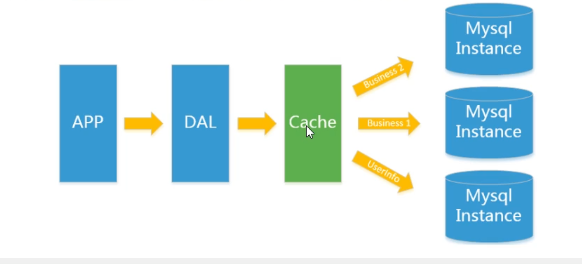


随着访问量的上升，几乎大部分使用MySQL架构的网站在数据库上都开始出现了性能问题，Web程序不再仅仅关注在功能上，同时也在追求性能，程序员们开始大量的使用缓存技术来缓解数据库的压力，优化数据库的结构和索引。开始比较流行的是通过文件缓存来缓解数据库压力，当时当访问量过大的时候，多态WEB机器通过文件缓存，大量的小文件缓存也带了比较高的==IO==压力。在这个时候，``Memcached``就自然成为了一个非常时尚的技术产品。


3. MySQL主从读写分离

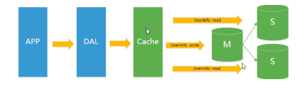

由于数据库的写入压力增加，Memcached只能缓解数据库的读写压力。读写集中在一个数据库上让数据库不堪重负，大部分网站开始使用主从复制技术来达到读写分离，以提高读写性能和读库的可扩展性。MySQL的master-slave模式成为这时候的网站标配


4. 分库分表 + 水平拆分 + MySQL集群

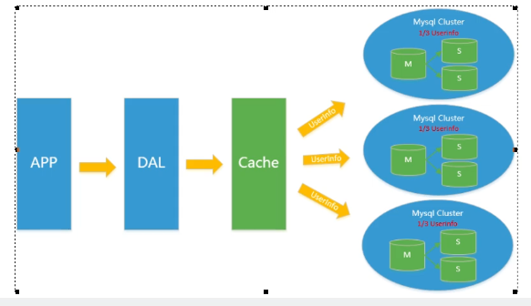

 

在Memcached的高速缓存，MySQL的主从复制，读写分离的基础之上，这是MySQL主库的写压力开始出现瓶颈，而数据量的持续猛增，由于MyISAM使用表锁，在高并发下会出现严重的锁问题，大量的高并发MySQL应用开始使用InnoDB引擎代替MyISAM。同时，开始流行使用分表来缓解压力和数据增长的扩展问题。这个时候，分表分库成了一个热门技术，是面试的热门问题也是业界讨论的热门技术问题。也就是在这个时候，MySQL推出了还不太稳定的表分区，这也给技术实力一般的公司带来了希望。虽然MySQL推出了MySQL Cluster集群，但是性能也不能很好满足互联网的要求，只是在高可靠性上提供了非常大的保证。


> MySQL的扩展性瓶颈

 MySQL数据库也经常存储一些大文本字段，导致数据库表非常的大，在做数据库回复的时候就导致非常的慢，不容易快速恢复数据库，比如1000万4KB大小的文本就接近40GB的大小，如果能把这些数据从MySQL中省去，MySQL将变得非常小，关系型数据库很强大，但是他不能很好地应付所有的应用场景。MySQL的扩展性差，大数据下IO压力大，表结构更改困难，正是当前使用MySQL的开发人员面临的问题


## 1.2、什么是NoSQL

> 简介


 ==NoSQL（not only SQL），意为“不仅仅是SQL。泛指非关系型的数据库。==随着互联网WEB2.0网站的兴起，传统的关系数据库在应付WEB2.0网站， 特别是超大规模和高并发的SNS类型的WEB2.0纯动态网站已经显得力不从心。


NoSQL数据库的产生就是为了解决大规模数据集合多重数据种类带来的挑战，尤其是大数据应用 难题，包括超大规模数据的存储。==这些类型的数据不需要固定的模式，无需多余的操作就可以横向扩展。(是什么、能干嘛、去哪下、怎么玩)==


## 1.3、NoSQL的优点

> 易扩展

NoSQL数据库种类繁多，但是有一个共同的特点都是去掉关系数据库的关系型特性，数据之间无关系，容易扩展。


> 大数据量高性能

NoSQL数据库都具有非常高的读写性能，尤其在大数据量下，同样表现优秀。这得益于它的无关性，数据库的结构简单


> 多样灵活的数据模型

NoSQL无需事先为要存储的数据建立字段，随时可以存储自定义的数据格式。而是在关系数据库里，增删字段是一件非常麻烦的事情。


> 传统RDBMNS ==VS== NoSQL

- RDBMNS：高度结构组织化数据、结构化查询语言、严格的一致性、基础事务、`CAID`定理

- NoSQL：不仅仅是SQL、没有声明性查询语言、没有预定义模式、`CAP`定理、键-值对存储


## 1.4、互联网时代的“3V”和“3高”

> 简介

- 大数据时代的3V：海量Volume、多样Variety、实时Velocity

- 互联网需求的3高：高并发、高可扩、高性能


## 1.5、NoSQL数据库理论

- NoSQL的应用场景

- NoSQL的数据模型

- NoSQL数据库的四大分类
- 分布式数据库CAP原理
- BASE理论
- 分布式系统和集群


### 1.5.1、NoSQL的应用场景

==阿里巴巴中文站架构发展历程：==

√	1999年，第一代网络架构：Perl、CGI、Oracle
√	2000年，Java、Servlet
√	2001-2004年，EJB（SLSB、CMP、MDB）
√	2005-2007 重构EJB，换成Spring+iBatis + Webx、Antx，底层架构：iSearch，MQ+ESB，数据挖掘，CMS
√	2008-2009 Memcached集群，MySQL + 数据切分 = Cobar，分布式存储，Hadoop，KV、CDN


### 1.5.2、NoSQL的数据模型

> 简介

以一个电商客户、订单、订购、地址模型来对比下关系型数据库和非关系型数据库聚合模型。     NoSQL使用BSON（Binary JSON：是一种类JSON的一种二进制形式的存储格式，和JSON一样，支持内嵌的文档对象和数组对象）画出构建的数据模型

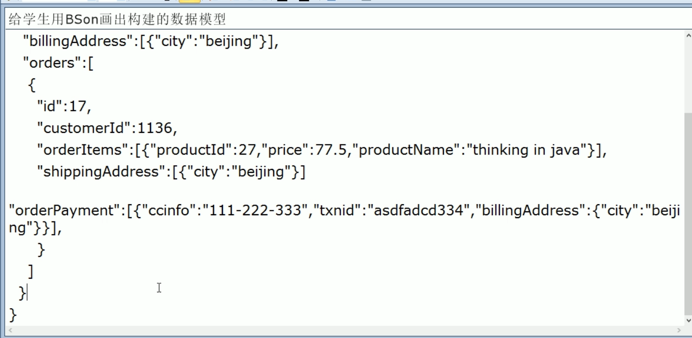


> 聚合模型

1. K-V 键值对
2. BSON
3. 列族：顾名思义，是按列存储数据的。最大的特点是方便存储结构话和半结构化数据，方便做数据压缩，针对某一列或者某几列的查询有非常的大的IO优势
4. 图形


### 1.5.3、NoSQL数据库的四大分类

> K-V 键值对（查找速度快）

- 新浪：BerkeleyDB + Redis

- 美团：Redis + Tair

- 阿里、百度：Memcache + Redis


> 文档型数据库（BSON比较多，数据结构要求不严谨，表结构可变）

- CouchDB

- MongoDB：是一个基于分布式文件存储的数据库，由C++语言编写，旨在为WEB应用提供可扩展的高性能数据存储解决方案，它还是一个介于关系型数据库和非关系型数据库之间的产品，是非关系型数据库中功能最丰富且最像关系型数据库的


> 列存储数据库（查找速度快，可扩展性强）

- Cassandra、HBase

- 分布式文件系统


> 图关系数据库（利用图结构算法）

- 社交网络，推荐系统等。专注于构建关系图谱

- Neo4J、InfoGrid


### 1.5.4、分布式数据库CAP原理

1. 传统的ACID原理

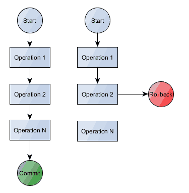

`A（Atomicity）原子性`：**原子性很容易理解，也就是说事务里的所有操作要么全部做完，要么都不做**

`C（Consistency）一致性`：**数据库要一直处于一致的状态，事务的运行不会改变数据库原本的一致性约束**

`I（Isolation）独立性`：**并发的事务之间不会互相干扰**

`D（Durability）持久性`：**一旦事务提交后，它所做的修改将会永久的保存在数据库中，即使出现宕机也不会丢失**


2. CAP理论

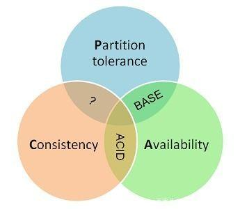

总共有C（Consistency）、强一致性、A（Availability）可用性和P（Partition tolereance）分区容错性这三个特性

> 理论核心

当一个分布式系统出现故障时，不能同时满足这三个需求，那么只能同时满足两个需求。

**CA：传统Oracle数据库**

AP：大多数网站架构的选择

CP：Redis、MongoDB


### 1.5.5、BASE理论

就是为了解决关系数据库强一致性引起的可用性降低的问题的解决方案。

它的思想是通过让系统放松对某一时刻数据一致性的要求来换取系统整体伸缩性和性能上改观。为什么这么说？因为大型系统往往由于地域分布和极高性能的要求，不可能采用分布式事务来完成这些指标，要想获得这些指标，我们必须采用另外一种方法来完成，

这里BASE就是解决问题的方法BASE：

（Basically Available）基本可用

（Soft state）软状态

（Eventually consistent）最终一致


### 1.5.6、分布式系统和集群

> 简介

 **分布式系统（Distributed System）**是由多台计算机和通信的软件组件通过计算机网络连接（本地网或局域网）组成。分布式系统是建立在网络之上的软件系统。正是因为软件的特性，所以分布式系统具有高度的内聚性和透明性。因此，网络和分布式系统之间的区别更多的在于高层软件，而不是硬件。分布式系统可以应用在PC、工作站、局域网和广域网上等。

- 分布式

  不同的多台服务器上面部署不同的模块，他们之间通过RPC/RMI通信和调用，对外提供服务和组内协调

- 集群

  不同的多台服务器上面部署相同的服务模块，通过分布式调度软件进行统一的调度，对外提供服务和访问。


# 二、Redis数据库入门

- Redis是什么
- Redis的特点
- 下载和安装Redis
- Redis的Helloworld
- Redis基础知识讲解
- 五大数据类型


## 2.1、Redis是什么

> 简介

**Redis（Remote Dictionary Server 远程字典服务器）是一个完全开源免费、用C语言编写和遵守BSD协议的高性能（Key/Value）分布式内存数据库。它基于内存运行并支持持久化的NoSQL数据库，是当前最热门的NoSQL数据库之一，同时也被人们称为==数据结构服务器==。**

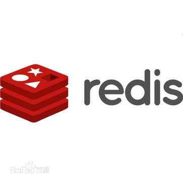


## 2.2、Redis的特点

- 支持数据的持久化：Redis支持异步将内存中的数据写入到磁盘中，同时不影响服务

- 提供list、set、zset、hash等数据结构的存储

 * 支持master-slave模式的数据备份


## 2.3、下载和安装Redis

- Windows下安装
- Linux下安装

- Linux常用命令
- Linux的目录结构


原版网站：http://redis.io/

中文网站：http://www.redis.cn/Redis

安装教程：https://www.runoob.com/redis/redis-install.html


### 2.3.1、Windows下安装

> 下载

下载地址：http://github.com/dmajkic/redis/downloadshttps://github.com/tporadowski/redis/releases

下载的Redis支持32位或64位系统。根据系统实际情况选择


> 安装

将64bit的内容拷贝到安装目录下，打开CMD窗口，使用CD命令切换到安装目录下，

运行命令：`redis-server.exe redis.windows.conf`。


> 试运行

把Redis的路径放到系统path环境变量下。这时候再开一个CMD窗口，切换到Redis目录下运行命令：

```shell
redis-cli.exe -h 127.0.0.1 -p 6379
# 设置键值对 
$ set myKey abc
# 取出键值对 
$ get myKey
```


### 2.3.2、Linux下安装

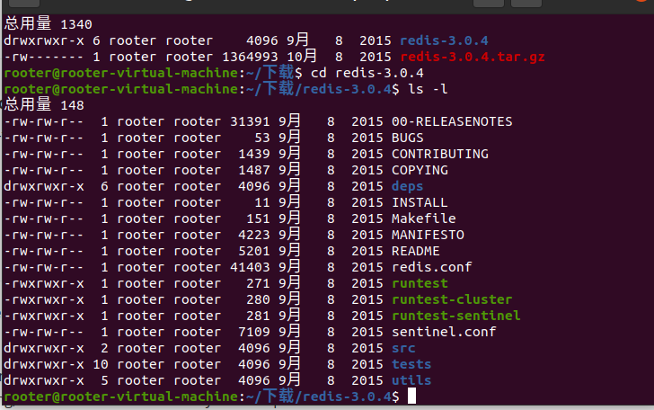

> 下载

官网下载最新版本的redis的tar.gz后缀的压缩文件，下载 完成后解压.gz格式的压缩文件

``` shell
# 解压命令：
$ tar -zxvf redis-3.0.4.tar.gz
```

> 安装

- 解压之后会出现redis-3.0.4目录，使用copy命令备份一份并放入我们指定的Linux目录：/opt
- 再进入目录： `cd redis-3.0.4`  并执行`make`命令

- 如果没有make命令，则：

```shell
$ sudo apt-get update
$ sudo apt-get install make

# 或者
$ yum install gcc-c++
```

- make命令完成后继续执行`make install`
- 查看默认安装目录：usr/local/bin
- 启动、helloworld，关闭


### 2.3.3、Linux常用命令

> 命令

- wget 下载外网的东西
- cd 目录名    转到目录
- ls -l     查看当前目录所有文件
- clear    清屏


> 以下是一些 Dpkg 的普通用法：

1. dpkg -i <package.deb>
   安装一个 Debian 软件包，如你手动下载的文件。
2. dpkg -c <package.deb>
   列出 <package.deb> 的内容。
3. dpkg -I <package.deb>
   从 <package.deb> 中提取包裹信息。
4. dpkg -r <package>
   移除一个已安装的包裹。
5. dpkg -P <package>
   完全清除一个已安装的包裹。和 remove 不同的是，remove 只是删掉数据和可执行文件，purge 另外还删除所有的配制文件。
6. dpkg -L <package>
   列出 <package> 安装的所有文件清单。同时请看 dpkg -c 来检查一个 .deb 文件的内容。
7. dpkg -s <package>
   显示已安装包裹的信息。同时请看 apt-cache 显示 Debian 存档中的包裹信息，以及 dpkg -I 来显示从一个 .deb 文件中提取的包裹信息。
8. dpkg-reconfigure <package>
   重新配制一个已经安装的包裹，如果它使用的是 debconf (debconf 为包裹安装提供了一个统一的配制界面)。
   ps -ef|grep redis


### 2.3.4、Linux的目录结构

/etc：所有的系统管理所需要的配置文件和子目录

/home：存放普通用户的主目录，在Linux中每个用户都有一个自己的目录，一般该目录名是以用户的账号命名的

/lib：系统开机所需要最基本的动态链接共享库，其作用类似于windowOS里面的DLL文件。

/lost + found：这个目录一般情况下是空的，当系统非正常关机后，这里会存储文件

/media：Linux系统会自动识别一些设备，例如U盘和光驱，当识别后会将其挂载到这个目录下

/mnt：系统提供该目录是为了让用户临时挂载别的文件系统，我们可以将光驱挂载在/mnt上

/opt：这是给主机额外安装软件所摆放的目录。比如你安装一个Oracle数据库就可以放到这个目录下

/proc：这是一个虚拟目录，它是系统内存的映射，我们可以通过直接访问这个目录来获取系统信息

/root：该目录为系统管理员，也称作超级权限者用户主目录

/sbin:

/selinux:

/srv:

/sys: 系统目录

/tmp: 临时目录

/usr: 用户目录

/var:


## 2.4、Redis的Helloworld

1. Windows下的helloworld

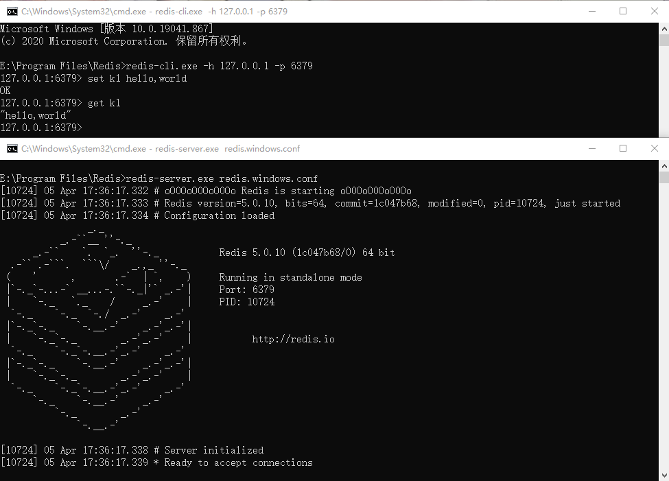


2. Ubuntu界面下的helloworld

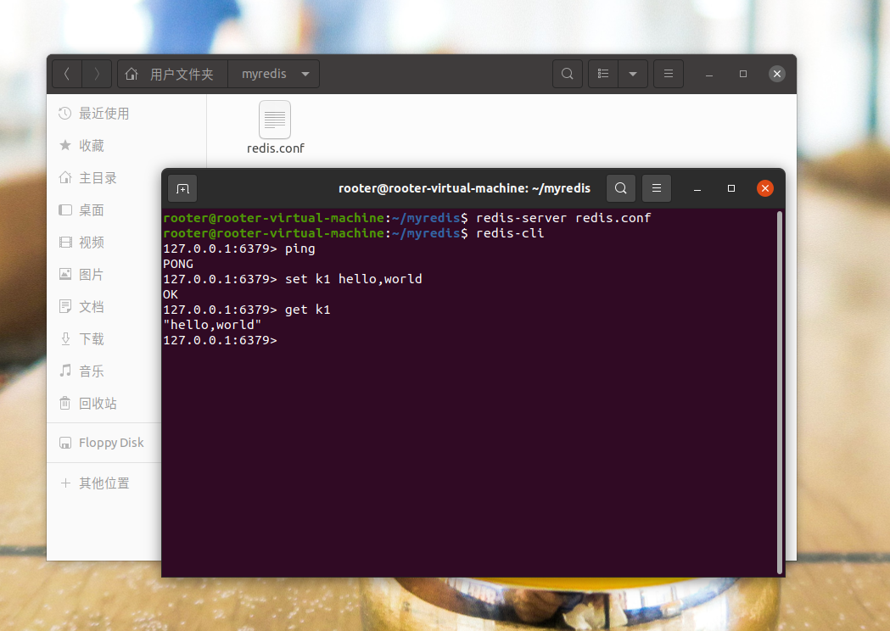


## 2.5、Redis基础知识讲解

> 单进程

==单进程模型来处理客户端的请求，对读写等事件的响应是通过对epoll函数的包装来做到的==。Redis的实际处理速度完全依靠主进程的执行效率。

Epoll是Linux内核为处理大批量文件描述符而做了改进epoll，是Linux下多路复用IO接口select/poll的增强版本，它能显著提高程序在大量并发连接中只有少量活跃的情况下的系统CPU利用率


> 默认16个数据库       

 像数组一样下标从零开始，初始默认零号库

`select`命令切换数据库
`Dbsize`查看当前数据的key数量
`Flushdb`：清空当前库
`Flushall`：通杀全部库


> 统一密码管理，

16个库都是一样的密码，要么都连得上，要么一个也连不上


> 其他基础知识

Redis索引默认从零开始
为什么默认端口是6379：MERZ
常用命令可以用Tab自动补全大写


> Tips:
>
> - redis-banchmark
> - redis-check-aof
> - redis-cli
> - redis-sentinel
> - redis-server
>
> ```shell
> ====== SET ======
>   10000 requests completed in 0.10 seconds
>   50 parallel clients
>   3 bytes payload
>   keep alive: 1
> 
> 
> 97.80% <= 1 milliseconds
> 99.01% <= 2 milliseconds
> 100.00% <= 2 milliseconds
> 95238.10 requests per second
> 
> 
> ====== GET ======
>   10000 requests completed in 0.10 seconds
>   50 parallel clients
>   3 bytes payload
>   keep alive: 1
> 
> 
> 98.39% <= 1 milliseconds
> 100.00% <= 1 milliseconds
> 102040.82 requests per second
> ```


## 2.6、五大数据类型

- String（字符串）
- Hash（哈希）
- List（列表）
- Set（集合）
- zSet(sorted set：有序集合)


### 2.6.1、String（字符串）

> 简介

**String 是 Redis 最基本的类型，你可以理解成与 Memcached 一模一样的类型，一个 key 对应一个 value。**String 类型是*二进制安全*的。意思是 Redis 的 String 可以包含任何数据。比如==.jpg图片==或者==序列化的对象==。String 类型是 Redis 最基本的数据类型，String 类型的值最大能存储 512MB。


> Key常用命令

`keys * `：选择当前库中所有key
`keys k?`： 通配当前库所有k开头的key
`move key db`：把键移到指定的数据库
`exists key`：判断某个 键是否存在
`expire key second`：为给定的key设置过期时间
`ttl key`：查看过期时间，-1表示永不过期，-2表示已过期
`type key`：查看key是什么 
`del key`：删除key
`dump key`：序列化给定key，并返回被序列化的值

`flushdb`: 清空当前数据库中的所有 key

`flushall`: 清空整个 Redis 服务器的数据(删除所有数据库的所有 key )

> String常用命令

`set / get / del / append / strlen` ：这些是基础操作 

==设置键值对 / 获取键值对 / 删除键值对 / 附加字符到指定的键值对中 / 获取字符串的长度==

`incr / decr / incrby / decrby` ：键值对一定要是数字才能进行加减操作

==当前键值对+1 / 当前键值对-1 / 和某个键值对相加 / 和某个键值对相减==

`getrange / setrange` ：==获取指定区间内的值 / 设置指定区间内的值==

`setex(set with expire)键秒值 / setnx(set if not exist)`：

==设置键值对时同时设置过期时间 / 设置键值对时查看是否已存在，如果存在就不做设置==

`mset / mget / msetnx`：==在获取或设置key做批处理操作，批量设置 / 获取 / 查看是否已存在，如果存在就不做设置==
`getset` ： ==设置之后同时获取该键的值==


### 2.6.2、Hash（哈希）

> 简介

- Redis hash 是一个键值(key=>value)对集合。

- Redis hash 是一个 String 类型的 field 和 value 的映射表，Hash 特别适合用于存储对象。


> 示例

```shell
127.0.0.1:6379> hset user id 11
(integer) 1
127.0.0.1:6379> hget user id
"11"
127.0.0.1:6379> hset user name z3
(integer) 1
127.0.0.1:6379> hget user name
"z3"
127.0.0.1:6379> hget user id
"11"
127.0.0.1:6379> HMSET customer id 01 name 李四  age 26
(error) ERR wrong number of arguments for HMSET
127.0.0.1:6379> HMSET customer id 01 name 李四 age 26
OK
```


> Hash常用命令：KV模式不变，但V是一个键值对

`hset / hget / hmset / hmget / hgetall / hdel`：HMSET customer id 01 name 李四 age 26

==设置哈希键值对 / 获取哈希键值对 / 获取多个哈希键值对 / 获取所有的哈希键值对 / 删除哈希键值对==

`hlen`：==返回value的数量==

`hexists key`：==判断某个key是否存在==
`hkeys / hvals`：==批量获取key / value==
`hincrby / hincrbyfloat`：数字才可以加减

==value的值加上指定的key的value值 / value增加浮点数==

`hsetnx`：如果不存在就设置键值对


### 2.6.3、List（列表）

> 简介

Redis中的列表是一种简单的字符串列表，按照插入顺序进行排序。你可以添加一个元素到列表的头部（左边）或者尾部（右边）。


> List常用命令

`lpush listName 1 2 3 4 5`：==放置列表，值为1,2,3,4,5==
`lrange listName 0 -1`：==正序输出列表中的所有元素，从第一个到最后一个==
`lpush（反序）/rpush（正序）/lrange`：

==从左边开始放置元素 / 从右边开始放置元素 / 输出列表中元素==

`lpop/rpop listName `：==正序/反序删除元素==
`lindex listName index`：==按照索引下标获取元素（从零开始）==
`llen mylist`：==返回列表的元素个数==
`lrem n value`：==删除n个等于value的元素==
`ltrim begin end`：==截取begin到end下标范围的值后再赋值给key==
`rpoplpush listName01 listName02`：==移除一个元素到目的列表==
`lset key index value`：==设置列表中某个下标的值为value==
`linsert key before/after value1 value2`：==在列表中的某个值之前 / 之后插入值==


[^总结]: 它是一个字符串链表，Left、Right都可以插入添加。如果键不存在，创建新的链表；如果键已存在，新增内容，如果值全部移除，对应的键也就消失了。链表的操作无论是头和尾效率都极高，但如果是对中间元素进行操作，效率就很差


### 2.6.4、Set（集合）

> 简介

Redis 的 Set 是 String 类型的无序集合。集合是通过哈希表实现的。

所以添加，删除，查找的复杂度都可以达到 O(1) 的时间复杂度。


> Set常用命令

`sadd / smembers / sismember`：==添加元素 / 显示集合所有元素 / 判断某个元素是否为集合元素==
`scard`：==获取集合里面的元素个数==
`srem key value`：==删除集合中元素==
`srandmember key`： ==在集合中随机选取几个数==
`spop key`：==随机出栈一个数==
`smove key1 key2`： ==将key1的某个值赋值给key2==
数学集合类
`sdiff`：==差集，合并两个集合不同的元素==
`sinter`：==交集，合并两个集合相同的元素==
`sunion`：==并集，合并两个集合所有的元素==


### 2.6.5、zSet(sorted set：有序集合)

> 简介

Redis的 zSet 和 Set 一样也是String类型元素的集合,且不允许重复的成员。不同的是每个元素都会关联一个double类型的分数。

Redis正是通过分数来为集合中的成员进行从小到大的排序。zSet的成员是唯一的,但分数(score)却可以重复。zadd 命令：添加元素到集合，元素在集合中存在则更新对应score


> zSet常用命令：
>
> （withscores：包含分数，“（”：不包含，limit：返回限制 limit 2,2，开始下标2，获取两个数）
>
> 在set基础上，加一个score值。之前set是k1,v1 v2 v3，现在zset是k1 score1 v1 score2 v2

`zadd / zrange`： 

==添加元素/ zrange zset01 0 -1 顺序显示元素 / zrange zset01 0 -1 withscores 显示元素包括分数==
`zrangebyscore key`：开始score，结束score 

==zrangebyscore zset01 (60 (90 withscores 排序元素通过分数==
==zrangebyscore zset01 60 90 limit 2 2== 

`zrem key`：==某score下对应的value值，作用是删除元素（remove）==
`zcard / zcount key score区间 / zrank key values值，/ zscore key 对应值`，

==获取集合元素个数 / 统计某个分数区间的元素个数 / 作用是获得对应键的下标值 / 获得对应键的分数==

`zrevrank key values值`：==作用是获得对应键的逆序下标值（reverse：反转）==
`zrevrange`：==逆序输出元素==
`zrevrangebyscore key key`：==结束score 开始score，倒过来显示，逆序照分数排列元素==


# 三、Redis配置

- Redis的配置文件详解
- 常见配置介绍

## 3.1、Redis的配置文件详解

> Units（单位）

```shell
# Redis configuration file example.
#
# Note that in order to read the configuration file, Redis must be
# started with the file path as first argument:
#
# ./redis-server /path/to/redis.conf

# Note on units: when memory size is needed, it is possible to specify
# it in the usual form of 1k 5GB 4M and so forth:
#
# 1k => 1000 bytes
# 1kb => 1024 bytes
# 1m => 1000000 bytes
# 1mb => 1024*1024 bytes
# 1g => 1000000000 bytes
# 1gb => 1024*1024*1024 bytes
#
# units are case insensitive so 1GB 1Gb 1gB are all the same.
```

配置大小单位，开头定义了一些基本的度量单位，支持bytes，不支持bit大小写不敏感


> Includes（包含）

和Structs2配置文件类似，可以通过includes包含，redis.conf可以作为总闸


> General（通用）

```shell
# Accept connections on the specified port, default is 6379 (IANA #815344).
# If port 0 is specified Redis will not listen on a TCP socket.
port 6379
# By default Redis does not run as a daemon. Use 'yes' if you need it.
# Note that Redis will write a pid file in /var/run/redis.pid when daemonized.
# When Redis is supervised by upstart or systemd, this parameter has no impact.
daemonize no
# In high requests-per-second environments you need a high backlog in order
# to avoid slow clients connection issues. Note that the Linux kernel
# will silently truncate it to the value of /proc/sys/net/core/somaxconn so
# make sure to raise both the value of somaxconn and tcp_max_syn_backlog
# in order to get the desired effect.
tcp-backlog 511

# 设置tcp的backlog，backlog其实是一个连接队列，backlog队列总和=未完成三次握手队列+已经完成三次握手队列，在高并# 发环境下你需要一个高backlog值来避免慢客户端连接问题，注意Linux内核会将这个值减小，所以需要确认增大somaxconn # 和tcp_max_syn_backlog两个值，来达到想要的效果


tcp-keepalive 300

# 单位为秒，如果设置为0，则不会进行keepalive检查，建议设置成60


timeout 0
# Specify the server verbosity level.
# This can be one of:
# debug (a lot of information, useful for development/testing)
# verbose (many rarely useful info, but not a mess like the debug level)
# notice (moderately verbose, what you want in production probably)
# warning (only very important / critical messages are logged)
loglevel notice
# syslog-ident redis 指定日志标识
# syslog-enabled no 是否把日志输出到syslog中
# syslog-facility local0 指定syslog设备，值可以是USER或者LOCAL0-LOCAL7
# Set the number of databases. The default database is DB 0, you can select
# a different one on a per-connection basis using SELECT <dbid> where
# dbid is a number between 0 and 'databases'-1
databases 16

```


> Snapshotting（快照）


> Replication（复制）


> Security（安全）

```shell
config get requirepass
auth 123456
# Note that you must specify a directory here, not a file name.
dir ./
"/home/rooter/redis"：redis的启动目录
```


> Limits（限制）

```shell
# maxclients 10000
# maxmemory <bytes>
# Redis 过期策略
$ noeviction：当内存使用超过配置的时候会返回错误，不会驱逐任何键
$ allkeys-lru：加入键的时候，如果过限，首先通过LRU算法驱逐最久没有使用的键
$ volatile-lru：加入键的时候如果过限，首先从设置了过期时间的键集合中驱逐最久没有使用的键
$ allkeys-random：加入键的时候如果过限，从所有key随机删除
$ volatile-random：加入键的时候如果过限，从过期键的集合中随机驱逐
$ volatile-ttl：从配置了过期时间的键中驱逐马上就要过期的键
$ volatile-lfu：从所有配置了过期时间的键中驱逐使用频率最少的键
$ allkeys-lfu：从所有键中驱逐使用频率最少的键
$ LRU(Least Recently Used)：最近最少使用


# maxmemory-samples 5

$ 设置样本数量，LRU算法和最小TTL算法都并非是精确的算法，而是估算值，所以你可以设置样本的大小，redis默认会检查 $ 多个key，并选择其中LRU的那个


# maxmemory-samples
（8）Append Only Mode（追加）
```


## 3.2、常见配置介绍

> 参数说明

1、Redis默认不是以守护线程的方式运行，可以通过该配置项修改，使用yes启动守护线程
`daemonize no`
2、当Redis以守护线程方式运行时，Redis默认会把pid写入/var/run/redis.pid文件，可以通过pidfile指定
`pidfile /var/run/redis.pid`
3、指定Redis监听端口，默认端口为6379，作者在自己的一篇博文中解释了为什么设置这个默认端口
`port 6379`
4、默认绑定的主机地址
`bind 127.0.0.1`
5、当客户端闲置多长时间后关闭连接，如果指定为0，表示关闭该功能
`timeout 0`


6、指定日志级别，Redis总共支持4个级别，debug、verbose、notice、warning，默认为notice
`loglevel notice`
7、日志记录方式，默认为标准输出，如果配置Redis为守护进程方式，而这里又配置为日志记录方式为标准输出，则日志将会发送给/dev/null
`logfile stdout`
8、设置数据库的数量，默认数据库为0，可以使用select <dbid>命令在连接上指定数据库id
`database 16`
9、指定在多长时间内，有多少次更新操作，就将数据同步到数据文件，可以多个条件配合
`save<seconds><changes>`
Redis默认配置文件中提供了三个条件
`save 900 1`
`save 300 10`
`save 60 10000`
分别表示900秒内有一次更新，300秒内有10个更新以及60秒内有10000个更新
10、指定存储至本地数据库时是否压缩数据，默认为yes，Redis采用LZF压缩，如果为了节省CPU时间，可以关闭该选项，但会导致数据库文件变得巨大
`rdbcomression yes`


11、指定本地数据库文件名，默认为`dump.rdb`
12、指定本地数据库存储目录
`dir ./`
13、设置当本机为slav服务时，设置master服务的IP地址及端口，在Redis启动时，它会自动从master进行数据同步
`salveof <masterip> <masterport>`
14、当master服务设置了密码保护时，slav服务连接master的密码
`masterauth <master-password>`
15、设置Redis的连接密码，如果配置了密码，客户端在连接Redis时需要通过auth <password>命令提供密码，默认关闭
`requirepass foobared`


16、设置同一时间最大客户端连接数，默认无限制，Redis可以同时打开的客户端连接数为Redis进程可以打开的最大文件描述符数，如果设置maxclients 0，表示不作限制。当客户端连接数达到限制时，Redis会关闭新的连接并向客户端返回max number of clients reached错误信息
`maxclients 128`
17、指定Redis最大内存限制，Redis在启动时会把数据加载到内存中，达到最大内存后，Redis会先尝试清除已到期或即将到期的key，当此方法处理后，仍然到达最大内存设置，将无法在进行写入操作，但仍然可以进行读取操作，Redis新的vm机制，会把key放在内存中，value会放在swap区
`maxmemory <bytes>`
18、指定是否每次在更新操作后进行日志记录，Redis在默认情况下是异步的把数据写入磁盘中，如果不开启，可能会在断电导致一段时间内的数据丢失。因为Redis本身同步数据文件是按上面save的条件来同步的，所以有的数据会在一段时间内只存在于内存中，默认为no
`appendonly no`
19、指定更新日志文件名，默认为Appendonly.aof
`appendfilename appendonly.aof`
20、指定更新文件，共有三个选项可选
`no`：表示等操作系统进行数据缓存同步到磁盘块
`always`：表示每次更新操作后手动调用fsync()将数据写入磁盘中（慢，安全）
`everysec`：表示每秒同步一次
`appendfsync everysec`


21、指定是否启用虚拟内存机制，默认值为no，简单介绍一下，vm机制将数据分页，由Redis将访问量较少的页即冷数据swap到磁盘上，访问量多的页面由磁盘自动换出到内存中
`vm-enabledno`
22、虚拟内存文件路径，默认值为/tmp/redis.swap，不可多个Redis实例共享
`vm-swap-file /tmp/redis.swap`
23、将所有大于vm-max-memory的数据存入虚拟内存，无论vm-max-mmemory设置多小，所有索引数据都是内存存储的（Redis的索引数据就是keys），也就是说，当vm-max-memory设置为0的时候，其实是所有value都存在与磁盘，默认值为0
`vm-max-mmemory 0`
24、Redis swap文件分成了很多的page，一个对象可以保存在多个page上，但一个page不能被多个页面共享，vm-page-size是要根据存储的数据大小来设定的，作者建议如果存储很多小对象，page大小最好设置为32或者64bytes；如果存储很大对象，则可以使用更大的page，如果不确定就使用默认值
`vm-page-size 32`
25、设置swap文件中的page数量，由于页表是放在内存中的，在磁盘上每8个pages将消耗1byte的内存
`vm-pages 134217728`


26、设置访问swap文件的线程数，最好不好超过机器的核数，如果设置为0，那么所有对swap文件的操作都是串行的，可能会造成比较长时间的延迟，默认值为4
`vm-max-threads 4`
27、设置在向客户端应答时，是否将一个较小的包合并为一个包发送，默认为开启
`glueoutputbuf yes`
28、指定在超过一定数量的元素或者最大的元素超过某一临界点时，采用一种特殊的哈希算法
`hash-max-zipmap-entries 64`
`hash-max-zipmap-value 512`
29、指定是否激活重置哈希，默认为开启
`activerehashing yes`
30、指定包含其他的配置文件，可以在同一台主机上多个Redis实例之间采用同一份配置文件，而同时各个实例又拥有自己的特定配置文件
`include /path/to/local/conf`


> Tips

```shell
$ bind 127.0.0.1 # 注释掉
$ protected-mode yes # 改成 no
$ # windows指定端口和ip
$ redis-cli.exe -p 6379 -h 192.168.23.22
$ # linux指定端口
$ ./redis-cli -p # 端口号
$ redis-server --port 6379 --host 192.168.23.22
```


# 四、Redis的发布和订阅

- 什么是发布和订阅
- 发布和订阅命令行实现


## 4.1、什么是发布和订阅

Redis发布订阅（pub/sub）是一种消息通信模式：发送者（pub）发送消息，订阅者（sub）接收消息Redis客户端可以订阅任意数量的频道


当有新消息通过 PUBLISH 命令发送给频道 channel1 时， 这个消息就会被发送给订阅它的三个客户端：


## 4.2、发布和订阅命令行实现

1. 打开一个客户端订阅channel1：`SUBSCRIBE channel1`

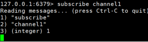


2. 打开另一个客户端，给channel1发布消息hello：`publish channel1 hello`

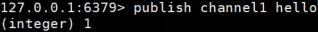


3. 打开第一个客户端可以看到发送的消息

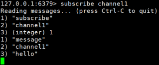


[^注]: 发布的消息没有持久化，如果在订阅的客户端收不到hello，只能收到订阅后发布的消息

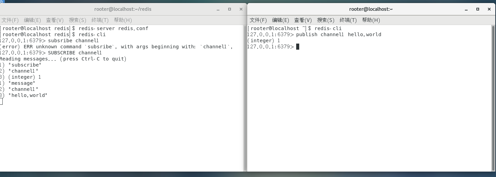


# 五、其他数据类型

- Bitmaps（位图）
- HyperLogLog（超数）


## 5.1、Bitmaps（位图）

> 简介

现代计算机用二进制（位） 作为信息的基础单位， 1个字节等于8位， 例如“abc”字符串是由3个字节组成， 但实际在计算机存储时将其用二进制表示， “abc”分别对应的ASCII码分别是97、 98、 99， 对应的二进制分别是01100001、 01100010和01100011，如下图

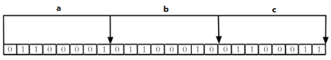

合理地使用操作位能够有效地提高内存使用率和开发效率。Redis提供了Bitmaps这个“数据类型”可以实现对位的操作：

1. Bitmaps本身不是一种数据类型， 实际上它就是字符串（key-value） ， 但是它可以对字符串的位进行操作。

2. Bitmaps单独提供了一套命令， 所以在Redis中使用Bitmaps和使用字符串的方法不太相同。 可以把Bitmaps想象成一个以位为单位的数组， 数组的每个单元只能存储0和1， 数组的下标在Bitmaps中叫做偏移量。

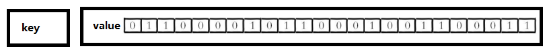


> Bitmaps命令

`setbit`：==格式setbit<key><offset><value>设置Bitmaps中某个偏移量的值（0或1）==

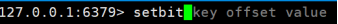

*offset:偏移量从0开始


```实例```

每个独立用户是否访问过网站存放在Bitmaps中， 将访问的用户记做1， 没有访问的用户记做0， 用偏移量作为用户的id。设置键的第offset个位的值（从0算起） ， 假设现在有20个用户，userid=1， 6， 11， 15， 19的用户对网站进行了访问， 那么当前Bitmaps初始化结果如图

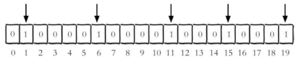

unique:users:20201106代表2020-11-06这天的独立访问用户的Bitmaps

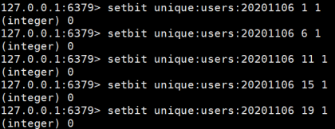


[^注]: 很多应用的用户id以一个指定数字（例如10000） 开头， 直接将用户id和Bitmaps的偏移量对应势必会造成一定的浪费， 通常的做法是每次做setbit操作时将用户id减去这个指定数字。在第一次初始化Bitmaps时， 假如偏移量非常大， 那么整个初始化过程执行会比较慢， 可能会造成Redis的阻塞。

`getbit`：==getbit<key><offset>获取Bitmaps中某个偏移量的值==

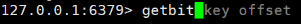

获取键的第offset位的值（从0开始算）

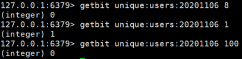

```实例```

获取id=8的用户是否在2020-11-06这天访问过， 返回0说明没有访问过：

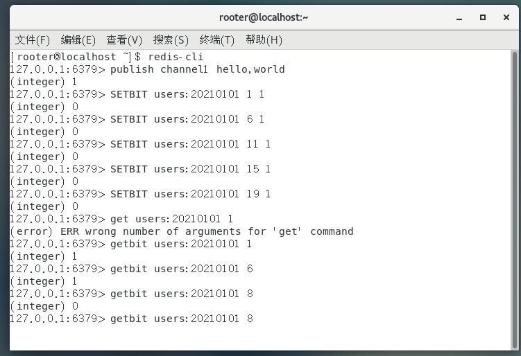


## 5.2、HyperLogLog（超数）

> 简介

在工作当中，我们经常会遇到与统计相关的功能需求，比如统计网站PV（PageView页面访问量）,可以使用Redis的incr、incrby轻松实现。但像UV（UniqueVisitor，独立访客）、独立IP数、搜索记录数等需要去重和计数的问题如何解决？这种求集合中不重复元素个数的问题称为基数问题。
