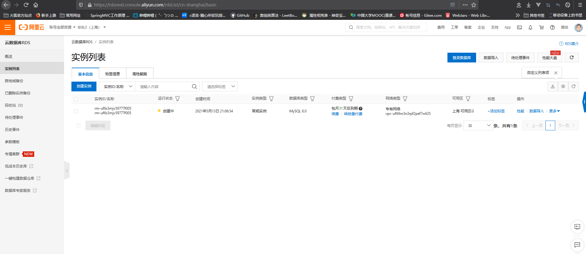
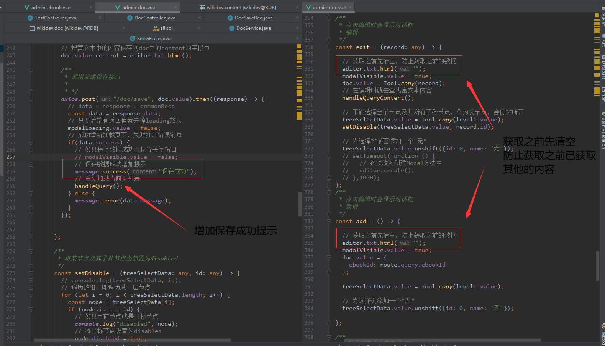
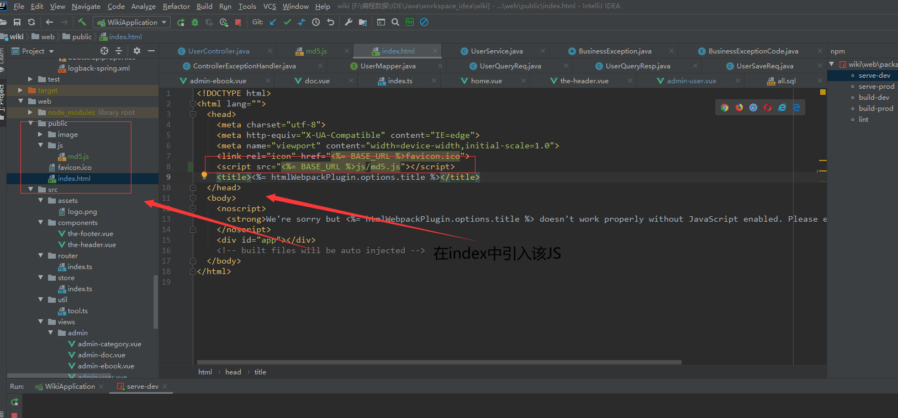
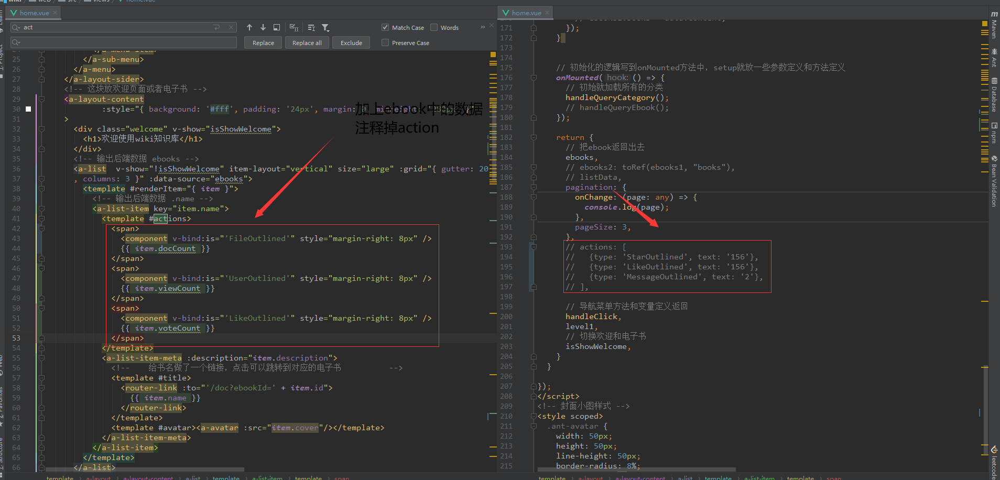

# Spring Boot + Vue3 前后端分离wiki知识库系统

> 一个界面简约、功能完整的知识库项目，让你快速掌握 ==Spring Boot核心知识== + **Vue全家桶** 全栈技能。在此过程中，打造一套通用的组件工具（可应用于其他项目），掌握前后端分离开发模式，搭建一个专属自己的、内容可灵活配置的知识库系统。

[TOC]

# 第一章、Spring Boot项目框架搭建

- 创建Spring Boot项目的方法

- Spring Boot项目基础配置

- 关联远程Git仓库

- Spring Boot启动日志优化

- 开发Hello,world接口

- application配置文件详解

- 集成热部署

  

## 1.1、创建Spring Boot项目的方法

1. Spring官网的Spring Initializr
2. IDEA自带的Spring Initializr


### 1.1.1、Spring官网的Spring Initializr

**Spring** 官网的Spring官网的[Spring Initializr](https://start.spring.io/)设置参数并且下载用IDE打开


### 1.1.2、IDEA自带的Spring Initializr

直接使用 **IDEA** 自带的Spring Initializr，创建好了打开就可以开始使用了


> Tips：
>
> - Spring Boot项目快速创建：<https://start.spring.io/>
> - Spring Boot不需要配置容器，是因为使用了嵌入式容器，默认使用Tomcat启动，默认端口8080.当然，使用传统的war包，放入单独的Tomcat容器也是可以的
> - Spring Boot项目使用main函数启动，一般放在XXXApplication类里，需要加@SpringBootApplication注解
> - Maven Wrapper可以不需要提前下载好Maven，由他去下载
>


## 1.2、Spring Boot项目基础配置

[^ 基础配置]: 主要是项目编码、JDK设置、Maven和Git方面的配置，为后面的开发打下基础

- 更换Spring Boot版本
- 项目默认编码设置
- 本地JDK目录设置
- Maven配置和本地仓库设置


### 1.2.1、更换Spring Boot版本

```xml
  <!-- 在pom.xml文件中把Spring Boot版本换成2.4.0的 -->
    <parent>
        <groupId>org.springframework.boot</groupId>
        <artifactId>spring-boot-starter-parent</artifactId>
        <version>2.4.0</version>
        <relativePath/> <!-- lookup parent from repository -->
    </parent>
```


### 1.2.2、项目默认编码设置

> 设置IDEA默认的文件编码和其他默认编码为UTF-8


### 1.2.3、本地JDK目录设置

> 设置本地JDK目录


### 1.2.4、Maven配置和本地仓库设置

1. 配置好Maven目录和Repository


2. settings.xml配置文件设置阿里云镜像

```xml
<!-- 设置阿里云镜像 -->
<mirror>
  <id>alimaven</id>
  <mirrorOf>central</mirrorOf>
  <name>aliyun maven</name>
  <url>http://maven.aliyun.com/nexus/content/repositories/central</url>
</mirror>


<mirror>
  <id>alimaven</id>
  <name>aliyun maven</name>
  <url>http://maven.aliyun.com/nexus/content/groups/public</url>
  <mirrorOf>central</mirrorOf>
</mirror>


<mirror>
  <id>central</id>
  <name>Maven Repository Switchboard</name>
  <url>http://repo1.maven.org/maven2</url>
  <mirrorOf>central</mirrorOf>
</mirror>


<mirror>
  <id>repo2</id>
  <mirrorOf>central</mirrorOf>
  <name>Human Readable Name for this Mirror.</name>
  <url>http://repo2.maven.org/maven2</url>
</mirror>


<mirror>
  <id>ibiblio</id>
  <mirrorOf>central</mirrorOf>
  <name>Human Readable Name for this Mirror.</name>
  <url>http://mirrors.ibiblio.org/pub/mirrors/maven2</url>
</mirror>


<mirror>
  <id>jboss-public-repository-group</id>
  <mirrorOf>central</mirrorOf>
  <name>JBoss Public Repository Group</name>
  <url>http://repository.jboss.org/nexus/content/groups/public</url>
</mirror>


<mirror>
  <id>google-maven-central</id>
  <name>Google Maven Central</name>
  <url>https://maven-central.storage.googleapis.com
  </url>
  <mirrorOf>central</mirrorOf>
</mirror>


<!-- 中央仓库在中国的镜像 -->
<mirror>
  <id>maven.net.cn</id>
  <name>one of the central mirrors in china</name>
  <url>http://maven.net.cn/content/groups/public</url>
  <mirrorOf>central</mirrorOf>
</mirror>
```

### 1.2.5、配置本地Git并集成版本控制

1. VCS 	→	Enable Version Control Integration


2. 设置本地Git用于Spring Boot项目的`版本控制`


3. 提交到`本地Git仓库`


### 1.2.6、自动生成logger日志变量

1. 进入设置点击Live Template，点击新增模板


2. 最后点击edit variable 让变量生效并点击change把模板作用在Java中


> Tips：
>
> - 编码统一配置为UTF-8编码，包括项目和单个文件
> - Maven使用阿里云镜像下载Jar包更快
> - 从创建项目开始，就应该管理好项目
> - 可以使用.gitgnore来忽略文件，本地工作空间相关的文件不要提交，比如：idea，target，*.iml等
> - 超级好用的大招：
>   - 关闭项目
>   - 删除根目录下的.idea文件夹
>   - 重新打开项目


## 1.3、关联远程Git仓库

- 生成SSH密匙

- 关联远程仓库
- 增加push按钮


### 1.3.1、生成SSH密匙

1. 这一步需要输入密码短语，之后点击OK即可。生成的SSH keys会保存到本地的用户目录的id_rsa.pub文件中


2、登录远程托管仓库，打开用户settings，将生成的密钥复制到远程仓库


### 1.3.2、关联远程仓库

> 在Github或者Gitee远程仓库中上创建一个新项目并且将本地项目关联到远程Git仓库

1. `创建`一个远程Git仓库，并推送到本地


2. 从IDEA的Terminal输入命令来关联Git远程仓库

```sh
# 从命令行推送已经创建的仓库
git remote add origin ***.git
# 推送数据到远程
git push -u origin master
```

> 本地项目与远程Git仓库链接之后就可以让本地的修改保存到远程仓库中了

3. 提交HELP.md文件，做第一次改动并将本地仓库代码`pull`到远程仓库

[^其他文件]: .gitignore的作用是让Git忽视不想提交的文件，有些不想要让Git管理的文件可以加入到这个文件代码中去，那么提交的时候Git就会无视这个文件，HELP.md主要做帮助文档之用


###  1.3.3、增加push按钮


>Tips：
>
>- IDEA中显示的文件颜色
>
>    红色：还没交给Git管理
>
>    绿色：Git已管理，还未提交
>
>    蓝色：作过修改，还未提交
>
>    灰色：文件删除，还未提交
>
>- 即使是个人项目，也建议关联远程仓库，防止电脑出意外
>
>- 远程仓库GitHub很慢，建议选择国内的，比如Gitee等
>
>- 可以使用Gitlab来搭建自己的远程仓库
>
>- 相关Git命令：push、pull、Git clone，Git remote
>
>- 两种方式：SSH，用户密码
>
>


## 1.4、Spring Boot启动日志优化

- 增加logback配置文件
- 主配置类中增加启动成功日志
- 修改项目启动图案


### 1.4.1、增加logback配置文件

1. 在src/main/resources目录下增加logback-spring.xml配置文件，用于打印一些项目的日志信息

```xml
<?xml version="1.0" encoding="UTF-8"?>
<configuration>
    <!-- Mac电脑需要修改一下路径 -->
    <property name="PATH" value="./log"></property>

    <appender name="STDOUT" class="ch.qos.logback.core.ConsoleAppender">
        <encoder>
            <!--            <Pattern>%d{yyyy-MM-dd HH:mm:ss.SSS} %highlight(%-5level) %blue(%-50logger{50}:%-4line) %thread %msg%n</Pattern>-->
            <Pattern>%d{ss.SSS} %highlight(%-5level) %blue(%-30logger{30}:%-4line) %thread %msg%n</Pattern>
        </encoder>
    </appender>

    <appender name="TRACE_FILE" class="ch.qos.logback.core.rolling.RollingFileAppender">
        <file>${PATH}/trace.log</file>
        <rollingPolicy class="ch.qos.logback.core.rolling.TimeBasedRollingPolicy">
            <FileNamePattern>${PATH}/trace.%d{yyyy-MM-dd}.%i.log</FileNamePattern>
            <timeBasedFileNamingAndTriggeringPolicy class="ch.qos.logback.core.rolling.SizeAndTimeBasedFNATP">
                <maxFileSize>10MB</maxFileSize>
            </timeBasedFileNamingAndTriggeringPolicy>
        </rollingPolicy>
        <layout>
            <pattern>%d{yyyy-MM-dd HH:mm:ss.SSS} %-5level %-50logger{50}:%-4line %green(%-18X{LOG_ID}) %msg%n</pattern>
        </layout>
    </appender>

    <appender name="ERROR_FILE" class="ch.qos.logback.core.rolling.RollingFileAppender">
        <file>${PATH}/error.log</file>
        <rollingPolicy class="ch.qos.logback.core.rolling.TimeBasedRollingPolicy">
            <FileNamePattern>${PATH}/error.%d{yyyy-MM-dd}.%i.log</FileNamePattern>
            <timeBasedFileNamingAndTriggeringPolicy class="ch.qos.logback.core.rolling.SizeAndTimeBasedFNATP">
                <maxFileSize>10MB</maxFileSize>
            </timeBasedFileNamingAndTriggeringPolicy>
        </rollingPolicy>
        <layout>
            <pattern>%d{yyyy-MM-dd HH:mm:ss.SSS} %-5level %-50logger{50}:%-4line %green(%-18X{LOG_ID}) %msg%n</pattern>
        </layout>
        <filter class="ch.qos.logback.classic.filter.LevelFilter">
            <level>ERROR</level>
            <onMatch>ACCEPT</onMatch>
            <onMismatch>DENY</onMismatch>
        </filter>
    </appender>

    <root level="ERROR">
        <appender-ref ref="ERROR_FILE" />
    </root>

    <root level="TRACE">
        <appender-ref ref="TRACE_FILE" />
    </root>

    <root level="INFO">
        <appender-ref ref="STDOUT" />
    </root>
</configuration>
```

2. wiki目录下的.gitignore文件增加一行代码，忽视掉程序自动生成的log文件

```gitignore
/log/
```


### 1.4.2、主配置类中增加启动成功日志

1. WikiApplication增加日志配置

```java
@ComponentScan("com.leo")
@MapperScan("com.leo.wiki.mapper")
@SpringBootApplication
public class WikiApplication {

    /**
     *  LOG 日志 打印一些测试信息等
     */
    private static final Logger LOG = LoggerFactory.getLogger(WikiApplication.class);

    public static void main(String[] args) {
        // 启动Spring Boot项目
        SpringApplication app = new SpringApplication(WikiApplication.class);
        ConfigurableEnvironment env = app.run(args).getEnvironment();
        LOG.info("wiki - Spring Boot项目启动成功");
        /**
         * 可以使用这个打印自定义配置信息、
         * 欢迎页、测试地址或者提示性方案等
         */
        LOG.info("地址：\thttp://127.0.0.1:{}",env.getProperty("server.port"));

    }

}
```

2. application.properties配置文件改动端口

`server.port=8888`


> Tips：养成习惯，写一个小功能，测试通过后就提交代码。不要写一大堆代码，再一起测试并提交


### 1.4.3、修改项目启动图案

1. 在[Patorjk](http://patorjk.com/software/taag/#p=display&f=Graffiti&t=hello%2Cworld)上设置喜欢的图案然后直接复制即可


2. 在src/main/resources下新建banner.txt，把图案复制过去即可

```txt
.__           .__  .__                               .__       .___._.
|  |__   ____ |  | |  |   ____   __  _  _____________|  |    __| _/| |
|  |  \_/ __ \|  | |  |  /  _ \  \ \/ \/ /  _ \_  __ \  |   / __ | | |
|   Y  \  ___/|  |_|  |_(  <_> )  \     (  <_> )  | \/  |__/ /_/ |  \|
|___|  /\___  >____/____/\____/ /\ \/\_/ \____/|__|  |____/\____ |  __
     \/     \/                  )/                              \/  \/
```


> Tips：
>
> - 如果是Mac电脑，可以把logback配置文件的文件路径改为 \
> - logback 5 个日志级别：trace < debug < info < warn < error
> - 自定义图案，resources下增加banner.txt


## 1.5、开发Hello,world接口

- 制作hello,world接口
- 对项目进行分层，换启动类位置
- 使用HTTP Client测试接口
- Java文件自动删除未使用的import


### 1.5.1、 制作Hello,world接口

1. 创建TestController类放到controller包下并加上`@RestController`注解
2. 撰写hello()方法，return"Hello,world!"，并给该方法加上@GetMapping("/hello")，表示映射hello路径

```java
@RestController
public class TestController {
    /**
     * GET、POST、PUT、DELETE
     *
     * /user?id=1
     * /user/1
     * @DELETEMapping("/hello")
     * @RequestMapping(value = "/hello",method = RequestMethod.DELETE)
     * @return Hello,world!
     */
    @GetMapping("/hello")
    public String hello() {
        return "Hello,world!";
    }
}
```

3. 点击启动类WikiApplication的main方法启动程序
4. FireFox浏览器输入<http://127.0.0.1:8888/hello>来访问

可能会出现There was an unexpected error (type=Method Not Allowed, status=405).表示不支持这个请求


### 1.5.2、对项目进行分层，换启动类位置

1. 把TestController放到其他包下
2. 发现后面不能正常访问hello接口了，不过加上@ComponentScan("con.leo.")注解后就可以正常访问了


> Tips：
>
> - config层用于放配置类
> - @ComponentScan：配置要交给Spring管理的类注解。@SpringBootApplication注解包含了@ComponentScan注解，如果启动类和其他类所在的包没有太大关系的话，则需要使用这个注解了。注意：扫描的路径不要太通用，比如扫描"com.leo"，而不是"com"。
> - controller层用于定义接口，是请求的入口
> - @RestController注解用于声明返回文本数据，一般会返回JSON数据
> - @Controller注解用于声明返回界面
> - @RestController = @Controller + @ResponseBody
> - @GetMapping("/hello") = @RequestMapping(value="/hello", method=RequestMethod.GET)
> - 常见的HTTP请求：GET(@GetMapping)、POST(@PostMapping)、PUT(@PutMapping)、DELETE(@DeleteMapping)
> - @SpringBootApplication == @EnableAutoConfiguration + @ComponentScan


### 1.5.3、使用HTTP Client测试接口

> 使用IDEA自带的HTTP Client测试

1. 项目根目录下新建目录http，用于放置HTTP测试文件
2. 新建test.http测试文件


3. TestController增加方法映射用于http测试

```java
@PostMapping("/hello/post")
public String helloPost(String name) {
  return "Hello,world!Post" + name;
}
```

4. 使用test.http进行测试

```http
// 以下是test.http的完整代码
GET http://localhost:8888/hello
#Accept: application/json
> 
###
POST http://localhost:8888/hello/post
Content-Type: application/x-www-form-urlencoded
name=你好
###
```


> Tips：
>
> - IDEA会自动识别xxx.http文件
> - 自带的HTTP模板
> - 


### 1.5.4、Java文件自动删除未使用的import


>Tips：
>
>- config层用于放配置类
>
>- @ComponentScan：配置要交给Spring管理的类路径。如果启动类不在类路径下，需要加这个注解。还要注意不要扫描太通用的路径，比如扫描“com”，会把第三方的jar包也扫描进来
>
>- controller层用于定义接口，是请求的入口
>
>- @RestController注解用于声明返回文本数据，一般返回JSON数据。@Controller注解用于声明返回界面。@RestController = @Controller + @ResponseBody
>
>- 常见的HTTP请求：GET、POST、PUT、DELETE
>
> - 对应的注解：
> - GetMapping
> - PostMapping
> - PutMapping
> - DeleteMapping
>
>`@GetMapping("/hello") == @RequestMapping(value="/hello",method=RequestMethod.GET)`


## 1.6、Spring Boot配置文件详解

- Spring Boot的默认配置文件

- YAML的配置文件语法格式(扩展)
- 配置文件自定义配置项
- `@Value注解` 和 ==@ConfigurationProperties注解== (扩展)


### 1.6.1、Spring Boot的默认配置文件

1. application配置文件支持==.properties== 和==.yml/yaml== 两种格式，一般默认为.properties格式的且放在src/main/resources目录或者类路径/config下
2. YAML是YAML（YAML Ain't Markup Language）语言的文件，以数据为中心，比json、xml等更适合做配置文件    参考语法规范 →http://www.yaml.org/
3. YAML与XML语法对比，比起XML，YAML的格式简洁明了

> YAML

```yaml
server:
  port:8081
```

> XML

```xml
<server>
    <port>8081</port>
</server>
```

4. 除此之外还有一种bootstrap配置文件，同样支持.properties和.yml/yaml格式的配置文件，不过需要是SpringCloud架构的。一般bootstrap用于动态配置，线上可以实时修改实时生效的配置，可配合nacos使用


### 1.6.2、YAML的配置文件语法格式(扩展)

> 基本语法

- 使用 ==缩进== 表示层级关系缩进时不允许使用tab键
- 只允许使用空格缩进的空格数目不重要
- 只要相同层级的元素 **左侧对齐**  即可

> 支持的三种数据结构对象

- 键值对的`集合数组`
- 一组按次序排列的值字面量
- 单个的、不可再分的值


1. 基本写法：#key（空格）value 表示**键值对** 

```yaml
server:
   port: 8081
   path: /hello
```

2. 字面量写法：字符串不用加单引号或双引号

```yaml
ker : value
# “”：双引号不会转义字符串里面的特殊字符，特殊字符会作为本身字符
# ' '：单引号会转义特殊字符
```

3. 对象：属性和值

```yaml
# 多行写法
friends:
    lastName: zhangsan
    age: 20

# 单行写法：
friends: {lastName: zhangsan, age: 18}
```

4. 数组

```yaml
# 多行写法
pets:
 - cat
 - dog
 - pig 

# 单行写法：
pets: [cat,dog,pig]
```

### 1.6.3、配置文件自定义配置项

1. TestController增加测试项用于测试自定义配置

```java
@RestController
public class TestController {

    /**
     * ${test.hello:TEST}：
     * 自定义属性，冒号后可写默认值
     */
    @Value("${test.hello:TEST}")
    private String testHello;

    /**
     * GET、POST、PUT、DELETE
     *
     * /user?id=1
     * /user/1
     * @DELETEMapping("/hello")
     * @RequestMapping(value = "/hello",method = RequestMethod.DELETE)
     * @return Hello,world!
     */
    @GetMapping("/hello")
    public String hello() {
        return "Hello,world!" + testHello;
    }

    @PostMapping("/hello/post")
    public String helloPost(String name) {
        return "Hello,world!Post" + name;
    }
}

```

2. application.properties增加自定义配置test.hello=hello1

```properties
# 自定义配置项
test.hello=hello1
```

3. 使用test.http进行测试


### 1.6.4、`@Value注解` 和 ==@ConfigurationProperties注解== (扩展)

1. pom.xml导入processor，写配置文件时就会有提示

```xml
<!-- 导入配置文件，配置文件就会有提示 用于生成配置文件元数据信息 -->
<dependency>
    <groupId>org.springframework.boot</groupId>
    <artifactId>spring-boot-configuration-processor</artifactId>
    <optional>true</optional>
</dependency>
```

2. 撰写yml配置和新建实体类Person

>  YML配置


Person：加上@Component注解让Spring扫描进容器和@ConfigurationProperties(prefix = "person")注解表示将本类中的所有属性和配置文件中person前缀的属性进行绑定


3. 使用项目自带的SpringBootTest进行测试


4. 把YAML配置换成.properties的结果也一样


5. 我们换成@Value注解试试，把@ConfigurationProperties(prefix = "person")注释掉，同样实现能看到对应的效果


> Tips：
>
> - [properties和yml互相转换](https://www.toyaml.com/index.html)
>
> 两种注解方式比较：
>
> @ConfigurationProperties(prefix = "person")
>
> - 支持批量注入配置文件中的属性
> - 支持松散绑定不支持spEL
> - 支持JSR303数据校验
> - 支持复杂类型封装
>
> @Value("${person.last-name}")
>
> - 只能一个个指定注入属性
> - 不支持松散绑定支持spEL 
> - 不支持JSR303数据校验
> - 不支持复杂类型封装
>
> 
>
> > 如何正确食用@ConfigurationProperties(prefix="person")和@Value("${person.last-name}")?
> >
> > IF 我们只是在某个业务逻辑中需要获取一下配置文件中的某个值，使用@Value注解
> >
> > IF 我们专门编写了一个Javabean来和配置文件进行映射，就直接使用@ConfigurationProperties注解

[^属性名匹配规则（Relaxed Binding）]: ——person.firstName：标准形式 ——person.first-name：大写用 —— person.first_name：大写用—— PERSON_FIRST_NAME：系统用法


## 1.7、集成热部署

- pom文件中添加依赖
- IDEA开启静态自动编译
- IDEA开启动态自动编译


### 1.7.1 、pom文件中添加依赖

> Spring Boot内置的依赖不需要加版本号

```xml
<!-- 集成热部署 -->
<dependency>
    <groupId>org.springframework.boot</groupId>
    <artifactId>spring-boot-devtools</artifactId>
</dependency>
```


### 1.7.2、IDEA开启静态自动编译


### 1.7.3、IDEA开启动态自动编译

1. 按两下`Shift`键打开全局搜索并搜索Registry


2. 从弹出的窗口中勾选compiler.automake.allow.when.app.running


> Tips：
>
> - 改动代码之后，按 Ctrl + S 保存或者 Ctrl+F9 重新编译，项目会重新自动部署
> - Spring Boot内置的依赖不需要加版本号


#  第二章、后端架构完善与接口开发

- wiki数据库准备
- IDEA关联数据库
- 集成持久层框架Mybatis
- 使用Mybatis Generator
- 电子书列表查询接口开发
- 封装请求参数和返回参数


## 2.1、wiki数据库准备

1. 完善本地数据库
2. 增加SQL测试脚本文件
3. 添加阿里云数据库
4. 配置阿里云数据库


### 2.1.1、完善本地数据库

1. 打开Navicat软件(如果没有可以百度一下如何安装)并新建一个数据库wiki


2. 配置一个用于专门连接wiki数据库的用户


3. 新建一个数据库连接使用刚配置好的用户


### 2.1.2、增加SQL测试脚本文件

1. 创建all.sql文件放在项目根目录的doc下
2. 增加test表SQL代码

```sql
# 测试表
DROP TABLE IF EXISTS `test`;
  create table `test`(
  `id` bigint not null COMMENT 'id',
  `name` varchar(50) COMMENT '名称',
  `password` varchar(50) COMMENT '密码',
  primary KEY(`id`)
) ENGINE=innodb DEFAULT CHARSET=utf8mb4 COMMENT='测试';
```


### 2.1.3、添加阿里云数据库

> 如果只是想在本地调试的话，可以不需要使用阿里云数据库，本地的就够用了

1. 登录[阿里云官网](https://www.aliyun.com/)进行购买，选择云数据库RDS MySQL版就可以了


2. 访问阿里云数据库实例




### 2.1.4、配置阿里云数据库

> 设置白名单

设置阿里云数据库白名单，设置为允许所有端口

> 申请外网地址

之后便可以申请外网地址了

> 创建单独的用户

给wiki数据库和wikidev数据库专门创建单独的用户


## 2.2、IDEA关联数据库

- 配置wiki@localhost
- 配置wiki@RDB
- 配置wikidev@RDB


### 2.2.1、配置wiki@localhost

> 设置好host、用户名和密码就可以了


### 2.2.2、配置wiki@RDB

> 原理同上，不过这里的主机要改为阿里云数据库的外网地址


### 2.2.3、配置wikidev@RDB


> Tips：数据库URL后缀
>
> `？characterEncoding=UTF8&autoReconnect=true&serverTimezone=Asia/Shanghai&allowMultiQueries=true`


## 2.3、集成持久层框架Mybatis

- 集成Mybatis框架
- 撰写SQL文件演示查询test表
- Mybatis使用示例
- 开发/test/list接口，查询test表所有数据


### 2.3.1、集成Mybatis框架

1. application.properties增加阿里云数据库连接配置

```properties
# 端口
server.port=8888
# 自定义配置项
test.hello=hello4

# 数据库连接
spring.datasource.url=jdbc:mysql://rm-uf6s3mjv59777f005po.mysql.rds.aliyuncs.com/wiki?characterEncoding=UTF8&autoReconnect=true&serverTimezone=Asia/Shanghai&allowMultiQueries=true
spring.datasource.username=wiki
spring.datasource.password=8smBakR67Gcv4fZ
spring.datasource.driver-class-name=com.mysql.cj.jdbc.Driver
```

2. pom文件增加Mybatis依赖和MySQL连接器

```xml
 		<!-- 集成mybatis-->
        <dependency>
            <groupId>org.mybatis.spring.boot</groupId>
            <artifactId>mybatis-spring-boot-starter</artifactId>
            <version>2.1.3</version>
        </dependency>
        <!-- 集成mysql连接 -->
        <dependency>
            <groupId>mysql</groupId>
            <artifactId>mysql-connector-java</artifactId>
            <version>8.0.22</version>
        </dependency>
```

### 2.3.2、撰写SQL文件演示查询test表

1. 项目根目录/doc/下新建all.sql，撰写test表SQL

````mysql
DROP TABLE IF EXISTS `test`;
create table `test`(
    `id` bigint not null COMMENT 'id',
    `name` varchar(50) COMMENT '名称',
    `password` varchar(50) COMMENT '密码',
    primary KEY(`id`)
) ENGINE=innodb DEFAULT CHARSET=utf8mb4 COMMENT='测试';
````

2. wikidev数据库执行SQL文件，并生成test表

### 2.3.3、Mybatis使用示例

1. 增加持久层Test实体类，放置在domain包下

```java
/**
 * @author Nanshen0405
 * @version V1.0
 * @Description:
 * @date 2021/5/15 - 18:20
 */
public class Test {

    private Integer id;
    private String name;
    private String password;

    public Integer getId() {
        return id;
    }

    public void setId(Integer id) {
        this.id = id;
    }

    public String getName() {
        return name;
    }

    public void setName(String name) {
        this.name = name;
    }

    public String getPassword() {
        return password;
    }

    public void setPassword(String password) {
        this.password = password;
    }

    @Override
    public String toString() {
        return "Test{" +
                "id=" + id +
                ", name='" + name + '\'' +
                ", password='" + password + '\'' +
                '}';
    }
}

```

2. 增加数据库映射层Testmapper接口文件，放置在mapper包下

```java
/**
 * @author Nanshen0405
 * @version V1.0
 * @Description:
 * @date 2021/5/15 - 18:23
 */
public interface TestMapper {
    /**
     * list 返回所有对象
     * @return Test
     */
    public List<Test> list();
}
```

3. 增加Testmapper的xml数据库映射文件，放置在resources/mapper文件夹下

```xml
<?xml version="1.0" encoding="UTF-8" ?>
        <!DOCTYPE mapper PUBLIC "-//mybatis.org//DTD Mapper 3.0//EN" "http://mybatis.org/dtd/mybatis-3-mapper.dtd" >
<mapper namespace="com.leo.wiki.mapper.TestMapper" >

<!-- 绑定TestMapper类 -->
<select id="list" resultType="com.leo.wiki.domain.Test">
    select `id`, `name`, `password` from `test`
</select>

</mapper>
```

4. application.properties配置文件中增加mapper文件相关配置

```properties
# mapper.xml文件映射路径
mybatis.mapper-locations=classpath:/mapper/**/*.xml
```

5. WikiApplication增加注解来扫描mapper配置

````java
@MapperScan("com.leo.wiki.mapper")
````

### 2.3.4、开发/test/list接口，查询test表所有数据

1. IDEA增加Free Mybatis plugin插件，用于查看Mybatis映射
2. 撰写service层代码，创建TestService类绑定TestMapper映射类

```java
/**
 * @author Nanshen0405
 * @version V1.0
 * @Description:
 * @date 2021/5/15 - 18:48
 */
@Service
public class TestService {

    /**
     * @Resource： 默认ByName注入
     * @Autowired: 默认ByType注入
     */
    @Resource
    private TestMapper testMapper;

    public List<Test> list() {
        return testMapper.list();
    }
}
```

3. TestController控制器类增加/test/list接口

```java
 	@Resource
 	private TestService testService;
 
	@GetMapping("/test/list")
    public List<Test> list() {
        // 测试test表
        return testService.list();
    }
```

4. test表插入一条测试数据

```mysql
## all.sql中插入一条数据测试
# 测试表
DROP TABLE IF EXISTS `test`;
create table `test`(
  `id` bigint not null COMMENT 'id',
  `name` varchar(50) COMMENT '名称',
  `password` varchar(50) COMMENT '密码',
  primary KEY(`id`)
) ENGINE=innodb DEFAULT CHARSET=utf8mb4 COMMENT='测试';


insert into `test`(id,name,password) values(1,'测试','password');
```

4. 使用IDEA自带的HTTP测试来测试接口，test.http增加测试

```http
GET http://localhost:8888/test/list

###
```


> Tips：
>
> - 集成Mybatis：引入依赖 + 配置数据源
> - 使用Mybatis：
>   - 配置Mybatis所有Mapper.xml的所在路径
>   - Mybatis.mapper-locations=classpath:/mapper/* * /*.xml
>   - 使用@MapperScan扫描所有的Mapper接口
>   - @MapperScan(“com.leo.wiki.mapper”)
>   - 接口和XML的命名
>   - 使用@Service或RestController注解，将Service类或Controller类交给Spring来管理，使用@Resource或@Autowire将一个类注入到另一个类中


## 2.4、使用Mybatis Generator

- 集成Mybatis Generator
- 演示demo表列表查询


### 2.4.1、集成Mybatis Generator

1. 阿里云创建一个wikidev账号和数据库用于开发

2. 撰写demo表并执行到wikidev数据库，SQL放到all.sql里

```mysql
DROP TABLE IF EXISTS `demo`;
create table `demo`(
   `id` bigint not null COMMENT 'id',
   `name` varchar(50) COMMENT '名称',
   primary KEY(`id`)
) ENGINE=innodb DEFAULT CHARSET=utf8mb4 COMMENT='测试';

insert into `demo`(id,name) values(1,'测试');
```

3. application.properties更改数据库配置项

```properties
# 数据库连接
spring.datasource.url=jdbc:mysql://rm-uf6s3mjv59777f005po.mysql.rds.aliyuncs.com/wikidev?characterEncoding=UTF8&autoReconnect=true&serverTimezone=Asia/Shanghai&allowMultiQueries=true
spring.datasource.username=wikidev
spring.datasource.password=8smBakR67Gcv4fZ
spring.datasource.driver-class-name=com.mysql.cj.jdbc.Driver
# mapper.xml文件映射路径
mybatis.mapper-locations=classpath:/mapper/**/*.xml
```

4. pom文件中增加plugin插件

```xml
 			<!-- Mybatis Generator 自动生成代码插件 -->
            <plugin>
                <groupId>org.mybatis.generator</groupId>
                <artifactId>mybatis-generator-maven-plugin</artifactId>
                <version>1.4.0</version>
                <configuration>
                    <configurationFile>src/main/resources/generator/generator-config.xml</configurationFile>
                    <overwrite>true</overwrite>
                    <verbose>true</verbose>
                </configuration>
                <dependencies>
                    <dependency>
                        <groupId>mysql</groupId>
                        <artifactId>mysql-connector-java</artifactId>
                        <version>8.0.22</version>
                    </dependency>
                </dependencies>
            </plugin>
```

5. resources/generator目录下增加生成器generator-config.xml文件

````xml
<?xml version="1.0" encoding="UTF-8"?>
<!DOCTYPE generatorConfiguration
        PUBLIC "-//mybatis.org//DTD MyBatis Generator Configuration 1.0//EN"
        "http://mybatis.org/dtd/mybatis-generator-config_1_0.dtd">

<generatorConfiguration>
    <context id="Mysql" targetRuntime="MyBatis3" defaultModelType="flat">

        <!-- 自动检查关键字，为关键字增加反引号 -->
        <property name="autoDelimitKeywords" value="true"/>
        <property name="beginningDelimiter" value="`"/>
        <property name="endingDelimiter" value="`"/>

        <!--覆盖生成XML文件-->
        <plugin type="org.mybatis.generator.plugins.UnmergeableXmlMappersPlugin" />
        <!-- 生成的实体类添加toString()方法 -->
        <plugin type="org.mybatis.generator.plugins.ToStringPlugin"/>

        <!-- 不生成注释 -->
        <commentGenerator>
            <property name="suppressAllComments" value="true"/>
        </commentGenerator>
        <!-- 需要更换 -->
        <jdbcConnection driverClass="com.mysql.cj.jdbc.Driver"
                        connectionURL="jdbc:mysql://rm-uf6s3mjv59777f005po.mysql.rds.aliyuncs.com/wikidev?serverTimezone=Asia/Shanghai"
                        userId="wikidev"
                        password="8smBakR67Gcv4fZ">
        </jdbcConnection>

        <!-- domain类的位置 -->
        <javaModelGenerator targetProject="src\main\java"
                            targetPackage="com.leo.wiki.domain"/>

        <!-- mapper xml的位置 -->
        <sqlMapGenerator targetProject="src\main\resources"
                         targetPackage="mapper"/>

        <!-- mapper类的位置 -->
        <javaClientGenerator targetProject="src\main\java"
                             targetPackage="com.leo.wiki.mapper"
                             type="XMLMAPPER"/>

        <table tableName="demo" domainObjectName="Demo"/>
        <!--<table tableName="ebook"/>-->
        <!--<table tableName="category"/>-->
        <!--<table tableName="doc"/>-->
        <!--<table tableName="content"/>-->
        <!--<table tableName="user"/>-->
<!--        <table tableName="ebook_snapshot"/>-->
    </context>
</generatorConfiguration>

````

6. 增加一个Maven配置，用于执行mybatis代码生成器


7. 执行mybatis-generator


### 2.4.2、演示demo表列表查询

1. http文件夹下增加demo.http测试

```http
GET http://localhost:8888/demo/list

###
```

2. 增加demo表服务层代码和控制器

```java
/**
 * @author Nanshen0405
 * @version V1.0
 * @Description:
 * @date 2021/5/15 - 18:48
 */
@Service
public class DemoService {

    /**
     * @Resource： 默认ByName注入
     * @Autowired: 默认ByType注入
     */
    @Resource
    private DemoMapper demoMapper;

    public List<Demo> list() {
        // 选择所有数据
        return demoMapper.selectByExample(new DemoExample());
    }
}
```

```java

/**
 * @author Nanshen0405
 * @version V1.0
 * @Description:
 * @date 2021/5/11 - 19:30
 */

@RestController
@RequestMapping("/demo")
public class DemoController {


    @Resource
    private DemoService demoService;


    @GetMapping("/list")
    public List<Demo> list() {
        // 测试demo表
        return demoService.list();
    }
}
```

3. 测试list接口


> Tips：
>
> - 如何集成Mybatis Generator 
>   - 增加插件依赖
>   - 增加配置文件generator-config.xml
>   - 增加执行命令
> - RequestMapping注解也可以用在类上面


## 2.5、电子书列表查询接口开发

- 电子书表结构设计
- 统一后端的返回值

  


### 2.5.1、电子书表结构设计

1. all.sql增加电子书表

```mysql
# 电子书表
drop table if exists `ebook`;
create table `ebook` (
  `id` bigint not null comment 'id',
  `name` varchar(50) comment '名称',
  `category1_id` bigint comment '分类1',
  `category2_id` bigint comment '分类2',
  `description` varchar(200) comment '描述',
  `cover` varchar(200) comment '封面',
  `doc_count` int not null default 0 comment '文档数',
  `view_count` int not null default 0 comment '阅读数',
  `vote_count` int not null default 0 comment '点赞数',
  primary key (`id`)
) engine=innodb default charset=utf8mb4 comment='电子书';

insert into `ebook` (id, name, description) values (1, 'Spring Boot 入门教程', '零基础入门 Java 开发，企业级应用开发最佳首选框架');
insert into `ebook` (id, name, description) values (2, 'Vue 入门教程', '零基础入门 Vue 开发，企业级应用开发最佳首选框架');
insert into `ebook` (id, name, description) values (3, 'Python 入门教程', '零基础入门 Python 开发，企业级应用开发最佳首选框架');
insert into `ebook` (id, name, description) values (4, 'Mysql 入门教程', '零基础入门 Mysql 开发，企业级应用开发最佳首选框架');
insert into `ebook` (id, name, description) values (5, 'Oracle 入门教程', '零基础入门 Oracle 开发，企业级应用开发最佳首选框架');
```


### 2.5.2、使用代码生成器快速开发列表接口

1. 使用代码生成器生成ebook持久层代码

````xml
 <table tableName="ebook"/>
````

2. 生成ebook服务层代码和控制器类，可从test表代码中复制

```java
/**
 * @author Nanshen0405
 * @version V1.0
 * @Description:
 * Ebook表服务层类
 * @date 2021/5/15 - 18:48
 */
@Service
public class EbookService {

    /**
     * @Resource： 默认ByName注入
     * @Autowired: 默认ByType注入
     */
    @Resource
    private EbookMapper ebookMapper;

    public List<Ebook> list() {
        // 选择所有数据
        return ebookMapper.selectByExample(new EbookExample());
    }
}
```

```java
/**
 * @author Nanshen0405
 * @version V1.0
 * @Description:
 * ebook 控制器
 * @date 2021/5/11 - 19:30
 */

@RestController
@RequestMapping("/ebook")
public class EbookController {


    @Resource
    private EbookService ebookService;


    @GetMapping("/list")
    public List<Ebook> list() {
        // 测试ebook表
        return ebookService.list();
    }
}
```

3. test文件夹下增加ebook.http测试

```http
GET http://localhost:8888/ebook/list

###
```

4. 进行后端接口测试


### 2.5.3、统一后端的返回值

- 后端会有很多的接口，为了让前端能够统一处理逻辑（登录校验、权限校验），需要统一后端的返回值

1. 新建resp包，新建用于统一处理返回前端的实体响应类CommonResp

```java
public class CommonResp<T> {


    /**
     * 业务上的成功或失败
     */
    private boolean success = true;


    /**
     * 返回信息
     */
    private String message;


    /**
     * 返回泛型数据，自定义类型
     */
    private T content;


    public boolean getSuccess() {
        return success;
    }


    public void setSuccess(boolean success) {
        this.success = success;
    }


    public String getMessage() {
        return message;
    }


    public void setMessage(String message) {
        this.message = message;
    }


    public T getContent() {
        return content;
    }


    public void setContent(T content) {
        this.content = content;
    }


    @Override
    public String toString() {
        final StringBuffer sb = new StringBuffer("ResponseDto{");
        sb.append("success=").append(success);
        sb.append(", message='").append(message).append('\'');
        sb.append(", content=").append(content);
        sb.append('}');
        return sb.toString();
    }
}
```

2. 改造EbookController控制器类的list方法，统一其返回值

````java
@GetMapping("/list")
public CommonResp list() {

    /**
     * 这里的泛型是实际返回业务数据的类型
     * 即content的类型
     */
    CommonResp<List<Ebook>> resp = new CommonResp<>();
    // 测试ebook表
    List<Ebook> list = ebookService.list();
    resp.setContent(list);
    return resp;
}
````


## 2.6、封装请求参数和返回参数

- 增加根据名称模糊查询电子书的功能
- 封装Ebook实体类的请求参数
- 封装Ebook实体类的前端返回参数
- 制作CopyUtil工具类封装BeanUtils


### 2.6.1、增加根据名称模糊查询电子书的功能

1. EbookService服务类list方法增加根据名称模糊查询的功能

```java
/**
 * 根据名称模糊查询
 * @param name
 * @return
 */
public List<Ebook> list(String name) {
    // 这两行代码是固定的
    EbookExample ebookExample = new EbookExample();
    EbookExample.Criteria criteria = ebookExample.createCriteria();
    // 左右模糊查询
    criteria.andNameLike("%"+name+"%");
    return ebookMapper.selectByExample(ebookExample);
}
```

2. EbookController类的list方法也增加参数用于模糊查询

```java
/**
 * name模糊查询
 * @param name
 * @return
 */
@GetMapping("/list")
public CommonResp list(String name) {

    /**
     * 这里的泛型是实际返回业务数据的类型
     * 即content的类型
     */
    CommonResp<List<Ebook>> resp = new CommonResp<>();
    // 测试ebook表
    List<Ebook> list =  ebookService.list(name);
    resp.setContent(list);
    return resp;
}
```

### 2.6.2、封装Ebook实体类的请求参数

1. 在req包下新建EbookReq类，作为Ebook前端返回的实体请求类

```java
/**
 * @author Nanshen0405
 * 新建req.EbookReq（Ebook留下name和id）类（作为EbooK请求参数类），将刚才的name参数改为	
 * EbookReq类
 */
public class EbookReq {
    
    private Long id;
    private String name;

    // 生成getter、setter和toString方法即可
}
```

### 2.6.3、封装Ebook实体类的前端返回参数

1. resp包下新建EbookResp（Ebook）类

```java
/**
 * @author Nanshen0405
 * 一般前端返回的实体请求类都和实体类完全一致，不过有的时候也可能有一些其他的参数
 */
public class EbookResp {
    private Long id;

    private String name;

    private Long category1Id;

    private Long category2Id;

    private String description;

    private String cover;

    private Integer docCount;

    private Integer viewCount;

    private Integer voteCount;

    // 生成getter、setter和toString方法即可
}
```

2. 更改EbookService的list()方法的返回参数，将刚才的name参数改为EbookReq类。并将EbookResp作为Ebook响应参数类）

```java
/**
 * 根据名称模糊查询
 * @param req 封装查询参数
 * @return List<EbookResp> 封装返回参数
 */
public List<EbookResp> list(EbookReq req) {
    // 这两行代码是固定的
    EbookExample ebookExample = new EbookExample();
    EbookExample.Criteria criteria = ebookExample.createCriteria();
    // 左右模糊查询
    criteria.andNameLike("%"+req.getName()+"%");
    List<Ebook> ebookList = ebookMapper.selectByExample(ebookExample);

    List<EbookResp> respList = new ArrayList<>();

    for (Ebook ebook : ebookList) {
        EbookResp ebookResp = new EbookResp();
        // 把ebook的属性都复制到ebookResp中
        BeanUtils.copyProperties(ebook,ebookResp);
        // ebookResp放入respList中
        respList.add(ebookResp);
    }
    return respList;
}
```

### 2.6.4、制作CopyUtil工具类封装BeanUtils

1. util包下新建CopyUtil工具类

````java
/**
 * @author Nanshen0405
 */
public class CopyUtil {

    /**
     * 单体复制
     */
    public static <T> T copy(Object source, Class<T> clazz) {
        if (source == null) {
            return null;
        }
        T obj = null;
        try {
            obj = clazz.newInstance();
        } catch (Exception e) {
            e.printStackTrace();
            return null;
        }
        BeanUtils.copyProperties(source, obj);
        return obj;
    }

    /**
     * 列表复制
     */
    public static <T> List<T> copyList(List source, Class<T> clazz) {
        List<T> target = new ArrayList<>();
        if (!CollectionUtils.isEmpty(source)){
            for (Object c: source) {
                T obj = copy(c, clazz);
                target.add(obj);
            }
        }
        return target;
    }
}

````

2. 更改EbookService的list()方法,增加CopyUtil工具类

```java
	/**
     * 根据名称模糊查询
     * @param req 封装查询参数
     * @return List<EbookResp> 封装返回参数
     */
    public List<EbookResp> list(EbookReq req) {
        // 这两行代码是固定的
        EbookExample ebookExample = new EbookExample();
        EbookExample.Criteria criteria = ebookExample.createCriteria();
        // 左右模糊查询
        criteria.andNameLike("%"+req.getName()+"%");
        List<Ebook> ebookList = ebookMapper.selectByExample(ebookExample);
        // 复制列表
        List<EbookResp> list = CopyUtil.copyList(ebookList, EbookResp.class);

        return list;
    }
```


> Tips：
>
> - 如果代码改动了，但是出现莫名其妙的错误无法运行，可以尝试一下maven clean，比如：
>   - 代码没错却编译出错
>   - 测试结果跟代码不符
>   - 引入了jar包却没反应
> - BeanUtils工具类的使用
> - 扩展一下，IDEA有个插件：GenerateAllSetter，可以快速生成一堆set
>
> 


# 第三章、前端Vue + Vue CLI项目搭建

- Vue和Vue CLI简介
- Vue CLI安装和使用
- 讲解Vue CLI项目结构
- 集成Ant Design Vue
- 网站首页布局开发


## 3.1、Vue和Vue CLI简介

- Vue是什么
- Vue3文档
- Vue CLI文档


### 3.1.1、Vue是什么

Vue官方文档：https://cli.vuejs.org/zh/guide/


> Vue是什么

Vue (读音 /vjuː/，类似于 **view**) 是一套用于构建用户界面的**渐进式框架**。与其它大型框架不同的是，Vue 被设计为可以自底向上逐层应用。Vue 的核心库只关注视图层，不仅易于上手，还便于与第三方库或既有项目整合。另一方面，当与[现代化的工具链](https://www.vue3js.cn/docs/zh/guide/single-file-component.html)以及各种[支持类库](https://github.com/vuejs/awesome-vue#components--libraries)[ ](https://github.com/vuejs/awesome-vue#components--libraries)

结合使用时，Vue 也完全能够为复杂的单页应用提供驱动。

如果你想在深入学习 Vue 之前对它有更多了解，我们[制作了一个视频](https://www.vue3js.cn/docs/zh/guide/introduction.html#)，带你了解其核心概念和一个示例工程。

如果你已经是有经验的前端开发者，想知道 Vue 与其它库/框架有哪些区别，请查看[对比其它框架](https://www.vue3js.cn/docs/zh/guide/todo:comparison.html)。


### 3.1.2、Vue3文档

> Vue3文档 - vuejs

https://www.vue3js.cn/docs/zh/
Vue核心功能：数据绑定


### 3.1.3、Vue CLI文档

> Vue CLI文档：https://cli.vuejs.org/zh/guide/

Vue CLI = Vue.js + 一堆组件

> Vue CLI 是一个基于 Vue.js 进行快速开发的完整系统，提供：

- 通过 `@vue/cli` 实现的交互式的项目脚手架。
- 通过 `@vue/cli` + `@vue/cli-service-global` 实现的零配置原型开发。
- 一个运行时依赖 (`@vue/cli-service`)该依赖：
  - 可升级；
  - 基于 webpack 构建，并带有合理的默认配置；
  - 可以通过项目内的配置文件进行配置；
  - 可以通过插件进行扩展。
- 一个丰富的官方插件集合，集成了前端生态中最好的工具。
- 一套完全图形化的创建和管理 Vue.js 项目的用户界面。

Vue CLI 致力于将 Vue 生态中的工具基础标准化。它确保了各种构建工具能够基于智能的默认配置即可平稳衔接，这样你可以专注在撰写应用上，而不必花好几天去纠结配置的问题。与此同时，它也为每个工具提供了调整配置的灵活性，无需 eject。


## 3.2、Vue CLI安装和使用

- Vue CLI安装要求
- Vue CLI项目创建
- Vue CLI项目启动


### 3.2.1、Vue CLI安装要求

- <https://cli.vuejs.org/zh/guide/installation.html>

1. 关于旧版本

   Vue CLI 的包名称由 `vue-cli` 改成了 `@vue/cli`。 如果你已经全局安装了旧版本的 `vue-cli` (1.x 或 2.x)，你需要先通过 `npm uninstall vue-cli -g` 或 `yarn global remove vue-cli` 卸载它。

2. Node 版本要求

   Vue CLI 4.x 需要 [Node.js](https://nodejs.org/)

   [ ](https://nodejs.org/) v8.9 或更高版本 (推荐 v10 以上)。你可以使用 [n](https://github.com/tj/n)[ ](https://github.com/tj/n)，[nvm](https://github.com/creationix/nvm)[ ](https://github.com/creationix/nvm) 或 [nvm-windows](https://github.com/coreybutler/nvm-windows)[ ](https://github.com/coreybutler/nvm-windows) 在同一台电脑中管理多个 Node 版本。

3. 可以使用下列任一命令安装这个新的包：

```sh
npm install -g @vue/cli
# OR
yarn global add @vue/cli
```

4. 安装之后，你就可以在命令行中访问 `vue` 命令。你可以通过简单运行 `vue`，看看是否展示出了一份所有可用命令的帮助信息，来验证它是否安装成功。

   你还可以用这个命令来检查其版本是否正确：

```sh
vue --version
```

5. 开始安装

```sh
npm install -g @vue/cli
# ORyarn global add @vue/cli

# 复制淘宝镜像
npm get registry
npm set registry http://registry.npm.taobao.org


# 安装的实际版本号
npm install -g @vue/cli@4.5.9

# Terminal
F:\编程数据\IDE\Java\workspace_idea\wiki\web>node --version
v14.16.1


F:\编程数据\IDE\Java\workspace_idea\wiki\web>npm get registry
http://registry.npm.taobao.org/


F:\编程数据\IDE\Java\workspace_idea\wiki\web>vue --version
@vue/cli 4.5.9
```


### 3.2.2、Vue CLI项目创建

1. web项目创建

```sh
1、Terminal输入 vue create web 来创建web项目

2、Please pick a preset ? 上下键选择 Manually select features（手工的）

3、Check the features needed for your project :
下面选项用空格选中，其他默认，按回车确定
（※）TypeScript
（※）Router：页面路由
（※）VueX：用于保存全局变量

4、Choose a version of Vue.js that you want to start the project with 
按回车，选择 3.x(Preview)

5、Use class-style component syntax? （y/n） 输入n（表示不需要）,

6、Use Babel alongside TypeScript (required for modern mode, auto-detected polyfills, transpiling JSX)?（y/n） 输入n（表示不需要）,

7、Use history mode for router? (Requires proper server setup for index fallback in production)（y/n） 输入y（表示需要）,
8、Pick a linter / formatter config: Basic 选择第一个
9、Pick additional lint features: 选择 Lint on save
10、Where do you prefer placing config for Babel, ESLint, etc.? 选择 In dedicated config files 
11、Save this as a preset for future projects? Yes 是否将上面的配置保存成模板选择是
12、Save preset as : wiki 输入项目名称 wiki
```


### 3.2.3、Vue CLI项目启动

1.  控制台web目录下输入 npm run serve 可以启动vue项目

```sh
F:\编程数据\IDE\Java\workspace_idea\wiki>vue create web
Vue CLI v4.5.9
┌──────────────────────────────────────────┐
│                                          │
│   New version available 4.5.9 → 4.5.13   │
│     Run npm i -g @vue/cli to update!     │
│                                          │
└──────────────────────────────────────────┘


? Please pick a preset: Manually select features
? Check the features needed for your project: Choose Vue version, Babel, TS, Router, Vuex, Linter
? Choose a version of Vue.js that you want to start the project with 3.x (Preview)
? Use class-style component syntax? No
? Use Babel alongside TypeScript (required for modern mode, auto-detected polyfills, transpiling JSX)? No
? Use history mode for router? (Requires proper server setup for index fallback in production) Yes
? Pick a linter / formatter config: Basic
? Pick additional lint features: Lint on save
? Where do you prefer placing config for Babel, ESLint, etc.? In dedicated config files
? Save this as a preset for future projects? Yes
? Save preset as: wiki


🎉  Preset wiki saved in C:\Users\Nanshen0405\.vuerc


[            ......] | extract:caniuse-lite: sill extract caniuse-lite@^1.0.30001219 extracted to F:\编


> yorkie@2.0.0 install F:\编程数据\IDE\Java\workspace_idea\wiki\web\node_modules\yorkie
> node bin/install.js


setting up Git hooks
can't find .git directory, skipping Git hooks installation


> ejs@2.7.4 postinstall F:\编程数据\IDE\Java\workspace_idea\wiki\web\node_modules\ejs
> node ./postinstall.js


added 1137 packages from 656 contributors in 109.176s


69 packages are looking for funding
  run `npm fund` for details


🚀  Invoking generators...
📦  Installing additional dependencies...


added 137 packages from 114 contributors in 20.07s


86 packages are looking for funding
  run `npm fund` for details


⚓  Running completion hooks...


📄  Generating README.md...


🎉  Successfully created project web.
👉  Get started with the following commands:


$ cd web
$ npm run serve


F:\编程数据\IDE\Java\workspace_idea\wiki>


# 输入 npm run serve 可以启动vue项目

> web@0.1.0 serve F:\编程数据\IDE\Java\workspace_idea\wiki\web
> vue-cli-service serve
```

2. 创建npm工具来一键启动vue项目


## 3.3、讲解Vue CLI项目结构

> Vue CLI项目结构


node_modules：Vue CLI项目依赖的JS模块全放在这里，类似于Maven的jar包，不需要Git管理

public：启动首页和浏览器图标放在这里

src：前端写的代码都在这里

assets：用来放静态资源

components：组件

router：路由类似于后端的

RequestMappingstore：存储全局数据，暂时用不到

views：页面

App.vue：核心初始页面

.browserslistrc：浏览器兼容性

.eslintrc.js：代码的语法规则校验

package.json：相当于Maven的pom.xml文件

package-lock.json：顾名思义，就是用于锁定版本号的

tsconfig.json：整个前端web项目的配置文件

 Vue CLI初始执行main.ts，将内容页App.vue渲染到index.html，完成页面显示


## 3.4、集成Ant Design Vue

- Ant Design Vue简介
- 安装Ant Design Vue
- 使用Ant Design Vue
- 按钮示例


### 3.4.1、Ant Design Vue简介

> 官网：https://www.antdv.com/docs/vue/introduce-cn/


前端三大框架：**Vue、React、Angular**


### 3.4.2、安装Ant Design Vue

> 使用 npm 或 yarn 安装

 [#](https://www.antdv.com/docs/vue/introduce-cn/#使用-npm-或-yarn-安装)**我们推荐使用 npm 或 yarn 的方式进行开发**，不仅可在开发环境轻松调试，也可放心地在生产环境打包部署使用，享受整个生态圈和工具链带来的诸多好处。

```sh
$ npm install ant-design-vue --save
npm install ant-design-vue@2.0.0-rc.3 --save
$ yarn add ant-design-vue
```


### 3.4.3、使用Ant Design Vue

1. 首先在main.ts文件中引入

```ts
import { createApp } from 'vue'
import App from './App.vue'
import router from './router'
import store from './store'
import Antd from 'ant-design-vue';
import 'ant-design-vue/dist/antd.css';

createApp(App).use(store).use(router).use(Antd).mount('#app');
```

2. 在Home.vue中引入danger，用来测试


3. 双击serve**启动**


## 3.5、网站首页布局开发

- 网站首页示例介绍

- 添加首页路由
- 制作Vue自定义组件


### 3.5.1、网站首页示例介绍

> 在Ant Design Vue官网找到布局

https://1x.antdv.com/components/layout-cn/


加入Ant Design Vue布局

```vue
顶部-侧边布局-通栏 #
同样拥有顶部导航及侧边栏，区别是两边未留边距，多用于应用型的网站。
找到此项，复制layout段到App.vue，覆盖template标签所有内容
<a-layout id="components-layout-demo-top-side-2">
  <a-layout-header class="header">
    <div class="logo" />
    <a-menu
            theme="dark"
            mode="horizontal"
            :default-selected-keys="['2']"
            :style="{ lineHeight: '64px' }"
    >
      <a-menu-item key="1">
        nav 1
      </a-menu-item>
      <a-menu-item key="2">
        nav 2
      </a-menu-item>
      <a-menu-item key="3">
        nav 3
      </a-menu-item>
    </a-menu>
  </a-layout-header>
  <a-layout>
    <a-layout-sider width="200" style="background: #fff">
      <a-menu
              mode="inline"
              v-model:selectedKeys="selectedKeys2"
              v-model:openKeys="openKeys"
              :style="{ height: '100%', borderRight: 0 }"
      >
        <a-sub-menu key="sub1">
          <template #title>
            <span><user-outlined />subnav 1</span>
          </template>
          <a-menu-item key="1">option1</a-menu-item>
          <a-menu-item key="2">option2</a-menu-item>
          <a-menu-item key="3">option3</a-menu-item>
          <a-menu-item key="4">option4</a-menu-item>
        </a-sub-menu>
        <a-sub-menu key="sub2">
          <template #title>
            <span><laptop-outlined />subnav 2</span>
          </template>
          <a-menu-item key="5">option5</a-menu-item>
          <a-menu-item key="6">option6</a-menu-item>
          <a-menu-item key="7">option7</a-menu-item>
          <a-menu-item key="8">option8</a-menu-item>
        </a-sub-menu>
        <a-sub-menu key="sub3">
          <template #title>
            <span><notification-outlined />subnav 3</span>
          </template>
          <a-menu-item key="9">option9</a-menu-item>
          <a-menu-item key="10">option10</a-menu-item>
          <a-menu-item key="11">option11</a-menu-item>
          <a-menu-item key="12">option12</a-menu-item>
        </a-sub-menu>
      </a-menu>
    </a-layout-sider>
    <a-layout-content
            :style="{ background: '#fff', padding: '24px', margin: 0, minHeight: '280px' }"
    >
      Content
    </a-layout-content>
  </a-layout>
  <a-layout-footer style="text-align: center">
    Java电子书
  </a-layout-footer>
</a-layout>

<!-- 复制这一段，覆盖style标签 -->
#components-layout-demo-top-side-2 .logo {
  width: 120px;
  height: 31px;
  background: rgba(255, 255, 255, 0.2);
  margin: 16px 28px 16px 0;
  float: left;
}
```


### 3.5.2、添加首页路由

- footer和header不变，作为公共页面

- sider是两级分类，不是所有页面都有

```vue
把这一段sider复制到Home.vue的template中
<div>
<a-layout-sider width="200" style="background: #fff">
  <a-menu
          mode="inline"
          v-model:selectedKeys="selectedKeys2"
          v-model:openKeys="openKeys"
          :style="{ height: '100%', borderRight: 0 }"
  >
    <a-sub-menu key="sub1">
      <template #title>
        <span><user-outlined />subnav 1</span>
      </template>
      <a-menu-item key="1">option1</a-menu-item>
      <a-menu-item key="2">option2</a-menu-item>
      <a-menu-item key="3">option3</a-menu-item>
      <a-menu-item key="4">option4</a-menu-item>
    </a-sub-menu>
    <a-sub-menu key="sub2">
      <template #title>
        <span><laptop-outlined />subnav 2</span>
      </template>
      <a-menu-item key="5">option5</a-menu-item>
      <a-menu-item key="6">option6</a-menu-item>
      <a-menu-item key="7">option7</a-menu-item>
      <a-menu-item key="8">option8</a-menu-item>
    </a-sub-menu>
    <a-sub-menu key="sub3">
      <template #title>
        <span><notification-outlined />subnav 3</span>
      </template>
      <a-menu-item key="9">option9</a-menu-item>
      <a-menu-item key="10">option10</a-menu-item>
      <a-menu-item key="11">option11</a-menu-item>
      <a-menu-item key="12">option12</a-menu-item>
    </a-sub-menu>
  </a-menu>
</a-layout-sider>
<a-layout-content
        :style="{ background: '#fff', padding: '24px', margin: 0, minHeight: '280px' }"
>
  Content
</a-layout-content>
</div>
把这一段复制到上一段sider原来所在的位置
<router-view/>
```


会报错： 55:5 error The "HelloWorld" component has been registered but not used vue/no-unused-components


> Tips：公共的页面或者布局代码放入到app.vue中作为公共的组件，有变化的应该放入单独的页面中并使用<router-view/>标签来引入view


### 3.5.3、制作Vue自定义组件

> 将header和footer提取成组件

提取app.vue中的header

1. 在components下新建the-header.vue文件

```vue
<!-- 从app.vue中提取header代码片段，并引入下面的代码 -->
<script lang="ts">
    import { defineComponent } from 'vue';


    export default defineComponent({
      <!-- 名称 -->
        name: 'HelloWorld',
      <!-- 用于父子组件 -->
        props: {
        msg: String,
      },
    });
</script>
```

2. 在App.vue中引入自定义的the-head组件

```vue
<script lang="ts">
    import { defineComponent } from 'vue';
    import TheHeader from '@/components/the-header.vue'; // 引入自定义组件
    export default defineComponent({
    name: 'app', // 这里要改成vue本身的文件名，而非引入的
    components: {
    TheHeader,
    },

    });
</script>
```


> Tips：组件应该使用“the-名称”的方式命名不应直接使用HTML5关键字

3. 提取app.vue中的footer步骤同上，验证完之后进行提交
4. 删除helloworld.vue并且在Home.vue中删除有关helloworld.vue的代码


# 第四章、前后端联动整合

- 集成HTTP库axios
- Vue数据绑定
- 电子书列表界面展示
- 集成VUE CLI图标库
- 电子书列表界面布局调整
- Vue CLI多环境配置
- axios拦截器的使用
- Spring Boot记录接口耗时


## 4.1、集成HTTP库axios

- 安装HTTP库axios
- 解决HTTP跨域问题


### 4.1.1、安装HTTP库axios

> axios可以用来调用后端接口

```sh
# 在idea的terminated中使用这条命令可以安装0.21.0版本的axios
npm install axios@0.21.0 --save
```

> home.vue增加axios测试代码


之后启动前端和后端，会发现有警告，删除the-header.vue和home.vue中的这段代码，网页浏览器console中的警告就少了

```sh
v-model:selectedKeys="selectedKeys2"
v-model:openKeys="openKeys"
```


### 4.1.2、解决HTTP跨域问题

> 完成电子书列表接口前后端交互

1. 增加配置类CoreConfig，之后重启应用，不要热部署

```java
/**
 * @author Nanshen0405
 * 解决http跨域请求问题
 */
@Configuration
public class CorsConfig implements WebMvcConfigurer {

    /**
     * 允许所有跨域请求
     * @param registry 注册器
     */
    @Override
    public void addCorsMappings(CorsRegistry registry) {
        registry.addMapping("/**")
                .allowedOriginPatterns("*")
                .allowedHeaders(CorsConfiguration.ALL)
                .allowedMethods(CorsConfiguration.ALL)
                // 允许前端带上凭证
                .allowCredentials(true)
                // 1小时内不需要再预检（发OPTIONS请求）
                .maxAge(3600);
    }

}

```

2. 重新访问console


## 4.2、Vue数据绑定

- Vue2代码结构示例
- Vue3 ref实现数据绑定
- Vue3 reactive实现数据绑定


### 4.2.1、Vue2代码结构示例

> Vue2的onMounted方法


可以看到页面渲染出错


> Tips：
>
> 数据绑定是Vue的核心功能，前端拿到后端的数据之后，要把它显示到页面上
>
> reactive 和 ref都可使用，但是不能混用，在项目开发中统一


### 4.2.2、Vue3 ref实现数据绑定

使用Vue3 实现数据绑定

```vue
 		<!-- Home.vue部分代码 -->
        <a-layout-content
        :style="{ background: '#fff', padding: '24px', margin: 0, minHeight: '280px' }"
        >
        <!-- 输出后端数据 -->
        <pre>{{ebooks}}</pre>
        </a-layout-content>
    </a-layout>

</template>

<script lang="ts">
    // 导入 onMounted、ref、
    import { defineComponent, onMounted, ref} from 'vue';
    import axios from "axios";

    // 导入 axios
    export default defineComponent({
        name: 'Home',
        // vue3新增的初始化方法
        setup() {
            console.log("setup");
            // vue3的ref()可以让它变成响应式的数据
            const ebooks = ref();

            // 初始化的逻辑写到onMounted方法中，setup就放一些参数定义和方法定义
            onMounted(()=> {
                console.log("onMounted");
                // then((response)=>{}) 这是一种函数写法
                axios.get("http://localhost:8888/ebook/list?name=教程").then((response) => {
                // response中的data就是对应后端传过来的数据
                const data = response.data;
                ebooks.value = data.content;

                console.log(response);
                });
            });
            // 把ebook返回出去
            return {
                ebooks
            }
        }

    });
</script>
```

前端成功显示列表数据


### 4.2.3、Vue3 reactive实现数据绑定

```vue
    <a-layout-content
            :style="{ background: '#fff', padding: '24px', margin: 0, minHeight: '280px' }"
    >
      <!-- 输出后端数据 -->
      <pre>{{ebooks}}{{ebooks2}}</pre>
    </a-layout-content>
  </a-layout>


</template>


<script lang="ts">
import { defineComponent, onMounted, ref, reactive, toRef} from 'vue';
import axios from "axios";


// 导入 axios
export default defineComponent({
  name: 'Home',
  // vue3新增的初始化方法
  setup() {
    console.log("setup");
    // vue3的ref()可以让它变成响应式的数据
    const ebooks = ref();
    // 把查出来的列表往里放
    const ebooks1 = reactive({books: []});


    // 初始化的逻辑写到onMounted方法中，setup就放一些参数定义和方法定义
    onMounted(()=> {
      console.log("onMounted");
      // then((response)=>{}) 这是一种函数写法
      axios.get("http://localhost:8888/ebook/list?name=Spring").then((response)=>{
        // response中的data就是对应后端传过来的数据
        const data = response.data;
        // 需要加个.value
        ebooks.value = data.content;
        ebooks1.books = data.content;
        console.log(response);
      });
    });
    // 把ebook返回出去
    return {
      ebooks,
      ebooks2: toRef(ebooks1,"books")
    }
  }


});
</script>
```


## 4.3、电子书列表界面展示

- 找Ant Design Vue现成的组件

- 将列表数据按组件样式显示到界面上


### 4.3.1、找Ant Design Vue现成的组件

> 找Ant Design Vue现成的组件，复制代码到Home.vue中

```vue
<a-list item-layout="vertical" size="large" :pagination="pagination" :data-source="listData">
  <template #footer>
    <div><b>ant design vue</b> footer part</div>
  </template>
  <template #renderItem="{ item }">
    <a-list-item key="item.title">
      <template #actions>
    <span v-for="{ type, text } in actions" :key="type">
      <component v-bind:is="type" style="margin-right: 8px" />
      {{ text }}
    </span>
      </template>
      <template #extra>
        
      </template>
      <a-list-item-meta :description="item.description">
        <template #title>
          <a :href="item.href">{{ item.title }}</a>
        </template>
        <template #avatar><a-avatar :src="item.avatar"/></template>
      </a-list-item-meta>
      {{ item.content }}
    </a-list-item>
  </template>
</a-list>

const listData: any = [];
for (let i = 0; i < 23; i++) {
  listData.push({
    href: 'https://www.antdv.com/',
    title: `ant design vue part ${i}`,
    avatar: 'https://zos.alipayobjects.com/rmsportal/ODTLcjxAfvqbxHnVXCYX.png',
    description:
        'Ant Design, a design language for background applications, is refined by Ant UED Team.',
    content:
        'We supply a series of design principles, practical patterns and high quality design resources (Sketch and Axure), to help people create their product prototypes beautifully and efficiently.',
  });
}


ebooks2: toRef(ebooks1, "books"),
listData,
pagination: {
  onChange: (page: any) => {
    console.log(page);
  },
  pageSize: 3,
},
actions: [
  { type: 'StarOutlined', text: '156' },
  { type: 'LikeOutlined', text: '156' },
  { type: 'MessageOutlined', text: '2' },
],
```


### 4.3.2、将列表数据按组件样式显示到界面上

> 加上校验规则 '@typescript-eslint/no-explicit-any': 0


之后就可以在浏览器中看到了


## 4.4.、集成VUE CLI图标库

- 在页面中展示图标


### 4.4.1、在页面中展示图标

1. 首先需要安装我们的图标库

```sh
# 安装图标库
npm install @ant-design/icons-vue@5.1.8 --save
```


2. 一次性导入图标库

> 需要改动main.ts文件，引入图标库组件

```ts
import { createApp } from 'vue'
import App from './App.vue'
import router from './router'
import store from './store'
import Antd from 'ant-design-vue';
import 'ant-design-vue/dist/antd.css';
import * as Icons from '@ant-design/icons-vue';

const app = createApp(App);
app.use(store).use(router).use(Antd).mount('#app');

// 全局使用图标
const icons: any = Icons;
for (const i in icons) {
    app.component(i,icons[i]);
}
```


## 4.5、电子书列表界面布局调整

- 电子书列表界面调整
- 增加分页和一行显示三列


### 4.5.1、电子书列表界面调整

> 修改home.vue文件，删除一些不必要的组件换成ebooks显示


最后展示画面如图所示


### 4.5.2、增加分页和一行显示三列

```vue
<a-list item-layout="vertical" size="large" :grid="{ gutter: 20, column: 3 }"
         :data-source="ebooks">
```


### 4.5.3、封面小图样式调整、加上动态SQL

> 加上这一段样式

```vue
<!-- scoped 表示只在当前组件内有效 -->
<style scoped>
    .ant-avatar {
        width: 50px;
        height: 50px;
        line-height: 50px;
        border-radius: 8%;
        margin: 5px 0px;
    }
</style>
```


## 4.6、Vue CLI多环境配置

- 增加开发和生产配置文件

- 修改编译和启动支持多环境

- 修改axios请求地址支持多环境


### 4.6.1、增加开发和生产配置文件

撰写开发配置文件，在web目录下新建文件".env.dev"和".env.prod"

```sh
VUE_APP_XXX：自定义参数

// .env.dev 文件

NODE_ENV=development


VUE_APP_SERVER=http://127.0.0.1:8888


// .env.prod 文件
NODE_ENV=production


VUE_APP_SERVER=http://server.imooc.com
```


### 4.6.2、修改编译和启动支持多环境

1. 修改编译和启动


2. 在main.ts文件中加上日志配置

```ts
// 打印使用的环境和服务端日志
console.log('环境 : ',process.env.NODE_ENV);
console.log('服务端 : ',process.env.VUE_APP_SERVER);
```

3. 修改package.json文件，将build也改为多环境配置

```json
"scripts": {
"serve-dev": "vue-cli-service serve --mode dev",
"serve-prod": "vue-cli-service serve --mode prod",
"build-dev": "vue-cli-service build --mode dev",
"build-prod": "vue-cli-service build --mode prod",
"lint": "vue-cli-service lint"
},
```

4. 增加命令来改变端口

`"serve-dev": "vue-cli-service serve --mode dev --port 8080"`


### 4.6.3、修改axios请求地址支持多环境

1. 更改Home.vue中的axios


启动之后可以看到被成功更改了


2. 又或者main.ts配置文件中加一行

```ts
（3）又或者main.ts配置文件中加一行
import axios from "axios";
// 导入基本配置
axios.defaults.baseURL = process.env.VUE_APP_SERVER;
```

3. home.vue中删去process.env.VUE_APP_SERVER;

也可起到一样的作用


## 4.7、axios拦截器的使用

- 配置axios拦截器

- 使用axios拦截器打印前端日志


### 4.7.1、配置axios拦截器

> 在main.ts中配置

```ts
/**
 * axios拦截器
 */
axios.interceptors.request.use(function (config) {
console.log('请求参数：', config);
return config;
}, error => {
return Promise.reject(error);
});
axios.interceptors.response.use(function (response) {
console.log('返回结果：', response);
return response;
}, error => {
console.log('返回错误：', error);
return Promise.reject(error);
});
```

### 4.7.2、使用axios拦截器打印前端日志

在Home.vue中删除console.log日志

```vue
Home.vue部分源码
// vue3的ref()可以让它变成响应式的数据
const ebooks = ref();
// 把查出来的列表往里放
const ebooks1 = reactive({books: []});


// 初始化的逻辑写到onMounted方法中，setup就放一些参数定义和方法定义
onMounted(()=> {
  // then((response)=>{}) 这是一种函数写法
  axios.get("/ebook/list").then((response)=>{
    // response中的data就是对应后端传过来的数据
    const data = response.data;
    ebooks.value = data.content;
    ebooks1.books = data.content;
  });
});
```


## 4.8、Spring Boot记录接口耗时

- 使用过滤器记录接口耗时
- 使用拦截器记录接口耗时
- 使用AOP记录接口耗时


### 4.8.1、使用过滤器记录接口耗时

> 配置Filter

```java
/**
 * @author Nanshen0405
 * @version V1.0
 * @Description: 后端过滤器日志实现
 * @date 2021/6/10 - 19:34
 */
@Component
public class LogFilter implements Filter {

    private static final Logger LOG = LoggerFactory.getLogger(LogFilter.class);


    @Override
    public void init(FilterConfig filterConfig) throws ServletException {
        // 空实现
    }


    @Override
    public void doFilter(ServletRequest servletRequest,
                         ServletResponse servletResponse, FilterChain filterChain)
            throws IOException, ServletException {
        // 打印请求信息
        HttpServletRequest request = (HttpServletRequest) servletRequest;
        LOG.info("------------- LogFilter 开始 -------------");
        LOG.info("请求地址 : {} {}", request.getRequestURL().toString(), request.getMethod());
        LOG.info("远程地址 : {}", request.getRemoteAddr());


        long startTime = System.currentTimeMillis();
        filterChain.doFilter(servletRequest, servletResponse);
        LOG.info("------------- LogFilter 结束 耗时 : {} ms -------------", System.currentTimeMillis() - startTime);
    }
}
```

启动后端就可以看到效果了，使用http测试

```http
test.http
GET http://localhost:8888/test/list

// 控制台输出
30.178 INFO  o.a.c.c.C.[.[localhost].[/]   :173  http-nio-8888-exec-1 Initializing Spring DispatcherServlet 'dispatcherServlet'
30.178 INFO  o.s.w.s.DispatcherServlet     :525  http-nio-8888-exec-1 Initializing Servlet 'dispatcherServlet'
30.179 INFO  o.s.w.s.DispatcherServlet     :547  http-nio-8888-exec-1 Completed initialization in 1 ms
30.184 INFO  com.leo.wiki.filter.LogFilter :35   http-nio-8888-exec-1 ------------- LogFilter 开始 -------------
30.184 INFO  com.leo.wiki.filter.LogFilter :36   http-nio-8888-exec-1 请求地址 : http://localhost:8888/test/list GET
30.184 INFO  com.leo.wiki.filter.LogFilter :37   http-nio-8888-exec-1 远程地址 : 127.0.0.1
30.209 INFO  c.z.hikari.HikariDataSource   :110  http-nio-8888-exec-1 HikariPool-1 - Starting...
30.526 INFO  c.z.hikari.HikariDataSource   :123  http-nio-8888-exec-1 HikariPool-1 - Start completed.
30.617 INFO  com.leo.wiki.filter.LogFilter :42   http-nio-8888-exec-1 ------------- LogFilter 结束 耗时 : 432 ms -------------
```


### 4.8.2、使用拦截器记录接口耗时

> 配置Interceptor和web全局配置类

````java
/**
 * @author Nanshen0405
 * @version V1.0
 * @Description:
 * 后端拦截器日志实现，常用于登录校验、权限校验和请求日志打印
 * @date 2021/6/10 - 19:56
 */
@Component
public class LogInterceptor implements HandlerInterceptor {

    private static final Logger LOG = LoggerFactory.getLogger(LogInterceptor.class);

    @Override
    public boolean preHandle(HttpServletRequest request,
                             HttpServletResponse response, Object handler) throws Exception {
        // 打印请求信息
        LOG.info("------------- LogInterceptor 开始 -------------");
        LOG.info("请求地址: {} {}", request.getRequestURL().toString(), request.getMethod());
        LOG.info("远程地址: {}", request.getRemoteAddr());

        long startTime = System.currentTimeMillis();
        request.setAttribute("requestStartTime", startTime);
        return true;
    }

    @Override
    public void postHandle(HttpServletRequest request, HttpServletResponse response,
                           Object handler, ModelAndView modelAndView) throws Exception {
        long startTime = (Long) request.getAttribute("requestStartTime");
        LOG.info("------------- LogInterceptor 结束 耗时: {} ms -------------",
                System.currentTimeMillis() - startTime);
    }
}

````

mvc配置

```java
/**
 * @author Nanshen0405
 * @version V1.0
 * @Description: 后端Mvc配置
 * @date 2021/6/10 - 20:03
 */
@Configuration
public class SpringMvcConfig implements WebMvcConfigurer {

    @Resource
    LogInterceptor logInterceptor;

    /**
     * 添加日志拦截器配置
     * @param registry 注册拦截器
     */
    @Override
    public void addInterceptors(InterceptorRegistry registry) {
        // 注册拦截器，不拦截登录请求
        registry.addInterceptor(logInterceptor)
                .addPathPatterns("/**").excludePathPatterns("/login");
    }
}

```

控制台可看见日志

```sh
// 控制台打印
06.250 INFO  o.a.c.c.C.[.[localhost].[/]   :173  http-nio-8888-exec-1 Initializing Spring DispatcherServlet 'dispatcherServlet'
06.252 INFO  o.s.w.s.DispatcherServlet     :525  http-nio-8888-exec-1 Initializing Servlet 'dispatcherServlet'
06.252 INFO  o.s.w.s.DispatcherServlet     :547  http-nio-8888-exec-1 Completed initialization in 0 ms
06.253 INFO  com.leo.wiki.filter.LogFilter :35   http-nio-8888-exec-1 ------------- LogFilter 开始 -------------
06.253 INFO  com.leo.wiki.filter.LogFilter :36   http-nio-8888-exec-1 请求地址: http://localhost:8888/test/list GET
06.253 INFO  com.leo.wiki.filter.LogFilter :37   http-nio-8888-exec-1 远程地址: 127.0.0.1
06.253 INFO  c.l.w.i.LogInterceptor        :28   http-nio-8888-exec-1 ------------- LogInterceptor 开始 -------------
06.253 INFO  c.l.w.i.LogInterceptor        :29   http-nio-8888-exec-1 请求地址: http://localhost:8888/test/list GET
06.254 INFO  c.l.w.i.LogInterceptor        :30   http-nio-8888-exec-1 远程地址: 127.0.0.1
06.255 INFO  c.z.hikari.HikariDataSource   :110  http-nio-8888-exec-1 HikariPool-3 - Starting...
06.467 INFO  c.z.hikari.HikariDataSource   :123  http-nio-8888-exec-1 HikariPool-3 - Start completed.
06.490 INFO  c.l.w.i.LogInterceptor        :41   http-nio-8888-exec-1 ------------- LogInterceptor 结束 耗时: 236 ms -------------
06.490 INFO  com.leo.wiki.filter.LogFilter :42   http-nio-8888-exec-1 ------------- LogFilter 结束 耗时: 237 ms -------------
```


### 4.8.3、使用AOP记录接口耗时

> 配置AOP，打印接口耗时、请求参数、返回参数

1. pom.xml文件添加依赖

```xml
<!-- 集成spring的AOP模块 -->
<dependency>
    <groupId>org.springframework.boot</groupId>
    <artifactId>spring-boot-starter-aop</artifactId>
</dependency>
<!-- 集成阿里巴巴的fastJson -->
<dependency>
    <groupId>com.alibaba</groupId>
    <artifactId>fastjson</artifactId>
    <version>1.2.70</version>
</dependency>
```

2. 增加aspect切面类

```java
/**
 * @author Nanshen0405
 * @version V1.0
 * @Description:
 * 切面代码
 * @date 2021/6/18 - 21:22
 */
@Aspect
@Component
public class LogAspect {
    private final static Logger LOG = LoggerFactory.getLogger(LogAspect.class);


    /** 定义一个切点 */
    @Pointcut("execution(public * com.leo.*.controller..*Controller.*(..))")
    public void controllerPointcut() {
    }


    @Before("controllerPointcut()")
    public void doBefore(JoinPoint joinPoint) throws Throwable {


        // 开始打印请求日志
        ServletRequestAttributes attributes =
                (ServletRequestAttributes) RequestContextHolder.getRequestAttributes();
        HttpServletRequest request = attributes.getRequest();
        Signature signature = joinPoint.getSignature();
        String name = signature.getName();


        // 打印请求信息
        LOG.info("------------- 开始 -------------");
        LOG.info("请求地址: {} {}", request.getRequestURL().toString(), request.getMethod());
        LOG.info("类名方法: {}.{}", signature.getDeclaringTypeName(), name);
        LOG.info("远程地址: {}", request.getRemoteAddr());


        // 打印请求参数
        Object[] args = joinPoint.getArgs();


        Object[] arguments  = new Object[args.length];
        for (int i = 0; i < args.length; i++) {
            if (args[i] instanceof ServletRequest
                    || args[i] instanceof ServletResponse
                    || args[i] instanceof MultipartFile) {
                continue;
            }
            arguments[i] = args[i];
        }
        // 排除字段，敏感字段或太长的字段不显示
        String[] excludeProperties = {"password", "file"};
        PropertyPreFilters filters = new PropertyPreFilters();
        PropertyPreFilters.MySimplePropertyPreFilter excludefilter = filters.addFilter();
        excludefilter.addExcludes(excludeProperties);
        LOG.info("请求参数: {}", JSONObject.toJSONString(arguments, excludefilter));
    }


    @Around("controllerPointcut()")
    public Object doAround(ProceedingJoinPoint proceedingJoinPoint) throws Throwable {
        long startTime = System.currentTimeMillis();
        Object result = proceedingJoinPoint.proceed();
        // 排除字段，敏感字段或太长的字段不显示
        String[] excludeProperties = {"password", "file"};
        PropertyPreFilters filters = new PropertyPreFilters();
        PropertyPreFilters.MySimplePropertyPreFilter excludeFilter = filters.addFilter();
        excludeFilter.addExcludes(excludeProperties);
        LOG.info("返回结果: {}", JSONObject.toJSONString(result, excludeFilter));
        LOG.info("------------- 结束 耗时: {} ms -------------", System.currentTimeMillis() - startTime);
        return result;
    }
}

```

3. 测试AOP代码


4. 拦截器和过滤器都可以注释掉


# 第五章、电子书管理功能开发

- 电子书管理页面
- 电子书列表展示
- 使用PageHelper实现后端分页
- 封装分页请求参数和返回参数
- 前后端分页处理
- 制作电子书表单
- 完成电子书编辑功能
- 雪花算法与新增功能
- 增加删除电子书功能
- 解决long类型精度丢失问题
- 集成Validation做参数校验
- 电子书管理功能优化


## 5.1、电子书管理页面

- 增加电子书页面
- 增加电子书路由
- 增加电子书菜单


### 5.1.1、增加电子书页面

1. 首先调整页面风格，改为首字母小写并提交


2. 增加admin.vue管理页面

```vue
<template>
    <div class="about">
    <h1>书籍管理</h1>
    </div>
</template>
```


效果如下


## 5.2、电子书列表展示

- Ant Design Vue 表格组件介绍

- 增加表格组件

  


### 5.2.1、Ant Design Vue 表格组件介绍

> 展示行列数据


https://2x.antdv.com/components/table-cn


### 5.2.2、增加表格组件

Ant Design Vue表格组件介绍

增加电子书表格展示

1. 修改电子书管理页面布局

```vue
<template>
    <a-layout>
        <a-layout-content
        :style="{ background: '#fff', padding: '24px', margin: 0, minHeight: '280px' }"
        >
            <div class="about">
                <h1>书籍管理</h1>
            </div>
        </a-layout-content>
    </a-layout>
</template>
```

2. 插入两张图片，放到web/public/image下，命名为cover1、cover2


3. 更改admin-ebook.vue

```vue
<a-table
  :columns="columns"
  :row-key="record => record.id"
  :data-source="ebooks"
  :pagination="pagination"
  :loading="loading"
  @change="handleTableChange"
>
  <template #cover="{ text: cover }">
    
  </template>
  <template v-slot:action="{ text, record }">
    <a-space size="small">
      <a-button type="primary">
        编辑
      </a-button>
      <a-button type="danger">
        删除
      </a-button>
    </a-space>
  </template>
</a-table>

<script lang="ts">
  import { defineComponent, onMounted, ref } from 'vue';
  import axios from 'axios';


  export default defineComponent({
    name: 'AdminEbook',
    setup() {
      const ebooks = ref();
      const pagination = ref({
        current: 1,
        pageSize: 2,
        total: 0
      });
      const loading = ref(false);


      const columns = [
        {
          title: '封面',
          dataIndex: 'cover',
          slots: { customRender: 'cover' }
        },
        {
          title: '名称',
          dataIndex: 'name'
        },
        {
          title: '分类一',
          key: 'category1Id',
          dataIndex: 'category1Id'
        },
        {
          title: '分类二',
          dataIndex: 'category2Id'
        },
        {
          title: '文档数',
          dataIndex: 'docCount'
        },
        {
          title: '阅读数',
          dataIndex: 'viewCount'
        },
        {
          title: '点赞数',
          dataIndex: 'voteCount'
        },
        {
          title: 'Action',
          key: 'action',
          slots: { customRender: 'action' }
        }
      ];


      /**
       * 数据查询
       **/
      const handleQuery = (params: any) => {
        loading.value = true;
        axios.get("/ebook/list", params).then((response) => {
          loading.value = false;
          const data = response.data;
          ebooks.value = data.content;


          // 重置分页按钮
          pagination.value.current = params.page;
        });
      };


      /**
       * 表格点击页码时触发
       */
      const handleTableChange = (pagination: any) => {
        console.log("看看自带的分页参数都有啥：" + pagination);
        handleQuery({
          page: pagination.current,
          size: pagination.pageSize
        });
      };


      onMounted(() => {
        handleQuery({});
      });


      return {
        ebooks,
        pagination,
        columns,
        loading,
        handleTableChange
      }
    }
  });
</script>


<style scoped>
  img {
    width: 50px;
    height: 50px;
  }
</style>
```

4. 数据库和校验规则

```sh
# 改动了数据库的数据
1    Spring Boot 入门教程    1    2    零基础入门 Java 开发，企业级应用开发最佳首选框架    /image/cover1.png    4    5    0
2    Vue 入门教程            零基础入门 Vue 开发，企业级应用开发最佳首选框架    /image/cover2.png    0    0    0
# 加了一条校验规则
'vue/no-unused-vars': 0,
```


## 5.3、使用PageHelper实现后端分页

- 集成PageHelper插件

- 修改电子书列表接口，支持分页（假分页数据）


### 5.3.1、集成PageHelper插件

> pom文件加入依赖

```xml
<!-- PageHelper 插件 -->
<dependency>
    <groupId>com.github.pagehelper</groupId>
    <artifactId>pagehelper-spring-boot-starter</artifactId>
    <version>1.2.13</version>
</dependency>
```

### 5.3.2、修改电子书列表接口，支持分页（假分页数据）

> 修改EbookService文件，增加这几行

```java
// 数据分页
PageHelper.startPage(1,3);
// List<Ebook> ebookList = ebookMapper.selectByExample(ebookExample);
/**
* 应当给前端返回总行数，让前端计算页数
*/
PageInfo<Ebook> pageInfo = new PageInfo<>(ebookList);
LOG.info("总行数: {}" ,pageInfo.getTotal());
LOG.info("总页数: {}",pageInfo.getPages());
```


## 5.4、封装分页请求参数和返回参数

- 请求参数封装类PageReq

- 返回结果封装类PageResp


### 5.4.1、请求参数封装类PageReq

1. 创建请求参数封装类PageReq

```java
/**
 * @author Nanshen0405
 * 分页请求参数封装类
 */
public class PageReq {

    private int page;

    private int size;

    public int getPage() {
        return page;
    }

    public void setPage(int page) {
        this.page = page;
    }

    public int getSize() {
        return size;
    }

    public void setSize(int size) {
        this.size = size;
    }

    @Override
    public String toString() {
        return "PageReq{" +
                "page=" + page +
                ", size=" + size +
                '}';
    }
}
```

2. 封装EbookService的请求参数，并使用http进行测试

````sh
// 动态数据分页，改动这一行即可
PageHelper.startPage(req.getPage(),req.getSize());
//ebook.http
GET http://localhost:8888/ebook/list?page=1&size=4
````

### 5.4.2、返回结果封装类PageResp

1. 创建返回结果封装类PageResp

```java
/**
 * @author Nanshen0405
 * 分页返回参数封装类
 * 这里用到了泛型
 */
public class PageResp<T> {

    private long total;

    private List<T> list;

    public long getTotal() {
        return total;
    }

    public void setTotal(long total) {
        this.total = total;
    }

    public List<T> getList() {
        return list;
    }

    public void setList(List<T> list) {
        this.list = list;
    }

    @Override
    public String toString() {
        return "PageResp{" +
                "total=" + total +
                ", list=" + list +
                '}';
    }
}
```

2. 再次更改EbookService，封装其返回结果

```java
// 复制列表
// List<EbookResp> list = CopyUtil.copyList(ebookList, EbookResp.class);
// 返回分页参数
PageResp<EbookResp> pageResp = new PageResp<>();
pageResp.setTotal(pageInfo.getTotal());
pageResp.setList(list);
return pageResp;
```

3. 封装EbookController的请求参数和返回参数，然后提交代码

````java
/**
 * @author Nanshen0405
 * @version V1.0
 * @Description:
 * ebook 控制器
 * @date 2021/5/11 - 19:30
 */
@RestController
@RequestMapping("/ebook")
public class EbookController {


    @Resource
    private EbookService ebookService;

    /**
     * req模糊查询
     * @param req
     * @return CommonResp<List<EbookResp>>  封装返回参数
     */
    @GetMapping("/list")
    public CommonResp list(EbookReq req) {

        /**
         * 这里的泛型是实际返回业务数据的类型
         * 即content的类型
         */
        CommonResp<PageResp<EbookResp>> resp = new CommonResp<>();
        // 测试ebook表
        PageResp<EbookResp> list =  ebookService.list(req);
        resp.setContent(list);
        return resp;
    }
}
````


## 5.5、前后端分页处理

- 前端修改列表查询分页参数

- 前端修改接收列表查询结果

  

> 电子书管理页面和首页都需要改


### 5.5.1、前端修改列表查询分页参数

> 改动admin-ebook.vue，加入分页前端数据


### 5.5.2、前端修改接收列表查询结果

> 首页显示电子书列表，使用固定分页参数，一次性查出1000条的电子书数据


## 5.6、制作电子书表单

- 点击每一行编辑按钮，弹出编辑框

- 编辑框显示电子书表单


### 5.6.1、点击每一行编辑按钮，弹出编辑框

> 插入对话框

Ant Design Vue中选择对话框异步关闭

```vue
// 从异步关闭复制这几段代码做改动
    const modalText = ref<string>('Content of the modal');
    const visible = ref<boolean>(false);
    const confirmLoading = ref<boolean>(false);


    const showModal = () => {
      visible.value = true;
    };


    const handleOk = () => {
      modalText.value = 'The modal will be closed after two seconds';
      confirmLoading.value = true;
      setTimeout(() => {
        visible.value = false;
        confirmLoading.value = false;
      }, 2000);
    };
```


```vue
// 调整如下
const modalVisible = ref(false);
const modalLoading = ref(false);
const handleModalOk = () => {
  modalLoading.value = true;
  // 设置超时关闭对话框
  setTimeout(() => {
    modalVisible.value = false;
    modalLoading.value = false;
  }, 2000);
};
/**
* 点击编辑时会显示对话框
*/
const edit = () => {
  modalVisible.value = true;
}
并在return中返回这些变量和方法


```


> Tips： template可以支持放很多子节点，放了一个a-layout还可以放一个a-modal，Vue2不支持这么做


### 5.6.2、编辑框显示电子书表单

> @click增加record参数，编辑框就能显示表单了


## 5.7、完成电子书编辑功能

- 增加后端保存接口

- 点击保存时，调用保存接口


### 5.7.1、增加后端保存接口

1. EbookController增加save方法

```java
/**
 * 保存或者更新时使用post
 * @param req
 * @return
 */
@PostMapping("/save")
public CommonResp save(EbookSaveReq req) {

    /**
     * 这里的泛型是实际返回业务数据的类型
     * 即content的类型
     */
    CommonResp resp = new CommonResp();
    ebookService.save(req);

    return resp;
}
```

2. EbookReq类改为EbookQueryReq类，方便前端查询

```java
/**
 * @author Nanshen0405
 */
public class EbookQueryReq extends PageReq {

    private Long id;

    private String name;

    public Long getId() {
        return id;
    }

    public void setId(Long id) {
        this.id = id;
    }

    public String getName() {
        return name;
    }

    public void setName(String name) {
        this.name = name;
    }


    @Override
    public String toString() {
        return "EbookReq{" +
                "id=" + id +
                ", name='" + name + '\'' +
                '}';
    }
}
```

2. 新增EbookSaveReq类，由Ebook类派生而来

```java
/**
 * @author Nanshen0405
 */
public class EbookSaveReq {
    private Long id;

    private String name;

    private Long category1Id;

    private Long category2Id;

    private String description;

    private String cover;

    private Integer docCount;

    private Integer viewCount;

    private Integer voteCount;

    public Long getId() {
        return id;
    }

    public void setId(Long id) {
        this.id = id;
    }

    public String getName() {
        return name;
    }

    public void setName(String name) {
        this.name = name;
    }

    public Long getCategory1Id() {
        return category1Id;
    }

    public void setCategory1Id(Long category1Id) {
        this.category1Id = category1Id;
    }

    public Long getCategory2Id() {
        return category2Id;
    }

    public void setCategory2Id(Long category2Id) {
        this.category2Id = category2Id;
    }

    public String getDescription() {
        return description;
    }

    public void setDescription(String description) {
        this.description = description;
    }

    public String getCover() {
        return cover;
    }

    public void setCover(String cover) {
        this.cover = cover;
    }

    public Integer getDocCount() {
        return docCount;
    }

    public void setDocCount(Integer docCount) {
        this.docCount = docCount;
    }

    public Integer getViewCount() {
        return viewCount;
    }

    public void setViewCount(Integer viewCount) {
        this.viewCount = viewCount;
    }

    public Integer getVoteCount() {
        return voteCount;
    }

    public void setVoteCount(Integer voteCount) {
        this.voteCount = voteCount;
    }

    @Override
    public String toString() {
        StringBuilder sb = new StringBuilder();
        sb.append(getClass().getSimpleName());
        sb.append(" [");
        sb.append("Hash = ").append(hashCode());
        sb.append(", id=").append(id);
        sb.append(", name=").append(name);
        sb.append(", category1Id=").append(category1Id);
        sb.append(", category2Id=").append(category2Id);
        sb.append(", description=").append(description);
        sb.append(", cover=").append(cover);
        sb.append(", docCount=").append(docCount);
        sb.append(", viewCount=").append(viewCount);
        sb.append(", voteCount=").append(voteCount);
        sb.append("]");
        return sb.toString();
    }
}
```

3. EbookService增加save方法

```java
	/**
     * 根据主键id来更新数据或者新增数据
     * @param req 传进来的参数
     */
    public void save(EbookSaveReq req) {

        Ebook ebook = CopyUtil.copy(req,Ebook.class);
        /*
            如果有id那就是更新数据，没有id就是新增数据
            ebook.http中可增加测试，但是会失败
         */
        if(ObjectUtils.isEmpty(req.getId())) {
            // 新增数据
            ebookMapper.insert(ebook);
        } else {
            // 更新数据
            ebookMapper.updateByPrimaryKey(ebook);
        }

    }
```


### 5.7.2、点击保存时，调用保存接口

> 前端admin-ebook新增保存接口

```vue
/**
 * 调用前端保存接口
 *
 * */
axios.post("/ebook/save", ebook.value).then((response) => {
    // data = response = commonResp
    const data = response.data;
    if(data.success) {
        // 如果保存数据成功再执行关闭窗口
        modalVisible.value = false;
        modalLoading.value = false;
        // 重新加载当前页列表
    
        handleQuery({
            // 初始化参数
            page: pagination.value.current,
            size: pagination.value.pageSize
        });
    }
});
```

保存成功自动刷新列表


## 5.8、雪花算法与新增功能

- 时间戳概念

- 雪花算法工具类（生成数据库id）

- 完成新增功能


### 5.8.1、时间戳概念

时间戳是使用[数字签名](https://baike.baidu.com/item/数字签名/212550)技术产生的[数据](https://baike.baidu.com/item/数据/5947370)，签名的对象包括了原始文件信息、签名参数、签名时间等信息。时间戳系统用来产生和管理时间戳，对签名对象进行数字签名产生时间戳，以证明原始文件在签名时间之前已经存在。

> 雪花算法主要由时间戳、数据中心、机器中心、序列号组成。

id生成主要有雪花算法、UUID和最简单的自增三种方法。、

分布式系统中，有一些需要使用全局唯一ID的场景，这种时候为了防止ID冲突可以使用36位的UUID，但是UUID有一些缺点，首先他相对比较长，另外UUID一般是无序的。

> 有些时候我们希望能使用一种简单一些的ID，并且希望ID能够按照时间有序生成。

而twitter的SnowFlake解决了这种需求，最初Twitter把存储系统从MySQL迁移到Cassandra，因为Cassandra没有顺序ID生成机制，所以开发了这样一套全局唯一ID生成服务。


### 5.8.2、雪花算法工具类

> 使用雪花算法工具类

````java

/**
 * @author Nanshen0405
 * @version V1.0
 * @Description: 雪花算法
 * @date 2021/6/23 - 19:11
 */
@Component
public class SnowFlake {

    /**
     * 起始的时间戳
     * 2021-01-01 00:00:00
     */
    private final static long START_STAMP = 1609459200000L;

    /**
     * 每一部分占用的位数
     */
    /**
     * SEQUENCE_BIT:序列号占用的位数
     */
    private final static long SEQUENCE_BIT = 12;
    /**
     *  MACHINE_BIT: 机器标识占用的位数
     */
    private final static long MACHINE_BIT = 5;
    /**
     * DATACENTER_BIT: 数据中心占用的位数
     */
    private final static long DATACENTER_BIT = 5;

    /**
     * 每一部分的最大值
     */
    private final static long MAX_DATACENTER_NUM = -1L ^ (-1L << DATACENTER_BIT);
    private final static long MAX_MACHINE_NUM = -1L ^ (-1L << MACHINE_BIT);
    private final static long MAX_SEQUENCE = -1L ^ (-1L << SEQUENCE_BIT);

    /**
     * 每一部分向左的位移
     */
    private final static long MACHINE_LEFT = SEQUENCE_BIT;
    private final static long DATACENTER_LEFT = SEQUENCE_BIT + MACHINE_BIT;
    private final static long TIMESTAMP_LEFT = DATACENTER_LEFT + DATACENTER_BIT;

    /**
     * 数据中心id
     */
    private long datacenterId = 1;
    /**
     * 机器标识
     */
    private long machineId = 1;
    /**
     * 序列号
     */
    private long sequence = 0L;
    /**
     * 上一次的时间戳
     */
    private long lastStamp = -1L;

    public SnowFlake() {
    }

    public SnowFlake(long datacenterId, long machineId) {
        if (datacenterId > MAX_DATACENTER_NUM || datacenterId < 0) {
            throw new IllegalArgumentException("datacenterId can't be greater than MAX_DATACENTER_NUM or less than 0");
        }
        if (machineId > MAX_MACHINE_NUM || machineId < 0) {
            throw new IllegalArgumentException("machineId can't be greater than MAX_MACHINE_NUM or less than 0");
        }
        this.datacenterId = datacenterId;
        this.machineId = machineId;
    }

    /**
     * 产生下一个ID
     * @return 生成的ID
     */
    public synchronized long nextId() {

        long currentStamp = getNewStamp();

        if (currentStamp < lastStamp) {
            throw new RuntimeException(
                    "Clock moved backwards.  Refusing to generate id");
        }

        if (currentStamp == lastStamp) {
            // 相同毫秒内，序列号自增
            sequence = (sequence + 1) & MAX_SEQUENCE;
            // 同一毫秒的序列数已经达到最大
            if (sequence == 0L) {
                currentStamp = getNextMill();
            }
        } else {
            // 不同毫秒内，序列号置为0
            sequence = 0L;
        }

        lastStamp = currentStamp;

        /*
            往下依次为：
            时间戳部分
            数据中心部分
            机器标识部分
            序列号部分
         */
        return (currentStamp - START_STAMP) << TIMESTAMP_LEFT
                | datacenterId << DATACENTER_LEFT
                | machineId << MACHINE_LEFT
                | sequence;
    }

    private long getNextMill() {
        long mill = getNewStamp();
        while (mill <= lastStamp) {
            mill = getNewStamp();
        }
        return mill;
    }

    private long getNewStamp() {
        return System.currentTimeMillis();
    }

    public static void main(String[] args) throws ParseException {
        // 时间戳测试代码
         System.out.println(System.currentTimeMillis());
         System.out.println(new Date().getTime());

         String dateTime = "2021-01-01 08:00:00";
         SimpleDateFormat sdf = new SimpleDateFormat("yyyy-MM-dd hh:mm:ss");
         System.out.println(sdf.parse(dateTime).getTime());

        SnowFlake snowFlake = new SnowFlake(1, 1);
        long start = System.currentTimeMillis();
        for (int i = 0; i < 10; i++) {
            System.out.println(snowFlake.nextId());
            System.out.println(System.currentTimeMillis() - start);
        }
    }
}


````


### 5.8.3、完成新增功能

> 在EbookService中使用雪花算法生成数据库id

```java
/**
 * 根据主键id来更新数据或者新增数据
 * @param req 传进来的参数
 */
public void save(EbookSaveReq req) {

    Ebook ebook = CopyUtil.copy(req,Ebook.class);
    /*
            如果有id那就是更新数据，没有id就是新增数据
    */
    if(ObjectUtils.isEmpty(req.getId())) {
        // 新增数据，使用雪花算法生成id
        ebook.setId(snowFlake.nextId());
        ebookMapper.insert(ebook);
    } else {
        // 更新数据
        ebookMapper.updateByPrimaryKey(ebook);
    }
    
}
```


## 5.9、增加删除电子书功能

- 后端增加删除接口（电子书管理页面，点击某一行的删除按钮，删除该行电子书）

- 前端点击删除按钮时调用后端删除接口

- 删除时需要有一个确认框


### 5.9.1、后端增加删除接口

1. EbookController增加delete接口方法用于删除电子书

```java
/**
 * 传进来电子书的id来删除电子书
 * @param id 要删除的电子书id
 * @return
 */
@DeleteMapping("/delete/{id}")
public CommonResp delete(@PathVariable Long id) {

    /**
     * 这里的泛型是实际返回业务数据的类型
     * 即content的类型
     */
    CommonResp resp = new CommonResp();
    ebookService.delete(id);
    return resp;
}
```

2. EbookService增加delete方法用于处理删除

```java
/**
 * 根据主键id来删除数据
 * @param id 要删除的数据id
 */
public void delete(Long id) {
    ebookMapper.deleteByPrimaryKey(id);
}
```

### 5.9.2、前端点击删除按钮时调用后端删除接口

1. admin-ebook.vue前端删除按钮增加删除方法

```vue
<a-button type="danger" @click="handleDelete(record.id)">
    删除
</a-button>
```

2. set()方法中增加axios的删除方法，并且return这个方法参数

```vue
/**
* 点击编辑时会显示对话框
* 删除
*/
const handleDelete = (id: number) => {
    axios.delete("/ebook/delete" + id).then((response) => {
        // data = response = commonResp
        const data = response.data;
        if(data.success) {
            // 删除成功重新加载当前页列表
            handleQuery({
                // 初始化参数
                page: pagination.value.current,
                size: pagination.value.pageSize
            });
        }
    });
};
```


### 5.9.2、删除时需要有一个确认框

> 删除时需要有一个确认框，把删除按钮放里面即可

```vue
</a-button>
    <a-popconfirm
        title="删除后不可恢复，是否删除？"
        ok-text="是"
        cancel-text="否"
        @confirm="handleDelete(record.id)"
    >
    <a-button type="danger">
    删除
    </a-button>
</a-popconfirm>
```


## 5.10、解决long类型精度丢失问题

- 使用配置类
- JSON注解


### 5.10.1、使用配置类

> config包下增加配置类用于处理精度丢失问题

```java
/**
 * @author Nanshen0405
 * @version V1.0
 * @Description:
 * 统一注解，解决前后端交互Long类型精度丢失的问题
 * @date 2021/6/25 - 20:44
 */
@Configuration
public class JacksonConfig {

    @Bean
    public ObjectMapper jacksonObjectMapper(Jackson2ObjectMapperBuilder builder) {
        ObjectMapper objectMapper = builder.createXmlMapper(false).build();
        SimpleModule simpleModule = new SimpleModule();
        simpleModule.addSerializer(Long.class, ToStringSerializer.instance);
        objectMapper.registerModule(simpleModule);
        return objectMapper;
    }
}

```


### 5.10.2、JSON注解

> 在需要的字段上标注这样一个注解即可

```java
@JsonSerialize(using= ToStringSerializer.class)
private Long id;
```


## 5.11、集成Validation做参数校验

- 集成spring-boot-starter-validation
- 对保存接口和查询接口增加参数校验
- 校验不通过时，前端弹出错误提示


### 5.11.1、集成spring-boot-starter-validation

> POM文件增加依赖

````xml
<!-- 集成Validation校验 -->
<dependency>
    <groupId>org.springframework.boot</groupId>
    <artifactId>spring-boot-starter-validation</artifactId>
</dependency>
````


### 5.11.2、对保存接口和查询接口增加参数校验

1. 给PageReq这个父类增加校验注解


2. 请求参数增加注解开启校验


### 5.11.3、校验不通过时，前端弹出错误提示

1. 增加一个统一异常处理类，如果有错误统一处理后返回给前端

```java
/**
 * @author Nanshen0405
 * @version V1.0
 * @Description:
 * 统一处理异常的类
 * @date 2021/6/25 - 21:53
 */
@ControllerAdvice
public class ControllerExceptionHandler {


    private static final Logger LOG = LoggerFactory.getLogger(ControllerExceptionHandler.class);


    /**
     * 校验异常统一处理
     * @param e 捕获的异常
     * @return 异常处理信息
     *
     *   @ExceptionHandler(value = BindException.class)
     *   针对这个抛出的异常进行专门处理
     */
    @ExceptionHandler(value = BindException.class)
    @ResponseBody
    public CommonResp validExceptionHandler(BindException e) {
        CommonResp commonResp = new CommonResp();
        // 打印出错误日志
        LOG.warn("参数校验失败：{}", e.getBindingResult().getAllErrors().get(0).getDefaultMessage());
        // 表示这段业务失败
        commonResp.setSuccess(false);
        commonResp.setMessage(e.getBindingResult().getAllErrors().get(0).getDefaultMessage());
        return commonResp;
    }
}
```

校验不通过时，前端弹出错误提示

2. 首先需要导入这个组件在admin-ebook.vue中`import { message } from 'ant-design-vue';`


3. 在const handleQuery方法组件中增加判断

```vue
// 如果校验不成功就弹出错误信息
if(data.success){
  ebooks.value = data.content.list;


  // 重置分页按钮
  pagination.value.current = params.page;
  pagination.value.total =  data.content.total;
} else {
  message.error(data.message);
}
```

4. 给save接口也做一个校验。

````java
 /**
     * 保存或者更新时使用post
     * @RequestBody:
     * 可以接收到以JSON形式传递的参数，
     * 如果是form表格形式的提交，不需要加注解
     * @param req 前端请求参数
     * @return
     */
    @PostMapping("/save")
    public CommonResp save(@Valid @RequestBody EbookSaveReq req) {

        /**
         * 这里的泛型是实际返回业务数据的类型
         * 即content的类型
         */
        CommonResp resp = new CommonResp();
        ebookService.save(req);

        return resp;
    }
````

控制器save方法的参数和实体类name字段的增加校验注解

```java
/**
 * @author Nanshen0405
 */
public class EbookSaveReq {
    private Long id;

    @NotNull(message = "【名称】不能为空")
    private String name;
```


## 5.12、电子书管理功能优化

- 前端增加名称查询

- 编辑时复制对象


### 5.12.1、前端增加名称查询

> 改动前端代码admin.vue，增加按名称功能

```vue
<!-- 6-12 增加按名称查询功能 -->
<p>
  <a-form layout="inline" :model="param">
    <a-form-item>
      <a-input v-model:value="param.name" placeholder="名称">
      </a-input>
    </a-form-item>
    <a-form-item>
      <a-button type="primary" @click="handleQuery({page: 1, size: pagination.pageSize})">
        查询
      </a-button>
    </a-form-item>
    <a-form-item>
      <a-button type="primary" @click="add()">
        新增
      </a-button>
    </a-form-item>
  </a-form>
</p>
```


### 5.12.2、编辑时复制对象

> 修改表单不会影响列表数据

1. 增加非空校验工具类在前端util包下

```ts
web/src/util/tool.ts
export class Tool {
    /**
     * 空校验 null或""都返回true
     */
    public static isEmpty (obj: any) {
        if ((typeof obj === 'string')) {
            return !obj || obj.replace(/\s+/g, "") === ""
        } else {
            return (!obj || JSON.stringify(obj) === "{}" || obj.length === 0);
        }
    }


    /**
     * 非空校验
     */
    public static isNotEmpty (obj: any) {
        return !this.isEmpty(obj);
    }


    /**
     * 对象复制
     * @param obj
     */
    public static copy (obj: object) {
        if (Tool.isNotEmpty(obj)) {
            return JSON.parse(JSON.stringify(obj));
        }
    }
}
```

2. admin-ebook.vue增加一行，编辑时通过工具类的方法复制对象

```vue
/**
 * 点击编辑时会显示对话框
 * 编辑
 */
const edit = (record: any) => {
    modalVisible.value = true;
    ebook.value = Tool.copy(record);
};
```


#  第六章、分类管理功能开发

- 分类基本增删改查功能
- 分类表格显示优化：不需要分页、树形表格
- ==分类编辑功能==优化：`新增`/`编辑`分类时，支持选中某一分类作为父名称、或无父分类
- ==电子书管理功能==优化：编辑电子书时，可以选择分类一、分类二
- 首页显示分类菜单
- 点击菜单时可以切换显示电子书或欢迎页面


## 6.1、分类基本增删改查功能

- 分类表设计
- 生成持久层代码
- 按照电子书管理生成分类管理代码
- 效果展示


### 6.1.1、分类表设计

> 项目设计两级分类，表设计支持无限级分类

```mysql
# 分类表 
# 在all.sql中直接执行代码让数据库生成对应的表
drop table if exists `category`;
create table `category` (
    `id` bigint not null comment 'id',
    `parent` bigint not null default 0 comment '父id',
    `name` varchar(50) not null comment '名称',
    `sort` int comment '顺序',
	primary key (`id`)
) engine=innodb default charset=utf8mb4 comment='分类';

insert into `category` (id, parent, name, sort) values (100, 000, '前端开发', 100);
insert into `category` (id, parent, name, sort) values (101, 100, 'Vue', 101);
insert into `category` (id, parent, name, sort) values (102, 100, 'HTML & CSS', 102);
insert into `category` (id, parent, name, sort) values (200, 000, 'Java', 200);
insert into `category` (id, parent, name, sort) values (201, 200, '基础应用', 201);
insert into `category` (id, parent, name, sort) values (202, 200, '框架应用', 202);
insert into `category` (id, parent, name, sort) values (300, 000, 'Python', 300);
insert into `category` (id, parent, name, sort) values (301, 300, '基础应用', 301);
insert into `category` (id, parent, name, sort) values (302, 300, '进阶方向应用', 302);
insert into `category` (id, parent, name, sort) values (400, 000, '数据库', 400);
insert into `category` (id, parent, name, sort) values (401, 400, 'MySQL', 401);
insert into `category` (id, parent, name, sort) values (500, 000, '其它', 500);
insert into `category` (id, parent, name, sort) values (501, 500, '服务器', 501);
insert into `category` (id, parent, name, sort) values (502, 500, '开发工具', 502);
insert into `category` (id, parent, name, sort) values (503, 500, '热门服务端语言', 503);
```


### 6.1.2、生成持久层代码

```xml
<!-- 
	generator-config.xml中加上这一行，再使用代码生成器
	mybatis-generator 自动生成对应分类表的持久层代码 
-->
<table tableName="category"/>
```


### 6.1.3、按照电子书管理生成分类管理代码

> 在实际生产中可用于快速开发

1. 从==EbookController== 复制控制器，注意替换Ebook和Category


2. 从`EbookService`复制服务层代码，同样注意替换Ebook和Category


3. 对于CategoryQueryReq类，从EbookQueryReq直接复制代码

```java
package com.leo.wiki.req;

/**
 * 增加name名称字段
 * @author Nanshen0405
 */
public class CategoryQueryReq extends PageReq {

    private String name;

    public String getName() {
        return name;
    }

    public void setName(String name) {
        this.name = name;
    }

    @Override
    public String toString() {
        return "CategoryQueryReq{" +
                "name='" + name + '\'' +
                "} " + super.toString();
    }
}
```

4. 而CategorySaveReq需要从Category实体类中来复制，并加上一些Validation校验

```java
/**
 * @author Nanshen0405
 */
public class CategorySaveReq {
    private Long id;

    private Long parent;

    @NotNull(message = "【名称】不能为空")
    private String name;

    @NotNull(message = "【排序】不能为空")
    private Integer sort;

    public Long getId() {
        return id;
    }

    public void setId(Long id) {
        this.id = id;
    }

    public Long getParent() {
        return parent;
    }

    public void setParent(Long parent) {
        this.parent = parent;
    }

    public String getName() {
        return name;
    }

    public void setName(String name) {
        this.name = name;
    }

    public Integer getSort() {
        return sort;
    }

    public void setSort(Integer sort) {
        this.sort = sort;
    }

    @Override
    public String toString() {
        StringBuilder sb = new StringBuilder();
        sb.append(getClass().getSimpleName());
        sb.append(" [");
        sb.append("Hash = ").append(hashCode());
        sb.append(", id=").append(id);
        sb.append(", parent=").append(parent);
        sb.append(", name=").append(name);
        sb.append(", sort=").append(sort);
        sb.append("]");
        return sb.toString();
    }
}
```

5. CategoryQueryResp类也从实体类Category中复制

> 注意：此时其他报错的代码可暂时忽略

```java
public class CategoryQueryResp {
    private Long id;

    private Long parent;

    private String name;

    private Integer sort;

    public Long getId() {
        return id;
    }

    public void setId(Long id) {
        this.id = id;
    }

    public Long getParent() {
        return parent;
    }

    public void setParent(Long parent) {
        this.parent = parent;
    }

    public String getName() {
        return name;
    }

    public void setName(String name) {
        this.name = name;
    }

    public Integer getSort() {
        return sort;
    }

    public void setSort(Integer sort) {
        this.sort = sort;
    }

    @Override
    public String toString() {
        StringBuilder sb = new StringBuilder();
        sb.append(getClass().getSimpleName());
        sb.append(" [");
        sb.append("Hash = ").append(hashCode());
        sb.append(", id=").append(id);
        sb.append(", parent=").append(parent);
        sb.append(", name=").append(name);
        sb.append(", sort=").append(sort);
        sb.append("]");
        return sb.toString();
    }
}
```

6. 前端admin-category.vue生成，并替换掉所有Ebook代码，之后还要改路由

   [^admin-category.vue]: admin-category.vue主要是前端所展示出来的页面


```vue
// 最后的代码就是这样
<template>
  <a-layout>
    <a-layout-content
            :style="{ background: '#fff', padding: '24px', margin: 0, minHeight: '280px' }"
    >
      <p>
        <a-form layout="inline" :model="param">
          <a-form-item>
            <a-input v-model:value="param.name" placeholder="名称">
            </a-input>
          </a-form-item>
          <a-form-item>
            <a-button type="primary" @click="handleQuery({page: 1, size: pagination.pageSize})">
              查询
            </a-button>
          </a-form-item>
          <a-form-item>
            <a-button type="primary" @click="add()">
              新增
            </a-button>
          </a-form-item>
        </a-form>
      </p>
      <a-table
              :columns="columns"
              :row-key="record => record.id"
              :data-source="categorys"
              :pagination="pagination"
              :loading="loading"
              @change="handleTableChange"
      >
        <template #cover="{ text: cover }">
          
        </template>
        <template v-slot:action="{ text, record }">
          <a-space size="small">
            <!-- 点击会调用edit方法 -->
            <a-button type="primary" @click="edit(record)">
              编辑
            </a-button>
            <a-popconfirm
                    title="删除后不可恢复，是否删除？"
                    ok-text="是"
                    cancel-text="否"
                    @confirm="handleDelete(record.id)"
            >
              <a-button type="danger">
                删除
              </a-button>
            </a-popconfirm>
          </a-space>
        </template>
      </a-table>
    </a-layout-content>
  </a-layout>

  <a-modal
      title="分类表单"
      v-model:visible="modalVisible"
      :confirm-loading="modalLoading"
      @ok="handleModalOk"
  >
    <a-form :model="category" :label-col="{ span: 6 }" :wrapper-col="{ span: 18 }">
      
      <a-form-item label="名称">
        <a-input v-model:value="category.name" />
      </a-form-item>
      <a-form-item label="父分类">
        <a-input v-model:value="category.parent" />
      </a-form-item>
      <a-form-item label="顺序">
        <a-input v-model:value="category.sort" />
      </a-form-item>
    </a-form>
  </a-modal>
</template>

<script lang="ts">
  import { defineComponent, onMounted, ref } from 'vue';
  import axios from 'axios';
  import { message } from 'ant-design-vue';
  import { Tool } from '@/util/tool';

  export default defineComponent({
    name: 'AdminEbook',
    setup() {
      // 响应式变量
      const param = ref();
      param.value = {};
      const categorys = ref();
      const pagination = ref({
        current: 1,
        pageSize: 4,
        total: 0
      });
      const loading = ref(false);

      const columns = [
        {
          title: '名称',
          dataIndex: 'name'
        },
        {
          title: '父分类',
          key: 'parent',
          dataIndex: 'parent'
        },
        {
          title: '顺序',
          dataIndex: 'sort'
        },
        {
          title: 'Action',
          key: 'action',
          slots: { customRender: 'action' }
        }
      ];

      /**
       * 数据查询
       **/
      const handleQuery = (params: any) => {
        loading.value = true;
        axios.get("/category/list", {
          // 上面的params是get自带的
          params: {
            page: params.page,
            size: params.size,
            name: param.value.name
          }
        }).then((response) => {
          loading.value = false;
          const data = response.data;
          // 如果校验不成功就弹出错误信息
          if(data.success){
            categorys.value = data.content.list;

            // 重置分页按钮
            pagination.value.current = params.page;
            pagination.value.total =  data.content.total;
          } else {
            message.error(data.message);
          }

        });
      };

      /**
       * 表格点击页码时触发
       */
      const handleTableChange = (pagination: any) => {
        console.log("看看自带的分页参数都有啥：" + pagination);
        handleQuery({
          page: pagination.current,
          size: pagination.pageSize
        });
      };

      // ----------------- 编辑表单测试 -----------------------
      const category = ref({});
      const modalVisible = ref(false);
      const modalLoading = ref(false);
      const handleModalOk = () => {
        modalLoading.value = true;

        /**
         * 调用前端保存接口
         *
         * */
        axios.post("/category/save", category.value).then((response) => {
          // data = response = commonResp
          const data = response.data;
          // 只要后端有返回值就去掉loading效果
          modalLoading.value = false;
          // 成功重新加载页面，失败打印错误消息
          if(data.success) {
            // 如果保存数据成功再执行关闭窗口
            modalVisible.value = false;
            // 重新加载当前页列表
            handleQuery({
              // 初始化参数
              page: pagination.value.current,
              size: pagination.value.pageSize
            });
          } else {
            message.error(data.message);
          }
        });


      };
      /**
       * 点击编辑时会显示对话框
       * 编辑
       */
      const edit = (record: any) => {
        modalVisible.value = true;
        category.value = Tool.copy(record);
      };
      /**
       * 点击编辑时会显示对话框
       * 新增
       */
      const add = () => {
        modalVisible.value = true;
        category.value = {};
      };

      /**
       * 点击编辑时会显示对话框
       * 删除
       */
      const handleDelete = (id: number) => {
        axios.delete("/category/delete/" + id).then((response) => {
          // data = response = commonResp
          const data = response.data;
          if(data.success) {
            // 删除成功重新加载当前页列表
            handleQuery({
              // 初始化参数
              page: pagination.value.current,
              size: pagination.value.pageSize
            });
          }
        });
      };

      onMounted(() => {
        handleQuery({
          // 初始化参数
          page: 1,
          size: pagination.value.pageSize
        });
      });
      // 返回这些用到的变量和方法
      return {
        // 表格组件
        param,
        categorys,
        pagination,
        columns,
        loading,
        handleTableChange,

        // crud方法
        edit,
        add,
        handleDelete,
        handleQuery,
        // 表单组件
        category,
        modalVisible,
        modalLoading,
        handleModalOk,
      }
    }
  });
</script>

<style scoped>
  img {
    width: 50px;
    height: 50px;
  }
</style>
```

7. 改动路由index.ts，增加AdminCategory

   [^router]: 路由处理前端转发页面请求，类似于后端的Controller


```ts
import { createRouter, createWebHistory, RouteRecordRaw } from 'vue-router'
import Home from '../views/home.vue'
import About from '../views/about.vue'
import AdminEbook from '../views/admin/admin-ebook.vue'
import AdminCategory from '../views/admin/admin-category.vue'

const routes: Array<RouteRecordRaw> = [
  {
    path: '/',
    name: 'Home',
    component: Home
  },
  {
    path: '/about',
    name: 'About',
    component: About
    // route level code-splitting
    // this generates a separate chunk (about.[hash].js) for this route
    // which is lazy-loaded when the route is visited.
    // component: () => import(/* webpackChunkName: "about" */ '../views/about.vue')
  },
  {
    path: '/admin/ebook',
    name: 'AdminEbook',
    component: AdminEbook
  },
  {
    path: '/admin/category',
    name: 'AdminCategory',
    component: AdminCategory
  }
]

const router = createRouter({
  history: createWebHistory(process.env.BASE_URL),
  routes
})

export default router

```

8. 再来改菜单，也就是/component/目录下的the-header.vue

   [^ the-header]: 所有页面公共的头部，其他公共的部分也可以放到component目录下

```vue
<template>
    <a-layout-header class="header">
        <div class="logo" />
        <a-menu
                theme="dark"
                mode="horizontal"

                :default-selected-keys="['2']"
                :style="{ lineHeight: '64px' }"
        >
            <!-- v-model: selectedKeys="selectedKeys1" -->
            <a-menu-item key="/">
                <router-link to="/">首页</router-link>
            </a-menu-item>
            <a-menu-item key="/admin/ebook">
                <router-link to="/admin/ebook">书籍管理</router-link>
            </a-menu-item>
           <!-- 增加这几行代码即可 -->
            <a-menu-item key="/admin/category">
                <router-link to="/admin/category">分类管理</router-link>
            </a-menu-item>
            <a-menu-item key="/about">
                <router-link to="/about">关于我们</router-link>
            </a-menu-item>
        </a-menu>
    </a-layout-header>
</template>

<script lang="ts">
    import { defineComponent } from 'vue';

    export default defineComponent({
        name: 'the-header',
    });
</script>
```

### 6.1.4、效果展示

最后启动前端+后端就可以了，效果如下图所示


## 6.2、分类表格显示优化

- 不需要分页，一次查出`所有数据` 
- 增加数组转树形工具类，数据改为树形结构显示


### 6.2.1、不需要分页，一次查出所有数据

- 先改动后端，同步改前端
- 写代码很少能一口吃成胖子，都是一点一点改好的

1. 后端CategoryService增加all方法，改动list()方法，增加一行代码

```java
    /**
     * 一次性查出所有数据
     * @return data
     */
    public List<CategoryQueryResp> all() {


        // 这两行代码是固定的
        CategoryExample categoryExample = new CategoryExample();
        // 让查询出来的字段按sort排序
        categoryExample.setOrderByClause("sort asc");
        List<Category> categoryList = categoryMapper.selectByExample(categoryExample);

        // 复制列表
        List<CategoryQueryResp> list = CopyUtil.copyList(categoryList, CategoryQueryResp.class);

        return list;
    }


 	/**
     * 根据名称模糊查询
     * @param req 封装查询参数
     * @return  PageResp<CategoryResp> 封装返回分页参数
     */
    public PageResp<CategoryQueryResp> list(CategoryQueryReq req) {


        // 这两行代码是固定的
        CategoryExample categoryExample = new CategoryExample();
        // list()方法增加这一行，让查询出来的字段按sort排序
        categoryExample.setOrderByClause("sort asc");
        CategoryExample.Criteria criteria = categoryExample.createCriteria();
        // 左右模糊查询
        /**
         * 暂时不需要
         */
        if(!ObjectUtils.isEmpty(req.getName())) {
            criteria.andNameLike("%"+req.getName()+"%");
        }
        // 动态数据分页
        PageHelper.startPage(req.getPage(),req.getSize());
        List<Category> categoryList = categoryMapper.selectByExample(categoryExample);
        /**
         * 应当给前端返回总行数，让前端计算页数
         */
        PageInfo<Category> pageInfo = new PageInfo<>(categoryList);
        LOG.info("总行数: {}" ,pageInfo.getTotal());
        LOG.info("总页数: {}",pageInfo.getPages());


        // List<CategoryResp> respList = new ArrayList<>();
        // for (Category category : categoryList) {
        //     // CategoryResp categoryResp = new CategoryResp();
        //     // BeanUtils.copyProperties(category, categoryResp);
        //     // 对象复制
        //     CategoryResp categoryResp = CopyUtil.copy(category, CategoryResp.class);
        //
        //     respList.add(categoryResp);
        // }

        // 复制列表
        List<CategoryQueryResp> list = CopyUtil.copyList(categoryList, CategoryQueryResp.class);
        // 返回分页参数
        PageResp<CategoryQueryResp> pageResp = new PageResp<>();
        pageResp.setTotal(pageInfo.getTotal());
        pageResp.setList(list);
        return pageResp;
    }
```

2. 后端CategoryController同时增加all方法

```java
	/**
     * 返回所有数据
     * @return
     */
    @GetMapping("/all")
    public CommonResp all() {

        /**
         * 这里的泛型是实际返回业务数据的类型
         * 即content的类型
         */
        CommonResp<List<CategoryQueryResp>> resp = new CommonResp<>();
        // 测试category表
        List<CategoryQueryResp> list =  categoryService.all();
        resp.setContent(list);
        return resp;
    }
```

3. 前端admin-category.vue删除所有和分页相关的参数，并将pagination设置为false

```vue
<template>
  <a-layout>
    <a-layout-content
            :style="{ background: '#fff', padding: '24px', margin: 0, minHeight: '280px' }"
    >
      <p>
        <a-form layout="inline" :model="param">
          <!--  删除搜索框，只留下这个主键做刷新之用  -->
          <a-form-item>
            <a-button type="primary" @click="handleQuery()">
              刷新
            </a-button>
          </a-form-item>
          <a-form-item>
            <a-button type="primary" @click="add()">
              新增
            </a-button>
          </a-form-item>
        </a-form>
      </p>
      <!--   :pagination="false"     表示不展示分页   -->
      <a-table
              :columns="columns"
              :row-key="record => record.id"
              :data-source="categorys"
              :loading="loading"
              :pagination="false"
      >
        <template #cover="{ text: cover }">
          
        </template>
        <template v-slot:action="{ text, record }">
          <a-space size="small">
            <!-- 点击会调用edit方法 -->
            <a-button type="primary" @click="edit(record)">
              编辑
            </a-button>
            <a-popconfirm
                    title="删除后不可恢复，是否删除？"
                    ok-text="是"
                    cancel-text="否"
                    @confirm="handleDelete(record.id)"
            >
              <a-button type="danger">
                删除
              </a-button>
            </a-popconfirm>
          </a-space>
        </template>
      </a-table>
    </a-layout-content>
  </a-layout>

  <a-modal
      title="分类表单"
      v-model:visible="modalVisible"
      :confirm-loading="modalLoading"
      @ok="handleModalOk"
  >
    <a-form :model="category" :label-col="{ span: 6 }" :wrapper-col="{ span: 18 }">
      
      <a-form-item label="名称">
        <a-input v-model:value="category.name" />
      </a-form-item>
      <a-form-item label="父分类">
        <a-input v-model:value="category.parent" />
      </a-form-item>
      <a-form-item label="顺序">
        <a-input v-model:value="category.sort" />
      </a-form-item>
    </a-form>
  </a-modal>
</template>

<script lang="ts">
  import { defineComponent, onMounted, ref } from 'vue';
  import axios from 'axios';
  import { message } from 'ant-design-vue';
  import { Tool } from '@/util/tool';

  export default defineComponent({
    name: 'AdminEbook',
    setup() {
      // 响应式变量
      const param = ref();
      param.value = {};
      const categorys = ref();
      const loading = ref(false);

      const columns = [
        {
          title: '名称',
          dataIndex: 'name'
        },
        {
          title: '父分类',
          key: 'parent',
          dataIndex: 'parent'
        },
        {
          title: '顺序',
          dataIndex: 'sort'
        },
        {
          title: 'Action',
          key: 'action',
          slots: { customRender: 'action' }
        }
      ];

      /**
       * 查询所有数据
       * 去掉参数
       **/
      const handleQuery = () => {
        loading.value = true;
        axios.get("/category/all").then((response) => {
          loading.value = false;
          const data = response.data;
          // 如果校验不成功就弹出错误信息
          if(data.success){
            categorys.value = data.content;
          } else {
            message.error(data.message);
          }

        });
      };


      // ----------------- 编辑表单测试 -----------------------
      const category = ref({});
      const modalVisible = ref(false);
      const modalLoading = ref(false);
      const handleModalOk = () => {
        modalLoading.value = true;

        /**
         * 调用前端保存接口
         *
         * */
        axios.post("/category/save", category.value).then((response) => {
          // data = response = commonResp
          const data = response.data;
          // 只要后端有返回值就去掉loading效果
          modalLoading.value = false;
          // 成功重新加载页面，失败打印错误消息
          if(data.success) {
            // 如果保存数据成功再执行关闭窗口
            modalVisible.value = false;
            // 重新加载当前页列表
            handleQuery();
          } else {
            message.error(data.message);
          }
        });


      };
      /**
       * 点击编辑时会显示对话框
       * 编辑
       */
      const edit = (record: any) => {
        modalVisible.value = true;
        category.value = Tool.copy(record);
      };
      /**
       * 点击编辑时会显示对话框
       * 新增
       */
      const add = () => {
        modalVisible.value = true;
        category.value = {};
      };

      /**
       * 点击编辑时会显示对话框
       * 删除
       */
      const handleDelete = (id: number) => {
        axios.delete("/category/delete/" + id).then((response) => {
          // data = response = commonResp
          const data = response.data;
          if(data.success) {
            // 删除成功重新加载当前页列表
            handleQuery();
          }
        });
      };

      onMounted(() => {
        handleQuery();
      });
      // 返回这些用到的变量和方法
      return {
        // 表格组件
        param,
        categorys,
        columns,
        loading,

        // crud方法
        edit,
        add,
        handleDelete,
        handleQuery,
        // 表单组件
        category,
        modalVisible,
        modalLoading,
        handleModalOk,
      }
    }
  });
</script>

<style scoped>
  img {
    width: 50px;
    height: 50px;
  }
</style>


```


### 6.2.2、增加数组转树形工具类，数据改为树形结构显示

> 表格支持树形数据的展示，当数据中有 `children` 字段时会自动展示为树形表格，如果不需要或配置为其他字段可以用 `childrenColumnName` 进行配置。可以通过设置 `indentSize` 以控制每一层的缩进宽度。

1. 使用递归将数组转为树形结构，改动前端src/util包下的Tool.ts工具

```ts
export class Tool {
    /**
     * 空校验 null或""都返回true
     */
    public static isEmpty (obj: any) {
        if ((typeof obj === 'string')) {
            return !obj || obj.replace(/\s+/g, "") === ""
        } else {
            return (!obj || JSON.stringify(obj) === "{}" || obj.length === 0);
        }
    }

    /**
     * 非空校验
     */
    public static isNotEmpty (obj: any) {
        return !this.isEmpty(obj);
    }

    /**
     * 对象复制
     * @param obj
     */
    public static copy (obj: object) {
        if (Tool.isNotEmpty(obj)) {
            return JSON.parse(JSON.stringify(obj));
        }
    }

    /**
     * 使用递归将数组转为树形结构
     * 父ID属性为parent
     */
    public static arrayToTree (array: any, parentId: number) {
        if (Tool.isEmpty(array)) {
            return [];
        }

        const result = [];
        for (let i = 0; i < array.length; i++) {
            const c = array[i];
            // console.log(Number(c.parent), Number(parentId));
            if (Number(c.parent) === Number(parentId)) {
                result.push(c);

                // 递归查看当前节点对应的子节点
                const children = Tool.arrayToTree(array, c.id);
                if (Tool.isNotEmpty(children)) {
                    c.children = children;
                }
            }
        }
        return result;
    }
}

```

2. 改动admin-category.vue，展示level1，调用Tool.ts将categorys转为树形结构

```vue
<template>
  <a-layout>
    <a-layout-content
            :style="{ background: '#fff', padding: '24px', margin: 0, minHeight: '280px' }"
    >
      <p>
        <a-form layout="inline" :model="param">
          <!--  只留下这个主键做刷新之用  -->
          <a-form-item>
            <a-button type="primary" @click="handleQuery()">
              刷新
            </a-button>
          </a-form-item>
          <a-form-item>
            <a-button type="primary" @click="add()">
              新增
            </a-button>
          </a-form-item>
        </a-form>
      </p>
      <!--   :pagination="false"     表示不展示分页   -->
      <!--    :data-source="level1"  改为展示树形结构   -->
      <a-table
              :columns="columns"
              :row-key="record => record.id"
              :data-source="level1"
              :loading="loading"
              :pagination="false"
      >
        <template #cover="{ text: cover }">
          
        </template>
        <template v-slot:action="{ text, record }">
          <a-space size="small">
            <!-- 点击会调用edit方法 -->
            <a-button type="primary" @click="edit(record)">
              编辑
            </a-button>
            <a-popconfirm
                    title="删除后不可恢复，是否删除？"
                    ok-text="是"
                    cancel-text="否"
                    @confirm="handleDelete(record.id)"
            >
              <a-button type="danger">
                删除
              </a-button>
            </a-popconfirm>
          </a-space>
        </template>
      </a-table>
    </a-layout-content>
  </a-layout>

  <a-modal
      title="分类表单"
      v-model:visible="modalVisible"
      :confirm-loading="modalLoading"
      @ok="handleModalOk"
  >
    <a-form :model="category" :label-col="{ span: 6 }" :wrapper-col="{ span: 18 }">
      
      <a-form-item label="名称">
        <a-input v-model:value="category.name" />
      </a-form-item>
      <a-form-item label="父分类">
        <a-input v-model:value="category.parent" />
      </a-form-item>
      <a-form-item label="顺序">
        <a-input v-model:value="category.sort" />
      </a-form-item>
    </a-form>
  </a-modal>
</template>

<script lang="ts">
  import { defineComponent, onMounted, ref } from 'vue';
  import axios from 'axios';
  import { message } from 'ant-design-vue';
  import { Tool } from '@/util/tool';

  export default defineComponent({
    name: 'AdminEbook',
    setup() {
      // 响应式变量
      const param = ref();
      param.value = {};
      const categorys = ref();
      const loading = ref(false);

      const columns = [
        {
          title: '名称',
          dataIndex: 'name'
        },
        {
          title: '父分类',
          key: 'parent',
          dataIndex: 'parent'
        },
        {
          title: '顺序',
          dataIndex: 'sort'
        },
        {
          title: 'Action',
          key: 'action',
          slots: { customRender: 'action' }
        }
      ];


      /**
       *  [{
       *        id: "",
       *        name: "",
       *        children: [{
       *          id: "",
       *          name: "",
       *        }]
       *   }]
       */
      // 在setup中声明这个变量
      // 一级分类树，children属性就是二级分类
      const level1 = ref();


      /**
       * 数据查询
       **/
      const handleQuery = () => {
        loading.value = true;
        axios.get("/category/all").then((response) => {
          loading.value = false;
          const data = response.data;
          // 如果校验不成功就弹出错误信息
          if(data.success){
            categorys.value = data.content;
            console.log("原始数组",categorys.value);
            /**
             * 转化为树形结构
             * */
            level1.value = [];
            level1.value = Tool.arrayToTree(categorys.value,0);
            console.log("树形结构",level1);
          } else {
            message.error(data.message);
          }

        });
      };


      // ----------------- 编辑表单测试 -----------------------
      const category = ref({});
      const modalVisible = ref(false);
      const modalLoading = ref(false);
      const handleModalOk = () => {
        modalLoading.value = true;

        /**
         * 调用前端保存接口
         *
         * */
        axios.post("/category/save", category.value).then((response) => {
          // data = response = commonResp
          const data = response.data;
          // 只要后端有返回值就去掉loading效果
          modalLoading.value = false;
          // 成功重新加载页面，失败打印错误消息
          if(data.success) {
            // 如果保存数据成功再执行关闭窗口
            modalVisible.value = false;
            // 重新加载当前页列表
            handleQuery();
          } else {
            message.error(data.message);
          }
        });


      };
      /**
       * 点击编辑时会显示对话框
       * 编辑
       */
      const edit = (record: any) => {
        modalVisible.value = true;
        category.value = Tool.copy(record);
      };
      /**
       * 点击编辑时会显示对话框
       * 新增
       */
      const add = () => {
        modalVisible.value = true;
        category.value = {};
      };

      /**
       * 点击编辑时会显示对话框
       * 删除
       */
      const handleDelete = (id: number) => {
        axios.delete("/category/delete/" + id).then((response) => {
          // data = response = commonResp
          const data = response.data;
          if(data.success) {
            // 删除成功重新加载当前页列表
            handleQuery();
          }
        });
      };

      onMounted(() => {
        handleQuery();
      });
      // 返回这些用到的变量和方法
      return {
        // 表格组件
        param,
        // categorys,
        level1,
        columns,
        loading,

        // crud方法
        edit,
        add,
        handleDelete,
        handleQuery,
        // 表单组件
        category,
        modalVisible,
        modalLoading,
        handleModalOk,
      }
    }
  });
</script>

<style scoped>
  img {
    width: 50px;
    height: 50px;
  }
</style>


```


## 6.3、分类编辑功能优化

- ==编辑== （新增/修改）分类时，支持选中某一分类作为父分类


### 6.3.1、优化编辑功能，支持选中某一分类作为父分类

1. admin-cetegory.vue编辑页面增加Selector选择器(下拉框)


```vue
<template>
  <a-layout>
    <a-layout-content
            :style="{ background: '#fff', padding: '24px', margin: 0, minHeight: '280px' }"
    >
      <p>
        <a-form layout="inline" :model="param">
          <!--  只留下这个主键做刷新之用  -->
          <a-form-item>
            <a-button type="primary" @click="handleQuery()">
              刷新
            </a-button>
          </a-form-item>
          <a-form-item>
            <a-button type="primary" @click="add()">
              新增
            </a-button>
          </a-form-item>
        </a-form>
      </p>
      <!--   :pagination="false"     表示不展示分页   -->
      <a-table
              :columns="columns"
              :row-key="record => record.id"
              :data-source="level1"
              :loading="loading"
              :pagination="false"
      >
        <template #cover="{ text: cover }">
          
        </template>
        <template v-slot:action="{ text, record }">
          <a-space size="small">
            <!-- 点击会调用edit方法 -->
            <a-button type="primary" @click="edit(record)">
              编辑
            </a-button>
            <a-popconfirm
                    title="删除后不可恢复，是否删除？"
                    ok-text="是"
                    cancel-text="否"
                    @confirm="handleDelete(record.id)"
            >
              <a-button type="danger">
                删除
              </a-button>
            </a-popconfirm>
          </a-space>
        </template>
      </a-table>
    </a-layout-content>
  </a-layout>

  <a-modal
      title="分类表单"
      v-model:visible="modalVisible"
      :confirm-loading="modalLoading"
      @ok="handleModalOk"
  >
    <a-form :model="category" :label-col="{ span: 6 }" :wrapper-col="{ span: 18 }">
      
      <a-form-item label="名称">
        <a-input v-model:value="category.name" />
      </a-form-item>
      <a-form-item label="父分类">
        <!-- 增加Selector下拉框       -->
        <a-select
                v-model:value="category.parent"
                ref="select"
        >
          <a-select-option value="0">
            无
          </a-select-option>
          <!--  循环level1 变量为C :disabled="表示不能被选中的"     -->
          <a-select-option v-for="c in level1" :key="c.id" :value="c.id"  :disabled="category.id === c.id">
            {{c.name}}
          </a-select-option>
        </a-select>
      </a-form-item>
      <a-form-item label="顺序">
        <a-input v-model:value="category.sort" />
      </a-form-item>
    </a-form>
  </a-modal>
</template>

<script lang="ts">
  import { defineComponent, onMounted, ref } from 'vue';
  import axios from 'axios';
  import { message } from 'ant-design-vue';
  import { Tool } from '@/util/tool';

  export default defineComponent({
    name: 'AdminEbook',
    setup() {
      // 响应式变量
      const param = ref();
      param.value = {};
      const categorys = ref();
      const loading = ref(false);

      const columns = [
        {
          title: '名称',
          dataIndex: 'name'
        },
        {
          title: '父分类',
          key: 'parent',
          dataIndex: 'parent'
        },
        {
          title: '顺序',
          dataIndex: 'sort'
        },
        {
          title: 'Action',
          key: 'action',
          slots: { customRender: 'action' }
        }
      ];


      /**
       *  [{
       *        id: "",
       *        name: "",
       *        children: [{
       *          id: "",
       *          name: "",
       *        }]
       *   }]
       */
      // 一级分类树，children属性就是二级分类
      const level1 = ref();


      /**
       * 数据查询
       **/
      const handleQuery = () => {
        loading.value = true;
        axios.get("/category/all").then((response) => {
          loading.value = false;
          const data = response.data;
          // 如果校验不成功就弹出错误信息
          if(data.success){
            categorys.value = data.content;
            console.log("原始数组",categorys.value);
            /**
             * 转化为树形结构
             * */
            level1.value = [];
            level1.value = Tool.arrayToTree(categorys.value,0);
            console.log("树形结构",level1);
          } else {
            message.error(data.message);
          }

        });
      };


      // ----------------- 编辑表单测试 -----------------------
      const category = ref({});
      const modalVisible = ref(false);
      const modalLoading = ref(false);
      const handleModalOk = () => {
        modalLoading.value = true;

        /**
         * 调用前端保存接口
         *
         * */
        axios.post("/category/save", category.value).then((response) => {
          // data = response = commonResp
          const data = response.data;
          // 只要后端有返回值就去掉loading效果
          modalLoading.value = false;
          // 成功重新加载页面，失败打印错误消息
          if(data.success) {
            // 如果保存数据成功再执行关闭窗口
            modalVisible.value = false;
            // 重新加载当前页列表
            handleQuery();
          } else {
            message.error(data.message);
          }
        });


      };
      /**
       * 点击编辑时会显示对话框
       * 编辑
       */
      const edit = (record: any) => {
        modalVisible.value = true;
        category.value = Tool.copy(record);
      };
      /**
       * 点击编辑时会显示对话框
       * 新增
       */
      const add = () => {
        modalVisible.value = true;
        category.value = {};
      };

      /**
       * 点击编辑时会显示对话框
       * 删除
       */
      const handleDelete = (id: number) => {
        axios.delete("/category/delete/" + id).then((response) => {
          // data = response = commonResp
          const data = response.data;
          if(data.success) {
            // 删除成功重新加载当前页列表
            handleQuery();
          }
        });
      };

      onMounted(() => {
        handleQuery();
      });
      // 返回这些用到的变量和方法
      return {
        // 表格组件
        param,
        // categorys,
        level1,
        columns,
        loading,

        // crud方法
        edit,
        add,
        handleDelete,
        handleQuery,
        // 表单组件
        category,
        modalVisible,
        modalLoading,
        handleModalOk,
      }
    }
  });
</script>

<style scoped>
  img {
    width: 50px;
    height: 50px;
  }
</style>


```

2. 效果如图所示


##  6.4、电子书管理增加分类选择

- 电子书管理页面增加级联选择组件Cascader

- 电子书列表显示具体分类名称


### 6.4.1、电子书管理页面增加级联选择组件Cascader

> admin-ebook.vue电子书编辑页面增加Cascader，分类选择改为级联选择

```vue
<template>
  <a-layout>
    <a-layout-content
            :style="{ background: '#fff', padding: '24px', margin: 0, minHeight: '280px' }"
    >
      <p>
        <a-form layout="inline" :model="param">
          <a-form-item>
            <a-input v-model:value="param.name" placeholder="名称">
            </a-input>
          </a-form-item>
          <a-form-item>
            <a-button type="primary" @click="handleQuery({page: 1, size: pagination.pageSize})">
              查询
            </a-button>
          </a-form-item>
          <a-form-item>
            <a-button type="primary" @click="add()">
              新增
            </a-button>
          </a-form-item>
        </a-form>
      </p>
      <a-table
              :columns="columns"
              :row-key="record => record.id"
              :data-source="ebooks"
              :pagination="pagination"
              :loading="loading"
              @change="handleTableChange"
      >
        <template #cover="{ text: cover }">
          
        </template>
        <template v-slot:action="{ text, record }">
          <a-space size="small">
            <!-- 点击会调用edit方法 -->
            <a-button type="primary" @click="edit(record)">
              编辑
            </a-button>
            <a-popconfirm
                    title="删除后不可恢复，是否删除？"
                    ok-text="是"
                    cancel-text="否"
                    @confirm="handleDelete(record.id)"
            >
              <a-button type="danger">
                删除
              </a-button>
            </a-popconfirm>
          </a-space>
        </template>
      </a-table>
    </a-layout-content>
  </a-layout>

  <a-modal
      title="书籍表单"
      v-model:visible="modalVisible"
      :confirm-loading="modalLoading"
      @ok="handleModalOk"
  >
    <a-form :model="ebook" :label-col="{ span: 6 }" :wrapper-col="{ span: 18 }">
      <a-form-item label="封面">
        <a-input v-model:value="ebook.cover" />
      </a-form-item>
      <a-form-item label="名称">
        <a-input v-model:value="ebook.name" />
      </a-form-item>
      <a-form-item label="分类">
        <!--
          增加级联选择器 Cascader 将分类变成一个组件
          categoryIds 是一个数组
          :field-names="显示name属性，默认是label，value是实际要取的值,children为子属性"
           :options="level1" 树形组件
         -->
        <a-cascader
                v-model:value="categoryIds"
                :field-names="{label: 'name', value: 'id', children: 'children'}"
                :options="level1"
        />
      </a-form-item>
      <a-form-item label="描述">
        <a-input v-model:value="ebook.description" type="textarea" />
      </a-form-item>
    </a-form>
  </a-modal>
</template>

<script lang="ts">
  import { defineComponent, onMounted, ref } from 'vue';
  import axios from 'axios';
  import { message } from 'ant-design-vue';
  import { Tool } from '@/util/tool';

  export default defineComponent({
    name: 'AdminEbook',
    setup() {
      // 响应式变量 const var
      const param = ref();
      param.value = {};
      const ebooks = ref();
      const pagination = ref({
        current: 1,
        pageSize: 4,
        total: 0
      });
      const loading = ref(false);

      const columns = [
        {
          title: '封面',
          dataIndex: 'cover',
          slots: { customRender: 'cover' }
        },
        {
          title: '名称',
          dataIndex: 'name'
        },
        {
          title: '分类一',
          key: 'category1Id',
          dataIndex: 'category1Id'
        },
        {
          title: '分类二',
          dataIndex: 'category2Id'
        },
        {
          title: '文档数',
          dataIndex: 'docCount'
        },
        {
          title: '阅读数',
          dataIndex: 'viewCount'
        },
        {
          title: '点赞数',
          dataIndex: 'voteCount'
        },
        {
          title: 'Action',
          key: 'action',
          slots: { customRender: 'action' }
        }
      ];

      /**
       * 数据查询
       **/
      const handleQuery = (params: any) => {
        loading.value = true;
        axios.get("/ebook/list", {
          // 上面的params是get自带的
          params: {
            page: params.page,
            size: params.size,
            name: param.value.name
          }
        }).then((response) => {
          loading.value = false;
          const data = response.data;
          // 如果校验不成功就弹出错误信息
          if(data.success){
            ebooks.value = data.content.list;

            // 重置分页按钮
            pagination.value.current = params.page;
            pagination.value.total =  data.content.total;
          } else {
            message.error(data.message);
          }

        });
      };

      /**
       * 表格点击页码时触发
       */
      const handleTableChange = (pagination: any) => {
        console.log("看看自带的分页参数都有啥：" + pagination);
        handleQuery({
          page: pagination.current,
          size: pagination.pageSize
        });
      };

      // ----------------- 编辑表单测试 -----------------------
      /**
       * 数组：[100,101]对应：前端开发 / Vue
       * */
      const categoryIds = ref();
      const ebook = ref();
      const modalVisible = ref(false);
      const modalLoading = ref(false);
      const handleModalOk = () => {
        modalLoading.value = true;
        /**
         * 将树形分类的两个组件分别保存
         * 为一级分类和二级分类
         * */
        ebook.value.category1Id = categoryIds.value[0];
        ebook.value.category2Id = categoryIds.value[1];
        /**
         * 调用前端保存接口
         *
         * */
        axios.post("/ebook/save", ebook.value).then((response) => {
          // data = response = commonResp
          const data = response.data;


          // 只要后端有返回值就去掉loading效果
          modalLoading.value = false;
          // 成功重新加载页面，失败打印错误消息
          if(data.success) {
            // 如果保存数据成功再执行关闭窗口
            modalVisible.value = false;
            // 重新加载当前页列表
            handleQuery({
              // 初始化参数
              page: pagination.value.current,
              size: pagination.value.pageSize
            });
          } else {
            message.error(data.message);
          }
        });


      };
      /**
       * 点击编辑时会显示对话框
       * 编辑
       */
      const edit = (record: any) => {
        modalVisible.value = true;
        ebook.value = Tool.copy(record);
        // 加入树形分类，使其自动显示出一级和二级分类
        categoryIds.value = [ebook.value.category1Id,ebook.value.category2Id];
      };
      /**
       * 点击编辑时会显示对话框
       * 新增
       */
      const add = () => {
        modalVisible.value = true;
        ebook.value = {};
      };

      /**
       * 点击编辑时会显示对话框
       * 删除
       */
      const handleDelete = (id: number) => {
        axios.delete("/ebook/delete/" + id).then((response) => {
          // data = response = commonResp
          const data = response.data;
          if(data.success) {
            // 删除成功重新加载当前页列表
            handleQuery({
              // 初始化参数
              page: pagination.value.current,
              size: pagination.value.pageSize
            });
          }
        });
      };
      const level1 =  ref();
      /**
       * 查询所有分类
       **/
      const handleQueryCategory = () => {
        loading.value = true;
        axios.get("/category/all").then((response) => {
          loading.value = false;
          const data = response.data;
          if (data.success) {
            // 局部变量取值不需要用.value
            const categorys = data.content;
            console.log("原始数组：", categorys);
            /**
             * 转化为树形结构
             * */
            level1.value = [];
            level1.value = Tool.arrayToTree(categorys, 0);
            console.log("树形结构：", level1.value);
          } else {
            message.error(data.message);
          }
        });
      };

      /**
       * Vue初始化方法
       * 应该把所有的分类都查出来
       * */
      onMounted(() => {
        handleQueryCategory();
        handleQuery({
          // 初始化参数
          page: 1,
          size: pagination.value.pageSize
        });

      });


      // 返回这些用到的变量和方法
      return {
        // 表格组件
        param,
        ebooks,
        pagination,
        columns,
        loading,
        handleTableChange,

        // crud方法
        edit,
        add,
        handleDelete,
        handleQuery,

        // 表单组件
        ebook,
        modalVisible,
        modalLoading,
        handleModalOk,
        categoryIds,
        level1,
      }
    }
  });
</script>

<style scoped>
  img {
    width: 50px;
    height: 50px;
  }
</style>


```

### 6.4.2、电子书列表显示具体分类名称

电子书列表`增加渲染`显示具体的分类名称，解决编辑保存后重新打开还是旧数据的BUG

```vue
<template>
  <a-layout>
    <a-layout-content
            :style="{ background: '#fff', padding: '24px', margin: 0, minHeight: '280px' }"
    >
      <p>
        <a-form layout="inline" :model="param">
          <a-form-item>
            <a-input v-model:value="param.name" placeholder="名称">
            </a-input>
          </a-form-item>
          <a-form-item>
            <a-button type="primary" @click="handleQuery({page: 1, size: pagination.pageSize})">
              查询
            </a-button>
          </a-form-item>
          <a-form-item>
            <a-button type="primary" @click="add()">
              新增
            </a-button>
          </a-form-item>
        </a-form>
      </p>
      <a-table
              :columns="columns"
              :row-key="record => record.id"
              :data-source="ebooks"
              :pagination="pagination"
              :loading="loading"
              @change="handleTableChange"
      >
        <template #cover="{ text: cover }">
          
        </template>
        <!--
          增加渲染
          通过传进去的ID，得到它对应的名称
         -->
        <template v-slot:category="{ text, record }">
        <!--
               如果你不知道值是什么，可以把它打印出来看看
               {{text}} **** {{record}}
        -->
          <span>{{ getCategoryName(record.category1Id) }} / {{ getCategoryName(record.category2Id) }}</span>
        </template>
        <template v-slot:action="{ text, record }">
          <a-space size="small">
            <!-- 点击会调用edit方法 -->
            <a-button type="primary" @click="edit(record)">
              编辑
            </a-button>
            <a-popconfirm
                    title="删除后不可恢复，是否删除？"
                    ok-text="是"
                    cancel-text="否"
                    @confirm="handleDelete(record.id)"
            >
              <a-button type="danger">
                删除
              </a-button>
            </a-popconfirm>
          </a-space>
        </template>
      </a-table>
    </a-layout-content>
  </a-layout>

  <a-modal
      title="书籍表单"
      v-model:visible="modalVisible"
      :confirm-loading="modalLoading"
      @ok="handleModalOk"
  >
    <a-form :model="ebook" :label-col="{ span: 6 }" :wrapper-col="{ span: 18 }">
      <a-form-item label="封面">
        <a-input v-model:value="ebook.cover" />
      </a-form-item>
      <a-form-item label="名称">
        <a-input v-model:value="ebook.name" />
      </a-form-item>
      <a-form-item label="分类">
        <!--
          增加级联选择器 Cascader 将分类变成一个组件
          categoryIds 是一个数组
          :field-names="显示name属性，默认是label，value是实际要取的值,children为子属性"
           :options="level1" 树形组件
         -->
        <a-cascader
                v-model:value="categoryIds"
                :field-names="{label: 'name', value: 'id', children: 'children'}"
                :options="level1"
        />
      </a-form-item>
      <a-form-item label="描述">
        <a-input v-model:value="ebook.description" type="textarea" />
      </a-form-item>
    </a-form>
  </a-modal>
</template>

<script lang="ts">
  import { defineComponent, onMounted, ref } from 'vue';
  import axios from 'axios';
  import { message } from 'ant-design-vue';
  import { Tool } from '@/util/tool';

  export default defineComponent({
    name: 'AdminEbook',
    setup() {
      // 响应式变量 const var
      const param = ref();
      param.value = {};
      const ebooks = ref();
      const pagination = ref({
        current: 1,
        pageSize: 4,
        total: 0
      });
      const loading = ref(false);

      const columns = [
        {
          title: '封面',
          dataIndex: 'cover',
          slots: { customRender: 'cover' }
        },
        {
          title: '名称',
          dataIndex: 'name'
        },
        {
          // 增加渲染参数
          title: '分类',
          slots: { customRender: 'category' }
        },
        {
          title: '文档数',
          dataIndex: 'docCount'
        },
        {
          title: '阅读数',
          dataIndex: 'viewCount'
        },
        {
          title: '点赞数',
          dataIndex: 'voteCount'
        },
        {
          title: 'Action',
          key: 'action',
          slots: { customRender: 'action' }
        }
      ];

      /**
       * 数据查询
       **/
      const handleQuery = (params: any) => {
        loading.value = true;
        /**
         * 如果不清空现有数据，则编辑保存后重新加载数据后
         * 再点编辑，则列表显示的还是编辑前的数据
         * */
        // ebooks.value = [];
        axios.get("/ebook/list", {
          // 上面的params是get自带的
          params: {
            page: params.page,
            size: params.size,
            name: param.value.name
          }
        }).then((response) => {
          loading.value = false;
          const data = response.data;
          // 如果校验不成功就弹出错误信息
          if(data.success){
            ebooks.value = data.content.list;

            // 重置分页按钮
            pagination.value.current = params.page;
            pagination.value.total =  data.content.total;
          } else {
            message.error(data.message);
          }

        });
      };

      /**
       * 表格点击页码时触发
       */
      const handleTableChange = (pagination: any) => {
        console.log("看看自带的分页参数都有啥：" + pagination);
        handleQuery({
          page: pagination.current,
          size: pagination.pageSize
        });
      };

      // ----------------- 编辑表单测试 -----------------------
      /**
       * 数组：[100,101]对应：前端开发 / Vue
       * */
      const categoryIds = ref();
      const ebook = ref();
      const modalVisible = ref(false);
      const modalLoading = ref(false);
      const handleModalOk = () => {
        modalLoading.value = true;
        /**
         * 将树形分类的两个组件分别保存
         * 为一级分类和二级分类
         * */
        ebook.value.category1Id = categoryIds.value[0];
        ebook.value.category2Id = categoryIds.value[1];
        /**
         * 调用前端保存接口
         *
         * */
        axios.post("/ebook/save", ebook.value).then((response) => {
          // data = response = commonResp
          const data = response.data;


          // 只要后端有返回值就去掉loading效果
          modalLoading.value = false;
          // 成功重新加载页面，失败打印错误消息
          if(data.success) {
            // 如果保存数据成功再执行关闭窗口
            modalVisible.value = false;
            // 重新加载当前页列表
            handleQuery({
              // 初始化参数
              page: pagination.value.current,
              size: pagination.value.pageSize
            });
          } else {
            message.error(data.message);
          }
        });


      };
      /**
       * 点击编辑时会显示对话框
       * 编辑
       */
      const edit = (record: any) => {
        modalVisible.value = true;
        ebook.value = Tool.copy(record);
        // 加入树形分类，使其自动显示出一级和二级分类
        categoryIds.value = [ebook.value.category1Id,ebook.value.category2Id];
      };
      /**
       * 点击编辑时会显示对话框
       * 新增
       */
      const add = () => {
        modalVisible.value = true;
        ebook.value = {};
      };

      /**
       * 点击编辑时会显示对话框
       * 删除
       */
      const handleDelete = (id: number) => {
        axios.delete("/ebook/delete/" + id).then((response) => {
          // data = response = commonResp
          const data = response.data;
          if(data.success) {
            // 删除成功重新加载当前页列表
            handleQuery({
              // 初始化参数
              page: pagination.value.current,
              size: pagination.value.pageSize
            });
          }
        });
      };
      const level1 =  ref();
      // 定义成普通变量
      let categorys: any;
      /**
       * 查询所有分类
       **/
      const handleQueryCategory = () => {
        loading.value = true;
        axios.get("/category/all").then((response) => {
          loading.value = false;
          const data = response.data;
          if (data.success) {
            // 局部变量取值不需要用.value
            // const categorys = data.content;
            categorys = data.content;
            console.log("原始数组：", categorys);
            /**
             * 转化为树形结构
             * */
            level1.value = [];
            level1.value = Tool.arrayToTree(categorys, 0);
            console.log("树形结构：", level1.value);
          } else {
            message.error(data.message);
          }
        });
      };

      /**
       * 获取分类名称
       * */
      const getCategoryName = (cid: number) => {
        // console.log("cid:",cid);
        let result = "";
        categorys.forEach((item: any) => {
          // console.log("item.id:",item.id);
          if(item.id === cid) {
            // 这里直接return不起作用
            // return item.name;
            result = item.name;
          }
        });
        // console.log("result:",result);
        return result;
      };

      /**
       * Vue初始化方法
       * 应该把所有的分类都查出来
       * */
      onMounted(() => {
        handleQueryCategory();
        handleQuery({
          // 初始化参数
          page: 1,
          size: pagination.value.pageSize
        });

      });


      // 返回这些用到的变量和方法
      return {
        // 表格参数
        param,
        ebooks,
        pagination,
        columns,
        loading,
        handleTableChange,
        getCategoryName,

        // crud方法
        edit,
        add,
        handleDelete,
        handleQuery,

        // 表单组件
        ebook,
        modalVisible,
        modalLoading,
        handleModalOk,
        categoryIds,
        level1,
      }
    }
  });
</script>

<style scoped>
  img {
    width: 50px;
    height: 50px;
  }
</style>


```


##  6.5、首页显示分类菜单

- home.vue首页加入导航菜单
- 加载完分类后再去加载电子书数据


>Tips：思路很简单
>
>- 第一步加载数据变成树形结构
>- 第二步将菜单做成动态循环，循环读取这些分类数据并展示出来


### 6.5.1、home.vue首页加入导航菜单

1. web/src/views/home.vue更改菜单项，使用 ==v-for== 循环遍历并输出
2. setup()方法中导入`Tool`和`message`组件
3. 新增`level1、categorys` 响应式变量和==handleQueryCategory()、handleClick== 等方法

```vue
<template>
  <a-layout>
    <a-layout-sider width="200" style="background: #fff">
      <a-menu
              mode="inline"
              :style="{ height: '100%', borderRight: 0 }"
              @click="handleClick"
      >
        <a-menu-item key="welcome">
          <router-link :to="'/'">
            <MailOutlined />
            <!-- 跳转到首页 -->
            <span>欢迎</span>
          </router-link>
        </a-menu-item>
        <!--  循环遍历并输出      -->
        <a-sub-menu v-for="item in level1" :key="item.id">
          <!-- 主菜单 -->
          <template v-slot:title>
            <span><user-outlined />{{item.name}}</span>
          </template>
          <!-- 二级菜单 -->
          <a-menu-item v-for="child in item.children" :key="child.id">
            <MailOutlined /><span>{{child.name}}</span>
          </a-menu-item>
        </a-sub-menu>
      </a-menu>
    </a-layout-sider>
    <a-layout-content
            :style="{ background: '#fff', padding: '24px', margin: 0, minHeight: '280px' }"
    >
      <!-- 输出后端数据 ebooks -->
      <a-list item-layout="vertical" size="large" :grid="{ gutter: 20
      , columns: 3 }" :data-source="ebooks">
        <template #renderItem="{ item }">
          <!-- 输出后端数据 .name -->
          <a-list-item key="item.name">
            <template #actions>
              <span v-for="{ type, text } in actions" :key="type">
                <component v-bind:is="type" style="margin-right: 8px" />
                {{ text }}
              </span>
            </template>
            <a-list-item-meta :description="item.description">
              <template #title>
                <a :href="item.href">{{ item.name }}</a>
              </template>
              <template #avatar><a-avatar :src="item.cover"/></template>
            </a-list-item-meta>
          </a-list-item>
        </template>
      </a-list>
    </a-layout-content>
  </a-layout>

</template>

<script lang="ts">
import { defineComponent, onMounted, ref, reactive, toRef} from 'vue';
// 导入 axios
import axios from "axios";
// 更改主页需要导入的组件
import { message } from "ant-design-vue";
import { Tool } from "@/util/tool";

// const listData: any = [];
// for (let i = 0; i < 23; i++) {
//   listData.push({
//     href: 'https://www.antdv.com/',
//     title: `ant design vue part ${i}`,
//     avatar: 'https://zos.alipayobjects.com/rmsportal/ODTLcjxAfvqbxHnVXCYX.png',
//     description:
//             'Ant Design, a design language for background applications, is refined by Ant UED Team.',
//     content:
//             'We supply a series of design principles, practical patterns and high quality design resources (Sketch and Axure), to help people create their product prototypes beautifully and efficiently.',
//   });
// }


export default defineComponent({
  name: 'Home',
  // vue3新增的初始化方法
  setup() {
    // vue3的ref()可以让它变成响应式的数据
    const ebooks = ref();
    // 把查出来的列表往里放
    // const ebooks1 = reactive({books: []});

    const level1 =  ref();
    let categorys: any;
    /**
     * 查询所有分类
     **/
    const handleQueryCategory = () => {
      axios.get("/category/all").then((response) => {

        const data = response.data;

        if (data.success) {
          categorys = data.content;
          console.log("原始数组：", categorys);

          level1.value = [];
          level1.value = Tool.arrayToTree(categorys, 0);
          console.log("树形结构：", level1.value);
        } else {
          message.error(data.message);
        }
      });
    };

    /**
     * 测试方法：点击某一个菜单时，输出一个日志
     */
    const handleClick = () => {
      console.log("menu click")
    };

    // 初始化的逻辑写到onMounted方法中，setup就放一些参数定义和方法定义
    onMounted(()=> {
      // 初始就加载所有的分类
      handleQueryCategory();
      // then((response)=>{}) 这是一种函数写法
      axios.get( "/ebook/list",{
        params: {
          // 查询第一页1000条数据
          page: 1,
          size: 1000
        }
      }).then((response)=>{
        // response中的data就是对应后端传过来的数据
        const data = response.data;
        ebooks.value = data.content.list;
        // ebooks1.books = data.content;
      });
    });

    return {
      // 把ebook返回出去
      ebooks,
      // ebooks2: toRef(ebooks1, "books"),
      // listData,
      pagination: {
        onChange: (page: any) => {
          console.log(page);
        },
        pageSize: 3,
      },
      actions: [
        { type: 'StarOutlined', text: '156' },
        { type: 'LikeOutlined', text: '156' },
        { type: 'MessageOutlined', text: '2' },
      ],

      // 导航菜单方法和变量定义返回
      handleClick,
      level1,
    }
  }

});
</script>
<!-- 封面小图样式 -->
<style scoped>
  .ant-avatar {
    width: 50px;
    height: 50px;
    line-height: 50px;
    border-radius: 8%;
    margin: 5px 0px;
  }
</style>
```


### 6.5.2、加载完分类后再去加载电子书数据

1. 改动admin-ebook.vue，把handleQuery方法从onMounted()初始化方法中移到handleQueryCategory()方法中
2. 使得电子书不会优先于加载分类之前加载，从而导致渲染时报错


## 6.6、点击菜单时可以切换显示电子书或欢迎页面

- 首页默认显示欢迎页面

- 完成关于分类的查询操作

  


### 6.6.1、首页默认显示欢迎页面

- 首页默认显示欢迎页面，点击欢迎时，显示欢迎组件；点击分类时，显示分类组件

1. home.vue的a-content增加欢迎页面显示，用一个isShowWelcome来决定是显示欢迎还是电子书页面
2. setup()声明一个isShowWelcome响应式变量，值默认为true
3. handleClick增加判断逻辑，如果value.key为'welcome'就设置isShowWelcome为true，反之为false
4. 只有点击二级分类或者点击欢迎才会触发click事件

```vue
<template>
  <a-layout>
    <a-layout-sider width="200" style="background: #fff">
      <a-menu
              mode="inline"
              :style="{ height: '100%', borderRight: 0 }"
              @click="handleClick"
      >
        <a-menu-item key="welcome">
          <!-- 只有一个切换的动作 无需router-link -->
            <MailOutlined />
            <!-- 跳转到首页 -->
            <span>欢迎</span>
        </a-menu-item>
        <!--  循环遍历并输出      -->
        <a-sub-menu v-for="item in level1" :key="item.id">
          <!-- 主菜单 -->
          <template v-slot:title>
            <span><user-outlined />{{item.name}}</span>
          </template>
          <!-- 二级菜单 -->
          <a-menu-item v-for="child in item.children" :key="child.id">
            <MailOutlined /><span>{{child.name}}</span>
          </a-menu-item>
        </a-sub-menu>
      </a-menu>
    </a-layout-sider>
    <!-- 这块放欢迎页面或者电子书 -->
    <a-layout-content
            :style="{ background: '#fff', padding: '24px', margin: 0, minHeight: '280px' }"
    >
      <div class="welcome" v-show="isShowWelcome">
        <h1>欢迎使用wiki知识库</h1>
      </div>
      <!-- 输出后端数据 ebooks -->
      <a-list  v-show="!isShowWelcome" item-layout="vertical" size="large" :grid="{ gutter: 20
      , columns: 3 }" :data-source="ebooks">
        <template #renderItem="{ item }">
          <!-- 输出后端数据 .name -->
          <a-list-item key="item.name">
            <template #actions>
              <span v-for="{ type, text } in actions" :key="type">
                <component v-bind:is="type" style="margin-right: 8px" />
                {{ text }}
              </span>
            </template>
            <a-list-item-meta :description="item.description">
              <template #title>
                <a :href="item.href">{{ item.name }}</a>
              </template>
              <template #avatar><a-avatar :src="item.cover"/></template>
            </a-list-item-meta>
          </a-list-item>
        </template>
      </a-list>
    </a-layout-content>
  </a-layout>

</template>

<script lang="ts">
import { defineComponent, onMounted, ref, reactive, toRef} from 'vue';
// 导入 axios
import axios from "axios";
// 更改主页需要导入的组件
import { message } from "ant-design-vue";
import { Tool } from "@/util/tool";

// const listData: any = [];
// for (let i = 0; i < 23; i++) {
//   listData.push({
//     href: 'https://www.antdv.com/',
//     title: `ant design vue part ${i}`,
//     avatar: 'https://zos.alipayobjects.com/rmsportal/ODTLcjxAfvqbxHnVXCYX.png',
//     description:
//             'Ant Design, a design language for background applications, is refined by Ant UED Team.',
//     content:
//             'We supply a series of design principles, practical patterns and high quality design resources (Sketch and Axure), to help people create their product prototypes beautifully and efficiently.',
//   });
// }


export default defineComponent({
  name: 'Home',
  // vue3新增的初始化方法
  setup: function () {
    // vue3的ref()可以让它变成响应式的数据
    const ebooks = ref();
    // 把查出来的列表往里放
    // const ebooks1 = reactive({books: []});
    /**
     * 初始时要显示，所以设置为true
     * true：显示欢迎页面
     * false：显示电子书数据
     */
    const isShowWelcome = ref(true);


    const level1 = ref();
    let categorys: any;
    /**
     * 查询所有分类
     **/
    const handleQueryCategory = () => {
      axios.get("/category/all").then((response) => {

        const data = response.data;

        if (data.success) {
          categorys = data.content;
          console.log("原始数组：", categorys);

          level1.value = [];
          level1.value = Tool.arrayToTree(categorys, 0);
          console.log("树形结构：", level1.value);
        } else {
          message.error(data.message);
        }
      });
    };

    /**
     * 测试方法：点击某一个菜单时，输出一个日志
     * 官方文档：value是一个自带参数
     */
    const handleClick = (value: any) => {
      console.log("menu click", value)
      // 如果参数中有welcome表示它是欢迎页面
      // if (value.key === 'welcome') {
      //   isShowWelcome.value = true;
      // } else {
      //   isShowWelcome.value = false;
      // }
      isShowWelcome.value = value.key === 'welcome';
    };


    // 初始化的逻辑写到onMounted方法中，setup就放一些参数定义和方法定义
    onMounted(() => {
      // 初始就加载所有的分类
      handleQueryCategory();
      // then((response)=>{}) 这是一种函数写法
      axios.get("/ebook/list", {
        params: {
          // 查询第一页1000条数据
          page: 1,
          size: 1000
        }
      }).then((response) => {
        // response中的data就是对应后端传过来的数据
        const data = response.data;
        ebooks.value = data.content.list;
        // ebooks1.books = data.content;
      });
    });

    return {
      // 把ebook返回出去
      ebooks,
      // ebooks2: toRef(ebooks1, "books"),
      // listData,
      pagination: {
        onChange: (page: any) => {
          console.log(page);
        },
        pageSize: 3,
      },
      actions: [
        {type: 'StarOutlined', text: '156'},
        {type: 'LikeOutlined', text: '156'},
        {type: 'MessageOutlined', text: '2'},
      ],

      // 导航菜单方法和变量定义返回
      handleClick,
      level1,
      // 切换欢迎和电子书
      isShowWelcome,
    }
  }

});
</script>
<!-- 封面小图样式 -->
<style scoped>
  .ant-avatar {
    width: 50px;
    height: 50px;
    line-height: 50px;
    border-radius: 8%;
    margin: 5px 0px;
  }
</style>
```

5. 显示效果如下


### 6.6.2、完成关于分类的查询操作

- 点击某分类时，显示该分类下的电子书；点击分类时，重新查询电子书

1. 前端home.vue的setup()增加categoryId2变量用于保存二级分类ID
2. 前端handleClick()更换判断逻辑，如果判断为false那么就把value.key(这个变量保存ID)赋值给categoryId2，再调用handleQueryEbook()方法来刷新分类
3. 前端移除onMounted()方法中的axios"/ebook/list"，并转为handleQueryEbook方法且加上categoryId2这个参数

```vue
<template>
  <a-layout>
    <a-layout-sider width="200" style="background: #fff">
      <a-menu
              mode="inline"
              :style="{ height: '100%', borderRight: 0 }"
              @click="handleClick"
      >
        <a-menu-item key="welcome">
          <!-- 只有一个切换的动作 无需router-link -->
            <MailOutlined />
            <!-- 跳转到首页 -->
            <span>欢迎</span>
        </a-menu-item>
        <!--  循环遍历并输出      -->
        <a-sub-menu v-for="item in level1" :key="item.id">
          <!-- 主菜单 -->
          <template v-slot:title>
            <span><user-outlined />{{item.name}}</span>
          </template>
          <!-- 二级菜单 -->
          <a-menu-item v-for="child in item.children" :key="child.id">
            <MailOutlined /><span>{{child.name}}</span>
          </a-menu-item>
        </a-sub-menu>
      </a-menu>
    </a-layout-sider>
    <!-- 这块放欢迎页面或者电子书 -->
    <a-layout-content
            :style="{ background: '#fff', padding: '24px', margin: 0, minHeight: '280px' }"
    >
      <div class="welcome" v-show="isShowWelcome">
        <h1>欢迎使用wiki知识库</h1>
      </div>
      <!-- 输出后端数据 ebooks -->
      <a-list  v-show="!isShowWelcome" item-layout="vertical" size="large" :grid="{ gutter: 20
      , columns: 3 }" :data-source="ebooks">
        <template #renderItem="{ item }">
          <!-- 输出后端数据 .name -->
          <a-list-item key="item.name">
            <template #actions>
              <span v-for="{ type, text } in actions" :key="type">
                <component v-bind:is="type" style="margin-right: 8px" />
                {{ text }}
              </span>
            </template>
            <a-list-item-meta :description="item.description">
              <template #title>
                <a :href="item.href">{{ item.name }}</a>
              </template>
              <template #avatar><a-avatar :src="item.cover"/></template>
            </a-list-item-meta>
          </a-list-item>
        </template>
      </a-list>
    </a-layout-content>
  </a-layout>

</template>

<script lang="ts">
import { defineComponent, onMounted, ref, reactive, toRef} from 'vue';
// 导入 axios
import axios from "axios";
// 更改主页需要导入的组件
import { message } from "ant-design-vue";
import { Tool } from "@/util/tool";

// const listData: any = [];
// for (let i = 0; i < 23; i++) {
//   listData.push({
//     href: 'https://www.antdv.com/',
//     title: `ant design vue part ${i}`,
//     avatar: 'https://zos.alipayobjects.com/rmsportal/ODTLcjxAfvqbxHnVXCYX.png',
//     description:
//             'Ant Design, a design language for background applications, is refined by Ant UED Team.',
//     content:
//             'We supply a series of design principles, practical patterns and high quality design resources (Sketch and Axure), to help people create their product prototypes beautifully and efficiently.',
//   });
// }


export default defineComponent({
  name: 'Home',
  // vue3新增的初始化方法
  setup: function () {
    // vue3的ref()可以让它变成响应式的数据
    const ebooks = ref();
    // 把查出来的列表往里放
    // const ebooks1 = reactive({books: []});
    /**
     * 初始时要显示，所以设置为true
     * true：显示欢迎页面
     * false：显示电子书数据
     */
    const isShowWelcome = ref(true);
    let categoryId2 = 0;


    const level1 = ref();
    let categorys: any;
    /**
     * 查询所有分类
     **/
    const handleQueryCategory = () => {
      axios.get("/category/all").then((response) => {

        const data = response.data;

        if (data.success) {
          categorys = data.content;
          console.log("原始数组：", categorys);

          level1.value = [];
          level1.value = Tool.arrayToTree(categorys, 0);
          console.log("树形结构：", level1.value);
        } else {
          message.error(data.message);
        }
      });
    };

    /**
     * 测试方法：点击某一个菜单时，输出一个日志
     * 官方文档：value是一个自带参数
     */
    const handleClick = (value: any) => {
      console.log("menu click", value)
      // 如果参数中有welcome表示它是欢迎页面
      if (value.key === 'welcome') {
        isShowWelcome.value = true;
      } else {
        // 获取二级分类ID
        categoryId2 = value.key;
        isShowWelcome.value = false;
        // 刷新分类
        handleQueryEbook();
      }
      // isShowWelcome.value = value.key === 'welcome';
    };

    /**
     * list
     */
    const handleQueryEbook = () => {
      // then((response)=>{}) 这是一种函数写法
      axios.get("/ebook/list", {
        params: {
          // 查询第一页1000条数据
          page: 1,
          size: 1000,
          // 通过这个参数可以查询对应的分类
          categoryId2: categoryId2
        }
      }).then((response) => {
        // response中的data就是对应后端传过来的数据
        const data = response.data;
        ebooks.value = data.content.list;
        // ebooks1.books = data.content;
      });
    }


    // 初始化的逻辑写到onMounted方法中，setup就放一些参数定义和方法定义
    onMounted(() => {
      // 初始就加载所有的分类
      handleQueryCategory();
      // handleQueryEbook();
    });

    return {
      // 把ebook返回出去
      ebooks,
      // ebooks2: toRef(ebooks1, "books"),
      // listData,
      pagination: {
        onChange: (page: any) => {
          console.log(page);
        },
        pageSize: 3,
      },
      actions: [
        {type: 'StarOutlined', text: '156'},
        {type: 'LikeOutlined', text: '156'},
        {type: 'MessageOutlined', text: '2'},
      ],

      // 导航菜单方法和变量定义返回
      handleClick,
      level1,
      // 切换欢迎和电子书
      isShowWelcome,
    }
  }

});
</script>
<!-- 封面小图样式 -->
<style scoped>
  .ant-avatar {
    width: 50px;
    height: 50px;
    line-height: 50px;
    border-radius: 8%;
    margin: 5px 0px;
  }
</style>
```

4. 后端EbookQueryReq请求实体类增加categoryId2字段，并加上getter、setter再重写toString()方法

```java
package com.jiawa.wiki.req;

public class EbookQueryReq extends PageReq {
    private Long id;

    private String name;

    private Long categoryId2;

    public Long getId() {
        return id;
    }

    public void setId(Long id) {
        this.id = id;
    }

    public String getName() {
        return name;
    }

    public void setName(String name) {
        this.name = name;
    }

    public Long getCategoryId2() {
        return categoryId2;
    }

    public void setCategoryId2(Long categoryId2) {
        this.categoryId2 = categoryId2;
    }

    @Override
    public String toString() {
        return "EbookQueryReq{" +
                "id=" + id +
                ", name='" + name + '\'' +
                ", categoryId2=" + categoryId2 +
                "} " + super.toString();
    }
}

```

5. 后端EbookService服务类list()增加一段逻辑，如果有categoryId2这个值那就加入查询

```java
  		/**
         * 这种是一种动态SQL的写法
         * 如果CategoryId2为空不加上
         */
        if(!ObjectUtils.isEmpty(req.getCategoryId2())) {
            criteria.andCategory2IdEqualTo(req.getCategoryId2());
        }
```


> Tips：
>
> - 复制技巧：勾选大小写匹配，首字母大写匹配，首字母小写匹配、中文替换
> - 当某个文件的修改不想要时可以使用revert菜单进行回退代码操作
> - Ctrl + E 可以打开历史操作文件
> - Ctrl + D 不会覆盖原来复制的代码。如果我先Ctrl +C 复制了"Category"，然后Ctrl + D 复制了一行代码，之后我仍然可以粘贴出"Category"


# 第七章、文档管理功能开发

- 文档表设计与代码生成
- 文档表基本增删改查功能
- 集成富文本插件wangEditor
- 文档内容表设计与代码生成
- 文档管理页面布局修改
- 文档内容的保存
- 文档内容的显示
- 文档页面功能开发


> 重点：学习 ==无限级树的管理功能设计== 和 `富文本编辑框的使用`


## 7.1、文档表设计与代码生成

1. 设计文档表
2. 生成对应的持久层代码


### 7.1.1、设计文档表

1. 放到doc/all.sql中并执行代码

```sql
# 文档表
drop table if exists `doc`;
create table `doc` (
  `id` bigint not null comment 'id',
  `ebook_id` bigint not null default 0 comment '电子书id',
  `parent` bigint not null default 0 comment '父id',
  `name` varchar(50) not null comment '名称',
  `sort` int comment '顺序',
  `view_count` int default 0 comment '阅读数',
  `vote_count` int default 0 comment '点赞数',
  primary key (`id`)
) engine=innodb default charset=utf8mb4 comment='文档';

insert into `doc` (id, ebook_id, parent, name, sort, view_count, vote_count) values (1, 1, 0, '文档1', 1, 0, 0);
insert into `doc` (id, ebook_id, parent, name, sort, view_count, vote_count) values (2, 1, 1, '文档1.1', 1, 0, 0);
insert into `doc` (id, ebook_id, parent, name, sort, view_count, vote_count) values (3, 1, 0, '文档2', 2, 0, 0);
insert into `doc` (id, ebook_id, parent, name, sort, view_count, vote_count) values (4, 1, 3, '文档2.1', 1, 0, 0);
insert into `doc` (id, ebook_id, parent, name, sort, view_count, vote_count) values (5, 1, 3, '文档2.2', 2, 0, 0);
insert into `doc` (id, ebook_id, parent, name, sort, view_count, vote_count) values (6, 1, 5, '文档2.2.1', 1, 0, 0);

```


### 7.1.2、生成对应的持久层代码

1. 在generator-cofig.xml加入下面一行，并执行mybatis-generator来自动生成代码，会自动生成四个文件

```xml
 <!-- 自动生成代码的表 -->
<!--        <table tableName="demo" domainObjectName="Demo"/>-->
<!--        <table tableName="ebook"/>-->
<!--        <table tableName="category"/>-->
        <table tableName="doc"/>
        <!--<table tableName="content"/>-->
        <!--<table tableName="user"/>-->
<!--        <table tableName="ebook_snapshot"/>-->
```


## 7.2、文档表基本增删改查功能

- 生成控制器层DocController

- 生成服务层DocService
- 生成请求层DocQueryReq和DocSaveReq
- 前端生成admin-doc
- 前端增加文档树入口
- 使用树形选择组件选择父节点
- Vue页面参数传递完成新增文档功能
- 增加删除文档功能
- 删除文档时增加二次确认按钮


> 按照分类管理，复制出一套文档管理的代码


### 7.2.1、生成控制器层DocController

1. 从CategoryController进行复制改为DocController，并进行相应的改动（替换大小写Category、Doc）

```java
package com.leo.wiki.controller;

import com.leo.wiki.req.DocQueryReq;
import com.leo.wiki.req.DocSaveReq;
import com.leo.wiki.resp.DocQueryResp;
import com.leo.wiki.resp.CommonResp;
import com.leo.wiki.resp.PageResp;
import com.leo.wiki.service.DocService;
import org.springframework.web.bind.annotation.*;

import javax.annotation.Resource;
import javax.validation.Valid;
import java.util.List;

/**
 * @author Nanshen0405
 * @version V1.0
 * @Description:
 * doc 控制器
 * @date 2021/5/11 - 19:30
 */

@RestController
@RequestMapping("/doc")
public class DocController {


    @Resource
    private DocService docService;


    /**
     * 查询时可使用get
     * req模糊查询
     * @param req
     * @return CommonResp<List<DocResp>>  封装返回参数
     */
    @GetMapping("/list")
    public CommonResp list(@Valid DocQueryReq req) {

        /**
         * 这里的泛型是实际返回业务数据的类型
         * 即content的类型
         */
        CommonResp<PageResp<DocQueryResp>> resp = new CommonResp<>();
        // 测试doc表
        PageResp<DocQueryResp> list =  docService.list(req);
        resp.setContent(list);
        return resp;
    }

    /**
     * 返回所有数据
     * @return
     */
    @GetMapping("/all")
    public CommonResp all() {

        /**
         * 这里的泛型是实际返回业务数据的类型
         * 即content的类型
         */
        CommonResp<List<DocQueryResp>> resp = new CommonResp<>();
        // 测试doc表
        List<DocQueryResp> list =  docService.all();
        resp.setContent(list);
        return resp;
    }

    /**
     * 保存或者更新时使用post
     * @RequestBody:
     * 可以接收到以JSON形式传递的参数，
     * 如果是form表格形式的提交，不需要加注解
     * @param req 前端请求参数
     * @return
     */
    @PostMapping("/save")
    public CommonResp save(@Valid @RequestBody DocSaveReq req) {

        /**
         * 这里的泛型是实际返回业务数据的类型
         * 即content的类型
         */
        CommonResp resp = new CommonResp();
        docService.save(req);

        return resp;
    }

    /**
     * 传进来文档的id来删除文档
     * @param id 要删除的文档id
     * @return
     */
    @DeleteMapping("/delete/{id}")
    public CommonResp delete(@PathVariable Long id) {

        /**
         * 这里的泛型是实际返回业务数据的类型
         * 即content的类型
         */
        CommonResp resp = new CommonResp();
        docService.delete(id);
        return resp;
    }
}

```


### 7.2.2、生成服务层DocService

1. 从CategoryService进行复制改为DocService，并进行相应的改动（替换大小写Category、Doc）

```java
package com.leo.wiki.service;

import com.github.pagehelper.PageHelper;
import com.github.pagehelper.PageInfo;
import com.leo.wiki.domain.Doc;
import com.leo.wiki.domain.DocExample;
import com.leo.wiki.mapper.DocMapper;
import com.leo.wiki.req.DocQueryReq;
import com.leo.wiki.req.DocSaveReq;
import com.leo.wiki.resp.DocQueryResp;
import com.leo.wiki.resp.PageResp;
import com.leo.wiki.util.CopyUtil;
import com.leo.wiki.util.SnowFlake;
import org.slf4j.Logger;
import org.slf4j.LoggerFactory;
import org.springframework.stereotype.Service;
import org.springframework.util.ObjectUtils;

import javax.annotation.Resource;
import java.util.List;

/**
 * @author Nanshen0405
 * @version V1.0
 * @Description:
 * Doc表服务层类
 * @date 2021/5/15 - 18:48
 */
@Service
public class DocService {

    /**
     * @Resource： 默认ByName注入
     * @Autowired: 默认ByType注入
     */
    @Resource
    private DocMapper docMapper;

    @Resource
    private SnowFlake snowFlake;

    /**
     *  LOG 日志 打印一些测试信息等
     */
    private static final Logger LOG = LoggerFactory.getLogger(DocService.class);

    /**
     * 根据名称模糊查询
     * @param req 封装查询参数
     * @return  PageResp<DocResp> 封装返回分页参数
     */
    public PageResp<DocQueryResp> list(DocQueryReq req) {


        // 这两行代码是固定的
        DocExample docExample = new DocExample();
        // 让查询出来的字段按sort排序
        docExample.setOrderByClause("sort asc");
        DocExample.Criteria criteria = docExample.createCriteria();
        // 左右模糊查询
        /**
         * 暂时不需要
         */
//        if(!ObjectUtils.isEmpty(req.getName())) {
//            criteria.andNameLike("%"+req.getName()+"%");
//        }
        // 动态数据分页
        PageHelper.startPage(req.getPage(),req.getSize());
        List<Doc> docList = docMapper.selectByExample(docExample);
        /**
         * 应当给前端返回总行数，让前端计算页数
         */
        PageInfo<Doc> pageInfo = new PageInfo<>(docList);
        LOG.info("总行数: {}" ,pageInfo.getTotal());
        LOG.info("总页数: {}",pageInfo.getPages());


        // List<DocResp> respList = new ArrayList<>();
        // for (Doc doc : docList) {
        //     // DocResp docResp = new DocResp();
        //     // BeanUtils.copyProperties(doc, docResp);
        //     // 对象复制
        //     DocResp docResp = CopyUtil.copy(doc, DocResp.class);
        //
        //     respList.add(docResp);
        // }

        // 复制列表
        List<DocQueryResp> list = CopyUtil.copyList(docList, DocQueryResp.class);
        // 返回分页参数
        PageResp<DocQueryResp> pageResp = new PageResp<>();
        pageResp.setTotal(pageInfo.getTotal());
        pageResp.setList(list);
        return pageResp;
    }

    /**
     * 一次性查出所有数据
     * @return data
     */
    public List<DocQueryResp> all() {


        // 这两行代码是固定的
        DocExample docExample = new DocExample();
        // 让查询出来的字段按sort排序
        docExample.setOrderByClause("sort asc");
        List<Doc> docList = docMapper.selectByExample(docExample);

        // 复制列表
        List<DocQueryResp> list = CopyUtil.copyList(docList, DocQueryResp.class);

        return list;
    }

    /**
     * 根据主键id来更新数据或者新增数据
     * @param req 传进来的参数
     */
    public void save(DocSaveReq req) {

        Doc doc = CopyUtil.copy(req,Doc.class);
        /*
            如果有id那就是更新数据，没有id就是新增数据
         */
        if(ObjectUtils.isEmpty(req.getId())) {
            // 新增数据，使用雪花算法生成id
            doc.setId(snowFlake.nextId());
            docMapper.insert(doc);
        } else {
            // 更新数据
            docMapper.updateByPrimaryKey(doc);
        }

    }

    /**
     * 根据主键id来删除数据
     * @param id 要删除的数据id
     */
    public void delete(Long id) {
        docMapper.deleteByPrimaryKey(id);
    }
}

```


### 7.2.3、生成请求层DocQueryReq和DocSaveReq

1.从CategoryQueryReq进行复制改为DocQueryReq，并进行相应的改动（替换大小写Category、Doc）

```java
package com.leo.wiki.req;

/**
 * @author Nanshen0405
 */
public class DocQueryReq extends PageReq {

    @Override
    public String toString() {
        return "DocQueryReq{} " + super.toString();
    }
}
```

2.从Doc实体类直接进行复制改为DocSaveReq，并进行相应的改动

```java
package com.leo.wiki.req;

import javax.validation.constraints.NotNull;

/**
 * @author Nanshen0405
 */
public class DocSaveReq {

    private Long id;

    @NotNull(message = "【电子书】不能为空")
    private Long ebookId;

    @NotNull(message = "【父文档】不能为空")
    private Long parent;

    @NotNull(message = "【名称】不能为空")
    private String name;

    @NotNull(message = "【顺序】不能为空")
    private Integer sort;

    private Integer viewCount;

    private Integer voteCount;

    public Long getId() {
        return id;
    }

    public void setId(Long id) {
        this.id = id;
    }

    public Long getEbookId() {
        return ebookId;
    }

    public void setEbookId(Long ebookId) {
        this.ebookId = ebookId;
    }

    public Long getParent() {
        return parent;
    }

    public void setParent(Long parent) {
        this.parent = parent;
    }

    public String getName() {
        return name;
    }

    public void setName(String name) {
        this.name = name;
    }

    public Integer getSort() {
        return sort;
    }

    public void setSort(Integer sort) {
        this.sort = sort;
    }

    public Integer getViewCount() {
        return viewCount;
    }

    public void setViewCount(Integer viewCount) {
        this.viewCount = viewCount;
    }

    public Integer getVoteCount() {
        return voteCount;
    }

    public void setVoteCount(Integer voteCount) {
        this.voteCount = voteCount;
    }

    @Override
    public String toString() {
        StringBuilder sb = new StringBuilder();
        sb.append(getClass().getSimpleName());
        sb.append(" [");
        sb.append("Hash = ").append(hashCode());
        sb.append(", id=").append(id);
        sb.append(", ebookId=").append(ebookId);
        sb.append(", parent=").append(parent);
        sb.append(", name=").append(name);
        sb.append(", sort=").append(sort);
        sb.append(", viewCount=").append(viewCount);
        sb.append(", voteCount=").append(voteCount);
        sb.append("]");
        return sb.toString();
    }
}
```


### 7.2.4、前端生成admin-doc

1.复制admin-category.vue改为admin-doc.vue,并进行相应的改动（替换大小写Category、Doc）

```vue
<template>
  <a-layout>
    <a-layout-content
            :style="{ background: '#fff', padding: '24px', margin: 0, minHeight: '280px' }"
    >
      <p>
        <a-form layout="inline" :model="param">
          <!--  只留下这个主键做刷新之用  -->
          <a-form-item>
            <a-button type="primary" @click="handleQuery()">
              刷新
            </a-button>
          </a-form-item>
          <a-form-item>
            <a-button type="primary" @click="add()">
              新增
            </a-button>
          </a-form-item>
        </a-form>
      </p>
      <!--   :pagination="false"     表示不展示分页   -->
      <a-table
              :columns="columns"
              :row-key="record => record.id"
              :data-source="level1"
              :loading="loading"
              :pagination="false"
      >
        <template #cover="{ text: cover }">
          
        </template>
        <template v-slot:action="{ text, record }">
          <a-space size="small">
            <!-- 点击会调用edit方法 -->
            <a-button type="primary" @click="edit(record)">
              编辑
            </a-button>
            <a-popconfirm
                    title="删除后不可恢复，是否删除？"
                    ok-text="是"
                    cancel-text="否"
                    @confirm="handleDelete(record.id)"
            >
              <a-button type="danger">
                删除
              </a-button>
            </a-popconfirm>
          </a-space>
        </template>
      </a-table>
    </a-layout-content>
  </a-layout>

  <a-modal
      title="文档表单"
      v-model:visible="modalVisible"
      :confirm-loading="modalLoading"
      @ok="handleModalOk"
  >
    <a-form :model="doc" :label-col="{ span: 6 }" :wrapper-col="{ span: 18 }">
      
      <a-form-item label="名称">
        <a-input v-model:value="doc.name" />
      </a-form-item>
      <a-form-item label="父文档">
        <!-- 增加下拉框       -->
        <a-select
                v-model:value="doc.parent"
                ref="select"
        >
          <a-select-option value="0">
            无
          </a-select-option>
          <!--  循环level1 变量为C :disabled="表示不能被选中的"     -->
          <a-select-option v-for="c in level1" :key="c.id" :value="c.id"  :disabled="doc.id === c.id">
            {{c.name}}
          </a-select-option>
        </a-select>
      </a-form-item>
      <a-form-item label="顺序">
        <a-input v-model:value="doc.sort" />
      </a-form-item>
    </a-form>
  </a-modal>
</template>

<script lang="ts">
  import { defineComponent, onMounted, ref } from 'vue';
  import axios from 'axios';
  import { message } from 'ant-design-vue';
  import { Tool } from '@/util/tool';

  export default defineComponent({
    name: 'AdminEbook',
    setup() {
      // 响应式变量
      const param = ref();
      param.value = {};
      const docs = ref();
      const loading = ref(false);

      const columns = [
        {
          title: '名称',
          dataIndex: 'name'
        },
        {
          title: '父文档',
          key: 'parent',
          dataIndex: 'parent'
        },
        {
          title: '顺序',
          dataIndex: 'sort'
        },
        {
          title: 'Action',
          key: 'action',
          slots: { customRender: 'action' }
        }
      ];


      /**
       *  [{
       *        id: "",
       *        name: "",
       *        children: [{
       *          id: "",
       *          name: "",
       *        }]
       *   }]
       */
      // 一级文档树，children属性就是二级文档
      const level1 = ref();


      /**
       * 数据查询
       **/
      const handleQuery = () => {
        loading.value = true;
        axios.get("/doc/all").then((response) => {
          loading.value = false;
          const data = response.data;
          // 如果校验不成功就弹出错误信息
          if(data.success){
            docs.value = data.content;
            console.log("原始数组",docs.value);
            /**
             * 转化为树形结构
             * */
            level1.value = [];
            level1.value = Tool.arrayToTree(docs.value,0);
            console.log("树形结构",level1);
          } else {
            message.error(data.message);
          }

        });
      };


      // ----------------- 编辑表单测试 -----------------------
      const doc = ref({});
      const modalVisible = ref(false);
      const modalLoading = ref(false);
      const handleModalOk = () => {
        modalLoading.value = true;

        /**
         * 调用前端保存接口
         *
         * */
        axios.post("/doc/save", doc.value).then((response) => {
          // data = response = commonResp
          const data = response.data;
          // 只要后端有返回值就去掉loading效果
          modalLoading.value = false;
          // 成功重新加载页面，失败打印错误消息
          if(data.success) {
            // 如果保存数据成功再执行关闭窗口
            modalVisible.value = false;
            // 重新加载当前页列表
            handleQuery();
          } else {
            message.error(data.message);
          }
        });


      };
      /**
       * 点击编辑时会显示对话框
       * 编辑
       */
      const edit = (record: any) => {
        modalVisible.value = true;
        doc.value = Tool.copy(record);
      };
      /**
       * 点击编辑时会显示对话框
       * 新增
       */
      const add = () => {
        modalVisible.value = true;
        doc.value = {};
      };

      /**
       * 点击编辑时会显示对话框
       * 删除
       */
      const handleDelete = (id: number) => {
        axios.delete("/doc/delete/" + id).then((response) => {
          // data = response = commonResp
          const data = response.data;
          if(data.success) {
            // 删除成功重新加载当前页列表
            handleQuery();
          }
        });
      };

      onMounted(() => {
        handleQuery();
      });
      // 返回这些用到的变量和方法
      return {
        // 表格组件
        param,
        // docs,
        level1,
        columns,
        loading,

        // crud方法
        edit,
        add,
        handleDelete,
        handleQuery,
        // 表单组件
        doc,
        modalVisible,
        modalLoading,
        handleModalOk,
      }
    }
  });
</script>

<style scoped>
  img {
    width: 50px;
    height: 50px;
  }
</style>

```

2. 给页面添加路由，改动router/inded.ts


### 7.2.5、前端增加文档树入口

电子书与文档之间是一个层级结构，文档树入口应该写到电子书里面来，

1. 改动admin-ebook.vue，增加一个文档树的路由按钮


> Tips：我们做到一个阶段就可以提交代码，不一定要全部做完再提交，不过可以加注释表明遗留的问题或者bug，又或者哪个功能没做好


### 7.2.6、使用树形选择组件选择父节点

- 编辑表单中的父节点选择框改为树形选择组件，完成编辑功能


1. 在[ant-design-vue](https://2x.antdv.com/components/tree-select-cn/#components-tree-select-demo-basic)中找需要的TreeSelect树选择器，复制到admin-doc.vue中


2. 改动admin-doc.vue代码，增加TreeSelect
3. 增加树形disabled方法，使用递归使得编辑/新增时不能选中自己和自己的子孙作为父类
4. 为树形选择增加一个无选择，用于新增一级节点
5. 解决编辑保存后，重新编辑时，数据不更新的问题

```vue
<template>
  <a-layout>
    <a-layout-content
            :style="{ background: '#fff', padding: '24px', margin: 0, minHeight: '280px' }"
    >
      <p>
        <a-form layout="inline" :model="param">
          <!--  只留下这个主键做刷新之用  -->
          <a-form-item>
            <a-button type="primary" @click="handleQuery()">
              刷新
            </a-button>
          </a-form-item>
          <a-form-item>
            <a-button type="primary" @click="add()">
              新增
            </a-button>
          </a-form-item>
        </a-form>
      </p>
      <!--   :pagination="false"     表示不展示分页   -->
      <a-table
              :columns="columns"
              :row-key="record => record.id"
              :data-source="level1"
              :loading="loading"
              :pagination="false"
      >
        <template #cover="{ text: cover }">
          
        </template>
        <template v-slot:action="{ text, record }">
          <a-space size="small">
            <!-- 点击会调用edit方法 -->
            <a-button type="primary" @click="edit(record)">
              编辑
            </a-button>
            <a-popconfirm
                    title="删除后不可恢复，是否删除？"
                    ok-text="是"
                    cancel-text="否"
                    @confirm="handleDelete(record.id)"
            >
              <a-button type="danger">
                删除
              </a-button>
            </a-popconfirm>
          </a-space>
        </template>
      </a-table>
    </a-layout-content>
  </a-layout>

  <a-modal
      title="文档表单"
      v-model:visible="modalVisible"
      :confirm-loading="modalLoading"
      @ok="handleModalOk"
  >
    <a-form :model="doc" :label-col="{ span: 6 }" :wrapper-col="{ span: 18 }">

<!--      <a-form-item label="名称">-->
<!--        <a-input v-model:value="doc.name" />-->
<!--      </a-form-item>-->
      <a-form-item label="名称">
        <!--
              v-model:value="value" 改为 v-model:value="doc.parent"
              :tree-data="treeData" 改为 :tree-data="treeSelectData"
        placeholder="Please select" 改为 placeholder="请选择父文档"
        :replaceFields="{title: 'name', key: 'id', value: 'id',children:'children'}"
        :disabled="doc.parent.id === id"
        -->
        <a-tree-select
                v-model:value="doc.parent"
                style="width: 100%"
                :dropdown-style="{ maxHeight: '400px', overflow: 'auto' }"
                :tree-data="treeSelectData"
                placeholder="请选择父文档"
                tree-default-expand-all
                :replaceFields="{title: 'name', key: 'id', value: 'id',children:'children'}"
        />
      </a-form-item>
      <a-form-item label="父文档">
        <!-- 增加下拉框       -->
        <a-select
                v-model:value="doc.parent"
                ref="select"
        >
          <a-select-option value="0">
            无
          </a-select-option>
          <!--  循环level1 变量为C :disabled="表示不能被选中的"     -->
          <a-select-option v-for="c in level1" :key="c.id" :value="c.id"  :disabled="doc.id === c.id">
            {{c.name}}
          </a-select-option>
        </a-select>
      </a-form-item>
      <a-form-item label="顺序">
        <a-input v-model:value="doc.sort" />
      </a-form-item>
    </a-form>
  </a-modal>
</template>

<script lang="ts">
  import { defineComponent, onMounted, ref } from 'vue';
  import axios from 'axios';
  import { message } from 'ant-design-vue';
  import { Tool } from '@/util/tool';

  export default defineComponent({
    name: 'AdminEbook',
    setup() {
      // 响应式变量
      const param = ref();
      param.value = {};
      const docs = ref();
      const loading = ref(false);

      const columns = [
        {
          title: '名称',
          dataIndex: 'name'
        },
        {
          title: '父文档',
          key: 'parent',
          dataIndex: 'parent'
        },
        {
          title: '顺序',
          dataIndex: 'sort'
        },
        {
          title: 'Action',
          key: 'action',
          slots: { customRender: 'action' }
        }
      ];


      /**
       *  [{
       *        id: "",
       *        name: "",
       *        children: [{
       *          id: "",
       *          name: "",
       *        }]
       *   }]
       */
      // 一级文档树，children属性就是二级文档
      const level1 = ref();


      /**
       * 数据查询
       **/
      const handleQuery = () => {
        loading.value = true;
        axios.get("/doc/all").then((response) => {
          loading.value = false;

          /**
           * 如果不清空现有数据，则编辑保存后重新加载数据后
           * 再点编辑，则列表显示的还是编辑前的数据
           * */
          // level1.value = [];
          const data = response.data;
          // 如果校验不成功就弹出错误信息
          if(data.success){
            docs.value = data.content;
            console.log("原始数组",docs.value);
            /**
             * 转化为树形结构
             * */
            level1.value = [];
            level1.value = Tool.arrayToTree(docs.value,0);
            console.log("树形结构",level1);
          } else {
            message.error(data.message);
          }

        });
      };


      // ----------------- 编辑表单测试 -----------------------
      /**
       * 因为树选择组件的属性状态，会随着当前编辑的节点的变化而变化
       * 所以单独声明了一个响应式变量
       * */
      const treeSelectData = ref();
      treeSelectData.value = [];
      const doc = ref({});
      const modalVisible = ref(false);
      const modalLoading = ref(false);
      const handleModalOk = () => {
        modalLoading.value = true;

        /**
         * 调用前端保存接口
         *
         * */
        axios.post("/doc/save", doc.value).then((response) => {
          // data = response = commonResp
          const data = response.data;
          // 只要后端有返回值就去掉loading效果
          modalLoading.value = false;
          // 成功重新加载页面，失败打印错误消息
          if(data.success) {
            // 如果保存数据成功再执行关闭窗口
            modalVisible.value = false;
            // 重新加载当前页列表
            handleQuery();
          } else {
            message.error(data.message);
          }
        });


      };

      /**
       * 将某节点及其子孙节点全部置为disabled
       */
      const setDisable = (treeSelectData: any, id: any) => {
        // console.log(treeSelectData, id);
        // 遍历数组，即遍历某一层节点
        for (let i = 0; i < treeSelectData.length; i++) {
          const node = treeSelectData[i];
          if (node.id === id) {
            // 如果当前节点就是目标节点
            console.log("disabled", node);
            // 将目标节点设置为disabled
            node.disabled = true;

            // 遍历所有子节点，将所有子节点全部都加上disabled
            const children = node.children;
            if (Tool.isNotEmpty(children)) {
              for (let j = 0; j < children.length; j++) {
                setDisable(children, children[j].id)
              }
            }
          } else {
            // 如果当前节点不是目标节点，则到其子节点再找找看。
            const children = node.children;
            if (Tool.isNotEmpty(children)) {
              setDisable(children, id);
            }
          }
        }
      };

      /**
       * 点击编辑时会显示对话框
       * 编辑
       */
      const edit = (record: any) => {
        modalVisible.value = true;
        doc.value = Tool.copy(record);

        // 不能选择当前节点及其所有子孙节点，作为父节点，会使树断开
        treeSelectData.value = Tool.copy(level1.value);
        setDisable(treeSelectData.value, record.id);

        // 为选择树前面添加一个"无"
        treeSelectData.value.unshift({id: 0, name: '无'});

      };
      /**
       * 点击编辑时会显示对话框
       * 新增
       */
      const add = () => {
        modalVisible.value = true;
        doc.value = {};

        treeSelectData.value = Tool.copy(level1.value);

        // 为选择树添加一个"无"
        treeSelectData.value.unshift({id: 0, name: '无'});
      };

      /**
       * 点击编辑时会显示对话框
       * 删除
       */
      const handleDelete = (id: number) => {
        axios.delete("/doc/delete/" + id).then((response) => {
          // data = response = commonResp
          const data = response.data;
          if(data.success) {
            // 删除成功重新加载当前页列表
            handleQuery();
          }
        });
      };

      onMounted(() => {
        handleQuery();
      });
      // 返回这些用到的变量和方法
      return {
        // 表格组件
        param,
        // docs,
        level1,
        columns,
        loading,

        // crud方法
        edit,
        add,
        handleDelete,
        handleQuery,

        // 表单组件
        doc,
        modalVisible,
        modalLoading,
        handleModalOk,

        treeSelectData,
      }
    }
  });
</script>

<style scoped>
  img {
    width: 50px;
    height: 50px;
  }
</style>


```


### 7.2.7、Vue页面参数传递完成新增文档功能

- 在电子书管理页面点击【文档管理】，跳到文档管理页面，带上当前电子书ID参数ebookID
- 新增文档时，读取电子书ID参数ebookID

1. 点击时进入文档管理页面并传入电子书ID ，admin-ebook.vue中改动路由


2. admin-doc中的setup()方法导入route响应式变量


3. 使用route变量的参数ebookId，这样在新增时就不会出现电子书ID为空的错误

的参数.png)


### 7.2.8、增加删除文档功能

- 删除某个文档时，其下所有的文档也应被删除
- 递归当前文档及其子文档，把所有ID传到后端一块删除


1. 前端admin-doc.vue的handleDelete方法改为字符串参数


2. 后端DocController的delete方法改变参数，并把接受到的字符串参数转换为列表


3. 重写后端DocService的delete方法，把参数改为列表


4. admin-doc.vue中递归遍待删除的ID，把ID保存在一个响应式变量中，并把其作为handleDelete()的一个参数

```vue
<template>
  <a-layout>
    <a-layout-content
            :style="{ background: '#fff', padding: '24px', margin: 0, minHeight: '280px' }"
    >
      <p>
        <a-form layout="inline" :model="param">
          <!--  只留下这个主键做刷新之用  -->
          <a-form-item>
            <a-button type="primary" @click="handleQuery()">
              刷新
            </a-button>
          </a-form-item>
          <a-form-item>
            <a-button type="primary" @click="add()">
              新增
            </a-button>
          </a-form-item>
        </a-form>
      </p>
      <!--   :pagination="false"     表示不展示分页   -->
      <a-table
              :columns="columns"
              :row-key="record => record.id"
              :data-source="level1"
              :loading="loading"
              :pagination="false"
      >
        <template #cover="{ text: cover }">
          
        </template>
        <template v-slot:action="{ text, record }">
          <a-space size="small">
            <!-- 点击会调用edit方法 -->
            <a-button type="primary" @click="edit(record)">
              编辑
            </a-button>
            <a-popconfirm
                    title="删除后不可恢复，是否删除？"
                    ok-text="是"
                    cancel-text="否"
                    @confirm="handleDelete(record.id)"
            >
              <a-button type="danger">
                删除
              </a-button>
            </a-popconfirm>
          </a-space>
        </template>
      </a-table>
    </a-layout-content>
  </a-layout>

  <a-modal
      title="文档表单"
      v-model:visible="modalVisible"
      :confirm-loading="modalLoading"
      @ok="handleModalOk"
  >
    <a-form :model="doc" :label-col="{ span: 6 }" :wrapper-col="{ span: 18 }">

      <a-form-item label="名称">
        <a-input v-model:value="doc.name" />
      </a-form-item>
      <a-form-item label="父文档">
        <!--
              v-model:value="value" 改为 v-model:value="doc.parent"
              :tree-data="treeData" 改为 :tree-data="treeSelectData"
        placeholder="Please select" 改为 placeholder="请选择父文档"
        :replaceFields="{title: 'name', key: 'id', value: 'id',children:'children'}"
        :disabled="doc.parent.id === id"
        -->
        <a-tree-select
                v-model:value="doc.parent"
                style="width: 100%"
                :dropdown-style="{ maxHeight: '400px', overflow: 'auto' }"
                :tree-data="treeSelectData"
                placeholder="请选择父文档"
                tree-default-expand-all
                :replaceFields="{title: 'name', key: 'id', value: 'id',children:'children'}"
        />
      </a-form-item>
      <a-form-item label="顺序">
        <a-input v-model:value="doc.sort" />
      </a-form-item>
    </a-form>
  </a-modal>
</template>

<script lang="ts">
  import { defineComponent, onMounted, ref } from 'vue';
  import axios from 'axios';
  import { message } from 'ant-design-vue';
  import { Tool } from '@/util/tool';
  import {useRoute} from "vue-router";

  export default defineComponent({
    name: 'AdminEbook',
    setup() {
      // 响应式变量
      const param = ref();
      param.value = {};
      const docs = ref();
      const loading = ref(false);
      // useRoute自带的
      const route = useRoute();
      console.log("路由：", route);
      console.log("route.path：", route.path);
      console.log("route.query：", route.query);
      console.log("route.param：", route.params);
      console.log("route.fullPath：", route.fullPath);
      console.log("route.name：", route.name);
      console.log("route.meta：", route.meta);

      const columns = [
        {
          title: '名称',
          dataIndex: 'name'
        },
        {
          title: '父文档',
          key: 'parent',
          dataIndex: 'parent'
        },
        {
          title: '顺序',
          dataIndex: 'sort'
        },
        {
          title: 'Action',
          key: 'action',
          slots: { customRender: 'action' }
        }
      ];


      /**
       *  [{
       *        id: "",
       *        name: "",
       *        children: [{
       *          id: "",
       *          name: "",
       *        }]
       *   }]
       */
      // 一级文档树，children属性就是二级文档
      const level1 = ref();


      /**
       * 数据查询
       **/
      const handleQuery = () => {
        loading.value = true;
        axios.get("/doc/all").then((response) => {
          loading.value = false;

          /**
           * 如果不清空现有数据，则编辑保存后重新加载数据后
           * 再点编辑，则列表显示的还是编辑前的数据
           * */
          // level1.value = [];
          const data = response.data;
          // 如果校验不成功就弹出错误信息
          if(data.success){
            docs.value = data.content;
            console.log("原始数组",docs.value);
            /**
             * 转化为树形结构
             * */
            level1.value = [];
            level1.value = Tool.arrayToTree(docs.value,0);
            console.log("树形结构",level1);
          } else {
            message.error(data.message);
          }

        });
      };


      // ----------------- 编辑表单测试 -----------------------
      /**
       * 因为树选择组件的属性状态，会随着当前编辑的节点的变化而变化
       * 所以单独声明了一个响应式变量
       * */
      const treeSelectData = ref();
      treeSelectData.value = [];
      const doc = ref({});
      const modalVisible = ref(false);
      const modalLoading = ref(false);
      const handleModalOk = () => {
        modalLoading.value = true;

        /**
         * 调用前端保存接口
         *
         * */
        axios.post("/doc/save", doc.value).then((response) => {
          // data = response = commonResp
          const data = response.data;
          // 只要后端有返回值就去掉loading效果
          modalLoading.value = false;
          // 成功重新加载页面，失败打印错误消息
          if(data.success) {
            // 如果保存数据成功再执行关闭窗口
            modalVisible.value = false;
            // 重新加载当前页列表
            handleQuery();
          } else {
            message.error(data.message);
          }
        });


      };

      /**
       * 将某节点及其子孙节点全部置为disabled
       */
      const setDisable = (treeSelectData: any, id: any) => {
        // console.log(treeSelectData, id);
        // 遍历数组，即遍历某一层节点
        for (let i = 0; i < treeSelectData.length; i++) {
          const node = treeSelectData[i];
          if (node.id === id) {
            // 如果当前节点就是目标节点
            console.log("disabled", node);
            // 将目标节点设置为disabled
            node.disabled = true;

            // 遍历所有子节点，将所有子节点全部都加上disabled
            const children = node.children;
            if (Tool.isNotEmpty(children)) {
              for (let j = 0; j < children.length; j++) {
                setDisable(children, children[j].id)
              }
            }
          } else {
            // 如果当前节点不是目标节点，则到其子节点再找找看。
            const children = node.children;
            if (Tool.isNotEmpty(children)) {
              setDisable(children, id);
            }
          }
        }
      };

      // 用于存放待删除的ID
      const ids: Array<string> = [];
      /**
       * 递归查询整个树枝待待删除ID
       */
      const getDeleteIds = (treeSelectData: any, id: any) => {
        // 遍历数组，即遍历某一层节点
        for (let i = 0; i < treeSelectData.length; i++) {
          const node = treeSelectData[i];
          if (node.id === id) {
            // 如果当前节点就是目标节点
            console.log("delete",node);
            // 将目标ID放到ids结果集中
            ids.push(id);

            // 遍历所有子节点
            const children = node.children;
            if (Tool.isNotEmpty(children)) {
              for (let j = 0; j < children.length; j++) {
                getDeleteIds(children, children[j].id)
              }
            }
          } else {
            // 如果当前节点不是目标节点，则到其子节点再找找看。
            const children = node.children;
            if (Tool.isNotEmpty(children)) {
              getDeleteIds(children, id);
            }
          }
        }
      };

      /**
       * 点击编辑时会显示对话框
       * 编辑
       */
      const edit = (record: any) => {
        modalVisible.value = true;
        doc.value = Tool.copy(record);

        // 不能选择当前节点及其所有子孙节点，作为父节点，会使树断开
        treeSelectData.value = Tool.copy(level1.value);
        setDisable(treeSelectData.value, record.id);

        // 为选择树前面添加一个"无"
        treeSelectData.value.unshift({id: 0, name: '无'});

      };
      /**
       * 点击编辑时会显示对话框
       * 新增
       */
      const add = () => {
        modalVisible.value = true;
        doc.value = {
          ebookId: route.query.ebookId
        };

        treeSelectData.value = Tool.copy(level1.value);

        // 为选择树添加一个"无"
        treeSelectData.value.unshift({id: 0, name: '无'});
      };

      /**
       * 点击编辑时会显示对话框
       * 删除
       */
      const handleDelete = (id: number) => {
        // 查找到所有待删除的ID
        // console.log(level1.value,id);
        // console.log(level1,level1.value,id);
        getDeleteIds(level1.value,id);
        // console.log(ids);
        axios.delete("/doc/delete/"+ids.join(",")).then((response) => {

          // data = response = commonResp
          const data = response.data;
          if(data.success) {
            // 删除成功重新加载当前页列表
            handleQuery();
          }
        });
      };

      onMounted(() => {
        handleQuery();
      });
      // 返回这些用到的变量和方法
      return {
        // 表格组件
        param,
        // docs,
        level1,
        columns,
        loading,

        // crud方法
        edit,
        add,
        handleDelete,
        handleQuery,

        // 表单组件
        doc,
        modalVisible,
        modalLoading,
        handleModalOk,

        treeSelectData,
      }
    }
  });
</script>

<style scoped>
  img {
    width: 50px;
    height: 50px;
  }
</style>


```


### 7.2.9、删除文档时增加二次确认按钮

1. 在[ant-design-vue](https://2x.antdv.com/components/modal-cn)中查找，增加一个Modal对话框，在admin-doc中进行相应改动

```vue
 const showConfirm = () => {
      Modal.confirm({
        title: 'Do you want to delete these items?',
        icon: createVNode(ExclamationCircleOutlined),
        content: 'When clicked the OK button, this dialog will be closed after 1 second',
        onOk() {
          return new Promise((resolve, reject) => {
            setTimeout(Math.random() > 0.5 ? resolve : reject, 1000);
          }).catch(() => console.log('Oops errors!'));
        },
        // eslint-disable-next-line @typescript-eslint/no-empty-function
        onCancel() {},
      });
    };
```

2. 修复BUG：多次删除时，存储ID的数组会一直累加，每次删除前必须清空数组


>Tips：
>
>- 前端测试可以多打console.log();来查看日志调试
>- all.sql中建表语句可以重复执行，方便恢复数据用于调试


## 7.3、集成富文本插件wangEditor

- wangEditor简介
- 集成wangEditor
- 在项目中使用wangEditor


### 7.3.1、wangEditor简介


wangEditor是Typescript 开发的 Web 富文本编辑器，它轻量、简洁、易用、开源免费
 <https://www.wangeditor.com/>，帮助文档如下：<https://www.wangeditor.com/doc/>


###  7.3.2、集成wangEditor

1. 安装wangEditorwangEditor

```xml
<!--
    npm
    npm i wangeditor@4.6.3 --save
    或者
    CDN
-->
<script
  type="text/javascript"
  src="https://cdn.jsdelivr.net/npm/wangeditor@latest/dist/wangEditor.min.js"
></script>
<script type="text/javascript">
  const E = window.wangEditor
  const editor = new E("#div1")
  // 或者 const editor = new E(document.getElementById('div1'))
  editor.create()
</script>
```

2. 使用wangEditorwangEditor

```vue
import E from "wangeditor"
const editor = new E("#div1")
editor.create()
```


### 7.3.3、在项目中使用wangEditor

1. 在admin-ebook.vue中引入并使用


2. 在edit和add方法中执行create()方法，因为其他地方在HTML初始化还没加载出对应的元素，无法使用选择器选中


## 7.4、文档内容表设计与代码生成

- 文档内容表设计
- 生成持久层代码


### 7.4.1、内容表设计

```mys
-- 文档内容表 大字段做分表操作
drop table if exists `content`;
create table `content` (
   `id` bigint not null comment '文档id',
   `content` mediumtext not null comment '内容',
   primary key (`id`)
) engine=innodb default charset=utf8mb4 comment='文档内容';
```


### 7.4.2、生成持久层代码

执行mybatis-generator，generator-config.xml加入一行，会自动生成四个文件

```xml
 <table tableName="content"/>
```


## 7.5、文档管理页面布局修改

- 改变文档列表布局
- 文档布局美化
- 让表格初始化时展开所有内容树


> 将文档列表和单表变成左右布局


### 7.5.1、改变文档列表布局

[^ 响应式布局]: 同一套代码可以根据我们屏幕的大小不同来展示相应的布局，响应我们的屏幕

- [响应式布局](https://2x.antdv.com/components/grid-cn#components-grid-demo-responsive)就是，参照 Bootstrap 的 [响应式设计](http://getbootstrap.com/css/#grid-media-queries)，预设六个响应尺寸：`xs` `sm` `md` `lg` `xl` `xxl`。
- BootStrap前端必学，使用栅格系统


1. 把文档页面改成左右布局


2. commit

### 7.5.2、文档布局美化

1.修改admin-doc.vue，让表格紧凑、按钮变小、表单变大且页面打开时就初始化富文本框，z-index变小

```vue
<template>
  <a-layout>
    <a-layout-content
            :style="{ background: '#fff', padding: '24px', margin: 0, minHeight: '280px' }"
    >
      <a-row :gutter="24">
        <!-- 列表页面       -->
        <a-col :span="8">
          <p>
            <a-form layout="inline" :model="param">
              <!--  只留下这个主键做刷新之用  -->
              <a-form-item>
                <a-button type="primary" @click="handleQuery()">
                  刷新
                </a-button>
              </a-form-item>
              <a-form-item>
                <a-button type="primary" @click="add()">
                  新增
                </a-button>
              </a-form-item>
            </a-form>
          </p>
          <!--
              :pagination="false"     表示不展示分页
              size：small  缩小按钮
            -->
          <a-table
                  :columns="columns"
                  :row-key="record => record.id"
                  :data-source="level1"
                  :loading="loading"
                  :pagination="false"
                  size="small"
          >
            <!--
                移除cover
                加上TXT电子书名
            -->
            <template #name="{ text, record }">
              {{record.sort}} {{text}}
            </template>
            <template v-slot:action="{ text, record }">
              <a-space size="small">
                <!-- 点击会调用edit方法 -->
                <a-button type="primary" @click="edit(record)" size="small">
                  编辑
                </a-button>
                <!-- 加入二次确认是否删除  -->
                <a-popconfirm
                        title="删除后不可恢复，是否删除？"
                        ok-text="是"
                        cancel-text="否"
                        @confirm="TwoConfirmDelete(record)"
                >
                  <a-button type="danger" size="small">
                    删除
                  </a-button>
                </a-popconfirm>
              </a-space>
            </template>
          </a-table>
        </a-col>
        <!--  文档编辑页面      -->
        <a-col :span="16">
          <p>
            <a-form layout="inline" :model="param">
              <!--  增加保存按钮  -->
              <a-form-item>
                <a-button type="primary" @click="handleSave()">
                  保存
                </a-button>
              </a-form-item>
            </a-form>
          </p>
            <!--
                layout="vertical"
                加上 placeholder
             -->
          <a-form :model="doc" layout="vertical">
            <a-form-item>
              <a-input v-model:value="doc.name"  placeholder="名称" />
            </a-form-item>
            <a-form-item>
              <!--
                    v-model:value="value" 改为 v-model:value="doc.parent"
                    :tree-data="treeData" 改为 :tree-data="treeSelectData"
              placeholder="Please select" 改为 placeholder="请选择父文档"
              :replaceFields="{title: 'name', key: 'id', value: 'id',children:'children'}"
              :disabled="doc.parent.id === id"
              -->
              <a-tree-select
                      v-model:value="doc.parent"
                      style="width: 100%"
                      :dropdown-style="{ maxHeight: '400px', overflow: 'auto' }"
                      :tree-data="treeSelectData"
                      placeholder="请选择父文档"
                      tree-default-expand-all
                      :replaceFields="{title: 'name', key: 'id', value: 'id',children:'children'}"
              />
            </a-form-item>
            <a-form-item>
              <a-input v-model:value="doc.sort" placeholder="顺序" />
            </a-form-item>
            <a-form-item>
              <div id="content"/>
            </a-form-item>
          </a-form>
        </a-col>
      </a-row>

    </a-layout-content>
  </a-layout>

<!--  <a-modal-->
<!--      title="文档表单"-->
<!--      v-model:visible="modalVisible"-->
<!--      :confirm-loading="modalLoading"-->
<!--      @ok="handleSave"-->
<!--  >-->
<!--   -->
<!--  </a-modal>-->
</template>

<script lang="ts">
  import { defineComponent, createVNode, onMounted, ref } from 'vue';
  import axios from 'axios';
  import {message, Modal} from 'ant-design-vue';
  import { Tool } from '@/util/tool';
  import {useRoute} from "vue-router";
  import { ExclamationCircleOutlined } from '@ant-design/icons-vue';
  import E from "wangeditor";

  export default defineComponent({
    name: 'AdminEbook',
    setup() {
      // 响应式变量
      const param = ref();
      param.value = {};
      const docs = ref();
      const loading = ref(false);
      // useRoute自带的
      const route = useRoute();
      console.log("路由：", route);
      console.log("route.path：", route.path);
      console.log("route.query：", route.query);
      console.log("route.param：", route.params);
      console.log("route.fullPath：", route.fullPath);
      console.log("route.name：", route.name);
      console.log("route.meta：", route.meta);

      const columns = [
        {
          title: '名称',
          dataIndex: 'name',
          slots: { customRender: 'name'}
        },
        //      去掉 父文档和顺序
        {
          title: 'Action',
          key: 'action',
          slots: { customRender: 'action' }
        }
      ];


      /**
       *  [{
       *        id: "",
       *        name: "",
       *        children: [{
       *          id: "",
       *          name: "",
       *        }]
       *   }]
       */
      // 一级文档树，children属性就是二级文档
      const level1 = ref();


      /**
       * 数据查询
       **/
      const handleQuery = () => {
        loading.value = true;
        axios.get("/doc/all").then((response) => {
          loading.value = false;

          /**
           * 如果不清空现有数据，则编辑保存后重新加载数据后
           * 再点编辑，则列表显示的还是编辑前的数据
           * */
          // level1.value = [];
          const data = response.data;
          // 如果校验不成功就弹出错误信息
          if(data.success){
            docs.value = data.content;
            console.log("原始数组",docs.value);
            /**
             * 转化为树形结构
             * */
            level1.value = [];
            level1.value = Tool.arrayToTree(docs.value,0);
            console.log("树形结构",level1);
          } else {
            message.error(data.message);
          }

        });
      };


      // ----------------- 编辑表单测试 -----------------------
      /**
       * 因为树选择组件的属性状态，会随着当前编辑的节点的变化而变化
       * 所以单独声明了一个响应式变量
       * */
      const treeSelectData = ref();
      treeSelectData.value = [];
      const doc = ref({});
      const modalVisible = ref(false);
      const modalLoading = ref(false);
      // 使用wangEditor富文本
      const editor = new E("#content");
      // 让富文本不会覆盖别的内容
      editor.config.zIndex = 0;


      /**
       * 改动名称 handleModalOk -> handleSave
       * */
      const handleSave = () => {
        modalLoading.value = true;

        /**
         * 调用前端保存接口
         *
         * */
        axios.post("/doc/save", doc.value).then((response) => {
          // data = response = commonResp
          const data = response.data;
          // 只要后端有返回值就去掉loading效果
          modalLoading.value = false;
          // 成功重新加载页面，失败打印错误消息
          if(data.success) {
            // 如果保存数据成功再执行关闭窗口
            modalVisible.value = false;
            // 重新加载当前页列表
            handleQuery();
          } else {
            message.error(data.message);
          }
        });


      };

      /**
       * 将某节点及其子孙节点全部置为disabled
       */
      const setDisable = (treeSelectData: any, id: any) => {
        // console.log(treeSelectData, id);
        // 遍历数组，即遍历某一层节点
        for (let i = 0; i < treeSelectData.length; i++) {
          const node = treeSelectData[i];
          if (node.id === id) {
            // 如果当前节点就是目标节点
            console.log("disabled", node);
            // 将目标节点设置为disabled
            node.disabled = true;

            // 遍历所有子节点，将所有子节点全部都加上disabled
            const children = node.children;
            if (Tool.isNotEmpty(children)) {
              for (let j = 0; j < children.length; j++) {
                setDisable(children, children[j].id)
              }
            }
          } else {
            // 如果当前节点不是目标节点，则到其子节点再找找看。
            const children = node.children;
            if (Tool.isNotEmpty(children)) {
              setDisable(children, id);
            }
          }
        }
      };

      // 用于存放待删除的ID
      const ids: Array<string> = [];
      /**
       * 递归查询整个树枝待待删除ID
       */
      const getDeleteIds = (treeSelectData: any, id: any) => {

        // 遍历数组，即遍历某一层节点
        for (let i = 0; i < treeSelectData.length; i++) {
          const node = treeSelectData[i];
          if (node.id === id) {
            // 如果当前节点就是目标节点
            console.log("delete",node);
            // 将目标ID放到ids结果集中
            ids.push(id);

            // 遍历所有子节点
            const children = node.children;
            if (Tool.isNotEmpty(children)) {
              for (let j = 0; j < children.length; j++) {
                getDeleteIds(children, children[j].id)
              }
            }
          } else {
            // 如果当前节点不是目标节点，则到其子节点再找找看。
            const children = node.children;
            if (Tool.isNotEmpty(children)) {
              getDeleteIds(children, id);
            }
          }
        }
      };

      /**
       * 点击编辑时会显示对话框
       * 编辑
       */
      const edit = (record: any) => {


        modalVisible.value = true;
        doc.value = Tool.copy(record);
        // 不能选择当前节点及其所有子孙节点，作为父节点，会使树断开
        treeSelectData.value = Tool.copy(level1.value);
        setDisable(treeSelectData.value, record.id);

        // 为选择树前面添加一个"无"
        treeSelectData.value.unshift({id: 0, name: '无'});
        // setTimeout(function () {
        //   // 必须放到创建Modal方法中
        //   editor.create();
        // },1000);
      };
      /**
       * 点击编辑时会显示对话框
       * 新增
       */
      const add = () => {
        modalVisible.value = true;
        doc.value = {
          ebookId: route.query.ebookId
        };

        treeSelectData.value = Tool.copy(level1.value);

        // 为选择树添加一个"无"
        treeSelectData.value.unshift({id: 0, name: '无'});

      };

      /**
       * 点击编辑时会显示对话框
       * 删除
       */
      const handleDelete = (id: number) => {
        // 查找到所有待删除的ID
        // console.log(level1.value,id);
        // console.log(level1,level1.value,id);
        getDeleteIds(level1.value,id);
        // console.log(ids.join(","));
        axios.delete("/doc/delete/"+ids.join(",")).then((response) => {

          // data = response = commonResp
          const data = response.data;
          if(data.success) {
            // 删除成功重新加载当前页列表
            handleQuery();
          }
        });
      };

      /**
       * 二次确认文档是否删除
       * @param record
       * @constructor
       */
      const TwoConfirmDelete = (record: any) => {
        // 这里已经获取了所有ID，不用在handleDelete()里再次获取
        // getDeleteIds(level1.value,id);
        // getDeleteNames(level1.value,id);
        // 将数组置为空，不然多次删除时的数据会累加
        ids.length = 0;

        Modal.confirm({
          title: '重要提醒',
          icon: createVNode(ExclamationCircleOutlined),
          content: '将要删除：【'+ record.name +'】 及其所属的所有子文档。删除后不可恢复，请再次确认是否删除？',
          onOk() {
            handleDelete(record.id);
          },
          // eslint-disable-next-line @typescript-eslint/no-empty-function
          onCancel() {
            // console.log(record.name);
          },
        });
      };

      onMounted(() => {
        handleQuery();
        // 初始化的时候创建富文本
        editor.create();
      });
      // 返回这些用到的变量和方法
      return {
        // 表格组件
        param,
        level1,
        columns,
        loading,

        // crud方法
        edit,
        add,
        handleDelete,
        handleQuery,

        // 表单组件
        doc,
        modalVisible,
        modalLoading,
        handleSave,

        treeSelectData,
        TwoConfirmDelete,
      }
    }
  });
</script>

<style scoped>
  img {
    width: 50px;
    height: 50px;
  }
</style>


```


### 7.5.3、让表格初始化时展开所有内容树

1. 设置表格的defaultExpandAllRows属性为true
2. 设置v-if="level1.length > 0"，让效果生效
3. 在setup()中level1变量赋初始值


## 7.6、文档内容的保存

- 后端保存文档接口增加内容参数
- 前端获取富文本框的内容HTML字符串


### 7.6.1、后端保存文档接口增加内容参数

- 后端保存文档接口里，增加内容参数，保存同时保存文档内容和文档

1. 用于请求保存实体的DocSaveReq类增加content字段，并加上非空校验，生成必要的方法


2. DocService服务类增加ContentMapper字段，并在save方法中增加用于保存富文本内容的代码


### 7.6.2、前端获取富文本框的内容HTML字符串

1. admin-doc.vue的doc赋值空对象并在handleSave方法中保存富文本内容


## 7.7、文档内容的显示

- 增加单独获取内容的接口
- 前端将HTML字符串放入富文本框


### 7.7.1、增加单独获取内容的接口

1. 后端DocController增加findContent方法用于获取文档内容

```java
@GetMapping("/find-content/{id}")
public CommonResp findContent(@PathVariable Long id) {

  /**
         * 这里的泛型是实际返回业务数据的类型
         * 即content的类型
         */
  CommonResp<String> resp = new CommonResp<>();
  // 把富文本内容放到返回值中
  String content =  docService.findContent(id);
  resp.setContent(content);
  return resp;
}
```

2. 相应的服务层DocService也增加一个findContent方法，在数据库中查询并返回富文本内容

```java
/**
 * 根据ID来查找富文本内容并显示
 * @param id 富文本ID
 * @return 富文本内容
 */
public String findContent(Long id) {
    // 会自动查找数据库中所有字段
  	Content content = contentMapper.selectByPrimaryKey(id);
    return content.getContent();
}
```


### 7.7.2、前端将HTML字符串放入富文本框

1. admin-doc.vue 新增handleQueryContent方法用于查询数据库中的富文本内容，在edit方法中调用


### 7.7.3、优化文档的保存功能

1. 增加保存文档成功提示。编辑和新增的时候，会先清空富文本框




## 7.8、文档页面功能开发

- 增加文档页面，首页点击电子书时进入文档页面

- 使用树形组件展示文档数

- 优化文档界面，只显示当前文档

- 打开文档页面时，父选择框就有数据

- 修复文档内容表如果没数据，则查询内容表会出现空指针的BUG

- 点击文档节点时，加载并显示文档内容

- 为文档内容增加wangEditor的样式，和富文本保持一致

- 编辑文档时可点击文档预览，查看效果

- 打开文档页面时，默认选中第一个节点

- 打开空文档页面的提示

- 修复初始打开文档管理页面时新增文档会找不到电子书的错误

  


### 7.8.1、增加文档页面，首页点击电子书时进入文档页面

> 左边显示文档树，右边显示第一个节点的内容

1. 路由增加一个doc.vue的映射


2. views下增加一个doc.vue

```vue
<template>
    <a-layout>
        <a-layout-content :style="{ background: '#fff', padding: '24px', margin: 0, minHeight: '280px' }">
            <div class="doc">
                <h1>欢迎来到文档页面</h1>
            </div>
        </a-layout-content>
    </a-layout>
</template>
```

3. home.vue中增加路由连接


### 7.8.2、使用树形组件展示文档数

1. 改动doc.vue增加树形组件


### 7.8.3、优化文档界面，只显示当前文档

1. 后端DocController的all方法增加ebookId参数方便查询当前文档


2. 同时改动DocService的all方法使之能接收ID作为参数


3. 改动前端的admin-doc和doc的handleQuery方法，增加参数


### 7.8.4、打开文档页面时，父选择框就有数据

1. 在admin-doc中的handleQuery方法中就查询父文档


### 7.8.5、修复文档内容表如果没数据，则查询内容表会出现空指针的BUG

1. DocService的findContent()增加对content的非空判断

```java
	/**
     * 根据ID来查找富文本内容并显示
     * @param id 富文本ID
     * @return 富文本内容
     */
    public String findContent(Long id) {
        Content content = contentMapper.selectByPrimaryKey(id);
        // 增加非空判断
        if(ObjectUtils.isEmpty(content)) {
            return "";
        }
        return content.getContent();
    }
```


### 7.8.6、点击文档节点时，加载并显示文档内容

1. doc.vue增加一个div，用于显示文档树子节点的内容
2. setup()中定义html响应式变量
3. 增加handleQueryContent()和onSelect()方法


### 7.8.7、为文档内容增加wangEditor的样式，和富文本保持一致

1.doc中增加样式

```vue

<!--  增加文档内容节点的显示        -->
<div class="wangEditor" :innerHTML="html"></div>

<style>
    /*
        wangEditor的默认样式
        参考：https://www.wangeditor.com/doc/pages/02-%E5%86%85%E5%AE%B9%E5%A4%84%E7%90%86/03-%E8%8E%B7%E5%8F%96html.html
    */
    /* table 样式 */
    .wangEditor table {
        border-top: 1px solid #ccc;
        border-left: 1px solid #ccc;
    }
    .wangEditor table td, table th {
        border-bottom: 1px solid #ccc;
        border-right: 1px solid #ccc;
        padding: 3px 5px;
    }
    .wangEditor table th {
        border-bottom: 2px solid #ccc;
        text-align: center;
    }

    /* blockquote 样式 */
    .wangEditor blockquote {
        display: block;
        border-left: 8px solid #d0e5f2;
        padding: 5px 10px;
        margin: 10px 0;
        line-height: 1.4;
        font-size: 100%;
        background-color: #f1f1f1;
    }

    /* code 样式 */
    .wangEditor code {
        display: inline-block;
        *display: inline;
        *zoom: 1;
        background-color: #f1f1f1;
        border-radius: 3px;
        padding: 3px 5px;
        margin: 0 3px;
    }
    .wangEditor pre code {
        display: block;
    }

    /* ul ol 样式 */
    .wangEditor ul, ol {
        margin: 10px 0 10px 20px;
    }
</style>
```

2. 和Ant Design Vue有冲突的话加上一段样式

```javascript
 /* 和Ant Design Vue 冲突的话就覆盖掉 */
    .wangEditor blockquote P {
        font-family: "YouYuan";
        margin: 20px 10px !important;
        font-size: 16px !important;
        font-weight: 600;
    }
```


### 7.8.8、编辑文档时可点击文档预览，查看效果

1. admin-doc增加内容预览按钮


2. 增加方法来处理


### 7.8.9、打开文档页面时，默认选中第一个节点

1. 改动doc.vue，增加默认选中的key属性，在setup()方法中定义key变量，最后返回变量


### 7.8.10、打开空文档页面的提示


### 7.8.11、修复初始打开文档管理页面时新增文档会找不到电子书的错误


### 7.8.12、修复打开文档管理页面时，如果没有文档，会无法新增文档


# 第八章、用户登录功能开发与单点登录

- 用户表设计与代码生成
- 完成用户表基本增删查改功能
- 用户名重复校验与自定义异常
- 关于密码的两层加密处理
- 增加重置密码功能
- 单点登录系统
- 登录系统开发
- 登录成功处理
- 增加退出登录功能
- 后端接口增加登录校验
- 前端界面增加登录校验
- 用户密码初始化


> - 用户管理、用户登录、登录校验
> - 用户管理功能
>   - 用户表设计与持久层代码生成
>   - 基本的增删查改
>   - 用户名不能重复
>   - 关于密码的双重加密：加密传输+加密存储
>   - 重置密码
> - 登录功能
>   - 前端登录界面
>   - 后端登录接口
>   - 登录成功后的处理
>   - 退出登录
> - 登录校验
>   - 接口校验
>   - 界面登录校验


## 8.1、用户表设计与代码生成

- 用户表设计
- 生成持久层代码


### 8.1.1、用户表设计

```mysql
-- 用户表
drop table if exists `user`;
create table `user` (
  `id` bigint not null comment 'ID',
  `login_name` varchar(50) not null comment '登陆名',
  `name` varchar(50) comment '昵称',
  `password` char(32) not null comment '密码',
  primary key (`id`),
  unique key `login_name_unique` (`login_name`)
) engine=innodb default charset=utf8mb4 comment='用户';
```


### 8.1.2、生成持久层代码

使用mybatis-generator生成持久层代码

````xml
  <table tableName="user"/>
````


## 8.2、完成用户表基本增删查改功能

- 生成UserController
- 生成UserService
- 生成其他的实体类
- 生成前端代码admin-user
- 生成前端路由和映射


> 按照电子书管理，复制出一套用户管理的代码


### 8.2.1、生成UserController

1. 从EbookControler复制生成，并替换里面所有Ebook为User


### 8.2.2、生成UserService

1. 从EbookService复制生成，并替换里面所有Ebook为User


```java
 	/**
     * 根据名称模糊查询
     * @param req 封装查询参数
     * @return  PageResp<UserResp> 封装返回分页参数
     */
    public PageResp<UserQueryResp> list(UserQueryReq req) {


        // 这两行代码是固定的
        UserExample userExample = new UserExample();
        UserExample.Criteria criteria = userExample.createCriteria();
        // 左右模糊查询
        /**
         * 这种是一种动态SQL的写法
         * 如果登录名为空那么查询所有数据
         */
        if (!ObjectUtils.isEmpty(req.getLoginName())) {
            criteria.andLoginNameEqualTo(req.getLoginName());
        }
        // 动态数据分页
        PageHelper.startPage(req.getPage(),req.getSize());
        List<User> userList = userMapper.selectByExample(userExample);
        /**
         * 应当给前端返回总行数，让前端计算页数
         */
        PageInfo<User> pageInfo = new PageInfo<>(userList);
        LOG.info("总行数: {}" ,pageInfo.getTotal());
        LOG.info("总页数: {}",pageInfo.getPages());


        // List<UserResp> respList = new ArrayList<>();
        // for (User user : userList) {
        //     // UserResp userResp = new UserResp();
        //     // BeanUtils.copyProperties(user, userResp);
        //     // 对象复制
        //     UserResp userResp = CopyUtil.copy(user, UserResp.class);
        //
        //     respList.add(userResp);
        // }

        // 复制列表
        List<UserQueryResp> list = CopyUtil.copyList(userList, UserQueryResp.class);
        // 返回分页参数
        PageResp<UserQueryResp> pageResp = new PageResp<>();
        pageResp.setTotal(pageInfo.getTotal());
        pageResp.setList(list);


        return pageResp;
    }
```


### 8.2.3、生成其他的实体类

1. 生成UserQueryReq类

```java
/**
 * 增加loginName名称字段
 * @author Nanshen0405
 */
public class UserQueryReq extends PageReq {

    private String loginName;

    public String getLoginName() {
        return loginName;
    }

    public void setLoginName(String loginName) {
        this.loginName = loginName;
    }

    @Override
    public String toString() {
        return "UserQueryReq{" +
                "loginName='" + loginName + '\'' +
                "} " + super.toString();
    }
}
```

2. 生成UserQueryResp类

````java
/**
 * 从实体类拷贝而来
 * @author Nanshen0405
 */
public class UserQueryResp {
    private Long id;

    private String loginName;

    private String name;

    private String password;

    public Long getId() {
        return id;
    }

    public void setId(Long id) {
        this.id = id;
    }

    public String getLoginName() {
        return loginName;
    }

    public void setLoginName(String loginName) {
        this.loginName = loginName;
    }

    public String getName() {
        return name;
    }

    public void setName(String name) {
        this.name = name;
    }

    public String getPassword() {
        return password;
    }

    public void setPassword(String password) {
        this.password = password;
    }

    @Override
    public String toString() {
        StringBuilder sb = new StringBuilder();
        sb.append(getClass().getSimpleName());
        sb.append(" [");
        sb.append("Hash = ").append(hashCode());
        sb.append(", id=").append(id);
        sb.append(", loginName=").append(loginName);
        sb.append(", name=").append(name);
        sb.append(", password=").append(password);
        sb.append("]");
        return sb.toString();
    }
}
````

3. 生成UserSaveReq类

```java
package com.leo.wiki.req;

import javax.validation.constraints.NotNull;
import javax.validation.constraints.Pattern;

/**
 * @author Nanshen0405
 */
public class UserSaveReq {
    private Long id;

    @NotNull(message = "【用户名】不能为空")
    private String loginName;

    @NotNull(message = "【昵称】不能为空")
    private String name;

    @NotNull(message = "【密码】不能为空")
    // @Length(min = 6,max = 20,message = "【密码】6~20位")
    @Pattern(regexp = "^(?![0-9]+$)(?![a-zA-Z]+$)[0-9A-Za-z]{6,20}$", message = "【密码】至少包含数字和英文，长度最低6位，最高20位")
    private String password;

    public Long getId() {
        return id;
    }

    public void setId(Long id) {
        this.id = id;
    }

    public String getLoginName() {
        return loginName;
    }

    public void setLoginName(String loginName) {
        this.loginName = loginName;
    }

    public String getName() {
        return name;
    }

    public void setName(String name) {
        this.name = name;
    }

    public String getPassword() {
        return password;
    }

    public void setPassword(String password) {
        this.password = password;
    }

    @Override
    public String toString() {
        StringBuilder sb = new StringBuilder();
        sb.append(getClass().getSimpleName());
        sb.append(" [");
        sb.append("Hash = ").append(hashCode());
        sb.append(", id=").append(id);
        sb.append(", loginName=").append(loginName);
        sb.append(", name=").append(name);
        sb.append(", password=").append(password);
        sb.append("]");
        return sb.toString();
    }
}
```


### 8.2.4、生成前端代码admin-user

```vue
<template>
  <a-layout>
    <a-layout-content
            :style="{ background: '#fff', padding: '24px', margin: 0, minHeight: '280px' }"
    >
      <p>
        <a-form layout="inline" :model="param">
          <a-form-item>
            <a-input v-model:value="param.loginName" placeholder="登陆名">
            </a-input>
          </a-form-item>
          <a-form-item>
            <a-button type="primary" @click="handleQuery({page: 1, size: pagination.pageSize})">
              查询
            </a-button>
          </a-form-item>
          <a-form-item>
            <a-button type="primary" @click="add()">
              新增
            </a-button>
          </a-form-item>
        </a-form>
      </p>
      <a-table
              :columns="columns"
              :row-key="record => record.id"
              :data-source="users"
              :pagination="pagination"
              :loading="loading"
              @change="handleTableChange"
      >
        <template v-slot:action="{ text, record }">
          <a-space size="small">
            <a-button type="primary" @click="edit(record)">
              编辑
            </a-button>
            <a-popconfirm
                    title="删除后不可恢复，确认删除?"
                    ok-text="是"
                    cancel-text="否"
                    @confirm="handleDelete(record.id)"
            >
              <a-button type="danger">
                删除
              </a-button>
            </a-popconfirm>
          </a-space>
        </template>
      </a-table>
    </a-layout-content>
  </a-layout>

  <a-modal
          title="用户表单"
          v-model:visible="modalVisible"
          :confirm-loading="modalLoading"
          @ok="handleModalOk"
  >
    <a-form :model="user" :label-col="{ span: 6 }" :wrapper-col="{ span: 18 }">
      <a-form-item label="登陆名">
        <a-input v-model:value="user.loginName" />
      </a-form-item>
      <a-form-item label="昵称">
        <a-input v-model:value="user.name" />
      </a-form-item>
      <a-form-item label="密码">
        <a-input v-model:value="user.password" />
      </a-form-item>
    </a-form>
  </a-modal>
</template>

<script lang="ts">
  import { defineComponent, onMounted, ref } from 'vue';
  import axios from 'axios';
  import { message } from 'ant-design-vue';
  import {Tool} from "@/util/tool";

  export default defineComponent({
    name: 'AdminUser',
    setup() {
      const param = ref();
      param.value = {};
      const users = ref();
      const pagination = ref({
        current: 1,
        pageSize: 4,
        total: 0
      });
      const loading = ref(false);

      const columns = [
        {
          title: '登陆名',
          dataIndex: 'loginName'
        },
        {
          title: '名称',
          dataIndex: 'name'
        },
        {
          title: '密码',
          dataIndex: 'password'
        },
        {
          title: 'Action',
          key: 'action',
          slots: { customRender: 'action' }
        }
      ];

      /**
       * 数据查询
       **/
      const handleQuery = (params: any) => {
        loading.value = true;
        // 如果不清空现有数据，则编辑保存重新加载数据后，再点编辑，则列表显示的还是编辑前的数据
        users.value = [];
        axios.get("/user/list", {
          params: {
            page: params.page,
            size: params.size,
            loginName: param.value.loginName
          }
        }).then((response) => {
          loading.value = false;
          const data = response.data;
          if (data.success) {
            users.value = data.content.list;

            // 重置分页按钮
            pagination.value.current = params.page;
            pagination.value.total = data.content.total;
          } else {
            message.error(data.message);
          }
        });
      };

      /**
       * 表格点击页码时触发
       */
      const handleTableChange = (pagination: any) => {
        console.log("看看自带的分页参数都有啥：" + pagination);
        handleQuery({
          page: pagination.current,
          size: pagination.pageSize
        });
      };

      // -------- 表单 ---------
      const user = ref();
      const modalVisible = ref(false);
      const modalLoading = ref(false);
      const handleModalOk = () => {
        modalLoading.value = true;
        axios.post("/user/save", user.value).then((response) => {
          modalLoading.value = false;
          const data = response.data; // data = commonResp
          if (data.success) {
            modalVisible.value = false;

            // 重新加载列表
            handleQuery({
              page: pagination.value.current,
              size: pagination.value.pageSize,
            });
          } else {
            message.error(data.message);
          }
        });
      };

      /**
       * 编辑
       */
      const edit = (record: any) => {
        modalVisible.value = true;
        user.value = Tool.copy(record);
      };

      /**
       * 新增
       */
      const add = () => {
        modalVisible.value = true;
        user.value = {};
      };

      const handleDelete = (id: number) => {
        axios.delete("/user/delete/" + id).then((response) => {
          const data = response.data; // data = commonResp
          if (data.success) {
            // 重新加载列表
            handleQuery({
              page: pagination.value.current,
              size: pagination.value.pageSize,
            });
          }
        });
      };

      onMounted(() => {
        handleQuery({
          page: 1,
          size: pagination.value.pageSize,
        });
      });

      return {
        param,
        users,
        pagination,
        columns,
        loading,
        handleTableChange,
        handleQuery,

        edit,
        add,

        user,
        modalVisible,
        modalLoading,
        handleModalOk,

        handleDelete
      }
    }
  });
</script>

<style scoped>
  img {
    width: 50px;
    height: 50px;
  }
</style
```


### 8.2.5、生成前端路由和映射

1. all.sql生成一条测试数据

```mysql
insert into `user` (id, `login_name`, `name`, `password`) values (1, 'test', '测试', 'test');
```

2. /router/index.ts增加admin-use的路由


3. 菜单增加用户管理


## 8.3、用户名重复校验与自定义异常

- 新增用户名时，增加用户名重复校验
- 校验重复时，抛出自定义异常
- 修改时，不能修改用户名


### 8.3.1、新增用户名时，增加用户名重复校验

1. 在新增时先做一个判断，判断这个用户名是否在数据库已经存在，不存在的话再去插入。在UserService中增加一个selectByLoginName()方法

```java
	/**
     * 根据登陆名来查找是否重复
     * @param LoginName 登录名
     * @return 用户或是null
     */
    public User selectByLoginName(String LoginName) {
        // 这两行代码是固定的
        UserExample userExample = new UserExample();
        UserExample.Criteria criteria = userExample.createCriteria();
        // 左右模糊查询
        criteria.andLoginNameEqualTo(LoginName);
        List<User> userList = userMapper.selectByExample(userExample);
        // 如果不为空那说明已经查到了该用户
        if(!CollectionUtils.isEmpty(userList)) {
            return userList.get(0);
        }
        return null;
    }
```

2. 在UserService的save()方法中调用它


### 8.3.2、校验重复时，抛出自定义异常

1. 在exception包下新建BusinessException继承RuntimeException

```java
package com.leo.wiki.exception;

/**
 * @author Nanshen0405
 * @version V1.0
 * @Description:
 * 自定义异常用于校验用户名是否重复
 * @date 2021/7/9 - 23:04
 */
public class BusinessException extends RuntimeException {
    private BusinessExceptionCode code;

    public BusinessException (BusinessExceptionCode code) {
        super(code.getDesc());
        this.code = code;
    }

    public BusinessExceptionCode getCode() {
        return code;
    }

    public void setCode(BusinessExceptionCode code) {
        this.code = code;
    }

    /**
     * 不写入堆栈信息，提高性能
     */
    @Override
    public Throwable fillInStackTrace() {
        return this;
    }
}

```

2. 生成异常信息枚举类mwjBusinessExceptionCode

```java
package com.leo.wiki.exception;

/**
 * @author Nanshen0405
 * @version V1.0
 * @Description:
 * 异常信息枚举类
 * @date 2021/7/9 - 23:06
 */
public enum BusinessExceptionCode {

    /**
     * 常量：可以添加一些其他的信息
     * 比如用户名非法、有敏感字符等
     * 用户名已存在
     */
    USER_LOGIN_NAME_EXIST("登录名已存在"),
            ;

    private String desc;

    BusinessExceptionCode(String desc) {
        this.desc = desc;
    }

    public String getDesc() {
        return desc;
    }

    public void setDesc(String desc) {
        this.desc = desc;
    }

    @Override
    public String toString() {
        return "BusinessExceptionCode{" +
                "desc='" + desc + '\'' +
                "} " + super.toString();
    }
}

```

3. 在统一异常处理类中增加两个方法用来处理抛出的BusinessException和Exception异常

```java
 	/**
     * 统一处理业务异常
     * @param e 捕获到的业务异常
     * @ExceptionHandler(value = BusinessException.class)
     * 针对这个抛出的异常进行专门处理
     * @return 错误信息
     */
    @ExceptionHandler(value = BusinessException.class)
    @ResponseBody
    public CommonResp validExceptionHandler(BusinessException e) {
        CommonResp commonResp = new CommonResp();
        // 打印出错误日志
        LOG.warn("业务异常：{}", e.getCode().getDesc());
        // 表示这段业务失败
        commonResp.setSuccess(false);
        commonResp.setMessage(e.getCode().getDesc());
        return commonResp;
    }

    /**
     * 统一处理其他所有的异常
     * @param e
     * @return
     */
    @ExceptionHandler(value = Exception.class)
    @ResponseBody
    public CommonResp validExceptionHandler(Exception e) {
        CommonResp commonResp = new CommonResp();
        // 打印出错误日志
        LOG.error("系统异常：",e);
        // 表示这段业务失败
        commonResp.setSuccess(false);
        commonResp.setMessage("系统出现异常，请联系管理员");
        return commonResp;
    }
```

4. 查看效果


### 8.3.3、修改时，不能修改用户名

1. 修改前端admin-user.vue，加上disabled属性


2. 修改后端UserService的保存方法，如果user为空不做更新


> Tips：
>
> - 自定义异常的使用
> - 统一异常处理可以处理内置异常，也可以处理自定义异常
> - 一般出现异常就表示程序（线程、接口）结束了，不要使用异常来处理逻辑，例如：
>   - try{
>   - insert
>   - } catch {
>   - update
>   - }
> - 使用!!user.id可以绕过前端类型校验


## 8.4、关于密码的两层加密处理

- 密码加密存储
- 密码加密传输


### 8.4.1、密码加密存储

1. 在UserController的save方法中增加加密


### 8.4.2、密码加密传输

1. 前端public/js路径下放入MD5.js文件用于加密传输

```javascript
var KEY = "!@#QWERT";
/*
 * Configurable variables. You may need to tweak these to be compatible with
 * the server-side, but the defaults work in most cases.
 */
var hexcase = 0;  /* hex output format. 0 - lowercase; 1 - uppercase        */
var b64pad  = ""; /* base-64 pad character. "=" for strict RFC compliance   */
var chrsz   = 8;  /* bits per input character. 8 - ASCII; 16 - Unicode      */

/*
 * These are the functions you'll usually want to call
 * They take string arguments and return either hex or base-64 encoded strings
 */
function hexMd5(s) {
    return hex_md5(s);
}
function hex_md5(s){ return binl2hex(core_md5(str2binl(s), s.length * chrsz));}
function b64_md5(s){ return binl2b64(core_md5(str2binl(s), s.length * chrsz));}
function str_md5(s){ return binl2str(core_md5(str2binl(s), s.length * chrsz));}
function hex_hmac_md5(key, data) { return binl2hex(core_hmac_md5(key, data)); }
function b64_hmac_md5(key, data) { return binl2b64(core_hmac_md5(key, data)); }
function str_hmac_md5(key, data) { return binl2str(core_hmac_md5(key, data)); }

/*
 * Perform a simple self-test to see if the VM is working
 */
function md5_vm_test()
{
    return hex_md5("abc") == "900150983cd24fb0d6963f7d28e17f72";
}

/*
 * Calculate the MD5 of an array of little-endian words, and a bit length
 */
function core_md5(x, len)
{
    /* append padding */
    x[len >> 5] |= 0x80 << ((len) % 32);
    x[(((len + 64) >>> 9) << 4) + 14] = len;

    var a =  1732584193;
    var b = -271733879;
    var c = -1732584194;
    var d =  271733878;

    for(var i = 0; i < x.length; i += 16)
    {
        var olda = a;
        var oldb = b;
        var oldc = c;
        var oldd = d;

        a = md5_ff(a, b, c, d, x[i+ 0], 7 , -680876936);
        d = md5_ff(d, a, b, c, x[i+ 1], 12, -389564586);
        c = md5_ff(c, d, a, b, x[i+ 2], 17,  606105819);
        b = md5_ff(b, c, d, a, x[i+ 3], 22, -1044525330);
        a = md5_ff(a, b, c, d, x[i+ 4], 7 , -176418897);
        d = md5_ff(d, a, b, c, x[i+ 5], 12,  1200080426);
        c = md5_ff(c, d, a, b, x[i+ 6], 17, -1473231341);
        b = md5_ff(b, c, d, a, x[i+ 7], 22, -45705983);
        a = md5_ff(a, b, c, d, x[i+ 8], 7 ,  1770035416);
        d = md5_ff(d, a, b, c, x[i+ 9], 12, -1958414417);
        c = md5_ff(c, d, a, b, x[i+10], 17, -42063);
        b = md5_ff(b, c, d, a, x[i+11], 22, -1990404162);
        a = md5_ff(a, b, c, d, x[i+12], 7 ,  1804603682);
        d = md5_ff(d, a, b, c, x[i+13], 12, -40341101);
        c = md5_ff(c, d, a, b, x[i+14], 17, -1502002290);
        b = md5_ff(b, c, d, a, x[i+15], 22,  1236535329);

        a = md5_gg(a, b, c, d, x[i+ 1], 5 , -165796510);
        d = md5_gg(d, a, b, c, x[i+ 6], 9 , -1069501632);
        c = md5_gg(c, d, a, b, x[i+11], 14,  643717713);
        b = md5_gg(b, c, d, a, x[i+ 0], 20, -373897302);
        a = md5_gg(a, b, c, d, x[i+ 5], 5 , -701558691);
        d = md5_gg(d, a, b, c, x[i+10], 9 ,  38016083);
        c = md5_gg(c, d, a, b, x[i+15], 14, -660478335);
        b = md5_gg(b, c, d, a, x[i+ 4], 20, -405537848);
        a = md5_gg(a, b, c, d, x[i+ 9], 5 ,  568446438);
        d = md5_gg(d, a, b, c, x[i+14], 9 , -1019803690);
        c = md5_gg(c, d, a, b, x[i+ 3], 14, -187363961);
        b = md5_gg(b, c, d, a, x[i+ 8], 20,  1163531501);
        a = md5_gg(a, b, c, d, x[i+13], 5 , -1444681467);
        d = md5_gg(d, a, b, c, x[i+ 2], 9 , -51403784);
        c = md5_gg(c, d, a, b, x[i+ 7], 14,  1735328473);
        b = md5_gg(b, c, d, a, x[i+12], 20, -1926607734);

        a = md5_hh(a, b, c, d, x[i+ 5], 4 , -378558);
        d = md5_hh(d, a, b, c, x[i+ 8], 11, -2022574463);
        c = md5_hh(c, d, a, b, x[i+11], 16,  1839030562);
        b = md5_hh(b, c, d, a, x[i+14], 23, -35309556);
        a = md5_hh(a, b, c, d, x[i+ 1], 4 , -1530992060);
        d = md5_hh(d, a, b, c, x[i+ 4], 11,  1272893353);
        c = md5_hh(c, d, a, b, x[i+ 7], 16, -155497632);
        b = md5_hh(b, c, d, a, x[i+10], 23, -1094730640);
        a = md5_hh(a, b, c, d, x[i+13], 4 ,  681279174);
        d = md5_hh(d, a, b, c, x[i+ 0], 11, -358537222);
        c = md5_hh(c, d, a, b, x[i+ 3], 16, -722521979);
        b = md5_hh(b, c, d, a, x[i+ 6], 23,  76029189);
        a = md5_hh(a, b, c, d, x[i+ 9], 4 , -640364487);
        d = md5_hh(d, a, b, c, x[i+12], 11, -421815835);
        c = md5_hh(c, d, a, b, x[i+15], 16,  530742520);
        b = md5_hh(b, c, d, a, x[i+ 2], 23, -995338651);

        a = md5_ii(a, b, c, d, x[i+ 0], 6 , -198630844);
        d = md5_ii(d, a, b, c, x[i+ 7], 10,  1126891415);
        c = md5_ii(c, d, a, b, x[i+14], 15, -1416354905);
        b = md5_ii(b, c, d, a, x[i+ 5], 21, -57434055);
        a = md5_ii(a, b, c, d, x[i+12], 6 ,  1700485571);
        d = md5_ii(d, a, b, c, x[i+ 3], 10, -1894986606);
        c = md5_ii(c, d, a, b, x[i+10], 15, -1051523);
        b = md5_ii(b, c, d, a, x[i+ 1], 21, -2054922799);
        a = md5_ii(a, b, c, d, x[i+ 8], 6 ,  1873313359);
        d = md5_ii(d, a, b, c, x[i+15], 10, -30611744);
        c = md5_ii(c, d, a, b, x[i+ 6], 15, -1560198380);
        b = md5_ii(b, c, d, a, x[i+13], 21,  1309151649);
        a = md5_ii(a, b, c, d, x[i+ 4], 6 , -145523070);
        d = md5_ii(d, a, b, c, x[i+11], 10, -1120210379);
        c = md5_ii(c, d, a, b, x[i+ 2], 15,  718787259);
        b = md5_ii(b, c, d, a, x[i+ 9], 21, -343485551);

        a = safe_add(a, olda);
        b = safe_add(b, oldb);
        c = safe_add(c, oldc);
        d = safe_add(d, oldd);
    }
    return Array(a, b, c, d);

}

/*
 * These functions implement the four basic operations the algorithm uses.
 */
function md5_cmn(q, a, b, x, s, t)
{
    return safe_add(bit_rol(safe_add(safe_add(a, q), safe_add(x, t)), s),b);
}
function md5_ff(a, b, c, d, x, s, t)
{
    return md5_cmn((b & c) | ((~b) & d), a, b, x, s, t);
}
function md5_gg(a, b, c, d, x, s, t)
{
    return md5_cmn((b & d) | (c & (~d)), a, b, x, s, t);
}
function md5_hh(a, b, c, d, x, s, t)
{
    return md5_cmn(b ^ c ^ d, a, b, x, s, t);
}
function md5_ii(a, b, c, d, x, s, t)
{
    return md5_cmn(c ^ (b | (~d)), a, b, x, s, t);
}

/*
 * Calculate the HMAC-MD5, of a key and some data
 */
function core_hmac_md5(key, data)
{
    var bkey = str2binl(key);
    if(bkey.length > 16) bkey = core_md5(bkey, key.length * chrsz);

    var ipad = Array(16), opad = Array(16);
    for(var i = 0; i < 16; i++)
    {
        ipad[i] = bkey[i] ^ 0x36363636;
        opad[i] = bkey[i] ^ 0x5C5C5C5C;
    }

    var hash = core_md5(ipad.concat(str2binl(data)), 512 + data.length * chrsz);
    return core_md5(opad.concat(hash), 512 + 128);
}

/*
 * Add integers, wrapping at 2^32. This uses 16-bit operations internally
 * to work around bugs in some JS interpreters.
 */
function safe_add(x, y)
{
    var lsw = (x & 0xFFFF) + (y & 0xFFFF);
    var msw = (x >> 16) + (y >> 16) + (lsw >> 16);
    return (msw << 16) | (lsw & 0xFFFF);
}

/*
 * Bitwise rotate a 32-bit number to the left.
 */
function bit_rol(num, cnt)
{
    return (num << cnt) | (num >>> (32 - cnt));
}

/*
 * Convert a string to an array of little-endian words
 * If chrsz is ASCII, characters >255 have their hi-byte silently ignored.
 */
function str2binl(str)
{
    var bin = Array();
    var mask = (1 << chrsz) - 1;
    for(var i = 0; i < str.length * chrsz; i += chrsz)
        bin[i>>5] |= (str.charCodeAt(i / chrsz) & mask) << (i%32);
    return bin;
}

/*
 * Convert an array of little-endian words to a string
 */
function binl2str(bin)
{
    var str = "";
    var mask = (1 << chrsz) - 1;
    for(var i = 0; i < bin.length * 32; i += chrsz)
        str += String.fromCharCode((bin[i>>5] >>> (i % 32)) & mask);
    return str;
}

/*
 * Convert an array of little-endian words to a hex string.
 */
function binl2hex(binarray)
{
    var hex_tab = hexcase ? "0123456789ABCDEF" : "0123456789abcdef";
    var str = "";
    for(var i = 0; i < binarray.length * 4; i++)
    {
        str += hex_tab.charAt((binarray[i>>2] >> ((i%4)*8+4)) & 0xF) +
            hex_tab.charAt((binarray[i>>2] >> ((i%4)*8  )) & 0xF);
    }
    return str;
}

/*
 * Convert an array of little-endian words to a base-64 string
 */
function binl2b64(binarray)
{
    var tab = "ABCDEFGHIJKLMNOPQRSTUVWXYZabcdefghijklmnopqrstuvwxyz0123456789+/";
    var str = "";
    for(var i = 0; i < binarray.length * 4; i += 3)
    {
        var triplet = (((binarray[i   >> 2] >> 8 * ( i   %4)) & 0xFF) << 16)
            | (((binarray[i+1 >> 2] >> 8 * ((i+1)%4)) & 0xFF) << 8 )
            |  ((binarray[i+2 >> 2] >> 8 * ((i+2)%4)) & 0xFF);
        for(var j = 0; j < 4; j++)
        {
            if(i * 8 + j * 6 > binarray.length * 32) str += b64pad;
            else str += tab.charAt((triplet >> 6*(3-j)) & 0x3F);
        }
    }
    return str;
}
```

2. 在index.html中引入该js



3. 在保存时对User的password做加密处理


4. 注意：经过加密后，UserSaveReq类这里的校验其实没意义了，应该在前端加密码的正则校验


> Tips：
>
> - 概念：MD5加密，盐值
> - 基本的密码安全性设计：加密传输 + 加密存储


## 8.5、增加重置密码功能

- 编辑时不应该去修改密码
- 单独开发重置密码功能


### 8.5.1、编辑时不应该去修改密码

1. 在编辑时隐藏密码


2. 后端设置为空，不改动密码字段


### 8.5.2、单独开发重置密码功能

1. 后端UserController增加接口来处理重置密码

```java
	/**
     * 重置密码
     * @param req
     * @return
     */
    @PostMapping("/reset-password")
    public CommonResp resetPassword(@Valid @RequestBody UserResetPasswordReq req) {

        // 使用MD5加密存储用户的密码，将密码变为一个32位的16进制的字符串
        req.setPassword(DigestUtils.md5DigestAsHex(req.getPassword().getBytes()));
        /**
         * 这里的泛型是实际返回业务数据的类型
         * 即content的类型
         */
        CommonResp resp = new CommonResp();
        userService.resetPassword(req);

        return resp;
    }
```

2. 生成一个专门用于更改密码的实体类UserResetPasswordReq，里面只有ID和password，从UserSaveReq类复制而来

```java
/**
 * 专门用于更改密码的实体
 * @author Nanshen0405
 */
public class UserResetPasswordReq {

    private Long id;

    @NotNull(message = "【密码】不能为空")
    @Pattern(regexp = "^(?![0-9]+$)(?![a-zA-Z]+$)[0-9A-Za-z]{6,32}$",
            message = "【密码】至少包含数字和英文，长度最低6位，最高32位")
    private String password;

    public Long getId() {
        return id;
    }

    public void setId(Long id) {
        this.id = id;
    }
    public String getPassword() {
        return password;
    }

    public void setPassword(String password) {
        this.password = password;
    }

    @Override
    public String toString() {
        return "UserResetPasswordReq{" +
                "id=" + id +
                ", password='" + password + '\'' +
                '}';
    }
}
```

3. 服务层UserService增加一个resetPassword()接口方法用于更改密码

```java
	/**
     * 修改密码
     * @param req
     */
    public void resetPassword(UserResetPasswordReq req) {

        /**
         * 生成User实体
         */
        User user = CopyUtil.copy(req,User.class);
        /*
            使用ID和password更新密码
         */
        userMapper.updateByPrimaryKeySelective(user);

    }
```

4. 前端admin-user增加重置密码表单


5. setup()方法增加相关变量和方法并返回出去

方法中增加重置密码相关的变量和方法.png)

6. 增加重置密码的按钮


7. 一些小改动

- 重置密码表单中的label标签内容应该从密码改为新密码
- 在前端的resetPassword()方法值应该清空user的password
- 检查代码中是否有复制过来未改动的地方


## 8.6、单点登录系统
- 单点登录概述
- token与JWT介绍


### 8.6.1、单点登录概述
单点登录英文全称`Single Sign On`，简称就是SSO。它的解释是：在多个应用系统中，只需要登录一次，就可以访问其他相互信任的应用系统。登录标识就是==令牌(token)==，是一串唯一的字符串。**单点登录系统支持所有系统的登录**，包括用户管理、用户登录、登录校验、退出登录、或是注册用户，也可能包括接口

- 登录
  1. 前端输入用户名密码
  2. 校验用户名密码
  3. 生成登录标识(token)
  4. 后端保存token(redis)
  5. 前端保存token
- 校验
  1. 前端请求时，带上token(放在header)
  2. 登录拦截器，校验token(到redis获取token)
  3. 校验成功则继续后面的业务
  4. 校验失败则回到登录页面


### 8.6.2、token与JWT介绍
1. token + redis ：是一串无意义的字符串
- JWT：token是有意义的、加密的、包含业务信息的，不需要redis 。<https://jwt.io/>我们登录的时候应该加密，加密成这样一个token给前端，前端再保存起来，后面需要校验的接口都带上token，后端去解密，如果能解开，就说明这个token是有效的。还可以配合redis，跟redis里面对比一下。一般来说token+redis是很常见的做法。
  
2. 如何使用JWT呢？引入一个依赖包就可以了
```xml
	<!-- 
		引入JWT的依赖 
		JwtUtil.sign 加密
		JwtUtil.verity 校验
	-->
	<dependency>
		<groupId>com.auth0</groupId>
		<artifactId>java-jwt</artifactId>
		<version>3.5.0</version>
	</dependency>
```

> Tips：
>
> - 登录
>   - 前端输入用户名密码
>   - 校验用户名密码
>   - 生成token
>   - 前端保存token
> - 校验
>   - 前端请求时，带上token（放在header）
>   - 登录校验器，校验token（到Redis里获取token）
>   - 校验成功则继续后面的业务
>   - 校验失败则回到登录页面
> - 单点登录系统
>   - 淘宝、支付宝
>   - A B C ….
>   - X: 用户管理、登录、登录校验、退出登录
> -  token与JWT
>   - [JWT授权认证](https://www.jianshu.com/p/fafddd604225)


## 8.7、登录系统开发

- 后端增加登录接口
- 前端增加登录模态框
- 实现登录功能


### 8.7.1、后端增加登录接口
1. 新建实体类UserLoginReq，从UserSaveReq复制过来，只留下登录名和密码两个字段

2. 新建实体类UserLoginResp，从UserSaveReq复制过来，去掉Validataion校验，去掉密码这个字段

3. 改动UserController，增加登录模块接口方法
```java
	/**
     * 用于实现用户的单点登录
     * @param req
     * @return
     */
    @PostMapping("/login")
    public CommonResp login(@Valid @RequestBody UserLoginReq req) {

        // 使用MD5加密存储用户的密码，将密码变为一个32位的16进制的字符串
        req.setPassword(DigestUtils.md5DigestAsHex(req.getPassword().getBytes()));
        /**
         * 这里的泛型是实际返回业务数据的类型
         * 即content的类型
         */
        CommonResp<UserLoginResp> resp = new CommonResp<>();
        UserLoginResp userLoginResp = userService.login(req);
        resp.setContent(userLoginResp);

        return resp;
    }
```
4. 对应的UserService服务层代码也要增加方法来处理用户登录
```java
	/**
     * 实现用户单点登录
     * 只按用户名去数据库里查找
     * @param req
     * @return
     */
    public UserLoginResp login(UserLoginReq req) {

        /*
            如果有黑客破解了其它网站，得到了一份用户名列表
            你要没有在不同的网站使用相同的密码和用户名
            需要给前端一个模糊提示
         */
        User userDb = selectByLoginName(req.getLoginName());
        if(ObjectUtils.isEmpty(userDb)) {
            // 用户名不存在
            LOG.info("用户名不存在, {}",req.getLoginName());
            throw new BusinessException(BusinessExceptionCode.LOGIN_USER_ERROR);
        } else {
            // 如果用户密文加密前和加密后的密文相同
            if(userDb.getPassword().equals(req.getPassword())) {
                // 说明用户登录成功
                UserLoginResp userLoginResp = CopyUtil.copy(userDb,UserLoginResp.class);
                return userLoginResp;
            } else {
                // 密码不对
                LOG.info("输入密码不匹配, 输入密码：{}, 数据库密码：{}"
                        ,req.getPassword(),userDb.getPassword());
                throw new BusinessException(BusinessExceptionCode.LOGIN_USER_ERROR);
            }
        }

    }
```
5. BusinessExceptionCode增加错误校验信息
     

### 8.7.2、前端增加登录模态框
1. 前端实现登录功能，弹出模态框实现登录（也可做一个单独的登录页面），要把登录放到the-header里面
```vue
<template>
    <a-layout-header class="header">
        <div class="logo" />
        <a-menu
                theme="dark"
                mode="horizontal"

                :default-selected-keys="['2']"
                :style="{ lineHeight: '64px' }"
        >
            <!-- v-model: selectedKeys="selectedKeys1" -->
            <a-menu-item key="/">
                <router-link to="/">首页</router-link>
            </a-menu-item>
            <a-menu-item key="/admin/user">
                <router-link to="/admin/user">用户管理</router-link>
            </a-menu-item>
            <a-menu-item key="/admin/ebook">
                <router-link to="/admin/ebook">书籍管理</router-link>
            </a-menu-item>
            <a-menu-item key="/admin/category">
                <router-link to="/admin/category">分类管理</router-link>
            </a-menu-item>
            <a-menu-item key="/about">
                <router-link to="/about">关于我们</router-link>
            </a-menu-item>
            <a class="login-menu" @click="showLoginModal">
                <span>登录</span>
            </a>
        </a-menu>
    </a-layout-header>

    <a-modal
            title="登录"
            v-model:visible="loginModalVisible"
            :confirm-loading="loginModalLoading"
            @ok="login"
    >
        <a-form :model="loginUser" :label-col="{ span: 6 }" :wrapper-col="{ span: 18 }">
            <a-form-item label="账户">
                <a-input v-model:value="loginUser.loginName" />
            </a-form-item>
            <a-form-item label="密码">
                <a-input v-model:value="loginUser.password" type="password" />
            </a-form-item>
        </a-form>
    </a-modal>

</template>

<script lang="ts">
    import {defineComponent, ref} from 'vue';
    import axios from "axios";
    import {message} from "ant-design-vue";
    import {Tool} from "@/util/tool";

    export default defineComponent({
        name: 'the-header',
        setup () {
            const loginUser = ref({
                loginName: "test",
                password: "test"
            });
            const loginModalVisible = ref(false);
            const loginModalLoading = ref(false);
            const showLoginModal = () => {
                loginModalVisible.value = true;
            };

            // 登录
            const login = () => {
                console.log("开始登录")
            };

            return {
                // 登录模块
                loginModalVisible,
                loginModalLoading,
                showLoginModal,
                loginUser,
                login
            }
        }
    });
</script>

<style>
    .logo {
        width: 120px;
        height: 31px;
        /*background: rgba(255,255,255,0);*/
        /*margin: 16px 28px 16px 0;*/
        float: left;
        color: white;
    }
    /* 登陆样式设定 */
    .login-menu {
        color: white;
        float: right;
    }
</style>

```
### 8.7.3、实现登录功能
1. UserLoginReq实体类把注解改成@NotEmpty，同时可以把其他实体类的String字段也加上这个注解换掉@NotNull
      
2. 前端the-header增加登录的方法
```vue
	// 声明
    declare let hexMd5: any;
    declare let KEY: any;
    
			// 登录
            const login = () => {
                console.log("开始登录");
                loginModalLoading.value = true;
                /**
                 * 在前端进行加密操作
                 * KEY：盐值
                 * 比如 原始密码是123+&(%****
                 * 加密后 asdfgh
                 * */
                loginUser.value.password = hexMd5(loginUser.value.password + KEY);

                axios.post("/user/login", loginUser.value).then((response) => {
                    loginModalLoading.value = false;
                    // data = commonResp
                    const data = response.data;
                    if (data.success) {
                        loginModalVisible.value = false;
                        message.success("登录成功");
                    } else {
                        message.error(data.message);
                    }
                });
            };
```


## 8.8、登录成功处理

- 后端保存用户信息

- 前端显示登录用户

- 使用vuex保存全局的用户信息

- 使用sessionStorage保存登录信息，防止刷新后没有了

  

### 8.8.1、后端保存用户信息

- 集成redis
- 登录成功后，生成token，以token为key，以用户信息为value，放入redis中

1. pom文件加入redis的依赖信息
```xml
 		<!--整合redis-->
        <dependency>
            <groupId>org.springframework.boot</groupId>
            <artifactId>spring-boot-starter-data-redis</artifactId>
        </dependency>
```
2. 在UserController中使用redis存储token及登录信息，雪花算法生成token
```java
	// 部分代码
	 private static final Logger LOG = LoggerFactory.getLogger(UserController.class);
	 
	 @Resource
    private SnowFlake snowFlake;

    @Resource
    private RedisTemplate redisTemplate;
    
     /**
     * 用于实现用户的单点登录
     * @param req
     * @return
     */
    @PostMapping("/login")
    public CommonResp login(@Valid @RequestBody UserLoginReq req) {

        // 使用MD5加密存储用户的密码，将密码变为一个32位的16进制的字符串
        req.setPassword(DigestUtils.md5DigestAsHex(req.getPassword().getBytes()));
        /**
         * 这里的泛型是实际返回业务数据的类型
         * 即content的类型
         */
        CommonResp<UserLoginResp> resp = new CommonResp<>();
        UserLoginResp userLoginResp = userService.login(req);


       	Long token = snowFlake.nextId();
        LOG.info("用户单点登录成功生成一个token：{}，并放入redis中", token);
        userLoginResp.setToken(token.toString());
        // key：token value：userLoginResp
        redisTemplate.opsForValue().set(token,userLoginResp,3600*24, TimeUnit.SECONDS);
        resp.setContent(userLoginResp);

        return resp;
    }
```
3. 给UserLoginReq实体类增加一个token的字段
```java
	private String token;
```
4. 增加一个log的模板
     
5. application.properties中增加redis的应用配置(可以使用本地的也可以自己在阿里云买)
```properties
# redis配置
spring.redis.host=****
spring.redis.port=6379
spring.redis.password=****
```
6. 启动后会报错，序列化出错，改动UserController的login()方法
```java
// 改为下面这句就行
redisTemplate.opsForValue().set(token, JSONObject.toJSONString(userLoginResp),3600*24, TimeUnit.SECONDS);
```
7. 使用http测试redis是否真的存入了key
- 在TestController中放入两个测试方法
```java

    private static final Logger LOG = LoggerFactory.getLogger(TestController.class);

    @Resource
    private RedisTemplate redisTemplate;

  @RequestMapping("/redis/set/{key}/{value}")
    public String set(@PathVariable Long key, @PathVariable String value) {
        redisTemplate.opsForValue().set(key, value, 3600, TimeUnit.SECONDS);
        LOG.info("key: {}, value: {}", key, value);
        return "success";
    }

    @RequestMapping("/redis/get/{key}")
    public Object get(@PathVariable Long key) {
        Object object = redisTemplate.opsForValue().get(key);
        LOG.info("key: {}, value: {}", key, object);
        return object;
    }
```

- 在test.http测试中撰写测试代码
```http
GET http://localhost:8888/test/redis/set/123/test
Accept: application/json

###
# 这是随机生成的token 14930721789579264
GET http://localhost:8888/redis/get/14930721789579264
Accept: application/json

###
```

### 8.8.2、前端显示登录用户

- header显示登录昵称
- 使用vuex + sessionStorage保存登录信息

1. 显示欢迎XXX消息


2. 但是遗留了一个问题，刷新就没有了


### 8.8.3、使用vuex保存全局的用户信息

1. 使用Vuex保存用户信息


2. 登录成功保存到vuex


3. 页面底部查看登录的全局效果


### 8.8.3、使用sessionStorage保存登录信息，防止刷新后没有了
1. 在public/js下添加一个工具类session-storage.js
```javascript
SessionStorage = {
    get: function (key) {
        var v = sessionStorage.getItem(key);
        if (v && typeof(v) !== "undefined" && v !== "undefined") {
            return JSON.parse(v);
        }
    },
    set: function (key, data) {
        sessionStorage.setItem(key, JSON.stringify(data));
    },
    remove: function (key) {
        sessionStorage.removeItem(key);
    },
    clearAll: function () {
        sessionStorage.clear();
    }
};
```
2. 在public/index.html中引入
    
3. 使用session获取用户信息
    
4. 在the-header中使用
    
5. 在the-footer中使用
     


## 8.9、增加退出登录功能

- 后端增加退出登录接口，退出后，清除redis用户信息
- 前端增加退出登录按钮，退出后，清除前端用户信息


> - 目标：将token置为失效
> - 后端增加退出登录接口，退出后，清除redis用户信息
> - 前端增加退出登录按钮，退出后，清除前端用户信息


### 8.9.1、后端增加退出登录接口，退出后，清除redis用户信息
1. 后端的UserController增加一个接口方法用于退出登录
```java
   /**
     * 后端实现退出功能
     * @param token
     * @return
     */
    @GetMapping("/logout/{token}")
    public CommonResp delete(@PathVariable String token) {

        /**
         * 这里的泛型是实际返回业务数据的类型
         * 即content的类型
         */
        CommonResp resp = new CommonResp();
        // 从Redis中清除token
        redisTemplate.delete(token);
        LOG.info("从redis中删除token：{}",token);
        return resp;
    }
```

### 8.9.2、前端增加退出登录按钮，退出后，清除前端用户信息
1. the-header里面增加退出登录按钮，增加logout方法用于退出登录
     
2. 改动登录模块样式，增加间距
     


## 8.10、后端接口增加登录校验

- 后端增加拦截器，校验token有效性
- 前端请求增加token参数


### 8.10.1、后端增加拦截器，校验token有效性
1. 增加LoginInterceptor类，用于登录拦截
```java
@Component
public class LoginInterceptor implements HandlerInterceptor {

    private static final Logger LOG = LoggerFactory.getLogger(LoginInterceptor.class);

    @Resource
    private RedisTemplate redisTemplate;

    @Override
    public boolean preHandle(HttpServletRequest request, HttpServletResponse response, Object handler) throws Exception {
        // 打印请求信息
        LOG.info("------------- LoginInterceptor 开始 -------------");
        long startTime = System.currentTimeMillis();
        request.setAttribute("requestStartTime", startTime);

        // OPTIONS请求不做校验,
        // 前后端分离的架构, 前端会发一个OPTIONS请求先做预检, 对预检请求不做校验
        if("OPTIONS".equals(request.getMethod().toUpperCase())){
            return true;
        }

        String path = request.getRequestURL().toString();
        LOG.info("接口登录拦截：，path：{}", path);

        //获取header的token参数
        String token = request.getHeader("token");
        LOG.info("登录校验开始，token：{}", token);
        if (token == null || token.isEmpty()) {
            LOG.info( "token为空，请求被拦截" );
            response.setStatus(HttpStatus.UNAUTHORIZED.value());
            return false;
        }
        Object object = redisTemplate.opsForValue().get(token);
        if (object == null) {
            LOG.warn( "token无效，请求被拦截" );
            response.setStatus(HttpStatus.UNAUTHORIZED.value());
            return false;
        } else {
            LOG.info("已登录：{}", object);
            return true;
        }
    }

    @Override
    public void postHandle(HttpServletRequest request, HttpServletResponse response, Object handler, ModelAndView modelAndView) throws Exception {
        long startTime = (Long) request.getAttribute("requestStartTime");
        LOG.info("------------- LoginInterceptor 结束 耗时：{} ms -------------", System.currentTimeMillis() - startTime);
    }

    @Override
    public void afterCompletion(HttpServletRequest request, HttpServletResponse response, Object handler, Exception ex) throws Exception {
//        LOG.info("LogInterceptor 结束");
    }
}
```
2. 增加SpringMvcConfig类配置
```java
@Configuration
public class SpringMvcConfig implements WebMvcConfigurer {

    @Resource
    LoginInterceptor loginInterceptor;

    /**
     * 添加登陆拦截器配置
     * @param registry 注册拦截器
     */
    @Override
    public void addInterceptors(InterceptorRegistry registry) {
        // 注册登陆拦截器
        registry.addInterceptor(loginInterceptor)
                .addPathPatterns("/**")
                .excludePathPatterns(
                        "/hello/**",
                        "/test/**",
                        "/redis/**",
                        "/user/login",
                        "/category/all",
                        "/ebook/list",
                        "/doc/all/**",
                        "/doc/find-content/**"
                );
    }

}
```
### 8.10.2、前端请求增加token参数
1. main.ts中给请求加上token参数


2. 在UserController的login方法中统一token的数据类型


## 8.11、前端界面增加登录校验

- 未登录时，管理菜单隐藏
- 对路由做判断，防止用户通过手敲URL访问管理页面


### 8.11.1、未登录时，管理菜单隐藏
the-header中加上校验，如果没有user.id就不显示管理页面


###  8.11.2、对路由做判断，防止用户通过手敲URL访问管理页面


## 8.12、用户密码初始化

- 初始化用户的密码
- 对前端做密码校验


### 8.12.1、初始化用户的密码


### 8.12.2、对前端做密码校验
- 后端校验：必须，防止别人绕过界面直接调用接口
- 前端校验：非必须，可减少服务器压力


# 第九章、阅读数点赞数功能开发
- 阅读文档时，更新阅读数
- 文档点赞功能开发
- 电子书信息更新方案调研
- 完成电子书信息定时更新功能
- 日志流水号的使用
- 解耦点赞通知功能


## 9.1、阅读文档时，更新阅读数
- 前端点击某篇文档时，doc.vue_count + 1
- 丰富doc文档页面的内容


### 9.1.1、前端点击某篇文档时，doc.vue_count + 1
1. 写自定义SQL
```mysql
update doc set view_count = view_count + 1 where id = 1
```
2. 撰写自定义mapper的DocMapperCust.xml文件，从TestMapper中复制
```xml
<?xml version="1.0" encoding="UTF-8" ?>
<!DOCTYPE mapper PUBLIC "-//mybatis.org//DTD Mapper 3.0//EN"
                "http://mybatis.org/dtd/mybatis-3-mapper.dtd" >
<mapper namespace="com.leo.wiki.mapper.DocMapperCust" >

    <!--
           绑定DocMapperCust类
           使用 # 号，$ 号会有被注入的风险
     -->
    <update id="increaseViewCount">
       update doc set view_count = view_count + 1 where id = #{id}
    </update>

</mapper>
```
3. 撰写mapper接口
```java
public interface DocMapperCust {

    /**
     * 用于文档的阅读数+1
     * @param id
     */
    public void increaseViewCount(@Param("id") Long id);
}
```
4. 然后在DocService中注入


### 9.1.2、丰富doc文档页面的内容
1. 文档页面显示文档阅读数和点赞数
```vue
<template>
    <a-layout>
        <a-layout-content :style="{ background: '#fff', padding: '24px', margin: 0, minHeight: '280px' }">
            <h3 v-if="level1.length === 0">对不起，找不到相关文档！</h3>
            <a-row>
                <a-col :span="6">
                    <a-tree
                            v-if="level1.length > 0"
                            :tree-data="level1"
                            @select="onSelect"
                            :replaceFields="{title: 'name', key: 'id', value: 'id'}"
                            :defaultExpandAll="true"
                            :defaultSelectedKeys="defaultSelectedKeys"
                    >
                    </a-tree>
                </a-col>
                <a-col :span="18">
                    <!--   增加文档标题、阅读数和点赞数              -->
                    <div>
                        <h2>{{doc.name}}</h2>
                        <div>
                            <span>阅读数：{{doc.viewCount}}</span> &nbsp; &nbsp;
                            <span>点赞数：{{doc.voteCount}}</span>
                        </div>
                        <a-divider style="height: 2px; background-color: #9999cc"/>
                    </div>
                    <!--  增加文档内容节点的显示        -->
                    <div class="wangEditor" :innerHTML="html"></div>
                </a-col>
            </a-row>
        </a-layout-content>
    </a-layout>
</template>

<script lang="ts">
    import { defineComponent, onMounted, ref, createVNode } from 'vue';
    import axios from 'axios';
    import {message} from 'ant-design-vue';
    import {Tool} from "@/util/tool";
    import {useRoute} from "vue-router";

    export default defineComponent({
        name: 'Doc',
        setup() {
            const route = useRoute();
            const docs = ref();
            //
            const html = ref();
            // 把节点设置成选中状态
            const defaultSelectedKeys = ref();
            defaultSelectedKeys.value = [];
            // 当前选中的文档
            const doc = ref();
            doc.value = {};

            /**
             * 一级文档树，children属性就是二级文档
             * [{
             *   id: "",
             *   name: "",
             *   children: [{
             *     id: "",
             *     name: "",
             *   }]
             * }]
             */
            const level1 = ref(); // 一级文档树，children属性就是二级文档
            level1.value = [];


            /**
             * 富文本内容查询
             **/
            const handleQueryContent = (id: number) => {

                axios.get("/doc/find-content/" + id).then((response) => {

                    const data = response.data;
                    // 如果校验不成功就弹出错误信息
                    if(data.success){
                        // 查询到之后放入富文本
                        html.value = data.content;
                    } else {
                        message.error(data.message);
                    }

                });
            };

            /**
             * 数据查询
             **/
            const handleQuery = () => {
                axios.get("/doc/all/" + route.query.ebookId).then((response) => {
                    const data = response.data;
                    if (data.success) {
                        docs.value = data.content;

                        level1.value = [];
                        level1.value = Tool.arrayToTree(docs.value, 0);
                        // 自动显示第一个文档
                        if(Tool.isNotEmpty(level1)) {
                            defaultSelectedKeys.value = [level1.value[0].id];
                            handleQueryContent(level1.value[0].id);
                            // 初始显示文档信息
                            doc.value = level1.value[0];
                        }
                    } else {
                        message.error(data.message);
                    }
                });
            };


            /**
             * 查询文档树子节点
             **/
            const onSelect = (selectedKeys: any,info: any) => {
                console.log('selected',selectedKeys,info);
                // 加载文档树的节点
                if(Tool.isNotEmpty(selectedKeys)) {
                    // 选中某一个节点时，加载该节点的文档信息
                    // selectedNodes[0].props 一个节点数据
                    doc.value = info.selectedNodes[0].props;
                    // 获取第一个
                    handleQueryContent(selectedKeys[0]);
                }
            };

            onMounted(() => {
                handleQuery();
            });

            return {
                // 变量
                level1,
                html,
                defaultSelectedKeys,

                // 方法
                onSelect,
                doc,
            }
        }
    });
</script>

<style>
    /*
        wangEditor的默认样式
        参考：https://www.wangeditor.com/doc/pages/02-%E5%86%85%E5%AE%B9%E5%A4%84%E7%90%86/03-%E8%8E%B7%E5%8F%96html.html
    */
    /* table 样式 */
    .wangEditor table {
        border-top: 1px solid #ccc;
        border-left: 1px solid #ccc;
    }
    .wangEditor table td, table th {
        border-bottom: 1px solid #ccc;
        border-right: 1px solid #ccc;
        padding: 3px 5px;
    }
    .wangEditor table th {
        border-bottom: 2px solid #ccc;
        text-align: center;
    }

    /* blockquote 样式 */
    .wangEditor blockquote {
        display: block;
        border-left: 8px solid #d0e5f2;
        padding: 5px 10px;
        margin: 10px 0;
        line-height: 1.4;
        font-size: 100%;
        background-color: #f1f1f1;
    }

    /* code 样式 */
    .wangEditor code {
        display: inline-block;
        *display: inline;
        *zoom: 1;
        background-color: #f1f1f1;
        border-radius: 3px;
        padding: 3px 5px;
        margin: 0 3px;
    }
    .wangEditor pre code {
        display: block;
    }

    /* ul ol 样式 */
    .wangEditor ul, ol {
        margin: 10px 0 10px 20px;
    }
    /* 和Ant Design Vue 冲突的话就覆盖掉 */
    .wangEditor blockquote P {
        font-family: "YouYuan";
        margin: 20px 10px !important;
        font-size: 16px !important;
        font-weight: 600;
    }
</style>
```


> Tips：
>
> - 更新表字段view_count + 1，如果原值是空，则+1无效果，也不会报错
>   - update doc set view_count = view_count + 1 where id = xxx
> - insert的时候，如果写了某个字段，则该字段的default值不起作用，比如，insert时，值为null，会使default 0 失效


## 9.2、文档点赞功能开发

- 前端在文档内容的下方，增加点赞按钮，点击后doc.vote_count + 1
- 增加只能点赞一次的功能


### 9.2.1、前端在文档内容的下方，增加点赞按钮，点击后doc.vote_count + 1

1. 在DocMapperCust.xml增加点赞的SQL
```mysql
  <!--
           绑定DocMapperCust类
           使用 # 号，$ 号会有被注入的风险
     -->
    <update id="increaseVoteCount">
        update doc set vote_count = vote_count + 1 where id = #{id}
    </update>
```
2. 在DocMapperCust接口中增加点赞的接口方法
```java

    /**
     * 用于文档的点赞数+1
     * @param id
     */
    public void increaseVoteCount(@Param("id") Long id);
```
3. 在DocService类中增加用于点赞的方法
```java
 /**
     * 专门用于点赞的方法
     */
    public void vote(Long id) {
        docMapperCust.increaseVoteCount(id);
    }
```
4. 在DocController中增加点赞的接口方法
```java
  @GetMapping("/vote/{id}")
    public CommonResp vote(@PathVariable Long id) {
        CommonResp commonResp = new CommonResp();
        docService.vote(id);
        return commonResp;
    }
```

5. 前端增加点赞数的显示


### 9.2.2、增加只能点赞一次的功能
-  点赞时，要看看Redis中有没有IP+docId，有表示赞过没有就可以点赞
-  点赞成功后往Redis中放IP + docId

1. 在util下增加两个工具类
```java

/**
 * @author Nanshen0405
 * @version V1.0
 * @Description:
 * 使用线程本地变量
 * 只在当前线程内有效
 * 用于点赞一次
 * @date 2021/7/13 - 21:33
 */
public class RequestContext implements Serializable {
    private static ThreadLocal<String> remoteAddr = new ThreadLocal<>();

    public static String getRemoteAddr() {
        return remoteAddr.get();
    }

    public static void setRemoteAddr(String remoteAddr) {
        RequestContext.remoteAddr.set(remoteAddr);
    }
}


/**
 * @author Nanshen0405
 * @version V1.0
 * @Description:
 * 校验是否已经点赞
 * @date 2021/7/13 - 21:35
 */
@Component
public class RedisUtil {

    private static final Logger LOG = LoggerFactory.getLogger(RedisUtil.class);

    @Resource
    private RedisTemplate redisTemplate;

    /**
     * true：不存在，放一个KEY
     * false：已存在
     * @param key
     * @param second
     * @return
     */
    public boolean validateRepeat(String key, long second) {
        if (redisTemplate.hasKey(key)) {
            LOG.info("key已存在：{}", key);
            return false;
        } else {
            LOG.info("key不存在，放入：{}，过期 {} 秒", key, second);
            redisTemplate.opsForValue().set(key, key, second, TimeUnit.SECONDS);
            return true;
        }
    }
}

```
2. 在LogAspect切面类中增加方法来处理和获取远程IP
```java

    @Before("controllerPointcut()")
    public void doBefore(JoinPoint joinPoint) throws Throwable {
    	  // 开始打印请求日志
        ServletRequestAttributes attributes =
                (ServletRequestAttributes) RequestContextHolder.getRequestAttributes();
        HttpServletRequest request = attributes.getRequest();
        Signature signature = joinPoint.getSignature();
        String name = signature.getName();


        // 打印请求信息
        LOG.info("------------- 开始 -------------");
        LOG.info("请求地址: {} {}", request.getRequestURL().toString(), request.getMethod());
        LOG.info("类名方法: {}.{}", signature.getDeclaringTypeName(), name);
        LOG.info("远程地址: {}", request.getRemoteAddr());

        // 设置远程IP
        RequestContext.setRemoteAddr(getRemoteIp(request));
	}
	
	 /**
     * 使用nginx做反向代理，需要用该方法才能取到真实的远程IP
     * @param request
     * @return
     */
    public String getRemoteIp(HttpServletRequest request) {
        String ip = request.getHeader("x-forwarded-for");
        if (ip == null || ip.length() == 0 || "unknown".equalsIgnoreCase(ip)) {
            ip = request.getHeader("Proxy-Client-IP");
        }
        if (ip == null || ip.length() == 0 || "unknown".equalsIgnoreCase(ip)) {
            ip = request.getHeader("WL-Proxy-Client-IP");
        }
        if (ip == null || ip.length() == 0 || "unknown".equalsIgnoreCase(ip)) {
            ip = request.getRemoteAddr();
        }
        return ip;
    }
```

3. 在DocService服务类中注入RedisUtil类，并在vote方法中使用
```java
 	/**
     * 注入RedisUtil
     * 专门用于点赞的方法
     */
    public void vote(Long id) {
        // docMapperCust.increaseVoteCount(id);
        // 远程IP+doc.id作为key，24小时内不能重复
        String ip = RequestContext.getRemoteAddr();
        if (redisUtil.validateRepeat("DOC_VOTE_" + id + "_" + ip, 3600 * 24)) {
            docMapperCust.increaseVoteCount(id);
        } else {
            throw new BusinessException(BusinessExceptionCode.VOTE_REPEAT);
        }
    }
```

4. 在异常类BusinessExceptionCode代码字段中增加对已点赞的字段
```java
  VOTE_REPEAT("今日已点赞，请您明日再来"),
```

> Tips：
>
> - 线程本地变量的使用，参考Request Context类
>   - 在拦截器中赋值，在service中取值
>   - 优点：线程间互不干扰；同个线程赋值取值，不需要参数传递
> - Redis分布式锁setnx


## 9.3、电子书信息更新方案调研

- 电子书信息：文档数、阅读数、点赞数
- Spring Boot定时任务示例


> 更新方式：
>
> - 实时更新
> - 定时批量更新


### 9.3.1、电子书信息：文档数、阅读数、点赞数
- 定时批量更新

```mysql

-- 统计某一个电子书数据
select count(1),sum(view_count),sum(vote_count) from doc
where ebook_id = 1;
-- 按电子书分组统计文档数据
select ebook_id,count(1) doc_count,sum(view_count) view_count,sum(vote_count) vote_count from doc
group by ebook_id;

-- 按电子书分组统计文档数据，并更新到对应的电子书中
update ebook t1,(select ebook_id,count(1) doc_count,sum(view_count) view_count,sum(vote_count) vote_count
from doc group by ebook_id) t2
set t1.doc_count = t2.doc_count,t1.view_count = t2.view_count,t1.vote_count =t2.vote_count
where t1.id = t2.ebook_id
```


### 9.3.2、Spring Boot定时任务示例
1. 给Spring Boot启动类标注注解@EnableScheduling

2. 在job包下新建TestJob类用于做定时任务
```java
/**
 * @author Nanshen0405
 * @version V1.0
 * @Description:
 * @date 2021/7/14 - 18:46
 */
@Component
public class TestJob {

    private static final Logger LOG = LoggerFactory.getLogger(TestJob.class);

    /**
     * 固定时间间隔，fixedRate单位毫秒
     */
    @Scheduled(fixedRate = 5000)
    public void simple() throws InterruptedException {
        SimpleDateFormat formatter = new SimpleDateFormat("mm:ss");
        String dateString = formatter.format(new Date());
        Thread.sleep(2000);
        LOG.info("每隔5秒钟执行一次： {}", dateString);
    }

    /**
     * 自定义cron表达式跑批
     * 只有等上一次执行完成，下一次才会在下一个时间点执行，错过就错过
     */
    @Scheduled(cron = "*/1 * * * * ?")
    public void cron() throws InterruptedException {
        SimpleDateFormat formatter = new SimpleDateFormat("mm:ss SSS");
        String dateString = formatter.format(new Date());
        Thread.sleep(1500);
        LOG.info("每隔1秒钟执行一次： {}", dateString);
    }
}
```
3. 如果要做任务调度中心的话，Spring Boot不够用，需要使用quartz这种定时任务框架


## 9.4、完成电子书信息定时更新功能
- 在线cron表达式
- 增加定时器，定时执行电子书信息更新SQL


> - 增加定时器，定时执行电子书信息更新SQL
> - 定时策略：每分钟？每小时？


### 9.4.1、在线cron表达式
<https://cron.qqe2.com/>

### 9.4.2、增加定时器，定时执行电子书信息更新SQL
1. DocMapperCust.xml增加执行电子书更新的SQL
```xml
<!--
        绑定DocMapperCust类
        使用 # 号，$ 号会有被注入的风险
  -->
    <update id="updateEbookInfo">
       update ebook t1,(select ebook_id,count(1) doc_count,sum(view_count) view_count,sum(vote_count) vote_count
from doc group by ebook_id) t2
set t1.doc_count = t2.doc_count,t1.view_count = t2.view_count,t1.vote_count =t2.vote_count
where t1.id = t2.ebook_id
    </update>
```
2. DocMapperCust类增加接口方法
```java
    /**
     * 用于更新文档信息
     */
    public void updateEbookInfo();
```
3. DocService类增加方法去使用DocMapperCust
```java
	/**
     * 更新电子书信息
     */
    public void updateEbookInfo() {
        docMapperCust.updateEbookInfo();
    }
```

4. 新建DocJob类在job包下，并在DocJob中调用服务层方法去更新电子书信息
```java
@Component
public class DocJob {

    
    private static final Logger LOG = LoggerFactory.getLogger(DocJob.class);
    
    @Resource
    private DocService docService;

     /**
      * 每三十秒更新电子书数据
      */
    @Scheduled(cron = "5/30 * * * * ?")
    public void cron() throws InterruptedException {

        LOG.info("电子书下的文档数据开始更新");
        long start = System.currentTimeMillis();
        docService.updateEbookInfo();
        LOG.info("电子书下的文档数据结束更新，耗时：{}毫秒",
                System.currentTimeMillis() - start);

    }
}
```
5. 把TestJob注销掉

6. 改动前端的home.vue
     

7.SpringMvcConfig类增加不拦截点赞请求


> Tips：
>
> - 分层调用： job -> service -> mapper
> - 了解cron表达式的写法
> - 扩展：定时任务可以集成异步化+线程池解决单线程问题


## 9.5、日志流水号的使用

- 现在的日志有什么问题
- logback增加自定义参数


### 9.5.1、现在的日志有什么问题

- 生产日志杂乱无章
- 要把同一个业务的日志，用一个唯一的号标识起来

### 9.5.2、logback增加自定义参数
1. 增加自定义参数
```xml
	<!--增加自定义参数 %green(%-18X{LOG_ID})  -->
    <appender name="STDOUT" class="ch.qos.logback.core.ConsoleAppender">
        <encoder>
        <!--    <Pattern>%d{yyyy-MM-dd HH:mm:ss.SSS} %highlight(%-5level) %blue(%-50logger{50}:%-4line) %thread %green(%-18X{LOG_ID}) %msg%n</Pattern>-->
        <Pattern>%d{ss.SSS} %highlight(%-5level) %blue(%-30logger{30}:%-4line) %thread %green(%-18X{LOG_ID}) %msg%n</Pattern>
        </encoder>
    </appender>
```
2. 在LogAspect的doBefore()方法中使用
```java

    @Before("controllerPointcut()")
    public void doBefore(JoinPoint joinPoint) throws Throwable {

        // 增加日志流水号
        MDC.put("LOG_ID", String.valueOf(snowFlake.nextId()));

        // 开始打印请求日志
        ServletRequestAttributes attributes =
                (ServletRequestAttributes) RequestContextHolder.getRequestAttributes();
        HttpServletRequest request = attributes.getRequest();
        Signature signature = joinPoint.getSignature();
        String name = signature.getName();


        // 打印请求信息
        LOG.info("------------- 开始 -------------");
        LOG.info("请求地址: {} {}", request.getRequestURL().toString(), request.getMethod());
        LOG.info("类名方法: {}.{}", signature.getDeclaringTypeName(), name);
        LOG.info("远程地址: {}", request.getRemoteAddr());

        // 设置远程IP
        RequestContext.setRemoteAddr(getRemoteIp(request));


        // 打印请求参数
        Object[] args = joinPoint.getArgs();


        Object[] arguments  = new Object[args.length];
        for (int i = 0; i < args.length; i++) {
            if (args[i] instanceof ServletRequest
                    || args[i] instanceof ServletResponse
                    || args[i] instanceof MultipartFile) {
                continue;
            }
            arguments[i] = args[i];
        }
        // 排除字段，敏感字段或太长的字段不显示
        String[] excludeProperties = {"password", "file"};
        PropertyPreFilters filters = new PropertyPreFilters();
        PropertyPreFilters.MySimplePropertyPreFilter excludefilter = filters.addFilter();
        excludefilter.addExcludes(excludeProperties);
        LOG.info("请求参数: {}", JSONObject.toJSONString(arguments, excludefilter));
    }

```
3. 在DocJob中也加入使用
```java
 	/**
     * 每三十秒更新电子书数据
     */
    @Scheduled(cron = "5/30 * * * * ?")
    public void cron() throws InterruptedException {

        // 增加日志流水号
        MDC.put("LOG_ID", String.valueOf(snowFlake.nextId()));

        LOG.info("电子书下的文档数据开始更新");
        long start = System.currentTimeMillis();
        docService.updateEbookInfo();
        LOG.info("电子书下的文档数据结束更新，耗时：{}毫秒",
                System.currentTimeMillis() - start);

    }
```


> Tips：使用MDC.put，可以为logback增加自定义参数


### 9.6、WebSocket使用示例

- 点赞之后前端会收到通知

- 完成点赞通知功能


> - 功能：网站通知
> - 点赞时，前端收到通知
> - 定时轮询&被动通知
> - 完成点赞通知功能


### 9.6.1、点赞之后前端会收到通知

1. pom文件增加websocket依赖
```xml
<!--  集成WebSocket    -->
        <dependency>
            <groupId>org.springframework.boot</groupId>
            <artifactId>spring-boot-starter-websocket</artifactId>
        </dependency>
```
2. 在config包下增加 WebSocketConfig 类 来配置 websocket
```java
/**
 * @author Nanshen0405
 * @version V1.0
 * @Description: 集成websocket
 * @date 2021/7/15 - 19:16
 */
@Configuration
public class WebSocketConfig {

    @Bean
    public ServerEndpointExporter serverEndpointExporter() {
        return new ServerEndpointExporter();
    }
}
```
3. 在websocket包下增加websocket服务器类 WebSocketServer
```java
/**
 * @author Nanshen0405
 * @version V1.0
 * @Description:
 *  websocket的服务器,用于开放websocket连接
 * @date 2021/7/15 - 19:18
 */
@Component
@ServerEndpoint("/ws/{token}")
public class WebSocketServer {

    private static final Logger LOG = LoggerFactory.getLogger(WebSocketServer.class);

    /**
     * 每个客户端一个token
     */
    private String token = "";

    private static HashMap<String, Session> map = new HashMap<>();

    /**
     * 连接成功
     */
    @OnOpen
    public void onOpen(Session session, @PathParam("token") String token) {
        map.put(token, session);
        this.token = token;
        LOG.info("有新连接：token：{}，session id：{}，当前连接数：{}", token, session.getId(), map.size());
    }

    /**
     * 连接关闭
     */
    @OnClose
    public void onClose(Session session) {
        map.remove(this.token);
        LOG.info("连接关闭，token：{}，session id：{}！当前连接数：{}", this.token, session.getId(), map.size());
    }

    /**
     * 收到消息
     */
    @OnMessage
    public void onMessage(String message, Session session) {
        LOG.info("收到消息：{}，内容：{}", token, message);
    }

    /**
     * 连接错误
     */
    @OnError
    public void onError(Session session, Throwable error) {
        LOG.error("发生错误", error);
    }

    /**
     * 群发消息
     */
    public void sendInfo(String message) {
        for (String token : map.keySet()) {
            Session session = map.get(token);
            try {
                session.getBasicRemote().sendText(message);
            } catch (IOException e) {
                LOG.error("推送消息失败：{}，内容：{}", token, message);
            }
            LOG.info("推送消息：{}，内容：{}", token, message);
        }
    }
}

```
4. 前端.env.dev文件增加配置
```dev
NODE_ENV=development

VUE_APP_SERVER=http://127.0.0.1:8888
VUE_APP_WS_SERVER=ws://127.0.0.1:8888
```

5. 前端.env.prod文件增加配置
```prod
NODE_ENV=production

VUE_APP_SERVER=http://server.imooc.com
VUE_APP_WS_SERVER=ws://server.imooc.com
```

6. 前端Tool.ts工具类增加随机数方法
```ts
/**
   * 随机生成[len]长度的[radix]进制数
   * @param len
   * @param radix 默认62
   * @returns {string}
   */
  public static uuid (len: number, radix = 62) {
    const chars = '0123456789ABCDEFGHIJKLMNOPQRSTUVWXYZabcdefghijklmnopqrstuvwxyz'.split('');
    const uuid = [];
    radix = radix || chars.length;

    for (let i = 0; i < len; i++) {
      uuid[i] = chars[0 | Math.random() * radix];
    }

    return uuid.join('');
  }
```
7. 前端the-footer增加websocket连接


### 9.6.2、完成点赞通知功能
- 点赞时，组装消息内容，往WS推送
- 前端收到WS消息后，弹出消息内容

1. 在DocService类的vote点赞方法中使用WebSocketServer群发消息
```java
 /**
     * 注入RedisUtil
     * 专门用于点赞的方法
     */
    public void vote(Long id) {
        // docMapperCust.increaseVoteCount(id);
        // 远程IP+doc.id作为key，24小时内不能重复
        String ip = RequestContext.getRemoteAddr();
        if (redisUtil.validateRepeat("DOC_VOTE_" + id + "_" + ip, 3600 * 24)) {
            docMapperCust.increaseVoteCount(id);
        } else {
            throw new BusinessException(BusinessExceptionCode.VOTE_REPEAT);
        }

        // 推送消息
        Doc docDb = docMapper.selectByPrimaryKey(id);
        webSocketServer.sendInfo("【 "+docDb.getName() + " 】被点赞啦！");

    }
```
2. 前端the-footer的onMessage方法加上打印收到的消息
```vue
 const onMessage = (event: any) => {
                console.log('WebSocket收到消息：', event.data);
                notification['info']({
                    message: '收到消息',
                    description:event.data,
                });

            };
```

>Tips：
>
>- WebSocket的测试最好每次都手动刷新页面，因为前端热部署会让WS重新连接


##  9.7、解耦点赞通知功能

- 使用异步化解耦点赞通知功能
- 使用RocketMQ解耦点赞通知功能


### 9.7.1、使用异步化解耦点赞通知功能

> Spring Boot异步化的使用

1. 给Spring Boot启动类加上异步化的注解
```java
/**
 * @author Nanshen0405
 */
@ComponentScan("com.leo")
@MapperScan("com.leo.wiki.mapper")
@SpringBootApplication
@EnableScheduling
@EnableAsync
public class WikiApplication {

    /**
     *  LOG 日志 打印一些测试信息等
     */
    private static final Logger LOG = LoggerFactory.getLogger(WikiApplication.class);

    public static void main(String[] args) {
        // 启动Spring Boot项目
        SpringApplication app = new SpringApplication(WikiApplication.class);
        ConfigurableEnvironment env = app.run(args).getEnvironment();
        LOG.info("wiki - SpringBoot项目启动成功");
        /**
         * 可以使用这个打印自定义配置信息、
         * 欢迎页、测试地址或者提示性方案等
         */
        LOG.info("地址：\thttp://127.0.0.1:{}",env.getProperty("server.port"));

    }

}
```

2. 给WebSocketServer类的sendInfo()方法加上@Async注解，使其异步化执行
```java
 /**
     * 群发消息
     */
    @Async
    public void sendInfo(String message) {
        for (String token : map.keySet()) {
            Session session = map.get(token);
            try {
                session.getBasicRemote().sendText(message);
            } catch (IOException e) {
                LOG.error("推送消息失败：{}，内容：{}", token, message);
            }
            LOG.info("推送消息：{}，内容：{}", token, message);
        }
    }
```
3. 新建一个单独的类来发送消息
```java
/**
 * @author Nanshen0405
 * @version V1.0
 * @Description:
 * @date 2021/7/15 - 20:26
 */
@Service
public class WsService {

    @Resource
    public WebSocketServer webSocketServer;

    @Async
    public void sendInfo(String message) {
        // 推送消息
        webSocketServer.sendInfo(message);
    }
}
```
4. 在DocService的vote方法中进行调用
```java
 /**
     * 注入RedisUtil
     * 专门用于点赞的方法
     */
    public void vote(Long id) {
        // docMapperCust.increaseVoteCount(id);
        // 远程IP+doc.id作为key，24小时内不能重复
        String ip = RequestContext.getRemoteAddr();
        if (redisUtil.validateRepeat("DOC_VOTE_" + id + "_" + ip, 3600 * 24)) {
            docMapperCust.increaseVoteCount(id);
        } else {
            throw new BusinessException(BusinessExceptionCode.VOTE_REPEAT);
        }
        Doc docDb = docMapper.selectByPrimaryKey(id);
        wsService.sendInfo("【" + docDb.getName() + "】被点赞啦！");
    }
```
5. 完成WsService的日志流水号
```java
 	 /**
     * 注入RedisUtil
     * 专门用于点赞的方法
     */
    public void vote(Long id) {
        // docMapperCust.increaseVoteCount(id);
        // 远程IP+doc.id作为key，24小时内不能重复
        String ip = RequestContext.getRemoteAddr();
        if (redisUtil.validateRepeat("DOC_VOTE_" + id + "_" + ip, 3600 * 24)) {
            docMapperCust.increaseVoteCount(id);
        } else {
            throw new BusinessException(BusinessExceptionCode.VOTE_REPEAT);
        }
        // 推送消息
        Doc docDb = docMapper.selectByPrimaryKey(id);
        String logId = MDC.get("LOG_ID");
        // 在这个位置不调用这个方法，而是构造好内容往MQ里发送
        // MQ有消费端和服务端，服务端监听MQ，收到内容就发送出去
        // 即使消费的方挂了，我发送照发，不会影响现有的功能
        wsService.sendInfo("【" + docDb.getName() + "】被点赞啦！",logId);
    }

	/**
	 * 如果有人同时访问，业务量很大的话，就会阻塞，使用线程池可以解决问题，
	 * 但是业务一多，其他的功能就会被这些异步线程全部占满了
	 */
 	@Async
    public void sendInfo(String message,String logId) {
        // 推送消息
        MDC.put("LOG_ID",logId);
        webSocketServer.sendInfo(message);
    }
```
6. 给DocService的save方法加上 @Transactional注解


> Tips：
>
> - 使用@EnableAsync启用异步化功能
> - 同一个类A调用B方法，B方法加异步化注解是不生效的
> - 使用事务只需要在方法上加一个@Transactional注解，不需要加@EnableTransactionManagement


### 9.7.2、使用RocketMQ解耦点赞通知功能

使用RocketMQ解耦

> 主流的消息队列

目前主流的MQ主要是RocketMQ、Kafka、RabbitMQ，RocketMQ相比于RabbitMQ、Kafka具有主要优势特性有：
 •       支持事务型消息（消息发送和DB操作保持两方的最终一致性，RabbitMQ和Kafka不支持）
 •       支持结合RocketMQ的多个系统之间数据最终一致性（多方事务，二方事务是前提）
 •       支持18个级别的延迟消息（RabbitMQ和Kafka不支持）
 •       支持指定次数和时间间隔的失败消息重发（Kafka不支持，RabbitMQ需要手动确认）
 •       支持consumer端tag过滤，减少不必要的网络传输（RabbitMQ和Kafka不支持）
 •       支持重复消费（RabbitMQ不支持，Kafka支持）

1. 下载使用RocketMQ

   https://rocketmq.apache.org/

2. 在启动之前需配置环境变量()
    ROCKETMQ_HOME=E:\Program Files\rocketmq-all-4.7.1-bin-release
    如果JDK或者RocketMQ的安装目录有空格就会报错
    发生“错误: 找不到或无法加载主类 Files\Java\jdk1.8.0_172\lib\dt.jar;C:\Program”问题，很明显，是因为空格的问题，mqbroker找不到dt.jar，打开mqbroker.cmd发现实际调用的是runbroker.cmd
    
	打开runbroker.cmd，将CLASSPATH设置为一个字符串引用就可以了，即由"set CLASSPATH=.;%BASE_DIR%conf;%CLASSPATH%”调整成“set CLASSPATH=.;%BASE_DIR%conf;"%CLASSPATH%""，如下图所示：
    

3. 启动RocketMQ


```cmd
	mqnamesrv.cmd
	mqbroker.cmd -n 127.0.0.1:9876 autoCreateTopicEnable=true
	autoCreateTopicEnable=true # 表示支持创建主题
```


> Tips：
>
> - JDK所在环境变量的路径中不能有空格
> - RocketMQ的安装目录不能有空格


4. pom文件增加rocketmq的依赖

```xml
<!-- RocketMQ-->
<dependency>
    <groupId>org.apache.rocketmq</groupId>
    <artifactId>rocketmq-spring-boot-starter</artifactId>
    <version>2.0.2</version>
</dependency>
```

5. 增加rocketmq的配置

```properties
# RocketMQ配置
rocketmq.name-server=127.0.0.1:9876
rocketmq.producer.group=default
```

6. 发消息给MQ，在DocService中注入rocketmq并使用

```java
 /**
     * 注入RedisUtil
     * 专门用于点赞的方法
     */
    public void vote(Long id) {
        // docMapperCust.increaseVoteCount(id);
        // 远程IP+doc.id作为key，24小时内不能重复
        String ip = RequestContext.getRemoteAddr();
        if (redisUtil.validateRepeat("DOC_VOTE_" + id + "_" + ip, 3600 * 24)) {
            docMapperCust.increaseVoteCount(id);
        } else {
            throw new BusinessException(BusinessExceptionCode.VOTE_REPEAT);
        }
        // 推送消息
        Doc docDb = docMapper.selectByPrimaryKey(id);
        String logId = MDC.get("LOG_ID");
//        wsService.sendInfo("【" + docDb.getName() + "】被点赞啦！",logId);
        rocketMQTemplate.convertAndSend("VOTE_TOPIC","【" + docDb.getName() + "】被点赞啦！");
    }
```

7. 写服务端，在rocketmq包下新建VoteTopicConsumer类

```java
/**
 * @author Nanshen0405
 * @version V1.0
 * @Description: 监听vote_topic
 * 通常情况下，发送方和接收方是两个不同的应用
 * 不过也有项目放在同一个应用中的情况：
 * 王婆卖瓜，自卖自夸
 * @date 2021/7/17 - 2:42
 */
@Service
@RocketMQMessageListener(consumerGroup = "default",topic = "VOTE_TOPIC")
public class VoteTopicConsumer implements RocketMQListener<MessageExt> {

    private static final Logger LOG = LoggerFactory.getLogger(VoteTopicConsumer.class);

    @Override
    public void onMessage(MessageExt messageExt) {
        byte[] body = messageExt.getBody();
        LOG.info("RocketMQ收到消息：{}", new String(body));
    }
}

19.601 INFO  c.l.w.r.VoteTopicConsumer     :25   ConsumeMessageThread_2                    RocketMQ收到消息：【1-1 Ant Design of Vue介绍】被点赞啦！
```

8. 最后加入监听类中


总的流程就是点赞，后端发送一个MQ，MQ再消费，消费到消息后，再往WebSocket里面推送，最后前端收到弹出通知。最后移除掉MQ即可。针对点赞通知功能，使用异步化够了，没必要引入MQ


> Tips：
>
> - 很多程序员会有这样一个问题，觉得某一个框架或技术比较主流和热门，就在自己项目中使用， 
>
> - 其实学技术不是这样子，我们知道的越多越好，但是我们的项目使用的越少越好，这样会使得我们的架构变得复杂，越复杂的架构，它的可靠性就越差，越不稳定
>
> - mybatis里面xml的参数，使用#，尽量避免用$，会有被注入的风险
> - 扩展：异步化可以配上线程池，线程池满后，会变成同步
> - 一般是把不是核心的、耗时长的功能做异步化处理
> - 异步化存在的问题：如果异步线程里的内容耗时较长，业务量也大，就会消耗大量的服务器资源，影响核心功能
> - MQ：和Redis一样，是一个中间件，需要单独安装
> - MQ关键词：topic、服务端、发送方、消费方
> - autoCreateTopicEnable的作用：加上这个参数后，Spring Boot可发送任意的topic到RocketMQ，否则需要先在RocketMQ里创建好Topic


# 第十章、知识库功能开发

- 统计数据收集
- 电子书快照表设计与代码生成
- 电子书快照收集脚本
- 首页统计数值功能开发
- 集成Echarts
- 30天趋势图功能开发
- 网站界面优化


## 10.1、统计数据收集

- 确认报表统计方案


### 10.1.1、确认报表统计方案

> 统计维度

- 统计数值

​		总阅读数、总点赞数、今日阅读数、今日点赞数、今日预计阅读数、今日预计阅读增长

- 统计报表

​		30天阅读/点赞趋势图

​		文档阅读量排名（热门文章）、文档点赞量排名（优质文章）

> 统计方式

- 业务表统计：所有报表数据都通过业务表来直接获取数据

  ​	优点：实时性好（数据准确）、工作量小

  ​	缺点：对业务表性能有影响，可能会影响正常功能

- **中间表统计**：定时将业务表数据汇总到中间表，报表数据从中间表获取

  ​	优点：性能好、可实现多功能统计

  ​	缺点：工作量大，步骤多容易出错


> Tips：Mybatis里的xml参数，使用#，避免使用$，会有被注入的风险
>


## 10.2、电子书快照表设计与代码生成

- 电子书快照表设计
- 生成持久层代码


### 10.2.1、电子书快照表设计

> - 概念：快照
> - 电子书快照表：一天存储一次快照 

````mysql
-- 电子书快照表 使用自增长ID，不需要分库分表
drop table if exists `ebook_snapshot`;
create table `ebook_snapshot` (
  `id` bigint auto_increment not null comment 'id',
  `ebook_id` bigint not null default 0 comment '电子书id',
  `date` date not null comment '快照日期',
  `view_count` int not null default 0 comment '阅读数',
  `vote_count` int not null default 0 comment '点赞数',
  `view_increase` int not null default 0 comment '阅读增长',
  `vote_increase` int not null default 0 comment '点赞增长',
  primary key (`id`)
) engine=innodb default charset=utf8mb4 comment='电子书快照表';
````


### 10.2.2、生成持久层代码

1.使用mybatis-generator.xml文件，写入需要生成代码的表

```xml
 <!-- 自动生成代码的表 -->
<!--        <table tableName="demo" domainObjectName="Demo"/>-->
<!--        <table tableName="ebook"/>-->
<!--        <table tableName="category"/>-->
<!--        <table tableName="doc"/>-->
<!--        <table tableName="content"/>-->
<!--        <table tableName="user"/>-->
        <table tableName="ebook_snapshot"/>
```

2. 运行mybatis-generator，生成持久层代码


> Tips：
>
> - 概念：快照
> - 电子书快照表：一天存储一次快照


## 10.3、电子书快照收集脚本

- 从业务表中收集数据的SQL尽量简单，不要影响业务表性能

- 完成电子书快照功能

  

  > 快照分为两部分

- 总量：总阅读数、总点赞数
- 增量：今日阅读数、今日点赞数


### 10.3.1、从业务表中收集数据的SQL尽量简单，不要影响业务表性能

- 多久收集一次？我们应该定时收集，每小时统计一次，最后直接更新一次
- 先写insert、后写update，分开更新阅读、点赞数据和ID

```mysql
-- 电子书快照表
drop table if exists `ebook_snapshot`;
create table `ebook_snapshot` (
  `id` bigint auto_increment not null comment 'id',
  `ebook_id` bigint not null default 0 comment '电子书id',
  `date` date not null comment '快照日期',
  `view_count` int not null default 0 comment '阅读数',
  `vote_count` int not null default 0 comment '点赞数',
  `view_increase` int not null default 0 comment '阅读增长',
  `vote_increase` int not null default 0 comment '点赞增长',
  primary key (`id`),
  # 增加唯一键
  unique key `ebook_id_date_unique` (`ebook_id`,`date`)
) engine=innodb default charset=utf8mb4 comment='电子书快照表';

####

# 方案一（ID不连续）： 
#     删除今天的数据
#     为所有的电子书生成一条今天的数据
#     更新总阅读数、总点赞数
#     更新今日阅读数、今日点赞数
# 方案二（ID连续）：推荐
#     为所有的电子书生成一条今天的记录，如果还没有
#     更新总阅读数、总点赞数
#     更新今日阅读数、今日点赞数
insert into ebook_snapshot(ebook_id, date, view_count, vote_count, view_increase, vote_increase)
select t1.id,curdate(),0,0,0,0
from ebook t1
where not exists(select 1
                from ebook_snapshot t2
                where t1.id=t2.ebook_id
                  and t2.date = curdate());
# 更新总阅读数、总点赞数
update ebook_snapshot t1,ebook t2
set t1.view_count = t2.view_count,t1.vote_count = t2.vote_count
where t1.date = curdate()
and t1.ebook_id = t2.id;

# 获取昨天数据
select t1.ebook_id,view_count,vote_count from ebook_snapshot t1
where t1.date = date_sub(curdate(),interval 1 day);

# left join 更新左边的表，不管右边的表有没有
# 更新日增长的点赞数和阅读数
update ebook_snapshot t1 left join (select ebook_id,view_count,vote_count from ebook_snapshot
where date = date_sub(curdate(),interval 1 day)) t2
on t1.ebook_id = t2.ebook_id
set t1.view_increase = (t1.view_count - IFNULL(t2.view_count,0)),
    t1.vote_increase = (t1.vote_count - IFNULL(t2.vote_count,0))
where t1.date = curdate();
```


### 10.3.2、完成电子书快照功能

1. job包下生成EbookSnapshotJob类

```java
/**
 * @author Nanshen0405
 * @version V1.0
 * @Description: 生成电子书快照
 * @date 2021/7/17 - 5:05
 */
@Component
public class EbookSnapshotJob {


    private static final Logger LOG = LoggerFactory.getLogger(EbookSnapshotJob.class);

    @Resource
    private EbookSnapshotService ebookSnapshotService;

    @Resource
    private SnowFlake snowFlake;

    /**
     * 自定义cron表达式跑批
     * 只有等上一次执行完成，下一次才会在下一个时间点执行，错过就错过
     */
    @Scheduled(cron = "0/5 * * * * ?")
    public void doSnapshot() {
        // 增加日志流水号
        MDC.put("LOG_ID", String.valueOf(snowFlake.nextId()));
        LOG.info("生成今日电子书快照开始");
        Long start = System.currentTimeMillis();
        ebookSnapshotService.genSnapshot();
        LOG.info("生成今日电子书快照结束，耗时：{}毫秒", System.currentTimeMillis() - start);
    }
}
```

2. service包下生成EbookSnapshotService服务类

```java
/**
 * @author Nanshen0405
 * @version V1.0
 * @Description: 电子书快照服务层
 * @date 2021/7/17 - 5:08
 */
@Service
public class EbookSnapshotService {

    @Resource
    private EbookSnapshotMapperCust ebookSnapshotMapperCust;

    public void genSnapshot() {
        ebookSnapshotMapperCust.genSnapshot();
    }
}
```

3. 生成自定mapper接口文件EbookSnapshotMapperCust

```java
/**
 * @author Nanshen0405
 * @version V1.0
 * @Description:
 * @date 2021/7/17 - 5:11
 */
public interface EbookSnapshotMapperCust {

    /**
     * 更新电子书快照
     */
    public void genSnapshot();
}
```

4. 生成自定义mapperxml文件EbookSnapshotMapperCust

```xml
<?xml version="1.0" encoding="UTF-8" ?>
<!DOCTYPE mapper PUBLIC "-//mybatis.org//DTD Mapper 3.0//EN" "http://mybatis.org/dtd/mybatis-3-mapper.dtd" >
<mapper namespace="com.leo.wiki.mapper.EbookSnapshotMapperCust" >

    <!--
    # 方案一（ID不连续）：
    #   删除今天的数据
    #   为所有的电子书生成一条今天的记录
    #   更新总阅读数、总点赞数
    #   更新今日阅读数、今日点赞数
    # 方案二（ID连续）：
    #   为所有的电子书生成一条今天的记录，如果还没有
    #   更新总阅读数、总点赞数
    #   更新今日阅读数、今日点赞数
    -->
    <update id="genSnapshot">
        insert into ebook_snapshot(ebook_id, `date`, view_count, vote_count, view_increase, vote_increase)
        select t1.id, curdate(), 0, 0, 0, 0
        from ebook t1
        where not exists(select 1
                         from ebook_snapshot t2
                         where t1.id = t2.ebook_id
                           and t2.`date` = curdate());

        update ebook_snapshot t1, ebook t2
        set t1.view_count = t2.view_count,
            t1.vote_count = t2.vote_count
        where t1.`date` = curdate()
          and t1.ebook_id = t2.id;

        update ebook_snapshot t1 left join (select ebook_id, view_count, vote_count
                                            from ebook_snapshot
                                            where `date` = date_sub(curdate(), interval 1 day)) t2
            on t1.ebook_id = t2.ebook_id
        set t1.view_increase = (t1.view_count - ifnull(t2.view_count, 0)),
            t1.vote_increase = (t1.vote_count - ifnull(t2.vote_count, 0))
        where t1.`date` = curdate();
    </update>

</mapper>
```

5. 给application的里面的数据库连接URL后边加上一个参数

```properties
# 数据库连接
spring.datasource.url=jdbc:mysql://rm-uf6s3mjv59777f005po.mysql.rds.\
  aliyuncs.com/wikidev?characterEncoding=UTF8&autoReconnect=true\
  &serverTimezone=Asia/Shanghai&allowMultiQueries=trueallowMultiQueries=true
```


> Tips：
>
> - 加唯一键不需要重新执行Mybatis生成器，Java代码无变化
> - MySQL当前日期函数：curdate()
> - MySQL日期计算函数：curdate()，interval关键字
> - MySQL判空函数：ifnull
> - MySQL左关联： A left B on xxx，就看A表，不管B表有没有匹配记录
> - 阿里Java开发规范：SQL 语句中表的别名前加as，并且以t1、t2、t3、…的顺序依次命名


## 10.4、首页统计数值功能开发

- 后端获取统计数值接口开发
- 前端统计数值组件展示

> 统计数值：总阅读数、总点赞数、今日阅读数、今日点赞数、今日预计阅读数、今日预计阅读增长


### 10.4.1、后端获取统计数值接口开发

1. 生成EbookSnapshotController控制器类

```java
/**
 * @author Nanshen0405
 * @version V1.0
 * @Description: 获取电子书快照
 * @date 2021/5/11 - 19:30
 */

@RestController
@RequestMapping("/ebook-snapshot")
public class EbookSnapshotController {


    @Resource
    private EbookSnapshotService ebookSnapshotService;

    @GetMapping("/get-statistic")
    public CommonResp getStatistic() {
        List<StatisticResp> statisticResp = ebookSnapshotService.getStatistic();
        CommonResp<List<StatisticResp>> commonResp = new CommonResp<>();
        commonResp.setContent(statisticResp);
        return commonResp;
    }
}
```

2. EbookSnapshotService新增getStatistic()方法

```java

    /**
     * 获取首页数值数据：总阅读数、总点赞数、今日阅读数、今日点赞数、今日预计阅读数、今日预计阅读增长
     */
    public List<StatisticResp> getStatistic() {
        return ebookSnapshotMapperCust.getStatistic();
    }
```

3. mapper接口增加getStatistic()方法

`````java
    List<StatisticResp> getStatistic();
`````


4. EbookSnapshotMapperCust.xml映射文件增加SQL

```xml
   <!-- 获取首页数值数据：总阅读数、总点赞数、今日阅读数、今日点赞数、今日预计阅读数、今日预计阅读增长 -->
    <select id="getStatistic" resultType="com.leo.wiki.resp.StatisticResp">
        select
            t1.`date` as `date`,
            sum(t1.view_count) as viewCount,
            sum(t1.vote_count) as voteCount,
            sum(t1.view_increase) as viewIncrease,
            sum(t1.vote_increase) as voteIncrease
        from
            ebook_snapshot t1
        where
            t1.`date` >= date_sub(curdate(), interval 1 day)
        group by
            t1.`date`
        order by
            t1.`date` asc;
    </select>
```

5. 增加统计返回的实体类StatisticResp

```java
/**
 * @author Nanshen0405
 * @version V1.0
 * @Description: 统计快照数据
 * @date 2021/7/17 - 5:34
 */
public class StatisticResp {

    private Date date;

    private int viewCount;

    private int voteCount;

    private int viewIncrease;

    private int voteIncrease;

    public Date getDate() {
        return date;
    }

    public void setDate(Date date) {
        this.date = date;
    }

    public int getViewCount() {
        return viewCount;
    }

    public void setViewCount(int viewCount) {
        this.viewCount = viewCount;
    }

    public int getVoteCount() {
        return voteCount;
    }

    public void setVoteCount(int voteCount) {
        this.voteCount = voteCount;
    }

    public int getViewIncrease() {
        return viewIncrease;
    }

    public void setViewIncrease(int viewIncrease) {
        this.viewIncrease = viewIncrease;
    }

    public int getVoteIncrease() {
        return voteIncrease;
    }

    public void setVoteIncrease(int voteIncrease) {
        this.voteIncrease = voteIncrease;
    }

    @Override
    public String toString() {
        return "StatisticResp{" +
                "date=" + date +
                ", viewCount=" + viewCount +
                ", voteCount=" + voteCount +
                ", viewIncrease=" + viewIncrease +
                ", voteIncrease=" + voteIncrease +
                '}';
    }
}
```


### 10.4.2、前端统计数值组件展示

- 用到前端的统计数值(Statistic)
- 生成一个公共组件


1. components下生成公共组件the-welcome.vue，可从the-header中复制

```vue
<template>
    <h1>欢迎使用wiki知识库1</h1>
</template>

<script lang="ts">
    import {defineComponent} from 'vue';

    export default defineComponent({
        name: 'the-welcome',
        setup () {
        
            return {
              
            }
        }
    });
</script>

```

2. 将这个欢迎页面提取成组件，可从App.vue中复制格式

```vue
<template>
  <a-layout id="components-layout-demo-top-side-2">
    <!-- header：页面头部，公共组件 -->
    <the-header></the-header>
    <router-view/>
    <!-- footer：页面底部，公共组件  -->
    <the-footer></the-footer>
  </a-layout>
</template>

<script lang="ts">
  import { defineComponent } from 'vue';
  import TheHeader from '@/components/the-header.vue'; // @ is an alias to /src
  import TheFooter from '@/components/the-footer.vue'; // @ is an alias to /src
  export default defineComponent({
    name: 'app',
    components: {
      TheHeader,
      TheFooter,
    },

  });
</script>

<style>
  #components-layout-demo-top-side-2 .logo {
    width: 120px;
    height: 31px;
    background: rgba(255, 255, 255, 0.2);
    margin: 16px 28px 16px 0;
    float: left;
  }
</style>
```


3. 改造the-welcome.vue，前端数值显示

可配置拦截器不拦截统计数据的查看

```vue
<template>
    <div>
        <a-row>
            <a-col :span="24">
                <a-card>
                    <a-row>
                        <a-col :span="8">
                            <a-statistic title="总阅读量" :value="statistic.viewCount">
                                <template #suffix>
                                    <UserOutlined />
                                </template>
                            </a-statistic>
                        </a-col>
                        <a-col :span="8">
                            <a-statistic title="总点赞量" :value="statistic.voteCount">
                                <template #suffix>
                                    <like-outlined />
                                </template>
                            </a-statistic>
                        </a-col>
                        <a-col :span="8">
                            <a-statistic title="点赞率" :value="statistic.voteCount / statistic.viewCount * 100"
                                         :precision="2"
                                         suffix="%"
                                         :value-style="{ color: '#cf1322' }">
                                <template #suffix>
                                    <like-outlined />
                                </template>
                            </a-statistic>
                        </a-col>
                    </a-row>
                </a-card>
            </a-col>
        </a-row>
        <br>
        <a-row :gutter="16">
            <a-col :span="12">
                <a-card>
                    <a-row>
                        <a-col :span="12">
                            <a-statistic title="今日阅读" :value="statistic.todayViewCount" style="margin-right: 50px">
                                <template #suffix>
                                    <UserOutlined />
                                </template>
                            </a-statistic>
                        </a-col>
                        <a-col :span="12">
                            <a-statistic title="今日点赞" :value="statistic.todayVoteCount">
                                <template #suffix>
                                    <like-outlined />
                                </template>
                            </a-statistic>
                        </a-col>
                    </a-row>
                </a-card>
            </a-col>
            <a-col :span="12">
                <a-card>
                    <a-row>
                        <a-col :span="12">
                            <a-statistic
                                    title="预计今日阅读"
                                    :value="statistic.todayViewIncrease"
                                    :value-style="{ color: '#0000ff' }"
                            >
                                <template #suffix>
                                    <UserOutlined />
                                </template>
                            </a-statistic>
                        </a-col>
                        <a-col :span="12">
                            <a-statistic
                                    title="预计今日阅读增长"
                                    :value="statistic.todayViewIncreaseRateAbs"
                                    :precision="2"
                                    suffix="%"
                                    class="demo-class"
                                    :value-style="statistic.todayViewIncreaseRate < 0 ? { color: '#3f8600' } : { color: '#cf1322' }"
                            >
                                <!--      通过这个可以加箭头                          -->
                                <template #prefix>
                                    <arrow-down-outlined v-if="statistic.todayViewIncreaseRate < 0"/>
                                    <arrow-up-outlined v-if="statistic.todayViewIncreaseRate >= 0"/>
                                </template>
                            </a-statistic>
                        </a-col>
                    </a-row>
                </a-card>
            </a-col>
        </a-row>
    </div>
</template>

<script lang="ts">
    import {defineComponent,onMounted,ref} from 'vue';
    import axios from "axios";

    export default defineComponent({
        name: 'the-welcome',
        setup () {
            const statistic = ref();
            statistic.value = {};

            const getStatistic = () => {
                axios.get('/ebook-snapshot/get-statistic').then((response) => {
                    const data = response.data;
                    if (data.success) {
                        const statisticResp = data.content;
                        statistic.value.viewCount = statisticResp[1].viewCount;
                        statistic.value.voteCount = statisticResp[1].voteCount;
                        statistic.value.todayViewCount = statisticResp[1].viewIncrease;
                        statistic.value.todayVoteCount = statisticResp[1].voteIncrease;

                        // 按分钟计算当前时间点，占一天的百分比
                        const now = new Date();
                        const nowRate = (now.getHours() * 60 + now.getMinutes()) / (60 * 24);
                        // console.log(nowRate) 今天阅读数增长 = 今天的阅读数 / 今天过了多少时间
                        statistic.value.todayViewIncrease = parseInt(String(statisticResp[1].viewIncrease / nowRate));
                        // todayViewIncreaseRate：今日预计增长率 = （ 今天预计 - 昨天 ）/ 昨天 * 100
                        statistic.value.todayViewIncreaseRate = (statistic.value.todayViewIncrease - statisticResp[0].viewIncrease)
                            / statisticResp[0].viewIncrease * 100;
                        // 可能是负值
                        statistic.value.todayViewIncreaseRateAbs = Math.abs(statistic.value.todayViewIncreaseRate);
                    }
                });
            };

            onMounted(() => {
                getStatistic();
            });
            return {
                // 返回统计数据
                statistic,
            }
        }
    });
</script>
```


## 10.5、集成Echarts

- 集成Echarts


### 10.5.1、集成Echarts

- Apache ECharts 一个基于 JavaScript 的开源可视化图表库。直接点击下载即可

- https://echarts.apache.org/zh/index.html

1. 在public/js/下放置Echarts文件，在官网下载最新的echarts_5.1.2.min.js复制即可
2. 在index.html中引入echarts_5.1.2.min.js

```html
    <script src="<%= BASE_URL %>js/echarts_5.1.2.min.js"></script>
```

3. 在the-welcome中使用


> Tips：
>
> - echarts使用示例：
>   - [5分钟上手Echarts](https://echarts.apache.org/zh/tutorial.html#5%20%E5%88%86%E9%92%9F%E4%B8%8A%E6%89%8B%20ECharts)
>   - 引入JS
>   - 定义一块div用于显示报表
>   - 初始化Echarts实例
>   - 准备报表options数据（不同的报表这块数据不一样）
>   - 将options数据放入Echarts实例中，显示报表


## 10.6、30天趋势图功能开发

- 获取30天前到昨天之间的快照数据
- 前端增加30天趋势图界面


### 10.6.1、后端增加接口获取30天前到昨天之间的快照数据

1. EbookSnapshotController控制器类增加方法获取30天数据

```java
 @GetMapping("/get-30-statistic")
    public CommonResp get30Statistic() {
        List<StatisticResp> statisticResp = ebookSnapshotService.get30Statistic();
        CommonResp<List<StatisticResp>> commonResp = new CommonResp<>();
        commonResp.setContent(statisticResp);
        return commonResp;
    }
```

2. EbookSnapshotService服务器类增加方法

```java
    /**
     * 30天数据统计
     * @return
     */
    public List<StatisticResp> get30Statistic() {
        return ebookSnapshotMapperCust.get30Statistic();
    }
```

3. EbookSnapshotMapperCust接口类增加方法

```java
  /**
     * 30天数据统计
     * @return
     */
    List<StatisticResp> get30Statistic();
```

4. EbookSnapshotMapperCust.xml文件增加映射SQL

```xml
  <select id="get30Statistic" resultType="com.leo.wiki.resp.StatisticResp">
        select
            t1.`date` as `date`,
            sum(t1.view_increase) as viewIncrease,
            sum(t1.vote_increase) as voteIncrease
        from
            ebook_snapshot t1
        where
            t1.`date` between date_sub(curdate(), interval 30 day) and date_sub(curdate(), interval 1 day)
        group by
            t1.`date`
        order by
            t1.`date` asc;
    </select>
```

### 10.6.2、前端增加30天趋势图界面

1. StatisticResp统计实体类的date字段加上@JsonFormat(pattern = "MM-dd",timezone = "GMT+8")注解
2. 更改the-welcome文件，增加方法来处理30天左右的趋势图

```vue
 const init30DayEcharts = (list: any) => {
                // 基于准备好的dom，初始化echarts实例
                const myChart = echarts.init(document.getElementById('main'));

                const xAxis = [];
                const seriesView = [];
                const seriesVote = [];
                for (let i = 0; i < list.length; i++) {
                    const record = list[i];
                    xAxis.push(record.date);
                    seriesView.push(record.viewIncrease);
                    seriesVote.push(record.voteIncrease);
                }

                // 指定图表的配置项和数据
                const option = {
                    title: {
                        text: '30天趋势图'
                    },
                    tooltip: {
                        trigger: 'axis'
                    },
                    legend: {
                        data: ['总阅读量', '总点赞量']
                    },
                    grid: {
                        left: '1%',
                        right: '3%',
                        bottom: '3%',
                        containLabel: true
                    },
                    toolbox: {
                        feature: {
                            saveAsImage: {}
                        }
                    },
                    xAxis: {
                        type: 'category',
                        boundaryGap: false,
                        data: xAxis
                    },
                    yAxis: {
                        type: 'value'
                    },
                    series: [
                        {
                            name: '总阅读量',
                            type: 'line',
                            // stack: '总量', 不堆叠
                            data: seriesView,
                            smooth: true
                        },
                        {
                            name: '总点赞量',
                            type: 'line',
                            // stack: '总量', 不堆叠
                            data: seriesVote,
                            smooth: true
                        }
                    ]
                };

                // 使用刚指定的配置项和数据显示图表。
                myChart.setOption(option);
            };

            const get30DayStatistic = () => {
                axios.get('/ebook-snapshot/get-30-statistic').then((response) => {
                    const data = response.data;
                    if (data.success) {
                        const statisticList = data.content;

                        init30DayEcharts(statisticList)
                    }
                });
            };
```


## 10.7、网站界面优化

- logo展示修改
- 首次加载，给出等待提示
- 富文本框图片自适应


### 10.7.1、logo展示修改

1. App.vue下删除有关于logo的css
2. the-header增加文字和css修饰

```vue
   <div class="logo">Java知识库</div>

 .logo {
        width: 120px;
        height: 31px;
        /*background: rgba(255, 255, 255, 0.2);*/
        /*margin: 16px 28px 16px 0;*/
        float: left;
        color: white;
        font-size: 18px;
    }
```


### 10.7.2、首次加载，给出等待提示

1. index.html增加等待提示

```html
 <div id="app">
      <div style="width: 400px;
      height: 100px;
      position: absolute;
      left: 50%;
      top: 50%;
      margin: -50px 0 0 -200px;font-family: YouYuan;
      color: rgba(0, 0, 0, 1) !important;
      font-size: 20px !important;
      font-weight: 400;">
        首次加载会较慢，精彩内容马上呈现...
      </div>
    </div>
```


### 10.7.3、富文本框图片自适应

1. doc.vue增加一段样式让图片自适应

```vue
	  /* 图片自适应 */
    .wangEditor img {
        max-width: 100%;
        height: auto;
    }
```


