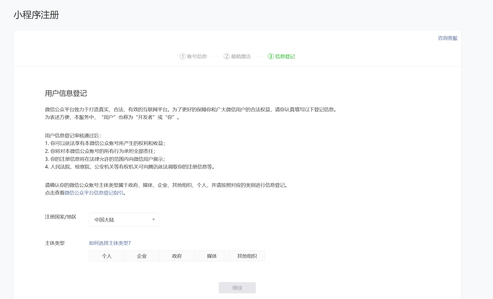

# Spring Boot短视频小程序开发 全栈式实战项目

[TOC]

# 一、微信小程序

&nbsp;

## 1.1、快速入门

- 什么是微信小程序
- 小程序注册流程
- helloworld
- 运行微信官方demo
- 项目目录结构
- 手写自己的第一个demo

&nbsp;

### 1.1.1、什么是微信小程序

> 简介

- 微信小程序是一种全新的连接用户与服务的方式，它可以在微信内被**便捷地获取和传播**，同时具有**出色的使用体验**
- 手机端APP的另外一种新的展现形式
- 无需下载过多占用手机内存的APP，小程序直接打开

&nbsp;

- [x] **小程序必备知识点**

1. HTML

2. Javascript

3. CSS

&nbsp;

- [x] **并不是所有的APP都适用小程序，手机上的APP也有自己的作用**

- 基础腾讯庞大的社交群体，可以为原生APP==导流==
- 创业成本优先推出小程序，==开发成本低==
- 当做==简单的工具==使用，需要在APP上频繁 CRUD 不适用

&nbsp;

### 1.1.2、小程序注册流程

> 前置条件

1. 最好有一个微信公众号（个人或企业的均可）
2. 需要有至少一个之前没有注册过微信小程序的邮箱，因为一个邮箱只能注册一个微信小程序

&nbsp;

> 具体步骤

1. 进入[微信公众平台 (qq.com)](https://mp.weixin.qq.com/)官网

   

   &nbsp;

2. 页面下拉，找到账号分类并选择**小程序**，点击“查看详情”进入详情页面

   

   &nbsp;

3. 下拉页面找到**自主接入**，点击“前往注册”开始注册小程序

&nbsp;

4. 按页面提示输入需要的信息，点击注册进入下一步，这里需要注意的是，申请小程序的邮箱必须没有注册过

   

&nbsp;

5. 这一步会发送确认邮件到注册的邮箱中，点击**登录邮箱**进入上一步填写的邮箱界面确认收到的激活小程序账号的邮件

   

&nbsp;

6. 点击确认邮件中的指定链接跳转至第三步**信息登记**，这一步需要填写注册小程序的具体信息，比如主体类型，按照提示选择即可

   

&nbsp;

7. 信息填写完成后，点**继续**确定注册小程序，之后就可以在弹出的提示框中前往小程序页面

   

&nbsp;

注册完成之后，我们需要完善小程序的信息，包括小程序的名称、头像（144*144）、介绍、类型等等，且需要绑定开发者(如果是单人开发直接默认管理员就行，团队开发成员则需要单独绑定)

&nbsp;

> **小提示**
>
> &emsp;&emsp;小程序开发文档：https://developers.weixin.qq.com/miniprogram/dev/framework/ , 开发小程序时多看看这个文档，有什么问题都可以在上面找到一些解决方案或处理措施。

&nbsp;

### 1.1.3、helloworld

要开发一个微信小程序，我们需要使用微信官方提供的==开发者工具==，这个软件是专门用于开发微信小程序的，有了他我们才可以开发微信小程序，写出我们的第一个 “ Hello,world ”。

&nbsp;

#### 1.1.3.1、安装微信开发者工具

> 这里以Windows系统为例

1. 首先需要通过[微信小程序](https://mp.weixin.qq.com/cgi-bin/wx?token=&lang=zh_CN)页面进入微信开发者工具相关的的小程序开发文档页面

   

   &nbsp;

2. 此页面会有开发工具的一些相关介绍，在此开发文档页面中点击 ==微信开发者工具== 可以进入下载页面

3. 这里版本选择稳定版即可，如果你有其他需求可以选择其他版本，然后选择对应的系统版本下载即可

   

   &nbsp;

4. 下载完成，点击安装包开始安装

   

   &nbsp;

   &nbsp;

5. 按照软件提示依次点击下一步，最后点击**完成**，就安装好了

   

   

&nbsp;

#### 1.1.3.2、创建小程序项目

新版的微信开发者工具创建小程序时，==AppID==是必填的（旧版的可以不用）不然创建不了小程序，后端服务这里一定要选择==不使用云服务==，模板的话使用默认的就行，项目名称填==helloworld==，设置完这些后点确定创建小程序项目并进入

创建好后，打开项目看到的就是这样的界面

&nbsp;

> 微信小程序的目录结构和普通的前端项目目录结构不太一样：

1.配置相关

- app.js/app.ts → 一个小程序只有一个
- app.json → 配置文件
- app.wxss → 微信的css样式

2.页面相关

- index.wxml → HTML页面文件
- index.js/index.ts → 页面的JS文件
- index.wxss → 页面里的css文件

&nbsp;

### 1.1.4、运行微信官方demo

> 介绍

官网：[小程序体验DEMO](https://developers.weixin.qq.com/miniprogram/dev/framework/quickstart/#体验小程序)，点**查看小程序示例源码**进入Github下载小程序源码

如果打开demo提示无法，显示下面的错误

可以在官方项目的issue中找到这个解决方案：[示例项目无法运行终极解决方案！！！ · Issue #110 · wechat-miniprogram/miniprogram-demo · GitHub](https://github.com/wechat-miniprogram/miniprogram-demo/issues/110)

如果编译时还有报错：Error: 系统错误，错误码：6000100,unbind download url [20231011 21:05:17][wx235ad920532ae180]，关闭**数据预拉取**就不会了

&nbsp;

### 1.1.5、项目目录结构

> 小程序工程的构成

1. xxx.js

2. xxx.json

3. xxx.wxss

以上三部分组成了小程序工程的基本部分，大部分的目录都会有这样的目录结构：

&nbsp;

>主目录结构

- app.js —— ==外部全局主js==，可以视为父类
- app.json —— ==全局配置文件==
- app.wxss —— ==全局主样式==，公用

&nbsp;

> 页面目录结构

- items.js —— 私有的js，相当于子类
- items.json —— 以JSON对象形式存在的配置
- items.wxml —— 元素所渲染的页面
- items.wxss —— 私有样式

&nbsp;

### 1.1.6、手写自己的第一个demo

## 1.2、基础组件

## 1.3、form表单

## 1.4、小程序前后通信