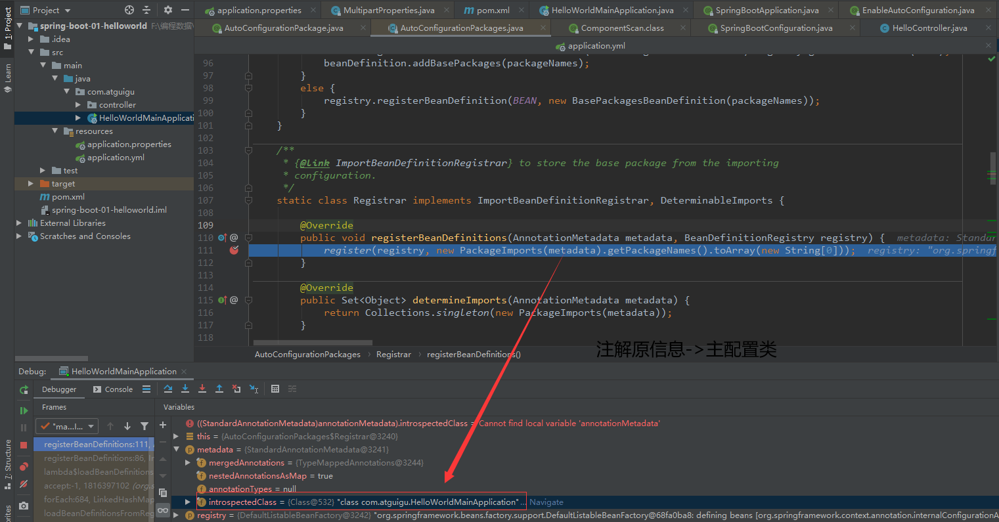
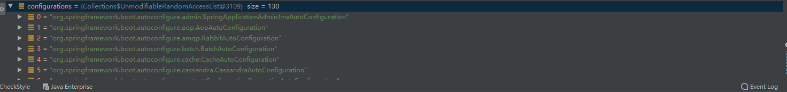
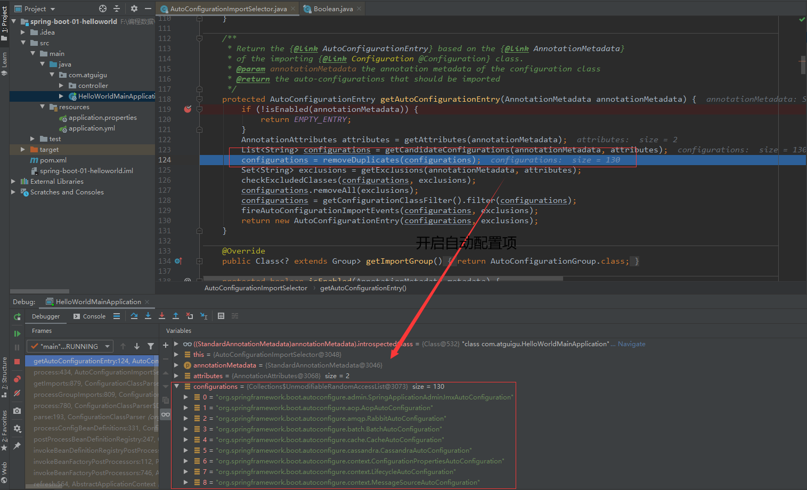

#  Spring Boot自动配置原理解析

[TOC]


# 一、自动配置原理入门

- 引导加载自动配置类
- 按需开启自动配置项
- 定制化自动配置
- 最佳实践


## 1.1、引导加载自动配置类

我们都知道在创建一个Spring Boot应用的时候，一般类文件路径的最外层都会有一个启动类/主配置类。通过这个主配置的main方法可以启动一个Spring Boot应用，如果你足够细心的话，可以发现主配置上有一个其实有一个注解

1. `@SpringBootApplication `注解

```java
@SpringBootConfiguration
@EnableAutoConfiguration
@ComponentScan(excludeFilters = { @Filter(type = FilterType.CUSTOM, classes = TypeExcludeFilter.class),
		@Filter(type = FilterType.CUSTOM, classes = AutoConfigurationExcludeFilter.class) })
public @interface SpringBootApplication {
}
================================
```

2. 我们来分析一下@SpringBootConfiguration注解

```java
@Configuration
public @interface SpringBootConfiguration {
}
```

@Configuration：代表当前被注释的类是一个配置类

3. @ComponentScan注解：包扫描

指定扫描哪些：[Spring注解驱动](https://www.bilibili.com/video/BV1gW411W7wy?p=3)

4. @EnableAutoConfiguration注解：实现自动配置

```java
@AutoConfigurationPackage
@Import(AutoConfigurationImportSelector.class)
public @interface EnableAutoConfiguration {
}
```

- @AutoConfigurationPackage注解：自动配置包？指定了默认的包规则

```java
@Import(AutoConfigurationPackages.Registrar.class) // 給容器中导入一个组件
public @interface AutoConfigurationPackage {
}
==================================
/**
 * 批量注册Bean定义
 * 将指定的一个包下的所有组件导入进来？
 * 1、利用Registrar给容器中导入一系列的组件
 * 2、相当于Registrar把HelloWorldMainApplication主配置类包下的组件批量注册进Spring容器
 */
    
 // AnnotationMetadata metadata：注解原信息 —> AutoConfigurationPackage -> 主配置类 
@Override
		public void registerBeanDefinitions(AnnotationMetadata metadata, BeanDefinitionRegistry registry) {
    	// 通过注解原信息拿到包名封装到数组中，然后注册进去
       // PackageImports(metadata).getPackageNames() = "com.atguigu"
			register(registry, new PackageImports(metadata).getPackageNames().toArray(new String[0]));
		}

    
```



- @Import(AutoConfigurationImportSelector.class)：自动配置组件导入选择器

```java
	// 这个方法决定导入哪些自动配置组件
	@Override
	public String[] selectImports(AnnotationMetadata annotationMetadata) {
		if (!isEnabled(annotationMetadata)) {
			return NO_IMPORTS;
		}
        // 利用getAutoConfigurationEntry()给容器中批量导入组件
		AutoConfigurationEntry autoConfigurationEntry = getAutoConfigurationEntry(annotationMetadata);
		return StringUtils.toStringArray(autoConfigurationEntry.getConfigurations());
	}

    /**
     * 1、利用getAutoConfigurationEntry(annotationMetadata);给容器中批量导入组件
     * 2、调用getCandidateConfigurations(annotationMetadata, attributes);获取所有要导入容器
     * 中的类
     * 3、利用工厂加载 Map<String, List<String>> loadSpringFactories(ClassLoader
     * classLoader) 得到所有的组件 
     * 4、从 "META-INF/spring.factories"来加载一个文件
     * 		默认扫描我们系统里面所有 "META-INF/spring.factories"位置的文件
     *  	spring-boot-autoconfigure-2.4.4.RELEASE.jar包里面也有META-INF/spring.factories
     * 		扫描的就是这个文件里的 130个自动配置类
     * 		org.springframework.boot.autoconfigure.EnableAutoConfiguration
     *      启动时128个场景的应用默认全部加载，实际只有127个能按需配置 @ConditionalOnClass
     * 5、按需加载，条件装配（@Conditional）
     */
	protected AutoConfigurationEntry getAutoConfigurationEntry(AnnotationMetadata annotationMetadata) {
		if (!isEnabled(annotationMetadata)) {
			return EMPTY_ENTRY;
		}
		AnnotationAttributes attributes = getAttributes(annotationMetadata);
       // 得到自动配置信息：获取所有要导入容器中的类
		List<String> configurations = getCandidateConfigurations(annotationMetadata, attributes);
		configurations = removeDuplicates(configurations);
		Set<String> exclusions = getExclusions(annotationMetadata, attributes);
		checkExcludedClasses(configurations, exclusions);
		configurations.removeAll(exclusions);
		configurations = getConfigurationClassFilter().filter(configurations);
		fireAutoConfigurationImportEvents(configurations, exclusions);
		return new AutoConfigurationEntry(configurations, exclusions);
	}


	protected List<String> getCandidateConfigurations(AnnotationMetadata metadata, AnnotationAttributes attributes) {
		List<String> configurations = SpringFactoriesLoader.loadFactoryNames(getSpringFactoriesLoaderFactoryClass(),
				getBeanClassLoader());
		Assert.notEmpty(configurations, "No auto configuration classes found in META-INF/spring.factories. If you "
				+ "are using a custom packaging, make sure that file is correct.");
		return configurations;
	}
```



````sh
# Auto Configure
org.springframework.boot.autoconfigure.EnableAutoConfiguration=\
org.springframework.boot.autoconfigure.admin.SpringApplicationAdminJmxAutoConfiguration,\
org.springframework.boot.autoconfigure.aop.AopAutoConfiguration,\
org.springframework.boot.autoconfigure.amqp.RabbitAutoConfiguration,\
org.springframework.boot.autoconfigure.batch.BatchAutoConfiguration,\
org.springframework.boot.autoconfigure.cache.CacheAutoConfiguration,\
org.springframework.boot.autoconfigure.cassandra.CassandraAutoConfiguration,\
org.springframework.boot.autoconfigure.context.ConfigurationPropertiesAutoConfiguration,\
org.springframework.boot.autoconfigure.context.LifecycleAutoConfiguration,\
org.springframework.boot.autoconfigure.context.MessageSourceAutoConfiguration,\
org.springframework.boot.autoconfigure.context.PropertyPlaceholderAutoConfiguration,\
org.springframework.boot.autoconfigure.couchbase.CouchbaseAutoConfiguration,\
org.springframework.boot.autoconfigure.dao.PersistenceExceptionTranslationAutoConfiguration,\
org.springframework.boot.autoconfigure.data.cassandra.CassandraDataAutoConfiguration,\
org.springframework.boot.autoconfigure.data.cassandra.CassandraReactiveDataAutoConfiguration,\
org.springframework.boot.autoconfigure.data.cassandra.CassandraReactiveRepositoriesAutoConfiguration,\
org.springframework.boot.autoconfigure.data.cassandra.CassandraRepositoriesAutoConfiguration,\
org.springframework.boot.autoconfigure.data.couchbase.CouchbaseDataAutoConfiguration,\
org.springframework.boot.autoconfigure.data.couchbase.CouchbaseReactiveDataAutoConfiguration,\
org.springframework.boot.autoconfigure.data.couchbase.CouchbaseReactiveRepositoriesAutoConfiguration,\
org.springframework.boot.autoconfigure.data.couchbase.CouchbaseRepositoriesAutoConfiguration,\
org.springframework.boot.autoconfigure.data.elasticsearch.ElasticsearchDataAutoConfiguration,\
org.springframework.boot.autoconfigure.data.elasticsearch.ElasticsearchRepositoriesAutoConfiguration,\
org.springframework.boot.autoconfigure.data.elasticsearch.ReactiveElasticsearchRepositoriesAutoConfiguration,\
org.springframework.boot.autoconfigure.data.elasticsearch.ReactiveElasticsearchRestClientAutoConfiguration,\
org.springframework.boot.autoconfigure.data.jdbc.JdbcRepositoriesAutoConfiguration,\
org.springframework.boot.autoconfigure.data.jpa.JpaRepositoriesAutoConfiguration,\
org.springframework.boot.autoconfigure.data.ldap.LdapRepositoriesAutoConfiguration,\
org.springframework.boot.autoconfigure.data.mongo.MongoDataAutoConfiguration,\
org.springframework.boot.autoconfigure.data.mongo.MongoReactiveDataAutoConfiguration,\
org.springframework.boot.autoconfigure.data.mongo.MongoReactiveRepositoriesAutoConfiguration,\
org.springframework.boot.autoconfigure.data.mongo.MongoRepositoriesAutoConfiguration,\
org.springframework.boot.autoconfigure.data.neo4j.Neo4jDataAutoConfiguration,\
org.springframework.boot.autoconfigure.data.neo4j.Neo4jReactiveDataAutoConfiguration,\
org.springframework.boot.autoconfigure.data.neo4j.Neo4jReactiveRepositoriesAutoConfiguration,\
org.springframework.boot.autoconfigure.data.neo4j.Neo4jRepositoriesAutoConfiguration,\
org.springframework.boot.autoconfigure.data.solr.SolrRepositoriesAutoConfiguration,\
org.springframework.boot.autoconfigure.data.r2dbc.R2dbcDataAutoConfiguration,\
org.springframework.boot.autoconfigure.data.r2dbc.R2dbcRepositoriesAutoConfiguration,\
org.springframework.boot.autoconfigure.data.redis.RedisAutoConfiguration,\
org.springframework.boot.autoconfigure.data.redis.RedisReactiveAutoConfiguration,\
org.springframework.boot.autoconfigure.data.redis.RedisRepositoriesAutoConfiguration,\
org.springframework.boot.autoconfigure.data.rest.RepositoryRestMvcAutoConfiguration,\
org.springframework.boot.autoconfigure.data.web.SpringDataWebAutoConfiguration,\
org.springframework.boot.autoconfigure.elasticsearch.ElasticsearchRestClientAutoConfiguration,\
org.springframework.boot.autoconfigure.flyway.FlywayAutoConfiguration,\
org.springframework.boot.autoconfigure.freemarker.FreeMarkerAutoConfiguration,\
org.springframework.boot.autoconfigure.groovy.template.GroovyTemplateAutoConfiguration,\
org.springframework.boot.autoconfigure.gson.GsonAutoConfiguration,\
org.springframework.boot.autoconfigure.h2.H2ConsoleAutoConfiguration,\
org.springframework.boot.autoconfigure.hateoas.HypermediaAutoConfiguration,\
org.springframework.boot.autoconfigure.hazelcast.HazelcastAutoConfiguration,\
org.springframework.boot.autoconfigure.hazelcast.HazelcastJpaDependencyAutoConfiguration,\
org.springframework.boot.autoconfigure.http.HttpMessageConvertersAutoConfiguration,\
org.springframework.boot.autoconfigure.http.codec.CodecsAutoConfiguration,\
org.springframework.boot.autoconfigure.influx.InfluxDbAutoConfiguration,\
org.springframework.boot.autoconfigure.info.ProjectInfoAutoConfiguration,\
org.springframework.boot.autoconfigure.integration.IntegrationAutoConfiguration,\
org.springframework.boot.autoconfigure.jackson.JacksonAutoConfiguration,\
org.springframework.boot.autoconfigure.jdbc.DataSourceAutoConfiguration,\
org.springframework.boot.autoconfigure.jdbc.JdbcTemplateAutoConfiguration,\
org.springframework.boot.autoconfigure.jdbc.JndiDataSourceAutoConfiguration,\
org.springframework.boot.autoconfigure.jdbc.XADataSourceAutoConfiguration,\
org.springframework.boot.autoconfigure.jdbc.DataSourceTransactionManagerAutoConfiguration,\
org.springframework.boot.autoconfigure.jms.JmsAutoConfiguration,\
org.springframework.boot.autoconfigure.jmx.JmxAutoConfiguration,\
org.springframework.boot.autoconfigure.jms.JndiConnectionFactoryAutoConfiguration,\
org.springframework.boot.autoconfigure.jms.activemq.ActiveMQAutoConfiguration,\
org.springframework.boot.autoconfigure.jms.artemis.ArtemisAutoConfiguration,\
org.springframework.boot.autoconfigure.jersey.JerseyAutoConfiguration,\
org.springframework.boot.autoconfigure.jooq.JooqAutoConfiguration,\
org.springframework.boot.autoconfigure.jsonb.JsonbAutoConfiguration,\
org.springframework.boot.autoconfigure.kafka.KafkaAutoConfiguration,\
org.springframework.boot.autoconfigure.availability.ApplicationAvailabilityAutoConfiguration,\
org.springframework.boot.autoconfigure.ldap.embedded.EmbeddedLdapAutoConfiguration,\
org.springframework.boot.autoconfigure.ldap.LdapAutoConfiguration,\
org.springframework.boot.autoconfigure.liquibase.LiquibaseAutoConfiguration,\
org.springframework.boot.autoconfigure.mail.MailSenderAutoConfiguration,\
org.springframework.boot.autoconfigure.mail.MailSenderValidatorAutoConfiguration,\
org.springframework.boot.autoconfigure.mongo.embedded.EmbeddedMongoAutoConfiguration,\
org.springframework.boot.autoconfigure.mongo.MongoAutoConfiguration,\
org.springframework.boot.autoconfigure.mongo.MongoReactiveAutoConfiguration,\
org.springframework.boot.autoconfigure.mustache.MustacheAutoConfiguration,\
org.springframework.boot.autoconfigure.neo4j.Neo4jAutoConfiguration,\
org.springframework.boot.autoconfigure.orm.jpa.HibernateJpaAutoConfiguration,\
org.springframework.boot.autoconfigure.quartz.QuartzAutoConfiguration,\
org.springframework.boot.autoconfigure.r2dbc.R2dbcAutoConfiguration,\
org.springframework.boot.autoconfigure.r2dbc.R2dbcTransactionManagerAutoConfiguration,\
org.springframework.boot.autoconfigure.rsocket.RSocketMessagingAutoConfiguration,\
org.springframework.boot.autoconfigure.rsocket.RSocketRequesterAutoConfiguration,\
org.springframework.boot.autoconfigure.rsocket.RSocketServerAutoConfiguration,\
org.springframework.boot.autoconfigure.rsocket.RSocketStrategiesAutoConfiguration,\
org.springframework.boot.autoconfigure.security.servlet.SecurityAutoConfiguration,\
org.springframework.boot.autoconfigure.security.servlet.UserDetailsServiceAutoConfiguration,\
org.springframework.boot.autoconfigure.security.servlet.SecurityFilterAutoConfiguration,\
org.springframework.boot.autoconfigure.security.reactive.ReactiveSecurityAutoConfiguration,\
org.springframework.boot.autoconfigure.security.reactive.ReactiveUserDetailsServiceAutoConfiguration,\
org.springframework.boot.autoconfigure.security.rsocket.RSocketSecurityAutoConfiguration,\
org.springframework.boot.autoconfigure.security.saml2.Saml2RelyingPartyAutoConfiguration,\
org.springframework.boot.autoconfigure.sendgrid.SendGridAutoConfiguration,\
org.springframework.boot.autoconfigure.session.SessionAutoConfiguration,\
org.springframework.boot.autoconfigure.security.oauth2.client.servlet.OAuth2ClientAutoConfiguration,\
org.springframework.boot.autoconfigure.security.oauth2.client.reactive.ReactiveOAuth2ClientAutoConfiguration,\
org.springframework.boot.autoconfigure.security.oauth2.resource.servlet.OAuth2ResourceServerAutoConfiguration,\
org.springframework.boot.autoconfigure.security.oauth2.resource.reactive.ReactiveOAuth2ResourceServerAutoConfiguration,\
org.springframework.boot.autoconfigure.solr.SolrAutoConfiguration,\
org.springframework.boot.autoconfigure.task.TaskExecutionAutoConfiguration,\
org.springframework.boot.autoconfigure.task.TaskSchedulingAutoConfiguration,\
org.springframework.boot.autoconfigure.thymeleaf.ThymeleafAutoConfiguration,\
org.springframework.boot.autoconfigure.transaction.TransactionAutoConfiguration,\
org.springframework.boot.autoconfigure.transaction.jta.JtaAutoConfiguration,\
org.springframework.boot.autoconfigure.validation.ValidationAutoConfiguration,\
org.springframework.boot.autoconfigure.web.client.RestTemplateAutoConfiguration,\
org.springframework.boot.autoconfigure.web.embedded.EmbeddedWebServerFactoryCustomizerAutoConfiguration,\
org.springframework.boot.autoconfigure.web.reactive.HttpHandlerAutoConfiguration,\
org.springframework.boot.autoconfigure.web.reactive.ReactiveWebServerFactoryAutoConfiguration,\
org.springframework.boot.autoconfigure.web.reactive.WebFluxAutoConfiguration,\
org.springframework.boot.autoconfigure.web.reactive.error.ErrorWebFluxAutoConfiguration,\
org.springframework.boot.autoconfigure.web.reactive.function.client.ClientHttpConnectorAutoConfiguration,\
org.springframework.boot.autoconfigure.web.reactive.function.client.WebClientAutoConfiguration,\
org.springframework.boot.autoconfigure.web.servlet.DispatcherServletAutoConfiguration,\
org.springframework.boot.autoconfigure.web.servlet.ServletWebServerFactoryAutoConfiguration,\
org.springframework.boot.autoconfigure.web.servlet.error.ErrorMvcAutoConfiguration,\
org.springframework.boot.autoconfigure.web.servlet.HttpEncodingAutoConfiguration,\
org.springframework.boot.autoconfigure.web.servlet.MultipartAutoConfiguration,\
org.springframework.boot.autoconfigure.web.servlet.WebMvcAutoConfiguration,\
org.springframework.boot.autoconfigure.websocket.reactive.WebSocketReactiveAutoConfiguration,\
org.springframework.boot.autoconfigure.websocket.servlet.WebSocketServletAutoConfiguration,\
org.springframework.boot.autoconfigure.websocket.servlet.WebSocketMessagingAutoConfiguration,\
org.springframework.boot.autoconfigure.webservices.WebServicesAutoConfiguration,\
org.springframework.boot.autoconfigure.webservices.client.WebServiceTemplateAutoConfiguration
````


## 1.2、按需开启自动配置项目

> 简介

- 启动时130个场景的应用默认全部加载，实际只有128个能按需配置 @ConditionalOnClass
- 按需加载，条件装配（@Conditional）




## 1.3、修改默认配置

Spring Boot默认会在底层配好所有的组件，但是如果用户自己配置了的话会以用户配置的优先

```java
		@Bean
		@ConditionalOnBean(MultipartResolver.class) // 当容器中有这个组件
		@ConditionalOnMissingBean(name = 			// 容器中没有这个名字的组件	DispatcherServlet.MULTIPART_RESOLVER_BEAN_NAME)
		public MultipartResolver multipartResolver(MultipartResolver resolver) {
			// 给@Bean标注的方法传入了对象参数，这个参数的值就会从容器中找
            // SpringMvc multipartResolver,防止用户配置的文件上传解析器不符合规范
            // Detect if the user has created a MultipartResolver but named it incorrectly
			return resolver;
		}
```

比如说Spring的字符编码过滤器，他这里直接返回的是其自身

```java
	@Bean
	@ConditionalOnMissingBean
	public CharacterEncodingFilter characterEncodingFilter() {
		CharacterEncodingFilter filter = new OrderedCharacterEncodingFilter();
		filter.setEncoding(this.properties.getCharset().name());
		filter.setForceRequestEncoding(this.properties.shouldForce(Encoding.Type.REQUEST));
		filter.setForceResponseEncoding(this.properties.shouldForce(Encoding.Type.RESPONSE));
		return filter;
	}	
```


## 1.4、最佳实践

想要使用SpingBoot最好的实践是

1. 引入场景依赖：

   https://docs.spring.io/spring-boot/docs/current/reference/html/using.html#using.build-systems.starters

2. 查看SpringBoot自动配置了哪些(选做)

   - 自己分析，引入场景的配置一般都生效

   - 配置文件中debug=true开启自动配置报告，negative不生效 / positive生效

   - 是否需要修改

3. 参照文档修改配置项：https://docs.spring.io/spring-boot/docs/current/reference/html/application-properties.html#application-properties

4. 自己分析，xxxProperties绑定了配置文件的哪些

5. 自定义加入或者替换组件：
  - @Bean、@Component

6. 自定义器 xxxCustomizer

   - ……


# 二、Spring注解驱动和开发技巧

- Spring注解驱动
- Spring Boot开发小技巧


## 2.1、Spring注解驱动

- @ComponentScan注解
- @Import注解


### 2.2.1、@ComponentScan注解

1. 功能：自动扫描组件，指定扫描规则

````xml
<?xml version="1.0" encoding="UTF-8"?>
<beans xmlns="http://www.springframework.org/schema/beans" 
	xmlns:mybatis="http://mybatis.org/schema/mybatis-spring"
	xmlns:xsi="http://www.w3.org/2001/XMLSchema-instance"
	xmlns:p="http://www.springframework.org/schema/p"
	xmlns:context="http://www.springframework.org/schema/context"
	xmlns:mvc="http://www.springframework.org/schema/mvc"
	xmlns:tx="http://www.springframework.org/schema/tx"
	xsi:schemaLocation="http://www.springframework.org/schema/beans 
			            http://www.springframework.org/schema/beans/spring-beans-4.2.xsd
			            http://www.springframework.org/schema/context
			            http://www.springframework.org/schema/context/spring-context-4.2.xsd
			            http://www.springframework.org/schema/mvc
			            http://www.springframework.org/schema/mvc/spring-mvc-4.2.xsd
			            http://www.springframework.org/schema/tx
			            http://www.springframework.org/schema/tx/spring-tx-4.1.xsd
			            http://mybatis.org/schema/mybatis-spring 
			            http://mybatis.org/schema/mybatis-spring.xsd ">
			      
	 <!-- mybatis:scan会扫描org.fkit.dao包里的所有接口当作Spring的bean配置，之后可以进行依赖注入-->  
    <mybatis:scan base-package="org.fkit.hrm.dao"/>   
	 <!-- @ComponentScan -->
	 <!-- 扫描org.fkit包下面的java文件，有Spring的相关注解的类，则把这些类注册为Spring的bean -->
    <context:component-scan base-package="org.fkit.hrm"/>
    
	<!-- 使用PropertyOverrideConfigurer后处理器加载数据源参数 -->
	<context:property-override location="classpath:db.properties"/>

	<!-- 配置c3p0数据源 -->
	<bean id="dataSource" class="com.mchange.v2.c3p0.ComboPooledDataSource"/>

	<!-- 配置SqlSessionFactory，org.mybatis.spring.SqlSessionFactoryBean是Mybatis社区开发用于整合Spring的bean -->
	<bean id="sqlSessionFactory" class="org.mybatis.spring.SqlSessionFactoryBean"
	    p:dataSource-ref="dataSource"/>
	
	<!-- JDBC事务管理器 -->
	<bean id="transactionManager" 
	class="org.springframework.jdbc.datasource.DataSourceTransactionManager"
		 p:dataSource-ref="dataSource"/>
	
	<!-- 启用支持annotation注解方式事务管理 -->
	<tx:annotation-driven transaction-manager="transactionManager"/>
	
</beans>

````

2. @ComponentScan的属性

- value=“指定要扫描的包”

- excludeFilters=“是一个filter数组,指定要过滤的filter，并指定filter的过滤规则”

```java
@ComponentScan(value = "com.atguigu",excludeFilters = {
    @Filter(type= FilterType.ANNOTATION,classes = {Service.class
        })},useDefaultFilters = false)
```

- includeFilters=“是一个filter数组,指定包含的filter，并指定filter的包含规则”

```java
@ComponentScans(value = {
        @ComponentScan(value = "com.atguigu",excludeFilters = {
                @Filter(type= FilterType.ANNOTATION,classes = {Service.class})}),
        @ComponentScan(value = "com.atguigu",includeFilters = {
                @Filter(type= FilterType.ANNOTATION,classes = {Controller.class}),
                @Filter(type= FilterType.ASSIGNABLE_TYPE,classes = {Car.class}),
        },useDefaultFilters = false)
})
```

3. TypeFilter过滤规则

- FilterType.ANNOTATION：按照注解扫描需要过滤的类型

- FilterType.ASSIGNABLE_TYPE：按照指定的类型进行过滤

- FilterType.ASPECTJ：使用AspectJ的表达式

- FilterType.REGEX：使用正则表达式来过滤

- FilterType.CUSTOM：使用自定义规则

4. 自定义TypeFilter指定过滤规则

````java
/**
 * @author 兰柯万 1733100391@qq.com
 * @version V1.0
 * @Description: 自定义类过滤规则
 * @date 2021/7/24 - 6:06
 */
public class MyTypeFilter implements TypeFilter {

    /**
     *
     * @param metadataReader 读取到的当前正在扫描的类的信息
     * @param metadataReaderFactory 可以获取其他类的信息
     * @return
     * @throws IOException
     */
    @Override
    public boolean match(MetadataReader metadataReader, MetadataReaderFactory metadataReaderFactory) throws IOException {

        // 获取当前类注解信息
        AnnotationMetadata annotationMetadata = metadataReader.getAnnotationMetadata();
        // 获取当前正在扫描的类信息：类的类型或者实现的接口
        ClassMetadata classMetadata = metadataReader.getClassMetadata();
        // 获取当前类资源信息
        Resource resource = metadataReader.getResource();


        String className = classMetadata.getClassName();
        System.out.println("输出一下：className = " + className);
  		
        if(className.contains("er")){
            return true;
        }
        return false;
    }
}

/**
 * @author 兰柯万 1733100391@qq.com
 * @version V1.0
 * @Description:
 * @date 2021/7/18 - 0:05
 */
@Configuration
@ComponentScans(value = {
//    @ComponentScan(value = "com.atguigu",excludeFilters = {
//            @Filter(type= FilterType.ANNOTATION,classes = {Service.class,})}),
//    @ComponentScan(value = "com.atguigu",includeFilters = {
//            @Filter(type= FilterType.ANNOTATION,classes = {Controller.class}),
//            @Filter(type= FilterType.ASSIGNABLE_TYPE,classes = {Car.class}),
//    },useDefaultFilters = false),
    @ComponentScan(value = "com.atguigu",includeFilters = {
            @Filter(type= FilterType.CUSTOM,classes = {MyTypeFilter.class}),
    },useDefaultFilters = false),
})
public class MyConfig {

    @Bean
    public CharacterEncodingFilter filter() {
        return null;
    }

    @Bean(name="TomCat")
    public Pet tomcatPet() {
        return new Pet("TomCat");
    }
}

````

4. 控制台输出结果

````sh
name = myConfig
name = user
name = myTypeFilter
name = helloController
name = userService
name = filter
name = TomCat
````


### 2.2.2、@Import注解

1. 给容器中注册组件：

   - 包扫描+组件标注注解（@Controller/@Service/@Repository/@Component）：自己写的

   - @Bean [导入的第三方包里的组件]

   - @Import：[快速给容器中导入一个组件，ID默认是组件的全类名]

   ```sh
   容器中的组件：name = myConfig
   容器中的组件：name = com.atguigu.bean.Color
   容器中的组件：name = com.atguigu.bean.Red
   容器中的组件：name = filter
   容器中的组件：name = TomCat
   ```

2. @Import的第二种做法，使用ImportSelector：返回需要导入的组件的全类名

```java
/**
 * @author 兰柯万 1733100391@qq.com
 * @version V1.0
 * @Description: 自定义返回需要导入的组件
 * @date 2021/7/24 - 7:29
 */
public class MyImportSelector implements ImportSelector {

    @Override
    public String[] selectImports(AnnotationMetadata importingClassMetadata) {
        return new String[0];
    }

    @Override
    public Predicate<String> getExclusionFilter() {
        return null;
    }
}

```


> Tips：
>
> - @Import高级用法：https://www.bilibili.com/video/BV1gW411W7wy?p=8
>
> - AnnotationMetadata：用于标识注解原信息，比如它标记在哪，它的属性值是什么，一层层嵌套，相当于标识在Spring Boot启动类上
>
>   总结：
>
>   1. Spring Boot先加载所有的自动配置类：xxxAutoConfiguration
>
>   2. 每个自动配置类按照特定条件进行生效，默认都会绑定配置文件指定的值.xxx.properties里面拿配置，xxxProperties和配置文件进行了绑定@EnableConfigurationProperties
>
>   3. 生效的配置类就会给容器中装配很多的组件
>
>   4. 只要容器中有这些组件，相当于这些功能就有了
>
>   5. Spring Boot默认会在底层配置好所有的组件，但是如果用户自己配置了，以用户的优先
>
>   6. 定制化配置
>
>      1. 用户自己直接@Bean替换底层的组件
>      2. 用户去看这个组件是获取的配置文件的什么值就去修改
>
>      xxxAutoConfiguration —-> 组件 —– > xxxProperties里面拿值 —–> application.properties
>
>   
>
>   - @SpringBootApplication == @EnableAutoConfiguration + @ComponentScan

## 2.3、Spring Boot开发小技巧

- Lombok
- Spring Initailizr
- dev-tools


### 2.3.1、Lombok

1. 简化JavaBean开发，pom文件引入Lombok依赖

```xml
  		<dependency>
            <groupId>org.projectlombok</groupId>
            <artifactId>lombok</artifactId>
        </dependency>
```

2. 搜索安装Lombok插件

3. 使用Lombok，在实体类标注@Data注解就可自动生成getter、setter方法，使用@ToString注解可以生成toString方法，@AllArgsConstructor注解生成全参构造器，@NoArgsConstructor生成无参构造器，@EqualsAndHashCode生成equals和hashcode方法，@Slf4j可以注解在类上，里面有一个属性叫log

4. 使用hello.http进行测试

```http
GET http://localhost:8888/hello/
Accept: application/json

###

GET http://localhost:8888/car/
Accept: application/json

###

POST http://localhost:8888/handle/
Content-Type: application/x-www-form-urlencoded

name=李浩

###
```


### 2.3.2、dev-3tools和JRebel

1. 引入dev-tools依赖，用于热部署

````xml
<dependencies>
    <dependency>
        <groupId>org.springframework.boot</groupId>
        <artifactId>spring-boot-devtools</artifactId>
        <optional>true</optional>
    </dependency>
</dependencies>
````

2. JRebel -> Reload  <==> dev-tools -> Restart
3. JRebel收费，但是更快


### 2.3.3、Spring Initailizr

> 简介

SpringBoot的初始化器可以通过以下两种方式来获取并通过其创建SpringBoot应用

1. IDEA自带的Spring Initailizr(Spring初始化器)
2. Spring官网的[Spring Initializr](https://start.spring.io/)

