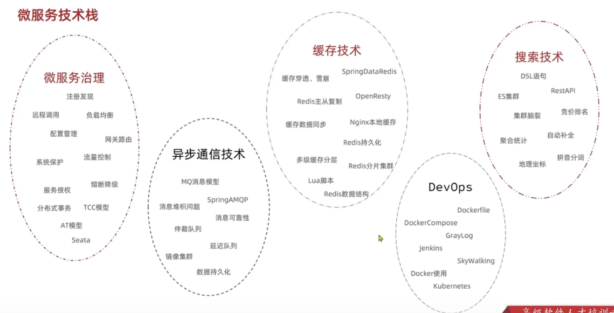
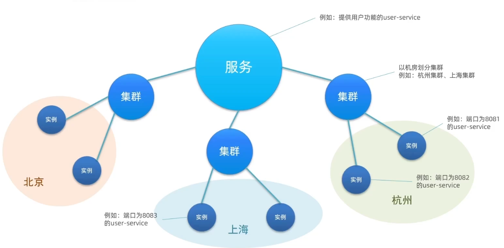

# Spring Cloud框架开发教程

> 2021最新最全SpringCloud微服务技术栈课程火热登场！ SpringCloudAlibaba、RabbitMQ、Docker、Redis、Elasticsearch等众多行业大厂必备技术一网打尽。 实用篇、高级篇、面试篇分层次教学，由易到难，层层推进，高潮不断！ 该套教程技术体系完整，即使在职或者曾学过的话也强烈建议你再刷一遍这套教程！


[TOC]


# 一、微服务技术栈

- 微服务技术栈
- 关于技术方面的学习
- 认识微服务
- 服务拆分及远程调用
- Enreka注册中心
- Ribbon负载均衡
- Nacos注册中心


## 1.1、微服务技术栈

- 微服务技术 ≠ Spring Cloud


- 微服务技术


- 对微服务项目进行自动化的编译，基于docker进行打包形成镜像，并且通过rancher或者kubernetes(k8s)实现自动化部署


## 1.2、关于技术方面的学习

> 主要有以下5方面



1. 微服务治理

注册发现、远程调用、负载均衡、配置管理、网关路由、系统保护、流量控制、服务授权、熔断降级、分布式事务、TCC模型、AT模型、Seata

2. 异步通信技术

MQ消息模型、SpringAMQP、消息堆积问题、消息可靠新、仲裁队列、延迟队列、镜像集群、数据持久化

3. 缓存技术

缓存穿透、缓存击穿、缓存雪崩、SpringData、Redis、Redis主从复制、OpenResty、缓存数据同步、Nginx本地缓存、 Redis持久化、多级缓存分层、Redis分片集群、Lua脚本、Redis数据结构

4. 搜索技术

DSL语句、ES集群、RestAPI、集群脑裂、竞价排名、聚合统计、自动补全、地理坐标、拼音分词

5. DevOps

Dockerfile、DockerCompose、GrayLog、Jenkins、SkyWalking、Docker使用、Kubernetes(k8s)


## 1.3、认识微服务

- 应用服务架构
- 微服务技术框架
- Spring Cloud


### 1.3.1、应用服务架构

> 单体架构

将业务所有功能集中在一个项目中开发，打成一个包部署，优点是架构简单、部署成本低；缺点是耦合度高


> 分布式架构

根据业务功能对系统进行拆分，每个业务模块作为独立项目开发，称为一个服务，优点是降低服务耦合并且有利于服务升级扩展


- 微服务方案

微服务是一种经过良好架构设计的分布式架构方案、微服务架构特征：

1. 单一职责：微服务拆分粒度更小、每一个服务都对应唯一的业务能力、做到单一职责、避免重复业务开发

2. 面向服务：微服务对外暴露业务接口，比如：会员服务、用户服务、积分服务

3. 自治：团队独立、技术独立、数据独立、部署独立


> Tips:
>
> - 单体架构：简单方便、高度耦合、扩展性差、适合小型项目。例如学生管理系统
> - 分布式架构：松耦合、但架构复杂、难度大。适合大型互联网项目、例如：京东、淘宝


### 1.3.2、微服务技术框架

> 概述

微服务这种方案需要技术框架来落地，全球的互联网公司都在积极尝试自己的微服务落地技术。在国内最知名的就是Spring Cloud和阿里巴巴的Dubbo


> 微服务技术对比

|                |        Dubbo        |       Spring Cloud       |    SpringCloudAlibaba     |
| :------------: | :-----------------: | :----------------------: | :-----------------------: |
|    注册中心    |  zookeeper、Redis   |      Eureka、Consul      |       Nacos、Eureka       |
|  服务远程调用  |      Dubbo协议      |     Feigh(HTTP协议)      |       Dubbo、Feign        |
|    配置中心    |         ——          |    Spring CloudConfig    | Spring CloudConfig、Nacos |
|    服务网关    |         ——          | SpringCloudGateway、Zuul | SpringCloudGateway、Zuul  |
| 服务监控和保护 | dubbo-admin，功能弱 |         Hystrix          |         Sentinel          |


> 企业需求


### 1.3.3、Spring Cloud

> 简介

- Spring Cloud是目前国内最广泛的微服务框架。官网地址：http://spring.io/projects/spring-cloud。

- Spring Cloud集成了各种微服务功能组件，并且基于Spring Boot实现了这些组件的自动装配，从而提供了良好的开箱即用体验


> 兼容性


## 1.4、服务拆分及远程调用

> 注意事项

1. 不同微服务、不要开发重复开发相同业务
2. 微服务数据独立，不要访问其他微服务的数据库
3. 微服务可以将自己的业务暴露接口，供其他微服务调用


### 1.4.1、服务拆分

导入服务拆分Demo

- 导入工程： cloud-demo
- 项目结构

 cloud-demo：order-service(根据id查询订单)、user-service(根据id查询用户)


> Tips：
>
> - 微服务需要根据业务模块拆分，做到单一职责，不要重复开发相同业务
> - 微服务可以将业务暴露为接口，供其他微服务使用
> - 不同微服务都应该有自己独立的数据库


### 1.4.2、远程调用

> 案例

根据订单id查询订单功能

需求：根据订单id查询订单的同时，把订单所属的用户信息一起返回


- 远程调用方式分析


步骤1：注册RestTepmlate

在order-service的OrderApplication中注册RestTemplate

```java
@MapperScan("cn.itcast.order.mapper")
@SpringBootApplication
public class OrderApplication {

    public static void main(String[] args) {
        SpringApplication.run(OrderApplication.class, args);
        System.out.println("(♥◠‿◠)ﾉﾞ  订单模块启动成功   ლ(´ڡ`ლ)ﾞ  \n" +
                " .-------.       ____     __        \n" +
                " |  _ _   \\      \\   \\   /  /    \n" +
                " | ( ' )  |       \\  _. /  '       \n" +
                " |(_ o _) /        _( )_ .'         \n" +
                " | (_,_).' __  ___(_ o _)'          \n" +
                " |  |\\ \\  |  ||   |(_,_)'         \n" +
                " |  | \\ `'   /|   `-'  /           \n" +
                " |  |  \\    /  \\      /           \n" +
                " ''-'   `'-'    `-..-'              ");
    }
	/**
     * 创建RestTemplate并自动注入到Spring容器中
     */
    @Bean
    public RestTemplate restTemplate() {
        return new RestTemplate();
    }

}
```

步骤2：发起远程调用

在order-service中的OrderService中使用RestTemplate

```java
@Service
public class OrderService {

    @Autowired
    private OrderMapper orderMapper;

    @Autowired
    private RestTemplate restTemplate;

    public Order queryOrderById(Long orderId) {
        // 1.查询订单
        Order order = orderMapper.findById(orderId);
        /*
          2.利用RestTemplate函数发起HTTP请求，查询用户信息
          通过URL路径，发送HTTP请求，实现远程调用
         */
        final String url = "http://localhost:8081/user/" + order.getUserId();
        User user = restTemplate.getForObject(url, User.class);
        // 3.封装user到order中
        order.setUser(user);
        // 4.返回
        return order;
    }
}
```

实现效果

```json
# http://localhost:8080/order/103
{
    "id":103,
    "price":43900,
    "name":"骆驼（CAMEL）休闲运动鞋女",
    "num":1,
    "userId":3,
    "user":{
        "id":3,
        "username":"华沉鱼",
        "address":"湖北省十堰市"
    }
}
```


> Tips：
>
> - 基于RestTemplate发起的HTTP请求实现远程调用
> - HTTP请求作远程调用与编程语言无关的调用，只要知道对方的IP、端口、接口路径、请求参数即可


### 1.4.3、提供者与消费者

> 概念

- 服务提供者：一次业务中被其他微服务调用的服务。（提供接口给其他微服务）
- 服务消费者：一次消费中，调用其他微服务的服务。（调用其他微服务提供的接口）


order-service(服务消费者) -> user-service(服务提供者)

思考：

- 服务A调用服务B，服务B又调用服务C，那么服务B是什么角色？


提供者与消费者角色其实是相对的


## 1.5、Eureka注册中心

- 远程调用的问题
- 搭建EurekaServer
- 服务注册
- 服务发现


### 1.5.1、远程调用的问题

- 服务消费者该如何获取服务提供者的地址信息


消费者该如何获取服务提供者具体信息？

- 服务提供者启动时向Eureka注册自己的信息
- Eureka保存这些信息
- 消费者根据服务名称向Eureka拉取提供者信息

如果有多个服务提供者，消费者该如何选择？

- 服务消费者利用负载均衡算法，从服务列表中挑选一个

消费者如何感知服务提供者健康状态？

- 服务提供者会每隔30秒向EurekaServer发送心跳请求，报告健康装通
- Eureka会更新服务列表信息，心跳不正常会被剔除
- 消费者就可以拉取到最新的信息


### 1.5.2、搭建EurekaServer

> 动手实践

搭建EurekaServer服务注册中心 -> 将user-service、order-service都注册到eureka -> 在order-service中完成拉取，然后通过负载均衡挑选一个服务，实现远程调用 

搭建EurekaServer服务步骤如下：


1.cloud-demo项目中创建新模块，引入spring-cloud-starter-netflix-enreka-server的依赖

```xml
<!-- eureka-server服务端依赖 -->
<dependency>
	<groupId>org.springframework.cloud</groupId>
    <artifactId>spring-cloud-starter-netflix-eureka-server</artifactId>
</dependency>
```

2.编写启动类，添加@EnableEurekaServer注解，注意要导入Maven项目依赖

```java
/**
 * @author wl
 * @version V1.0
 * @Description: eureka服务端
 * @date 2021/12/24 - 15:02
 */
@EnableEurekaServer
@SpringBootApplication
public class EurekaApplication {

    public static void main(String[] args) {
        SpringApplication.run(EurekaApplication.class, args);
        System.out.println("(♥◠‿◠)ﾉﾞ  eureka-server模块启动成功   ლ(´ڡ`ლ)ﾞ  \n" +
                " .-------.       ____     __        \n" +
                " |  _ _   \\      \\   \\   /  /    \n" +
                " | ( ' )  |       \\  _. /  '       \n" +
                " |(_ o _) /        _( )_ .'         \n" +
                " | (_,_).' __  ___(_ o _)'          \n" +
                " |  |\\ \\  |  ||   |(_,_)'         \n" +
                " |  | \\ `'   /|   `-'  /           \n" +
                " |  |  \\    /  \\      /           \n" +
                " ''-'   `'-'    `-..-'              ");
    }
}
```

3.添加application.yml，编写下面的配置：

```yml
# 端口
server:
  port: 10086
# 应用名称
spring:
  application:
    name: eurekaServer # eureka的服务名称
# 配置
eureka:
  client:
    service-url: # eureka的地址信息
      defaultZone: http://127.0.0.1:10086/eureka
```

4.Ctrl + Shift + F10 (Run context configuration)，使用浏览器访问就会看到如下界面


### 1.5.3、服务注册

> 注册user-service

将user-service服务注册到EurekaServer步骤如下

1.在user-service模块中引入spring-cloud-starter-netflix-eureka-client的依赖

```xml
<dependency>
	<groupId>org.springframework.cloud</groupId>
    <artifactId>spring-cloud-starter-netflix-eureka-client</artifactId>
</dependency>
```

2.在application.yml文件，编写下面的配置

```yml
spring:
	application:
		name: userSerivce
# 配置
eureka:
  client:
    service-url: # eureka的地址信息
      defaultZone: http://localhost:10086/eureka 
```

order-service也是同理


> Tips：
>
> - 引入eureka-client依赖
> - 在application.yml中配置eureka地址
> - 无论是消费者还是提供者，都需要引入eureka-client依赖，知道eureka地址后，都可以完成服务注册


### 1.5.4、服务发现

在order-service中完成服务拉取：服务拉取是基于服务名称获取服务列表，然后对服务列表做负载均衡

1.修改OrderSerive的代码，修改访问的URL路径，用服务名代替IP、端口

`String url = http://userService/user/" + order.getUserId();`

2.在order-server项目的启动类OrderApplication中的RestTemplate添加**负载均衡*注解*

```java
    /**
     * 创建RestTemplate并自动注入到Spring容器中
     */
    @Bean
    @LoadBalanced
    public RestTemplate restTemplate() {
        return new RestTemplate();
    }
```


> Tips：
>
> - 引入eureka-licent依赖
> - 在application.yml中配置eureka地址
> - 给RestTemplate添加@LoadBalanced注解
> - 用服务提供者的服务名称远程调用


## 1.6、Ribbon负载均衡

- 负载均衡原理
- 负载均衡策略
- 懒加载


### 1.6.1、负载均衡原理

> 负载均衡流程


@LoadBalanced拦截请求并进行处理，会使用LoadBalancerInterceptor进行拦截

```java
public class LoadBalancerInterceptor implements ClientHttpRequestInterceptor {

	private LoadBalancerClient loadBalancer;

	private LoadBalancerRequestFactory requestFactory;

	public LoadBalancerInterceptor(LoadBalancerClient loadBalancer,
			LoadBalancerRequestFactory requestFactory) {
		this.loadBalancer = loadBalancer;
		this.requestFactory = requestFactory;
	}

	public LoadBalancerInterceptor(LoadBalancerClient loadBalancer) {
		// for backwards compatibility
		this(loadBalancer, new LoadBalancerRequestFactory(loadBalancer));
	}

	@Override
	public ClientHttpResponse intercept(final HttpRequest request, final byte[] body,
			final ClientHttpRequestExecution execution) throws IOException {
		final URI originalUri = request.getURI();
		String serviceName = originalUri.getHost();
		Assert.state(serviceName != null,
				"Request URI does not contain a valid hostname: " + originalUri);
		return this.loadBalancer.execute(serviceName,
				this.requestFactory.createRequest(request, body, execution));
	}

}
```


### 1.6.2、负载均衡策略

Ribbon的负载均衡规则是一个叫做IRule的接口来定义的，每一个子接口都是一种规则


Ribbon主要的负载均衡策略如下


|          策略类           |        命名        |                             描述                             |
| :-----------------------: | :----------------: | :----------------------------------------------------------: |
|        RandomRule         |      随机策略      |                        随机选择server                        |
|      RoundRobinRule       |      轮询策略      |             按照顺序选择server（ribbon默认策略）             |
|         RetryRule         |      重试策略      | 在一个配置时间段内，当选择server不成功，则一直尝试选择一个可用的server |
|     BestAvailableRule     |    最低并发策略    | 逐个考察server，如果server断路器打开，则忽略，再选择其中并发链接最低的server |
| AvailabilityFilteringRule |    可用过滤策略    | 过滤掉一直失败并被标记为circuit tripped的server，过滤掉那些高并发链接的server（active connections超过配置的阈值） |
| ResponseTimeWeightedRule  | 响应时间加权重策略 | 根据server的响应时间分配权重，响应时间越长，权重越低，被选择到的概率也就越低。响应时间越短，权重越高，被选中的概率越高，这个策略很贴切，综合了各种因素，比如：网络，磁盘，io等，都直接影响响应时间 |
|     ZoneAvoidanceRule     |    区域权重策略    | 综合判断server所在区域的性能，和server的可用性，轮询选择server并且判断一个AWS Zone的运行性能是否可用，剔除不可用的Zone中的所有server |


- 自定义负载均衡策略

通过定义IRule实现可以修改负载均衡的规则，有两种方式

1.代码方式：在order-service中的OrderApplication类中，定义一个新的IRule，作用于全局

```java
    /**
     * 也可写一个配置类
     */
    @Bean
    public IRule randomRule() {
        return new RandomRule();
    }
```

2.配置文件方式：在order-service的application.yml文件中，添加新的配置也可以修改规则，只作用于某个服务调用

```properties
# 自定义负载均衡策略
userService:
  ribbon:
    # 负载均衡策略
    NFLoadBalancerRuleClassName: com.netflix.loadbalancer.RandomRule
```


### 1.6.3、懒加载

> 定义

Ribbon默认采用懒加载，即第一次访问时才会去创建LoadBalanceClient，请求时间会很长。而饥饿加载则会在项目启动时就创建，降低第一次访问的耗时，通过下面的配置开启饥饿加载

```properties
ribbon:
	eager-load:
		# 开启饥饿加载
		enabled: true
		#指定对userService这个服务饥饿加载
		clients: userService
```


> 总结：
>
> 1. Ribbon负载均衡规则：默认接口是IRule，默认实现是ZoneAvoidanceRule，根据选择服务列表作轮询
> 2. 负载均衡自定义方式：
>    - 代码方式：配置灵活，但是修改时需要重新打包发布
>    - 配置方式：直观、方便，无需重新打包发布，但是无法作全局配置
> 3. 饥饿加载：开启饥饿加载，指定饥饿加载的微服务名称


## 1.7、Nacos注册中心

- 认识和安装Nacos
- Nacos快速入门
- Nacos服务分级存储模型
- 服务实例的权重
- Nacos环境隔离


### 1.7.1、认识和安装Nacos

> 简介

[Nacos](https://nacos.io/zh-cn/index.html)是阿里巴巴的产品，现在是Spring Cloud中的一个组件。相比于Eureka功能更加丰富，在国内受欢迎程度较高。


**Nacos安装指南**

```sh
# Windows启动命令
startup.cmd -m standalone
```


### 1.7.2、Nacos快速入门

> 服务注册到Nacos

1. 在cloud-demo父工程中添加spring-cloud-alibaba的管理依赖

```xml
<!-- Spring Cloud阿里巴巴依赖 -->
<dependency>
    <groupId>com.alibaba.cloud</groupId>
    <artifactId>spring-cloud-alibaba-dependencies</artifactId>
    <version>2.2.5.RELEASE</version>
    <type>POM</type>
    <scope>import</scope>
</dependency>
```

2. 注释掉order-service和user-service中原有的eureka依赖
3. 添加nacos的客户端依赖

```xml
<!-- Nacos客户端依赖 -->
<dependency>
	<groupId>com.alibaba.cloud</groupId>
    <artifactId>spring-cloud-starter-alibaba-nacos-discovery</artifactId>
</dependency>
```

4. 修改user-service&order-service中的application.yml文件，注释掉eureka地址，添加nacos地址

```yml
spring:
	cloud:
		nacos:
			# Nacos 服务端地址
			server-addr: localhost:8848
```

5. 启动并测试

在浏览器输入地址：http://127.0.0.1:8848/nacos即可， 用户名和密码 都是nacos


> Tips：[IDEA中spring-cloud-starter-alibaba-nacos-discovery  无法引入问题](https://blog.csdn.net/qq_42462894/article/details/111586528)


### 1.7.3、Nacos服务分级存储模型

> 服务分级概念

- 1级是服务，例如userService
- 2级是集群，例如杭州或上海
- 3级是实例，例如杭州机房的某台部署了userService的服务器




服务跨集群调用问题：服务跨集群调用尽可能选择本地集群的服务，因为跨集群调用延迟较高


修改服务集群属性

1. 修改user-service的application.yml文件，添加如下内容：

```yml
spring:
	cloud:
		# Nacos服务端地址
		server-addr: localhost:8848
		discovery:
			# 配置集群名称，也就是机房位置，例如：HZ杭州
			cluster-name: HZ
```

将UserApplication和UserApplication2作为杭州集群，UserApplication3作为上海集群

```sh
-Dserver.port=8083 -Dspring.cloud.discovery.cluster-name=SH
```


2. 在Nacos控制台可以看到集群变化


### 1.7.4、服务实例的权重

> 为order-service做权重设置，优先使用本地集群user-service服务

1.先修改服务集群属性，修改方式同上，这里不再赘述


2.再修改负载均衡的规则

```yml
# 自定义负载均衡策略
userService:
  ribbon:
    # 负载均衡策略
    NFLoadBalancerRuleClassName: com.alibaba.cloud.nacos.ribbon.NacosRule
```

3.注意将user-service的权重设置为1


> 总结：负载均衡策略
>
> - 优先选择同集群服务实例列表
> - 本地集群找不到提供者，才去其他集群寻找，并且会有警告
> - 确定可用实例列表之后，再采用随机负载均衡挑选实例


根据权重负载均衡

实际部署中会出现这样的场景：服务器设备性能有差异，部分实例所在机器性能较好。另一些较差，我们希望性能好的机器承担更多的用户请求

Nacos提供了权重配置来控制访问频率，权重越大则访问频率越高

1. 在Nacos控制台可以设置实例的权重值，首先选中实力后面的编辑按钮


2. 将权重值设置为0.1，测试可以发现8081被访问到的频率大大降低


> Tips：
>
> - Nacos控制台可以设置实例的权重值，0-1之间
>
> - 同集群内的多个实例，权重越高被访问的频率越高
> - 权重设置为0则完全不会被访问


### 1.7.5、Nacos环境隔离

> 环境隔离 - namespace

Nacos中服务存储和数据存储的最外层都是一个名为namespace的东西，用来做最外层隔离


1.在Nacos控制台可以新建一个命名空间，用来隔离不同环境


2.保存后会在控制台看到这个命名空间的id


3.修改order-service的application.yml，添加namespace，之后重启

```yml
spring:
	datasource:
		url: jdbc:mysql://localhost:3306/heima?useSSL=false
		username: root
		password: root
		driver-class-name: com.mysql.jdbc.Driver
	cloud:
		nacos:
			server-addr: localhost:8848
			discovery:
				cluster-name: SH # 上海
				# 命名空间，填id
				namespace: 980f9945-6d24-4a8c-8331-29a1030535aa
```


> 总结：
>
> - 每个namespace都可以用来作环境隔离
> - 每个namespace都有唯一id
> - 不同namespace下的服务不可见


### 1.7.6、Nacos和Eureka的对比

> nacos注册中心细节分析


临时实例和非临时实例

服务注册到Nacos时，可以选择注册为临时或者非临时实例，通过下面的配置来设置

```yml
spring:
	cloud:
		discovery:
			# 设置为非临时实例
			ephemeral: false
```

共同点

- 都支持服务注册和拉取
- 都支持服务提供者心跳方式做健康检测

不同点

- Nacos支持服务端主动检测提供者状态，临时实例采用心跳模型，非临时实例采用主动检测模型
- 临时实例心跳不正常会被剔除，非临时实例则不会被剔除
- Nacos支持服务列表变更的消息推送模式，服务列表更新更及时
- Nacos集群默认采用AP方式，当集群中存在非临时实例时，采用CP模式；Eureka采用AP方式  


# 二、微服务架构

- Nacos配置管理
- Feign远程调用
- 统一网关Gateway


## 2.1、Nacos配置管理

- 统一配置管理
- 微服务配置拉取
- 微服务配置热更新
- 多环境配置共享
- 搭建Nacos集群


### 2.1.1、统一配置管理

> 配置更改热更新


1. 在Nocos中添加配置信息，找到nacos服务器的配置管理列表，点击新建配置，要在public下


2. 在弹出表单中填写配置等信息：一般以服务名+环境.yaml为命名，分组，默认即可，格式的话，目前支持yaml和properties两种


3. 编辑好配置之后，点击发布


```yaml
pattern:
    date-format: yyyy-MM-dd HH:mm:ss
```


### 2.1.2、微服务配置拉取

> 配置获取的步骤如下：

项目启动 == > (从bootstrap.yml读取nacos地址)==读取nacos配置文件==	== >	读取本地配置文件application.yml	== >	创建Spring容器	== >	加载bean


1.引入Nacos的配置管理客户端依赖

```xml
<!-- Nacos配置管理依赖 -->
<dependency>
	<groupId>com.alibaba.cloud</groupId>
    <artifactId>spring-cloud-starter-alibaba-nacos-config</artifactId>
</dependency>
```

2.在userService中的resource目录中添加一个bootstrap.yml文件，这个文件是引导文件，优先级高于application.yml，application中的相同配置需要注销掉包括集群配置

```yml
spring:
	application:
		# 服务名称
		name: userService
	profiles:
		# 开发环境
		active: dev
	cloud:
		nacos:
			# Nacos地址
			server-addr: localhost:8848
			config:
				# 文件后缀名
				file-extension: yaml
```

3.查看是否能读取到配置，我们在user-service中将pattern-dateformat这个属性注入到UserController中作测试

```java
@Slf4j
@RestController
@RequestMapping("/user")
public class UserController{
    
    /**
     *  @Value: 无法注入的话，nacos版本换成4.1.2或者换成这个注解
     *  注入nacos中的配置属性
     */
    @Value("${pattern.date-format}")
    private String dateFormat;

    /**
     * 打印时间格式
     * 编写controller，通过日期格式化器来格式化现在的时间并返回
     */
    @GetMapping("/now")
    public String now() {
        return LocalDateTime.now().format(DateTimeFormatter.ofPattern(dateFormat));
    }
}
   
```


### 2.1.3、微服务配置热更新

> 配置自动更新

Nacos中的配置文件变更后，微服务无需重启就可以感知。不过需要通过下面两种配置实现：

- 方式一：在@Value注入的变量所在类上添加注解@RefreshScope来刷新

```java
@Slf4j
@RefreshScope
@RestController
@RequestMapping("/user")
public class UserController {

    @Autowired
    private UserService userService;

    /**
     *  @Value: 无法注入的话，nacos版本换成4.1.2或者换成这个注解
     *  注入nacos中的配置属性
     */
    @Value("${pattern.date-format}")
    private String dateFormat;
}
```

- 方式二：使用@ConfigurationProperties注解

```java
@Data
@Component
@ConfigurationProperties(prefix = "pattern")
public class PatternProperties {
	private String dateFormat;    
}
```

在usercontroller中注入替代dateFormat变量


> 总结：Nacos配置更改后，微服务可以实现热更新方式
>
> ①. 通过@value注入，结合@RefreshScope来刷新
>
> ②. 通过@ConfigurationProperties注入
>
> 注意事项：
>
> - 不是所有的配置都需要放到配置中心，这样维护比较麻烦
> - 建议将一些关键参数，需要运行时动态调整的参数放到nacos配置中心，一般都是自定义配置


### 2.1.4、多环境配置共享

微服务启动时会从nacos读取多个配置文件

[spring.application.name]-[spring.profiles.active].yaml，例如：userService-dev.yaml

[spring.application.name]-.yaml，例如：userService.yaml

无论profile如何变化，[spring.application.name].yaml这个文件一定会加载，因此多环境共享配置可以写入这个文件

1.新建userService.yaml配置


2.将属性值envSharedValue放到PatternProperties中

```java
@Data
@Component
@ConfigurationProperties(prefix = "pattern")
public class PatternProperties {

    private String dateFormat;

    private String envSharedValue;
}
```

3.在UserController中再写个接口调用这个值

```java
@Slf4j
//@RefreshScope
@RestController
@RequestMapping("/user")
public class UserController {

    @Autowired
    private UserService userService;

    /**
     *  @Value: 无法注入的话，nacos版本换成4.1.2或者换成这个注解
     *  注入nacos中的配置属性
     */
//    @Value("${pattern.date-format}")
//    private String dateFormat;

    /**
     * 通过ConfigurationProperties
     * 注解实现热更新
     */
    @Autowired
    private PatternProperties properties;


    /**
     * 获取属性值
     */
    @GetMapping("/prop")
    public PatternProperties prop() {
        return properties;
    }
}
```

4.将UserApplication2改为测试环境


> 环境优先级

如果有相同的配置，则他们的优先级是：

服务名-profile.yaml > 服务名称.yaml > 本地配置


### 2.1.5、搭建Nacos集群

Nacos在生产环境下一定要部署为集群状态，部署方式如下，通过nginx作负载均衡


#### 2.1.5.1、数据库配置

> 阿里云RDB创建nacos数据库，并且导入SQL语句

```sql
CREATE TABLE `config_info` (
  `id` bigint(20) NOT NULL AUTO_INCREMENT COMMENT 'id',
  `data_id` varchar(255) NOT NULL COMMENT 'data_id',
  `group_id` varchar(255) DEFAULT NULL,
  `content` longtext NOT NULL COMMENT 'content',
  `md5` varchar(32) DEFAULT NULL COMMENT 'md5',
  `gmt_create` datetime NOT NULL DEFAULT CURRENT_TIMESTAMP COMMENT '创建时间',
  `gmt_modified` datetime NOT NULL DEFAULT CURRENT_TIMESTAMP COMMENT '修改时间',
  `src_user` text COMMENT 'source user',
  `src_ip` varchar(50) DEFAULT NULL COMMENT 'source ip',
  `app_name` varchar(128) DEFAULT NULL,
  `tenant_id` varchar(128) DEFAULT '' COMMENT '租户字段',
  `c_desc` varchar(256) DEFAULT NULL,
  `c_use` varchar(64) DEFAULT NULL,
  `effect` varchar(64) DEFAULT NULL,
  `type` varchar(64) DEFAULT NULL,
  `c_schema` text,
  PRIMARY KEY (`id`),
  UNIQUE KEY `uk_configinfo_datagrouptenant` (`data_id`,`group_id`,`tenant_id`)
) ENGINE=InnoDB DEFAULT CHARSET=utf8 COLLATE=utf8_bin COMMENT='config_info';

/******************************************/
/*   数据库全名 = nacos_config   */
/*   表名称 = config_info_aggr   */
/******************************************/
CREATE TABLE `config_info_aggr` (
  `id` bigint(20) NOT NULL AUTO_INCREMENT COMMENT 'id',
  `data_id` varchar(255) NOT NULL COMMENT 'data_id',
  `group_id` varchar(255) NOT NULL COMMENT 'group_id',
  `datum_id` varchar(255) NOT NULL COMMENT 'datum_id',
  `content` longtext NOT NULL COMMENT '内容',
  `gmt_modified` datetime NOT NULL COMMENT '修改时间',
  `app_name` varchar(128) DEFAULT NULL,
  `tenant_id` varchar(128) DEFAULT '' COMMENT '租户字段',
  PRIMARY KEY (`id`),
  UNIQUE KEY `uk_configinfoaggr_datagrouptenantdatum` (`data_id`,`group_id`,`tenant_id`,`datum_id`)
) ENGINE=InnoDB DEFAULT CHARSET=utf8 COLLATE=utf8_bin COMMENT='增加租户字段';


/******************************************/
/*   数据库全名 = nacos_config   */
/*   表名称 = config_info_beta   */
/******************************************/
CREATE TABLE `config_info_beta` (
  `id` bigint(20) NOT NULL AUTO_INCREMENT COMMENT 'id',
  `data_id` varchar(255) NOT NULL COMMENT 'data_id',
  `group_id` varchar(128) NOT NULL COMMENT 'group_id',
  `app_name` varchar(128) DEFAULT NULL COMMENT 'app_name',
  `content` longtext NOT NULL COMMENT 'content',
  `beta_ips` varchar(1024) DEFAULT NULL COMMENT 'betaIps',
  `md5` varchar(32) DEFAULT NULL COMMENT 'md5',
  `gmt_create` datetime NOT NULL DEFAULT CURRENT_TIMESTAMP COMMENT '创建时间',
  `gmt_modified` datetime NOT NULL DEFAULT CURRENT_TIMESTAMP COMMENT '修改时间',
  `src_user` text COMMENT 'source user',
  `src_ip` varchar(50) DEFAULT NULL COMMENT 'source ip',
  `tenant_id` varchar(128) DEFAULT '' COMMENT '租户字段',
  PRIMARY KEY (`id`),
  UNIQUE KEY `uk_configinfobeta_datagrouptenant` (`data_id`,`group_id`,`tenant_id`)
) ENGINE=InnoDB DEFAULT CHARSET=utf8 COLLATE=utf8_bin COMMENT='config_info_beta';

/******************************************/
/*   数据库全名 = nacos_config   */
/*   表名称 = config_info_tag   */
/******************************************/
CREATE TABLE `config_info_tag` (
  `id` bigint(20) NOT NULL AUTO_INCREMENT COMMENT 'id',
  `data_id` varchar(255) NOT NULL COMMENT 'data_id',
  `group_id` varchar(128) NOT NULL COMMENT 'group_id',
  `tenant_id` varchar(128) DEFAULT '' COMMENT 'tenant_id',
  `tag_id` varchar(128) NOT NULL COMMENT 'tag_id',
  `app_name` varchar(128) DEFAULT NULL COMMENT 'app_name',
  `content` longtext NOT NULL COMMENT 'content',
  `md5` varchar(32) DEFAULT NULL COMMENT 'md5',
  `gmt_create` datetime NOT NULL DEFAULT CURRENT_TIMESTAMP COMMENT '创建时间',
  `gmt_modified` datetime NOT NULL DEFAULT CURRENT_TIMESTAMP COMMENT '修改时间',
  `src_user` text COMMENT 'source user',
  `src_ip` varchar(50) DEFAULT NULL COMMENT 'source ip',
  PRIMARY KEY (`id`),
  UNIQUE KEY `uk_configinfotag_datagrouptenanttag` (`data_id`,`group_id`,`tenant_id`,`tag_id`)
) ENGINE=InnoDB DEFAULT CHARSET=utf8 COLLATE=utf8_bin COMMENT='config_info_tag';

/******************************************/
/*   数据库全名 = nacos_config   */
/*   表名称 = config_tags_relation   */
/******************************************/
CREATE TABLE `config_tags_relation` (
  `id` bigint(20) NOT NULL COMMENT 'id',
  `tag_name` varchar(128) NOT NULL COMMENT 'tag_name',
  `tag_type` varchar(64) DEFAULT NULL COMMENT 'tag_type',
  `data_id` varchar(255) NOT NULL COMMENT 'data_id',
  `group_id` varchar(128) NOT NULL COMMENT 'group_id',
  `tenant_id` varchar(128) DEFAULT '' COMMENT 'tenant_id',
  `nid` bigint(20) NOT NULL AUTO_INCREMENT,
  PRIMARY KEY (`nid`),
  UNIQUE KEY `uk_configtagrelation_configidtag` (`id`,`tag_name`,`tag_type`),
  KEY `idx_tenant_id` (`tenant_id`)
) ENGINE=InnoDB DEFAULT CHARSET=utf8 COLLATE=utf8_bin COMMENT='config_tag_relation';

/******************************************/
/*   数据库全名 = nacos_config   */
/*   表名称 = group_capacity   */
/******************************************/
CREATE TABLE `group_capacity` (
  `id` bigint(20) unsigned NOT NULL AUTO_INCREMENT COMMENT '主键ID',
  `group_id` varchar(128) NOT NULL DEFAULT '' COMMENT 'Group ID，空字符表示整个集群',
  `quota` int(10) unsigned NOT NULL DEFAULT '0' COMMENT '配额，0表示使用默认值',
  `usage` int(10) unsigned NOT NULL DEFAULT '0' COMMENT '使用量',
  `max_size` int(10) unsigned NOT NULL DEFAULT '0' COMMENT '单个配置大小上限，单位为字节，0表示使用默认值',
  `max_aggr_count` int(10) unsigned NOT NULL DEFAULT '0' COMMENT '聚合子配置最大个数，，0表示使用默认值',
  `max_aggr_size` int(10) unsigned NOT NULL DEFAULT '0' COMMENT '单个聚合数据的子配置大小上限，单位为字节，0表示使用默认值',
  `max_history_count` int(10) unsigned NOT NULL DEFAULT '0' COMMENT '最大变更历史数量',
  `gmt_create` datetime NOT NULL DEFAULT CURRENT_TIMESTAMP COMMENT '创建时间',
  `gmt_modified` datetime NOT NULL DEFAULT CURRENT_TIMESTAMP COMMENT '修改时间',
  PRIMARY KEY (`id`),
  UNIQUE KEY `uk_group_id` (`group_id`)
) ENGINE=InnoDB DEFAULT CHARSET=utf8 COLLATE=utf8_bin COMMENT='集群、各Group容量信息表';

/******************************************/
/*   数据库全名 = nacos_config   */
/*   表名称 = his_config_info   */
/******************************************/
CREATE TABLE `his_config_info` (
  `id` bigint(64) unsigned NOT NULL,
  `nid` bigint(20) unsigned NOT NULL AUTO_INCREMENT,
  `data_id` varchar(255) NOT NULL,
  `group_id` varchar(128) NOT NULL,
  `app_name` varchar(128) DEFAULT NULL COMMENT 'app_name',
  `content` longtext NOT NULL,
  `md5` varchar(32) DEFAULT NULL,
  `gmt_create` datetime NOT NULL DEFAULT CURRENT_TIMESTAMP,
  `gmt_modified` datetime NOT NULL DEFAULT CURRENT_TIMESTAMP,
  `src_user` text,
  `src_ip` varchar(50) DEFAULT NULL,
  `op_type` char(10) DEFAULT NULL,
  `tenant_id` varchar(128) DEFAULT '' COMMENT '租户字段',
  PRIMARY KEY (`nid`),
  KEY `idx_gmt_create` (`gmt_create`),
  KEY `idx_gmt_modified` (`gmt_modified`),
  KEY `idx_did` (`data_id`)
) ENGINE=InnoDB DEFAULT CHARSET=utf8 COLLATE=utf8_bin COMMENT='多租户改造';


/******************************************/
/*   数据库全名 = nacos_config   */
/*   表名称 = tenant_capacity   */
/******************************************/
CREATE TABLE `tenant_capacity` (
  `id` bigint(20) unsigned NOT NULL AUTO_INCREMENT COMMENT '主键ID',
  `tenant_id` varchar(128) NOT NULL DEFAULT '' COMMENT 'Tenant ID',
  `quota` int(10) unsigned NOT NULL DEFAULT '0' COMMENT '配额，0表示使用默认值',
  `usage` int(10) unsigned NOT NULL DEFAULT '0' COMMENT '使用量',
  `max_size` int(10) unsigned NOT NULL DEFAULT '0' COMMENT '单个配置大小上限，单位为字节，0表示使用默认值',
  `max_aggr_count` int(10) unsigned NOT NULL DEFAULT '0' COMMENT '聚合子配置最大个数',
  `max_aggr_size` int(10) unsigned NOT NULL DEFAULT '0' COMMENT '单个聚合数据的子配置大小上限，单位为字节，0表示使用默认值',
  `max_history_count` int(10) unsigned NOT NULL DEFAULT '0' COMMENT '最大变更历史数量',
  `gmt_create` datetime NOT NULL DEFAULT CURRENT_TIMESTAMP COMMENT '创建时间',
  `gmt_modified` datetime NOT NULL DEFAULT CURRENT_TIMESTAMP COMMENT '修改时间',
  PRIMARY KEY (`id`),
  UNIQUE KEY `uk_tenant_id` (`tenant_id`)
) ENGINE=InnoDB DEFAULT CHARSET=utf8 COLLATE=utf8_bin COMMENT='租户容量信息表';


CREATE TABLE `tenant_info` (
  `id` bigint(20) NOT NULL AUTO_INCREMENT COMMENT 'id',
  `kp` varchar(128) NOT NULL COMMENT 'kp',
  `tenant_id` varchar(128) default '' COMMENT 'tenant_id',
  `tenant_name` varchar(128) default '' COMMENT 'tenant_name',
  `tenant_desc` varchar(256) DEFAULT NULL COMMENT 'tenant_desc',
  `create_source` varchar(32) DEFAULT NULL COMMENT 'create_source',
  `gmt_create` bigint(20) NOT NULL COMMENT '创建时间',
  `gmt_modified` bigint(20) NOT NULL COMMENT '修改时间',
  PRIMARY KEY (`id`),
  UNIQUE KEY `uk_tenant_info_kptenantid` (`kp`,`tenant_id`),
  KEY `idx_tenant_id` (`tenant_id`)
) ENGINE=InnoDB DEFAULT CHARSET=utf8 COLLATE=utf8_bin COMMENT='tenant_info';

CREATE TABLE `users` (
	`username` varchar(50) NOT NULL PRIMARY KEY,
	`password` varchar(500) NOT NULL,
	`enabled` boolean NOT NULL
);

CREATE TABLE `roles` (
	`username` varchar(50) NOT NULL,
	`role` varchar(50) NOT NULL,
	UNIQUE INDEX `idx_user_role` (`username` ASC, `role` ASC) USING BTREE
);

CREATE TABLE `permissions` (
    `role` varchar(50) NOT NULL,
    `resource` varchar(255) NOT NULL,
    `action` varchar(8) NOT NULL,
    UNIQUE INDEX `uk_role_permission` (`role`,`resource`,`action`) USING BTREE
);

INSERT INTO users (username, password, enabled) VALUES ('nacos', '$2a$10$EuWPZHzz32dJN7jexM34MOeYirDdFAZm2kuWj7VEOJhhZkDrxfvUu', TRUE);

INSERT INTO roles (username, role) VALUES ('nacos', 'ROLE_ADMIN');
```


#### 2.1.5.2、nacos集群配置

1.进入nacos的conf目录，修改配置文件cluster.conf.example，重命名为cluster.conf，并修改其内容

```txt
127.0.0.1:8845
127.0.0.1:8846
127.0.0.1:8847
```

2.然后修改application.properties文件，添加数据库配置

```properties
#*************** Config Module Related Configurations ***************#
### If use MySQL as datasource:
spring.datasource.platform=mysql

### Count of DB:
db.num=1

### Connect URL of DB:
db.url.0=jdbc:mysql://rm-uf6g96fq74wt7j8vj1o.mysql.rds.aliyuncs.com:3306/nacos?characterEncoding=utf8&connectTimeout=1000&socketTimeout=3000&autoReconnect=true&useUnicode=true&useSSL=false&serverTimezone=UTC
db.user.0=root
db.password.0=sqkj@2021
```

3.复制三份，修改application.properties的端口为8845、8846、8847


5.然后分别启动三个nacos节点


#### 2.1.5.3、nginx负载均衡

1.下载安装Nginx

<http://nginx.org/en/download.html>

2.修改conf/nginx.conf文件，配置如下：

```nginx
upstream nacos-cluster {
    server 127.0.0.1:8845;
	server 127.0.0.1:8847;
	server 127.0.0.1:8849;
}

server {
    listen       80;
    server_name  localhost;

    location /nacos {
        proxy_pass http://nacos-cluster;
    }
}
```

3.启动nginx

```sh
start nginx.exe
```


9.打开浏览器访问nacos

```txt
http://localhost/nacos/#/login
```

10.改动user-service的bootstrap配置文件

```yml
spring:
  application:
    # 服务名称
    name: userService
  profiles:
    # 开发环境
    active: dev
  cloud:
    nacos:
      # 将Nacos地址改为80
      server-addr: localhost:80
      config:
        # 文件后缀名
        file-extension: yaml
```


#### 2.1.5.4、配置文件测试

此时，配置列表为空，我们可以新建一个userService配置来测试

```yaml
pattern:
	date-format: yyyy-MM-dd HH:mm:ss
```

点击保存，会保存到我们指定的数据库中

```sql
INSERT INTO `nacos`.`config_info` (`id`, `data_id`, `group_id`, `content`, `md5`, `gmt_create`, `gmt_modified`, `src_user`, `src_ip`, `app_name`, `tenant_id`, `c_desc`, `c_use`, `effect`, `type`, `c_schema`) VALUES (1, 'userSerive.yaml', 'DEFAULT_GROUP', 'pattern:\r\n	dateformat: yyyy-MM-dd HH:mm:ss', '583f8a05d8c2af2b2954ba446a77915d', '2022-01-04 07:29:35', '2022-01-04 07:29:35', NULL, '127.0.0.1', '', '', 'nacos集群配置', NULL, NULL, 'yaml', NULL);

```


## 2.2、Feign远程调用

- Feign替代RestTemplate
- 自定义配置
- Feign的性能优化
- Feign的最佳实践


### 2.2.1、Feign替代RestTemplate

> RestTemplate方式调用存在的问题

先来看我们以前利用RestTemplate发起远程调用的代码

```java
final String url = "http://userService/user/" + order.getUserId();
// 通过RestTemplate获取对象
User user = restTemplate.getForObject(url, User.class);
```

- 代码可读性差，编程体验不统一

- 参数复杂的URL难以维护


HTTP客户端Feign

Feign是一个声明式的HTTP客户端。官方地址：http://github.com/OpenFeign/feign，其作用就是帮助我们优雅地实现HTTP请求的发送，解决上面提到的问题


定义和使用Feign客户端

1. order-service引入依赖

```xml 
<dependency>
	<groupId>org.springframework.cloud</groupId>
    <artifactId>spring-cloud-starter-openfeign</artifactId>
</dependency>
```

2. 在order-service的启动类中添加注解开启Feign的功能

```java
@EnableFeignClients
```

3. 编写Feign客户端

```java
@FeignClient("userSerivice")
public interface UserClient {
    @GetMapping("/user/{id}")
    User findById(@PathVariable("id") Long id)
}
```

主要是基于SpringMVC的注解来声明远程调用的信息，比如

- 服务名称：userService
- 请求方式：Get
- 请求路径： /user/{id}
- 返回值参数： User

Feign内部集成了Ribbon，自动做到负载均衡


### 2.2.2、自定义配置

Feign运行自定义配置来覆盖默认配置，可以修改的配置如下

|        类型         |       作用       |                          说明                          |
| :-----------------: | :--------------: | :----------------------------------------------------: |
| feign.Logger.Level  |   修改日志级别   |     包含四种不同的级别：NONE、BASIC、HEADERS、FULL     |
| feign.codec.Decoder | 响应结果的解析器 | HTTP远程调用的结果作解析，例如解析json字符串为Java对象 |
| feign.codec.Encoder |   请求参数编码   |              将请求编码，便于通过HTTP发送              |
|   feign.Contract    |  支持的注解格式  |                 默认是SpringMVC的注解                  |
|    feign.Retryer    |   失败重试机制   |  请求失败的重试机制，默认没有，不过会使用Ribbon的重试  |

一般只需要配置日志级别


- 自定义配置Feign的日志的方式

> 方式一：配置文件

①、全局生效

```yml
# feign日志自定义配置
feign:
  client:
    config:
      # 这里用default就是全局配置，如果是写某个服务名称，则是针对于某个微服务而言
      default:
        # 日志级别
        loggerLevel: FULL
```

②、局部生效

```yml
# feign日志自定义配置
feign:
  client:
    config:
      # 这里用default就是全局配置，如果是写某个服务名称，则是针对于某个微服务而言
      user-service:
        # 日志级别
        loggerLevel: FULL
```


> 方式二：Java代码

1.先声明一个bean

```java
public class FeignClientConfiguration {
    @Bean
    public Logger.Level feignLogLevel() {
        return Logger.Level.BASIC;
    }
}
```

2.如果是全局配置的话，可以把它放到启动类的@FnableFeignClients这个注解中：
`@EnabeleFeignClients(defaultConfiguration = FeignClientConfiguration.class)`

3.如果是局部配置，则把它放到UserClient的@FeignClient这个注解中：

`@FeignClient(value = "userService", configuration = FeignClientConfiguration.class)`

如果都有Java代码和配置文件都有配置项，则以配置文件优先

### 2.2.3、Feign的性能优化

Feign底层的客户端实现有三种：

- URLConnection：默认实现，不支持连接池
- Apache HttpClient：支持连接池
- OKHttp：支持连接池

因此优化Feign的性能主要包括：

①使用连接池代替默认的URLConnection

②日志级别，最好用BASIC或NONE

> 连接池配置

1.添加HttpClient的支持：引入依赖

```xml
<!-- httpClient的依赖 -->
<dependency>
	<groupId>io.github.openfeign</groupId>
    <artifactId>feign-httpclient</artifactId>
</dependency>
```

2.连接池配置

```yaml
# feign日志自定义配置
feign:
  client:
    config:
      # 这里用default就是全局配置，如果是写某个服务名称，则是针对于某个微服务而言
      default:
    # BASIC是最基本的请求和响应信息
        loggerLevel: BASIC
  httpclient:
      # 开启支持
    enabled: true
      # 最大连接数
    max-connections: 200
      # 每个路径的最大连接数
    max-connections-pre-route: 50
```


### 2.2.4、Feign的最佳实践

方式一（继承）：给消费者的FeignClient和提供者controller定义统一的父接口作为标准


方式二（抽取）：将FeignClient抽取为独立模块，并且把接口有关的POJO、默认的Feign配置都放到这个模块中，提供给所有消费者使用，但是可能会有多余的功能用不到


> 方式二实现

1.首先创建一个module，命名为feign-api，然后引入feign的starter依赖


```xml
 <!-- Feign客户端 -->
        <dependency>
            <groupId>org.springframework.cloud</groupId>
            <artifactId>spring-cloud-starter-openfeign</artifactId>
        </dependency>
```

2.将order-service中编写的UserClient、User、DefaultFeignConfiguration都复制到feign-api模块中

设置目录cn.itcast.feign，并将client和其configuration移动到这个模块的目录下，再把pojo对象移到这里，order-service中做移除。并引入feign-api模块依赖

3.在order-service中引入feign-api的依赖

```xml
  <!--  引入feign的统一api -->
        <dependency>
            <groupId>cn.itcast.demo</groupId>
            <artifactId>feign-api</artifactId>
            <version>1.0</version>
        </dependency>
```

4.修改order-service中的所有与上述三个组件有关的import部分，改成导入feign-api中的包

当定义的FeignClient不在SpringBootApplication的扫描包范围时，这些FeignClient无法使用。有两种方式解决

①、指定FeignClient所在的包

`@EnableFeignClients(basePackages = "cn.itcast.feign.client")`

②、指定FeignClient的字节码

`@EnableFeignClients(clients = {UserClient.class})`

第二种方式更方便


## 2.3、统一网关Gateway

- 为什么需要网关
- Gateway快速入门
- 断言工厂
- 过滤器工厂
- 全局过滤器
- 跨域问题


### 2.3.1、为什么需要网关

> 网关功能：

- 身份认证和权限校验
- 服务路由、负载均衡
- 请求限流


> 技术实现

在SpringCloud中网关的实现包括两种：

- gateway
- zuul

Zuul是基于Servlet的实现，属于阻塞式编程。而SpringCloudGateway则是基于Spring5中提供的WebFlux，属于响应式编程的实现，具备更好的性能


### 2.3.2、Gateway快速入门

- 搭建网关服务的步骤：

1.创建新的module，名为gateway，引入SpringCloudGateway的依赖和nacos的服务发现依赖：

```xml
	<properties>
        <nacos.version>2.0.3.RELEASE</nacos.version>
    </properties>

    <dependencies>
        <!-- Spring Cloud GatewayApplication 网关 -->
        <dependency>
            <groupId>org.springframework.cloud</groupId>
            <artifactId>spring-cloud-starter-gateway</artifactId>
        </dependency>
        <!-- nacos服务发现依赖 -->
        <dependency>
            <groupId>com.alibaba.cloud</groupId>
            <artifactId>spring-cloud-starter-alibaba-nacos-discovery</artifactId>
            <version>${nacos.version}</version>
        </dependency>
    </dependencies>
```

2.创建启动类GatewayApplication

```java
@SpringBootApplication
public class GatewayApplication {

    public static void main(String[] args) {
        SpringApplication.run(GatewayApplication.class, args);
        System.out.println("(♥◠‿◠)ﾉﾞ  gateway网关模块启动成功   ლ(´ڡ`ლ)ﾞ  \n" +
                " .-------.       ____     __        \n" +
                " |  _ _   \\      \\   \\   /  /    \n" +
                " | ( ' )  |       \\  _. /  '       \n" +
                " |(_ o _) /        _( )_ .'         \n" +
                " | (_,_).' __  ___(_ o _)'          \n" +
                " |  |\\ \\  |  ||   |(_,_)'         \n" +
                " |  | \\ `'   /|   `-'  /           \n" +
                " |  |  \\    /  \\      /           \n" +
                " ''-'   `'-'    `-..-'              ");
    }
}
```

3.编写路由配置、nacos地址和服务基本信息

```yaml
server:
  port: 10010
spring:
  application:
    # 服务名称
    name: gateway
  cloud:
    nacos:
      # nacos地址
      server-addr: localhost:8848
    gateway:
      # 路由配置
      routes:
        # 路由id：自定义，唯一即可
        - id: user-service
          # 路由的目标地址，lb就是负载均衡，后面跟服务名称
          uri: lb://userService
          # 路由短语，也就是判断请求是否符合路由规则的条件
          predicates:
            # 这个是按照路径匹配，只要以/user/开头就符合规则
            - Path=/user/**
        - id: order-service
          uri: lb://orderService
          predicates:
            -  Path=/order/**
          # 路由过滤器，处理请求或响应
          filters:
```

4.启动，如果报401可以尝试加上authorization=admin


### 2.3.3、断言工厂Route Predicate Factory

> 我们在配置文件写的断言规则只是字符串，这些字符串会被Predicate Factory读取并处理，转变为路由判断的条件
>
> 例如Path=/user/**是按照路径匹配，这个规则是由org.springframework.cloud.gateway.handler.predicate.PathRoutePredicateFactory类来处理的
>
> 像这样的断言工厂在SpringCloudGateway还有十几个

网关路由可以配置的内容包括：

- 路由id：路由唯一标识
- URL：路由目的地，支持lb和http两种
- predicates：路由断言，判断请求是否符合要求，符合则转发路由到目的地
- filters：路由过滤器，处理响应或请求


Spring提供了11种基本的Predicate工厂

|    名称    |              说明              |                             示例                             |
| :--------: | :----------------------------: | :----------------------------------------------------------: |
|   After    |     是某个时间点之后的请求     |     -After=2037-01-20T17:42:47.789-07:00[America/Denver]     |
|   Before   |     是某个时间点之前的请求     |     -Before=2031-04-13T15:14:47.433+08:00[Asia/Shanghai]     |
|  Between   |    是某两个时间点之前的请求    | -Between=2037-01-20T17:42:47.789-07:00[America/Denver], 2037-01-20T17:21:47.789-07:00[America/Denver] |
|   Cookie   |     请求必须包含某些Cookie     |                    -Cookie=chocolate,ch.p                    |
|   Header   |     请求必须包含某些header     |                  - Header=X-Request-Id, \d+                  |
|    Host    | 请求必须是访问某个Host（域名） |         -Host=****.somehost.org.****.anotherhost.org         |
|   Mothod   |      请求方式必须是指定的      |                       -Method=GET,POST                       |
|    Path    |    请求路径必须符合指定规则    |                -Path=/red/{segment},/blue/**                 |
|   Query    |    请求参数必须包含指定参数    |              -Query=name, Jack 或者 -Query=name              |
| RemoteAddr |    请求者的ip必须是指定范围    |                  -RemoteAddr=192.168.1.1/24                  |
|   Weight   |            权重处理            |                                                              |

增加一行配置，表示在此时间之后的请求会被接受

`-  After=2037-04-13T15:14:47.433+08:00[Asia/Shanghai]`


### 2.3.4、路由过滤器GatewayFilter

> 介绍

GatewayFilter是网关中提供的一种过滤器，可以对进入网关的请求和微服务返回的响应作处理


> 路由过滤器工厂

Spring提供了31种不同的路由过滤器工厂。例如：

- AddRequestHeader：给当前请求添加一个请求头
- RemoveRequestHeader：移除请求中的一个请求头
- AddResponseHeader：给响应结果中添加一个响应头
- RemoveResponseHeader：从响应结果中移除一个响应头
- RequestRateLimiter：限制请求的流量


给所有进入user-service的请求添加一个请求头：Truth=Hello World!


实现方式：在gateway中修改application.yml文件，给user-service的路由添加过滤器

```yml
          # 过滤器
          filters:
            - AddRequestHeader=Truth, Hello World!
```

并且修改UserController的queryById方法

```java
	/**
     * 路径： /user/110
     *
     * @param id 用户id
     * @return 用户
     */
    @GetMapping("/{id}")
    public User queryById(@PathVariable("id") Long id, @RequestHeader(value = "Truth", required = false) String truth) {
        log.info("truth: {}", truth);
        return userService.queryById(id);
    }
```

如果要对所有路由都生效，则可以将过滤器工厂写到default-filter下，和routes配置同级

```yml
    # 过滤器
     default-filters:
      - AddRequestHeader=Truth, Hello World!
```


>Tips：
>
>- 过滤器的作用：①对路由的请求或响应作加工处理，比如添加请求头  ②配置在当前路由下的过滤器只对当前路由的请求生效
>- defaultFilters的作用：对所有路由都生效的过滤器


### 2.3.5、全局过滤器

全局过滤器的作用也是处理一切进入网关的请求和微服务响应，与GatewayFilter的作用是一样的

区别在于GatewayFilter通过配置定义，处理逻辑是固定的。而GlobalFilter的逻辑需要自己写代码实现，通过实现GlobalFilter接口

```java
public interface GlobalFilter {
    /**
     * 处理当前请求，有必要的话通过{@link GatewayFilterChain}将请求交给下一个过滤器处理
     *
     * @param exchange 请求上下文，里面可以获取Request、 Response等信息
     * @param chain 用来把请求委托给下一个过滤器
     * @return {@code Mono<Void>} 返回标识当前过滤器业务结束
     */
    Mono<Void> filter(ServerWebExchange exchange, GatewayFilterChain chain);
}
```


- 需求：定义全局过滤器，拦截请求，判断请求的参数是否满足下面的条件

  参数中是否有authorization

  authorization的参数值是否为admin

  如果同时满足则放行，否则拦截

```java
/**
 * @author wl
 * @date 2022/5/7 16:13
 */
@Order(-1)
@Component
public class AuthorizeFilter implements GlobalFilter, Ordered {

    @Override
    public Mono<Void> filter(ServerWebExchange exchange, GatewayFilterChain chain) {
        // 1、获取请求参数
        ServerHttpRequest request = exchange.getRequest();
        MultiValueMap<String, String> params = request.getQueryParams();

        // 2、获取请求参数中的 authorization 参数
        String authorization = params.getFirst("authorization");
        // 3、判断参数值是否等于admin
        if("admin".equals(authorization)) {
            // 4、是，放行
            return chain.filter(exchange);
        }
        // 5、否，拦截请求，并设置状态码
        exchange.getResponse().setStatusCode(HttpStatus.UNAUTHORIZED);
        return exchange.getResponse().setComplete();
    }

    @Override
    public int getOrder() {
        return -1;
    }
}
```


### 2.3.6、过滤器执行顺序

请求进入到网关后会碰到三类过滤器：当前路由的过滤器，DefaultFilter、GlobalFilter


请求路由后，会将当前路由过滤器和DefaultFilter、GlobalFilter，合并到一个过滤器集合中，排序后依次执行每个过滤器


每一个过滤器都必须指定一个int类型的order值，==order值越小，优先级越高，执行顺序越靠前==。GlobalFilter通过实现Ordered接口，或者添加@Order注解来指定order值，由我们自己指定。<u>路由过滤器和defaultFilter的order由Spring指定，默认是按照声明顺序从1开始递增</u>

