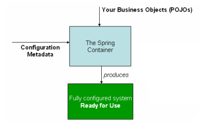

# Spring官方文档原文理解

深入理解Spring的AOP和IoC原理，对SpringMVC的工作流程有自己的见解，阅读过Spring的官方文档

[TOC]

# 第三章、Core Technologies

这部分的参考文档覆盖了 Spring 不可或缺的所有技术。

首当其冲地就是 Spring 的 ==IoC== 容器。 IoC 容器处理好之后，紧接着就是 ==AOP== 技术的全面覆盖。Spring 有自己的 AOP 框架，不仅概念上易于理解，而且成功地解决了Java企业编程中80%的 AOP 需求。

本文覆盖了 Spring 的 AspectJ (在功能方面是最丰富的并且在Java企业空间中是最成熟的AOP实现)

- The IoC container
- Resources
- Validation, Data Binding, and Type Conversion
- Spring Expression Language (SpEL)
- Aspect Oriented Programming with Spring
- Spring AOP APIs


## 6、The IoC container

- Introduction to the Spring IoC container and beans


### 6.1、Introduction to the Spring IoC container and beans

​	这一章覆盖了 ==IoC== (控制反转：Inversion of Control )的实现原理。IoC 也叫做 **DI** (依赖注入：Dependency Injection)，这是对象借此定义它们的依赖的一个过程 ，也就是说，他们使用的其他对象(其他对象：这里指对象的依赖)只通过构造器参数、工厂方法参数和构造好地或工厂方法返回地实例对象的属性(这里指定位依赖的方式)，当创建bean时容器就开始注入那些依赖，这一过程是根本地反转，因此才被叫做``控制反转`` —— 应用自身控制实例化或者是类似于服务定位器模式这样的机制直接通过类的构造来定位它们自己的依赖。

​	org.springframework.beans 和 org.springframework.context 包是 IoC 容器的基石。BeanFactory 接口提供了一个可以管理任何对象类型的先进配置机制，而ApplicationContext是BeanFactory的一个子接口，对于消息资源处理（用于国际化），事件发布和类似于在网页应用中使用的WebApplicationContext的应用层特定上下文而言，添加Spring的AOP功能更方便。

长话短说，BeanFactory 提供框架配置和基础功能，而ApplicationContext添加更多企业特有功能。ApplicationContext 是 BeanFactory 的一个完整超集，在IoC容器的描述中被使用到。有关于使用BeanFactory而不是ApplicationContext的详细信息请参考 6.16、“The BeanFactory”这一节。

在Spring框架中，构成应用程序主干并且被IoC容器管理的对象叫做bean。一个bean就是一个被实例化、组装和IoC容器管理的对象，不然，一个bean只不过是应用程序中的一个普通对象。bean和其依赖的关系反映在容器使用的元数据数据配置中。


###  6.2、Container overview

​	org.springframework.context.ApplicationContext 接口作为 Spring 的 IoC 容器有责任实例化、配置和组装上述 bean。容器读取元数据配置来获取实例化、配置和组装的相关信息。元数据配置可以使用 XML 文件、Java 注解和 Java 代码。还允许去表示构成应用程序的对象以及他们之间复杂的依赖关系。

一些 Spring 的 ApplicationContext 接口实现能做到开箱即用，独立的应用程序中通常创建 ClassPathXmlApplicationContext 或者是 FileSystemXmlApplicationContext 的实例。尽管 XML 是定义配置元数据时使用的传统格式，但是通过极少的 XML 配置可以声明支持额外的元数据格式让容器使用Java注解或代码。

在大多数应用程序的场景中，实例化一个或者多个 Spring 的 IoC 容器不需要明确的用户代码。打个比方，一个网页应用场景中，在应用程序的“web.xml”文件里，一个八行左右的XML网页描述符模板通常就够用了(详细信息请查看“便捷的网页应用上下文实例化”这一部分)。如果你使用Spring Tool Suite(Spring工具箱)的Eclipse驱动开发环境，只要点几下鼠标或者按键，就能轻松地创建这种模板配置。

下面是一张Spring的工作示意图，业务类和配置元数据一起组装以便于后面ApplicationContext的创建和初始化，然后你就有了一个开箱即用的系统或应用软件。




####   Configuration metadata

如上图所示，这是IoC容器使用元数据配置的一种方式。这个元数据配置体现了，作为一个应用软件开发者，应该告诉容器怎样去实例化、配置和组装应用软件中的对象。

简单直观的XML格式元数据配置是传统做法，这章大部分都用元数据配置来解说 IoC 容器的关键概念和特性。

> Note
>
> XML不是唯一的元数据配置方式，Spring 的 IoC 容器在元数据配置的写法上是完全解耦的，现阶段许多开发者的 Spring 应用程序都选择基于Java 的配置方式

有关于使用其他形式的 Spring 容器元数据格式请查看:

- 基于注解的配置：Spring2.5 引进了对基于注解的元数据配置的支持

- 基于Java 的配置：从 Spring3.0 开始，Spring 的 Java 配置项提供的许多功能成为了 Spring 框架的核心部分，因此你可以使用 Java 代码而不是XML文件在应用程序类中定义外部 bean，要使用这些新的功能，请查看 @Configuration、@Bean、@Import 和 @DependsOn 注解

Spring 配置由一个或多个必须被容器管理的 bean 定义组成，XML元数据配置表现出这些 bean 配置就像顶级的<beans/>元素中的<bean/>，而典型的 Java 配置会在 @Configuration 配置类中使用带有 @Bean 注解的方法

这些 bean 定义相当于真正构成应用程序的对象，一般会定义服务层对象、数据访问层(DAO)对象、 引入对象如：Struts 的 Action实例、基础结构对象如：Hibernate SessionFactories（Hibernate 会话工厂）、JMS Queue(Java Messaage Service Queue：Java消息服务队列)等等。不过在容器中没有配置低粒度的领域对象，因为通常来说，DAO的任务就是用来和业务逻辑一起创建并加载领域对象。然而，使用 Spring 的 AspectJ 同样可以配置非 IoC 容器创建的外部对象，请查看“使用 Spring 的 AspectJ 依赖注入领域对象”这一节

下面的例子展示了XML元数据配置的基础结构：

````xml
<?xml version="1.0" encoding="UTF-8"?>
 <beans xmlns="http://www.springframework.org/schema/beans"
     xmlns:xsi="http://www.w3.org/2001/XMLSchema-instance"
     xsi:schemaLocation="http://www.springframework.org/schema/beans
     http://www.springframework.org/schema/beans/spring-beans.xsd">
     <bean id="..." class="...">
     <!-- 在这查看 bean 的协同者和配置 -->
     <!-- collaborators and configuration for this bean go here -->
     </bean>
     <bean id="..." class="...">
  	 <!-- 在这查看 bean 的协同者和配置 -->
     <!-- collaborators and configuration for this bean go here -->
     </bean>
     <!-- 在这查看更多的 bean 定义 -->
     <!-- more bean definitions go here -->
 </beans>
````

id 属性是一个字符串，用于标识单个的 bean 定义，class属性使用全限定名定义 bean 的类型。id 的值指的是协同对象，本示例中未展示引用协同对象的XML，有关详细信息请查看“依赖”


#### **Instantiating a container**

安装一个 Spring 的 IoC 容器是非常简单的，因为提供给应用程序或者 ApplicationContext 构造器的定位路径实际上就是资源字符串罢了，它允许容器从各种外部资源中加载元数据配置，如本地文件系统、Java CLASSPATH(Java 类路径)等等

`````java
ApplicationContext context =
new ClassPathXmlApplicationContext(new String[] { "services.xml", "daos.xml"});
`````

> Note
>
> 当了解 Spring 的 IoC 容器后，可能还想洞悉 Spring 的 Resource 抽象。如第七章资源所述，它提供了一个方便的机制，可以读取 URI 语法中定位的输入流。这里特别指出的是，资源路径可以用于构造应用程序上下文如同 7.7 小节描述的“应用程序上下文和资源路径”一样。

下面的例子展示了服务层对象的(services.xml)配置文件：

```xml
<?xml version="1.0" encoding="UTF-8"?>
 <beans xmlns="http://www.springframework.org/schema/beans"
         xmlns:xsi="http://www.w3.org/2001/XMLSchema-instance"
         xsi:schemaLocation="http://www.springframework.org/schema/beans
         http://www.springframework.org/schema/beans/spring-beans.xsd">
         <!-- 服务 -->
         <!-- services -->
         <bean id="petStore"                         class="org.springframework.samples.jpetstore.services.PetStoreServiceImpl">
         <property name="accountDao" ref="accountDao"/>
         <property name="itemDao" ref="itemDao"/>
         <!-- 在这查看 bean 里的其他协作者和配置 -->
         <!-- additional collaborators and configuration for this bean go here -->
         </bean>
     	 <!-- 在这查看更多的服务 bean 定义 -->
         <!-- more bean definitions for services go here -->
 </beans>
```

下面的例子展示了数据访问对象的“daos.xml”文件：

````xml
 <?xml version="1.0" encoding="UTF-8"?>
 <beans xmlns="http://www.springframework.org/schema/beans"
         xmlns:xsi="http://www.w3.org/2001/XMLSchema-instance"
         xsi:schemaLocation="http://www.springframework.org/schema/beans
         http://www.springframework.org/schema/beans/spring-beans.xsd">
         <bean id="accountDao"
             class="org.springframework.samples.jpetstore.dao.jpa.JpaAccountDao">
         <!-- 在这查看 bean 里的其他协作者和配置 -->
         <!-- additional collaborators and configuration for this bean go here -->
         </bean>
         <bean id="itemDao" class="org.springframework.samples.jpetstore.dao.jpa.JpaItemDao">
        <!-- 在这查看 bean 里的其他协作者和配置 -->
         <!-- additional collaborators and configuration for this bean go here -->
         </bean>
      	<!-- 在这查看更多的数据访问对象 bean 定义 -->
         <!-- more bean definitions for data access objects go here -->
 </beans>
````

在上面的示例中，服务层由 PetSoreServiceImpl 类和JpaAccountDao及JpaItemDao两个数据访问类型对象组成(基于 JPA 对象关系映射标准) 。property name元素引用 JavaBean 的属性名，而 ref 元素引用另一个 bean 定义名称，这在 id 和 ref 元素之间的链接表示协同对象之间的依赖关系，对于配置对象依赖项的细节，请查看“Dependencies”

##### **Composing XML-based configuration metadata**

对于多重XML文件bean 定义空间是十分有用的，一般来说，独立的XML配置文件体现了逻辑层或架构模块

你可以使用应用上下文构造器从所有的XML片段中加载 bean 定义，这是构造器的多重 Resource 定位，就像之前的片段所展示的一样，随即使用一个或多个<import/>元素从另一个文件或其他文件加载 bean 定义。例如：

```xml
<beans>
	<import resource="services.xml"/>
	<import resource="resources/messageSource.xml"/>
	<import resource="/resources/themeSource.xml"/>
	<bean id="bean1" class="..."/>
	<bean id="bean2" class="..."/>
</beans>
```

在上面的例子中，外部 bean 定义需要从 service.xml、messageSource.xml 和 themeSource.xml 三个文件中加载，所有关联的路径定义文件导入，因此 service.xml必须在相同的目录下或者类路径下作导入，而且 messageSource.xml 和 themeSource.xml 必须在 resources 导入文件的位置下。如你所见，它会忽略前导斜杠，但是考虑到这些路径是关联的，最好不要使用斜杠。正在导入的文件内容包含顶级的 <bean/> 元素，依据Spring的方案，它一定是行之有效的XML bean 定义。


> Notes
>
> 这是有可能的，但是我们并不推荐在父目录下使用关联的”../“ 路径去引用文件。这样做会在当前的应用中创建外部文件依赖。特别地，这种引用方式也不推荐用于“classpath” URLs（例如：“classpath:../services.xml”）,运行时环境会选择“最近的”classpath根路径并且查看它的父目录。Classpath配置的变更也许会导致选择一个不同的、错误的目录
>
> 你可以始终使用完全限定的资源位置代替关联路径：例如，“file:C:/config/services.xml” or "classpath:/config/services.xml"。无论如何，你要知道，你这样做是将你的应用耦合到指定绝对位置。通常来说，我们最好对这样的绝对目录保持间接性，例如，通过 “${}” 占位符在运行时根据JVM系统属性进行解析


#### Using the Container

`ApplicationContext`是一个维护不同bean及其依赖关系注册的高级工厂的接口。使用方法

```java
T getBean(String name, Class<T> requiredType)
```

通过这个方法你可以获取bean实例。

ApplicationContext 能够让你阅读 bean 定义并且访问他们，如下所示：

```java
// 从配置文件中加载应用上下文并创建和配置bean
ApplicationContext context =
 new ClassPathXmlApplicationContext(new String[] {"services.xml", "daos.xml"});
// 获取配置bean实例
PetStoreService service = context.getBean("petStore", PetStoreService.class);
// 使用bean配置实例
List<String> userList = service.getUsernameList();
```

你可以使用getBean()方法获取bean实例。ApplicationContext 接口很少有其他方法用于获取bean，但是理论上你的项目代码应该从未使用过它们。实际上，你的项目代码应该根本就没有调用过getBean()方法并且没有依赖过Spring APIs。举个例子，Spring集成的WEB框架为可变的WEB框架classes提供依赖注入例如控制器和JSF管理的bean

### 6.3 Bean  overview

一个Spring的IoC容器管理着一个或者多个bean，这些bean是基于你提供给容器的配置元数据来创建的，举个例子，XML表格中的 <bean/> 定义

在容器内部，这些bean定义代表了 BeanDefinition 对象，其中包含（其他信息）以下元数据：

- 一个限定包类名：通常是正在定义的bean的实现类
- Bean 行为配置元素，他说明了bean在容器中应该如何作为（范围，生命周期，回调等等）
- 引用了完成其工作所需要的其他bean；这些引用会调用协作者或者依赖
- 其他配置项会在新创建的对象中设置，例如，在一个管理连接池的bean中使用的连接数，或者是连接池上限大小

元数据转换一组属性组成其他bean定义

Table 6.1. The bean definition

|                  属性                  |            释义在...            |
| :------------------------------------: | :-----------------------------: |
|              class（类）               |   “Instantiating beans”  这节   |
|              name（名称）              |       “Naming bean” 这节        |
|             scope（范围）              |       6.5节 “Bean scopes”       |
|  constructor arguments（构造器参数）   |   “Depandency Injection” 这节   |
|           properties（属性）           |   “Depandency Injection” 这节   |
|    autowiring mode（自动处理模式）     | “Autowiring collaborators”这节  |
| lazy-initialization mode（懒加载模式） | “Lazy-initialization beans”这节 |
|  initialization method（初始化方法）   | “Initialization callbacks”这节  |
|     destruction method（回收方法）     |   “Destruction callbacks”这节   |

除了包含如何创建特定bean信息的bean定义之外，ApplicationContext 实现也允许通过用户注册创建在外部容器中的现有对象。通过方法`getBeanFactory()`返回BeanFactory的实现`DefaultListableBeanFactory`访问ApplicationContext的BeanFactory来实现。`DefaultListableBeanFactory` 支持通过`registerSingleton(..)`方法和`registerBeanDefinition()`方法来注册，然而，通常应用工作只用于bean定义通过bean定义元数据


> Notes
>
> Bean元数据和其手动提供的单例模式实例需要尽可能早地注册，以便容器在自动装配和其他自省步骤中正确地使用它们。然而Spring在某种程度只支持重写现存的元数据和单例模式实例，不支持在运行时注册一个新的bean，否则可能会导致并发访问异常或者在bean容器中会出现不一致的状态


#### Naming beans

每个bean都有一个或多个标识符（标识符：bean的名称）。这些标识符必须在承载的容器内是唯一的。一个Bean通常有只有一个标识符，但是如果需要多个，其他的标识符名称可以认为是别名。

基于XML的配置，使用 id 和 name（或其中之一）属性指定 bean的标识符。id 属性允许你准确地指定一个id。按照惯例这些名称都是包含文字和数字的 ('myBean', 'fooService', 等等)，

