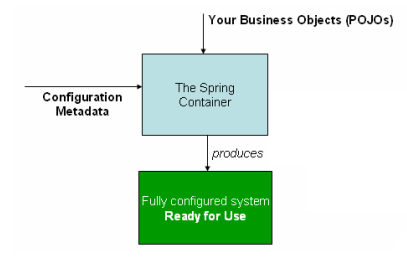

#  深入理解Spring框架

深入理解Spring的AOP和IoC原理，对SpringMVC的工作流程有自己的见解，阅读过Spring的官方文档

[TOC]

## 第三章、Core Technologies

这部分的参考文档覆盖了 Spring 不可或缺的所有技术。

首当其冲地就是 Spring 的 ==IoC== 容器。 IoC 容器处理好之后，紧接着就是 ==AOP== 技术的全面覆盖。Spring 有自己的 AOP 框架，不仅概念上易于理解，而且成功地解决了Java企业编程中80%的 AOP 需求。

本文覆盖了 Spring 的 AspectJ (在功能方面是最丰富的并且在Java企业空间中是最成熟的AOP实现)

- The IoC container
- Resources
- Validation, Data Binding, and Type Conversion
- Spring Expression Language (SpEL)
- Aspect Oriented Programming with Spring
- Spring AOP APIs


### 3.1、The IoC container

- Introduction to the Spring IoC container and beans


#### 3.1.1、Introduction to the Spring IoC container and beans

​	这一章覆盖了 ==IoC== (控制反转：Inversion of Control )的实现原理。IoC 也叫做 **DI** (依赖注入：Dependency Injection)，这是对象借此定义它们的依赖的一个过程 ，也就是说，他们使用的其他对象(其他对象：这里指对象的依赖)只通过构造器参数、工厂方法参数和构造好地或工厂方法返回地实例对象的属性(这里指定位依赖的方式)，当创建bean时容器就开始注入那些依赖，这一过程是根本地反转，因此才被叫做``控制反转`` —— 应用自身控制实例化或者是类似于服务定位器模式这样的机制直接通过类的构造来定位它们自己的依赖。

​	org.springframework.beans 和 org.springframework.context 包是 IoC 容器的根基。BeanFactory 接口提供了一个可以管理任何对象类型的先进配置机制，而ApplicationContext是BeanFactory的一个子接口，对于消息资源处理（用于国际化），事件发布和类似于在网页应用中使用的WebApplicationContext的应用层特定上下文而言，添加Spring的AOP功能更方便。

长话短说，BeanFactory 提供框架配置和基础功能，而ApplicationContext添加更多企业特有功能。ApplicationContext 是 BeanFactory 的一个完整超集，在IoC容器的描述中被使用到。有关于使用BeanFactory而不是ApplicationContext的详细信息请参考 6.16、“The BeanFactory”这一节。

在Spring框架中，构成应用程序主干并且被IoC容器管理的对象叫做bean。一个bean就是一个被实例化、组装和IoC容器管理的对象，不然，一个bean只不过是应用程序中的一个普通对象。bean和其依赖的关系反映在容器使用的元数据数据配置中。


####  3.1.2、Container overview

​	org.springframework.context.ApplicationContext 接口作为 Spring 的 IoC 容器有责任实例化、配置和组装上述 bean。容器读取元数据配置来获取实例化、配置和组装的相关信息。元数据配置可以使用 XML 文件、Java 注解和 Java 代码。还允许去表示构成应用程序的对象以及他们之间复杂的依赖关系。

一些 Spring 的 ApplicationContext 接口实现能做到开箱即用，独立的应用程序中通常创建 ClassPathXmlApplicationContext 或者是 FileSystemXmlApplicationContext 的实例。尽管 XML 是定义配置元数据时使用的传统格式，但是通过极少的 XML 配置可以声明支持额外的元数据格式让容器使用Java注解或代码。

在大多数应用程序的场景中，实例化一个或者多个 Spring 的 IoC 容器不需要明确的用户代码。打个比方，一个网页应用场景中，在应用程序的“web.xml”文件里，一个八行左右的XML网页描述符模板通常就够用了(详细信息请查看“便捷的网页应用上下文实例化”这一部分)。如果你使用Spring Tool Suite(Spring工具箱)的Eclipse驱动开发环境，只要点几下鼠标或者按键，就能轻松地创建这种模板配置。

下面是一张Spring的工作示意图，业务类和配置元数据一起组装以便于后面ApplicationContext的创建和初始化，然后你就有了一个开箱即用的系统或应用软件。




####   3.1.3、Configuration metadata

如上图所示，这是IoC容器使用元数据配置的一种方式。这个元数据配置体现了，作为一个应用软件开发者，应该告诉容器怎样去实例化、配置和组装应用软件中的对象。

简单直观的XML格式元数据配置是传统做法，这章大部分都用元数据配置来解说 IoC 容器的关键概念和特性。

> Note
>
> XML不是唯一的元数据配置方式，Spring 的 IoC 容器在元数据配置的写法上是完全解耦的，现阶段许多开发者的 Spring 应用程序都选择基于Java 的配置方式

有关于使用其他形式的 Spring 容器元数据格式请查看:

- 基于注解的配置：Spring2.5 引进了对基于注解的元数据配置的支持

- 基于Java 的配置：从 Spring3.0 开始，Spring 的 Java 配置项提供的许多功能成为了 Spring 框架的核心部分，因此你可以使用 Java 代码而不是XML文件在应用程序类中定义外部 bean，要使用这些新的功能，请查看 @Configuration、@Bean、@Import 和 @DependsOn 注解

Spring 配置由一个或多个必须被容器管理的 bean 定义组成，XML元数据配置表现出这些 bean 配置就像顶级的<beans/>元素中的<bean/>，而典型的 Java 配置会在 @Configuration 配置类中使用带有 @Bean 注解的方法

这些 bean 定义相当于真正构成应用程序的对象，一般会定义服务层对象、数据访问层(DAO)对象、 引入对象如：Struts 的 Action实例、基础结构对象如：Hibernate SessionFactories（Hibernate 会话工厂）、JMS Queue(Java Messaage Service Queue：Java消息服务队列)等等。不过在容器中没有配置低粒度的领域对象，因为通常来说，DAO的任务就是用来和业务逻辑一起创建并加载领域对象。然而，使用 Spring 的 AspectJ 同样可以配置非 IoC 容器创建的外部对象，请查看“使用 Spring 的 AspectJ 依赖注入领域对象”这一节

下面的例子展示了XML元数据配置的基础结构：

````xml
<?xml version="1.0" encoding="UTF-8"?>
 <beans xmlns="http://www.springframework.org/schema/beans"
     xmlns:xsi="http://www.w3.org/2001/XMLSchema-instance"
     xsi:schemaLocation="http://www.springframework.org/schema/beans
     http://www.springframework.org/schema/beans/spring-beans.xsd">
     <bean id="..." class="...">
     <!-- 在这查看 bean 的协同者和配置 -->
     <!-- collaborators and configuration for this bean go here -->
     </bean>
     <bean id="..." class="...">
  	 <!-- 在这查看 bean 的协同者和配置 -->
     <!-- collaborators and configuration for this bean go here -->
     </bean>
     <!-- 在这查看更多的 bean 定义 -->
     <!-- more bean definitions go here -->
 </beans>
````

id 属性是一个字符串，用于标识单个的 bean 定义，class属性使用全限定名定义 bean 的类型。id 的值指的是协同对象，本示例中未展示引用协同对象的XML，有关详细信息请查看“依赖”


#### **Instantiating a container**

安装一个 Spring 的 IoC 容器是非常简单的，因为提供给应用程序或者 ApplicationContext 构造器的定位路径实际上就是资源字符串罢了，它允许容器从各种外部资源中加载元数据配置，如本地文件系统、Java CLASSPATH(Java 类路径)等等

`````java
ApplicationContext context =
new ClassPathXmlApplicationContext(new String[] { "services.xml", "daos.xml"});
`````

> Note
>
> 当了解 Spring 的 IoC 容器后，可能还想洞悉 Spring 的 Resource 抽象。如第七章资源所述，它提供了一个方便的机制，可以读取 URI 语法中定位的输入流。这里特别指出的是，资源路径可以用于构造应用程序上下文如同 7.7 小节描述的“应用程序上下文和资源路径”一样。

下面的例子展示了服务层对象的(services.xml)配置文件：

```xml
<?xml version="1.0" encoding="UTF-8"?>
 <beans xmlns="http://www.springframework.org/schema/beans"
         xmlns:xsi="http://www.w3.org/2001/XMLSchema-instance"
         xsi:schemaLocation="http://www.springframework.org/schema/beans
         http://www.springframework.org/schema/beans/spring-beans.xsd">
         <!-- 服务 -->
         <!-- services -->
         <bean id="petStore"                         class="org.springframework.samples.jpetstore.services.PetStoreServiceImpl">
         <property name="accountDao" ref="accountDao"/>
         <property name="itemDao" ref="itemDao"/>
         <!-- 在这查看 bean 里的其他协作者和配置 -->
         <!-- additional collaborators and configuration for this bean go here -->
         </bean>
     	 <!-- 在这查看更多的服务 bean 定义 -->
         <!-- more bean definitions for services go here -->
 </beans>
```

下面的例子展示了数据访问对象的“daos.xml”文件：

````xml
 <?xml version="1.0" encoding="UTF-8"?>
 <beans xmlns="http://www.springframework.org/schema/beans"
         xmlns:xsi="http://www.w3.org/2001/XMLSchema-instance"
         xsi:schemaLocation="http://www.springframework.org/schema/beans
         http://www.springframework.org/schema/beans/spring-beans.xsd">
         <bean id="accountDao"
             class="org.springframework.samples.jpetstore.dao.jpa.JpaAccountDao">
         <!-- 在这查看 bean 里的其他协作者和配置 -->
         <!-- additional collaborators and configuration for this bean go here -->
         </bean>
         <bean id="itemDao" class="org.springframework.samples.jpetstore.dao.jpa.JpaItemDao">
        <!-- 在这查看 bean 里的其他协作者和配置 -->
         <!-- additional collaborators and configuration for this bean go here -->
         </bean>
      	<!-- 在这查看更多的数据访问对象 bean 定义 -->
         <!-- more bean definitions for data access objects go here -->
 </beans>
````

在上面的示例中，服务层由 PetSoreServiceImpl 类和JpaAccountDao及JpaItemDao两个数据访问类型对象组成(基于 JPA 对象关系映射标准) 。property name元素引用 JavaBean 的属性名，而 ref 元素引用另一个 bean 定义名称，这在 id 和 ref 元素之间的链接表示协同对象之间的依赖关系，对于配置对象依赖项的细节，请查看“Dependencies”

#### **Composing XML-based configuration metadata**

对于多重XML文件bean 定义空间是十分有用的，一般来说，独立的XML配置文件体现了逻辑层或架构模块

你可以使用应用上下文构造器从所有的XML片段中加载 bean 定义，这是构造器的多重 Resource 定位，就像之前的片段所展示的一样，随即使用一个或多个<import/>元素从另一个文件或其他文件加载 bean 定义。例如：

```xml
<beans>
	<import resource="services.xml"/>
	<import resource="resources/messageSource.xml"/>
	<import resource="/resources/themeSource.xml"/>
	<bean id="bean1" class="..."/>
	<bean id="bean2" class="..."/>
</beans>
```

在上面的例子中，外部 bean 定义需要从 service.xml、messageSource.xml 和 themeSource.xml 三个文件中加载，所有关联的路径定义文件导入，因此 service.xml必须在相同的目录下或者类路径下作导入，而且 messageSource.xml 和 themeSource.xml 必须在 resources 导入文件的位置下

## Shortcut Keys

You could find shortcut keys in the right side of menu items from menu bar. For custom shortcut keys, please refer [here](Custom-Key-Binding/).

## Copy

We create typora and want to make it your default markdown editor, thus copy and paste means copy from another app or paste to another app, instead of *copy/paste from/to another markdown editor*. Therefore, by default, `Copy` means `Copy As HTML` ( and `Paste` means `Paste from HTML`). 

However, after click "**Copy Markdown source by default**", typora will copy selected text in HTML/markdown format (When pasting, rich editors will accept the HTML format, while plain text / code editor will accept the markdown source code format).

To **copy Markdown source code** explicitly, please use shortcut key `shift+cmd+c` or `Copy as Markdown` from menu. To **Copy as HTML Code**, please select `Copy as HTML Code` from menu.

## Smart Paste

**Typora** is able to analyze styles of the text content in your clipboard when pasting. For example, after pasting a `<h1>HEADING</h1>` from some website, typora will keep the 'first level heading’ format instead of paste ‘heading’ as plain text. 

To **paste as markdown source** or plain text, you should use `paste as plain text` or press the shortcut key: `shift+cmd+v`.

## Themes

Please refer to `Help` → `Custom Themes` from menu bar.

## Publish

Currently Typora only support to export as **PDF** or **HTML**. More data format support as import/export will be integrated in future.

## Auto Save and File Recovery

Typora support  auto save feature, user could enable it from preference panel. 

Typora does not provide professional version control and file backup feature, but typora would backup the last file content from time to time automatically, so even when typora crashes or users forget to save the file before close, it is possible to recovery most of the work by clicking `Recovery Unsaved Drafts` from preference folder, and copy out backed-up files. The File name in this folder is consists of last saved date, originally file name and last saved timestamp.

## More Useful Tips & Documents

<http://support.typora.io/>

## And More ?

For more questions or feedbacks, please contact us by:

- Home Page: http://typora.io
- Email: <hi@typora.io>
- Twitter [@typora](https://twitter.com/typora)

We opened a Github issue page in case you want to start a discussion or as an alternative way to report bugs/suggestions: https://github.com/typora/typora-issues/issues


## Append、WordAndPhrase

###  X.1、Word

whereby —— 凭此；借以；由于

advanced —— 先进的；高级的；后期的

superset —— 超集；父集

exclusively —— 专门地；特别地

backbone —— 脊柱；骨干；骨气，勇气

form —— 形状；方式；表格；塑造

assembled —— 聚集；集合

simply —— 简单；仅仅；只不过

aforementioned —— 上述的；前述的

compose —— 构成；撰写

boilerplate —— 样板文件；锅炉钢板

suffice —— 足够

typically —— 通常地；有代表性地；典型地；

keystroke —— 按键；击键

intuitive —— 直觉的

correspond to —— 相当于；符合于

individual —— 单独的；独立的


### X.2、Phrase

known as —— 被称为；被认为

that is —— 即，也就是说

on what —— 对于什么；关于什么

common to —— 常见的

scenarios —— 情况，情节


### X.3、Spring源码深度解析

```java
/*
	Spring源码深度解析

	Spring中最核心的两个类：

	1、DefaultListableBeanFactory
	2、XmlBeanDefinitionReader

	分析以下功能代码的实现：

	BeanFactory bf = new XmlBeanFactory(new ClassPathResource("beanFactoryTest.xml"));
*/

@SuppressWarnings("deprecation")
public class BeanFactoryTest {
	
	@Test
	public void testSimpleLoad() {

		// 分析以下功能代码的实现：
		BeanFactory bf = new XmlBeanFactory(new ClassPathResource("beanFactoryTest.xml"));
		MyTestBean bean = (MyTestBean)bf.getBean();
		assertEquals("testStr",bean.getTestStr());
		
	}
}

class MyTestBean {
	
	private String testStr = "testStr";

	public String getTestStr() {
		return testStr;
	}

	public void setTestStr(String testStr) {
		this.testStr = testStr;
	}
}


/*
	BeanFactory bf = new XmlBeanFactory(new ClassPathResource("beanFactoryTest.xml"));
	一、读取并封装配置文件（底层资源）
	Spring实现了自己的抽象结构：Resource 接口来封装底层资源
	Resource 继承了 InputStreamSource 接口，这个接口只有getInputStream()一个方法
*/
```


