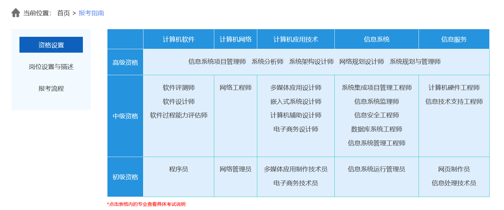
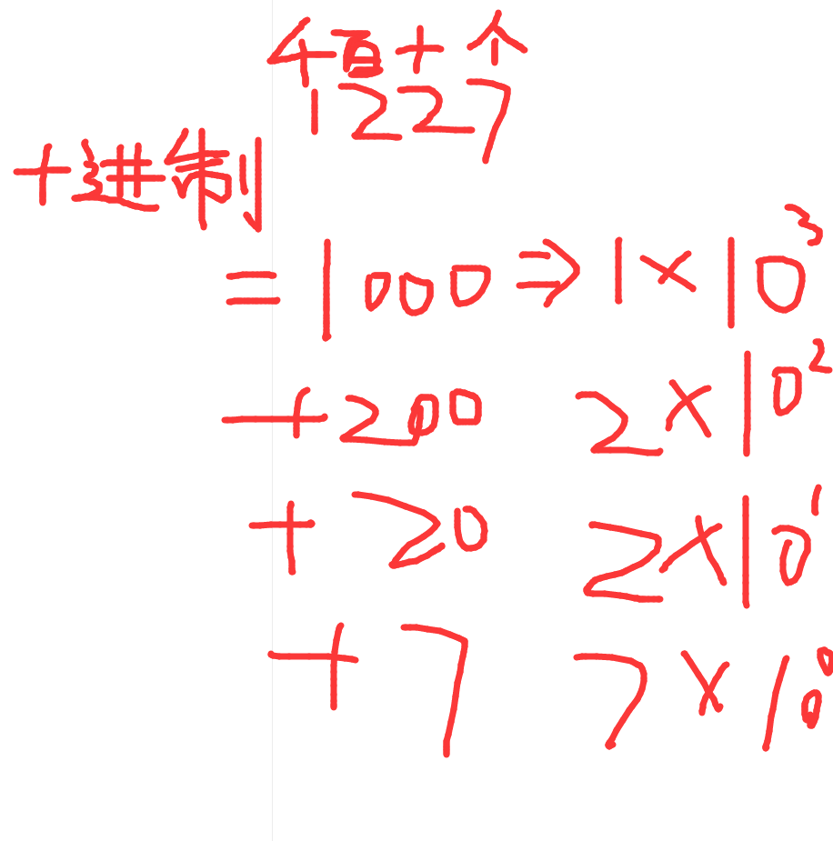
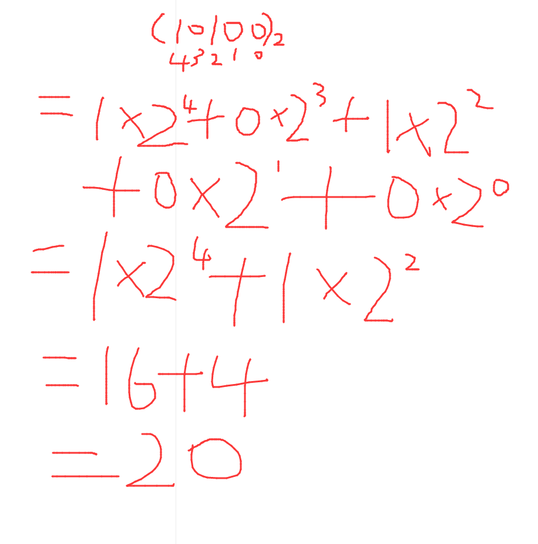
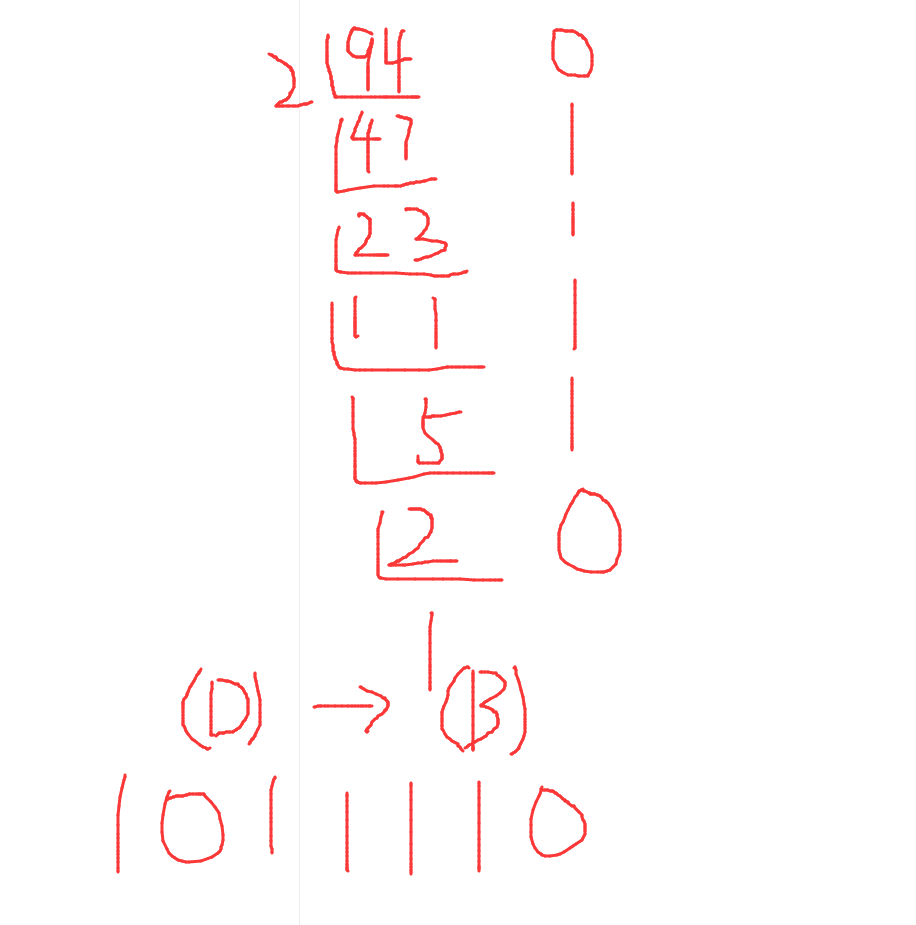
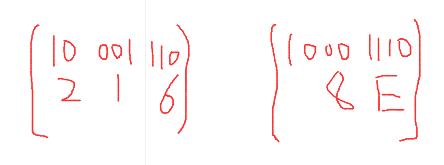

# 中级软件设计师

> 计算机技术与软件专业技术资格（水平）考试是原中国计算机软件专业技术资格和水平考试（简称软考）的完善与发展。这是由人力资源和社会保障部和工业和信息化部领导下的国家级考试，其目的是，科学、公正地对国家计算机与软件专业技术人员进行职业资格、专业技术资格认定和专业技术水平测试。
>
> 

[TOC]

# 前言

> 介绍

下半年考试时间一般为11月6-7日，软考是水平等级考试+职称认证考试的结合

==证书的作用==

- 职称可评为高级工程师，高级职称，以考代评
- 升职加薪
- 项目投标（要求项目经理资质）
- 落户

==国人部发[2003]39号文件==

第十条	通过考试并获得响应级别计算机专业技术资格（水平）证书的人员，表明其已具备从事相应专业岗位工作的水平和能力，用人单位可根据《工程技术人员职务试行条例》有关规定和工作需求，从获得计算机专业技术资格（水平）证书的人员中择优聘任相应专业技术职务。

取得初级资格可聘任技术员或助理工程师职务；取得中级资格可聘任工程师职务；**取得高级资格，可聘任高级工程师职务。**

第十一条	计算机专业技术资格（水平）实施全国统一考试后，不再进行计算机技术与软件相应专业和级别的专业技术职务任职资格评审工作

# 一、计算机组成与体系结构

- 数据的表示

## 1.1、数据的表示

> 简介

R进制转十进制使用按权展开法，其具体操作方式为：将R进制数的每一位数值用R^k形式表示，即幂的底数是R，指数为k，k与该位小数点之间的距离有关。当该位位于小数点左边，k值是该位和小数点之间数码的个数，而当该位位于小数点右边，k值是负值，其绝对值是该位和小数点之间数码的个数+1

### 1.1.1、R进制转十进制

- 例如**二进制**10100.01 = 1 * 2^(4) + 1 * 2^(2) + 1 * 2^(-2)

- 例如**七进制**604.01 = 6 * 7^(2) + 4 * 7^(0) + 1 * 7^(-2)

十进制的1227 = 1 * 10^(3) + 2 * 10^(2) + 2 * 10^(1) + 7 * 10^(0)

### 1.1.2、十进制转R进制

- ==十进制转R进制使用**短除法**==，例如将94转换为二进制数

### 1.1.3、二进制、八进制和十六进制的转换

二进制转八进制，三位二进制表示一位八进制数

二进制转十六进制，四位二进制表示一位十六进制数

二进制与八进制编码对应表

| 二进制 | 八进制 |
| :----: | :----: |
|  000   |   0    |
|  001   |   1    |
|  010   |   2    |
|  011   |   3    |
|  100   |   4    |
|  101   |   5    |
|  110   |   6    |
|  111   |   7    |

二进制与十六进制编码对应表

| 二进制 | 十六进制 |
| :----: | :------: |
|  0000  |    0     |
|  0001  |    1     |
|  0010  |    2     |
|  0011  |    3     |
|  0100  |    4     |
|  0101  |    5     |
|  0110  |    6     |
|  0111  |    7     |
|  1000  |    8     |
|  1001  |    9     |
|  1010  |    A     |
|  1011  |    B     |
|  1100  |    C     |
|  1101  |    D     |
|  1110  |    E     |
|  1111  |    F     |