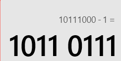
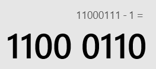
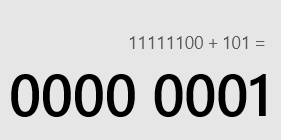

# 计算机组成原理-原码、反码和补码

[TOC]


# 1、机器数

> 简介

**一个数在计算机中的表示形式是二进制的话，这个数其实就叫机器数。**


机器数通常是带有符号的（指有正数和负数之分），计算机用最高位存放符号，这个bit一般叫做符号位。正数的符号位为0，  负数的符号位为1。比如，十进制中的数 +7 ，计算机字长为8位，转换成二进制就是0000 0111（一个byte有8bit，有效的取值范围是-128~+127）。

如果是 -7 ，就是 1000 0111  。一个存储的二进制码分原码、反码、补码，下面我们就来介绍一下什么是原码、反码、补码


> Notes
>
> 计算机底层使用二进制形式的补码来计算和存储数据


# 2、原码

> 定义

十进制数据的二进制表现形式就是原码，原码最左边的一个数字就是符号位，0为正，1为负。


例如：**56 -> 0 0 1 1 1 0 0 0**

左边第一位为符号位，其他位为数据位。

一个byte有8bit，最大值是 **0 1 1 1 1 1 1 1** (+127)，最小值是 **1 1 1 1 1 1 1 1** (-127)


在计算机中之所以使用二进制来表示原码是因为逻辑简单，对于电路来说只有开或者关两种状态，用二进制是在方便不过的了。如果使用的进制是十进制、八进制或者十六进制的话，电路没有办法表示那么多的状态


- 正数计算

使用原码对正数进行计算不会有任何问题的

例如：5 + 2

````operator
0 0 0 0 0 1 0 1
+       0 0 1 0
0 0 0 0 0 1 1 1
````

把这个结果转成十进制刚好就等于7，完全正确无误


- 负数计算

但是如果是负数的话，那计算的结果就会大相径庭了

我们拿 -56 这个数字来举例，它的原码是 **1 0 1 1 1 0 0 0** ，减一之后，就会变成 **1 0 1 1 0 1 1 1** ，这个数转成十进制就是-55。计算前是-56，减一之后正确的结果应该是-57（==1 0 1 1 1 0 0 1==）才对，居然还越减越大了

```operator
 1 0 1 1 1 0 0 0
-              1
 1 0 1 1 0 1 1 1
```




为了解决原码不能用于计算负数的这种问题，这时候，反码它出现了，作为负数的“计算的救星”。

计算规则是正数的反码不变和原码一致，负数的反码会在原码的基础上，高位的符号位不变，其他位取反（ 1 变成 0 ， 0 变为 1 ）。


# 3、反码

> 定义

正数的反码是其本身（等于原码），负数的反码是符号位保持不变，其余位取反。反码的存在是为了正确计算负数，因为原码不能用于计算负数

| 十进制数字 |   原码    |   反码    |
| :--------: | :-------: | :-------: |
|     +0     | 0000 0000 | 0000 0000 |
|     -0     | 1000 0000 | 1111 1111 |
|     -1     | 1000 0001 | 1111 1110 |
|     -2     | 1000 0010 | 1111 1101 |
|     -3     | 1000 0011 | 1111 1100 |
|     -4     | 1000 0100 | 1111 1011 |
|     -5     | 1000 0101 | 1111 1010 |
|     -6     | 1000 0110 | 1111 1001 |
|     -7     | 1000 0111 | 1111 1000 |


- 负数计算

这时候，我们再来使用反码计算一下 -56 - 1 的结果

**-56** 的原码是 **1 0 1 1 1 0 0 0** ，如果转成反码（符号位不变，其他位取反），

那么它的反码就是 **1 1 0 0 0 1 1 1 **

```operator
 1 1 0 0 0 1 1 1
 -             1
 1 1 0 0 0 1 1 0
```



-56 -1 = -57，-57的原码是 ==1 0 1 1 1 0 0 1==，转成反码刚好是==1 1 0 0 0 1 1 0==，刚好等于刚才我们算出的值


- 跨零计算

不过反码也有它的“软肋”，如果是负数跨零进行计算的话，计算得出的结果不对

我们拿-3 + 5来举例

-3 的原码是 ==1 0 0 0 0 0 1 1==，转成反码的话就是==1 1 1 1 1 1 0 0==

```operator
1 1 1 1 1 1 0 0
+       0 1 0 1  
0 0 0 0 0 0 0 1 
```



把计算结果转成十进制就是126，这结果显然不对。那么我们该怎么计算呢，这时候补码就出现了，作为反码的补充编码


# 4、补码

> 定义

**正数的补码是其本身，负数的补码等于其反码+1。因为反码不能解决负数跨零（类似于-6 + 7）的问题，所以补码出现了。**

| 十进制数字 |   原码    |   反码    |   补码    |
| :--------: | :-------: | :-------: | :-------: |
|     +0     | 0000 0000 | 0000 0000 | 0000 0000 |
|     -0     | 1000 0000 | 1111 1111 | 0000 0000 |
|     -1     | 1000 0001 | 1111 1110 | 1111 1111 |
|     -2     | 1000 0010 | 1111 1101 | 1111 1110 |
|     -3     | 1000 0011 | 1111 1100 | 1111 1101 |
|     -4     | 1000 0100 | 1111 1011 | 1111 1100 |
|     -5     | 1000 0101 | 1111 1010 | 1111 1011 |
|     -6     | 1000 0110 | 1111 1001 | 1000 0010 |
|     -7     | 1000 0111 | 1111 1000 | 1111 1001 |
|    ...     |    ...    |    ...    |    ...    |
|    -127    | 1111 1111 | 1000 0000 | 1000 0001 |
|    -128    |    无     |    无     | 1000 0000 |


- 跨零计算

这时候，我们再来使用反码计算一下-3 + 5的结果

-3 的原码是 ==1 0 0 0 0 0 1 1==，转成反码的话就是==1 1 1 1 1 1 0 0==，再转成补码就是==1 1 1 1 1 1 0 1==

```operator
1 1 1 1 1 1 0 1
+       0 1 0 1  
0 0 0 0 0 0 1 0
```

把这个数转成十进制刚好等于2，结果正确


# 5、总结

**在计算机当中都是使用补码来进行计算和存储的**。补码很好的解决了反码负数不能跨零计算的弊端，并且补码还可以记录一个特殊的值-128，这个数据在1个字节下是没有原码和反码


学习了原码、反码和补码的知识之后，我们就可以了解到，Java当中所有的基本数据类型。比如整数类型的数据类型，存储的数都是同样的，区别是在于什么地方，假设存储的值都是10

| 基本数据类型 |  值  | 字节数 |                      内存中实际存储的值                      |
| :----------: | :--: | :----: | :----------------------------------------------------------: |
|     byte     |  10  |   1    |                          0000 1010                           |
|    short     |  10  |   2    |                     0000 0000 0000 1010                      |
|     int      |  10  |   4    |           0000 0000 0000 0000 0000 0000 0000 1010            |
|     long     |  10  |   8    | 0000 0000 0000 0000 0000 0000 0000 0000 0000 0000 0000 0000 0000 0000 0000 1010 |

从上表中我们可以得出一个结论，为了凑齐字节数，所占的字节越大，则前面补的零越多。

> 类型转换原理

- 隐式类型转换

```java
public class Test {
	public static void main(String[] args) {
    	// 小的数据类型往大的数据类型进行转换底层就是通过左补零完成的
        byte a = 10; // 0000 1010
        int b = a;	 // 0000 0000 0000 0000 0000 0000 0000 1010
        System.out.println(b);
    }
}
```

- 强制类型转换

```java
public class Test {
	public static void main(String[] args) {
    	int a = 300;	   		// 0000 0000 0000 0000 0000 0001 0010 1100
        byte b = (byte) a; 		// 0010 1100
        System.out.println(b);	// 打印出44
        /*
        	int a = 200;	  		// 0000 0000 0000 0000 0000 0000 1100 1000
        	byte b = (byte)a; 		// 1100 1000
        	System.out.println(b);	// 打印出-56
        */
    }
}
```


补码的运算也适用于逻辑运算符

| 运算符 |    含义    |                           运算规则                           |
| :----: | :--------: | :----------------------------------------------------------: |
|   &    |   逻辑与   |             0为false，1为true，当都为1时才为true             |
|   \|   |   逻辑或   | 0为false，1为true，当有至少一个为1时为true，如果都没有则为false |
|   <<   |    左移    |                      向左移动，低位补零                      |
|   >>   |    右移    |      向右移动，高位补零，符号位按照原来数字的符号位不变      |
|  >>>   | 无符号右移 |                      向右移动，高位补零                      |