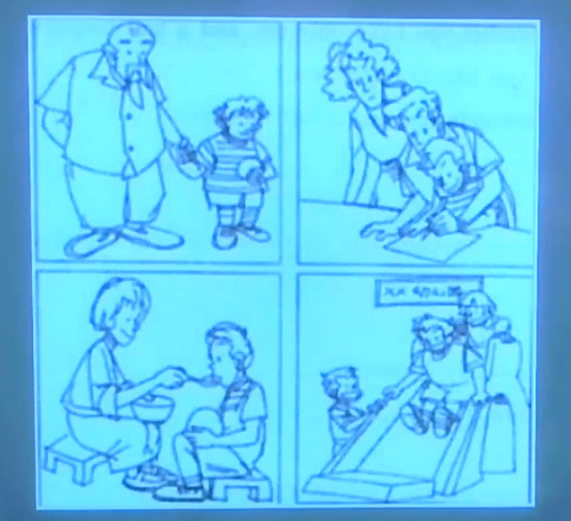
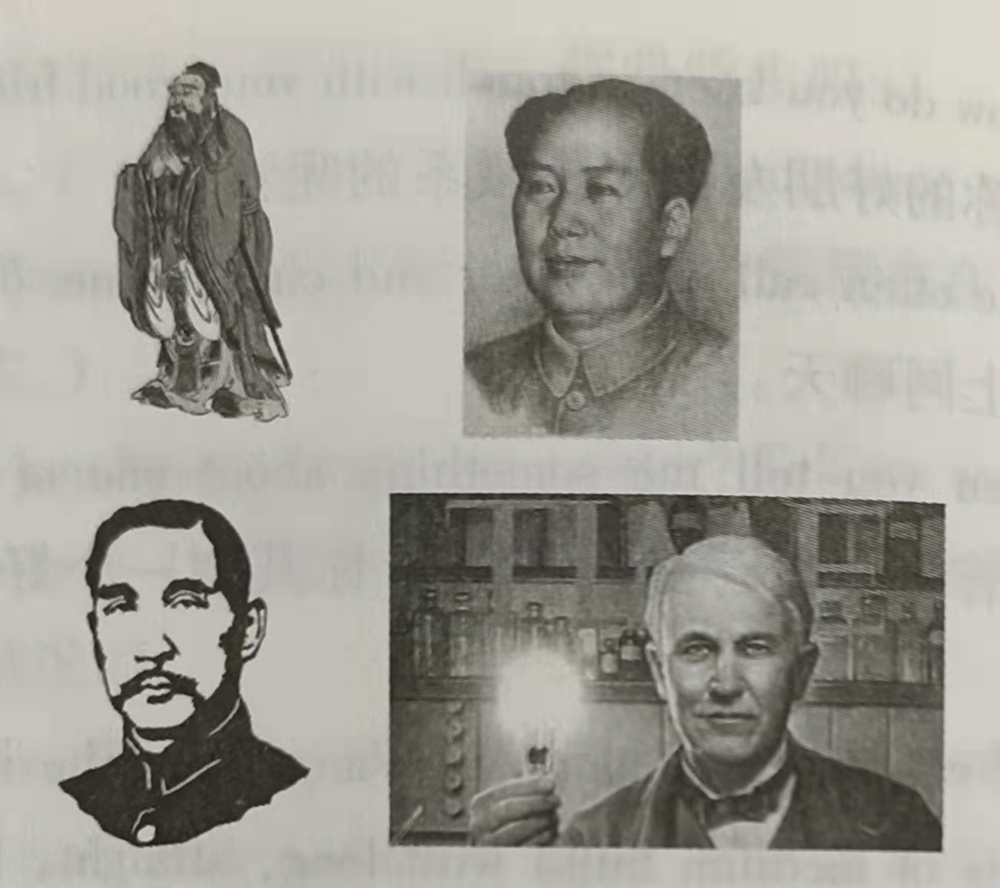
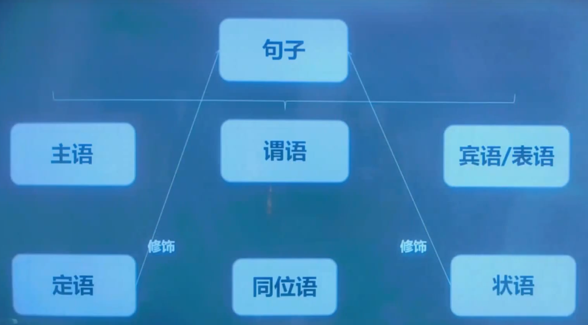
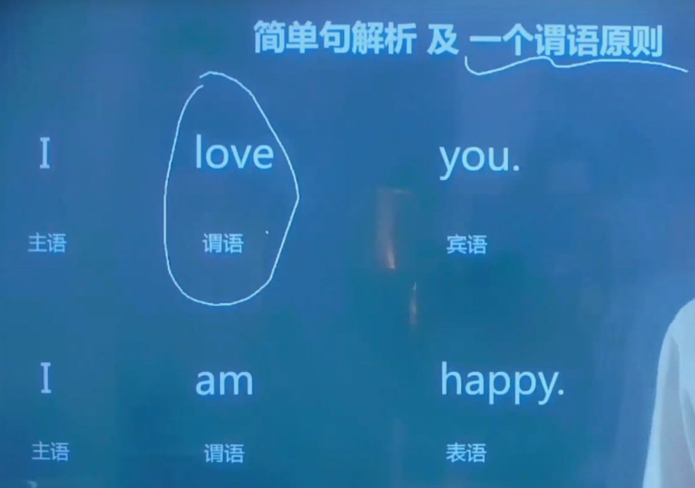

# 公共英语三级备考手册

> 2021年全国公共英语三级精讲课堂,针对2015年9月份后的改版调整课程，通过《全国英语等级考试标准教程  全新版  第3版》帮大家做好PETS3的备考学习，祝大家顺利通过考试~

[TOC]

# 一、考试大纲

- 公共英语三级适合人群
- 考试大纲修改前后变化
- 公三考试概况
- 阅读理解的变化
- 分数权重的计算
- 备考方案

## 1.1、公共英语三级适合人群

公三全称为全国公共英语三级考试（中间级），通过该级考试的考生，其英语水平基本达到高等教育自学考试、非英语专业本科毕业或普通高校非英语专业本科毕业的要求，基本满足企事业单位行政秘书、经理助理、一般管理人员或科技工作者、外企职员等工作再对外交往中的需求。

## 1.2、考试大纲修改前后变化

> 修改前

|     部分     |                 题量                 | 原始赋分 | 权重 |
| :----------: | :----------------------------------: | :------: | :--: |
|     听力     |                25小题                |   25分   | 30%  |
| 英语知识运用 |                20小题                |   20分   | 15%  |
|   阅读理解   | 3 篇，15 * 2 = 30 \| 1 篇，5 * 1 = 5 |   35分   | 30%  |
|     写作     |      A.应用文 \| B.英语提示信息      |   30分   | 25%  |
|     总计     |                80 + 2                |  110分   | 100% |

> 修改后

| 部分 | 时间（分钟） |  题量  | 原始赋分 |             备注             |
| :--: | :----------: | :----: | :------: | :--------------------------: |
| 听力 |      25      |   25   |    25    |                              |
| 阅读 |      50      |   30   |    25    |         D节每题0.5分         |
| 写作 |      45      |   2    |    30    | A节满分为10分，B节满分为20分 |
| 总计 |     120      | 55 + 2 |    80    |                              |

## 1.3、公三考试概况

> 组成

笔试：120分钟，80分为满分，听力、~~英语知识运用~~、阅读、写作

口试：10分钟，5分为满分。考察考生的口语交际能力

> 答题时间

笔试：听力25分钟，~~英语知识运用15分钟~~，阅读理解50分钟，写作30分钟

口试：10分钟

> 题量与采分点（原始赋分数）

笔试：听力25题25分，阅读30题25分，写作2篇作文（A节10分，B节20分）共30分

卷成原始赋分数为80分。

口试5分

## 1.4、阅读理解的变化

> 概述

该部分由A、B、C、D四节组成，考察考生理解书面英语的能力。

- A节（10题）：考察考生理解文章的具体信息、主旨要义、进行推理和引申等能力。要根据所提供的2篇文章的内容（每片平均约350个单词），从每题所给的4个选择项中选出最佳选项。
- B节（5题）：考察考生理解段落主旨要义的能力。要求考生从7个选择项中排除2个干扰项，正确地概括与5段文字（总长约350个单词）逐一搭配成对。
- C节（5题）：考察考生理解文章结构及单句之间、段落之间关系的能力。在篇文章中留出5处空白，要求考生从文后所给的7句话中选出分别能放进文章中空白处的5句，使得补足后的文章意思通顺、前后连贯
- D节（10题）：考察考生对话篇中词汇意义与用法的掌握情况以及对语篇连贯的理解，在一篇200-250词的文章中留出10处空白，要求考生从文后所给的15个单词中选出分别能放进文章中空白处的10个，使得补足后的文章意思通顺，前后连贯

## 1.5、分数权重的计算

为处理好考试中题目数量、赋分与各种技能的考察关系，PETS第三级笔试采用了分数权重制，即对各部分题目的原始赋分分别给予不同的权重，使之能够平衡各种技能的考察关系。

PETS-3采用分数加权的方法，其中听力权重30%，阅读权重40%，写作权重30%，合计100%

==实际分数 = 卷面得分数  / 该部分原始赋分数 * 权重==

如：某考生

听力部分原始得分为20分，经过加权处理后的分数应该为24分 （20 / 25 * 30）= 24

阅读理解原始得分为20分，经过加权处理后的分数应该为32分 （20 / 25 * 40）= 32

写作原始得分为16分，经过加权处理后的分数应该为16分 （16 / 30 * 30）= 16

## 1.6、备考方案

1. 提高基础 15天 —— 1个月
   - 词汇：基础词汇4000词
   - 语法：时态、从句、动词、主谓一致、虚拟语气
   - 句型：词组、常用表达式

2. 结合教材 1个月 —— 1个半月

   - 每天1个单元

   - 重点句子择记

   - 课后练习

3. 刷题巩固 1个月左右
   - 真题实战操练

4. 复习

> 可以独立发生，不牵扯到别的人或物，就叫不及物动词，不可直接接宾语，必须发生在另一个人的身上就是及物动词，可直接接宾语

# 二、口试要点

- 口试模拟
- PartA
- PartB
- PartC

## 2.1、口试模拟

A: May I come in? 

T:come in please.

A: Okay

> 如果听不清老师说的话，可以说 Excuse me, Could you say that again?

Good morning / afternoon. My name is Tom and this is my colleague Jack…, He/She is just going to be listening to us.

Give me your mark sheet please.

And your names are Lihua and Xiaochen(Yes, I am. or My name is ….)

- Part A

teacher：First of all we'd like to know something about you, Candidate A,  so I'm going to ask you some questions.

Probably question?

## 2.2、PartA(3 minutes)

- 工作
- 未来的发展规划
- 家乡和住处
- 家庭
- 爱好和兴趣
- 朋友
- 天气

> 对某些问题的看法（某城市的环境、交通等等）

### 2.2.1、工作

> 工作类型

**job（指的是具体的工作）**

part-time job（兼职工作）

full-time job（全职工作）

apply for a job（求职）

take a job（什么时候得到工作）

quit the job（辞职）

change my job（换工作）

transfer（调动）

career（指的是职业或职业规划）

> 企业类型

- **私营企业 private enterprise / company**

- 跨国公司 transnational corporation
- 国有企业 State Owned Enterprise (SOE)
- 股份公司 joint-stock company
- 事务所 firm
- 律师事务所 law firm
- 审计师事务所 auditing firm

1. 问工作

**Problem:**

- **What kind of work do you do?**
- **What's your job?**
- **What do you do? (How do you do?你好)**
- **What do you do for a living?**
- May I know what you currently do? Are you a student?
- Can you use simple language to describe your job to me?
- What's your ideal job?
- ~~Are you teacher?~~
- ~~Are you engineer?~~
- ~~Are you manager?~~
- ~~Are you white collar?~~

**Answer:**（准备两三句左右）

~~No / Yes, I am a worker at ZheJiang.~~

~~No / Yes, I am a worker. I work in an Internet company at ZheJiang.~~

No / Yes, I'm a worker.

I choose programming as my profession.

I've worked as the programmer in background for 2 years.

Programming is a imaginative profession. As far as I'm concerned,  no profession is mysterious and magical  than the profession of Programming,  there is only one line of code, and we can't predict its execution result too. isn't  it?

I like the kind of job hat requires creative ability, such as the job of designing database

~~I work  for an internet company~~ 

**Other:**

1. How do you like programer? / Do you care for this occupation?

Awesome, I've a good-paying job with excellent hours.

Yes. I like it very much though it makes me very busy.

2. Where are you studying?  or Where are you go to school?

Not, I'm a computer programmer

3. What do you do at work every day? 

writing code and technology development

4. What kind of jobs do you like best?

I like interesting and challenging job, just like programming.

5. What are the important qualities for one to succeed in his career?

I think the qualities of hard work and perseverance are very important for one to succeed.

### 2.2.2、未来的发展规划

> 未来的发展想法

**Problem:**

- ~~What do you want to do when you graduate?~~
- What do you want to do in your future?
- Have you decided yet?

**Answer:**

I will become a software enginner when I get a number of achievements in domain of computer.

~~（as soon as I graduate）(可用状语替代).~~

**Problem:**

- Have you ever thought about a career in the advertisement?

- Have you ever thought about working in Beijing/else city?

- Have you ever thought about going abroad?

上面几句可以用Yes or No来回答，当问出Why的时候，再用下面地句子回答

**Answer:**

Yes, of course. Though I very like coding, I wouldn't want it be my life's work. 

### 2.2.3、家乡和住处

> 当听到where开头就可以确定是问你住哪了

1. 问家乡 / 住处

**Problem:**

- Where do you come from?
- ~~Where are you from?~~
- Where is your hometown?
- Where did you live before you came here?

**Answer:**

I come from JiangXi.

JiangXi is my hometown.

~~I lived in JiangXi.~~

I come from JiangXi, but I'm living in Hangzhou now.

**Other:**

 Where are you come from?

I'm come from the city of Nanchang, which is in Jiangxi Province.

2. 问你住了多久

**Problem:**

How long have you lived here?

**Answer:**

I have lived here for 2 / 20 years.

3. 对家乡（或其他城市的看法）

- How do you like it?
- What do you think of the city of Beijing / HangZhou?
- What do you think are the good points about living there?
- Why?

**Other:**

1. What do you think of Nanchang?

Nanchang is a outstanding city with a beautiful lake scenery and lt's very clean.

2. May I know where you live? Do you like the place you are living now?

I live Hangzhou and love this city. I think lt's an attractive place with lots of good food. In addition, I think that it is really wonderful. Since the transportation is quite convenient and the weather is pleasant, it is easy for us to travel the city and have a great time.

### 2.2.4、家庭

|         父系         |             母系             |
| :------------------: | :--------------------------: |
| 弟弟 younger brother |       叔叔、伯伯 uncle       |
| 妹妹 younger sister  |   阿姨、姑姑 aunt / aunty    |
|  哥哥 elder brother  |      侄女、外甥女 niece      |
|   大哥 big brother   |      侄子、外甥 nephew       |
|  姐姐 elder sister   |    表、堂兄弟姐妹 cousin     |
|   大姐 big sister    |      岳父 father-in-law      |
|     祖父 grandpa     |      岳母 mother-in-law      |
|     祖母 grandma     |       继母 step-mother       |
| 曾祖父 great-grandpa |       继父 step-father       |
| 曾祖母 great-grandma |       女婿 son-in-law        |
|                      |     儿媳 daughter-in-law     |
|                      | 同母异父或同父异母的兄弟姐妹 |
|                      |  half brother / half sister  |

**Problem:**

- Can you tell me something about your family?

- How many people are there in your family?

- Who are they?

- Tell me something about your family.

**Answer:**

(1). There are five people in my family, my dad, my mom, my two younger  sisters and I.

My dad and mom are fishers.

(2). Compared with most of Chinese families, mine (/maɪn/) is  a large and typical traditional Chinese Family. There are five people in my (/maɪ/) family:  my dad, my mom, my two younger sisters and me. My parents are farmers,  in addition, I have an elder cousin sister. She's of medium build with long, curly hair and black eyes. She is an intelligent, beautiful, and reliable teacher of woman. We get along well with each other.

 

5. 问家庭（2）

**Problem:**

- Do you have brothers or sisters?
- Do you have a brother or a sister? Tell me something about him or her?

**Answer:**

~~No, I am the only child.~~

Yes, I have an elder cousin sister, and we get along well with each other.

Yes, I have an elder cousin sister. She's of medium build with long, curly hair and black eyes. She is an intelligent, beautiful, and reliable teacher of woman. We get along well with each other.

### 2.2.5、爱好和兴趣

> 问爱好

Sports、Movies、Internet、Collecting、Gardening

**Problem:**

- What's your hobby?
- Do you have a hobby?
- What are you interested in?

**Answer:**

I like playing basketball.

I like to surf the Net to get all sorts of information

Some people like reading, but I prefer 

 run as a hobby.

I'm interested in coding.

**Other:**

1. What do you do in your spare time?

I usually listen to the popular music to kill the time.

2. In your opinion, which is the best way to travel? Why?

By air. I think it is very fast, enjoyable and it seems the world is becoming a smaller place to live in.

3. What will you prepare for your travel?

> 爱好的理由

**Problem:**

- Why do you like swimming/sports?
- Is there any big shop near your place?

**Answer:**

Because run can help me keep health and kill bother.

**Other:**

1. Do you like traveling? Why?

I like traveling because it helps me to broaden my minds and increase my knowledge.

2. Are you going to any places this year?

I have not decision yet.

3. What is your first consideration when you choose a hotel to stay in?

I will choose one with good services. 

4. Do you often choose to stay in a star hotel?

No I don't. I usually choose an ordinary hotel.

### 2.2.6、朋友

**Problem:**

- Are you good at making friends with others?
- Can you tell me someting about one of your good friends?
- What do you think are the benefits of making friends?
- How are you getting on with your colleagues?

**Answer:**

No, but I have several good friends and we are often call each other and chat online;

Of course. Her name is Wangjing. She is an engineer. She is of medium build with long, straight, brown hair and black eyes. She is friendly and a little shy.

By making friends, I can communicate with different people at different times. I can learn a lot of

from them, such as  how to deal with difficulties. how to cooperate with others or how to express myself clearly.

We are getting along very well with each other.

### 2.2.7、天气

|       天气       |       雨       |
| :--------------: | :------------: |
|   windy 多风的   | raining 下雨的 |
| sunny 阳光明媚的 |  storm 暴风雨  |
|   muggy 闷热的   |  thunder 打雷  |
| breezy 有微风的  | lightning 闪电 |
|   foggy 有雾的   |   hail 冰雹    |
|  misty 倾盆大雨  |                |
| pouring 倾盆大雨 |                |
|  showering 阵雨  |                |
|  cloudy 多云的   |                |

1. 问天气

**Problem:**

- How do you like the weather today?
- What do you think of the weather today?
- What's the weather like in Jiangxi now?
- Can weather influence our life?
- Which season do you like best? Why?

**Answer:**

There are four seasons one year. Spring and fall are short but very comfortable and not windy. If it's not too hot in summer and it's probably the best season. But it snows hard and extremely cold in winter and the temperature can get down to 6°。I like summer best because I will eat ice cream and watermelon in summer. And my father and I will go to camp in the summer holiday.

往简单的方向想，问你认为今天的天气感觉怎么样？

It's awful the severe winter season now. 

Yes, it affects our life in many ways. It can influence our moods. Good weather makes up happy and high-spirited, while bad one often makes us feel depressed. More importantly, weather plays a crucial role in agriculture.

It is good or It is bad.

It is raining / sunny.

Tips：总共就这么几个话题，但是老师问的时候可能没有那么死板，所以回答的时候也不要机械式地那么死板，我们可以提前写几个可以应对状况的一些回答，然后后面口语可以拿出来记一下，平时也可以念一念

### 2.2.8、对某些事物的看法

**Other:**

1. Is there any big shop near your place?

Yes, there is a big supermarket, Walmart

2. How do you think about the service there?

I think their services are so goods has high quality.

3. Is it necessary for a supermarket to improve its service?

I think it is necessary. Because with the development of market economy, all the service industries must improve their services in order to survive the competition.

4. What do you think of helping others?

Helping others can show our love for them. We can form good relations with others, which can bring us happiness.

## 2.3、PartB(3 minutes)

- Is there anything you want to talk about the picture?

- What do you think of the be havior in the picture?

- Do you have the similar experience?

- What would you do if you were the person in the picture? What is your opinion? Do you have any idea?

### 2.3.1、Is there anything you want to talk about the picture?

Well, you know, it is an interesting picture. As we can see, it reflects our daily life. There ==are / is== ==one / two / several== people in this picture, and I do think that it is ==good / bad== for them to do that.

一张图给你你会看到什么，这是一张什么样的图，描述说 好的坏的

What do you think of the behavior in the picture?

### 2.3.2、What do you think of the behavior in the picture?

Em…As a matter of fact, I do think that it is good / bad to do that, because it is good / bad for us. And as far as I am concerned, we should make efforts to improve the situation and make everything better.

你如何看待这个图片中的行为，如果是中性的行为就认为是好的、

Do you have the similar experience?

### 2.3.3、Do you have the similar experience?

Yes, of course. As a worker, I have experienced the same thing, and I think that it is a good / bad experience. Although I managed to achieve(表示好的) /stop(表示不好的去阻止它) it, in my opinion, it is our duty to improve the situation.

So, tell me, What would you do if you were the person in the picture?

### 2.3.4、示例

> T: Now, I'd like you to talk about someting for about 3 minutes. I'm just going to listen.

- 示例1

 T: I'd like you to describe the four well-known people both home and abroad.

(Place picture sheet 

(including pictures of four well-known people:

​	1.Confucius /kən'fjuːʃəs/ n. 孔子

​	2.Mao Zedong 毛泽东

​	3.Sun Yatsen n. 孙中山

​	4.Thomas Alva Edison /ˈtɑːməs ˈælvə ˈɛdɪsən/ n. 托马斯 · 阿尔瓦 · 爱迪生

) in front of the candidates.)

T: I'd like you to talk to each other about which person you like best. It is necessary to agree with each other. You have only about 3 minutes for this, so don't worry if I stop you then. Please speak clearly so that we can hear you, OK?

A: Do you know these four well-known people?

B: Yes

A: Which person do you like best? Why?

B: Mao Zedong. Because he was the first Chairman of People's Republic of China. He was the main founder and leader of the Communist Party of China (CPC), the Chinese  People's Liberation Army(PLA) and the People in liberating themselves.(毛泽东。因为他是中华人民共和国的第一任主席。他是中国共产党、中国人民解放军和中华人民共和国的主要创始人和领导者。他带领中国人民解放了自己)

A: Yes. Mao Zedong was a master in military  strategies both in theory and in practice. He led the Red Army in finishing against the Japanese invasion during the World war II and ended the Chinese civil war.(是的。无论是在理论还是实践上，毛泽东都是一名伟大的军事家。他领导红军完成了长征，同时在第二次时世界大战中同国民党抗争，结束了中国内战)

B: How do you evaluate Sun Yat-sen?

A: Well. he was a Chinese physician, writer, philosopher, calligrapher and revolationary, the first president and founding father of the Republic of China. Although Sun is considered to be one of the greatest leaders of modern China, his political life was one of constant struggle and frequent exile.(嗯，他是一个中国医生、作家、哲学家、书法家和革命家， 第一任总统和中华民国的建国之父。虽然他的政治生涯却是一个不断斗争和频繁流亡的过程、孙中山的主要遗产是他所发展的政治哲学。即三民主义：民族主义、民权主义和民生主义)

B: Yes. The peoples above all made great contributions to  the development of the world.(是的。以上这些人都对世界的发展做出了重大贡献)

T: Thank you.(retrive the picture sheet. 收回图片)

## 2.4、PartC(4 minutes)

T: Now, I'd like each of you to talk on your own  for about one and a half minutes. I'm going to give each of you a different picture and I'd like you to talk about it. Candidate A, here is your picture: a girl is imagining what she'll di ten years latter. Please let Candidate B have a look at it.(现在，每个人分别有一分半的时间就不同的图片来单独发言。我会分别给你们一副不同的图片。考生A，这是你的图片，一个女孩在想想自己10年后会干什么。请出示你的图片给B看一下)

Candidate B, I'll give you your picture in a minute.(考生B，一会儿我将给你你的图片)

Candidate A, I'd like you to describe the picture and tell us what you think about it. Remember you have only about one and a half minutes for this, so don't worry if I interrupt you, OK?(考生B，我要你描述一下这幅图片，告诉我们你的想法。你只有一分半钟。如果我打断你，不要担心，好吗)

A: In the picture, a girl is imaging what she will do ten years later. The girl is wearing long hair and a one-piece dress, with a book under her arm. So I guess she is a high school student. Perhaps she wants to take a job which Engligh can be used as a tool:  an English teacher, an interpreter, a guide, etc. Judging from what she waears in the picture in her imagination, she wants to take a white-collar job.

# 三、基础语法架构

- 句子的成分
- 一个句子有多个动词怎么办

## 3.1、句子的成分

> 图示

简单句

Tom, do you take Jerry for your lawful wife, to have and to hold, from this day forward, for better, for worse, for richer, for poorer, in sickness and in health, until death do part you?

## 3.2、五种基本句型

1、主谓

I do.

2、主谓宾

I love you.

3、主谓宾宾补

You make me happy.

4、主谓双宾

I will give you a kiss.

4、主系表

You are my angel.

> 一个句子有多个动词怎么办

I love you, ~~you like the dog.~~  × + ing、ed、 to do不定式

I loving you, you like the dog.

I love you, but you like the dog.

在妈妈的鼓励下，我打扫了房间

I cleaned the room, encouraged by my mom.

> 定语 及 在句子的位置

She is a girl.

She is a beautiful girl.

She is a girl in Beijing.

She is a girl living in a big house.

She is a girl loved by me.

She is a girl who can speak English.

## 3.3、词汇速记方法

1. stair n.楼梯 …停留

2. catastrophe n.大灾难
3. adapt vi.适应于
4. adept adj. 精于.. n.专家, 能手
5. adopt vt.收养; 采用, 采取

## 3.4、重点语法梳理

- 时态

### 3.4.1、时态

- 一般现在时
- 现在进行时
- 现在完成时

# 四、语法基础和复习备考

- 作文必考句
- 大作文常用句式

## 4.1、作文必考句

- 应用于求职小作文或口试中交谈可用到

1.我相信我受到的教育和工作经验使我能胜任这一份工作

I believe

It is my belief that my education and/(as well as) working experience qualify me for this job.

2.毫无疑问，文章所要表达的主要意思是坚持不懈是成功的关键

There is no doubt that the main meaning conveyed by the text/picture is that persistence is a vital element of success.

3.在这个问题上，双方无法达成一致意见

both sides failed to reach any agreement on this issue / matter / problem.

4.我认为，在遇到困难的时候，我们要冷静并思考出有效的解决方法，这才是明智的。（it is + adj. + for sb. to do sth.）

I possess the idea that it is wise of me to calm down and come up with an efficient solution when we meet with / (are confronted) difficult

5.我们应该节约用水，因为…

（使用not only.. but also…）

We ought to save water, bacause / since / as / (for 作连词) water not only plays an important role in life, but also is finite(limited).

## 4.2、大作文常用句式

1.众所周知，信心对于成功至关重要。

**众所周知**

As we know that 

All people know that

It is acknowledge that

As is known to us, 

As we all know,

It is common know that

It is widely / generally / universally / accepted / agreed / acknowledged

Adults and children think that confidence plays an important role / part in one's success. 

**我认为**

I think that

In my opinion, / As far as I am concerned

I harbor / possess the idea that

2.我认为污染已经变得越来越严重了。

It is my belief that / (I think that) pollution has become more and more serious

3.城镇里再也闻不到新鲜的空气(that fresh air)、看不到纯净的蓝天(blue sky)这个事实表明污染一天天变得越来越严重了 as well as blue sky fails to be enjoyed / available

The evidence **/ fact / truth** that tells **/ manifests / suggests / indicates that** pullution has become increacingly servere that fresh air as well as blue sky fails to be enjoyed **/ available**

4.3、定语从句复习与应用

①从句是否完整 ②先行词

- He is the man _who__  loves me.
- He is the man _who/whom___ I love.
- He is the man _whose ___  whose father is welthy.
- I will never forget the day _when___ I met you.
- I will never forget the day _that/which__ we spent.
- You had better have some reason _why__ you are late.
- You had better have some reason _that/which___ sounds perfect.

(不完整)who whom(表人) that which(表物)

(完整)why 跟原因 when 跟时间 where 跟地点 whose 跟人物

1.我们应该尊重那些坚持梦想的穷孩子

We should respect those poor kids

who stick to their dreams.

2.生活就像是一场每个人都可以通过和别人竞争的方式来超越自己的长途竞赛

Life is like a long race

4.3、大作文常用句式

# 五、PETS 3标准教材精讲

- 教材导学
- Chapter1 people unit 1 Greeting and Introduction

## 5.1、教材导学

> 章节构成

共18章，每章为一个话题，下设一到两个单元子话题，全教程共有30个单元

> 每个单元内容分布：

1. 对话 / 独白： 训练和提高听力水平
2. 课文：训练和提高阅读理解能力
3. 单词和短语
4. 注释：语法和词汇语用角度解释语言点
5. 练习：本单元内容的延伸和细化
6. 补充阅读，扩大阅读量，开阔眼界

课程讲解

> 学习纲要

预习，带着文中的问题

重难点词汇

文章难点句子解析

同步练习讲解

## 5.2、Chapter1 people unit 1 Greeting and Introduction

 
