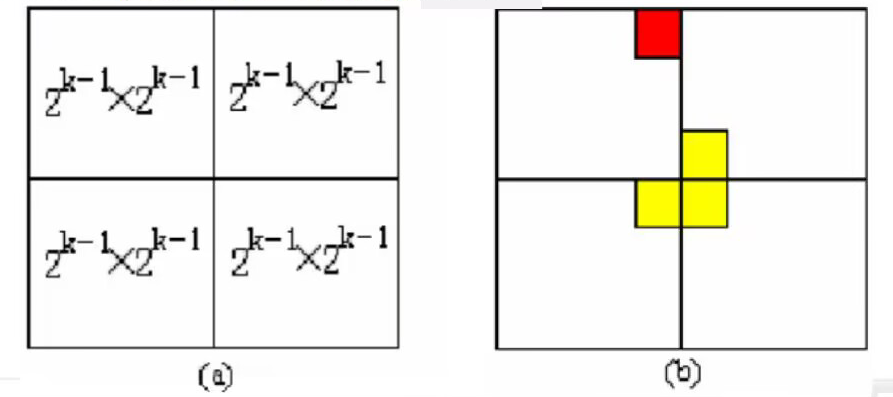

# 数据结构与算法

&nbsp;

# 前言

&emsp;&emsp;《数据结构与算法》这门课程不但是计算机科学与技术的学科基础课程，而且是《计算机图形学》、《计算机网络》、《编译原理》、《计算机操作系统》等后续课程的基础理论之一，其应用范围也早已扩展到图像处理与模式识别、海量数据挖掘、科学数据处理、复杂网络分析等许多计算机前沿领域。

本笔记的内容有：

- 研究计算机处理数据的结构特性，
- 学习线性表、树、图等常用数据结构的逻辑结构与存储结构；
- 学习分治递归、动态规划、贪心算法等典型算法，
- 掌握分析与推导算法效率的方法。 

&nbsp;

# 目录

[TOC]


# 第一章、数据结构的基本概念

- 主要内容
- 四大逻辑结构
- 基本术语
- 数据结构的表示
- 数据的存储结构
- 算法的基础知识

 

##  1.1、主要内容

> 《数据结构与算法》内容研究


&nbsp;

> 为什么要学习数据结构与算法？

**数据结构的主要内容**


**算法及分析方法**

&nbsp;

> - [x] 思考
>
> 我们需要计算机来做什么？如何让计算机做？
>
> **程序 = 算法 + 数据结构**，而 <font color="red">算法 = 逻辑 + 控制</font>
>
> **数据结构**的两大用途：
>
> 一是用于存放要处理的数据，如迷宫地图。
>
> 二是用于**实现算法策略**如迷宫例子中探索方向增量数。

&nbsp;

## 1.2、四大逻辑结构

- 四大逻辑结构概述
- 数据逻辑关系分析

&nbsp;

### 1.2.1、四大逻辑结构概述

- [x] 如何表示和存储电话号码簿的所有信息——数据结构设计


- [x] 如何实现快速查找——算法设计


&nbsp;

> 四大逻辑结构


&nbsp;

1. 线性结构

**线性结构**中的数据元素之间是一对一的关系，如	1->1->1->1->1 

2. 树形结构

**树形结构**中的数据元素存在一对多的层次关系，如领导可有多个下属

3. 图形结构

**图形结构**的数据元素是多对多的关系。如动漫《五等分的花嫁》中的多角恋。

4. 集合结构

**集合结构**中的数据元素除了同属于一个集合外，它们之间没有不三不四的关系，比如韩剧《搞笑一家人》。


### 1.2.2、数据逻辑关系分析

> 分析下面的数据的逻辑关系

**例题1**

$S = (D , R)$

$D = {a, b, c, d, e, f}$

$R = {(a,e),(b,c),(c,a),(e,f),(f,d)}$


> 分析数据之间的逻辑关系如下：

$ b ——> c ——> a ——> e ——> f ——> d$

√ **线性结构**


**例题2**

$S = (D , R)$

$D = {d i | 1 <= i <= 5}$

$R = {(d i , d j), i < j}$


> 分析：数据之间的关系

​			d1

d5				d2

​	d4		d3


√ **图形结构/非线性结构**


> Tips： 常见的数据结构有：数组、栈、队列、表、串、树、图和文件等。

&nbsp;

## 1.3、基本术语

- 数据相关术语

- 数据结构相关术语

&nbsp;

### 1.3.1、数据相关术语

1. 数据（Data）
   所有能被计算机识别的符号集合。

2. 数据元素（Data Element）

   是数据（集合）中的一个“个体”

   是数据结构中讨论的基本单位

3. 数据项（Data Item）
   是数据结构中讨论的最小单位
   数据元素可以是数据项的集合

4. 数据对象（Data Object）
   数据对象是具有相同性质的数据元素的集合，是数据的一个子集。

   例如：迷宫数据对象中的数据元素是一个个点；电话簿数据对象中数据元素是每个人的记录；图书目录数据对象中数据元素是一张张书目卡片


### 1.3.2、数据结构相关术语

1. **数据结构（Data Structures）**
   **带结构的数据元素的集合**
   **用集合的形式描述，数据结构是一个二元组：**
   **$DS = (D , R)$**
   **其中：D是数据元素的集合，R是D上关系的集合。**

   **简言之，数据元素和其相互关系称为数据结构。**

2. **数据结构的操作（Operation）**

   **数据元素的查找、插入、删除、遍历和排序**

3. **数据类型（Data Type）**

   **数据类型是程序设计语言中用来刻画操作对象的特性的**

   **一个值的集合和定义在此集合上的一组操作的总称**


>- [x] 思考
>
>数据结构与数据类型有什么关系呢？


## 1.4、数据结构的表示

- 抽象数据类型
- 数据结构四元组


### 1.4.1、抽象数据类型

> 抽象数据类型（Abstract Data Type ：ADT）

ADT一般包含数据元素、数据元素之间关系及操作三要素（D, R, O）

其中：

- D是数据元素集
- R 是 D 上的关系集合
- O 是对 D 的基本操作集


> 两大特点

① 抽象性
② 扩展性


> 概念：<font face="黑体">抽象</font>是指抽取出事物具有的普遍性的本质，它要求<font color="powderBlue">抽出问题的特征</font>而忽略非本质的细节，是对具体事物的一个概括。此外，抽象还是一种思考问题的方式，它<font color="red">隐藏了繁杂的细节</font>。

```c
抽象数据类型定义格式：
ADT  <抽象数据类型名>
{
    数据对象：<数据类型的定义>
    数据关系：<数据关系的定义>
    基本操作：<基本操作的定义>
} ADT 抽象数据类型名
```

抽象数据类型与数据结构的关联


**抽象数据类型比起数据结构少了存储（S)**


### 1.4.2、数据结构四元组

> 数据结构由一个四元组来表示：

Data_Structure = $(D, L , S, O)$

> 这是数据元素、数据元素之间的逻辑关系，逻辑关系在计算机中的存储表示，以及所规定的操作这四部分
>
> Data_Structure = (对象，关系，存储，操作)


D = Data：数据元素的有限集，存储和操作的对象
L = Logical Structure：是数据元素 D 中数据元素之间客观存在的关系的有限集。
S = Storage Structure：是数据元素 D 和数据元素之间的关系集合 L 在计算机中的存储表示。
O = Operation：是在数据元素集合 D 上规定的一组操作


## 1.5、数据的存储结构

—— 传统上，我们把数据结构分为逻辑结构（用于算法分析与设计）和存储结构（实现算法）。


> 有两种基本存储结构：

1) 顺序存储结构：把逻辑上相邻的元素存储在物理位置相邻的存储单元中


2) 链式存储结构：在数据元素中添加一些地址域或辅助结构，用于存放数据元素之间的关系。


## 1.6、算法的基础知识

- 算法的概念
- 算法的特性
- 算法的性能比较方法
- 算法的时间复杂度
- 渐进分析理论
- 推导大O阶方法


### 1.6.1、算法的概念

算法 —— 解决问题的一种方法


> 算法用途：设计并实现一种用计算机来解决问题的方法


>算法：是满足下列性质的指令序列。

**→ 输入：有零个或多个外部量作为算法的输入。**
**→ 输出：算法产生至少一个量作为输出。**
**→ 确定性：组成算法的每条指令清晰、无歧义。**
**→ 有限性：算法中每条指令的执行次数有限，执行每条指令的时间也有限。**


> 用计算机解决问题的过程

计算机问题求解5步骤：

1. 问题的理解：清楚问题的输入、要求和输出；

2. 数据结构设计：一方面要选择或设计能有效表示和存储应用问题中所涉及的数据对象的数据结构，同时还要选择或设计能支持算法策略实现的数据结构；

3. 算法设计：包括选择算法策略，用适当的方式描述和逐步细化算法步骤；

4. 算法分析：发现有改进完善之处，返回第二步，重新选择或设计数据结构、重新设计算法；

5. 程序实现：用某种计算机程序设计语言，定义数据结构、编写实现算法的代码，在计算机上调试和运行程序


### 1.6.2、算法的特性

> 算法分析

好的算法应该具备以下特性：

- **正确性：**正确性是对算法能否正确求解问题的评价，是首要和最基本的特性；

- **可读性：**可读性是对算法描述的思路、层次的评价。好的算法应该是思路清晰、层次分明、阅读和修改容易；

- **健壮性：**健壮性是对算法在异常情况下处理能力的评价。好的算法在出现异常或非法数据时，在操作不当时，算法都能做适当处理；

- **高效性：**算法的效率是对求解同样问题的不同算法所占用的时间或空间的评价。好的算法应该是高效的，即求解问题所占用存储空间少，执行时间短；

  


> - [x] 思考
>
> 如何比较两个算法的效率？


### 1.6.3、算法的性能比较方法

1、编程后测试运行时间

2、编程前分析可能的运行时间


> 算法复杂性分析

&emsp;&emsp;算法复杂性是算法运行所需要的计算机资源的量，需要时间资源的量称为**时间复杂性**，需要的空间资源的量称为**空间复杂性**。

&emsp;&emsp;这个量应该只依赖于算法要解的规模、算法的输入和算法本身的函数。如果分别用 $N$、$I$ 和 $A$ 表示算法要解问题的规模、算法的输入和算法本身，而且用 $C$ 表示复杂性，那么，应该有 $C = F (N, I, A)$。一般把时间复杂性和空间复杂性分开，并分别用 $T$ 和 $S$ 来表示，则有：$T = T(N, I)$ 和 $S = S(N,I)$。（通常让 $A$ 隐含在复杂性函数名当中） 


> 主要问题：如何将复杂性函数 $F$ 具体化？

&emsp;&emsp;根据 $T(N,I)$ 的概念，他应该是算法在一台抽象的计算机上运行所需要的时间。设此抽象的计算机所提供的的元运算有 $k$ 种，分别记为 O~1~、O~2~ 、...、O~k~ 又设每执行一次这些元运算的时间分别为 t~1~、t~2~、...、t~k~ 对于算法 $A$，设统计用到元运算 O~i~ 的次数为 e~i~，那么 e~i~ = e~i~(N, I)


> 程序的算法分析方法

&emsp;&emsp;抛开软件和硬件因素，只和问题规模有关。编写程序前预先估计算法优劣，改进或者选择最佳算法编程实现。一个算法用程序设计语言表示后，算法就是由一组语句构成，算法的执行效率就由各语句的执行的次数所决定

&nbsp;

**作图法**比较各运行时间复杂性

通过给各个复杂性函数带入实际数据并将函数结果绘制成一张图形，可以比较各个*运行时间函数的复杂度。*


### 1.6.4、算法的时间复杂度

&emsp;&emsp;一个算法花费的时间与算法中语句的执行次数成正比例，哪个算法中语句执行次数多，他花费时间就多。一个算法中的语句执行次数（计算步）称为语句频度或时间频度。记为 $T(n)$。

&emsp;&emsp;一般情况下，算法的基本操作重复执行的次数是模块 $n$ 的某一个函数 $f(n)$，因此，算法的时间复杂度记作：$T(n) = O(f(n))$。


分析：随着模块 $n$ 的增大，算法执行的时间的增长率和 $f(n)$ 的增长率成正比，所以 $f(n)$ 越小，算法的时间复杂度越低，算法的效率越高


> 算法复杂性分析过程：

问题提出 → 选用数学模型 → 对 $(N,I)$ 分析 → 渐进分析 $T(N,I)$


### 1.6.5、渐近分析理论

> 渐近分析

复杂性渐进性态：
当 $N$ 单调增加趋于 $∞$ 时，$T(N)$ 也单调增加趋于 $∞$
如果存在 $T(N)$ 当 $N->∞$ 时有 $(T(N) - T(N)) / T(N) -> 0$
那么称 $T(N)$ 是 $T(N)$ 的渐进性态
直观上 $T(N)$ 是 $T(N)$ 中略去低阶项所留下的主项


渐近分析的符号


### 1.6.6、推导大O阶方法

> 推导方法

1. 用常数1取代运行时间中的所有加法常数。
2. 在修改后的运行次数函数中，只保留最高阶项
3. 如果最高阶项存在且不为1，则去除与这个项相乘的常数
4. 得到的最后结果就是大 O 阶


> 常用的时间复杂度

常数阶 $O(1)$、线性阶 $O(N)$、平方阶 $O(N²)$、对数阶 $O(log N)$
、立方阶 $O(N²)$ 、指数阶 $O(2^n)$

常用的时间复杂度所消耗的时间从大到小依次是：
$O(1) < O(log N) < O(N) < O(n log n) < O(N²) < O(N³) < O(2^n) < O(N!) < O(N^n)$


# 第二章、线性表

- 线性表的定义

- 线性表的抽象数据类型

- 线性表的顺序存储结构

- 线性表的链式存储结构

- 栈(Stack)

- 队列(Queue)

  


## 2.1、线性表的定义

> 概述

线性表(Linear List)：n 个同类数据元素的<font color="red">有限序列</font>


记为：
L = (a~1~,  a~2~,  a~3~,  a~4~,  a~i~ ...,  a~n~)
$L$ 为表名；
$i$ 为数据元素 a~i~ 在线性表中的位序；
$n$ 为线性表的表长；$n = 0$ 时称为空表；
数据元素之间的关系是：
a~i~-1 领先于 a~i~ , a~i~ 领先于 a ~i+1~。
称 a~i-1~ 是 a~i~ 的直接前驱，a~i+1~ 是 a~i~ 的直接后继。
除第一元素 a~1~ 外，均有唯一的前驱；
除最后元素 a~n~ 外，均有唯一的后继；


> 特点：

1.==a~i~ 的数据类型相同==
2.==位序 i 从 1 开始==
3.==前驱与后继==


> 练习题


## 2.2、线性表的抽象数据类型

- 线性表的抽象数据类型定义
- 线性表的基本操作
- 合并线性表
- 合并有序表


### 2.2.1、线性表的抽象数据类型定义

> ADT定义


> 基本操作

1. 结构初始化操作

2. 结构销毁操作
3. 引用型操作
4. 加工型操作


### 2.2.2、线性表的基本操作

> Operation

1. 初始化与销毁

```c
Status List_Init(SqListPtr L);
void List_Clear(SqListPtr L);
销毁一个线性表
void List_Destory(SqListPtr L);
初始化操作，建立一个空的线性表L。
InitList(L);				
将线性表清空。
ClearList(L);				
```

2. 引用型操作

```c
判断是否为空表
bool List_Empty (SqListPtr L);
返回线性表的元素个数或者说长度
int List_Size(SqListPtr L);
从线性表L中POS这个位置取出数据，放到elem指针中
Status List_Retrival(SqListPtr L, int pos, ElemType *elem);
List_Retrieve(Lb, i, &elem) → elem(依次从LB中取出第i个元素)
从线性表L中定位elem这个位置，然后把这个位置放到POS中
Status List_Locate(SqListPtr L, ElemType elem, int *pos);
在线性表L中求POS的直接前驱
Status List_Prior(SqListPtr L, int pos, ElemType *elem);
在线性表L当中的POS位置，求POS位置的直接后继
Status List_Next(SqListPtr L, int pos, ElemType elem);
判断线性表是否为空表，若线性表为空，返回true，否则返回false。
ListEmpty(L)：
在线性表L中查找与给定值e相等的元素，如果查找成功，返回该元素在表中序号表示成功，
否则，返回0表示失败。
LocateElem(L, e)：
返回线性表L的元素个数。
ListLength(L)：
```

3. 加工型操作

```c
插入
Status List_Insert(SqListPtr L, int pos, ElemType elem);
删除
Status List_delete(SqListPtr L, int pos);
在线性表L中第i个位置插入新元素e。
ListInsert(L, i, e);
删除线性表L中第i个位置元素，并用e返回其值
ListDelete(*L, i, *e);
将线性表L中第i个位置元素返回给e。
GetElem(L, i, *e);
线性表的基本操作测试函数
```

4. 函数返回状态值定义

````c
typedef int Status;

/* 函数返回状态值定义 */
enum status 
{
	success = 0, fail = 1, 
    // 内存分配失败
    fatal = -1,
    // 连续空间访问越界
    range_error = -2
};
````

&nbsp;

> 概念：
>
> &emsp;&emsp;对于不同的应用，线性表的基本操作是不同的，上述操作是最基本的，对于实际问题中涉及的关于线性表的更复杂操作，完全可以用这些基本操作的组合来实现。线性表的基本操作实现的就是增删改查这 4 个对数据的经典操作。

&nbsp;

5. 线性表的基本操作测试函数


### 2.2.3、合并线性表

> 例1：合并线性表

问题：集合 A 和 B 分别用两个线性表 L~A~和 L~B~ 表示，求 $A∪B$ 并用线性表 L~A~ 表示。


> 算法设计：

**思想：从 L~B~ 中逐一取出元素，判定该元素是否在 L~A~ 中，若不在则将该元素插入到L ~A~中。**
细化：到实现程度
——逐一：从第一个到最后一个，计数型循环，前提是需要知道元素个数（int List_Size(SqListPtr L);线性表的元素个数或者说长度）
——如何取出第 i 个元素 b~i~ ？
List_Retrieve(Lb, i, &elem)→elem (依次从LB中取出第 i 个元素)
——如何判断bi是否已在L~A~中？
List_Locate(La, elem, &i) (判断 elem 是否在 L~A~ 中)
——如果不在LA中，怎么实现将bi 插入？
List_Insert(La, i, elem) (若不存在，则将elem插入到LA中)

> 合并线性表算法实现

```c
Status List_Union(SqListPtr La, SqListPtr Lb) 
{

    ElemType elem;							/* 存放从Lb中取出的元素 */	
    Status status;							/* 状态代码 */

    Int i, j, len = List_Size(Lb);			/* len存放Lb的元素个数 */

    for(i = 1; i <= len; i++){
    List_Retrieve(Lb, i, &elem);			/* 取出Lb中第i个数据元素 */
    Status =List_Locate(La, elem, &i) ; 	/* 判定是否在La中 */

    If(status != success){					/* 如果不在 */
        Status = List_Insert(La, 1, elem);	/* 插入到第一个位置 */
        If(status != success) break;		/* 插入失败则退出*/
    }else{
        List_Add(La, j, 1);					/* La的第j个元素加1 */
        }
    }
    return status;
}
```


### 2.2.4、合并有序表

> 例2：合并有序表


> 实现代码：

```c
Status List_Merge(SqListPtr La, SqListPtr Lb, SqListPtr Lc)
{

    ElemType elem1, elem2;
    Status = List_Init(Lc);
    /* i, j, k分别用于指示La,Lb,Lc中当前元素 */
    Int i = 1, j = 1, k = 1;			
    Int n = List_Size(La), m = List_Size(Lb);

    /* 两个表还未处理完 */
    while(i <= n && j <= m){		
        List_Retrieve(La, i, elem1);
        List_Retrieve(Lb, j, &elem2);
        
        if(elem1 < elem2){
            Status = List_Insert(Lc,k,elem1);
            i++;
        } else {
            Status = List_Insert(Lc,k,elem2);
            j++;
        }
        k++;
    }
    
    /* La表还未处理完 */
    while(i <= n){		
        List_Retrieve(La, i, &elem1);
        Status = List_Insert(Lc,k,elem1);
        i++;
        k++;
    }
    /* Lb表还未处理完 */
    while(j <= m)
    {		
        List_Retrieve(Lb, j, &elem2);
        Status = List_Insert(Lc,k,elem2);
        j++;
        k++;
    }
}
```


> 归并2个有序表 	|	链式存储

```c
// 归并2个有序表 | 链式存储
void merge linklist(ListPtr *la, ListPtr *lb, ListPtr *lc){  
    // la和lb为参与合并的两个有序表，lc为结果有序表
    ListPtr pa, pb, pc, tp;
    pa = (*la)->next; 
    pb = (*lb)->next; 
    pc = *la;
    
    while(!pa && !pb){
        
        if(pa->data < pb->data){
            pc->next = pa;
            pc = pa;
            pa = pa->next;
        } else if(pa->data > pb->data){
            pc->next = pb;
            pc = pb;
            pb = pb->next;
        } else {
            pc->next = pa;
            pc = pa;
            pa = pa->next;
            tp = pb;
            pb = pb->next;
            free(tp);
            tp = NULL; 
        }
    }
    pc->next = (pa? pa : pb);	// 插入剩余段
    free(pb);
    lc = la;
}	// mer-linklist
```

复杂功能 = 基本操作的组合


> 小结：
> &emsp;&emsp;合并线性表只是将一个线性表的元素直接插入到另一个线性表中，而合并有序表是要逐一比较两个表的元素后做插入操作。
>
> &emsp;&emsp;例如直接合并图书馆图书信息是合并线性表，合并几个班学生成绩排名表就是合并有序表。


## 2.3、线性表的顺序存储结构

- 顺序存储结构的概念
- 顺序存储结构的实现
- 线性表的创建
- 线性表的查找
- 线性表的插入
- 线性表的删除


&nbsp;

&nbsp;


### 2.3.1、顺序存储结构的概念

> 线性表的顺序存储结构

&emsp;&emsp;用一组地址连续的存储单元依次存放线性表中的数据元素。如数组。线性表的起始地址s称作线性表的基地址。（优点：可随机存储）


&nbsp;

&nbsp;

### 2.3.2、顺序存储结构的实现

> 用结构来整合

**空间如何分配？**
**— 静态：数组，栈上分配内存，但不宜过大，最好不超过1000个元素**
**— 动态：指针，动态分配堆内存，可以分配很大的内存，但是使用完要释放堆内存**

&nbsp;

### 2.3.3、线性表的创建

> 创建线性表的实现：

```c
#define List_INIT_SIZE 100		// 线性表的空间大小
#define List_INCERAMENT 10		// 每次增加的数量

typedef int ElemType;

typedef struct SqList	// 线性表的结构
{
    ElemType *elem;		// 一大块连续存储空间的首地址指针
    int length;			// 线性表的长度
    Int list_size;		// 线性表的空间大小
}SqList,*Ptr;

Typedef Ptr SqListPtr;

线性表顺序存储操作的实现
①初始化——创建线性表
Status List_Init(SqListPtr L)
{
    Status s = success;
    L ->list_size = LIST_INIT_SIZE;
    L->length = 0;
    L->elem = (ElemType *)malloc(sizeof(ElemType)*L->list_size);
    If(L->elem == NULL)
    s = fatal;
    Return s;
}
```


### 2.3.4、线性表的查找

> 按位置查找指定的元素

- 检查位置是否合法？

- 返回相应信息

```c
Status List_Retrial(SqListPtr L, int pos, ElemType *elem)
{
    Status s = range_error;
    if(L){
        if((pos - 1) >= 0 && (pos - 1) < L->length){
        *elem = L->elem[pos - 1];
            s = success;
        }
    } else {
    	s = fatal;
    }
    return s;
}
```

&nbsp;

> 按值查找指定的位置	

- 逐个比较

- 复杂度分析

  最好时间复杂度：$O(1)$

  最差时间复杂度：$O(n)$

  平均时间复杂度：$O(n)$

```c
Status List_Locate(SqListPtr L,  ElemType elem, int pos)
{
    Status s = range_error;
    
    if(L){
        // 循环查找元素的位置
        for(int i = 0; i < L->length; ++i)
        {
            if(L->elem[i] == elem){
                *pos = i + 1;
                s = success;
                break;
            }

        }
    }else{
        s = fatal;
    }
    return s;
}
```


### 2.3.5、线性表的插入

> 插入数据操作

第i个元素之前插入新数据元素X

步骤：

- 检查插入位置是否合法，如果合法则继续，否则退出；

- 判断表是否已占满；因为是事先分配空间，可能存在所分配的存储空间全部被占用的情况，此时也不能实现插入。

- 若前面检查通过则数据元素依次向后移动一个位置；为避免覆盖原数据，应从最后一个依次向前移动。

- 新数据元素放到恰当位置

- 表长加1

&nbsp;

```c
Status List_Insert(SqListPtr *L, int pos ,ElemType elem)
{
    Status s = range_error;
    // 查看下标是否越界
    if((pos - 1) >= 0 && (pos - 1) <= L->length){
        // 查看表是否为空，是否容量未满
        if(L && L->length < L-> list_size){
            // 往前移动元素，空出位置来容纳新元素
            for(int i = L->length - 1; i >= pos - 1; --i)
            {
            	L->elem[i+1] = L->elem[i];
            }
           	// 插入新元素
            L->elem[pos - 1] = elem;
            L->length++；
            S = success;
        } else {
            // 表为空或者容量已满，不能插入
            s = fail;
        }
    }
    
    return s;
}
```


### 2.3.6、线性表的删除

> 删除元素操作

步骤

- 检查删除操作是否合法；

- 若检查通过，数据元素依次向前移动一个位置；

- 表长减1；

```c
Status List_Delete(SqListPtr *L, int pos)
{
    Status s = range_error;
    // 确保下标不越界
    if((pos - 1) >= 0 && (pos - 1) <= L->length){
        // 确保表不为空
        if(L && L->length > 0){
            // 依次往前移动元素，覆盖被删除的值
            for(int i = L->pos ; i < L->length; ++i)
            {
            	L->elem[i - 1] = L->elem[i];
            }
            
            L->length--；
            S = success;
            
        } else {
   	 		S = fail;
    	}
    }
    return s;
}
```


> 注释：POS位置，elem数据
>
> 顺序存储结构可以存储线性表的数据，支撑线性表的基本和复杂操作的实现


## 2.4、线性表的链式存储结构

- 链式存储结构的概念
- 关于存储结构的练习
- 单链表的定义
- 单链表的查找操作
- 单链表的其他操作
- 建立单链表的操作
- 特殊形式的链表


### 2.4.1、链式存储结构的概念

> 单链表的概述

**用一组地址任意的存储单元存放线性表中的数据元素**
*结点 = 数据域（数据元素） + 指针域（指示后继元素存储位置）*
**以“结点的序列”表示线性表 —— 称作链表**


> 结构


$→ head →a1 → a2 →... ...→an $


<u>以线性表中第一个数据元素a1的存储地址作为线性表的地址，称作**线性表的头指针**。</u>

有时为了操作方便，在第一个结点之前虚加一个“**头结点**”，并用链表的头指针指向头结点，称为*带头结点的单链表*。


> 带头节点和不带头结点的链表的区别

1. 不带头节点

- 链表指针存放链表第一个数据元素结点的地址

- 空链表时该指针域为NULL

2. 带头结点的单链表

- 一个专门的结点，称为头结点

- 该头结点永远存在

- 该头结点指针域存储第一个数据元素结点的地址

- L.next = NULL


### 2.4.2、关于存储结构的练习

> 练习题

- [x] 1、线性表可以采用顺序存储结构存储数据，也可以采用链式存储结构存储数据？正确

- [x] 2、访问线性表的第i个元素，顺序存储结构通过地址计算公式可以一步到位访问到，采用单链表需要从头指针开始依次访问单链表的每一个元素，最坏时间复杂度为O（n）正确

- [x] 3、链式存储结构不止单链表一种链表形式来存储线性表的元素和关系。正确
- [ ] 4、头指针为L，则单链表为空的表示方法为L = NULL? 错误
- [x] 5、已知指针p指向单链表L的第i个结点，则访问第i个数据和第i + 1个数据方法分别是p->data 和 p->next->data 正确


### 2.4.3、单链表的定义

> 类型定义

```c
typedef struct Node
{
    ElemType data;
    Struct Node *next;
} Node, *Ptr;

typedef Ptr *SqListPtr；
```

> 变量定义和使用

```c
Node n1,n2;
/* 定义一个指向结点的指针变量p，并存放n1的地址（指针）*/
N1.next = &n2;	// 结点n1的指针域存放结点n2的地址
Ptr L = p;		// 定义一个单链表
N2.next = NULL;
```


### 2.4.4、单链表的查找操作

> 查找——按位置查找

问题：在给定的带头结点的单链表L中，查找指定位置的数据元素，如果存在，则返回success，同时取回相应结点的数据

方法：链表的操作只能从头指针出发，顺着链域next逐个结点比较，直到搜索到指定的位置的结点为止

在单链表中获取第POS个元素

`List_Retrieve(SqListPtr L, int pos, ElemType *elem)`

$L  → 21| → 18| → 30| →56|$

`pos = 3;`


伪代码

```c
Status List_Retrieve(SqListPtr L, int pos, ElemType *elem)
{
    置初值部分：需要p指针指向线性表第一个元素；整数i = 1表示访问第一个元素
    While（循环控制条件）// 需要对POS的合法性进行检查
    {
        循环体
    }
    出循环后找到的判定的条件及相应处理 // i = pos 且P指针指向结点不空
}
```

C语言具体实现

```c
Status List_Retrieve(SqListPtr L, int pos, ElemType *elem)
{	//初始化：设置状态变量status，设置移动指针p、计数变量i
    Status s = range_error;
    
    Ptr p = (*L)->next; /* 带头结点，移动p指向第一个元素结点 */
    int i = 1; 			// 计数器
    while(p && i < pos)/* p指向的结点存在，且未到达指定位置 */
    {	// 条件一防止POS > 表长；条件2控制第POS个，防止 POS < 1
        i++；
        P = p->next;
    }
    if(p && i == pos){// 找到指定位置，且该结点存在
        *elem = p->data;
        S = success;
    }
    return s;
}
```

其他实现


> 查找——按值查找

算法思想描述：

1. 初始化：p 指针指向线性表第一个结点；位置 i = 1；操作状态 s 为错误

2. 只要线性表不空，循环做下面的操作

3. 如果待查找数据 == 当前结点数据，则退出循环

4. 否则 p 指针指向下一个结点；位置计算器 i 自增 1

5. 循环外面判断 p != NULL，则找到数据，将位置 i 赋值给 pos 参数；修改操作状态 s 为成功；

6. 返回操作状态s


C语言参考代码

```c
Status List_locate(SqListPtr L, ElemType elem, int *pos)
{	//
    Status s = range_error;
    Ptr p = (*L)->next; /* */
    int i = 1; //计数器
    while(p && p->data != elem)/* */
    {	
        // if(p->elem == elem) break;
        i++；
        P = p->next;
    }
    if(p){//
        *pos = i;
        s =success;
    }
    return s;
}
```


### 2.4.5、单链表的其他操作

> 插入操作

步骤：

1. 找到 a~i-1~ 的位置

2. 构造一个数据域为 elem 的新结点

3. 将其挂在单链表表上


C语言实现

```c
Status List_Insert(SqListPtr L, int pos, ElemType elem,)
{	// 移动指针定位，修改指针内容，不移动数据元素
    Status status;
    Ptr p,s;
	// 查找其位置，并插入
    status = List_Retrival (L, pos - 1, &p);
    If(status == success){
        s = (LinkedPtr) malloc(sizeof(Node));
        if(s){
            s->elem = elem;
            s>next = p->next;
            p->next = s;
            status = success;
        } else {
        	status =fatal;
        }

    } else {
    	status = range_error;
    }
    return status;
}
```


> 删除操作

单链表上的删除操作

删除单链表第i个元素

List_Remove(SqListPtr L, int pos )

 

步骤：

1. 首先求得第i - 1个结点的指针p

2. 修改i - 1个结点的后继域为第i + 1个结点的地址

3. 在释放第pos个结点所占的存储空间


代码实现

```c
Status List_delete(SqListPtr L, int pos)
{	//移动指针定位	修改指针内容	不移动数据元素
    Status status = fail;
    Ptr s, p;

    Status = List_Retrival(L, pos - 1, &p);
    if(status == success){
        s = p->next;
        p->next = s->next;
        free(s);
        s = NULL;
        status = success;
    }

    return status;
}
```


### 2.4.6、建立单链表的操作

L  =  (a~1~、a~2~、 a~3~、 ......、 a~n~)

> 创建单链表

方法：首先创建一个空的单链表，然后依次建立各元素结点，并逐个插入链表

操作步骤：

1. 建立一个 “ 空表 ”

2. 输入数据元素 a~n~，建立结点并插入到单链表

3. 输入数据源 a~n-1~，建立结点并插入到单链表

4. 以此类推，直至输入 a~1~ 为止。


C语言实现

```c
Status List_Create(SqListPtr L, ElemType data[ ], int len)
{	//
    Status s;
    Ptr p;
    s = List_Init(L);

    if(s == success ){
        for(int i = len - 1; i >= 0; --i)
        {
            p = (Ptr)malloc(sizeof(Node));
            if(p){
                p->elem = data[i];
                p->next = (*L)->next;
                (*L)->next = p;
            }else{
                s = fail;
                break;
            }
        }
    }

    return s;
}
```


### 2.4.7、特殊形式的链表

> 下面是几种特殊形式的链表

1. 循环单链表

 

2. 带尾指针的循环单链表

应用场景一：将两个循环单链表合并 

应用情景二：经常需要在最后一个元素后面添加新元素和在第一个元素前面插入新元素


3. 双向链表


> 双向链表的操作特点：

“查询”和单链表相同。


“ 插入” 和 “ 删除 ” 时需要同时修改前后两个方向上的指针。

> 双向链表插入操作


> 双向链表删除操作


4. 静态链表

某些语言中不提供指针，如 Java 和 Visual BASIC 等，只能通过其他方式来模拟指针

采用数组模拟链表的指针，用以表示数据元素后继所存放位置

数据元素的存储空间像顺序表一样是事先静态分配的

数据元素之间的关系像链表一样是显示的


## 2.5、栈(Stack)

- 操作受限的线性表——栈
- 栈的定义
- 栈的抽象数据类型
- 栈的基本操作
- 栈的顺序存储
- 顺序栈的出入栈操作实现
- 栈的链序存储
- 链栈的出入栈操作实现
- 栈的简单应用


### 2.5.1、操作受限的线性表 —— 栈

> 回顾

**线性表：n个相同元素的有限序列**

$DS = (D,L,O,S);$

**线性表的逻辑结构L：1对1（前驱、后继）**

**线性表的基本操作O：创建、查找元素、插入、删除等**

**线性表的存储结构S: 顺序、链式（单链表、双向链表、循环、双向循环）**


> 特点

- 栈是一种先进后出 (FILO：First In Last Out) 的数据结构。
- 栈是限定插入和删除只能在表的 “ 端点 ” 进行的线性表。
- 栈是特殊的线性表，是插入、删除操作受限的线性表。
- 顺序栈的栈顶是数组尾部，链表栈的栈顶是头部


### 2.5.2、栈的定义

> 定义

&emsp;&emsp;栈是限定在表的同一段进行插入或删除操作的线性表。进行插入或删除操作的一端称为栈顶，另一端称为栈底。没有数据元素的栈称为空栈。插入数据元素的操作称为入栈，删除元素的操作称为出栈。


> 栈的运算特性：

后进先出（Lass In First Out--LIFO）或先进先出（First In Last Out--FILO）


### 2.5.3、栈的抽象数据类型定义


```c
ADT Stack{
    数据对象：
    D = {a i | a i ∈ ElemSet, i = 1,2,...,n, n≥0}
    数据关系：
    R1 = {＜a i-1, a i ＞| a i-1, a i∈D, i =2,...,n}
    约定an端为栈顶，a1端为栈底
}
```


### 2.5.4、栈的的基本操作

> 基本操作

```c
// 初始化栈
Stack_Init(StackPtr s);
// 销毁栈
Stack_Destroy(StackPtr s);
// 获取栈的长度
Length_Stack(StackPtr s);
// 判断栈是否为空
Stack_Empty(StackPtr s);
// 清空栈
Stack_Clear(StackPtr s);
// 获取栈顶元素
Stack_Top(StackPtr s, StackEntry *item);
// 入栈操作
Stack_Push(StackPtr s, StackEntry item);
// 出栈操作
Stack_Pop(StackPtr s, StackEntry *item);
```


测试栈的基本操作


> 论述题

1. 采用顺序存储结构或者链式存储结构实现的线性表为基础，
   编程实现栈的基本操作?
2. 如果采用顺序存储结构的线性表，栈顶在哪里？
   如果采用带头结点的单链表，栈顶又在哪里？为什么
3. 如果不采用线性表的基本操作为基础，我们自己来完整的编程实现栈的基本操作，采用哪种存储结构更合适？
   需要做哪些工作？
   什么时候需要我们这样编程？


### 2.5.5、栈的顺序存储

> 类型定义

```c
typedef struct stack 
{
    // 就是线性表顺序存储结构的length
    int top; 	
    // 动态分类空间大小为stack_size
    StackEntry *elem;	
    int stack_size;
} Stack, *StackPtr;
/*
	约定top用于存放栈顶元素的位置
	top = -1 表示空栈
	top = stack_size - 1 表示栈满
*/
```


- 入栈时top指针 + 1；出栈时top指针 - 1

溢出判定

1. 顺序栈的数据元素空间大小是预先分配的
2. 当空间全部占满再入栈产生的溢出称为“上溢”
3. 当栈为空时再出栈也将产生的溢出称为“下溢”


### 2.5.6、顺序栈的出入栈操作实现

> 入栈操作

````c
// 入栈操作
Status Stack_Push(StackPtr s,StackEntry item)
{
	Status outcome = success;
	if(Stack_Full(s)){
		ontcome = overflow;		/* 栈满则上溢 */
	}else{
		s->top++;
		s->entry[s->top] = item;/* 数据元素放入top位置 */
	}
	return outcome; 
} 
````

> 出栈操作

```c
Status Stack_Pop(StackPtr s, StackEntry *item)
{
	Status outcome = success;
	if(Stack_Empty(s)){
		outcome = underflow;	/* 栈空则下溢 */
	}else{
		/* 将top所指数据元素放入item，top再减一 */ 
        *item = s->entry[s->top--];	
	}
	return outcome;
} 
```

> 获取栈顶元素

```c
Status Stack_Top(StackPtr s, StackEntry *item)
{
	Status outcome = success;
	if(Stack_Empty(s)){
		outcome = underflow;	/* 栈空则下溢 */
	}else{
		/* 取出数据，top指针不变 */ 
        *item = s->entry[s->top];	
	}
	return outcome;
} 
```

如果有多个顺序栈可以空间共享


### 2.5.7、栈的链式存储

（1）**单链表**

（2）**循环链表**

（3）**双向链表**

栈底：链表尾部

栈顶：链表头部

 

> 存储结构设计

采用单链表的节点结构：

将单链表的首端作为栈顶：


> 类型定义

```c
typedef struct node /* 结点类型定义 */
{
    StackEntry entry;
    struct node* next;
} StackNode, *StackNodePtr;

typedef struct stack /* 链栈类型定义 */
{
	StackNodePtr top;/* 指向栈顶的指针 */
} Stack, *StackPtr;
```


### 2.5.8、链栈的出入栈操作实现

> 入栈操作

```c
Status Stack_Push(StackPtr * s, StackEntry item)
{
	Status outcome = success;
	StackNodePtr * np = MakeNode(item);
	/*申请结点空间，并装填节点域*/
	if(np == NULL){
		outcome = overflow;/*无法分配储存空间，相当于栈满上溢*/ 
	} else {
		np->next = s->top;/*所申请的节点插入在表头*/
		s->top = np; 
	}
	return outcome;
}
```


> 出栈操作

```c
Status Stack_Pop(StackPtr *s, StackEntry *item)
{
	Status outcome = success;
	if(Stack_Empty(s)){
		outcome = underflow;		/* 栈空则下溢 */
	} else {
		StackNodePtr *np = s->top;	/* 删除栈顶元素 */
		s->top = np->next;
		*item = np->entry;
		free(np);
	}
	return outcome;
}
```


### 2.5.9、栈的简单应用

> 练习题：

1、已知a,b,c入栈，则不可能的出栈顺序是（c）
A.abc	B.cba	C.cab	D.acb

2、如果要讲输入的线性表倒序输出，采用栈怎么实现这个功能？
3、如果要讲输入的线性表按照原输入顺序输出，采用栈怎么实现这个功	能？

括号配对问题
输入一个四则运算表达式，如何判断括号是否配对？括号包括(){}[]
（1）依次读入四则运算表达式
（2）如果是左括号入栈
（3）如果是右括号，则与栈顶的左括号进行匹配：
①类型相同，匹配，转第一步继续
②类型不匹配，输出错误提示，结束程序。

&nbsp;

> 作业

编程实现括号配对问题。要求输入四则运算表达式，判断括号是否配对，如果全部配对，输出（“所有括号都配对”）；否则输出（“括号不配对，不能进行计算”）。

&nbsp;

> 讨论

输入四则运算表达式，如何计算输出结果？
已知迷宫地图，如何寻找入口到出口的通路？
如何用算法生成具有1个入口，1个出口，且入口到出口有通路的迷宫地图？地图长宽根据输入确定。

&nbsp;


## 2.6、队列(Queue)

- 队列的定义

- 队列的抽象数据类型
- 队列的基本操作
- 队列的顺序存储
- 循环顺序队列
- 队列的链式存储
- 链式队列的出入队操作


### 2.6.1、队列的定义

> 概述

**定义：队列是限定只能在表一端进行插入，在表的另一端进行删除的线性表**

- 队尾（real）——允许插入的一端
- 队头（front）——允许删除的一端
- 队列特点：先进先出（FIFO: First In First Out）


### 2.6.2、队列的抽象数据类型


```c
ADT Queue{
    数据对象：
    D = {ai| ai∈ElemSet, i = 1,2,....,n, n≥0}
    数据关系：
    R1 = {＜a i-1, ai ＞ | a i-1 ai∈D, i = 2,...,n}
    约定其中a1端为队头，an端为队尾
}ADT Queue
```


### 2.6.3、队列的基本操作

```c
基本操作:
初始化：Status Queue_Init(QueuePtr q)
销毁：	void Queue_Destory(QueuePtr q)
清空：	void Queue_Clear(QueuePtr q)
判空： void Queue_Empty(QueuePtr q)
判满：	void Queue_Full(QueuePtr q)
入队：Status Queue_Append(QueuePtr q, QueueEntry item);
出队：Status Queue_Server(QueuePtr q, QueueEntry *item);
```


> 练习题——队列的编程实现

采用线性表的基本操作为基础，实现队列的功能。其中入队操作，采用线性表的基本操作的插入函数，插入位置每次都在尾部；出队操作，先采用线性表的定位查找，将第1个位置的元素找到，然后采用线性表的删除操作，删除第1个位置的元素。


1、采用线性表的基本操作为基础，实现队列的功能。
2、自己定义并实现队列的操作，而不用借助线性表的基本操作。


顺序存储：出队移动大量数据
链式存储：入队定位时间较长


### 2.6.5、队列的顺序存储

```c
类型定义
#define MAXQUEUE 10

typedef struct queue
{
	int front,rear;/*队头和队尾指针，指示队头和队尾数据元素的位置*/
	QueueEntry entry[MAXQUEUE];	/*数据元素存储空间*/

}Queue,*QueuePtr;	/*定义为新的数据类型*/

// 问题：初始化队列为空，font和rear的值是多少呢？、
// 实际上初始化font=rear=0或者font=rear=-1都是可以的
```

- 约定：队头指针指向队头元素前面一个位置，队尾指针指向队尾元素位置


- 如何解决“假溢出”问题？
- 视为“循环顺序队列”
  实现方法： 

- front = (front + 1) % MAXQUEUE
- rear = (real + 1) % MAXQUEUE


### 2.6.6、循环顺序队列

> 循环顺序队列——如何判断空还是满?


方法一：	用一个计数变量来记载队列中的元素个数。

- 初始化队列时 C = 0;
- 当入队时，计数器加1；

- 当出队时，计数器减1；

- 当计数器 = MAXQSIZE时，队满

- 当计数器 = 0时，队空


方法二：	设置一个flag标志位用来区分队列是空还是满

1. 初始化队列： sq-> front = sq -> rear,标志位为false

2. 入队后，使sq-> front = sq->rear, 则标志位为true

3. 出队后，将标志位置为false

4. 当sq-> front = sq -> rear, 且标志位为true时，队满。

5. 当sq-> front = sq -> rear, 但标志位为false时，队空

6. 其他情况非空非满

 

方法三： 牺牲一个元素空间，来区别队空或队满。

- 入队前，先判断sq->rear+1是否等于sq-> front, 若是则为队满。

- 而当sq ->front == sq-> rear时，为队空。

- 前例：当E入队后，就认为队已满，而当F要再入队时就拒绝入队


### 2.6.7、队列的链式存储

> 哪种链表适合队列？

队列链表结构分析

- 主要操作：链表尾部插入，链表头部删除

- 需要有头结点和尾节点的链表


> 类型定义

```c
typedef int QueueEntry;

typedef struct _node{			/* 链式队列的结点结构 */
	QueueEntry Entry;			/* 队列的数据元素类型 */
	struct _node * next;		/* 指向后继结点的指针 */
} QueueNode,*QueueNodePtr;

typedef QueueNode QueueNodePtr;	// 队列类型
 
typedef struct _queue{			/* 链式队列 */
	QueueNode * front;			/* 队头指针 */
	QueueNode * rear;			/* 队尾指针 */
} Queue,*QueuePtr; 

typedef Queue QueuePtr;			// 队列类型
```


### 2.6.8、链式队列的出入队操作


> 讨论

银行排队模拟系统：设计一个最简单的排队系统模拟器，即只有一个服务台的排队系统，希望通过这个模拟器得到顾客的平均排队时间。
①讨论采用模拟系统而不是真实系统的原因
②讨论模拟系统的主要操作
③写出单排队系统的算法步骤，并编程实现，模拟测试顾客的平均排队时间


# 第三章、查找

- 查找的基本概念
- 顺序查找
- 折半查找
- 索引查找
- 哈希查找


## 3.1、查找的基本概念

- 查找表
- 查找表的基本操作
- 查找表的分类
- 平均查找长度
- 常见查找算法


### 3.1.1、查找表

**查找表是由同类型的数据元素（或记录）构成的集合。**


### 3.1.2、查找表的基本操作

1. 查询某个数据元素是否在查找表中；
2. 检索某个数据元素的各种属性；
3. 在查找表当中插入一个数据元素;
4. 从查找表中删去某个数据元素。


### 3.1.3、查找表的分类

> 静态查找表（Static Search Table）

仅做查询和检索操作的查找表


> 动态查找表（Dynamic Search Table）

“查询”结果“不在查找表中”—>数据元素插入到查找表中；
“查询”结果为“在查找表中”的数据元素->删除。


查找过程中，往往是依据数据元素的某个数据项进行查找，这个数据项通常是数据的关键字。
关键字：是数据元素中某个数据项的值，用以标识一个数据元素。
若关键字能标识唯一的一个数据元素，则称为主关键字。
若关键字能标识若干个数据元素，则称为次关键字。
张三 2016010002 男 成都 1.75


### 3.1.4、平均查找长度ASL

$ASL = P1C1 + P2P2 +...+PnCn$

$Pi$——查找第$i$个元素的概率

$Ci$——查找第$i$个元素需要的比较次数


### 3.1.5、常见的查找算法

主要有顺序查找、二分查找、索引查找和哈希查找这几种。


## 3.2、顺序查找(Sequence Search)

- 顺序查找基本思想
- 代码实现
- 顺序查找性能分析


### 3.2.1、顺序查找基本思想

> 概念

从表中指定位置（一般为最后一个，第0个位置设为岗哨）的记录开始，沿某个方向将记录的关键字与给定值相比较，若某个记录的关键字和给定值相等，则查找成功；

反之，若找完整个顺序表，都没有与给定关键字值相等的记录，则此顺序表中没有满足查找条件的记录，查找失败。


### 3.2.2、代码实现

> C语言示例代码

```c
int SequenceSearch(DataType R[], KeyType key)
{
	int i;
	R[0] = key;	i = n;	
	while (R[i] != key) 
	{
		i--;
	}
	return i;
}
```

例题，查找key为60的记录


### 3.2.3、顺序查找性能分析

> 空间复杂度： 

O(1)

> 时间复杂度：

查找算法的基本运算时给定值与顺序表中记录关键字值的比较

最好情况：O(1)
最坏情况：O(n)
平均情况：O(n)


> 平均查找长度：


- 等概率情况
  $Pi = 1 / n$
  $ASL = 1 / N   （n - i + 1） = (n + 1)  / 2$
- 不等概率
  - 每个元素的查找概率已知
  - 每个元素的查找概率未知


## 3.3、折半查找(Binary Search)

- 折半查找基本思想
- 代码实现


### 3.3.1、折半查找基本思想

有序表：如果顺序表中的记录按关键字值有序


> 查找过程：

&emsp;&emsp;将待查关键字与有序表中间位置的记录进行比较，若相等，查找成功。若小于，则只可能在有序表的前半部分，若大于则只可能在有序表的后半部分，因此，经过一次比较，就将查找范围缩小一半，这样一直进行下去直到找到所需记录或记录不在查找表中。


### 3.3.2、代码实现

> C语言实现

```c
int BinarySearch(DataType SL[], KeyType key, int n)
/*在长度为n的有序表SL中查找其关键字等于key的记录*/
/*查找成功返回其在有序表中的位置，查找失败返回0*/
{
	int low = 1;
	int hight = n;
	
	while(low <= hight)
	{
		DataType mid = (low + hight) / 2;
	
		} else if(key > SL[mid]){
			low = mid + 1;
		} else if(key < SL[mid]){
			hight = mid - 1;
		} else return mid;	
	}
	
	return 0;
}
```

例题，查找key为64的记录


### 3.3.3、折半查找的性能分析

以深度为h的满二叉树为例


即：n = 2^h - 1并且查找概率相等，则


> 折半查找特点：

折半查找的查找效率高

平均查找性能和最坏性能相当接近

折半查找要求查找表为有序表

并且，折半查找只适用于顺序存储结构。


## 3.4、索引查找(Index Search)

- 索引查找基本思想
- 索引表的构建
- 索引表的查找
- 索引表的顺序性能分析
- 三种查找算法比较


### 3.4.1、索引查找基本思想

> 索引使用方法：

先分析数据规律，建立索引

再根据索引进行快速定位

在定位的地方进行细致搜索


先分块，块间有序，就可以做到快速定位到块


### 3.4.2、索引表的构建

1. 分块：

第$R^k$中所有关键字<$R^(k+1)$块中所有关键字，$(k = 1,2,3,4,5,...L-1)$

2) 建立索引项：

关键字项：记载该块中最大关键字值；

指针项：记载该块第一个记录在表中位置。


### 3.4.3、索引表的查找

索引表的查找——>>>查找表的查找(顺序查找 or 折半查找)


> 例子：


> 索引表的顺序查找算法思想描述：

首先根据带查找关键字在索引表当中定位块。定位的方法是：只要key>索引块i的最大关键项，则i++，定位下一个索引项；直到定位到索引快，或者把索引项都定位完也没有比key关键字大的索引项。

如果定位到块，则在块内部进行顺序查找

> 代码实现

````c
typedef struct IndexType{
	KeyType key;
	int Link;
}IndexType; 

int IndexSequelSearch(IndexType Is[],DataType s[], int m, KeyType key)
{
	/* 索引表为Is[0]-Is[m-1],顺序表为s */
	int i = 0;
	while(i < m && key > Is[i].key) i++;	/* 块内查找*/
	if(i == m)return -1;
	else{
		int j = Is[i].Link;
		while(key != s[j].key && j<Is[i+1].Link)j++;
		if(key == s[j].key)return j;	/* 查找成功 */
		else return -1;					/* 查找失败 */
	}
} 
````


### 3.4.4、索引表的顺序查找性能分析

> 索引顺序查找的ASL?

ASL=ASL(索引表)+ASL(块内)


索引表的顺序查找性能分析


其中，n为表长，均匀分为b块，每块含有s个记录


### 3.4.5、三种查找算法比较


## 3.5、哈希查找(Hash Search)

- 哈希函数
- 哈希表
- 常见的哈希函数构造方法
- 字符串的哈希查找
- 哈希冲突的解决方案
- 开放地址法
- 再哈希法
- 链地址法
- 建立公共溢出区


### 3.5.1、哈希函数

顺序查找：O(n),平均约比较500次

二分查找：O(logn),平均约比较10次

有没有更好的查找方法？


> 哈希函数定义

一般情况下，需在关键字与记录在表中的存储位置之间建立一个函数关系，以==H(key)==作为关键字为key的记录在表中的位置，通常称这个函数为==哈希函数==。


> 哈希函数H(key)
> 关键字集合A(m) ----->地址空间D(n)

1) 哈希函数是一个映象，即：**将关键字的集合映射到某个地址集合上**，它的设置很灵活，只要这个地址集合的大小不超过允许范围即可;

2. 由于哈希函数是一个压缩映象，因此，在一般情况下，很容易产生“冲突”现象，即：`key1 ≠ key2 ` 而 `h(key) == h(key2)`

3. 很难找到一个不产生冲突的哈希函数。一般情况下，只能选择恰当的哈希函数，使冲突尽可能少地产生。


因此，哈希查找需要做两方面事情：选择一个“好”得哈希函数；提供一种“处理冲突”的方法；


### 3.5.2、哈希表

> 概述

根据设定的==哈希函数H(key)==和提供的处理冲突的方法，将一组关键字映象到一个地址连续的空间上，并以关键字在地址空间中的“象”作为相应记录在表中的存储位置，如此构造所得的查找表称为==哈希表==。

地址空间存储的数据集合称为**哈希表**


### 3.5.3、常见的哈希函数构造方法

一般来说，一个好的哈希函数应该满足下列两个条件

（1）计算简单

（2）冲突少


> 常见的哈希函数构造方法


1. 直接哈希函数

取关键字本身或关键字的某个线性函数值作为哈希地址


2. 数学分析法

设n个d位数的关键字，由r个不同的符号组成，此r个符号在关键字各位出现的频率不一定相同，可能在某些位置上均匀分布，即每个符号出现的的次数都接近与n/r次，二在另一些位上分布不均匀。则选择其中分布均匀的s位作为哈希地址，即哈希函数为 ==H(key) = “key中数字均匀分布的s位”==


即H(key)=key，key中数字均匀分布的s位


3. 平方取中法

取关键字平方后中间几位作为哈希地址，即哈希函数为

==H(key) = “key²的中间几位”==。其中，所取得位数由哈希表的大小决定

思想：以关键字的平方值的中间几位作为存储地址。求“关键字的平方值”的目的是“扩大差别”和“贡献均衡”。


即：关键字的各位都在平方值的中间几位有所贡献，hash值中应该有各位影子


题目：请为BASIC源程序中的标识符建立一个哈希表。假设BASIC语言中允许的标识符为一个字母，或一个字母加一个汉字数字。标识符在计算机中的八进制为它的关键字。


4. 折叠法

关键字位数较长时，可将关键字分割成位数相等的几部分（最后一部分位数可以不同），取这几部分的叠加和（舍去高位的进位）作为哈希地址。位数由存储地址的位数确定。叠加时有两种方法：移位叠加法：即将每部分的最后一位对齐，然后相加；


移位叠加法，即将每部分的最后一位对齐，然后相加

边界叠加法：即把关键字看作一纸条，从一端向另一端沿着边界逐次折叠，然后对齐相加。


5. 除留余数法

取关键字被某个不大于哈希表长度m的数p除后的余数作为哈希地址，即：

$H（key）= key MOD p(p≤m)$


6. 随机数法

选择一个随机函数，取关键字的随机函数值作为哈希地址

$H（key）= random（key）$


### 3.5.4、哈希函数考虑因素

> 考虑因素：

计算简单

冲突少

哈希表的长度

哈希表的大小

记录的查找频率


### 3.5.5、字符串的哈希查找

**properties of *f*:**
① $f(x)$必须能够计算任意关键字且冲突最少
② $f(x)$应该**均匀分布**，比如对任意x和i，有如下概率$probability(f(x) = i) = 1/b$.这种函数叫（均匀分布哈希函数）
Uniform Hash Function

`f(x) = x % 0 TableSize;	/* if x is an integer */`


> 代码实现

````c
Index Hash3(const char * x, int TableSize)
{
	unsigned int HashVal = 0;
	while(*x != '\0')						/* 1 */
	{										
		HashVal = (HashVal<<5) + *x++;		/* 2 */
	}
	return HashVal % TableSize;				/* 3 */
}
advice：
carefully select some characters from x.
if x is too long(e.g.strerr address), the early
characters will be left-shifted out of place.
````


### 3.5.6、哈希冲突的解决方案

> 冲突

是指由关键字得到的hash地址上已有其他记录。

好的哈希函数可以减少冲突，但无法完全避免冲突


> 冲突处理

为出现哈希地址冲突的关键字寻找下一个哈希地址


常见的冲突处理方法有

- 开发地址法
- 再哈希法
- 链地址法
- 建立公共溢出区


#### 3.5.6.1、开放地址法

> 为产生冲突的地址H（key）求得一个地址序列。

$H0,H1,H2,H3...Hs 1≤s≤m-1$

其中：$H0 = H(key)$

$Hi = (H(key)+di) MOD m$

i = 1,2,...,s

 

Hi为第i次冲突的地址，i = 1,2,...,s

H(key)为hash函数值

m为hash表表长

di为增量序列


例题如下

> 采用线性探测再散列


> 采用二次探测再散列


> 采用随机数探测再散列


#### 3.5.6.2、再哈希法

> 概念


#### 3.5.6.3、链地址法

> 概念


#### 3.5.6.4、建立公共溢出区

> 概念


### 3.5.7、哈希查找过程

> 哈希表查找

<u>在哈希表上查找的过程和哈希造表的构造过程基本一致</u>

1) 给定K值，根据构造表时所有的哈希函数求哈希地址j

2) 若此关键无记录，则查找失败

否则比较关键字，若和给定的关键字相等则成功

否则根据构造表时设定的冲突处理的方法计算“下一地址”，重复第二步


> 哈希表查找算法

```c++
Status SearHash(HashTable H, KeyType key, int &p, int &c)
{
   /* 在开放定址哈希表H中查找关键字为key的数据 */
   /* 用C记录发生冲突的次数，初值为0 			*/
    p = Hash(k); /* 求哈希地址 */
	// 说明该位置填有数据且与搜查关键字不同
    while(H.data[p].key != NULL && H.data[p].key != key)
    {
        collision(p, ++c); /* 求下一探查地址p */
    }
    
    if(H.data[p].key == key) {
        /* 查找成功, p返回待查找数据元素位置 */
        return SUCCESS;	
    } else {
		/* 查找不成功, p返回插入位置 */
        return UNSUCCESS;
    }
    
}
```

> 哈希表插入算法

```c++
Status InsertHash(HashTable &H, DataType e)
{
    /* 查找不成功时在H中插入数据元素e，并返回SUCCESS */
    /* 若哈希冲突过大，则重建哈希表 */
    int c = 0;
    if(SearchHash(H, e.key. p, c)) {
        return UNSUCCESS; /* 数据已存在哈希表中 */
    } else if(c < hashsize[H.sizeindex] / 2) {
        H.data[p] = e;
        ++ H.count;	/* 次数c还为达到上限，插入e */
        return SUCCESS;
    } else {
    	/* 重建哈希表 */
        RecreatHashTable(H);
    }
}
```


哈希表查找与插入算法举例


### 3.5.8、哈希查找性能分析

> 性能分析

例如：关键字序列{19, 23, 01, 68, 20, 84, 27, 55, 11, 10, 79}

`H(key) = key % 12`

使用==线性探测处理冲突==时，ASL = 1/12(1 * 6 + 2 + 3 * 3 + 4 + 9) = 2.5

使用==链地址法处理冲突==时，ASL = 1/12(1 * 6 + 2 *4 + 3 + 4) = 1.75


一般情况下，可以认为选用的哈希函数是*“均匀”*的。则在讨论ASL时，可以不考虑**哈希函数的因素**

哈希表的平均查找长度是装填因子 α 的函数，而不是 $n$ 的函数。

这说明，用哈希表构造查找表时，可以选择一个适当的装填因子 α，使得平均查找长度限定在某个范围内

——这是哈希表所特有的特点


> 总结 —— 映射的哈希函数

关键字范围广  ——>(哈希函数) 存储空间范围小

冲突不可避免，不同解决冲突的策略的ASL不同

查找表大小与解决冲突策略和ASL范围相关


选择哈希函数 ——> 根据冲突策略与ASL计算哈希表大小 ——> 建立查找表


# 第四章、排序

- 排序基本概念
- 插入排序(Insert Sort)
- 选择排序(Select Sort)
- 交换排序(Exchange Sort)
- 基数排序(Radix Sort)
- 外部排序


## 4.1、排序基本概念

- 什么是排序
- 稳定排序和不稳定排序
- 内部排序和外部排序


### 4.1.1、什么是排序

> 概念

将一组数据元素重新排列，使得数据元素序列按某个数据项（关键字）有序。

&nbsp;

> 排序依据

依据数据数据元素的关键字：

1. 若关键字是<font color="red">主关键字</font>（关键字值不重复），无论采用何种排序方法，排出的结果都是一致的。

2. 若关键字是<font color="red">次关键字</font>（关键字值可以重复），则排出的结果可能不唯一

&nbsp;

> 定义

&emsp;&emsp;一般情况下，假设含 $n$ 个记录的序列为 { R~1~,	R~2~,	.	.	. ,	 R~n~ }，其相应的关键字序列为 { K~1~,	K~2~,	.	.	.,	K~n~ }，这些关键字相互之间可以进行比较。即它们存在着这样一个关系：K~p1~ ≤ K~p2~ ≤ .	.	. ≤ K~pn~，按此固有关系将上面的式子记录序列重新排列为 { R~p1~,	R~p2~,	.	.	. ,	R~pn~ } 的操作称作**排序**。


### 4.1.2、稳定排序和不稳定排序

> 定义

&emsp;&emsp;对于任意的数据元素序列，若排序前后所有相同关键字的<font face="黑体" color="lightSlateGray">相对位置都不变</font>，则称该排序方法为==稳定的排序方法==。

&emsp;&emsp;对于任意的数据元素序列，若排序前后所有相同关键字的<font face="黑体" color="lightSlateGray">相对位置发生了变化</font>，则称该排序方法为==不稳定的排序方法==

&nbsp;

例如：对于关键字序列3, 2, <u>3</u>, 4，若某种排序方法排序后，变为2, <u>3</u>, 3, 4，则该排序方法是不稳定的

&nbsp;

&nbsp;

### 4.1.3、内部排序和外部排序

> 概念

若整个排序过程==不需要访问外存==便能完成，则称此类排序问题为<font color="red">内部排序</font>；反之，若参加排序的记录数量很大，<u>整个序列的排序过程**不可能在内存中完成**，则称此类排序问题为<font color="hotPink">外部排序</font></u>。


> 内部排序的方法

内部排序的过程是一个<font face="宋体">逐步扩大记录的有序序列长度</font>的过程


## 4.2、插入排序(Insert Sort)

- 插入排序的概念
- 直接插入排序(Straight Insertion Sort)
- 希尔排序(Shell Sort)


### 4.2.1、插入排序的概念

> 基本思想

将无序子序列中的一个或几个记录 “ 插入到 ” 有序子序列中，从而增加有序子序列的长度


实现 “ 一趟插入排序 ” ，可分三步进行：

- 插入排序三部曲

1. 在 $R[1\;...\;i-1]$ 中查找 $R[i]$ 的插入位置（定位）

   $R[1\;...\;j].key\;≤\;R[i].key\;＜\;R[j+1\;...\;i-1].key$

2. 将 $R[j+1\;...\;i-1$] 中所有记录均后移一个位置（挤空）

3. 将 $R[i]$ 插入到(复制)到 $R[j+1]$ 的位置（插入）


> 插入排序的分类

- 直接插入排序（基于顺序查找定位）
- 折半插入排序（基于折半查找定位）
- 希尔排序（基于逐趟缩小增量）


### 4.2.2、直接插入排序(Straight Insertion Sort)

> 定义

<font face="consolas" color="Feldspar">直接插入排序（Straight Insertion Sort）</font>的基本操作是将一个记录插入到已经排好序的有序表中，从而得到一个新的、记录数增 1 的有序表。


排序过程：整个排序过程为 n-1 趟插入，即先将序列中第1个记录看成是一个有序子序列，然后从第 2 个记录开始，逐个进行插入，直到整个序列都有序。


> 算法描述

```c
/* Ch8_1.c —— 学习直接插入排序 */

// 需要排序的结构
typedef struct _Jd
{
    int key;	/* 排序的关键字 */
    double info;
}JD;

void StraightInsertionSort(JD r[], int n)
{
    // 对长度为n的序列进行排序
    int i, j;
    for(i = 1; i < n; i++) 
    {
        // 临时保存待插入的值
        JD temp = r[i];
        j = i - 1;
        // 比较大小，比关键字大往后移动
        while(j > 0 && temp.key < r[j].key)
        {
            r[j + 1] = r[j];
            j--;
        }
        r[j + 1] = temp;
    }
}
```


> 时间复杂度评价


分析：用直接插入排序，数据序列越接近有序，比较次数越少


- [x] 思考

简单插入排序的本质？

- 比较和交换
- 序列中<u>逆序的个数</u>，决定交换次数
- 平均逆序数量为 $$\frac{C(n,\;2)}{2}$$，所以 $T(n)\;=\;O(n^2)$

&nbsp;

简单插入排序复杂度由什么决定？<u>逆序个数</u>

&nbsp;

如何改进简单插入排序复杂度？==希尔排序==

- 分组，比如：$$\frac{C(n, 2)}{2} > \frac{2C((n/2),\;2)}{2}$$
- 3, 2, 1 有三组逆序对( 3,1)、(3, 2)、(2,1) 需要交换 3 次
- 3, 1 交换一次后 1, 2, 3 就没有逆序对了。


### 4.2.3、希尔排序(Shell Sort)

> 定义

&emsp;&emsp;希尔排序（Shell Sort）是 D.L.Shell 于 1959 年提出来的一种排序算法，在这之前排序算法的时间复杂度都是 $O(n^2)$ 的，希尔排序是突破这个时间复杂度的第一批算法之一。

&emsp;&emsp;科学家希尔研究出了一种排序算法，对直接插入排序改进后可以增加效率。将原本有大量记录数的记录进行分组。分割成若子序列，此时每个子序列待排序的记录个数就少了，然后在这些子序列内分别进行一次直接插入排序，当整个序列都基本有序（所谓的基本有序，就是小的关键字在前面，大的基本在后面，不大不小的基本在中间）时，再对全体记录做一次插入排序。因此，我们需要采取跳跃分割的策略：将相距某个“增量”的记录组成一个子序列，这样才能保证在子序列内分别进行直接插入排序后得到的结果是基本有序而不是局部有序。**希尔排序也被称为缩小增量法**


> 排序过程

1.首先将记录序列分成若干子序列，

2.然后分别对每个子序列进行直接插入排序

3.最后等待基本有序，再进行一次直接插入排序


> 算法描述

```c
/* Ch8_1.c —— 学习直接插入排序 */

// 需要排序的结构
typedef struct _Jd
{
    int key;	/* 排序的关键字 */
    double info;
}JD;

void StraightInsertionSort(JD r[], int n, int d[], int T)
{
    int i, j, k;
    JD x;
    k = 0;
    // 循环每一趟进行分组，组内进行简单插入排序
    while(k < T) 
    {
    	for(i = d[k] + 1; i <= n; i++) 
        {	// i 为未排序记录的位置
           	// 第零个元素为哨兵
        	x = r[i];
            // j 为本组i前面的记录位置
            j = i - d[k];
            while(j > 0 && x.key < r[j].key) 
            {
                // 组内简单插入排序
                r[j+d[k]] = r[j];
                j = j - d[k];
            }
            r[j + d[k]] = x;
        }    
        k++;
    }
}
```


> 希尔排序的特点

- 子序列的构成不是简单的逐段分割，而是将相隔某个增量的记录组成一个子序列

- 希尔排序可提高排序速度，因为

  分组后n值减少，$n^2$更小，而$T(n) = (n^2)$，所以T(n)总体上看是减小了

  关键字较小的记录跳跃式前移，在进行最后一趟增量为1的插入排序时，序列已经*基本有序*

- 增量序列取法

  无除1以外的公因子

  最后一个增量值必须为1


> 最坏复杂度分析

【定理】使用希尔排序最坏时间复杂度为$O(n^2)$.


P增量对**不互质（relatively prime）**。因此比较小的增量可能没有效果


Hibbard's 增量序列

$hk = 2^k - 1$ —— 持续增量没有公共因子

【Theorem】使用Hibbard's增量的最坏时间复杂度为$O(N^(3/2))$

 


> 时间复杂度评价


## 4.3、选择排序(Select Sort)

- 选择排序的概念
- 简单选择排序(Simply Selection Sort)
- 归并排序(Merge Sort)


### 4.3.1、选择排序的概念

> 基本思想


从无序子序列中“选择”关键字最小或最大的记录，并将它加入到有序子序列中，以此方法增加记录的有序子序列长度。


### 4.3.2、简单选择排序(Simply Selection Sort)

> 算法实现

```c
// 需要排序的结构
typedef struct _Jd
{
    int key;	/* 排序的关键字 */
    double info;
}JD;

void smp_selectsort(JD r[], int n)
{
    int i, j, k;
    JD t;
    for(i = 1, i < n; i++)
    {
        k = i;
        for(j = i + 1; j <= n; j++) 
        {
        	if(r[j].key < r[k].key) {
                k = j;
            }    
        }
        if(i != k) {
            t = r[i];
            r[i] = r[k];
            r[k] = t;
        }
    }
}
```


> 简单选择排序性能分析

对 n 个记录进行简单选择排序，所需要进行的关键字间的比较次数为


稳定性分析：不稳定的排序


### 4.3.3、归并排序(Merge Sort)

> 合并2个有序表操作


这个操作和归并排序看起来非常像

$T(n) = O(n)$


> 定义

归并排序 —— **将两个或两个以上的有序表组合成一个新的有序表，叫归并排序**


2-路归并排序

排序过程：设初始序列含有 n 个记录则可看成 n 个有序的子序列，每个子序列长度为 1 

两两合并，得到[n / 2]个长度为2或1的有序子序列

再次两两合并，....如此重复，直至得到一个长度为 n 的有序序列为止


例子：

初始关键字： 【49】【38】【65】【97】【76】【13】【27】

一趟归并后：【38 49】【65 97】【13 76】 【27】

二趟归并后：【38 49 65 97】 【13 27 76】

三趟归并后：【13 27 38 49 65 76 97】


> 迭代算法：

将序列的每一个数据看成一个长度为 1 的有序表

然后，将相邻两组进行归并得到长度为2的有序表（一趟归并）

再对相邻两组长度为2的有序表进行下一趟归并得到长度为4的有序表

这样一直下去，直到整个表归并成为有序表


如果某一趟归并中过程中，单出一个表，

该表轮空，参加下一轮归并


> 归并排序来自于递归思想

将无序序列化成大概均等的2个子序列，然后用同样的方法对2个子序列进行归并排序得到2个有序的子序列，再用合并2个有序表的方法合并这2个子序列，得到 n 个元素的有序序列


> 算法描述

```c
void MSort(ElementType A[] ElementType TmpArray[]
          ,int Left, int Right)
{
    int Center;
    if(Left < Right) {	/* 待排序的数据在数组的下标位置 */
        Center = (Left + Right) / 2;
        /* T(N / 2) */
        MSort(A, TmpArray, Left, Center);
        /* T(N / 2) */
        MSort(A, TmpArray, Center +1, Right);
        /* O(N)		*/
		Merge(A, TmpArray, Left, Center + 1, Right);
    }
}
void MergeSort(ElementType A[], int N)
{
    /* need O(n) extra space */
    ElementType *TmpArray;
    TmpArray = malloc(N * sizeof(ElementType));
    if(TmpArray != NULL) {
        MSort(A, TmpArray, 0, N - 1);
        free(TmpArray);
    } else {
        FatalError("No space for tmp array!!!")
    }
}
/* Lpos = start of left half, Rpos = start of right hald  */
void Merge(ElementType A[], ElementType TmpArray[],
          int Lpos, int Rpos, int RightEnd)
{
	int i, LeftEnd, NumElements, TmpPos;
    LeftEnd = Rpos - 1;
    TmpPos = Lpos;
    /* 元素个数 */
    NumElements = RightEnd - Lpos + 1;
    
    while(Lpos <= LeftEnd && Rpos <= RightEnd) /* main loop*/
    {
        // 循环将两个子序列中较小的放入临时数组
   		if(A[Lpos] <= A[Rpos]) {
            TmpArray[TmpPos++] = A[Lpos++];
        } else {
            TmpArray[TmpPos++] = A[Rpos++];
        }
    }
    // 处理没放完的子序列
    while(Lpos <= LeftEnd) /* Copy rest of first half */ 
    {
    	 TmpArray[TmpPos++] = A[Lpos++];
    }
    while(Rpos <= RightEnd) /* Copy rest of second half */
    {
    	  TmpArray[TmpPos++] = A[Rpos++];
    }
  
    for(i = 0; i < NumElements; i++, RightEnd--)
    {  	/* Copy TmpArray back */
        A[RightEnd] = TmpArray[RightEnd];
        printf("%d", A[RightEnd]);
    }
}

```

算法评价

时间复杂度：每一趟归并的时间复杂度为$O(n)$，总共需要归并$log2n$趟，因而，总的时间复杂度为$O(nlog2n)$。

空间复杂度：2-路归并排序过程中，需要一个与表等长的存储单元数组空间，因此空间复杂度为O(n);


【例题1】将两个各有 n 个元素的有序表归并成一个有序表，其最少比较次数是（A）

A.n	B.2n-1	C.2n	D.n-1

分析：假设有两个有序表 A 和 B 都递增有序，当有序表 A 所有元素均小于有序表 B 的元素时，只需要将 A 的所有元素与 B 的第一个元素比较即可，共比较 n 次。


## 4.4、交换排序(Exchange Sort)

- 交换排序的概念
- 冒泡排序(Bubble Sort)
- 快速排序(Quick Sort)


### 4.4.1、交换排序的概念

> 定义

**通过“交换”无序序列中的记录从而得到其中关键字最小或最大的记录，并将它加入到有序子序列中，以此方法增加记录的有序子序列的长度**


### 4.4.2、冒泡排序(Bubble Sort)


> 排序过程：

1. 将第一个记录的关键字与第二个纪录的关键字进行比较，若为逆序`r[1].key > r[2].key`，则交换；然后比较第二个记录与第三个记录；以此类推，直到第 $n - 1$ 个记录和第 $n$ 个记录比较为止 —— 第一趟冒泡排序，结果关键字最大的记录被安置在最后一个记录上
2. 对前 $n - 1$ 个记录进行第二趟冒泡排序，结果使关键字次大的记录被安置在第 $n - 1$ 个记录位置
3. 重复上述过程，直到“在一趟排序中没有进行过交换记录的操作”为止


算法分析

```c
// 需要排序的结构
typedef struct _Jd
{
    int key;	/* 排序的关键字 */
    double info;
}JD;

void bubble_sort(JD r[], int n)
{
    int m, i, j, flag = 1;
    JD x;
    m = n;
    
    while((m > 1) && flag == 1) 
    {
        flag = 0; /* 本趟是否有交换操作标识初始化 */
        for(j = 1; j < m; j++) /* 本趟将最大元素放到未排序序列的最后 */
        {
            // 相邻元素之间逆序则交换
            if(r[j].key > r[j+1].key) {
            	flag = 1;
                x = r[j];
                r[j] = r[j + 1];
                r[j + 1] = x;
            }
        }
        m--;
    }
}
```


> 算法评价

时间复杂度：

- 最好情况（正序）
- 比较次数： n - 1
- 移动次数：0
- 最坏情况（逆序）
- 比较次数： $=  1/2(n² - n)$
- 移动次数： $= 3/2(n² - n)$

空间复杂度：S(n) = O(1)


> 冒泡排序的改进

1. 冒泡排序的结束条件为最后一趟没有进行“交换记录”。
2. 一般情况下，每次经过一趟“冒泡”，“m - 1”，但并不是每趟都如此

例如： 【5】【2】【3】【1】【9】【7】【8】

​			 【2】【3】【1】【5】**【7】【8】【9】**

​			 【1】【2】【3】【5】【7】【8】【9】

有一个变量指向上次交换的最后一个位置，下一趟我们就从上次交换的位置的前面开始作为我们这一趟“冒泡”最后一个位置就可以了


> 改进后的冒泡排序

```c
void BubbleSort(Elem R[], int n)
{
    int m = n, j;
    while(m > 1)
    {
        int lastExchangeIndex = 1;
        for(j = 0; j < m; j++) 
        {
            if(R[j].key > R[j+1].key) {
                Swap(R[j], R[j + 1]);
                // 记录下进行交换的位置
                lastExchangeIndex = j;
            }
        }
        /* 本趟最后一次进行交换的位置 */
        m = lastExchangeIndex;
    }
}
```


### 4.4.3、快速排序(Quick Sort)

> 定义

快速排序（Quick Sort）是对冒泡排序的一种改进。通过一趟排序将要排序的数据分割成独立的两部分，其中一部分的所有数据都比另外一部分的所有数据都要小，然后再按此方法对这两部分数据分别进行快速排序，整个排序过程可以递归进行，以此达到整个数据变成有序序列。


> 快速排序算法思想


例题分析


如何确定快速排序中的枢纽？

错误的方式：		==Pivot	=	A[ 0 ]==

最糟糕的情况：	A[ ] 有序或者逆序 —— $QuickSort = O(N²)$


安全的方法：	==Privot	=	random select from A[]==

随机数生成很花时间（expensive）


3者取中法：

==Pivot = median (left, center, right)==

这种方法能够排除序列有序的枢纽是最大或者最小值的情况，实际运行时间能够减少约5%.


> 选用第一个关键字作为枢纽


> 快速排序过程

1. 对$r[s...t]$中记录进行一趟快速排序，附设两个指针 $i$ 和 $j$，设划分元记录

   rp = r[s]，x = rp.key

2. 初始时令 i = s，j = t

3. 首先从 j 所指位置向前搜索第一个关键字小于 x 的记录，并和 rp 交换

4. 再从 i 所指位置起向后搜索，找到第一个关键字大于 x 的记录，和 rp 交换

5. 重复上述第三步和第四步，直到 i == j 为止

6. 再分别对两个子序列进行快速排序，直到每个子序列只含有一个记录为止


- 算法实现

````c
// 需要排序的结构
typedef struct _Jd
{
    int key;	/* 排序的关键字 */
    double info;
}JD;

void qksort(JD r[], int t, int w) // t = low, w = high
{
    int i, j, k;
    JD x;
    // 如果序列中没有元素则无需快排
    if(t >= w) {
         return;
    }
    
    i = t;
    j = w;
    // x作为枢轴值
    x = r[i];
	// 当 i >= j 说明排序已经完成    
    while(i < j)
    {	// 枢轴后面的值大于枢纽
        while((i < j) && (r[j].key >= x.key))
        {
         j--;   
        }
        // 当不满足时，与枢轴交换
        if(i < j) {
            r[i] = r[j];
            i++;
        }
        // 枢轴前面的值小于枢轴 
        while((i < j) && (r[i].key <= x.key))
        {
            i++;
        }
        // 不满足上述条件时，退出循环并交换
        if(i < j) {
        	r[j] = r[i];
            j--;
        }
    }
    r[i] = x;
    qksort(r, t, j - 1);
    qksort(r, j + 1, w);
}
````


> 快速排序算法评价

时间复杂度：

- 最好情况：（每次总是选到中间值作为划分单元）
- $T(n) = O(nlog²n)$
- 最坏情况：（每次总是选到最小或者最大元素作为划分单元）

- $T(n) = O(n^2)$

空间复杂度：

- 需要栈空间以实现递归
- 最坏情况：$S(n) = O(n)$
- 一般情况：$S(n) = O(log^2n)$


三者取中法


第一个位置 8，中间元素是 6，最后一个元素是0

6 和 0 作交换

input：【8】【1】【4】【9】==【0】==【3】【5】【2】【7】==【6】==

i 指针指向第一个位置， j 指针指向最后一个元素的前面，枢纽不参与交换

|   i   |      |      |       |      |      |       |       |  j   | pivot |
| :---: | :--: | :--: | :---: | :--: | :--: | ----- | :---: | :--: | :---: |
|   8   |  1   |  4   |   9   |  0   |  3   | 5     |   2   |  7   |   6   |
|   i   |      |      |       |      |      |       |   j   |      |       |
| ==2== |  1   |  4   |   9   |  0   |  3   | 5     | ==8== |  7   |   6   |
|       |  i   |  i   |   i   |      |      | j     |       |      |       |
|   2   |  1   |  4   | ==5== |  0   |  3   | ==9== |   8   |  7   |   6   |
|       |      |      |       |  i   |  i   | i     |       |      |       |
|       |      |      |       |      |  j   |       |       |      |       |
|   2   |  1   |  4   |   5   |  0   |  3   | ==6== |   8   |  7   | ==9== |


> 快速排序算法特点

1. 快速排序算法是不稳定的

   对待排序序列 49 <u>49</u> 38 65

   快速排序结果为 38 <u>49</u> 49 65

2. 快速排序的性能跟初始序列中==关键字的排列==和选取的==枢纽==有关

3. 当初始序列按关键字有序（正序或逆序）时，性能最差，退化为冒泡排序，时间复杂度$O(n^2)$

4. 常用“三者取中法”来选取划分记录，即取首记录$r[s].key$尾记录$r[t].key$和中间记录$r[(s + t) / 2].key$三者的中间值作为划分记录
5. 快速排序算法的平均时间复杂度为$O(nlogn)$


**请尝试用三者取中法完成快速排序，并且编写程序与取第一个元素为枢纽的快速排序方法进行比较测试。然后仔细研究快排还可以做哪些改进**


> 快速排序算法的性能


## 4.5、基数排序(Radix Sort)

- 基数排序的概念
- 链式基数排序操作步骤
- 顺序存储结构实现链式基数排序


### 4.5.1、基数排序的概念

基数排序是一种多关键字排序算法。基数排序（radix sort）属于“分配式排序”（distribution sort），又称“桶子法”（bucket sort）或bin sort，顾名思义，它是透过键值的部份资讯，将要排序的[元素分配](https://baike.baidu.com/item/元素分配/2107419)至某些“桶”中，藉以达到排序的作用，基数排序法是属于稳定性的排序，其[时间复杂度](https://baike.baidu.com/item/时间复杂度/1894057)为O (nlog(r)m)，其中r为所采取的基数，而m为堆数，在某些时候，基数排序法的效率高于其它的稳定性排序法。


> 不同优先级优先选择

1. 高位优先多关键字排序

   先对 $K^0$ 进行排序，并按 $K^0$ 不同值将记录序列分成若干子序列之后，分别对 $K^1$ 进行排序，......，依次类推

   直至对最次位关键字 $K^(d-1)$ 排序完成为止

例如：学生记录包含三个关键字

**系别**、**班号**和**班内**的序列号，其中以系别为最主位关键字。

高位优先排序的排序过程


2. 低位优先多关键字排序

首先按关键字 $K^(d-1)$ 进行排序，然后按关键字 $K^(d-2)$进行排序，......，以此类推，直到最后对最主位关键字$K^0$排序完成为止

低位优先排序的排序过程


### 4.5.2、链式基数排序操作步骤

初始状态


一趟收集


二趟收集


### 4.5.3、顺序存储结构实现链式基数排序

初始状态


一趟收集


二趟收集


## 4.6、外部排序

- 什么是外部排序
- 外部排序的基本方法
- 预处理
- 两路归并
- 多路归并
- 多阶段归并


### 4.6.1、什么是外部排序

大多数内排序算法都是利用内存是直接访问的事实，读写一个数据是常量的时间。如果输入是在磁带上，磁带上的元素只能顺序访问。甚至数据是在磁盘上，效率还是下降，因为转动磁盘和移动磁头会产生延迟


> 外排序模型

1. 外排序具有设备依赖性。这里考虑的算法工作在磁带上

2. 完成有效的排序至少需要两个磁带机
3. 三个磁带机可以简化问题


### 4.6.2、外部排序的基本方法

由于一次外存操作所需要的时间可以执行数百条甚至上千条指令，因此在外排序中我们主要考虑的是如何==减少外存储器的读写==

在外存上进行排序的最常用方法是利用==归并排序==，因为归并排序只需要访问被归并序列中的第一个元素，这非常适合**顺序文件**

外排序有两个阶段组成：

- 预处理阶段：根据内存的大小将一个有 n 个记录的文件分批读入内存，用各种内排序算法排序，形成一个个有序片段
- 归并阶段：将这些有序片段逐步归并成一个有序文件


### 4.6.3、预处理

> 预处理阶段

- 最简单的方法是**按照内存的容量尽可以多地读入数据记录**，然后在内存中进行排序，排序的结果写入文件中，形成一个已排序片段
- 每次读入的记录数越小，形成的出事的已排序片段越多。而已排序片段越多，归并的次数也越多
- 如果能够让每个初始的已排序片段包含更多的记录，就能减少排序时间。==置换选择==可以让我们在只能容纳 p 个记录的内存中生成平均长度为 2p 的初始的已排序片段


> 置换选择

- 如何更有效地构造已排序片段
- 事实上，只要第一个元素被写到输出磁带上，他所用的内存空间就可以给别的元素使用。如果输入磁带上的下一个元素比刚刚输出的元素大，它能被放入这个已排序片段


置换选择过程

1. 初始时，将 M 个元素读入内存，用一个优先队列存储这 M 个元素。

2. 执行一次取最小元素操作，把最小的元素写入输入磁带。

3. 从输入磁带读入下一个元素。

   1. 如果它比刚才写出去的元素大，则把它加入到优先级队列；
   2. 否则，他不可能进行当前的已排序片段。因为优先级队列比以前少了一个元素，该元素就被放于优先级队列的空余位置

4. 继续这个过程，直到优先级队列的大小为 0，此时该已排序片段结束。

   我们重新构建了一个优先级队列，开始了一个新的已排序片段，此时用了所有存放在空余位置中的元素


### 4.6.4、两路归并

归并有多种方式：两路归并、多路归并和多阶段归并。这里说到两路归并


> 两路归并过程

- 假设我们有四条磁带 A1、A2、B1和B2，两个用于输入，两个用于输出。开始时数据在A1上
- 内存一个能排序 M 个记录
- 工作过程：
  1. 从输入磁带上一次读入 M 个记录，对它们进行内排序，然后把已排序片段轮流写到 B1 和 B2。回绕所有的磁盘。——预处理
  2. 取每条磁带上的第一个已排序片段，把它们归并起来，并把结果写到A1。然后，从每条磁带上取下一个已排序片段，把它们归并起来，结果写到 A2。继续这个过程，轮流把结果写到 A1 和 A2
  3. 回绕四条磁带，重复同样的步骤，这次使用 A 磁带作为输入，而 B磁带作为输出。
  4. 重复步骤二和步骤三，直到剩下一个长度为 N 的已排序片段


初始的磁带排序


经过第一轮归并过后的磁带


经过第二轮归并后的磁带


经过第三轮归并后的磁带


> 时间分析

- 算法需要【log(N / M)】次的归并处理，加上初始已排序片段的构造处理。
- 如前例排序13个数据，每个已排序片段长度为3。因此归并次数为3


### 4.6.5、多路归并

- 如果还有额外的磁带，则可以用多路归并（Multiway Merge）或K路归并(K-way Merge)来减少排序输入数据所需要的归并处理次数
- 归并 K 条输入磁带是把每条输入磁带绕到每个已排序片段的开始处实现的。然后找出较小的一个元素，把它放到输出磁带上，相应的输入磁带向前转动
- 归并 K 条输入磁带的问题在于找到K个元素中的最小一个。这稍微有点复杂，我们可以用一个优先级队列来实现。为了得到下一个写入输入磁带上的元素，我们执行一个 deleteMin 操作。相应的输入磁带向前转动，如果在这条输入磁带上的已排序片段还没完成，我们把这个新元素插入到优先级队列中。


> 多路归并的过程

长度为3 的已排序片段在三条磁带上的初始分布


经过一轮三路归并后


经过两轮三路归并后


> 时间效率

在初始的已排序片段构造阶段后，使用 K 路归并所需的处理次数是【log(N / M)】，因为在每次处理后已排序片段的长度为原来的 k 倍


### 4.6.6、多阶段归并

> 定义

- K 路归并策略需要用 <font color="red">2K</font> 条磁带，这可能限制了他在某些应用中的使用
- 我们可以仅用 <font color="red">K + 1</font> 根磁带实现 K 路归并，这称为<font color="red">多阶段归并</font>
- 直观的方法：假设有三条磁带：T1、T2 和 T3，以及一个在 T1 上的输入文件，它能产生 34 个已排序片段
  - 在 T2 和 T3 上各放部分（比如各 17 个）已排序片段，然后把结果归并到 T1
  - 把其中的一部分放到 T2上以执行另一次归并


> 多阶段归并的过程

按<font color="red">非均匀</font>的方法分解原先的 34 个已排序片段

如果把 21 个已排序片段放在 T2，13 个已排序片段放在 T3

- 在 T3 为空以前我们能够归并 13 个已排序片段到 T1 上。然后回绕 T1 和 T3
- 并将具有 13 个已排序片段的 T1 和具有 8 个已排序片段的 T2 归并到 T3 上
- 然后归并到 T1 和 T3


> 如何分布初始片段

- 如果已排序片段的数目是一个斐波那契数 F~n~，那么分布最好的方法是把它们分解成两个斐波那契数 F~n-1~ 和 F~n-2~

- 否则，为了将已排序片段数增加到一个斐波那契数，必须在磁带上填充虚拟的已排序片段


# 第五章、递归与分治

- 递归(Recursivet)
- 分治(Partition)
- 递归式复杂度计算
- 经典例题
- 作业


## 5.1、递归(Recursivet)

- 递归的定义
- 递归的例子


&nbsp;

### 5.1.1、递归的定义

> 小和尚的故事

小和尚讲了一个故事：从前有个庙

庙里面有个小和尚在讲故事：从前......


&nbsp;

> 递归的定义

&emsp;&emsp;子程序（或函数）<font color="lightSteelBlue">直接调用自己</font> 或通过一系列调用语句<font color="lightSteelBlue">间接调用自己</font>，称为递归。此外，递归也是一种<font color="lightSteelBlue">描述问题</font>和<font color="lightSteelBlue">解决问题</font>的基本方法。

例如：

```c
void A()
{
    // 省略实际的业务代码
    A();
    // 省略实际的业务代码
}
```

&emsp;&emsp;上面的示例中函数 A 中的语句直接调用了函数 A 本身，这叫做**直接递归调用**。此外，还有一种方式叫**间接递归调用**，通过其他的函数来递归调用自己，如下所示：

```c
void B()
{
    // 省略实际的业务代码
    C();
    // 省略实际的业务代码
}
void C()
{
    B();
}
```

&nbsp;

&nbsp;

- [x] 思考：什么时候需要采用递归方法？

  &nbsp;

  &nbsp;

- 递归的基本思想：问题分解

  

  &emsp;&emsp;当遇到一个较大且较复杂的问题的时候，我们很难直接解决。但如果问题本身不变，而数据量变得非常小的时候就非常好处理。这时候我们可以考虑将一个大问题分解成一个个小问题，这些小问题又能够进一步分解成若干个更小的问题，每一个大问题和小问题之间都具备相似性。

  

  &emsp;&emsp;也就是说，当小问题分解的很小，小到可以直接解决的时候，我们就可以通过所有小问题的解进而求得大问题的解。

&nbsp;

- 递归的要素

  (1) 递归边界条件

  确定递归到何时终止，也称为递归出口

  (2) 递归模式

  大问题是如何分解为若干个小问题的，也称为递归体


### 5.1.2、递归的例子

例1：阶乘函数

$n! = \begin{cases}  1 & 当\;n\;等于\;0\;时\\ n*(n-1)! &  当\;n \geq 1\;时 \end{cases}$

我们可以根据前面讲的递归的要素来描述阶乘函数的递归，那么我们如何用程序描述阶乘函数的递归算法呢？以 C 语言为例，C语言是顺序执行，我们需要先给出边界条件（即递归的结束条件），再写出递归关系式

```c
// 递归算法
int factor(int n)
{
	if(n == 0) return 1;
    else return n * factor(n-1);
}
```

求解阶乘 n! 的过程，假设 n = 4


&nbsp;

> <font color="orange">递归过程与递归工作栈</font>

- 递归过程在实现时，需要自己调用自己

- 层层向下递归，返回次序正好相反：

  

&nbsp;

&nbsp;

&emsp;&emsp;为什么递归调用的函数效率较低？递归就是逐层地调用自己，所以递归的实现是通过栈的实现来实现参数传递和它的解的值的传递的，因为函数调用涉及到参数传递，返回地址保存等等操作，递归层层调用，所以递归的运行效率较低。但是递归并不失为一种分析问题的好方法，而且递归的思路通常易于理解，写出来的代码清晰，逻辑性强，可读性好。

&nbsp;

&emsp;&emsp;那么你有没有想过，我们不用递归也能解决问题？当然这是可以的。前提是如果这个问题可以用非递归的思想来求解，就可以避免这个问题。另外，也可以模拟栈的操作，来间接提高递归的效率。实际上，不少的递归问题本质上就是尾递归（尾递归：递归关系只在 `return` 的时候才存在，不是伪递归），可以不借助栈的操作直接改成循环的，比如 n 的阶乘就等于：$n * (n-1)*(n-2)*\;.\;.\;.\;*1$

```c
// 非递归算法
int factor(int n)
{
    int f = n;
    while(--n >= 1) f *= n;
    return f;
}
```

&nbsp;

例2：Fibonacci数列求解

$f(n) = \begin{cases}  0 & 当\;n=0\;时 \\ 1 &  当\;n = 1\;时\\ f(n-1)+f(n-2) & 当\;n\gt 1\;时 \end{cases}$

&nbsp;

0,	1,	1,	2,	3,	5,	8,	13,	21	. . . . . . 

&emsp;&emsp;Fibonacci 数列也被称为兔子数列，是由数学家莱昂纳多 · 斐波那契的姓名而命名的，该数列的特点是第一项和第二项都为 1，从第三项开始，每一项等于前两项之和。

*递归求解：*

```c
int fib(int n)
{
    if(n <= 1)
        return (n);
    else
        return (fib(n-1) + fib(n-2));
}
```

*非递归求解：*

```c
/** 循环求解斐波那契数 */
int fib(int n)
{
    int pre, now, next, i;
    if(n <= 1) return (n);
    else {
    	// pre 是前一个元素，now 是当前元素
		pre = 0; now = 1;
		// 从第 2 项开始循环
        for(i = 2; i <= n; i++) 
        {
            next = pre + now;
            pre = now;
            now = next;
        }
        return (next);
    }
}
```

&nbsp;

例3：回文串

如果一个字符串从左向右读和从右向左读完全相同（不区分大小写），则这个字符串称为回文串（Palindrome），例如 “ noon ”，“ madam ” 等都是回文串。

可以用递归方法检测一个字符串 S 是否为回文串，设 S = S~h~S~h+1~S~h+2~S~h+3~S~h+4~S~h+5~S~h+6~ .... S~t-1~S~t~ ，

h 是第一个字符的位置，t 是最后一个字符的位置。

1) 若 S 是空串或长度为 1，则 S 为回文串，否则：
2) 若 S~h~ ≠ S~t~ ，则 S 不是回文串，否则，递归地检测 S 的子串 “ S~h+1~S~h+2~S~h+3~S~h+4~S~h+5~S~h+6~ .... S~t-1~”

&nbsp;

*C++*

```c++
bool palindrome(string &s, unsigned h, unsigned t)
{
    if(h >= t) return 1;
    if(tolower(s[h]) == tolower(s[t]))
        return palindrome(s, h + 1, t - 1);
    else
        return 0;
}
```

*C*

```c
#include <stdbool.h>
#include <ctype.h>
/** 通过递归进行回文串的判断，需引入必要的头文件才可运行 */
bool palindrome(char s[], unsigned h, unsigned t)
{
    if(h >= t) return true;
    if(tolower(s[h]) == tolower(s[t]))
        return palindrome(s, h + 1, t - 1);
    else
        return false;
}
```


非递归程序：设  S = S~h~S~h+1~S~h+2~S~h+3~S~h+4~S~h+5~S~h+6~ .... S~t-1~S~t~ ，

h 是第一个字符的位置，t 是最后一个字符的位置。

1) 若 S 是空串或长度为 1，则 S 为回文串，否则：
2) 若 S~h~ ≠ S~t~ ，则 S 不是回文串，否则，`h = h+1, t = t-1`，继续检测 S 串的 “ S~h+1~S~h+2~S~h+3~S~h+4~S~h+5~S~h+6~ .... S~t-1~”

&nbsp;;

*C++*

```c++
bool palindrome(string &s)
{
	int h = 0, t = strlen(s) - 1;
    while (h <= t)
    {
        if(tolower(s[h]) != tolower(s[t])) return 0;
        h++; t--;
    }
    return 1;
}
```

*C*

```c
#include <stdbool.h>
#include <ctype.h>
#include <string.h>
/** 通过循环进行回文串的判断，需引入必要的头文件才可运行 */
bool palindrome(char s[])
{
    int h, t;
    for(h = 0, t = strlen(s) - 1; h <= t; h++, t--)
    {
        if(tolower(s[h]) != tolower(s[t])) {
        	return false;
        }
    }
    return true;
}
```

&nbsp;

&nbsp;

关于递归问题，请讨论下面的问题：

- [ ] 什么情况下可以考虑采用递归方法解决问题？请尽量多的举例说明

  当一个问题可以拆解成相同性质的子问题时，可以采用递归方法求解，比如著名的汉诺塔问题，走阶梯问题，以及斐波那契数列问题

- [ ] 递归出口和递归关系确定之后，如何写递归函数？根据前面你的递归举例写出对应的函数

  eg：斐波那契数列函数式 -> T(n) = T(n-1) + T(n-2); T(0) = 1; T(1) = 1;

- [ ] 分析你的递归函数的时间复杂度，再进一步分析，递归子问题和复杂度是什么关系？这说明了什么问题？

  时间复杂度：O(n^2^)；减少子问题的个数可以在一定程度上降低函数的时间复杂度；


## 5.2、分治(Partition)

- 分治递归
- 分治递归适用条件

&nbsp;

### 5.2.1、分治递归

&emsp;&emsp;分治递归是具有递归结构的算法，所以它也是递归。此外，递归和分治是互不分离的，我们经常把它们同时用于算法设计中。比如，要求解一个较大规模的问题，我们可以将它分割成 k 个更小规模的的子问题


&emsp;&emsp;对这 k 个子问题分别求解。如果子问题的规模仍然不够小，则再划分为 k 个更小的子问题，如此递归地进行下去，直到问题的规模足够小，很容易求出其解为止。


&emsp;&emsp;将求出的小规模的问题的解合并为一个更大规模的问题的解，自底向上逐步求出原来问题的解

&nbsp;

> 设计思想

分治法的设计思想是，将一个难以直接解决的大问题，分割成一些规模较小的相同问题，以便于分而治之，各个击破。

&nbsp;

&nbsp;

> <font color="orange">凡治众如治寡，分数是也。</font> 
>
> <p align="right">—— 孙子兵法</p>

&nbsp;

### 5.2.2、分治递归适用条件

分治递所能解决的问题一般具有以下几个特征：

- 该问题的规模缩小到一定的程度就可以容易地解决（因为问题的计算复杂性一般是随着问题规模的增加而增加的，因此大部分问题满足这个特征）
- 该问题可以<font color="red">分解</font>为若干个规模较小的相同问题，即该问题具有<font face="宋体">最优子结构性质</font>（这条特征是应用分治法的前提，它也是大多数问题可以满足的，此特征反映了递归思想的应用）
- 利用该问题分解出的子问题的解可以合并为该问题的解；（能否利用分治法完全取决于问题是否具有这条特征，如果具备了前两条特征，而不具备第三条特征，则可以考虑**贪心算法**或**动态规划**）
- 该问题所分解出的各个子问题是相互独立的，即子问题之间不包含公共的子问题。（这条特征涉及到分治法的效率，如果各个子问题是不独立的，则分治法需要做很多不必要的工作，重复地解公共的子问题，此时虽然也可用分治法，但一般用**动态规划**较好）

&nbsp;

&nbsp;

> 分治法的基本步骤

```text
divide-and-conquer(P)
{
	if(| p | <= n0 ) adhoc(P); // 解决小规模的问题
	divide P into smaller subinstances P1, p2, ..., pk; // 分解问题
	for (i = 1; i <= k; i++)
		yi = divide-and-conquer(Pi); // 递归地解决各个子问题
	return merge(y1, ..., yk);		 // 将各个子问题的解合并为原问题的解	
}
```

平衡子问题：人们在大量实践后发现，在用分治法设计算法的时候，最好使得每个子问题的规模大致相同，也就是说，当把一个大问题分解成大小相同的 k 个子问题时，它的效率是最好的。这种使子问题的规模大致相等的做法是出自于一种平衡子问题的思想，他几乎总是比子问题不等的做法要好。

&nbsp;

分治法的复杂性分析

1. 设问题规模足够小的 adhoc 耗费 1 个单位时间

2. 设分解子问题及子问题的解合并需要用 $f(n)$ 个单位时间

3. 用 $T(n)$ 表示该分治法解规模为 $|P| = n$ 的问题所需的计算时间，则有：

   $$T(n)=\begin{cases}   O(1) & n = 0 \\ kT(n/m) + f(n) & n > 1 \end{cases}$$

   求得方程的解：

   $$ T(n) = n^{log_m k} +  \sum_{j=0}^{log_m n-1} k^j\;f(n/m^j)$$

&nbsp;

例子：


<font face="黑体" color="lightCoral">注意：递归方程及其解只给出 n 等于 m 的方幂时 T(n) 的值，但是如果认为 T(n) 足够平滑，那么由 n 等于 m 的方幂时 T(n) 的值可以估计 T(n) 的增长速度。通常假定 T(n) 是单调上升的，从而当 m~i~ ≤ n ≤ m~i+1~ 时，T(m~i~) ≤ T(n) ≤ T(m~i+1~)。</font>

&nbsp;

思考：

- [ ] 如何求解具有递归关系的复杂度？

  &nbsp;

- [ ] 平时我们经常说 “ 分治递归 ” ，那么分治递归到底是什么关系呢？

  分治的思想就是将一个大问题分解为若干个小问题，将小问题求解之后再合并求得大问题的解。而递归就是一种嵌套，就是一个问题中包含着调用自己的问题，就可以不停地将问题嵌套下去，是一种循环结构，直到最后子问题可以简单地直接求解。而在算法设计中通常分治递归思想是一起使用的，两者相辅相成。


## 5.3、递归式复杂度计算

> 常见的递归关系式

归并排序采用分治算法计算归并计算复杂度的，有如下的<font color="red">递归关系式</font>：

$T(n)\;=\;2T(n\;/\;2)\;+\;\Theta\;(n)$

&nbsp;

怎么比较各个分治算法的效率？怎样解递归式？目前的一些方法：<font color=navy>代换法、递归树方法、主方法</font>

&nbsp;

&nbsp;

### 5.3.1、代换法(Substitution Method)

> 忽略技术细节

&emsp;&emsp;为了有效地利用代换法解决问题，降低问题的难度，我们在求解复杂度的时候，先忽略一些技术细节。当然我们后面还要根据其重要性，来决定这些忽略的技术细节是不是应该再加进来考虑一下，那我们要忽略哪些呢？

- 假设 n 可能是非整数

- 忽略掉上取整和下取整，即 n/2 可能是非整数

- 忽略掉边界条件：

  $T(1)\;=\;\Theta(1)$

  $T(n)\;=\;\Theta(1)$	对应足够小的问题

<table><tr><td bgcolor=LightSlateGray>在进行分析时先忽略这些细节，而后确定其重要与否</td></tr></table>


&nbsp;

代换法的主要思想是：

1. 猜测解的形式

2. 通过数学归纳法找出使解真正有效的常数

&nbsp;

> 代换法的例子

$T(n) = 2T(n/2) + n$ 

&emsp;&emsp;这道题的复杂度是 O(n) 还是 O(n^2^)，初始的时候可能很难猜测 ，但是我们有一点可以看得出来，每次问题都分成了一半的规模，分的是两个，合并的时间复杂度是 O(n) 的。那么，每次把它分成规模相等的一半，这样分下去，最多分 log~n~  趟，而我们每趟最多处理 n 个数据，所以这个应该是 O(nlog~n~) 的复杂度，进而我们可以猜测它的解是 nlog~n~。

&emsp;&emsp;那么它的解到底是不是这个呢？下面呢我们可以通过数学归纳法来证明：证明对某一常数 c (c ＞0)，总有 T(n) ≤ cnlg~n~

&emsp;&emsp;假设对于每个 k 都满足 k ＜n， 那么则 T(k) ≤ cklg~k~。用归纳法证明 T(n) ≤ cnlg~n~，<font color="orange">注意，c 是相同值!</font>

T(n) = 2T(n/2) + n

​		≤ 2c(n/2)log(n/2) + n

​		≤ cnlg(n/2) + n

​		≤ cnlog-cnlog2 + n

​		= cnlog - cn + n

​		≤ cnlgn

只要 c ≥ 1 

<table><tr><td bgcolor=DarkSeaGreen>&emsp;&emsp;代换法名称来源于当归纳假设用较小的值时，用所猜测的值代替函数的解。这种方法很有效，但是只能用于解的形式很容易猜测的情形，如果解稍微复杂一些的话，就不太适用。代换法的重点是要做一个好的猜测，如果某个递归式与先前见过的类似，则可以猜测该递归式有类似的解：T(n) = 2T(n/2 + 10) + n</td></tr></table>

- 直觉 T(n/2) 和 T(n/2+10) 的差别不大：两者都将 n 分为均匀的两半，因此可以猜测 T(n) = O(nlogn)，再使用代换法验证
- 先证明递归式的较松的上下界，$T(n) = \Omega(n)\;and\;T(n) = O(n^2)$ 然后再缩小不确定性区间，则猜测 $T(n) = \theta(nlog_n)$

&nbsp;

- [ ] 作业

  证明：$T(n) = 2T(n/2 + 10) + n = \theta(nlgn)$

  &nbsp;

  证明：T(n) = 2T(n^1/2^) + lgn，( 猜测T(n) 的解是什么？如何用数学归纳法证明？)

  &nbsp;

- [ ] 讨论

  证明：$T(n) = 4T(n/2) + n$，( 猜测 T(n) = O(n^2^) 对不对，为什么？)

  

&nbsp;


### 5.3.2、迭代法

> <font face="宋体" color="red">思想：</font>

模拟该递归关系式的执行过程，从而计算算法的运行时间，在此基础上又分为两种手段（代数 Algebraic 和几何 Geometrical）：

- 直接展开（Algebraic）
- 递归树（Geometrical）

&nbsp;

#### 5.3.2.1、直接展开

> 方法

展开递归关系式并将该展开的递归关系式表达成<font color="powderBlue">仅依赖于</font> n 和初始条件的各项之和的形式

<font color="red">例如：</font>

$$T(n) = n + 3 T (n / 4)$$

​        $$= n + 3 (n / 4 + 3 T (n / 16))$$

​		$$= n + 3 (n / 4 + n + 3 (n /16 + 3T (n / 64)))$$

​		$$= n + 3 n / 4 + 9 n / 16 + 27 T (n / 64)$$

$$T(n) ≤ n + 3n/4 + 9n/16 + ... + 3^{log_4 n}\Theta(1)$$

​		 $$≤ n \sum_{i\;=\;0}^\infty (\frac{3}{4})^i + \Theta(n^{log_43})$$

​		 $$= 4n + o(n) = O(n)$$

&nbsp;

#### 5.3.2.2、递归树

◇ 画出该递归关系式的递归树

- 树中的每个<font color="powderBlue">节点</font>都代表递归函数调用集合中的<font color="powderBlue">一个子问题的代价</font>

- <font color="powderBlue">每一层的代价</font>相加得到一个每层代价的集合
- 层层代价相加得到<font color="powderBlue">递归的总代价</font>

&nbsp;

<font color="red">例如：</font>

$$T(n) = 3T(n/4) + \Theta(n^2)$$


$∵ T(\frac {n}{4^k})$

$∴ \frac {n}{4^k} = 1$ 、$k = log_4n$


&nbsp;

通过递归树来计算：

- 第 k 层的每个子问题规模为 n/4^k^
- 第 k 层每个节点的代价为 c(n/4^k^)^2^
- 第 k 层有 3^k^ 个节点
- 每一层的代价为 3^k^ *c( n/4^k^)^2^ = (3/16)^k^cn^2^
- 该树有 log~4~n+1 层
- 有 $3^{log_4n} = n^{log_43}$ 个叶子节点，每个叶子节点代价为 $\Theta(1)$

$∴ T(n) =\;\sum_{i\;=\;0}^{log\;_4\;n-1}(\frac{3}{16})^i cn^2 + \Theta(n^{log\;_4\;3})$

​			 $＜\;\sum_{i=0}^{\infty}(\frac{3}{16})^i cn^2 + \Theta(n{log\;_4\;}3) $

​			 $=\;\frac{1}{1-3/16}cn^2 + \Theta(n^{log\;_4\;3})$

​			 $=\;\frac{16}{13}cn^2 + \Theta(n^{log\;_4\;3})$

​			 $=\;O(n^2)$

&nbsp;

- [x] 思考：使用递归树求解：T(n)=T(n/3) + T(2n/3) + O(n)

  

  - 树的高度h：$n(\frac{2}{3})^h = 1$	->	$h = log_{3/2}n$
  - 每一层的代价为cn
  - 复杂度为 T(n) = O(cn*log~3/2~n) = O(nlogn)
  - 我们没有将叶子节点的代价完全考虑进去，如果是完全二叉树，叶子节点最多有 $2^{log_{3/2}n}$ ，每一个的代价为$\Theta(1).$
  - 所以叶子节点的总代价 $\Theta(2^{log_{3/2}n}) = \Theta(n^{log_{3/2}n}) = \omega(nlgn).$

  - 可是，这并不是一颗完全的二叉树，所以叶子节点小于 $2^{log_{3/2}n}$

  &nbsp;

  > 利用代换法证明

  - T(n) = 0(nlgn)
  - 思路，设一个常数d，证明T(n) ≤ dnlgn

  $$T(n) ≤ T(n\;/\;3) + T(2n\;/\;3) + cn$$

  ​		 $$≤ d(n\;/\;3)lg(n\;/\;3)+d(2n/3)lg(2n/3)+cn$$

  $$=(d(n/3)lgn - d(n/3)lg3) + (d(2n/3)lgn - d(2n/3)lg(3/2))+cn$$

  $$=dn\;lg\;n - d((n/3)lg\;3+(2n/3)lg(3/2)) + cn$$

  $$=dn\;lg\;n-dn(lg\;3-2/3)+cn≤dn\;lg\;n$$

  当 d ≥ c/(lg3-(2/3)) 时，$T(n) ≤ dn\;lg\;n$

&nbsp;

**总结：**

&emsp;&emsp;递归树最适合用来产生好的猜测，然后用代换法加一验证，产生猜测时，可以容忍小的 “ 不良量 ” ，因为后面会证明所做的猜测。

&emsp;&emsp;如果使用递归树非常仔细，将所有的代价都累加了起来，则可以直接用递归树作为递归式解的证明。


- [ ] 作业：


请用递归树法求解：T(n) = 2T(n/3) +T(2n/3) + n^2^

&nbsp;

### 5.3.3、主方法

<center>T(n) = aT(n/b) + f(n)</center>

&emsp;&emsp;其中 a ≥ 1 和 b ＞ 1 是常数，f(n) 是一个渐进正的函数，其中 n/b 指 $\lfloor\;n/b\;\rfloor$ 或 $\lceil\;n/b\rceil$，那么 T(n) 可能有如下的渐进界

(1) 对于某常数 $\varepsilon ＞ 0$，有$f(n) = O(n^{log_ba-\varepsilon})$，则 $T(n) = \Theta(n^{log_ba})$

(2) ==若$f(n) = \Theta(n^{log_ba})$，则 $T(n) = \Theta(n^{log_ba}logn)$==

(3) 若对某常数 $\varepsilon ＞ 0$，有$f(n) = O(n^{log_ba+\varepsilon})$，且对常数 c ＜1 与所有的足够大的 n，有 $af(n/b)\;≤ \;cf(n)$，则 $T(n) = \Theta(f(n))$

&nbsp;

> 例1：求解 T(n) = 9T(n/3) + n

∴ 类似于 T(n) = aT(n/b) + f(n)，所以对于这个递归式，a=9，b=3，f(n)=n.

∴ $$n^{log_ba} = n^{log_39} = \Theta(n^2)$$，$$f(n) = O(n^{log_39-\varepsilon})$$，$$\varepsilon = 1$$.

应用第一条准则 $T(n) = \Theta(n^2)$ 

&nbsp;

> 例2：求解 T(n) = T(2n/3) + 1

∴ 分析 a = 1, b = 3/2, f(n) = 1.

准则2 -> $T(n) = \Theta(lgn)$.

$$n^{log_ba} = n^{log_{3/2}1} = n^0 = 1$$，$f(n) = \Theta(n^{log_ba}) = \Theta(1)$

 &nbsp;

- [ ] 讨论

T(n) = 2T(n/2) + lgn，能不能用主方法求解？为什么？

&nbsp;

## 5.4、经典例题

- 打印全排列
- 大整数乘法
- 最近点对问题


### 5.4.1、打印全排列

<table><tr><td bgcolor=MistyRose><center>打印 n 个数的全排列</center></td></tr></table>

比如 n = 3，则这 3 个数 1, 2, 3 的全排列有：

```text
123、132
213、231
312、321
```

&nbsp;

> 算法思想

假设有 n 个数据 a[n]，要把这 n 个数据的全排列都打印出来，考虑递归方法 `PrintPermutation`。

1. 第一个位置的元素可能是这 n 个元素的任意一个，可以采用 `swap`，将第一个位置与其他位置的交换，就可以得到一个位置元素不同的情况，而余下的递归调用打印全排列函数 `PrintPermutation` 完成。但要注意的是还应该交换回去，以便于后面的正确处理。
2. 递归函数内部，又会当前的第一个位置（第 2 个位置）的元素与余下 n - 2 个位置元素交换；里面又会当前的第一个位置（第 3 个位置）的元素与余下 n - 3 个位置元素交换；......；最后第 n  个位置的元素，就表示前面的 n -1 个位置已经处理了可以打印，所以递归的打印条件是位置 k = n，这也是递归的出口。

<font face="宋体" color="powderBlue">代码实现</font>

*C++*

```c++
/** PrintTheFullArrangement.cpp -- 打印 n 个数的全排列 */
using namespace std;
#include<bits/stdc++.h>
#include <iostream>
#include <iomanip>

/*
   Copyright (c) [Year] [name of copyright holder]
   [Software Name] is licensed under Mulan PSL v2.
   You can use this software according to the terms and conditions of the Mulan PSL v2. 
   You may obtain a copy of Mulan PSL v2 at:
            http://license.coscl.org.cn/MulanPSL2 
   THIS SOFTWARE IS PROVIDED ON AN "AS IS" BASIS, WITHOUT WARRANTIES OF ANY KIND, EITHER EXPRESS OR IMPLIED, INCLUDING BUT NOT LIMITED TO NON-INFRINGEMENT, MERCHANTABILITY OR FIT FOR A PARTICULAR PURPOSE.  
   See the Mulan PSL v2 for more details.  


                     Mulan Permissive Software License，Version 2

   Mulan Permissive Software License，Version 2 (Mulan PSL v2)
   January 2020 http://license.coscl.org.cn/MulanPSL2

   Your reproduction, use, modification and distribution of the Software shall be subject to Mulan PSL v2 (this License) with the following terms and conditions: 
   
   0. Definition
   
      Software means the program and related documents which are licensed under this License and comprise all Contribution(s). 
   
      Contribution means the copyrightable work licensed by a particular Contributor under this License.
   
      Contributor means the Individual or Legal Entity who licenses its copyrightable work under this License.
   
      Legal Entity means the entity making a Contribution and all its Affiliates.
   
      Affiliates means entities that control, are controlled by, or are under common control with the acting entity under this License, ‘control’ means direct or indirect ownership of at least fifty percent (50%) of the voting power, capital or other securities of controlled or commonly controlled entity.

   1. Grant of Copyright License

      Subject to the terms and conditions of this License, each Contributor hereby grants to you a perpetual, worldwide, royalty-free, non-exclusive, irrevocable copyright license to reproduce, use, modify, or distribute its Contribution, with modification or not.

   2. Grant of Patent License 

      Subject to the terms and conditions of this License, each Contributor hereby grants to you a perpetual, worldwide, royalty-free, non-exclusive, irrevocable (except for revocation under this Section) patent license to make, have made, use, offer for sale, sell, import or otherwise transfer its Contribution, where such patent license is only limited to the patent claims owned or controlled by such Contributor now or in future which will be necessarily infringed by its Contribution alone, or by combination of the Contribution with the Software to which the Contribution was contributed. The patent license shall not apply to any modification of the Contribution, and any other combination which includes the Contribution. If you or your Affiliates directly or indirectly institute patent litigation (including a cross claim or counterclaim in a litigation) or other patent enforcement activities against any individual or entity by alleging that the Software or any Contribution in it infringes patents, then any patent license granted to you under this License for the Software shall terminate as of the date such litigation or activity is filed or taken.

   3. No Trademark License

      No trademark license is granted to use the trade names, trademarks, service marks, or product names of Contributor, except as required to fulfill notice requirements in Section 4.

   4. Distribution Restriction

      You may distribute the Software in any medium with or without modification, whether in source or executable forms, provided that you provide recipients with a copy of this License and retain copyright, patent, trademark and disclaimer statements in the Software.

   5. Disclaimer of Warranty and Limitation of Liability

      THE SOFTWARE AND CONTRIBUTION IN IT ARE PROVIDED WITHOUT WARRANTIES OF ANY KIND, EITHER EXPRESS OR IMPLIED. IN NO EVENT SHALL ANY CONTRIBUTOR OR COPYRIGHT HOLDER BE LIABLE TO YOU FOR ANY DAMAGES, INCLUDING, BUT NOT LIMITED TO ANY DIRECT, OR INDIRECT, SPECIAL OR CONSEQUENTIAL DAMAGES ARISING FROM YOUR USE OR INABILITY TO USE THE SOFTWARE OR THE CONTRIBUTION IN IT, NO MATTER HOW IT’S CAUSED OR BASED ON WHICH LEGAL THEORY, EVEN IF ADVISED OF THE POSSIBILITY OF SUCH DAMAGES.

   6. Language

      THIS LICENSE IS WRITTEN IN BOTH CHINESE AND ENGLISH, AND THE CHINESE VERSION AND ENGLISH VERSION SHALL HAVE THE SAME LEGAL EFFECT. IN THE CASE OF DIVERGENCE BETWEEN THE CHINESE AND ENGLISH VERSIONS, THE CHINESE VERSION SHALL PREVAIL.

   END OF THE TERMS AND CONDITIONS

   How to Apply the Mulan Permissive Software License，Version 2 (Mulan PSL v2) to Your Software

      To apply the Mulan PSL v2 to your work, for easy identification by recipients, you are suggested to complete following three steps:

      i Fill in the blanks in following statement, including insert your software name, the year of the first publication of your software, and your name identified as the copyright owner; 

      ii Create a file named “LICENSE” which contains the whole context of this License in the first directory of your software package;

      iii Attach the statement to the appropriate annotated syntax at the beginning of each source file.


   Copyright (c) [Year] [name of copyright holder]
   [Software Name] is licensed under Mulan PSL v2.
   You can use this software according to the terms and conditions of the Mulan PSL v2. 
   You may obtain a copy of Mulan PSL v2 at:
               http://license.coscl.org.cn/MulanPSL2 
   THIS SOFTWARE IS PROVIDED ON AN "AS IS" BASIS, WITHOUT WARRANTIES OF ANY KIND, EITHER EXPRESS OR IMPLIED, INCLUDING BUT NOT LIMITED TO NON-INFRINGEMENT, MERCHANTABILITY OR FIT FOR A PARTICULAR PURPOSE.  
   See the Mulan PSL v2 for more details.  
*/

/*
	分治递归是具有递归结构的算法，所以它也是递归。此外，递归
	和分治是互不分离的，我们经常把它们同时用于算法设计中。比
	如，要求解一个较大规模的问题，我们可以将它分割成 k 个更小
	规模的的子问题。

	对这 k 个子问题分别求解。如果子问题的规模仍然不够小，则再
	划分为 k 个更小的子问题，如此递归地进行下去，直到问题的规
	模足够小，很容易求出其解为止。

	将求出的小规模的问题的解合并为一个更大规模的问题的解，自底
	向上逐步求出原来问题的解

	@author wl
	@date 2022/11/17 11:51:52
*/

/******************* 函数声明 *******************/

/*
	交换两个变量的值

	@param a 要交换的指针变量a
	@param b 要交换的指针变量b
*/
void Swap(int* a, int* b);

/*
	打印 n 个数的全排列
	
	@param a 需要打印全排列的 n 个数据
	@param k 打印的起始地址
	@param n 元素个数
*/
void PrintPermutation(int a[], int k, int n);

/******************* 主函数 *******************/
int main(void)
{
	 int *a, len;
    cout << "len:" << endl;
    cin >> len;
    // 通过动态分配的方式，new 了 len + 1 空间
    a = new int[len + 1];
    // 如果分配不成功，那么直接结束程序
    if(!a) return 1;
    /*
    	如果分配成功的话，我们对动态数组里面
    	的 len+1 空间分别赋值 1 到 len
    */
    for(int i = 1; i < len + 1; ++i) {
    	a[i] = i;
    }
    /*
    	调用全排列打印函数，起始地址是 1，元素
    	个数是 len，对数组内的元素进行全排列并输出
    */
    PrintPermutation(a, 1, len);
    delete[]a; 
	return 0;
}


/*
	交换两个变量的值

	@param a 要交换的指针变量a
	@param b 要交换的指针变量b
*/
void Swap(int* a, int* b)
{
	// 地址不相等才进行交换
	if (a != b) {
		*a = *a ^ *b;
		*b = *a ^ *b;
		*a = *a ^ *b;
	}
}

/*
	打印 n 个数的全排列
	
	@param a 需要打印全排列的 n 个数据
	@param k 打印的起始地址
	@param n 元素个数
*/
void PrintPermutation(int a[], int k, int n)
{
    /*
    	如果起始地址 k 等于我们的元素个数 n，
    	说明前面的数据都已经处理完了，我们就
    	输出这次排列的数据
    */
    if(k == n) {
    	// 从 1 到 n 依次输出这个数组的元素
        for(int i = 1; i < n + 1; ++i) {
        	cout << a[i] << " ";
        }
        // 最后输出一个回车符号并返回
        cout << endl;
        return;
    } else {
    	/*
    		如果 k 是小于 n 的，那我们就从第 k 
    		个位置到 n 的位置的元素做个交换，使得
    		第 k 个位置的元素能够让所有位置的元素
    		都能放到第 k 个位置，然后再递归地调用
    		这个函数，对 k + 1 直到后面的那些位置
    		递归地用这个方法去进行输出，输出完后还
    		要换回来，进行下一次的处理
    	*/
        for(int i = k; i < n+1; ++i) {
        	Swap(&a[k], &a[i]);
            PrintPermutation(a, k + 1, n);
            Swap(&a[k], &a[i]);
        }
    }
}
```

*C*

```c
/** PrintTheFullArrangement.c -- 打印 n 个数的全排列 */
#include <stdio.h>  /* 标准输入输出函数库			 */
#include <stdlib.h> /* 标准工具函数库				 */
#include <string.h> /* 字符串函数库					 */

/*
   Copyright (c) [Year] [name of copyright holder]
   [Software Name] is licensed under Mulan PSL v2.
   You can use this software according to the terms and conditions of the Mulan PSL v2. 
   You may obtain a copy of Mulan PSL v2 at:
            http://license.coscl.org.cn/MulanPSL2 
   THIS SOFTWARE IS PROVIDED ON AN "AS IS" BASIS, WITHOUT WARRANTIES OF ANY KIND, EITHER EXPRESS OR IMPLIED, INCLUDING BUT NOT LIMITED TO NON-INFRINGEMENT, MERCHANTABILITY OR FIT FOR A PARTICULAR PURPOSE.  
   See the Mulan PSL v2 for more details.  


                     Mulan Permissive Software License，Version 2

   Mulan Permissive Software License，Version 2 (Mulan PSL v2)
   January 2020 http://license.coscl.org.cn/MulanPSL2

   Your reproduction, use, modification and distribution of the Software shall be subject to Mulan PSL v2 (this License) with the following terms and conditions: 
   
   0. Definition
   
      Software means the program and related documents which are licensed under this License and comprise all Contribution(s). 
   
      Contribution means the copyrightable work licensed by a particular Contributor under this License.
   
      Contributor means the Individual or Legal Entity who licenses its copyrightable work under this License.
   
      Legal Entity means the entity making a Contribution and all its Affiliates.
   
      Affiliates means entities that control, are controlled by, or are under common control with the acting entity under this License, ‘control’ means direct or indirect ownership of at least fifty percent (50%) of the voting power, capital or other securities of controlled or commonly controlled entity.

   1. Grant of Copyright License

      Subject to the terms and conditions of this License, each Contributor hereby grants to you a perpetual, worldwide, royalty-free, non-exclusive, irrevocable copyright license to reproduce, use, modify, or distribute its Contribution, with modification or not.

   2. Grant of Patent License 

      Subject to the terms and conditions of this License, each Contributor hereby grants to you a perpetual, worldwide, royalty-free, non-exclusive, irrevocable (except for revocation under this Section) patent license to make, have made, use, offer for sale, sell, import or otherwise transfer its Contribution, where such patent license is only limited to the patent claims owned or controlled by such Contributor now or in future which will be necessarily infringed by its Contribution alone, or by combination of the Contribution with the Software to which the Contribution was contributed. The patent license shall not apply to any modification of the Contribution, and any other combination which includes the Contribution. If you or your Affiliates directly or indirectly institute patent litigation (including a cross claim or counterclaim in a litigation) or other patent enforcement activities against any individual or entity by alleging that the Software or any Contribution in it infringes patents, then any patent license granted to you under this License for the Software shall terminate as of the date such litigation or activity is filed or taken.

   3. No Trademark License

      No trademark license is granted to use the trade names, trademarks, service marks, or product names of Contributor, except as required to fulfill notice requirements in Section 4.

   4. Distribution Restriction

      You may distribute the Software in any medium with or without modification, whether in source or executable forms, provided that you provide recipients with a copy of this License and retain copyright, patent, trademark and disclaimer statements in the Software.

   5. Disclaimer of Warranty and Limitation of Liability

      THE SOFTWARE AND CONTRIBUTION IN IT ARE PROVIDED WITHOUT WARRANTIES OF ANY KIND, EITHER EXPRESS OR IMPLIED. IN NO EVENT SHALL ANY CONTRIBUTOR OR COPYRIGHT HOLDER BE LIABLE TO YOU FOR ANY DAMAGES, INCLUDING, BUT NOT LIMITED TO ANY DIRECT, OR INDIRECT, SPECIAL OR CONSEQUENTIAL DAMAGES ARISING FROM YOUR USE OR INABILITY TO USE THE SOFTWARE OR THE CONTRIBUTION IN IT, NO MATTER HOW IT’S CAUSED OR BASED ON WHICH LEGAL THEORY, EVEN IF ADVISED OF THE POSSIBILITY OF SUCH DAMAGES.

   6. Language

      THIS LICENSE IS WRITTEN IN BOTH CHINESE AND ENGLISH, AND THE CHINESE VERSION AND ENGLISH VERSION SHALL HAVE THE SAME LEGAL EFFECT. IN THE CASE OF DIVERGENCE BETWEEN THE CHINESE AND ENGLISH VERSIONS, THE CHINESE VERSION SHALL PREVAIL.

   END OF THE TERMS AND CONDITIONS

   How to Apply the Mulan Permissive Software License，Version 2 (Mulan PSL v2) to Your Software

      To apply the Mulan PSL v2 to your work, for easy identification by recipients, you are suggested to complete following three steps:

      i Fill in the blanks in following statement, including insert your software name, the year of the first publication of your software, and your name identified as the copyright owner; 

      ii Create a file named “LICENSE” which contains the whole context of this License in the first directory of your software package;

      iii Attach the statement to the appropriate annotated syntax at the beginning of each source file.


   Copyright (c) [Year] [name of copyright holder]
   [Software Name] is licensed under Mulan PSL v2.
   You can use this software according to the terms and conditions of the Mulan PSL v2. 
   You may obtain a copy of Mulan PSL v2 at:
               http://license.coscl.org.cn/MulanPSL2 
   THIS SOFTWARE IS PROVIDED ON AN "AS IS" BASIS, WITHOUT WARRANTIES OF ANY KIND, EITHER EXPRESS OR IMPLIED, INCLUDING BUT NOT LIMITED TO NON-INFRINGEMENT, MERCHANTABILITY OR FIT FOR A PARTICULAR PURPOSE.  
   See the Mulan PSL v2 for more details.  
*/

/*
	分治递归是具有递归结构的算法，所以它也是递归。此外，递归
	和分治是互不分离的，我们经常把它们同时用于算法设计中。比
	如，要求解一个较大规模的问题，我们可以将它分割成 k 个更小
	规模的的子问题。

	对这 k 个子问题分别求解。如果子问题的规模仍然不够小，则再
	划分为 k 个更小的子问题，如此递归地进行下去，直到问题的规
	模足够小，很容易求出其解为止。

	将求出的小规模的问题的解合并为一个更大规模的问题的解，自底
	向上逐步求出原来问题的解

	@author wl
	@date 2022/11/17 11:24:15
*/

/******************* 函数声明 *******************/

/*
	交换两个变量的值

	@param a 要交换的指针变量a
	@param b 要交换的指针变量b
*/
void swap(int* a, int* b);

/*
	打印 n 个数的全排列
	
	@param a 需要打印全排列的 n 个数据
	@param k 打印的起始地址
	@param n 元素个数
*/
void printPermutation(int a[], int k, int n);


/******************* 主函数 *******************/
int main(int argc, const char *argv[])
{
	int *a, len;
    puts("len:");
    scanf("%d", &len);
    // 通过动态分配的方式，分配了 len 空间
    a = (int*) malloc(sizeof(int)* len);
     // 如果分配不成功，那么直接结束程序
    if(!a) return EXIT_FAILURE;
     /*
    	如果分配成功的话，我们对动态数组里面
    	的 len+1 空间分别赋值 1 到 len
    */
    int i;
    for(i = 0; i < len; ++i) 
    {
    	a[i] = i+1;
    }
	// 调试代码，可删除
	/*printf("全排列前：");
	for (i = 0; i < len; i++)
	{
		printf("%d, ", a[i]);
	}
	putchar('\n');
	printf("全排列后：");*/
    /*
    	调用全排列打印函数，起始地址是 1，元素
    	个数是 len，对数组内的元素进行全排列并输出
    */
    printPermutation(a, 0, len);
    // 释放空间
    free(a);
	return 0;
}

/*
	假设有 n 个数据 a[n]，要把这 n 个数据的全排列都打印出来，考虑递归方法 PrintPermutation。

	1. 第一个位置的元素可能是这 n 个元素的任意一个，可以采用 swap，将第一个
	   位置与其他位置的交换，就可以得到一个位置元素不同的情况，而余下的递归
	   调用打印全排列函数 PrintPermutation 完成。但要注意的是还应该交换回
	   去，以便于后面的正确处理。
	2. 递归函数内部，又会当前的第一个位置（第 2 个位置）的元素与余下 n - 2 个位
	   置元素交换；里面又会当前的第一个位置（第 3 个位置）的元素与余下 n - 3 个
	   位置元素交换；......；最后第 n  个位置的元素，就表示前面的 n -1 个位置已
	   经处理了可以打印，所以递归的打印条件是位置 k = n，这也是递归的出口。
*/

/*
	交换两个变量的值

	@param a 要交换的指针变量a
	@param b 要交换的指针变量b
*/
void swap(int* a, int* b)
{
	// 地址不相等才进行交换
	if (a != b) {
		*a = *a ^ *b;
		*b = *a ^ *b;
		*a = *a ^ *b;
	}
}

/*
	打印 n 个数的全排列
	
	@param a 需要打印全排列的 n 个数据
	@param k 打印的起始地址
	@param n 元素个数
*/
void printPermutation(int a[], int k, int n)
{
    /*
    	如果起始地址 k 等于我们的元素个数 n，
    	说明前面的数据都已经处理完了，我们就
    	输出这次排列的数据
    */
    if(k+1 == n) {
        // 从 1 到 n 依次输出这个数组的元素
        int i;
    	for(i = 0; i < n; ++i) 
        {
        	printf("%d ", a[i]);
        }
        // 最后输出一个回车符号并返回
        putchar('\n');
        return;
    } else {
    	/*
    		如果 k 是小于 n 的，那我们就从第 k 
    		个位置到 n 的位置的元素做个交换，使得
    		第 k 个位置的元素能够让所有位置的元素
    		都能放到第 k 个位置，然后再递归地调用
    		这个函数，对 k + 1 直到后面的那些位置
    		递归地用这个方法去进行输出，输出完后还
    		要换回来，进行下一次的处理
    	*/
        int i;
        for(i = k; i < n; ++i) 
        {
        	// 调试代码可删除
			// printf("k = %d, i = %d\n", k, i);
			swap(&a[k], &a[i]);
            printPermutation(a, k + 1, n);
            swap(&a[k], &a[i]);
        }
    }
}
```

性能分析


### 5.4.2、棋盘覆盖

&emsp;&emsp;在一个 <font face="黑体">2^k^ x 2^k^</font> 个方格组成的棋盘中，恰有一个方格与其他方格不同，称该方格为一特殊方格，且称该棋盘为一特殊棋盘。在棋盘覆盖问题中，要用图示的 <font face="黑体">4</font> 种不同形态的 L 型骨牌覆盖给定的特殊棋盘上除特殊方格以外的所有方格，且任何 <font face="黑体">2</font> 个 L 型骨牌不得重叠覆盖。


&emsp;&emsp;当 k ＞0 时，将 2^k^ x 2^k^ 棋盘分割为 4 个 2^k-1^ x 2^k-1^ 子棋盘 (a) 所示。特殊方格必将位于 4 个较小子棋盘之一中，其余 3 个子棋盘中无特殊方格。为了将这 3 个无特殊方格的子棋盘转化为特殊棋盘，可以用一个 L 型骨牌覆盖这 3 个较小棋盘的汇合处，如 (b) 所示，从而将原问题转化为 4 个较小规模的棋盘覆盖问题。递归地使用这种分割，直至棋盘简化为 4 * 4



性能分析

- T(2^K^ * 2^k^) = 4T(2^k-1^ * 2^k-1^) + C


&nbsp;

### 5.4.3、大整数乘法

> 银行问题

<table><tr><td bgcolor=DarkSeaGreen>中国中央银行现将升级其投资回收预算软件模块，该模块中最重要的计算步骤是对任意长度的整数的加法和乘法的运算功能模块。由于该运算模块的效率极大程度的影响了投资预算模块的整体运行效率，因此中央银行招标设计该模块的计算机公司，并决定选择计算效率最高者为中标单位。</td></tr></table>

作为某计算机公司的设计师，你将如何设计这个模块进行投标？

&nbsp;

- 讨论下列问题
  - 如何存储任意大的整数？
  - 加法与乘法的复杂度分别是多少？能否改进？

&nbsp;

**银行的新问题**

- 现在中央银行想进一步扩展银行系统计算模块的能力，因而提出进一步需求

  &nbsp;

  <font face="黑体" color="powderBlue">需求描述</font>：实现矩阵乘法运算，解决用户信用度的综合分析

  &nbsp;

  为了满足用户的新增需求，如何设计一个<font face="宋体" color="blue">快速算法实现两个矩阵乘法</font>的计算机计算程序？让银行满意继续签订二期的合同。

&nbsp;

讨论如何解决下面的问题：

- 如何存储矩阵数据？
- 传统两个矩阵乘法的复杂度是多少？能否改进？


&nbsp;

## 5.5、作业

<font color="blue">作业一：最近点对点问题</font>

- 给定平面上 n 个点的坐标，找出其中欧几里德最近的两个点，要求时间复杂度为 O(nlogn)

&nbsp;


<font color="pink">作业二：求 x 的 n 次方</font>

- 求 x 的 n 次方，要求代码的时间复杂度在 O(logn) 内

  X^n^ = x^*^x^*^x^*^x^*^x^*^x^*^...^*^x


&nbsp;

<font color="orange">作业三：买票问题</font>

&emsp;&emsp;假设有 2n 个人买票，票价 50 元/张，其中有 n 个人拿 50 元，n 个人拿 100 元。请问怎么排队，才能够使得卖票处始终有钱找？能够找出所有得有钱找的排队方案吗？


&nbsp;

# 第六章、树与二叉树

- 项目探讨
- 二叉树的定义
- 二叉树的五种基本形态
- 二叉树的基本概念

&nbsp;

## 6.1、项目探讨

1. 查找与排序问题

&emsp;&emsp;问题是这样的，在张老师的研究项目中，需要经常查找特定值的数据。为了解决这个问题，张老师先将数据使用快速排序策略进行排序，然后用二分查找在有序的顺序表上查找需要的数据，这个问题似乎在表面在被完美解决了，但随着项目的开展，需求方提出了一些新的需求，他们需要经常增加数据以满足业务的需要。这时候，张老师按照原先的业务逻辑进行排序，就会发现随着数据的增长，排序的速度肉眼可见地变慢了，要利用连续的存储单元进行快速排序也显得极为困难。<font face="宋体" color="red">那么要如何解决这个问题呢？</font>


&nbsp;

2. 压缩编码问题

&emsp;&emsp;第二个问题是这样的，两个研究单位之间经常有重要的文件和数据来往，这就需要进行频繁的传输。在传输的过程中，一方面需要对数据进行压缩以节省传输带宽；另一方面，就是要保证数据的安全性，为了达到这个要求，这两个单位之间约定了一种只有双方才知道的 01 编码和解码模式，这样即使黑客获得了传输的编码，也无法恢复传输的数据，保证了数据传输的**安全性**。同时，他们的编码模式还能对数据进行很好的压缩，在传输数据时，他们只需依次向对方传输 byte 串就能达到既安全又高效的信息传输，<font face="黑体" color="salmon">请问这两个单位之间是如何设计这种神秘的编码和解码方案的呢？</font>


&nbsp;

3. 频繁模式挖掘问题

&emsp;&emsp;第三个问题是：这是一个关于零售帝国 —— **沃尔玛** 的传奇故事。在一次例行的数据分析之后，研究人员突然发现，跟尿布一起搭配购买最多的商品竟然是啤酒。尿布和啤酒听起来风牛马不相及，但这是对历史数据进行挖掘的结果，反应的是数据层面的规律，这种关系有时候可能令人费解，但经过跟踪调查，研究人员发现一些年轻的奶爸常常到超市购买婴儿尿布，其中有 30% 到 40% 的新爸爸会顺带买点啤酒犒劳自己。随后，沃尔玛便对超市中的啤酒和尿布进行了捆绑销售，不出所料，果然销售额大增，<font face="华文行楷" color="hotPink">那么你知道吗？沃尔玛是如何发现这个关联关系的呢？</font>


&nbsp;

## 6.2、树和二叉树的定义

> 定义

&emsp;&emsp;树形结构是一种有层次的嵌套数据结构。其树形结构的外层和内层有相似的结构，所以这种结构多可以递归的表示。经典数据结构中的各种树状图是一种典型的树形结构：一棵树可以简单的表示为根，左子树，右子树。左子树和右子树又有自己的子树。

&emsp;&emsp;树形结构指的是 **数据元素** 之间存在着 “ 一对多 ” 的树形关系的 **数据结构**，是一类重要的非线性数据结构。

&emsp;&emsp;在树形结构中，树根结点没有前驱结点，其余每个结点有且只有一个前驱结点。叶子结点没有后续结点，其余每个结点的后续<font color="powderBlue">节点</font>数可以是一个也可以是多个。

&emsp;&emsp;另外，数学统计中的树形结构可表示层次关系。

&emsp;&emsp;树形结构在其他许多方面也有应用。可表示从属关系、并列关系。

> 基本性质：

1、树是 n（$n \ge 0$）个结点的有限集。

2、在任意一个空树中。


> 线性结构和树形结构的区别


&nbsp;

<table><tr><td bgcolor=DarkSeaGreen><center>二叉树的递归定义和特点</center></td></tr></table>

&emsp;&emsp;二叉树的递归定义：二叉树是由空树或一个根节点加上两颗分别称为<font face="宋体" color="red">**左子树**</font>和<font face="宋体" color="red">**右子树**</font>的、<font face="宋体" color="red">**互不相交的**</font>二叉树组成的。


&nbsp;

> <font color="blue">特点</font>

（1）每个节点最多只有两颗子树，即不存在结点度大于 2 的结点；

（2）子树有左右之分，不能颠倒


- [ ] **讨论**

二叉树和度为 2 的数有什么区别？

&nbsp;

> 二叉树的五种基本形态

二叉树根据节点个数的不同，分为以下五种基本形态：


1. 空树

   不存在任何节点的树

2. 只含根节点的树

   只包含一个根节点的树

3. 右子树为空树

   只有左子树的树

4. 左子树为空树

   只有右子树的树

5. 一般情况

   左右子树都存在的树

&nbsp;

## 6.4、二叉树的基本概念和性质

- 基本概念
- 二叉树的性质

&nbsp;

### 6.4.1、基本概念


**相关术语**

1、结点（Node）：表示树中的数据元素，由数据项和数据元素之间的关系组成。在图中，共有 8 个结点。

2、结点的度（Degree of Node）：结点所拥有的子树的个数

3、树的度（Degree of Tree）：树中各结点度的最大值

4、叶子结点（Leaf Node）：度为 0 的结点，也叫终端结点。

5、分支结点（Branch Node）：度不为 0 的结点，也叫非终端结点或内部结点。在上图中，结点A、B、C、D是分支结点。

6、孩子（Child）：结点子树的根。在图中，结点 B、C 是结点 A 的孩子。

7、双亲（Parent）：结点的上层结点叫该结点的双亲。在图中，结点 B、C 的双亲是结点A。

8、祖先（Ancestor）：从根到该结点所经分支上的所有结点。在图中，结点 E 的祖先是 A 和 B。

9、子孙（Descendant）：以某结点为根的子树中的任一结点。在图中，除 A 之外的所有结点都是 A 的子孙。

10、兄弟（Brother）：同一双亲的孩子。在上图中，结点 B、C 互为兄弟。

11、结点的层次（Level of Node）：从根结点到树中某结点所经路径上的分支数称为该结点的层次。根结点的层次规定为1，其余结点的层次等于其双亲结点的层次加1。

12、堂兄弟（Sibling）：同一层的双亲不同的结点。在图中，E 和 F 互为堂兄弟。

13、树的深度（Depth of Tree）：树中结点的最大层次数。在上图中，树的深度为 3。 

14、无序树（Unordered Tree）：树中任意一个结点的各孩子结点之间的次序构成无关紧要的树。通常树指无序树。 

15、有序树（Ordered Tree）：树中任意一个结点的各孩子结点有严格排列次序的树。二叉树是有序树，因为二叉树中每个孩子结点都确切定义为是该结点的左孩子结点还是右孩子结点。

16、森林（Forest）：m（$m \ge 0$）棵树的集合。自然界中的树和森林的概念差别很大，但在数据结构中树和森林的概念差别很小。从定义可知，一棵树由根结点和 m 个子树构成，若把树的根结点删除，则树变成了包含m棵树的森林。当然，根据定义，一棵树也可以称为森林。


两类特殊的二叉树：满二叉树、完全二叉树

满二叉树：除了叶子节点之外，其余的节点的度都为 2，且所有的叶子节点都在同一层


&emsp;&emsp;所有的满二叉树都是完全二叉树，但是完全二叉树不一定都是满二叉树，因为满二叉树的所有层都是满的，叶子节点只出现在最后一层，但是完全二叉树的最后一层或者倒数第二层是可以有叶子节点的。也就是说，完全二叉树除去最后一层，其余的都是满二叉树，这种树代表了数据存储的状态或者算法运行的步骤。此外，二叉树是一种重要的数据结构，与数组、向量和链表都是一种顺序结构的容器，它们同样的提供了按位置访问元素的手段。

&nbsp;

**讨论**

- 满二叉树是否也是完全二叉树？
- 完全二叉树是否也是满二叉树？

&nbsp;

### 6.4.2、二叉树的性质

<table><tr><td bgcolor=MistyRose><center>二叉树的性质</center></td></tr></table>

- <font color="green">性质1：</font>在二叉树的第 <font color="blue">$i$</font> 层上最多有 <font color="blue">$2^{i-1}$</font> 个节点 ($i \ge 1$)。

用数学归纳法可证：

∵ 当<font color="red"> i = 1</font>  (也就是说二叉树只有一层) 时，那么只有 1 个根节点

**假设**我们对于第 $j$ 层，满足最多有 $2^{j-1}$ 个节点, 那么第 $j+1$ 层显然满足下面的结论：

如果第 $j$ 层每个节点都有两个孩子，那么第 $j$ 层应该有两倍的 $j - 1$ 层节点的个数。

∴ 由此可知， $j + 1$ 层应该有 $ 2 * 2^{j-1} = 2 ^{j}$ 个节点

∴ 由此可证，在二叉树的第 $i$ 层上必然满足有最多 $2^{i-1}$  个节点

我们可以了解二叉树的每一层的最大节点数是确定的，没有二义性。

&nbsp;

- 性质2：深度为 <font color="blue">$k$</font> 的二叉树上至多含 <font color="blue">$2^{k}-1$</font> 个节点 ($i \ge 1$)。

用性质 1 可证：

∵ 由性质 1 可知，二叉树的第 $i$ 层上最多有 $2^{i-1}$ 个节点 ，将这些节点累加起来：

$2^{0} + 2^{1} + 2^{2} + ... + 2^{k-1} = 2^k - 1$ 

∴ 由此可证，深度为 $k$ 的二叉树上至多含 $2^{k} - 1$ 个节点

我们可以了解当二叉树的深度是一定的时候，二叉树的最大节点数也是确定的。

&nbsp;

- <font color="blue">性质3：叶节点与双分支节点的关系</font>

对任意一棵二叉树 T ，设叶子结点数为 $n_0$，度为 2 的结点数为 $n_2$，那么满足 $n_0 = n_2 + 1$。

证明：

假设这棵二叉树中存在度为 0 的叶子节点，存在度为 1 的分支节点，也存在度为 2 的分支节点，那么，总的节点个数 $n  = n_0 + n_1 + n_2$ ①

我们还可以这么来分析，对任意一棵二叉树，它的结点个数应该由节点的分支进行计算，那么每一个度为 2 的节点他应该连接了两个孩子节点，度为 1 的节点它连接了一个孩子节点，所以， $n = 2n_2 + n_1$，这里我们统计了度为 2 的节点和度为 1 的节点的所有孩子节点的个数，但是这里没有统计根节点，所以总的节点个数为 $n = 2n_2 + n_1 + 1$ ②。

把等式 ① 和 ② 联立起来，就可以得出 $n_0 = n_2 + 1$ 的结论：
$$
n_0 + n_1 + n_2 = 2n_2 + n_1 + 1 \\
n_0 + n_2 = 2n_2 + 1 \\
n_0 = 2n_2 - n_2 + 1 \\
n_0 = n_2 + 1
$$


∴ 由此可证，对任意一棵二叉树 T ，设叶子结点数为 $n_0$，度为 2 的结点数为 $n_2$，那么满足 $n_0 = n_2 + 1$。

&nbsp;

- [ ] 讨论

  三叉树的叶子节点个数与分支节点个数有什么数学关系？

&nbsp;

- 性质4：具有 <font color="blue">$n$</font> 个节点的完全二叉树的深度为 <font color="blue">$\lfloor log_2n\rfloor+1$</font>

证明：

∵ 根据性质 2 可知，深度为 $k$ 的完全二叉树最多拥有 $2^{k}-1$ 个结点，至少拥有  $2^{k}-1 + 1 = 2^k$ 个结点。

也就是说：

$2^k \le n \le 2^k$

-> $k - 1 \le log_2n \lt k$ 

-> $k \le log_2n + 1$

-> $k = \lfloor log_2n\rfloor+1$

∴ 由此可证，具有 $n$ 个节点的完全二叉树的深度为 $\lfloor log_2n\rfloor+1$

> 完全二叉树的特点

（1）每个结点 **i** 的左子树的深度 **Lhi-** 其节点 **i** 的右子树的深度 **Rhi** 等于 **0** 或 **1**，即叶子结点只可能出现在最下层或次最下层。

（2）完全二叉树结点数 **n** 满足 **2^k-1^ - 1 ＜n ≤ 2^k^ - 1**

（3）满二叉树一定是完全二叉树，反之不成立。


&nbsp;

- 性质5：对于有 <font color="blue">n</font> 个节点的完全二叉树的节点按层序编号，则对任一结点 <font color="blue">i</font> ($1 \le i \le n$) 有：
  1. 如果 $i = 1$，则结点 i 是二叉树的根，无双亲；如果 $i \gt 1$，则 其双亲是 $\lfloor i / 2 \rfloor$(下取整)
  2. 如果 $2i \gt n$，则结点 $i$ 无左孩子；如果 $2i \le n$，则其左孩子是 $2i$
  3. 如果 $2i + 1 \gt n$，则结点 $i$ 无右孩子；如果 $2i + 1 \le n$，则其右孩子是 $2i + 1$

证明①：

我们假设，结点 i 在第 k 层，它的双亲 j 是第 k - 1 层的第 q 个节点，那么 j 等于什么呢？

我们分析一下，它再上一层，应该也是一个满的二叉树，所以 j 的结点数应该有 $2^{k-2} - 1 + q$ 个。


如果 i 是 j 的左孩子，那么 i 应该等于什么呢？

$i = 2^{k-1} -1 + 2(q-1) + 1$

又如果 i 是 节点 j 的右孩子，那么 i 应该等于什么呢？：

$i = 2^{k-1} - 1 + 2(q-1) + 2$

∴ $j = \lfloor i / 2 \rfloor$

∴ 由此可证，如果 $i = 1$，则结点 i 是二叉树的根，无双亲；如果 $i \gt 1$，则 其双亲是 $\lfloor i / 2 \rfloor$(下取整)

证明②：

∵ 如果上面的结点 j 它有左孩子

∴ 也就是说，当 $2j \le n$ 时，刚好可以得到 $i = 2j$

∴ 由此可证，如果 $2i \gt n$，则结点 $i$ 无左孩子；如果 $2i \ge n$，则其左孩子是 $2i$

证明③：

∵ 如果 $2j+1 \le n$，那么由 $i = 2^{k-1} - 1 + 2(q-1) + 2$ 可得

∴ i 刚好等于 $2j + 1$

∴ 由此可证，如果 $2i + 1 \gt n$，则结点 $i$ 无右孩子；如果 $2i + 1 \le n$，则其右孩子是 $2i + 1$

&nbsp;

作业：

设一棵完全二叉树有 1000 个节点，试问：

(1) 有多少个叶子节点？

(2) 有多少个度为 2 的节点？

(3) 有多少个结点只有非空左子树的？

&nbsp;

## 6.5、二叉树的存储结构

- 顺序存储
- 链式存储

&nbsp;

### 6.5.1、顺序存储

> 二叉树的顺序存储结构

&emsp;&emsp;<font face="华文行楷" color="red">用一组地址连续的存储单元，以层序顺序存储二叉树的数据元素，结点的相对位置蕴含着结点之间的关系。</font>


**一般二叉树的顺序存储**

&emsp;&emsp;把一般的二叉树先补成完全二叉树，然后按照完全二叉树的顺序存储方式进行存储，而新补上去的结点只占位置，不存放结点数据。


右偏斜二叉树补全后的完全二叉树示意图如下：


&emsp;&emsp;按照上面的实例补全为完全二叉树之后可以发现，在这样的一个数组或者说顺序结构里面，有大量的存储单元没有存储数据，浪费了很多空间。

&nbsp;

### 6.5.2、链式存储

> 二叉树的链式存储

1. 二叉链表
2. 三叉链表


#### 6.5.2.1、二叉链表

**结点结构**

```text
lchild | data | rchild
左孩子域 | 数据域 | 右孩子域
```


**二叉链表结构体定义**

```c
// 二叉链表的结构体定义
typedef struct _BiTreeNode {
	// 结点数据
    Datatype data;
    // 左右孩子
    struct BiTreeNode *lchild, *rchild;
} BiTreeNode, *BiTree;// 二叉树的节点，二叉树的指针
```


#### 6.5.2.2、三叉链表

**结点结构**

```text
parent | lchild | data | rchild
双亲域 | 左孩子域 | 数据域 | 右孩子域
```


**三叉链表结构体定义**

```c
// 三叉链表的结构体定义
typedef struct _BiTreeNode {
    // 结点数据
    Datatype data;
    // 左右孩子及双亲
    struct BiTreeNode *lchild, *rchild, *parent;
} BiTreeNode, *BiTree;// 三叉树的节点，三叉树的指针
```


&nbsp;

## 6.6、二叉树的操作

- 二叉树的遍历
- 二叉树的复原


### 6.6.1、二叉树的遍历

> 问题的提出

&emsp;&emsp;顺着某一条搜索路径巡防二叉树中的结点，使得每个节点均被**访问** (<font color="red">这是一个抽象的操作，我们可以针对这些抽象操作作一些针对结点的处理，例如，求结点的度，求结点的层次或者打印结点的信息，这些都可以称为对结点的访问</font>) 一次，而且仅被**访问**一次。

<font color="powderblue">常见的遍历方式有：</font>

- <font color="powderBlue"> 递归遍历 (最常见的遍历方式，使用函数的堆栈完成遍历)</font>

- <font color="powderBlue">层次遍历</font>

- <font color="powderBlue">非递归遍历 (引入堆栈，模拟递归的操作实现遍历)</font>


#### 6.6.1.1、递归遍历

> 递归解法

1. 先序遍历算法

若二叉树非空，则

（1）访问根节点

（2）先序遍历左子树

（3）先序遍历右子树

<table><tr><td bgcolor=Beige><center>二叉树先序遍历算法的实现</center></td></tr></table>


```java
void PreOrder(BiTree bt)
{
    if(bt != NULL) {
    	visit(bt->data);
        PreOrder(bt->lchild);
        PreOrder(bt->rchild);
    }
}
```

&nbsp;

2. 中序遍历算法

若二叉树非空，则

（1）中序遍历左子树

（2）访问根节点

（3）中序遍历右子树

<table><tr><td bgcolor=MistyRose><center>二叉树中序遍历算法的实现</center></td></tr></table>


```c
void InOrder(BiTree bt)
{
    if(bt != NULL) {
        InOrder(bt->lchild);
        visit(bt->data);
        InOrder(bt->rchild);
    }
}
```

&nbsp;

3. 后序遍历算法

若二叉树非空，则

（1）后序遍历左子树

（2）后序遍历右子树

（3）访问根节点

<table><tr><td bgcolor=DarkSeaGreen><center>二叉树后序遍历算法的实现</center></td></tr></table>


```C
void postOrder(BiTree bt)
{
    if(bt != NULL) {
        postOrder(bt->lchild);
        postOrder(bt->rchild);
        visit(bt->data);
    }
}
```


讨论

二叉树是否可以进行从右到左的遍历？如果可以，以上 3 个例子的遍历序列是什么？

&nbsp;

#### 6.6.1.2、层次遍历

> 二叉树的层次遍历


二叉树层次遍历算法的实现

```c
void LevelOrder(BiTree bt)
{
    BiTreeNode queue[MAXNODE];
    int front, rear;
    if(bt == NULL) {
    	// 空二叉树，遍历结束
        return;
    }
    front = -1, rear = 0;
    queue[rear] = bt; // 根节点入队列
    /*
    	队列不空，继续遍历，否则遍历结束
    */
    while (rear != front) 
    {
    	front++; /* 出队 */
        /* 访问刚出队的元素 */
        visit(queue[front]->data);
        if(queue[front]->lchild != NULL) {
        	// 如果有左孩子，左孩子入队
            rear++;
            queue[rear] = queue[front]->lchild;
        }
        if(queue[front]->rchild != NULL) {
        	rear++;
            // 如果有右孩子，右孩子入队
            queue[rear] = queue[front]->rchild;
        }
    }
}
```


&nbsp;

**二叉树遍历算法的应用举例**：

1. 建立二叉树（先序和中序）

   <font color="powderBlue">由先序和中序遍历序列建立二叉树</font>

   

   例如：

   

   

2. 统计二叉树中叶子节点的个数（先序遍历）

   （二叉树中结点统计）先序（中序或后序）遍历二叉树，在遍历过程中查找叶节点，将算法中 “访问节点 ” 的操作改为：<font face="宋体">判断叶节点</font> 

   

3. 求二叉树的深度（后序遍历）

   二叉树的深度

   


- [ ] 思考：

1、仅知道二叉树的先序序列能否确定唯一一棵二叉树？

2、知道同一棵树的两种不同序列能否确定唯一的一棵二叉树？例如先序和中序、先序和后序、后序和中序、层次和中序 . . . . . .


&nbsp;

> 作业

设一棵二叉树其中序和后序遍历为

中序：BDCEAFHG 后序：DECBHGFA

画出这颗二叉树的逻辑结构，并给出<font face="华文行楷" color="red">先序遍历</font>结果：ABCDEFHG


