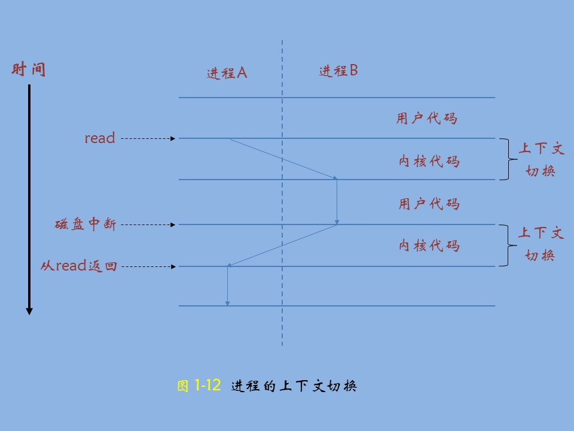

# 深入理解计算机系统

[TOC]

# 序章

- 前言
- 读者应具备的背景知识


## 前言

&emsp;&emsp;本书的主要读者是计算机科学家、计算机工程师，以及那些想通过学习计算机系统的内在运作而能够写出更好程序的人。

&emsp;&emsp;我们的目的是解释所有计算机系统的本质概念，并向你展示这些概念是如何实实在在地影响应用程序的正确性、性能和实用性的。其他的系统类书籍都是从==构建者的角度==来写的，讲述如何实现硬件和系统软件，包括操作系统、编译器和网络接口。而本书是从==程序员的角度==来写的，讲述应用程序员如何能够利用系统知识来编写出更好的程序。当然，学习一个计算机系统应该做些什么，是学习如何构建一个计算机系统的很好的出发点，所以，对于希望继续学习系统软硬件实现的人来说，本书也是一本很有价值的介绍性读物。大多数操作系统书籍还倾向于重点关注系统的某一个方面，比如：硬件架构、操作系统、编译器或者网络。本书则以程序员的视角统一覆盖了上述所有方面的内容。

&emsp;&emsp;如果你研究和领会了这本书里的概念，你将开始成为极少数的 “ 牛人 ”，这些 “ 牛人 ” 知道事情是如何运作的，也知道当事情出现故障时如何修复。你写的程序将能够更好地利用操作系统和系统软件提供的功能，对各种操作条件和运行时参数都能正确操作，运行起来更快，并能避免出现使程序容易受到网络攻击的缺陷。同时，你也要做好更深入探究的准备，研究像**编译器**、**计算机体系结构**、**操作系统**、**嵌入式系统**、**网络互联**和**网络安全**这样的高级题目。


## 读者应具备的背景知识

&emsp;&emsp;本书的重点是执行 x86-64 机器代码的系统。对英特尔及其竞争对手而言，x86-64 是他们自 1978 年起，以 8086 微处理器为代表，不断进化的最新成果。按照英特尔微处理器产品线的命名规则，这类微处理器俗称为 “ x86 ”。随着半导体技术的演进，单芯片上集成了更多的晶体管，这些处理器的计算能力和内存容量有了很大的增长。在这个过程中，它们从处理 16 位字，发展到引入 IA32 处理器处理 32 位字，再到最近的 x86-64 处理 64 位字。

&emsp;&emsp;我们考虑的是这些机器如何在 Linux 操作系统上运行 C 语言程序。Linux 是众多继承自最初由贝尔实验室开发的 Unix 的操作系统中的一种。这类操作系统的其他成员包括 Solaris、FreeBSD 和 MacOS X。近年来，由于 Posix 和标准 Unix 规范的努力下，这些操作系统保持了高度兼容性。因此，本书的内容几乎直接适用于这些 “ 类 Unix ” 操作系统。


# 一、从 hello 程序开始漫游计算机系统

> 前言

&emsp;&emsp;==**计算机系统**是由硬件和软件系统组成的，他们共同工作来运行应用程序。虽然系统的具体实现方式随着时间不断变化，但是系统内在的概念却没有改变。所有计算机系统都有相似的硬件和软件组件，它们又执行着相似的功能。==

&emsp;&emsp;现在就要开始一次有趣的漫游历程了。如果你全力投身学习书中的概念，完全理解底层计算机系统以及它对应用程序的影响，那么你会步上成为为数不多的 “ 大牛 ” 的道路。

&emsp;&emsp;你将会学习一些实践技巧，比如如何避免由计算机表示数字的方式引起的奇怪的数字错误。你将学习怎样通过一些小窍门来优化自己的 C 代码，以充分利用现代处理器和存储器系统的设计。你将了解编译器是如何实现过程调用的，以及如何利用这些知识来避免缓冲区溢出错误的安全漏洞，这些弱点给网络和因特网软件带来了巨大的麻烦。你将学会如何识别和避免链接时那些令人讨厌的错误，它们困扰着普通的程序员。你将学习如何编写自己的 Unix shell、自己的动态存储分配包，甚至于自己的 WEB 服务器。你会认识并发带来的希望和陷阱，这个主题随着单个芯片上集成了多个处理器核开始变得越来越重要。


## 1.1、hello, world

&emsp;&emsp;尽管 hello 程序非常简单，但是为了让它实现运行，系统的每个主要组成部分都需要协调工作。从某种意义上说，本书的目的就是要帮助你了解当你在系统上执行 hello 程序时，系统发生了什么以及为什么会这样？

```c
/* code/intro/hello.c -- 输出hello,world */
#include <stdio.h>

int main(void)
{
	printf("Hello, world\n");
	return 0;
}
```

&emsp;&emsp;我们通过跟踪此程序的生命周期来开始对系统的学习 —— 从它被程序员创建开始，到在系统上运行，输出简单的消息，然后终止。我们将沿着这个程序的生命周期，简要地介绍一些逐步出现的概念、专业术语和组成部分。后面的章节将围绕这些内容展开。


## 1.2、信息就是位 + 上下文

&emsp;&emsp;`hello` 程序的生命周期是从一个源程序 (或者说) 源代码开始的，即程序员通过编辑器创建并保存的文本文件，文件名是 `hello.c`。**源程序实际上就是一个由值0和1组成的位 (又称为比特) 序列**，8 个位被组织成一组，称为==字节==。每个字节表示程序中的某些文本字符。

&emsp;&emsp;大部分的现代计算机都使用 ASCII 码标准来表示文本字符，这种方式实际上就是用一个唯一的单字节大小的整数值。如下图所示，展示了 hello.c 文件的 ASCII 码表示：


&emsp;&emsp;注：==SP 是空格，CR是回车，LF/NL是换行==

&emsp;&emsp;从上图中可以看出，hello.c 程序是以字节序列的方式储存在文件中。每个字节都对应着一个整数值，对于某些字符。例如：第一个字节的整数值是 23 ，它对应的就是字符 “ # ” 。第二个字节的整数值为 69 ，它对应的字符是 “ i ”，后面的以此类推。每个文本行都是以一个看不见的换行符 “  \n ”来结束的，它所对应的的整数值为 10。像 `hello.c` 这样**只由 ASCII 码字符构成的文件称之为文本文件，所有其他文件都称之为二进制文件。** 

&emsp;&emsp;hello.c 的表示方法说明了一个基本思想：系统中所有的信息 —— 包括**磁盘文件、内存中的程序、内存中存放的用户数据**以及**网络上传送的数据**，都是由**一串比特**表示的。**区分不同数据对象的唯一方法是我们读到这些数据对象时的上下文**。比如在不同的上下文中，一个同样的字节序列可能表示一个整数、浮点数、字符串或者机器指令。

&emsp;&emsp;作为程序员，我们需要了解数字的机器表示方式，因为它们与实际的整数和实数是不同的。它们是对真值的有限近似值，有时候会有意想不到的行为表现。这方面的基本原理将在第 2 章中详细描述。


## 1.3、程序被翻译成不同的格式

&emsp;&emsp;hello 程序的生命周期是从一个高级 C 语言程序开始的，因为这种形式能够被人读懂。然而，为了在系统上运行 `hello.c` 程序，每条 C 语句都必须被其他程序转化为一系列的低级 *机器语言* 指令。然后这些指令按照一种称为==可执行目标程序==的格式打好包，并以二进制磁盘文件的形式存放起来。目标程序称为**可执行目标文件**。

&emsp;&emsp;在 Unix 系统上，从源文件到目标文件的转化是由编译器驱动程序完成的：

```shell
linux> gcc -o hello hello.c
```

&emsp;&emsp;在这里， GCC 编译器驱动程序读取源程序文件 `hello.c`，并把它翻译成一个可执行目标文件 hello。这个翻译过程可分为四个阶段完成，如下图所示。执行这四个阶段的程序 (预处理器、编译器、汇编器和链接器) 一起构成了**编译系统** (compilation system) 。


- 预处理阶段

  预处理器 (cpp) 根据以字符 # 开头的命令，修改原始的 C 程序。比如 hello.c 中第一行的 `#include <stdio.h>` 命令就告诉预处理器读取系统头文件 `stdio.h` 的内容，并把它直接插入程序文本中。结果就得到了另一个 C 程序，通常以 i 作为文件扩展名。

  

-  编译阶段

  编译器 (ccl) 将文本文件 `hello.i` 翻译成文本文件 `hello.s`，它包含一个汇编语言程序。该程序包含函数 `main` 的定义。

  定义中的某些语句都以一种文本格式描述了一条低级机器语言指令。汇编语言是非常有用的，因为**它为不同的高级语言的不同编译器提供了通用的输出语言**。例如，C 语言和 `Fortran` 编译器产生的输出文件都是一样的汇编语言。

  

- 汇编阶段

  接下来，汇编器 (as) 将 hello.s 翻译成机器语言指令，把这些指令打包成一种叫做可重定位目标程序 (relocatale object program) 的格式，并将结果保存在目标文件 hello.o 中。hello.o 文件是一个二进制文件，它包含的 17 个字节是函数 `main` 的指令编码。如果我们在文本编辑器中打开 hello.o 文件，将看到一堆乱码。


- 链接阶段

  请注意，hello 程序调用了 `printf` 函数，它是每个 C 编译器都提供的标准 C 库中的一个函数。printf 函数存在于一个名为 printf.o 的单独的预编译好了的目标文件中，而这个文件必须以某种方式合并到我们的 hello.o 程序中。链接器 (ld) 就负责处理这种合并。结果就得到 `hello` 文件，它是一个**可执行目标文件** (或者简称为**可执行文件**)，可以被加载到内存中，由系统执行。


> Tips：
>
> 了解编译系统是如何工作是大有益处的，有助于我们：
>
> - 优化程序性能
>
>   现代编译器都是成熟的工具，通常可以生成很好的代码。作为程序员，我们无需为了写出高效代码而去了解编译器的内部工作。但是，为了在 C 程序中做出好的编码选择，我们确实需要了解一些机器代码以及编译器将不同的 C 语句转化为机器代码的方式。比如，*一个 switch 语句是否总是比一系列的 if-else 语句高效得多？一个函数调用的开销有多大？while 循环比 for 循环更有效嘛？指针引用比数组索引更有效嘛？为什么将循环求和的结果放到一个本地变量中，会比将其放到一个通过引用传递过来的参数中，运行起来快很多呢？为什么我们只是简单地重新排列下算术表达式中的括号就能让函数运行得更快呢？*
>
> - 理解链接时出现的错误
>
>   根据我们的经验，一些最令人困扰的程序错误往往都与==链接器操作==有关，尤其是当你试图构建大型的软件系统时。比如，*链接器报告它无法解析一个引用，这是什么意思？静态变量和全局变量的区别是什么？如果你在不同的 C 文件中定义了名字相同的两个全局变量会发生什么？静态库和动态库的区别是什么？我们在命令行上排序库的顺序有什么影响？最严重的是，为什么有些链接错误直到运行时才会出现？*在第 7 章你将得到这些问题的答案
>
> - 避免安全漏洞
>
>   多年来，缓冲区溢出错误是造成大多数网络和 Internet 服务器上安全漏洞的主要原因。存在这些错误是因为很少有程序员能够理解需要限制从不受信任的源接收数据的数量和格式。学习安全编程的第一步就是理解数据和控制信息存储在程序栈上的方式会引起的后果。作为学习汇编语言的一部分，我们将在第 3 章中描述**堆栈原理**和**缓冲区溢出错误**。我们还将学习程序员、编译器和操作系统可以用来降低攻击威胁的方法。


## 1.4、处理器读取并解释储存在内存中的指令

- 系统的硬件组成
- hello 程序的运行


### 1.4.1、系统的硬件组成

为了理解运行 hello 程序时发生了什么，我们需要了解一个典型系统的硬件组织，如下图所示：


1. **总线**

   贯穿整个系统的是一组电子管道，称为**总线**，他携带信息字节并负责在各个部件间传递。通常总线被设计成传送定长的字节块，也就是字 (word)。字中的字节数 (即字长) 是一个基本的系统参数，各个系统中都不尽相同。现在大多数机器字长要么是 4 个字节 (32位)，要么是八个字节 (64位)。本书中，我们不对字长做任何固定的假设。相反，需要在明确定义的上下文中具体说明一个 “ 字 ” 是多大。

   

2.  **I/O 设备**

   I/O (输入/输出) 设备是系统与外部世界的联系通道。我们的示例系统包括四个 I/O 设备：作为用户输入的键盘和鼠标，作为用户输出的显示器，以及用于长期存储数据和程序的磁盘驱动器 (简单地说就是磁盘)。最开始，可执行程序 hello 就存放在磁盘上。

   每个 I/O 设备都通过一个控制器或适配器与 I/O 总线相连。控制器和适配器之间的区别主要在于它们的封装方式。控制器是 I/O 设备本身或者系统的主印制电路板 (通常称为主板) 上的芯片组。而适配器则是一块插在主板插槽上的卡。无论如何，它们的功能都是在 I/O 总线和 I/O 设备之间传递消息。

 

3. **主存**

   主存是一个临时存储设备，在处理器执行程序时，用来存放程序和程序处理的数据。从物理上来说，主存是由一组==动态随机存取存储器== (DRAM) 芯片组成的。从逻辑上来讲，存储器是一个线性的字节数组，每个字节都有其唯一的地址 (数组索引)，这些地址是从零开始的。一般来说，组成程序的每条机器指令都由不同数量的字节构成。与 C 程序变量相对应的数据项的大小是根据类型变化的。比如，在运行 Linux 的 x86-64 机器上，`short` 类型的数据需要 2 个字节，`int` 和 `float` 类型需要 4 个字节，而 `long` 和 `double` 类型需要 8 个字节。


4. **处理器**

   中央处理器 (CPU)，简称**处理器**，是解释 (或==执行==) 存储在主存中执行的引擎。处理器的核心是一个大小为一个字的存储设备 (或==寄存器==)，称为==程序计数器== (PC)。在任何时刻，PC 都指向主存中的某条机器语言指令 (即含有该条指令的地址)。
   
   从系统通电开始，直到系统断电，处理器一直在不断地执行程序计数器指向的指令，再更新程序计数器，使其指向下一条指令。处理器看上去是按照一个非常简单的指令执行模型来操作的，这个指令模型是由==指令集架构==决定的。在这个模型中，指令按照严格的顺序执行，而执行一条指令包含执行一系列的步骤。处理器从程序计数器指向的内存处读取指令，解释指令中的位，执行该指令指示的简单操作，然后更新 PC，使其指向下一条指令，而这条指令并不一定和在内存中刚刚执行的指令相邻。
   
   这样的操作并不多，它们围绕着主存、==寄存器文件== (register file) 和算术/逻辑单元 (ALU) 进行。寄存器文件是一个小的存储设备，由一些单个字长的寄存器组成，每个寄存器都有唯一的名字。ALU 计算新的数据和地址值。下面是一些简单操作的例子，CPU 在指令的要求下可能会执行这些操作。
   
   - 加载：从主存复制一个字节或者一个字到寄存器，以覆盖寄存器原来的内容
   - 存储：从寄存器复制一个字节或者一个字到主存的某个位置，以覆盖这个位置上原来的内容
   - 操作：把两个寄存器的内容复制到 ALU，ALU 对这两个字做算术运算，并将结果存储到一个寄存器中，以覆盖该寄存器中原来的内容
   - 跳转：从指令本身中抽取一个字，并将这个字复制到程序计数器 (PC) 中，以覆盖 PC 中原来的值。
   

&nbsp;

&emsp;&emsp;处理器看上去是它的指令集架构的简单实现，但是实际上现代的处理器使用了非常复杂的机制来加速程序的运行。因此，我们将处理器的指令集架构和处理器的==微体系结构==区分开来：指令集架构描述的是每条机器代码指令执行的效果；而微体系架构描述的是处理器实际上是如何实现的。在第三章研究机器代码时，我们考虑的是机器的指令集架构所提供的的抽象性。第 4 章将更详细地介绍处理器实际上是如何实现的。第 5 章用一个模型说明现代处理器是如何工作的，从而能预测和优化机器语言程序的性能。


### 1.4.2、hello 程序的运行

&nbsp;&nbsp;前面简单描述了下系统的硬件组成和操作，现在开始介绍当我们运行示例时程序到底发生了些什么。在这里必须省略很多细节，稍后会做补充，但是现在我们将很满意于这种整体上的描述。

1. 当我们在键盘上**输入**字符串命令 `./hello` 后，shell 程序**将**字符逐一**读入**到寄存器中，再把它**存放**到内存中

2. 当我们在键盘上**敲**回车键时，shell 程序就知道我们已经结束了命令的输入。然后 shell 程序**执行**一系列的指令来**加载**可执行的 hello 文件，这些指令将 hello 目标文件中的代码和数据从磁盘**复制**到主存。数据包括最终被输出的字符串 “hello,world\n”。

   利用==直接存储器存取== (DMA，将在第 6 章讨论) 技术，数据可以不通过处理器直接从磁盘到达主存。

3. 一旦目标文件 hello 中的代码和数据被加载到主存，处理器就开始**执行** hello 程序的 main 方法中的机器语言指令。这些指令将 “hello,world\n” 字符串中的字节从主存**复制**到寄存器，再从寄存器文件中**复制**到显示设备，最终显示在屏幕上


## 1.5、高速缓存至关重要

&emsp;&emsp;这个简单的示例揭示了一个重要的问题，即系统花费了大量的时间把信息从一个地方挪到另一个地方。hello 程序的机器指令最初是存放在磁盘上的，当程序加载时，它们被复制到主存；当处理器运行程序时，指令又从主存复制到处理器。相似地，数据串 “hello,world\n” 开始时在磁盘上，然后被复制到主存，最后从主存上复制到显示设备。从程序员的角度来看，这些复制就是开销，减慢了程序 “ 真正 ” 的工作。因此，系统设计者的一个主要目标就是使这些复制操作尽可能快地完成。

&emsp;&emsp;根据机械原理，较大的存储设备要比较小的存储设备运行的慢，而快速设备的造价远高于同类的低速设备。比如说，一个典型系统上的磁盘驱动器可能比主存大 1000 倍，但是对于处理器而言，从磁盘驱动器上读取一个字的开销要比从主存中读取的开销大 1000 万倍。

&emsp;&emsp;类似地，一个典型的寄存器文件只存储几百字节的信息，而主存里可存放几十亿字节。然而，处理器从寄存器文件中读数据比从主存中读取几乎要快 100 倍。更麻烦的是，随着这些年半导体技术的进步，这种处理器与主存之间的差距还在持续增大。加快处理器的运行速度比加快主存的运行速度要容易和便宜得多。

&emsp;&emsp;针对这种处理器与主存之间的差异，系统设计者采用了更小更快的存储设备，称之为==高速缓存存储器== (Cache Memory，简称为 Cache 或高速缓存)，作为暂时的集结区域，存放处理器近期可能会需要的信息。图 1-8 展示了一个典型系统中的高速缓存存储器。位于处理器芯片上的 L1 高速缓存的容量可以到达数万字节，访问速度几乎和访问寄存器文件一样快。一个容量为数十万到数百万字节的更大的 L2 高速缓存通过一条特殊的总线连接到处理器。进程访问 L2  高速缓存的时间要比访问 L1 高速缓存的时间长 5 倍，但是这仍然比访问主存的时间快 5 倍 ~ 10 倍。L1 和 L2 高速缓存是用一种叫做==静态随机访问存储器== (SRAM) 的硬件技术实现的。比较新的、处理能力更强大的系统甚至有三级高速缓存：L1、L2 和 L3。系统可以获得一个很大的存储器，同时访问速度也很快，原因是利用了高速缓存的局部性原理，即程序具有访问局部区域里的数据和代码的趋势。通过让高速缓存里存放可能经常访问的数据，大部分的内存操作都能在快速的高速缓存中完成。


&emsp;&emsp;本书得出的重要结论之一就是，意识到高速缓存存储器存在的应用程序员能够**利用高速缓存将程序的性能提高一个数量级**。你将在第 6 章里学习这些重要的设备以及如何利用它们。


## 1.6、存储设备形成层次结构

&emsp;&emsp;在处理器和一个较大较慢的设备 (例如主存) 之间插入一个更小更快的存储设备 (例如高速缓存) 的想法已经成为一个普遍的观念。实际上，每个计算机系统中的存储设备都被组织成了一个==存储器层次结构==，如下图所示。在这个层次结构中，从上至下，设备的访问速度越来越慢，容量越来越大，并且每字节的造价也越来越便宜。寄存器文件在层次结构中位于最顶层，也就是第 0 级或记为 L0。这里我们展示的是三层高速缓存 L1 到 L3，占据存储器层次结构的第 1 层到第 3 层。主存在第 4 层，以此类推。


&emsp;&emsp;存储器层次结构的主要思想是上一层的存储器作为第一层存储器的高速缓存。因此，寄存器文件就是 L1 的高速缓存，L1 是 L2 的高速缓存，L2 是 L3 的高速缓存，L3 是主存的高速缓存，而主存又是磁盘的高速缓存。在某些具有分布式文件系统的网络系统中，本地磁盘就是存储在其他系统中磁盘上的数据的高速缓存。

&emsp;&emsp;正如可以运用不同的高速缓存的知识来提高程序性能一样，程序员同样可以**利用对整个存储器层次结构的理解来提高程序性能**。第 6 章将会更详细地讨论到这个问题。


## 1.7、操作系统管理硬件

&emsp;&emsp;让我们回到 hello 程序的例子。当 shell 加载和运行 hello 程序时，以及 hello 程序输出自己的消息时，shell 和 hello 程序都没有直接访问键盘、显示器、磁盘或者主存。取而代之的是，它们依靠==操作系统==提供的服务。我们可以把操作系统看成是应用程序和硬件之间插入的一层软件，如图 1-10 所示。所有应用程序对硬件的操作都必须通过操作系统。


操作系统有两个基本功能：

1. 防止硬件被失控的应用程序滥用
2. 向应用程序提供简单一致的机制来控制复杂而又通常不相同的低级硬件设备。

操作系统通过基本的抽象概念 (**进程**、**虚拟内存**和**文件**) 来实现这两个功能。如图 1-11 所示，文件是对 I/0 设备的抽象表示，虚拟内存是对主存和磁盘 I/O 设备的抽象表示，进程则是对处理器、主存和 I/O 设备的抽象表示。我们将依次讨论


### 1.7.1、进程

&emsp;&emsp;像 hello 这样的程序在现代系统上运行时，操作系统会提供一种假象，就好像系统上只有这个程序在运行。程序看上去是独占地使用处理器、主存和 I/O 设备。处理器看上去就像在不间断地一条接一条地执行程序中的指令，即该程序的代码和数据是系统内存中唯一的对象。这些假象是通过进程的概念来实现的，进程是计算机科学中最重要和最成功的概念之一。

&emsp;&emsp;==进程==是操作系统对一个正在运行的程序的一种抽象。在一个系统上可以同时运行多个进程，而每个进程都好像在独占地使用硬件。而==并发==运行，则是说一个进程的指令和另一个进程的指令是交错执行的。在大多数系统中，需要运行的进程数是多于可以运行它们的的 CPU 个数的。传统系统在一个时刻只能执行一个程序，而先进的多核处理器同时能够执行多个程序。==无论是是在单核还是多核系统中，一个 CPU 看上去都像是在并发地执行多个进程，这是通过处理器在进程间切换来实现的。操作系统实现这种交错执行的机制称为**上下文切换**==。为了简化问题，我们现在只考虑包含一个 CPU 的单处理器系统的情况。至于多处理器系统，会在后面的章节中进行讨论。 

&emsp;&emsp;**操作系统保持跟踪进程运行所需的所有状态信息。这种状态，也就是上下文，包括许多信息，比如 PC 和寄存器文件的当前值，以及主存的内容。**在任何一个时刻，单处理器系统都只能执行一个线程的代码。当操作系统决定要把控制权从当前进程转移到某个新进程时，就会进行**上下文切换**，即保存当前进程的上下文、恢复新进程的上下文，然后将控制权传递到新进程。新进程就会从它上次停止的地方开始。图 1-12 展示示例 hello 程序运行场景的基本理念。



&emsp;&emsp;示例场景中有两个并发的线程：shell 进程的 hello 进程。最开始只有 shell 进程在运行，即等待命令行上的输入。当我们让它运行 hello 程序时，shell 通过调用一个专门的函数，即系统调用，来执行我们的请求，系统调用会将控制权传递给操作系统。操作系统保存 shell 进程的上下文，创建一个新的 hello 进程以及上下文，然后将控制权传给 hello 进程。hello 进程终止后，操作系统恢复 shell 进程的上下文，并将控制权传给新的 hello 进程。hello 进程终止后，操作系统恢复 shell 进程的上下文，然后将控制权传给它，shell 进程会继续等待下一个命令行的输入，**这个过程有点像接力比赛，运动员是线程，而接力棒则是控制权，通过线程的交替，完成各自的任务。**

&emsp;&emsp;如上图所示，从一个进程到另一个进程的转换是由操作系统**内核** (kernel) 管理的。内核是操作系统代码常驻主存的部分。当应用程序需要操作系统的某些操作时，比如读写文件，它就执行一条特殊的系统调用 (System Call) 指令，将控制权传递给内核。然后内核执行被请求的操作并返回应用程序。注意，内核不是一个独立的进程。相反，它是系统管理全部进程所用代码和数据结构的集合。

&emsp;&emsp;实现进程这个抽象的概念需要低级硬件和操作系统软件之间的紧密合作。我们将在第 8 章中揭示这项工作的的原理。


### 1.7.2、线程

&emsp;&emsp;尽管通常我们认为一个进程只有单一的控制流，但是在现代系统中，一个进程实际上可以由多个称为线程的执行单元组成，每个线程都运行在线程的上下文中，并共享同样的代码和全局数据。由于网络服务器中对并行处理的需求，线程成为越来越重要的编程模型，因为多线程之间比多进程之间更容易共享数据，也因为线程一般来说都比进程更高效。当有多处理器可用的时候，多线程也是一种使得程序可以运行得更快的方法。

&nbsp;

### 1.7.3、虚拟内存

&emsp;&emsp;虚拟内存是一个抽象概念，它为每个进程提供了一个假象，即每个进程都在独占地使用主存。每个进程看到的内存都是一致的，称为==虚拟地址空间==。图 1-13 所示的是 Linux 系统的虚拟地址空间 (其他 Unix 系统的设计也与此类似)。在 Linux 中，地址空间最上面的区域是保留给操作系统中的代码和数据的，这对所有的进程来说都是一样的。地址空间的底部区域存放用户进程定义的代码和数据。请注意，图中的地址是从下往上增大的。


&emsp;&emsp;每个进程看到的虚拟地址由大量准确定义的区构成，每个区都有专门的功能。在本书的后续章节你将学到更多有关这些区的知识，但是先了解每一个区是非常有益的。我们从最低的地址开始，逐步向上介绍。

- <font color="red">程序代码和数据</font>

  对所有的进程来说，代码是从同一固定地址开始的，紧接着的是和 C 全局变量相对应的数据位置。代码和数据区是直接按照可执行目标文件的内容初始化的，在示例中就是可执行文件 hello。在第 7 章我们研究链接和加载时，你会学习更多有关地址空间的内容。

- <font color="red">堆</font>

  代码和数据区后紧随着的是运行时**堆**。代码和数据区在进程一开始运行时就被指定了大小，与此不同，当调用 malloc 和 free 这些的 C 标准库函数时，堆可以在运行时动态地扩展和收缩。在第 9 章学习管理虚拟内存时，我们将更详细地研究堆

- <font color="red">共享库</font>

  大约在地址空间的中间部分是一块用来存放像 C 标准库和数据库这样的共享库的代码和数据的区域，共享库的概念非常强大，也相当难懂。在第 7 章介绍动态链接时，将学习共享库是如何工作的。

- <font color="red">栈</font>

  位于用户虚拟地址空间顶部的是用户栈，编译器用它来实现函数调用。和堆一样，用户栈在程序执行期间可以动态地扩展和收缩。特别地，每次我们调用一个函数，栈就会增长；从一个函数返回时，栈就会收缩。在第 3 章我们将学习编译器是如何使用栈的。

- <font color="red">内核虚拟内存</font>

  地址空间顶部的区域是为内核保留的。不允许应用程序读写这个区域的内容或者直接调用内核代码定义的函数。相反，它们必须调用内核来执行这些操作。

  虚拟内存的运作需要硬件和操作系统软之间精密复杂的交互，包括对处理器生成的每个地址的硬件翻译。基本思想是把一个进程虚拟内存的内存存储在磁盘上，然后用主存作为硬盘的高速缓存。第 9 章将解释它是如何工作的，以及为什么对现代系统的运行如此重要？


### 1.7.4、文件

&emsp;&emsp;文件就是字节序列，仅此而已。每个 I/O 设备，包括磁盘、键盘、显示器，甚至网络，都可以看成是文件。系统中的所有输入输出设备都是通过使用一小组称为 Unix I/O 的系统函数调用读写文件来实现的。

&emsp;&emsp;文件这个简单而又精致的概念是非常强大的，因为它向应用程序提供了一个统一的视图，来看待系统中可能含有的所有各式各样的 I/O 设备。例如，处理磁盘文件内容的应用程序员可以非常幸福，因为他们无需了解具体的磁盘技术。进一步说，同一个程序可以在使用不同磁盘技术的不同系统上运行。你将在第 10 章中学习 Unix I/O。


## 1.8、系统之间利用网络通信

&emsp;&emsp;系统漫游至此，我们一直是把系统视为了一个孤立的硬件和软件的集合体。实际上，现代系统经常通过网络和其他系统连接在一起。从一个单独的系统来看，网络可视为一个 I/O 设备，如图 1-14 所示。当系统从主存复制一串字节到网络适配器时，数据流经过网络到达另一台机器，而不是比如说到达本地磁盘驱动器。相似地，系统可以读取从其他机器发送来的数据，并把数据复制到自己的主存。


&emsp;&emsp;随着 Internet 这样的全球网络的出现，从一台主机复制信息到另外一台主机已经成为了计算机系统最重要的用途之一。比如，像电子邮件、即时通信、万维网、FTP 和 Telnet 这样的应用都是基于网络复制信息的功能。

&emsp;&emsp;回到 hello 示例，我们可以使用熟悉的 Telnet 应用 (比如Xshell7、Xftp工具等) 在一个远程主机上运行 hello 程序。假设用本地主机上的 Telnet 客户端连接远程主机上的 Telnet 服务器。在我们登录到远程主机并运行 shell 后，远端的 shell 就在等待接受输入命令。此后在远端运行 hello 程序包括运行如图 1- 15 所示的五个基本步骤


&emsp;&emsp;当我们在 Telnet 客户端键入 “ hello ” 字符串并敲下回车键后，客户端软件就会将这个字符串发送到 Telnet 的服务器。Telnet 服务器从网络上接收到这个字符串后，会把它传给远端 shell 程序。接下来，远端 shell 运行 hello 程序，并将输出行返回给 Telnet 服务器。最后，Telnet 服务器通过网络把输出串转发给 Telnet 客户端，客户端就将输出串输出到我们的本地终端上。

&emsp;&emsp;这种客户端和服务器之间交互的类型在所有的网络应用中是非常典型的。在第 11 章中，你将学会如何构造网络应用程序，并利用这些知识创建一个简单的 WEB 服务器。


## 1.9、重要主题


### 1.9.1、Amdahl 定律

&emsp;&emsp;Gene Amdahl，计算机领域的早期先锋之一，对提升系统某一部分性能所带来的的效果做出了简单却有见地的观察。这个观察被称为 <font color="red">Amdahl 定律 (Amdahl's law)</font>。该定律的主要思想是，当我们对系统的某个部分加速时，其对系统整体性能的影响取决于该部分的重要性和加速程度。若系统执行某应用程序需要时间为 T~old~。假设系统某部分所需执行时间与该时间的比例为 $\alpha$ ，而该部分性能提升比例为 $k$ 。即该部分初始化所需时间为 $\alpha T_{old}\;/\;k$。因此，总的执行时间应为

$$T_{new} = (1-a)T_{old} + (\alpha T_{old})\;/\;k = T_{old}[(1-a) + a/k]$$

由此，可以计算加速比 $S = T_{old}/T_{new}$ 为

$S = \frac {1}{(1-a)\;+\;a/k}$

&emsp;&emsp;举个例子，考虑这样一种情况，系统的某个部分初始耗时比例为 60%($\alpha = 0.6$)，其加速比例因子为 3($k=3$)。则我们可以获得的加速比为 1 / [0.4 + 0.6/3] = 1.67 倍。虽然我们对系统的一个主要部分做出了重大改进，但是获取的系统加速比却明显小于这部分的加速比。这就是 Amadahl 定律的主要观点 —— 要想显著加速整个系统，必须提升全系统中相当大的部分的速度。

&nbsp;

> 练习题

- [ ] 1.1 假设你是个卡车司机，要将土豆从爱达荷州的 Boise 运送到明尼苏达州的 Minneapolis，全程 2500 公里。在限速范围内，你估计平均速度为 100 公里/小时，整个行程需要 25 个小时

  A. 你听到新闻说蒙大拿州刚刚取消了限速，这使得行程中有 1500 公里卡车的速度可以为 150 公里/小时、那么这对整个行程的加速比是多少？

  &nbsp;

  B. 你可以在 www.fasttrucks.com 网站上为自己的卡车买个新的涡轮增压器。网站现货供应各种型号，不过速度越快，价格越高。如果想让整个行程的加速比为 1.67 X，那么你必须以多快的速度通过蒙大拿州？

  &nbsp;

- [ ] 1.2 公司的市场部向你的客户承诺，下一个版本的软件性能将改进 2 X。这项任务被分配给你。你已经确认只有 80% 的系统能够被改进，那么，这部分需要改进多少（即 $k$ 取何值）才能达到整体的性能目标？
