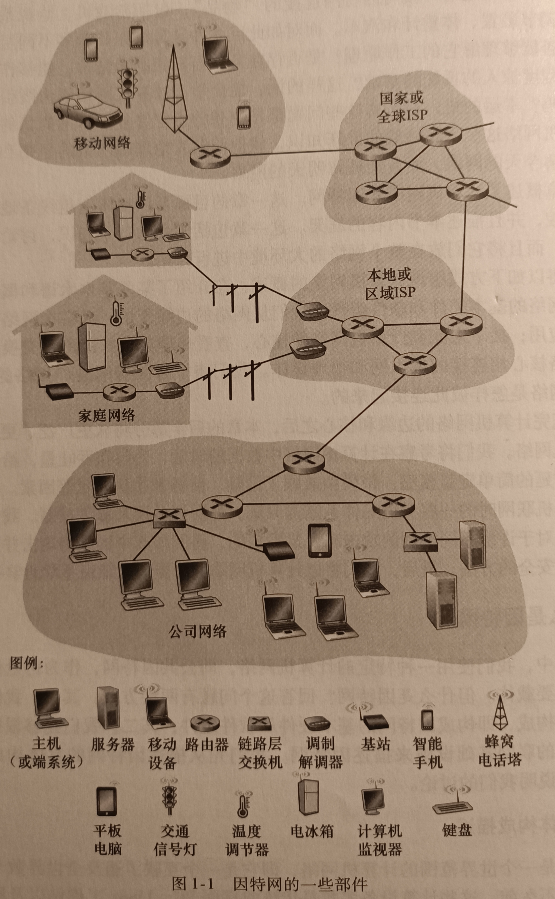

# 计算机网络自顶向下方法

# 一、计算机网络和因特网

[TOC]

&nbsp;

## 1.1、前言

&emsp;&emsp;今天的因特网无疑是有史以来由人类创造、精心设计的最大系统，该系统具有数以亿计相连的计算机、通信链路和交换机，有数十亿的用便携计算机、平板电脑和智能手机连接的用户，并且还有一批与因特网连接的 “ 物品 ”，包括游戏机、监视系统、手表、眼镜、温度调节装置、体重计和汽车。 

&nbsp;

## 1.2、什么是因特网

&emsp;&emsp;什么是因特网？回答这个问题有两种方式：其一，我们能够描述因特网的具体构成，即构成因特网的基本硬件和软件组成；其二，我们能够为分布式应用提供服务的联网基础设施来描述因特网，我们先从描述因特网的具体构成开始

&nbsp;

### 1.2.1、具体构成描述

&emsp;&emsp;因特网是一个世界范围的计算机网络，即它是一个互联了遍及全世界数十亿计算设备的网络。在不久前，这些计算设备多数是传统的桌面 PC、Linux 工作站以及所谓的服务器 (它们用于存储和传输 Web 页面和电子邮件报文等信息) 。然而，越来越多的非传统的因特网 “ 物品 ” (如便携机、智能手机、平板电脑、电视、游戏机、温度调节装置、家用安全系统、家用电器、手表、眼镜、汽车、运输控制系统等) 正在与因特网相连。的确，在许多非传统设备连接到因特网的情况下，计算机网络 (Computer Network) 这个术语开始听起来有些过时了。用因特网术语来说，所有这些设备都称为 主机（Host）> 或 端系统 (End Sysytem)。据统计，到 2015 年有大约 50 亿台设备与因特网连接，而到 2020 年该数字将达到 250 亿 【Gartner 2014】。2015 年，全世界已有超过 32 亿因特网用户，接近世界人口的 40%【ITU 2015】

&emsp;&emsp;端系统通过 通信链路 (communication link) 和 分组交换机(packet switch) 连接到一起。在 1.2 节中，我们将介绍许多类型的通信链路，它们由不同类型的物理媒体组成。这些物理媒体包括 `同轴电缆` 、`铜线` 、`光纤`  、 和 ` 无线电频谱` 。不同的链路能够以不同的速率传输数据，链路的**传输速率**（transmission rate）以 比特/秒（bit/s，或 bps）度量。当一台端系统要向另一台端系统发送数据时，发送端系统将数据分段，并为每段加上首部字节。由此形成的信息包用计算机术语来说称为**分组**（packet）。这些分组通过网络发送到目的端系统，在那里被装配成初始数据。

&emsp;&emsp;分组交换机从它的一条入通信链路接收到达的分组，并从它的一条出通信链路转发该分组。市面上流行着各种类型、各具特色的分组交换机，但在当今的互联网中，两种最著名的类型是**路由器**（router）和**链路层交换机**（link-layer switch）。这两种类型的交换机朝着最终的目的地转发分组。链路层交换机通常用于接入网中，而路由器通常用于网络核心中。从发送端系统到接收端系统，一个分组所经历的一系列通信链路和分组交换机称为通过该网络的**路径**（route 或 path）。思科公司估计到 2016 年年底全球年度 IP 流量将超过==泽字节==（zettabyte，10^21 字节），到 2019 年将达到每年 2 泽字节 【Cisco VNI 2015】

&emsp;&emsp;在许多方面，分组类似于卡车内运输的货物，通信链路类似于高速公路或公路，分组交换机类似于分叉路口，而端系统类似于目的地。就像卡车选取运输网络的一条路径前行一样，分组则选取计算机网络的一条路径前行。

<table><tr><td bgcolor=DarkSeaGreen>&emsp;&emsp;端系统通过因特网服务提供商（Internet Service Provider，ISP）接入互联网，包括如本地电缆或电话公司那样的住宅区 ISP、公司 ISP、大学 ISP，在机场、旅馆、咖啡馆和其他公共场所提供 WiFi 接入的 ISP，以及为智能手机和其他设备提供移动接入的蜂窝数据 ISP。</td></tr></table>

&emsp;&emsp;每个 ISP 自身就是一个由多台分组交换机和多段通信链路组成的网络。各 ISP 为端系统提供了各种不同类型的网络接入，包括如线缆调制解调器或 DSL 那样的住宅宽带接入、高速局域网接入和移动无线接入。ISP 也为内容提供者提供因特网接入服务，将 WEB 站点和视频服务器直接连入因特网。因特网就是将端系统彼此互联，因此为端系统提供接入的 ISP 也必须互联。较低层的 ISP 通过国家的、国际的较高层 ISP (如 Level 3 Communications、AT&T、Sprint 和 NTT) 互联起来。较高层 ISP 是由通过高速光纤链路互联的高速路由器组成的。无论是从较高层还是较低层 ISP 网络，它们每个都是独立管理的，运行着 IP 协议 (详情见后)，遵从一定的命名和地址规则。我们将在 1.3 节中更为详细地考察 ISP 及其互联的情况。

&emsp;&emsp;端系统、分组交换机和其他因特网部件都要运行一系统协议 (protocol)，这些协议控制因特网中信息的接收和发送。**TCP** (Transmission Control Protocol，传输控制协议) 和 **IP** (Internet Protocol，网际协议) 是因特网两个最为重要的协议。IP 协议定义了在路由器和端系统之间发送和接收的分组格式。因特网的主要协议统称为 **TCP/IP**。==我们在这一章中就开始接触这些协议。但是这仅仅是个开始，本书的许多地方与计算机网络协议有关。

&emsp;&emsp;鉴于因特网协议的重要性，每个人就各个协议及其作用取得一致认识是很重要的。这样人们就能创造协同工作的系统和产品。这正是标准发挥作用的地方。**因特网标准** (Internet Standard) 由因特网工程任务组 (Internet Engineering Task Force，IETF) 【**IETF 2016**】研发。IETF 的标准文档被称为**请求评论** (Request For Comment，RFC)。RFC 最初只是普通的请求评论 (因此而得名)，

