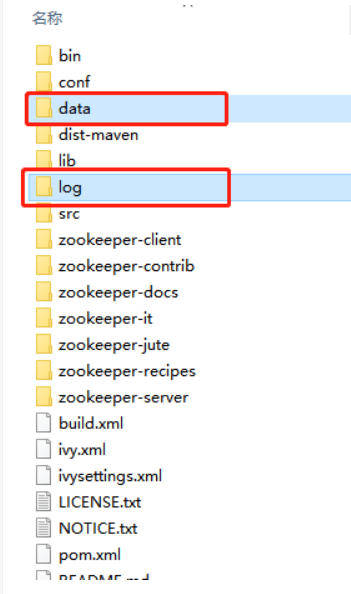

# 面试八股文

Java后端程序员必备面试宝典，包含计算机网络、关系型数据库、Redis、Linux系统、Java基础、JVM、Spring全家桶、操作系统、多线程和并发以及Java常用框架等模块，深受广大程序员的好评。

[TOC]

# 一、计算机网络面试核心

- 网络基础知识讲解
- 常见网络协议
- 常见面试题


## 1.1、网络基础知识讲解

- 计算机网络概述
- 计算机网络
- OSI参考模型


### 1.1.1、计算机网络概述

计算机网络是通过传输介质、通信设施和网络通信协议，把分散在不同地点的计算机设备互连起来，实现资源共享和数据传输的系统。网络编程就就是编写程 序使联网的两个(或多个)设备(例如计算机)之间进行数据传输。Java语言对网络编程提供了良好的支持，通过其提供的接口我们可以很方便地进行网络编程。


### 1.1.2、计算机网络

计算机网络20世纪60年代出现，经历了20世纪70年代、80年代和90年代的发展，进入21世纪后，计算机网络已经成为信息社会的基础设施，深入到人类社会的方方面面，与人们的工作、学习和生活息息相关。

> 网络协议

如同人与人之间相互交流是需要遵循一定的规矩一样，计算机之间能够进行相互通信是因为它们都共同遵守一定的规则，即网络协议。

> 网络体系结构

计算机网络是个复杂的系统，按照人们解决复杂问题的方法，把计算机网络实现的功能分到不同的层次上，层与层之间用接口连接。通信的双方具有相同的层次，层次实现的功能由协议数据单元（PDU：Protocol Data Unit）来描述。不同系统中的同一层构成对等层，对等层之间通过对等层协议进行通信，理解彼此定义好的规则和约定。

计算机网络体系结构是计算机网络层次和协议的集合，网络体系结构对计算机网络实现的功能，以及网络协议、层次、接口和服务进行了描述，但并不涉及具体的实现。接口是同一节点内相邻层之间交换信息的连接处，也叫服务访问点（SAP：Service Access Point）。


### 1.1.3、OSI参考模型

> 简介

世界上第一个网络体系结构由IBM公司提出（1974年，SNA），以后其他公司也相继提出自己的网络体系结构如：Digital公司的DNA，美国国防部的TCP/IP等，多种网络体系结构并存，其结果是若采用IBM的结构，只能选用IBM的产品，只能与同种结构的网络互联。

为了促进计算机网络的发展，国际标准化组织ISO于1977年成立了一个委员会，在现有网络的基础上，提出了不基于具体机型、操作系统或公司的网络 体系结构，称为**开放系统互连参考模型**，即OSI/RM (Open System Interconnection Reference  Model)。OSI模型把网络通信的工作分为7层，从下往上分别是物理层、数据链路层、网络层、传输层、会话层、表示层和应用层。


> OSI模型层次

- **物理层**

物理层处于OSI的最底层，是整个开放系统的基础。物理层涉及通信信道上传输的原始比特流(bits)，它的功能主要是为数据端设备提供传送数据的通路以及传输数据。

- **数据链路层**

数据链路层的主要任务是实现计算机网络中相邻节点之间的可靠传输，把原始的、有差错的物理传输线路加上数据链路协议以后，构成逻辑上可靠的数据链路。需要完成的功能有链路管理、成帧、差错控制以及流量控制等。其中成帧是对物理层的原始比特流进行界定，数据链路层也能够对帧的丢失进行处理。

- **网络层**

网络层涉及源主机节点到目的主机节点之间可靠的网络传输，它需要完成的功能主要包括路由选择、网络寻址、流量控制、拥塞控制、网络互连等。

- **传输层**

传输层起着承上启下的作用，涉及源端节点到目的端节点之间可靠的信息传输。传输层需要解决跨越网络连接的建立和释放，对底层不可靠的网络，建立连接时需要三次握手，释放连接时需要四次挥手。

- **会话层和表示层**

会话层的主要功能是负责应用程序之间建立、维持和中断会话，同时也提供对设备和结点之间的会话控制，协调系统和服务之间的交流，并通过提供单工、半双工和全双工3种不同的通信方式，使系统和服务之间有序地进行通信。

表示层关心所传输数据信息的格式定义，其主要功能是把应用层提供的信息变换为能够共同理解的形式，提供字符代码、数据格式、控制信息格式、加密等的统一表示。

- **应用层**

应用层为OSI的最高层，是直接为应用进程提供服务的。其作用是在实现多个系统应用进程相互通信的同时，完成一系列业务处理所需的服务。


### 1.1.4、TCP/IP参考模型

OSI参考模型的初衷是提供全世界范围的计算机网络都要遵循的统一标准，但是由于存在模型和协议自身的缺陷，迟迟没有成熟的产品推出。TCP/IP 协议在实践中不断完善和发展取得成功，作为网络的基础，Internet的语言，可以说没有TCP/IP协议就没有互联网的今天。

> 简介

TCP/IP，即Transmission Control Protocol/Internet Protocol的简写，中译名为传输控制协议/因特网互联协议，是Internet最基本的协议、Internet国际互联网络的基础。

TCP/IP协议是一个开放的网络协议簇，它的名字主要取自最重要的网络层IP协议和传输层TCP协议。TCP/IP协议定义了电子设备如何连入因 特网，以及数据如何在它们之间传输的标准。TCP/IP参考模型采用4层的层级结构，每一层都呼叫它的下一层所提供的协议来完成自己的需求，这4个层次分 别是：网络接口层、互联网层(IP层)、传输层(TCP层)、应用层。


> TCP/IP模型层次

- **网络接口层**

TCP/IP协议对网络接口层没有给出具体的描述，网络接口层对应着物理层和数据链路层。

- **互联网层 ( IP层 )** 

互联网层是整个TCP/IP协议栈的核心。它的功能是把分组发往目标网络或主机。同时，为了尽快地发送分组，可能需要沿不同的路径同时进行分组传 递。因此，分组到达的顺序和发送的顺序可能不同，这就需要上层必须对分组进行排序。互联网层除了需要完成路由的功能外，也可以完成将不同类型的网络（异构 网）互连的任务。除此之外，互联网层还需要完成拥塞控制的功能。　　

- **传输层 ( TCP层 )** 

TCP层负责在应用进程之间建立端到端的连接和可靠通信，它只存在与端节点中。TCP层涉及两个协议，TCP和UDP。其中，TCP协议提供面向连 接的服务，提供按字节流的有序、可靠传输，可以实现连接管理、差错控制、流量控制、拥塞控制等。UDP协议提供无连接的服务，用于不需要或无法实现面向连 接的网络应用中。

- **应用层**

应用层为Internet中的各种网络应用提供服务。


## 1.2、常见网络协议


- TCP协议
- UDP协议


### 1.2.1、TCP协议

- 三次握手
- 四次挥手
- 滑动窗口


> 简介

**TCP（Transmission Control Protocol  ，传输控制协议）是面向连接的传输层协议**。TCP层是位于IP层之上，应用层之下的中间层。不同主机的应用层之间经常需要可靠的、像管道一样的连接，但是 <u>IP层不提供这样的流机制，而是提供不可靠的包交换。TCP协议采用字节流传输数据。</u>

> TCP报文段格式

TCP报文段包括协议首部和数据两部分，协议首部的固定部分有20个字节，首部的固定部分后面是选项部分。


> TCP报文段

下面是报文段首部各个字段的含义。

1. 源端口号以及目的端口号，各占2个字节，端口是传输层和应用层的服务接口，用于寻找发送端和接收端的进程，一般来讲，通过端口号和IP地址，可以唯一确定一个TCP连接，在网络编程中，通常被称为一个socket接口。
2. 序号，占4字节，用来标识从TCP发送端向TCP接收端发送的数据字节流。
3. 确认序号，占4字节，包含发送确认的一端所期望收到的下一个序号，因此，确认序号应该是上次已经成功收到数据字节序号加1.
4. 数据偏移，占4位，用于指出TCP首部长度，若不存在选项，则这个值为20字节，数据偏移的最大值为60字节。
5. 保留字段占6位，暂时可忽略，值全为0
6. 标志位
    URG（紧急）:  为1时表明紧急指针字段有效
    ACK（确认）：为1时表明确认号字段有效
    PSH（推送）：为1时接收方应尽快将这个报文段交给应用层
    RST（复位）：为1时表明TCP连接出现故障必须重建连接
    SYN（同步）：在连接建立时用来同步序号
    FIN （终止）： 为1时表明发送端数据发送完毕要求释放连接
7. 接收窗口占2个字节，用于流量控制和拥塞控制，表示当前接收缓冲区的大小。在计算机网络中，通常是用接收方的接收能力的大小来控制发送方的数据发送量。TCP连接的一端根据缓冲区大小确定自己的接收窗口值，告诉对方，使对方可以确定发送数据的字节数。
8. 校验和占2个字节，范围包括首部和数据两部分。
9. 选项是可选的，默认情况是不选的。


#### 1.2.1.1、三次握手

TCP是面向连接的协议，因此每个TCP连接都有3个阶段：**连接建立、数据传送和连接释放**。连接建立经历三个步骤，通常称为“==三次握手==”。

TCP三次握手过程如下图所示：


1. 第一次握手
   客户机发送连接请求报文段到服务器，并进入SYN_SENT状态，等待服务器确认。（SYN = 1,seq=x）
2. 第二次握手
   服务器收到连接请求报文，如果同意建立连接，向客户机发回确认报文段，并为该TCP连接分配TCP缓存和变量。(SYN=1,ACK=1,seq=y,ack=x+1)。
3. 第三次握手
   客户机收到服务器的确认报文段后，向服务器给出确认报文段，并且也要给该连接分配缓存和变量。此包发送完毕，客户端和服务器进入ESTABLISHED（TCP连接成功）状态，完成三次握手。(ACK=1,seq=x+1,ack=y+1)。


#### 1.2.1.2、四次挥手

> TCP四次挥手过程如下图


由于TCP连接是全双工的，因此每个方向都必须单独进行关闭。这原则是当一方完成它的数据发送任务后就能发送一个 FIN 来终止这个方向的连接。收到 一个  FIN 只意味着这一方向上没有数据流动，一个TCP连接在收到一个FIN后仍能发送数据。首先进行关闭的一方将执行主动关闭，而另一方执行被动关闭。

1. TCP客户端发送一个FIN，用来关闭客户到服务器的数据传送。
2. 服务器收到这个FIN，它发回一个ACK，确认序号为收到的序号加1。和SYN一样，一个FIN将占用一个序号。
3. 服务器关闭客户端的连接，发送一个FIN给客户端。
4. 客户端发回ACK报文确认，并将确认序号设置为收到序号加1。


#### 1.2.1.3、滑动窗口

> 先理解两个概念：RTT和RTO

RTT：发送方发送一个数据包到收到回应（ack）所花费的时间，就是发送到回应的时间差

RTO：先设置一个定时时间，发送方发送的数据包未收到回应（ack）的时间达到定时时间限制，则重新发送数据包，重传时间间隔根据RTT计算得出，由此得出TCP的“重传机制”


Window（滑动窗口）：用于接收方通知发送方自己还有多少缓存空间可用，这便是“流量控制”滑动窗口基本原理
发送方分为四种状态

1、已发送已收到回应的状态

2、已发送未收到回应的状态

3、服务端允许发送的状态（待发送）

4、不允许发送的状态第2种和第3种所组成的连续窗口合称为发送方的滑动窗口，发送方通过接收方返回的ack值来移动左边界
接收方分为三种状态

1、已接收已回应的状态

2、待接收的状态

3、不能接收的状态（达到窗口的预值）第2种称之为接收方的滑动窗口，接收方通过前边所有的段（第1种状态所在的段）都确认的情况下才会移动左边界滑动窗口的大小根据应用自动调整


> TCP使用滑动窗口做流量可控制与乱序重拍

1. 保证TCP的可靠性
2. 保证TCP的流控特性。即Window接收方通知发送方还有多少缓冲区可以接收数据--流量控制       


### 1.2.2、UDP协议

> 简介

UDP，即用户数据报协议，英文全称是User Datagram Protocol，它是TCP/IP协议簇中一种无连接的运输层协议。


> UDP协议格式

从图中可以看到，UDP协议十分简单，它由两部分组成：首部和数据。其中，首部仅有8个字节，包括源端口和目的端口，长度（UDP用于数据报的长度）、校验和。


### 1.2.3、HTTP协议

- HTTP请求方法和响应状态码


> 简介

<u>==HTTP==即超文本传输协议，英文全称是**Hypertext Transfer  Protocol**，它是互联网上应用最为广泛的一种网络协议。</u>HTTP是一种应用层协议，它是基于TCP协议之上的请求/响应式的协议，即一个客户端与服 务器建立连接后，向服务器发送一个请求；服务器接到请求后，给予相应的响应信息。HTTP协议默认的端口号为80.

现在使用的HTTP协议是*HTTP/1.1*版本，1997年之前采用的是*HTTP1.0*版本。HTTP连接在1.0版本中采用非持续连接工作方式， 1.1版本采用的是持续连接工作方式，持续连接是指服务器在发送响应后仍然在一段时间内保持这条由TCP运输层协议建立起来的连接，使客户机和服务器可以继续在这条连接上传输HTTP报文。

是否采用持续连接工作方式，1.0中默认是关闭的，需要在HTTP头加入"Connection:Keep-Alive"，才能启用Keep- Alive。HTTP1.1中默认启用Keep-Alive，如果加入"Connection:close"，才关闭。目前大部分浏览器都是用 HTTP1.1协议，也就是说默认都会发起Keep-Alive的连接请求了，所以是否能完成一个完整的Keep- Alive连接就看服务器设置情况。


#### 1.2.3.1、HTTP请求方法和响应状态码

HTTP请求报文例子中，请求读取由URL所标志的信息，除了GET，还有其它几种常用的方法。


在HTTP响应报文的例子中，我们可以看到状态码是200就表示响应成功。下表是其它状态码，总共5大类，33种。


## 1.3、常见面试题

- HTTP和HTTPS的区别
- OSI参考模型的分为哪几层，每层的功能？
- TCP协议和UDP协议的区别
- TCP三次握手为什么不能是两次?
- 在浏览器中输入网址到显示出页面的整个过程？


### 1.3.1、HTTP和HTTPS的区别

==HTTPS（全称：Hyper Text Transfer Protocol over Secure Socket  Layer）==，是以安全为目标的HTTP通道，简单讲是HTTP的安全版。即HTTP下加入SSL层，HTTPS的安全基础是SSL，因此加密的详细内容 就需要SSL。它是一个URI  scheme（抽象标识符体系），句法类同HTTP体系。用于安全的HTTP数据传输。HTTPS:URL表明它使用了HTTP，但HTTPS存在不同 于HTTP的默认端口及一个加密/身份验证层（在HTTP与TCP之间）。（SSL:安全套接层，SSL3.0后改名为TLS，采用身份验证和数据加密保证通信安全和数据完整）

超文本传输协议HTTP协议被用于在Web浏览器和网站服务器之间传递信息。HTTP协议以**明文**方式发送内容，不提供任何方式的数据加密，如果攻击 者截取了Web浏览器和网站服务器之间的传输报文，就可以直接读懂其中的信息，因此HTTP协议不适合传输一些<u>敏感信息</u>，比如信用卡号、密码等。（加密方式：对称加密，非对称加密，哈希算法（MD5），数字签名）

为了解决HTTP协议的这一缺陷，需要使用另一种协议：安全套接字层超文本传输协议HTTPS。为了数据传输的安全，HTTPS在HTTP的基础上加入了SSL协议，SSL依靠证书来验证服务器的身份，并为浏览器和服务器之间的通信加密。

> HTTPS和HTTP的区别主要为以下四点

1. HTTPS协议需要到CA申请证书，一般免费证书很少，需要交费。
2. HTTP是超文本传输协议， 信息是明文传输，HTTPS则是具有安全性的SSL加密传输协议。
3. HTTP和HTTPS使用的是完全不同的连接方式，用的端口也不一样，前者是80，后者是443。
4. HTTP的连接很简单，是无状态的；HTTPS协议是由SSL+HTTP协议构建的可进行加密传输、身份认证的网络协议，比HTTP协议安全。

### 1.3.2、OSI参考模型的分为哪几层，每层的功能？

OSI开放系统互连参考模型，它的7个层次自顶到下依次为应用层，表示层，会话层，传输层，网络层，数据链路层和物理层。

### 1.3.3、TCP协议和UDP协议的区别

TCP协议是传输控制协议，UDP协议是用户数据报协议，两者都是传输层的协议。

主要区别在于前者是可靠的，面向连接的协议，后者是不可靠的，无连接的协议。

1. 面向连接VS无连接	TCP面向连接有三次握手的连接过程，UDP无连接适合消息的多播发布，单个点向多个点传输
2. 可靠性   TCP可靠（握手、确认、重传机制），UDP不可靠
3. 有序性   TCP利用序列号保证消息的顺序交互
4. 速度   TCP速度慢，因为要创建连接，保证消息的可靠性和有序性
5. 量级   TCP重量级，体现在元数据的头部TCP20字节，UDP八个字节       

### 1.3.4、TCP三次握手为什么不能是两次?

主要是防止两次握手情况下已经失效的连接请求报文段突然又传送到服务端而产生错误。

例如，客户机A向服务 器B发送TCP连接请求，第一个连接请求报文在网络的某个节点长时间滞留，A超时后认为报文丢失，于是再重传一次连接请求，B收到后建立连接。

数据传输完 毕后双方断开连接，而这时之前滞留的连接请求到达了服务端B，而B认为A又发来连接请求。如果两次握手建立连接，A并无连接请求，造成B的资源浪费。

### 1.3.5、HTTP请求的GET方法和POST方法的区别？

GET和POST是HTTP请求的两种方法，主要区别在于GET方法是请求读取由URL所标志的信息，POST是给服务器添加信息。

1. 报文;get请求放在URL，post放在报文体中，部分浏览器对URL长度有限制
2. 数据库层面：get符合幂等性和安全性 ，因为只能查询且不会改变数据（幂等性：1次请求和多次请求结果一致），post不符合
3. 其他层面：get可以被缓存、存储，而post不行       

### 1.3.6、在浏览器中输入网址到显示出页面的整个过程？

1. 输出包含域名的网址

2. 浏览器向DNS请求解析域名对应的IP地址 

3. 域名系统DNS解析出域名对应的IP地址

4. 浏览器与该服务器建立TCP连接 

5. 浏览器发送HTTP请求 

6. 服务器通过HTTP响应把页面文件发送给浏览器

7. 浏览器渲染页面

8. TCP连接释放

   


### 1.3.7、Cookie和Session的区别

Cookie存放在客户浏览器上，Session存放在服务器上
Session相对于Cookie更安全
若考虑减轻服务器负担，应该使用Cookie   

> 详细的区别

1. Cookie数据保存在客户端，Session数据保存在服务器端。
2. 都可以用来存敏感信息，同样也都有有效期的说法。区别在于Session是放在服务器上的，过期与否取决于服务期的设定，Cookie是存在客户端的，过去与否可以在Cookie生成的时候设置进去。 
3. Cookie和Session的共同之处在于：Cookie和Session都是用来跟踪浏览器用户身份的会话方式。
4. Cookie 是一种发送到客户浏览器的文本串句柄，并保存在客户机硬盘上，可以用来在某个Web站点会话间持久的保持数据。
5. Session 默认被存在在服务器的一个文件里（不是内存）
6. Session 的运行依赖 SessionId，而 Session_id 是存在 Cookie 中的，也就是说，如果浏览器禁用了 Cookie ，同时 Session 也会失效（但是可以通过其它方式实现，比如在 URL 中传递 Session_id）
7. Session 可以放在 文件、数据库、或内存中都可以。
8. 用户验证这种场合一般会用 Session 

​    

# 二、关系型数据库系统

- 数据库架构
- 优化你的索引
- 密集索引和稀疏索引的区别
- 索引额外问题
- 锁模块
- 关键语法讲解

  

## 2.1、数据库架构

- 关系型数据库主要考点


- 如何设计一个关系型数据库


### 2.1.1、关系型数据库主要考点


### 2.1.2、如何设计一个关系型数据库


- 划分为两大部分：
    第一部分为存储部分，相当于文件系统，将数据持久化到存储设备中
    第二部分为程序实例，对存储进行逻辑上的管理。

- 程序实例分为8个模块：
    1.存储管理：将数据的逻辑关系转化为物理存储关系。
    2.缓存机制：优化执行效率。
    3.SQL解析：解析SQL语句。
    4.日志管理：记录操作。
    5.权限划分：进行多用户管理。
    6.容灾机制：灾难恢复。
    7.索引管理：优化数据查询效率。
    8.锁管理：使数据库支持高并发。      

- 索引的数据结构


 

## 2.2、优化你的索引

- 运用二叉查找树
- 运用B树
- 运用B+树
- 运用Hash以及BitMap
- 索引设计原则（查询快，占用空间少）


### 2.2.1、运用二叉查找树

- 二叉查找树：一般为平衡二叉树
  构成：关键字和指向子树的指针
  1. 每个节点最多有2个子树，左子树小于自身，右子树大于自身
  2. 根部左子树和根部右子树长度差不超过1
  
  3. 对半搜索，时间复杂度O(logn),
  
  4. 缺点：删除后，可能会变成线性二叉树，时间复杂度变成O(n)，效率大大降低
- 降低时间复杂度同时降低IO次数，让树变的矮一些，存储的数据多一些，就有了B+树    


### 2.2.2、运用B树

B 树又称平衡多路查找树

> B树的定义：

1. 根节点至少包含两个孩子
2. 树中每个节点最多含有m个孩子（m >= 2）
3. 除根节点和叶节点外，其他每个节点至少有ceil（m / 2）个孩子
4. 所有叶子节点都位于同一层。 


### 2.2.3、运用B+树

> 和B树的不同点

1. 非叶子节点的子树指针与关键字个数相同
2. 非叶子节点的子树指针Pi，指向关键字值[Ki，Ki+1]的子树,左闭右开
3. 非叶子节点仅用来索引，数据都保存在叶子节点中
4. 所有叶子节点均有一个链指针指向下一个叶子节点，（叶子节点连接在一起，支持范围统计）

> 总结B+tree作为数据库主流索引数据结构的原因

1. B+ 树的磁盘读写代价更低（程序运行，往往最耗时的操作就是IO，如果IO的次数越少，那么运行也就越快，代价也就越低，内部结构没有指向关键字的指针，只存放索引，因此节点比B树更小）

2. B+ 树的查询效率更加稳定，数据存放在叶子节点中，也就意味着每次查询都需要经过从根节点到叶节点的查询路径，时间复杂度味为O(logn)，比较稳定

3. .B+ 树更有利于对数据库的扫描（因为数据只存放在叶子节点，而且有顺序，所以更好的查询数据范围）       


### 2.2.4、运用Hash以及BitMap

理论上高于B+tree索引，直接通过hash值定位到桶（bucket）的位置，再通过桶（bucket）内的条目（entries）找到对应的数据


> 缺点如下：

1. 仅仅能满足“=”，“in”，不能使用范围查询
2. 无法被用来做数据的排序操作：因为存储数据时已经把key值进行hash算法，取出后并不能跟存储前的大小一样
3. 不能进行部分索引查询：若组合键索引进行存储，自然会把组合键索引所有的字段进行hash算法得到key值，故使用部分索引查询并不能计算出对应的key值，而B+tree支持组合索引中的部分索引查询
4. 不能避免全表扫描：不同的数据在进行hash算法时可能会得到相同的key值，根据key获得的数据可能不是我们想要的数据，此时就会走全表扫描
5. 遇到大量Hash值相等的情况后性能并不一定会比B+tree索引高：因为大量Hash值相等的话则会指向同一个桶，故每次获取的数据一样

- 位图索引：适用于字段只有几种固定的值数据结构类似B+tree，只是叶子结点存储的是位图数据，通过位图数据的解析得到对应的值缺点：锁力度大，新增和修改同一个位图时会被锁住，不适合高并发


### 2.2.5、索引设计原则（查询快，占用空间少）

> 只为需要的字段建立索引，如果有多个字段需要使用到索引，可以考虑联合索引

- 出现在where子句或则连接子句中的列

- 基数小的表没必要

- 使用短索引，如果索引长字符串列，应该指定前缀长度

- 定义有外键的数据列一定索引

- 不要过度索引

- 更新频繁的不适合

- 区分度不高的不适合，如性别

- 尽量扩展索引，别新建索引，如(a)->(a,b)

  


> 字符串字段建立索引方法

1、直接创建完整索引，这样可能比较占用空间；

2、创建前缀索引，节省空间，但会增加查询扫描次数，并且不能使用覆盖索引；

3、倒序存储，再创建前缀索引，用于绕过字符串本身前缀的区分度不够的问题；

4、额外用一个字段进行索引，额外计算开销


总结：索引设计原则要求查询快，占用空间少；一般建在where条件，匹配度高的；要求基数大，区分度高，不要过大索引，尽量扩展，用联合索引，更新频繁不适合、使用短索引。


## 2.3、密集索引和稀疏索引的区别

- 密集索引：密集索引中的每个搜索码都对应一个索引值（主键和数据）
- 稀疏索引：稀疏索引文件的每个搜索码对应一个索引项（地址或主键），通过索引项（地址或主键）找到对应的数据


## 2.4、索引额外问题

- 如何定位并优化慢查询SQL
- Explain关键字段
- 最左匹配原则的成因
- 索引是建立越多越好吗
- 索引的类型
- 索引有哪些失效场景


### 2.4.1、如何定位并优化慢查询SQL

1. 慢日志定位慢查询sql

   show variables like '%quer%'，关于quer的变量，打开慢查询日志，查看慢查询日志

2. 使用explain分析工具

   type找到数据的方式，index/all代表全表扫描，需要优化

3. extra 项的值

   using filesort：使用的外部索引排序，也成文件排序，没有用到表索引
   using temporary：mysql对查询结果排序使用临时表，常见于order by ，group by
   3.修改sql或尽量让sql走索引
   查询优化器决定使用哪个索引sql：语句后面加force index（primar）强制使用主键索引

```mysql
# 查询慢日志相关变量
SHOW VARIABLES LIKE '%quer%';
# 查询慢日志条数
SHOW STATUS  LIKE '%slow_queries%';
# 设置慢日志开启，默认为OFF
SET GLOBAL slow_query_log=ON;
# 设置慢SQL时间为1秒，默认为10
SET GLOBAL long_query_time=1;
# 查询`person_info_large`的id数量
SELECT COUNT(id) FROM person_info_large;
# 查询name字段
EXPLAIN SELECT name FROM person_info_large order by name DESC;
# 查询name字段替换为查询account
EXPLAIN SELECT account FROM person_info_large order by account DESC;
SELECT account FROM person_info_large order by account DESC;
# name字段加上索引
ALTER table person_info_large add index idx_name(name);
SELECT name FROM person_info_large order by name DESC;
# 查询优化器会分析来使用其他索引，不一定使用所查询带索引的字段
EXPLAIN SELECT COUNT(id) FROM person_info_large;
EXPLAIN SELECT COUNT(id) FROM person_info_large FORCE INDEX(PRIMARY);
SELECT COUNT(id) FROM person_info_large FORCE INDEX(PRIMARY);
```

### 2.4.2、Explain关键字段

> type：

index(索引扫描) > all(全表扫描)

> extra:  出现以下两项说明需要优化SQL

- Using filesort：表示MySQL可能会对结果使用一个外部索引排序，而不是从表里按索引次序读到相关内容。可能在内存或者磁盘上进行排序。MySQL中无法利用索引完成的排序操作称为”文件排序“
- Using temporary：表示MySQL在对查询结果排序时使用临时表。常见于排序 order by 和分组查询 group by


### 2.4.3、最左匹配原则的成因

- 联合索引的最左匹配原则
- 联合索引的最左匹配原则的成因


1. 联合索引的最左匹配原则

   这是非常重要的原则，MySQL会一直向右匹配知道遇到范围查询（> , < , between, like ）就停止匹配。比如a=3and b = 4 and c > 5 and d =6 如果建立（a，b，c，d）顺序的索引，d是用不到索引的。如果建立（a，b，d，c）的索引则可以用到，a、b、d的顺序可以任意调整。= 和 in 可以乱序，比如a=1 and b=2 and c=3建立（a,b,c）索引可以任意顺序，mysql查询优化器会帮你优化成索引可以识别的形式

   ```mysql
   # 无论是在前面
   EXPLAIN SELECT  * from person_info_large WHERE area = 'LbjTmVUrdtXkfpcMokwP' and title = 'wCIKhAylZADbbkrEpijP';
   # 还是只有一个
   EXPLAIN SELECT  * from person_info_large WHERE area = 'LbjTmVUrdtXkfpcMokwP';
   # 还是反序都是ref
   EXPLAIN SELECT  * from person_info_large WHERE  title = 'wCIKhAylZADbbkrEpijP' and area = 'LbjTmVUrdtXkfpcMokwP';
   ```

2. 联合索引的最左匹配原则的成因

   mysql先对第一个字段排序，再对第二个字段排序....也就是说第二个字段是无序的，所以直接使用第二个字段做判断是用不到索引的


### 2.4.4、索引是建立越多越好吗

1. 数据量小的的表不需要建立索引，建立会增加额外的开销
2. 数据变更需要维护索引，因此更多的索引意味着更多的维护成本
3. 更多的索引也需要更多的空间


### 2.4.5、索引的类型

> 覆盖索引 + 回表 + 索引下推 + 联合索引

- 普通索引：可以重复
- 唯一索引：唯一，可为空，表中只有一个主键索引，可多个唯一索引
- 主键索引

  - 唯一，不为空，叶子结点存出了行记录数据，主键索引也称聚簇索引，对应非主键索引的叶子结点存的主键的值（二级索引），用二级索引查需要回表操作（根据二级索引查到主键，再根据主键去主键索引查）

  - 一般推荐用自增主键，**保证空间利用率，减少页分裂**

- 全文索引
- 覆盖索引：索引字段覆盖了查询语句涉及的字段，直接通过索引文件就可以返回查询所需的数据，不必通过回表操作。
- 回表：通过索引找到主键，再根据主键id去主键索引查。
- MySQL5.6之后有了索引下推

- 在根据索引查询过程中就根据查询条件过滤掉一些记录，减少最后的回表操作

>假如执行select * from stu where name=? and age=? 
>没有索引下推先再存储引擎根据name筛选数据返回给server层，然后server层再根据age过滤
>有索引下推直接根据name和age在存储引擎层就筛选得到结果
>
>再以一个真实例子来进行讲解。
>
>在这里有张用户表 user，记录着用户的姓名，性别，身高，年龄等信息。表中 id 是自增主键，(name,sex) 是联合索引。在这里用 1 表示男，2 表示女。现在需要查找所有姓王的男性信息。SQL 实现起来很简单：
>
>`SELECT * FROM user WHERE name like '王%' AND sex = 1;`
>
>**回表操作**
>
>当所要查找的字段不在非主键索引树上时，需要通过叶子节点的主键值去主键索引上获取对应的行数据，这个过程称为回表操作。
>
>**索引下推**
>
>索引下推主要是减少了不必要的回表操作。对于查找出来的数据，先过滤掉不符合条件的，其余的再去主键索引树上查找。


> 创建索引

- ALTER TABLE table_name ADD INDEX index_name (column_list)；
- CREATE INDEX index_name ON table_name (column_list)；
- 在create table时创建


### 2.4.6、索引有哪些失效场景

1. 以“%”开头的like语句，索引无效，后缀“%”不影响

2. or语句前后没有同时使用索引

3. 列类型是字符串，一定要在条件中将数据用引号引用，否则失效（隐式转换）
4. 如果MySQL估计使用全表扫描比索引快，则不用索引（键值少，重复数据多）

5. 组合索引要遵守最左前缀原则——不使用第一列索引 失效

6. 在索引字段上使用not，<>，!= （对它处理是全表扫描）

7. 对索引字段进行计算操作，字段使用函数也会失效

8. is null


## 2.5、锁模块

- MyISAM与InnoDB关于锁方面的区别
- 数据库事务的四大特性
- 事务并发访问产生的问题以及事务隔离机制
- 当前读和快照读
- RR如何避免幻读

  

### 2.5.1、MyISAM与InnoDB关于锁方面的区别

关系型数据库考点：架构、索引、锁、语法、理论形式

1. MyISAM与InnoDB中表级锁和行级锁的区别

|      |           InnoDB            |          MyISAM           |
| :--: | :-------------------------: | :-----------------------: |
| 表级锁  |             支持              |           默认表级锁           |
| 行级锁  |            默认行级锁            |            不支持            |
| 适合场景 | 数据增删查改都比较频繁、可靠性要求比较高，要求支持事务 | 频繁执行全表count查询、对数据增删改的频率不高 |

2. 使用数据库软件来模拟并发

```mysql
### One session
select count(*) from person_info_large;
select count(*) from person_info_myisam;
select * from person_info_large where id between 1 and 2000000;
update person_info_myisam set account = account where id between 1 and 2000000;

lock tables person_info_mysam read | write;
unlock tables;

### Two session
update person_info_myisam set account=account where id = 2000001;
select * from person_info_myisam where id in (2000000,2000001);


### Three session
update person_info_large set title="test" where id = 1;
show variables like 'autocommit';
# begin transaction
# xxxsql
# 关闭自动提交
set autocommit = 0;
update person_info_large set title = "test3" where id = 3;
commit;
update person_info_large set title = title where motto = "kyNHVOjhBdKafRyslapKJjrMallnuGNwnZhxpXYbiyJPispXpY";


### Four session
# 查看session是否为自动提交
show variables like 'autocommit';
# 将session设定为自动提交
set autocommit = 1;
# 1.先读取test_innodb的数据，得到Version的值为versionValue
select version from test_innodb where id=2;# 0
# 2.每次更新成功的话test_innodb表中的money字段时，为了防止冲突，先去检查version在做更新
# 每次更新成功的话version + 1
update test_innodb set money = 123,version = 0+1 where version = 0 and id = 2;


#### Five session
show variables like 'autocommit';
select version from test_innodb where id = 2;
update test_innodb set money = 345, version = 0+1 where version = 0 and id = 2;
```

1. 数据库中锁的分类

- 按锁的粒度划分，可分为表级锁、行级锁、页级锁
- 按锁的级别划分，可分为共享锁、排它锁
- 按加锁方式划分，可分为自动锁、显式锁
- 按操作划分，可分为DML锁、DDL锁
- 按使用方式划分，可分为悲观锁(直接锁表，拿到锁才能走)、乐观锁(在代码层面上使用版本号、时间戳来控制)

> Tips：
>
> 1. 当读锁未被释放的时候另一个session想对表加上写锁就会阻塞
> 2. 显示加上/释放读/写锁：lock tables person read/write;unlock tables;
> 3. 读锁为共享锁（同时多个不会阻塞，但是不允许上排他锁），写锁为排他锁（同时只能有一个写锁，再上其他任何类型的锁都是不可以的）
> 4. InnoDB 默认支持行级锁，也支持表级锁。InnoDB对select进行了优化没有显示上共享锁，便不会上锁。InnoDB是默认行级锁，用的是二段锁，加锁和解锁是分2步执行的，可以通过命令show variables like ‘autocommit’关闭自动提交。加读锁lock in share mode;
> 5. MyISAM 数据进行select时候会自动为数据加上一个表级的读锁，进行增删改的时候会为表加上表级别的写锁
> 6. InooDB当不走索引的时候，select加锁是锁住了整张表。当走索引的时候，是select加锁是行级锁以及gep锁（涉及到普通非唯一索引用到的）
> 7. IS意象锁  IX排他写锁      select不主动加锁是没有锁的。

### 2.5.2、数据库事务的四大特性

> mysql事务 - InnoDB中的ACID特性：

原子性(Atomicity)：要么所有指令执行完成，要么回退到未执行状态

**一致性(Consistent)**：保证数据库的完整性约束，包括：**数据库自身的完整性约束**和**用户定义的完整性约束**

隔离性(Isolation)：并发的事务之间相互隔离，相互不干扰，保证业务数据的一致性
持久性(Durable)：只要事务被提交，其结果应是永久性的，不应该出现丢失的可能性


### 2.5.3、事务并发访问产生的问题以及事务隔离机制

==我们应该如何避免事务并发访问引起的问题？== 

> SQL隔离级别

1. **脏读**：读取了其他事务修改但回滚的数据。
2. **不可重复读**：A事务对同一条数据多次读取，在两次读取间隔中，有B事务对该条数据进行了更改，导致A事务对同一条数据前后读取不一致。
3. **幻读**：在范围查询时，有其他事务在该范围中新增了数据，导致前后获取到的数据总数不一致。


> SQL四大隔离级别

1. **Read Uncommitted（RU）**：一个事务可以读取到其他事务未提交的数据，此时会出现**脏读**、**不可重复读**、**幻读**
2. **Read Committed（RC）**：一个事务只能读取到其他事务已提交的数据，此时会出现**不可重复读**、**幻读**
3. **Repeatable Read（RR）**：同一个事务里面多次读取同样的数据，结果是一样的，但是依然会出现**幻读**
4. **Serializable（串行化）**：所有事务都是串行执行(独占锁)，不存在并发，解决了所有隔离性问题。


```mysql
# 查看数据库的隔离级别
show global variables like "tx_isolation";
# MySQL一般的事务隔离级别为RR
# 设置当前会话事务隔离级别为RU、RC、RR
SET SESSION TRANSACTION ISOLATION LEVEL READ uncommitted;
SET SESSION TRANSACTION ISOLATION LEVEL READ committed;
SET SESSION TRANSACTION ISOLATION LEVEL Repeatable Read;
SET SESSION TRANSACTION ISOLATION LEVEL Serializable;


### session
start transaction;
update account_innnodb set balance = 1000 100 where id = 1;
select * from account_innodb where id = 1;
rollback;


### session
start transaction;
# 这句会产生脏读
select * from account_innodb where id = 1;
update account_innodb set balance = 900 + 200 where id = 1;
commit;
```


### 2.5.4、当前读和快照读

> 当前读

LBCC(基于锁的并发控制)：记录锁、间隙锁、临键锁。

> 快照读（非阻塞读）——伪MVCC

MVCC(多版本并发控制): 查询语句只能查找创建时间小于等于当前事务ID的数据，和删除时间大于当前事务ID的行（或未删除）

- 具体实现依赖undo log和隐藏的冗余版本字段。

- next-key锁 （行锁+gap锁）

1. 当前读：select、... lock in share mode、select ... for update
2. 当前读：update、delete、insert
3. 快照读：不加锁的非阻塞读、select

```mysql
# 查看数据库的隔离级别
show global variables like "tx_isolation";

### session
start transaction;
select * from account_innodb set balance = 600 where id = 2;
commit;


### session
select * from account_innodb set balance = 600 where id = 2;
select * from account_innodb set balance = 600 where id = 2 lock in share mode;

commit
```


> Tips：
>
> next-key锁（行锁+Gap锁）
>
> - 特性1：Gap锁范围：where条件中最小值至最大值， 比如 where ...in （5,7,9），5-9会上锁
> - 特性2：Gap锁会用在走非唯一索引或不走索引的当前读中
>
> Question1：对主键索引或唯一索引会用Gap锁吗？
> 答：
>
> where条件全部命中则不会用Gap锁，只会加记录锁。
>
> 如果where条件部分命中或者全不命中，则会加Gap锁    


### 2.5.5、RR如何避免幻读

- 行锁
- Gap锁


> 通过`MVCC 多版本并发控制`解决了幻读问题; 具体是通过加锁,`Next-Key Lock ：行锁和间隙锁组合起来就叫Next-Key Lock。`


```mysql
# 查看数据库的隔离级别
show global variables like "tx_isolation";

start transaction;
delete from tb where id = 9;
insert into tb values('i',10);
```


> Tips：
>
> InnoDB通过MVCC(快照读-多版本并发控制)和LBCC(当前读-基于锁的并发控制)解决了RR隔离级别下的幻读 问题。
>
> Question1：MyISAM与InnoDB中关于锁的区别？
>
> Question2：数据库事务的四大特性
>
> Question3：事务隔离级别以及各级别下的的并发访问问题？
>
> Question4：InnoDB可重复读隔离级别下如何避免幻读？
>
> Question5：RR、RC级别下的InnoDB的非阻塞读如何实现?


### 2.5.6、死锁

> 死锁的产生条件	-	资源互斥且不可剥夺，形成请求环路

1. **互斥条件**：一个资源每次只能被一个进程使用，即在一段时间内某资源仅为一个进程所占有。此时若有其他进程请求该资源，则请求进程只能等待。
2. **不可剥夺条件**：进程已经保持了至少一个资源，但又提出了新的资源请求，而该资源已被其他进程占有，此时请求进程被阻塞，但对自己已获得的资源保持不放。
3. **请求和保持条件**：进程所获得的资源在未使用完毕之前，不能被其他进程强行夺走，即只能由获得该资源的进程自己来释放（只能是主动释放)。
4. **循环等待条件**：若干进程间形成首尾相接循环等待资源的关系。

> 死锁避免

1. 破坏“不可剥夺”条件：一个进程不能获得所需要的全部资源时便处于等待状态，等待期间他占有的资源将被隐式的释放重新加入到系统的资源列表中，可以被其他的进程使用，而等待的进程只有重新获得自己原有的资源以及新申请的资源才可以重新启动，执行。
2. 破坏”请求与保持条件“：第一种方法静态分配即每个进程在开始执行时就申请他所需要的**全部资源**。第二种是动态分配即每个进程在申请所需要的资源时他本身不占用系统资源。
3. 破坏“循环等待”条件：**顺序获得所需资源**，采用资源有序分配其基本思想是将系统中的所有资源顺序编号，将紧缺的，稀少的采用较大的编号，在申请资源时必须按照编号的顺序进行，一个进程只有获得较小编号的进程才能申请较大编号的进程。


## 2.6、关键语法讲解

- 关键语法：Group By、Having
- 统计相关：Count、Sum、Max、Min、Avg
- 常用函数


### 2.6.1 关键语法

- 关键语法：Group By、Having


#### 2.6.1.1、Group By

- 满足 "Select 子句中的列名必须为分组列或列函数"
- 列函数对于Group By子句定义的每个组各返回一个结果

```mysql
# 查询所有同学的学号、选课数、总成绩
group by student_id
select student_id,count(course_id),sum(score) 
from score 
# 列函数对于Group By子句定义的每个组各返回一个结果 
# 如果用Group By,那么你的select语句中选出的结列要么是你Group里用到的列，
# 要么就是带之前我们说的如sum等函数的列

# 查询所有同学的学号、姓名、选课数、总成绩
select s.student_id,stu.mame,count(s.course_id),sum(s.score) 
from score s,student stu
where s.student_id = stu.student_id
group by s.student_id;

select * from score where student_id = 1;
```


#### 2.6.1.2、Having

- 通常与Group By 子句一起使用
- Where过滤行，Having过滤组
- 出现在同一SQL的顺序：Where > Group By > Having

```mysql
# 查询平均成绩大于60分的同学的学号和平均成绩

select student_id,avg(`score`)
from score
group by `student_id`
having avg(score)>60

# 取出student_id为1的学生情况
select * from score where student_id = 1;
select * from score having student_id = 1;

# 查询没有学全所有课的同学的学号、姓名
select stu.student_id,stu.name
from student stu,score s
where stu.student_id = s.student_id
group by student_id
having count(*) <
(
select count(*) from course
)
```


```mysql
# 创建数据库database_demo
DROP DATABASE IF EXISTS `database_demo`;
CREATE DATABASE  `database_demo`;

# 使用数据库database_demo
USE `database_demo`;

# 创建表`student`
CREATE TABLE `student` (
  `student_id` INT(11) NOT NULL AUTO_INCREMENT COMMENT '学生ID',
  `name` VARCHAR(32) DEFAULT NULL COMMENT '名称',
  `age` INT(11) DEFAULT NULL COMMENT '年龄',
  `sex` VARCHAR(8) DEFAULT NULL COMMENT '性别',
  PRIMARY KEY (`student_id`),
) ENGINE=InnoDB AUTO_INCREMENT=8 DEFAULT CHARSET=utf8;

# 创建表`course``
CREATE TABLE `course` (
  `course_id` INT(11) NOT NULL AUTO_INCREMENT COMMENT '课程ID',
  `name` VARCHAR(20) DEFAULT NULL COMMENT '名称',
  PRIMARY KEY (`course_id`),
) ENGINE=InnoDB AUTO_INCREMENT=5 DEFAULT CHARSET=utf8;

# 创建表`score`
CREATE TABLE `score` (
  `student_id` INT(11) DEFAULT NULL COMMENT '学生ID',
  `course_id` INT(11) DEFAULT NULL COMMENT '课程ID',
  `score` INT(11) DEFAULT NULL COMMENT '分数',
) ENGINE=InnoDB DEFAULT CHARSET=utf8;

# 向表`score`中插入一条测试数据
INSERT  INTO `score`(`student_id`, `course_id`,`score`) 
VALUES (1,2,78),
VALUES (2,4,86),
VALUES (2,3,94),
VALUES (1,4,90),
VALUES (3,4,88),
VALUES (3,4,66);
```


> 练习题：
>
> 1. 查询所有同学的学号、选课数、总成绩
> 2. 查询平均成绩大于60分的同学的学号和平均成绩
> 3. 取出student_id为1的学生情况
> 4. 查询没有学全所有课的同学的学号、姓名


### ==2.6.2、常用函数==

- 聚合函数
- 数值型函数

- 字符串函数
- 日期和时间函数
- 流程控制函数
- 加密函数


#### 2.6.2.1、聚合函数

聚合函数是平时比较常用的一类函数，这里列举如下：

- COUNT(col)  统计查询结果的行数
- MIN(col)  查询指定列的最小值
- MAX(col)  查询指定列的最大值
- SUM(col)  求和，返回指定列的总和
- AVG(col)  求平均值，返回指定列数据的平均值

````mysql
SELECT 
    university,
    difficult_level,
    (COUNT(qpd.question_id) / COUNT(DISTINCT qpd.device_id)) AS avg_answer_cnt
FROM 
    user_profile AS up
INNER JOIN
    question_practice_detail AS qpd ON up.device_id = qpd.device_id
INNER JOIN
    question_detail AS qd ON qpd.question_id = qd.question_id
WHERE 
    university = '山东大学'
GROUP BY 
    difficult_level;

###

SELECT
    qd.difficult_level,
    # 正确题目 / 题目数量 = 正确率
    COUNT(IF(qpd.result='right',qpd.question_id, null)) / 
    COUNT(qpd.question_id) AS correct_rate
FROM
    (SELECT device_id, question_id, result 
     FROM question_practice_detail ) AS qpd
INNER JOIN
    # 确保用户不重复且学校为浙大
    (SELECT device_id FROM user_profile
     WHERE university = '浙江大学'
    ) AS up ON qpd.device_id = up.device_id
LEFT OUTER JOIN
    # 确保题目不重复
     (
      SELECT question_id, difficult_level 
      FROM question_detail
     ) AS qd ON qpd.question_id = qd.question_id
GROUP BY difficult_level
ORDER BY correct_rate;
````


#### 2.6.2.2、数值型函数

数值型函数主要是对数值型数据进行处理，得到我们想要的结果，常用的几个列举如下，具体使用方法大家可以试试看。

- ABS(x)  返回x的绝对值
- BIN(x)  返回x的二进制
- CEILING(x)  返回大于x的最小整数值
- EXP(x)  返回值e（自然对数的底）的x次方
- FLOOR(x)  返回小于x的最大整数值
- GREATEST(x1,x2,...,xn)  返回集合中最大的值
- LEAST(x1,x2,...,xn)  返回集合中最小的值
- LN(x)  返回x的自然对数
- LOG(x,y)  返回x的以y为底的对数
- MOD(x,y)  返回x/y的模（余数）
- PI()  返回pi的值（圆周率）
- RAND()  返回０到１内的随机值,可以通过提供一个参数(种子)使RAND()随机数生成器生成一个指定的值
- ROUND(x,y)  返回参数x的四舍五入的有y位小数的值
- TRUNCATE(x,y)  返回数字x截短为y位小数的结果


#### 2.6.2.3、字符串函数

字符串函数可以对字符串类型数据进行处理，在程序应用中用处还是比较大的，同样这里列举几个常用的如下：

- LENGTH(s)  计算字符串长度函数，返回字符串的字节长度
- CONCAT(s1,s2...,sn)  合并字符串函数，返回结果为连接参数产生的字符串，参数可以是一个或多个
- INSERT(str,x,y,instr)  将字符串str从第x位置开始，y个字符长的子串替换为字符串instr，返回结果
- LOWER(str)  将字符串中的字母转换为小写
- UPPER(str)  将字符串中的字母转换为大写
- LEFT(str,x)  返回字符串str中最左边的x个字符
- RIGHT(str,x)  返回字符串str中最右边的x个字符
- TRIM(str)  删除字符串左右两侧的空格
- REPLACE  字符串替换函数，返回替换后的新字符串
- SUBSTRING  截取字符串，返回从指定位置开始的指定长度的字符换
- REVERSE(str)  返回颠倒字符串str的结果


```mysql
SELECT
    SUBSTRING_INDEX(profile,',',-1) AS gender, COUNT(1)
FROM
    user_submit
GROUP BY 
    gender;

###

SELECT
    device_id, SUBSTRING(blog_url, 11) AS user_name
FROM
    user_submit

### 

SELECT SUBSTRING_INDEX(SUBSTRING_INDEX(profile,',',-2),',',1) AS age, COUNT(1) AS number
FROM user_submit
GROUP BY age;
```


#### 2.6.2.4、日期和时间函数

- CURDATE 和 CURRENT_DATE  两个函数作用相同，返回当前系统的日期值
- CURTIME 和 CURRENT_TIME  两个函数作用相同，返回当前系统的时间值
- NOW 和 SYSDATE  两个函数作用相同，返回当前系统的日期和时间值
- UNIX_TIMESTAMP  获取UNIX时间戳函数，返回一个以 UNIX 时间戳为基础的无符号整数
- FROMUNIXTIME  将 UNIX 时间戳转换为时间格式，与UNIXTIMESTAMP互为反函数
- MONTH  获取指定日期中的月份
- MONTHNAME  获取指定日期中的月份英文名称
- DAYNAME  获取指定曰期对应的星期几的英文名称
- DAYOFWEEK  获取指定日期对应的一周的索引位置值
- WEEK  获取指定日期是一年中的第几周，返回值的范围是否为 0〜52 或 1〜53
- DAYOFYEAR  获取指定曰期是一年中的第几天，返回值范围是1~366
- DAYOFMONTH  获取指定日期是一个月中是第几天，返回值范围是1~31
- YEAR  获取年份，返回值范围是 1970〜2069
- DAY 获取指定日期中的天数，
- TIMETOSEC  将时间参数转换为秒数
- SECTOTIME  将秒数转换为时间，与TIMETOSEC 互为反函数
- DATE_ADD 和 ADDDATE  两个函数功能相同，都是向日期添加指定的时间间隔
- DATE_SUB 和 SUBDATE  两个函数功能相同，都是向日期减去指定的时间间隔
- ADDTIME  时间加法运算，在原始时间上添加指定的时间
- SUBTIME  时间减法运算，在原始时间上减去指定的时间
- DATEDIFF  获取两个日期之间间隔，返回参数 1 减去参数 2 的值
- DATE_FORMAT  格式化指定的日期，根据参数返回指定格式的值
- WEEKDAY  获取指定日期在一周内的对应的工作日索引
- DATE_FORMAT() 格式化时间


```mysql
SELECT DAY(date) AS day, COUNT(question_id) AS question_cnt
FROM question_practice_detail
WHERE YEAR(date) = 2021 AND MONTH(date)=08
GROUP BY day;

###

SELECT 
    COUNT(DISTINCT device_id) AS did_cnt,
    COUNT(question_id) AS question_cnt
FROM 
	question_practice_detail
WHERE 
	MONTH(date) = 08;
```


#### 2.6.2.5、流程控制函数

流程控制类函数可以进行条件操作，用来实现SQL的条件逻辑，允许开发者将一些应用程序业务逻辑转换到数据库后台，列举如下：

- IF(test,t,f)  如果test是真，返回t；否则返回f
- IFNULL(arg1,arg2)  如果arg1不是空，返回arg1，否则返回arg2
- NULLIF(arg1,arg2)  如果arg1=arg2返回NULL；否则返回arg1
- `COALESCE(exp1, exp2, ….) 返回列表中第一个非null的值，如果列表中所有的值都是null则返回null`
- `GROUP_CONCAT([DISTINCT] 要连接的字段 [Order BY ASC/DESC 排序字段] [Separator '分隔符']) 将多行数据合并成一行数据`
- CASE WHEN[test1] THEN [result1]...ELSE [default] END  如果testN是真，则返回resultN，否则返回default
- CASE [test] WHEN[val1] THEN [result]...ELSE [default]END  如果test和valN相等，则返回resultN，否则返回default


``````mysql
SELECT 
    device_id, 
    gender,
    (CASE
        WHEN age >= 25 THEN '25岁以上'
        WHEN age >= 20 AND age <= 24 THEN '20-24岁'
        ELSE '其他'
    END) AS age_cnt
FROM
    user_profile
# 排名靠前的旅行者
SELECT
	`name`,
	COALESCE ( SUM( distance ), 0 ) AS travelled_distance 
FROM
	Users
	LEFT JOIN Rides ON Users.id = Rides.user_id 
GROUP BY
	user_id 
ORDER BY
	travelled_distance DESC,
	`name` ASC;
# 按日期分组销售产品
SELECT
	sell_date,
    COUNT(DISTINCT product) AS num_sold,
	GROUP_CONCAT(DISTINCT product ORDER BY product SEPARATOR  ',') AS products
FROM
	Activities 
GROUP BY
	sell_date
ORDER BY
	sell_date ASC
``````


#### 2.6.2.6、加密函数

加密函数主要用于对字符串进行加密，常用的几个列举如下：

- ENCRYPT(str,salt)  使用UNIXcrypt()函数，用关键词salt(一个可以惟一确定口令的字符串，就像钥匙一样)加密字符串str
- ENCODE(str,key)  使用key作为密钥加密字符串str，调用ENCODE()的结果是一个二进制字符串，它以BLOB类型存储
- MD5()  计算字符串str的MD5校验和
- PASSWORD(str)  返回字符串str的加密版本，这个加密过程是不可逆转的，和UNIX密码加密过程使用不同的算法。
- SHA()  计算字符串str的安全散列算法(SHA)校验和


```mysql
# 将titles_test表名修改为titles_2017
ALTER TABLE titles_test RENAME TO titles_2017;
RENAME TABLE titles_test to titles_2017;
# 将id=5以及emp_no=10001的行数据替换成id=5以及emp_no=10005,其他数据保持不变，使用replace实现，直接使用update会报错。
REPLACE INTO titles_test VALUES(5,10005,'Senior Engineer','1986-06-26','9999-01-01');
UPDATE titles_test SET emp_no = REPLACE(emp_no, 10001,10005) WHERE id=5;
# 删除emp_no重复的记录，只保留最小的id对应的记录。
DELETE FROM titles_test
WHERE id NOT IN
(SELECT min_id FROM 
 (SELECT MIN(id) AS min_id FROM titles_test GROUP BY emp_no) AS tt
);
DELETE ta
FROM titles_test AS ta, titles_test AS tb
WHERE ta.emp_no = tb.emp_no AND ta.id > tb.id
```


> 本文主要介绍了MySQL常用函数的作用，简单举例说明部分函数的用法。在实际环境中，这些函数可能嵌套使用，使用方法要复杂很多，希望大家用到的时候要多多注意各个参数的作用


# 三、Redis数据库

- Redis的简介
- Redis常用数据类型
- Redis常见面试题
- Redis的持久化
- Pipeline及主从同步
- Redis集群
- Redis的过期删除策略


## 3.1、Redis的简介

- 主流的软件架构
- 什么是Redis
- Redis的特点
- Redis(缓存中间件)和memcache的区别
- 什么是缓存击穿、缓存穿透、缓存雪崩？
- 为什么Redis这么快


- I/O模型


### 3.1.1、主流的软件架构


### 3.1.2、什么是Redis？

 **Redis**（**Remote Dictionary Server** 远程字典服务器）是一个完全开源免费、用==C语言==编写和遵守`BSD`协议的高性能（Key/Value）分布式内存数据库。它基于内存运行并支持持久化的==NoSQL==数据库，是当前最热门的NoSQL数据库之一，同时也被人们称为**数据结构服务器**。<http://redis.io/>

**Redis 是一个使用 C 语言开发的数据库**，不过与传统数据库不同的是 **Redis 的数据是存在内存中的** ，也就是它是内存数据库，所以读写速度非常快，因此 Redis 被广泛应用于缓存方向。

另外，**Redis 除了做缓存之外，也经常用来做分布式锁，甚至是消息队列。**

**Redis 提供了多种数据类型来支持不同的业务场景。Redis 还支持事务 、持久化、Lua 脚本、多种集群方案。**

你可以自己本机安装 redis 或者通过 redis 官网提供的[在线 redis 环境](https://try.redis.io/)。


### 3.1.3、Redis的特点

- 支持数据的持久化
- Redis支持异步将内存中的数据写入到磁盘中，同时不影响服务提供
- List、Set、Zset、Hash等数据结构的存储
- 支持master-slave模式的数据备份


### 3.1.4、Redis(缓存中间件)和memcache的区别

现在公司一般都是用 Redis 来实现缓存，而且 Redis 自身也越来越强大了！不过，了解 Redis 和 Memcached 的区别和共同点，有助于我们在做相应的技术选型的时候，能够做到有理有据！


> Memcache：代码层次类似于Hash

- 支持简单数据类型
- 不支持数据持久化存储
- 不支持主从
- 不支持分片

> Redis：

- 数据类型丰富，Redis 不仅仅支持简单的 K/V 类型的数据，同时还提供 list，set，zset，hash 等数据结构的存储。Memcached 只支持最简单的 K/V 数据类型。
- 支持数据磁盘持久化存储，**可以将内存中的数据保存在磁盘中，重启的时候再次加载进行使用,而 Memecache 把数据全部存在内存之中。**
- 支持主从
- 支持分片
- **Redis 在服务器内存使用完之后，可以将不用的数据放到磁盘上。但是，Memcached 在服务器内存使用完之后，就会直接报异常。**

共同点：

- 都是基于内存的数据库，一般都用来当做缓存使用。
- 都有过期策略。
- 两者的性能都非常高。


### ==3.1.5、什么是缓存击穿、缓存穿透、缓存雪崩？==

- 缓存击穿
- 缓存穿透
- 缓存雪崩


#### 3.1.5.1、 缓存击穿

- 缓存击穿的概念就是单个key并发访问过高，过期时导致所有请求直接打到db上，

  这个和热key的问题比较类似，只是说的点在于过期导致请求全部打到DB上而已


> 解决方案

- 加锁更新，比如请求查询A，发现缓存中没有，对A这个key加锁，

  同时去数据库查询数据，写入缓存，再返回给用户，这样后面的请求就可以从缓存中拿到数据了。
  将过期时间组合写在value中，通过异步的方式不断的刷新过期时间，防止此类现象。

#### 3.1.5.2、 缓存穿透

- 缓存穿透是指查询不存在缓存中的数据，每次请求都会打到DB，就像缓存不存在一样。


> 解决方案

针对这个问题，加一层布隆过滤器。布隆过滤器的原理是在你存入数据的时候，会通过散列函数将它映射为一个位数组中的K个点，同时把他们置为1。
这样当用户再次来查询A，而A在布隆过滤器值为0，直接返回，就不会产生击穿请求打到DB了。
显然，使用布隆过滤器之后会有一个问题就是误判，因为它本身是一个数组，可能会有多个值落到同一个位置，那么理论上来说只要我们的数组长度够长，误判的概率就会越低，这种问题就根据实际情况来就好了。

#### 3.1.5.3、缓存雪崩

- 当某一时刻发生大规模的缓存失效的情况，比如你的缓存服务宕机了，会有大量的请求进来直接打到DB上，这样可能导致整个系统的崩溃，称为雪崩。雪崩和击穿、热key的问题不太一样的是，他是指大规模的缓存都过期失效了。


- 针对雪崩几个解决方案：
  1. 针对不同key设置不同的过期时间，避免同时过期
  2. 限流，如果Redis宕机，可以限流，避免同时刻大量请求打崩DB
  3. 加入二级缓存，提前加载缓存数据到内存中，如果Redis宕机，可以走内存查询


> 专业术语：
>
> 1. 缓存穿透：缓存层查找不到相关数据，直接去相应的数据库里查询数据
> 2. 缓存回种：穿透缓存查询到数据，回写到缓存层
> 3. 缓存熔断：存储层不可用，直接由缓存层返回数据
> 4. 并行性：同时执行几个事情，能够同时处理多个计算单元
> 5. 并发性：一个计算单元同时处理来自多个客户端的请求


### 3.1.6、为什么Redis这么快

- 10W + QPS（QPS 即 Query Per Second，每秒内查询次数）

1. 完全==基于内存==，绝大部分请求是纯粹的内存操作，执行效率高
2. **数据结构丰富**，对数据操作也很简单
3. 采用单线程，单线程也能==处理高并发请求==，如果多核也可*启动多实例*
4. 使用**多路 I/O 复用模型** ，是一种非阻塞IO(NIO)


### ==3.1.7、I/O模型==

- 传统的阻塞I/O模型(BIO：Blocking I/O)
- 非阻塞I/O模型（NIO：Non-blocking/New I/O）
- 异步I/O模型(Asynchronous I/O)


> FD：File Descriptor 文件描述符（一个打开的文件通过唯一的描述符进行引用，该描述符是打开文件的元数据到文件本身的映射） 


#### 3.1.7.1、传统的阻塞I/O模型(BIO：Blocking I/O)

同步阻塞 IO 模型中，应用程序发起 read 调用后，会一直阻塞，直到在内核把数据拷贝到用户空间。主要有InputStream和OutputStream，Reader和Writer


线程池本身就是⼀个天然的漏⽃，可以缓冲⼀些系统处理不了的连接或请求，在客户端连接数量不高的情况下，是没问题的。但是，当面对十万甚至百万级连接的时候，传统的 BIO 模型是无能为力的。因此，我们需要一种更高效的 I/O 处理模型来应对更高的并发量。


#### 3.1.7.2、非阻塞I/O模型（NIO：Non-blocking/New I/O）

- Java 中的 NIO 于 Java 1.4 中引入，对应 `java.nio` 包，提供了 `Channel` , `Selector`，`Buffer` 等抽象。NIO 中的 N 可以理解为 Non-blocking，不单纯是 New。它支持面向缓冲的，基于通道的 I/O 操作方法。 对于高负载、高并发的（网络）应用，应使用 NIO 。
- Java 中的 NIO 可以看作是 **I/O 多路复用模型**。也有很多人认为，Java 中的 NIO 属于同步非阻塞 IO 模型
- NIO的核心是Channel、Buffer和Selector

1. 同步非阻塞 IO 模型


同步非阻塞 IO 模型中，应用程序会一直发起 read 调用，等待数据从内核空间拷贝到用户空间的这段时间里，线程依然是阻塞的，直到在内核把数据拷贝到用户空间。

相比于同步阻塞 IO 模型，同步非阻塞 IO 模型确实有了很大改进。通过轮询操作，避免了一直阻塞。

但是，这种 IO 模型同样存在问题：**应用程序不断进行 I/O 系统调用轮询数据是否已经准备好的过程是十分消耗 CPU 资源的。**

这个时候，**I/O 多路复用模型** 就上场了。

2. 多路复用I/O模型


IO 多路复用模型中，线程首先发起 select 调用，询问内核数据是否准备就绪，等内核把数据准备好了，用户线程再发起 read 调用。read 调用的过程（数据从内核空间 -> 用户空间）还是阻塞的。


**IO 多路复用模型，通过减少无效的系统调用，减少了对 CPU 资源的消耗。**

> 目前支持 IO 多路复用的系统调用，有 select，epoll和poll等等。select 系统调用，是目前几乎在所有的操作系统上都有支持
>
> - **select 调用**：
>
>   内核提供的系统调用，它支持一次查询多个系统调用的可用状态。
>
>   几乎所有的操作系统都支持。单个进程所能打开的最大连接数由FD_SETSIZE宏定义，其大小是32个整数的大小（在32位的机器上，大小是32 * 32，64位机器上FD_SETSIZE为32 * 64），我们可以对其进行修改，然后重新编译内核，但是无法保证性能，需要进一步的测试。
>
>   每次调用都会对连接进行线性遍历，所以随着FD的增加会造成遍历速度的下降的性能问题
>
>   内核需要将消息传递到用户空间，需要内核的拷贝动作
>
> - **epoll 调用**：
>
>   linux 2.6 内核，属于 select 调用的增强版本，优化了 IO 的执行效率。
>
>   虽然连接数也有上限，但是很大，1G内存的机器可以打开10万左右的连接
>
>   epoll根据每个FD上的callback函数实现的，所以只有活跃的socket才会主动调用callback，在活跃socket较少的情况下，使用epoll不会有性能下降的问题，但是所有的socket都很活跃，那就问题大了
>
>   通过内核和用户空间共享一块内存来实现，性能较高
>
> - **poll 调用**：
>
>   本质上和select没有区别，但是它没有最大连接数的限制，原因是因为它是基于链表来存储的，

Redis采用的I/O多路复用函数：epoll / kqueue / evport / select？

- 因地制宜
- 优先选择时间复杂度为O(1)的多路复用函数作为底层实现
- 以时间复杂度为O(n)的select作为保底
- 基于react设计模式监听I/O事件


- Java 中的 NIO ，有一个非常重要的**选择器 ( Selector )** 的概念，也可以被称为 **多路复用器**。通过它，只需要一个线程便可以管理多个客户端连接。当客户端数据到了之后，才会为其服务。

  

#### 3.1.7.3、异步I/O模型(Asynchronous I/O)

AIO 也就是 NIO 2。JDK1.7 中引入了 NIO 的改进版 NIO 2，它是异步 IO 模型。

异步 IO 是基于事件和回调机制实现的，也就是应用操作之后会直接返回，不会堵塞在那里，当后台处理完成，操作系统会通知相应的线程进行后续的操作。


> 如何进一步加工处理结果

基于回调：实现CompletionHandler接口，调用时触发回调函数

返回Future：通过isDone()查看是否已经准备好，通过get()等待返回数据


## 3.2、Redis的数据类型

- String —— 最基本的类型
- Hash —— 键值对的集合
- List —— 字符串列表
- Set —— 无序集合
- Zset —— 有序集合
- HyperLogLog和Geo
- pub/sub主题订阅者模式
- Redis的底层数据类型基础
- 关于key的简单命令(补充)


### 3.2.1、String(字符串)

- String：String  是 Redis 最基本的类型，你可以理解成与 Memcached 一模一样的类型，一个 key 对应一个 value。而且它是二进制安全的。虽然 Redis 是用 C 语言写的，但是 Redis 并没有使用 C 的字符串表示，而是自己构建了一种 **简单动态字符串**（Simple Dynamic String，**SDS**）。相比于 C 的原生字符串，Redis 的 SDS 不光可以保存文本数据还可以保存二进制数据，并且获取字符串长度复杂度为 O(1)（C 字符串为 O(N)）,除此之外，Redis 的 SDS API 是安全的，不会造成缓冲区溢出。

```c
/*
 * 保存字符串对象的结构
 */
struct sdshdr {
  // buf 中已占用空间的长度
  int len;
  // buf 中剩余可用空间
  int free;
  // 数据空间
  char buf[];
}
```

- String常用命令：

1. `set/get/del/append/strlen`：基本操作
2. `Incr/decr/incrby/decrby`：一定要是数字才能加减
3. `getrange/setrange`：获取指定区间内的值/设置指定区间内的值
4. `setex`(set with expire)键秒值/`setnx`(set if not exist)：在获取或设置key时设置过期时间
5. `mset/mget/msetnx`：在获取或设置key做批处理操作，批量set/get `keygetset`(先get后set) ：

- **应用场景：** 一般常用在需要计数的场景，比如用户的访问次数、热点文章的点赞转发数量等等。

```sh
127.0.0.1:6379> get name	# 获取 name 的值
(nil) 			// 如果操作不成功，会返回nil，表示操作失败，返回null
127.0.0.1:6379> set name redis # 设置 name 的值为 redis ，如果不存在就新建，存在就覆盖其值
OK
127.0.0.1:6379> get name # 获取 name 的值
"redis"
127.0.0.1:6379> set count 1 # 设置 count 的值为 1 
OK
127.0.0.1:6379> incr count # 增加 count 的值，一定要是数字才能加减 
(integer) 2 	// 返回其新值
127.0.0.1:6379> incr count  # 增加 count 的值，一定要是数字才能加减 
(integer) 3
127.0.0.1:6379> decr count  # 减少 count 的值，一定要是数字才能加减
(integer) 2
127.0.0.1:6379> mset k1 hello k2 world # 批量设置键值对
OK
```

### 3.2.2、Hash(哈希)

- Hash：Redis 的 hash 是一个键值(key => value)对的集合。也是一个 String 类型的 field 和 value 的映射表，且特别适合用于存储对象。hash 类似于 JDK1.8 前的 HashMap，内部实现也差不多(数组 + 链表)。不过，Redis 的 hash 做了更多优化。另外，hash 是一个 String 类型的 Field 和 Value 的映射表，**特别适合用于存储对象**，后续操作的时候，你可以直接仅仅修改这个对象中的某个字段的值。 比如我们可以使用 hash 数据结构来存储用户信息，商品信息等等。

- Hash常用命令：

1. K/V模式不变，但V是一个键值对
2. `hset/hget/hmset/hmget/hgetall/hdel`：例：HMSET customer id 01 name 李四 age 26
3. `hlen`：返回Key的Value数量
4. `hexists key`：判断在key中的某个值的key是否存在
5. `hkeys/hvals`：获取所有的key或者value
6. `hincrby/hincrbyfloat`：一定要是数字才能加减
7. `hsetnx`：如果不存在就插入

- **应用场景:** 系统中对象数据的存储。

```sh
127.0.0.1:6379> hmset lilei name "李雷" age 26 title "Senior" # 设置哈希 键值对 （key value, key value, ...）
OK
127.0.0.1:6379> hget lilei age # 获取 lilei 的 age 键的值
"26"
127.0.0.1:6379> hget lilei title # 获取 lilei 的 title 键的值
"Senior"
127.0.0.1:6379> hset lilei title Pricipal # 设置 lilei 的 title 键的值
(integer) 0
127.0.0.1:6379> hget lilei title # 获取 lilei 的 title 键的值
"Pricipal"
127.0.0.1:6379> hkeys lilei # 获取 lilei 的所有的键
1) "name"
2) "age"
3) "title"
127.0.0.1:6379> hvals lilei # 获取 lilei 的所有的值
1) "\xc0\xee\xc0\xd7"
2) "26"
3) "Pricipal"
```

### 3.2.3、List(列表)

- List：Redis 列表是简单的字符串列表，按照插入顺序排序。你可以添加一个元素到列表的头部（左边）或者尾部（右边）。它是一个字符串链表，left、right都可以插入添加。如果键不存在，创建新的链表；如果键已存在，新增内容，如果值全部移除，对应的键也就消失了。链表的操作无论是头和尾效率都极高，但如果是对中间元素进行操作，效率就很差 。**list** 即是 **链表**。链表是一种非常常见的数据结构，特点是易于数据元素的插入和删除并且可以灵活调整链表长度，但是链表的随机访问困难。许多高级编程语言都内置了链表的实现比如 Java 中的 **LinkedList**，但是 C 语言并没有实现链表，所以 Redis 实现了自己的链表数据结构。Redis 的 list 的实现为一个 **双向链表**，即可以支持反向查找和遍历，更方便操作，不过带来了部分额外的内存开销。


- List常用命令：

1. `lpush mylist 1 2 3 4 5`：放置列表，值为1,2,3,4,5
2. `lrange mylist 0 -1`：排序输出列表中的所有元素
3. `lpush（反序）/rpush（正序）/lrange`：
4. `lpop/rpop mylist`：正序/反序删除元素
5. `lindex mylist 1`：按照索引下标获取元素
6. `llen mylist`：返回list长度
7. `lrem n value`：删除n个value
8. `ltrim begin end`：截取begin-end下标范围的值后再赋值给key
9. `rpoplpush list01 list02`：移除一个元素到目的列表

10. `lset key index value`：设置列表中某个下标的值为value

11. `linsert key before/after val1 val2`：在列表中的某个值之前或者之后插入值

- **应用场景:** 发布与订阅或者说消息队列、慢查询。

```sh
> lpush mylist aaa				// 往list中存入一个元素
(integer) 1						// 返回list长度
> lpush mylist bbb				// 往list中存入一个元素
(integer) 2
> lpush mylist ccc				// 往list中存入一个元素
(integer) 3
> lrange mylist 0 10			// 以栈的方式遍历list，从第1个到第10个元素
1) "ccc"
2) "bbb"
3) "aaa"
> lrange mylist 0 -1			// 以栈的方式遍历list，从第1个到第-1个元素（即倒数第一个）
1) "ccc"
2) "bbb"
3) "aaa"
```


### 3.2.4、Set(无序集合)

- Set： Set 类似于 Java 中的 `HashSet` 。Redis 中的 Set  类型是一种无序集合，集合中的元素没有先后顺序。当你需要存储一个列表数据，又不希望出现重复数据时，Set 是一个很好的选择，并且 Set  提供了判断某个成员是否在一个 Set 集合内的重要接口，这个也是 List 所不能提供的。可以基于 Set  轻易实现交集、并集、差集的操作。比如：你可以将一个用户所有的关注人存在一个集合中，将其所有粉丝存在一个集合。Redis  可以非常方便的实现如共同关注、共同粉丝、共同喜好等功能。这个过程也就是求交集的过程。
- Set常用命令：

1. `sadd/smembers/sismember`：添加元素/显示集合所有元素/判断某个元素是否为集合元素
2. `scard`：获取集合里面的元素个数
3. `srem key value`：删除集合中元素
4. `srandmember key`： 在集合中随机选取几个数
5. `spop key`：随机出栈一个数
6. `smove key1 key2`： 将key1的某个值赋值给key2
7. 数学集合类
8. `sdiff`：差集，两个集合不同的元素
9. `sinter`：交集，两个集合相同的元素
10. `sunion`：并集，和并两个集合元素

- **应用场景:** 需要存放的数据不能重复以及需要获取多个数据源交集和并集等场景

```sh
> sadd myset 111		// 往 myset 中添加 元素
(integer) 1
> sadd myset 333		// 往 myset 中添加 元素
(integer) 1
> sadd myset 222		// 往 myset 中添加 元素
(integer) 1
> sadd myset 333		// 往 myset 中添加 元素
(integer) 0				// 重复元素不会添加成功
> smembers myset		// 遍历 myset 的成员
1) "111"
2) "222"
3) "333"
```


### 3.2.5、ZSet(有序集合)

- ZSet：Redis ZSet 和 Set 一样也是String类型元素的集合,且不允许重复的成员。和 set 相比，sorted set 增加了一个权重参数 score，使得集合中的元素能够按 score 进行有序排列，还可以通过 score 的范围来获取元素的列表。有点像是 Java 中 HashMap 和 TreeSet 的结合体。
- 不同的是每个元素都会关联一个double类型的分数。
- redis正是通过分数来为集合中的成员进行从小到大的排序。zset的成员是唯一的,但分数(score)却可以重复。

1. 常用命令

- `zadd` 命令：添加元素到集合，元素在集合中存在则更新对应score

- `(withscores`：包含分数，“（”：不包含，limit：返回限制 limit 2,2，开始下标2，获取两个数）
- 在set基础上，加一个score值。之前set是k1,v1 v2 v3，现在zset是k1 score1 v1 score2 v2
- `zadd/zrange`： zrange zset01 0 -1 添加/顺序显示元素
- `zrange zset01 0 -1 withscores` ：
- `zrangebyscore key`：开始score，结束score  zrangebyscore zset01 (60 (90 withscores 排序元素通过分数
- `zrangebyscore zset01 60 90 limit 2 2` ：  
- `zrem key`：某score下对应的value值，作用是删除元素（remove）
- `zcard`（：获取集合元素个数）/`zcount key score`区间（：统计某个分数区间的元素个数）/`zrank key values`值，作用是获得对应键的下标值/`zscore key` 对应值，获得对应键的分数
- `zrevrank key values`值：作用是获得对应键的逆序下标值（reverse：反转
- `zrevrange`：逆序输出元素
- `zrevrangebyscore key key`：结束score 开始score，倒过来显示，逆序照分数排列元素

2. **应用场景：** 需要对数据根据某个权重进行排序的场景。比如在直播系统中，实时排行信息包含直播间在线用户列表，各种礼物排行榜，弹幕消息（可以理解为按消息维度的消息排行榜）等信息。

```sh
127.0.0.1:6379> zadd myZset 3.0 value1 # 添加元素到 sorted set 中 3.0 为权重
(integer) 1
127.0.0.1:6379> zadd myZset 2.0 value2 1.0 value3 # 一次添加多个元素
(integer) 2
127.0.0.1:6379> zcard myZset # 查看 sorted set 中的元素数量
(integer) 3
127.0.0.1:6379> zscore myZset value1 # 查看某个 value 的权重
"3"
127.0.0.1:6379> zrange  myZset 0 -1 # 顺序输出某个范围区间的元素，0 -1 表示输出所有元素
1) "value3"
2) "value2"
3) "value1"
127.0.0.1:6379> zrange  myZset 0 1 # 顺序输出某个范围区间的元素，0 为 start  1 为 stop
1) "value3"
2) "value2"
127.0.0.1:6379> zrevrange  myZset 0 1 # 逆序输出某个范围区间的元素，0 为 start  1 为 stop
1) "value1"
2) "value2"
```

### 3.2.6、HyperLogLog和Geo

1. HyperLogLog用于计数，Geo用于存储地理位置信息


### 3.2.7、BitMap

- BitMap： BitMap 存储的是连续的二进制数字（0 和 1），通过 BitMap, 只需要一个 bit 位来表示某个元素对应的值或者状态，key 就是对应元素本身 。我们知道 8 个 bit 可以组成一个 byte，所以 BitMap 本身会极大的节省储存空间。
- 常用命令： `setbit` 、`getbit` 、`bitcount`、`bitop`
- 应用场景：适合需要保存状态信息（比如是否签到、是否登录...）并需要进一步对这些信息进行分析的场景。比如用户签到情况、活跃用户情况、用户行为统计（比如是否点赞过某个视频）。

```sh
# SETBIT 会返回之前位的值（默认是 0）这里会生成 7 个位
127.0.0.1:6379> setbit mykey 7 1
(integer) 0
127.0.0.1:6379> setbit mykey 7 0
(integer) 1
127.0.0.1:6379> getbit mykey 7
(integer) 0
127.0.0.1:6379> setbit mykey 6 1
(integer) 0
127.0.0.1:6379> setbit mykey 8 1
(integer) 0
# 通过 bitcount 统计被被设置为 1 的位的数量。
127.0.0.1:6379> bitcount mykey
(integer) 2
```

### 3.2.8、pub/sub主题订阅者模式

- 发布者（pub）发送消息，订阅者（sub）接收消息
- 订阅者可以订阅任意数量的频道

```sh
	subscribe myTopic;
	publish myTopic hello
```


- 缺点：消息的发布是无状态的，无法保证可达
- 这时候需要使用专业的消息队列（Kafka、RabbitMq）

```sh
# 接收者
127.0.0.1:6379> subscribe myTopic
Reading messages... (press Ctrl-C to quit)
1) "subscribe"
2) "myTopic"
3) (integer) 1
1) "message"
2) "myTopic"
3) "hello,world"
1) "message"
2) "myTopic"
3) "I Love You"

# 发布者
D:\Program Files\Redis-x64-5.0.10>redis-cli
127.0.0.1:6379> publish myTopic hello,world
(integer) 2
127.0.0.1:6379> publish myTopic "I Love You"
(integer) 2
127.0.0.1:6379>

```


### 3.2.9、Redis的底层数据类型基础

1. 简单动态字符串（Simply Dynamic String）
   - Redis没有直接使用C语言传统的字符串表示，而是自己实现的叫做**简单动态字符串SDS**的抽象类型。
   - C语言的字符串不记录自身的长度信息，而SDS则保存了长度信息，这样将获取字符串长度的时间由O(N)降低到了O(1)
   - 同时可以避免缓冲区溢出和减少修改字符串长度时所需的内存重分配次数。
2. 链表（LinkedList）
   - Redis链表是一个**双向无环链表结构**，很多发布订阅、慢查询、监视器功能都是使用到了链表来实现
   - 每个链表的节点由一个listNode结构来表示，每个节点都有指向前置节点和后置节点的指针
   - 同时表头节点的前置和后置节点都指向NULL。
3. 字典（HashTable）

   - 用于保存键值对的抽象数据结构。
   - Redis使用**Hash表**作为底层实现，每个字典带有两个Hash表，供平时使用和Rehash时使用
   - Hash表使用链地址法来解决键冲突，被分配到同一个索引位置的多个键值对会形成一个单向链表
   - 在对Hash表进行扩容或者缩容的时候，为了服务的可用性，Rehash的过程不是一次性完成的，而是渐进式的。
4. 跳跃表（SkipList）
   - 跳跃表是**有序集合**的底层实现之一
   - Redis中在实现有序集合键和集群节点的内部结构中都是用到了跳跃表。
   - Redis跳跃表由zskiplist和zskiplistNode组成，zskiplist用于保存跳跃表信息（表头、表尾节点、长度等），zskiplistNode用于表示表跳跃节点
   - 每个跳跃表的层高都是1-32的随机数，在同一个跳跃表中，多个节点可以包含相同的分值，但是每个节点的成员对象必须是唯一的，节点按照分值大小排序，如果分值相同，则按照成员对象的大小排序。
5. 整数集合（Integer Set）
   - 用于保存整数值的集合抽象数据结构，不会出现重复元素，底层实现为数组。
6. 压缩列表（ZipList）
   - 压缩列表是为节约内存而开发的顺序性数据结构
   - 他可以包含多个节点，每个节点可以保存一个字节数组或者整数值。
7. 对象
   - 基于这些基础的数据结构，Redis封装了自己的对象系统
   - 包含字符串对象String、列表对象List、哈希对象Hash、集合对象Set、有序集合对象Zset
   - 每种对象都用到了至少一种基础的数据结构。
   - Redis通过Encoding属性设置对象的编码形式来提升灵活性和效率，
   - 基于不同的场景Redis会自动做出优化。不同对象的编码如下：
     字符串对象String：int整数、embstr编码的简单动态字符串、raw简单动态字符串
     列表对象List：ZipList、LinkedList
     哈希对象Hash：ZipList、HashTable
     集合对象Set：IntegerSet、hashTable
     有序集合对象Zset：ZipList、SkipList


### 3.2.10、关于key的简单命令(补充)

`keys *` ：选择当前库中所有key
`keys k?`： 通配当前库所有k开头的key
`move key db`：把键移到指定的数据库
`exists key`：判断某个 键是否存在
`expire key second`：为给定的key设置过期时间
`ttl key`：查看过期时间，-1表示永不过期，-2表示已过期
`type key`：查看key是什么 
`del key`：删除key
`dump key`：==序列化给定key==，并返回被序列化的值

`redis-server redis.conf`：启动服务器

`redis-cli`：启动客户端

`shutdown`：关闭服务器


## 3.3、Redis常见面试题

- 从海量的key里查询出某一固定前缀的key

- 如何通过Redis实现分布式锁

- 如何解决SETNX长期有效的问题

- 两个命令破坏了原子性，会有风险，expire命令没有执行，一直死锁，怎么办？

- 大量key同时过期注意事项？

- 如何使用Redis做异步队列

- 分布式缓存常见的技术选型方案有哪些？

- 为什么Redis6.0之后又改用多线程呢?

- 知道什么是热key吗？热key问题怎么解决？

- 了解Redis事务机制吗？

  


### 3.3.1、从海量的key里查询出某一固定前缀的key

留意细节
- 摸清数据规模，问清楚边界

1. KEYS pattern：查找所有符合给定模式pattern的key
- 如果key很多，会阻塞一段时间
2. SCAN cursor [MATCH pattern(查找模式)] [COUNT count(个数)]
- 基于游标的迭代器，需要基于上一次的游标延续之前的迭代过程
- 以0作为游标开始新的迭代，直到命令返回游标0完成一次遍历
- 不保证每次执行都返回某个给定数量的元素，支持模糊查询
- 一次返回的数量不可控，只是大概率符合count参数
- 不会阻塞，但是有概率会有重复的，在客户端做一次去重就好了

```sh
> keys k1
(empty list or set)
> set k1 hello,world
OK
> set k2 你好世界
OK
> keys k?
1) "k1"
2) "k2"
> scan 0 match k1* count 1
1) "786432"
2) (empty list or set)
> scan 0 match k1* count 10
1) "557056"
2) (empty list or set)
> scan 0 match k* count 10
1) "557056"
2) (empty list or set)
> scan 0 match k* count 10
1) "557056"
2) (empty list or set)
```

- 使用for循环不断调用scan指令，使用HashSet去重


### 3.3.2、如何通过Redis实现简单的分布式锁

1. 分布式锁需要解决的问题

   - 互斥性：任意时刻只能有一个客户端获取锁
   - 安全性：锁只能被该锁持有的客户端删除
   - 死锁：获取锁的客户端因为某些原因宕机而未能释放锁，其他客户端再也无法获取到该锁
   - 容错：当部分节点（比如redis节点）宕机，客户端仍然能够获取锁和释放锁
   - 可以使用setnx来实现分布式锁
     SETNX key value：如果key不存在，则创建并赋值

2. 实现分布式锁

   - SETNX key value：如果key不存在，则创建并赋值
   - 时间复杂度：O(1)
   - 返回值：设置成功返回1；设置失败，返回0。

   ```sh
   > get locknx
   (nil)
   > setnx locknx test
   (integer) 1
   > setnx locknx task
   (integer) 0
   > get locknx
   "test"
   > setnx locknx task
   (integer) 0
   > expire locknx 2
   (integer) 1
   > setnx locknx task
   (integer) 1
   > get locknx
   "task"
   ```

### 3.3.4、如何解决SETNX长期有效的问题

- EXPIRE key seconds：设置key的生存时间，当key过期时会被自动删除
-  缺点：原子性得不到保证


### 3.3.5、 两个命令破坏了原子性，会有风险，expire命令没有执行，一直死锁，怎么办？

指令：set key value [EX seconds][PX milliseconds] [NX|XX]
EX：过期时间seconds秒，
PX ：过期时间milliseconds毫秒 NX：键不存在时，进行设置 

NX: 键不存在时，进行设置

XX：键已经存在时，进行设置
set成功返回ok，否则返回nil


```redis
	127.0.0.1:6379> set locktarget 12345 ex 10 nx
    OK
    127.0.0.1:6379> set locktarget 123455 ex 10 nx
    (nil)
    127.0.0.1:6379> set locktarget 123455 ex 10 nx
    (nil)
    127.0.0.1:6379> set locktarget 123455 ex 10 nx
    OK
    127.0.0.1:6379>
```

### 3.3.5、大量key同时过期注意事项？

- 大量的key同时过期的注意事项
- 解决方案：在设置key过期时间的时候给每个key加上随机值 


### 3.3.6、如何使用Redis做异步队列


1. 使用List作为队列，RPUSH生产消息，LPOP消费消息
- 缺点：没有等待队列里有值就直接消费
- 补偿：可以通过在应用层引入Sleep机制去调用LPOP重试

2. BLPOP KEY [KEY...] timeout：阻塞直到队列有消息或者超时
- 缺点：只能供一个消费者消费

```sh
127.0.0.1:6379> lpush list aaa
(integer) 1
127.0.0.1:6379> lpush list bbb
(integer) 2
127.0.0.1:6379> lpush list ccc
(integer) 3
127.0.0.1:6379> blpop list 30
1) "list"
2) "ccc"
127.0.0.1:6379>
```


### 3.3.7、分布式缓存常见的技术选型方案有哪些？

分布式缓存的话，使用的比较多的主要是 **Memcached** 和 **Redis**。不过，现在基本没有看过还有项目使用 **Memcached** 来做缓存，都是直接用 **Redis**。

Memcached 是分布式缓存最开始兴起的那会，比较常用的。后来，随着 Redis 的发展，大家慢慢都转而使用更加强大的 Redis 了。

分布式缓存主要解决的是单机缓存的容量受服务器限制并且无法保存通用信息的问题。因为，本地缓存只在当前服务里有效，比如如果你部署了两个相同的服务，他们两者之间的缓存数据是无法共同的。


### 3.3.8、为什么Redis6.0之后又改用多线程呢?

1. Redis使用多线程并非是完全摒弃单线程
2. Redis还是使用单线程模型来处理客户端的请求，只是使用多线程来处理数据的读写和协议解析，执行命令还是使用单线程。
3. 这样做的目的是因为Redis的性能瓶颈在于网络IO而非CPU，使用多线程能提升IO读写的效率，从而整体提高Redis的性能。


### 3.3.9、知道什么是热key吗？热key问题怎么解决？
​		所谓热Key问题就是，突然有几十万的请求去访问Redis上的某个特定Key，那么这样会造成流量过于集中，达到物理网卡上限，从而导致这台Redis的服务器宕机引发雪崩。


针对热key的解决方案：

- 提前把热key打散到不同的服务器，降低压力
- 加入二级缓存，提前加载热key数据到内存中，如果Redis宕机，走内存查询


### 3.3.10、了解Redis事务机制吗？
redis通过MULTI、EXEC、WATCH等命令来实现事务机制，事务执行过程将一系列多个命令按照顺序一次性执行，并且在执行期间，事务不会被中断，也不会去执行客户端的其他请求，直到所有命令执行完毕。事务的执行过程如下：

1. 服务端收到客户端请求，事务以MULTI开始
2. 如果客户端正处于事务状态，则会把事务放入队列同时返回给客户端QUEUED，反之则直接执行这个命令
3. 当收到客户端EXEC命令时，WATCH命令监视整个事务中的key是否有被修改，
4. 如果有则返回空回复到客户端表示失败，否则Redis会遍历整个事务队列，执行队列中保存的所有命令，最后返回结果给客户端
5. WATCH的机制本身是一个CAS的机制，被监视的key会被保存到一个链表中，如果某个key被修改，那么REDIS_DIRTY_CAS标志将会被打开，这时服务器会拒绝执行事务。


## 3.4、Redis的持久化

很多时候我们需要持久化数据也就是将内存中的数据写入到硬盘里面，大部分原因是为了之后重用数据（比如重启机器、机器故障之后恢复数据），或者是为了防止系统故障而将数据备份到一个远程位置。

Redis 不同于 Memcached 的很重要一点就是，Redis 支持持久化，而且支持两种不同的持久化操作。**Redis 的一种持久化方式叫快照（Snapshotting，RDB），另一种方式是只追加文件（Append-Only File, AOF）**。

- RDB方式的持久化
- 自动触发Redis持久化的方式 
- BGSAVE的原理
- RDB-AOF混合持久化方式


### 3.4.1、RDB方式的持久化

RDB（Redis database）持久化：Redis默认的持久化方式，间隔一段时间进行数据的保存，如果中间出现故障，无法保存全部数据。保存某个时间点的全量数据快照

- SAVE：阻塞Redis的服务器进程，直到RDB文件被创建完毕
- LASTSAVE：上一次save的时间
- **BGSAVE：Fork出一个子进程来创建RDB文件，不阻塞服务器进程**


可以通过Java来备份RDB文件，使用时间戳来保存某个时间点的

mv dump.rdb dumpxxxx.rdb 生成某个时间点的全量数据备份


缺点：

1. 内存数据的全量同步，数据量大会由于I/O而严重影响性能
2. 可能会因为Redis挂掉而丢失从当前至最近一次的快照期间的数据


### 3.4.2、自动触发Redis持久化的方式

- 根据redis.conf配置里面的SAVE M N 定时触发（用的是BGSAVE)
- 主从复制时，主节点自动触发
- 执行Debug Reload
- 执行Shutdown且没有开启AOF持久化


### 3.4.3、BGSAVE原理

1. bgsave的时候会去看有没有正在做的rdb或者aof,没有的话才会执行bgsave。

- 执行fork系统调用创建子进程
- 一开始是直接全盘复制把所有资源给子进程
- 为了降低成本，内核为子进程创建虚拟空间，此时父子进程用的还是相同的物理空间。发生更改时才创建独立的空间给子进程。
- 资源没被修改时就不会创建新副本
- 有更改就开始在临时的rdb文件上写，写完，替换原来的       


2. Copy-on-Write

如果有多个调用者同时要求相同资源（如内存或磁盘上的数据存储）。他们会共同获取相同的指针指向相同的资源，直到某个调用者试图修改资源的内容时，系统才会真正复制一份专业副本给该调用者，而其他调用者所见到的最初的资源仍然保持不变


### 3.4.4、AOF方式的持久化

AOF(Append-Only-File)持久化：保存写状态

- 记录下除了查询以外的的所有变更数据库状态的指令
- 以append的形式追加到AOF文件中（增量）

```conf
AOF持久化默认关闭，在Redis.conf中查找appendonly no 改为yes就会生效
redis.conf aof持久化配置：
appendonly yes
appendfsync everysec -- 每秒写入
appendfsync no 		-- 操作系统写入，缓冲区满了才会写入磁盘
```

1. AOF持久化带来的问题


​	可以使用BGRRIGHTAOF指令触发重写

2. AOF和RDB的优缺点


### 3.4.4、RDB-AOF混合持久化方式

- BGSAVE做镜像全量备份，AOF做增量持久化
- 实例启动时通过RDB先恢复大部分数据，再根据AOF文件做增量数据的处理


## 3.5、Pipeline及主从同步

- 使用Pipeline的好处
- Redis的同步机制


### 3.5.1、使用Pipeline的好处

- Pipeline和Linux的管道相似
- Redis基于请求/响应模型，单个请求处理需要一一应答
- Pipeline批量执行指令，节省多次IO往返的时间
- 有顺序依赖的指令建议分批发送

```sh
批量生成redis测试数据
1.Linux Bash下面执行
  for((i=1;i<=20000000;i++)); do echo "set k$i v$i" >> /tmp/redisTest.txt ;done;
  生成2千万条redis批量设置kv的语句(key=kn,value=vn)写入到/tmp目录下的redisTest.txt文件中
2.用vim去掉行尾的^M符号，使用方式如下：：
  vim /tmp/redisTest.txt
    :set fileformat=dos # 设置文件的格式，通过这句话去掉每行结尾的^M符号
    ::wq # 保存退出
3.通过redis提供的管道--pipe形式，去跑redis，传入文件的指令批量灌数据，需要花10分钟左右
  cat /tmp/redisTest.txt | 路径/redis-5.0.0/src/redis-cli -h 主机ip -p 端口号 --pipe
```


### 3.5.2、Redis的同步机制

- 主从同步


1. 全同步过程


2. 增量同步过程


3. Redis sentinel


4. 流言协议Gossip

- 在杂乱无章中寻求一致

- 每个节点都随机地与对方通信，最终所有节点的状态达成一致
- 种子节点定期随机向其他节点发送节点列表以及需要传播的消息
- 不保证信息一定会传递给所有节点，但是最终会趋于一致


## 3.6、Redis集群

- Redis的集群原理


### 3.6.1、Redis集群原理

1. 如何从海量数据里快速找到所需？

- 分片：按照某种规则去划分数据，分散存储在多个节点上
- 常规的按照哈希划分无法实现节点的动态增减

2. 一次性哈希算法：对2^32取模，将哈希空间组织成虚拟圆环（欢喜环）

   服务器也计算在哈希环上有单独的哈希值，数据转换成哈希值在换上正时针选择最近服务器存储
   好处：环上某一机器宕机，会直接略过
   弊端：hash环数据倾斜问题：数据分布不均；
   增加虚拟节点可以解决数据节点少时，数据倾斜问题。
   虚拟节点：虚拟出来的服务器节点，相当于服务器分身


- 将数据key使用相同的函数Hash计算出哈希值


- Hash C 宕机
- 新增服务器 Node X
- Hash环的数据倾斜问题
- 引入虚拟节点解决数据倾斜的问题


>Tips：
>
>- redis是怎么做到的呢？首先，在redis的每一个节点上，都有这么两个东西，一个是插槽（slot）可以理解为是一个可以存储两个数值的一个变量这个变量的取值范围是：0-16383。
>- 还有一个就是cluster我个人把这个cluster理解为是一个集群管理的插件。当我们的存取的key到达的时候，redis会根据crc16的算法得出一个结果，然后把结果对 16384 求余数，
>- 这样每个 key 都会对应一个编号在 0-16383 之间的哈希槽，通过这个值，去找到对应的插槽所对应的节点，然后直接自动跳转到这个对应的节点上进行存取操作。


## 3.7、Redis的过期删除策略

- 惰性删除
- 定期删除
- Redis的内存淘汰机制


### 3.7.1、惰性删除

​		惰性删除指的是当我们查询key的时候才对key进行检测，如果已经达到过期时间，则删除。显然，他有一个缺点就是如果这些过期的key没有被访问，那么他就一直无法被删除，而且一直占用内存。对CPU友好，但是对内存不友好


### 3.7.2、定期删除

​		定期删除指的是Redis每隔一段时间对数据库做一次检查，删除里面的过期key。由于不可能对所有key去做轮询来删除，所以Redis会每次随机取一些key去做检查和删除。对内存友好，对CPU不友好


### 3.7.3、Redis的内存淘汰机制

> 那么定期+惰性都没有删除过期的key怎么办？

假设redis每次定期随机查询key的时候没有删掉，这些key也没有做查询的话，就会导致这些key一直保存在Redis里面无法被删除，这时候就会走到Redis的内存淘汰机制。


> 内存淘汰机制

**LRU(Least Recently Used)：最近最少使用**

volatile-lru：从已设置过期时间的key中，移除最近最少使用的key进行淘汰
volatile-ttl：从已设置过期时间的key中，移除将要过期的key
volatile-random：从已设置过期时间的key中随机选择key淘汰
allkeys-lru：从key中选择最近最少使用的进行淘汰
allkeys-random：从key中随机选择key进行淘汰
noeviction：不移除任何值。当内存达到阈值的时候，新写入操作会报错


# 四、Linux系统

- Linux体系结构

- Linux系统命令大全
- Linux系统常考和实用命令


## 4.1、Linux系统的体系结构

- Linux系统的体系架构
- Linux系统的常用命令


### 4.1.1、Linux体系架构

- 如下图所示，从宏观上来看，Linux操作系统的体系架构分为==用户态==和==内核态==（或者用户空间和内核）。内核从本质上看是一种软件——控制计算机的硬件资源，并提供上层应用程序运行的环境。用户态即上层应用程序的活动空间，应用程序的执行必须依托于内核提供的资源，包括CPU资源、存储资源、I/O资源等。为了使上层应用能够访问到这些资源，内核必须为上层应用提供访问的接口：即系统调用。


- 内核：本质是一段管理计算机硬件设备的程序

- 系统调用：内核的访问接口，是一种不能在简化的操作
- 公用函数库：系统调用的组合拳
- **Shell：命令解释器，可编程**


### 4.1.2、Linux部分常用命令

1. 系统调用：

   - `uname -a` ：查看系统状态

   ```sh
   [rooter@localhost ~]$ uname -a
   Linux localhost.localdomain 3.10.0-1160.25.1.el7.x86_64 #1 SMP Wed Apr 28 21:49:45 UTC 2021 x86_64 x86_64 x86_64 GNU/Linux
   ```

   - ==cigwin==：win安装此软件可支持Linux的命令
   - `man 2 syscalls`：查看所有的系统调用 

   ```sh
   # man 2 表示系统调用 man 3 则表示公共库函数
   [rooter@localhost ~]$ man 2 syscalls
   SYSCALLS(2)                Linux Programmer's Manual               SYSCALLS(2)
   
   NAME
          syscalls - Linux system calls
   
   SYNOPSIS
          Linux system calls.
   ```

   - `man 2 acct`：查看相关的系统调用说明

2. 常用命令

   基础命令
   `ls` 查看目录
   `cat xxx.sql` 查看文件里的内容
   `less xxx.sql` 查看文件，可前后翻页（使用【page up】【page down】等按键），查看之前不会加载全文
   `more xxx.sql` 查看文件，仅仅能向前翻阅，加载全文
   `vi xx.sql` 编辑文件
   `vim xxx.sql` 编辑文件（vi的升级版）
   `echo $SHELL` 查看当前的shell版本（一定要大写）
   `cat /etc/shells` 查看本机器支持的shell版本
   `chsh -s #某shell的路径`：切换shell版本（change shell)


## 4.2、Linux系统命令大全

- 基本命令
  - 开关机
  - 重启
- 帮助命令
  - man命令
- 目录操作命令


### 4.2.1、基本命令

1. 关机
       shutdown -h now        立刻关机
       shutdown -h 5        5分钟后关机
       poweroff            立刻关机

2. 重启
       shutdown -r now        立刻重启
       shutdown -r 5        5分钟后重启
       reboot                立刻重启


> su | su root命令输入密码后出现

```
鉴定故障
```

- 错误   

- 这是因为在安装linux系统时没有给root用户设置密码，重新设置密码即可

1.设置root密码

```shell
sudo passwd root
--->如果没有登录密码 则提示输入新密码 + 二次确认输入
```

2.重启终端

3.su root 进入root用户即可

### 4.2.2、帮助命令

- help

  --help命令
    shutdown --help：
    ifconfig  --help：查看网卡信息

- man命令（命令说明书） 
    man shutdown
    注意：man shutdown打开命令说明书之后，使用按键q退出


### 4.2.3、目录操作命令

1. 目录切换 cd 

   命令：cd 目录

   cd /        切换到根目录
   cd /usr        切换到根目录下的usr目录
   cd ../        切换到上一级目录 或者  cd ..
   cd ~        切换到home目录
   cd -        切换到上次访问的目录

2. 目录查看 ls [-al] 

   命令：ls [-al]

   ls                查看当前目录下的所有目录和文件
   ls -a            查看当前目录下的所有目录和文件（包括隐藏的文件）
   ls -l 或 ll       列表查看当前目录下的所有目录和文件（列表查看，显示更多信息）
   ls /dir            查看指定目录下的所有目录和文件   如：ls /usr

3. 目录操作【增，删，改，查】
   2.3.1 创建目录【增】 mkdir 

   命令：mkdir 目录

   mkdir    aaa            在当前目录下创建一个名为aaa的目录
   mkdir    /usr/aaa    在指定目录下创建一个名为aaa的目录

4. 删除目录或文件【删】rm

   命令：rm [-rf] 目录

   删除文件：
   rm 文件        删除当前目录下的文件
   rm -f 文件    删除当前目录的的文件（不询问）

   删除目录：
   rm -r aaa    递归删除当前目录下的aaa目录
   rm -rf aaa    递归删除当前目录下的aaa目录（不询问）

   全部删除：
   rm -rf *    将当前目录下的所有目录和文件全部删除
   rm -rf /*    【自杀命令！慎用！慎用！慎用！】将根目录下的所有文件全部删除

   注意：rm不仅可以删除目录，也可以删除其他文件或压缩包，为了方便大家的记忆，无论删除任何目录或文件，都直接使用 rm -rf 目录/文件/压缩包

### 4.2.4、目录修改命令

1. 重命名目录
       命令：mv 当前目录  新目录
       例如：mv aaa bbb    将目录aaa改为bbb
       注意：mv的语法不仅可以对目录进行重命名而且也可以对各种文件，压缩包等进行    重命名的操作

2. 剪切目录
       命令：mv 目录名称 目录的新位置
       示例：将/usr/tmp目录下的aaa目录剪切到 /usr目录下面     mv /usr/tmp/aaa /usr
       注意：mv语法不仅可以对目录进行剪切操作，对文件和压缩包等都可执行剪切操作

3. 拷贝目录
       命令：cp -r 目录名称 目录拷贝的目标位置   -r代表递归
       示例：将/usr/tmp目录下的aaa目录复制到 /usr目录下面     cp /usr/tmp/aaa  /usr
       注意：cp命令不仅可以拷贝目录还可以拷贝文件，压缩包等，拷贝文件和压缩包时不用写-r递归

   将文件复制到当前目录
   
   `cp /opt/redis-6.2.6.tar.gz ./`
   
4. 搜索目录【查】find

   命令：find 目录 参数 文件名称
   示例：find /usr/tmp -name 'a*'    查找/usr/tmp目录下的所有以a开头的目录或文件

   

### 4.2.5、文件操作命令

1.  文件操作【增，删，改，查】
   3.1.1 新建文件【增】touch

   命令：touch 文件名
   示例：在当前目录创建一个名为aa.txt的文件        touch  aa.txt

2. 删除文件 【删】 rm

   命令：rm -rf 文件名

3. 修改文件【改】 vi或vim


### ==4.2.6、文件编辑命令==

1. 打开文件

   命令：vi 文件名
   示例：打开当前目录下的aa.txt文件     vi aa.txt 或者 vim aa.txt

   注意：使用vi编辑器打开文件后，并不能编辑，因为此时处于命令模式，点击键盘i/a/o进入编辑模式。

2. 编辑文件

   使用vi编辑器打开文件后点击按键：i ，a或者o即可进入编辑模式。

   i:在光标所在字符前开始插入
   a:在光标所在字符后开始插入
   o:在光标所在行的下面另起一新行插入

   保存或者取消编辑

3. 保存文件：

   第一步：ESC  进入命令行模式
   第二步：:     进入底行模式
   第三步：wq     保存并退出编辑

4. 取消编辑：

   第一步：ESC  进入命令行模式
   第二步：:     进入底行模式
   第三步：q!     撤销本次修改并退出编辑

5. 文件的查看【查】 

   文件的查看命令：cat/more/less/tail

   cat：看最后一屏

   示例：使用cat查看/etc/sudo.conf文件，只能显示最后一屏内容
   cat sudo.conf

   more：百分比显示

   示例：使用more查看/etc/sudo.conf文件，可以显示百分比，回车可以向下一行，空格可以向下一页，q可以退出查看
   more sudo.conf

   less：翻页查看

   示例：使用less查看/etc/sudo.conf文件，可以使用键盘上的PgUp和PgDn向上    和向下翻页，q结束查看
   less sudo.conf

   tail：指定行数或者动态查看

   示例：使用tail -10 查看/etc/sudo.conf文件的后10行，Ctrl+C结束  
   tail -10 sudo.conf

6. 权限修改

   rwx：r代表可读，w代表可写，x代表该文件是一个可执行文件，如果rwx任意位置变为-则代表不可读或不可写或不可执行文件。

   示例：给aaa.txt文件权限改为可执行文件权限，aaa.txt文件的权限是-rw-------

   第一位：-就代表是文件，d代表是文件夹
   第一段（3位）：代表拥有者的权限
   第二段（3位）：代表拥有者所在的组，组员的权限
   第三段（最后3位）：代表的是其他用户的权限

   421  421  421

- ​	rw-   ---     ---

  命令：chmod +x aaa.txt
  或者采用8421法
  命令：chmod 100 aaa.txt

- ==awk==：对文件内容做统计

  语法： awk [options]  'cmd'  file

  一次读取一行文本，按输入分隔符进行切片，切成多个组成部分

  将切片直接保存在内建的变量中，$1 、 $2（$0表示行的全部）

  支持对单个切片的判断，支持循环判断，默认分隔符为空格

  ```sh
  awk '{print $1, $4}' netstat.txt # 筛选出文件内容里某些列的数据
  awk '$1=="tcp" && $2==1{print $0}' netstat.txt # 根据条件筛选出文件内容里某些列的数据
  # 对内容做逐行统计操作并列出统计结果
  awk ‘{enginearr[$1]++}END{for(i in enginearr)print i "\t" enginearr[i]}’
  awk -F "," '{print $2}' test.txt	# 以，作为分隔符
  ```

- ==sed==：批量替换文本内容

  语法：sed [option] 'sed command' filename

  全名Stram editor，流编辑器

  适合用于对文本的行内容进行处理

````sh
sed 's/^Str/String/' replace.java # 替换行中Str开头的内容为String 不会改变文件内容
sed -i 's/^Str/String/' replace.java # 替换行中Str开头的内容为String 会改变文件内容
sed -i 's/\.$/\;/' replace.java # 把行尾的.替换为分号
sed -i 's/Jack/me/' replace.java # 将文件中第一行出现的JaCK替换为me
sed -i 's/Jack/me/g' replace.java # 将文件中的JaCK全部替换为me
sed -i '/^ *$/d' replace.java # 删除空行
sed -i '/Integer/d' replace.java # 删除带有Integer的行
````

// replace.java

```java
// replace.java
Str a = "The beautiful girl's boy friend is Jack".    
Str b = "The beautiful girl often chats with Jack and Jack is Jack".
Str c = "The beautiful girl loves Jack so much".

    
Integer bf = new integer(22).
```


### 4.2.7、vi编辑器的3种模式

- 基本上vi可以分为三种状态，分别是命令模式（command mode）、插入模式（Insert mode）和底行模式（last line mode），各模式的功能区分如下：

1. 命令行模式command mode）
         控制屏幕光标的移动，字符、字或行的删除，查找，移动复制某区段及进入Insert mode下，或者到 last line mode。
         命令行模式下的常用命令：
         【1】控制光标移动：↑，↓，j
         【2】删除当前行：dd 
         【3】查找：/字符
         【4】进入编辑模式：i o a
         【5】进入底行模式：:

2. 编辑模式（Insert mode）
         只有在Insert mode下，才可以做文字输入，按「ESC」键可回到命令行模式。
         编辑模式下常用命令：
         【1】ESC 退出编辑模式到命令行模式；
3. 底行模式（last line mode）
        将文件保存或退出vi，也可以设置编辑环境，如寻找字符串、列出行号……等。
        底行模式下常用命令：
        【1】退出编辑：   :q
        【2】强制退出：   :q!
        【3】保存并退出：  :wq


### 4.2.8、压缩文件操作命令

1. 打包和压缩

   Windows的压缩文件的扩展名  .zip/.rar
   linux中的打包文件：aa.tar      
   linux中的压缩文件：bb.gz    
   linux中打包并压缩的文件：.tar.gz

   Linux中的打包文件一般是以.tar结尾的，压缩的命令一般是以.gz结尾的。
   而一般情况下打包和压缩是一起进行的，打包并压缩后的文件的后缀名一般.tar.gz。

   命令：tar -zcvf 打包压缩后的文件名 要打包的文件
   其中：z：调用gzip压缩命令进行压缩
     c：打包文件
     v：显示运行过程
     f：指定文件名

   示例：打包并压缩/usr/tmp 下的所有文件 压缩后的压缩包指定名称为xxx.tar
   tar -zcvf ab.tar aa.txt bb.txt 
   或：tar -zcvf ab.tar  *

2. 解压 

   命令：tar [-zxvf] 压缩文件    
   其中：x：代表解压
   示例：将/usr/tmp 下的ab.tar解压到当前目录下

   示例：将/usr/tmp 下的ab.tar解压到根目录/usr下
   tar -xvf ab.tar -C /usr------C代表指定解压的位置

   

### ==4.2.9、查找命令==

- ==grep==(全称：Global Regular Expression Print)

  语法：grep [options] patterm file

  grep命令是一种强大的文本搜索工具，用于查找文件里符合条件的字符串

  使用实例：

```sh
ps -ef | grep sshd  查找指定ssh服务进程 
ps -ef | grep sshd | grep -v grep 查找指定服务进程，排除gerp身 
ps -ef | grep sshd -c 查找指定进程个数

[rooter@localhost 文档]$ vim target3.java
[rooter@localhost 文档]$ touch target4.go
[rooter@localhost 文档]$ vim target4.go
[rooter@localhost 文档]$ grep "moo" target*
target3.java:I love imooc!
target3.java:I love imooc!
target4.go:imooc immoc haha jhfjhsgbfeshkjfbhfbvvbhebrskgjbekbgkj
```

- ==find==

  语法：find path [options] params

  find命令在目录结构中搜索文件，并对搜索结果执行指定的操作。 

  find 默认搜索当前目录及其子目录，并且不过滤任何结果（也就是返回所有文件），将它们全都显示在屏幕上。

  使用实例：

```sh
find . -name "*.log" -ls  在当前目录查找以.log结尾的文件，并显示详细信息。 
find /root/ -perm 600   查找/root/目录下权限为600的文件 
find . -type f -name "*.log"  查找当目录，以.log结尾的普通文件 
find . -type d | sort   查找当前所有目录并排序 
find . -size +100M  查找当前目录大于100M的文件
find ~ -name "target3.java" :精确查找文件
find ~ -name "target*" :模糊查找文件
find ~ -iname "target*" :不区分大小写查找文件
man find 查找更多用法
```

- locate

  locate 让使用者可以很快速的搜寻某个路径。默认每天自动更新一次，所以使用locate 命令查不到最新变动过的文件。为了避免这种情况，可以在使用locate之前，先使用updatedb命令，手动更新数据库。如果数据库中没有查询的数据，则会报出locate: can not stat () `/var/lib/mlocate/mlocate.db': No such file or directory该错误！updatedb即可！

  yum -y install mlocate 如果是精简版CentOS系统需要安装locate命令

  使用实例：

    updatedb
    locate /etc/sh 搜索etc目录下所有以sh开头的文件 
    locate pwd 查找和pwd相关的所有文件

- whereis

  whereis命令是定位可执行文件、源代码文件、帮助文件在文件系统中的位置。这些文件的属性应属于原始代码，二进制文件，或是帮助文件。

  使用实例：

  whereis ls    将和ls文件相关的文件都查找出来

- which

  which命令的作用是在PATH变量指定的路径中，搜索某个系统命令的位置，并且返回第一个搜索结果。

  使用实例：

```sh
which pwd  查找pwd命令所在路径 
which java  查找path中java的路径 
```

- ==管道操作符 “ | ”==

  可将指令连接起来，前一个指令的输出作为后一个指令的输入

  只接受前一个命令的正确的输出，不处理错误输出

  右边命令必须能够接受标准输入流，否则传递过程中数据会被抛弃

  sed、awk、grep、cut、head、top、less、more、wc、join、sort、split等

````sh
[rooter@localhost 文档]$ find ~ | grep "target"
/home/rooter/文档/.target3.java.swp
/home/rooter/文档/target3.java
/home/rooter/文档/target4.go
# 用来查找在内容里，包含某个字段的文件
[rooter@localhost 文档]$ grep 'partial\[true\]' bsc-plat-al-data.info.log
# 通过使用-o选项，筛选出符合正则表达式的内容
[rooter@localhost 文档]$ grep -o 'engine\[[0-9a-z]*\]'
# 过滤掉包含相关字符串的内容
[rooter@localhost 文档]$ grep -v 'grep'
# 可以将这三种用法组合起来
````

### 4.2.9、su、sudo命令

1. su

su用于用户之间的切换。但是切换前的用户依然保持登录状态。如果是root 向普通或虚拟用户切换不需要密码，反之普通用户切换到其它任何用户都需要密码验证。

    su test:切换到test用户，但是路径还是/root目录
    su - test : 切换到test用户，路径变成了/home/test
    su : 切换到root用户，但是路径还是原来的路径
    su - : 切换到root用户，并且路径是/root

su不足：如果某个用户需要使用root权限、则必须要把root密码告诉此用户。

退出返回之前的用户：exit

2. sudo

sudo是为所有想使用root权限的普通用户设计的。可以让普通用户具有临时使用root权限的权利。只需输入自己账户的密码即可。

进入sudo配置文件命令：

vi /etc/sudoer或者visudo

```sh
案例：
允许hadoop用户以root身份执行各种应用命令，需要输入hadoop用户的密码。
hadoop  ALL=(ALL)   ALL 
 
案例：
只允许hadoop用户以root身份执行ls 、cat命令，并且执行时候免输入密码。 
配置文件中： 
hadoop  ALL=NOPASSWD:  /bin/ls, /bin/cat 
```

### 4.2.10、系统服务

```sh
service iptables status  --查看iptables服务的状态
service iptables start  --开启iptables服务
service iptables stop  --停止iptables服务
service iptables restart  --重启iptables服务
 
chkconfig iptables off  --关闭iptables服务的开机自启动
chkconfig iptables on  --开启iptables服务的开机自启动
```

### 4.2.11、网络管理

1. 主机名配置

    [root@node1 ~]# vi /etc/sysconfig/network
    NETWORKING=yes
    HOSTNAME=node1

2. P 地址配置

[root@node1 ~]# vi /etc/sysconfig/network-scripts/ifcfg-eth0

3. 域名映射

/etc/hosts文件用于在通过主机名进行访问时做ip地址解析之用。所以，你想访问一个什么样的主机名，就需要把这个主机名和它对应的ip地址。

    [root@node1 ~]# vi /etc/hosts
    #### 在最后加上
    192.168.52.201  node1
    192.168.52.202  node2
    192.168.52.203  node3

### 4.2.12、定时任务指令crontab 配置

crontab是Unix和Linux用于设置定时任务的指令。通过crontab命令，可以在固定间隔时间,执行指定的系统指令或shell脚本。时间间隔的单位可以是分钟、小时、日、月、周及以上的任意组合。

crontab安装：

yum install crontabs

服务操作说明：

    service crond start   ## 启动服务 
    service crond stop    ## 关闭服务 
    service crond restart ## 重启服务

1. 命令格式

   crontab [-u user] file

   crontab [-u user] [ -e | -l | -r ]

   参数说明：

   -u user：用来设定某个用户的crontab服务  

   file：file是命令文件的名字,表示将file做为crontab的任务列表文件

   并载入crontab。

   -e：编辑某个用户的crontab文件内容。如果不指定用户，则表示编辑当前

   用户的crontab文件。

   -l：显示某个用户的crontab文件内容。如果不指定用户，则表示显示当前

   用户的crontab文件内容。

   -r：删除定时任务配置，从/var/spool/cron目录中删除某个用户的crontab

   文件，如果不指定用户，则默认删除当前用户的crontab文件。

命令示例：

    crontab file [-u user] ## 用指定的文件替代目前的crontab
    crontab -l [-u user]  ## 列出用户目前的crontab
    crontab -e [-u user]  ## 编辑用户目前的crontab

2. 配置说明、实例

   命令：*   *    *   *   *   command  

   解释：分  时  日  月  周  命令

   第1列表示分钟1～59 每分钟用*或者 */1表示    

   第2列表示小时0～23（0表示0点）

   第3列表示日期1～31  

   第4列表示月份1～12  

   第5列标识号星期0～6（0表示星期天）  

   第6列要运行的命令

配置实例：

    先打开定时任务所在的文件：
    crontab -e
     
    每分钟执行一次date命令 
    */1 * * * * date >> /root/date.txt
     
    每晚的21:30重启apache。 
    30 21 * * * service httpd restart
     
    每月1、10、22日的4 : 45重启apache。  
    45 4 1,10,22 * * service httpd restart
     
    每周六、周日的1 : 10重启apache。 
    10 1 * * 6,0 service httpd restart
     
    每天18 : 00至23 : 00之间每隔30分钟重启apache。
    0,30   18-23    *   *   *   service httpd restart
    晚上11点到早上7点之间，每隔一小时重启apache
    *  23-7/1    *   *   *   service httpd restart

### 4.2.13、其他命令
1.  查看当前目录：pwd

   命令：pwd     查看当前目录路径

2. 10.2 查看进程：ps -ef

   命令：ps -ef    查看所有正在运行的进程

3. 结束进程：kill

   命令：kill pid 或者 kill -9 pid(强制杀死进程)           pid:进程号

4. 网络通信命令：

   ifconfig：查看网卡信息

   命令：ifconfig 或 ifconfig | more

   ping：查看与某台机器的连接情况

   命令：ping ip

   netstat -an：查看当前系统端口

   命令：netstat -an

   搜索指定端口
   命令：netstat -an | grep 8080

5. 配置网络

   命令：setup
   10.6 重启网络

   命令：service network restart

6. 切换用户 

   命令：su - 用户名

7. 关闭防火墙

命令：chkconfig iptables off

或者：

     iptables -L;
     iptables -F;
     service iptables stop


## 4.3、Linux系统常考和实用命令

- 文件编辑
- 查找和替换


### 4.3.1、文件编辑

- awk：对文件内容做统计
- sed：批量替换文本内容


#### 4.3.1.1、awk

1. 作用

   对文件内容做统计

2. 语法

    `awk [options]  'cmd'  file`

3. 概述

   一次读取一行文本，按输入分隔符进行切片，切成多个组成部分

   将切片直接保存在内建的变量中，$1 、 $2（$0表示行的全部）

   支持对单个切片的判断，支持循环判断，默认分隔符为空格

4. 示例

```sh
 # 筛选出 netstat.txt 文件内容里某些列的数据
awk '{print $1, $4}' netstat.txt
 # 根据条件筛选出 netstat.txt 文件内容里某些列的数据
awk '$1=="tcp" && $2==1{print $0}' netstat.txt
# 对内容做逐行统计操作并使用for循环列出统计结果
awk ‘{enginearr[$1]++}END{for(i in enginearr)print i "\t" enginearr[i]}’
# 以，作为分隔符统计 test.txt 文件中第二列数据
awk -F "," '{print $2}' test.txt
```

#### 4.3.1.2、sed

1. 作用

   批量替换文本内容

2. 语法

   `sed [option] 'sed command' filename`

3. 概述

   全名Stram editor，是一种流编辑器。

   适合用于对文本的行内容进行处理

4. 示例

````sh
sed 's/^Str/String/' replace.java # 替换行中Str开头的内容为String 不会改变文件内容
sed -i 's/^Str/String/' replace.java # 替换行中Str开头的内容为String 会改变文件内容
sed -i 's/\.$/\;/' replace.java # 把行尾的.替换为分号
sed -i 's/Jack/me/' replace.java # 将文件中第一行出现的JaCK替换为me
sed -i 's/Jack/me/g' replace.java # 将文件中的JaCK全部替换为me
sed -i '/^ *$/d' replace.java # 删除空行
sed -i '/Integer/d' replace.java # 删除带有Integer的行
````

// replace.java

```java
// replace.java
Str a = "The beautiful girl's boy friend is Jack".    
Str b = "The beautiful girl often chats with Jack and Jack is Jack".
Str c = "The beautiful girl loves Jack so much".

    
Integer bf = new integer(22).
```

### 4.3.2、查找和替换

- grep：文本搜索
- find：文件查找
- “ | ”：管道操作


#### 4.3.2.1、grep

1. grep(全称：Global Regular Expression Print)

2. 语法

   grep [options] patterm file

3. 概述

   grep命令是一种强大的文本搜索工具，用于查找文件里符合条件的字符串

4. 示例

```sh
ps -ef | grep sshd  查找指定ssh服务进程 
ps -ef | grep sshd | grep -v grep 查找指定服务进程，排除gerp身 
ps -ef | grep sshd -c 查找指定进程个数

[rooter@localhost 文档]$ vim target3.java
[rooter@localhost 文档]$ touch target4.go
[rooter@localhost 文档]$ vim target4.go
[rooter@localhost 文档]$ grep "moo" target*
target3.java:I love imooc!
target3.java:I love imooc!
target4.go:imooc immoc haha jhfjhsgbfeshkjfbhfbvvbhebrskgjbekbgkj
```


#### 4.3.2.2、find

1. 语法

   find path [options] params

2. 概述

   find命令在目录结构中搜索文件，并对搜索结果执行指定的操作。 

   find 默认搜索当前目录及其子目录，并且不过滤任何结果（也就是返回所有文件），将它们全都显示在屏幕上。

3. 示例

```sh
find . -name "*.log" -ls  在当前目录查找以.log结尾的文件，并显示详细信息。 
find /root/ -perm 600   查找/root/目录下权限为600的文件 
find . -type f -name "*.log"  查找当目录，以.log结尾的普通文件 
find . -type d | sort   查找当前所有目录并排序 
find . -size +100M  查找当前目录大于100M的文件
find ~ -name "target3.java" :精确查找文件
find ~ -name "target*" :模糊查找文件
find ~ -iname "target*" :不区分大小写查找文件
man find 查找更多用法
```


#### 4.3.2.3、管道操作“ | ”

- 概述

  可将指令连接起来，前一个指令的输出作为后一个指令的输入

  只接受前一个命令的正确的输出，不处理错误输出

  右边命令必须能够接受标准输入流，否则传递过程中数据会被抛弃

- 可接受标准输入的指令

  sed、awk、grep、cut、head、top、less、more、wc、join、sort、split等

- 示例

````sh
[rooter@localhost 文档]$ find ~ | grep "target"
/home/rooter/文档/.target3.java.swp
/home/rooter/文档/target3.java
/home/rooter/文档/target4.go
# 用来查找在内容里，包含某个字段的文件
[rooter@localhost 文档]$ grep 'partial\[true\]' bsc-plat-al-data.info.log
# 通过使用-o选项，筛选出符合正则表达式的内容
[rooter@localhost 文档]$ grep -o 'engine\[[0-9a-z]*\]'
# 过滤掉包含相关字符串的内容
[rooter@localhost 文档]$ grep -v 'grep'
# 可以将这三种用法组合起来
````


# 五、Java基础

- Java基础知识
- JavaEE基础
- 内部类
- 访问权限修饰符
- APIs
- OOPs
- 线程
- 集合
- JVM
- 异常


## 5.1、Java基础知识

- 谈谈你对Java的理解
- 平台无关性如何实现
- Java的内存模型
- JMM的内存可见性


### 5.1.1、谈谈你对Java的理解

- 简单易学、可靠性、安全性、编译与解释并存；
- 面向对象（封装，继承，多态）；
- 平台无关性（Java 虚拟机实现平台无关性）；
- 支持多线程（C++ 语言没有内置的多线程机制，因此必须调用操作系统的多线程功能来进行多线程程序设计，而 Java 语言却提供了多线程支持）
- 支持网络编程并且很方便（Java 语言诞生本身就是为简化网络编程设计的，因此 Java 语言不仅支持网络编程而且很方便）


### 5.1.2、平台无关性如何实现

- 编译时
  - .java文件  - > .class文件
- 运行时
  - java指令运行

>Tips：Java 虚拟机（JVM）是运行 Java 字节码的虚拟机。JVM  有针对不同系统的特定实现（Windows，Linux，macOS），目的是使用相同的字节码，它们都会给出相同的结果。字节码和不同系统的 JVM  实现是 Java 语言“一次编译，随处可以运行”的关键所在。


### 5.1.2、Java的内存模型

- Java内存模型（即Java Memory Model，简称JMM）本身是一种抽象的概念，并不真实存在，它描述的是一组规则或规范，通过这组规范定义程序中各个变量（包括实例字段、静态字段和构成数组对象的元素）的访问方式。围绕原子性、有序性、可见性展开

  

- 内存简介：逻辑地址 --> 物理地址    

  受可寻址地址空间限制： 

  32位处理器：2^32寻址范围（4G） 

  64位：2^64    

- 空间划分：

  内核空间（内核代码可以访问所有物理内存）；

  用户空间（32位内存最大可以访问3GB，64位最大可访问超过512G）    

- Java内存模型中的主内存

  1. 存储Java实例对象
  2. 包括成员变量、类信息、常量、静态变量等
  3. 属于数据共享的区域、多线程并发操作时会引发线程安全问题

- Java内存模型中的工作内存

  1. 存储当前方法的所有本地变量信息，本地变量对其线程不可见
  2. 字节码行号指示器，native方法信息
  3. 属于线程私有区域，不存在线程安全问题

### 5.1.3、JMM的内存可见性

1. 指令重排序
   - 在单线程下不能改变运行结果
   - 数据依赖关系不能重排序
2. happens-before
   - 一个操作执行的结果需要对另一个操作可见，那么这两个操作之间必须存在 happens-before 关系
   -  程序顺序规则：一个线程中的每个操作，happens- before 于该线程中的任意后续操作。  
   - 监视器锁规则：对一个监视器锁的解锁，happens- before 于随后对这个监视器锁的加锁。
   - volatile 变量规则：对一个 volatile 域的写，happens- before 于任意后续对这个 volatile 域的读。
   - 传递规则：如果 A happens- before B，且 B happens- before C，那么 A happens- before C。


### 5.1.4、String、StringBuffer、StringBuilder的区别

String 字符串常量
StringBuffer 字符串变量（线程安全）
StringBuilder 字符串变量（非线程安全）


## 5.2、Java异常体系

- Java异常
- Error和Exception的区别
- 常见Error以及Exception


### 5.2.1、Java异常 

> 简介

异常是指由于各种不期而至的情况，导致程序中断运行的一种指令流,如：文件找不到、非法参数、网络超时等。为了保证正序正常运行，在设计程序时必须考虑到各种异常情况，并正确的对异常进行处理。异常也是一种对象，java当中定义了许多异常类，并且定义了基类java.lang.Throwable作为所有异常的超类。Java语言设计者将异常划分为两类：Error和Exception，


> 异常处理机制主要回答三个问题

what：异常类型回答了==什么被抛出==

where：异常堆栈跟踪回答了==在哪抛出==

why：异常信息回答了==为什么被抛出==


### 5.2.2、Error和Exception的区别

首先Exception和Error都是继承于**Throwable**类，在 Java 中只有 Throwable 类型的实例才可以被抛出（throw）或者捕获（catch），它是异常处理机制的基本组成类型。
 Exception是java程序运行中可预料的异常情况，咱们可以获取到这种异常，并且对这种异常进行业务外的处理。
 Error是java程序运行中不可预料的异常情况，这种异常发生以后，会直接导致JVM不可处理或者不可恢复的情况。所以这种异常不可能抓取到，比如OutOfMemoryError、NoClassDefFoundError等。

>从责任角度看

1. Error属于JVM需要负担的责任
2. RuntimeException是程序应该负担的责任
3. Checked Exception可检查异常是Java编译器应该负责的责任


### 5.2.3、常见Error以及Exception

> RuntimeException：运行时异常

NullPointerException - 空指针引用异常

ClassCastException - 类型强制转换异常

IllegalArgumentException - 传递非法参数异常

IndexOutOfBoundsException - 下标越界异常

NumberFormatException - 数字格式异常：：试图将String转换为数字类型，但是字符串不满足数字格式要求的时候。

> 非RuntimeException：受检异常，必须捕获或者抛出给上一层

ClassNotFoundException - 找不到指定class的异常

IOException - IO操作异常

> Error：虚拟机无法处理的错误

NoClassDefFoundError - 找不到class定义的异常：

成因

1. 类依赖的class或者jar不存在

2. 类文件存在，但是存在不同的域中（对应的class在javaclasspath中不可用，或者有多个不同类加载器重复加载了同一个class）

3. 大小写问题，javac编译的时候是无视大小写的，很有可能编译出来的class文件就与想要的不一致。

StackOverflowError - 深递归导致栈被耗尽而抛出的异常

OutOfMemoryError - 内存溢出异常

> 异常处理机制

1. 抛出异常

   创建异常对象，交由运行时系统处理

2. 捕获异常

   寻找合适的异常处理器处理异常，否则终止运行程序

> Java异常处理的原则

具体明确：抛出的异常应能通过异常类名和message准确说明异常的类型和产生异常的原因。

提早抛出：应尽可能早的发现并抛出异常，便于精确定位问题。

延迟捕获：异常的捕获和处理应尽可能延迟，让掌握更多信息的作用域来处理异常。


## 5.3、Collection体系

- Java集合框架
- HashMap
- Hashtable
- ConcurrentHashMap


### 5.3.1、Java集合框架

> Java集合框架

优秀的算法和数据结构被封装到了Java的集合框架之中


> 数据结构考点

- 数组和链表的区别
- 链表的操作，如反转、链表环路检测、双向链表、循环链表相关操作
- 队列和栈的应用
- 二叉树的遍历方式及其递归和非递归的实现
- 红黑树的旋转

> 算法考点

1. 内部排序：递归排序、交换排序（冒泡、快排）、选择排序、插入排序
2. 外部排序：应掌握如何利用有限的内存配合海量的外部存储来处理超大的数据集，写不出来也要有相关的思路


### 5.3.2、HashMap

Map接口的实现类 —— **HashMap**，自JDK1.2时提供。它继承自AbstractMap类，实现了Map、Cloneable和Serializable接口。它是线程不安全的，但是增删查改的效率会很高，单线程下可以考虑使用它，允许一个Key的值为null，多个Value的值为null


> HashMap

JDK1.8以前：采用 Entry数组 + 单链表实现，不同hash值用数组，同一hash值用链表


JDK1.8以后：Node数组 + 单链表 + 红黑树 （链表长度超过8元素且数量超过64变成红黑树，缩小到6变回链表）put方法中：resize（）方法负责初始化或扩容


> JDK1.8中HashMap.put()方法的逻辑

1. 若HashMap未被初始化，则进行初始化操作
2. 对Key求Hash值，根据Hash值计算下标
3. 若未发生哈希冲突，则直接放入桶中
4. 若发生哈希冲突，则以链表的方式插入到链表尾部
5. 若链表长度超过阈值，且HashMap元素超过最低树化容量，则将链表转为红黑树
6. 若要插入的节点已经存在，则用新值替换旧值
7. 若桶的容量超过或者达到Threshold(Threshold = Capacity * Loadfactor)，就需要使用resize()方法对哈希表扩容(扩容2倍后重排)   

> HashMap如何有效减少碰撞

1. 扰动函数：促使元素位置分布均匀，减少碰撞几率

2. 使用final对象，并采用合适的equals和hashcode方法（比如使用string integer作为key）

3. hashmap的hash方法：散列运算

   - 调用 hashCode() 获取哈希值 h

   - 将 h 的高 16 位和低 16 位做异或运算(hash = h ^ (h >>> 16)

   - 下标 = (n - 1) & hash

HashMap扩容的问题

生成新的大数组替换当前小的数组注意：多线程环境下，调整大小会存在条件竞争，容易造成死锁；扩容时Rehash是一个比较耗时的过程（数组元素移动到新数组）

> HashMap在JDK1.7和1.8中的区别

JDK1.7用的是头插法，而JDK1.8及之后使用的都是尾插法，那么他们为什么要这样做呢？因为JDK1.7是用单链表进行的纵向延伸，当采用头插法就是能够提高插入的效率，但是也会容易出现逆序且环形链表死循环问题。但是在JDK1.8之后是因为加入了红黑树使用尾插法，能够避免出现逆序且链表死循环的问题。

扩容后数据存储位置的计算方式也不一样：1.  在JDK1.7的时候是直接用hash值和需要扩容的二进制数进行&运算（这里就是为什么扩容的时候为啥一定必须是2的多少次幂的原因所在，因为如果 只有2的n次幂的情况时最后一位二进制数才一定是1，这样能最大程度减少hash碰撞）（hash值 & length-1）

>JDK1.7和JDK1.8中的扩容触发条件有什么区别

JDK1.7触发扩容需要满足两个条件：

1. 存放新值的时候当前已有元素的个数必须 >= 阈值（由初始化hash桶数量16和阈值0.75为例,当Map中的数据达到16*0.75=12时,此时Map中的数据已经达到了HashMap扩容机制的阈值,当再
    次插入第13个数据时HashMap将自动扩容）
2. 存放新值的时候当前存放数据发生hash碰撞（当前key计算的hash值换算出来的数组下标位置已经存在值）

JDK1.8则只需要满足一个条件：
当前存放新值（注意不是替换已有元素位置时）的时候已有元素的个数 >= 阈值（即已有元素 == 阈值，下一个存放后必然触发扩容机制）

> HashMap.resize()方法逻辑

```java
 	/**
     * Initializes or doubles table size.  If null, allocates in
     * accord with initial capacity target held in field threshold.
     * Otherwise, because we are using power-of-two expansion, the
     * elements from each bin must either stay at same index, or move
     * with a power of two offset in the new table.
     *
     * @return the table
     */
	/**
	 * 用于初始化表或扩充双倍容量。如果为空，规定使用阈值为初始化分配目标容量。否则的话，
	 * 因为我们使用2的次幂，所以每个相同的元素必须保持同样的索引，或者在新表中以2次幂偏移
	 * @return the table
	 */
    final Node<K,V>[] resize() {
        
        Node<K,V>[] oldTab = table;
        // 查看表是否为空，如果为空使用阈值初始化表
        int oldCap = (oldTab == null) ? 0 : oldTab.length;
        int oldThr = threshold;
        int newCap, newThr = 0;
        
        // 如果旧表容量大于零
        if (oldCap > 0) {
            // 查看有没有 ≥ 最大容量，如果有就将阈值设为最大整型，不进行扩容，直接返回
            if (oldCap >= MAXIMUM_CAPACITY) {
                threshold = Integer.MAX_VALUE;
                return oldTab;
            }
            // 如果小于最大容量 则 
            // 新阈值 = 旧阈值 << 1 即 新阈值 = 旧阈值 * 2
            // 新容量 = 旧容量 << 1 即 新容量 = 旧容量 * 2
            else if ((newCap = oldCap << 1) < MAXIMUM_CAPACITY &&
                     oldCap >= DEFAULT_INITIAL_CAPACITY)
                newThr = oldThr << 1; // double threshold
        }
        // 如果当前表容量等于0，则直接使用当前阈值用于初始化空表
        else if (oldThr > 0) // initial capacity was placed in threshold
            newCap = oldThr;
        else {               // zero initial threshold signifies using defaults
            // 如果当前阈值和容量都为空，则使用默认的容量和阈值
            newCap = DEFAULT_INITIAL_CAPACITY;
            newThr = (int)(DEFAULT_LOAD_FACTOR * DEFAULT_INITIAL_CAPACITY);
        }
        // 确保阈值不等于零
        if (newThr == 0) {
            float ft = (float)newCap * loadFactor;
            // 查看新阈值是否超出最大容量，如果没有就使用新阈值，否则使用最大容量
            newThr = (newCap < MAXIMUM_CAPACITY && ft < (float)MAXIMUM_CAPACITY ?
                      (int)ft : Integer.MAX_VALUE);
        }
        threshold = newThr;
        @SuppressWarnings({"rawtypes","unchecked"})
        Node<K,V>[] newTab = (Node<K,V>[])new Node[newCap];
        table = newTab;
        // 如果当前表不为空才进行移动元素，否则直接返回新表
        if (oldTab != null) {
            for (int j = 0; j < oldCap; ++j) {
                Node<K,V> e;
                if ((e = oldTab[j]) != null) {
                    oldTab[j] = null;
                    if (e.next == null)
                        newTab[e.hash & (newCap - 1)] = e;
                    else if (e instanceof TreeNode)
                        ((TreeNode<K,V>)e).split(this, newTab, j, oldCap);
                    else { // preserve order
                        Node<K,V> loHead = null, loTail = null;
                        Node<K,V> hiHead = null, hiTail = null;
                        Node<K,V> next;
                        do {
                            next = e.next;
                            if ((e.hash & oldCap) == 0) {
                                if (loTail == null)
                                    loHead = e;
                                else
                                    loTail.next = e;
                                loTail = e;
                            }
                            else {
                                if (hiTail == null)
                                    hiHead = e;
                                else
                                    hiTail.next = e;
                                hiTail = e;
                            }
                        } while ((e = next) != null);
                        if (loTail != null) {
                            loTail.next = null;
                            newTab[j] = loHead;
                        }
                        if (hiTail != null) {
                            hiTail.next = null;
                            newTab[j + oldCap] = hiHead;
                        }
                    }
                }
            }
        }
        return newTab;
    }
```

1. 若旧表容量大于零，且达到了最大容量那就直接返回不扩容，反之扩容两倍的阈值和容量
2. 若旧表容量为空，则使用旧阈值作为新表容量
3. 若旧阈值和容量都为空，则使用默认的阈值和容量
4. 再次确认新阈值不为零，如果为零，则使用新容量计算阈值
5. new 新表进行扩容，移动一半的元素，另一半元素留在原来的位置
6. 如果旧表为空，new 新表之后直接返回，无需移动元素


### 5.3.3、Hashtable

> 简介

**Hashtable**是JDK1.0时提供的遗留类，继承自Dictionary类，和HashMap一样也实现了Map、Cloneable和Serializable接口。但不一样的它是线程安全的，只要涉及到修改Hashtable的方法都会使用synchronized修饰，以串行化的方式来运行。因此性能较差，不建议使用，如果需要在多线程的方式下使用Map，推荐使用ConcurrentHashMap，另外Hashtable的Key和Value都不允许为null。如果对性能要求不高，也可考虑`Collections.synchronizedMap(Map<K,V> m)`方法，该方法会返回一个线程安全的Map类


### ==5.3.4、ConcurrentHashMap==

> 简介

JDK1.5开始提供，存储方式和HashMap一样。它同样继承自AbstractMap类，并实现了ConcurrentMap和Serializable接口

通过把整个Map分为N个Segment，通过用ReentrantLock重入锁对写操作的segmet加锁，来保证线程安全，但是效率提升N倍，默认提升16倍。(读操作不加锁，由于HashEntry的value变量是 volatile的，也能保证读取到最新的值。)键和值都不能为null。

Hashtable的synchronized是针对整张Hash表的，即每次锁住整张表让线程独占，ConcurrentHashMap允许多个修改操作并发进行，其关键在于使用了锁分离技术。

有些方法需要跨段，比如size()和containsValue()，它们可能需要锁定整个表而而不仅仅是某个段，这需要按顺序锁定所有段，操作完毕后，又按顺序释放所有段的锁。


可以看出JDK1.8版本的ConcurrentHashMap的数据结构已经接近HashMap，相对而言， ConcurrentHashMap只是增加了同步的操作来控制并发，从JDK1.7版本的 ReentrantLock + Segment + HashEntry，到JDK1.8版本中`synchronized + CAS + HashEntry + 红黑树`


> JDK1.8和1.7的ConcurrentHashMap的区别

1. JDK1.8的实现降低锁的粒度，JDK1.7版本锁的粒度是基于Segment的，包含多个HashEntry，而JDK1.8锁的粒度就是HashEntry（首节点）
2. JDK1.8版本的数据结构变得更加简单，使得操作也更加清晰流畅，因为已经使用synchronized来进行同步，所以不需要分段锁的概念，也就不需要Segment这种数据结构了，由于粒度的降低，实现的复杂度也增加了
3. JDK1.8使用红黑树来优化链表，基于长度很长的链表的遍历是一个很漫长的过程，而红黑树的遍历效率是很快的，代替一定阈值的链表，这样形成一个最佳拍档
4. JDK1.8为什么使用内置锁synchronized来代替重入锁ReentrantLock; 因为粒度降低了

> JDK1.8的ConcurrentHashMap的put()方法逻辑

1. 计算hash值，通过spread()方法把Key的hash值的较高位散布到（XOR）低位，最高位设为0，将位数控制在int最大整数之内
2. 判断Node[]数组是否初始化，没有则进行初始化
3. 通过hash值定位数组的索引坐标，是否有Node节点，如果没有使用则尝试使用CAS操作添加节点（链表头），如果添加失败则循环调用CAS操作来重试
4. 如果检查到内部正在扩容就帮助其他线程一起扩容
5. 如果当前`f!=null`，则使用synchronized锁住`f`元素（链表/红黑树的头结点）；如果是Node（链表结构）则执行链表的添加操作，如果是TreeNode（树形结构）则执行树添加操作
6. 判断链表长度已经到达临界值8，当链表节点数超过这个数就需要把链表转为数结构

> ConcurrentHashMap控制表的初始化和扩容的成员变量

`private transient volatile int sizeCtl;`

-1：表示正在初始化

-n：表示有n-1个线程在进行扩容操作

0：表示未被初始化


## 5.4、J.U.C知识点梳理

- J.U.C提供了并发编程的解决方案
- J.U.C包的分类
- 并发工具类


### 5.4.1、J.U.C提供了并发编程的解决方案

- CAS是java.util.concurrent.atomic包的基础

- AQS是java.util.concurrent.locks包以及一些常用类比如Semophore，ReentrantLock等类的基础


### 5.4.2、J.U.C包的分类

1. 线程执行器**executor**
2. 锁**locks**
3. 原子变量类**atomic**
4. 并发工具类**tools**
5. 并发集合**collections**


### 5.4.3、并发工具类

> 闭锁 CountDownLatch

让主线程等待一组事件发生后继续执行，事件指的是CountDownLatch里的countDown()方法

```java
/**
 * @author 兰柯万
 * 学习使用闭锁
 */
public class CountDownLatchDemo {

    private static final int CORE_POOL_SIZE = 3;
    private static final int MAX_POOL_SIZE = 6;
    private static final int QUEUE_CAPACITY = 20;
    private static final Long KEEP_ALIVE_TIME = 1L;
    

    public static void main(String[] args) {
        new CountDownLatchDemo().action();
    }

    private void action() {

        CountDownLatch countDownLatch = new CountDownLatch(3);

        ThreadPoolExecutor threadPoolExecutor = new ThreadPoolExecutor(
                CORE_POOL_SIZE,
                MAX_POOL_SIZE,
                KEEP_ALIVE_TIME,
                TimeUnit.SECONDS,
                new ArrayBlockingQueue<>(QUEUE_CAPACITY),
                new NamedThreadFactory("池"),
                new ThreadPoolExecutor.CallerRunsPolicy());

        // 依次创建3个线程,并启动
        try{

            for (int i = 0; i < 3; i++) {
                threadPoolExecutor.execute(new Task(countDownLatch));
                Thread.sleep(1000);
            }

            countDownLatch.await();

        }  catch (InterruptedException e) {
            e.printStackTrace();
        }

        System.out.println("所有线程已到达,主线程开始执行" + System.currentTimeMillis());
        // 退出线程池
        threadPoolExecutor.shutdown();
        if(threadPoolExecutor.isTerminated()){
            System.out.println("线程池已经终止");
        }
    }

    static class Task implements Runnable {

        private CountDownLatch countDownLatch;

        public Task(CountDownLatch countDownLatch) {
            this.countDownLatch = countDownLatch;
        }

        @Override
        public void run() {
            System.out.println("线程" +
                    Thread.currentThread().getName() +
                    "已经到达" + System.currentTimeMillis());
            countDownLatch.countDown();
        }
    }
}
```

> 栅栏 CyclicBarrier

阻塞当前线程，等待其他线程，所有线程必须同时到达栅栏位置后，才能继续执行

所有线程到达栅栏后，可以触发执行另外一个预先设置的线程

````java
/**
 * @author 兰柯万
 * 学习使用栅栏
 * @date 2021/9/19 17:19
 */
public class CyclicBarrierDemo {
    public static void main(String[] args) throws InterruptedException {
        new CyclicBarrierDemo().action();
    }

    private void action() throws InterruptedException {
        // 初始化栅栏的参与者数为3
        CyclicBarrier cyclicBarrier = new CyclicBarrier(3);
        // 依次创建3个线程,并启动
        new Thread(new Task(cyclicBarrier), "Thread1").start();
        Thread.sleep(1000);
        new Thread(new Task(cyclicBarrier), "Thread2").start();
        Thread.sleep(1000);
        new Thread(new Task(cyclicBarrier), "Thread3").start();
    }

    static class Task implements Runnable {
        private CyclicBarrier cyclicBarrier;

        public Task(CyclicBarrier cyclicBarrier) {
            this.cyclicBarrier = cyclicBarrier;
        }

        @Override
        public void run() {
            System.out.println("线程" + Thread.currentThread().getName() + "已经到达" + System.currentTimeMillis());
            try {
                cyclicBarrier.await();
            } catch (InterruptedException | BrokenBarrierException e) {
                e.printStackTrace();
            }
            System.out.println("线程" + Thread.currentThread().getName() + "开始处理" + System.currentTimeMillis());
        }
    }
}

````

> 信号量 Semaphore

控制某个资源可被同时访问的线程个数

```java
/**
 * @author 兰柯万
 * 学习使用Semaphore：信号量
 */
public class SemaphoreDemo {

    private static final int CORE_POOL_SIZE = 5;
    private static final int MAX_POOL_SIZE = 10;
    private static final int QUEUE_CAPACITY = 100;
    private static final Long KEEP_ALIVE_TIME = 1L;
    private static final int MAX_LINK = 20;

    public static void main(String[] args) {
        // 使用线程池显式线程管理线程
        ExecutorService exec = new ThreadPoolExecutor(
                CORE_POOL_SIZE,
                MAX_POOL_SIZE,
                KEEP_ALIVE_TIME,
                TimeUnit.SECONDS,
                new ArrayBlockingQueue<>(QUEUE_CAPACITY),
                new NamedThreadFactory("池"),
                new ThreadPoolExecutor.CallerRunsPolicy());

        // 允许 5 个线程同时访问
        final Semaphore semaphore = new Semaphore(5);

        // 模拟 20 个客户端访问
        for (int index = 0; index < MAX_LINK; index++) {

            final int number = index;
            Runnable run = ()-> {
                try {
                    // 通过信号量获取许可
                    semaphore.acquire();
                    System.out.println("Accessing: " + number + " : "
                            + Thread.currentThread().getName());
                    Thread.sleep((long) (Math.random() * 10000));
                    // 访问完后，释放许可
                    semaphore.release();
                } catch (InterruptedException ignored) {
                    System.out.println("ignored = " + ignored);
                }

            };
            exec.execute(run);
        }
        // 退出线程池
        exec.shutdown();
        while (!exec.isTerminated());
        System.out.println("线程池已终止");
    }
}
```

> 交换器 Exchanger

两个线程到达同步点后，相同交换数据

```java
/**
 * @author 兰柯万
 * 学习使用交换器
 */
public class ExchangerDemo {
    
    private static Exchanger<String> exchanger = new Exchanger<>();

    public static void main(String[] args) {

        //代表男生和女生
        ExecutorService service = Executors.newFixedThreadPool(2);

        service.execute(() -> {
            try {
                //男生对女生说的话
                String girl = exchanger.exchange("我其实暗恋你很久了......");
                System.out.println("女生说：" + girl);
            } catch (InterruptedException e) {
                e.printStackTrace();
            }
        });
        service.execute(() -> {
            try {
                System.out.println("女生慢慢的从教室里走出来......");
                TimeUnit.SECONDS.sleep(3);
                //男生对女生说的话
                String boy = exchanger.exchange("我很喜欢你......");
                System.out.println("男生说：" + boy);
            } catch (InterruptedException e) {
                e.printStackTrace();
            }
        });
    }
}

```

> 自定义线程工厂

```java
/**
 * @author 兰柯万 1733100391@qq.com
 * @version V1.0
 * @Description: 自定义线程工厂
 * @date 2021/9/19 - 17:00
 */
public class NamedThreadFactory implements ThreadFactory {

    private final ThreadGroup threadGroup;

    private final AtomicInteger threadNumber = new AtomicInteger(1);

    public  final String namePrefix;

    public NamedThreadFactory(String name){
        SecurityManager s = System.getSecurityManager();
        threadGroup = (s != null) ? s.getThreadGroup() :
                Thread.currentThread().getThreadGroup();
        if (name == null || "".equals(name.trim())){
            name = "Pool";
        }
        AtomicInteger poolNumber = new AtomicInteger(1);
        namePrefix = name +"-"+
                poolNumber.getAndIncrement() +
                "-MyThread-";
    }

    @Override
    public Thread newThread(Runnable r) {
        Thread t = new Thread(threadGroup, r,
                namePrefix + threadNumber.getAndIncrement(),
                0);
        if (t.isDaemon()) {
            t.setDaemon(false);
        }
        if (t.getPriority() != Thread.NORM_PRIORITY) {
            t.setPriority(Thread.NORM_PRIORITY);
        }
        return t;
    }
}
```

> BlockingQueue

提供可阻塞的入队和出队操作。主要用于**生产者-消费者模式**，在多线程场景时生产者线程在队列尾部添加元素，而消费者线程则在队列头部消费元素，通过这种方式能够达到将任务的生产和消费隔离的目的

有几个实现类

1. ==ArrayBlockingQueue：一个由数组结构组成的有界阻塞队列==

2. ==LinkedBlockingQueue：一个由链表结构组成的有界/无界队列==
3. ==PriorityBlockingQueue：一个支持优先级排序的无界阻塞队列==
4. DealyQueue：一个使用优先级队列实现的无界阻塞队列
5. SynchronousQueue：一个不存储元素的队列
6. LinkedTransferQueue：一个由链表结构组成的无界阻塞队列
7. LinkedBlockingDeque：一个由链表结构组成的双向阻塞队列


# 六、JVM(Java Virtual Machine)

- 关于JVM的几个问题
- 类的加载机制
- JVM的内存模型
- GC(Garbage Collection)


## 6.1、关于JVM的几个问题

- 为什么JVM不直接将源码解析成机器码去执行

- JVM如何加载.class文件

- 什么是反射

- 类从编译到执行的大致过程


### 6.1.1、为什么JVM不直接将源码解析成机器码去执行

1. 准备工作：每次执行都需要各种检查
2. 兼容性：也可以将别的语言解析成字节码


### 6.1.2、JVM如何加载.class文件

- 通过类加载器（Class Loader）将符合格式要求的class文件加载到内存中，并通过执行引擎（Execution Engine）解析为本地机器码交给操作系统执行


- Class Loader：依据特定格式，加载class文件到内存中
- Execution Engine：解析命令
- Native Interface：融合C/C++的原生库为Java所用
- Runtime Data Area：JVM内存空间结构模型


### 6.1.3、什么是反射

> 简介

<u>Java反射机制是在运行状态中，对于任意一个类，都能知道这个类的所有属性和方法；</u>对于任意一个对象都能够调用它的任意方法和属性；这种动态获取信息以及动态调用对象方法的功能称为Java语言的**反射机制**

> 反射使用示例;

````java
/**
 * @author 兰柯万 1733100391@qq.com
 * @version V1.0
 * @Description: 学习反射
 * @date 2021/6/29 - 7:03
 */
public class Reflect {

    public static void main(String[] args) throws
            ClassNotFoundException, IllegalAccessException, InstantiationException,
            NoSuchMethodException, InvocationTargetException, NoSuchFieldException {
        /*
            获取TargetObject类的Class对象并且创建TargetObject类实例
         */
        Class<?> targetClass = Class.forName("bbc.atguigu.reflection.TargetObject");
        TargetObject targetObject = (TargetObject) targetClass.newInstance();
        /*
            获取所有类中所有定义的方法
         */
        Method[] methods = targetClass.getDeclaredMethods();
        for (Method method : methods) {
            System.out.println(method.getName());
        }
        /*
            获取指定方法并调用
         */
        Method publicMethod = targetClass.getDeclaredMethod("publicMethod",
                String.class);

        publicMethod.invoke(targetObject, "Java Guide");
        /*
            获取指定参数并对参数进行修改
         */
        Field field = targetClass.getDeclaredField("value");
        // 为了对类中的参数进行修改我们取消安全检查
        field.setAccessible(true);
        field.set(targetObject, "Hello,World");
        /*
            调用 private 方法
         */
        Method privateMethod = targetClass.getDeclaredMethod("privateMethod");
        //为了调用private方法我们取消安全检查
        privateMethod.setAccessible(true);
        privateMethod.invoke(targetObject);

        System.out.println("获取class的四种方式");
        getObject();
    }

    public static void getObject() {
        
        try{
            // 1、通过 .class 直接获取
            Class test = Test.class;
            // 2、通过类的全限定名获取
            Class test2 = Class.forName("bbc.atguigu.Test");
            // 3、通过对象实例来获取
            Test test3 = new Test();
            Class test4 = test3.getClass();
            // 4、通过类加载器来加载
            ClassLoader classLoader = ClassLoader.getSystemClassLoader();
            Class clazz = classLoader.loadClass("bbc.atguigu.Test");

        } catch (ClassNotFoundException e) {
            System.out.println(e.getMessage());
        }

    }
}

class TargetObject {
    private String value;

    public TargetObject() {
        value = "Java Guide";
    }

    public void publicMethod(String s) {
        System.out.println("I love " + s);
    }

    private void privateMethod() {
        System.out.println("value is " + value);
    }
}

````

**优点** ： 可以让咱们的代码更加灵活、为各种框架提供开箱即用的功能提供了便利

**缺点** ：让我们在运行时有了分析操作类的能力，这同样也增加了安全问题。比如可以无视泛型参数的安全检查（泛型参数的安全检查发生在编译时）。另外，反射的性能也要稍差点，需要动态解析字节码文件，不过，对于框架来说实际是影响不大的。相关阅读：[Java Reflection: Why is it so slow?](https://stackoverflow.com/questions/1392351/java-reflection-why-is-it-so-slow)


### 6.1.4、类从编译到执行的大致过程

- 假设我们有一个已经写好的Java源文件叫Robot.java

1. 通过**JAVAC**命令编译器会将Robot.java源文件编译为Robot.class字节码文件，并将文件保存在当前目录下
2. **JAVA**命令执行Robot.class字节码文件的时候，类加载器**ClassLoader**会将字节码转换为JVM中的*Class<Robot>*对象
3. JVM会利用Class<Robot>对象实例化为Robot对象


## 6.2、类的加载机制

- 谈谈ClassLoader
- 类的加载方式
- 类加载的过程
- 类的加载机制


### 6.2.1、谈谈ClassLoader

> 简介

ClassLoader在Java中有着非常重要的作用，它主要工作在Class装载的加载阶段，其主要作用是从系统外部获取Class二进制字节流。它是Java的核心部件，所有的Class都是由ClassLoader进行加载的，ClassLoader负责将Class文件里面二进制数据流装载进系统，然后交给Java虚拟机进行连接、初始化等操作。ClassLoader的种类总共有三种，启动类加载器、扩展类加载器、应用类加载器

- Bootstrap ClassLoader（引导类加载器）
- Extension ClassLoader（扩展类加载器）
- Application ClassLoader（应用程序类加载器）
- 类加载器的双亲委派机制
- 沙箱安全机制


#### 6.2.1.1、Bootstrap ClassLoader（引导类加载器）

**Bootstrap ClassLoader（引导类加载器）：**

C/C++语言实现，负责加载扩展类和应用程序类加载器，并指定为他们的父类加载器，并用来加载Java的核心类库。出于安全考虑，Bootstrap启动类加载器只加载包名为java、javax、sun开头的类


#### 6.2.1.2、Extension ClassLoader（扩展类加载器）

**Extension ClassLoader（扩展类加载器）：**

Java语言编写，虚拟机自带的类加载器。从java.ext.dirs系统属性所指定的目录中加载类库，或从JDK的安装目录的jre/lib/ext子目录下加载类库。如果用户创建的JAR放在此目录下，也会自动由扩展类加载器加载


#### 6.2.1.3、Application ClassLoader（应用程序类加载器）

**Application ClassLoader（应用程序类加载器）：**

Java语言编写，由sun.misc.Launcher$AppClassLoader实现。父类加载器为扩展类加载器，它负责加载环境变量classpath或系统属性 java.class.path指定路径下的类库该类加载器是程序中默认的类加载器，一般来说，Java应用的类都是由它来完成加载。通过ClassLoader#getSystemClassLoader()方法可以获取到该类加载器


#### 6.2.1.4、类加载器的双亲委派机制

> 简介


在加载一个类时，调用加载器的loadClass()方法会采用递归的方式进行加载，先判断自定义加载器是否加载过，若没有则判断父加载器App ClassLoader是否加载过，没有的再次判断父加载器Ext ClassLoader是否加载过，还是没有的话会调用Bootstrap ClassLoader。如果都没加载过的话，就会考虑自己能不能加载，若自己不能加载则会下沉到子加载器中加载，若一直加载不了的话就会抛出异常 


> 为什么要使用双亲委派机制

避免多份同样的字节码文件重复加载，减少内存的使用


#### 6.2.1.5、沙箱安全机制

> 定义

自定义String类，但是在加载自定义String类的时候会率先使用引导类加载器加载，而引导类加载器在加载的过程中会先加载JDK自带的文件（rt.jar包中java\lang\String.class）。

报错信息说没有main方法，就是因为加载的是rt.jar包中的String类，这样可以保证对Java核心源码的保护，这就是沙箱安全机制。


### ==6.2.3、类的加载方式==

- 隐式加载：`new 类名()`
- 显式加载：`classloader实例.loadClass("类的全限定名")`，`Class.forName("类的全限定名")`等
- 通过对象实例：`Class<?> class = 实例对象.getClass();`
- 通过类名直接获取：`Class<?> test = 类名.class;`

- loadClass和forName的区别

> Tips：
>
> Class.forName(className)方法，内部实际调用的方法是  Class.forName(className, true, classloader);
>
> 第2个boolean参数表示类是否需要初始化，  Class.forName(className)默认是需要初始化。一旦初始化，就会触发目标对象的 static块代码执行，static参数也也会被再次初始化。
>
> ClassLoader.loadClass(className)方法，内部实际调用的方法是  ClassLoader.loadClass(className, false);
>
> 第2个 boolean参数，表示目标对象是否进行链接，false表示不进行链接，由上面介绍可以，不进行链接意味着不进行包括初始化等一些列步骤，那么静态块和静态对象就不会得到执行


### ==6.2.4、类加载的过程==


- 加载
- 链接
- 初始化


#### 6.2.4.1、加载

  - 通过一个类的全限定名==获取==此类的二进制字节流
  - 将这个字节流所代表的的静态存储结构==转化==为方法区的运行时数据结构
  - 在内存中==生成==一个代表这个类的java.lang.Class对象，作为方法区这个类的各种数据的访问入口


#### 6.2.4.2、链接

  - 验证（Verify）

    - 目的在于确保class文件的字节流包含信息符合当前虚拟机要求，保证被加载类的正确性，不会危害虚拟机自身安全
    - 主要包含四种验证，文件格式验证，元数据验证，字节码验证，符号引用验证

  - 准备（Prepare）

    - 为类变量分配内存并且设置该类的默认初始值，即==零值==。
    - 这里不包含用final修饰的static，因为final在编译的时候就会分配值，准备阶段会显式初始化
    - 这里不会为实例变量分配初始化，类变量会分配在方法区中，而实例变量会随着对象一起分配到Java堆中

  - 解析（Resolve）

    - 将常量池内的符号引用转换为直接引用的过程
    - 事实上，解析操作往往会伴随着JVM在执行完初始化后再执行
    - ==符号引用==就是一组符号来描述所引用的目标。符号引用的字面量形式明确定义在《Java虚拟机规范》的class文件格式中。直接引用就是直接指向目标的指针、相对偏移量或一个间接定位到目标的句柄。
    - 解析动作主要针对类或接口、字段、类方法、接口方法、方法类型等。对应常量池中的CONSTANT_Class_info、CONSTANT_Fieldref_info、CONSTANT_Methodref_info等。

    

#### 6.2.4.3、初始化

  - 初始化阶段就是执行类构造器方法<clinit>()的过程
  - 此方法不需定义，是javac编译器==自动收集==类中**所有类变量的赋值动作和静态代码块中的语句**合并而来。
  - 构造器方法中指令按语句在源文件中出现的顺序执行
  - <clinit>()不同于类的构造器。（关联：构造器是虚拟机视角下的<init>()）
  - 若该类具有父类，JVM会保证子类的<clinit>()执行前，父类的<clinit>()已经执行完毕
  - 虚拟机必须保证一个类的<clinit>()方法在多线程下被同步加锁


### 6.2.5、类的加载机制

> 加载机制在JVM中表示两个Class对象是否为同一个类存在两个必要条件：

- 类的完整类名必须一致，包括包名
- 加载这个类的ClassLoader必须相同

换句话说，在JVM中，即使这两个类对象（Class对象）来源于同一个Class文件，被同一个虚拟机所加载，但只要加载它们的ClassLoader实例对象不同，那么这两个类对象也是不相等的


### 6.2.6、对象的创建过程

> 对象的创建方式


> 对象的创建过程

1. 类加载检查

虚拟机遇到一条 new 指令时，首先将去检查这个指令的参数是否能在常量池中定位到这个类的符号引用，并且检查这个符号引用代表的类是否已被加载过、解析和初始化过。如果没有，那必须先执行相应的类加载过程。

2. 分配内存

内存规整使用指针碰撞，否则使用空闲列表来分配内存

3. 初始化零值

内存分配完成后，虚拟机需要将分配到的内存空间都初始化为零值（不包括对象头），这一步操作保证了对象的实例字段在 Java 代码中可以不赋初始值就直接使用，程序能访问到这些字段的数据类型所对应的零值。

4. 设置对象头

初始化零值完成之后，**虚拟机要对对象进行必要的设置**，例如这个对象是哪个类的实例、如何才能找到类的元数据信息、对象的哈希码、对象的 GC 分代年龄等信息。 **这些信息存放在对象头中。** 另外，根据虚拟机当前运行状态的不同，如是否启用偏向锁等，对象头会有不同的设置方式。

5. 执行init()方法

在上面工作都完成之后，从虚拟机的视角来看，一个新的对象已经产生了，但从 Java 程序的视角来看，对象创建才刚开始，`<init>` 方法还没有执行，所有的字段都还为零。所以一般来说，执行 new 指令之后会接着执行 `<init>` 方法，把对象按照程序员的意愿进行初始化，这样一个真正可用的对象才算完全产生出来。


## 6.3、JVM的架构


- JVM的内存模型
- 程序计数器（PC寄存器）
- 虚拟机栈（Java Virtual Machine Stack）
- 本地方法栈（Native Method Stack）
- 堆（heap）
- 栈帧（Stack Frame）


### 6.3.1、JVM的内存模型


### 6.3.1、程序计数器（PC寄存器）

> PC Register介绍

JVM中的程序计数寄存器（Program Counter Register）中，Register的命名源于CPU的寄存器，寄存器存储指令相关的现场信息，CPU只有把数据装载到寄存器才能够运行。

这里，并非是广义上所指的物理寄存器，或许将其翻译为PC计数器（或指令计数器）会更加贴切（也称为程序钩子）。并且也不容易引起一些不必要的误会。JVM中的PC寄存器是对物理PC寄存器的一种抽象模拟


### 6.3.2、虚拟机栈（Java Virtual Machine Stack）

> 背景  

Java虚拟机栈（Java Virtual Machine Stack），早期也叫Java栈。每个线程在创建时都会创建一个虚拟机栈，其内部保存一个个的栈帧（Stack Frame），对应着一次次的Java方法调用

由于跨平台性的设计，Java的指令都是根据栈来设计的。不同平台的CPU的架构不同，所以不能设计为基于寄存器的。优点是跨平台，指令集小，编译器容易实现，缺点是性能下降，实现同样的功能需要更多的指令。


> 内存中的栈与堆

栈是运行时的单位，而堆是存储的单位

即：

栈解决程序的运行问题，即程序如何执行，或者说如何处理数据。

堆解决的是数据存储的问题，数据怎么放？放在哪里？


> 栈的运行原理

JVM直接对Java栈的操作只有对栈帧的**入栈**和**出栈**，遵循“先进后出 / 后进先出”的原则

在一条活动线程中，一个时间点上，只会有一个活动的栈帧。即只有当前正在执行的方法的栈帧（栈顶栈帧）是有效的，这个栈帧被称为当前栈帧（Current Frame），与当前栈帧相对应的方法就是当前方法（Current Method），定义这个方法的类就是当前类（Current Class）。

执行引擎运行的所有字节码指令只针对当前栈帧进行操作如果在该方法中调用了其他方法，对应的新的栈帧会被创建出来，放在栈的顶端，成为新的当前栈帧。

不同的线程中所包含的栈帧是不允许存在相互引用的，即不可能在一个栈帧之中引用另外一个线程的栈帧。如果当前方法调用了其他方法，方法返回之际，当前栈帧会传回此方法的执行结果给前一个栈帧，接着虚拟机会丢弃当前栈帧，使得前一个栈帧重新成为当前栈帧。


Java方法有两种返回函数的形式，**一种是正常的函数返回，使用return语句；另外一种是抛出异常。不管是哪种方式，都会导致栈帧被弹出**


每个栈帧中存储着局部变量表（Local Variables）、操作数栈（Operand Stack）（或表达式栈）、动态链接（Dynamic Linking）（或指向运行时常量池的引用）、方法返回地址（Return Address）、一些附加信息


### 6.3.3、本地方法栈（Native Method Stack）

> 概念

Java虚拟机栈用于管理Java方法的调用，而本地方法栈用于管理本地方法的调用。本地方法栈，也是线程私有的。允许被实现成固定或者是可动态扩展的内存大小本地方法，它使用C语言实现，具体做法是Native Method Stack中登记native方法，在Execution Engine执行时加载本地方法库


### 6.3.4、堆（heap）

1. 一个Java程序对应一个进程
2. 一个进程对应一个实例
3. 一个JVM实例只有一个运行时数据区
4. 一个运行时数据区只有一个方法区和堆
5. 一个进程中的多个线程共享同一个方法区和堆空间
6. 每一个线程拥有独立的一套程序计数器、本地方法栈、虚拟机栈
7. 堆空间是JVM管理的最大一块内存空间


### 6.3.5、栈帧（Stack Frame）

> 栈中存放什么？

每个线程都有自己的栈，栈中的数据都是以**栈帧（Stack Frame）的格式存在**。在这个线程上正在执行的每个方法都各自对应一个栈帧。栈帧是一个内存区块，是一个数据集，维系着方法执行过程中的各种数据信息


> 栈的运行原理

JVM直接对Java栈的操作只有对栈帧的**入栈**和**出栈**，遵循“先进后出 / 后进先出”的原则

在一条活动线程中，一个时间点上，只会有一个活动的栈帧。即只有当前正在执行的方法的栈帧（栈顶栈帧）是有效的，这个栈帧被称为当前栈帧（Current Frame），与当前栈帧相对应的方法就是当前方法（Current Method），定义这个方法的类就是当前类（Current Class）。


执行引擎运行的所有字节码指令只针对当前栈帧进行操作如果在该方法中调用了其他方法，对应的新的栈帧会被创建出来，放在栈的顶端，成为新的当前栈帧。

不同的线程中所包含的栈帧是不允许存在相互引用的，即不可能在一个栈帧之中引用另外一个线程的栈帧。


如果当前方法调用了其他方法，方法返回之际，当前栈帧会传回此方法的执行结果给前一个栈帧，接着虚拟机会丢弃当前栈帧，使得前一个栈帧重新成为当前栈帧。

Java方法有两种返回函数的形式，**一种是正常的函数返回，使用return语句；另外一种是抛出异常。不管是哪种方式，都会导致栈帧被弹出**


> 每个栈帧中存储着

局部变量表（Local Variables）

操作数栈（Operand Stack）（或表达式栈）

动态链接（Dynamic Linking）（或指向运行时常量池的引用）

方法返回地址（Return Address）

一些附加信息


#### 6.3.5.1、局部变量表（Local Variables）

> 概念

局部变量表也被称为**局部变量数组**或**本地变量表**。定义为一个数字数组，主要用于存储方法参数和定义在方法体内的局部变量，这些数据类型包括各类基本数据类型、对象引用（Reference），以及Return Address类型。由于局部变量表是建立在线程的栈上的，是线程的私有数据，因此不存在数据安全问题


局部变量表所需的容量大小是在编译时期确定下来的，并保存在方法的code属性的Maximum Local Variables数据项中，在方法运行期间是不会改变局部变量表的大小的

方法嵌套调用的次数由栈的大小决定。一般来说，栈越大，方法嵌套调用次数越多。对一个函数而言，它的参数和局部变量越多，它的局部变量表越膨胀，栈帧也就越大，以满足方法调用所需传递的信息增大的需求。进而函数调用就会占用更多的栈空间，导致其嵌套调用次数就会减少


局部变量表中的变量只在当前方法调用中有效。在方法执行时，虚拟机通过使用局部变量表完成参数值到参数变量列表的传递过程。当方法调用结束后，随着方法栈帧的销毁，局部变量表也会随之销毁

在栈帧中，与性能调优关系最为密切的部分就是前面提到的局部变量表。在方法执行时，虚拟机使用局部变量表完成方法的传递

局部变量表中的变量也是重要的垃圾回收根节点，只要被局部变量表中直接或间接引用的对象都不会被回收


1. **Slot**

参数值的存放总是在局部变量数组的index0开始，到数组长度-1的索引结束局部变量表，最基本的存储单元是**Slot（变量槽）**局部变量表中存放编译期可知的各种基本数据类型、对象引用（Reference），以及Return Address类型。

在局部变量表里，32位以内的类型只占用了一个Slot（包括Return Address类型）、64位的类型（long和double）占用两个Slot。byte、short、char在存储前被转为int，Boolean 也被转换为int，0表示false，非零表示真

2. 静态变量与局部变量的对比

参数表分配完毕之后，再根据方法体内定义的变量的顺序和作用域分配。

我们知道类变量表有两次初始化机会，第一次是在“准备阶段”，执行系统初始化，对类变量设置零值，另一次则是在“初始化阶段”，赋予程序员在代码中定义的初始值和类变量初始化不同的是，局部变量表不存在系统初始化的过程，这意味着一旦定义了局部变量则必须人为的初始化，否则无法使用


#### 6.3.5.2、操作数栈（Operand Stack）

每一个独立的栈帧中除了包含局部变量表以外，还包含一个后进先出（Last-In-First-Out）的操作数栈，也可以称之为表达式栈（Expression Stack）。

**操作数栈，在方法执行过程中，根据字节码指令，往栈中写入数据或提取数据，即入栈（push）/出栈（pop）**


某些字节码指令将值压入操作数栈，其余的字节码指令将操作数取出栈，使用他们后再把结果压入栈比如：执行复制、交换、求和等操作


#### 6.3.5.3、动态链接（Dynamic Linking）

每一个栈帧内部都包含一个**指向运行时常量池中该栈帧所属方法的引用**。

包含这个引用的目的就是为了支持当前方法的代码能够实现动态链接（Dynamic Linking），比如invokedynamic指令在Java源文件被编译到字节码文件中时，所有的变量和方法引用都作为符号引用（Symbolic Reference）保存在class文件的常量池里。

比如：描述一个方法调用了其他的方法时，就是通过常量池中指向方法的符号引用来表示的，那么动态链接的作用就是为了将这些符号引用转换为方法的直接引用常量池的作用，就是提供一些符号和常量，便于指令的识别


#### 6.3.5.4、方法返回地址（Return Address）

在栈帧中的方法返回地址、动态链接和一些附加信息有时也会被统一叫做帧数据区。

存放调用该方法的PC寄存器的值


> 一个正常的方法的结束有两种方式：

1. 正常执行完成
2. 出现未处理的异常，非正常退出

无论通过哪种方式退出，在方法退出后都将返回到该方法被调用的地方。方法正常退出时，调用者的PC计数器的值作为返回地址，即调用该方法的指令的下一条指令的地址。而通过异常退出的，返回地址是要通过异常表来确定，栈帧中一般不会保存这部分信息


一个方法在正常调用完成之后究竟需要哪一个返回指令还需要根据方法返回值的实际数据类型而定。 

在字节码指令中，返回指令包含ireturn（当返回值是Boolean、byte、char、short和int类型时使用）、lreturn、freturn、dreturn以及areturn，另外还有一个return指令供声明为void的方法、实例初始化方法、类和接口的初始化方法使用


在方法执行的过程中遇到了异常（Exception），并且这个异常没有在方法内进行处理，也就是只要在本方法的异常表中没有搜索搭配匹配的异常处理器，就会导致方法退出，简称异常完成出口


方法执行过程中抛出异常时的异常处理，存储在一个异常发生表中，方便在发生异常时找到处理异常的代码


## ==6.4、GC(Garbage Collection)==

- JVM垃圾回收机制

- 内存分配的两种方法

- 常用垃圾回收算法

- 默认的垃圾回收器

- Java中的引用

- JVM调优方案

  


### 6.4.1、JVM垃圾回收机制

对象优先在 Eden 区分配、大对象直接进入老年代、长期存活对象也进入老年代

大部分的情况下，对象都会首先在 Eden 区域分配。如果内存 在一次新生代垃圾回收后，如果对象还存活，则会进入 Survivor 1区 或者 Survivor 2区。并且对象的年龄还会加  1(Eden 区->Survivor 区后对象的初始年龄变为 1)，当它的年龄增加到一定程度（默认为大于 15  岁），就会被晋升到老年代中。对象晋升到老年代的年龄阈值，可以通过参数 `-XX:MaxTenuringThreshold` 来设置默认值，这个值会在虚拟机运行过程中进行调整，可以通过`-XX:+PrintTenuringDistribution`来打印出当次GC后的Threshold。


> Eden

新创建的对象一般会被分配在新生代的 Eden 区中。JDK1.8的新生代垃圾回收器是 Parallel Scavenge ，默认按照按照 8 : 1 : 1 的比例将新生代分成 Eden 区，以及 Survivor 1区和 Survior 2区。

某一时刻，我们创建的对象将 Eden 区全部挤满，这个对象就是【挤满新生代的最后一个对象】。此时，Minor GC 就触发了。


JVM内存的新生代比例`s0:s1:eden=1:1:8`有两个前提条件：

1. 关闭内存分配策略自适应(默认开启)，`-XX:-UseAdaptiveSizePolicy`
2. 手动设置Eden区与Survivor区比例，`-XX:SurvivorRatio=8`


> Minor GC

　在发生**Minor GC**之前，虚拟机会检查**老年代最大可用的连续空间**是否**大于新生代所有对象的总空间**。如果 Minor GC 之后 Survivor 区放不下剩余对象，这些对象就要进入到老年代，所以要提前检查老年代是不是够用。这样就有两种情况：

1. 老年代剩余空间大于新生代中的对象大小，那就直接 Minor GC，GC 完 survivor 不够放，老年代也绝对够放
2. 老年代剩余空间小于新生代中的对象大小，这个时候就要查看是否启用了【空间分配担保机制】，具体来说就是看`-XX:-HandlePromotionFailure`参数是否设置了（一般都会设置）


新生代使用的是复制算法，新生代里有 3 个分区：Eden、To Survivor、From Survivor，它们的默认占比是 8:1:1，Minor执行流程如下

- 把 Eden + From Survivor 存活的对象放入 To Survivor 区；
- 清空 Eden 和 From Survivor 分区；
- From Survivor 和 To Survivor 分区交换，From Survivor 变 To Survivor，To Survivor 变 From Survivor。

每次在 From Survivor 到 To Survivor 移动时都存活的对象，年龄就 +1，当年龄到达 15（默认配置是 15）时，升级为老生代。大对象也会直接进入老生代。


==空间分配担保机制是这样的，检查老年代最大可用连续空间是否大于**历次晋升到老年代的对象的平均大小**，如果大于那就允许进行一次 Minor GC。==因为从概率上来说，之前放的下，这次也应该放的下。那就有两种情况：

1. 老年代中剩余空间大小，大于历次 Minor GC 之后剩余对象的大小，进行 Minor GC
2. 老年代中剩余空间大小，小于历次 Minor GC 之后剩余对象的大小，进行 Full GC，把老年代空出来再检查


> Full GC

前面说了，开启**空间分配担保规则**只能说是大概率上来说，Minor GC 剩余后的对象够放到老年代，所以当然也会有万一，Minor GC 后会有这样三种情况：

1. Minor GC 之后的对象足够放到 Survivor 区，皆大欢喜，GC 结束
2. Minor GC 之后的对象不够放到 Survivor 区，接着进入到老年代，老年代能放下，那也可以，GC 结束
3. Minor GC 之后的对象不够放到 Survivor 区，老年代也放不下，那就只能 Full GC


>  3 种 GC 失败抛出 Out Of Memory 的情况

1. 紧接上一节 Full GC 之后，老年代任然放不下剩余对象，抛出OOM
2. 未开启老年代分配担保机制，且一次 Full GC 后，老年代依然放不下剩余的对象，也只能抛出OOM
3. 开启老年代分配担保机制，但是担保不通过，一次 Full GC 后，老年代任然放不下剩余对象，抛出OOM


### 6.4.2、内存分配的两种方法

虚拟机遇到一条 new 指令时，首先将去检查这个指令的参数是否能在常量池中定位到这个类的符号引用，并且检查这个符号引用代表的类是否已被加载过、解析和初始化过。如果没有，那必须先执行相应的类加载过程。

> 分配内存

在**类加载检查**通过后，接下来虚拟机将为新生对象**分配内存**。对象所需的内存大小在类加载完成后便可确定，为对象分配空间的任务等同于把一块确定大小的内存从 Java 堆中划分出来。**分配方式**有 **“指针碰撞”** 和 **“空闲列表”** 两种，**选择哪种分配方式由 Java 堆是否规整决定，而 Java 堆是否规整又由所采用的垃圾收集器是否带有压缩整理功能决定**。


**内存分配的两种方式：**


选择以上两种方式中的哪一种，取决于 Java 堆内存是否规整。而 Java 堆内存是否规整，取决于 GC 收集器的算法是"标记-清除"，还是"标记-整理"（也称作"标记-压缩"），值得注意的是，复制算法内存也是规整的


> 内存分配并发问题

在创建对象的时候有一个很重要的问题，就是线程安全，因为在实际开发过程中，创建对象是很频繁的事情，作为虚拟机来说，必须要保证线程是安全的，通常来讲，虚拟机采用两种方式来保证线程安全：

- CAS + 失败重试

 CAS 是乐观锁的一种实现方式。所谓乐观锁就是，每次不加锁而是假设没有冲突而去完成某项操作，如果因为冲突失败就重试，直到成功为止。**虚拟机采用 CAS 配上失败重试的方式保证更新操作的原子性。**

- TLAB

为每一个线程预先在 Eden 区分配一块儿内存，JVM 在给线程中的对象分配内存时，首先在 TLAB 分配，当对象大于 TLAB 中的剩余内存或 TLAB 的内存已用尽时，再采用上述的 CAS 进行内存分配


### 6.4.3、常用垃圾回收算法

> 说一下 JVM 有哪些垃圾回收算法？

- 标记 - 清除算法：标记无用对象，然后进行清除回收。缺点：效率不高，无法清除垃圾碎片。
- 复制算法：按照容量划分二个大小相等的内存区域，当一块用完的时候将活着的对象复制到另一块上，然后再把已使用的内存空间一次清理掉。缺点：内存使用率不高，只有原来的一半。
- 标记 - 整理算法：标记无用对象，让所有存活的对象都向一端移动，然后直接清除掉端边界以外的内存。
- 分代算法：根据对象存活周期的不同将内存划分为几块，一般是新生代和老年代，新生代基本采用复制算法，老年代采用标记整理算法。


#### 6.4.3.1、标记 - 清除算法

标记无用对象，然后进行清除回收。

> 概念

标记-清除算法（Mark-Sweep）是一种常见的基础垃圾收集算法，它将垃圾收集分为两个阶段：

- 标记阶段：标记出可以回收的对象。
- 清除阶段：回收被标记的对象所占用的空间。

标记-清除算法之所以是基础的，是因为后面讲到的垃圾收集算法都是在此算法的基础上进行改进的。

**优点**：实现简单，不需要对象进行移动。

**缺点**：标记、清除过程效率低，产生大量不连续的内存碎片，提高了垃圾回收的频率。

> 标记-清除算法的执行的过程如下图所示


#### 6.4.3.2、复制算法

> 概念

为了解决标记-清除算法效率不高的问题，产生了复制算法。

它把内存空间划为两个相等的区域，每次只使用其中一个区域。垃圾收集时，遍历当前使用的区域，把存活对象复制到另外一个区域中，最后将当前使用的区域的可回收的对象进行回收。

**优点**：按顺序分配内存即可，实现简单、运行高效，不用考虑内存碎片。

**缺点**：可用的内存大小缩小为原来的一半，对象存活率高时会频繁进行复制。


复制算法的执行过程如上图所示


#### 6.4.3.3、标记 - 整理算法

> 概念

在新生代中可以使用复制算法，但是在老年代就不能选择复制算法了，因为老年代的对象存活率会较高，这样会有较多的复制操作，导致效率变低。

标记 - 清除算法可以应用在老年代中，但是它效率不高，在内存回收后容易产生大量内存碎片。因此就出现了一种标记-整理算法（Mark-Compact）算法，与标记-整理算法不同的是，在标记可回收的对象后将所有存活的对象压缩到内存的一端，使他们紧凑的排列在一起，然后对端边界以外的内存进行回收。回收后，已用和未用的内存都各自一边。

**优点**：解决了标记-清理算法存在的内存碎片问题。

**缺点**：仍需要进行局部对象移动，一定程度上降低了效率。


标记-整理算法的执行过程如上图所示


#### 6.4.3.4、分代回收算法

当前商业虚拟机都采用**分代收集**的垃圾收集算法。

分代收集算法，顾名思义是根据对象的**存活周期**将内存划分为几块。一般包括**年轻代**、**老年代** 和 **永久代**，如图所示：


### 6.4.4、默认的垃圾回收器

> Serial收集器（复制算法）

Serial（串行）收集器是最基本、历史最悠久的垃圾收集器了。新生代单线程收集器，标记和清理都是单线程，优点是简单高效；它只会使用一条线程去完成垃圾收集的工作，而且在进行垃圾回收的时候必须暂停其他所有的工作线程(STW：Stop The World)


> Serial Old收集器（标记 - 整理算法）

老年代的单线程收集器，是Serial收集器的老年代版本；


> ParNew收集器（复制算法）

新生代收并行集器，实际上是Serial收集器的多线程版本，在多核CPU环境下有着比Serial更好的表现；除了使用多线程进行垃圾收集外，其余行为（控制参数、收集算法、回收策略等等）和 Serial 收集器完全一样。


> Parallel Scavenge收集器（复制算法）

新生代并行收集器，追求高吞吐量，也即高效率的利用 CPU。

`吞吐量 =  用户线程时间 / (用户线程时间 + GC线程时间)`，高吞吐量可以高效率的利用CPU时间，尽快完成程序的运算任务，适合后台应用等对交互相应要求不高的场景；

如果对于收集器运作不太了解，手工优化存在困难的时候，使用 Parallel Scavenge 收集器配合自适应调节策略，把内存管理优化交给虚拟机去完成也是一个不错的选择。

> Parallel Old收集器 (标记-整理算法)

老年代并行收集器，吞吐量优先，Parallel Scavenge收集器的老年代版本；


> CMS（Concurrent Mark Sweep）收集器（标记 - 清除算法）

JDK第一个真正意义上的并发垃圾收集器。老年代并发收集器，以获取最短回收停顿时间为目标的收集器，具有高并发、低停顿的特点，追求最短GC回收停顿时间。

从名字中的**Mark Sweep**这两个词可以看出，CMS 收集器是一种 **“标记-清除”算法**实现的，它的运作过程相比于前面几种垃圾收集器来说更加复杂一些。整个过程分为四个步骤：


- **初始标记：** 暂停所有的其他线程，并记录下直接与 root 相连的对象，速度很快 ；
- **并发标记：** 同时开启 GC 和用户线程，用一个闭包结构去记录可达对象。但在这个阶段结束，这个闭包结构并不能保证包含当前所有的可达对象。因为用户线程可能会不断的更新引用域，所以 GC 线程无法保证可达性分析的实时性。所以这个算法里会跟踪记录这些发生引用更新的地方。
- **重新标记：** 重新标记阶段就是为了修正并发标记期间因为用户程序继续运行而导致标记产生变动的那一部分对象的标记记录，这个阶段的停顿时间一般会比初始标记阶段的时间稍长，远远比并发标记阶段时间短
- **并发清除：** 开启用户线程，同时 GC 线程开始对未标记的区域做清扫。


> G1（Garbage First）收集器  （标记-整理算法）

Java堆并行收集器，G1收集器是JDK1.7提供的一个新收集器，G1收集器基于“标记-整理”算法实现，也就是说不会产生内存碎片。

此外，G1收集器不同于之前的收集器的一个重要特点是：G1回收的范围是整个Java堆(包括新生代，老年代)，但是还是保留了分代的概念。

而前六种收集器回收的范围仅限于新生代或老年代。


> 新生代垃圾回收器和老年代垃圾回收器都有哪些？有什么区别

- 新生代回收器：Serial、ParNew、Parallel Scavenge
- 老年代回收器：Serial Old、Parallel Old、CMS
- 整堆回收器：G1


### 6.4.5、Java中的引用

- 如何判断引用失效

- 有几种具体的引用类型


#### 6.4.5.1、如何判断引用失效

> 简介

垃圾收集器在做垃圾回收的时候，首先需要判定的就是哪些内存是需要被回收的，哪些对象是「存活」的，是不可以被回收的；哪些对象已经「死掉」了，需要被回收。


一般有两种方法来引用失效判断：

- 引用计数器法：为每个对象创建一个引用计数，有对象引用时计数器 +1，引用被释放时计数 -1，当计数器为 0 时就可以被回收。它有一个缺点就是不能解决循环引用的问题；
- 可达性分析算法：从 GC Roots 根开始向下搜索，搜索所走过的路径称为引用链。当一个对象到 GC Roots 没有任何引用链相连时，则证明此对象是可以被回收的。

JVM用的是可达性分析的算法来判断引用是否失效的


#### 6.4.5.2、有几种具体的引用类型

- 强引用（StrongReference）

发生 gc 的时候不会被回收。垃圾回收器绝不会回收它。当内存空间不足，Java 虚拟机宁愿抛出 OutOfMemoryError 错误，使程序异常终止，也不会靠随意回收具有强引用的对象来解决内存不足问题。

- 软引用（SoftReference）

有用但不是必须的对象，在发生内存溢出之前会被回收。如果内存空间不足了，就会回收这些对象的内存。只要垃圾回收器没有回收它，该对象就可以被程序使用。软引用可用来实现内存敏感的高速缓存。

- 弱引用（WeakReference）

有用但不是必须的对象，在下一次GC时会被回收。在垃圾回收器线程扫描它所管辖的内存区域的过程中，一旦发现了只具有弱引用的对象，不管当前内存空间足够与否，都会回收它的内存。不过，由于垃圾回收器是一个优先级很低的线程， 因此不一定会很快发现那些只具有弱引用的对象。

弱引用可以和一个引用队列（ReferenceQueue）联合使用，如果弱引用所引用的对象被垃圾回收，Java 虚拟机就会把这个弱引用加入到与之关联的引用队列中。

- 虚引用（PhantomReference）

无法通过虚引用获得对象，用 PhantomReference 实现虚引用，虚引用的用途是在 gc 时返回一个通知。**虚引用主要用来跟踪对象被垃圾回收的活动**。

**虚引用与软引用和弱引用的一个区别在于：** 虚引用必须和引用队列（ReferenceQueue）联合使用


### 6.4.6、JVM调优方案

- JVM日志实践
- JVM问题场景

- JVM常用配置项


#### 6.4.6.1、JVM日志实践

如何打印GC日志实践，首先在 IDEA 中设置打印 GC 的参数，比如我设置的参数如下，堆、新生代老年代都设置的比较小，这样容易出 GC 日志。

````sh
# 通常把最大和最小堆内存设为一致是为了防止JVM在最大和最小之间动态收缩堆内存
-Xms56m # 设置JVM最小可用堆内存为56M。
-Xmx56m # 设置JVM最大可用堆内存为56M。
-Xmn21m # 设置年轻代大小为21M。整个堆大小 = 年轻代大小 + 年老代大小 + 持久代大小。持久代一般固定大小为64m，所以增大年轻代后，将会减小年老代大小。此值对系统性能影响较大，Sun官方推荐配置为整个堆的3/8。
-Xss512k # 设置每个线程的堆栈大小。JDK1.5以后每个线程堆栈大小为1M，以前每个线程堆栈大小为256K。根据应用的线程所需内存大小进行调整。在相同物理内存下，减小这个值能生成更多的线程。但是操作系统对一个进程内的线程数还是有限制的，不能无限生成，经验值在 3000~5000 左右。
-XX:MetaspaceSize=12m # 设置元空间大小为12M
-XX:MaxMetaspaceSize=12m # 设置元空间最大大小为12M
-verbose:gc # 在控制台输出GC情况
-XX:+PrintGCDetails # 在控制台输出详细的GC情况
-XX:+PrintGCDateStamps # 今天发现在JVM参数中,用-XX:+PrintGCDateStamps 替换 -XX:PrintGCTimeStamps,就可以打印真实的gc时间信息,而不像现在相对启动时间的秒数
# 方便复制
-Xms56m -Xmx56m -Xmn21m -Xss512k -XX:MetaspaceSize=12m -XX:MaxMetaspaceSize=12m -verbose:gc -XX:+PrintGCDetails -XX:+PrintGCDateStamps
````


写一段普通的程序，for 循环往 Map 里面塞东西，然后主动触发 GC。

```java
/**
 * @author 兰柯万 1733100391@qq.com
 * @version V1.0
 * @Description: 测试 GC日志
 * @date 2021/9/19 - 18:32
 */
public class GCLogTest {

    private static Map<String, String> container = new HashMap<>();

    public static void main(String[] args) {

        String DataPrefix = "key_prefix_";

        for (int i = 0; i < 3000000; i++) {
            String msg = DataPrefix + i;
            container.put(msg, msg);
        }

        System.out.println("MAP size: " + container.size());
        System.out.println("调用System.gc()触发full GC");
        System.gc();

        // 移除 2/3
        for (int i = 0; i < 2000000; i++) {
            String newStringData = DataPrefix + i;
            container.remove(newStringData);
        }

        System.out.println("MAP size: " + container.size());
        System.out.println("再次调用System.gc()触发full GC");
        System.gc();
        System.out.println("End of program!");

    }
}
```

我们开始讲解 GC 日志，下面是完整的 GC 日志，我们分段讲解

```sh
# 部分GC日志
# Young GC日志 
2021-09-19T18:39:13.820+0800 时间戳: [GC (Allocation Failure GC原因 内存分配失败) [PSYoungGen  Parallel Scavenge垃圾收集器收集年轻代: 16384K 回收前年轻代大小 ->2536K 回收后年轻代大小 (18944K 年轻代总大小)] 16384K GC前堆内存占比 -> 9064K GC后堆内存占比 (54784K 堆总大小), 0.0066562 secs Young GC耗时 ] [Times: user=0.17 Young GC用户耗时 sys=0.02 Young GC系统耗时 , real=0.01 secs Young GC实际耗时] 
2021-09-19T18:39:13.843+0800: [GC (Allocation Failure) [PSYoungGen: 18920K->2528K(18944K)] 25448K->16704K(54784K), 0.0084781 secs] [Times: user=0.00 sys=0.00, real=0.01 secs] 
2021-09-19T18:39:13.867+0800: [GC (Allocation Failure) [PSYoungGen: 18912K->2560K(18944K)] 33088K->30680K(54784K), 0.0106379 secs] [Times: user=0.19 sys=0.01, real=0.01 secs] 
# Full GC日志
2021-09-19T18:39:13.878+0800 时间戳: [Full GC (Ergonomics) [PSYoungGen Parallel Scavenge垃圾收集器收集年轻代 : 2560K 回收前年轻代大小 -> 0K 回收后年轻代大小 (18944K 年轻代总大小 )] [ParOldGen  Parallel Old垃圾收集器收集老年代 : 28120K 回收前老年代大小 -> 30380K 回收后老年代大小 (35840K 老年代总大小 )] 30680K 回收前堆内存占比 -> 30380K 回收后堆内存占比 (54784K 堆内存总大小 ), [Metaspace  元空间:  回收前大小 3238K ->  3238K  回收后大小 (1056768K 元空间总大小 )], 0.2103767 secs GC耗时] [Times: user=2.22 用户耗时  sys=0.03,系统耗时 real=0.21 secs GC实际耗时 ] 
2021-09-19T18:39:14.102+0800: [Full GC (Ergonomics) [PSYoungGen: 15012K->9267K(18944K)] [ParOldGen: 30380K->35683K(35840K)] 45393K->44951K(54784K), [Metaspace: 3238K->3238K(1056768K)], 0.1236112 secs] [Times: user=1.52 sys=0.02, real=0.12 secs] 
...
2021-09-19T18:39:19.197+0800: [Full GC (Ergonomics) Exception in thread "main" java.lang.OutOfMemoryError: GC overhead limit exceeded
[PSYoungGen: 16384K->16384K(18944K)] [ParOldGen: 35781K->35760K(35840K)] 52165K->52144K(54784K), [Metaspace: 3282K->3282K(1056768K)], 0.1431399 secs] [Times: user=1.59 sys=0.00, real=0.14 secs] 
2021-09-19T18:39:19.340+0800: [Full GC (Ergonomics) [PSYoungGen: 16384K->16384K(18944K)] [ParOldGen: 35799K->35777K(35840K)] 52183K->52161K(54784K), [Metaspace: 3315K->3315K(1056768K)], 0.1425913 secs] [Times: user=1.63 sys=0.00, real=0.14 secs] 
Heap
 PSYoungGen      total 18944K, used 16384K [0x00000000feb00000, 0x0000000100000000, 0x0000000100000000)
  eden space 16384K, 100% used [0x00000000feb00000,0x00000000ffb00000,0x00000000ffb00000)
  from space 2560K, 0% used [0x00000000ffb00000,0x00000000ffb00000,0x00000000ffd80000)
  to   space 2560K, 0% used [0x00000000ffd80000,0x00000000ffd80000,0x0000000100000000)
 ParOldGen       total 35840K, used 35792K [0x00000000fc800000, 0x00000000feb00000, 0x00000000feb00000)
  object space 35840K, 99% used [0x00000000fc800000,0x00000000feaf40b0,0x00000000feb00000)
 Metaspace       used 3334K, capacity 4500K, committed 4864K, reserved 1056768K
  class space    used 358K, capacity 388K, committed 512K, reserved 1048576K
	at bbc.atguigu.gc.GCLogTest.main(GCLogTest.java:21)

Process finished with exit code 1
```

#### 6.4.6.2、JVM问题场景

一般 JVM 平常大家不会去关注，一出问题往往还都是大问题，比如线上突然 FGC 徒增啦！

> 常见的**几种 JVM 问题**：

年轻代：Young GC 时间很长，比如十几秒，甚至几十秒，这种都是很不正常，一般是 swap 打开了。

年轻代：Young GC 过于频繁，一般调大堆内存或者年轻代内存，又或者把 Eden 区域和 Survivor 区域比重调一下能解决。

Full GC 过于频繁一般是调大堆或者老年代能解决，当然前期是没有内存泄漏

内存碎片过多触发 CMS，可以在凌晨业务低峰的时候主动触发 Full GC。

程序本身代码有问题，导致内存泄露，或者 GC 严重，甚至 OOM，可以 dump 转存内存快照，通过 MAT 等工具分析堆内存的情况

整个堆大小 = 年轻代大小 + 年老代大小 + 持久代大小. JDK1.8 以后没有持久代，而是换成了 Metaspace（元数据），这块空间不属于堆。

#### 6.4.6.3、JVM常用配置项

> **常见的配置项**

-server : 服务器模式，JVM 有客户端和服务器二种模式，最主要的差别在于：-Server 模式启动时，速度较慢，但是一旦运行起来后，性能将会有很大的提升。JVM 工作在 Server 模式下可以大大提高性能，Server 模式下应用的启动速度会比 client 模式慢大概 10%，但运行速度比 Client VM 要快至少有 10 倍。-client : 客户端模式，与上面的对应

-Xms：初始堆大小，默认大小是物理内存的 1/64 (<1GB)，默认剩下的堆内存小于 40% 时，JVM 就会增大堆直到 - Xmx 的最大限制，这个比例 MinHeapFreeRatio 参数可以调整。

-Xmx：最大堆大小，物理内存的 1/4 (<1GB)，默认剩余堆内存大于 70% 时，JVM 会缩小堆大小，直到 -Xms 的最小限制这个比例可以通过 MaxHeapFreeRatio 参数调整。

-Xmn：年轻代大小（JDK >=1.4），Minor GC 发生的地方。大小 = eden+ 2 survivor space。增大年轻代后，将会减小年老代大小。此值对系统性能影响较大，Sun 官方推荐配置为整个堆的 3/8。

-XX:NewSize 也是年轻代大小 (JDK < 1.4），跟 Xmn 功能一样。

-XX:PermSize ：持久代初始值，JDK1.8 采用 Metaspace（元数据），没有这玩意了，默认值是物理内存的 1/64。

-XX:MaxPermSize : 持久代最大值，默认物理内存的 1/4。

-Xss：每个线程的栈大小，都知道线程调用局部变量都在栈中，函数调用就是压栈弹栈，JDK5.0 以后每个线程堆栈大小为 1M, 以前每个线程堆栈大小为 256K，应用一般根据自己的特性，进行调整，比如调用层次嵌套很深，可以设置大一点。在相同物理内存下，减小这个值能生成更多的线程。但是操作系统对一个进程内的线程数还是有限制的，不能无限生成，经验值在 3000~5000 左右，一般小的应用， 如果栈不是很深， 应该是 128k 够用的 大的应用建议使用 256k。这个选项对性能影响比较大，需要严格的测试。

-XX:NewRatio ：年轻代 (包括 Eden 和两个 Survivor 区) 与年老代的比值 (除去持久代)，-XX:NewRatio=4 表示年轻代与年老代所占比值为 1:4, 年轻代占整个堆栈的 1/5，一般大部分时候设置了 Xms=Xmx 并且设置了 Xmn 的情况下，该参数不需要进行设置，这个参数不那么需要被关注。

-XX:SurvivorRatio ：Eden 区与 Survivor 区的大小比值，设置为 8, 则两个 Survivor 区与一个 Eden 区的比值为 2:8, 一个 Survivor 区占整个年轻代的 1/10。

-XX:+DisableExplicitGC ：禁止 System.gc ()，也就是你在程序中写了 System.gc () 不会生效。

-XX:MaxTenuringThreshold ：垃圾最大年龄，

-XX:+UseBiasedLocking ：可以设置是否开启锁的偏向，关于锁偏向，synchronized 锁膨胀会有

-XX:PretenureSizeThreshold ：对象超过多大是直接在旧生代分配

-XX:+CollectGen0First ：FullGC 时是否先 YGC

> **收集器有关参数**

- **并行收集器相关参数**

-XX:+UseParallelGC ：选择垃圾收集器为并行收集器，此配置仅对年轻代有效

-XX:+UseParNewGC ：设置年轻代为并行收集，可与 CMS 收集同时使用，JDK1.8 建议才用 ParNew + CMS

-XX:ParallelGCThreads : 并行收集器的线程数，一般等于 CPU 核数比较合适

-XX:+UseParallelOldGC ：年老代垃圾收集方式为并行收集 (Parallel Compacting)

-XX:MaxGCPauseMillis ：每次年轻代垃圾回收的最长时间 (最大暂停时间)

-XX:GCTimeRatio ：设置垃圾回收时间占程序运行时间的百分比

-XX:+ScavengeBeforeFullGC ：Full GC 前调用 YGC

- **CMS 相关参数**

-XX:+UseConcMarkSweepGC ：使用 CMS 内存收集，如果用 CMS，一般就用 xmn 参数设置年轻代，不用 - XX:NewRatio 等。注意最新的 JVM 版本，当使用 - XX:+UseConcMarkSweepGC 时，-XX:UseParNewGC 会自动开启。

因此，如果年轻代的并行 GC 不想开启，可以通过设置 - XX：-UseParNewGC 来关掉。

-XX:CMSFullGCsBeforeCompaction ：多少次后进行内存压缩，由于并发收集器不对内存空间进行压缩，整理，所以运行一段时间以后会产生 "碎片", 使得运行效率降低。

此值设置运行多少次 GC 以后对内存空间进行压缩，整理。

-XX+UseCMSCompactAtFullCollection ：在 FULL GC 的时候， 对年老代的压缩。

CMS 是不会移动内存的， 因此， 这个非常容易产生碎片， 导致内存不够用。

因此， 内存的压缩这个时候就会被启用。增加这个参数是个好习惯。可能会影响性能，但是可以消除碎片。

-XX:+UseCMSInitiatingOccupancyOnly ：命令 JVM 不基于运行时收集的数据来启动 CMS 垃圾收集周期，使用手动定义初始化，定义开始 CMS 收集，JVM 通过 CMSInitiatingOccupancyFraction 的值进行每一次 CMS 收集，而不仅仅是第一次。

-XX:CMSInitiatingOccupancyFraction ：默认为 68，即当年老代的空间使用率达到 68% 时，会执行一次 CMS 回收。

如果应用程序的内存使用率增长很快，可以根据应用特点，可以对该值进行调优，如果内存增长缓慢，则可以设置一个稍大的值，大的阈值可以有效降低 CMS 的触发频率，减少年老代回收的次数可以较为明显地改善应用程序性能。

反之，如果应用程序内存使用率增长很快，则应该降低这个阈值，以避免频繁触发年老代串行收集器。

> **额外配置信息**

-XX:+PrintGC 打印 GC，输出形式:[GC 16384K->2544K (18944K), 0.0094143 secs] 、[Full GC 16384K->2544K (18944K), 0.0650971 secs]

-XX:+PrintGCDetails 打印详细 GC，这个参数我们上面例子已经用过了。

-XX:+PrintGCTimeStamps 这个就是上面的格式打印 GC 的时间戳，格式参考：2021-04-01T23:35:41.454-0800

-XX:+PrintGCApplicationStoppedTime 打印垃圾回收期间程序暂停的时间

-XX:+PrintGCApplicationConcurrentTime 打印每次垃圾回收前，程序未中断的执行时间


#### 6.4.6.4、JVM调优策略

1、多数的Java应用不需要在服务器上进行GC优化；

2、多数导致GC问题的Java应用，都不是因为我们参数设置错误，而是代码问题；

3、在应用上线之前，先考虑将机器的JVM参数设置到最优（最适合）；

4、减少创建对象的数量；

5、减少使用全局变量和大对象；

6、GC优化是到最后不得已才采用的手段；

7、在实际使用中，分析GC情况优化代码比优化GC参数要多得多；


> GC优化的目的

**1、将转移到老年代的对象数量降低到最小；**

**2、减少full GC的执行时间；**


> 为了达到上面的目的，一般地，你需要做的事情有：

- 减少使用全局变量和大对象；

- 调整新生代的大小到最合适；

- 设置老年代的大小为最合适；

- 选择合适的GC收集器；


> 真正熟练的使用GC调优，是建立在多次进行GC监控和调优的实战经验上的，进行监控和调优的一般步骤为：

**1，监控GC的状态**

使用各种JVM工具，查看当前日志，分析当前JVM参数设置，并且分析当前堆内存快照和GC日志，根据实际的各区域内存划分和GC执行时间，觉得是否需要进行优化；

 

**2，分析结果，判断是否需要优化**

如果各项参数设置合理，系统没有超时日志出现，GC频率不高，GC耗时不高，那么没有必要进行GC优化；如果GC时间超过1-3秒，或者频繁GC，则必须优化；

注：**如果满足下面的指标，则一般不需要进行GC：**

  Minor GC执行时间不到50ms；

  Minor GC执行不频繁，约10秒一次；

  **Full GC执行时间不到1s；**

  Full GC执行频率不算频繁，不低于10分钟1次；

 

**3，调整GC类型和内存分配**

如果内存分配过大或过小，或者采用的GC收集器比较慢，则应该优先调整这些参数，并且先找1台或几台机器进行beta，然后比较优化过的机器和没有优化的机器的性能对比，并有针对性的做出最后选择；

**4，不断的分析和调整**

通过不断的试验和试错，分析并找到最合适的参数

**5，全面应用参数**

如果找到了最合适的参数，则将这些参数应用到所有服务器，并进行后续跟踪。


# 七、Spring全家桶

- Spring的循环依赖
- Spring常见面试题
- Spring的IOC
- 依赖注入


## 7.1、Spring的循环依赖

- 什么是循环依赖
- 循环依赖的几种场景
- Spring的三级缓存


### 7.1.1、什么是循环依赖

1. 定义

   ​	循环依赖说白了是一个或多个对象实例之间存在直接或间接的依赖关系

   ​	这种依赖关系构成了构成一个环形调用。

2. 一般有三种情况

   - 第一种：自己依赖自己的直接依赖

   

   - 第二种：两个对象之间的直接依赖

   

   - 第三种：多个对象之间的间接依赖

   


### 7.1.2、循环依赖的几种场景

1. spring中出现循环依赖主要有以下场景：


2. 单例的setter注入方式应该是Spring中用的最多的，示例代码如下：

```java
@Service
public class TestService1 {

    @Autowired
    private TestService2 testService2;

    public void test1() {
    }
}

@Service
public class TestService2 {

    @Autowired
    private TestService1 testService1;

    public void test2() {
    }
}
```

这是一个经典的循环依赖，但是它能正常运行，得益于spring的内部机制，让我们根本无法感知它有问题，因为Spring默默帮我们解决了。


### 7.1.3、Spring的三级缓存

- Spring 内部有三级缓存：

```java
- Map<String,Object> singletonObjects 一级缓存，用于保存实例化、注入、初始化完成的bean实例
- Map<String,Object> earlySingletonObjects 二级缓存，用于保存实例化完成但未初始化的bean实例
- Map<String,ObjectFactory<?> singletonFactories 三级缓存，用于保存bean创建工厂，以便于后面扩展有机会创建代理对象
```


## 7.2、Sring常见面试题

- @Autowired与@Resource的区别
- 回答一下SpringBean的作用域
- SpringBean的生命周期


### 7.2.1、@Autowired与@Resource的区别

相同点：

​	@Resource作用相当于@Autowired，均可以标注在字段或属性的setter方法上

不同点：

1. ==提供方==：@Autowired由org.springframework.beans.factory.annotation.Autowired提供，换句话说就是Spring官方的注解；@Resource是由javax.annatation提供，即J2EE，需要JDK1.6及以上
2. ==注入方式==： @Autowired只按照byType注入；@Resource默认按byName自动注入，也提供byType注入方式；
3. ==属性==： @Autowired按类型装配依赖对象，默认情况下它要求依赖对象必须存在，如果允许null值，可以设置它的required属性为false。如果我们想按名称装配使用，需要结合@Qualifier注解一起使用。@Resource有两个重要的属性：name和type，name属性可以指定byName，如果没有指定name属性，当注解标注在字段上时，会默认以字段的名称作为bean名称寻找依赖对象，当注解标注在属性的setter方法上，即默认以属性名作为bean名称寻找依赖对象。需要注意的是，@Resource如果没有指定name属性，并且按照默认的名称也找不到依赖对象时，会回退到按类型装配，但一旦指定了name属性，只能按名称装配了


### 7.2.2、回答一下SpringBean的作用域？

Singleton：Spring默认作用域，容器里拥有唯一bean实例，适合无状态的bean

Prototype：每个getbean请求都会创建一个bean实例，适合有状态的bean

Web容器支持另外三种作用域：

Request：会为每个HTTP请求创建一个bean实例

Session：会为每个Session请求创建一个bean实例

GolbalSession：会为每个全局HTTP Session创建一个bean实例，该作用域仅对Protlet有效


### 7.2.3、SpringBean的生命周期

> 创建

实例化Bean对象，设置Bean属性

-->	Aware（注入beanID，Beanfactory和AppCtx可以在bean中获取到ioc容器）如果通过Aware接口声明了依赖关系，则会注入基础层面的依赖

-->	postProcessBeforeInitialization（对实例化的bean添加一些自定义处理逻辑）

-->	afterPropertiesSet（属性被设置之后自定义的事情）

-->	Bean init方法

-->	postProcessAfterInitialization初始化后方法

-->	完毕

> 销毁

若实现了DisposableBean接口，则会调用destroy()方法

若配置了destry-method属性，则会调用其配置的销毁方法


## 7.3、Spring的IOC

- Spring的IoC容器
- 控制反转(IOC)有什么用
- IOC的优点是什么
- IOC的原理


### 7.3.1、Spring的IOC容器

> 概念

控制反转就是IOC(Inversion of Control)，和DI是一个概念。他把传统上由程序员控制对象的权利交给容器，通过容器来实现对象组件的装配和管理。所谓的”控制反转“概念是对组件对象控制权的转移，从程序代码本身转移到了外部容器

Spring IOC 负责创建对象，通过依赖注入（DI：Dependency Injection）管理、组合和配置对象并且负责这些对象的生命周期


> 具体实现

- IOC 是依赖倒置原则的具体实现， 通过依赖注入的方式来实现控制翻转
    具体操作是 把底层类作为参数传给上层类，实现上层对下层的控制
    而这个过程可以称为DI，DI 可以通过  set注入，接口注入，注解注入和构造器注入来实现
- 整个过程中，Spring 的IOC 容器是最核心的，他管理着bean的生命周期 控制着bean的依赖注入，为依赖注入实现简化了操作，首先他会自动对代码进行初始化，在创建一个实例的时候，我们不需要关注具体的细节。依赖注入会把底层类作为参数传递给上层类，实现上层对下层的控制


一般创建对象是通过new从底层往上层获得的，控制反转是直接从得到上层对象往其中注入需要的资源   

    

### 7.3.2、控制反转(IOC)有什么用

- 管理对象的创建和依赖关系的维护。对象的创建并不是一件简单的事情，在对象关系比较复杂时，如果依赖关系需要程序员来维护的话，那是非常麻烦的事情
- 解耦、由容器去维护具体的对象
- 托管了类的生产过程，比如我们需要在类的生产过程中做一些处理，最直接的例子就是代理模式，如果有容器那么程序可以把这部分处理交给容器，应用程序无需关心类是如何完成代理的


### 7.3.3、IOC的优点是什么

1. IOC 或者说依赖注入可以把应用的代码量降到最低，使得程序员无需操心，只需要关注核心的业务逻辑代码即可
2. 它使得应用容易测试，单元测试不再需要单例和JNDI查找机制
3. 以最小的代价和非侵入式的的实现使得松散耦合得以实现
4. IOC容器支持加载服务时的饿汉式初始化和懒加载（Lazy Loading）


### 7.3.4、IOC容器的应用


> IOC支持的功能

- 依赖注入
- 依赖检查
- 自动装配
- 支持集合
- 指定初始化方法和销毁方法
- 支持回调方法
- BeanDefinition：主要用于描述Bean的定义
- BeanDefinitionRegistry：提供向IOC容器注册BeanDefinition对象的方法


> IOC容器的核心接口

- ApplicationContext
- BeanFactory


> ApplicationContext的功能（继承多个接口）

- BeanFactory：能够管理、装配Bean

- ResourcePatternResolver：能够加载资源文件

- MessageSource：能够实现国际化等功能

- ApplicationEventPublisher：能够注册监听器，实现监听机制 

     

> BeanFactory是Spring框架最核心的接口

1. 提供IOC的配置机制
2. 包含Bean的各种定义，便于实例化Bean
3. 建立Bean之间的依赖关系
4. Bean生命周期的控制


> BeanFactory与ApplicationContext的比较

- BeanFactory是Spring框架的基础设施，面向Spring
- ApplicationContext面向使用Spring框架的开发者


###  7.3.5、SpringIOC的refresh源码解析

> 创建ApplicationContext 方法中的refreshContext方法

````java
/**
 * refreshContext方法-->refresh方法-->afterRefresh（空方法可扩展）
 * refresh-->prepareRefresh（）；
 */
private void refreshContext(ConfigurableApplicationContext context) {
    refresh(context);
    // 方便开发者能结合自己的实际需求扩展容器关闭时的一些行为
    if (this.registerShutdownHook) {
        try {
            context.registerShutdownHook();
        }
        catch (AccessControlException ex) {
            // Not allowed in some environments.
        }
    }
}
````


> 重要方法详解

this.prepareRefresh();

1. 设置spring容器的启动时间

2. 撤销关闭状态

3. 开启活跃状态

4. 初始化属性元信息initPropertySource()

5. 验证环境中必须存在的属性

`ConfigurableListableBeanFactory beanFactory = this.obtainFreshBeanFactory();`

获取BeanFactory实例

`this.prepareBeanFactory(beanFactory);`

对BeanFactory进行相关的设置，为后续的使用做准备

1. 设置ClassLoader用来加载Bean

2. 设置表达式解析器等等

`this.postProcessBeanFactory(beanFactory);`

模板方法，让不同的spring容器自定义扩展自己的加载方法，方法体为空


`this.invokeBeanFactoryPostProcessors(beanFactory);`

(会跳转到ConfigurationClassParser.doProcessConfigurationClass解析各种标签比如@Bean等)

调用工厂后处理器处理解析各类Bean标签(@Configuration/@Import/@Bean/@SpringbootApplication)，扫描Bean文件，并解析成一个个的Bean，这里的Bean只是被加载到spring容器当中，由于spring容器的懒加载，这些Bean仅仅只是加载到容器，并没有连接和初始化，当程序需要使用到该Bean的时候，才会将bean连接和初始化。

`this.registerBeanPostProcessors(beanFactory);`

在容器中找出实现BeanPostProcessors接口的bean，设置到BeanFactory的属性之中，最后bean被实例化的时候会调用BeanPostProcessors(bean的后置处理器)，

`this.initMessageSource();`

加载国际化信息

`this.initApplicationEventMulticaster();`

初始化事件的广播器，用于事件的发布     

  

> refresh方法的作用

1. 为IOC容器以及Bean的生命周期管理提供条件
2. 刷新Spring上下文信息，定义Spring上下文加载流程


###  7.3.6、SpringIOC的getBean方法的解析

> getBean方法解析：

getBean	-->	doGetBean（实例化bean）-->	实例工厂或缓存获取实例

> 代码逻辑

- 转换beanName
- 从缓存中加载实例
- 实例化Bean
- 检测parentBeanFactory
- 初始化依赖的Bean
- 创建Bean


## 7.4、依赖注入

- 什么是Spring的依赖注入

- 依赖注入的基本原则

  


### 7.4.1、什么是Spring的依赖注入

- 控制反转IOC是一个很复杂的概念，可以用两种方式来实现，依赖注入和依赖查找
- 依赖注入：相对于IoC而言，依赖注入（DI）更加准确地描述了IOC的设计理念。所谓依赖注入（Dependency Injection），即是组件之间的依赖关系由容器在应用程序运行期间决定，也就是说，由容器动态地将某种依赖关系的目标对象实例注入到应用程序中的各个关联的组件。组件本身不做定位查询，只提供普通的Java方法让容器去决定依赖关系


### 7.4.2、依赖注入的基本原则

- 依赖注入的基本原则是：

  应用组件不应该负责查找资源或者其他以来的的协作对象。配置对象的工作应交由IoC容器负责，“查找资源”的逻辑应该从应用程序的代码中抽取出来，交给IoC容器负责，容器全权处理。它会把符合依赖关系的对象通过属性（JavaBean中的setter）或者是构造器传递给需要的对象


## 7.5、Spring的AOP

- 什么是AOP
- AOP的主要名词
- Advice的种类

- AOP的原理


### 7.5.1、什么是AOP

> 简介

AOP即Aspect  Oriented Programming（面向切面编程）面向方面编程，和OOP互补。


> 关注点分离：不同的问题交给不同的部分去解决

- 面向切面编程AOP正式此种技术的体现
- 通用化功能代码的实现，对应的就是所谓的切面（Aspect）

- 业务功能代码和通用性功能代码分离（事务，缓存等），让架构高内聚低耦合

- 切面最终要合并到业务中（织入）


> AOP的三种织入方式

编译时织入：需要特殊的Java编译器，如**AspectJ**

类加载时织入：需要特殊的java编译器和类加载器，如AspectJ和AspectWerkz

运行时织入：Spring采用的方式，通过JDK动态代理，实现简单


> 切点

@Pointcut("execution(public * com.imooc.framework..*.*(..))")  --..*.*(..)路径下的所有方法，所有参数；

public *：共有方法，返回值任意

@Before("方法名()") --方法执行前

@AfterReturning（returning=“返回的变量名”，pointcut=“方法名（）”）


### 7.5.2、AOP的主要名词

> 概念

Aspect：通用功能的代码实现

Target：被织入Aspect的对象

Join Point：可以作为切入点的机会，所有方法都可以作为切入点

PointCut：Aspect实际被应用在的Join Point，支持正则表达式

Advice：类中的方法以及这个方法如何织入到目标方法的一种方式

Weaving：AOP的实现过程


### 7.5.3、Advice的种类

1. 前置通知（Before）
2. 后置通知（AfterReturning）
3. 异常通知（AfterThrowing）
4. 最终通知（After）
5. 环绕通知（Around）


### 7.5.4、AOP的原理

> AOP的实现

AOP的实现有静态代理和动态代理两种，后者应用的多，是指在运行时动态生成代理类代理需要的对象


> 动态代理

主要有两种：JDK动态代理和CGlib（Code Generation Library：代码生成库），如果目标类为接口，使用JDKProxy来实现，否则使用CGlib。

- JDK动态代理主要通过Java语言内部的反射机制来实现的，它的核心是InvacationHandler接口和Proxy类，在生成类的过程中比较高效

- CGlib主要以继承的方式动态生成目标类的代理，借助ASM实现，生成类之后执行类的过程中比较高效（可以通过将ASM生成的类进行缓存，解决ASM生成类低效的问题）


> Spring里的代理模式实现

在代理模式下， 接口 + 实现类 + 代理类 = AOP，实现类和代理类都需要实现接口，在运行时代理类会替换掉实现类的实现以此达到AOP的实现。

- 真实实现类的逻辑包含在了getBean()方法里

- getBean()返回的实际上是Proxy的实例
- Proxy实例是Spring采用JDK Proxy 或 CGlib动态生成的


### 7.5.5、==Spring事务的传播机制==

> 一共有以下几种事务传播机制

`@Transactional(propagation=Propagation.REQUIRED)`
如果有事务, 那么加入事务, 没有的话新建一个(默认情况下)
`@Transactional(propagation=Propagation.NOT_SUPPORTED)`
容器不为这个方法开启事务
`@Transactional(propagation=Propagation.REQUIRES_NEW)`
不管是否存在事务,都创建一个新的事务,原来的挂起,新的执行完毕,继续执行老的事务
`@Transactional(propagation=Propagation.MANDATORY)`
必须在一个已有的事务中执行,否则抛出异常
`@Transactional(propagation=Propagation.NEVER)`
必须在一个没有的事务中执行,否则抛出异常(与Propagation.MANDATORY相反)
`@Transactional(propagation=Propagation.SUPPORTS)`
如果其他bean调用这个方法,在其他bean中声明事务,那就用事务.如果其他bean没有声明事务,那就不用事务.


> Tips:	
>
> AOP的应用场景：日志打印、全局异常处理、返回值统一处理、多数据源切换

## 7.6、Spring家族体系

Spring Core-->SringMVC

Spring Data-->数据访问

Spring Boot-->多封装即用组件，便于开发

Spring Cloud-->云服务


# 八、多线程与并发

- 多线程基础知识
- 多线程同步函数
- synchronized关键字
- CAS(Compare And Swap)
- volatile关键字
- Java线程池
- 阻塞队列
- AQS(Abstract Queued Synchronizer)


## 8.1、多线程基础知识

- 进程与线程的区别
- 线程的start和run方法的区别
- Thread和Runnable是什么关系
- 如何实现处理线程的返回值
- 线程的六个状态
- sleep()和wait()的区别
- notify和notifyAll的区别


### 8.1.1、进程与线程的区别

- JDK版本的选择：选择JDK8和JDK11
- 进程是资源分配的最小单位，线程是CPU调度的最小单位

- 所有与进程相关的资源，都被记录在PCB中
- 进程是抢占处理机的调度单位；线程属于某个进程，共享其资源
- 线程只由堆栈、寄存器、程序计数器和TCB组成
- 线程不能看做独立应用，而进程可看做独立应用


### 8.1.2、线程的start和run方法的区别

- new 一个 Thread，线程进入了新建状态。调用 `start()`方法，会启动一个线程并使线程进入了就绪状态，当分配到时间片后就可以开始运行了。 
- `start()` 会执行线程的相应准备工作，然后自动执行 `run()` 方法的内容，这是真正的多线程工作。 
- 但是，直接执行 `run()` 方法，会把 `run()` 方法当成一个 main 线程下的普通方法去执行，并不会在某个线程中执行它，所以这并不是多线程工作。

> 总结： 调用 `start()` 方法方可启动线程并使线程进入就绪状态，直接执行 `run()` 方法的话不会以多线程的方式执行


### 8.1.3、Thread和Runnable是什么关系

- 从本质上分析，Thread是一个类，Runnable是一个接口，
- Thread实现了Runnable接口，Runnable接口中只有一个run方法，该接口不具有多线程的特性，
- 多线程的特性是依赖Thread里的start方法去创建一个子线程，在子线程中去调用Thread里实现好的run方法，去执行相应的业务逻辑，才能让这个类实现多线程的特性


### 8.1.4、如何实现处理线程的返回值

1. 如何给run()传参？

   利用构造函数传参、成员变量传参和回调函数传参

2. 如何实现处理线程的返回值？

> 主要有三种：

- 主线程等待法，利用while()循环判断方法，有值就继续
- 使用Thread类的join()方法阻塞当前线程等待子线程执行完毕，无法精准依赖
- 通过Callable接口实现，值通过FutureTask或线程池获取
  1. FutureTask：isdone(); 	get()获取返回值、get(long timeout)超时抛出异常； new Thread(FutureTask)：FutureTask实现了Runnable接口
  2. 线程池：Executors.newCachedThreadPool，submit（new MyCallable（）），最后注意线程池关闭，线程池可以让多个实现callable类并发处理结果。注意：创建线程,传入callable，返回futureTask；而用线程池submit()传入callable会返回future；两者关系futureTask是future的实现类


### 8.1.5、线程的六个状态

1. New（新建）:创建后尚未启动的线程的状态

2. Runnable（运行：调用start方法后）：包含ready-->runnning，正在执行或等待线程调度启动

3. Waiting（无限期等待）：不会被分配cpu执行时间，需要被显示唤醒，比如没有设置timeout的

   Object.wait（）和Thread.join（）方法；

   LockSupport.park();

4. Timed Waiting（限期等待）：在一定时间会系统自动唤醒。Thread.sleep（）；

   设置了timeout的Ojbect.wait（）和Thread.join（）；

   工具类的方法LockSupport.parkNanos（）和LockSupport.parkUntil（）；

5. Blocked（阻塞）：等待获取排它锁，如synchronized

6. Terminated（结束）：已终止线程的状态，线程已经结束执行，终止不能再start


### 8.1.6、sleep()和wait()的区别

- 两者最主要的区别在于：**`sleep()` 方法没有释放锁，而 `wait()` 方法释放了锁** 。
- 两者都可以暂停线程的执行。
- `wait()` 通常被用于线程间交互/通信，`sleep() `通常被用于暂停执行。
- `wait()` 方法被调用后，线程不会自动苏醒，需要别的线程调用同一个对象上的 `notify() `或者 `notifyAll()` 方法。`sleep() `方法执行完成后，线程会自动苏醒。或者可以使用 `wait(long timeout)` 超时后线程会自动苏醒。
- sleep是Thread类的方法，wait是Object的方法


### 8.1.7、notify和notifyAll的区别

- 要明白这两个的区别，首先要知道几个概念，
- synchronized（同步锁）、锁池、等待池，
- 锁池：线程等待获取同步锁的池子
- 等待池：调用Object的wait方法释放锁并进入等待池的线程，不可去获取锁，只能等待被唤醒
- notify：随机获取一个等待池中的线程进入锁池去竞争锁
- notifyAll：唤醒等待池中的全部线程进入锁池去竞争锁


## 8.2、多线程同步函数

- yield函数
- interrupt函数
- 线程状态总结


### 8.2.1、yield函数

> 概念

当前线程调用Thread.yield()函数会给CPU一个愿意让出CPU的暗示，

但具体是否让出还得看线程调度器。


> 注意：

Thread.yield()方法不会影响锁的行为

让出cpu的使用权，可以让其他线程去拿cpu的使用权

但是让出意思只是大家一起再抢一次。让出的也可以继续抢到

yield并不让出锁


### 8.2.2、interrupt函数

> 如何中断线程？

已经被抛弃的方法：stop方法，会导致线程立即停止，风险太大。不推荐使用。

现有的方法：interrupt()方法，通知线程应该暂停执行，和线程配合使用。调用此方法会把线程中断标识为true，线程可以经常检查此标识进行catch处理或忽略它

​       

### 8.2.3、线程状态总结


## 8.3、synchronized关键字

- synchronized有什么用
- 对象在内存中的布局
- JDK1.6对synchronized的优化
- 自旋锁与自适应自旋锁
- synchronized底层实现原理
- ReentrantLock和synchronized的区别


### 8.3.1、synchronized有什么用

> 定义

**`synchronized` 关键字解决的是多个线程之间访问资源的同步性，`synchronized`关键字可以保证被它修饰的方法或者代码块在任意时刻只能有一个线程执行。**

另外，在 Java 早期版本中，`synchronized` 属于 **重量级锁**，效率低下。

解决线程安全问题，保证同一时刻只有一个线程在操作共享数据，其他线程需等待该线程处理完毕后才能对共享数据进行操作


> 作用范围

synchronized锁的都是对象，可分为两种锁：对象锁和类锁，类锁是一种特殊的对象锁 

1. 对象锁：可通过synchronized(this){}方式进行代码块的对象锁，在非静态方法上添加synchronized关键字可进行方法的对象锁

2. 类锁：通过synchronized(类.class){}方式进行代码块的类锁，在静态方法上添加synchronized关键字可进行方法的类锁，由于类只有一把类锁，所以不同对象使用类锁将会是同步的对象锁和类锁互不干扰

> 互斥锁的特性

- 互斥性：同时只允许一个线程持有某个对象锁
- 可见性：锁在释放之前对共享变量所做的修改，对于随后获得该锁的另一个线程是可见的    


### 8.3.2、对象在内存中的布局

- 在HotSpot虚拟机中, 对象在内存中的布局分为三块区域: 对象头, 实例数据和对其填充.
-  对象头中包含两部分: MarkWord 和 类型指针


- Mark Word


- 实例数据：**实例数据部分是对象真正存储的有效信息**，也是在程序中所定义的各种类型的字段内容。

- 对其填充：用于填充对象的结构，没有实际意义。因为 Hotspot 虚拟机的自动内存管理系统要求对象起始地址必须是 8 字节的整数倍，换句话说就是对象的大小必须是 8 字节的整数倍。而对象头部分正好是 8 字节的倍数（1 倍或 2 倍），因此，当对象实例数据部分没有对齐时，就需要通过对齐填充来补全。

- monitor：每个Java对象天生自带的内部锁，monitor对象存在每个对象的对象头中 

- synchronized的可重入性：获得当前对象锁的情况下，再次请求此对象锁，这种情况属于重入。

  

### 8.3.3、JDK1.6对synchronized的优化

- **在JDK1.5及以前的版本中，synchronized 属于重量级锁，依赖于Mutex Lock实现，挂起线程和恢复线程的操作都需要从用户态转入内核态中完成，这些操作给系统的并发性能带来了很大的压力**

1. javaSE1.6引入了偏向锁（Biased Locking）、自旋锁（自适应自旋：Adaptive Spinning）、轻量级锁（Lightweight Locking）后，synchronized和ReentrantLock两者的性能就差不多了
    锁可以升级, 但不能降级. 即: **无锁 -> 偏向锁 -> 轻量级锁 -> 重量级锁是单向的.**

   

2. 偏向锁（Biased Locking）

   `偏向锁`: HotSpot的作者经过研究发现，大多数情况下，锁不仅不存在多线程竞争，而且总是由同一线程多次获得; **偏向锁是四种状态中最乐观的一种锁：从始至终只有一个线程请求某一把锁。**
    **`偏向锁的获取`:** 当一个线程访问同步块并成功获取到锁时，会在对象头和栈帧中的锁记录字段里存储锁偏向的线程ID，以后该线程在进入和退出同步块时不需要进行CAS操作来加锁和解锁，直接进入
    **`偏性锁的撤销:`** 偏向锁使用了一种等待竞争出现才释放锁的机制，所以当其他线程竞争偏向锁时，持有偏向锁的线程才会释放偏向锁，并将锁膨胀为轻量级锁（持有偏向锁的线程依然存活的时候）

3. 轻量级锁（Lightweight Locking）

   多个线程在不同的时间段请求同一把锁，也就是说没有锁竞争。
    `加锁:`  线程在执行同步块之前，JVM会先在当前线程的栈桢中创建用于存储锁记录的空间，并将对象头中的Mark  Word复制到锁记录中，官方称为Displaced Mark Word。然后线程尝试使用CAS将对象头中的Mark  Word替换为指向锁记录的指针。如果成功，当前线程获得锁，如果失败，表示其他线程竞争锁，当前线程便尝试使用自旋来获取锁。
    `解锁:`轻量级锁解锁时, 会使用原子的CAS操作将当前线程的锁记录替换回到对象头, 如果成功, 表示没有竞争发生; 如果失败, 表示当前锁存在竞争, 锁就会膨胀成重量级锁

4. 重量级锁

   Java线程的阻塞以及唤醒，都是依靠操作系统来完成的,这些操作将涉及系统调用，需要从操作系统的用户态切换至内核态，其开销非常之大。

5. 其他优化

   `锁粗化:`锁粗化（Lock Coarsening）就是将多次连接在一起的加锁、解锁操作合并为一次，将多个连续的锁扩展成为一个范围更大的锁
    `锁消除:`锁消除（Lock Eliminate）即删除不必要的加锁操作。根据代码逃逸技术，如果判断到一段代码中，堆上的数据不会逃逸出当前线程， 那么可以认为这段代码是线程安全的，不必要加锁


### 8.3.4、自旋锁与自适应自旋锁

> 自旋锁

许多情况下，共享数据的锁定状态持续时间很短，切换线程不值得。

通过让线程执行忙循环等待锁的释放，不让出CPU。

缺点：若锁被其他线程长时间占用，会带来许多性能上的开销 

> 自适应自旋锁

自旋的次数不再固定，由前一次在同一个上的自旋时间及锁的拥有者的状态来决定


### 8.3.5、synchronized底层实现原理

- synchronized同步代码块
- synchronized静态方法块
- synchronized实例方法块
- synchronized底层实现原理


#### 8.3.5.1、synchronized同步代码块

指定加锁对象，对给定对象/类加锁。`synchronized(this|object)` 表示进入同步代码库前要获得**给定对象的锁**。`synchronized(类.class)` 表示进入同步代码前要获得 **当前 class 的锁 **


> 示例代码

````java
synchronized(this) {
    // 业务代码
    System.out.println("Hello,world!");
}
````

底层字节码指令：进入前执行monitorenter指令、退出后执行monitorexit指令


#### 8.3.5.2、synchronized静态方法块

也就是给当前类加锁，会作用于类的所有对象实例 ，进入同步代码前要获得 **当前 class 的锁**。

因为静态成员不属于任何一个实例对象，是类成员（ _static 表明这是该类的一个静态资源，不管 new 了多少个对象，只有一份_）。所以，如果一个线程 A 调用一个实例对象的非静态 `synchronized` 方法，而线程 B 需要调用这个实例对象所属类的静态 `synchronized` 方法，是允许的，不会发生互斥现象，

**因为访问静态 `synchronized` 方法占用的锁是当前类的锁，而访问非静态 `synchronized` 方法占用的锁是当前实例对象锁**。


> 示例代码

````java
synchronized static void method() {
    // 业务代码
    System.out.println("Hello,world!");
}
````

底层指令：方法被ACC_SYNCRONIZED标记


#### 8.3.5.3、synchronized实例方法块

作用于当前对象实例加锁，进入同步代码前要获得 **当前对象实例的锁**


> 示例代码

````java
synchronized void method() {
    // 业务代码
    System.out.println("Hello,world!");
}
````

底层指令：实例方法和静态方法一样被ACC_SYNCRONIZED标记


#### 8.3.5.4、synchronized底层实现原理

> 原理

`synchronized`底层是由`monitor`对象来完成的，monitor对象也就是内部锁，存在于每个Java对象的对象头中。底层实现原理根据synchronized的用法可以分为两种，但底层实现其实都一样。

当synchronized用在同步块上的时候，线程会尝试执行`monitorenter`，获取monitor的所有权，也就是获取该对象的锁。每个monitorenter指令都有对应的`monitorexit`指令，也就相当于释放锁。

moniterenter指令使锁计数加一，monitorexit指令使锁计数减一，当锁计数减为0后，线程退出monitor，相当于把锁释放。当synchronized用在同步方法上时，是根据常量池中的ACC_SYNCHRONIZED标识符来实现方法同步的，如果这个标识符被设置就执行线程获取monitor对象也就是加锁，然后执行方法体，执行完毕后释放monitor也就是解锁。       


### 8.3.6、ReentrantLock和synchronized的区别

> ReentrantLock（可重入锁）

- 位于java.util.concurrent.locks包下
- 和CountDownLatch、FutureTask、Semaphore一样基于AQS实现
- 能够实现synchronized更细粒度的控制，如控制fairness
- 调用lock()之后，必须调用unlock()显式释放锁

- `ReentrantLock fairLock = new ReentrantLock(true);`

- 参数为true时，倾向于将锁赋予等待时间最久的线程

- ReentrantLock将锁对象化，判断是有线程，或者某个特定线程，在排队等待锁。带超时的获取锁的尝试，感知有没有成功获取锁

- ReentrantLock可以对获取锁的等待时间进行设置，避免死锁
- ReentrantLock可以获取各种锁的信息
- ReentrantLock可以灵活地实现多路通知
- ReentrantLock调用Unsafe类的park()方法

> synchronized（JDK的同步关键字）

- synchronized非公平锁
- synchronized是JDK的关键字
- synchronized通过操作对象头中的Mark Word加锁和解锁
- 不用程序员来显示加锁和解锁


>名词解释
>
>- 公平锁：获取锁的顺序按先后调用lock()方法的顺序（慎用）
>
>- 非公平锁：视线程的抢占能力而言，先到先得


## 8.4、CAS(Compare And Swap)

- CAS的概念
- CAS实现机制


### 8.4.1、CAS的概念

1. CAS是一种高效实现线程安全性的方法，支持原子更新操作、计数器、序列发生器等场景
2. 属于乐观锁机制，号称Lock-Free
3. CAS操作失败时由开发者决定是否重试，还是执行别的操作


### 8.4.2、CAS实现机制

通过本地方法`Unsafe.getUnsafe().objectFieldOffset`获取值在内存中的偏移量；

然后又通过本地方法`unsafe.compareAndSwapInt` 去更新数据；如果内存中的值跟期望中的值一样则 修改成update；

```java
// 内存中value的偏移量 
long valueOffset = Unsafe.getUnsafe().objectFieldOffset
                (AtomicInteger.class.getDeclaredField("value"));
public final boolean compareAndSet(int expect, int update) {
    return unsafe.compareAndSwapInt(this, valueOffset, expect, update);
}
```


### 8.4.3、CAS的ABA问题

> 概念

如果线程1从内存X中取出A，这时候另一个线程2也从内存X中取出A，并且线程2进行了一些操作将内存X中的值变成了B，然后线程2又将内存X中的 数据变成A，这时候线程1进行CAS操作发现内存X中仍然是A，然后线程1操作成功。虽然线程1的CAS操作成功，但是整个过程就是有问题的。

比如链表的头在变化了两次后恢复了原值，但是不代表链表就没有变化

所以JAVA中提供了`AtomicStampedReference/AtomicMarkableReference`来处理会发生ABA问题的场景，**主要是在对象中额外再增加一个标记来标识对象是否有过变更**


## 8.5、volatile关键字

> 定义

volatile是JDK中实现同步的轻量级关键字


> 特性

- 可见性

对一个 volatile 变量的读，总是能看到（任意线程）对这个 volatile 变量最后的写入。

- 原子性

对任意单个 volatile 变量的读 / 写具有原子性，但类似于 volatile++ 这种复合操作不具有原子性。

- volatile 写的内存语义

当写一个 volatile 变量时，JMM 会把该线程对应的本地内存中的共享变量刷新到主内存

- volatile 读的内存语义

当读一个 volatile 变量时，JMM 会把该线程对应的本地内存置为无效。线程接下来将从主内存中读取共享变量

为了实现 volatile 的内存语义，编译器在生成字节码时，会在指令序列中插入内存屏障（Memory Barrier）来禁止特定类型的处理器重排序。


## 8.6、Java线程池

- 利用Executors
- Fork/Join框架

- 为什么要使用线程池
- J.U.C的三个Executor接口
- ThreadPoolExecutor


### 8.6.1、利用Executors

> 利用Executors创建不同的线程池满足不同场景的需求

- newFixedThreadPool(int nThreads)

  指定工作线程数量的线程池

- newCachedThreadPool()

  处理大量短时间工作的任务的线程池

  1. 试图缓存并重用，当无缓存线程可用时，就会创建新的工作线程
  2. 如果线程闲置的时间超过阈值，则会被终止并移出缓存
  3. 系统长时间闲置，不会消耗什么资源

- newSingleThreadExecitor()

  创建唯一的工作者线程来执行任务，如果线程异常终止，会有另一个线程取而代之

- newSingleThreadScheduledExecutor(); 和  newScheduledThreadPool(int corePoolSize)

  定时或者周期性的工作调度，两者区别在于单一线程还是多个线程

- newWorkStealingPool()

  内部会构造ForkJoinPool，利用Working-Stealing算法，并行地处理任务，不保证处理顺序


### 8.6.2、Fork/Join框架

> 简介

把大任务分割成若干个小任务并行执行，最终汇总每个小任务结果后得到大任务结果的框架

Working-Stealing算法：某个线程从其他队列里窃取任务来执行，使用双端队列，被窃取线程从顶端执行，窃取线程从尾部开始执行。


 

### 8.6.3、为什么要使用线程池

1. 降低线程资源的消耗
2. 提高线程的可管理性


### 8.6.4、J.U.C的三个Executor接口

1. Executor：运行新任务的简单接口，将任务提交和任务执行细节解耦
2. ExecutorService：具备管理执行器和任务生命周期的方法，提交任务机制更完善
3. ScheduledExecutorService：支持Future和定期执行任务


### 8.6.5、ThreadPoolExecutor

- ThreadPoolExecutor构造方法参数
- 新任务提交execute执行后的判断
- 线程池的状态
- 线程池的大小如何选定


#### 8.6.5.1、ThreadPoolExecutor构造方法参数

下面是ThreadPoolExecutor最核心的七个构造方法参数：

1. `corePoolSize`：核心线程的数量

2. `maximumPoolSize`： 最大线程数，当队列满了就会创建新线程直至最大

3. `keepAliveTime`： 线程池中超过corePoolSize数目的空闲线程最大存活时间；

   可以使用allowCoreThreadTimeOut(true)方法使得核心线程超出有效时间也关闭

4. `TimeUnit`：keepAliveTime的时间单位

5. `workQueue`：阻塞任务队列

6. `threadFactory`：新建线程工厂，可以自定义工厂

7. `RejectedExecutionHandler`：当提交任务数超过maximumPoolSize+workQueue之和时，任务会交给RejectedExecutionHandler来处理


#### 8.6.5.2、新任务提交execute执行后的判断

- 如果运行中的线程少于corePoolSize，则创建新线程来处理任务，即使线程池中的其它线程是空闲的；

- 如果运行中的线程大于等于corePoolSize且小于maximumPoolSize，则当workQueue满时才会创建新的线程去处理

- 如果设置的corePoolSize和maximumPoolSize相同，则创建的线程池的大小是固定的，这时如果有新任务提交，若workQueue未满，则将请求任务放入workQueue中，等待有空闲的线程去从workQueue中取任务并处理

- 如果运行的线程数量大于等于maximumPoolSize，这时如果workQueue已经满了，则通过handler所制定的策略来处理任务

  


#### 8.6.5.2、线程池的状态

1. Running：可以接收新的任务，也能处理阻塞队列中的任务
2. Shutdown：不在接收新任务，但可以处理已接收的任务
3. Stop：不接收新任务，也不处理已接收的任何任务
4. Terminated：执行完terminated()方法后会进入该状态


#### 8.6.5.3、线程池的大小如何选定

- CPU密集型：线程数 = 按照核心数或者核心数+1设定
- I/O密集型：线程数 = CPU核心数 * （1 + 平均等待时间 / 平均工作时间）


## 8.7、阻塞队列

- 什么是阻塞队列
- JDK中提供的阻塞队列
- 阻塞队列原理
- 实现一个简单的阻塞队列


### 8.7.1、什么是阻塞队列

> 概念

 阻塞队列首先它是一个队列，是队列就会遵循先进先出（FIFO）的原则，又因为它是阻塞的，故与普通的队列有两点区别：

- 当一个线程向队列里面添加数据时，如果队列是满的，那么将阻塞该线程，暂停添加数据。

- 当一个线程从队列里面取出数据时，如果队列是空的，那么将阻塞该线程，暂停取出数据。


> 总结JUC下面的阻塞队列的实现，很方便写生产者消费者模式。


JUC中实现一个阻塞队列一般都会实现BlockingQueue接口，主要方法说明：

| 方法/处理方式 | 抛出异常  | 返回特殊值 | 一直阻塞 | 超时退出                |
| ------------- | --------- | ---------- | -------- | ----------------------- |
| 插入数据方法  | add(e)    | offer(e)   | put(e)   | offer(e, timeout, unit) |
| 移除数据方法  | remove()  | poll()     | take()   | pull(timeout, unit)     |
| 检查方法      | element() | peek()     | 不可用   | 不可用                  |

**抛出异常**：这时候插入和取出在不能立即被执行的时候就会抛出异常。

**特殊值**：插入和取出在不能被立即执行的情况下会返回一个特殊的值（true 或者 false）

**阻塞**：插入和取出操作在不能被立即执行时会阻塞线程，直到条件成熟，被其他线程唤醒

**超时**：插入和取出操作在不能立即执行的时候会被阻塞一定的时候，如果在指定的时间内没有被执行，那么会返回一个特殊值。

### 8.7.2、JDK中提供的阻塞队列


1. ArrayBlockingQueue

   基于数组的阻塞队列实现，其内部维护一个定长的数组，用于存储队列元素。线程阻塞的实现是通过ReentrantLock来完成的，数据的插入与取出共用同一个锁，因此ArrayBlockingQueue并不能实现生产、消费同时进行。而且在创建ArrayBlockingQueue时，我们还可以控制对象的内部锁是否采用公平锁，默认采用非公平锁。

2. LinkedBlockingQueue

   基于单向链表的阻塞队列实现，在初始化LinkedBlockingQueue的时候可以指定对立的大小，也可以不指定，默认类似一个无限大小的容量（Integer.MAX_VALUE），不指队列容量大小也是会有风险的，一旦数据生产速度大于消费速度，系统内存将有可能被消耗殆尽，因此要谨慎操作。另外LinkedBlockingQueue中用于阻塞生产者、消费者的锁是两个（锁分离），因此生产与消费是可以同时进行的。

3. PriorityBlockingQueue  一个支持优先级排序的无界阻塞队列

4. SynchronousBlockingQueue  一个不存储元素的阻塞队列

5. DelayQueue  一个使用优先级队列队列实现的无界阻塞队列


### 8.7.3、阻塞队列原理

> 阻塞队列原理

其实阻塞队列实现阻塞同步的方式很简单，使用的就是是lock锁的（Condition）阻塞控制。使用BlockingQueue封装了根据条件阻塞线程的过程，我们无需关心繁琐的await()/signal()方法操作。

BlockingQueue不光实现了一个完整队列所具有的基本功能，同时在多线程环境下，他还自动管理了多线间的自动等待于唤醒功能，从而使得程序员可以忽略这些细节，关注更高级的功能。 


### 8.7.4、实现一个简单的阻塞队列

> 实现一个简单的阻塞队列，基于List实现，生产、消费共用同一个锁，而且是一个有界的队列

```java
/**
 * @author 兰柯万 1733100391@qq.com
 * @version V1.0
 * @Description:
 * 学习使用阻塞队列
 * 实现一个简单的阻塞队列，基于List实现，生产、
 * 消费共用同一个锁，而且是一个有界的队列
 * @date 2021/9/23 - 20:42
 */
public class MyBlockingQueue<E> {

    /**
     * 阻塞队列
     */
    private final List<E> container;

    private final Lock lock = new ReentrantLock();
    private final Condition notFull = lock.newCondition();
    private final Condition notEmpty = lock.newCondition();

    /**
     * 队列当前容量
     */
    private int count;
    /**
     * 队列最大容量
     */
    private int capacity;

    /**
     * 单参构造方法
     * @param capacity 阻塞队列的容量
     */
    public MyBlockingQueue(int capacity) {

        container = new ArrayList<E>(capacity);

        this.count = 0;

        this.capacity = capacity;
    }

    /**
     * 往队列中放入元素
     * @param data 需要放入的元素
     * @throws InterruptedException 如果被打断抛出异常
     */
    public void put(E data) throws InterruptedException {
        // 加锁
        lock.lockInterruptibly();
        try {
            /*
               如果达到容量那么阻塞
               否则添加进队列里并唤
               醒一个等待的线程
             */
            while (count == capacity) {
                notFull.await();
            }
            container.add(data);
            this.count++;
            notEmpty.signal();
        } finally {
            // 解锁
            lock.unlock();
        }
    }

    /**
     * 从队列中删除头元素
     * @return 队列头元素
     * @throws InterruptedException 如果被打断抛出异常
     */
    public E take() throws InterruptedException {
        lock.lockInterruptibly();
        try {
            /*
                如果队列容量为空则处于阻塞
                状态
             */
            while (count == 0) {
                notEmpty.await();
            }
            this.count--;
            notFull.signal();
            E node = container.get(0);
            container.remove(0);
            return node;
        } finally {
            lock.unlock();
        }
    }
}

```

> 消费者与生产者问题

```java
/**
 * @author 兰柯万 1733100391@qq.com
 * @version V1.0
 * @Description: 基于阻塞队列
 * 实现消费者与生产者问题
 * @date 2021/9/23 - 20:55
 */
public class ProviderService {

    public static void main(String[] args) {

        MyBlockingQueue<NodeItem> blockingQueue = new MyBlockingQueue<>(3);

        ExecutorService executorService = Executors.newCachedThreadPool();

        executorService.execute(new Product(blockingQueue));
        executorService.execute(new Customer(blockingQueue));
    }

}

/**
 * 生产者类
 */
class Product implements Runnable {

    private MyBlockingQueue<NodeItem> queue;
    private Random random;

    public Product(MyBlockingQueue<NodeItem> queue) {
        this.queue = queue;
        random = new Random();
    }

    @Override
    public void run() {
        while (true) {
            try {
                TimeUnit.SECONDS.sleep(random.nextInt(5));
                NodeItem node = new NodeItem();
                node.setKey(GlobalKey.get());
                System.out.println("生产者：生产一个节点" + node);
                queue.put(node);
            } catch (InterruptedException e) {
                e.printStackTrace();
            }

        }
    }
}

/**
 * 消费者类
 */
class Customer implements Runnable {

    private MyBlockingQueue<NodeItem> queue;
    private Random random;

    public Customer(MyBlockingQueue<NodeItem> queue) {
        this.queue = queue;
        random = new Random();
    }

    @Override
    public void run() {

        while(true) {
            try {
                TimeUnit.SECONDS.sleep(random.nextInt(5));
                NodeItem node = queue.take();
                System.out.println("消费者：消费一个节点 " + node);
            } catch (InterruptedException e) {
                e.printStackTrace();
            }
        }
    }
}

class NodeItem {

    private int key;

    public int getKey() {
        return key;
    }

    public void setKey(int key) {
        this.key = key;
    }

    @Override
    public String toString() {
        return "NodeItem{" +
                "key=" + key +
                '}';
    }
}

class GlobalKey {

    private static AtomicInteger key = new AtomicInteger(1);

    public static int get() {
        return key.getAndIncrement();
    }
}
```


## 8.8、AQS(Abstract Queued Synchronizer)

- 抽象队列同步器
- AQS原理


### 8.8.1、抽象队列同步器

> 简介

AQS，AbstractQueuedSynchronizer 类如其名，这是一个抽象队列同步器。用于以及一个 FIFO 的线程等待队列。AQS内部维护一个同步队列，所有的同步队列中的线程通过自旋方式不断获取同步状态。当一个线程无法获取同步状态时，通过创建一个Node节点并将此节点加入队列的尾部，此队列严格按照FIFO方式出入队列，只有当前线程是头结点并且成功获取到同步状态，此时的线程就可出队列；

state在AQS中被定义为一个volatile类型的的变量通过提供两种方法来让子类设置同步状态分别是compareAndSetState和setState,一种是通过原子CAS的方式，一种是普通方式，大致的架构如下


### 8.8.2、AQS原理

- 独占模式下AQS同步状态的获取

- 独占模式下同步状态的释放流程

- 共享模式下AQS同步状态的获取

- 共享模式下同步状态的释放流程

  


> 首先查看Node节点的几个属性

```java
 static final class Node {
       
     	/** 标记在共享模式下等待的指定节点 */
        static final Node SHARED = new Node();
      
     	/** 标记在独占模式下等待的指定节点 */
        static final Node EXCLUSIVE = null;

   
     	/** CANCELLED表示线程处于超时或者中断状态，值为1 */
        static final int CANCELLED =  1;
      	/** SIGNAL表示后继节点被唤醒，值为-1 */
        static final int SIGNAL    = -1;
        /** 
         *	表示线程处于阻塞队列中，
         *	无法在同步队列中使用，值为-2，直到调用signal方法后将其转移到同步队列中
         */
        static final int CONDITION = -2;
        /**
         * PROPAGATE表示下一个共享模式下获取同步状态会被持续传播下去，值为-3
         */
        static final int PROPAGATE = -3;

        volatile int waitStatus;

        volatile Node prev;

        volatile Node next;

        volatile Thread thread;

        Node nextWaiter;
 }
```


#### 8.8.2.1、独占模式下AQS同步状态的获取

> 一般情况AQS获取同步状态的方式分为共享模式和独占模式

下面先分析一下独占模式下AQS是如何获取一个同步状态的：


```java
    
	/**
     * Acquires in exclusive mode, ignoring interrupts.  Implemented
     * by invoking at least once {@link #tryAcquire},
     * returning on success.  Otherwise the thread is queued, possibly
     * repeatedly blocking and unblocking, invoking {@link
     * #tryAcquire} until success.  This method can be used
     * to implement method {@link Lock#lock}.
     *
     * @param arg the acquire argument.  This value is conveyed to
     *        {@link #tryAcquire} but is otherwise uninterpreted and
     *        can represent anything you like.
     */
	/**
     * 独占模式下获取同步状态, 无视线程中断。至少调用一次tryAcquire()方法的实现并成功返回。
     * 否则线程将排队,也许会反复阻塞调用tryAcquire()方法直到成功为止。这个方法可以使用
     * 锁方法的实现
     */
    public final void acquire(int arg) {
        /*
        	尝试获取同步状态，如果获取失败，创建节点并且将节点加入到同步队列
        	的尾部，并进行自旋状态，同时设置为阻塞状态
        */
        if (!tryAcquire(arg) &&
            acquireQueued(addWaiter(Node.EXCLUSIVE), arg))
            selfInterrupt();
    }
```


> tryAcquire方法需要子类去实现，先分析一下这里的addWaiter：

```java
    // 入参Mode为节点的模式，这里将获取不到状态的线程加入到同步队列中
	private Node addWaiter(Node mode) {
         //首先创建一个线程节点
        Node node = new Node(Thread.currentThread(), mode);
        // Try the fast path of enq; backup to full enq on failure
        // 获取尾节点赋值当做新增节点的前驱
        Node pred = tail;
        
        if (pred != null) {
            node.prev = pred;
            /*
            	进行CAS原子操作将新增节点加入到尾部，
            	同时将前驱节点的后继节点设置为当前节点并返回
            */
            if (compareAndSetTail(pred, node)) {
                pred.next = node;
                return node;
            }
        }
        // 如果不存在同步队列或者尾部不存在
        enq(node);
        return node;
    }
```

end方法通过CAS方式先去找尾节点，若为null，则初始化同步队列

这时，tail = head，否则按照正常的将新节点加入到尾部

```java
     // 通过CAS死循环
	private Node enq(final Node node) {
        for (;;) {
            Node t = tail;
            if (t == null) { // Must initialize
                if (compareAndSetHead(new Node()))
                    tail = head;
            } else {
                node.prev = t;
                if (compareAndSetTail(t, node)) {
                    t.next = node;
                    return t;
                }
            }
        }
    }
```

这里分析一下acquireQueued方法，当新的线程未获取到同步状态后则加入到同步队列中，此时通过此方法进行自旋

```java
 	final boolean acquireQueued(final Node node, int arg) {
        boolean failed = true;
        try {
            boolean interrupted = false;
            for (;;) {
                /*
                	获取当前线程节点的前驱节点，如果是head节点则再次尝试
                	获取同步状态，获取成功，将自身设置为头节点，前驱节点出队列
                */
                final Node p = node.predecessor();
                if (p == head && tryAcquire(arg)) {
                    setHead(node);
                    p.next = null; // help GC
                    failed = false;
                    return interrupted;
                }
                // 获取同步状态失败则设置该节点的状态，并且阻塞该节点
                if (shouldParkAfterFailedAcquire(p, node) &&
                    parkAndCheckInterrupt())
                    interrupted = true;
            }
        } finally {
            if (failed)
                cancelAcquire(node);
        }
    }
```

进行自旋时一旦发现前驱节点为head节点就尝试获取同步状态，获取成功则设置当前节点为头节点。

shouldParkAfterFailedAcquire()方法为当节点未获取同步状态时设置该节点的waitingStatus的状态，如果是被阻塞了直接返回true

```java
private static boolean shouldParkAfterFailedAcquire(Node pred, Node node) {
        int ws = pred.waitStatus;
        if (ws == Node.SIGNAL)
            // 如果前驱节点已经被唤醒，则它是安全的被阻塞了，直接返回true
            return true;
        if (ws > 0) {
            /* 
            	如果当前节点的前驱节点状态为cancelled,则进入循环直到找到
            	不为cancelled的节点，把此节点设置为当前节点的前驱节点
            */
            do {
                node.prev = pred = pred.prev;
            } while (pred.waitStatus > 0);
            pred.next = node;
        } else {
            // 将前驱节点设置为signal
            compareAndSetWaitStatus(pred, ws, Node.SIGNAL);
        }
        return false;
    }
```


#### 8.8.2.2、独占模式下同步状态的释放流程


> 独占模式下同步状态的释放流程release方法：

```java
    public final boolean release(int arg) {
        if (tryRelease(arg)) {
            Node h = head;
            // 获取头部节点不为Null,则唤醒后继节点
            if (h != null && h.waitStatus != 0)
                unparkSuccessor(h);
            return true;
        }
        return false;
    }
```


这里重点看看unparkSuccessor方法，当唤醒后继节点后，由于进入同步队列的线程都处于不停地自旋状态，一旦符合前驱是head并且获取到同步节点则进行出队列

```java
 private void unparkSuccessor(Node node) {
        // 获取head节点的状态如果状态不是初始状态或cancelled，则设置为初始态
        int ws = node.waitStatus;
        if (ws < 0)
            compareAndSetWaitStatus(node, ws, 0);

        // 如果后继节点是取消状态或者为Null，则循环从尾部节点开始往前找
        Node s = node.next;
        if (s == null || s.waitStatus > 0) {
            s = null;
            for (Node t = tail; t != null && t != node; t = t.prev)
                if (t.waitStatus <= 0)
                    s = t;
        }
        // 唤醒后继节点
        if (s != null)
            LockSupport.unpark(s.thread);
    }
```


#### 8.8.2.3、共享模式下AQS同步状态的获取

共享模式下同步状态的获取会忽略线程的中断，一旦获取成功则返回true，否则进入阻塞队列:

```java
	/**
     * Acquires in shared mode, ignoring interrupts.  Implemented by
     * first invoking at least once {@link #tryAcquireShared},
     * returning on success.  Otherwise the thread is queued, possibly
     * repeatedly blocking and unblocking, invoking {@link
     * #tryAcquireShared} until success.
     *
     * @param arg the acquire argument.  This value is conveyed to
     *        {@link #tryAcquireShared} but is otherwise uninterpreted
     *        and can represent anything you like.
     */
	/**
	 * 共享模式下获取同步状态, 无视线程中断。首先最少调用一次tryAcquireShared()方法
	 * 的实现并成功返回。否则线程将排队，也许会重复阻塞并调用tryAcquireShared()方法
	 * 直到成功为止
	 */
	public final void acquireShared(int arg) {
        if (tryAcquireShared(arg) < 0)
            doAcquireShared(arg);
    }
```

doAcquireShared方法，首先创建一个共享模式的节点加入到同步队列中，进行死循环，如果当前的节点前驱为head节点，再次尝试获取同步状态，获取成功则设置自身为head节点

```java
private void doAcquireShared(int arg) {
        final Node node = addWaiter(Node.SHARED);
        boolean failed = true;
        try {
            boolean interrupted = false;
            for (;;) {
                // 获取前驱节点
                final Node p = node.predecessor();
                if (p == head) {
                    // 如果节点为head，再次获取同步状态
                    int r = tryAcquireShared(arg);
                    if (r >= 0) {
                        setHeadAndPropagate(node, r);
                        p.next = null; // help GC
                        if (interrupted)
                            selfInterrupt();
                        failed = false;
                        return;
                    }
                }
                if (shouldParkAfterFailedAcquire(p, node) &&
                    parkAndCheckInterrupt())
                    interrupted = true;
            }
        } finally {
            if (failed)
                cancelAcquire(node);
        }
    }
```

这里看看setHeadAndPropagate方法的实现细节

```java
	private void setHeadAndPropagate(Node node, int propagate) {
        Node h = head;
        // 设置head节点
        setHead(node);
        if (propagate > 0 || h == null || h.waitStatus < 0 ||
            (h = head) == null || h.waitStatus < 0) {
            Node s = node.next;
            if (s == null || s.isShared())
                doReleaseShared();
        }
    }
```

#### 8.8.2.4、共享模式下同步状态的释放流程

对于共享模式释放来自多个线程的释放操作，tryReleaseShared方法需要保证原子操作，一般采用CAS方式。

```java

    /**
     * Releases in shared mode.  Implemented by unblocking one or more
     * threads if {@link #tryReleaseShared} returns true.
     *
     * @param arg the release argument.  This value is conveyed to
     *        {@link #tryReleaseShared} but is otherwise uninterpreted
     *        and can represent anything you like.
     * @return the value returned from {@link #tryReleaseShared}
     */
	/**
	 * 释放共享模式
	 */
    public final boolean releaseShared(long arg) {
        if (tryReleaseShared(arg)) {
            doReleaseShared();
            return true;
        }
        return false;
    }
```


# 九、Java常用框架(扩展)

- Message Queue常见面试题
- 微服务框架常见面试题
- Mybatis常见面试题


## 9.1、Message Queue常见面试题

- MQ消息挤压如何解决
- 如何保证消息消费的顺序性
- 如何保证消息不丢失
- 如何解决消息重复消费
- 常用消息队列介绍和对比
- 选择哪个中间件？


### 9.1.1、MQ消息挤压如何解决

设计系统时，要保证消费端的消费性能要高于生产者的发送性能，这样系统才能健康持续运行。
消息积压产生的原因有2种：第一是消息生产速度过快，另一种是消息消费速度变慢。可以通过查看消息队列内置的监控数据，确定是生产端还是消费端的原因。

如果是消费端的原因，就进行消费端性能优化：

1. 首先可以优化消费业务逻辑，尽量减少冗余。还可以增加消费端的并发数，也就是扩容Consumer实例，也必须同步扩容主题中的队列数量，确保Consumer的实例数量和队列数量相等。
2. 如果是有大促或者抢购导致消息突增，短时间内不可能通过优化代码来解决，唯一的方法是通过增加消费者实例数来提升总体的消费能力。如果短时间内没有足够的服务器资源进行扩容，那么可以将系统降级，关闭一些不重要的业务，减少生产者生产的消息数量，让系统尽可能正常运转，服务一些重要的业务。

如果通过监控发现生产消息的速度和消费消息的速度都没有什么异常，那就需要检查一下消费端，是不是消费失败导致了一条消息反复消息。

如果监控到消费变慢了，需要检查一下消费实例，分析一下是什么原因导致消费变慢。可以检查一下日志看是否有大量的消费错误，还可以通过打印堆栈信息，看一下消费线程是不是卡在什么地方了，比如发生死锁或者等待资源。


### 9.1.2、如何保证消息消费的顺序性

> 主要思路有两种：

1、单线程消费来保证消息的顺序性；

2、对消息进行编号，消费者处理时根据编号判断顺序。 


### 9.1.3、如何保证消息不丢失

- 消息持久化

- ACK确认机制

- 设置集群镜像模式

- 消息补偿机制

 

#### 9.1.3.1、消息持久化

RabbitMQ 的消息默认存放在内存上面，如果不特别声明设置，消息不会持久化保存到硬盘上面的，如果节点重启或者意外crash掉，消息就会丢失。

所以就要对消息进行持久化处理。如何持久化，下面具体说明下：

要想做到消息持久化，必须满足以下三个条件，缺一不可。

1） Exchange 设置持久化

2）Queue 设置持久化

3）Message持久化发送：发送消息设置发送模式deliveryMode=2，代表持久化消息

#### 9.1.3.2、ACK确认机制

多个消费者同时收取消息，比如消息接收到一半的时候，一个消费者死掉了(逻辑复杂时间太长，超时了或者消费被停机或者网络断开链接)，如何保证消息不丢？

这个使用就要使用Message acknowledgment 机制，就是消费端消费完成要通知服务端，服务端才把消息从内存删除。

这样就解决了，即使一个消费者出了问题，没有同步消息给服务端，还有其他的消费端去消费，保证了消息不丢的case。

#### 9.1.3.3、设置集群镜像模式

我们先来介绍下RabbitMQ三种部署模式：

1. 单节点模式：最简单的情况，非集群模式，节点挂了，消息就不能用了。业务可能瘫痪，只能等待。
2. 普通模式：默认的集群模式，某个节点挂了，该节点上的消息不能用，有影响的业务瘫痪，只能等待节点恢复重启可用（必须持久化消息情况下）。
3. 镜像模式：把需要的队列做成镜像队列，存在于多个节点，属于RabbitMQ的HA方案

为什么设置镜像模式集群，因为队列的内容仅仅存在某一个节点上面，不会存在所有节点上面，所有节点仅仅存放消息结构和元数据。


#### 9.1.3.4、消息补偿机制

为什么还要消息补偿机制呢？难道消息还会丢失，没错，系统是在一个复杂的环境，不要想的太简单了，虽然以上的三种方案，基本可以保证消息的高可用不丢失的问题，

但是作为有追求的程序员来讲，要绝对保证我的系统的稳定性，有一种危机意识。

比如：持久化的消息，保存到硬盘过程中，当前队列节点挂了，存储节点硬盘又坏了，消息丢了，怎么办？

产线网络环境太复杂，所以不知数太多，消息补偿机制需要建立在消息要写入DB日志，发送日志，接受日志，两者的状态必须记录。

然后根据DB日志记录 check 消息发送消费是否成功，不成功，进行消息补偿措施，重新发送消息处理。


### 9.1.4、如何解决消息重复消费

或者说如何保证消息消费时的幂等性

> 用幂等性解决消息重复

所谓幂等性，就是数据无论操作多少次，所产生的影响跟执行一次是一样的，比如对于读操作来说，无论读取多少次数据，都跟读取一次的数据是一样的，所以读操作是一个幂等性操作，而添加操作，添加多次会有多条记录，因而写操作则是非幂等性操作。因而对于以上场景，只要保证消息消费的幂等性，就能解决重复消费的问题。

常见的几种设计幂等的方法：

#### 9.1.4.1、利用数据库唯一约束

可以通过给消息的某一些属性设置唯一约束，比如增加唯一uuid，添加的时候查询是否存对应的uuid，存在不操作，不存在则添加，那样对于相同的uuid只会存在一条数据。其实，只要类似“insert if not exist”的操作都可能，但需要保证查询跟添加的操作必须是原子性操作。例如：取款发短信的场景可以借助Redis的setnx命令实现。

```java
public class SendServiceImpl implements SendService {

    @Autowired
    private JedisClient jedisClient;
    @Value("channel")
    private String channel;

    @Override
    public boolean sendMessage(Message message) {
        String uuid = message.getUuid();
        // 判断是否已经发送了
        boolean send = jedisClient.setnx(channel, uuid) == 1;
        if(send){
            // TODO 开始发送短信
        }
        return true;
    }
}

```


#### 9.1.4.2、设置前置条件

在更新的时候，可以通过设置一定的前置条件来保证数据幂等，比如给用户发送短信是非幂等操作，但可以添加前置条件，变成如果改用户未发送过短信，则给用户发送短信，此时的操作则是幂等性操作。但在实际上，对于一个问题如何获取前置条件往往比较复杂，此时可以通过设置版本号version，每修改一次则版本号+1，在更新时则通过判断两个数据的版本号是否一致来保证数据幂。

```sh
UPDATE message SET m_status = #{status} WHERE uuid = #{uuid} AND version = #{version}
```


#### 9.1.4.3、 通过全局ID实现

最后的方式就比较暴力也比较通用，通过设置全局Id去实现。实现的思路是，在发送消息时，给每条消息指定一个全局唯一的 ID（可以通过雪花算法去实现），消费时，先根据这个 ID 检查这条消息是否有被消费过，如果没有消费过，才更新数据。

虽然看起来好像不复杂，单机环境实现也比较简单，就是查询更新的思路，但在分布式环境上一点也不简单，因为必须保证查询跟更新是原子性的操作，不能查询完又有另外一个事务去更新了数据。当然，对于这种问题也可以通过分布式事务和分布式锁去实现，但与之的也降低了系统的性能。


### 9.1.5、常用消息队列介绍和对比

> 概述

消息队列是分布式应用间交换信息的重要组件。可以驻留在内存或磁盘上，而且队列可以存储消息直到它们被应用程序读走。

<u>通过消息队列，应用程序可以在不知道彼此位置的情况下独立处理消息，或者在处理消息前不需要等待接收此消息。</u>

所以消息队列可以解决应用解耦、异步消息、流量削锋等问题，是实现高性能、高可用、可伸缩和最终一致性架构中不可或缺的一环。

现在比较常见的消息队列产品主要有**ActiveMQ、RabbitMQ、ZeroMQ、Kafka、RocketMQ**等。


- ActiveMQ
- RabbitMQ
- ZeroMQ
- Kafka
- RocketMQ


#### 9.1.5.1、ActiveMQ

ActiveMQ 是Apache出品，最流行的，能力强劲的开源消息总线。ActiveMQ 是一个完全支持 JMS1.1 和J2EE1.4 规范的 JMS Provider 实现，尽管JMS规范出台已经是很久的事情了，但是 JMS 在当今的 J2EE 应用中间仍然扮演着特殊的地位。


http://activemq.apache.org/

> ActiveMQ特性如下：

⒈ 支持多种语言和协议编写客户端。

支持语言: Java、C/C++、C#、Ruby、Perl、Python、PHP

应用协议： OpenWire、Stomp REST、WS Notification、XMPP、AMQP

⒉ 完全支持JMS1.1和J2EE 1.4规范 （持久化，XA消息，事务)

⒊ 对Spring的支持，ActiveMQ可以很容易内嵌到使用Spring的系统里面去，而且也支持Spring2.0的特性

⒋ 通过了常见J2EE服务器（如 Geronimo,JBoss 4,GlassFish,WebLogic)的测试，其中通过JCA 1.5 Resource Adaptors的配置，可以让ActiveMQ可以自动的部署到任何兼容J2EE 1.4 商业服务器上

⒌ 支持多种传送协议：in-VM,TCP,SSL,NIO,UDP,JGroups,JXTA

⒍ 支持通过JDBC和journal提供高速的消息持久化

⒎ 从设计上保证了高性能的集群，客户端-服务器，点对点

⒏ 支持Ajax

⒐ 支持与Axis的整合

⒑ 可以很容易得调用内嵌JMS provider，进行测试


#### 9.1.5.2、RabbitMQ

RabbitMQ是流行的开源消息队列系统，用erlang语言开发。RabbitMQ是AMQP（高级消息队列协议）的标准实现。支持多种客户端，如：Python、Ruby、.NET、Java、JMS、C、PHP、ActionScript、XMPP、STOMP等，支持AJAX，持久化。用于在分布式系统中存储转发消息，在易用性、扩展性、高可用性等方面表现不俗。


https://www.rabbitmq.com/


> 几个重要概念：

Broker：简单来说就是消息队列服务器实体。

　　Exchange：消息交换机，它指定消息按什么规则，路由到哪个队列。

　　Queue：消息队列载体，每个消息都会被投入到一个或多个队列。

　　Binding：绑定，它的作用就是把exchange和queue按照路由规则绑定起来。

　　Routing Key：路由关键字，exchange根据这个关键字进行消息投递。

　　vhost：虚拟主机，一个broker里可以开设多个vhost，用作不同用户的权限分离。

　　producer：消息生产者，就是投递消息的程序。

　　consumer：消息消费者，就是接受消息的程序。

　　channel：消息通道，在客户端的每个连接里，可建立多个channel，每个channel代表一个会话任务。

> 消息队列的使用过程，如下：

（1）客户端连接到消息队列服务器，打开一个channel。

（2）客户端声明一个exchange，并设置相关属性。

（3）客户端声明一个queue，并设置相关属性。

（4）客户端使用routing key，在exchange和queue之间建立好绑定关系。

（5）客户端投递消息到exchange。

exchange接收到消息后，就根据消息的key和已经设置的binding，进行消息路由，将消息投递到一个或多个队列里。


####  9.1.5.3、ZeroMQ

号称史上最快的消息队列，它实际类似于Socket的一系列接口，他跟Socket的区别是：普通的socket是端到端的（1:1的关系），而ZMQ却是可以N：M  的关系，人们对BSD套接字的了解较多的是点对点的连接，点对点连接需要显式地建立连接、销毁连接、选择协议（TCP/UDP）和处理错误等，而ZMQ屏蔽了这些细节，让你的网络编程更为简单。ZMQ用于node与node间的通信，node可以是主机或者进程。


https://zeromq.org/

引用官方的说法： “ZMQ(以下ZeroMQ简称ZMQ)是一个简单好用的传输层，像框架一样的一个socket  library，他使得Socket编程更加简单、简洁和性能更高。是一个消息处理队列库，可在多个线程、内核和主机盒之间弹性伸缩。ZMQ的明确目标是“成为标准网络协议栈的一部分，之后进入Linux内核”。现在还未看到它们的成功。但是，它无疑是极具前景的、并且是人们更加需要的“传统”BSD套接字之上的一 层封装。ZMQ让编写高性能网络应用程序极为简单和有趣。”


> 特点是：

- 高性能，非持久化
- 跨平台：支持Linux、Windows、OS X等
- 多语言支持； C、C++、Java、.NET、Python等30多种开发语言
- 可单独部署或集成到应用中使用
- 可作为Socket通信库使用

与RabbitMQ相比，ZMQ并不像是一个传统意义上的消息队列服务器，事实上，它也根本不是一个服务器，更像一个底层的网络通讯库，在Socket API之上做了一层封装，将网络通讯、进程通讯和线程通讯抽象为统一的API接口。支持“Request-Reply  “，”Publisher-Subscriber“，”Parallel Pipeline”三种基本模型和扩展模型。

 

> ZeroMQ高性能设计要点：

1、无锁的队列模型

  对于跨线程间的交互（用户端和session）之间的数据交换通道pipe，采用无锁的队列算法CAS；在pipe两端注册有异步事件，在读或者写消息到pipe的时，会自动触发读写事件。

2、批量处理的算法

  对于传统的消息处理，每个消息在发送和接收的时候，都需要系统的调用，这样对于大量的消息，系统的开销比较大，zeroMQ对于批量的消息，进行了适应性的优化，可以批量的接收和发送消息。

3、多核下的线程绑定，无须CPU切换

  区别于传统的多线程并发模式，信号量或者临界区， zeroMQ充分利用多核的优势，每个核绑定运行一个工作者线程，避免多线程之间的CPU切换开销。


#### 9.1.5.4、Kafka

Kafka是一种高吞吐量的分布式发布订阅消息系统，它可以处理消费者规模的网站中的所有动作流数据。  这种动作（网页浏览，搜索和其他用户的行动）是在现代网络上的许多社会功能的一个关键因素。  这些数据通常是由于吞吐量的要求而通过处理日志和日志聚合来解决。  对于像Hadoop的一样的日志数据和离线分析系统，但又要求实时处理的限制，这是一个可行的解决方案。Kafka的目的是通过Hadoop的并行加载机制来统一线上和离线的消息处理，也是为了通过集群机来提供实时的消费。


http://kafka.apache.org/

> Kafka有如下特性：

- 通过O(1)的磁盘数据结构提供消息的持久化，这种结构对于即使数以TB的消息存储也能够保持长时间的稳定性能。（文件追加的方式写入数据，过期的数据定期删除）
- 高吞吐量：即使是非常普通的硬件Kafka也可以支持每秒数百万的消息
- 支持通过Kafka服务器和消费机集群来分区消息
- 支持Hadoop并行数据加载

 

> Kafka相关概念

- Broker

Kafka集群包含一个或多个服务器，这种服务器被称为broker[5]

- Topic

每条发布到Kafka集群的消息都有一个类别，这个类别被称为Topic。（物理上不同Topic的消息分开存储，逻辑上一个Topic的消息虽然保存于一个或多个broker上但用户只需指定消息的Topic即可生产或消费数据而不必关心数据存于何处）

- Partition

Parition是物理上的概念，每个Topic包含一个或多个Partition.

- Producer

负责发布消息到Kafka broker

- Consumer

消息消费者，向Kafka broker读取消息的客户端。

- Consumer Group

每个Consumer属于一个特定的Consumer Group（可为每个Consumer指定group name，若不指定group name则属于默认的group）。

 

一般应用在大数据日志处理或对实时性（少量延迟），可靠性（少量丢数据）要求稍低的场景使用。


#### 9.1.5.5、RocketMQ

RocketMQ是由阿里捐赠给Apache的一款分布式、队列模型的开源消息中间件，经历了淘宝双十一的洗礼。RocketMQ是阿里开源的消息中间件，纯Java开发，具有高吞吐量、高可用性、适合大规模分布式系统应用的特点。RocketMQ思路起源于Kafka，但并不是简单的复制，它对消息的可靠传输及事务性做了优化，目前在阿里集团被广泛应用于交易、充值、流计算、消息推送、日志流式处理、binglog分发等场景，支撑了阿里多次双十一活动。

因为是阿里内部从实践到产品的产物，因此里面很多接口、API并不是很普遍适用。可靠性毋庸置疑，而且与Kafka一脉相承（甚至更优），性能强劲，支持海量堆积。


https://rocketmq.apache.org/


### 9.1.6、选择哪个中间件？

到底应该哪个方案，还是要看具体的需求。在我们的设计中，MQ的功能与业务无关，因此优先考虑使用已有的中间件搭建。那么具本选择哪个中间件呢？先来梳理下我们对MQ的需求：

> 功能需求

如前文所述，除了最基本生产消费模型，还需要MQ能支持REQUEST-REPLY模型，以提供对同步调用的支持。 此外，如果MQ能提供PUBLISH-SUBSCRIBE模型，则事件代理的实现可以更加简单。

> 性能需求

考虑未来一到两年内产品的发展，消息队列的呑吐量预计不会超过 1W QPS，但由单条消息延迟要求较高，希望尽量的短。

> 可用性需求

因为是在线服务，因此需要较高的可用性，但充许有少量消息丢失。

> 易用性需求

包括学习成本、初期的开发部署成本、日常的运维成本等。

> 横向对比

ActiveMQ与RabbitMQ在很多方面都很相似，但ActiveMQ对非JAVA生态的支持不及rabbitMQ, 加之精力有限，因此本文重点关注RabbitMQ。


| 特性              | ActiveMQ       | RabbitMQ   | Kafka            | RocketMQ       |
| ----------------- | -------------- | ---------- | ---------------- | -------------- |
| PRODUCER-COMSUMER | 支持           | 支持       | 支持             | 支持           |
| PUBLISH-SUBSCRIBE | 支持           | 支持       | 支持             | 支持           |
| REQUEST-REPLY     | 支持           | 支持       | -                | 支持           |
| API完备性         | 高             | 高         | 高               | 低（静态配置） |
| 多语言支持        | 支持，JAVA优先 | 语言无关   | 支持，JAVA优先   | 支持           |
| 单机呑吐量        | 万级           | 万级       | 十万级           | 单机万级       |
| 消息延迟          | -              | 微秒级     | 毫秒级           | -              |
| 可用性            | 高（主从）     | 高（主从） | 非常高（分布式） | 高             |
| 消息丢失          | -              | 低         | 理论上不会丢失   | -              |
| 消息重复          | -              | 可控制     | 理论上会有重复   | -              |
| 文档的完备性      | 高             | 高         | 高               | 中             |
| 提供快速入门      | 有             | 有         | 有               | 无             |
| 首次部署难度      | -              | 低         | 中               | 高             |

消息队列的选型需要根据具体应用需求而定，ZeroMQ小而美，RabbitMQ大而稳，Kakfa和RocketMQ快而强劲。

RocketMQ虽然目前还很多不完善，但是一旦在Apache孵化成为顶级项目，前途也是不可限量的。


## 9.2、微服务框架常见面试题

- 什么是微服务？
- 微服务的优缺点


### 9.2.1、什么是微服务

微服务是一种将单个应用程序开发为一组小服务的方法，每个服务都在自己的进程中运行，并通过轻量级机制（通常是HTTP资源API）进行服务之间交互。这些服务基于业务能力构建的，可以通过全自动部署机制独立部署。通常情况下我们很少去集中化去管理这些服务，而且这些服务可以用不同的编程语言编写，并使用不同的数据存储技术。


### 9.2.2、微服务的优缺点

> 优点：

1. 每个微服务都很小，这样能聚焦一个指定的业务功能或业务需求；
2. 微服务能够被小团队单独开发；
3. 微服务是松耦合的，是有功能意义的服务，无论是在开发阶段或部署阶段都是独立的；
4. 微服务能使用不同的语言开发；
5. 微服务易于被一个开发人员理解，修改和维护，这样小团队能够更关注自己的工作成果，无需通过合作才能体现价值；
6. 微服务只是业务逻辑的代码，不会和HTML,CSS 或其他界面组件混合；

> 缺点：

1. 运维要求较高；
2. 分布式的复杂性；
3. 接口调整成本高；


### 9.2.3、为什么要选择微服务架构？  

> 这是一个非常常见的微服务面试问题，你应该准备好了！微服务架构提供了许多优点。这里有几个：

微服务可以轻松适应其他框架或技术

单个进程的失败不会影响整个系统

为大企业和小型团队提供支持

可以在相对较短的时间内独立部署


## 9.3、Mybatis常见面试题

- 什么是Mybatis
- Mybatis - Plus
- MyBatis Generator简介
- 通用Mapper


### 9.3.1、什么是Mybatis

MyBatis 是一款优秀的持久层框架，它支持自定义 SQL、存储过程以及高级映射。MyBatis 免除了几乎所有的 JDBC  代码以及设置参数和获取结果集的工作。MyBatis 可以通过简单的 XML 或注解来配置和映射原始类型、接口和 Java POJO（Plain  Old Java Objects，普通老式 Java 对象）作为数据库中的记录。


### 9.3.2、Mybatis - Plus

Mybatis - Plus（简称MP）是Mybatis的增强工具（MBG和通用Mapper可看成插件），在Mybatis的基础上增加了很多功能，简化开发，提高效率。

先看看MB在Spring Boot中的引入：

1. 在maven中添加MP启动器

 ```xml
 <!-- 
 	引入mybatis-plus依赖,
 	mybatis-plus-boot-starter和mybatis-spring-boot-starter冲突导致MapperScan失效问题还没有解决，
 	只能不用mybatis-plus-boot-starter
 -->
 <dependency>
     <groupId>com.baomidou</groupId>
     <artifactId>mybatis-plus-boot-starter</artifactId>
     <version>3.4.3</version>
 </dependency>
 ```


2. 要使用代码生成器还需要添加模板引擎依赖，如果有前端可以不用

 ```xml
 <!-- 引入velocity模板引擎 -->
 <dependency>
 	<groupId>org.apache.velocity</groupId>
     <artifactId>velocity-engine-core</artifactId>
     <version></version>
 </dependency>
 <!-- 引入freemarker模板引擎 -->
 <dependency>
 	<groupId>org.freemarker</groupId>
     <artifactId>freemarker</artifactId>
     <version></version>
 </dependency>
 <!-- 引入beetl模板引擎 -->
 <dependency>
 	<groupId>com.ibeetl</groupId>
     <artifactId>beetl</artifactId>
     <version></version>
 </dependency>
 ```

3. pom.xml到这里已经配置完成了，下面进行代码的自动生成。AutoGenerator是MP的代码生成器，通过调用AutoGenerator，进行相应的模板、策略配置可以快速生成Entity、Mapper、Mapper XML、Service、Controller各个模块的代码。

AutoGenerator的使用参考 https://mybatis.plus/guide/generator.html 。

4. MP将通用的CRUD操作封装进BaseMapper接口，而自动生成的Mapper接口便自动继承了BaseMapper接口。复杂的Sql操作，则可以使用QueryWrapper(LambdaQueryWrapper) 和 UpdateWrapper(LambdaUpdateWrapper)进行动态Sql拼接。

5. 此外，MP还支持分页、逻辑删除、通用枚举、Sql注入等功能，在博客

https://blog.csdn.net/qq_32867467/article/details/82944674中说的较为详细。

6. 值得一提的是，MP提供了性能分析插件，能够输出每条SQL语句及其执行时间，使用它需要在xml中添加相应的插件信息

```xml
<!-- SQL执行性能分析，开发环境使用。线上不推荐。maxTime 指的是SQL最大执行时长 -->
<plugin interceptor="com.baomidou.mybatisplus.plugins.PerformanceInterceptor">
    <property name="maxTime" value="100" />
    <!-- SQL是否格式化 默认false -->
    <property name="format" value="true" />
</plugin>
```


然后在config文件中添加插件

```java
@EnableTransactionManagement
@Configuration
@MapperScan("com.baomidou.cloud.service.*.mapper*")
public class MybatisPlusConfig {
    /**
     * SQL执行效率插件
     */
    @Bean
    @Profile({"dev","test"}) // 设置dev和test环境开启
    public PerformanceInterceptor performanceInterceptor() {
        return new PerformanceInterceptor();
    } 
}
```


与MBG不同，使用Mybatis-Plus自动生成代码需要编写代码，通过调用AutoAutoGenerator类实现代码生成，从这方面来说不如使用插件方便。但是它丰富的功能以及只是相对复杂的配置还是使它领先于MBG以及通用Mapper。


### 9.3.3、MyBatis Generator简介

> 简介

MyBatis Generator (MBG) is a code generator for MyBatis.  It will generate code for all versions of MyBatis. It will introspect a database table (or many tables) and will generate artifacts that can be used to access the table(s).  This lessens the initial nuisance of setting up objects and configuration files to interact with database tables.  MBG seeks to make a major impact on the large percentage of database operations that are simple CRUD (Create, Retrieve, Update, Delete).  You will still need to hand code SQL and objects for join queries, or stored procedures.

原文翻译

[MyBatis Generator](http://mybatis.org/generator/index.html) (MBG) 是一个[MyBatis](http://mybatis.org)官方的代码生成器，可以为所有版本的MyBatis生成持久层代码。首先它会扫描一张数据库表（或者更多）然后生成一套访问表的框架。减少了初始时设置对象和配置数据库表交互文件的麻烦。MBG只会寻找大部分简单地CRUD (Create, Retrieve, Update, Delete)操作对数据库产生的一个重大影响，所以对于连接查询或存储过程仍然需要手动编写SQL和创建对象。


> Maven插件使用方法：

1.在pom.xml文件中加入mybatis-generator系列插件
2.创建generator-config.xml文件，在配置文件中指定数据库连接地址、生成类的存放地址、生成对应表的类名等信息；

> Mybatis Generator配置文件示例

```xml
<?xml version="1.0" encoding="UTF-8"?>
<!DOCTYPE generatorConfiguration
        PUBLIC "-//mybatis.org//DTD MyBatis Generator Configuration 1.0//EN"
        "http://mybatis.org/dtd/mybatis-generator-config_1_0.dtd">
<generatorConfiguration>
    <!-- context 是逆向工程的主要配置信息 -->
    <!-- id：起个名字 -->
    <!-- targetRuntime：设置生成的文件适用于那个 mybatis 版本 -->
    <context id="default" targetRuntime="MyBatis3">
        <!--optional,指在创建class时，对注释进行控制-->
        <commentGenerator>
            <property name="suppressDate" value="true"/>
            <!-- 是否去除自动生成的注释 true：是 ： false:否 -->
            <property name="suppressAllComments" value="true"/>
        </commentGenerator>
        <!--jdbc的数据库连接 wg_insert 为数据库名字-->
        <jdbcConnection driverClass="com.mysql.cj.jdbc.Driver"
                        connectionURL="jdbc:mysql://localhost:3306/wg_insert?useUnicode=true&amp;characeterEncoding=utf-8&amp;serverTimezone=UTC" userId="root"
                        password="123456"></jdbcConnection>
        <!--非必须，类型处理器，在数据库类型和java类型之间的转换控制-->
        <javaTypeResolver>
            <!-- 默认情况下数据库中的 decimal，bigInt 在 Java 对应是 sql 下的 BigDecimal 类 -->
            <!-- 不是 double 和 long 类型 -->
            <!-- 使用常用的基本类型代替 sql 包下的引用类型 -->
            <property name="forceBigDecimals" value="false"/>
        </javaTypeResolver>
        <!-- targetPackage：生成的实体类所在的包 -->
        <!-- targetProject：生成的实体类所在的硬盘位置 -->
        <javaModelGenerator targetPackage="com.wglvzyx.mybatisredis.entity"
                            targetProject="src/main/java">
            <!-- 是否允许子包 -->
            <property name="enableSubPackages" value="false"/>
            <!-- 是否对modal添加构造函数 -->
            <property name="constructorBased" value="true"/>
            <!-- 是否清理从数据库中查询出的字符串左右两边的空白字符 -->
            <property name="trimStrings" value="true"/>
            <!-- 建立modal对象是否不可改变 即生成的modal对象不会有setter方法，只有构造方法 -->
            <property name="immutable" value="false"/>
        </javaModelGenerator>
        <!-- targetPackage 和 targetProject：生成的 mapper 文件的包和位置 -->
        <sqlMapGenerator targetPackage="mapper"
                         targetProject="src/main/resources">
            <!-- 针对数据库的一个配置，是否把 schema 作为字包名 -->
            <property name="enableSubPackages" value="false"/>
        </sqlMapGenerator>
        <!-- targetPackage 和 targetProject：生成的 interface 文件的包和位置 -->
        <javaClientGenerator type="XMLMAPPER"
                             targetPackage="com.wglvzyx.mybatisredis.dao" targetProject="src/main/java">
            <!-- 针对 oracle 数据库的一个配置，是否把 schema 作为字包名 -->
            <property name="enableSubPackages" value="false"/>
        </javaClientGenerator>
        <!-- tableName是数据库中的表名，domainObjectName是生成的JAVA模型名，后面的参数不用改，要生成更多的表就在下面继续加table标签 -->
        <table tableName="student" domainObjectName="Student"
               enableCountByExample="false" enableUpdateByExample="false"
               enableDeleteByExample="false" enableSelectByExample="false"
               selectByExampleQueryId="false"></table>
        <!-- tableName是数据库中的表名，domainObjectName是生成的JAVA模型名，后面的参数不用改，要生成更多的表就在下面继续加table标签 -->
        <table tableName="post" domainObjectName="Post"
               enableCountByExample="false" enableUpdateByExample="false"
               enableDeleteByExample="false" enableSelectByExample="false"
               selectByExampleQueryId="false"></table>
    </context>
</generatorConfiguration>
```

3.执行mybatis-generator插件，即可生成相应文件；
4.此外，mybatis-generator自动生成了example类用于构造复杂的筛选条件，详细用法可以参考

 http://www.mybatis.org/generator/generatedobjects/exampleClassUsage.html 。


> Tips：
>
> - Mybatis Generator使用较为简单，生成的DAO类及映射文件中包含基本的CRUD操作。需要注意的是，在一次项目中避免多次执行mybatis-generator，即应当尽量在数据库表建立完整并且确定不会修改之后执行Mybatis Generator，否则再次执行会覆盖原本的Model、DAO和映射文件的文件夹（踩过的坑)
>
> - 插件使用参考 https://blog.csdn.net/pucao_cug/article/details/64499355 。


### 9.3.4、通用Mapper

> 用途

我个人最早使用Mybatis的时候是完全手写SQL语句和持久层代码，后面用上了 [MyBatis Generator](http://mybatis.org/generator/index.html) (MBG)，在使用 MBG 的过程中，我发现一个比较棘手的问题。如果数据库的字段变化很频繁，那就需要反复重新生成代码，并且由于 MBG 覆盖生成代码和追加方式生成XML，导致每次重新生成都需要大量的对比修改。除了这个问题以外，还有一个问题，仅仅基础的CRUD操作就已经产生了大量的XML内容，还没有添加一个自己手写的方法，代码可能就已经几百来行了，内容杂乱。

因为很多人用 MBG，所以之后 MBG 中定义了很多常用的单表方法，为了解决前面提到的问题，也为了兼容 MBG 的方法避免项目重构，在 MBG 的基础上结合了部分 JPA 注解产生了通用 Mapper。通用 Mapper可以简单的让你获取基础的单表方法，也容易扩展通用方法，使用通用 Mapper 可以极大的提高你的工作效率。

正如之前提到的，当数据库字段变化频繁时，使用MBG（MyBatis Generator）会带来大量的重构工作，对此，通用Mapper给出的解决办法是：给予开发者一个具备丰富的单表方法并且容易扩展的通用的Mapper。

通用Mapper是对单表的CRUD操作进行了较为详细的实现，使得开发人员可以随意的按照自己的需求选择通用的方法，同时允许开发人员便捷地对通用Mapper进行扩展。

先看一下通用Mapper在Maven项目中的配置：

1. 在pom.xml中添加插件配置

 

 

可以看到，通用Mapper的代码生成实际上是使用了MGB，因此通用Mapper的代码生成器只是调用了MGB，然后在这个基础上加入了一些元素来方便开发。

2. 来看一下配置文件generatorConfig.xml

 

与MGB原有的配置文件相比，这里只是多了一个插件的配置，这个插件的作用是：配置生成的Mapper接口都会自动继承这个接口，也就是说，使用通用Mapper生成的mapper接口即使看上去空空如也，但已经具备了大量的对数据库的操作方法。此外，通用 Mapper 专用代码生成器生成的 Model 会在原有基础上增加 @Table,@Id,@Column  等注解，方便自动与数据库字段进行映射。

3. 在 pom.xml 这一级目录的命令行窗口执行 mvn mybatis-generator:generate或者直接在执行mvn插件即可。

4. 通用Mapper同样有Example的设计，与MGB不同的是，MDB会对每一个表生成对应的Example类，而通用Mapper提供了一个统一的Example类，这个类和 MBG 生成的相比，需要自己设置属性名，这个类还额外提供了更多的方法。

 

通用Mapper可以看作是MGB的改进和扩展，一定程度上解决了使用MGB重构的问题。

更多详细的使用可以参考官方文档：https://github.com/abel533/Mapper/wiki 。

> 总结

总结一下，通用Mapper是对Mybatis Generator的升级改造，解决了使用Mybatis Generator可能需要大量重构的问题，并且在这个基础上加入了一些新的功能。Mybatis-Plus可以看作是在另一个方向上对Mybatis的升级改造，不仅能够根据数据库表快速生成pojo实体类，还封装了大量CRUD方法，使用Wrapper解决了复杂条件构造等问题，更是根据开发中常见的问题给出了一系列解决方案。

在拥有Maven和Spring Boot的开发框架下，MBG、通用Mapper和MP都可以快速地完成安装，相比于MBG和通用Mapper仅需要执行插件就可以完成基本的开发工作，MP可能需要更多的开发工作量。


## 9.4、MongoDB数据库

- 什么是MongoDB

- MongoDB的优点
- MongoDB的应用场景
- 支持的数据类型
- MongoDB的常见命令
- MongoDB常见面试题
- 为什么要在MongoDB中使用分析器
- 什么是MongoDB的命名空间


### 9.4.1、什么是MongoDB

> 简介

MongoDB 是免费开源的跨平台 NoSQL 数据库，命名源于英文单词==humongous==。它是一个基于分布式文件存储的数据库，由==C++语言==编写，旨在为Web应用提供可扩展的高性能数据存储解决方案，它还是一个介于关系型数据库和非关系型数据库之间的产品，是非关系型数据库中功能最丰富且最像关系型数据库的，并且采用了BSON构建其数据模型。至 2009 年发布以来，逐渐被认可，并被越来越多的用于生产环境中。AWS、GCP、阿里云等云平台都提供了十分便捷的 MongoDB 云服务。 


> 学习网站

MongoDB官网：<https://docs.mongodb.com/>

MongoDB教程：<https://www.mongodb.org.cn/tutorial/>


> BSON


<!--（Binary JSON：是一种类JSON的一种二进制形式的存储格式，和JSON一样，支持内嵌的文档对象和数组对象）-->


> MongoDB概念术语

| SQL术语/概念 | MongoDB术语/概念 | 解释 / 说明                         |
| ------------ | ---------------- | ----------------------------------- |
| database     | database         | 数据库                              |
| table        | collection       | 数据库表/集合                       |
| row          | document         | 数据记录行/文档                     |
| column       | field            | 数据字段/域                         |
| index        | index            | 索引                                |
| table joins  | MongoDB不支持    | 表连接                              |
| primary key  | primary key      | 主键,MongoDB自动将_id字段设置为主键 |


> 特点

- MongoDB 是一个面向文档存储的数据库，操作起来比较简单和容易。
- 你可以在MongoDB记录中设置任何属性的索引 (如：FirstName="Sameer",Address="8 Gandhi Road")来实现更快的排序。
- 你可以通过本地或者网络创建数据镜像，这使得MongoDB有更强的扩展性。
- 如果负载的增加（需要更多的存储空间和更强的处理能力） ，它可以分布在计算机网络中的其他节点上这就是所谓的分片。
- Mongo支持丰富的查询表达式。查询指令使用JSON形式的标记，可轻易查询文档中内嵌的对象及数组。 
- MongoDb 使用update()命令可以实现替换完成的文档（数据）或者一些指定的数据字段 。
- Mongodb中的Map/reduce主要是用来对数据进行批量处理和聚合操作。
- Map和Reduce。Map函数调用emit(key,value)遍历集合中所有的记录，将key与value传给Reduce函数进行处理。
- Map函数和Reduce函数是使用Javascript编写的，并可以通过db.runCommand或mapreduce命令来执行MapReduce操作。
- GridFS是MongoDB中的一个内置功能，可以用于存放大量小文件。
- MongoDB允许在服务端执行脚本，可以用Javascript编写某个函数，直接在服务端执行，也可以把函数的定义存储在服务端，下次直接调用即可。
- MongoDB支持各种编程语言: Ruby，Python，Java，C++，PHP，C# 等多种语言。
- MongoDB安装简单。


### 9.4.2、MongoDB的优点

- 面向文档的存储：

  文档的数据类型可以对应到语言的数据类型，如数组类型（Array）和对象类型（Object）

  文档可以嵌套，有时关系型数据库涉及几个表的操作，在 MongoDB 中一次就能完成，可以减少昂贵的连接花销

  文档不对数据结构加以限制，不同的数据结构可以存储在同一张表。

- 任何属性都可以建立索引。

- 复制以及高可扩展性。

- 可自动分片：

  分片是将数据水平切分到不同的物理节点。当应用数据越来越大的时候，数据量也会越来越大。当数据量增长时，单台机器有可能无法存储数据或可接受的读取写入吞吐量。利用分片技术可以添加更多的机器来应对数据量增加
  以及读写操作的要求。

- 查询功能多。

- 及时更新快。


### 9.4.3、MongoDB的应用场景

- Craiglist上使用MongoDB的存档数十亿条记录。
- FourSquare，基于位置的社交网站，在Amazon EC2的服务器上使用MongoDB分享数据。
- Shutterfly，以互联网为基础的社会和个人出版服务，使用MongoDB的各种持久性数据存储的要求。
- bit.ly, 一个基于Web的网址缩短服务，使用MongoDB的存储自己的数据。
- spike.com，一个MTV网络的联营公司， spike.com使用MongoDB的。
- Intuit公司，一个为小企业和个人的软件和服务提供商，为小型企业使用MongoDB的跟踪用户的数据。
- sourceforge.net，资源网站查找，创建和发布开源软件免费，使用MongoDB的后端存储。
- etsy.com ，一个购买和出售手工制作物品网站，使用MongoDB。
- 纽约时报，领先的在线新闻门户网站之一，使用MongoDB。
- CERN，著名的粒子物理研究所，欧洲核子研究中心大型强子对撞机的数据使用MongoDB。


### 9.4.4、支持的数据类型

- String：字符串
- Integer：整数
- Double：浮点数
- Boolean：布尔类型
- Object：对象类型
- Object ID：存储文档对象id 由时间戳、客户端ID、客户进程ID和三个字节的增量计数器组成
- Arrays：数组
- Min/Max Keys 键值对
- Datetime：时间
- Code：编码类型,可以用来在文档中存储 JavaScript 代码
- Regular Expression：可以用于存储常规表达式，比如正则表达式等


### 9.4.5、MongoDB的常见命令

`db.collection.createIndex()`: 在集合中创建一个索引

`db.collectionName.find({key:value})`：查询集合中的文档

`db.collectionName.find().pretty()`：格式化输出结果

用循环查询集合中的文档

```she
db.mycol.find(
   {
      $or: [
         {key1: value1}, {key2:value2}
      ]
   }
).pretty()
```

`db.collectionName.update({key:value},{$set:{newkey:newValue}})`：更新数据

`db.collectionName.remove({key:value})`：删除文档

`db.connectionName.find({key:value}).sort({columnName:1})`: 排序，1表示升序，-1表示降序

`db.COLLECTION_NAME.aggregate(AGGREGATE_OPERATION)`：聚合操作能够处理数据记录并返回计算结果。聚合操作能将多个文档中的值组合起来，对成组数据执行各种操作，返回单一的结果。它相当于 SQL 中的 count(*) 组合 group by。对于 MongoDB 中的聚合操作，应该使用`aggregate()`方法。


### 9.4.6、MongoDB常见面试题

> MongoDB是否支持事务？

MongoDB 4.0的新特性——事务（Transactions）：MongoDB 是不支持事务的，因此开发者在需要用到事务的时候，不得不借用其他工具，在业务代码层面去弥补数据库的不足。事务和会话(Sessions)关联，一个会话同一时刻只能开启一个事务操作，当一个会话断开，这个会话中的事务也会结束。


> 如果块移动操作(movechunk)失败了，需要手动清除部分转移的文档吗?

不需要,移动操作是一致(consistent)并且是确定性的(deterministic)。

一次失败后,移动操作会不断重试;当完成后,数据只会出现在新的分片里(shard)。


> 可以把movechunk目录里的旧文件删除吗?

　没问题,这些文件是在分片(shard)进行均衡操作(balancing)的时候产生的临时文件.一旦这些操作已经完成,相关的临时文件也应该被删除掉.但目前清理工作是需要手动的,所以请小心地考虑再释放这些文件的空间.


> MongoDB允许空值null吗?

对于对象成员而言,是的.然而用户不能够添加空值(null)到数据库丛集(collection)因为空值不是对象.然而用户能够添加空对象{}.


> 更新操作会立刻fsync到磁盘吗

不会,磁盘写操作默认是延迟执行的.写操作可能在两三秒(默认在60秒内)后到达磁盘.例如,如果一秒内数据库收到一千个对一个对象递增的操作,仅刷新磁盘一次.


> MongoDB如何执行事务或者加锁操作？

　MongoDB没有使用传统的锁或者复杂的带回滚的事务,因为它设计的宗旨是轻量,快速以及可预计的高性能。

可以把它类比成MySQL和MyISAM的自动提交模式.通过精简对事务的支持,性能得到了提升,特别是在一个可能会穿过多个服务器的系统里


> 分片(sharding)和复制(replication)是怎样工作的?

　每一个分片(shard)是一个分区数据的逻辑集合.分片可能由单一服务器或者集群组成,我们推荐为每一个分片(shard)使用集群.


> 当我试图更新一个正在被迁移的块(chunk)上的文档时会发生什么

更新操作会立即发生在旧的分片(shard)上,然后更改才会在所有权转移(ownership transfers)前复制到新的分片上


### 9.4.7、为什么要在MongoDB中使用分析器

> 简介

索引用于高效的执行查询,没有索引的MongoDB将扫描整个集合中的所有文档,这种扫描效率很低,需要处理大量的数据。索引是一种特殊的数据结构,将一小块数据集合保存为容易遍历的形式.索引能够存储某种特殊字段或字段集的值,并按照索引指定的方式将字段值进行排序。

MongoDB中包括了一个可以显示数据库中每个操作性能特点的数据库分析器.通过这个分析器你可以找到比预期慢的查询(或写操作);利用这一信息,比如,可以确定是否需要添加索引。


### 9.4.8、什么是MongoDB的命名空间

> 简介

MongoDB存储BSON对象在丛集(Collection)中.数据库名字和丛集名字以句点连结起来叫做名字空间(NameSpace).


一个集合命名空间又有多个数据域(extent)，集合命名空间里存储着集合的元数据，比如集合名称，集合的第一个数据域和最后一个数据域的位置等等。而一个数据域由若干条文档(document)组成，每个数据域都有一个头部，记录着第一条文档和最后一条文档的为知，以及该数据域的一些元数据。extent之间，document之间通过双向链表连接。

索引的存储数据结构是B树，索引命名空间存储着对B树的根节点的指针。


## 9.5、Zookeeper服务注册中心

- Zookeeper的简介
- 安装和配置Zookeeper
- 分布式锁实现原理
- 常见面试题


### 9.5.1、Zookeeper的简介

ZooKeeper是一个[分布式](https://baike.baidu.com/item/分布式/19276232)的，开放源码的[分布式应用程序](https://baike.baidu.com/item/分布式应用程序/9854429)协调服务，是[Google](https://baike.baidu.com/item/Google)的Chubby一个[开源](https://baike.baidu.com/item/开源/246339)的实现，是Hadoop和[Hbase](https://baike.baidu.com/item/Hbase/7670213)的重要组件。它是一个为分布式应用提供一致性服务的软件，提供的功能包括：配置维护、域名服务、分布式同步、组服务等, Apache ZooKeeper致力于开发和维护开源服务器，实现高度可靠的分布式协调。<https://github.com/apache/zookeeper>


ZooKeeper的目标就是封装好复杂易出错的关键服务，将简单易用的接口和性能高效、功能稳定的系统提供给用户。

ZooKeeper包含一个简单的原语集，提供Java和C的接口。

ZooKeeper代码版本中，提供了分布式独享锁、选举、队列的接口，代码在$zookeeper_home\src\recipes。其中分布锁和队列有`Java`和`C`两个版本，选举只有Java版本。


### 9.5.2、安装和配置Zookeeper

- Windows下安装
- Linux下安装


下载地址：https://zookeeper.apache.org/releases.html。

#### 9.5.2.1、Windows下安装

> 官网下载以HTTP方式


> 下载后解压


> 将 conf 目录下的 zoo_sample.cfg 文件，复制一份，重命名为 zoo.cfg


> 在安装目录下面新建一个空的 data 文件夹和 log 文件夹:



> 修改 zoo.cfg 配置文件，将 dataDir=/tmp/zookeeper 修改成 zookeeper 安装目录所在的 data 文件夹，再添加一条添加数据日志的配置(需要根据自己的安装路径修改)。


> 双击 zkServer.cmd 启动程序:


控制台显示 **bind to port 0.0.0.0/0.0.0.0:2181**，表示服务端启动成功!

双击zkCli.cmd 启动客户端


出现 Welcome to Zookeeper！，表示我们成功启动客户端


#### 9.5.2.2、Linux下安装

> 官网下载以BACKUP SITE方式


选择一个下载地址，使用wget命令安装或者直接下载安装

```shell
$ wget https://dlcdn.apache.org/zookeeper/zookeeper-3.8.0/apache-zookeeper-3.8.0-bin.tar.gz
$ tar -zxvf zookeeper-3.8.0.tar.gz
$ cd zookeeper-3.8.0
$ cd conf/
$ cp zoo_sample.cfg zoo.cfg
$ cd ..
$ cd bin/
$ sh zkServer.sh start
```

> 执行后，服务端启动成功：


> 查看服务端状态（启动单机节点）:


启动客户端 ：`$ sh zkCli.sh`

> 帮助命令:

```shell
ZooKeeper -server host:port cmd args
        stat path [watch]
        set path data [version]
        ls path [watch]
        delquota [-n|-b] path
        ls2 path [watch]
        setAcl path acl
        setquota -n|-b val path
        history 
        redo cmdno
        printwatches on|off
        delete path [version]
        sync path
        listquota path
        rmr path
        get path [watch]
        create [-s] [-e] path data acl
        addauth scheme auth
        quit 
        getAcl path
        close 
        connect host:port
```


### 9.5.3、分布式锁实现原理

> 简介

分布式锁是控制分布式系统之间同步访问共享资源的一种方式。

下面介绍 zookeeper 如何实现分布式锁，讲解排他锁和共享锁两类分布式锁。


- 排他锁

排他锁（Exclusive Locks），又被称为写锁或独占锁，如果事务T1对数据对象O1加上排他锁，那么整个加锁期间，只允许事务T1对O1进行读取和更新操作，其他任何事务都不能进行读或写。

定义锁： `/exclusive_lock/lock`

**实现方式：**

利用 zookeeper 的同级节点的唯一性特性，在需要获取排他锁时，所有的客户端试图通过调用 create() 接口，在 **/exclusive_lock** 节点下创建临时子节点 **/exclusive_lock/lock**，最终只有一个客户端能创建成功，那么此客户端就获得了分布式锁。同时，所有没有获取到锁的客户端可以在 **/exclusive_lock** 节点上注册一个子节点变更的 watcher 监听事件，以便重新争取获得锁。


- 共享锁

共享锁（Shared Locks），又称读锁。如果事务T1对数据对象O1加上了共享锁，那么当前事务只能对O1进行读取操作，其他事务也只能对这个数据对象加共享锁，直到该数据对象上的所有共享锁都释放。

定义锁: `/shared_lock/[hostname]-请求类型W/R-序号`


**实现方式：**

1. 客户端调用 create 方法创建类似定义锁方式的临时顺序节点


2. 客户端调用 getChildren 接口来获取所有已创建的子节点列表。

3. 判断是否获得锁，对于读请求如果所有比自己小的子节点都是读请求或者没有比自己序号小的子节点，表明已经成功获取共享锁，同时开始执行度逻辑。对于写请求，如果自己不是序号最小的子节点，那么就进入等待。

4. 如果没有获取到共享锁，读请求向比自己序号小的最后一个写请求节点注册 watcher 监听，写请求向比自己序号小的最后一个节点注册watcher 监听。

   实际开发过程中，可以使用 curator 工具包封装的API帮助我们实现分布式锁。

```xml
<dependency>
  <groupId>org.apache.curator</groupId>
  <artifactId>curator-recipes</artifactId>
</dependency>
```


curator 的几种锁方案 ：

- 1、**InterProcessMutex**：分布式可重入排它锁
- 2、**InterProcessSemaphoreMutex**：分布式排它锁
- 3、**InterProcessReadWriteLock**：分布式读写锁


下面例子模拟 50 个线程使用重入排它锁 InterProcessMutex 同时争抢锁：

```java
public class InterprocessLock {
    public static void main(String[] args)  {
        CuratorFramework zkClient = getZkClient();
        String lockPath = "/lock";
        InterProcessMutex lock = new InterProcessMutex(zkClient, lockPath);
        // 模拟50个线程抢锁
        for (int i = 0; i < 50; i++) {
            new Thread(new TestThread(i, lock)).start();
        }
    }


    static class TestThread implements Runnable {
        private Integer threadFlag;
        private InterProcessMutex lock;

        public TestThread(Integer threadFlag, InterProcessMutex lock) {
            this.threadFlag = threadFlag;
            this.lock = lock;
        }

        @Override
        public void run() {
            try {
                lock.acquire();
                System.out.println("第" + threadFlag + "线程获取到了锁");
                //等到1秒后释放锁
                Thread.sleep(1000);
            } catch (Exception e) {
                e.printStackTrace();
            }finally {
                try {
                    lock.release();
                } catch (Exception e) {
                    e.printStackTrace();
                }
            }
        }
    }

    private static CuratorFramework getZkClient() {
        String zkServerAddress = "192.168.3.39:2181";
        ExponentialBackoffRetry retryPolicy = new ExponentialBackoffRetry(1000, 3, 5000);
        CuratorFramework zkClient = CuratorFrameworkFactory.builder()
                .connectString(zkServerAddress)
                .sessionTimeoutMs(5000)
                .connectionTimeoutMs(5000)
                .retryPolicy(retryPolicy)
                .build();
        zkClient.start();
        return zkClient;
    }
}
```

控制台每间隔一秒钟输出一条记录

```txt
第6线程获取到了锁
第36线程获取到了锁
```


### 9.5.4、常见面试题

> Zookeeper 是如何保证事务的顺序一致性的

Zookeeper 采用了全局递增的事务 Id 来标识，所有的 proposal（提议）都在被提出的时候加上了 zxid，zxid 实际上是一个 64 位的数字，高 32 位是 epoch（ 时期; 纪元; 世; 新时代）用来标识 leader 周期，如果有新的 leader 产生出来，epoch会自增，低 32 位用来递增计数。当新产生 proposal 的时候，会依据数据库的两阶段过程，首先会向其他的 server 发出事务执行请求，如果超过半数的机器都能执行并且能够成功，那么就会开始执行。


> 分布式集群中为什么会有 Master主节点

在分布式环境中，有些业务逻辑只需要集群中的某一台机器进行执行，其他的机器可以共享这个结果，这样可以大大减少重复计算，提高性能，于是就需要进行 leader 选举


> Zookeeper 节点宕机如何处理

- Zookeeper 本身也是集群，推荐配置不少于 3 个服务器。Zookeeper 自身也要保证当一个节点宕机时，其他节点会继续提供服务。

- 如果是一个 Follower 宕机，还有 2 台服务器提供访问，因为 Zookeeper 上的数据是有多个副本的，数据并不会丢失；

- 如果是一个 Leader 宕机，Zookeeper 会选举出新的 Leader。

- ZK 集群的机制是只要超过半数的节点正常，集群就能正常提供服务。只有在 ZK节点挂得太多，只剩一半或不到一半节点能工作，集群才失效。

- 3 个节点的 cluster 可以挂掉 1 个节点(leader 可以得到 2 票>1.5)
- 2 个节点的 cluster 就不能挂掉任何 1 个节点了(leader 可以得到 1 票<=1)


> Zookeeper 有哪几种几种部署模式

Zookeeper 有三种部署模式：   

- 单机部署：一台集群上运行；

- 集群部署：多台集群运行；

- 伪集群部署：一台集群启动多个 Zookeeper 实例运行


> Zookeeper 都有哪些功能

- 集群管理：监控节点存活状态、运行请求等；

- 主节点选举：主节点挂掉了之后可以从备用的节点开始新一轮选主，主节点选举说的就是这个选举的过程，使用 Zookeeper 可以协助完成这个过程；

- 分布式锁：Zookeeper 提供两种锁：独占锁、共享锁。独占锁即一次只能有一个线程使用资源，共享锁是读锁共享，读写互斥，即可以有多线线程同时读同一个资源，如果要使用写锁也只能有一个线程使用。Zookeeper 可以对分布式锁进行控制。

- 命名服务：在分布式系统中，通过使用命名服务，客户端应用能够根据指定名字来获取资源或服务的地址，提供者等信息

> Zookeeper 和 Dubbo 的关系

Zookeeper用来注册服务和进行负载均衡，哪一个服务由哪一个机器来提供必需让调用者知道，简单来说就是ip地址和服务名称的对应关系。当然也可以通过硬编码的方式把这种对应关系在调用方业务代码中实现，但是如果提供服务的机器挂掉调用者无法知晓，如果不更改代码会继续请求挂掉的机器提供服务。Zookeeper通过心跳机制可以检测挂掉的机器并将挂掉机器的ip和服务对应关系从列表中删除。至于支持高并发，简单来说就是横向扩展，在不更改代码的情况通过添加机器来提高运算能力。通过添加新的机器向Zookeeper注册服务，服务的提供者多了能服务的客户就多了。

1. Dubbo：
   是管理中间层的工具，在业务层到数据仓库间有非常多服务的接入和服务提供者需要调度，Dubbo提供一个框架解决这个问题。
   注意这里的Dubbo只是一个框架，至于你架子上放什么是完全取决于你的，就像一个汽车骨架，你需要配你的轮子引擎。这个框架中要完成调度必须要有一个分布式的注册中心，储存所有服务的元数据，你可以用Zookeeper，也可以用别的，只是大家都用Zookeeper。

2. Zookeeper和dubbo的关系：
   Dubbo 的将注册中心进行抽象，它可以外接不同的存储媒介给注册中心提供服务，有 ZooKeeper，Memcached，Redis 等。

引入了 ZooKeeper 作为存储媒介，也就把 ZooKeeper 的特性引进来。首先是负载均衡，单注册中心的承载能力是有限的，在流量达到一定程度的时 候就需要分流，负载均衡就是为了分流而存在的，一个 ZooKeeper 群配合相应的 Web 应用就可以很容易达到负载均衡；资源同步，单单有负载均衡还不 够，节点之间的数据和资源需要同步，ZooKeeper 集群就天然具备有这样的功能；命名服务，将树状结构用于维护全局的服务地址列表，服务提供者在启动 的时候，向 ZooKeeper 上的指定节点 /dubbo/${serviceName}/providers 目录下写入自己的 URL 地址，这个操作就完成了服务的发布。 其他特性还有 Mast 选举，分布式锁等


# 十、操作系统(Operating System)

- 操作系统基础知识


## 10.1、操作系统基础知识

- 计算机的诞生
- 四个发展时代


### 10.1.1、计算机的诞生

> 世界上第一台真正意义具有存储功能的计算机的诞生

- 名称：`EDVAC`

- 时间和地点： 1949的美国

- 现代：由冯.诺依曼（计算机之父）的团队提出并研发成功

下图是冯.诺依曼站在这台计算机旁边拍的照片，可以看出当时的电脑十分笨重


> Tips：
>
> ①、计算机 硬件系统 是由 ==运算器，控制器，储存器，输入设备和输出设备==五个部分组成。
>
> 「说明」运算器 是核心。
>
> ②、计算机内部数据一律采用二进制。


### 10.1.2、四个发展时代

> 前言

按计算机中使用的逻辑元件（或者电子器件，逻辑器件，是制作核心设备的材料）不同，计算机发展史分为  四代。


#### 10.1.2.1、第一代计算机（远程终端联机阶段）

> 简介

（1）名称：电子管计算机（使用逻辑器件是 电子管）

（2）内部储存器（内存或主存）是阴极射线管或水银延迟线

外部存储器（外存或辅存）是磁鼓或磁带。

（3）<u>第一代计算机使用 第一代编程语言（机器语言）和第二代编程语言（汇编语言）编写程序。</u>（编程语言＝程序设计语言）

不是程序设计语言的有：`Flash`、`Java`、`C++`、`Fortran`（用于科学计算）

结构化程序设计语言：`Fortran`、`Pascal`

程序设计语言的控制结构：顺序结构、选择结构、循环结构。


① 第一代 机器语言 编写的 源程序 （程序员编写的代码）是使用二进制的0和1数码，是计算机 **唯一 能直接执行的编程语言**。

- 机器语言是二进制语言，编写效率低，执行效率高。

- 机器语言*难写、难读、可移植性，跨屏平台性差*。


[^Tips]: 因为不同机型的计算机，使用了不同的 指令系统（理解为人类的血型），所以在一种机型上编写的计算机语言程序在另一种机型上无法运行。


② 第二代 汇编语言 编写的 源程序 ，必须经 汇编语言程序转化为目标程序后，才能被计算机执行。

- 由于 汇编语言 ，中使用了  助记符，汇编语言 源程序，必须经过 汇编程序 转化为 二进制的机器语言。

- 汇编程序，是语言处理系统，是一个翻译，汇编程序 工作特点:形成 目标程序（机器语言）之后，只需要执行 目标程序即可。

- 汇编语言的特点：与机器语言相比：易写，易改，执行效率低，可以移植性，跨平台性较好。


③ 第一代机器语言和第二代汇编语言是面向机器的汇编语言，属于低级语言。

==「说明」低级语言是指最接近硬件的编程语言。==

（4）第一代计算机中，没有操作系统 软件。


> 「说明」
>
> ① 操作系统是 用于控制和管理计算机所有硬件资源和软件资源的系统软件。
>
> ② 常用的操作系统有
>
> PC机使用：DOS（字符界面），Windows7、8、10
>
> 服务器使用：WindowsNT、2003、2008、Lunux（免费）、Unix等
>
> 移动端：Android、IOS等。


# 附录、面试官

- 走进面试官的世界
- 面试的三层架构
- 如何有效地让薪资更上一层楼


## 走进面试官的世界

- 跳槽过程中容易忽视的细节


### 跳槽过程中容易忽视的细节

- 面试要偷偷摸摸地进行
- 面试时间不要一味将就对方
- 提离职要谨慎
- 好聚好散
- 跳槽时间衔接：一般15号之后离职，下个月15号前入职社保不会断


## 面试的三层架构

- 首轮：面试技术基本功
- 次轮：架构设计，通过技术解决某些场景下的问题
- 末轮：稳定性以及未来规划，压工资


### 如何备战心仪公司

- 认真研究职位要求，提炼出特别需要准备的知识点
- 通过内部内部人员打听团队所做的项目的信息，重点备战这些知识点


### 面试中项目介绍如何表达比较好？

- 站在码农的角度介绍项目，专注技术指标以及解决思路
- 自信，脉路要清晰：项目用途 -> 自己的角色 -> 如何解决难题
- 项目若找不到难点，则谈谈改进，前提是熟悉相关的涉及的知识点
- 事前用图形将你的项目勾画清楚


### 字节跳动面试经历

> 简介

```sh
字节跳动一面（50min）
1.自我介绍（面试官在看简历）;
2.问 项目 （让我挑一个最熟悉的 项目 ）
3.问用到的技术栈
4.问mysql有哪些存储引擎，你用到什么存储引擎，区别是什么？
4.sql优化策略
5.聚集索引的底层
6.mvcc机制了解嘛
7.mysql的表锁有哪些？
8.给了一段sql语句，问会上什么锁？详细解读一下
9.聊计网：输入url会发生什么？（一顿bala）
10.tcp/ip三次握手，udp tcp区别
11.场景题：要是握手第三次断了我怎么去设计？
12.怎么保证tcp连接稳定性？
13.流量控制，拥塞控制。滑动窗口。
14.做题： 链表 相加
15.反问：技术栈。
面完20分钟后收到hr电话约第2轮面试，约了第二天。
字节跳动二面（1h）
1.自我介绍（问能实习多久）
2.进程和线程还有协程
3.线程和进程的通信方式以及两者区别
4.说出单例模式几种实现方式以及区别
\5. redis 为什么快？
\6. redis 知道多少说多少？
\7. redis 的sorted set
8 sorted set底层，越细越好。
9.TCP/IP三次握手四次挥手
10.Mysql索引，联合索引，失效，左连接（八股文）
11.做题：给一个表并做一道sql题 写三个语句
12.做题： 最长的括号子串
13.聊最擅长的 项目 （基本我在说）
14.反问涉及到的业务，说不会涉及到一些高并发核心的东西，反问能不能过？都有可能，会评估，过了会通知你。
三面等了2个工作日，中间有个端午节，hr是节后第一天通知我二面过了，约第三面的时间，我就约了周日。
字节三面 面经 （1h）
三面面试官一看发量就是大佬，特别有亲和力，大概不到40岁，有说有笑的，中间还给我一次性点了4个题，我吓呆了，然后他说就做两个，完全不是按我简历问的，三面面试官是发散着问。
1.自我介绍一下
2.介绍一下实习经历和 项目
3.连接池，一些参数的含义(详细探讨了一下 removeAbandonedTimeout细节)
4.虚拟内存和物理内存的区别和关系？
5.策略模式说一下，使用场景？
6.单例模式的几种写法以及为啥双重校验锁。
7.说下volatile底层，保证了什么？
8.指令重排是什么？
9.数据库怎么保证acid的，底层策略，说下undolog和redolog，next-key locks，那oracle呢？
10.异常的一些开放性题目，没有固定答案，重来没见过的题（这一段耗费了很多时间，我没听明白啥意思，都是开放的题目）
11.一个1x2的矩形放2xn的矩形里有多少种放法？写出表达式
12.做题：a.股票买卖（两种写法，优化）
b. 二叉树 的公共祖先 
面试官夸了一下我写注释的习惯，还让我代码里尽量功能块跟其他功能用一行空格区分一下，特别严谨
13.提问，然后还问到了go协程是怎么实现的。
第二天说三面通过了，然后约了hr面，hr小姐姐特别棒
字节hr面（30min）
1.自我介绍
2.实验室的情况说一下，还问了导师姓名
3.怎么学习新技术的，用在了哪个地方可以说一下嘛？
4.有哪些offer？
5.为什么选择字节？
\6. 项目 介绍
7.对前面几位面试官有什么印象？
8.找的职位都是后端开发嘛？
9.说下性格特点？
10.沟通了一下入职时间，我说两周内，问可以实习多久，转正否？
反问：什么时候出结果？说未来一周内会有hr联系你
然后下午五点直接发了offer，约了入职时间，效率特高，速度很快，我都惊讶了！
```


## 如何有效地让薪资更上一层楼

- 增加自己的筹码


### 增加自己的筹码

1. 尽量打听公司岗位职位的薪酬幅度
2. 感知目标公司的缺人程度，工作的紧急程度
3. 最有效的方式是已经具备了有竞争力的offer
